# Operating 1Tbps MX304/SRX4600 Firewall Scale-Out System

**Karel Hendrych - 01/29/2024**

Focusing on SRX firewall -- the scaled out device - operational aspects in terms of removing device from service and bringing it back.

## Introduction

This TechPost article is continuation of ["Scale-Out Security Services with Auto-FBF" article](https://juniper.github.io/techposts/scale-out-security-services-with-auto-fbf/article), now focusing on SRX firewall -- the scaled out device - operational aspects in terms of removing device from service and bringing it back. Reading previous TechPost is pre-requisite for understanding the Auto-FBF scale-out concept and its pros and cons compared to classic solutions.

## The setup

Logical topology consists of Juniper Networks [MX304 router](https://www.juniper.net/us/en/products/routers/mx-series/mx304-universal-routing-platform.html) as the scale-out distribution device, four [SRX4600 firewalls](https://www.juniper.net/us/en/products/security/srx-series/srx4600-cloud-service-provider-firewall.html) along with appropriate tester equipment.  The link speed to MX304 from each SRX4600 is 4x100Gbps physical interfaces aggregated in a single 400GE logical interface. SRX4600 devices in this article are labeled as srx-07, srx-08, srx-09 and srx-10.

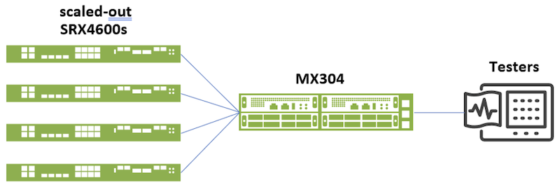

## Putting an SRX Off-Service and Bringing it Back Online

The idea of demo workflow shown below is to demonstrate capabilities of Auto-FBF scale-out approach in terms of ability to put device(s) under maintenance with low as possible impact to subscriber traffic and bring it back to service later. Unlike scaled-up systems, the blast zones in scale-out approaches are limited and generally decrease by increasing scaled-out device counts. Maintenance, e.g., software upgrade, might be possible during full operation too.

In steady state of the demo scenario, each of the four SRX4600s is receiving traffic from 256 IPv4 and 256 IPv6 client prefixes as seen in the status view at the Effective v4/v6 prefix lines below. Overall, 1024 IPv4 and 1024 prefixes are distributed by MX304 PFE across the scaled-out SRX setup.

```
root@mx304-20-re0> op auto-fbf status all
INFO: FBF modify not needed - non-forced/periodic/status run
--
Failed v4 next-hop:           []
Failed V6 next-hop:           []
--
Good v4 next-hop:             ['srx-07', 'srx-08', 'srx-09', 'srx-10']
Good V6 next-hop:             ['srx-07', 'srx-08', 'srx-09', 'srx-10']
--
Force failed v4/v6 next-hop:  []
--
Effective v4 prefix:          ['srx-07': 256, 'srx-08': 256, srx-09: 356, 55x-10: 256]
Effective v6 prefix:          ['srx-07': 256, 'srx-08': 256, srx-09: 356, 55x-10: 256]
--
Sum config v4 prefix:         1024
Sum configv6 prefix:          1024
Sum effective v4 prefix:      1024
Sum effective v6 prefix:      1024
--
Failed next-hop sig-route:    not installed
Alter-priority sig-route:     not installed
```

As for the demo traffic load, an overall 1Tbps/154M PPS of dual-stacked multi-dimensional traffic mix is processed, entire IPv4 is subjected to source NAT with port translation, connection rate equals to 750k CPS with 50/50 IPv4/IPv6 split with about 30M concurrent connection as seen in the load tool output:

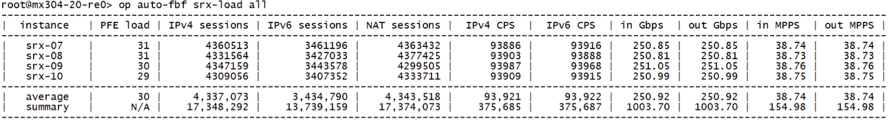

Now, during controlled fail-over conditions practically IPv6 (and IPv4 non-translated if applicable) sessions have greater chance of seamless fail-over behavior in non-synchronized firewall setups if state checks (enabled by default on SRX PFEs) get temporarily disabled. TCP packet permitted by policy, irrespective of the TCP state, will setup the session when state checks are disabled. This is an optional step but may be helpful during regular operation to reduce impact.

Sidenote - for the intended CGN/Gi firewall use-case of Auto-FBF, there is usually not so much concern as clients will re-establish their connections or QUIC UDP flows just change path. Synchronizing states across many devices is expensive and may be also a single point of failure. In the case of handling critical services along with regular subscriber traffic, Auto-FBF can have separate device group(s) consisting of synchronized clusters to preserve sessions for certain services during maintenance and failures (e.g., APNs for emergency response, premium subscriber services, ...).

To disable state checks - TCP sequence and TCP flags checks more specifically - Auto-FBF has a tool for configuring SRX devices from MX/PTX distribution device. Following disables state checks on devices planned to take over traffic of device that will put under maintenance (srx-07):

```
root@mx304-20-re0> op auto-fbf srx-state-check-off "srx-08 srx-09 srx-10"
-------------------------------------------------------
|  instance.  | old SYN/SEQ check | new SYN/SEQ check |
-------------------------------------------------------
|   srx-08    |      Enabled      |     Disabled      |
|   srx-09    |      Enabled      |     Disabled      |
|   srx-10    |      Enabled      |     Disabled      |
-------------------------------------------------------
```

Current state check settings are also seen in the sysinfo tool:

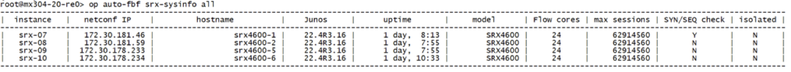

Regarding offline/online of device(s) - Auto-FBF has a mechanism for adding SRX devices(s) onto so called force-failed list, during that operation BGP sessions state stays unchanged, however filters divert traffic to other operational devices. Unlike the other Auto-FBF workflow -- isolate-on/off shutting down defined SRX interfaces -- force-failed is faster in terms of fail-over and devices are visually listed as Force failed in the status view below. Isolated devices, effectively with BGP sessions down, are among regularly Failed devices, still isolated status can be seen in above sysinfo view.

Sidenote -- another use-case is to add to the force-failed list devices in regularly failed state to control when exactly the device resumes service although already able to re-join scaled-out setup process traffic otherwise. E.g., device fails during the day, operator can flag the device as force-failed and can proceed with recovery, then the time of putting back device to production is controlled by removing from force-failed list.

Adding srx-07 device to the force-failed list splits its 256 prefixes for each address family among remaining devices (note srx-07 having 0 effective v4 and v6 prefixes while the rest increased from 256 to 341/342 prefixes):

```
root@mx304-20-re> op auto-fbf force-failed-add srx-07
WARNING: Failed/force-failed next-hop has non-zero prefix-list items! Running auto-fbf.
--
INFO: Ephemeral DB commit completed
Failed v4 next-hop:          []
Failed v6 next-hop:          []
--
Good v4 next-hop:            ['srx-07', 'srx-08', 'srx-09', 'srx-10']
Good V6 next-hop:            ['srx-07', 'srx-08', 'srx-09', 'srx-10']
--
Force failed v4/v6 next-hop: ['srx-07']
--
Effective v4 prefix:         ['srx-07': 0, 'srx-08': 342, 'srx-09': 341, 'srx-10': 341]
Effective v6 prefix:         ['srx-07': 0, 'srx-08': 342, 'srx-09': 341, 'srx-10': 341]
--
Sum config v4 prefix:        1024
Sum configv6 prefix:         1024
Sum effective v4 prefix:     1024
Sum effective v6 prefix:     1024
--
Failed next-hop sig-route:   not installed
Alter-priority  sig-route:   not installed
```

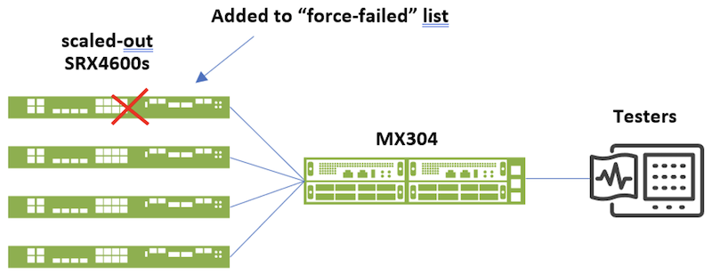

After flagging as force-failed, the Gbps/MPPS view indicates traffic moved off the srx-07 device, CPS values are not dropping over time to 0 (CPS indicator on SRX is 90s average). And the remaining three SRX devices with increased load carry on handling the 1Tbps traffic pattern.

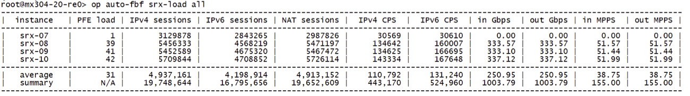

After 90s CPS are 0, then after clearing sessions in the next step (optional), only BGP/BFD sessions stay on srx-07:\

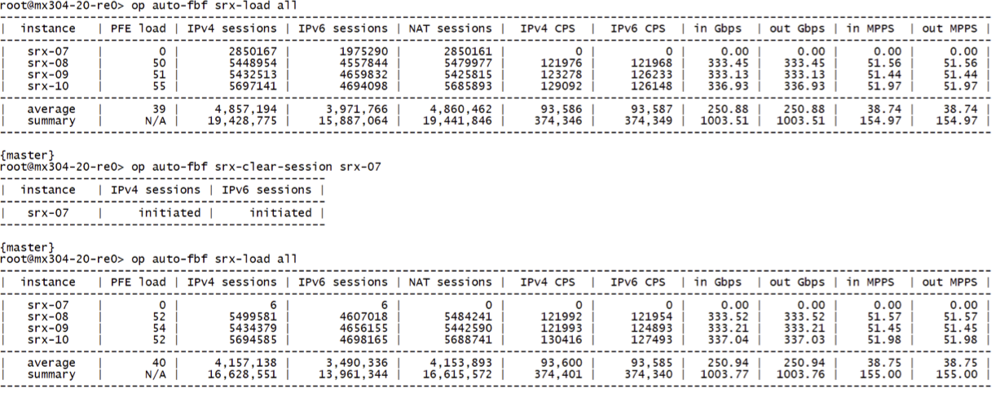

Once the traffic has been taken over by remaining devices, state checks should be enabled when disabled before. Settings will apply only to newly established sessions and previously established connections with disabled state checks will stay intact.

```
root@mx304-20-re0> op auto-fbf srx-state-check-off "srx-08 srx-09 srx-10"
-------------------------------------------------------
|  instance.  | old SYN/SEQ check | new SYN/SEQ check |
-------------------------------------------------------
|   srx-08    |      Enabled      |     Disabled      |
|   srx-09    |      Enabled      |     Disabled      |
|   srx-10    |      Enabled      |     Disabled      |
-------------------------------------------------------
```

Then, upon putting srx-07 effectively offline, especially if we'd consider longer offline period in deployment with shortage of public IPv4 addresses, re-assigning NAT resources is possible too. There is a one-device-at-a-time workflow built into Auto-FBF for expanding and reducing NAT pools. An alternative approach would be to use template tool (not covered in this TechPost -- a 3rd tech post will get published) contained within Auto-FBF to push bulk changes to any Junos configuration including NAT pools across all SRX devices in one step.

Sidenote - generally, it is more advisable to have enough NAT resources to avoid moving prefixes as reversing NAT pool changes is causing impact to clients otherwise not impacted by maintenance of the specific device. The workflow below is practically rather for emergency purposes.

Let's assume following NAT pool layout:

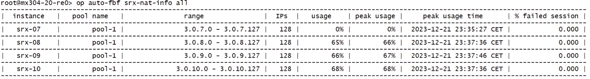

The first attempt below to allocate IP NAT pool prefix from srx-07 to srx-08 fails due to safety check for NAT IP prefix overlap/subset. In the case of srx-07 was still processing traffic, by doing such change routing would divert more specific prefix off the device for server to client direction and cause traffic impact. However, for this purpose, the force parameter of NAT pool expansion command can be used to skip safety checks. After running the commands, devices processing traffic get their pool expanded by extra /27 prefix as seen in nat-info tool (including instantiation of matching route exported to BGP):

```
root@mx304-20-re0> op auto-fbf srx-nat-pool-expand "srx-08 pool-1 3.0.7.0/27" 
ERROR: 3.0.7.0/27 overlaps with 3.0.7.0/25 on srx-07!

{master}
root@mx304-20-re0> op auto-fbf srx-nat-pool-expand "srx-08 pool-1 3.0.7.0/27 force"
-----------------------------------------
|  instance   |         status          |
-----------------------------------------
|   srx-08    |    NAT pool expanded    |
-----------------------------------------

{master}
root@mx304-20-re0> op auto-fbf srx-nat-pool-expand "srx-09 pool-1 3.0.7.32/27 force"
-----------------------------------------
|  instance   |         status          |
-----------------------------------------
|   srx-09    |    NAT pool expanded    |
-----------------------------------------

{master}
root@mx304-20-re0> op auto-fbf srx-nat-pool-expand "srx-10 pool-1 3.0.7.64/27 force"
-----------------------------------------
|  instance   |         status          |
-----------------------------------------
|   srx-10    |    NAT pool expanded    |
-----------------------------------------
```

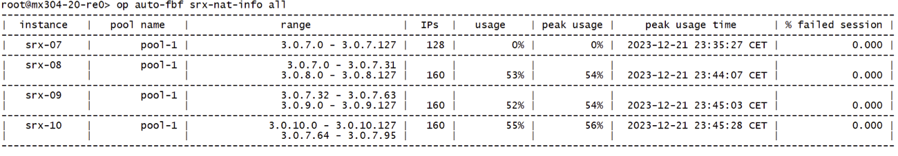

When maintenance of srx-07 is coming to an end, previously expanded NAT pools must be reduced, or the device about to be put back to services must get new NAT prefix. This is the NAT pool reduction case:

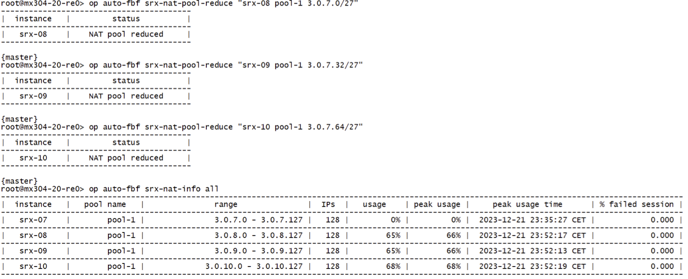

Prior reverting traffic to srx-07 device where load tool output below indicates no load, disabling state checks like below would reduce the impact like at the beginning of the procedure. Finally, removal from force-failed lists reverts traffic to srx-07 device (number of filters for srx-07 changes from 0 to 256):

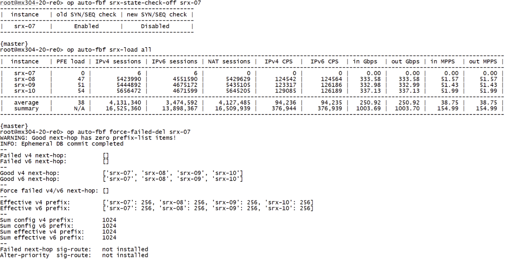

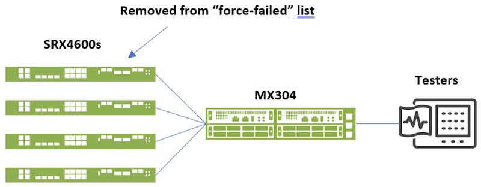

When traffic to srx-07 is resumed, also the state checks (if disabled previously) can be bulk enabled over the entire scaled-out SRX pool to prevent accidentally disabled state checks on one or more devices. Bulk change of state checks all over is doing changes only when necessary:

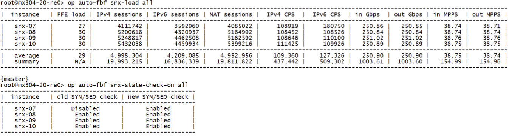

With the above procedure, the setup has been brought back to its initial state of four SRX4600s processing traffic. Practically the steps with state checks and NAT pool re-allocation could have been left out, only force-failed-add/del would have done the trick. However, the intent was to demonstrate capabilities of the Auto-FBF scale-out concept maintenance tooling to the full extent.

## Useful links

- Previous TechPost introducing Auto-FBF:
[https://juniper.github.io/techposts/scale-out-security-services-with-Auto-FBF/article](https://juniper.github.io/techposts/scale-out-security-services-with-Auto-FBF/article)
- PyEZ developer guide:
[https://www.juniper.net/documentation/us/en/software/junos-pyez/junos-pyez-developer/index.html](https://www.juniper.net/documentation/us/en/software/junos-pyez/junos-pyez-developer/index.html)
- Junos event options:
[https://www.juniper.net/documentation/us/en/software/junos/automation-scripting/topics/ref/statement/event-options-edit.html](https://www.juniper.net/documentation/us/en/software/junos/automation-scripting/topics/ref/statement/event-options-edit.html)
- Ephemeral Configuration Database:
[https://www.juniper.net/documentation/us/en/software/junos/junos-xml-protocol/topics/concept/ephemeral-configuration-database-overview.html](https://www.juniper.net/documentation/us/en/software/junos/junos-xml-protocol/topics/concept/ephemeral-configuration-database-overview.html)

## Glossary

- BGP: Border Gateway Protocol
- CPS: Connections Per Second
- CGN: Carrier-Grade NAT
- FBF: Filter-Based Forwarding
- MPPS: Million Packet Per Second
- NAT: Network Address Translation
- PFE: Packet Forwarding Engine
- POC: Proof of Concept

## Acknowledgments

Customers willing to explore alternative approaches to scale-out, account teams supporting the activities including management getting support for embedded automation methods. An Elite Juniper partner for providing feedback, sanitizing, and contributing to the code.

Finally, all the people I have the pleasure to work with - my manager Dirk Van den Borne, colleagues Steven Jacques, Mark Barrett, Pawel Rabiej, Javier Grizzuti, Dezso Csonka, Theodore Jenks, testing master guru Matthijs Nagel and the entire Amsterdam POC crew providing equipment and support.
