# Optimize your Network with Routing Director

**Masagung Nugroho 09/25/2025**

Automating the MPLS and SR network with Juniper Routing Director network optimization use case.

## Introduction

Service providers and large enterprise networks nowadays offer multiple services with different traffic criteria, e.g., high bandwidth, moderate bandwidth with moderate latency, and small bandwidth with latency-sensitive requirements, etc. These requirements are also commonly used for 5G transport network slicing in IP networks. To meet the demand, using LSP (RSVP-TE, SR-TE, or SRv6-TE) is one of the solutions.

Manual CLI configuration is time-consuming and requires a high level of operational and maintenance expertise. We need to configure every ingress router and ensure the LSP paths are reachable from every router. The strict LSP path creation also complicates the network engineer to be absolutely aware of the hop-by-hop path (i.e., P2P IP, loopback IP, adj-SID, node-SID, etc., depending on what technology is being used in the network) from the ingress to the egress router. Imagine a customer willing to add multiple nodes to expand their network, they need to manually configure numerous routers  to create new LSPs tunnels between the existing and the new nodes.

Juniper Routing Director (RD), formerly known as Paragon Automation, is built to solve this problem. It automates the LSP creation, but also the traffic steering based on defined constraints. The automation could be done via PCEP or NETCONF. RD is a multi-vendor solution by nature, hence it can also automate and monitor third-party hardware. However, I will only focus on Juniper router in this Techpost article.

You may head to this article [1], if you want to learn more about RD.

[1] [https://www.juniper.net/documentation/us/en/quick-start/software/juniper-routing-director2.5.0/rd-quick-start-guide/](https://www.juniper.net/documentation/us/en/quick-start/software/juniper-routing-director2.5.0/rd-quick-start-guide/)

## Topology Connection Infrastructure

The high-level topology below describes how the routers communicate with RD:

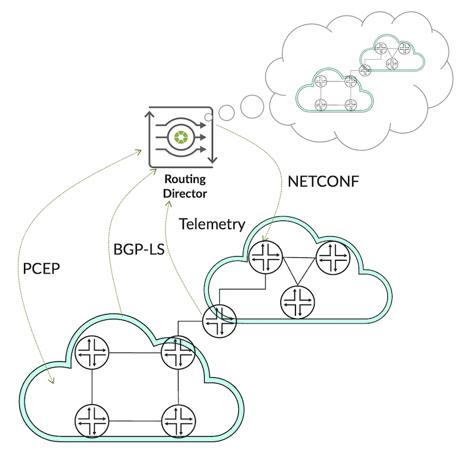

There are some essential key protocols to enable the communication:

1. BGP-LS (BGP Link State): this connection is required for Routing Director to learn the full IGP topology, metric, bandwidth, delay, Segment-ID information and many more. BGP-LS is a standard defined on RFC8571.
2. PCEP (Path Computation Element Protocol): protocol used  between routers, or Path Computation Client, and the Routing Director (Path Computation Element). PCEP is based on RFC5440 and the PCEP extension function is defined in RFC8231 (Stateful-PCE), RFC8281(PCE-Initiated LSP), SR-PCE ,etc.
3. NETCONF (Network Configuration Protocol) over SSH: provides fine-grained structured configuration management. In this case, routers are NETCONF servers and RD is the NETCONF client. NETCONF is a standard based on RFC6241.

## Demonstration Topology

I will use the same topology (figure 2) than my previous Techpost article (Service Orchestration in RD) with the addition of SR-MPLS (ISIS) as an underlay protocol. If you have not read it yet, [please go here](https://juniper.github.io/techposts/service-orchestration-with-paragon-automation/article).

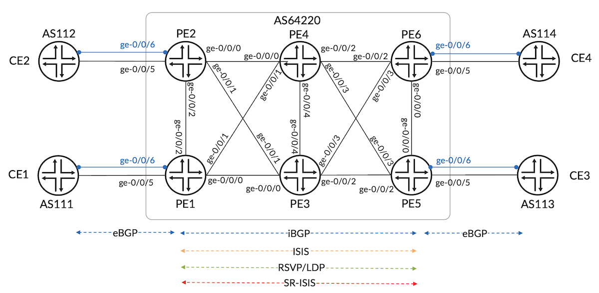

RD offers real-time topology discovery by BGP-LS. When the devices are connected by IGP, the topology can be visualized on the GUI depicted in Figure 3. Routing Director 2.5 (Figure 4) and Junos 23.4R1.9 are used in this demonstration.

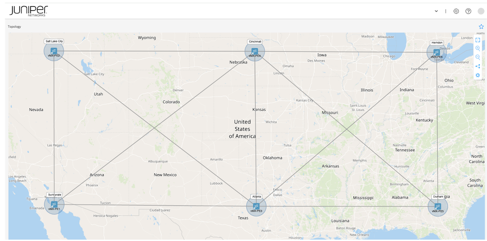

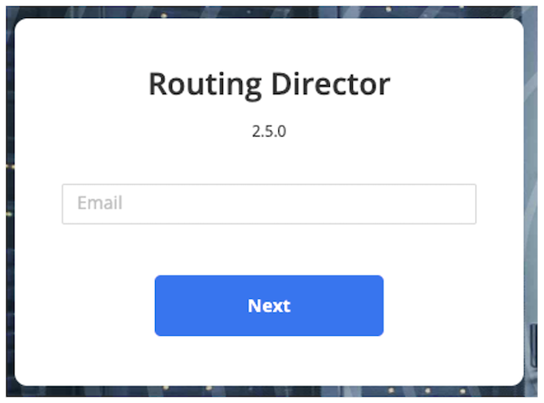

```
jcluser@vMX-PE1> show version
Hostname: vMX-PE1
Model: vmx
Junos: 23.4R1.9
JUNOS OS Kernel 64-bit [20231122.ee0e992_builder_stable_12_234]
JUNOS OS libs [20231122.ee0e992_builder_stable_12_234]
JUNOS OS runtime [20231122.ee0e992_builder_stable_12_234]
[...]
```

Let's verify the prerequisite connectivity from the router perspective.

**BGP-LS connection to RD.**

```
jcluser@vMX-PE2> show bgp summary 
Threading mode: BGP I/O
Default eBGP mode: advertise - accept, receive - accept
Groups: 3 Peers: 7 Down peers: 1
Unconfigured peers: 1
Table          Tot Paths  Act Paths Suppressed    History Damp State    Pending
lsdist.0             
                       0          0          0          0          0          0
bgp.l3vpn.0          
                       0          0          0          0          0          0
bgp.evpn.0           
                       1          1          0          0          0          0
inet.0               
                       0          0          0          0          0          0
inet6.0              
                       0          0          0          0          0          0
Peer                     AS      InPkt     OutPkt    OutQ   Flaps Last Up/Dwn State|#Active/Received/Accepted/Damped...
1.1.192.0             64220       3749       3726       0       0  1d 4:26:02 Establ
  bgp.l3vpn.0: 0/0/0/0
  bgp.evpn.0: 0/0/0/0
  bc7e1b55-7c1a-11f0-8e80-2abea23635c2.evpn.0: 0/0/0/0
  __default_evpn__.evpn.0: 0/0/0/0
2.2.2.0               64220       3750       3726       0       0  1d 4:25:50 Establ
  bgp.l3vpn.0: 0/0/0/0
  bgp.evpn.0: 0/0/0/0
  bc7e1b55-7c1a-11f0-8e80-2abea23635c2.evpn.0: 0/0/0/0
  __default_evpn__.evpn.0: 0/0/0/0
2.2.2.2               64220       3748       3726       0       0  1d 4:25:49 Establ
  bgp.l3vpn.0: 0/0/0/0
  bgp.evpn.0: 0/0/0/0
  bc7e1b55-7c1a-11f0-8e80-2abea23635c2.evpn.0: 0/0/0/0
  __default_evpn__.evpn.0: 0/0/0/0
2.2.2.3               64220       3749       3726       0       0  1d 4:25:54 Establ
  bgp.l3vpn.0: 0/0/0/0
  bgp.evpn.0: 0/0/0/0
  bc7e1b55-7c1a-11f0-8e80-2abea23635c2.evpn.0: 0/0/0/0
  __default_evpn__.evpn.0: 0/0/0/0
3.3.3.0               64220       3751       3727       0       0  1d 4:26:05 Establ
  bgp.l3vpn.0: 0/0/0/0
  bgp.evpn.0: 1/1/1/0
  bc7e1b55-7c1a-11f0-8e80-2abea23635c2.evpn.0: 1/1/1/0
  __default_evpn__.evpn.0: 0/0/0/0
100.123.42.4          64220       3790      25469       0       0  1d 4:27:14 Establ
  lsdist.0: 0/0/0/0
192.168.2.1             112          0          0       0       0  1d 4:27:46 Idle  
```

Topology information advertisement from router to RD.

```
jcluser@vMX-PE2> show route advertising-protocol bgp 100.123.42.4 

lsdist.0: 98 destinations, 98 routes (98 active, 0 holddown, 0 hidden)
  Prefix                  Nexthop              MED     Lclpref    AS path
  NODE { AS:64220 ISO:0010.0119.2000.00 ISIS-L1:0 }/1216                  
*                         Self                         100        I
                IPv4 Router-ids:
                  1.1.192.0
                Area border router: No
                External router: No
                Attached: No
                Overload: No
                Hostname: vMX-PE3
                Area membership:
                  49 00 03 
                SPRING-Capabilities:
                 - SRGB block [Start: 16000, Range: 8000, Flags: 0xc0]
                SPRING-Algorithms:
                 - Algo: 0
                 - Algo: 1
                 - Algo: 129
                SPRING Flex-Algorithms Definition:
                 - Flex-Algo: 129
                   Metric: 0, Calc: 0, Priority: 100
                    - Flags: 0x00000000
                Node MSD:
                 - Type: 1, Value: 3
                 - Type: 2, Value: 16
Prefix                  Nexthop              MED     Lclpref    AS path
  LINK { Local { AS:64220 ISO:0010.0119.2000.00 }.{ IPv4:11.11.11.1 } Remote { AS:64220 ISO:0020.0200.2002.00 }.{ IPv4:11.11.11.2 } ISIS-L1:0 }/1216                  
*                         Self                         100        I
                Color: 0
                Maximum bandwidth: 1000Mbps
                Reservable bandwidth: 1000Mbps
                Unreserved bandwidth by priority:
                  0   1000Mbps
                  1   1000Mbps
                  2   1000Mbps
                  3   1000Mbps
                  4   1000Mbps
                  5   1000Mbps
                  6   1000Mbps
                  7   1000Mbps
                Metric: 10
                TE Metric: 10
                Average delay: 809
                Minimum delay: 645      
                Maximum delay: 1112
                Delay variation: 184
                Label: 25, Flags: 0x30, Weight: 0
                Link MSD:
                 - Type: 1, Value: 3
[...]
```

PCE connection from router to RD.

```
jcluser@vMX-PE1> show configuration protocols pcep | display inheritance no-comments 
disable-multipath-capability;
pce pso-pce-server {
    destination-ipv4-address 100.123.42.9;
    pce-type active stateful;
    lsp-provisioning;
    spring-capability;
    delegation-cleanup-timeout 10;
    pce-traffic-steering;
}

jcluser@vMX-PE1> show path-computation-client status                                                             

Session              Type                        Provisioning   Status         Uptime
  pso-pce-server     Stateful Active             On             Up              102875      

LSP Summary
  Total number of LSPs        : 20       
  Static LSPs                 : 8        
  Externally controlled LSPs  : 0        
  Externally provisioned LSPs : 12/16000 (current/limit)
  Orphaned LSPs               : 0        

pso-pce-server (main)
  Delegated              : 0               
[...]
```

NETCONF connection from router to RD (RD uses port 2200).

```
jcluser@vMX-PE1> show configuration system services 
netconf {
    ssh {
        rate-limit 20;
    }
}

jcluser@vMX-PE1> show system connections | match 2200 
tcp4       0      0  100.123.1.4.62479                             100.123.42.100.2200                           ESTABLISHED


[...]
```

Since all prerequisite protocols are clear, let's head up to the use cases.

## Demonstration Use Cases

I will demonstrate the following use cases :

1. RSVP-TE PCEP tunnel link diversity
2. RSVP-TE Netconf tunnel creation and delegation
3. SR-TE PCEP Flex-algo delay-based constraint tunnel
4. SR-TE full mesh path intent creation

### 1. RSVP-TE PCEP tunnel link diversity

The objective is to demonstrate that RD could automate the creation of two active paths using different links from ingress to egress. Diversity tunnel is commonly used for critical service that has strict requirements for resiliency.

I will create diversity tunnels from PE1 to PE6 for this use case.

First, we need to go to Observability --> Network --> Topology.

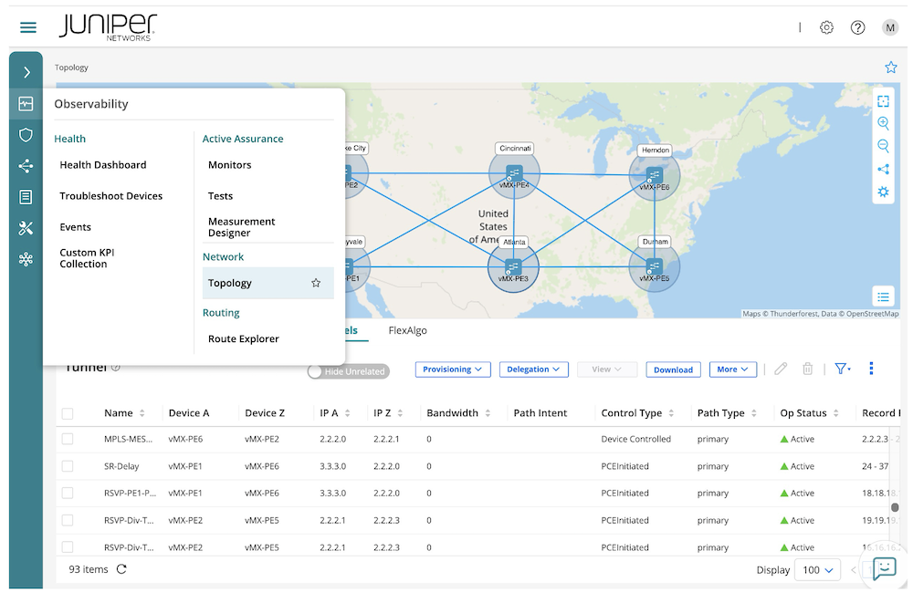

Then, we go to the Tunnels tab to create the Diverse Tunnels.

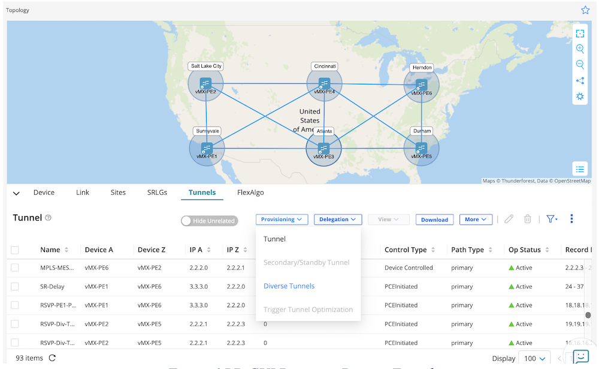

We define the following variables in the GUI:

- Provisioning Method: PCEP
- Provision Type: RSVP
- Diversity Group: Div-Tunnel
- Diversity Level: Link
- Tunnel 1 Name: Div-Tunnel1
- Device A: vMX-PE1
- Device Z: vMX-PE6
- Tunnel 2 Name: Div-Tunnel2
- Device A: vMX-PE1
- Device Z: vMX-PE6
- And the click "Add"

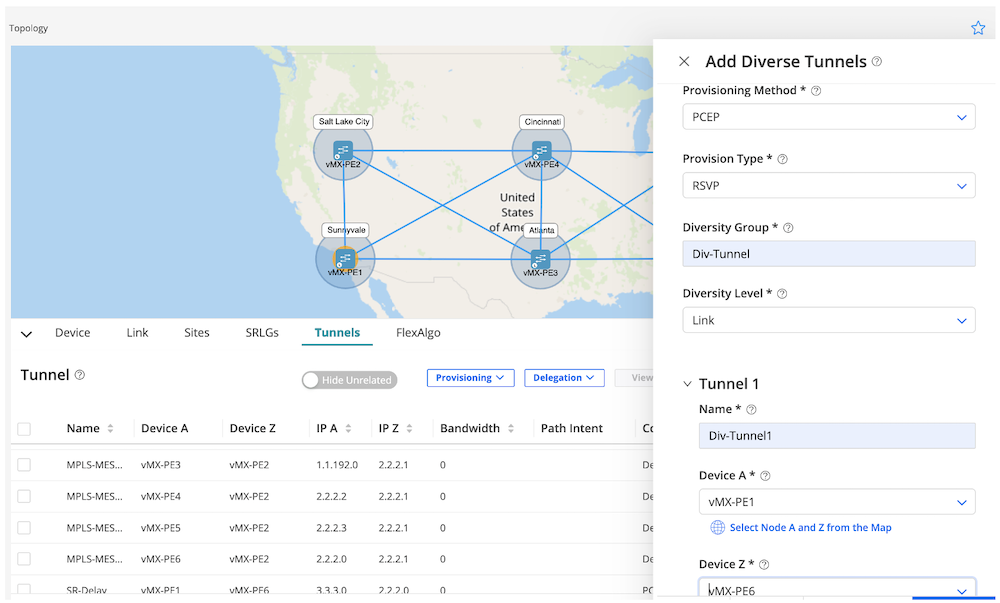

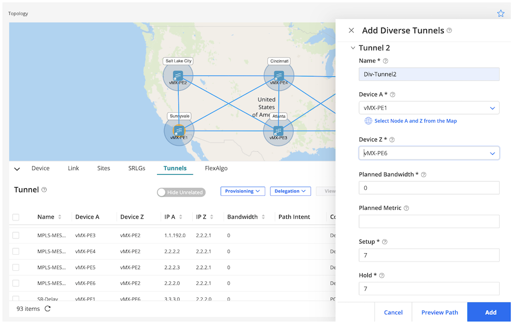

We see in that the tunnels were successfully created with different paths.

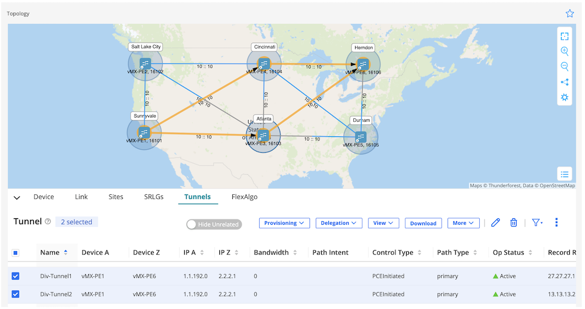

Now, let's check from the router side.

```
jcluser@vMX-PE1> show mpls lsp ingress 
Ingress LSP: 7 sessions
To              From            State Rt P     ActivePath       LSPname
2.2.2.1         1.1.192.0       Up     0 *                      Div-Tunnel1
2.2.2.1         1.1.192.0       Up     0 *                      Div-Tunnel2
1.1.192.2       1.1.192.0       Up     0 *                      MPLS-MESH-from-vMX-PE1-to-vMX-PE2
2.2.2.2         1.1.192.0       Up     0 *                      MPLS-MESH-from-vMX-PE1-to-vMX-PE3
2.2.2.0         1.1.192.0       Up     0 *                      MPLS-MESH-from-vMX-PE1-to-vMX-PE4
1.1.192.1       1.1.192.0       Up     0 *                      MPLS-MESH-from-vMX-PE1-to-vMX-PE5
2.2.2.1         1.1.192.0       Up     0 *                      MPLS-MESH-from-vMX-PE1-to-vMX-PE6

jcluser@vMX-PE1> show mpls lsp ingress name Div-Tunnel1 detail 
Ingress LSP: 7 sessions

2.2.2.1
  From: 1.1.192.0, State: Up, ActiveRoute: 0, LSPname: Div-Tunnel1, LSPid: 7
  ActivePath:  (primary)
  LSPtype: Externally provisioned, Penultimate hop popping
  LSP Control Status: Externally controlled
  LoadBalance: Random
  Follow destination IGP metric
  Encoding type: Packet, Switching type: Packet, GPID: IPv4
  LSP Self-ping Status : Enabled
 *Primary                    State: Up
    Priorities: 7 7
    External Path CSPF Status: external
    SmartOptimizeTimer: 180
    Flap Count: 0
    MBB Count: 0
    Externally Computed ERO (S [L] denotes strict [loose] hops):
 27.27.27.1 S 31.31.31.2 S 
    Received RRO (ProtectionFlag 1=Available 2=InUse 4=B/W 8=Node 10=SoftPreempt 20=Node-ID):
          27.27.27.1(Label=41) 31.31.31.2(Label=3)
Total 1 displayed, Up 1, Down 0

jcluser@vMX-PE1> show mpls lsp ingress name Div-Tunnel2 detail    
Ingress LSP: 7 sessions

2.2.2.1
  From: 1.1.192.0, State: Up, ActiveRoute: 0, LSPname: Div-Tunnel2, LSPid: 8
  ActivePath:  (primary)
  LSPtype: Externally provisioned, Penultimate hop popping
  LSP Control Status: Externally controlled
  LoadBalance: Random
  Follow destination IGP metric
  Encoding type: Packet, Switching type: Packet, GPID: IPv4
  LSP Self-ping Status : Enabled
 *Primary                    State: Up
    Priorities: 7 7
    External Path CSPF Status: external
    SmartOptimizeTimer: 180
    Flap Count: 0
    MBB Count: 0
    Externally Computed ERO (S [L] denotes strict [loose] hops):
 13.13.13.2 S 16.16.16.1 S 
    Received RRO (ProtectionFlag 1=Available 2=InUse 4=B/W 8=Node 10=SoftPreempt 20=Node-ID):
          13.13.13.2(Label=30) 16.16.16.1(Label=3)
Total 1 displayed, Up 1, Down 0
```

****Let's simulate a link failure to check the link diversity consistency. I will create a link fiber cut between PE1 (ge-0/0/0) and PE3 (ge-0/0/0).

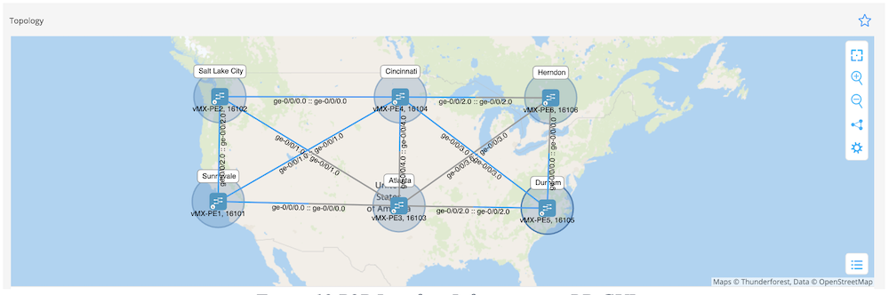

```
jcluser@vMX-PE1# show | compare 
[edit groups paragon-service-orchestration interfaces ge-0/0/0]
+   disable;

jcluser@vMX-PE1# commit and-quit 
warning: Could not connect to re1 : No route to host
warning: Cannot connect to other RE, ignoring it
kenv: unable to get vmtype
commit complete
Exiting configuration mode

jcluser@vMX-PE1> show isis adjacency 
Interface             System         L State         Hold (secs) SNPA
ge-0/0/0.0            vMX-PE3        3  Down                   0
ge-0/0/1.0            vMX-PE4        3  Up                    26
ge-0/0/2.0            vMX-PE2        3  Up                    25
```

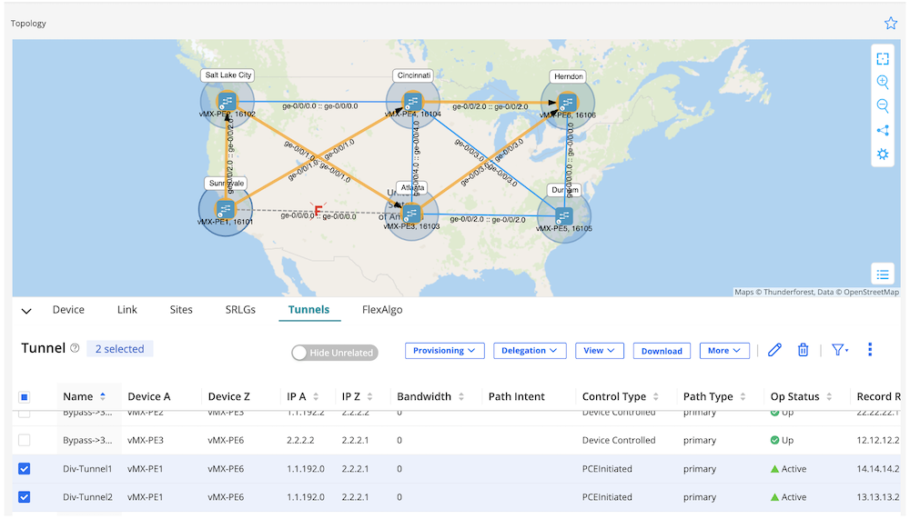

We can see the result in figure 11: RD will announce two important things:

1. Link between PE1 and PE6 is declared down and a dotted line with "F" (Fail) link is represented in the topology GUI.  It will not being used for traffic.
2. Div-Tunnel1 LSP initially used the PE1 >< PE3 link. It's now rerouted through other path (in this demo to PE1 >< PE2 link) and we still maintain the link diversity constraint with Div-Tunnel2 LSP.

Furthermore, starting from RD2.5, we can track the tunnel changes with complete detailed information, including timestamp and record route.

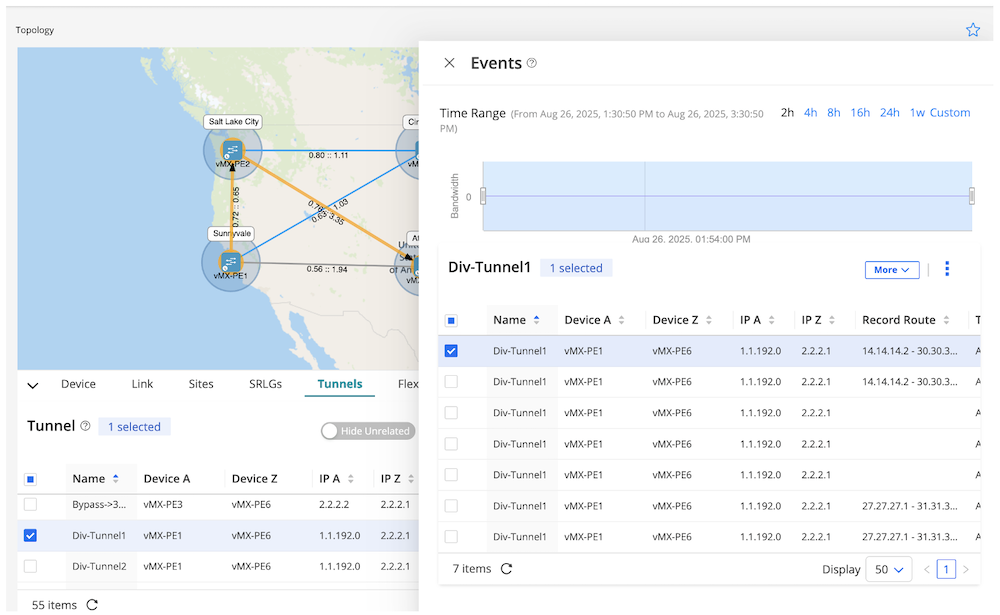

### 2. RSVP-TE Netconf tunnel creation and delegation

Let's demonstrate we can create an RSVP-TE tunnel and associate it with the CLI configuration. This will result in the control type from RD GUI being "Device Controlled". The LSP is initiated from RD but is statically controlled by the router itself.

We can delegate it to RD after the LSP is successfully created. The RD will take control of the LSP, the control type  becomes "Delegated".

I will create a tunnel from PE2 to PE5 for this use case.

First, we go to Tunnels --> Provisioning and we define key variables in the GUI:

- Provisioning Method: NETCONF
- Provision Type: RSVP
- Name: Netconf-LSP
- Device A: vMX-PE2
- Device B: vMX-PE5
- Routing Method: Routed by Device

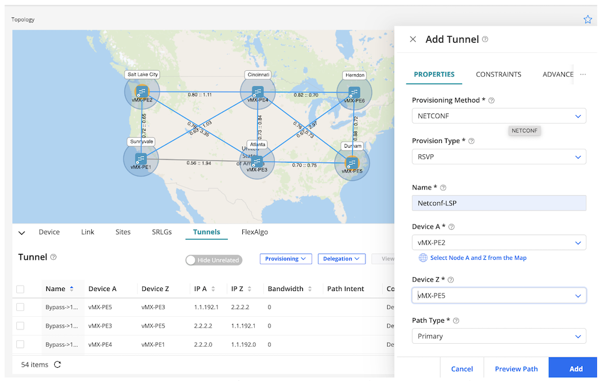

Click Add after finishing defining everything.

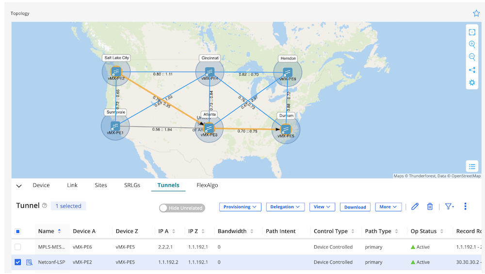

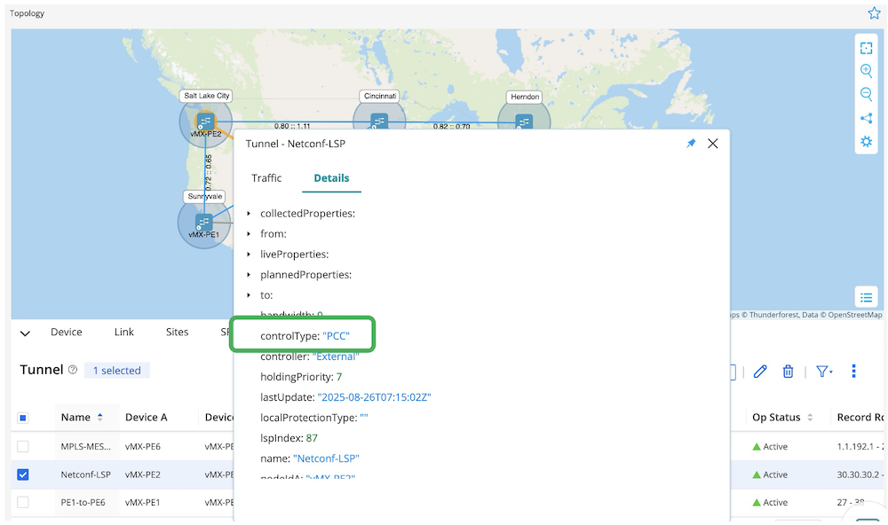

We can see in and that the LSP has been successfully created.

Let's check from the PE2 router:

```
jcluser@vMX-PE2> show mpls lsp ingress 
Ingress LSP: 6 sessions
To              From            State Rt P     ActivePath       LSPname
1.1.192.0       1.1.192.2       Up     0 *                      MPLS-MESH-from-vMX-PE2-to-vMX-PE1
2.2.2.2         1.1.192.2       Up     0 *                      MPLS-MESH-from-vMX-PE2-to-vMX-PE3
2.2.2.0         1.1.192.2       Up     0 *                      MPLS-MESH-from-vMX-PE2-to-vMX-PE4
1.1.192.1       1.1.192.2       Up     0 *                      MPLS-MESH-from-vMX-PE2-to-vMX-PE5
2.2.2.1         1.1.192.2       Up     0 *                      MPLS-MESH-from-vMX-PE2-to-vMX-PE6
1.1.192.1       1.1.192.2       Up     0 *     Netconf-LSP      Netconf-LSP

jcluser@vMX-PE2> show configuration protocols mpls 
label-switched-path Netconf-LSP {
    from 1.1.192.2;
    to 1.1.192.1;
    adaptive;
    primary Netconf-LSP {
        bandwidth 0;
        priority 7 7;
    }
}
path Netconf-LSP;

jcluser@vMX-PE2> show mpls lsp name Netconf-LSP detail 
Ingress LSP: 6 sessions

1.1.192.1
  From: 1.1.192.2, State: Up, ActiveRoute: 0, LSPname: Netconf-LSP, LSPid: 7
  ActivePath: Netconf-LSP (primary)
  LSPtype: Static Configured, Penultimate hop popping
  LoadBalance: Random
  Follow destination IGP metric
  Encoding type: Packet, Switching type: Packet, GPID: IPv4
  LSP Self-ping Status : Enabled
 *Primary   Netconf-LSP      State: Up
    Priorities: 7 7
    SmartOptimizeTimer: 180
    Flap Count: 0
    MBB Count: 0
    Computed ERO (S [L] denotes strict [loose] hops): (CSPF metric: 20)
 30.30.30.2 S 12.12.12.2 S 
    Received RRO (ProtectionFlag 1=Available 2=InUse 4=B/W 8=Node 10=SoftPreempt 20=Node-ID):
          30.30.30.2(Label=47) 12.12.12.2(Label=3)
Total 1 displayed, Up 1, Down 0
```

****

RD2.5 successfully provisioned the Netconf-LSP tunnel via NETCONF, and the tunnel configuration appeared in CLI. I will delegate this Netconf-LSP to Routing Director for the next step.

We need to select in the list: Netconf-LSP --> Delegation --> Configure Delegation

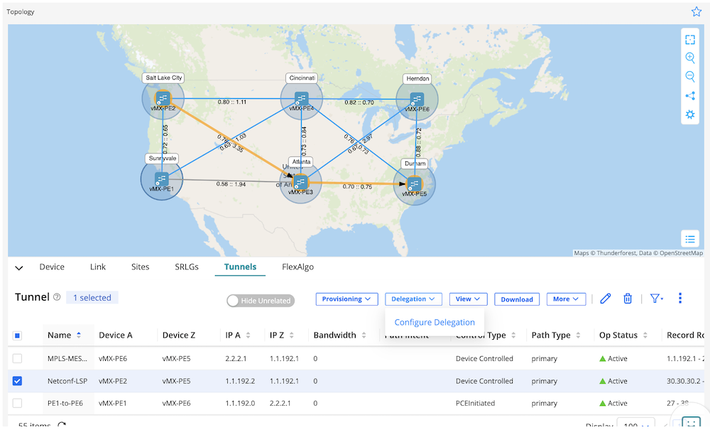

Select Netconf-LSP and click on "Delegate LSP"

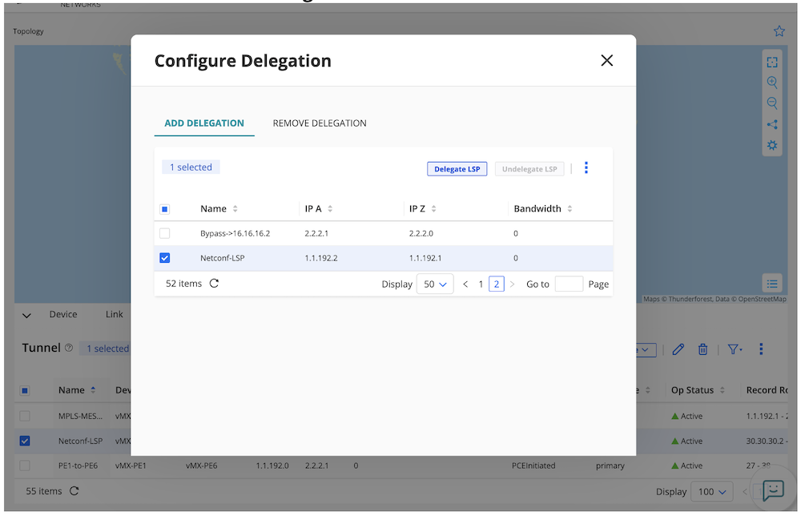

Once successful, RD GUI will provide the new information for this LSP.

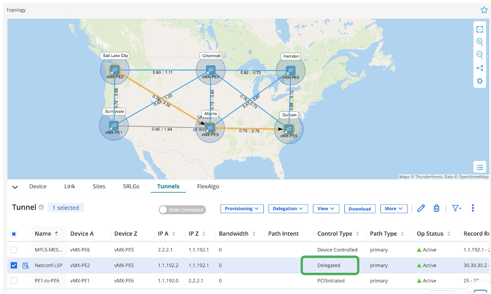

The new details are also reflected in the router:

```
jcluser@vMX-PE2> show configuration protocols mpls        
sensor-based-stats;
label-switched-path Netconf-LSP {
    from 1.1.192.2;
    to 1.1.192.1;
    adaptive;
    primary Netconf-LSP {
        bandwidth 0;
        priority 7 7;
    }
    lsp-external-controller pccd;  Additional command added after control type change
}
path Netconf-LSP;

jcluser@vMX-PE2> show mpls lsp name Netconf-LSP detail 
Ingress LSP: 6 sessions

1.1.192.1
  From: 1.1.192.2, State: Up, ActiveRoute: 0, LSPname: Netconf-LSP, LSPid: 7
  ActivePath: Netconf-LSP (primary)
  LSPtype: Externally controlled - static configured, Penultimate hop popping
  LSP Control Status: Externally controlled -> the LSP is now controlled by RD
  LoadBalance: Random
  Follow destination IGP metric
  Encoding type: Packet, Switching type: Packet, GPID: IPv4
  LSP Self-ping Status : Enabled
 *Primary   Netconf-LSP      State: Up
    Priorities: 7 7
    External Path CSPF Status: external
    SmartOptimizeTimer: 180
    Flap Count: 0
    MBB Count: 0
    Received RRO (ProtectionFlag 1=Available 2=InUse 4=B/W 8=Node 10=SoftPreempt 20=Node-ID):
          30.30.30.2(Label=47) 12.12.12.2(Label=3)
Total 1 displayed, Up 1, Down 0
```

### 3. SR-TE PCEP Flex-algo delay-based constraint tunnel

- PE1: Flex-algo 128 and 129
- PE2: Flex-algo 129
- PE3: Flex-algo 129
- PE4: Flex-algo 128
- PE5: Flex-algo 128
- PE6: Flex-algo 128 and 129

Some configurations in the router are mandatory to ensure SR-TE flex-algo with delay-based constraint will behave properly.

Configuration from PE1:

```
jcluser@vMX-PE1# 
set protocols isis source-packet-routing srgb start-label 16000
set protocols isis source-packet-routing srgb index-range 8000
set protocols isis source-packet-routing node-segment ipv4-index 101
set protocols isis source-packet-routing flex-algorithm 128
set protocols isis source-packet-routing flex-algorithm 129
set protocols source-packet-routing lsp-external-controller pccd
set protocols pcep pce pso-pce-server spring-capability
set routing-options flex-algorithm 128 definition metric-type te-metric
set routing-options flex-algorithm 128 definition priority 100
set routing-options flex-algorithm 128 color 128
set routing-options flex-algorithm 129 definition metric-type te-metric
set routing-options flex-algorithm 129 definition priority 100
set routing-options flex-algorithm 129 color 129
set services rpm twamp server authentication-mode none
set services rpm twamp server light
set groups p2p-protocols protocols isis interface <*> delay-measurement
```

Next step, we verify the SR-TE in this router:

```
jcluser@vMX-PE1> show isis overview 
Instance: master
  Router ID: 1.1.192.0
  Hostname: vMX-PE1
  Sysid: 0010.0119.2000
  Areaid: 49.0003
  Adjacency holddown: enabled
  Maximum Areas: 3
  LSP life time: 1200
  Attached bit evaluation: enabled
  SPF delay: 200 msec, SPF holddown: 5000 msec, SPF rapid runs: 3
  IPv4 is enabled, IPv6 is enabled, SPRING based MPLS is enabled
  Traffic engineering: enabled
  Traffic engineering v6: disabled
  Restart: Disabled
    Helper mode: Enabled
  Layer2-map: Disabled
  Source Packet Routing (SPRING): Enabled
    SRGB Config Range :
      SRGB Start-Label : 16000, SRGB Index-Range : 8000
    SRGB Block Allocation: Success
      SRGB Start Index : 16000, SRGB Size : 8000, Label-Range: [ 16000, 23999 ]
    Node Segments: Enabled
      Ipv4 Index : 101
    SRv6: Disabled
 ...Truncated...

jcluser@vMX-PE1> show isis database level 2 flex-algorithm-id 128 
IS-IS level 2 link-state database:
LSP ID                      Sequence Checksum Lifetime Attributes
vMX-PE1.00-00                  0x10e   0xe161     1145 L1 L2
vMX-PE5.00-00                  0x108   0x9d33     1131 L1 L2
vMX-PE4.00-00                   0x27   0x63a9      879 L1 L2
vMX-PE4.00-01                  0x19a   0xa353     1192 L1 L2
vMX-PE6.00-00                  0x108   0x5e56     1140 L1 L2
  5 LSPs

jcluser@vMX-PE1> show isis database level 2 flex-algorithm-id 129    
IS-IS level 2 link-state database:
LSP ID                      Sequence Checksum Lifetime Attributes
vMX-PE1.00-00                  0x10e   0xe161     1143 L1 L2
vMX-PE2.00-00                  0x106   0xc608     1128 L1 L2
vMX-PE6.00-00                  0x109    0xffb     1194 L1 L2
vMX-PE3.00-00                   0x2b   0x649b      608 L1 L2
vMX-PE3.00-01                  0x19f   0xcccd     1179 L1 L2
  5 LSPs
```

In addition of SR information, delay-measurement and Flex-algo details are also advertised to Routing Director.

```
jcluser@vMX-PE6> show ted database extensive 
TED database: 6 ISIS nodes 6 INET nodes 0 INET6 nodes
NodeID: vMX-PE1.00(1.1.192.0)
  Type: Rtr, Age: 77 secs, LinkIn: 3, LinkOut: 3
  Protocol: IS-IS(2)
   1.1.192.0
    To: vMX-PE4.00(2.2.2.0), Local: 13.13.13.1, Remote: 13.13.13.2
      Local interface index: 335, Remote interface index: 334
      Color: 0 <none>
      Metric: 10
      IGP metric: 10
      Average delay: 1540
      Minimum delay: 697
      Maximum delay: 6612
      Delay variation: 2886
      Static BW: 10Mbps
      Reservable BW: 10Mbps
      Available BW [priority] bps:
          [0] 10Mbps       [1] 10Mbps      [2] 10Mbps      [3] 10Mbps      
          [4] 10Mbps       [5] 10Mbps      [6] 10Mbps      [7] 10Mbps      
      Interface Switching Capability Descriptor(1):
        Switching type: Packet
        Encoding type: Packet
        Maximum LSP BW [priority] bps:
          [0] 10Mbps       [1] 10Mbps      [2] 10Mbps      [3] 10Mbps      
          [4] 10Mbps       [5] 10Mbps      [6] 10Mbps      [7] 10Mbps      
      P2P Adjacency-SID:
        IPV4, SID: 25, Flags: 0x30, Weight: 0
      Link MSD:
         - Type: 1, Value: 3
    To: vMX-PE3.00(2.2.2.2), Local: 27.27.27.2, Remote: 27.27.27.1
      Local interface index: 334, Remote interface index: 333
      Color: 0 <none>
      Metric: 10
      IGP metric: 10
      Average delay: 687
      Minimum delay: 513
      Maximum delay: 842
      Delay variation: 173
      Static BW: 10Mbps
      Reservable BW: 10Mbps
      Available BW [priority] bps:
          [0] 10Mbps       [1] 10Mbps      [2] 10Mbps      [3] 10Mbps      
          [4] 10Mbps       [5] 10Mbps      [6] 10Mbps      [7] 10Mbps      
      Interface Switching Capability Descriptor(1):
        Switching type: Packet
        Encoding type: Packet
        Maximum LSP BW [priority] bps:
          [0] 10Mbps       [1] 10Mbps      [2] 10Mbps      [3] 10Mbps      
          [4] 10Mbps       [5] 10Mbps      [6] 10Mbps      [7] 10Mbps      
      P2P Adjacency-SID:
        IPV4, SID: 27, Flags: 0x30, Weight: 0
      Link MSD:
         - Type: 1, Value: 3 
   SPRING-Capabilities:
     SRGB block [Start: 16000, Range: 8000, Flags: 0xc0]
   SPRING-Algorithms:
     Algo: 0
     Algo: 1
     Algo: 128
     Algo: 129
   SPRING Flex-Algorithms:
     Flex-Algo: 128                     
        Metric: 2, Calc: 0, Prio: 100
        Flags: 0x00000000
     Flex-Algo: 129
        Metric: 2, Calc: 0, Prio: 100
        Flags: 0x00000000
   Node MSD:
      - Type: 1, Value: 3
      - Type: 2, Value: 16
[...]
```

Looks like everything is working perfectly from the router perspective, let's do a quick check in RD, shall we?

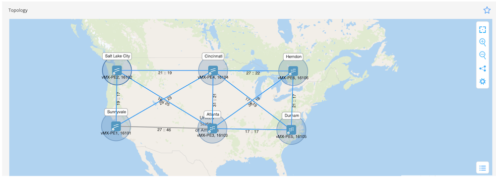

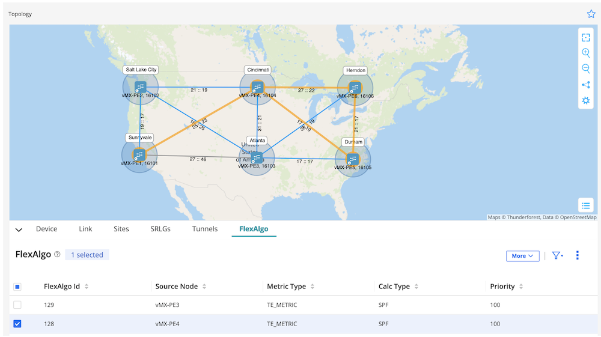

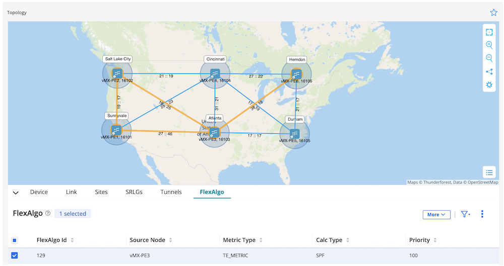

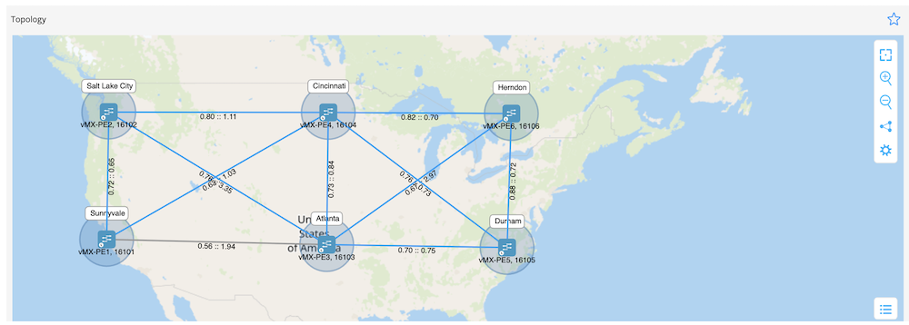

We can see in Figures 19, 20, 21 and 22 that all SR information (node-SID and Adj-SID), Flex-algo and delay-measurement details are aligned with the routers outputs.

Let's provision our intended SR-TE now. I will create an SR-TE tunnel from PE6 to PE1 for this use case.

First, we go to Tunnels --> Provisioning and  we define important variables in the GUI:

- Provisioning Method: PCEP
- Provision Type: SR
- Name: SRTE-Delay-FlexAlgo-128
- Device A: vMX-PE6
- Device B: vMX-PE1
- Routing Method: Delay
- FlexAlgo ID: 128
- Constraints Maximum Delay: 150ms

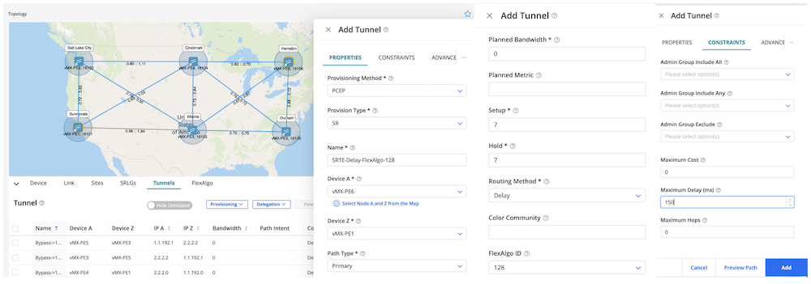

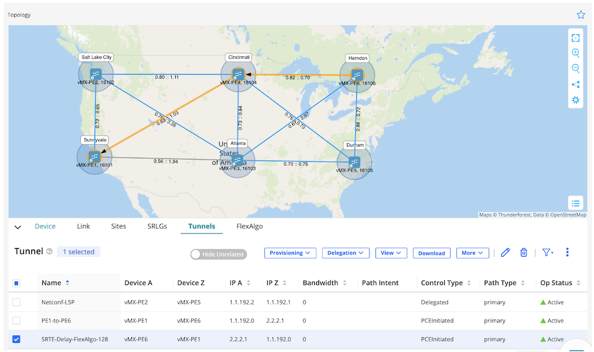

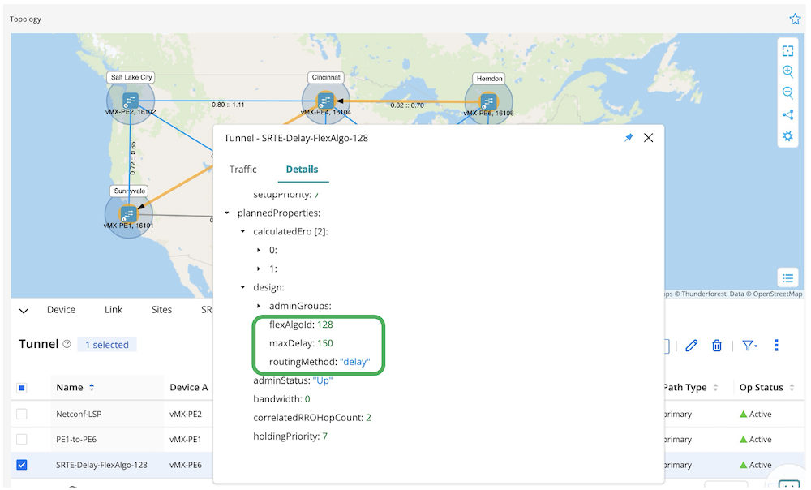

After the tunnel has been successfully created, we'll need to exceed the 150ms maximum delay to prove the delay constraint works well. I will statically advertise 250ms delay variation via ISIS IGP protocol for the link PE6 (ge-0/0/2) >< PE4 link (ge-0/0/2) to test this.

```
jcluser@vMX-PE6# set protocols isis interface ge-0/0/2 delay-metric 250000
jcluser@vMX-PE6# show | compare 
[edit groups paragon-service-orchestration protocols isis interface ge-0/0/2.0]
+    delay-metric 250000;
jcluser@vMX-PE6> show ted database extensive | match 250000 
      Average delay: 250000
      Minimum delay: 250000
```

Delay-metric information will be advertised to RD.

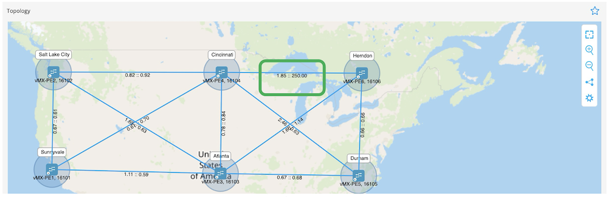

The tunnel is automatically rerouted via the other Flex-algo 128 link where the measured delay is still below the defined threshold.

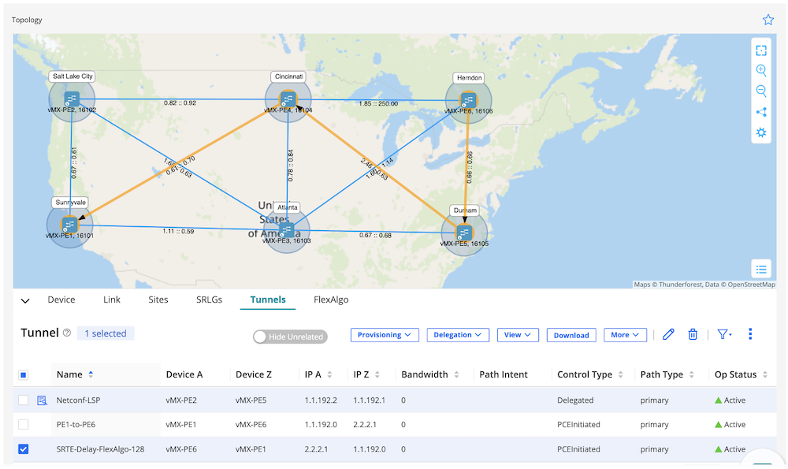


Next, I will also violate the last Flex-algo 128 link by statically advertising 250ms delay-metric information.

```
jcluser@vMX-PE6# set protocols isis interface ge-0/0/0 delay-metric 250000
jcluser@vMX-PE6# show | compare 
[edit groups paragon-service-orchestration protocols isis interface ge-0/0/2.0]
+    delay-metric 250000;
jcluser@vMX-PE6> show ted database extensive | match 250000 
      Average delay: 250000
      Minimum delay: 250000
  Average delay: 250000
      Minimum delay: 250000
```

As expected, the tunnel is declared down for two reasons:

1. There is no more resource of Flex-algo 128 link in the topology (remember that PE3 is part of Flex-algo 129, hence PE3 >< PE6 link is not part of the Flex-algo 128 resource)
2. All Flex-algo 128 available links are exceeding the 150ms maximum delay constraint

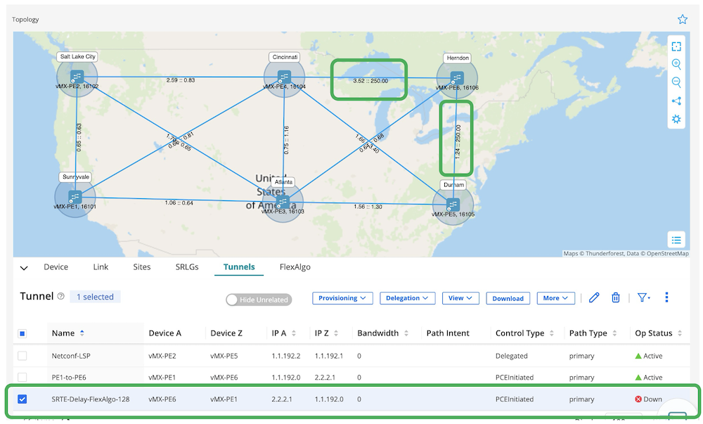

This test case proves that RD2.5 can handle multiple constraint tunnels.

### 4. SR-TE full mesh path intent creation

Imagine we have hundreds of routers in the network and we need to create a new full mesh LSP traffic engineering. A service provider wants to upgrade the network from MPLS-based LDP/RSVP to SR-MPLS, and SR-TE is mandatory. Configuring routers manually via the CLI will be a tedious and error-prone effort.

Routing Director introduced a new feature in RD2.5 version to overcome this problem. It's called *Network Optimization Intent*. **It can automate and create a full mesh LSP with only a few steps. I will show you how easy it is with RD in this last use case.

First, we need to go to the "Network Optimization Intent" tab.

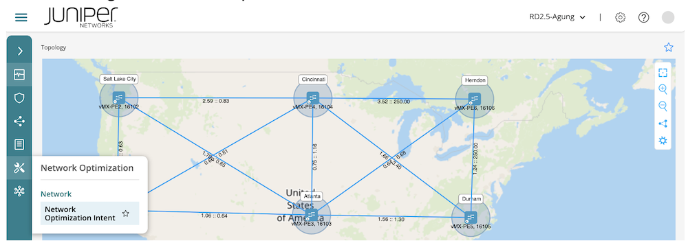

We need to define the "Tunnel Profiles" then click "Publish".

- Name: Tunnel-profile
- Provisioning Method: PCEP
- Signaling Protocol: SR

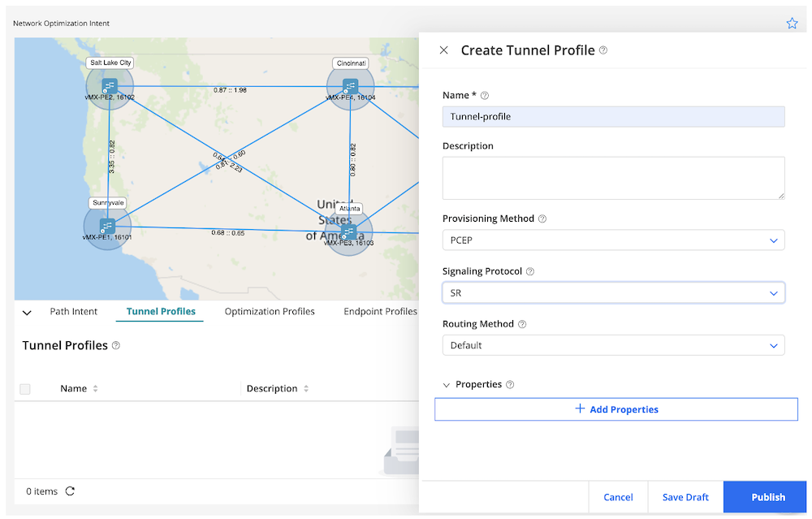

Creating "Optimization Profiles" is the next prerequisite stage, then click "Publish".

- Name: Optim-profile
- Tunnel Optimization Context: 0 (I will leave it zero, but we can define this as per the requirements)

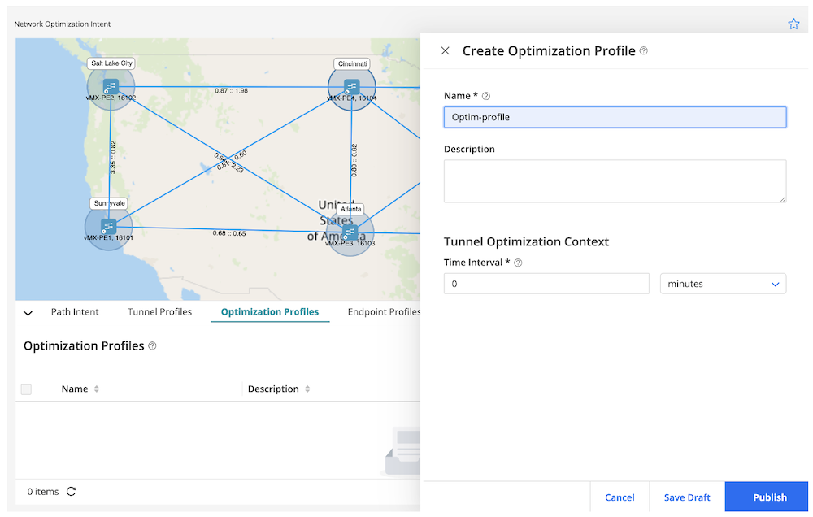

Last one is to define the "Endpoint Group" with the name: Node-Endpoint before we move to the final stage. Then, we click "Publish".

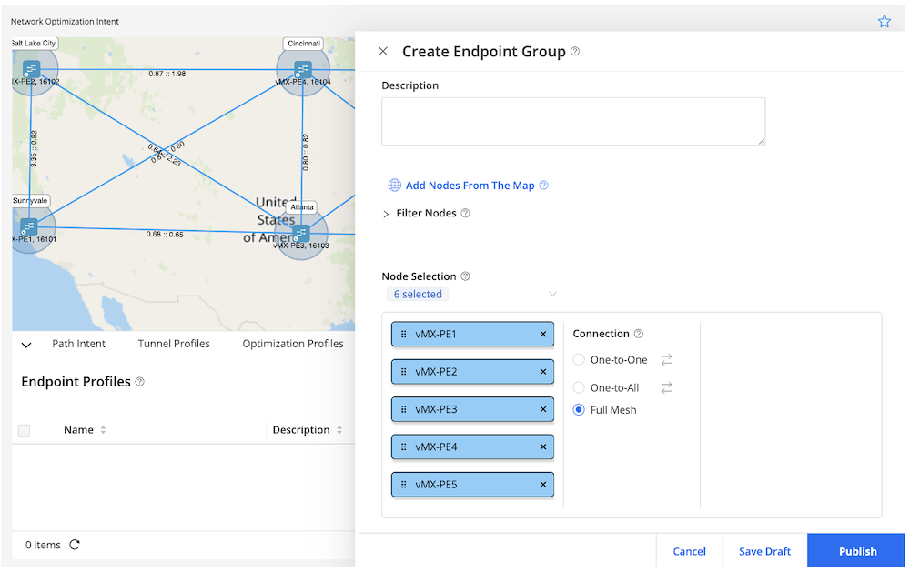

We move to the "Path Intent" after all the prerequisites have been defined as per the capture below and then click "Publish".

- Name: Path-Intent
- Tunnel Profile: Tunnel-profile
- Optimization Profile: Optim-profile
- Endpoint Group: Node-Endpoint

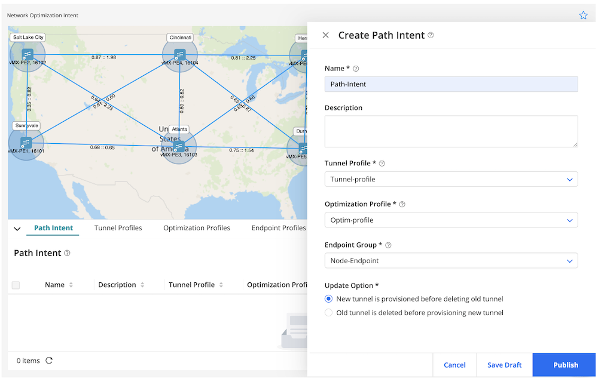

Since I am creating a full mesh path intent, the total provisioned paths will be using a simple formula Nx(N-1). I have six routers in my lab, hence the total will be 6x(6-1) = 30 provisioned tunnels (with 5 SR-TE tunnels per router) as per Figure 34.

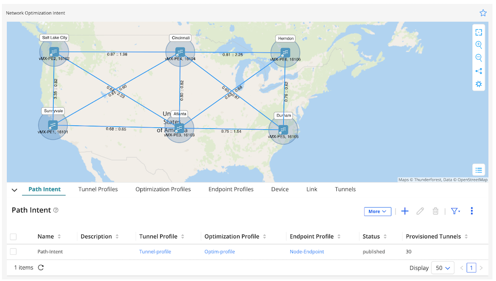

We verify the active tunnels' status in Figure 35

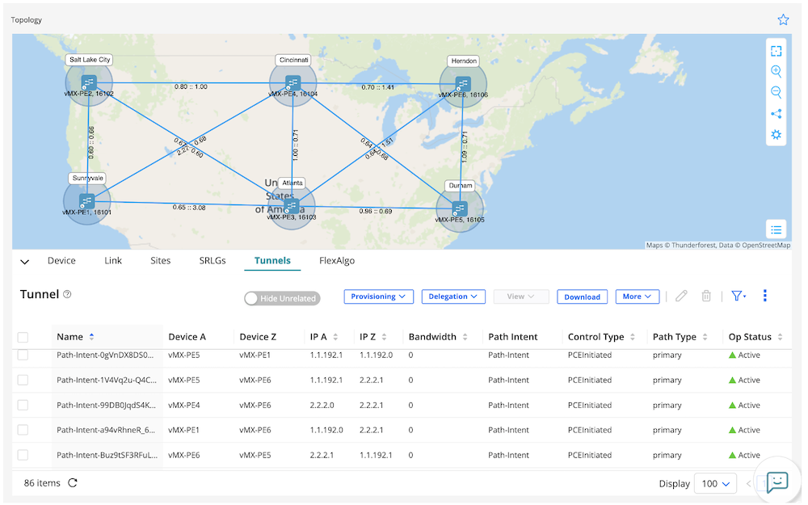

I will grab sample output from router PE3 and PE4 for the Network Optimization Intent result.

```
jcluser@vMX-PE3> show spring-traffic-engineering lsp 
To                        State     LSPname
2.2.2.0                   Up        Path-Intent-FG06Dm-8SYe5l08niUlKdg
1.1.192.0                 Up        Path-Intent-Nj9AOi-cRiuOZcdKVA424g
1.1.192.1                 Up        Path-Intent-UUWHi7CRQUiCSfudlW093A
2.2.2.1                   Up        Path-Intent-jYj8-40iSnKKiXWeoFmc0Q
1.1.192.2                 Up        Path-Intent-nBeNfCMATZ6Xg_hhzHkCow

Total displayed LSPs: 5 (Up: 5, Down: 0)

jcluser@vMX-PE4> show spring-traffic-engineering lsp 
To                        State     LSPname
2.2.2.1                   Up        Path-Intent-99DB0JqdS4KFuujT0ByUVg
1.1.192.1                 Up        Path-Intent-Dbg3a_SCSCS4Z0FrdJl-fQ
1.1.192.0                 Up        Path-Intent-eUOHnCY_TpO62ik32FMcVw
2.2.2.2                   Up        Path-Intent-pkMy1fDWRbCik4noVLzKmQ
1.1.192.2                 Up        Path-Intent-qm3BZhgdTPaCYEpere2qWw

Total displayed LSPs: 5 (Up: 5, Down: 0)
```

We can see how easy and fast it is to build full mesh tunnels in the network.

## Conclusion

In this Techpost, we described how network automation and optimization can be managed by Routing Director. RD will improve day-to-day operation and ultimately reduce the probability of human error in the network. From creating a new LSP for a specific service with different constraints, delegating LSP from routers to RD, transport network slicing with Flex-algo, to full-mesh tunnel automation provisioning... All were demonstrated and proven in this Techpost article.

## Useful links

- [https://www.juniper.net/documentation/us/en/quick-start/software/juniper-routing-director2.5.0/rd-quick-start-guide/ ](https://www.juniper.net/documentation/us/en/quick-start/software/juniper-routing-director2.5.0/rd-quick-start-guide/)
- [https://www.juniper.net/documentation/us/en/software/juniper-routing-director2.5.0/user-guide/index.html ](https://www.juniper.net/documentation/us/en/software/juniper-routing-director2.5.0/user-guide/index.html)
- [https://www.juniper.net/content/dam/www/assets/datasheets/us/en/network-automation/paragon-automation-datasheet.pdf ](https://www.juniper.net/content/dam/www/assets/datasheets/us/en/network-automation/paragon-automation-datasheet.pdf)
- [https://www.juniper.net/us/en/products/network-automation/routing-director.html ](https://www.juniper.net/us/en/products/network-automation/routing-director.html)
- [https://www.juniper.net/content/dam/www/assets/datasheets/us/en/network-automation/routing-director-datasheet.pdf ](https://www.juniper.net/content/dam/www/assets/datasheets/us/en/network-automation/routing-director-datasheet.pdf)

## Glossary

- RD: Routing Director
- MPLS: MultiProtocol Label Switching
- SR: Segment Routing
- LSP: Label Switched Path
- Flex-algo: Flexible Algorithm
- SID: Segment-ID
- BGP-LS: Border Gateway Protocol -- Link State
- NETCONF: Network Configuration Protocol
- IGP: Interior Gateway Protocol
- GUI: Graphical User Interface

## Acknowledgements

Thank you to Darshan Sreenivas and Henry Cheung for the discussion, especially to Darshan for helping me with JCL Sandbox troubleshooting.
