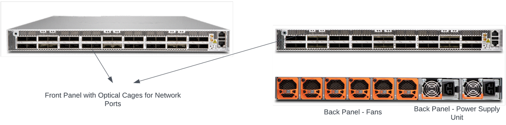
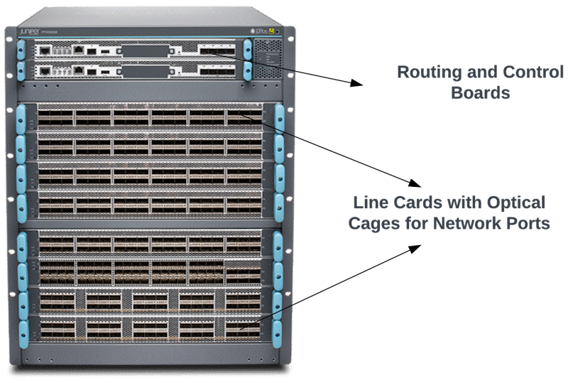
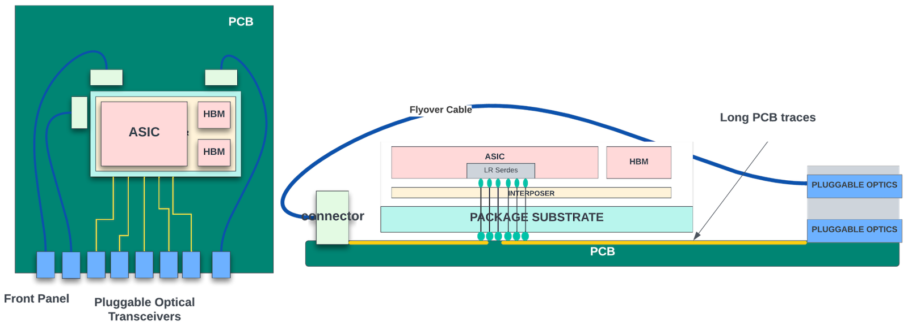
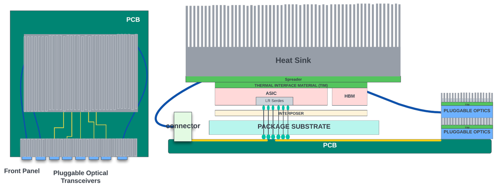
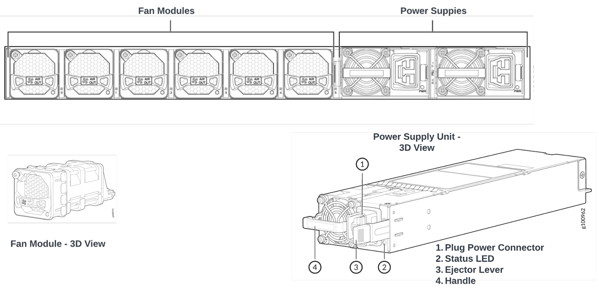
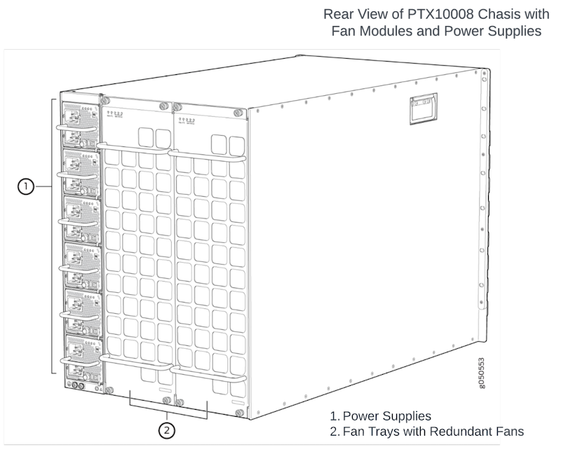

# Optimizing Power Consumption in High-End Routers

**Sharada Yeluri - 06/22/2023**

A detailed review of the various components inside a high-end router and how they contribute to overall power consumption.

Article initially published on Linked [here](https://www.linkedin.com/pulse/optimizing-power-consumption-high-end-routers-sharada-yeluri).

## Introduction

The last few decades have seen exponential growth in the bandwidths of high-end routers and switches. As the bandwidths of these systems increased, so did the power consumption. To reduce the carbon footprint and keep power delivery and cooling costs low, it's crucial to minimize the energy these systems consume.

In this article, I examine various components inside a high-end router and how they contribute to overall power consumption. I'll also explore deeper into the techniques used by high-end networking ASIC vendors to optimize the power per gigabit per second of bandwidth.

This article serves as an excellent introduction for beginners and a refresher for networking enthusiasts.

## High-End Routers - Basics

These typically come in two form factors - standalone or modular systems. A standalone router is typically a 1RU (rack unit) to 3 RU high box with a fixed number of ports in its front panel. It is mostly used in small to medium-sized enterprise networks or inside data centers.

As networking ASICs pack more and more bandwidth, the throughputs of these standalone systems are reaching upwards of 14.4Tbps. A 14.4Tbps system optimized for 400G port density would require the front panel to accommodate 36x 400G ports, which could take up a majority of the front panel area. Routers larger than 14.4Tbps would often require 800G optics to saturate the system bandwidth fully.

## Router Components

### Front Panel/Optical Modules

| Optics Speed | Power Range |
|:--|:--|
| 100G | 3.5-5W |
| 400G | 14-24W |
| 800G | 25-30W |
| 1600G | >30W |

### Flyover Cables

### CPU Complex

### Networking ASICs

These chips are the heart of the routers. They receive network traffic from the optical modules connected to the front panel ports through fly-over cables or PCB traces on the board, inspect various headers and take action. The term "packet processing" describes the task of inspecting the packet headers and deciding the next steps. The action can be determining the final physical interface through which the packet must leave the router, queuing and scheduling to go out from that interface, dropping the packet if it violates traffic rules/checks, or sending the packet to the control plane for further inspection and so on. These chips pack billions of transistors to perform these functions. They have hundreds of megabytes of on-chip memory for delay bandwidth buffering and data structures and often come integrated with HBM memory inside the package. Network chips consume a significant portion of the router's power.

The networking ASICs used in line cards of the modular system also have high-speed interfaces connecting to the backplane switch fabric.

### Optional Retimers

Networking ASICs send/receive traffic from the network ports or from the backplane through high-speed SerDes. These high-speed SerDes convert parallel data into a serial format and transmit them at very high speeds through the copper medium (PCB traces or fly-over cables). There is always signal attenuation and degradation when high-speed signals go through a transmission medium. A SerDes' reach is the maximum distance it can reliably transmit data without using signal conditioning or other signal enhancement techniques. It is determined by the data rate, the type of transmission medium, and the quality of the signal being transmitted. The signal quality can degrade at higher data rates due to attenuation, distortion, and noise. This degradation makes detecting and decoding the signal at the receiving end more difficult, reducing the maximum distance that the SerDes can transmit data without errors.

When networking ASICs transmit data to the network ports, the SerDes inside the ASIC only need to drive the signal to the front panel optical modules. These optical modules often come with integrated retimers. The retimer is a signal conditioning device that helps to clean up high-speed data. It does this by capturing the incoming signals and retransmitting them by regenerating them with the correct amplitude and timing.

In a modular system, when the ASIC is transmitting the signal to another line card through the switch fabric, the signal could be more attenuated through the line card traces, connectors that connect between the line card and switch fabric cards, and the traces through the switch fabric. Some of the high-speed links might need retimers in either the line cards or the fabric cards. These retimers are power-hungry, and they basically contain a pair of SerDes for transmit and receive for each direction.

### Power Supply System

It typically consists of an AC/DC converter and several local step-down DC/DC converters. Most systems provide 1+1 redundancy for AC/DC converters. These converters convert the AC power from the wall outlet to the DC power, resulting in ~12-16V DC output voltage. The conversion process can result in some energy loss due to heat dissipation and electrical resistance. Typical converters have anywhere between 5-10% efficiency loss. Thus, a 2200W AC/DC converter could consume between 2300-2440W of power when fully loaded.

Each component in a networking system requires a specific amount of power to operate. The power required is calculated by multiplying the voltage and current specifications of the component. Some components, like networking ASICs, require multiple voltage rails. For example, in a typical networking ASIC, digital logic requires a smaller voltage (between 0.75-0.90V) than analog components like SerDes, etc. which could require between 1 - 1.1V for their operation. Similarly, CPUs and other FPGAs in the system have their own voltage and current requirements.

The AC/DC converter's DC output voltage is usually 12V or higher. Local DC/DC converters or Point of Load (POL) converters are used to step down from this voltage to the <1.5V voltages required by various components. By providing power conversion close to the load, POL converters can improve power efficiency, reduce voltage drop, and increase overall system performance.

The efficiency of these POL converters ranges between 90-95%. In addition, the systems also come with hot-swap converters that can protect the internal components from current and voltage spikes.

It is possible to improve the efficiency of these AC/DC and POL converters by using high-quality components, minimizing the component resistance, and optimizing the switching frequency.

### Power Distribution Network

The power delivery (or supplying the specified current at the specified voltage to every component in the system) is often done through copper traces in the PCB boards, which carry the current between the Power Supply Unit and POL converters and from the converters to various components of the systems. These copper traces have finite resistance; hence, they dissipate power when the current passes through them. This is called joule heating. Many techniques like using wider traces, optimizing the traces for shorter lengths, reducing the vias, multiple power planes, and exploring other low resistance materials as alternatives to copper traces can be used to reduce the joule heating.

The converter inefficiencies and the power dissipation through the copper traces would require that the system be supplied with larger power than the total power consumed by all the components.

### Thermal Management System

All the components (Optics, CPUs, ASICs, retimers, converters) generate heat as they consume the power for their operation. If this heat is not dissipated efficiently, it could overheat the component's internals and cause them to fail or malfunction.

For example, in ASICs, junction temperature (transistor junction temperature) is the temperature at the contact point where two different semiconductor materials meet within a transistor. The junction temperature increases with the power dissipation of the transistor. Junction temperature affects the performance and reliability of the transistor. The semiconductor manufacturers specify the maximum junction temperature above which the asic is no longer reliable. Violating this temperature often causes transistors to get damaged permanently. Thus, any thermal management solution should keep the ASICs' junction temperature well within the spec by efficiently removing the heat dissipated by the ASICs before the junction temperature goes out of spec. Similarly, the CPU complex, control FPGAs, and other system components have their own temperature specifications that must be met.

### Heat Sinks

The thermal management system primarily consists of heat sinks (with vapor chambers) and fan modules. Heat sinks are basically made up of thermally conductive materials like copper or aluminum. They sit directly above the chips, in direct contact with the asic package or the ASIC die itself in a lid-less package, and help dissipate the heat away from the chip. These heat sinks are designed to maximize the contact area with the ASIC. Heat sinks also come integrated with vapor chambers at the top. A vapor chamber is a sealed container made of a thin metal sheet that is filled with a small amount of working fluid, such as water or alcohol. The heat sink transfers the heat to the vapor chamber. This causes the fluid to evaporate and turn into vapor. This vapor then moves to the cool end of the chamber, condensing back into a liquid, releasing the heat it absorbed into the surrounding air. The liquid is transported back to the heated end of the chamber, where it can be evaporated again. By integrating a vapor chamber into a heat sink, the heat dissipation capacity of the heat sink can be significantly increased. Heat sinks come with small, thin, and rectangular projections on the surface called fins. These fins are arranged in parallel to increase the surface area of the heat sink, which helps in faster heat dissipation. The heat sink is a passive component and does not need any power for its operation.

### Fan Modules

Each system also contains several fan modules for removing the generated heat. When the system is turned on, the fans start spinning and create a flow of air that moves through the chassis, cooling the internal components and removing the hot air. The fans draw the cool air from the front of the chassis and expel the hot air through the back panel.

The fan speed may be adjusted automatically based on the temperature of the internal components. There are temperature sensors that are located at different locations in the chassis. The network ASICs and the CPUs also come integrated with thermal diodes that measure the junction temperature of these chips. If the temperature of the components exceeds a certain threshold, the fans will automatically speed up to provide additional cooling. For fans to work effectively, the flow of air should be unobstructed.

Liquid cooling (as a replacement for heat sinks/air cooling) is much more effective in removing the large amounts of heat dissipated from the high-power ASICs. In liquid cooling, the liquid coolant flows through a series of pipes (closed-loop) that are in direct contact with the hot components in the system. As the liquid absorbs heat from the components, it becomes warmer. The warmer liquid flows to a radiator or heat exchanger, dissipating the heat into the air or another coolant. However, liquid cooling has more up-front costs and can be more expensive and complex to implement and maintain than air cooling. Not all electronic components are designed to be used with liquid cooling systems, requiring the systems to support both cooling modes and further increase the costs.

### Standalone System Power

All the active components contribute to the total power consumed by the system. But their contributions vary widely. To understand the power breakdown, let's take an example of a ***hypothetical*** standalone system with a 14.4Tbps networking chip and 36x 400G front panel ports. Each component's minimum and maximum power are typically in the range listed in the table below.

| Component | Unit Power Range | Approximate Number of Units | Total Power Range |
|:--|:--|:--|:--|
| 400G Optics | 14-24W | 36 | 504-868W |
| Network ASIC | 0.035-0.05W/Gbps | 14,000 | 504-720W |
| Fan Modules | 20-30W | 6 | 120-180W |
| Total Power of the active components |  |  | 1328-1964W |
| AC/DC and POL efficiencies | 10-20% total power |  | 200-400W |
| Total Power Consumed |  |  | Around 1600-2400W |

The table shows that the network ASIC's power is a significant portion of the total system power. A typical high-end networking chip can obtain the power per Gbps of 0.035 - 0.055W in 7/5nm process nodes. Optics consume as much or more power than the network ASICs depending on the type of optical module that is plugged in. For example, 400G short reach (SR) optics consume around 14W power, and the extended reach (ZR) optics consume around 24W power per module, hence the 14-24W range.

The efficiency loss of AC/DC and POL converters do contribute significantly to the total power. If retimers and gearboxes for are added for any of the WAN ports, that would also add to the power.

*Note that the total power consumed by the system depends heavily on the traffic patterns and the total load on the network ports. But, for thermal and power supply design, worst-case power needs to be taken into account. *

### Modular System Power

In a modular system, the networking ASICs in the line cards could consume more power than their standalone counterparts as they might need to send/receive up to 100% traffic to switch fabric cards in the backplane through high-speed serdes interfaces. Fan modules and power supply units are usually located in the back of the chassis and cater to all the line cards and switch fabric cards. The power consumed by the switch fabric card depends heavily on the fabric switch chip design. Cell-based switching (where packets are broken down into cells by network ASICs, and the cells are sprayed across the fabric to be switched) is more efficient and requires less number of fabric switches and high-speed interfaces. Thus, doing a generic estimation of modular chassis power is hard. Assuming each LC power is at least 2400W, 16 line cards in a 16-slot modular system consume up to 38KW power! And the power distribution among the individual components follows the same trend (with ASICs and optics consuming more than 60-70% of the system power) as the standalone systems.

## Designing Low-Power Networking Chips

The portion of the system power contributed by the networking ASIC increases proportionately with the increase in system total throughput. There are several challenges with the high power dissipation of networking chips.

- Being able to deliver the power efficiently to the ASICs without significant loss during transmission
- Being able to dissipate the heat generated by the ASIC efficiently so that the ASIC's junction temperature stays within the spec. This is getting challenging with the heavy integration of features inside the single-die and with multi-die packages that can create hot spots with high power densities.

In the following sections, let's look at different techniques networking chip vendors use to reduce power consumption. We often use the term power per gigabits per second when quoting the ASIC power, as the absolute power number could vary depending on the total throughput (in Gbps) each ASIC supports.

The power consumed by any integrated circuit consists of three main components: leakage power, active power, and short circuit power.

### Leakage Power

It is the power consumed by the ASIC after it is powered on but before any clocks inside the ASIC start toggling. This power is dissipated due to the leakage current that flows through the transistors even when they are not switching. Leakage power has become a significant concern in chips built using advanced process nodes. This is because smaller transistors have shorter channel lengths and thinner gate oxide, which can result in higher leakage currents. As the transistor size shrinks, more transistors can be packed in the same die area, resulting in more leakage current. Leakage current also depends on the transistor architecture. FinFET transistor architecture (used in TSMC's 7 and 5nm process) has better leakage characteristics than the CMOS architecture. Gate all-around (GAA) transistor architecture used by TSMC's 3nm process provides even tighter control because the gate surrounds the channel on all sides, and there is less surface area for charge carriers to leak through, reducing leakage current.

Leakage power is the product of the supply voltage (Vdd) and the leakage current. While it implies that leakage power could be reduced at smaller supply voltages, the leakage current itself could increase at smaller Vdd when the difference between the threshold voltage of the transistor and the supply voltage decreases. While there is a slight increase in leakage current, the supply voltage reduction reduces leakage power overall. But, reducing supply voltage too much could affect the performance of the transistors. Thus, a careful balance must be made when choosing the operating voltage for the ASIC. Power gating, where the supply voltage is cut off at bootup time for portions of the logic that are not used (for example, if a feature could be disabled for certain network applications), could also eliminate the leakage current through the logic that is not used. This, however, comes with the additional complexity in the implementation of voltage rails and is considered only if there are significant savings.

### Dynamic Power

The dynamic or active power of an ASIC consists of switching power and short circuit power. Switching power is the power consumed by the logic elements in the chip when they are turned on/off. This is due to the charging and discharging of the capacitances associated with the transistors and interconnects. This power is directly proportional to the capacitance(Ceff) of the transistor and the interconnect, the switching frequency(f) of the logic element, and the square of the supply voltage(Vdd). The total switching power of the ASIC is the sum of the switching power of all the logic (combinational gates, flops, analog circuits, and memory cells).

### Short-Circuit Power

Short-circuit power is a type of power dissipation that occurs when the output of a digital circuit is switching from one logic state to another, and both the n-type and p-type transistors are conducting simultaneously, creating a direct path for current flow (*Isc*) from the power supply to ground. Short-circuit power is a transient effect and occurs only during the brief time interval when both transistors are conducting. The duration of this interval depends on the circuit's switching frequency and the voltage supply level. Thus, this power is directly proportional to the supply voltage(*Vdd*) and frequency(*f*). Careful layout of the library elements could reduce the overlap between the transistors and limit the short circuit power.

Dynamic Power = Pswitching + Pshort-circuit
Pswitching = a.f.Ceff.Vdd2
Pshort-circuit = Isc.Vdd.f

When it comes to reducing the power, the main focus is on reducing the dynamic power (as it contributes to greater than 75% of total power in a typical IC).

The obvious way to reduce the dynamic power is to lower the clock frequency, total switching activity, interconnect and transistor capacitances, and supply voltage. All of these come with their own challenges and have pros/cons. Let's review all the power reduction techniques in the following sections.

### Optimal Supply Voltage (Vdd) Selection

Reducing operating voltage significantly impacts the power due to the "square" dependency. Two decades ago, when "Moore's Law" was in full swing, we could get double the transistor performance every 2-3 years while simultaneously reducing the operating voltage (*Vdd*) needed for their operation. For example, the typical supply voltage in the 180 nm process node was around 2.5 volts, while in the 45 nm process node, it went down to ~1.1 volts. This went down further to ~0.90V in the 14 nm process node. But, as the translator dimensions shrank, it became harder to reduce the supply voltage significantly with every new process node without adversely affecting the performance of the transistor. As a result, improvements in operating voltages pretty much came to a slow stop from the 7 nm process node onwards, with operating voltages hovering between 0.75V - 0.85V. Most silicon foundries provide a range (min-max) for each voltage rail. Typically, the transistors and memories have lower performance at the lower end of the voltage range (and can not be clocked with higher frequencies) than at the higher end. So, a trade-off should be made when picking the operating voltage.

Some foundries offer voltage binning, where depending on the process node of the chip (fast versus slow), the operating voltage can be adjusted. The chips in the fast corner have faster transistors. We can take advantage of this by reducing the supply voltage of the chips in this process corner so they consume less power without performance degradation. Binning requires support from the manufacturers to sort the asic dies based on the process characteristics.

### Operating Frequency Selection

While it may seem obvious that reducing the frequency of operation would reduce power consumption, it also reduces the performance as the ASIC can not process the packets and move them through the existing datapaths fast enough. Then, to get the same overall throughput from the networking system, we would have to add more logic inside the ASIC or add more ASICs in the line card/system. Both would add to the total power/cost of the system.

A high-end network chip with tens of terabits per second of bandwidth typically has a packet processing unit and a datapath. The packet process unit is implemented in either fixed pipeline architectures (Juniper's Express silicon) or run-to-completion architectures like the packet processing engines in Juniper's Trio series.

Assume that one packet processing pipeline can take in one packet every cycle in a fixed pipeline architecture. At 1.25 GHz clock frequency, this translates to 1.25 billion packets per second. If we want to improve the performance of the next-generation processing pipeline to 1.4 billion packets per second, the obvious choice is to increase the clock frequency to 1.4 GHz. At this higher clock frequency, each stage in the pipeline has to do the same amount of processing in a shorter duration. This might not be a problem if we switch to the new processing node for the next generation asic - where we can expect the logic to speed up at least 20-30%. What if we wanted to stay with a 1.25GHz frequency to reduce the power? In that case, to get 1.4 billion packets per second, the pipeline needs to process 1.12 packets per cycle. This is hard to implement as it is not an integer value. In those situations, the designers are tempted to overdesign the logic to do 2 packets per cycle. Doing so would require almost double the amount of logic, which would take up more die area and power.

Similarly, inside the datapath, the buses that carry packet data inside the chip (to/from the WAN ports to central buffers and other structures) need to be widened to carry more bits per cycle if the frequency is reduced to get the same Gbits/second performance. When buses are widened, it adds congestion to the top level that needs to be alleviated by giving more area for routing, thus increasing the die's size. And the repeater flops for the long wires also add to the power.

Internal memories (SRAMs) also play a critical role in the frequency decision. SRAM performance might not scale with higher frequencies, so to realize a logical memory, we would be forced to use multiple smaller SRAM structures that are stacked together. This adds additional overhead to the area as well as SRAM access times. A detailed analysis of the on-chip buffers and databases, their mapping to the SRAMs in the library, and how each logical memory is fragmented needs to be done at multiple different frequencies when deciding the frequency of operation.

ASIC Schedule and IP (modules implementing specific features) reuse also play a role in the frequency selection. In some cases, reusing existing IPs for faster turnaround is highly desirable. In such scenarios, we are limited by the maximum frequency at which the existing IPs can operate without any design changes.

Thus, frequency selection involves multiple trade-offs for the best power, performance, and area design point. It is not uncommon to see multiple clock domains within a die where different subsystems could be clocked with different frequencies. It adds more complexity to the clock tree structures and increases design and validation times but could provide a better design point than using the same frequency for all functions of the ASIC.

### Reducing the Switching Activity

As described before, the logic gates and flops in the ASICs consume switching power when their outputs change state. It is extremely critical to ensure that if the output of a flop is not used in a specific clock cycle, it should not toggle in that cycle. This can be done by clock gating, where the clock to the flop is removed (or gated) in the cycle where the flop output is not used - so the flop output remains in the same state as the previous cycle. By doing this, all combinational logic fed by this flop also toggles less. This is referred to as dynamic clock gating.

Dynamic clock gating is inferred by the EDA tools during the synthesis (conversion of the Verilog behavioral RTL code to gates) when the designer writes the code for the flip-flops in a specific format. But, the efficiency of clock gating with this approach depends heavily on the designer's expertise in identifying all clock gating opportunities. There are powerful EDA tools that can identify all clock-gating opportunities in the design, and some can even do the clock-gating in the RTL on their own. The networking chips can achieve greater than 98% efficiencies in dynamic clock gating using advanced EDA tools.

In addition, some features/IPs could be statically clock gated. For example, if the networking chip provides integrated MACsec and if some applications/customers do not need this feature, the entire module could be clock gated from the boot-up time.

### Process/Technology Node Selection

The semiconductor process in which the ASIC is manufactured also plays a critical role in the overall power consumption. During the first decade of this century, when Moore's law was in full swing, every new process node could pack double the number of transistors in the same area and get 2x or more power efficiency than previous process nodes. The trend slowed down in the past few nodes. For example, when going from a 5nm to a 3nm process node, the power improved only by 30% (for the same performance) or 1.42X improvement. Most of the improvement is from the logic, while the memory power improved only marginally. It means that even if we can pack double the throughput inside an ASIC package by going from 5nm to 3nm, it would consume 42% more power. When doubling the capacities of the networking systems, HW engineers need to budget for this additional power consumption by the ASICs.

As process nodes shrink, manufacturing becomes more complex and requires higher precision. This can result in increased equipment and production costs. The yield rates also go lower due to the smaller feature size and higher transistor density. This leads to increased per-die costs for the customer. And the cost of developing the serdes and other IPs for the new process node can be significant. Additionally, building chips at a smaller process node typically involves using more advanced and expensive materials, which can increase the cost of production.

Overall, building a chip in 5/3nm will be more expensive compared to a 7nm chip. But, if we can pack double the density inside an ASIC package with a next-generation process node without doubling the power, it could still save the system cost overall (as the cost of other components in the system like the chassis hardware, CPU complex, PCB boards, thermal management, etc., do not always double). Thus overall system cost and power efficiency must be considered when deciding the process node.

### Power Efficient DataPath/Processing Architectures

As seen in the previous section, process node improvements alone are not sufficient to keep the power down when increasing the throughputs of the ASICs and the systems. One can not undermine the role of a power-efficient ASIC architecture's role in reducing the networking ASIC's overall power.

Networking ASICs architectures evolved over time to work around the below constraints:

- The area/power of SRAMs is not scaling as much as the logic across the new process nodes.
- Although transistor densities continued improving, power is not improving much with new process nodes.
- The external memories were also not scaling fast enough to keep up with logic scaling. On this front, while the HBM (high bandwidth memory inside the ASIC package) vendors were managing to double the performance and density of these memories every ~3 years by using new memory nodes, stacking more dies, and increasing the rate of data transfer between HBM and ASIC dies, the bandwidth provided by each HBM part is nowhere close to the data throughputs supported by the networking chips.

For example, each HBM3P part (the latest generation of HBM introduced last year) could theoretically provide a raw total data rate of 8Tbps. Accounting for 20% efficiency loss on the bus due to read/write turnaround and other bottlenecks, this is enough to buffer 3.2Tbps of WAN traffic. The high-end networking chip vendors are looking to pack >14.4Tbps in each ASIC package. Clearly, not all traffic can be buffered using a single HBM part. Adding more HBM parts could take away the die edge area needed for WAN ports.

That means the simplest way of doubling the throughput of a next-generation ASIC by doubling the datapath slices will not scale. Memory accesses to on-chip and external memories need to be optimized as much as possible. Networking vendors use various techniques to achieve this.

**Oversubscribed external delay bandwidth buffers** with shallow on-chip delay bandwidth buffers. In this architecture, packets are first queued in the on-chip buffers, and only the congested queues (as the queues build up) move to external memory. As the congestion decreases, these queues move back to on-chip buffers. This reduces the data movement overall and the power associated with it.

**Virtual Output Queue (VOQ) architecture**: Here, all the delay-bandwidth buffering is done in the ingress PFE (packet forwarding entity or slice). The packets are queued in virtual output queues at the ingress PFE. A VOQ uniquely corresponds to the final PFE/output link/output queue from which the packet needs to depart. Packets move from the ingress PFE to the egress PFE by a sophisticated scheduler at the egress, which pulls in packets from an ingress PFE only when it can schedule the packet out of its output links. Compared to CIOQ architecture, where packets are buffered and scheduled in both ingress and egress packet forwarding entities, data movement is less in VOQ architecture. This results in less switching power.

**Fixed pipeline packet processing**: When processing the network protocol headers, hardcoding the parsing/lookup and header modification in dedicated hardware (compared to a flexible processor) results in an efficient implementation that saves area and power consumption during packet processing. All high-end networking vendors have moved to fixed pipeline processing for the area/power advantages.

**Shared data structures**: Reducing the memory footprint inside the die reduces the area and the leakage power associated with the memories when they are not active. Thus, when integrating more than one PFE or slice in a die, some network chip vendors share large data structures that hold route tables (FIBs) and other structures across these slices. Doing so would increase the number of accesses to these shared structures. But, in most cases, these large logical structures are implemented using many discreet SRAM banks, and accesses can be statically multiplexed between clients and the banks. This could lead to non-deterministic access times due to hot banking and out-of-order read returns that the memory control logic needs to accommodate. Oftentimes, the area/power advantages outweigh the complexity of the control logic.

But, while moving data structures to centralized locations, the power consumed in routing to and from the centralized memory could sometimes outweigh the memory access power. Thus, architects need to consider the trade-off when sharing data structures.

**Caches**: A hierarchy of caches could be used to reduce access to shared structures (either on-chip or external memory) for accesses that have temporal or spatial locality. This reduces the data movement over long wires and hence the power.

**Bloom filters**: This is a popular approach used to reduce the number of accesses to a hash or lookup table that resides in the external memory. A Bloom filter is a space-efficient probabilistic data structure used to test whether an element is a member of a set. This data structure is often kept in on-chip SRAMs. Probing a "key" in the bloom filter gives an indication of whether it is present in the off-chip table or not. False positives are possible, but there are no false negatives. Using this approach cuts down accesses to central and off-chip memories by 70-80% for some network functions.

**Compressed data structures**: Some data structures could be compressed and stored to reduce the memory footprint and the switching power when reading those structures.

**System in Package (SiP) Integration with chiplets**: Past 3-4 years have seen momentum in chiplet designs where multiple chiplets (ASIC cores) could be integrated within a package with low-power die-2-die interfaces like UCIE or short reach serdes (XSR) to get Moore's law benefits at the package level. Juniper pioneered this with Express 5 chips.

**Feature Creep**: Finally, power increases proportionately with the number of features the chip is designed to process at the line rate. Some features that might not require line rate processing could be punted to the CPU complex to be processed in software to save area/power. For example, IPv4 fragmentation is uncommon in core networks designed to handle large volumes of traffic. These networks typically have large MTUs (maximum transmission units), which are the maximum packet size that can be sent on the network. As a result, there is rarely a need to fragment packets in core networks. In those cases, the network chip does not need to implement this feature in line. However, the chip should detect packets that need fragmentation or reassembly and send them to the CPU complex for processing.

Similarly, minimizing the feature creep by carefully analyzing the use cases (business impact by product management teams) and using alternate approaches for niche features is essential to keep the power down.

### Microarchitecture Considerations

Some or all the benefits of power savings provided by an efficient architecture are lost if the chip modules are not micro-architected efficiently. Block micro-architecture depends heavily on the expertise of the designers. Careful reviews with experts need to happen before the sign-off. It is essential to look for

- Over pipelining: Adding more pipeline stages than needed to implement functions.
- Improper SRAM selection: Single-ported SRAMs are more efficient in power/area than two or dual-port SRAMs. Need proper planning of SRAM accesses to select correct SRAM types. Similarly, using algorithmic memories that increase the number of ports for some data structures for simultaneous accesses (instead of duplicating the memories) does help to keep the area/power down.
- Not optimizing the logical memory for power. SRAM library vendors often provide memory compilers that let the users input the logical memory dimensions, and the compiler would give different memory/tiling options for that memory. These compilers can optimize the memories to balance between overall area and power based on the weights provided by the user.
- Over buffering: Some designs tend to buffer the data and/or control logic multiple times during processing. And the buffers tend to be overdesigned. Buffers and their sizing need to be scrutinized in detail to remove the padding.
- Design re-use: Design re-use could sometimes hurt. While re-use is good for project schedules, these designs might not have the best micro-architectures or implementation techniques for power savings.

### Physical Design Considerations

In the last decade, EDA tools for chip/module floor-planning and place & route have made great strides in optimizing the netlists and layouts for power reduction. These tools achieve power reduction with physical design-aware RTL synthesis, P&R that optimizes the data movement, placement-aware clock gating, reclaiming power on non-critical paths, etc. These tools can take in various traffic scenarios inputted by the user and optimize the physical design for peak power reduction. Utilizing EDA tool advances for physical design can provide an additional 4-5% dynamic power reduction beyond what was achieved through other techniques mentioned earlier.

EDA tools also support power gating, dynamic voltage/frequency reduction, or multiple voltage/frequency island approaches and provide automation and checks for implementing these techniques during the RTL synthesis and physical design phase.

### Power Monitoring

While improving power efficiency is a commendable goal for high-end ASICs, without a quantifiable objective, it could lead to various changes in architecture and implementation, increasing the risk of schedule delays and post-silicon issues. It is essential to work with hardware and product management teams to define a power goal (power per Gbps) for the ASIC and continuously estimate and monitor the power throughout the development phase to remain on track. During the architectural phase, power estimation is often done using basic techniques, such as extrapolating from prior designs and using scaling for new process nodes. In the design implementation phase, several EDA tools can estimate and monitor power as the design progresses through RTL and place & route, providing engineers with choices and suggestions for power-saving opportunities.

## New Trends in Optics

The OFC 2023 conference has seen several vendors showcasing prototype systems using linear drive (or direct drive) non-DSP pluggable short/medium range optical modules for data center and enterprise applications. These optical modules do not have power-hungry DSP circuitry and use linear amplifiers to convert electrical and optical signals. This contrasts with traditional coherent transceivers, which use DSP and phase modulators for this conversion. These systems rely on the fact that the Long-Reach (LR) serdes inside the networking ASICs are powerful enough to compensate for the lack of DSP inside the optics. Liner drive optical modules could be very power efficient, with some vendors claiming up to 25% power savings compared to traditional optical transceivers. At 800Gbps/1.6Tbps speeds, using linear drive optics could significantly reduce the system's cost and power.

## Final Notes

Although this article focuses mainly on the trends and techniques used to reduce power consumption in networking chips and optics, it's equally important to consider the power consumption of all system components and the efficiency of cooling and thermal management solutions in each new system design.

Even small improvements in the efficiency of AC/DC converters, for example, can lead to significant power savings in a high-power system. Despite the initial upfront cost, investing in liquid cooling can also lead to significant cost savings over the lifetime of a modular system that handles hundreds of terabits per second.

As ASIC architects run out of optimization options and the power savings from technology nodes begin to diminish, it's crucial to explore alternative solutions to reduce system power and cooling costs. Let's continue to push for innovation within and beyond ASICs to make network systems more efficient and cost-effective.

## Glossary

- ASIC: Application-Specific Integrated Circuits
- CMOS: Complementary Metal Oxide Semiconductor
- CIOQ: Combined Input and Output Queueing
- CPU: Central Processing Unit
- DRAM: Dynamic Random Access Memory
- DSP: Digital Signal Processor
- EDA: Electronic Design Automation
- FIB: Forwarding Information Base
- FinFET: Fin Field-Effect Transitor
- FPGA: Field Programmable Gate Array
- GAA: Gate All-Around
- HBM: High-Bandwidth Memory
- IC: Integrated Circuit
- IP core: ASIC Intellectual Property core
- MTU: Maximum Transmission Unit
- PAM4: Pulse Amplitude Modulate at 4 Levels
- P&R: Place and Route
- PCB: Printed Circuit Board
- PFE: Packet Forwarding Engine
- POL: Point of Load
- RTL: Register Transfer Level
- SerDes: Serializer/Deserializer
- SiP: System in Package
- SRAM: Static Random Access Memory
- UCIe: Universal Chipset Interface Express
- VOQ: Virtual Output Queue
- XSR: eXtra Short Reach (SerDes)
