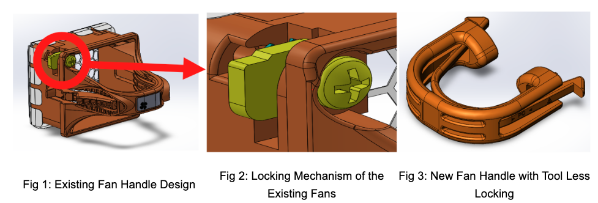
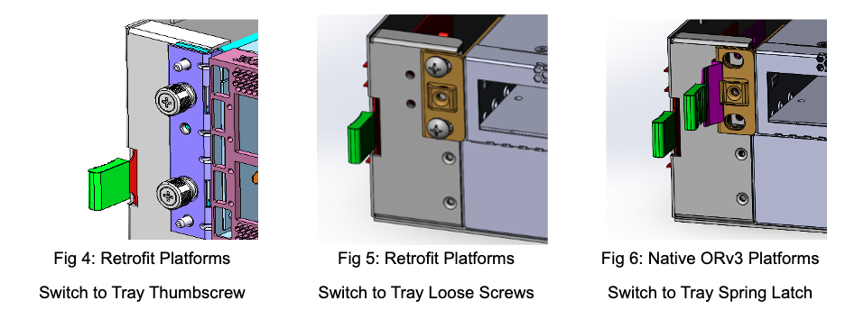
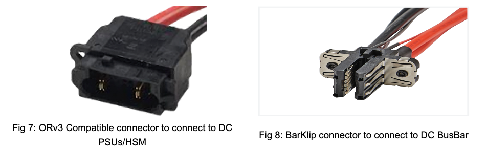
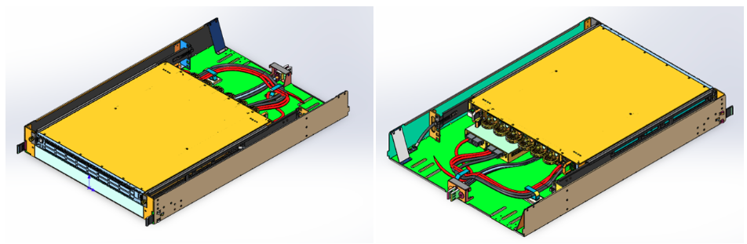
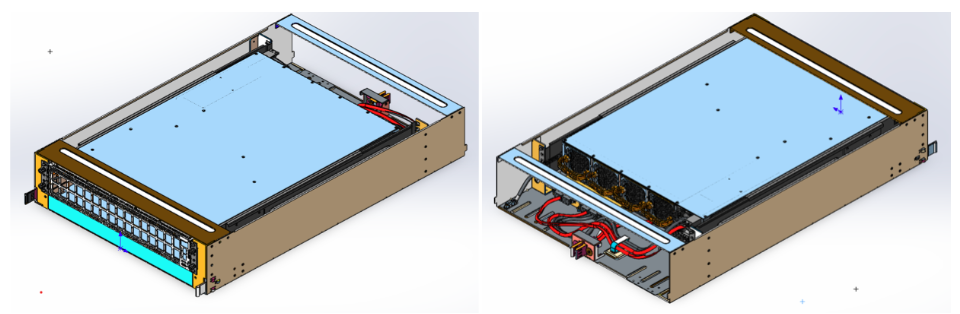
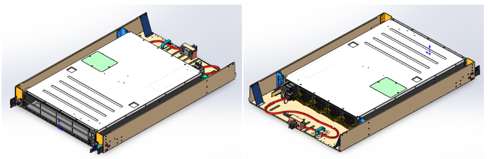
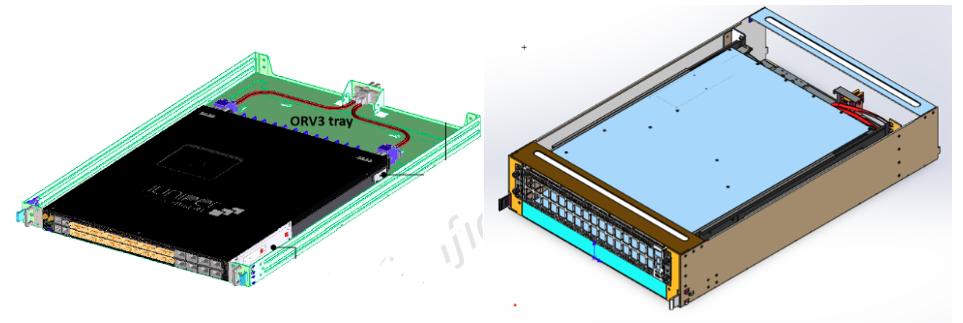
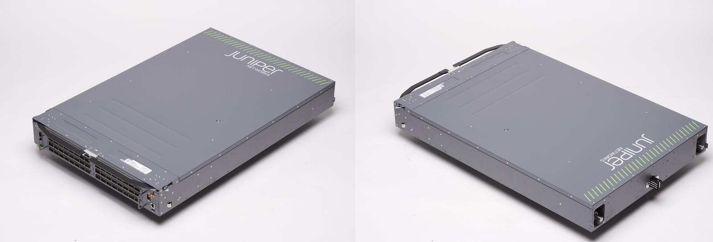

# ORv3 Compliant QFX Series Switches

**Ridha Hamidi - 08/06/2026**

HPE–Juniper Networks QFX Series switch platforms support ORv3-compliant data center deployments, aligning with Open Compute Project (OCP) Open Rack Version 3 (ORv3) specifications. Compliance is achieved through mechanical and electrical adaptations to the QFX platform, enabling integration into ORv3 rack infrastructure.

## Introduction

The Open Compute Project (OCP) is an industry-wide collaborative initiative focused on optimizing the design, efficiency, and scalability of hyperscale data center and IT infrastructure. Its scope spans server hardware, rack and power architecture, storage systems, energy efficiency, and open networking platforms.
This paper first summarizes the OCP Open Rack Version 3 (ORv3) specification, then details the HPE-Juniper Networks QFX Series switch platforms that have been retrofitted or engineered from the ground up to comply with the ORv3 standard.
HPE-Juniper Networks has introduced ORv3-compliant QFX Series switch variants in response to growing demand for OCP-aligned data center infrastructure.
Select existing QFX platforms have been retrofitted for ORv3 compliance through dedicated adapter trays and mechanical/electrical design modifications. At the same time, other variants are natively engineered to meet ORv3 requirements from the ground up.

## Open Rack Version 3 (ORv3) Project

Traditional data center racks, particularly those hosting AC-powered devices, introduce operational challenges related to power efficiency, cable management, and hardware installation. These challenges include inefficiencies associated with AC-to-DC conversion, complexity in power distribution, and limitations in serviceability.

The Open Rack project addresses these challenges by redefining rack architecture and standardizing key design elements. The ORv3 specifications are based on the following design tenets:

- **Openness**: Specifications are developed by industry participants to ensure vendor-neutral interoperability
- **Efficiency**: Reduction of power losses by leveraging DC power distribution
- **Impact**: Establishment of design frameworks that can be adopted across the OCP ecosystem
- **Scale**: Support for large-scale deployments with interchangeable components
- **Sustainability** (Meta extension): Emphasis on reusable and environmentally efficient designs

OCP specifications [1][2] define two primary specifications for ORv3:

- Open Rack V3 Base Specification
- Meta Open Rack Frame V3 Specification

### Open Rack V3 Base Specification

The ORv3 Base Specification defines two implementation options, Option 1 and Option 2, which differ in physical dimensions and electrical characteristics (e.g., busbar geometry, power delivery voltage/current ratings, and rack-unit sled sizing). Both options adhere to a common set of baseline requirements governing mechanical interfacing, power delivery, and thermal/environmental tolerances to ensure interoperability and reliability across the OCP ecosystem.

**Common Features to Option 1 and Option 2**

The two options share a consistent set of foundational requirements, including:

- Standardized mechanical interfaces (hole sizes, mounting patterns)
- Integrated 48V-class busbar for power distribution
- Tool-less serviceability requirements for IT equipment
- Defined grounding mechanisms and safety features
- Environmental operating range between 10°C and 60°C
- Structural validation through standardized mechanical tests
- These requirements ensure compatibility across different vendors and deployment scenarios.

**Differences Between Option 1 and Option 2**

| Feature | Option 1 | Option 2 |
|:--|:--|:--|
| Inner Dimensions | 539 mm (W), 802.6 mm (D) | 610 mm (W), 589 mm (D) |
| Busbar Location | Rear Center | Rear Left |
| IT Equipment Width | 21.2 in | 24.0 in |
| IT Equipment Depth | 31.6 in | 23.2 in |
| Nominal Voltage | 51 VDC | 54 VDC |
| Voltage Range | 46–52 VDC | 52–56 VDC |

### Meta Open Rack Frame V3 Specification

The Meta Open Rack Frame V3 Specification extends the ORv3 Base Specification by defining a concrete implementation of Option 1 and introducing additional requirements to improve deployment consistency.

Key Enhancements Include:
• Defined external rack dimensions
• Maximum load capacity of 1400 kg
• Enhanced mechanical testing and validation requirements
• Support for blind-mate liquid cooling
• Extended OpenU configurations for increased flexibility
• Defined grounding path implementation

These enhancements enable more predictable deployment models, particularly in hyperscale environments.

## Mechanical Re-Designs of QFX Series Switches for ORv3 Compliance

### Tool-less Serviceability

The ORv3 specification mandates tool-less serviceability for field-replaceable units (FRUs). To meet this requirement, fan modules have been redesigned with tool-less insertion and locking mechanisms, enabling module removal, replacement, and reseating without screwdrivers or other specialized tools. This design reduces mean time to repair (MTTR) and improves field-service efficiency.

### Integration Constraints and Form Factor Adjustments

ORv3 dimensional constraints, combined with the chassis depth of certain QFX platforms, preclude rear-mounted placement of Hot Swap Modules (HSMs) in some configurations. In these cases, HSMs are repositioned beneath the chassis, increasing overall system height (e.g., 1RU to 2 OpenU, or 2RU to 3 OpenU). This mechanical adaptation maintains ORv3 compliance while preserving serviceability access and airflow path requirements.

### Airflow Design

All current ORv3-compliant switch configurations support front-to-back airflow (Air Flow Out, AFO), consistent with standard hot-aisle/cold-aisle containment deployments. Reverse airflow configurations (Air Flow In, AFI) are not currently implemented but remain under consideration for future platform revisions.

### Mounting and Retention

Switch retention mechanisms have been redesigned to meet ORv3 tool-less serviceability requirements, with implementation varying by platform generation:

- Retrofit platforms: use thumbscrews or loose screws
- Native ORv3 platforms: incorporate fully tool-less latching mechanisms

Both approaches enable rapid insertion and extraction within ORv3 rack infrastructure. The three retention mechanisms are illustrated in the figures below.

## Electrical Re-Designs of QFX Series Switches for ORv3 Compliance

### Power Integration

ORv3 defines a centralized 48V DC busbar architecture for rack-level power distribution. All IT platforms, including switches, must connect to the busbar using a tool-less, mechanically robust power connector that ensures consistent electrical contact and safe hot-swap operation. The corresponding busbar interface mechanisms are shown in the figures below.

On retrofit platforms, DC power supply units (PSUs) are integrated with Hot Swap Modules (HSMs), which provide a pre-wired interface to the ORv3 busbar. Busbar-to-PSU electrical connections use standardized, keyed connectors to ensure correct polarity and safe hot-swap operation. This architecture enables ORv3 compliance on existing QFX platforms without requiring a full chassis redesign.

## ORv3-Compliant QFX Series Switches Portfolio

The HPE-Juniper QFX-Series ORv3-compliant portfolio includes these QFX platforms that have been adapted for tray-based deployment:

| ORv3 SKU (Switch & Tray) | Original Switch SKU | Switch Height(RU) | Tray Height(OU) |
|:--|:--|:--|:--|
| QFX5120-48TDAFO-T2 | QFX5120-48T-DC-AFO | 1 | 2 |
| QFX513032CDDAFO-T2 | QFX5130-32CD-D-AFO | 1 | 2 |
| QFX522032CDDAFO-T2 | QFX5220-32CD-D-AFO | 1 | 2 |
| QFX523064CDDAFO-T3 | QFX5230-64CD-D-AFO | 2 | 3 |
| QFX5241-64OD-DO-T2 | QFX5241-64OD-DO | 2 | 2 |
| QFX5241-64QD-DO-T2 | QFX5241-64QD-DO | 2 | 2 |
| QFX5241-32OD-DO-T2 | QFX5241-32OD-AO | 1 | 1 |
| QFX5140-24CD8ODOT1 | QFX5140-24CD8O-DO | 1 | 1 |
| QFX5250-64OE-DO-T3 | QFX5250-64OE | 3 | 3 |
| QFX5250-64OE-L | NA | NA | 3 |

**Notes**:

- Older QFX platforms, like QFX5120-48T, QFX5130, QFX5220, and QFX5230, require tray height adjustments due to the HSM integration, so 1RU switches fit in 2OU ORv3 trays and 2RU switches fit in 3OU trays. However, newer models, like QFX5140, QFX5241, and QFX5250 do not require such adjustments because they’re designed from the ground up to be ORv3-compliant, so 1RU switches fit in 1OU ORv3 trays, 2RU switches fit in 2OU trays, and 3RU switches fit in 3OU trays.
- QFX5250-64OE-L is a native ORv3 liquid-cooled switch, so it does not require an ORv3 tray.

The design diagrams of these switches are provided below:

Newer HPE–Juniper QFX platforms are designed with native ORv3 compliance, and the same applies to all future QFX switches.

Design Improvements Include:

- Direct PSU-to-busbar connectivity without the need for HSM modules
- Full alignment between RU and OU dimensions
- Improved airflow and serviceability
- Support for native liquid-cooled designs
- These enhancements eliminate the need for retrofit adaptations and improve overall system efficiency.

Examples of this design are shown in the pictures below:

Additionally, a liquid-cooled QFX switch platform has been released that is natively ORv3-compatible, eliminating the need for an adapter tray. This platform is the QFX5250-64OE-L and is shown in the figure below:

## Conclusions

Open Rack Version 3 (ORv3) defines a standardized, scalable rack architecture for modern data center environments. HPE–Juniper Networks ORv3-compliant QFX Series switch platforms enable deployment within OCP-compliant rack infrastructure and adhere to ORv3 mechanical and electrical specifications, including busbar power interfacing, tool-less serviceability, and dimensional constraints. These platforms also provide a migration path from retrofit-based (adapter tray) solutions to natively engineered ORv3 designs, supporting evolving data center requirements while maintaining alignment with open industry standards.

## Useful Links

1. [Open Rack V3 Base Specification Revision](https://www.opencompute.org/documents/open-rack-base-specification-version-3-pdf) 1.0 Authors: Glenn Charest, Steve Mills, Loren Vorreiter
2. [Meta Open Rack Frame V3 Specification Revision 1.3](https://www.opencompute.org/documents/open-rack-version-meta-v3-rev1pt3-june032024-pdf) Authors: Glenn Charest, Paul Clements, Darryl Daniel, Julia Huynh, Steve Mills, Dmitriy Shapiro
3. Overview of Open Rack V3 Base Specification, OCP Summit 2022 [Slides](https://drive.google.com/file/d/1wPnOSM1N6vAekmmayJ0Xx5z4Kxr_4PKV/view) [Video](https://www.youtube.com/watch?v=H5VCgDDV2pM) Authors: Steve Mills (META) | Loren Vorreiter (Google)

## Glossary

- AFI : Air Flow In (Back-to-Front)
- AFO : Air Flow Out (Front-to-Back)
- FRU : Field Replaceable Unit
- HSM : Hot Swap Module
- OCP : Open Compute Project
- OU : Open rack Unit (OCP rack unit)
- ORv3 : Open Rack Version 3
- PSU : Power Supply Unit
- RU : Rack Unit

## Acknowledgements

Thanks to Rajesh Dhople for reviewing this article.
