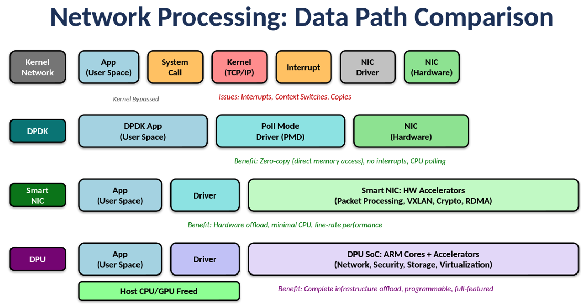
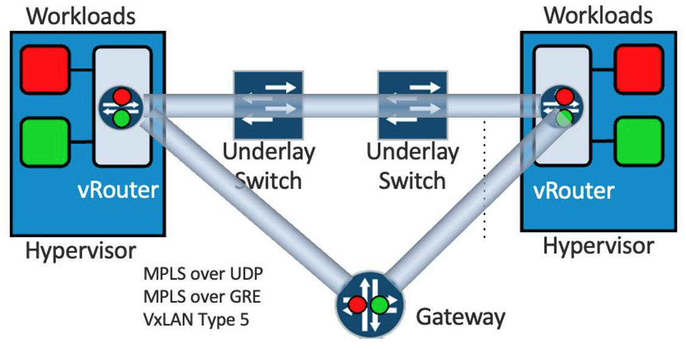
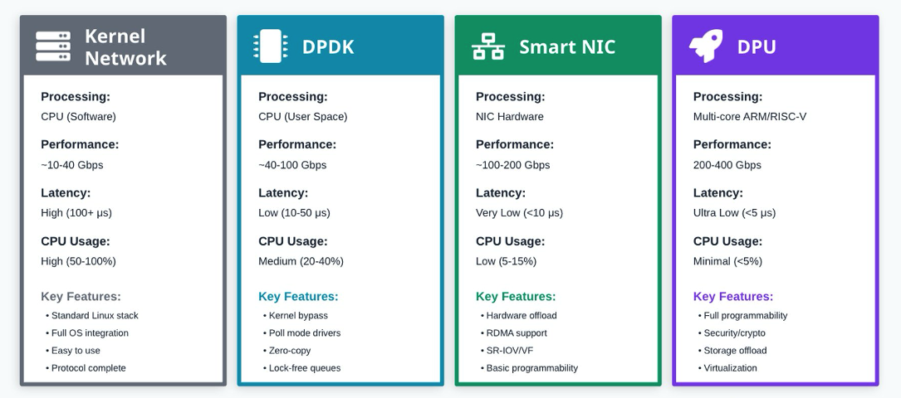
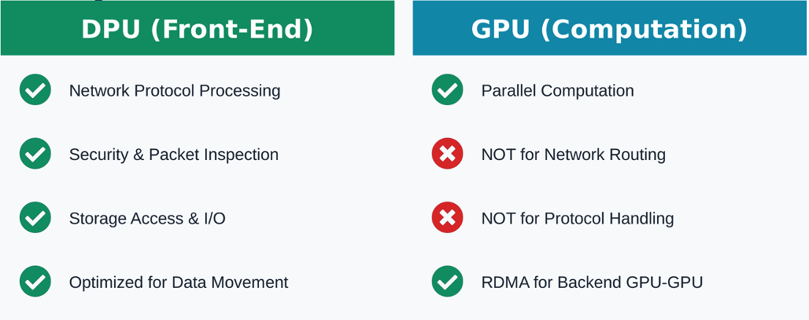
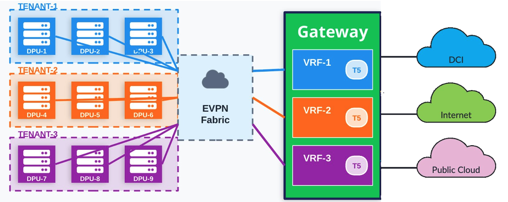

# Overlay Networking in AI Era

**Kashif Nawaz - 02/21/2026**

From Kernel Networking to DPU: Evolution of Data Processing and Gateway Tunneling

Cloud providers run huge numbers of concurrent AI workloads across shared infrastructure without them stepping on each other. How? Network overlay tunnels create isolated virtual networks, and DPUs handle all that tunnel processing so your host CPU can focus on actual workloads. The industry evolved through four generations to get here: kernel networking (slow, ate 20-30% of CPU), DPDK (faster user space processing), SmartNICs (hardware offload), and now DPUs (dedicated processors). Here's why each transition happened and what it means for AI infrastructure

This is the first article of a series of three. Part2 - [Juniper PTX Routers in Front-End Network](https://juniper.github.io/techposts/juniper-ptx-routers-in-front-end-network/article) and
Part3 - [DCI Edge for AI Front End Clusters with Juniper PTX](https://juniper.github.io/techposts/dci-edge-for-ai-front-end-clusters-part3/article).

## The Evolution of Network Processing

Looking back, it's clear how each generation tackled the problems of the one before it.

## Introduction: A Decade of Overlay Networking Evolution

The way we connect virtual workloads to physical networks has evolved significantly over the past decade. What started as simple kernel-based networking has grown into sophisticated DPU-powered solutions, all driven by one constant demand: performance.

## Kernal Networking

Back in 2018, I was working with Juniper Networks customers designing and deploying telco and IT private clouds. The dominant approach back then was straightforward - virtual routers running as kernel modules. These vRouters, particularly Juniper's Contrail platform, connected virtual workloads to physical networks using overlay tunnels. We relied heavily on MPLS over GRE, and later MPLS over UDP, to create isolated tenant networks. The tunnels ran from vRouter to Gateway (or border node), while the Data Center fabric served purely as transport.

Kernel vRouters worked well for traditional enterprise deployments: web servers and databases serving thousands of users could saturate 10G links with manageable CPU overhead and acceptable latency.

The problem? Kernel networking is interrupt-driven. Every packet triggers a cascade:

- application to kernel context switch,
- full TCP/IP stack processing,
- interrupt handling,
- driver processing,
- and back to userspace.

This architectural overhead becomes a bottleneck **when you hit real scale**: cloud providers running tens of thousands of tenant VMs, or telcos deploying NFV workloads for 5G core networks and edge computing.

Processing millions of packets per second through isolated overlay networks while maintaining sub-100-microsecond latency? Kernel networking can't keep up. CPU consumption spikes, latencies degrade, and scaling hits a wall. The industry needed a different approach.

## The DPDK Revolution

Then came DPDK (the Data Plane Development Kit).

I remember our first Contrail deployment with DPDK-based vRouters. The difference was massive. Kernel-based vRouters handled bulk traffic fine but fell apart on packet-intensive workloads - think millions of small packets per second. At 10 Gbps [[^1]](https://fuel-plugin-contrail.readthedocs.io/en/latest/dpdk.html) with minimum-size frames, you're processing 14.88 million packets per second. That's a new packet every 67 nanoseconds. Kernel networking couldn't keep up with the interrupt overhead and context switching [[^2]](https://www.juniper.net/documentation/en_US/contrail20/information-products/topic-collections/release-notes/topic-148951.html).

DPDK solved this by moving everything to userspace. Poll mode drivers, huge pages for memory management, direct NIC access. No kernel involvement at all. We could finally hit line rate on PPS-intensive workloads. **But you paid for it: dedicated CPU cores running at 100% in polling loops, even during idle periods.** No interrupts means constant polling. Great for steady traffic, wasteful otherwise.

And here's what didn't change: the actual work. Overlay tunnel encapsulation, IPsec encryption, ACL processing - still happening in software on those CPU cores. They weren't available for tenant workloads anymore. For dedicated network appliances, this was fine. For shared compute infrastructure running VMs or containers, you're sacrificing expensive CPU cycles for packet processing

## Enter Smart NICs

The next step was obvious: move packet processing to hardware.

Smart NICs brought dedicated silicon for the heavy lifting. VXLAN encap/decap in hardware, crypto engines for encryption, RDMA support for high-speed GPU-to-GPU communication. But the real win? You could run your DPDK vRouter on the Smart NIC itself. Corigine, for example, built solutions that offloaded the entire Contrail vRouter datapath to the Smart NIC - 20-23 Mpps throughput with just one CPU core[[^4]](https://www.corigine.com/UploadFiles/pdf/2021-08-04/153018875976334.pdf), compared to DPDK's 6 Mpps with 4 cores. Latency dropped to 70-84 microseconds for VM-to-VM traffic, roughly 6x better than kernel mode.

The Smart NIC approach gave us the best of both worlds: hardware acceleration without completely bypassing the vRouter software stack. The vRouter forwarding tables (interface tables, next-hop tables, FIB entries, flow tables) were mirrored on the Smart NIC for fast lookups, while the control plane stayed on the host. You kept all the SDN features and flexibility while getting massive performance gains.

Around the same time, the industry standardized on EVPN Type-5 for overlay tunneling. This was huge, we no longer needed vendor-specific implementations on gateway nodes to terminate MPLS over UDP or MPLS over GRE tunnels. EVPN Control plane (BGP with EVPN address families) has wider adaption, while the data plane uses standard VXLAN encapsulation.

## The AI Inflection Point

Then AI happened.

AI and machine learning workloads changed everything. Running inference at scale - serving thousands of model requests per second to end users - needs ultra-low latency network processing and massive bandwidth for the frontend infrastructure. While GPUs handle the backend training networks with RDMA and InfiniBand, the frontend networks serving inference workloads pushed DPU requirements to 400 Gbps. The question shifted from 'can we offload basic networking?' to 'can we handle 400 Gbps of inference traffic with overlay tunnels, encryption, and multi-tenancy while keeping latency under 5 microseconds?'

Smart NICs, despite all their benefits, started hitting walls in this AI-centric world. Sure, they could offload the vRouter datapath and deliver solid performance at 40GbE. But they were designed for specific, fixed-function offloads - VXLAN encap, crypto acceleration, RDMA support, vRouter table lookups. You couldn't run a full software stack on them. Adding new protocols or features wasn't easy. They couldn't juggle complex multi-function workloads - think storage offload (NVMe-oF), advanced security (stateful firewalls, DPI), and complete virtualization management all at once.

Worse, most Smart NICs were designed for 40-100G connectivity. As 200G and 400G NICs became standard for AI clusters, Smart NIC solutions struggled to scale while maintaining programmability and feature richness.

## DPUs: Infrastructure as a Separate Computer

A DPU isn't just a smarter NIC, it's fundamentally different. Think of it as a complete computer dedicated entirely to infrastructure, sitting right alongside your host CPU and GPUs.

**NVIDIA BlueField DPUs, AMD Pensando cards, Intel IPUs** - these are multi-core ARM or RISC-V processors (typically 8-16 cores) running full Linux with their own memory, their own accelerators, and connectivity engines capable of 200-400 Gbps. They can run virtual networking software like Open vSwitch (BlueField, Intel IPU) or P4-programmable pipelines (Pensando), IPsec for VPN encryption, NVMe-oF for storage offload, complete firewall stacks - all while the host CPU and GPUs stay 100% focused on actual compute work.

Figure 3 above displays a comparison of Network Data Path technologies.

For AI workloads, this matters. Every CPU cycle wasted on networking infrastructure is a cycle not spent training models or running inference. DPUs move all that overhead, networking, security, storage, virtualization, off the main processors and onto dedicated, purpose-built ARM cores.

The separation is clear: DPUs handle network protocol processing, security, and storage I/O - exactly the stuff that distracts GPUs from what they're built for: massive parallel computation for AI training and inference.

Here's what we learned:

- **Kernel Network**: Saturates 10G links with TCP, but struggles with PPS workloads. High latency (100+ us for small packets), CPU usage 50-100%
- **DPDK**: Excellent PPS (6 Mpps with 4 cores), latency down to 120-300 us range depending on tuning and release version [[^3]](https://www.juniper.net/documentation/en_US/day-one-books/contrail-DPDK.pdf). But still burns 20-40% CPU on forwarding
- **Smart NIC**: vRouter offloaded to hardware. 20-23 Mpps with just 1 CPU core [[^4]](https://www.corigine.com/UploadFiles/pdf/2021-08-04/153018875976334.pdf), latency 70-84 us VM-to-VM, native 40GbE line-rate
- **DPU**: Complete infrastructure offload at 200-400 Gbps, ultra-low latency (<5 us), host CPU practically freed (<5%)

## The GPU-as-a-Service Challenge

Here's where things get interesting.

Cloud providers and enterprises are offering GPUs as rental infrastructure now. Customers spin up training jobs, host models, run inference workloads, all on shared infrastructure. This creates two requirements that pull in opposite directions:

- **Maximum isolation**: Thousands of tenants, each needing their traffic completely separated
- **Minimum latency**: AI workloads are latency-sensitive and bandwidth-hungry

The old approach - tenant isolation at data center leaf switches using VLANs or VXLANs with multiple encapsulation points - doesn't scale.

Picture thousands of servers connected to hundreds of ToR (Top-of-Rack) switches. Every new tenant means touching multiple leaf switches, configuring VLANs, setting up routing policies. Worse, packets get encapsulated at the leaf, decapsulated at the spine, re-encapsulated for the gateway, decapsulated again at the border router. Each encap/decap adds microseconds of latency and processing overhead.

## A Better Approach: DPU-to-Gateway Tunneling

There's a cleaner way.

Instead of doing tenant isolation and tunnel encapsulation at every network layer, do it once at the DPU and terminate directly at the gateway.**

Here's how it works:

- **At the server**: The DPU handles all tenant isolation and encapsulates traffic into EVPN Type-5 VXLAN tunnels.
- **In the fabric**: The spine-leaf network does two things: EVPN control plane signaling (BGP) and IP forwarding. That's it.
- **At the gateway**: Tunnels terminate at the border router, which connects to other data centers, the Internet, and public clouds.

Look at the diagram in figure 5. Each tenant (TENANT-1, TENANT-2, TENANT-3) has multiple DPUs running workloads. All those DPUs create tunnels that pass through the EVPN fabric and land in their respective VRFs (VRF-1, VRF-2, VRF-3) at the Gateway. The EVPN fabric? It's just a cloud. It doesn't care about tenants - it forwards packets and exchanges EVPN Type-5 routes via BGP.

One encapsulation, one decapsulation. The data center fabric doesn't track tenants or VRFs. It just forwards IP packets based on EVPN signaling.

## What's Coming Next

In this blog series, I'll break down exactly how this works:

- How the data center fabric handles EVPN signaling without doing any encapsulation
- How gateway nodes terminate tunnels and provide multi-data center connectivity
- Scaling considerations for multi-tenancy in large deployments

Why route leaking matters when each tenant has both a service VRF and a management VRF

The promise is straightforward: connect bandwidth-hungry, latency-sensitive AI workloads to the physical world with maximum performance, minimum overhead, and the ability to onboard thousands of tenants without touching every switch in the fabric.

Let's dive in.

## Useful Links

- [1]: Juniper Networks, "Fuel Plugin Contrail Documentation - DPDK-based vRouter,"
[https://fuel-plugin-contrail.readthedocs.io/en/latest/dpdk.html ](https://fuel-plugin-contrail.readthedocs.io/en/latest/dpdk.html)
"The vRouter module can fill a 10G link with TCP traffic from a virtual machine (VM) on one server to a VM on another server."
- [2]: Juniper Networks, "Contrail Networking Release 2008 - Release Notes,"
[https://www.juniper.net/documentation/en_US/contrail20/information-products/topic-collections/release-notes/topic-148951.html](https://www.juniper.net/documentation/en_US/contrail20/information-products/topic-collections/release-notes/topic-148951.html)
"The latency for 64B packets is measured to be around 120 microseconds (us) in release 2008 as against 300-400 us prior to release 2008."
- [3]: Kiran K N, Ping Song, Przemyslaw Grygiel, Laurent Durand, "Day One: Contrail DPDK vRouter," Juniper Networks Books, January 2021.
[https://www.juniper.net/documentation/en_US/day-one-books/contrail-DPDK.pdf](https://www.juniper.net/documentation/en_US/day-one-books/contrail-DPDK.pdf)
- [4]: Corigine Inc., "Accelerating Contrail vRouter - White Paper," August 2021.
[https://www.corigine.com/UploadFiles/pdf/2021-08-04/153018875976334.pdf](https://www.corigine.com/UploadFiles/pdf/2021-08-04/153018875976334.pdf)
Performance testing shows Agilio CX SmartNIC achieving 20-23 Mpps with vRouter offload using 1 CPU core, compared to 6 Mpps for DPDK vRouter using 4 cores, and 70-84 microseconds VM-to-VM latency.
- Intro - Overlay Networking in AI Era: [https://juniper.github.io/techposts/overlay-networking-in-ai-era/article](https://juniper.github.io/techposts/overlay-networking-in-ai-era/article)
- Part2 - Juniper PTX Routers in Front-End Network: [https://juniper.github.io/techposts/juniper-ptx-routers-in-front-end-network/article](https://juniper.github.io/techposts/juniper-ptx-routers-in-front-end-network/article)
- Part3 - DCI Edge for AI Front End Clusters with Juniper PTX: [https://juniper.github.io/techposts/dci-edge-for-ai-front-end-clusters-part3/article](https://juniper.github.io/techposts/dci-edge-for-ai-front-end-clusters-part3/article)

## Glossary

- AI: Artificial Intelligence
- BGP: Border Gateway Protocol
- DPU: Data Processing Unit
- DPDK: Data Plane Development Kit
- EVPN: Ethernet Virtual Private Network
- GPU: Graphics Processing Unit
- GRE: Generic Routing Encapsulation
- IP: Internet Protocol
- MPLS: Multiprotocol Label Switching
- NFV: Network Functions Virtualization
- NIC: Network Interface Card
- RDMA: Remote Direct Memory Access
- UDP: User Datagram Protocol
- VXLAN: Virtual Extensible LAN
- vRouter: Virtual Router
