# Packet Filtering on Juniper Silicon - A True Differentiator

**Nicolas Fevrier - 09/26/2025**

Learn why the Trio and Express "Firewall Filters" (ACL) are truly unique in this industry.

An article co-written by David Roy and Nicolas Fevrier

## Introduction

Every vendor in the networking industry will regularly claim groundbreaking innovations and unique game-changing features, ignoring that, for most customers, the reality boils down to one simple truth: they're just using good-enough boxes with holes to plug in fiber connectors.

However, in certain areas, true differentiators do exist. And that's precisely the topic of this article: why packet filtering on Juniper Silicon really stands out from the competition.

This article completes the video posted on Juniper's YouTube channel: *https://www.youtube.com/watch?v=Tcypdvk4COA*

### Juniper Silicon

In the context of this publication, we will discuss Express and Trio ASICs, the Packet Forwarding Engines (PFEs) that power the PTX Series and MX Series, respectively. We will describe the various options available for implementing firewall filters in these product lines.

> *Note that the ACX7000 and QFX series are based on different PFE types, namely DNX Jericho/Qumran (second and third generation) and XGS Tomahawk/Trident, which implement filters via internal or external TCAM memories. Therefore, they are outside the scope of this post.*

The Juniper's implementation is different between PTX/Express and MX/Trio.

In this publication, we will present different approaches:

- Microcode/DMEM (Data Memory)
- Fast-Lookup-Tuple in DMEM
- Fast Lookup Table (FLT)
- Hybrid Model with FLT and DMEM

Many excellent articles have been published on Juniper Networks TechPost, covering in-depth several of these topics. Instead of re-inventing the wheel, we will invite you to read these existing publications.

- "Express 4 Filters -- Foundation" by Dmitry Bugrimenko: [https://juniper.github.io/techposts/express-4-filters-foundation/article](https://juniper.github.io/techposts/express-4-filters-foundation/article)
- "Fast Lookup Tuple: an Innovative Filtering Feature" by David Roy: [https://juniper.github.io/techposts/fast-lookup-tuple-an-innovative-filtering-feature/article](https://juniper.github.io/techposts/fast-lookup-tuple-an-innovative-filtering-feature/article)
- "Flex Offset Filters in Express5" by Chandrasekaran Venkatraman: [https://juniper.github.io/techposts/flex-offset-filters-in-express5/article](https://juniper.github.io/techposts/flex-offset-filters-in-express5/article)

## But First, The Basics

At the risk of stating the obvious, let's start with a quick description of what a Firewall Filter is, a Filter Term, and where they are applied.

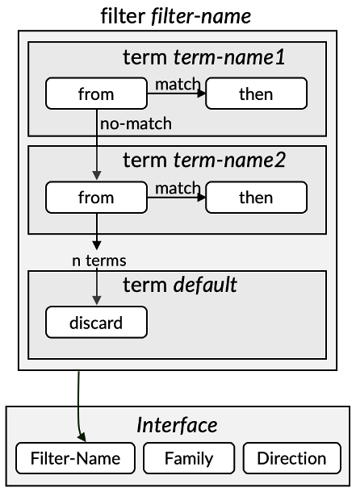

In terms of vocabulary, you can replace Firewall Filters (FF) with Access-Lists (ACL) and Filter Terms by Access-List Entries (ACE) if you are more familiar with other vendors' terminology.

A ***Filter*** is identified by a ***filter-name*** defined via configuration and is composed of one or several ***Terms***, themselves determined by ***term-names***.

- The Terms contain a description of the criteria they will use to categorize the packet and a list of actions they will apply in case of a successful match.
- The match conditions are detailed under the "from" statement
    - A 5-tuple match refers to the common set of conditions: source address, source port, Destination-address, Destination-port, and Protocol
    - Many other fields can be used, including a specific sequence of bits in the payload when hardware supports it
- The actions are defined under the 'then' statement.

When a packet match condition is not met, the system moves to the following term in the filter. An implicit default (last) term is always present. It applies an action if none of the configured terms matched the packet successfully.

Finally, the firewall filter is applied to an "attachment point". It could be of very different kinds, but for simplicity's sake, in this publication, we will limit ourselves to an interface, an address family, and a direction (ingress or egress traffic).

Figure below illustrates it with a configuration example.

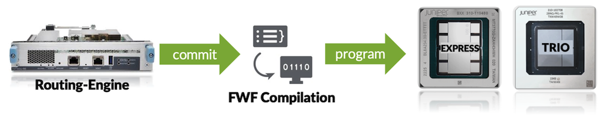

The configuration is passed and committed on the Routing Engine. It will be analyzed, compiled, and optimized by Junos, and then passed to the hardware for programming.

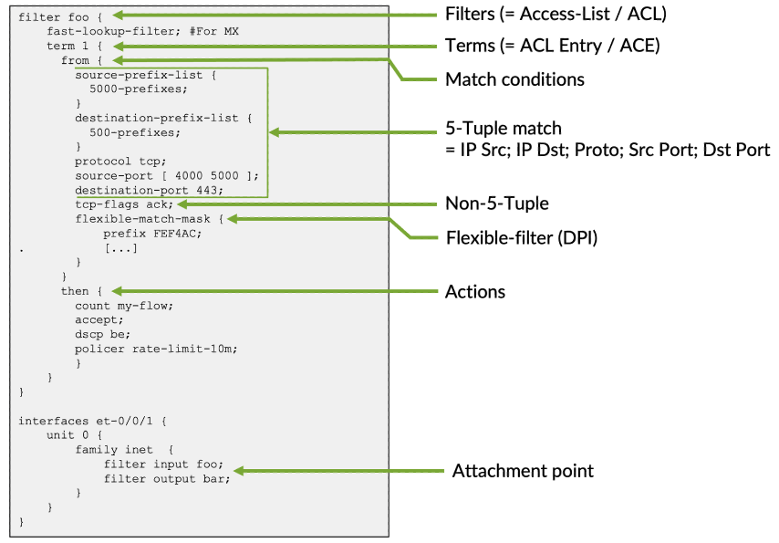

## A Bit of History

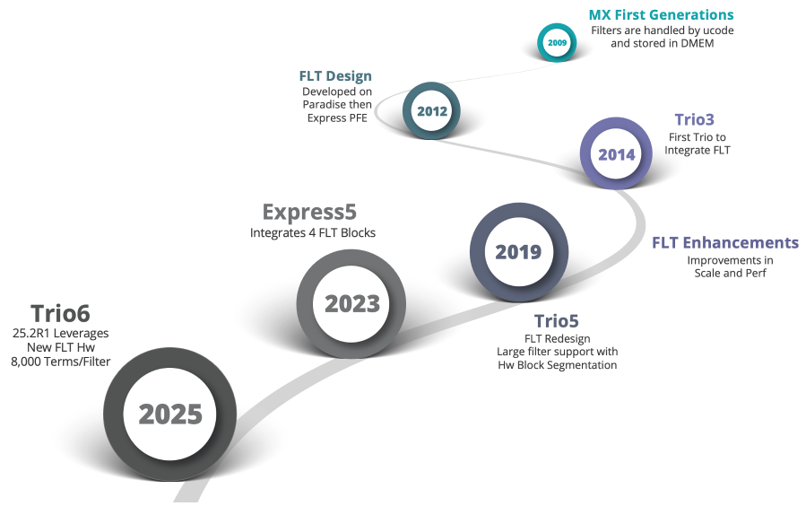

When we introduced the first MX products on the market, the FF implementation was only leveraging the Microcode (ucode), and information was stored in DMEM. To date, it's still the default behavior when you don't specifically instruct the machine to use a different approach.

Around 2012, the first generation of Express chipsets was developed, and Juniper engineers decided to introduce the FLT (Fast Lookup Table) block to handle firewall filters on PTX. It's a dedicated hardware specifically designed for this role in the pipeline architecture. FLT handles the entirety of the filter implementation, and still, this remains the case in all PTX devices, including the latest Express5.

This is a perfect example of innovation cross-pollination, the work done on FLT for PTX has been reused and adapted for MX, beginning with Trio3 around 2014. We will dive deeper into this topic later in this article, but in a nutshell, we can present the FLT block as a hardware accelerator component that specifically handles the 5-tuple section of the filter while still relying on the ucode/DMEM for the rest of the packet processing.

With new ASIC generations, additional improvements have been added to the FLT capabilities.

## Challenges with Firewall Filters

The Firewall Filter is a critical feature when the router is used at the border of the domain. In an ideal world, they should be capable of inspecting packets at different levels of their header, mixing various match criteria, without significantly impacting forwarding performance (both in terms of Gbps and packet latency), and, of course, at scale (potentially hundreds of thousands of terms).

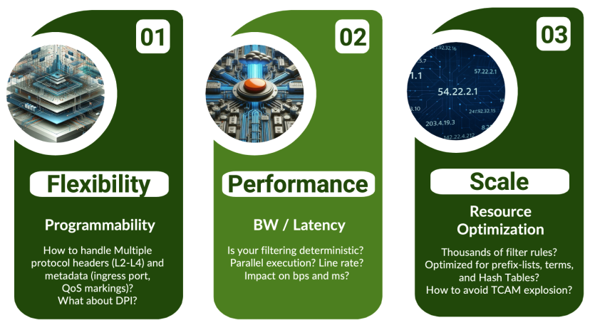

The MX and PTX routers have been designed to address these challenges and stand out from the crowd with truly unique capabilities.

## Filtering in PTX Series

In this section, we will briefly describe filters on PTX series, but we invite you to read  "Express 4 Filters -- Foundation": [https://juniper.github.io/techposts/express-4-filters-foundation/article](https://juniper.github.io/techposts/express-4-filters-foundation/article)

Dmitry Bugrimenko covered the topic in great detail.

### FLT Block

The Fast Lookup Table block is a hardware component located inside the Express chipset. It is used by both the ingress and egress pipeline.

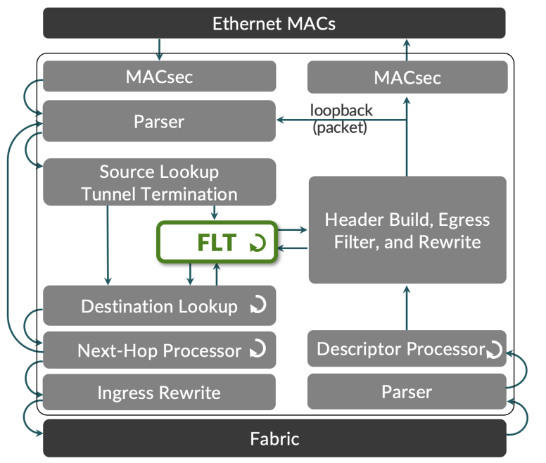

Unlike the MX Series implementation, the entire filtering job is handled by the FLT block in the Express 5 chipsets.

The FLT block can process up to 256 filter terms in parallel within a single clock cycle. If more terms are present (up to 2,000 tested, but potentially up to 8,000), it can still handle them, though with a trade-off in forwarding performance.

On Express4, one FLT block is shared between the two datapaths (DP) of the package.

On Express5, we have one FLT block per DP (with a maximum of four datapaths in BXX, so four FLT blocks are present).

Double-clicking on the block, we notice several functional sub-blocks:

- A key dispatcher responsible for extracting the various fields from the packet header
- 2x ALPHA: optimized for IPv4/IPv6 address lookup (and used for source and destination)
- 2x BETA: optimized for range-based matches, like port numbers, and therefore used for source and destination ports
- 1x TCAM: for other fields not addressed by ALPHA and BETA blocks
- The Cover Vector will aggregate the results and pass the final decision to the ACTIONS block

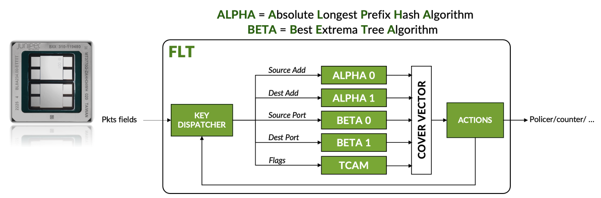

Since the PTX routers are designed for high bandwidth, Juniper engineers optimized the FLT block for packet forwarding performance.

## Filtering in MX Series

### Default Behavior: ucode and DMEM

The initial packet filtering implementation, and the current default behavior, is based on the Trio microcode (ucode) and the DMEM.

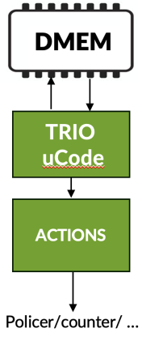

The Trio PFE is a run-to-completion Forwarding ASIC where the packet processing is handled by a matrix of parallel Packet Processing Elements (PPEs). Each PPE receives the packet, or a portion of it, and the microcode executes a series of instructions based on the configuration. It can access many different memory spaces to perform its job, including the Data Memory (DMEM).

The packet walkthrough is detailed in this article: [https://juniper.github.io/techposts/trio-6-packet-walkthrough/article](https://juniper.github.io/techposts/trio-6-packet-walkthrough/article)

In this mode of operation, the filter terms are processed sequentially: each match condition is compared to the packet headers, and if it fails to match, we proceed to the next term until a match is found or until the last default term is reached.

```
filter foo {
    term 1 {
      from {
        source-prefix-list {
          5000-prefixes; 
        }
...
```

The terms are compiled into a Longest Prefix Match (LPM) K-tree and stored in the DMEM.

As the "run-to-completion" implies, it may take more or less time to execute this operation, and the definition/ordering of the FF terms becomes essential to optimize the performance. The key differentiator of this approach is its high programmability and flexibility, combined with its high scale. We successfully tested up to 1 million prefixes in these filters.

### Fast Lookup Tuple

This feature should not be confused with the FLT (Fast Lookup Table) block despite sharing the same three-letter acronym.
It was introduced with Junos 24.2.R1 and has been extensively covered in the article [https://juniper.github.io/techposts/fast-lookup-tuple-an-innovative-filtering-feature/article](https://juniper.github.io/techposts/fast-lookup-tuple-an-innovative-filtering-feature/article)

Note: Fast Lookup Tuple is limited to 5-tuple lookup and only host IPv4 addresses (/32 only, no wildcard mask).

```
[edit policy-options]
bob@mx304# show
fast-lookup-tuple-list FLOWS_TO_BLOCK {
    113.13.155.46:160.108.17.73:6:30880:19708;
    17.30.62.173:79.210.62.255:17:5489:63829;
    173.156.234.0:67.159.218.146:17:63131:58908;
}
[edit firewall family inet filter FAST-LOOKUP-TUPLE-FILTER]
bob@mx304# show 
term 1 {
    from {
        fast-lookup-tuple-list {
            FLOWS_TO_BLOCK;
        }
    }
    then {
        count TERM1-CPT;
        discard;
    }
}
term 2 {
    from {
        fast-lookup-tuple {
            157.198.226.119:49.51.134.39:17:52480:14070;
        }
    }
    then {
        next-ip 172.172.0.2/32;
    }
}
term end {
    then accept;
}
```

In a nutshell, we are using a specific key compilation for a very fast lookup of the Microcode in the DMEM. With this technology, we can scale up to 256,000 prefixes.

It will create a very long hash key that can be processed by the ucode in a single clock tick.

This powerful feature can be used to assist security appliances: they can "delegate" the packet filter role to the neighbouring MX router. To program these entries as fast as possible, we will use the ephemeral database (DB).

### Hybrid Mode with Fast Lookup Table and Microcode

The FLT block, initially developed for the Express architecture, was introduced in Trio starting with the 3rd generation. It can be viewed as a specialized component that accelerates the treatment of a specific portion of the filters: the 5-tuple entries.

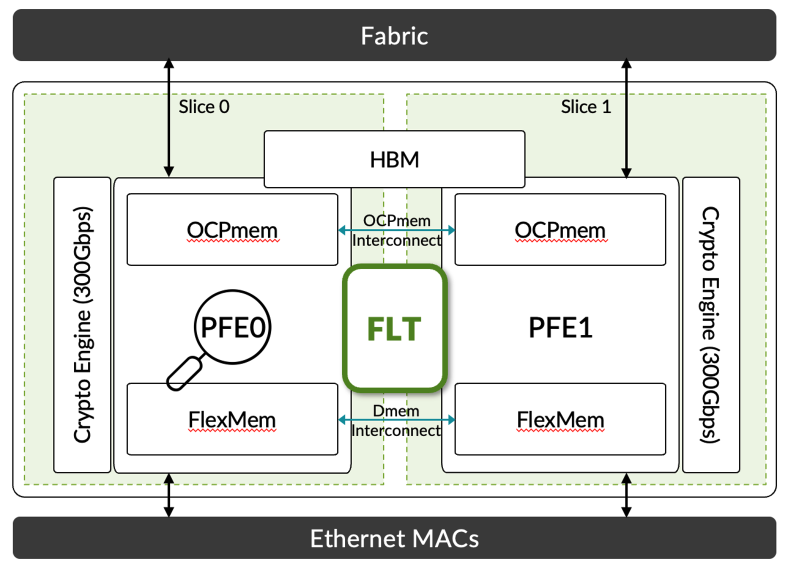

The FLT resource is shared between the two "PFEs" of a Trio6 package (the datapaths).

The feature is enabled with a special keyword in the filter configuration: "fast-lookup-filter"

```
filter foo {
    fast-lookup-filter;
    term 1 {
      from {
        source-prefix-list {
          5000-prefixes; 
        }
...
```

The Express original design has been modified to fit MX requirements (both in terms of performance and flexibility).

You'll notice the following differences:

- A single ALPHA block handles both source and destination addresses
- The TCAM block is not used in this implementation
- No action performed on the FLT block, the result of the cover vector is passed back to the Microcode

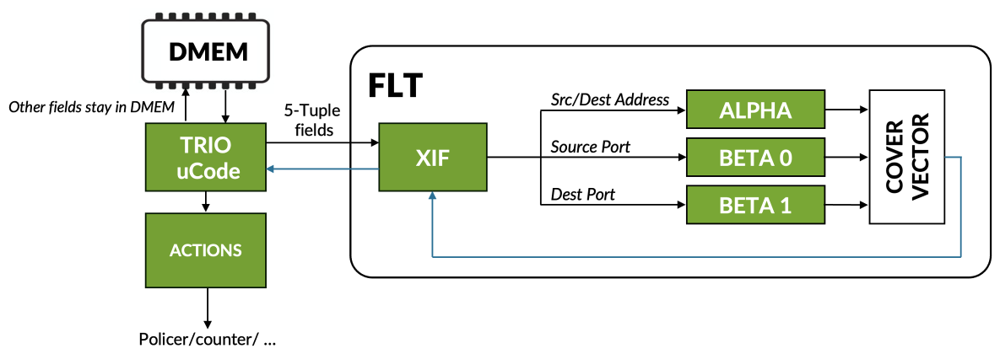

Since we mix the FLT and the ucode to execute the filter task, this implementation is called "hybrid". The FLT block here only handles the 5-tuple fields, and every other match conditions and the actions are performed by the Microcode.

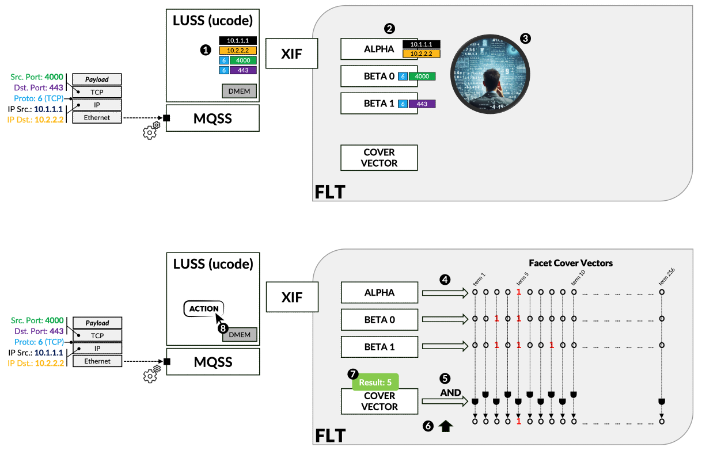

- Step1; The 5-tuple fields are extracted and passed to the FLT block through XIF (the XIF block is an intermediary block that connects LUSS crossbars to blocks outside the LUSS)
- Step2: Each field is routed to its designated block, aka. "Facet", for algorithm execution
- Step3: Each facet's algorithm analyses up to 256 terms in one clock cycle
- Step4: We call the results "Facet Cover Vector". It represents all the match results for up to 256 terms
- Step5: The Cover Vector (CV) computes the final match vector by performing a bitwise logical "AND" function
- Step6: Scan the results until the first asserted bit is found: this is the term that matches all criteria
- Step7: The result (direct match or full CV, depending on cases) is returned to the LUSS uCode
- Step8:  uCode may perform an additional search on "non-flt-criteria",
- Finally, it applies the Actions

## A Rich Filtering Toolkit

In this section, we will not describe every single match criterion supported by Juniper routers. Instead, we will focus on a few precise options that make Juniper's filtering toolkit truly unique in the market.

Filtering criteria can generally be grouped into two categories:

- Frame fields: anything from the Ethernet layer up to the packet payload (the DPI function is part of the flexible-match filtering solution, which is out of the scope of this article).
- Frame-associated metadata: additional information that is only meaningful internally to the system, such as the ingress interface, the associated class of service, or the SCU and/or DCU (Source/Destination-Class Usage) tags if present.

It should be noted that filtering on Juniper can be applied across all protocol families, including MPLS. A special family called ANY also allows for family-agnostic filtering of packets. Of course, this can be combined with family-specific filtering as shown in the example below.

It is essential to note that ANY filtering is evaluated first, followed by family-specific filtering if configured.

```
et-0/1/0 {
    unit 0 {
        filter {
            input FWF-ANY;
        }
        family inet {
            filter {
                input FWF-INET;
            }
            address 192.85.1.1/24;
        }
        family inet6 {
            filter {
                input FWF-INET6;
            }
            address 2001::1/64;
        }
        family mpls {
            filter {
                input FWF-MPLS;
            }
        }
    }
}  
```

Let's examine some of the more advanced and less common match criteria supported by Juniper hardware. A key capability is the ability to inspect traffic within a tunnel. For a given protocol family, Juniper filters can analyze not only fields in the outer frame header but also fields within the inner encapsulated header. The following example illustrates IPv4 tunneling with GTP filtering.

> *Note: GTP (GPRS Tunneling Protocol) is a 3GPP-defined protocol used in mobile networks to transport user data and signaling between core network functions (e.g., SGSN, GGSN, MME, SGW, PGW). It enables tunneling, mobility management, and session handling across 2G, 3G, 4G, and 5G networks.*

```
set firewall family inet filter foo term 1 from gtp-header ipv4 ?
Possible completions:
  <[Enter]>            Execute this command
+ apply-groups         Groups from which to inherit configuration data
+ apply-groups-except  Don't inherit configuration data from these groups
> destination-address  Match IPv4 destination address
+ destination-port     Match TCP/UDP destination port
+ destination-port-except  Do not match TCP/UDP destination port
> destination-prefix-list  Match IPv4 destination prefixes in named list
+ protocol             Match IP protocol type
+ protocol-except      Do not match IP protocol type
> source-address       Match IPv4 source address
+ source-port          Match TCP/UDP source port
+ source-port-except   Do not match TCP/UDP source port
> source-prefix-list   Match IPv4 source prefixes in named list
```

Another example is the ability to inspect the MPLS payload. As shown below, Juniper hardware can apply filters directly to an IPv4 payload encapsulated within an MPLS frame:

```
lab@rtme-mx304-06# set firewall family mpls filter foo term 1 from ip-version ?
Possible completions:
+ apply-groups         Groups from which to inherit configuration data
+ apply-groups-except  Don't inherit configuration data from these groups
> ipv4                 Define L4 match items to match IPv4 packets
> ipv6                 Define L3/L4 match items to match IPv6 packets
[edit]

lab@rtme-mx304-06# set firewall family mpls filter foo term 1 from ip-version ipv4 ?
Possible completions:
  <[Enter]>            Execute this command
+ apply-groups         Groups from which to inherit configuration data
+ apply-groups-except  Don't inherit configuration data from these groups
> destination-address  Match IPv4 destination address
> destination-prefix-list  Match IPv4 destination prefixes in named list
+ dscp                 Match Differentiated Services (DiffServ) code point
  fragment-flags       Match fragment flags (in symbolic or hex formats) - (Ingress only)
  is-fragment          Match if packet is a fragment
> protocol             Specify inner IPv4 protocol
> source-address       Match IPv4 source address
> source-prefix-list   Match IPv4 source prefixes in named list
  tcp-established      Match packet of an established TCP connection
  tcp-initial          Match initial packet of a TCP connection
```

Another less common but handy feature is the -except option available for many fields. It may seem trivial, but implementing this type of "match" in hardware is not straightforward.
For example, on the MX platform, the following fields support the -except option for the IPv4 family:

```
+ destination-class-except Do not match destination class
+ destination-port-except  Do not match TCP/UDP/SCTP destination port
+ dscp-except              Do not match Differentiated Services (DiffServ) code point
+ esp-spi-except           Do not match IPSec ESP SPI value
+ forwarding-class-except  Do not match forwarding class
+ fragment-offset-except   Do not match fragment offset
+ gre-key-except           Do not match GRE Key
+ icmp-code-except         Do not match ICMP message code
+ icmp-type-except         Do not match ICMP message type
+ interface-group-except   Do not match interface group
+ ip-options-except        Do not match IP options
+ loss-priority-except     Do not match Loss Priority
+ packet-length-except     Do not match packet length
+ policy-map-except        Do not match policy map
+ port-except              Do not match TCP/UDP/SCTP source or destination port
+ precedence-except        Do not match IP precedence value
+ protocol-except          Do not match IP protocol type
+ slice-except             Do not match on network slice
+ source-class-except      Do not match source class
+ source-port-except       Do not match TCP/UDP/SCTP source port
+ ttl-except               Do not match IP ttl type
```

Similarly, for IPv6:

```
+ destination-class-except  Do not match destination class
+ destination-port-except   Do not match TCP/UDP destination port
+ extension-header-except   Do not match extension headers
+ forwarding-class-except   Do not match forwarding class
+ gre-key-except            Do not match GRE Key
+ hop-limit-except          Do not match Hop Limit
+ icmp-code-except          Do not match ICMP message code
+ icmp-type-except          Do not match ICMP message type
+ interface-group-except    Do not match interface group
+ loss-priority-except      Do not match Loss Priority
+ next-header-except        Do not match next header protocol type
+ packet-length-except      Do not match packet length
+ payload-protocol-except   Do not match payload protocol type
+ policy-map-except         Do not match policy map
+ port-except               Do not match TCP/UDP source or destination port
+ slice-except              Do not match on network slice
+ source-class-except       Do not match source class
+ source-port-except        Do not match TCP/UDP source port
+ traffic-class-except      Do not match Differentiated Services (DiffServ) code point
```

And for MPLS (note: the -except option is also supported by other families not listed here):

```
+ exp-except              Do not match MPLS EXP bits
+ forwarding-class-except Do not match forwarding class
+ loss-priority-except    Do not match Loss Priority
+ policy-map-except       Do not match policy map
+ slice-except            Do not match on network slice
```

Important to note is the capability to use the except keyword with source or destination prefix-list as well:

```
set firewall family inet filter foo term 1 from destination-prefix-list <PRFX-LIST> except
set firewall family inet filter foo term 1 from source-prefix-list <PRFX-LIST> except
set firewall family inet filter foo term 1 from prefix-list <PRFX-LIST> except
```

A simple, yet often unavailable, feature in competing solutions is the ability to reference multiple prefix-lists within a single term, eliminating the need to repeat the same term for each prefix-list. The number of possible combinations can skyrocket when combining X source prefix-lists with Y destination prefix-lists. Of course, it is still possible to merge multiple prefix-lists into one, but this reduces configuration clarity and, more importantly, prevents maintaining separate address pools in named prefix-lists for specific purposes.

Additionally, some implementations may impose limits on the number of entries per prefix-list, adding further complexity to an operator's security policy configuration. See below a typical example:

```
filter foo { 
    term 1 { 
        from { 
            source-prefix-list { 
                FR-DC;  
                UK-DC;  
                US-DC;  
                NL-DC;  
            } 
            destination-prefix-list { 
                CDN-POOL-1;  
                CDN-POOL-2;  
                CDN-POOL-3; 
                CDN-POOL-4;  
                CDN-POOL-5;  
            } 
        } 
        then accept; 
    } 
}
```

For more unusual TCP-layer filtering, you can also take advantage of Junos' advanced TCP flag filtering capabilities. Junos supports logical operations on TCP flags, as illustrated in the following example:

```
set firewall family inet filter foo term 1 from tcp-flags "(syn & ack) | rst"  
```

> *Note: On PTX, the protocol field with the value 'tcp' is required for configuring tcp-flags, tcp-initial, or tcp-established.*

Let's move on to the second category of filtering: metadata. As mentioned earlier, the operating system attaches metadata internally during the forwarding process. Some of this metadata is added by default without any configuration (for example, the frame length, the packet's family, or the incoming interface). Still, it is also possible to leverage SCU/DCU features to insert specific tags into the packet during the lookup process. I recommend reading the dedicated techpost related to SCU/DCU for more details about these capabilities ([https://juniper.github.io/techposts/traffic-accounting-with-mx-features/article](https://juniper.github.io/techposts/traffic-accounting-with-mx-features/article))

Here is below the list of supported metadata match criteria supported on MX for the 3 main families:

| Feature | Description | IPv4 | IPv6 | MPLS |
|:--|:--|:--|:--|:--|
| destination-class | Match destination class | x | x |  |
| destination-class-except | Do not match destination class | x | x |  |
| first-fragment | Match if packet is the first fragment | x | x |  |
| forwarding-class | Match forwarding class | x | x | x |
| forwarding-class-except | Do not match forwarding class | x | x | x |
| interface | Match interface name | x | x | x |
| interface-group | Match interface group | x | x | x |
| interface-group-except | Do not match interface group | x | x |  |
| interface-set | Match interface in set | x | x | x |
| is-fragment | Match if packet is a fragment | x | x |  |
| last-fragment | Match if packet is last fragment | x | x |  |
| loss-priority | Match Loss Priority | x | x | x |
| loss-priority-except | Do not match Loss Priority | x | x | x |
| packet-length | Match packet length | x | x |  |
| packet-length-except | Do not match packet length | x | x |  |
| policy-map | Match policy map | x | x | x |
| policy-map-except | Do not match policy map | x | x | x |
| redirect-reason | Match Redirect Reason | x |  |  |
| sctp-initial | Match initial packet of a SCTP connection | x |  |  |
| service-filter-hit | Match if service-filter-hit is set | x | x |  |
| slice | Match on network slice | x | x | x |
| slice-except | Do not match on network slice | x | x | x |
| source-class | Match source class | x | x |  |
| source-class-except | Do not match source class | x | x |  |
| tcp-established | Match packet of an established TCP connection | x | x |  |
| tcp-initial | Match initial packet of a TCP connection | x | x |  |

And the same for PTX:

| Feature | Description | IPv4 | IPv6 | MPLS |
|:--|:--|:--|:--|:--|
| destination-class | Match destination class | x | x |  |
| destination-class-except | Do not match destination class | x | x |  |
| first-byte-of-payload | Match first byte of payload packet | x | x |  |
| first-byte-of-payload-except | Do not match first byte of payload packet | x | x |  |
| first-fragment | Match if packet is the first fragment | x | x* |  |
| forwarding-class | Match forwarding class | x | x | x |
| forwarding-class-except | Do not match forwarding class | x | x | x |
| interface | Match interface name | x | x |  |
| interface-group | Match interface group | x | x |  |
| interface-group-except | Do not match interface group | x | x |  |
| is-fragment | Match if packet is a fragment | x | x* |  |
| loss-priority | Match Loss Priority | x | x | x |
| loss-priority-except | Do not match Loss Priority | x | x | x |
| packet-length | Match packet length | x | x |  |
| packet-length-except | Do not match packet length | x | x |  |
| policy-map | Match policy map | x | x |  |
| policy-map-except | Do not match policy map | x | x |  |
| redirect-reason | Match Redirect Reason | x |  |  |
| source-class | Match source class | x | x |  |
| source-class-except | Do not match source class | x | x |  |
| tcp-established | Match packet of an established TCP connection | x | x |  |
| tcp-initial | Match initial packet of a TCP connection | x | x |  |

We won't go into detail on each of them, but let's double-click on an often-overlooked knob that can be very useful in specific challenging scenarios: the service-filter-hit.

This knob is particularly useful in complex network environments, where different traffic types pass through multiple filters, making it crucial to optimize packet processing and minimize unnecessary evaluations. Junos OS provides a mechanism to efficiently skip specific filters once a previous filter has processed a packet.

The service-filter-hit action marks a packet when it matches specific conditions in a filter term. The following filters in the chain can recognize this mark and skip further processing for that packet, thus improving overall forwarding performance. Let's do a simple example described here [https://www.juniper.net/documentation/us/en/software/junos/subscriber-mgmt-services/topics/example/firewall-filter-bypass.html](https://www.juniper.net/documentation/us/en/software/junos/subscriber-mgmt-services/topics/example/firewall-filter-bypass.html) and summarized below.

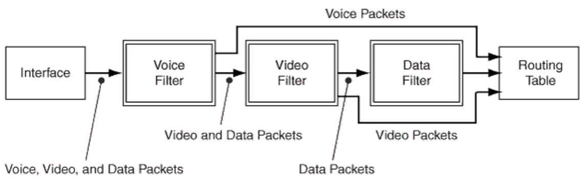

In this example, voice traffic is processed first, followed by video traffic, and then data traffic. Each traffic type is filtered independently, and once processed, it is marked so that subsequent filters can skip it.

Here is the configuration to achieve this custom filter processing order:

```
set firewall filter voice term T1 from address 203.0.113.11/32
set firewall filter voice term T1 from source-port 5004-5005
set firewall filter voice term T1 then forwarding-class assured-forwarding service-filter-hit accept
set firewall filter voice term default then accept
 
set firewall filter video term T1 from service-filter-hit
set firewall filter video term T1 then accept
set firewall filter video term T2 from source-address 203.0.113.100/32
set firewall filter video term T2 then policer video-policer service-filter-hit accept
set firewall filter video term default then accept
 
set firewall filter data term T1 from service-filter-hit
set firewall filter data term T1 then accept
set firewall filter data term T2 then policer data-policer service-filter-hit accept  
```

Key Benefits of this filtering knob:

- Performance Optimization: Minimizes unnecessary filter evaluations by skipping packets that have already been classified.
- Simplified Policy Management: Enables operators to build filter chains more efficiently without duplicating terms for traffic that has already been processed.
- Support for Complex Traffic Scenarios: Particularly useful when multiple traffic classes need independent processing.

To conclude this section, it is worth noting that Junos imposes no limits on the number of prefixes within a prefix-list, nor on the number of unique prefix-lists per system. For IPv6, the fully expanded and compressed prefix formats (e.g., 2001:db8::1) are supported, which is not the case for all implementations. In addition, a single term can accommodate an unrestricted number of prefix combinations. This flexibility is possible because Junos does not rely on a TCAM-based approach for prefix lookups. And don't forget that the system itself will optimize your firewall filters. Upon configuration commit, a firewall compiler process -- DFWC - converts the user-specified configuration into a compiled format used by the kernel. At this point, referenced prefix lists are expanded, and optimizations are performed:

- Eliminating unreachable actions: For instance, packets that cannot match a counter may be excluded from the compiled program.
- Merging adjacent prefixes or ranges eliminates the need for manual merging of prefixes or ranges.
- Reorganizing match conditions across terms: Ensures optimization without altering the filter's logic.
- Skipping irrelevant rules: Terms are processed sequentially, but unmatched conditions can trigger a skip, allowing the evaluation to proceed without unnecessary rules that cannot match.

## A Competitive Comparison

The FLT or DMEM (for MX) approaches represent a unique filtering solution in the networking industry. They enable scalability in scenarios where other implementations, typically relying on more conventional methods, would struggle to do so. One of the most common techniques for filtering is the use of TCAM. Even at Juniper, we employ TCAM on smaller platforms such as ACX or on switching devices like QFX, where it remains well-suited for limited filtering requirements. In this section, we will review several real customer use cases that highlight the value of Juniper's distinctive filtering architecture.

First, let's review how TCAM works in a few lines.

TCAM-based filtering utilizes a ternary content-addressable memory (TCAM), a specialized type of hardware memory designed for fast lookups. Unlike regular memory, which retrieves data by address, TCAM performs parallel searches by comparing a key against all stored entries simultaneously.

For IP filtering, relevant packet header fields (such as source/destination IP, protocol, and port numbers) are converted into lookup keys. TCAM entries store rules as bit patterns with mask bits; each bit can be 0, 1, or "don't care" (X) value, allowing for flexible prefix matching, such as IP subnets of different sizes.

When a packet arrives, its header is compared in parallel to all entries, and the highest-priority match determines the filtering action (permit, deny, forward, etc.). For IPv6, with its 128-bit addresses, TCAM is also supported, though it uses more cost and power.

The major drawback with TCAM is scalability as ACLs grow large. Each prefix or rule combination must be expanded into TCAM entries. With thousands of complex ACL terms, this can cause TCAM explosion, surpassing the physical capacity of the device. It limits the size of ACLs and can also waste memory due to inefficient rule expansion. The explosion effect is especially noticeable with large IPv6 ACLs or when combining multiple matching conditions.

We know that some competing solutions rely on large TCAMs, typically partitioned between ingress and egress filtering. In addition, certain implementations impose software limits on the number of TCAM entries that can be generated per ACL term. As a result, filtering rules that appear straightforward on paper may, in practice, expand into a vast number of TCAM entries. In the best case, this forces the rules to be split into smaller combinations, but more often it leads to programming failures during deployment.
Let's take a few real examples and try to figure out how many TCAM entries these simple terms may consume:

**Example 1:**

```
term tcp_inbound_only_allowsynack {
    from {
        source-prefix-list VALID-SRC-ADDRESSES;
        destination-prefix-list TARGET-DEST-ADDRESSES;
        protocol tcp;
        tcp-flags "( syn & ack ) | rst";
    }
}  
```

In this first real-life example, the source prefix list contained 732 entries, while the destination prefix list included 126 addresses. To estimate the number of TCAM entries required for this term, we need to consider the dimensions of each match criterion:

- Source prefix-list size: 732
- Destination prefix-list size: 126
- TCP flag combinations: 2

By simple multiplication, this results in approximately 184,464 TCAM entries (732 x 126 x 2).

**Example 2:**

```
term v4-anon-source-address-response {
    from {
        gtp-header {
            ipv4 {
                protocol [ tcp udp ];
                source-port [ 80 443 ];
                source-prefix-list {
                    anon-v4-source-list;
                }
            }
        }
    }
}  
```

In this second real-life use case, we are matching GTP traffic (a mobile tunneling protocol, as discussed in the previous section). To estimate the likely number of TCAM entries consumed, we again consider the dimensions of each match criterion:

- Protocols: 2
- Source ports: 2
- Source prefix-list size: 50,007

Some implementations can optimize the protocol dimension by treating the tuple (UDP + TCP) as a single protocol. Calculating both scenarios:

- With optimization: 100,014 TCAM entries (1 x 2 x 50,007)
- Without optimization: 200,028 TCAM entries (2 x 2 x 50,007)

These two examples illustrate how the number of TCAM entries can grow dramatically, even for seemingly simple ACLs. While we won't enumerate all real-world cases, it's worth noting that many similar scenarios exist. Another way to demonstrate the effectiveness of FLT/DMEM Juniper solutions is to conduct some lab tests with a pre-determined prefix-list size and compare both approaches: the Juniper solution with an MX304 and a TCAM-based competitive solution (let's say equipped with a large TCAM of 512K entries)

The IPv4 filter we intend to deploy consists of 12 identical terms. Each term includes:

- A source prefix-list containing 128 entries
- A destination prefix-list also containing 128 entries
- Protocol: TCP
- Source port: a single unique port
- Destination port: a range of 3 ports

The figure below illustrates the design of this filter:

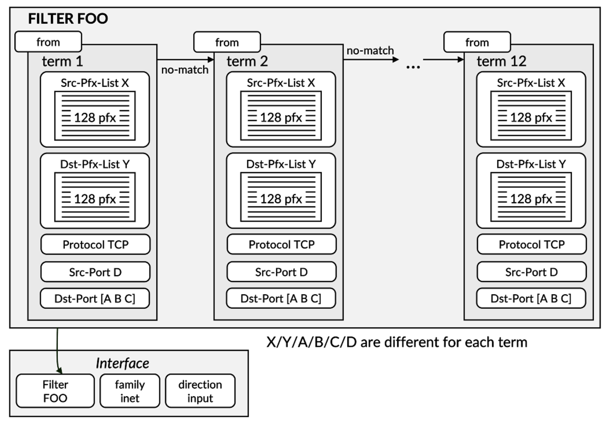

Implementing this filter on a TCAM-based solution is not feasible. Our calculations indicate that this lab filter cannot be loaded onto the hardware without causing an error. Specifically, each of the 12 terms requires 49,512 TCAM entries (128 x 128 x 1 x 1 x 3), totaling 589,824 entries for the entire filter---more than the available TCAM capacity.

Now, let's commit this filter to the FLT block on a TRIO 6, which powers the MX304 LMICs. To enable FLT acceleration, be sure to include the fast-lookup-filter option in the filter. This time, programming the filter poses no issues---it was straightforward on the MX304. In fact, checking the FLT resources shows that only 1% of the ALPHA block is used, with almost no usage in the BETA block.

In summary, Juniper's filtering approach offers clear advantages over traditional TCAM solutions, particularly for medium to large-scale or complex filtering scenarios. Unlike TCAM, which can quickly become exhausted as rules multiply, DMEM or FLT filtering efficiently handles large prefix-lists, multiple ports, and protocol combinations without hitting hardware limits. At the same time, Juniper's filtering toolkit remains highly efficient and well-suited for smaller-scale designs, providing a versatile solution across a wide range of network deployments.

## Conclusion

This article covered Juniper's approach to the firewall filter (Access-list) challenges and described the key innovations our engineers brought to propose a truly superior solution, both in terms of scale and flexibility.

Don't hesitate to reach out if you would like us to dive deeper into one of the topics described in this publication.

## Useful links

- Express 4 Filters -- Foundation: [https://juniper.github.io/techposts/express-4-filters-foundation/article](https://juniper.github.io/techposts/express-4-filters-foundation/article)
- Fast Lookup Tuple: an Innovative Filtering Feature: [https://juniper.github.io/techposts/fast-lookup-tuple-an-innovative-filtering-feature/article](https://juniper.github.io/techposts/fast-lookup-tuple-an-innovative-filtering-feature/article)
- Flex Offset Filters in Express5: [https://juniper.github.io/techposts/flex-offset-filters-in-express5/article](https://juniper.github.io/techposts/flex-offset-filters-in-express5/article)

## Glossary

- ACE: "Access-List Entry"
- ACL: "Access Control List"
- ALPHA: Absolute Longest Prefix Hash Algo
- ASIC: "Application-Specific Integrated Circuit"
- BETA: Best Extrema Tree Algo
- DB: "Database"
- DCU: "Destination-Class Usage"
- DFWC: "Distributed Firewall Compiler"
- DMEM: "Data Memory"
- DPI: "Deep Packet Inspection"
- DP: "Datapath"
- FF: "Firewall Filter"
- FLT: "Fast Lookup Table"
- GTP: "GPRS Tunneling Protocol"
- IP: "Internet Protocol"
- LPM: "Longest Prefix Match"
- MPLS: "Multiprotocol Label Switching"
- PPE: "Packet Processing Element"
- QoS: "Quality of Service"
- SCU: "Source-Class Usage"
- TCAM: "Ternary Content-Addressable Memory"
- ucode: "microcode"
- XIF: "Cross-Interface"

## Acknowledgments

Thanks to Kevin Brown for the review of this document.
