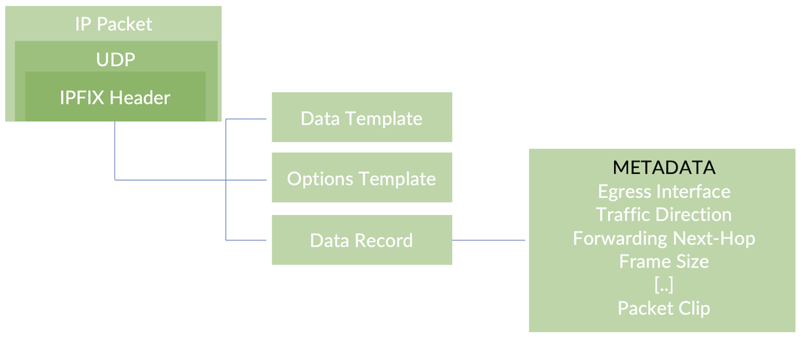

# Packets Lost in Transit?

**Anton Elita - 01/08/2024**

Inline Monitoring allows to get forwarding status codes for transit packets, as well as a sample of the packet itself -- even if the packet was dropped for whatever reason. By having the packet header exposed to a remote collector, this feature enables other nice applications like peering traffic visibility on a shared port, traffic anomaly detection and network performance observation.

## Packet Counters

Most of the experienced readers would know where to look for packet counters, so we'll list only some of the widely known commands. Even if packet counters don't always allow to understand the exact reason if a drop (and don't give us the headers of the packet either), they are a good start of a troubleshooting process:

```
show interfaces extensive 
show interfaces queue
show pfe statistics traffic
show interfaces voq                        # <- only for VOQ-based platforms like PTX
```

## Packet Sampling

There are a few other ways to get a packet mirrored for further analysis: plain packet mirroring, sflow, or flow tap. They differ in support for packet types (layer-2, layer-3) and sampling rates, and granularity of the packet matching. Still, they don't deliver metadata such as exception details, and packets dropped at early stages of processing would not be reported.

## Inline Monitoring

| Characteristic | MX Series | PTX10k Series |
|:--|:--|:--|
| Supported Sampling Rate | 1:1 to 1:16M | 1:1 to 1:32M |
| Format | IPFIX | IPFIX |
| Number of Instances | 16 | 7 |
| Collectors per Instance | 4 collectors per instance. Independent sampling rate per collector, and per-collector stats | 4 collectors per instance.Sampling rate per instance |
| Traffic Direction | Ingress, Egress | Ingress, Egress |
| Exported clip size | 64-126 bytes, L2 included | 64-256 bytes, L2 included (not for exception traffic in egress direction) |
| Attachment Points | Logical Interface, Filter | Logical Interface, Filter |
| Supported families | inet, inet6, mpls, vpls, bridge, ccc, any | inet, inet6, mpls, ethernet-switch, ccc, any |
| Metadata | Interface indexes, direction, timestamp, flow byte / packet count, flow identification, exception reports | Interface indexes, direction, timestamp, flow byte / packet count, flow identification, exception reports |
| Implementation | Fully Inline | Fully Inline |
| Number of flows | Does not maintain flow state | Does not maintain flow state |
| Junos Release | 19.4R1 | 22.4R1 |

### Junos Configuration

- configuration for exporting a clip of exception packets, they will be part of "data records"
- template configuration with definitions of data records fields, they are part of "data template record"
- various options are reported as "options template record"
- an instance of inline monitoring with configurable keys
- collector definitions
- an example filter with packet matches. Adjust it before activating on any interface, so that the filter matches necessary traffic only
- interface with that filter applied on family any, direction ingress or egress. It is deactivated, as we do not intend to capture valid transit packets, though it is perfectly possible if you activate it.

Reporting exception packets does not require a firewall filter applied to an interface, the configuration is per PFE

Notes:

- a collector needs to capture both data template and data packets to understand the flexible format of the IPFIX record
- like in any traffic sampling scenario, using a firewall filter matching all packets is not a good idea -- unless you know what you are doing
- if a filter is applied on egress direction, make sure you don't sample the IPFIX packets themselves -- exclude them in the filter!

```
aelita@pe2# show groups INLINE-MON
# PFE exception export
chassis {
    fpc 0 {
        pfe 0 {
            exception-reporting {
                category packet-errors {
                    inline-monitoring-instance in-monitor1;
                }
                category layer3 {
                    inline-monitoring-instance in-monitor1;
                }
                category layer2 {
                    inline-monitoring-instance in-monitor1;
                }
                category forwarding-state {
                    inline-monitoring-instance in-monitor1;
                }
                category firewall {
                    inline-monitoring-instance in-monitor1;
                }
            }
        }
    }
}
# Data and options template
services {
    inline-monitoring {
        template {
            template-1 {
                template-refresh-rate 10;
                option-template-refresh-rate 10;
                primary-data-record-fields {
                    cpid-egress-interface-index;
                    cpid-forwarding-class-drop-priority;
                    cpid-forwarding-exception-code;
                    cpid-forwarding-nexthop-id;
                    cpid-ingress-interface-index;
                    cpid-underlying-ingress-interface-index;
                    datalink-frame-size;
                    direction;
                    egress-interface-snmp-id;
                    ingress-interface-snmp-id;
                }
            }
        }
        instance {
            in-monitor1 {
                template-name template-1;
                maximum-clip-length 126;
                collector {
                    aelita-vm {
                        source-address 1.0.0.6;
                        destination-address 11.20.0.2;
                        dscp 7;
                        destination-port 4739;
                        forwarding-class network-control;
                        sampling-rate 10;
                    }
                }
            }
        }
        observation-cloud-id 2;
    }
}
# Optional filter applied to an interface/direction
inactive: interfaces {             # deliberately leaving this deactivated
    ge-0/0/0 {
        unit 0 {
            filter {
                input inmon;
            }
        }
    }
}
firewall {
    family any {
        filter inmon {
            term A { # an example only, will catch all traffic
                    inline-monitoring-instance in-monitor1;
                    accept;
                }
            }
        }
    }
}
```

### PCAP! Or didn't happen!

```
tcpdump -ni eth1 -s 9000 port 4739 -w /tmp/out.pcap
```

When tcpdump was stopped (e.g. with Ctrl-C), we can use wireshark or tshark to decode the contents of the packet dump.

```
> tshark  -r /tmp/out.pcap -Y ip.src==1.0.0.6
    1   0.000000      1.0.0.6 -> 11.20.0.2    CFLOW 134 IPFIX flow (  92 bytes) Obs-Domain-ID=33619968 [Data-Template:384]
    2   0.000001      1.0.0.6 -> 11.20.0.2    CFLOW 78 IPFIX flow (  36 bytes) Obs-Domain-ID=33619968 [Options-Template:640]
    3   0.000001      1.0.0.6 -> 11.20.0.2    CFLOW 70 IPFIX flow (  28 bytes) Obs-Domain-ID=33619968 [Data:640]
    4  10.009818      1.0.0.6 -> 11.20.0.2    CFLOW 134 IPFIX flow (  92 bytes) Obs-Domain-ID=33619968 [Data-Template:384]
    5  10.009818      1.0.0.6 -> 11.20.0.2    CFLOW 78 IPFIX flow (  36 bytes) Obs-Domain-ID=33619968 [Options-Template:640]
    6  10.009819      1.0.0.6 -> 11.20.0.2    CFLOW 70 IPFIX flow (  28 bytes) Obs-Domain-ID=33619968 [Data:640] 
[..]

```

All right, we have got three types of frames, but what are they exactly? Let's see in the next section.

### Exported Packet Types

[RFC7011](https://www.rfc-editor.org/rfc/rfc7011) defines three packet types used by IPFIX: *data template record*, *options template record* and *data record*. Why would we need all three? Well, at least for the automated decoding -- when we know the templates, we can dissect the data records themselves.



If you have [tshark](https://tshark.dev/), using -V flag will help look deeper into the decoded data.

```
tshark  -r /tmp/out.pcap -Y ip.src==1.0.0.6 -V
```

Here are the relevant outputs from the above shell command.

### Data Template

```
Data template describes the fields carried by the data records:
[..] NetFlow/IPFIX
    Version: 10
    Length: 92
    Timestamp: Dec 27, 2023 14:27:57.000000000 UTC
        ExportTime: 1703687277
    FlowSequence: 0 (expected 9)
        [Expert Info (Warning/Sequence): Unexpected flow sequence for domain ID 33619968 (expected 9, got 0)]
            [Unexpected flow sequence for domain ID 33619968 (expected 9, got 0)]
            [Severity level: Warning]
            [Group: Sequence]
    Observation Domain Id: 33619968
    Set 1 [id=2] (Data Template): 384
        FlowSet Id: Data Template (V10 [IPFIX]) (2)
        FlowSet Length: 76
        Template (Id = 384, Count = 11)
            Template Id: 384
            Field Count: 11
            Field (1/11): OBSERVATION_DOMAIN_LEVEL_JUNIPER_COMMON_PROPERTIES
                1... .... .... .... = Pen provided: Yes
                .000 0000 1000 1001 = Juniper Resiliency: OBSERVATION_DOMAIN_LEVEL_JUNIPER_COMMON_PROPERTIES (137)
                Length: 4
                PEN: Juniper Networks, Inc. (2636)
            Field (2/11): OBSERVATION_DOMAIN_LEVEL_JUNIPER_COMMON_PROPERTIES
                1... .... .... .... = Pen provided: Yes
                .000 0000 1000 1001 = Juniper Resiliency: OBSERVATION_DOMAIN_LEVEL_JUNIPER_COMMON_PROPERTIES (137)
                Length: 2
                PEN: Juniper Networks, Inc. (2636)
            Field (3/11): OBSERVATION_DOMAIN_LEVEL_JUNIPER_COMMON_PROPERTIES
                1... .... .... .... = Pen provided: Yes
                .000 0000 1000 1001 = Juniper Resiliency: OBSERVATION_DOMAIN_LEVEL_JUNIPER_COMMON_PROPERTIES (137)
                Length: 4
                PEN: Juniper Networks, Inc. (2636)
            Field (4/11): OBSERVATION_DOMAIN_LEVEL_JUNIPER_COMMON_PROPERTIES
                1... .... .... .... = Pen provided: Yes
                .000 0000 1000 1001 = Juniper Resiliency: OBSERVATION_DOMAIN_LEVEL_JUNIPER_COMMON_PROPERTIES (137)
                Length: 4
                PEN: Juniper Networks, Inc. (2636)
            Field (5/11): OBSERVATION_DOMAIN_LEVEL_JUNIPER_COMMON_PROPERTIES
                1... .... .... .... = Pen provided: Yes
                .000 0000 1000 1001 = Juniper Resiliency: OBSERVATION_DOMAIN_LEVEL_JUNIPER_COMMON_PROPERTIES (137)
                Length: 4
                PEN: Juniper Networks, Inc. (2636)
            Field (6/11): OBSERVATION_DOMAIN_LEVEL_JUNIPER_COMMON_PROPERTIES
                1... .... .... .... = Pen provided: Yes
                .000 0000 1000 1001 = Juniper Resiliency: OBSERVATION_DOMAIN_LEVEL_JUNIPER_COMMON_PROPERTIES (137)
                Length: 4
                PEN: Juniper Networks, Inc. (2636)
            Field (7/11): INPUT_SNMP
                0... .... .... .... = Pen provided: No
                .000 0000 0000 1010 = Type: INPUT_SNMP (10)
                Length: 4
            Field (8/11): OUTPUT_SNMP
                0... .... .... .... = Pen provided: No
                .000 0000 0000 1110 = Type: OUTPUT_SNMP (14)
                Length: 4
            Field (9/11): DIRECTION
                0... .... .... .... = Pen provided: No
                .000 0000 0011 1101 = Type: DIRECTION (61)
                Length: 1
            Field (10/11): dataLinkFrameSize
                0... .... .... .... = Pen provided: No
                .000 0001 0011 1000 = Type: dataLinkFrameSize (312)
                Length: 2
            Field (11/11): dataLinkFrameSection
                0... .... .... .... = Pen provided: No
                .000 0001 0011 1011 = Type: dataLinkFrameSection (315)
                Length: 65535 [i.e.: "Variable Length"]
    [Expected Sequence Number: 9]
    [Previous Frame in Sequence: 3]
```

*Output 1: Data Template*

Observation Domain ID is an identifier of the observation point, for example referring to a chassis. In this case it's automatically generated.

Fields 1 to 6 have [the Element ID](https://www.iana.org/assignments/ipfix/ipfix.xhtml) of 137 (Common Properties ID), associated with Juniper's Private Enterprise Number 2636 [allocated by IANA](https://www.iana.org/assignments/enterprise-numbers/enterprise-numbers). The left-most 6 bits are encoding a common property ID (CP-ID) from Juniper, followed by reserved 0 bits. That's why when looking at the hex dump, one would see 0x4, which is a value of 1 in the left-most 6 bits.

The remaining fields 7 to 11 have well-known Element ID related to the purpose of the respective field.

The fields can be better described in a table.

Table: Fields and Common Property IDs

| Field ID | Element ID | First byte value(last two bits are 0) | Notes |
|:--|:--|:--|:--|
| 1 | 137 | 0x4 | Forwarding Class |
| 2 | 137 | 0x8 | Exception Code |
| 3 | 137 | 0xc | Forwarding Next-Hop ID [1] |
| 4 | 137 | 0x10 | Egress Logical Interface Index [2] |
| 5 | 137 | 0x14 | Ingress Interface ID (when part of LAG) [1] |
| 6 | 137 | 0x18 | Ingress Logical Interface Index [2] |
| 7 | 10 | n/a | Input SNMP Interface Index |
| 8 | 14 | n/a | Output SNMP Interface Index |
| 9 | 61 | n/a | Traffic Direction (Ingress = 0, Egress = 1) |
| 10 | 312 | n/a | Data Link Frame Size |
| 11 | 315 | n/a | Data Link Frame Section (packet clip) |

[1] not supported on PTX

[2] Junos interface index (not SNMP ifIndex)

### Options Template

```
[..] NetFlow/IPFIX
    Version: 10
    Length: 36
    Timestamp: Dec 27, 2023 14:27:47.000000000 UTC
        ExportTime: 1703687267
    FlowSequence: 8 (expected 0)
        [Expert Info (Warning/Sequence): Unexpected flow sequence for domain ID 33619968 (expected 0, got 8)]
            [Unexpected flow sequence for domain ID 33619968 (expected 0, got 8)]
            [Severity level: Warning]
            [Group: Sequence]
    Observation Domain Id: 33619968
    Set 1 [id=3] (Options Template): 640
        FlowSet Id: Options Template (V10 [IPFIX]) (3)
        FlowSet Length: 20
        Options Template (Id = 640) (Scope Count = 1; Data Count = 1)
            Template Id: 640
            Total Field Count: 2
            Scope Field Count: 1
            Field (1/1) [Scope]: FLOW_EXPORTER
                0... .... .... .... = Pen provided: No
                .000 0000 1001 0000 = Type: FLOW_EXPORTER (144)
                Length: 4
            Field (1/1): SAMPLING_INTERVAL
                0... .... .... .... = Pen provided: No
                .000 0000 0010 0010 = Type: SAMPLING_INTERVAL (34)
                Length: 4
        Padding: 0000
    [Expected Sequence Number: 0]
    [Previous Frame in Sequence: 1]
```

*Output 2: Options Template*

Flow Exporter and Sampling Interval are part of the options template.

### Data Record

Finally, let us check the data received. Below is just the frame containing the data record. You will see that a relatively modern tshark (I used ubuntu 22.04 LTS) can very well understand both *IPFIX headers* as well as decode the *payload*!

```
[..] NetFlow/IPFIX
    Version: 10
    Length: 148
    Timestamp: Dec 27, 2023 14:55:19.000000000 UTC
        ExportTime: 1703688919
    FlowSequence: 60 (expected 174)
        [Expert Info (Warning/Sequence): Unexpected flow sequence for domain ID 33619968 (expected 174, got 60)]
            [Unexpected flow sequence for domain ID 33619968 (expected 174, got 60)]
            [Severity level: Warning]
            [Group: Sequence]
    Observation Domain Id: 33619968
    Set 1 [id=384] (1 flows)
        FlowSet Id: (Data) (384)
        FlowSet Length: 132
        [Template Frame: 1]
        Flow 1
            Observation Cloud Level Juniper Common Properties: Forwarding Class and Drop Priority
                0000 01.. .... .... .... .... .... .... = Juniper CPID Type: Forwarding Class and Drop Priority (0x01)
                .... ..00 0000 0000 0000 0000 0000 0000 = Juniper CPID Value: 0 [Forwarding class: 0  Drop Priority: 0]
            Observation Cloud Level Juniper Common Properties: Forwarding Exception Details
                0000 10.. .... .... = Juniper CPID Type: Forwarding Exception Details (0x02)
                .... ..00 1100 0010 = Juniper CPID Value: 194
            Observation Cloud Level Juniper Common Properties: Forwarding Nexthop Details
                0000 11.. .... .... .... .... .... .... = Juniper CPID Type: Forwarding Nexthop Details (0x03)
                .... ..00 0000 0000 0000 0000 0000 0000 = Juniper CPID Value: 0
            Observation Cloud Level Juniper Common Properties: Egress Interface Details
                0001 00.. .... .... .... .... .... .... = Juniper CPID Type: Egress Interface Details (0x04)
                .... ..00 0000 0000 0000 0000 0000 0000 = Juniper CPID Value: 0
            Observation Cloud Level Juniper Common Properties: Ingress Underlying Interface Details
                0001 01.. .... .... .... .... .... .... = Juniper CPID Type: Ingress Underlying Interface Details (0x05)
                .... ..00 0000 0000 0000 0000 0000 0000 = Juniper CPID Value: 0
            Observation Cloud Level Juniper Common Properties: Ingress Interface Details
                0001 10.. .... .... .... .... .... .... = Juniper CPID Type: Ingress Interface Details (0x06)
                .... ..00 0000 0000 0000 0001 0110 1000 = Juniper CPID Value: 360
            InputInt: 576
            OutputInt: 0
            Direction: Ingress (0)
            Data Link Frame Size: 94
            Data Link Frame Section: 56041900370e56041900b76e8847f42411ff4600004cd35100000111a4490a0024017f00...
                Ethernet II, Src: 56:04:19:00:b7:6e (56:04:19:00:b7:6e), Dst: 56:04:19:00:37:0e (56:04:19:00:37:0e)
                    Destination: 56:04:19:00:37:0e (56:04:19:00:37:0e)
                        Address: 56:04:19:00:37:0e (56:04:19:00:37:0e)
                        .... ..1. .... .... .... .... = LG bit: Locally administered address (this is NOT the factory default)
                        .... ...0 .... .... .... .... = IG bit: Individual address (unicast)
                    Source: 56:04:19:00:b7:6e (56:04:19:00:b7:6e)
                        Address: 56:04:19:00:b7:6e (56:04:19:00:b7:6e)
                        .... ..1. .... .... .... .... = LG bit: Locally administered address (this is NOT the factory default)
                        .... ...0 .... .... .... .... = IG bit: Individual address (unicast)
                    Type: MPLS label switched packet (0x8847)
                MultiProtocol Label Switching Header, Label: 1000001, Exp: 0, S: 1, TTL: 255
                    1111 0100 0010 0100 0001 .... .... .... = MPLS Label: 1000001 (0xf4241)
                    .... .... .... .... .... 000. .... .... = MPLS Experimental Bits: 0
                    .... .... .... .... .... ...1 .... .... = MPLS Bottom Of Label Stack: 1
                    .... .... .... .... .... .... 1111 1111 = MPLS TTL: 255
                Internet Protocol Version 4, Src: 10.0.36.1, Dst: 127.0.0.1
                    0100 .... = Version: 4
                    .... 0110 = Header Length: 24 bytes (6)
                    Differentiated Services Field: 0x00 (DSCP: CS0, ECN: Not-ECT)
                        0000 00.. = Differentiated Services Codepoint: Default (0)
                        .... ..00 = Explicit Congestion Notification: Not ECN-Capable Transport (0)
                    Total Length: 76
                    Identification: 0xd351 (54097)
                    Flags: 0x00
                        0... .... = Reserved bit: Not set
                        .0.. .... = Don't fragment: Not set
                        ..0. .... = More fragments: Not set
                    ...0 0000 0000 0000 = Fragment Offset: 0
                    Time to Live: 1
                        [Expert Info (Note/Sequence): "Time To Live" only 1]
                            ["Time To Live" only 1]
                            [Severity level: Note]
                            [Group: Sequence]
                    Protocol: UDP (17)
                    Header Checksum: 0xa449 [validation disabled]
                    [Header checksum status: Unverified]
                    Source Address: 10.0.36.1
                    Destination Address: 127.0.0.1
                    Options: (4 bytes), Router Alert
                        IP Option - Router Alert (4 bytes): Router shall examine packet (0)
                            Type: 148
                                1... .... = Copy on fragmentation: Yes
                                .00. .... = Class: Control (0)
                                ...1 0100 = Number: Router Alert (20)
                            Length: 4
                            Router Alert: Router shall examine packet (0)
                User Datagram Protocol, Src Port: 49547, Dst Port: 3503
                    Source Port: 49547
                    Destination Port: 3503
                    Length: 52
                    Checksum: 0x1862 [unverified]
                    [Checksum Status: Unverified]
                    [Stream index: 3]
                    [Timestamps]
                        [Time since first frame: 0.000000000 seconds]
                        [Time since previous frame: 0.000000000 seconds]
                    UDP payload (44 bytes)
                String_len_short: 94
    [Expected Sequence Number: 174]
    [Previous Frame in Sequence: 13]
Multiprotocol Label Switching Echo
    Version: 1
    Global Flags: 0x0001
        0000 0000 0000 0... = Reserved: 0x0000
        .... .... .... ...1 = Validate FEC Stack: True
        .... .... .... ..0. = Respond only if TTL expired: False
        .... .... .... .0.. = Validate Reverse Path: False
    Message Type: MPLS Echo Request (1)
    Reply Mode: Reply via an IPv4/IPv6 UDP packet (2)
    Return Code: No return code (0)
    Return Subcode: 0
    Sender's Handle: 0xa6e6c57f
    Sequence Number: 5
    Timestamp Sent: Dec 27, 2023 14:55:20.248490999 UTC
    Timestamp Received: (0)Jan  1, 1970 00:00:00.000000000 UTC
    Target FEC Stack
        Type: Target FEC Stack (1)
        Length: 8
        FEC Element 1: Nil FEC
            Type: Nil FEC (16)
            Length: 4
            Label 1: 0 (IPv4 Explicit-Null)
```

Output 3: Data Record and Packet Decode with tshark

That's a lot!

From the *IPFIX header* we see following characteristics of the packet:

- Best-Effort class of service (value 0)
- drop priority 0
- it's an exception packet, exception id 194 (see below how to decode this value)
- forwarding next-hop, egress interface, OutputInt index are all equal to 0

it's another confirmation that the packet is an exception packet
- Input Interface ID is 360, and InputInt SNMP index is 576:

```
aelita@pe2# run show interfaces | match 576
  Logical interface ge-0/0/0.0 (Index 360) (SNMP ifIndex 576)
```

Now we know the interface details and some other metadata of the transit packet and can proceed to analyze the *packet* itself (using same output above coming from tshark packet decoder):

- Ethernet Frame, Destination and Source MACs, Protocol ID 0x8847 (MPLS)
- MPLS label stack [ 1000001 ]
- IPv4 payload, SRC/DST IP, TTL, Router Alert option
- UDP payload, SRC/DST ports
- MPLS echo request, sequence number, NIL FEC

That is a great insight, we know that this packet caused an exception, and even the exact content of the packet!

Why was there an exception created? We need to understand what the exception code 194 means.

In Junos, on MX series of routers, there are counters associated with exceptions of type discard and punt. There are many reasons for discard, for example dropping packets where the route to destination does not exist (or explicitly points to the discard interface), VLAN mismatch, wrong destination MAC, bad IP headers and many other reasons and counters associated with them. A punted packet is sent to the upper layers for further processing, for example control traffic directed to the router itself, or when there is a need to resolve next-hop like ARP, or various subscriber packets like PPPoE -- again, counters associated with those and other similar actions.

There are ongoing efforts to get forwarding status codes standardized, for example [draft-mvmd-opsawg-ipfix-fwd-exceptions at IETF](https://datatracker.ietf.org/doc/html/draft-mvmd-opsawg-ipfix-fwd-exceptions-08#name-forwardingstatuscode).

Values for status codes used by MX series of routers can be found by using PFE level commands:

```
aelita@pe2> request pfe execute target fpc0 command "show jnh 0 exceptions terse"
SENT: Ukern command: show jnh 0 exceptions terse


Reason                             Type           Packets      Bytes
==================================================================


PFE State Invalid
----------------------
unknown family                     DISC( 73)           42       3002


Packet Exceptions
----------------------
IP options                         PUNT(  2)            2         64


Routing
----------------------
discard route                      DISC( 66)        29230    2046300
hold route                         DISC( 70)         4377     482852
resolve route                      PUNT( 33)        16805    1494766
control pkt punt via nh            PUNT( 34)        36482    5778200
host route                         PUNT( 32)        55951    4855476
```

*Output 4: Exceptions List*

The list is short as it shows only non-zero counters. For the full list, remove "terse". The "type" column shows the type (discard or punt) and the forwarding status code.
Status codes reported via IPFIX have an offset of +128, so that the reported status code 194 is equal to 66 in the PFE output above (194-128=66), i.e., a discard route.

A quick validation on the label 1000001 in the FIB confirms it will be discarded:

```
aelita@pe2# run show route forwarding-table label 1000001 extensive table default
Routing table: default.mpls [Index 0]
MPLS:

Destination:  default
  Route type: permanent
  Route reference: 0                   Route interface-index: 0
  Multicast RPF nh index: 0
  P2mpidx: 0
  Flags: sent to PFE
  Next-hop type: discard               Index: 50       Reference: 2

Routing table: default.l2xc [Index 0]
L2XC:

Destination:  default
  Route type: permanent
  Route reference: 0                   Route interface-index: 0
  Multicast RPF nh index: 0
  P2mpidx: 0
  Flags: none
  Next-hop type: discard               Index: 50       Reference: 2
```

*Output 5: FIB Validation*

```
aelita@p3> ping mpls segment-routing spring-te label-stack labels [ 1000001 ] nexthop-interface ge-0/0/2.0 nexthop-address 10.0.36.2
```

## Collecting and Processing Inline Monitoring Data

### On-Box Collector

For a quick debugging, on-box collector can be used for storing forwarding exceptions:

```
aelita@pe2# show | compare
[edit groups INLINE-MON]
+  system {
+      resiliency {
+          exceptions {
+              forwarding;
+          }
+          store {
+              fwding-file jri-fwd.log;
+          }
+      }
+  }
[edit groups INLINE-MON services inline-monitoring instance in-monitor1 collector]
      aelita-vm { ... }
+     localhost {
+         source-address 1.0.0.6;
+         destination-address 1.0.0.6;
+         destination-port 4739;
+         sampling-rate 10;
+     }
```

*Output 6: On-Box Collector*

The above is a patch to the previous configuration -- you can paste it using "load patch terminal" in the configuration mode. This is somewhat less known (but very useful!) way to load the diff directly.

Please note that on-box collector configuration must specify a locally configured "destination-address" and the port must be 4739.

The log fille (in CLI: "show log jri-fwd.log") will quickly be populated with the same three distinct types of IPFIX reports.

***Options Template:***

```
***** Netflow/IPFIX ****
Version: 10
Length: 28
Export time: 1703754885
Seq no: 68
ObservationDomainID: 33620480
setID: 640
setLength: 12
Options Data
fieldType: exportingProcessId, field_length: 4
value: 1
fieldType: samplingInterval, field_length: 4
value: 10
```

***Data Template:***

```
***** Netflow/IPFIX ****
Version: 10
Length: 92
Export time: 1703754895
Seq no: 35
ObservationDomainID: 33620480
setID: 2
setLength: 76
DataTemplate
templateID: 384
fieldCount: 11
fieldType: commonPropertiesID, fieldLength: 4, enterpriseNumber: 2636
fieldType: commonPropertiesID, fieldLength: 2, enterpriseNumber: 2636
fieldType: commonPropertiesID, fieldLength: 4, enterpriseNumber: 2636
fieldType: commonPropertiesID, fieldLength: 4, enterpriseNumber: 2636
fieldType: commonPropertiesID, fieldLength: 4, enterpriseNumber: 2636
fieldType: commonPropertiesID, fieldLength: 4, enterpriseNumber: 2636
fieldType: ingressInterface, fieldLength: 4
fieldType: egressInterface, fieldLength: 4
fieldType: flowDirection, fieldLength: 1
fieldType: dataLinkFrameSize, fieldLength: 2
fieldType: dataLinkFrameSection, fieldLength: 65535
```

***Data Report:***

```
***** Netflow/IPFIX ****
Version: 10
Length: 148
Export time: 1703756312
Seq no: 115
ObservationDomainID: 33620480
setID: 384
setLength: 132
field_type: forwardingClass, field_length: 4
value: 0
field_type: exceptionCode, field_length: 2
value: Discard Route
field_type: nhIndex, field_length: 4
value: 0
field_type: oifIndex, field_length: 4
value: 0
field_type: underlyingiifIndex, field_length: 4
value: 0
field_type: iifIndex, field_length: 4
value: 360
field_type: ingressInterface, field_length: 4
value: 576
field_type: egressInterface, field_length: 4
value: 0
field_type: flowDirection, field_length: 1
value: 00
field_type: dataLinkFrameSize, field_length: 2
value: 94
field_type: dataLinkFrameSection, field_length: 94
value: 56041900 370e5604 1900b76e 8847f424
11ff4600 004c4844 00000111 2f570a00
24017f00 00019404 0000d7b1 0daf0034
686f0001 00010102 0000a254 21010000
0001e937 c098d84c be1e0000 00000000
00000001 00080010 00040000 0000
```

*Output 7: On-Box Collected Data*

Among other metadata like interface details, we see that the reported packet took a "Discard Route": the forwarding status code of 194 has automatically been decoded for human eyes.

However, the packet itself is represented as a sequence of hex bytes, and needs further decoding for a better understanding.

There are a few online decoders available, but why not do that in a shell of e.g. a linux-based computer like this:

```
cat <<EOF | xxd -r -p | od -Ax -tx1 | text2pcap - - | tshark -r - -V
```

Then just paste the hex code followed by EOF on an empty line and see the results. The magic happens by converting hex bytes to a hex dump (function of xxd and od), generating a pcap from the hex dump (text2pcap) and a verbose decoding of the pcap (tshark).

Complete output would look like this:

```
cat <<EOF | xxd -r -p | od -Ax -tx1 | text2pcap - - | tshark -r - -V
pipe pipe pipe pipe heredoc> 56041900 370e5604 1900b76e 8847f424
11ff4600 004c4844 00000111 2f570a00
24017f00 00019404 0000d7b1 0daf0034
686f0001 00010102 0000a254 21010000
0001e937 c098d84c be1e0000 00000000
00000001 00080010 00040000 0000
EOF
Input from: Standard input
Output to: Standard output
Output format: pcapng

-------------------------
Read 1 potential packet, wrote 1 packet (384 bytes including overhead).
Frame 1: 94 bytes on wire (752 bits), 94 bytes captured (752 bits) on interface Fake IF, text2pcap, id 0
    Section number: 1
    Interface id: 0 (Fake IF, text2pcap)
        Interface name: Fake IF, text2pcap
    Encapsulation type: Ethernet (1)
    Arrival Time: Dec 28, 2023 11:28:38.000001000 CET
    [Time shift for this packet: 0.000000000 seconds]
    Epoch Time: 1703759318.000001000 seconds
    [Time delta from previous captured frame: 0.000000000 seconds]
    [Time delta from previous displayed frame: 0.000000000 seconds]
    [Time since reference or first frame: 0.000000000 seconds]
    Frame Number: 1
    Frame Length: 94 bytes (752 bits)
    Capture Length: 94 bytes (752 bits)
    [Frame is marked: False]
    [Frame is ignored: False]
    [Protocols in frame: eth:ethertype:mpls:ip:udp:mpls-echo]
Ethernet II, Src: 56:04:19:00:b7:6e (56:04:19:00:b7:6e), Dst: 56:04:19:00:37:0e (56:04:19:00:37:0e)
    Destination: 56:04:19:00:37:0e (56:04:19:00:37:0e)
        Address: 56:04:19:00:37:0e (56:04:19:00:37:0e)
        .... ..1. .... .... .... .... = LG bit: Locally administered address (this is NOT the factory default)
        .... ...0 .... .... .... .... = IG bit: Individual address (unicast)
    Source: 56:04:19:00:b7:6e (56:04:19:00:b7:6e)
        Address: 56:04:19:00:b7:6e (56:04:19:00:b7:6e)
        .... ..1. .... .... .... .... = LG bit: Locally administered address (this is NOT the factory default)
        .... ...0 .... .... .... .... = IG bit: Individual address (unicast)
    Type: MPLS label switched packet (0x8847)
MultiProtocol Label Switching Header, Label: 1000001, Exp: 0, S: 1, TTL: 255
    1111 0100 0010 0100 0001 .... .... .... = MPLS Label: 1000001 (0xf4241)
    .... .... .... .... .... 000. .... .... = MPLS Experimental Bits: 0
    .... .... .... .... .... ...1 .... .... = MPLS Bottom Of Label Stack: 1
    .... .... .... .... .... .... 1111 1111 = MPLS TTL: 255
Internet Protocol Version 4, Src: 10.0.36.1, Dst: 127.0.0.1
    0100 .... = Version: 4
    .... 0110 = Header Length: 24 bytes (6)
    Differentiated Services Field: 0x00 (DSCP: CS0, ECN: Not-ECT)
        0000 00.. = Differentiated Services Codepoint: Default (0)
        .... ..00 = Explicit Congestion Notification: Not ECN-Capable Transport (0)
    Total Length: 76
    Identification: 0x4844 (18500)
    000. .... = Flags: 0x0
        0... .... = Reserved bit: Not set
        .0.. .... = Don't fragment: Not set
        ..0. .... = More fragments: Not set
    ...0 0000 0000 0000 = Fragment Offset: 0
    Time to Live: 1
        [Expert Info (Note/Sequence): "Time To Live" only 1]
            ["Time To Live" only 1]
            [Severity level: Note]
            [Group: Sequence]
    Protocol: UDP (17)
    Header Checksum: 0x2f57 [validation disabled]
    [Header checksum status: Unverified]
    Source Address: 10.0.36.1
    Destination Address: 127.0.0.1
    Options: (4 bytes), Router Alert
        IP Option - Router Alert (4 bytes): Router shall examine packet (0)
            Type: 148
                1... .... = Copy on fragmentation: Yes
                .00. .... = Class: Control (0)
                ...1 0100 = Number: Router Alert (20)
            Length: 4
            Router Alert: Router shall examine packet (0)
User Datagram Protocol, Src Port: 55217, Dst Port: 3503
    Source Port: 55217
    Destination Port: 3503
    Length: 52
    Checksum: 0x686f [unverified]
    [Checksum Status: Unverified]
    [Stream index: 0]
    [Timestamps]
        [Time since first frame: 0.000000000 seconds]
        [Time since previous frame: 0.000000000 seconds]
    UDP payload (44 bytes)
Multiprotocol Label Switching Echo
    Version: 1
    Global Flags: 0x0001
        0000 0000 0000 0... = Reserved: 0x0000
        .... .... .... ...1 = Validate FEC Stack: True
        .... .... .... ..0. = Respond only if TTL expired: False
        .... .... .... .0.. = Validate Reverse Path: False
    Message Type: MPLS Echo Request (1)
    Reply Mode: Reply via an IPv4/IPv6 UDP packet (2)
    Return Code: No return code (0)
    Return Subcode: 0
    Sender's Handle: 0xa2542101
    Sequence Number: 1
    Timestamp Sent: Dec 28, 2023 09:38:32.844920999 UTC
    Timestamp Received: Jan  1, 1970 00:00:00.000000000 UTC
    Target FEC Stack
        Type: Target FEC Stack (1)
        Length: 8
        FEC Element 1: Nil FEC
            Type: Nil FEC (16)
            Length: 4
            Label 1: 0 (IPv4 Explicit-Null)
```

*Output 8: Packet Decode*

### Off-Box Collectors

For the off-box collection if IPFIX with metadata, [goflow2](https://github.com/netsampler/goflow2) or [pmacct](http://www.pmacct.net/) can be used. I will use goflow2 as an example here -- just to give an idea how an off-box collector could be implemented.

```
# docker run -p 4739:2055/udp -ti netsampler/goflow2:latest
INFO[0000] Starting GoFlow2
INFO[0000] Starting collection                           count=1 hostname= port=2055 scheme=netflow
INFO[0000] Starting collection                           count=1 hostname= port=6343 scheme=sflow
{"Type":"IPFIX","TimeReceived":1703760968,"SequenceNum":3924,"SamplingRate":10,"FlowDirection":0,"SamplerAddress":"1.0.0.6","TimeFlowStart":0,"TimeFlowEnd":0,"TimeFlowStartMs":0,"TimeFlowEndMs":0,"Bytes":94,"Packets":1,"SrcAddr":"10.0.36.1","DstAddr":"127.0.0.1","Etype":2048,"Proto":17,"SrcPort":37892,"DstPort":0,"InIf":576,"OutIf":0,"SrcMac":"56:04:19:00:b7:6e","DstMac":"56:04:19:00:37:0e","SrcVlan":0,"DstVlan":0,"VlanId":0,"IngressVrfId":0,"EgressVrfId":0,"IpTos":0,"ForwardingStatus":0,"IpTtl":1,"TcpFlags":0,"IcmpType":0,"IcmpCode":0,"Ipv6FlowLabel":0,"FragmentId":46935,"FragmentOffset":0,"BiFlowDirection":0,"SrcAs":0,"DstAs":0,"NextHop":"","NextHopAs":0,"SrcNet":0,"DstNet":0,"BgpNextHop":[],"BgpCommunities":[],"AsPath":[],"HasMpls":true,"MplsCount":1,"Mpls_1Ttl":255,"Mpls_1Label":1000001,"Mpls_2Ttl":0,"Mpls_2Label":0,"Mpls_3Ttl":0,"Mpls_3Label":0,"MplsLastTtl":0,"MplsLastLabel":0,"MplsLabelIp":[],"ObservationDomainId":33619968,"ObservationPointId":0,"CustomInteger_1":0,"CustomInteger_2":0,"CustomInteger_3":0,"CustomInteger_4":0,"CustomInteger_5":0,"CustomBytes_1":[],"CustomBytes_2":[],"CustomBytes_3":[],"CustomBytes_4":[],"CustomBytes_5":[]}
```

Right out of the box, goflow2 can already recognize many fields. [Customization](https://github.com/netsampler/goflow2/blob/main/cmd/goflow2/mapping.yaml) of the default mapping is required for other non-standard fields.

## Summary

The whole telecommunications industry is moving fast towards reliable and robust automated networks. Being able to quickly determine any malfunctioning component is a key element in that journey.

Juniper MX and PTX devices can use their ASIC capabilities to generate inline monitoring of the transit traffic, without adverse effects on the line-card or central processing unit. IPFIX format is ASIC-friendly, and flexible to accommodate ever growing list of exported elements.

## Useful links

- Monitoring, Sampling, and Collection Services Interfaces User Guide: [https://www.juniper.net/documentation/us/en/software/junos/flow-monitoring/topics/topic-map/resiliency-exception-reporting.html](https://www.juniper.net/documentation/us/en/software/junos/flow-monitoring/topics/topic-map/resiliency-exception-reporting.html)
- [TechPost] Detection of Blackholes Using Juniper Resiliency Interface: [https://juniper.github.io/techposts/detection-of-blackholes-in-networks-using-jri/article](https://juniper.github.io/techposts/detection-of-blackholes-in-networks-using-jri/article)
- [TechPost] Sampling Evolution: [https://juniper.github.io/techposts/sampling-evolution/article](https://juniper.github.io/techposts/sampling-evolution/article)
- TCPdump: [https://www.tcpdump.org/](https://www.tcpdump.org/)
- [RFC] Specification of the IP Flow Information Export (IPFIX) Protocol for the Exchange of Flow Information: [https://www.rfc-editor.org/rfc/rfc7011](https://www.rfc-editor.org/rfc/rfc7011)
- tshark: [https://tshark.dev/](https://tshark.dev/)
- [IANA] IP Flow Information Export (IPFIX) Entities: [https://www.iana.org/assignments/ipfix/ipfix.xhtml](https://www.iana.org/assignments/ipfix/ipfix.xhtml)
- [IANA] PRIVATE ENTERPRISE NUMBERS: [https://www.iana.org/assignments/enterprise-numbers/enterprise-numbers](https://www.iana.org/assignments/enterprise-numbers/enterprise-numbers)
- [IETF Draft] IP Flow Information Export (IPFIX) Information Elements Extension for Forwarding Exceptions: [https://datatracker.ietf.org/doc/html/draft-mvmd-opsawg-ipfix-fwd-exceptions-08#name-forwardingstatuscode](https://datatracker.ietf.org/doc/html/draft-mvmd-opsawg-ipfix-fwd-exceptions-08#name-forwardingstatuscode)
- goflow2: [https://github.com/netsampler/goflow2](https://github.com/netsampler/goflow2)
- netsampler / goflow2 mapping: [https://github.com/netsampler/goflow2/blob/main/cmd/goflow2/mapping.yaml](https://github.com/netsampler/goflow2/blob/main/cmd/goflow2/mapping.yaml)
- PMACCT: [http://www.pmacct.net/](http://www.pmacct.net/)

## Glossary

- ARP: Address Resolution Protocol
- ASIC: Application Specific Integrated Circuits
- CLI: Common Line Interface
- CP-ID: Common Property Identity
- FIB: Forwarding Information Base
- IETF: Internet Engineering Task Force
- IP: Internet Protocol
- IPFIX: IP Flow Information Export
- JRI: Juniper Resiliency Interface
- LAG: Ling Aggregation
- MAC: Media Access Control
- MPLS: Multiprotocol Label Switching
- NIL FEC: Nil Forward Error Correction
- PFE: Packet Forwarding Engine
- PPPoE: Point-to-Point Protocol over Ethernet
- PCAP: Packet Capture
- SNMP: Simple Network Management Protocol
- VLAN: Virtual Local Area Network
- VOQ: Virtual Output Queue
