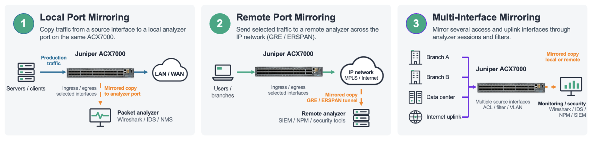

# Port Mirroring on the ACX7000 Series

**Amin - 09/28/2026**

## Introduction

Port mirroring sends a copy of network packets seen on one port to a network monitoring connection on another port. The goal is simple: mirror traffic for a given port, bridge domain, or flow in a specified direction (ingress or egress) to a destination connected to a sniffer or analyzer, without disturbing the original forwarding path.

Every mirroring deployment has exactly two components:

- Source of mirror - the input to the mirror, i.e., the point from which traffic needs to be copied.
- Destination of mirror - the output of the mirror, i.e., where the copied traffic is sent (a local analyzer port, or a remote collector reachable over IP).

The ACX7000 family (ACX7024, ACX7100, ACX7332/7348, ACX7509, etc.), running Junos OS Evolved, supports three mirroring options:

1. Local port mirroring - mirror a port's traffic to another port on the same box.
2. Remote port mirroring (ERSPAN) - encapsulate mirrored traffic in GRE/ERSPAN and deliver it to a collector anywhere across a routed network.
3. Filter-based port mirroring - mirror only the traffic that matches a firewall filter term, giving you flow-level precision instead of copying an entire port.

This post walks through the architecture, configuration, and verification of all three on ACX7K, with working configuration samples you can adapt directly.



## Prerequisites

Before you configure mirroring on an ACX7K platform, confirm the following:

Software release: Port mirroring and ERSPAN are available on ACX7K products from Junos OS Evolved 22.4R1 onwards. Filter-based mirroring requires a later release - verify feature support for your specific platform and release in the Juniper Feature Explorer.

A monitoring destination: a local port connected to a packet capture tool (Wireshark, tcpdump host, dedicated probe), or for ERSPAN, an IPv4-reachable collector that can decapsulate GRE/ERSPAN.

Reachability for remote mirroring: the collector's IPv4 address must be present in the routing table (static, OSPF, IS-IS - it doesn't matter, but it must resolve to a next hop).

Headroom awareness: mirroring duplicates traffic. Mirroring a loaded 100G port toward a 10G analyzer port will drop mirrored copies. Size the output port for the traffic you intend to capture, or use filter-based mirroring to narrow the scope.

Familiarity with Junos firewall filters (for filter-based mirroring) match conditions, terms, and interface binding at the family level.

## Core Concept / Architecture

### The Analyzer

Local and remote (ERSPAN) mirroring are implemented through a software construct called the analyzer, configured under forwarding-options analyzer. An analyzer definition contains three elements:

| Element | Purpose |
|:--|:--|
| input | The traffic collection point - the interface(s) whose traffic is copied |
| ingress / egress | The direction of traffic to capture, relative to the input interface |
| output | Where the mirrored copies are sent - a local interface (local mirroring) or an IPv4 address (ERSPAN) |

Configuration:

```
analyzer {
    A0 {
        input {                      ### Analyzer input
            ingress {                ### Direction: ingress or egress
                interface et-0/0/4.0;   ### Traffic collection point
            }
        }
        output {                     ### Analyzer output
            interface et-0/0/9.0;    ### Local port, or "ip-address x.x.x.x"
        }
    }
}
```

Port-based mirroring copies all traffic ingressing (or egressing) the configured port. An important behavioral detail: the analyzer input is configured on an IFL (logical interface, e.g., et-0/0/4.0), and only unit 0 is allowed as input - but the mirroring itself operates at the IFD (physical interface) level. Whichever unit you reference, the entire physical port is mirrored. The feature is enabled on the port. Both ingress and egress directions are supported, and the input can also be a port list - multiple ports referenced by their IFL names in the same analyzer.

## Port-Mirroring Instances

Filter-based mirroring uses a different anchor: forwarding-options port-mirroring. Two flavors exist:

A global instance  : set forwarding-options port-mirroring family <inet|inet6|ethernet-switching> output ...
used by the filter action port-mirror.

Named instances : set forwarding-options port-mirroring instance <name> family ... output ...
used by the filter action port-mirror-instance <name>. Named instances let you steer different flows to different collectors on the same box.

Choosing a Mode:

|  | Local mirroring | Remote (ERSPAN) | Filter-based |
|:--|:--|:--|:--|
| Granularity | Whole port | Whole port | Per-flow (filter match) |
| Destination | Local port | IPv4 collector across L3 network | Local port or IPv4 address |
| Config anchor | analyzer | analyzer (output = ip-address) | firewall filter + port-mirroring instance |
| Encapsulation | None (raw copy) | New Eth header + GRE + ERSPAN; original packet as payload | Raw copy, or GRE/ERSPAN when output is an IP address |
| Typical use | Bench/lab, adjacent probe | Centralized capture infrastructure | Surgical troubleshooting of a specific conversation |

### ERSPAN Packet Format

With ERSPAN, the mirrored packet is not sent as-is. The ACX builds a new outer Ethernet and IPv4 header, adds GRE and ERSPAN headers, and carries the original frame - headers intact, exactly as it arrived at ingress - as the payload. The outer destination IP is the analyzer's configured output ip-address; the source IP is taken from the next-hop-facing interface. Your capture tool sees: new Eth header + IP + GRE + ERSPAN + original packet.

## Step-by-Step Implementation

### Local Port Mirroring

Mirror all traffic entering et-0/0/4 to a locally attached analyzer on et-0/0/9.

**Step 1** - Prepare the output port. The analyzer port needs only a unit 0; no family, no VLAN membership:

```
set interfaces et-0/0/9 unit 0
```

set interfaces et-0/0/9 unit 0

**Step 2** - Configure the analyzer:

```
set forwarding-options analyzer A0 input ingress interface et-0/0/4.0
set forwarding-options analyzer A0 output interface et-0/0/9.0
```

**Step 3** - Commit and capture. Attach your sniffer to et-0/0/9. Every packet ingressing et-0/0/4 now arrives as an exact copy. To capture the reverse direction as well, add an input egress stanza.

For a full working example, see the Juniper KB article "Sample configuration of port mirroring on ACX Series (Junos EVO)" (see References).

### Remote Port Mirroring (ERSPAN)

Same analyzer construct - the only change is the output. Instead of a local interface, point it at the collector's IPv4 address:

```
set forwarding-options analyzer A0 input ingress interface et-0/0/4.0
set forwarding-options analyzer A0 output ip-address 120.20.20.2
```

The mirrored source can be a service endpoint. For example, capturing traffic entering an L2Circuit attachment circuit:

```
set interfaces et-0/0/4 encapsulation ethernet-ccc
set interfaces et-0/0/4 unit 0 family ccc
set protocols l2circuit neighbor 33.33.33.33 interface et-0/0/4.0 virtual-circuit-id 1
```

The critical requirement: the collector IP must be reachable via a routed L3 path:

```
root@acx7k> show route 120.20.20.2
 inet.0: 15 destinations, 15 routes (15 active, 0 holddown, 0 hidden)
 120.20.20.0/30     *[OSPF/10] 13:59:18, metric 2
                    >  to 120.10.10.2 via et-0/0/45.0
```

The same approach works whether the underlying service is L2Circuit, EVPN-MPLS, EVPN-VPWS, VPLS, or L2VPN. A full write-up with packet captures is available on Juniper TechPost: "ACX7000 ERSPAN and Port Mirroring" (see References).

### Filter-Based Port Mirroring

Filter-based mirroring copies a packet to a configured destination in addition to normal processing and forwarding. Mirroring is applied as an action in a firewall filter, bound at the ingress or egress of an interface. Only inet, inet6, and ethernet-switching family filters support the mirror action, and they can be bound to IFL, AE, and IRB interfaces.

Two actions are available:

- port-mirror : mirrors matching packets to the global mirror instance.
- port-mirror-instance <name> : mirrors matching packets to a specific named instance.

> **Scale note:** a maximum of 16 mirroring instances can be attached to filters in the ingress direction and 3 in the egress direction (subject to change per base mirroring functional spec). This scale is shared across all features that consume mirroring resources, analyzer sessions, egress sFlow, etc.

**Example A : IPv4 filter, global instance, ERSPAN output**

Mirror one specific TCP conversation to a remote collector. The mirrored packet arrives as a new Ethernet header + GRE/ERSPAN with the original packet as payload:

```
set interfaces et-0/0/5 unit 0 family inet filter input f1
set interfaces et-0/0/5 unit 0 family inet address 10.0.0.1/24
set interfaces et-0/0/6 unit 0 family inet address 30.0.0.1/24 arp 30.0.0.2 mac 00:00:00:01:02:03
set interfaces et-0/0/23 unit 0 family inet address 20.0.0.1/24 arp 20.0.0.2 mac 00:00:00:04:05:06
 
set forwarding-options port-mirroring family inet output ip-address 30.0.0.2
 
set firewall family inet filter f1 interface-specific
set firewall family inet filter f1 term t1 from source-address 10.0.0.2/32
set firewall family inet filter f1 term t1 from destination-address 20.0.0.2/32
set firewall family inet filter f1 term t1 from protocol tcp
set firewall family inet filter f1 term t1 from ttl 10
set firewall family inet filter f1 term t1 from source-port 10
set firewall family inet filter f1 term t1 from destination-port 20
set firewall family inet filter f1 term t1 then count c1
set firewall family inet filter f1 term t1 then port-mirror
```

**Example B : IPv4 filter, named instance**

Identical logic, but the flow is steered to named instance p1, which allows multiple independent mirror destinations on the same device:

```
set interfaces et-0/0/1 unit 0 family inet filter input f1
set interfaces et-0/0/1 unit 0 family inet address 10.0.0.1/24
set interfaces et-0/0/26 unit 0 family inet address 30.0.0.1/24 arp 30.0.0.2 mac 00:00:00:01:02:03
set interfaces et-0/0/24 unit 0 family inet address 20.0.0.1/24 arp 20.0.0.2 mac 00:00:00:04:05:06
 
set forwarding-options port-mirroring instance p1 family inet output ip-address 30.0.0.2
 
set firewall family inet filter f1 interface-specific
set firewall family inet filter f1 term t1 from source-address 10.0.0.2/32
set firewall family inet filter f1 term t1 from destination-address 20.0.0.2/32
set firewall family inet filter f1 term t1 from protocol tcp
set firewall family inet filter f1 term t1 from ttl 10
set firewall family inet filter f1 term t1 from dscp cs1
set firewall family inet filter f1 term t1 from source-port 10
set firewall family inet filter f1 term t1 from destination-port 20
set firewall family inet filter f1 term t1 then count c1
set firewall family inet filter f1 term t1 then port-mirror-instance p1
```

**Example C : IPv6 family filter**

Configure IPv6 mirroring in the family inet6 hierarchy and bind it to the interface's INET6 family. Match semantics differ slightly from IPv4, the L4 protocol is matched with next-header rather than protocol, and DSCP is matched via traffic-class:

```
set firewall family inet6 filter finet6 interface-specific
set firewall family inet6 filter finet6 term t1 from source-address 2000::2/64
set firewall family inet6 filter finet6 term t1 from destination-address 3000::2/64
set firewall family inet6 filter finet6 term t1 from next-header tcp
set firewall family inet6 filter finet6 term t1 from source-port ssh
set firewall family inet6 filter finet6 term t1 from destination-port ssh
set firewall family inet6 filter finet6 term t1 then count c1
set firewall family inet6 filter finet6 term t1 then port-mirror
set interfaces et-0/0/1 unit 0 family inet6 filter input finet6
```

Available IPv6 match conditions include source/destination address and prefix-lists, source/destination port, next-header, extension-header, hop-limit, ICMP type/code, TCP flags (tcp-established, tcp-initial, tcp-flags), and traffic-class.

**Example D :  Ethernet-switching filter, named instance (L2 flows)**

For bridged traffic, match on MAC addresses and mirror to a local analyzer port via a named instance:

```
set forwarding-options port-mirroring instance p1 family ethernet-switching output interface et-0/0/6.0
 
set firewall family ethernet-switching filter f1 interface-specific
set firewall family ethernet-switching filter f1 term t1 from source-mac-address 00:00:00:00:00:0b/48
set firewall family ethernet-switching filter f1 term t1 from destination-mac-address 00:00:00:00:00:0a/48
set firewall family ethernet-switching filter f1 term t1 from ip-protocol tcp
set firewall family ethernet-switching filter f1 term t1 from source-port 100
set firewall family ethernet-switching filter f1 term t1 then accept
set firewall family ethernet-switching filter f1 term t1 then port-mirror-instance p1
 
set vlans vlan_1 interface et-0/0/5.0
set vlans vlan_1 interface et-0/0/23.0
```

**Example E :  Egress-direction mirroring on a QinQ service interface**

Egress filter-based mirroring works on service-provider style interfaces as well. Here, an ethernet-switching filter is applied output on a QinQ (push-push) IFL, mirroring matched frames to a local analyzer port:

```
set groups qinq interfaces et-0/0/24 flexible-vlan-tagging
set groups qinq interfaces et-0/0/24 encapsulation flexible-ethernet-services
set groups qinq interfaces et-0/0/24 unit 100 encapsulation vlan-bridge
set groups qinq interfaces et-0/0/24 unit 100 vlan-tags outer 200
set groups qinq interfaces et-0/0/24 unit 100 vlan-tags inner 100
set groups qinq interfaces et-0/0/24 unit 100 input-vlan-map pop-pop
set groups qinq interfaces et-0/0/24 unit 100 output-vlan-map push-push
set groups qinq interfaces et-0/0/1 flexible-vlan-tagging
set groups qinq interfaces et-0/0/1 encapsulation flexible-ethernet-services
set groups qinq interfaces et-0/0/1 unit 101 encapsulation vlan-bridge
set groups qinq interfaces et-0/0/1 unit 101 vlan-id 5
set groups qinq interfaces et-0/0/1 unit 101 input-vlan-map pop
set groups qinq interfaces et-0/0/1 unit 101 output-vlan-map push
set groups qinq vlans vqinq interface et-0/0/24.100
set groups qinq vlans vqinq interface et-0/0/1.101
set apply-groups qinq
 
# Firewall filter applied in the egress direction:
set interfaces et-0/0/24 unit 100 family ethernet-switching filter output g1
set interfaces et-0/0/36 unit 0 family ethernet-switching
 
set forwarding-options port-mirroring family ethernet-switching output interface et-0/0/36.0
 
set firewall family ethernet-switching filter g1 interface-specific
set firewall family ethernet-switching filter g1 term t1 from source-mac-address 00:00:00:00:00:0b/48
set firewall family ethernet-switching filter g1 term t1 from destination-mac-address 00:00:00:00:00:0a/48
set firewall family ethernet-switching filter g1 term t1 then port-mirror
```

## Verification, Show Commands, and Troubleshooting

### Verify the Analyzer

```
show forwarding-options analyzer
```

Confirms the analyzer is programmed, its input/output bindings, and its state. If the state is down, check the output port (link state) or, for ERSPAN, the route to the collector.

### Verify Filter Hits Before Blaming the Mirror

Always pair your mirror action with count - it turns troubleshooting from guesswork into arithmetic:

```
show firewall filter f1
show firewall filter f1 counter c1
```

If the counter increments but the analyzer sees nothing, the problem is on the mirror path (output port, route, scale exhaustion). If the counter is at zero, your match conditions are wrong - the mirror never had a chance.

### Verify the Mirror Path

```
show route <collector-ip>          # ERSPAN: must resolve, and via the expected interface
show interfaces et-0/0/x extensive # output port counters incrementing?
monitor interface traffic          # live view of packet rates on source vs. analyzer port
```

### Validate the Capture Itself

On the collector, verify the ERSPAN encapsulation: outer destination IP = the configured analyzer output address, outer source IP = the next-hop-facing interface, then GRE + ERSPAN headers, then the original packet untouched. Wireshark decodes ERSPAN natively - check that the inner frame matches the flow your filter targets.

Common Pitfalls and Platform Behaviors

- IFL config, IFD behavior (analyzer mode). The analyzer accepts an IFL (et-0/0/0.0), but mirroring happens on the whole physical port. Don't expect per-unit selectivity from the analyzer - that's what filter-based mirroring is for.
- IPv4-only mirror destination. The analyzer output ip-address must be IPv4.
- No IRB support for the analyzer. You cannot apply an analyzer to an IRB interface.
- Changes require remove-and-reapply. Modifying the analyzer output (input interface or output host) in place doesn't take effect reliably - delete the config, commit, re-add, commit.
- Route changes affect ERSPAN. If the route to the mirror destination moves to a different egress interface than the one in place when the analyzer was committed, reapply the analyzer configuration.
- Scale limits. Analyzer mode: up to 16 ingress and 8 egress mirror instances (commit error if exceeded), and a maximum of 8 combined ingress/egress instances per single output port. Filter-based: 16 ingress / 3 egress instances - shared with every other mirroring consumer (analyzer, egress sFlow).
- No ECMP for mirrored traffic. Mirrored copies will not load-balance across multiple equal-cost next hops.
- Oversubscription is silent. If mirrored volume exceeds the output port's capacity, copies are dropped without ceremony. Production traffic is unaffected - but your capture will have holes.

## Conclusion

Port mirroring on the ACX7000 series gives you three tools of increasing precision: the analyzer for whole-port local capture, ERSPAN for delivering those captures across a routed network to centralized tooling, and filter-based mirroring for surgically extracting a single conversation using the full match power of Junos firewall filters IPv4, IPv6, or Layer 2, ingress or egress, to a global or per-flow named instance.

The practical guidance distills to this: start with the narrowest scope that answers your question. Whole-port mirroring is easy but noisy and bandwidth-hungry; a two-term filter with a count action and a port-mirror-instance tells you exactly what matched, exactly where it went, and costs almost nothing to verify. Respect the platform's scale limits, remember that analyzer changes need a remove-and-reapply, and always confirm your collector route before you trust an empty capture.

On ACX7K, mirroring is a set of tools, not just one feature. Using the right tool for your question turns a quick capture into a more complicated process.

## Useful links

1.  [Sample configuration of port mirroring on ACX Series (Junos EVO) - Juniper KB](https://supportportal.juniper.net/s/article/Sample-configuration-of-port-mirroring-on-ACX-Series-JUNOS-EVO)
2.  [ACX7000 ERSPAN and Port Mirroring - Juniper TechPost](https://juniper.github.io/techposts/acx7000-erspan-and-port-mirroring/article)
3.  [Port Mirroring and Analyzers - Juniper Documentation](https://www.juniper.net/documentation/us/en/software/junos/network-mgmt/topics/topic-map/port-mirroring-and-analyzers.html)
