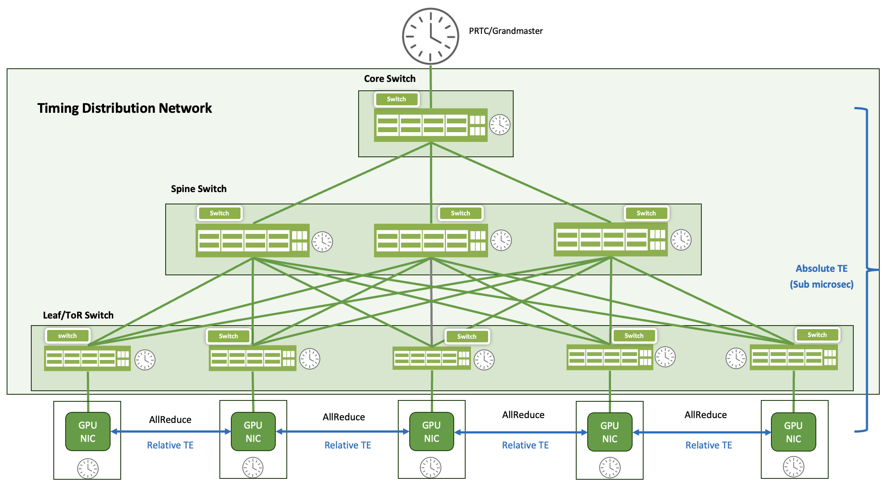
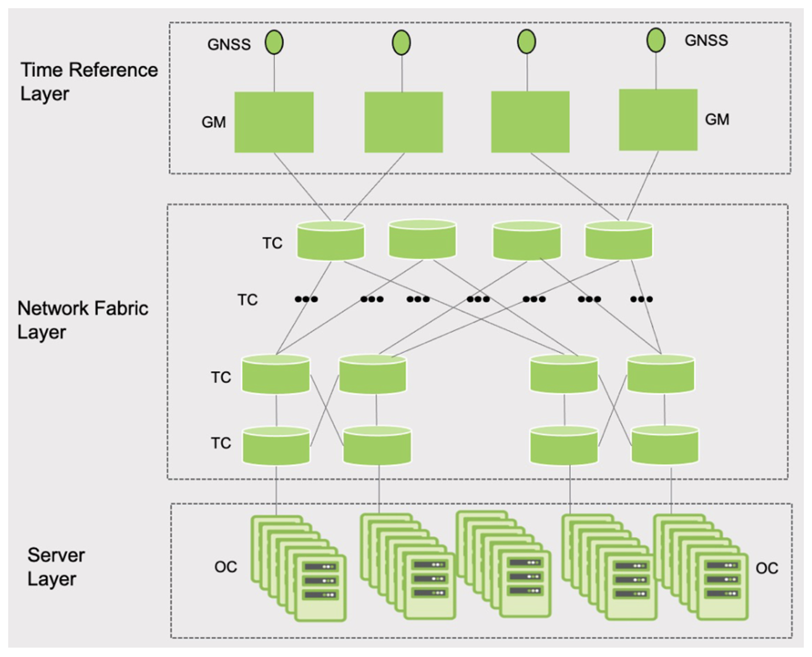
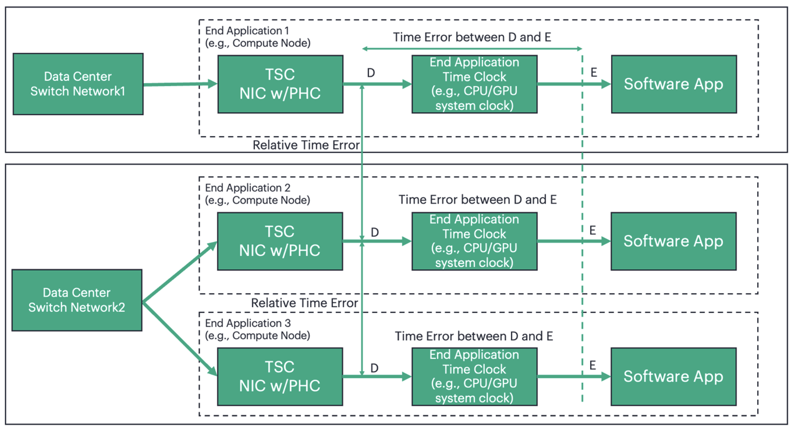
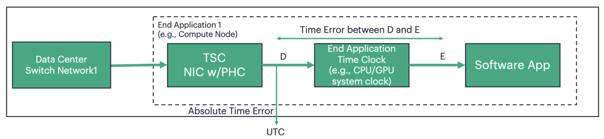
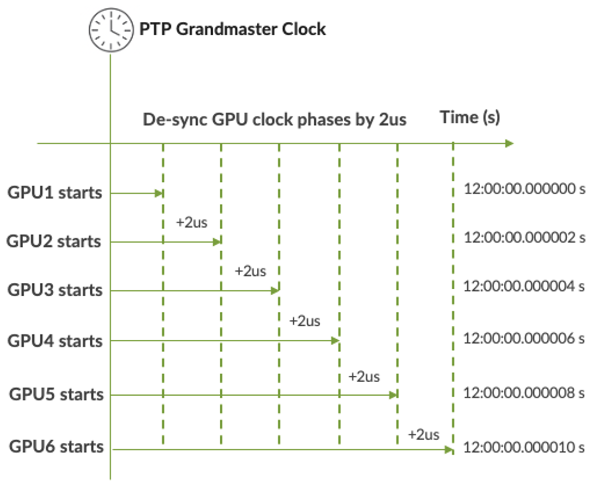
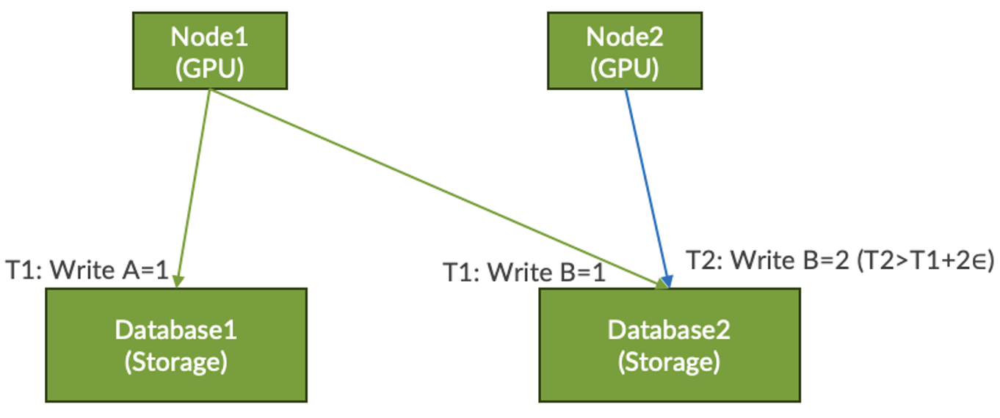
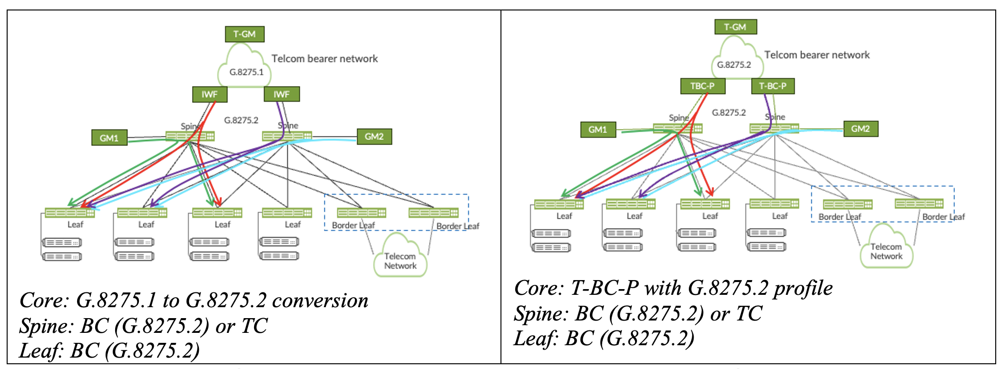
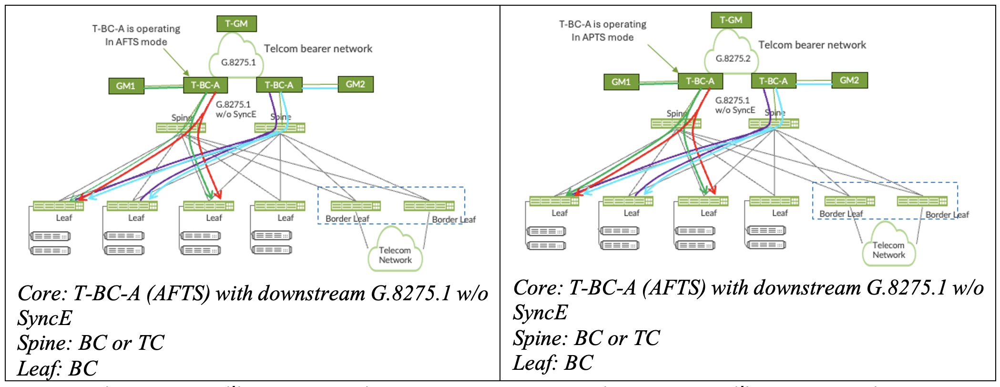
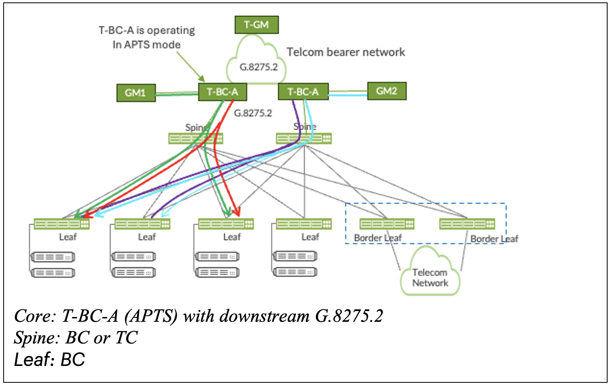

# Precision Timing in Modern Data Center

**Ssatheesh - 07/28/2026**

## Introduction

With the rapid transition from traditional workloads to AI applications, data centers are undergoing a fundamental architectural change. Traditional compute-centric systems are unable to match the requirements of modern AI applications that need huge data mobility, parallel processing, and ultra-low latency. This has led to the growth of high-speed, interconnect fabrics that focus on bandwidth and efficiency, enabling smooth communication across thousands of compute nodes like GPUs, TPUs and other accelerators.

GPUs are the brain of any current AI Clusters, but it is the precision timing that is the heartbeat synchronizing every activity across the system. Technologies such as the Precision Time Protocol (PTP), Synchronous Ethernet (SyncE) and GNSS keep every GPU, TPU and switch in sync. These timing protocols may synchronize the entire fabric, including the computing nodes, enabling the AI cluster to operate as a single, unified machine. Precision is necessary; otherwise, the orchestration of computing and communication would be inefficient. Precision timing is essential for the performance and reliability of modern AI infrastructure.

## Precision Time Distribution

In an AI cluster, the Primary Reference Time Clock (PRTC), often known as the Grandmaster, is the primary timing source. This master clock distributes precise time signals across the network fabric, through Spine and Leaf switches. These switches function as either Boundary Clocks (BC) or Transparent Clocks (TC), depending on their role in relaying and adjusting timing information. The synchronized timing ensures that all components operate in lock state, minimizing latency, and jitter across the system. The clock signal is then transferred from the Leaf Layer to the GPUs where it aligns their Network Interface Cards (NICs) and Physical Layer (PHY) clocks. Thus, the compute nodes are connected to the data center timing distribution network using one or more Telecom Time Synchronous Clocks (T-TSC) implemented as part of the Network Interface Card (NIC). The system clock of the GPU synchronizes the compute node's Telecom-Time Synchronous Clock (T-TSC) or Ordinary Clock (OC).

This hierarchical distribution of time ensures that all elements in the AI cluster, from switches to accelerators, function under a common time. This synchronization is critically important for enabling the whole AI cluster to act as a single, cohesive system, with deterministic behavior, efficient parallel processing and seamless communication.

## Precision Timing Performance Requirements

## Data Center for Financial Applications

The need for accurate time in data centers supporting financial applications is widely known. These needs are driven by the applications themselves and by market regulators like as MiFID III, FINRA, CAT, etc. that require accurate, traceable timestamping and clock synchronization to ensure regulatory compliance and market integrity. Precision timing requirements solve various essential difficulties, such as:

- Event Ordering: To reliably prove that one event happened before or after another point in time.
- Event Correlation: To achieve reliable event correlation across a broad or geographically dispersed network.
- Market Fairness: To ensure fair and equal treatment for all customers participating in trading activities.

Meeting these requirements depends on tightly synchronized clocks, accurate timestamping, and auditable time-based ordering across the entire data center and network infrastructure. The levels of timing performance commonly required for financial applications are summarized below:

Table: Timing Accuracy Requirements in Financial Sectors

| Accuracy | Description |
|:--|:--|
| ~100 us | Required for regulatory timestamping by trading venues and exchanges |
| ~1 us | For high frequency trading (HFT) systems where fine-grained ordering of events is critical |
| 1-50 ns | For network performance assessment and latency analysis, not for direct regulatory compliance |

These more stringent timing requirements are a function of the distinction between regulatory reporting, trading correctness, and infrastructure performance optimization. The HPE networking solutions, notably the QFX series switches, provide enterprise profiles, which makes them ideally suited for deploying the solution in financial data center environments.

Table 2 below shows the profile parameters for the Enterprise Profile for Precision Time Protocol (PTP). It highlights the supported clock types, transport options, synchronization message ranges, priorities, and default values to ensure that time is distributed accurately and consistently across enterprise networks.

Table: Enterprise Profile-Parameters

| PTP Profile Name | Enterprise Profile(IETF) |
|:--|:--|
| Allowed Clock | Ordinary Clock, Boundary Clock |
| Transport | IPv4 |
| Multicast or unicast | Mixed Multicast/Unicast for PTPoIPv4 |
| BMCA | 1588v2 Default |
| Sync & Follow-up rate | Range: 2^7 to 2^(-7); Default: 2^0 |
| Delay-Req & Delay-Resp rate | Range: 2^7 to 2^(-7); Default: 2^0 |
| Announce rate | Default: 2^0 |
| Priority1 | Range: 0 to 255; Default: 128 |
| Priority2 | Range: 0 to 255; Default: 128 |
| Domain Number | Range: 0 to 127; Default: 0 |
| Announce Receipt Time-out (sec) | Range: 2 to 10; Default: 3 for preferred Time Transmitters, 4 for other Time Transmitters |

## Data Center for Broadcast and Media Applications

Accurate and precise timing is needed in modern IP-based broadcasting to synchronize individual video, audio and metadata streams over the network. Accurate timing aligns these independent streams, preventing issues such as lip-sync errors, frame misalignment, and degraded viewing experience, thereby providing both high-quality and reliable media delivery. Additionally, the support for SMPTE ST 2059-1, AES67, and combined SMPTE+AES67 profiles in HPE Networking platforms allows for seamless deployment and interoperability in such IP-based audio/video broadcast scenarios.

The SMPTE ST-2059-1 standard supports video applications for capture, video edit, and playback to be used in professional broadcast environments. The standard allows multiple video sources to stay in sync across various equipment by providing time and frequency synchronization to all devices.

AES67 supports professional quality audio applications for high performance streaming over IPv4 multicast transport in media networks with low latencies. It allows audio streams to be combined at a receiver, maintaining stream synchronization.

AES67+SMPTE ST-2059-1 is a merge of two standards with a common agreement for support and default values. It allows the interoperation of the two standards over the same network, so that common PTP assumptions can be used.

Table: Timing Accuracy Requirements in Media and Broadcast

| Accuracy | Description |
|:--|:--|
| ~1 us | Accuracy limit to achieve the Frame Alignment between Video/Audio frames across multiple devices whose clocks are tightly synchronized within ÔÇ+/-500ns of the central clock. |

The table below shows a comparison of the SMPTE, AES67 and AES67+SMPTE PTP combined profiles. It highlights the supporting clock types, transport methods, synchronization message ranges, priorities, domain numbers, and timeout values to facilitate consistent time distribution across media and audio networks.

Table: Comparison of SMPTE, AES67 and AES67+SMPTE PTP profiles

| Profile Name | SMPTE | AES67 | AES67+SMPTE |
|:--|:--|:--|:--|
| Allowed Clock | Ordinary Clock, Boundary Clock | Ordinary Clock, Boundary Clock | Ordinary Clock, Boundary Clock |
| Transport | IPv4, IGMPv2 | IPv4, IGMPv2 | IPv4, IGMPv2 |
| Multicast or Unicast | Multicast for PTP over IPv4 | Multicast for PTP over IPv4 | Multicast for PTP over IPv4 |
| BMCA | Default | Default | Default |
| Sync & Follow-up rate | Range: 2^(-1) to 2^(-7); Default: 2^(-3) | Range: 2^1 to 2^(-4); Default: 2^(-3) | Range: 2^(-1) to 2^(-4); Default: 2^(-3) |
| Delay-Req & Delay-Resp rate | Range: 2^(-3) to 2^(-7); Default: 2^(-3) | Range: 2^(-3) to 2^(-7); Default: 2^(-3) | Range: 2^(-3) to 2^(-7); Default: 2^(-3) |
| Announce rate | Range: 2^1 to 2^(-3); Default: 2^(-2) | Range: 2^4 to 2^0; Default: 2^1 | Range: 2^1 to 2^0; Default: 2^0 |
| Signaling | Special signaling message sent by GMs with timing metadata | Special signaling message sent by GMs with timing metadata | Special signaling message sent by GMs with timing metadata |
| Priority1 | Range: 0 to 255; Default: 128 | Range: 0 to 255; Default: 128 | Range: 0 to 255; Default: 128 |
| Priority2 | Range: 0 to 255; Default: 128 | Range: 0 to 255; Default: 128 | Range: 0 to 255; Default: 128 |
| Domain Number | Range: 0 to 127; Default: 127 | Range: 0 to 255; Default: 0 | Range: 0 to 127; Default: 0 |
| Announce Receipt Time-out (sec) | Range: 2 to 10; Default: 3 | Range: 2 to 10; Default: 3 | Range: 2 to 10; Default: 3 |
| Delay-request Time-out (sec) | Range: 30 to 300; Default: 30 | Range: 30 to 300; Default: 30 | Range: 30 to 300; Default: 30 |

## Edge Computing Applications

Edge computing is an important part of telecommunications, as it processes data closer to consumers (e.g. at base stations) rather than relying on central data centers. This method decreases latency, increases response time and facilitates real time applications such as video streaming, IoT and augmented reality. Edge computing is a complement to 5G and MEC architectures in telecom networks that can provide low latency services, optimize bandwidth, and minimize network congestion. It enables faster decision-making and supports applications such as smart cities, industrial automation, and autonomous systems.

Edge computing also improves network efficiency and reliability by distributing workloads and reducing dependency on central infrastructure. It supports real-time analytics, predictive maintenance, and better user experience, while creating new service opportunities. For edge deployments, PTP must provide accurate and reliable synchronization despite network delays and jitter. Key requirements include hardware timestamping, boundary and transparent clocks, and redundancy through multiple grandmaster clocks to ensure high availability.

Table: Timing Accuracy Requirements in Edge Computing Applications

| Accuracy | Description |
|:--|:--|
| ~130 ns to 1.5 us | Relative Time Error Requirements in 5G Networks (TDD) |
| ~10 ns | High accuracy positioning service (All RRU/ AAU connected to same DU) |
| ~5 ns to 100 ns | Self-driving/Autonomous Cars |
| ~100 ns | Industrial Robots/TSN |
| < 1 ¬us for OWD, CC | Edge AI Clusters |

TSN profile (IEEE802.1AS) and Telecom profile (G.8275.1 and G.8275.2) are typically used in Edge computing environments depending on the applications. These profiles are critical for industrial automation, 5G edge deployments, and TSN gateways, where precise timing ensures deterministic performance.

## Modern AI Cluster Applications

The Open Compute Project (OCP) Time Appliance Project (TAP) has defined a reference model[3], known as Model1, for time synchronization within Data center Cluster as in Figure 2, where the Time Reference Layer is connected to the Server Layer through the Transparent Clock enabled Network Fabric Layer, ensuring precise, traceable, and scalable synchronization across the cluster.

To assess the overall timing precision of the architecture, two key metrics must be considered. Absolute time error at the NIC, which functions as the Ordinary Clock (OC). Relative time error between the NICs (OCs) across compute nodes.

Table: OCP Profile accuracy requirements for DC (Model1)

| OCP Profile for DC(Model1) | Accuracy |
|:--|:--|
| The maximum absolute time error between any two OCs | <=5 us |
| The maximum absolute time error between a GM and any OCs | <=2.5 us |
| The maximum time error between any 2 GMs | <=100 ns |
| The maximum time error generated by a TC | <=100 ns |

Absolute time error ensures that each node aligns with a global time reference, while relative error measures the time drift among servers within the cluster, ensuring that all nodes operate on a common, precise timeline. Both are crucial for maintaining deterministic behavior, minimizing latency, and avoiding synchronization faults during operations like gradient exchange, telemetry logging, and coordinated execution. A well-calibrated timing infrastructure ensures that the AI cluster behaves as a unified system, enhancing performance, reliability, and scalability.

> Note: source of this image is OCP Time Appliance Project

Once the end-application requirements are defined, it is critical to ensure that these requirements are preserved with the Timing Distribution Network (TDN). The TDN, which is effectively the Network Fabric Layer, which is comprising of switches (eg., QFX series), plays a key role in maintaining timing integrity across the system. To achieve this, it is essential that these switches must meet stringent timing specifications and are responsible for delivering accurate and stable clock signals to the end applications, specifically, the compute nodes in this case.

Given the increasing demands of AI workloads, it is anticipated that current switch implementations must be enhanced to exceed their existing performance capabilities. In this context, the ITU-T is actively working towards defining new profiles that align with these advanced requirements that support enhanced timing performance.

## Time Error Requirements

The ITU-T has developed the following network model [4] to describe the Time Error Requirements of the end application compute node in a distributed datacenter as shown in Figure 3 and Figure 4.

> Note: source of these images is ITU-T G. Suppl- DC Sync

As per ITU-T, the relative time error requirements between TSCs (between reference points D, see Figure 3) is depicted in Table

Table: Relative TE between TSCs

| Accuracy Class Level at TSCs | Rel. Time Error between TSCs |
|:--|:--|
| 1 | 5 us |
| 2 | 1 us |
| 3 | 200 ns |

Also, accuracy class levels of time error between the TSC output and the End Application Time Clock output are depicted in the Table 8.

Table: TE between the TSC and End Application

| Accuracy Class Levels | Time Error Between the TSC output and the End Application Time Clock Output(Note-4) |
|:--|:--|
| A | +/- 2 us (Note-1) |
| B | +/- 200 ns (Note-2) |
| C | +/- 50 ns (Note-3) |

- Note 1:via PCIe without PTM
- Note 2: via PCIe with PTM
- Note 3: with physical edge clock (1PPS) signal
- Note 4: The time error includes the error caused by the link between the TSC and the End Application Time Clock.

The time error defined in Table 8 apply at each compute node between the TSC output (point D of Figure 3 and Figure 4) and the end application clock output (point E in Figure 3 and Figure 4).

## How Precise Timing improves AI Cluster Efficiency?

## Time Aware Collective Communications

In modern AI clusters, a compute node can be performing trillions of computations per second, especially during training (matrix multiplication, tensor operations, etc.,). They rely on high-speed fabric interconnects to manage the large data transfer and low-latency communications required for distributed training and inference. These fabrics are designed to scale to support trillions of operations per second over thousands of GPUs, TPUs and switches. To address these requirements, technologies such as RoCEv2 (RDMA over Converged Ethernet v2), InfiniBand, and Ethernet TSN (Time-Sensitive Networking) are prevalent. These protocols provide direct memory access, deterministic latency and real-time data delivery which are crucial for synchronizing workloads and ensuring system coherency.

Given the massive volume of data involved, precision timing plays a critical role in ensuring that computations, data exchanges, and telemetry events occur in the correct sequence. RoCEv2 and InfiniBand offer ultra-low latency and high throughput, while Ethernet TSN introduces time-aware scheduling and traffic shaping to ensure predictable performance. Together, these technologies form the backbone of AI fabrics, enabling seamless compute, communicate, and synchronize cycles throughout the entire cluster with telecom-grade reliability and precision.

AI workload can be distributed across GPUs in two primary ways. In data parallelism, each GPU holds a full replica of the model but processes a different subset of the data simultaneously. In model parallelism, the model is split across multiple GPUs to accommodate extremely large architectures that cannot fit on a single device. Both approaches are essential for scaling AI workloads efficiently.

> Note: For example, consider a dataset of 1 million images, a training batch size of 1024, and 8 GPUs. Each GPU would process 128 images per step, executing three phases: Forward Pass, Loss Computation, and Backward Pass.

Each GPU independently computes loss and local gradients for its data slice. All GPUs need to synchronize their updates using a collective communication operation named AllReduce, which sums up the local gradients to a global gradient used for weight update to keep the model consistent. With precision timing, you can get these exchanges to occur with sub-microsecond accuracy, minimizing idle time and avoiding performance degradation. The better the timing accuracy in synchronizing distributed computer networks, the more efficient the system, the faster the processes, the better the user experience, and the more cost-effective the AI infrastructure is, in the end.

## Sync-to-desync Power Control

Accurate timing can help orchestrate sync-to-desync GPU power control in distributed systems, especially in data centres, AI clusters or networked edge devices, to avoid simultaneous current surges. Synchronisation (sync) in distributed AI systems is the requirement that all GPUs in the system run in lockstep for training and inference.

Desynchronisation (desync) is the purposeful de-synchronization of GPU clock phases by few nano or micro seconds and thus staggered the workloads to flatten power spikes, prevent simultaneous peak loads and increase efficiency or fault tolerance. But to desync accurately, you need to first sync time accurately across all computing nodes. Thus, the Role of PTP in Sync-to-Desync GPU Power is Precise Timestamp Alignment Across GPUs.

In the Figure 5, all GPU nodes aligned to a common timeline and launch power-state transitions at predictable global time by staggering the execution windows by 2 us across nodes to desync load.

## Distributed Transactional Databases

Distributed Transactional Databases are essential in modern large,Äëscale data centres and cloud environments, where data is spread across clusters, but applications still need strong consistency guarantees. In a distributed transactional database environment, timestamps are used to order and validate operations across nodes.

- **T1** is the Timestamp associated with a distributed transaction from Node1 that writes A=1 on Database 1 and B=1 on Database 2. 
- **T2** is the timestamp associated with Node2 to perform write operation B=2 on Database 2 later.
- The **E** is the max clock error (time-uncertainty) relative to real time.
- Worst case latest real time for T1 is T1 + **E** (Node 1's clock was slow).
- Worst case real time for T2 is T2 - **E** (Node 2's clock is fast).
- To be certain T2 happens after T1 in real time T2 - **E** > T1 + **E**. This means T2 > T1 + 2**E**
- Better clock synchronization leads to smaller **E** (clock uncertainty). A smaller **E** results in shorter commit waits and reduced safety gaps between transactions.
- With PTP, **E** can be reduced to approximately 100 ns. Consequently, the required safety margin of 2**E** shrinks to 200 ns, materially reducing write latency.

> Note: FaRMv2, an RDMA-based transactional system, observes the median transaction delay can drop by 25% if we improve **E** from -20us to 100ns. CockroachDB can significantly reduce the retry rate when Œu drops from 1ms to 100ns.

## Time Aware Congestion Control

When compute nodes in an AI cluster are precisely time-synchronized and share a common notion of time, they can leverage one-way delay measurements to detect network congestion early, particularly in the form of queue buildup in one direction. This is done using Congestion Control (CC) packets with time stamps from the sender's NIC taken from the sender's Physical Hardware Clock (PHC). Upon arrival, the receiver NIC also timestamps the packet using its own PHC. The difference between these timestamps provides an accurate estimate of the one-way delay.

The receiver then calculates the delay gradient, or the rate of change of one-way delay as a function of time. A rising gradient indicates increasing congestion, while a falling gradient suggests decreasing value. This information is sent back to the sender, so that its transmission rate is adapted dynamically. This approach enables proactive congestion control by responding to real-time delay trends rather than waiting for packet loss, which reduces latency, improves throughput, and maintains the stability of high-speed AI infrastructures. Therefore, accurate timing is crucial not just for synchronization but also for intelligent, time-aware network operation.

## High Frequency Telemetry

For meaningful telemetry in modern data center networks, accurate time synchronization between the network devices is essential. Data from different sources, such as NICs and switches, cannot be reliably aligned or correlated without a common time reference. Precision Timing across the compute nodes and fabric, ensure that all network elements operate on a common timeline, enabling precise event sequencing, and effective performance optimization.

## Precision Timing in Data Centre-Case Study Reference

Refer the Meta Face Book Data Centre Case study [6]. This document clearly describes the need for the time difference between two random servers in a datacenter with a high level of accuracy and the technical requirements for better precision.

Another fascinating article on ,**How Precision Time Protocol is being deployed at Meta** [7]. This blog describes a small use case for very accurate timing in distributed computing. One of the cases is ,**Commit-wait ensuring consistency guarantee (linearizability)** and describes how PTP became a solution to maintain the linearizability.

A report from Equinix on **Measuring PTP service performance in Data Centers** presents evaluation of PTP service across geographically distributed data centers connected by the fabric [8]. Here the synchronization performance is assessed using two complementary approaches: remote servers running open source PTP daemons to emulate deployments and GNSS reference test equipment to measure true UTC accuracy. Results shows that server running PTP daemons can't detect absolute timing errors without a stable PTP reference.

The NVIDIA technical overview ,**Precision Timing for the Next Wave of Data Center Applications** describes how precise time synchronization has become a fundamental requirement for modern data center-scale applications such as distributed databases, AI/HPEC workloads, Industrial 5G RAN, and IP video streaming [9].

## Resiliency

Figure 7 through Figure 11 illustrates possible timing distribution architectures in a telecom network and highlights how timing is propagated from the Grandmaster Clock (GM) to the leaf nodes. To ensure resiliency and security, it is recommended to deploy at least two GMs within a data center network, providing redundant time references.

Given the risks associated with GNSS, such as spoofing and jamming, GM should support multi-band and multi-constellation GNSS synchronization for enhanced robustness. Additionally, the telecom bearer network serves as a backup timing distribution path, ensuring continued synchronization in the event of failures of the primary timing servers. The scenarios presented below are illustrative proposals only and do not indicate operational or validated models on any available platforms.

- Scenario 1: The core performs G.8275.1 to G.8275.2 conversion using an Inter Working Function (IWF). Synchronization is then distributed through the spine and leaf using Boundary Clocks (BC, G.8275.2) or Transparent Clocks (TC). This approach enables the unicast and multicast time domains to interoperate.
- Scenario 2: The core is using a Telecom Boundary Clock with Partial timing support (T-BC-P) according to the G.8275.2 profile. Since both the telecom bearer network and the data centre distribution network use G.8275.2, no profile conversion is required. This reduces the architecture complexity, yet still provides resiliency and precise synchronization.
- Scenario 3: The core is the Assisted Full Timing Support (AFTS). The Grandmaster (GM) is the primary timing source and the Telecom bearer network provides a backup timing source through G.8275.1 profile. SyncE is an optional feature in the Timing Distribution Network (TDN). The profile option might be G.8275.1 without SyncE in the TDN, which provides flexibility while ensuring precise synchronisation.
- Scenario 4: The core uses Assisted Partial Timing Support (APTS) where the Grandmaster (GM) is the primary timing source and the Telecom bearer network is a backup timing source using the G.8275.2 profile. The use of Synchronous Ethernet (SyncE) in the Timing Distribution Network (TDN) is not mandatory. Hence the profile choice can be G.8275.1 without SyncE in the TDN.
- Scenario 5: In the core, Assisted Partial Timing Support (APTS) is used with the Grandmaster (GM) as the primary timing source and the Telecom bearer network as a backup timing source using G.8275.2 profile. The Timing Distribution Network (TDN) adopts the G.8275.2 profile to provide robust synchronisation in the core and distribution layers.

However, in case of several GMs (GM1, GM2, T-GM) as illustrated below, the system is redundant and the active GM is selected via the Alternate Best Master Clock Algorithm (ABMCA). If one GM (Say, GM1) goes down, another GM (Say, GM2) seamlessly takes over to provide uninterrupted synchronisation of the entire Time Distribution Network. If both GM1 and GM2 fails, then T-GM part of Telecom bearer network takes over.

## Conclusion

Precision timing and high-speed networking are foundational to the performance, scalability, and reliability of modern AI clusters. By synchronizing compute nodes and data center switches, these technologies enable deterministic communication, and support intelligent congestion control, ensuring seamless execution of distributed workloads. This transforms the data center into a single time-aware system that is optimized for AI at scale.

## References

- [1] IEEE Task Force. (2019). IEEE 1588-2019: Standard for a Precision Clock Synchronization Protocol for Networked Measurement and Control Systems.
- [2] Society of Motion Picture and Television Engineers. (2021). SMPTE ST 2059-1 & ST 2059-2: Generation and alignment of Media Signals in a PTP Network. SMPTE
- [3] Open Compute Project- https://www.opencompute.org/documents/ocp-dc-ptp-profile-v1r1-pdf-2
- [4] Supplement G. Suppl- DCSync to ITU-T G-series Recommendations
- [5] Simple Precision Time Protocol (SPTP) - https://ieeexplore.ieee.org/document/10296989
- [6] Meta Facebook Datacenters Case Study- https://calnexsol.com/resource/meta-facebook-data-centers-case-study/
- [7] How Precision Time Protocol is being deployed at Meta- https://engineering.fb.com/2022/11/21/production-engineering/precision-time-protocol-at-meta/
- [8] Measuring PTP Service Performance - https://wsts.atis.org/wp-content/uploads/2022/05/10-Sharma.Reilly.Measuring-PTP-Service-Performance-.pdf
- [9] https://www.nvidia.com/content/dam/en-zz/Solutions/gtcf21/networking/data-processing-unit/gtc-fall-21-networking-overall-dpu-technical-overview-firefly.pdf
- [10] Timing- The Heartbeat of Data Center Transformation by Markus Lutz
- [11] SiTime- Precision Timing's Critical Impact on Data center ROI

## Glossary

- ABMCA: Alternate Best Master Clock Algorithm
- AES: Advance Encryption Standard
- AFTS: Assisted Full Timing System
- APTS: Assisted Partial Timing System
- AI: Artificial Intelligence
- BC: Boundary Clock
- CAT: Consolidated Audit Trail
- CC: Congestion Control
- FINRA: Financial Industry Regulatory Authority
- GNSS: Global Network Synchronization SystemGPU: Graphics Processing Unit
- HFT: High Frequency Trading
- ITU-T: Internation Telecommunication Union-Telecommunication Standardization Sector
- IWF: Inter Working Function
- MiFID: Markets in Financial Instruments Directive
- NIC: Network Interface Card
- OCP: Open Compute Project
- PCIe: Peripheral Component Interconnect Express
- PHC: Physical Clock
- PHY: Physical Layer
- PPS: Pulse Per Second
- PRTC: Primary Reference Time Clock
- PTM: Precision Time Monitoring
- PTP: Precision Time Protocol
- PTS: Partial Timing System
- RDMA: Remote Direct Memory Access
- RoCE: RDMA over Converged Ethernet
- SMPTE: Society of Motion Picture and Television Engineers
- SyncE: Synchronous Ethernet
- TAP: Timing Appliance Project
- TC: Transparent Clock
- TDN: Timing Distribution Network
- TE: Time Error
- T-GM: Telcom- Grand Master
- TPU: Tensor Processing Unit
- TSN: Time Sensitive Networking
- T-TSC: Telecom-Time Synchronous Clock

## Acknowledgments

The author would like to thank Nagaraj Varadharjan, Sanjeev Kumar, NPAT, HPE Networking, for their support and encouragement towards writing this tech post. Thanks to all my colleagues who provided valuable comments.
