# PTX and ACX7000  FIB Compression

**Nicolas Fevrier - 09/19/2022**

Did you know the internet table can be compressed significantly? We explain how the PTX and ACX7000 routers running Junos EVO are currently implementing FIB compression.

## TL;DR

FIB Compression has been discussed for a very long time in this industry, but what most people probably don't know: it's already very efficiently deployed in many production networks. The maximum compression ratio we can get on today's internet table is 82% but we found in production networks it was reducing the FIB table by 50-65% in most cases.

This article has been initially written for PTX Series but the exact same feature is implemented on all ACX7000 routers (with the exception of the ACX7024).

## Introduction

RIPE NCC announced in November 2019 they made their final IPv4 allocation, and still, the public internet table is growing at a constant rate, exceeding 930,000 entries at the time of this publication (September 2022). IPv4 table is a very constrained resource, you can easily imagine that IPv6 table is growing significantly faster and the entries are larger by nature.
The [CIDR Report presents in their aggregation report](https://www.cidr-report.org/as2.0/#Gains) how different Autonomous Systems disaggregate their allocated prefixes.

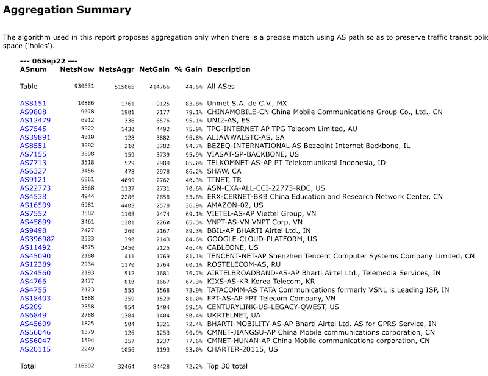

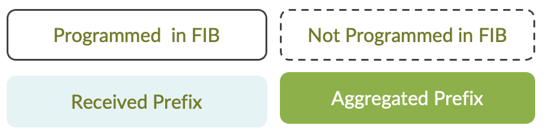

- In light blue, we represent the routes received from the BGP neighbors. Note that routes can be learned from any source, BGP, IGP, local, or static, ... It's not relevant in this context, we just happened to use BGP to easily advertise large tables.
- In green, we represent prefixes compressed by the algorithm.
- In dotted line, the prefixes are not installed in hardware.
- In solid line, the prefixes are pushed in FIB.
- High-level description of the mechanisms used to compress the FIB
- Implementation on PTX devices: support and limitations
- Verification of these principles with concrete examples in the lab
- How far we can compress today's internet table? What could be the best case?
- The demonstration we don't lose a single packet when reshuffling the compression tree
- How efficiently it compresses routes in our customer's networks?

## How Does it Work?

The mechanism is following two simple rules:

- Shadowing: if a superset prefix is already present in the FIB table, don't install more specific routes with the same Next-Hop (NH) address
- Compression: if several contiguous prefixes with the same NH can be "summarized" to a superset prefix, just push this aggregate.

Several exceptions / configuration may prevent a prefix to compressed, we will list them in the implementation section.

### Shadowing

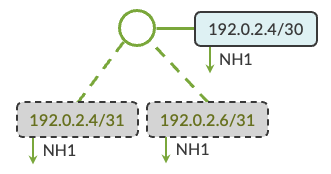

In the Diagram 2 example, three prefixes are received from a BGP speaker, all pointing to the same NH1. The two /31s are "covered" by the superset /30. 192.0.2.4/31 and 192.0.2.6/31 are "shadowed" and not pushed in the PFE FIB, we will only install the /30.

### Compression

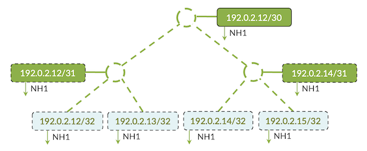

In Diagram 3, we demonstrate two compression levels:

- .12/32 and .13/32 can be aggregated to .12/31
- .13/32 and .14/32 can be aggregated to .14/31
- And these two aggregates can be summarized themselves to .12/30

We are installing a single route, 192.0.2.12/30.

Keep in mind these prefixes need to have the same forwarding behavior. That means, the same next-hop address:

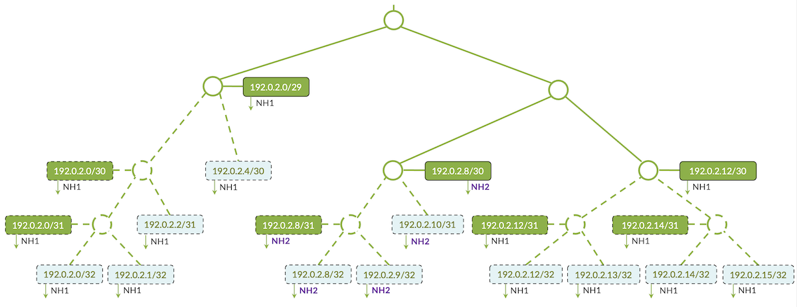

The example in Diagram 4 illustrates why it's not possible to aggregate these 12 prefixes to a unique 192.0.2.0/28: three of them "in the middle" don't have the same Next-Hop address.
Yet, we can summarize this tree into three routes.

Note: the aggregation is not limited to prefixes of similar length. We gathered multiple /32s and multiple /31s prefixes to generated 192.0.2.0/29.

### More Specific Prefixes

The following example is showing another level of subtleties for the compression algorithm.

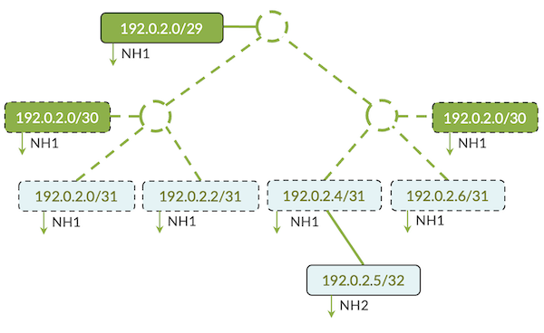

In this situation, the router received 5 prefixes:

- Four of them can be aggregated to 192.0.2.0/29
- The last one 192.0.2.5/32 is more specific than the received 192.0.2.4/31 but is pointing to a different NH2, so it's not "shadowed".

This 5th prefix is not breaking the tree structure and doesn't affect the compression. We will install two prefixes in hardware: 192.0.2.0/29-->NH1 and 192.0.2.5/32-->NH2

## Support and Limitations

The compression ratio will be different from customer to customer, and even between two routers in different places/roles in the network. Not only the number but the variety of next-hop addresses will influence the algorithm performance.

Later in this article, we will demonstrate how far we can compress the public view using a single next-hop (the best possible case). And we will present the FIB space reduction, measured in different live networks.

The compression algorithm handles unicast IPv4 and IPv6 prefixes. The advertising protocols (or even local, static, ...) used to learn these routes are not important because compression is performed at the FIB level. It works for routes in inet.0 or L3VPN VRFs. Finally, it has no impact on uRPF check.

FIB compression is not implemented for multicast routes. The size of the multicast tables wouldn't justify it.

Some "features" can prevent routes from being aggregated, like:

- [SCU/DCU accounting (source/destination class usage)](https://www.juniper.net/documentation/us/en/software/junos/network-mgmt/topics/topic-map/accounting-options-source-class-and-destination-class.html)

In such cases, the specific routes will not be compressed.

Today, the first routers to natively support the features are the PTX powered by Express 4 chipset and running Junos EVO:

- PTX10001-36MR
- LC1201 and LC1202 line cards in PTX10000 chassis

Other platforms based on Junos EVO will implement the same algorithm soon.

FIB compression has been introduced for the PTX platforms listed above starting from 21.2R1. The feature is enabled by default, it doesn't require any specific configuration.

## Implementation

The algorithm is implemented at the line card CPU by the "evo-aftman-bt" process. You notice it doesn't happen at the Routing Engine (RE) level but in a distributed fashion, as close as possible to the PFE.

The routes are not modified in the RIB, or other protocol tables, therefore, compression does not affect redistribution.

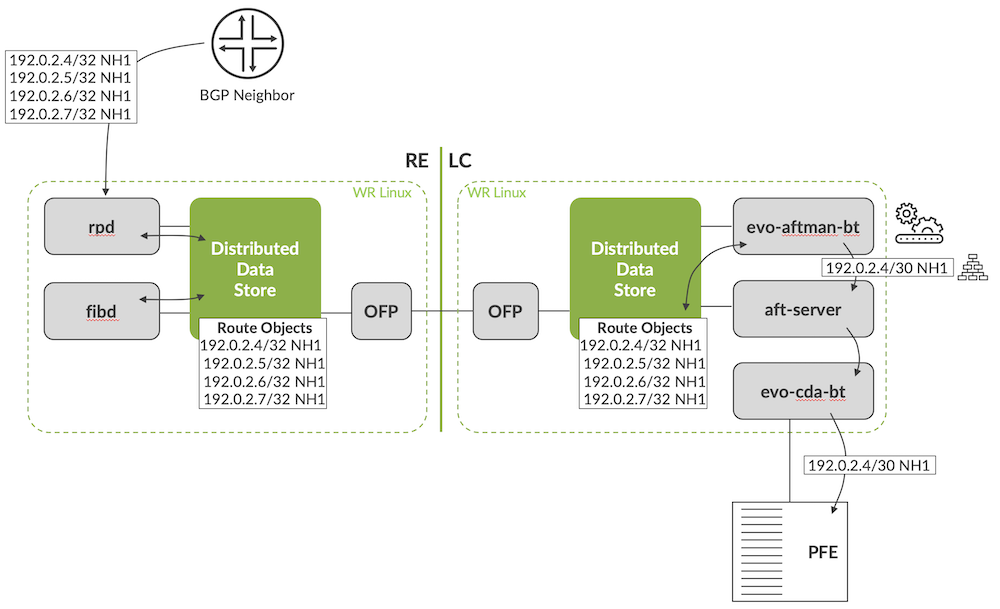

Diagram 6 represents a chassis with Express 4 Line Cards.

In a fixed form-factor router like PTX10001-36MR, it's simplified: we don't need to replicate the route objects in the Distributed DataStore (DDS) for example. In our chassis example, the prefixes are distributed via this datastore and the evo-aftman-bt will construct the radix tree. The compression happens here. Eventually, the evo-cda-bt process will program the compressed FIB in the PFE hardware table.

Let's have a look at the behavior of this algorithm in the lab with concrete examples. We will use a router connected to a route and traffic generator, symbolized with this icon in the following diagrams:


### Compression Test 1

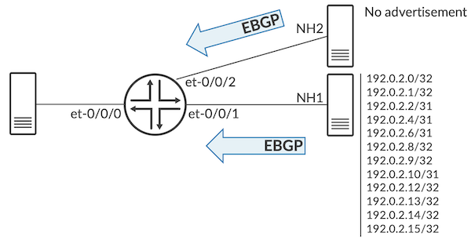

These /32 and /31 routes are pointing to the same NH address and are "contiguous", they can be aggregated to 192.0.2.0/28

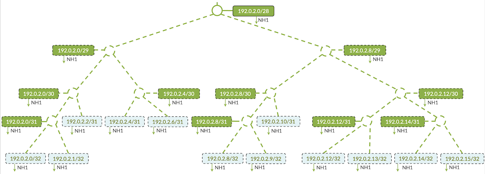

We take a look at the aggregated routes:

```
regress@rtme-ptx10:pfe> show route proto ip index 0 select aggregate

Index Destination                      NH Id     NH Type   NH Token  GUID
----- -------------------------------- --------- --------- --------- --------
0      192.0.2.0/28                     13027     software  6068              0
0      192.0.2.0/29                     13027     software  6068              0
0      192.0.2.0/30                     13027     software  6068              0
0      192.0.2.0/31                     13027     software  6068              0
0      192.0.2.4/30                     13027     software  6068              0
0      192.0.2.8/29                     13027     software  6068              0
0      192.0.2.8/30                     13027     software  6068              0
0      192.0.2.8/31                     13027     software  6068              0
0      192.0.2.12/30                    13027     software  6068              0
0      192.0.2.12/31                    13027     software  6068              0
0      192.0.2.14/31                    13027     software  6068              0

regress@rtme-ptx10:pfe> 
```

This output shows the "recursive" compression:

- The two last lines:

192.0.2.12/32 and 192.0.2.13/32 are compressed to 192.0.2.12/31 (in blue)
192.0.2.14/32 and 192.0.2.15/32 are compressed to 192.0.2.14/31 (in blue)
- both /31 aggregates from the previous step are also aggregated into 192.0.2.2/30 (in green)
- And it continues level after level up to 192.0.2.0/28
- The NH type "software" represents the entries created by the compression algorithm.

```
regress@rtme-ptx10:pfe> show route proto ip index 0 prefix 192.0.2.14/32 detail                    
 Protocol     : IPv4
 Table        : default
 Prefix       : 192.0.2.14 (primary)
 NH           : 13027 (software)
 Flags        : 0x00008000
Details      :
        guid          : 833230259553
        type          :  user
        nhid          :  13027
     Forwarding state:
        installed?    :  no
     (Installed parent: 192.0.2.0/28)
 
regress@rtme-ptx10:pfe> show route proto ip index 0 prefix 192.0.2.0/28 detail     
 Protocol     : IPv4
 Table        : default
 Prefix       : 192.0.2.0/28 (primary)
 NH           : 13027 (software)
 Flags        : 0x00008000
Details      :
        guid          :  0
        type          :  user
        nhid          :  13027
     Forwarding state:
        installed?    :  yes
        nh-token      :  6068
 
regress@rtme-ptx10:pfe> 
```

In this last output, we check the handling of a specific prefix (192.0.2.14/32) and we can notice it's not installed in favor of the parent prefix 192.0.2.0/28.

### Compression Test 2

Now in the second example:

- We start from the test 1 conditions (twelve contiguous prefixes aggregated into a /28)
- We stop advertising 192.0.2.12/32 from NH1, and announced it from a new peer, with a new next hop address NH2.
- The twelve routes can no longer be aggregated in one, It changes the structure of the tree and impacts the compression.

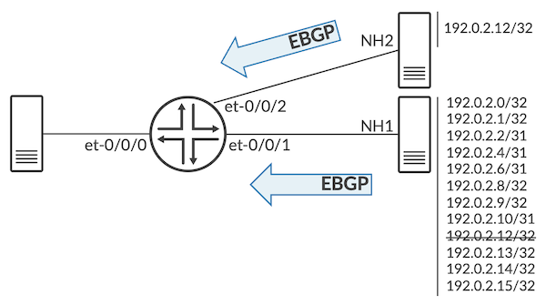

```
regress@rtme-ptx10> show bgp summary    

Threading mode: BGP I/O
Default eBGP mode: advertise - accept, receive - accept
Groups: 4 Peers: 6 Down peers: 4
Table          Tot Paths  Act Paths Suppressed    Histry Damp State    Pending
inet.0              
                      12         12          0          0          0          0
inet6.0             
                       0          0          0          0          0          0
Peer                     AS      InPkt     OutPkt    OutQ   Flaps Last Up/Dwn State|#Active/Received/Accepted/Damped...
15.1.1.2              65001        500        515       0       9     3:51:24 Establ
  inet.0: 11/11/11/0
15.1.2.2              65002          4          3       0       5           2 Establ
  inet.0: 1/1/1/0
15.1.3.2              65003          0          0       0       5     4:22:05 Active
2002:15:1:1::2        65001          0          0       0       2     4:38:27 Active
2002:15:1:2::2        65002          0          0       0       2     4:39:15 Active
2002:15:1:3::2        65003          0          0       0       3     4:22:04 Active
 
regress@rtme-ptx10>
```

The neighbour 15.1.2.2 advertises a single route 192.0.2.12/32 modifying the structure of the tree, leading to a less efficient compression ratio:

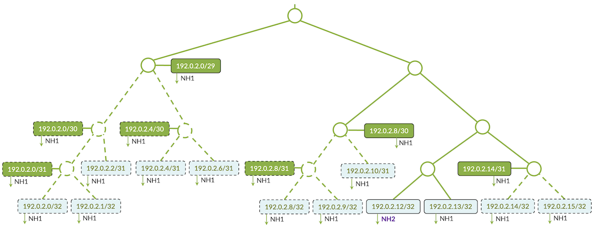

We verify the aggregation and the prefixes not installed in FIB with the following CLI.

The aggregated routes are those computed by the algorithm and represented in green in the diagram. The uninstalled routes are represented in dotted lines in the diagram.

```
regress@rtme-ptx10:pfe> show route proto ip index 0 select aggregate                               
 
Index Destination                      NH Id     NH Type   NH Token  GUID
----- -------------------------------- --------- --------- --------- --------
0      192.0.2.0/29                     13027     software  6068              0
0      192.0.2.0/30                     13027     software  6068              0
0      192.0.2.0/31                     13027     software  6068              0
0      192.0.2.4/30                     13027     software  6068              0
0      192.0.2.8/30                     13027     software  6068              0
0      192.0.2.8/31                     13027     software  6068              0
0      192.0.2.14/31                    13027     software  6068              0
 
regress@rtme-ptx10:pfe> show route proto ip index 0 select uninstalled               
 
Index Destination                      NH Id     NH Type   NH Token  GUID
----- -------------------------------- --------- --------- --------- --------
0      192.0.2.0/30                     13027     software  6068              0
0      192.0.2.0/31                     13027     software  6068              0
0      192.0.2.0                        13027     software  6068      833230259556
0      192.0.2.1                        13027     software  6068      833230259555
0      192.0.2.2/31                     13027     software  6068      833230259554
0      192.0.2.4/30                     13027     software  6068              0
0      192.0.2.4/31                     13027     software  6068      833230259549
0      192.0.2.6/31                     13027     software  6068      833230259558
0      192.0.2.8/31                     13027     software  6068              0
0      192.0.2.8                        13027     software  6068      833230259559
0      192.0.2.9                        13027     software  6068      833230259552
0      192.0.2.10/31                    13027     software  6068      833230259548
0      192.0.2.14                       13027     software  6068      833230259553
0      192.0.2.15                       13027     software  6068      833230259551
 
regress@rtme-ptx10:pfe>
```

If you don't want to verify each prefix one by one, count them: we have seven aggregate entries in the output (and seven green boxes in the diagram). In the same manner, we have fourteen entries in the uninstalled CLI ouput (and fourteen dotted line boxes in the diagram too).

We can also check specific prefixes and see which ones are installed or not. If not, the output gives us the installed parent.

```
regress@rtme-ptx10:pfe> show route proto ip index 0 prefix 192.0.2.1/32 detail    
 Protocol     : IPv4
 Table        : default
 Prefix       : 192.0.2.1 (primary)
 NH           : 13027 (software)
 Flags        : 0x00008000
Details      :
        guid          : 833230259555
        type          :  user
        nhid          :  13027
     Forwarding state:
        installed?    :  no                  <<< Not Installed
     (Installed parent: 192.0.2.0/29)        <<< Parent prefix
 
regress@rtme-ptx10:pfe> show route proto ip index 0 prefix 192.0.2.0/29 detail    
 Protocol     : IPv4
 Table        : default
 Prefix       : 192.0.2.0/29 (primary)
 NH           : 13027 (software)
 Flags        : 0x00008000
Details      :
        guid          :  0
        type          :  user
        nhid          :  13027
     Forwarding state:
        installed?    :  yes
        nh-token      :  6068
 
regress@rtme-ptx10:pfe> show route proto ip index 0 prefix 192.0.2.12/32 detail   
 Protocol     : IPv4
 Table        : default
 Prefix       : 192.0.2.12 (primary)
 NH           : 13026 (software)
 Flags        : 0x00008000
Details      :
        guid          : 833230259572
        type          :  user
        nhid          :  13026
     Forwarding state:
        installed?    :  yes  <<< Installed
        nh-token     :  607

regress@rtme-ptx10:pfe> show route proto ip index 0 prefix 192.0.2.13/32 detail    
 Protocol     : IPv4
 Table        : default
 Prefix       : 192.0.2.13 (primary)
 NH           : 13027 (software)
 Flags        : 0x00008000
Details      :
        guid          : 833230259550
        type          :  user
        nhid          :  13027
     Forwarding state:
        installed?    :  yes
        nh-token      :  6068
 
regress@rtme-ptx10:pfe> show route proto ip index 0 prefix 192.0.2.14/32 detail    
 Protocol     : IPv4
 Table        : default
 Prefix       : 192.0.2.14 (primary)
 NH           : 13027 (software)
 Flags        : 0x00008000
Details      :
        guid          : 833230259553
        type          :  user
        nhid          :  13027
     Forwarding state:
        installed?    :  no
     (Installed parent: 192.0.2.14/31)
 
regress@rtme-ptx10:pfe> show route proto ip index 0 prefix 192.0.2.14/31 detail    
 Protocol     : IPv4
 Table        : default
 Prefix       : 192.0.2.14/31 (primary)
 NH           : 13027 (software)
 Flags        : 0x00008000
Details      :
        guid          :  0
        type          :  user
        nhid          :  13027
     Forwarding state:
        installed?    :  yes
        nh-token      :  6068
 
regress@rtme-ptx10:pfe>
```

### Compression Test 3

This other test will illustrate the "more specific prefix" principle detailed earlier. A large block of contiguous /24s is aggregated and a more specific /25 with a different next-hop is added in the mix:

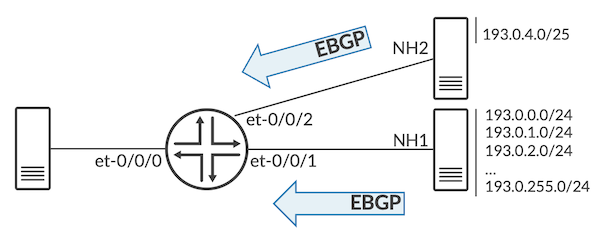

We look at the installed prefixes:

```
regress@rtme-ptx10:pfe> show route proto ip index 0 select installed              

 
Index Destination                      NH Id     NH Type   NH Token  GUID
----- -------------------------------- --------- --------- --------- --------
0      default                          34        discard   1140      833223655665
0      0.0.0.0                          34        discard   1140      622770257990
0      12.1.1.1                         11002     local     1308      841813590953
0      15.1.1/24                        11009     resolve   1730      841813591064
<SNIP>
0      15.1.3.2                         53063     unicast   6035      721554517737
0      15.1.3.255                       11034     bcast     5464      841813591844
0      193.0/16                         13032     software  6094              0
0      193.0.4.0/25                     13034     software  6098      833230392891
0      224/4                            35        mdiscard  1141      622770257992
0      224.0.0.1                        31        mcast     1137      622770257985
0      255.255.255.255                  32        bcast     1138      622770257987
 
regress@rtme-ptx10:pfe>
```

The presence of the 193.0.4.0/25 didn't "break" the tree structure. We have programmed the aggregate 193.0.0.0/16-->NH1 and 193.0.4.0/25-->NH2.

```
regress@rtme-ptx10:pfe> show route proto ip index 0 prefix 193.0.4.0/25 detail    
 Protocol     : IPv4
 Table        : default
 Prefix       : 193.0.4.0/25 (primary)
 NH           : 13034 (software)
 Flags        : 0x00008000
Details      :
        guid          : 833230392891
        type          :  user
        nhid          :  13034
     Forwarding state:
        installed?    :  yes
        nh-token      :  6098
 
regress@rtme-ptx10:pfe> show route proto ip index 0 prefix 193.0.5.0/24 detail    
 Protocol     : IPv4
 Table        : default
 Prefix       : 193.0.5/24 (primary)
 NH           : 13032 (software)
 Flags        : 0x00008000
Details      :
        guid          : 833230392633
        type          :  user
        nhid          :  13032
     Forwarding state:
        installed?    :  no
     (Installed parent: 193.0/16)
 
regress@rtme-ptx10:pfe> show route proto ip index 0 prefix 193.0.0.0/16 detail    
 Protocol     : IPv4
 Table        : default
 Prefix       : 193.0/16 (primary)
 NH           : 13032 (software)
 Flags        : 0x00008000
Details      :
        guid          :  0
        type          :  user
        nhid          :  13032
     Forwarding state:
        installed?    :  yes
        nh-token      :  6094


regress@rtme-ptx10:pfe>
```

Now, just for the "fun" of the experience (don't judge me), let's see what happens if we advertise two contiguous /25 prefixes instead of just one:

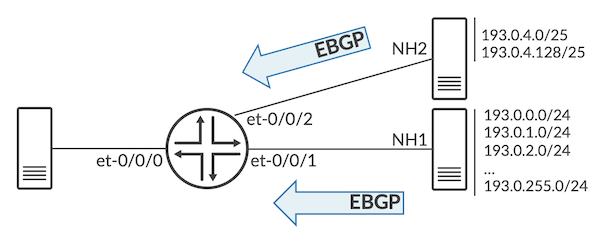

Let's take a look at the prefixes installed in hardware:

```
regress@rtme-ptx10:pfe> show route proto ip index 0 select installed              
 
Index Destination                      NH Id     NH Type   NH Token  GUID
----- -------------------------------- --------- --------- --------- --------
0      default                          34        discard   1140      833223655665
0      0.0.0.0                          34        discard   1140      622770257990
<SNIP>
0      15.1.3.1                         11036     local     5473      841813591848
0      15.1.3.2                         53063     unicast   6035      721554517737
0      15.1.3.255                       11034     bcast     5464      841813591844
0      193.0.0/22                       13032     software  6094              0
0      193.0.4/24                       13034     software  6098              0
0      193.0.5/24                       13032     software  6094      833230392633
0      193.0.6/23                       13032     software  6094              0
0      193.0.8/21                       13032     software  6094              0
0      193.0.16/20                      13032     software  6094              0
0      193.0.32/19                      13032     software  6094              0
0      193.0.64/18                      13032     software  6094              0
0      193.0.128/17                     13032     software  6094              0
0      224/4                            35        mdiscard  1141      622770257992
0      224.0.0.1                        31        mcast     1137      622770257985
0      255.255.255.255                  32        bcast     1138      622770257987
 
regress@rtme-ptx10:pfe>
```

Interestingly, the compression to 193.0.0.0/16 has been "broken" into multiple more specific aggregates (from /17 to /23)

It's an expected behavior considering 193.0.4.0/25-->NH2 and 193.0.4.128/25-->NH2 have been aggregated into a 193.0.4.0/24-->NH2

```
regress@rtme-ptx10:pfe> show route proto ip index 0 prefix 193.0.4.0/25 detail    
 Protocol     : IPv4

 Table        : default
 Prefix       : 193.0.4.0/25 (primary)
 NH           : 13034 (software)
 Flags        : 0x00008000
Details      :
        guid          : 833230392891
        type          :  user
        nhid          :  13034
     Forwarding state:
        installed?    :  no
     (Installed parent: 193.0.4/24)
 
regress@rtme-ptx10:pfe> show route proto ip index 0 prefix 193.0.4.0/24 detail    
 Protocol     : IPv4
 Table        : default
 Prefix       : 193.0.4/24 (primary)
 NH           : 13034 (software)
 Flags        : 0x00008000
Details      :
        guid          :  0
        type          :  user
        nhid          :  13034
     Forwarding state:
        installed?    :  yes
        nh-token      :  6098 

regress@rtme-ptx10:pfe>
```

It does replace the original 193.0.4.0/24-->NH1, therefore the system can't summarize to 193.0/16-->NH1 anymore.

```
regress@rtme-ptx10:pfe> show route proto ip index 0 prefix 193.0.2.0/24 detail    

 Protocol     : IPv4
 Table        : default
 Prefix       : 193.0.2/24 (primary)
 NH           : 13032 (software)
 Flags        : 0x00008000
Details      :
        guid          : 833230392630
        type          :  user
        nhid          :  13032
     Forwarding state:
        installed?    :  no
     (Installed parent: 193.0.0/22)
 
regress@rtme-ptx10:pfe> show route proto ip index 0 prefix 193.0.0.0/22 detail    
 Protocol     : IPv4
 Table        : default
 Prefix       : 193.0.0/22 (primary)
 NH           : 13032 (software)
 Flags        : 0x00008000
Details      :
        guid          :  0
        type          :  user
        nhid          :  13032
     Forwarding state:
        installed?    :  yes
        nh-token      :  6094
 
regress@rtme-ptx10:pfe> show route proto ip index 0 prefix 193.0.128.0/24 detail   
 Protocol     : IPv4
 Table        : default
 Prefix       : 193.0.128/24 (primary)
 NH           : 13032 (software)
 Flags        : 0x00008000
Details      :
        guid          : 833230392756
        type          :  user
        nhid          :  13032
     Forwarding state:
        installed?    :  no
     (Installed parent: 193.0.128/17)
 
regress@rtme-ptx10:pfe> show route proto ip index 0 prefix 193.0.128.0/17 detail    
 Protocol     : IPv4
 Table        : default
 Prefix       : 193.0.128/17 (primary)
 NH           : 13032 (software)
 Flags        : 0x00008000
Details      :
        guid          :  0
        type          :  user
        nhid          :  13032
     Forwarding state:
        installed?    :  yes
        nh-token      :  6094
 
regress@rtme-ptx10:pfe>
```

With these examples, the reader should clearly understand the algorithm's behavior.

## Does it Work in Production?

As mentioned earlier, this feature is activated by default on the Express 4 routers since Junos release 21.2R1: it has been deployed in many production networks and we can verify the compression performance in real conditions.

We collected and anonymized data:

```
user@ptx36mr:pfe> show route summary
 
IPv4 Route Tables:
Index         Routes     Size(b)  Prefixes     Aggr     Installed   Comp(%)
--------  ----------  ----------  ---------  ---------  ----------  ------
Default       913170   131812824    895870     354261      368514     59
1                  0           0         0          0           0      0
51                 5         520         5          0           5      0
52            221102    31465408    217778      81450       93102     57
53                12        1248        11          0          11      0
36738              9         936         9          0           9      0
 
MPLS Route Tables:
Index         Routes     Size(b)  Prefixes     Aggr     Installed   Comp(%)
--------  ----------  ----------  ---------  ---------  ----------  ------
Default          522       54288       522          0         522      -
54                 1         104         1          0           1      -
 
IPv6 Route Tables:
Index         Routes     Size(b)  Prefixes     Aggr     Installed   Comp(%)
--------  ----------  ----------  ---------  ---------  ----------  ------
Default       155979    22288448    154262      58333       59732     62
1                  0           0         0          0           0      0
51                 6         624         6          0           6      0
52             29127     4226144     29007      11509       10992     63
53                 7         728         7          0           7      0
36738             14        1456        14          0          14      0
 
CLNP Route Tables:
Index         Routes     Size(b)  Prefixes     Aggr     Installed   Comp(%)
--------  ----------  ----------  ---------  ---------  ----------  ------
Default            2         208         2          0           2      -
51                 1         104         1          0           1      -
52                 1         104         1          0           1      -
53                 1         104         1          0           1      -
 
user@ptx36mr:pfe> show route compression
 
Index   Proto     Prefixes     Aggregate    Installed   Comp(%)
-----  ------   -----------   ------------ ----------- --------
0       IPv4        895872        354255      368519       59
1       IPv4             0             0           0        0
51      IPv4             5             0           5        0
52      IPv4        217778         81446       93103       57
53      IPv4            11             0          11        0
36738   IPv4             9             0           9        0
0       IPv6        154259         58332       59730       62
1       IPv6             0             0           0        0
51      IPv6             6             0           6        0
52      IPv6         29006         11509       10991       63
53      IPv6             7             0           7        0
36738   IPv6            14             0          14        0
 
user@ptx36mr:pfe> show nh summary
            Type              Count           Max Count
         Discard                  16                  16
          Reject                  19                  16
         Unicast                 848                 871
         Unilist                 393                 490
         Indexed                   0                   0
        Indirect               137                 137
            Hold                   2                  28
         Resolve                  78                  78
        XResolve                   0                   0
           Local                  94                  94
         Receive                 114                 114
         multirt                   0                   0
           Bcast                  16                  16
           Mcast                  12                  12
          Mgroup                   0                   0
        MDiscard                  12                  12
           Table                  16                  16
            Deny                  12                  12
       Composite                 116                 225
        Software                 906                 907
       Aggregate                1834                1837
 
Total number of NH = 4625
 
user@ptx36mr:pfe>
```

"Indirect" represents the next-hop addresses used by BGP in our case.

In this chart, we have RIB table, number of next=hop and the compression efficiency (representing the FIB space reduction).

|  | RIB Table size | Number of NH | FIB Space Reduction |
|:--|:--|:--|:--|
| Customer A IPv4 | 913170 | 137 | 59% |
| Customer A IPv6 | 155979 | 137 | 62% |
| Customer B IPv4 | 884835 | 1600 | 55% |
| Customer B IPv6 | 149367 | 1600 | 60% |
| Customer C IPv4 | 968587 | 2030 | 56% |
| Customer C IPv6 | 153519 | 2030 | 60% |

When the feature has been introduced in 2020, we also measured the compression in diverse networks (IPv4 and IPv6 public tables were slightly smaller).

|  | RIB Table size | Number of NH | FIB Space Reduction |
|:--|:--|:--|:--|
| Customer 1 IPv4 | 814621 | 133 | 69% |
| Customer 2 IPv4 | 816791 | 148 | 61% |
| Customer 3 IPv4 | 801872 | 1000 | 69% |
| Customer 4 IPv4 | 838589 | 59 | 86% |
| Customer 5 IPv4 | 958854 | 2538 | 55% |
| Customer 6 IPv4 | 967325 | 1815 | 61% |
| Customer 7 IPv4 | 811385 | 453 | 58% |
| Customer 8 IPv6 | 83313 | 21 | 54% |

The recent examples are showing a compression performance ranging from 50% to 62%. The marketing message "compression ***doubles*** the FIB space", is even conservative in some cases.

Every network will show a different level of compression depending on the way routes are mapped to next hop addresses:

- In the best case, all best routes will point to a unique NH (that's what we test in next section).
- In the worst pathological case, all contiguous routes are using different next-hop addresses and can not be compressed.

To illustrate the worst case, we are taking a portion of the potaroo routes used in next section. They have three BGP feeds / NH addresses, and the variety of NH prevents compression for this specific series of routes.

```
BGP table version is 0, local router ID is 203.133.248.2
Status codes: s suppressed, d damped, h history, * valid, > best, = multipath,
              i internal, r RIB-failure, S Stale, R Removed
Origin codes: i - IGP, e - EGP, ? - incomplete
 
   Network          Next Hop            Metric LocPrf Weight Path
*  1.0.132.0/24     202.12.28.1                            0 4777 4713 2914 38040 23969 ?
*>                  203.119.104.1                          0 4608 4635 38040 23969 ?
*                   203.119.104.2                          0 4608 24115 38040 23969 ?
*  1.0.133.0/24     202.12.28.1                            0 4777 4713 2914 38040 23969 ?
*                   203.119.104.1                          0 4608 4635 38040 23969 ?
*>                  203.119.104.2                          0 4608 24115 38040 23969 ?
*  1.0.136.0/24     202.12.28.1                            0 4777 4713 2914 38040 23969 ?
*>                  203.119.104.1                          0 4608 4635 38040 23969 ?
*                   203.119.104.2                          0 4608 24115 38040 23969 ?
*> 1.0.137.0/24     202.12.28.1                            0 4777 6939 4651 23969 i
*                   203.119.104.1                          0 4608 24115 6939 4651 23969 i
*                   203.119.104.2                          0 4608 24115 6939 4651 23969 i
*  1.0.138.0/24     202.12.28.1                            0 4777 4713 2914 38040 23969 ?
*>                  203.119.104.1                          0 4608 4635 38040 23969 ?
*                   203.119.104.2                          0 4608 24115 38040 23969 ?
*  1.0.139.0/24     202.12.28.1                            0 4777 4713 2914 38040 23969 ?
*                   203.119.104.1                          0 4608 4635 38040 23969 ?
*>                  203.119.104.2                          0 4608 24115 38040 23969 ?
*> 1.0.141.0/24     202.12.28.1                            0 4777 6939 4651 23969 i
*                   203.119.104.1                          0 4608 24115 6939 4651 23969 i
*                   203.119.104.2                          0 4608 24115 6939 4651 23969 
```

Consequently, we can NOT derive a rule to estimate the compression performance based on the number of next-hop addresses present in the table. We can't predict how prefixes are linked to each NH and how they are distributed. It shows the limits of what we can do in the lab. To estimate the compression benefits before deploying the PTX in production, you'll need the full output of routes and next-hop information. The real life numbers presented in the chart above are the most definitive proof of the algorithm efficiency.

## Best Case Scenario

To understand how far the current internet table can be compressed, we advertised the internet routes present in [https://bgp.potaroo.net/as2.0/bgptable.txt](https://bgp.potaroo.net/as2.0/bgptable.txt) to "single-attached" router.

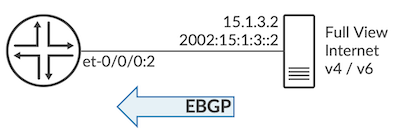

Of course, a single default route would do the same job ;)

But the purpose of this test is to identify how far we can compress a current internet table if all existing routes point to the same next hop. That represents the best case we can reach with this implementation.

```
regress@rtme-ptx10> show bgp summary    

Threading mode: BGP I/O
Default eBGP mode: advertise - accept, receive - accept
Groups: 4 Peers: 6 Down peers: 4
Table          Tot Paths  Act Paths Suppressed    History Damp State    Pending
inet.0               
                  930416     930416          0          0          0          0
inet6.0              
                  161443     161443          0          0          0          0
Peer                     AS      InPkt     OutPkt    OutQ   Flaps Last Up/Dwn State|#Active/Received/Accepted/Damped...
15.1.1.2              65001         93         34       0       5           7 Active
15.1.2.2              65002          0          0       0       4       10:39 Active
15.1.3.2              65003       1492         73       0       4          23 Establ
  inet.0: 930416/930416/930416/0
2002:15:1:1::2        65001          0          0       0       2        9:50 Active
2002:15:1:2::2        65002          0          0       0       2       10:38 Active
2002:15:1:3::2        65003        345          7       0       2        2:46 Establ
  inet6.0: 161443/161443/161443/0
 
regress@rtme-ptx10>
```

We advertise 930,416 IPv4 and 161,433 IPv6 prefixes with the same next-hop address. And we check the compression at the PFE level:

```
regress@rtme-ptx10:pfe> show route compression 
 
Index   Proto     Prefixes     Aggregate    Installed   Comp(%)
-----  ------   -----------   ------------ ----------- --------
0       IPv4        911507        517408      167198       82
1       IPv4             0             0           0        0
51      IPv4             5             0           5        0
36738   IPv4             9             0           9        0
0       IPv6        159527         68148       46260       72
1       IPv6             0             0           0        0
51      IPv6             6             0           6        0
36738   IPv6             6             0           5       17
 
regress@rtme-ptx10:pfe> 
```

It's an interesting finding. In September 2022, with the internet view proposed by potaroo.net, we can compress the IPv4 table by 82% (that means it will occupy only 18% of the space it would have used without compression) and the IPv6 table by 72%.

Again, it's an best-case scenario for internet table. But your table can potentially contain many IGP routes that can be compressed too.

## What About the Churn?

What happens when a network event triggers the rebuild of the radix tree and the re-installation of FIB table blocks? It's a legitimate question since the network and internet are not static, you may receive new routes, or existing routes could be resolved by a new Next-Hop address (a different peering point for example).

Like every Junos process, the FIB compression implementation follows a make-before-break logic. That means that all the changes are brought into the FIB before we remove the previous entries. It guarantees we don't create any black holes while the system is converging.

We will run the following test in the lab to demonstrate the compression algorithm doesn't cause any packet drop while re-constructing a large tree.

Let's start with a very big aggregation of 1M contiguous /31 routes into a single /11.

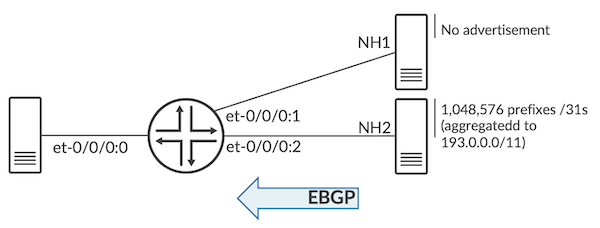

```
regress@rtme-ptx10:pfe> show route proto ip index 0 select installed   
 

Index Destination                      NH Id     NH Type   NH Token  GUID
----- -------------------------------- --------- --------- --------- --------
0      default                          34        discard   1140      833223655665
0      0.0.0.0                          34        discard   1140      622770257990
<SNIP>
0      15.1.3.255                       11034     bcast     5464      841813591844
0      193.0/11                         13036     software  6104              0
0      224/4                            35        mdiscard  1141      622770257992
0      224.0.0.1                        31        mcast     1137      622770257985
0      255.255.255.255                  32        bcast     1138      622770257987
 
regress@rtme-ptx10:pfe>
```

** **

Now, we break the aggregation structure with the advertisement of two /32s in the middle of this perfect alignment via a different eBGP peer (therefore, a different NH address)

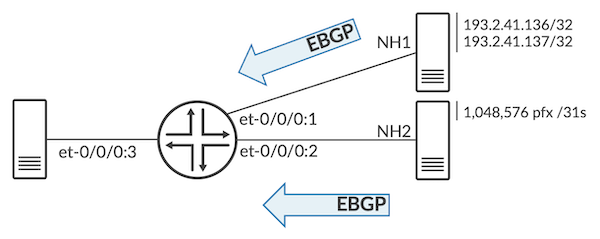

```
regress@rtme-ptx10:pfe> show route proto ip index 0 select installed   

 
Index Destination                      NH Id     NH Type   NH Token  GUID
----- -------------------------------- --------- --------- --------- --------
0      default                          34        discard   1140      833223655665
0      0.0.0.0                          34        discard   1140      622770257990
0      12.1.1.1                         11002     local     1308      841813590953
<SNIP>
0      15.1.3.255                       11034     bcast     5464      841813591844
0      193.0/15                         13036     software  6104              0
0      193.2.0/19                       13036     software  6104              0
0      193.2.32/21                      13036     software  6104              0
0      193.2.40/24                      13036     software  6104              0
0      193.2.41.0/25                    13036     software  6104              0
0      193.2.41.128/29                  13036     software  6104              0
0      193.2.41.136/31                  13037     software  6106              0
0      193.2.41.138/31                  13036     software  6104      833231556171
0      193.2.41.140/30                  13036     software  6104              0
0      193.2.41.144/28                  13036     software  6104              0
0      193.2.41.160/27                  13036     software  6104              0
0      193.2.41.192/26                  13036     software  6104              0
0      193.2.42/23                      13036     software  6104              0
0      193.2.44/22                      13036     software  6104              0
0      193.2.48/20                      13036     software  6104              0
0      193.2.64/18                      13036     software  6104              0
0      193.2.128/17                     13036     software  6104              0
0      193.3/16                         13036     software  6104              0
0      193.4/14                         13036     software  6104              0
0      193.8/13                         13036     software  6104              0
0      193.16/12                        13036     software  6104              0
0      224/4                            35        mdiscard  1141      622770257992
0      224.0.0.1                        31        mcast     1137      622770257985
0      255.255.255.255                  32        bcast     1138      622770257987
 
regress@rtme-ptx10:pfe>
```

The introduction of these two routes reshuffled the compression and we have 21 entries programmed in the FIB instead of one.

Now that we know what the advertisement of these two prefixes does on the compression structure, let's verify the potential collateral impact on traffic.

We will move back and forth between two "states" in the lab.

**State 1:**

A full internet v4 table is advertised on top of the previous million /31s entries. And we generate traffic to these prefixes. All of them. It represents more or less 2M routes, and streams.

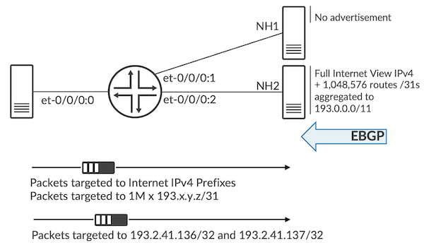

```
regress@rtme-ptx10> show route 193.2.41.136    


inet.0: 1979001 destinations, 1979001 routes (1979001 active, 0 holddown, 0 hidden)
+ = Active Route, - = Last Active, * = Both
 
193.2.41.136/31    *[BGP/170] 12:59:11, localpref 100
                      AS path: 65003 I, validation-state: unverified
                    >  to 15.1.3.2 via et-0/0/0:2.0
 
mgmt_junos.inet.0: 3 destinations, 3 routes (3 active, 0 holddown, 0 hidden)
+ = Active Route, - = Last Active, * = Both
 
0.0.0.0/0          *[Static/5] 3d 16:32:15
                    >  to 10.83.153.254 via re0:mgmt-0.0
 
regress@rtme-ptx10> show route 193.2.41.137    
 
inet.0: 1979001 destinations, 1979001 routes (1979001 active, 0 holddown, 0 hidden)
+ = Active Route, - = Last Active, * = Both
 
193.2.41.136/31    *[BGP/170] 12:59:15, localpref 100
                      AS path: 65003 I, validation-state: unverified
                    >  to 15.1.3.2 via et-0/0/0:2.0
 
mgmt_junos.inet.0: 3 destinations, 3 routes (3 active, 0 holddown, 0 hidden)
+ = Active Route, - = Last Active, * = Both
 
0.0.0.0/0          *[Static/5] 3d 16:32:19
                    >  to 10.83.153.254 via re0:mgmt-0.0
 
regress@rtme-ptx10>
```

With the internet routes and all the million contiguous /31 prefixes, the compression ratio reaches extremely high levels:

```
regress@rtme-ptx10:pfe> show route summary


IPv4 Route Tables:
Index         Routes     Size(b)  Prefixes     Aggr     Installed   Comp(%)
--------  ----------  ----------  ---------  ---------  ----------  ------
Default      1995906   369716672   1964061    1559062      163226     92
1                  0           0         0          0           0      0
51                 5         520         5          0           5      0
36738              9         936         9          0           9      0
 
MPLS Route Tables:
Index         Routes     Size(b)  Prefixes     Aggr     Installed   Comp(%)
--------  ----------  ----------  ---------  ---------  ----------  ------
Default            1         104         1          0           1      -
52                 1         104         1          0           1      -
 
IPv6 Route Tables:
Index         Routes     Size(b)  Prefixes     Aggr     Installed   Comp(%)
--------  ----------  ----------  ---------  ---------  ----------  ------
Default          323       33592        29          0          27      7
1                  0           0         0          0           0      0
51                 6         624         6          0           6      0
36738              7         728         6          0           5     17
 
CLNP Route Tables:
Index         Routes     Size(b)  Prefixes     Aggr     Installed   Comp(%)
--------  ----------  ----------  ---------  ---------  ----------  ------
Default            1         104         1          0           1      -
51                 1         104         1          0           1      -
 
regress@rtme-ptx10:pfe>
```

**State 2:**

We advertise the two prefixes from a different next-hop, breaking the 1M aggregation and creating a re-computation of the tree, while having the "background traffic" of all internet routes.

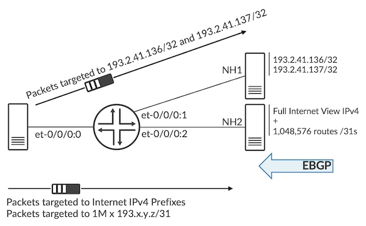

```
regress@rtme-ptx10> show route 193.2.41.136    
 
inet.0: 1979003 destinations, 1979003 routes (1979003 active, 0 holddown, 0 hidden)
+ = Active Route, - = Last Active, * = Both
 
193.2.41.136/32    *[BGP/170] 00:00:12, localpref 100
                      AS path: 65002 I, validation-state: unverified
                    >  to 15.1.2.2 via et-0/0/0:1.0
 
mgmt_junos.inet.0: 3 destinations, 3 routes (3 active, 0 holddown, 0 hidden)
+ = Active Route, - = Last Active, * = Both
 
0.0.0.0/0          *[Static/5] 3d 16:33:58
                    >  to 10.83.153.254 via re0:mgmt-0.0
 
regress@rtme-ptx10> show route 193.2.41.137    
 
inet.0: 1979003 destinations, 1979003 routes (1979003 active, 0 holddown, 0 hidden)
+ = Active Route, - = Last Active, * = Both
 
193.2.41.137/32    *[BGP/170] 00:00:09, localpref 100
                      AS path: 65002 I, validation-state: unverified
                    >  to 15.1.2.2 via et-0/0/0:1.0
 
mgmt_junos.inet.0: 3 destinations, 3 routes (3 active, 0 holddown, 0 hidden)
+ = Active Route, - = Last Active, * = Both
 
0.0.0.0/0          *[Static/5] 3d 16:33:55
                    >  to 10.83.153.254 via re0:mgmt-0.0
 
regress@rtme-ptx10>
```

We have this background traffic going to every internet prefix in the table and every one of these 1M /31 prefixes. Plus, we have this specific stream block for the two /32 prefixes that will be received via et-0/0/0:2 or et-0/0/0:3 depending on the advertisement.

On the traffic/route generator, we will alternate advertisements and withdrawals.

After 10 changes, we check the total number of packets on both ports (verifying we received as much as we sent).

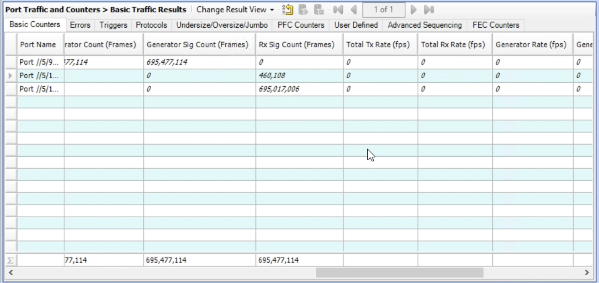

695,477,144 packets sent and received: As expected, not a single packet dropped in this experiment.

We understand that we can't go very far in a lab, but it demonstrates the make-before-break approach used in our implementation. No impact on the prefixes being compressed or "de-aggregated" and no impact on the traffic carried by other prefixes in the table.

## Useful links

- [https://bgp.potaroo.net/as2.0/bgptable.txt](https://bgp.potaroo.net/as2.0/bgptable.txt)
- [https://www.cidr-report.org/as2.0/](https://www.cidr-report.org/as2.0/)

## Glossary

- AFT: Advanced Forwarding Toolkit
- AFTman: AFT Manager
- CDA: Common Driver ASIC driver
- DDS: Distributed DataStore
- FIB: Forwarding Information Base
- fibd: FIB daemon
- LC: Line Card
- NH: Next-Hop (address)
- OFP: Object Flooding Protocol
- RE: Routing Engine
- rpd: route processor daemon
- WR: WindRiver Linux

## Acknowledgements

Many thanks to Suneesh Babu, Dmitry Shokarev, Dmitry Bugrimenko, Edward Ricioppo, Zuhair Makawa, Kevin F Wang and Alex Varghese for their help describing the FIB compression concepts, testing it in our Sunnyvale labs, and collecting data from customer deployments.
