# PTX10000 Power Optimization

**Nicolas Fevrier - 08/29/2023**

Did you know: numerous built-in functionalities with Junos-EVO are enabled by default and help reducing the power usage and carbon foot-print of your PTX routers?

First we'll try to briefly characterize the different components of a router, and what influences their power consumption. Then we will detail all the features present in the Junos-EVO to optimize this power usage.

## What Consumes Power in your Router?

### Power Usage Breakdown

Let's take the example of a fixed router like the PTX10001-36MR. In normal conditions (temperature 20C at sea level, using 400GE FR and 100GE LR optics), a breakdown of the power consumers will be:

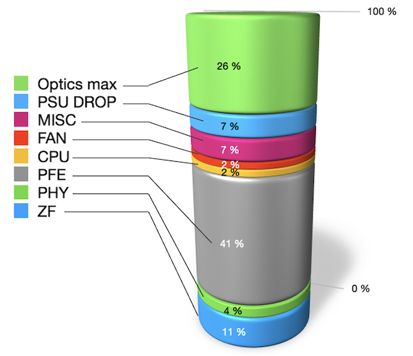

It appears clearly that Packet Forwarding Engine (PFE) is, by far, the largest consumer. The second in proportion are "optics" but that's a maximum figure. That means, we are considering a situation of fully populated optical cages. It will not be the case for a large majority of customer deployments. And we will see, later on in this article, that significant power savings can be achieved on empty ports.

Another perspective based on chassis PTX10008 with LC1201:

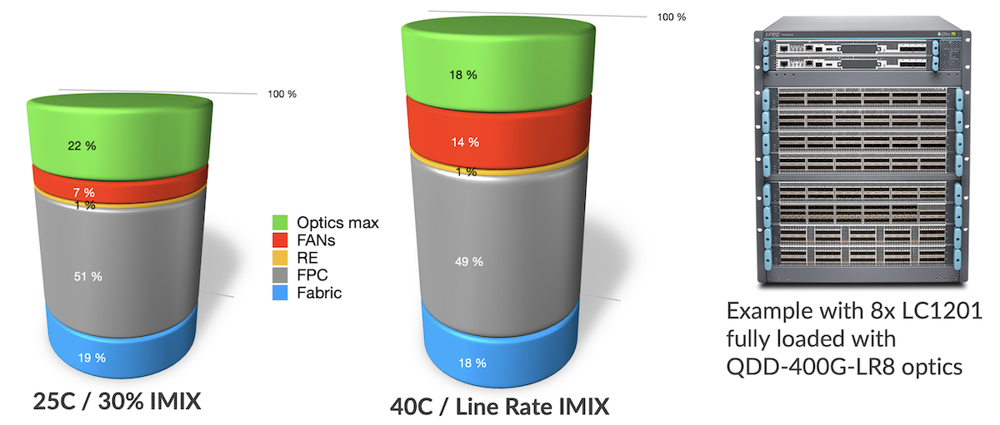

It's interesting to note that line cards (FPC for Flexible PIC Concentrators) represent half of the power usage of a modular system. The cooling system (fans) fluctuates from 7% to 14% depending on the temperature and link usage. And the fabric cards represent less than 20%.

By the way, you can play yourself with the power calculator present on pathfinder ([https://apps.juniper.net/power-calculator/?view=calculate&pdt=51610008&type=1](https://apps.juniper.net/power-calculator/?view=calculate&pdt=51610008&type=1), login required) to understand the power usage and breakdown based on the various parameters we will describe in this section.

### Fixed Routers Components

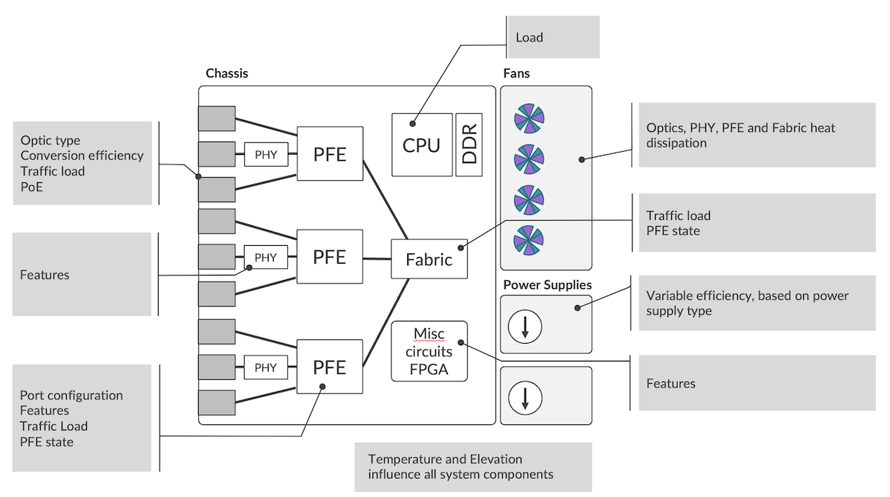

At high level, we represent a fixed router as an assembly of multiple functional blocks. For every one of them, temperature and elevation have a direct impact on the power consumption. Let's try to describe what influences energy usage for these different functional blocks:

- Optical cages:
  - The numbers and types of optics plugged in
  - The voltage conversion efficiency
  - The traffic load in bps (bits/second)
  - The port configuration (disabled, unused, ...)
  - Potentially additional services like PoE (Power over Ethernet)
- PFE: one or several forwarding ASICs in the system:
  - The ASIC process corner bin selection
  - The traffic load expressed in bps (bits/second) and PPS (packets/second)
  - The packets payload content
  - The number of ports activated
  - The features enabled
  - The buffering: packets stored internally or in external memories like HBM (High Bandwidth Memory)
- Fabric engine used to interconnect multiple PFEs:
  - The traffic load (bps and PPS)
  - The numbers of PFEs and the numbers of SerDes to create the interconnection.
- PHYs and SerDes to interconnect optical cages and PFE:
  - Features running on PHYs
- The CPU and DRAM:
  - CPU load on each core.
- Various FPGA, internal circuitry (PCIe, I2C)
- The EM Policy (Environmental Monitoring) will constantly check sensors in key locations inside the router and based on the temperature measured, it will define the fans speed, consuming more or less power in the process.
- The cooling direction:
  - Front-to-Back / AirFlow Out (AFO) vs Back-to-Front / AirFlow In (AFI)
- Finally, the power supply modules (PSM) will provide energy to the entire system, converting voltage from the AC or DC sources. The efficiency of the conversion is not linear and depends on the load. Note that PSMs are themselves equipped with a dedicated cooling system (fans), that requires energy to operate.

### Modular Chassis Components

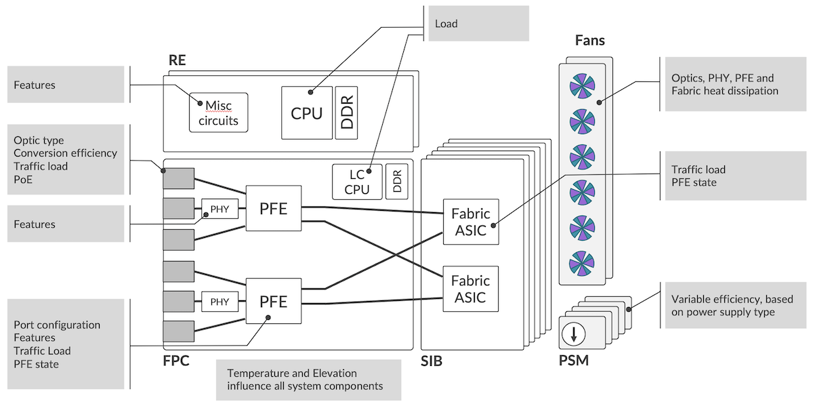

Pretty much the same components as fixed systems with the same parameters influencing the power consumption. Some differences though:

- Potentially multiple Routing and Control Boards with powerful CPU and large DRAM space
- Usually less powerful CPU and smaller DRAM space on each line card (FPC for Flexible PIC Concentrator)
- More Fabric ASICs distributed in multiple Switch Interface Boards (SIBs), with a large number of SerDes to form a full-mesh and interconnect all PFEs in the system.

## Power Saving Features on the PTX Series

We differentiate the power management from the power optimization features:

- The PM (power management) features are responsible for monitoring the energy requirements of all parts in a modular chassis and for maintaining a budget based on the number of watts provided by the multiple PSUs. Based on this information, PM will decide if a FPC can be turned up, or not, in case of budget exceeded.
- The power optimization features contain all mechanisms (automatically enabled or configuration-based) used to reduce the overall consumption. On PTX10000, particular effort has been spent to identify what could be done at every level of the router, making it the most advanced platform in the Juniper Routing portfolio, and leading the way for the other platforms (MX and ACX).

Let's review these power optimization features starting from the optical cage and progressing up to the fabric ASICs.

*Note: in the following sections, for simplicity's sake, we will use the term "shutdown" to represent a low-power mode. This approximation covers different states like "down", "in-reset", "clock-gated", ...*

### Empty Ports

You plug your optical modules (SFP, QSFP28, QDD, ...) in the router's optical cages:

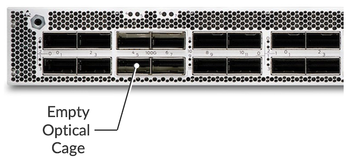

Internally, the optical cages are connected to the transceivers (PHYs) or directly the PFEs via WAN SerDes (Serializer/Deserializer). Essentially, a SerDes is a functional block that is used to interconnect chips on the PCB (Printed Circuit Board).

If we don't insert a pluggable module in the optical cage of an PTX10000, the system automatically shuts down the WAN SerDes of this empty port, saving energy in the process.

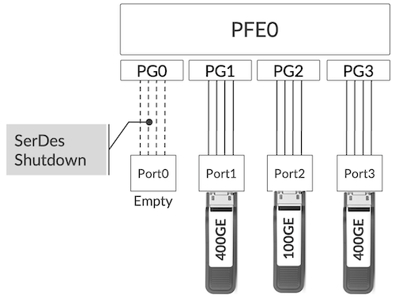

This feature is enabled by default on PTX10000 line cards, LC1201 and LC1202, and on PTX10001-36MR. No specific configuration is required here:

- The insertion of a new optic module will instantly restart the SerDes.
- The extraction of an optic module present will shut down the SerDes.

It's transparent for the operator.

### Port Configured "unused"

A port populated with a pluggable optic can be disabled entirely via the configuration of the "unused" keyword. Once configured "unused", a port will disappear entirely from the IFD list and will not be displayed anymore in the output of show interface commands.

```
regress@rtme-ptx10:pfe> show picd channel fpc 0 pic 2 port 0 chan 0 

name                             : channel-0/2/0:0
speed                            : 400000000000
ifd_status                       : down
ifd_status_components            :
    admin_status                 : up
    pfe_portE                    : up
    protocol_error               : clear
    Fake Link up                 : false

<SNIP>

regress@rtme-ptx10> edit 
Entering configuration mode

[edit]
regress@rtme-ptx10# set interfaces et-0/2/0 unused 

[edit]
regress@rtme-ptx10# commit 
commit complete

[edit]
regress@rtme-ptx10# exit 
Exiting configuration mode

regress@rtme-ptx10> show interfaces terse et-0/2/0 
error: device et-0/2/0 not found

regress@rtme-ptx10> cli-pfe

regress@rtme-ptx10:pfe> show picd serdes fpc 0 pic 2 port 0 chan 0 

channel does not exist

regress@rtme-ptx10:pfe>
```

With this configuration, the port will behave like an empty optical cage: the WAN SerDes will be shutdown.

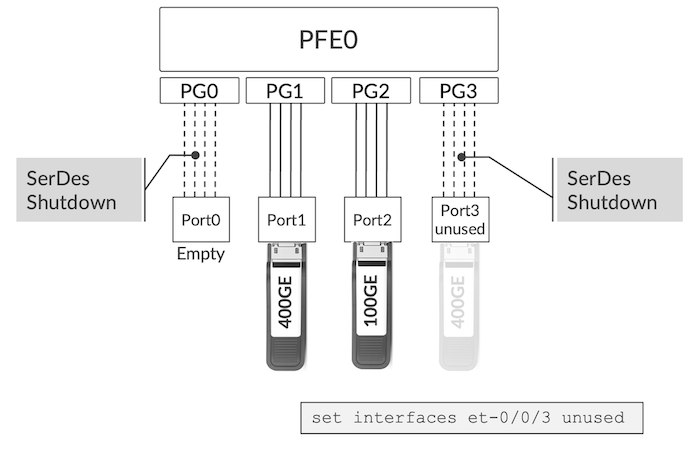

A port configured as "unused" doesn't disappear from inventory:

```
regress@rtme-ptx10> show chassis hardware            
Hardware inventory:
Item             Version  Part number  Serial number     Description
Chassis                                EMxxx             JNP10001-36MR [PTX10001-36MR]
PSM 0            REV 07   740-073765   1GE2939xxxx       AC AFO 3000W PSU
PSM 1            REV 07   740-073765   1GE2939xxxx       AC AFO 3000W PSU
Routing Engine 0 REV 08   750-100243   BCBHxxxx          RE-JNP10001-36MR
CB 0             REV 16   750-099260   BCBJxxxx          Control Board
FPC 0                     BUILTIN      BUILTIN           FPC-JNP10001-36MR
  PIC 0                   BUILTIN      BUILTIN           8X400GE-MR + 4X100GE-MR
    Xcvr 1       REV 01   740-061405   1ECQ115xxxx       QSFP-100GBASE-SR4-T2
    Xcvr 4       REV 01   740-058734   1ECQ120xxxx       QSFP-100GBASE-SR4
    Xcvr 5       REV 01   740-061405   1ECQ115xxxx       QSFP-100GBASE-SR4-T2
    Xcvr 6       REV 01   740-046565   QH26xxxx          QSFP+-40G-SR4
    Xcvr 8       REV 01   740-058734   1ECQ120xxxx       QSFP-100GBASE-SR4
  PIC 1                   BUILTIN      BUILTIN           8X400GE-MR + 4X100GE-MR
    Xcvr 2       XXXX     NON-JNPR     L2129Dxxxx        QSFP56-DD-400G-ZR
    Xcvr 4       REV 01   740-054053   2E1TP3A81xxxx     QSFP+-4X10G-SR
    Xcvr 6       REV 01   740-054053   2E1TP3A73xxxx     QSFP+-4X10G-SR
    Xcvr 8       REV 01   740-085349   1W2CZBA53xxxx     QSFP56-DD-400G-FR4
    Xcvr 10      REV 01   740-085351   1W1CZ7A51xxxx     QSFP56-DD-400GBASE-DR4
  PIC 2                   BUILTIN      BUILTIN           8X400GE-MR + 4X100GE-MR
    Xcvr 0       REV 01   740-046565   QE43xxxx          QSFP+-40G-SR4
    Xcvr 6       REV 01   740-061405   1ECQ152xxxx       QSFP-100GBASE-SR4-T2
SIB 0                     BUILTIN      BUILTIN           SIB-JNP10001-36MR
Fan Tray 0                                               JNP10001 Fan Tray, Front to Back Airflow - AFO
Fan Tray 1                                               JNP10001 Fan Tray, Front to Back Airflow - AFO
Fan Tray 2                                               JNP10001 Fan Tray, Front to Back Airflow - AFO
Fan Tray 3                                               JNP10001 Fan Tray, Front to Back Airflow - AFO
Fan Tray 4                                               JNP10001 Fan Tray, Front to Back Airflow - AFO
Fan Tray 5                                               JNP10001 Fan Tray, Front to Back Airflow - AFO

regress@rtme-ptx10> edit 
Entering configuration mode

[edit]
regress@rtme-ptx10# set interfaces et-0/2/0 unused 

[edit]
regress@rtme-ptx10# set interfaces et-0/2/6 unused    

[edit]
regress@rtme-ptx10# commit 
commit complete

[edit]
regress@rtme-ptx10# run show chassis hardware         
Hardware inventory:
Item             Version  Part number  Serial number     Description
Chassis                                EMxxx             JNP10001-36MR [PTX10001-36MR]
PSM 0            REV 07   740-073765   1GE2939xxxx       AC AFO 3000W PSU
PSM 1            REV 07   740-073765   1GE2939xxxx       AC AFO 3000W PSU
Routing Engine 0 REV 08   750-100243   BCBHxxxx          RE-JNP10001-36MR
CB 0             REV 16   750-099260   BCBJxxxx          Control Board
FPC 0                     BUILTIN      BUILTIN           FPC-JNP10001-36MR
  PIC 0                   BUILTIN      BUILTIN           8X400GE-MR + 4X100GE-MR
    Xcvr 1       REV 01   740-061405   1ECQ115xxxx       QSFP-100GBASE-SR4-T2
    Xcvr 4       REV 01   740-058734   1ECQ120xxxx       QSFP-100GBASE-SR4
    Xcvr 5       REV 01   740-061405   1ECQ115xxxx       QSFP-100GBASE-SR4-T2
    Xcvr 6       REV 01   740-046565   QH26xxxx          QSFP+-40G-SR4
    Xcvr 8       REV 01   740-058734   1ECQ120xxxx       QSFP-100GBASE-SR4
  PIC 1                   BUILTIN      BUILTIN           8X400GE-MR + 4X100GE-MR
    Xcvr 2       XXXX     NON-JNPR     L2129Dxxxx        QSFP56-DD-400G-ZR
    Xcvr 4       REV 01   740-054053   2E1TP3A81xxxx     QSFP+-4X10G-SR
    Xcvr 6       REV 01   740-054053   2E1TP3A73xxxx     QSFP+-4X10G-SR
    Xcvr 8       REV 01   740-085349   1W2CZBA53xxxx     QSFP56-DD-400G-FR4
    Xcvr 10      REV 01   740-085351   1W1CZ7A51xxxx     QSFP56-DD-400GBASE-DR4
  PIC 2                   BUILTIN      BUILTIN           8X400GE-MR + 4X100GE-MR
    Xcvr 0       REV 01   740-046565   QE43xxxx          QSFP+-40G-SR4
    Xcvr 6       REV 01   740-061405   1ECQ15xxxxx       QSFP-100GBASE-SR4-T2
SIB 0                     BUILTIN      BUILTIN           SIB-JNP10001-36MR
Fan Tray 0                                               JNP10001 Fan Tray, Front to Back Airflow - AFO
Fan Tray 1                                               JNP10001 Fan Tray, Front to Back Airflow - AFO
Fan Tray 2                                               JNP10001 Fan Tray, Front to Back Airflow - AFO
Fan Tray 3                                               JNP10001 Fan Tray, Front to Back Airflow - AFO
Fan Tray 4                                               JNP10001 Fan Tray, Front to Back Airflow - AFO
Fan Tray 5                                               JNP10001 Fan Tray, Front to Back Airflow - AFO

[edit]
regress@rtme-ptx10#
```

The optics inserted in et-0/2/0 and et-0/2/6 are still visible in the inventory.

This behavior is reversible with "delete interface et-x/y/z unused" and it just takes a few seconds to restore the port in its original state, without any impact on the other ports of the system.

Note that we published a short article on the "unused" config in Junos EVO systems here. It's an important configuration element to create channelized port with a break-out cable.

Depending on the platform or line card, certain ports are not directly connected to the forwarding ASIC but are linked to an intermediate circuitry. This device is often called "PHY" or more precisely as "Retimer", "GearBox" or "Reverse GearBox" (RGB) depending on its configuration and role.

The RGB's job includes (not exhaustively):

- The fan out of SerDes
- The SerDes speed conversion.

Example: from 53.125 Gbps to 25.78125 Gbps
- The encoding translation.

Example: from PAM4 to NRZ.
- The signal integrity
- Forward Error Correction (FEC) conversion

When a port is empty or configured "unused", the Optical-Cage-to-PHY SerDes will be shut down, but the PHY-to-PFE SerDes too as illustrated in Figure 8 below.

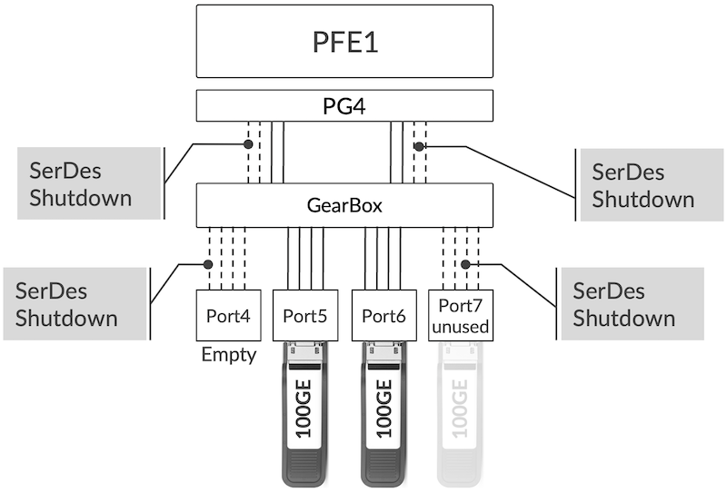

Today, this behavior is valid for PTX10001-36MR only. The PTX10000 line cards support the "unused" configuration but it will not shut down the SerDes automatically in releases available at the moment of this article publication (Junos 23.2).

### PHY

If all SerDes attached to a given PHY are down, the system will automatically reset this PHY and keep it in low-power mode. This behavior is also valid with ports configured "unused" as illustrated in the figure 9 below:

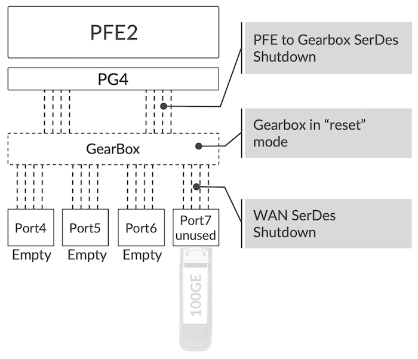

As soon as an optic module is inserted or the "unused" configuration is deleted, the PHY is automatically restarted.

This feature is supported only on PTX10001-36MR and currently not LC1202. It's not applicable for LC1201 since it doesn't use any RGB.

### PFE

Next element in the chain of operation: the Packet Forwarding Engine.

It's possible to shut down and restart smoothly the Express4 without impacting the other Forwarding ASICs in the system or on the line card. Ramdas described extensively the power saving achieved with this feature in the following TechPost article:
[https://juniper.github.io/techposts/saving-energy-on-ptx-with-pfe-power-off/article](https://juniper.github.io/techposts/saving-energy-on-ptx-with-pfe-power-off/article)

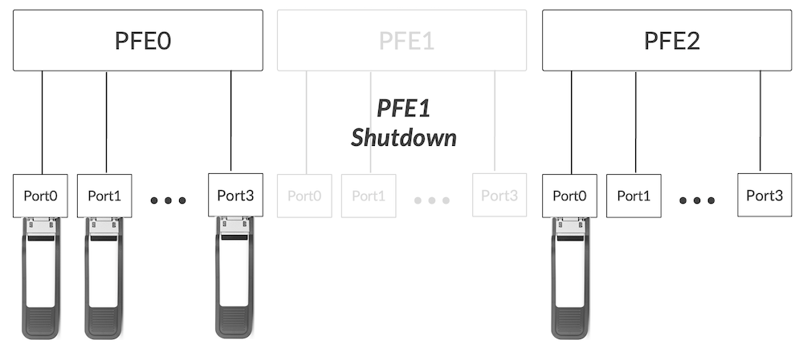

Two mechanisms are available to perform this soft shutdown of the PFE:

- a "request chassis" command
- a configuration with commit

```
regress@rtme-ptx10> show chassis hardware            
Hardware inventory:
Item             Version  Part number  Serial number     Description
Chassis                                EMxxx             JNP10001-36MR [PTX10001-36MR]
PSM 0            REV 07   740-073765   1GE2939xxxx       AC AFO 3000W PSU
PSM 1            REV 07   740-073765   1GE2939xxxx       AC AFO 3000W PSU
Routing Engine 0 REV 08   750-100243   BCBHxxxx          RE-JNP10001-36MR
CB 0             REV 16   750-099260   BCBJxxxx          Control Board
FPC 0                     BUILTIN      BUILTIN           FPC-JNP10001-36MR
  PIC 0                   BUILTIN      BUILTIN           8X400GE-MR + 4X100GE-MR
    Xcvr 1       REV 01   740-061405   1ECQ115xxxx       QSFP-100GBASE-SR4-T2
    Xcvr 4       REV 01   740-058734   1ECQ120xxxx       QSFP-100GBASE-SR4
    Xcvr 5       REV 01   740-061405   1ECQ115xxxx       QSFP-100GBASE-SR4-T2
    Xcvr 6       REV 01   740-046565   QH26xxxx          QSFP+-40G-SR4
    Xcvr 8       REV 01   740-058734   1ECQ120xxxx       QSFP-100GBASE-SR4
  PIC 1                   BUILTIN      BUILTIN           8X400GE-MR + 4X100GE-MR
    Xcvr 2       XXXX     NON-JNPR     L2129Dxxxx        QSFP56-DD-400G-ZR
    Xcvr 4       REV 01   740-054053   2E1TP3A81xxxx     QSFP+-4X10G-SR
    Xcvr 6       REV 01   740-054053   2E1TP3A73xxxx     QSFP+-4X10G-SR
    Xcvr 8       REV 01   740-085349   1W2CZBA53xxxx     QSFP56-DD-400G-FR4
    Xcvr 10      REV 01   740-085351   1W1CZ7A51xxxx     QSFP56-DD-400GBASE-DR4
  PIC 2                   BUILTIN      BUILTIN           8X400GE-MR + 4X100GE-MR
    Xcvr 0       REV 01   740-046565   QE43xxxx          QSFP+-40G-SR4
    Xcvr 6       REV 01   740-061405   1ECQ152xxxx       QSFP-100GBASE-SR4-T2
SIB 0                     BUILTIN      BUILTIN           SIB-JNP10001-36MR
Fan Tray 0                                               JNP10001 Fan Tray, Front to Back Airflow - AFO
Fan Tray 1                                               JNP10001 Fan Tray, Front to Back Airflow - AFO
Fan Tray 2                                               JNP10001 Fan Tray, Front to Back Airflow - AFO
Fan Tray 3                                               JNP10001 Fan Tray, Front to Back Airflow - AFO
Fan Tray 4                                               JNP10001 Fan Tray, Front to Back Airflow - AFO
Fan Tray 5                                               JNP10001 Fan Tray, Front to Back Airflow - AFO

regress@rtme-ptx10> request chassis fpc slot 0 pfe-instance 2 offline 
Fru Block offline initiated!

regress@rtme-ptx10> show chassis hardware                                
Hardware inventory:
Item             Version  Part number  Serial number     Description
Chassis                                EMxxx             JNP10001-36MR [PTX10001-36MR]
PSM 0            REV 07   740-073765   1GE2939xxxx       AC AFO 3000W PSU
PSM 1            REV 07   740-073765   1GE2939xxxx       AC AFO 3000W PSU
Routing Engine 0 REV 08   750-100243   BCBHxxxx          RE-JNP10001-36MR
CB 0             REV 16   750-099260   BCBJxxxx          Control Board
FPC 0                     BUILTIN      BUILTIN           FPC-JNP10001-36MR
  PIC 0                   BUILTIN      BUILTIN           8X400GE-MR + 4X100GE-MR
    Xcvr 1       REV 01   740-061405   1ECQ115xxxx       QSFP-100GBASE-SR4-T2
    Xcvr 4       REV 01   740-058734   1ECQ120xxxx       QSFP-100GBASE-SR4
    Xcvr 5       REV 01   740-061405   1ECQ115xxxx       QSFP-100GBASE-SR4-T2
    Xcvr 6       REV 01   740-046565   QH26xxxx          QSFP+-40G-SR4
    Xcvr 8       REV 01   740-058734   1ECQ120xxxx       QSFP-100GBASE-SR4
  PIC 1                   BUILTIN      BUILTIN           8X400GE-MR + 4X100GE-MR
    Xcvr 2       XXXX     NON-JNPR     L2129Dxxxx        QSFP56-DD-400G-ZR
    Xcvr 4       REV 01   740-054053   2E1TP3A81xxxx     QSFP+-4X10G-SR
    Xcvr 6       REV 01   740-054053   2E1TP3A73xxxx     QSFP+-4X10G-SR
    Xcvr 8       REV 01   740-085349   1W2CZBA53xxxx     QSFP56-DD-400G-FR4
    Xcvr 10      REV 01   740-085351   1W1CZ7A51xxxx     QSFP56-DD-400GBASE-DR4
  PIC 2                   BUILTIN      BUILTIN           8X400GE-MR + 4X100GE-MR
SIB 0                     BUILTIN      BUILTIN           SIB-JNP10001-36MR
Fan Tray 0                                               JNP10001 Fan Tray, Front to Back Airflow - AFO
Fan Tray 1                                               JNP10001 Fan Tray, Front to Back Airflow - AFO
Fan Tray 2                                               JNP10001 Fan Tray, Front to Back Airflow - AFO
Fan Tray 3                                               JNP10001 Fan Tray, Front to Back Airflow - AFO
Fan Tray 4                                               JNP10001 Fan Tray, Front to Back Airflow - AFO
Fan Tray 5                                               JNP10001 Fan Tray, Front to Back Airflow - AFO

regress@rtme-ptx10> 
```

> *Note that optics present in et-0/2/0 and et-0/2/6 are now out of the inventory when the PFE is powered off.*

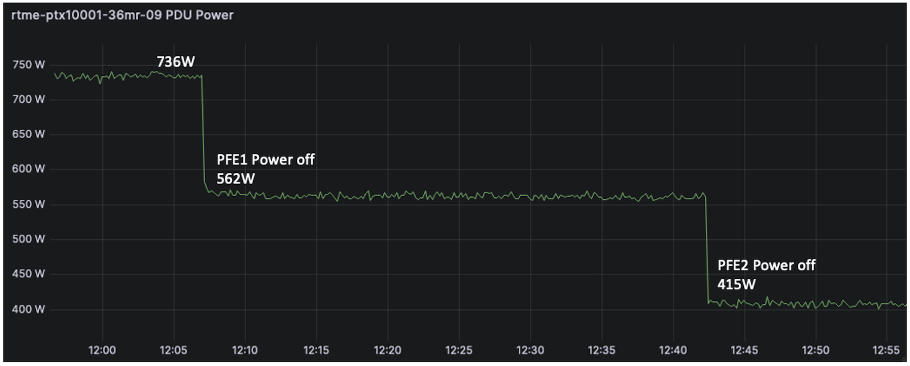

Automatic shutdown of unused PFE is currently under investigation and will be added to the roadmap.

### MACsec Block

The MACsec role is handled inside the Express4 chipset in PTX10000 routers. A dedicated block is assigned to this function and is automatically clock-gated if MACsec configuration is not applied to the ports.

```
set security macsec interfaces et-x/y/z
```

The activation of the MACsec block is decided per Port Group (each Express4 Forwarding ASIC has 8 PGs) and the absence of MACsec config will represent 20W of power saving.

This behavior is applicable for PTX10001-36MR, and LC1201/LC1202.

### Line Card

It's also possible to power off an entire FPC (Flexible PIC Concentrator) / Line Cards in a modular chassis with:

```
regress@rtme-ptx09-re0> request chassis fpc slot 4 offline
Offline initiated, use "show chassis fpc" to verify

{master}
regress@rtme-ptx09-re0> 
```

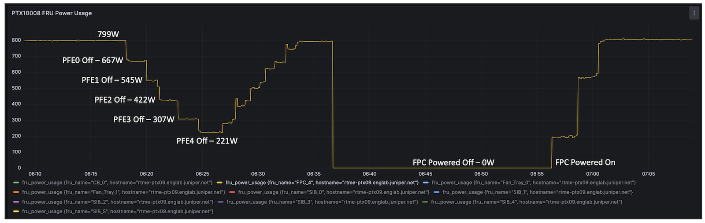

The figure 12 compares the power saving differences between a FPC where we power off all PFEs one by one (LC1201 is made of 5x PFEs) and the complete "offline" of the FPC in slot4.

It provides some interesting information: the power usage of an FPC where we deactivated all forwarding components is still around 220W, so it may be interesting to consider this option.

The time it takes to restore the service tilts the balance in favour of the PFE power off instead of the full FPC offline:

- less than a minute to restore the interfaces when you power on an PFE
- more than 5 minutes when you turn online an FPC

### Fabric SerDes

All PFEs are connected to one Fabric ASIC (in PTX10001-36MR) or a multitude of them (in PTX10000 chassis) in a full-mesh fashion: all PFEs are linked to all Fabric ASICs via fabric SerDes and can reach any destination in one hop.

When a chassis slot is not occupied by an FPC, the system automatically shuts down the related Fabric SerDes. But it goes further: if an FPC is present but one or several PFEs are shutdown: these Fabric SerDes are shutdown too to save power.

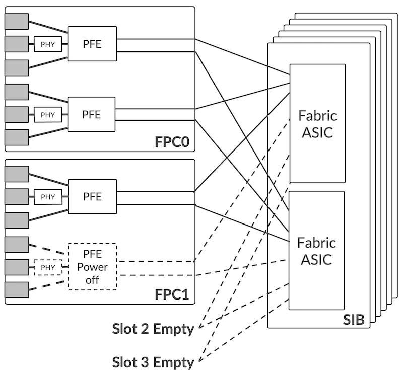

It was also clearly illustrated in Ramdas' article on PFE shutdown (link available in previous section). This feature is enabled by default in PTX10001-36MR and PTX10000 chassis.

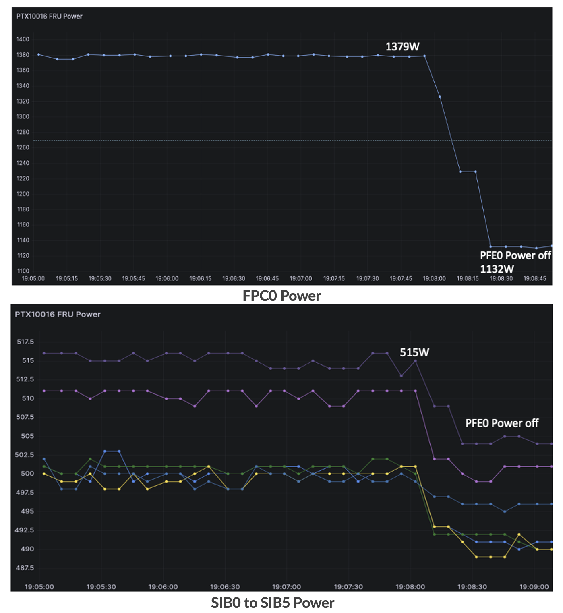

## Conclusion

At Juniper Networks, we understand that power optimization is a top priority for our customers, and we constantly develop and integrate new features to reduce the power consumption and carbon footprint of the PTX10k routers. These features will also be integrated in the next hardware generation (in development at the moment of this article publication, August 2023). And other innovations are also under preparation, we will publish follow up articles when they will be released.

## Useful links

- Ramdas' article: [https://juniper.github.io/techposts/saving-energy-on-ptx-with-pfe-power-off/article](https://juniper.github.io/techposts/saving-energy-on-ptx-with-pfe-power-off/article)
- Power calculator: [https://apps.juniper.net/power-calculator/?view=calculate&pdt=51610008&type=1](https://apps.juniper.net/power-calculator/?view=calculate&pdt=51610008&type=1) (login required)
- PTX10001-36MR Introduction: [https://juniper.github.io/techposts/ptx10001-36mr-introduction/article](https://juniper.github.io/techposts/ptx10001-36mr-introduction/article)

## Glossary

- AFI: AirFlow In
- AFO: AirFlow Out
- ASIC: Application Specific Integrated Circuit
- bps: bits per second
- CPU: Central Processing Unit
- DDR: Double Data Rate
- EM: Environmental Monitoring
- FEC: Forward Error Correction
- FPC: Flexible PIC Concentrator
- FPGA: Field Programmable Gate Array
- HBM: High Bandwidth Memory
- I2C: Inter-Integrated Circuit
- IFD: Physical Interface
- NRZ: Non-Return to Zero
- PCB: Printed Circuit Board
- PCIe: Peripheral Component Interconnect express
- PAM4: Pulse Amplitude Modulation 4-phases
- PFE: Packet Forwarding Engine
- PG: Port Group
- PM: Power Management
- PoE: Power over Ethernet
- PPS: Packets Per Second
- PSM: Power Supply Module
- PSU: Power Supply Unit
- QSFP: Quad Small Form-factor Pluggable
- QDD: QSFP Double Density
- RGB: Reverse Gear Box
- SFP: Small Form-factor Pluggable
- SerDes: Serializer/Deserialiazer
- SIB: Switch Interface Board
- WAN: Wide Area Network
- ZF: Fabric Engine ASIC

## Acknowledgements

Many people participated in the elaboration of this article, huge thanks to: Suneesh Babu, Dmitry Shokarev, Nithin Shivalingappa, Murthy B V, Raghavasandeep Maram, Nagaraj Suresh, Priya M, Kapil Jain, Eswaran Srinivasan and David Roy.
