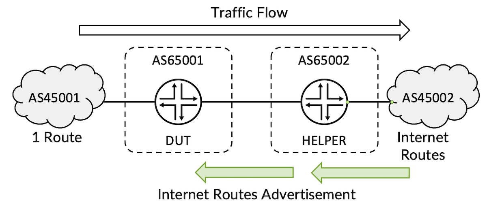
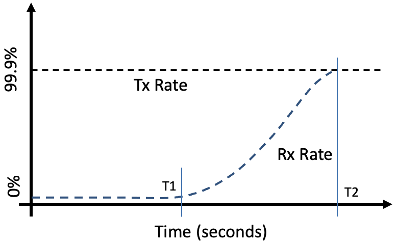
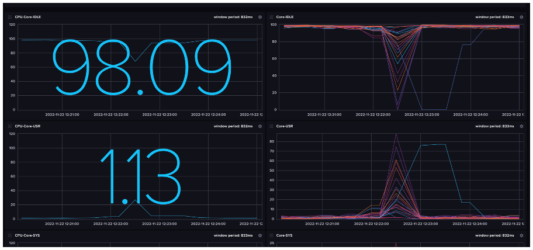
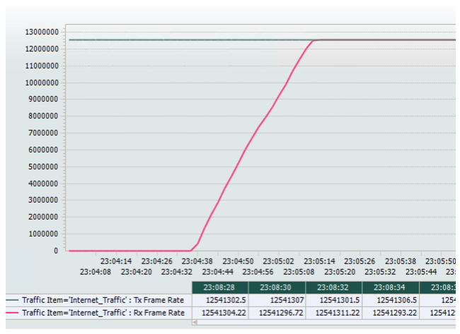
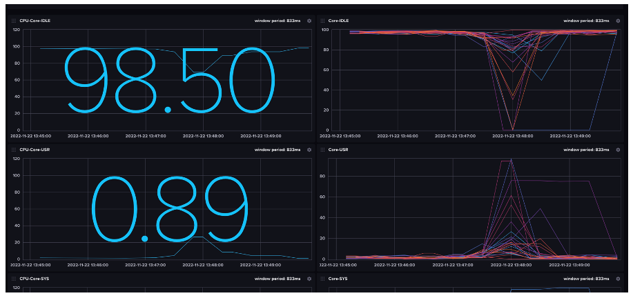
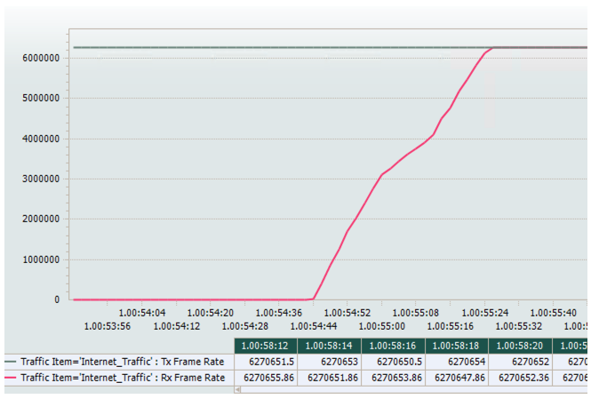

# PTX10001-36MR FIB Install Rate

**Suneesh Babu - 12/12/2022**

PTX10001-36MR installs the Internet routes at more than 27,000 routes per second, and we will show you how we are testing it.

## Introduction

PTX10001-36MR supports an internet route install rate of 25,600 routes per second for IPv4 Internet profile and 27,230 routes per second for IPv4 +IPv6 stack with 22.2R2 Junos-EVO Image.

It's a test we regularly perform in our labs.

## Test Methodology

The Topology consists of two routers connected back to back and each having a single traffic generator port. The traffic generator connected to DUT advertises a single route and the traffic generator connected to the helper DUT advertises the internet prefixes.



EBGP peering is enabled across the routers as well as across the router and traffic generator. The DUT learns a single route from the traffic generator and 930k IPv4 Internet prefixes from the helper DUT. Traffic is sent from the single route as the source and internet routes as the destination with 99.9% of offer load in iMIX mode.

The test starts with disabling the EBGP peering between the DUT and helper DUT, such that traffic drops and Tx is MAX rate and Rx is ZERO.


Once the interface between the routers is enabled, BGP peering will establish and Helper DUT advertise the internet prefixes to the DUT and Rx Rate increases as DUT installs the routes.



The total routes divided by T2-T1 gives the number of routes installed per second.

### PTX10001-36MR Test Configurations for IPv4 Internet Profile

```
regress@DUT> show configuration groups FIB_TEST
interfaces {
    lo0 {
        unit 0 {
            family inet {
                address 12.1.1.1/32;
            }
        }
    }
    et-0/0/11 {
        speed 100g;
        mtu 9018;
        unit 0 {
            family inet {
                address 15.1.1.1/24;
            }
        }
    }
    et-0/0/8 {
        speed 100g;
        mtu 9018;
        unit 0 {
            family inet {
                address 15.2.1.1/24;
            }
        }
    }
}
routing-options {
    router-id 12.1.1.1;
    autonomous-system 65001;
}
protocols {                             
    bgp {
        group FIB_Test {
            type external;
            family inet {
                unicast;
            }
            neighbor 15.1.1.2 {
                peer-as 45001;
            }
            neighbor 15.2.1.2 {
                peer-as 65002;
            }
        }
    }
    lldp {
        interface et-0/0/8;
    }
}


regress@DUT>
```

and Helper:

```
regress@Helper-DUT> show configuration groups FIB_TEST
interfaces {
    lo0 {
        unit 0 {
            family inet {
                address 12.1.1.2/32;
            }
        }
    }
    et-0/0/8 {
        speed 100g;
        mtu 9018;
        unit 0 {
            family inet {
                address 15.2.1.2/24;
            }
        }
    }
    et-0/0/9 {
        speed 100g;
        mtu 9018;
        unit 0 {
            family inet {
                address 15.3.1.1/24;
            }
        }
    }
}
routing-options {
    router-id 12.1.1.2;
    autonomous-system 65002;
}
protocols {                             
    bgp {
        group FIB_Test {
            type external;
            family inet {
                unicast;
            }
            neighbor 15.2.1.1 {
                peer-as 65001;
            }
            neighbor 15.3.1.2 {
                peer-as 45002;
            }
        }
    }
    lldp {
        interface et-0/0/8;
    }
}

regress@Helper-DUT>
```

The BGP Peering is in IDLE State after disabling the interface

```
regress@DUT> configure
Entering configuration mode

[edit]
regress@DUT# set interfaces et-0/0/8 disable 

[edit]
regress@DUT# commit and-quit 
commit complete
Exiting configuration mode

regress@DUT> show bgp summary
Threading mode: BGP I/O
Default eBGP mode: advertise - accept, receive - accept
Groups: 1 Peers: 2 Down peers: 1
Table          Tot Paths  Act Paths Suppressed    History Damp State    Pending
inet.0               
                       1          1          0          0          0          0
Peer                     AS      InPkt     OutPkt    OutQ   Flaps Last Up/Dwn State|#Active/Received/Accepted/Damped...
15.1.1.2              45001        328     446567  355972       1     2:42:09 Establ
  inet.0: 1/1/1/0
15.2.1.2              65002     130896         42       0       2          18 Idle

regress@DUT>
```

Once the interface is enabled, the BGP peering comes up and DUT starts learning the routes

```
[edit]
regress@DUT# delete interfaces et-0/0/8 disable

[edit]
regress@DUT# commit and-quit 
commit complete
Exiting configuration mode

regress@DUT> show lldp neighbors
Local Interface    Parent Interface    Chassis Id          Port info          System Name
et-0/0/8           -                   68:22:8e:24:e4:a6   et-0/0/8           Helper-DUT.englab.juniper.net

regress@DUT> show bgp summary 
Threading mode: BGP I/O
Default eBGP mode: advertise - accept, receive - accept
Groups: 1 Peers: 2 Down peers: 0
Table          Tot Paths  Act Paths Suppressed    History Damp State    Pending
inet.0               
                  930282     930282          0          0          0          0
Peer                     AS      InPkt     OutPkt    OutQ   Flaps Last Up/Dwn State|#Active/Received/Accepted/Damped...
15.1.1.2              45001        320     445989       0       1     2:38:17 Establ
  inet.0: 1/1/1/0
15.2.1.2              65002     130888         34       0       1       14:36 Establ
  inet.0: 930281/930281/930281/0

regress@DUT>
```

The 24 Core CPU of PTX10001-36MR during IPv4 Internet Route learning is as follows:



As the routes started learnt in the DUT, traffic starts flowing and once entire routes are installed Rx and Tx Rate matches as follows:


The T1 and T2 time are measured as follows:



The test is repeated for three iterations and the measurements are as follows:

Number of IPv4 Routes: 930,281

| Iteration | T1 | T2 | T2-T1 (sec) | Nb of routes / (T2-T1) in RPS |
|:--|:--|:--|:--|:--|
| 1 | 23:04:36 | 23:05:13 | 37 | 25,142 |
| 2 | 23:45:10 | 23:45:46 | 36 | 25,841 |
| 3 | 23:57:48 | 23:58:24 | 36 | 25,841 |
| Average |  |  |  | 25,608 |

## IPv4 + IPv6 Internet Dual Stack Profile

### PTX10001-36MR Test Configurations for IPv4 and IPv6 Internet Profile

```
regress@DUT> show configuration groups FIB_TEST
interfaces {
    lo0 {
        unit 0 {
            family inet {
                address 12.1.1.1/32;
            }
        }
    }
    et-0/0/11 {
        speed 100g;
        mtu 9018;
        unit 0 {
            family inet {
                address 15.1.1.1/24;
            }
            family inet6 {
                address 2002:15:1:1::1/64;
            }
        }
    }
    et-0/0/8 {
        speed 100g;
        mtu 9018;
        unit 0 {
            family inet {
                address 15.2.1.1/24;
            }
            family inet6 {
                address 2002:15:2:1::1/64;
            }
        }
    }
}
routing-options {
    router-id 12.1.1.1;
    autonomous-system 65001;
}
protocols {
    bgp {
        group FIB_Test {
            type external;
            family inet {
                unicast;
            }
            neighbor 15.1.1.2 {
                peer-as 45001;
            }
            neighbor 15.2.1.2 {
                peer-as 65002;
            }
        }
        group FIBv6_Test {
            type external;
            family inet6 {
                unicast;
            }
            neighbor 2002:15:1:1::2 {
                peer-as 45001;
            }
            neighbor 2002:15:2:1::2 {
                peer-as 65002;
            }
        }
    }
    lldp {
        interface et-0/0/8;
    }
}

regress@DUT>
```

And the Helper router:

```
regress@Helper-DUT> show configuration groups FIB_TEST
interfaces {
    lo0 {
        unit 0 {
            family inet {
                address 12.1.1.2/32;
            }
        }
    }
    et-0/0/8 {
        speed 100g;
        mtu 9018;
        unit 0 {
            family inet {
                address 15.2.1.2/24;
            }
            family inet6 {
                address 2002:15:2:1::2/64;
            }
        }
    }
    et-0/0/9 {
        speed 100g;
        mtu 9018;
        unit 0 {
            family inet {
                address 15.3.1.1/24;
            }
            family inet6 {
                address 2002:15:3:1::1/64;
            }
        }
    }                                   
}
routing-options {
    router-id 12.1.1.2;
    autonomous-system 65002;
}
protocols {
    bgp {
        group FIB_Test {
            type external;
            family inet {
                unicast;
            }
            neighbor 15.2.1.1 {
                peer-as 65001;
            }
            neighbor 15.3.1.2 {
                peer-as 45002;
            }
        }
        group FIBv6_Test {
            type external;
            family inet6 {
                unicast;
            }
            neighbor 2002:15:2:1::1 {
                peer-as 65001;
            }
            neighbor 2002:15:3:1::2 {
                peer-as 45002;
            }
        }                               
    }
    lldp {
        interface et-0/0/8;
    }
}

regress@Helper-DUT>
```

The BGP summary info with both IPv4 and IPv6 families are as follows:

```
regress@DUT> show bgp summary
Threading mode: BGP I/O
Default eBGP mode: advertise - accept, receive - accept
Groups: 2 Peers: 4 Down peers: 0
Table          Tot Paths  Act Paths Suppressed    History Damp State    Pending
inet.0               
                  930282     930282          0          0          0          0
inet6.0      
                  147942     147942          0          0          0          0
Peer                     AS      InPkt     OutPkt    OutQ   Flaps Last Up/Dwn State|#Active/Received/Accepted/Damped...
15.1.1.2              45001         52     446040       0       3       24:16 Establ
  inet.0: 1/1/1/0
15.2.1.2              65002     130870         17       0       4        6:29 Establ
  inet.0: 930281/930281/930281/0
2002:15:1:1::2        45001         52      83724       0       1       24:12 Establ
  inet6.0: 1/1/1/0
2002:15:2:1::2        65002      35888         15       0       1        6:18 Establ
  inet6.0: 147941/147941/147941/0

regress@DUT>
```

The 24 Core CPU of PTX10001-36MR during route-learning is as follows:



The FIB Install Rate with traffic flow is measured as follows:



Total Number of Routes: 930,281 (IPv4) + 147,941 (IPv6) = 1,078,222

| Iteration | T1 | T2 | T2-T1 (sec) | Nb of routes / (T2-T1) in RPS |
|:--|:--|:--|:--|:--|
| 1 | 1:54:44 | 1:55:26 | 42 | 25,671 |
| 2 | 1:10:38 | 1:11:16 | 38 | 28,374 |
| 3 | 1:22:58 | 1:23:37 | 39 | 27,646 |
| Average |  |  |  | 27,230 |

## Conclusion

PTX10001-36MR running on 22.2R2 JUNOS-EVO image supports a route-learning rate of ~25,600 routes per second for IPv4 Internet profile and 27,230 routes per second for dual-stack. We run this test for each release to guarantee performance consistency.

## Glossary

- BGP -- Border Gateway Protocol
- DUT -- Device Under Test
- IPv4 -- Internet Protocol Version 4
- IPv6 -- Internet Protocol Version 6

## Acknowledgement

Many thanks to Ramdas Machat and Nicolas Fevrier for reviewing the article and providing the feedback
