# PTX10001-36MR Introduction

**Dmitry Shokarev - 10/18/2022**

Product manager's description of the PTX10001-36MR router. Product characteristics, port types and supported port combinations, architecture and the applications of the router are all outlined in the article.

## Overview

PTX10001-36MR is a compact 9.6T system designed for multiple applications: peering, core, content delivery network router, data center spine switch and a data center gateway.

In other words, it is designed for applications that require deep buffering and burst absorption, high route scale, visibility into traffic flows, and filtering capabilities, plus various L2 and L3 services and transport options, such as MPLS, and popular overlays -- GRE, VXLAN, IP in IP.

The system is 1RU high, and it has 36 Multi Rate ports -- all reflected in its name. 24 ports operate at rates up to 400GE and 12 ports operate at rates up to 100GE, Figure 1.

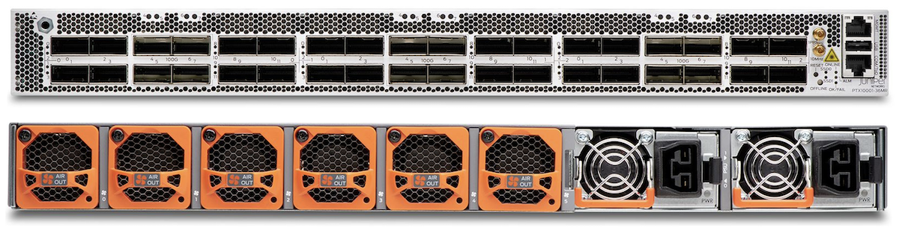

The platform is based on the Juniper Express 4 ASIC, the first product in the industry that offers integrated MACSec support at 400GE. The ASICs support complex forwarding behaviors and high scale.

The system is equipped with a powerful multi-core CPU, which is leveraged by the multi-threaded JUNOS BGP routing stack, and other applications, including sampling and flow reporting.

This document describes the capabilities of the platform, its hardware architecture, and key features.

## Main Forwarding Components

Juniper Express 4 ASIC is the foundational building block of the PTX10001-36MR router.

Juniper Express silicon line started in 2011 with an idea to revolutionize the economics of packet transport networks by optimizing the forwarding path for density and interface speeds. In the beginning, Express silicon was targeting core routing feature set and relatively low scale, enough to support MPLS Label Switch Router functions. Express silicon line has been evolving and increasing its supported scale over four generations, and its functionality expanded to support peering, edge, and data center deployments.

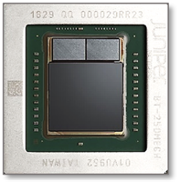

Express 4 is optimized for the 400GE connectivity with all WAN ports MACSec at full 400G rate, see Table 1.

| Metric | Value |
|:--|:--|
| Technology Node | 14 nm |
| Internal Codename | BT |
| WAN (Front Panel) Links | 72 x 56G |
| Fabric (Internal) Links | 72 x 56G |
| Off-Chip Memory | 8GB HBM2 |
| Number of 100GE, 4 x 28G lanes | 36 |
| Number of 400GE, 8 x 56G lanes | 9 |
| Total Input / Output Capacity | 7.2T |
| Total WAN Capacity | 3.6T |
| MACsec | Up to 400GE |
| Counters | 8M |
| IPv4 FIB | Up to 4M |
| IPv6 FIB | Up to 1.8M prefixes shorter than /88Up to 900K prefixes in a range from /89 to /128 prefixes |

Distinctive features of Express 4 Silicon are:

- Large counter space, up to 8 million counters. In the unique Juniper design counters are kept in the external memory, the same memory is used for the packet buffering. Label switched path counters, filter counters, logical interface counters are kept in this counter database.
- Up to 4M IPv4 routes, with compression.

Express 4 ASIC has 2 datapaths, sized to support 2Tbps and 1.6Tbps of the WAN capacity each, see Both datapaths have 36 fabric-facing interfaces.

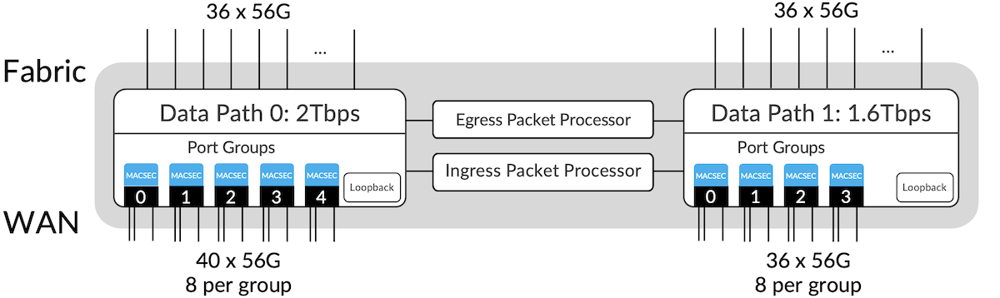

The actual aggregate input and output capacity of the device is 2 times more than its WAN capacity. In other words, Express 4 input/output capacity is 7.2T.

MACSec support is embedded into the chip. Datapaths share ASIC's packet processing pipeline between them.

Fabric interconnect between multiple datapaths is facilitated by a fabric ASIC, internally called ZF. This ASIC is a purposely-build cell-based crossbar switch. It is optimized to switch small fixed-size cells, with minimal processing logic and shallow buffering.

The properties of ZF are:

- 192 x 192 interfaces, each supporting 56Gbps rate
- 9.6T of aggregate throughput
- 16nm technology node

The architecture of the PTX10001-36MR router is described in the next section.

## Platform Architecture

### Forwarding Plane

Figure 4 shows the forwarding plane configuration, which is comprised of three Express 4 ASICs and one ZF switch fabric ASIC.

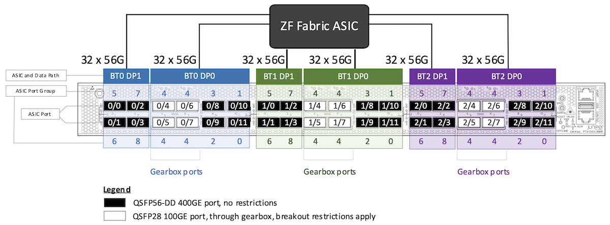

Router ports are logically mapped to three "Physical Interface" cards or PICs, each one represents individual ASIC. All ports are mapped to one single "Flexible Port Concentrator", or FPC.

Figure 5 shows the PTX10001-36MR interface naming format.

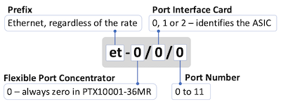

Aggregate non-blocking capacity of the PTX10001-36MR is 9.6T, this is a fabric bandwidth limit, but WAN interface capacity is 10.8Tbps. Ports 4 to 11, mapped to data path 0 of each BT, may be moderately oversubscribed. The worst-case oversubscription ratio of this data path is 1.6Tbps on a fabric side to 2Tbps on a WAN side, when all ports operate at the highest rate.

Oversubscription is managed intelligently:

- Packets arriving from the WAN are fully processed by the ingress packet processor (nominal packet rate of 1936 Mpps), this includes classification, filtering, and lookup.
- All packets are sent to the fabric, and the rate may potentially exceed available 1.6T fabric capacity. In case of the fabric interface congestion, packets are dropped according to the configured egress port transmission control profile, honoring queue priorities and transmit weights. The drops are registered as regular tail drops and are visible in the show commands, SNMP queue statistics or through streaming telemetry.

While most of the ports are 400GE capable, ports 4 through 7 in the middle of each PIC are connected through a gearbox, a specialized integrated circuit that multiplexes many lower-rate interfaces into a smaller set of higher-speed interfaces. On a WAN side, gearbox supports rates up to 100GE, it also has few configuration restrictions when used in breakout mode.

Figure 6 shows supported port combinations, using PIC 0 as an example, same logic applies to other PICs, each can be configured independently.

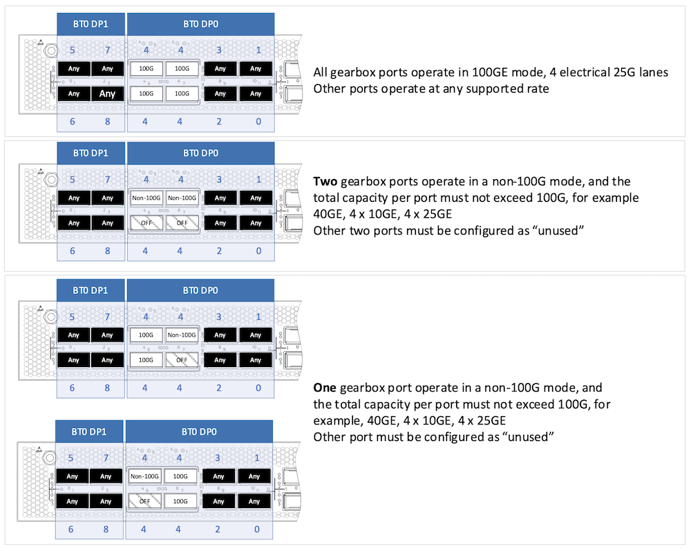

The gearbox supported port combinations depends on physical lanes count, plus physical lanes and coding combinations defined by IEEEl. For example, gearbox maps 2x 50G electrical lanes on the ASIC side (100GAUI-2), to 4x 25G (CAUI-4), on the WAN side, thus reducing the number of lanes towards the ASIC by half. But 4x 10GE, 4x 25GE are mapped exactly one to one, as there is no other Attachment Unit Interface option, and hence only 8x 10GE, or 8x 25GE ports can be supported per 400G ASIC port group as each ASIC port group has exactly eight 50G links. Even 40GE is counted as 4x 10G, and the number of 40GE ports is limited to two per group of four ports.

As of time of writing this article, JUNOS 22.2 software imposes additional constraints to the supported gearbox port combinations, see Table 2. These will be lifted in the future.

| Port | Combination 1 | Combination 2 | Combination 3 | Combination 4 |
|:--|:--|:--|:--|:--|
| 4 | 4x25G | 10G/4x10G | 40G | 4x25G |
| 5 | Unused | Unused | Unused | Unused |
| 6 | 10G/4x10G | 4x25G | 4x25G | 40G |
| 7 | Unused | Unused | Unused | Unused |

Note! the concept of "unused" ports was introduced together with the concept of configuring all the interface properties and channelization under interface stanza. The ports must be configured as unused explicitly, to eliminate any ambiguity in the user intent. The software translates this user intent into the hardware configuration. If configuration cannot be provisioned due to a certain restriction, then interface configuration remains intact and software logs message and raises an alarm.

As a quick on-box reference, the following CLI command shows transceivers plugged into the port, plus the port speed capabilities:

```
show chassis pic fpc-slot 0 pic-slot <0..2>
```

An example output is below.

```
user@router> show chassis pic fpc-slot 0 pic-slot 0
FPC slot 0, PIC slot 0 information:
  Type                             8X400GE-MR + 4X100GE-MR
  State                            Online
  PIC version               255.09
  Uptime                         22 days, 9 hours, 29 minutes, 18 seconds


PIC port information:
                         Fiber                    Xcvr vendor       Wave-                     Xcvr          JNPR     MSA
  Port Cable type        type  Xcvr vendor        part number       length                    Firmware      Rev      Version
  0    400G-FR4          SM    JUNIPER-1W2        740-085349        1301 nm                   1.0           REV 01
  1    400G-FR4          SM    JUNIPER-1W2        740-085349        1301 nm                   1.0           REV 01


Port speed information:

  Port  PFE      Capable Port Speeds
  0      0       1x10G 4x10G 1x40G 4x25G 1x100G 2x50G 8x25G 8x50G 2x100G 1x200G 3x100G 4x100G 2x200G 1x400G
  1      0       1x10G 4x10G 1x40G 4x25G 1x100G 2x50G 8x25G 8x50G 2x100G 1x200G 3x100G 4x100G 2x200G 1x400G 
  2      0       1x10G 4x10G 1x40G 4x25G 1x100G 2x50G 8x25G 8x50G 2x100G 1x200G 3x100G 4x100G 2x200G 1x400G
  3      0       1x10G 4x10G 1x40G 4x25G 1x100G 2x50G 8x25G 8x50G 2x100G 1x200G 3x100G 4x100G 2x200G 1x400G
  4      0       1x10G 4x10G 1x40G 4x25G 1x100G
  5      0       1x10G 1x100G 
  6      0       1x10G 4x10G 1x40G 4x25G 1x100G
  7      0       1x10G 1x100G 
  8      0       1x10G 4x10G 1x40G 4x25G 1x100G 2x50G 8x25G 8x50G 2x100G 1x200G 3x100G 4x100G 2x200G 1x400G
  9      0       1x10G 4x10G 1x40G 4x25G 1x100G 2x50G 8x25G 8x50G 2x100G 1x200G 3x100G 4x100G 2x200G 1x400G
  10     0       1x10G 4x10G 1x40G 4x25G 1x100G 2x50G 8x25G 8x50G 2x100G 1x200G 3x100G 4x100G 2x200G 1x400G
  11     0       1x10G 4x10G 1x40G 4x25G 1x100G 2x50G 8x25G 8x50G 2x100G 1x200G 3x100G 4x100G 2x200G 1x400G
```

Starting from 22.3R1 release the system supports operation with ASICs powered down. This is to conserve power in scenarios where full system capacity is not required. It is possible to disable all three of them and only use management interfaces, for example, in route reflector deployments.

ASICs may be powered down through configuration:

```
set chassis fpc 0 pfe <0..2> power off
```

Alternatively, ASIC shutdown may also be initiated from the CLI via request command:

```
request chassis fpc slot 0 pfe-instance 0 offline
```

Individual ASICs may also be shut down by the platform software if hardware malfunction is detected, the list of conditions can be seen by running the command below:

```
show system errors fru detail fpc 0 
```

### Control Plane

PTX10001-36MR is designed for demanding routing applications and it is equipped with a powerful 12-core Intel CPU to support faster convergence and BGP policy processing. Table 3 lists hardware specifications of the control plane components.

| Component | Value |
|:--|:--|
| CPU | Intel Xeon Skylake-D 2.1Ghz, 12-core |
| DRAM | 64GB |
| Storage | 2x 200GB SSD |

Various Juniper software components leverage multi-core CPU capabilities and impressive scale and performance is demonstrated:

- Routing Process Daemon supports multithreading capabilities to process routing updates and routing resolution. For example, the system learns BGP routes at the rate of 129K routes per second, and updates the FIB at the rate of 23K routes per second.
- Sampling. The system supports processing of 150 000 sampled packets per second.

Storage subsystem is comprised of solid-state drives (SSDs), two are provided for redundancy, plus for reliable management of the software upgrades and rollbacks. These drives are not field-replaceable, but they can be removed from the system before shipping devices back to Juniper for service. This is to support customer's security policies where non-volatile storage may not leave customer premises. Removal of drives requires a non-standard service agreement. As an alternative to the physical removal, both SSDs support Secure Erase functionality.

PTX10001-36MR control plane is designed to host 3rd party applications -- there is enough storage and DRAM capacity, and CPU power. Some of these applications may include custom Service Assurance Agents or statistics collection agents developed by Juniper partners and customers.

Even full Telegraf, InfluxDB, Grafana stack can run on the router itself for data collection and visualization, check out the [blog post](https://juniper.github.io/techposts/telemetry-collector-and-dataviz-on-junos-evo/article).

### Timing

PTX10001-36MR is designed to support Synchronous Ethernet, IEEE 1588v2 boundary clock and transparent clock. The device has 1pps, 10Mhz timing input interfaces and a Time of Day port, which is combined with the console (the device ships with the breakout cable). Figure 7 shows timing inputs.

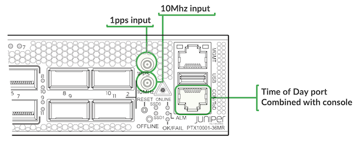

As of the time of writing this article, these ports are not enabled in software, but other functionality is available:

- Synchronous Ethernet
- G.8275.1 Telecom Profile
- IEEE 1588v2 Transparent clock (IPv6 encapsulation only)

### Power

PTX10001-36MR has two redundant power supplies operating in 1+1 mode. There are two types of power supplies:

- AC, or High Voltage DC power supply
- DC Power supplies.

Exact specifications are listed in the [hardware guide](https://www.juniper.net/documentation/us/en/hardware/ptx10001/topics/topic-map/ptx10001-36mr-power-system.html).

The system is designed to operate with power supplies of the same type, and mixing is not supported.

PTX10001-36MR power supplies support 3KW output, but this represents power supply capability only -- the maximum system power draw is 2164W and in realistic deployments with regular LR optics it rarely exceeds 1600W.

In general, power consumption is a complex function of:

- Ambient temperature. With higher ambient temperatures, ASIC leakage power increases, plus fans rotate faster to adequately cool the system.
- Elevation. Cooling efficiency reduces at higher elevations -- air density is lower and heat transfer efficiency reduces. GR-63-CORE publication by Telcordia suggests that every 1000ft / 304.8M of elevation gain is roughly equivalent to the ambient temperature increase by 1C. This compensation formula is used by Juniper.
- Optics. Optics power consumption of the PTX10001-36MR device varies from 1.5W per SFP+ (SFP+ can be used with an adapter) to 18-22W per 400GE ZR QSFP56-DD interface.
- Features enabled. Certain features, such as MACSec encryption, increase power consumption.
- Port speed configuration. Power consumption varies based on the port speed/interface rate.
- Power supply efficiency. Power supply efficiency depends on the load. Normally power supply efficiency increases with higher load.
- Activity. Power consumption of the chip depends on the packet rate, and interface utilization. External memory utilization is an important and visible contributor to overall power consumption.

At the time of the article's publication, Juniper System Engineers can estimate power consumption for the given configuration using internal tools.[ New versions of the Juniper power calculator](https://apps.juniper.net/power-calculator/) will provide support for granular estimates in the future for customers and partners directly.

The table below illustrates typical power consumption of the system in the following conditions:

- 20C ambient temperature
- 1828.8 meters (6000 feet) elevation (equivalent to 26C ambient at sea level)
- 24 x 400GE ports enabled and other ports are not in use
- The traffic rate is 4.8T in and 4.8T out (50% of the device capacity).
- No egress port congestion
- MACSec is not in use

| Component | Description | Quantity | Typical Power |
|:--|:--|:--|:--|
| CPU | Main CPU | 1 | 1204 |
| Express 4 ASIC at 3.2T | 3.2T from each ASIC, 9.6T per device total | 3 |  |
| Gearbox and gearbox ports | Ports are disabled | 0 |  |
| ZF ASIC |  | 1 |  |
| Fan Modules | Operates at 61% rate | 6 |  |
| Power Supplies | Conversion efficiency loss is included | 2 |  |
| Optics | 400G-LR4 | 24 | 12 |
| Optics DC-DC Conversion Efficiency Loss | 94% efficiency at the board level90% at the power supply level | 24 | 2.18 |
| Total |  |  | 1544W |

### Cooling

PTX10001-36MR cooling subsystem consists of 6 fan modules, that cool all the system components, besides power supplies -- each power supply has its own integrated fan.
Each fan module has two independent counter-rotating fans inside. The system is designed to operate with a single individual fan failure. If that failure occurs, the system may continue to operate, but it is advised to replace the failed fan module, because second failure may result in overheating condition and chassis automatic shutdown. Fan modules can be replaced in service.

More details can be found in the [hardware guide](https://www.juniper.net/documentation/us/en/hardware/ptx10001/topics/topic-map/ptx10001-36mr-cooling-system.html).

## PTX10001-36MR Applications

PTX10001-36MR is designed to support multiple applications: peering, data center edge, CDN gateway deployments, aggregation. But besides that, PTX10001-36MR can also be used in the core.

### Core Router

Is 9.6T system a core router?! The answer is, yes!

First, the device can be used at peripheral sites, and two of them may be just enough to aggregate traffic from several edge routers located at the same site, Figure 8.

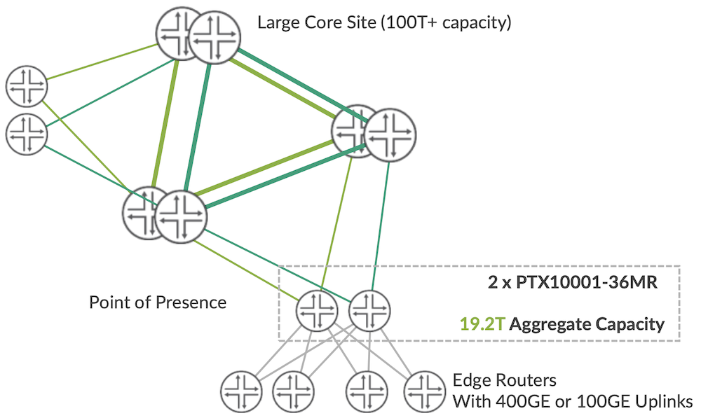

In this dual-plane design, two PTXs support 19.2T aggregate capacity. With more planes, the capacity increases linearly.

Besides these traditional router deployments, PTX10001-36MR supports evolving fabric-based LSR designs. In these designs, the capacity is truly limitless. Figure 9 shows potential 1228.8Tbps fabric configuration (256x PTX10001-36MR routers each offering 4.8Tbps of the WAN capacity).

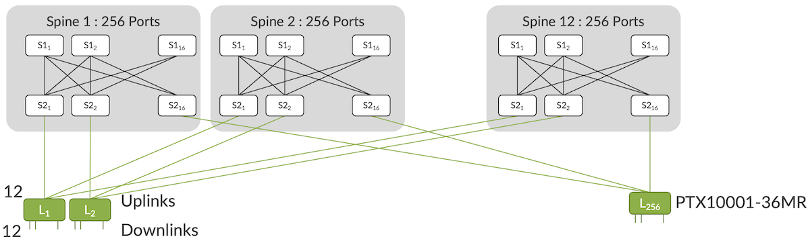

JUNOS supports features that makes those evolving designs possible:

- Fabric Topology isolation using unicast tunnels with IP/MPLS running on top (Flexible Tunnel Interfaces, or fti-)
- Simplification of the IGP topology using [Flood Reflectors](https://www.juniper.net/documentation/en_US/junos/topics/concept/understanding-isis-flood-reflectors.html) (supported for IS-IS).

There are a few features that make PTXs a very appealing LSR router:

- Full traffic visibility with sampling
- Filtering, selective sampling and port mirroring of the MPLS traffic based on the IP payloads.

But the full PTX potential is unleashed in the peering, edge and aggregation applications.

### Peering

As of the time of writing this article in late 2022, the most popular peering interface is 100GE, 100GE LR4 to be precise. Private peering is migrating to 400GE, and public peering is migrating to 400GE, with major Internet Exchange points starting to offer 400GE connectivity.

PTX10001-36MR supports 100GE LR4 using regular QSFP28 interfaces, double-density 100GE LR4 interfaces, plus 400GE.

Overall, this system supports interesting interface mixes, for example the one shown at Figure 10.

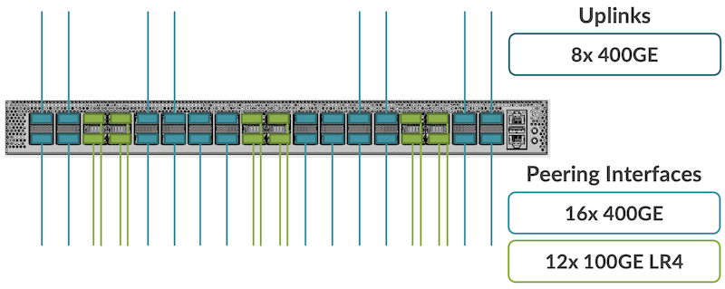

Juniper is offering flexible subscription and pay-as-you-grow software licensing options where only a fraction of the total 9.6Tbps capacity is required, starting from 2.4Tbps.

It is possible to deploy only 100GE peer-facing interfaces in the beginning and gradually migrate to 400GE as demand increases.

In terms of the software functionality, PTX10001-36MR software supports all advanced peering router constructs:

Visibility into traffic flows

- IPFIX monitoring at high sampling rate (as high as 150,000 sampled packets per second)
- Infinite number of counters -- per interface, filter matches, per traffic class or source/destination group

Security

- Variety of the filter match conditions: TTL, packet length, TCP flags, IPv6 and IPv4 addresses, protocols and many more. No router reboot is required to provision any of these matches. The system is always ready to withstand unknown attacks.
- Very high filter scale and no scale impact if multiple match conditions (prefixes, port ranges) are in use.
- Multiple lookups, forwarding through more than just one forwarding table for advanced anti-DDoS protection services or to implement custom forwarding behaviors for a group of users.
- Integration with the Corero Threat Defense Detector system and other threat detection and mitigation systems.
- Traffic accounting and traffic marking per group of destination prefixes or source prefixes (also known as Source Class Usage / Destination Class Usage)
- FlowSpec support with up to 8,000 terms (and more), with interface-exclude option

Peering routers tend to stay in the network for a long time. In 2018, we discovered a Juniper M20 router still operating at one of the biggest Internet exchanges, it was in operation for more than 16 years!

That longevity is achieved on PTX10001-36MR through:

- Very high-performance BGP routing stack with symmetric multiprocessing support -- enough to support more BGP peers, more routes, more policies.
- 4M IPv4 routes in the FIB or 1.8M IPv6 routes in the FIB (with compression, check this article for details).

It is not uncommon to occasionally provision services to enterprise customers on a peering router.

PTX10001-36MR has these capabilities too:

- Supports up to 4K L3 VPNs
- [Supports up to 32K L2 Circuits](https://juniper.github.io/techposts/ptx10001-36mr-l2-circuit-scale/article)
- Supports up to 3.3K EVPN instances

L2 and L3 services can be provisioned on the same physical interface with VLAN stacking/tagging and VLAN manipulation options for L2 traffic. L2 transparency is also fully supported, so LACP / LFM frames may traverse the network in full compliance with MEF standards.

Many of these functions are also important in data center edge deployments, covered in the next section.

### Data Center Edge and Data Center Interconnect

PTX software leverages the data center application stack developed for the Juniper QFX10K systems.

In the data center deployments, PTX10001-36MR normally interfaces the fabric spine layer directly and the rest of the interfaces are used to interface the WAN / external consumers, see Figure 11.

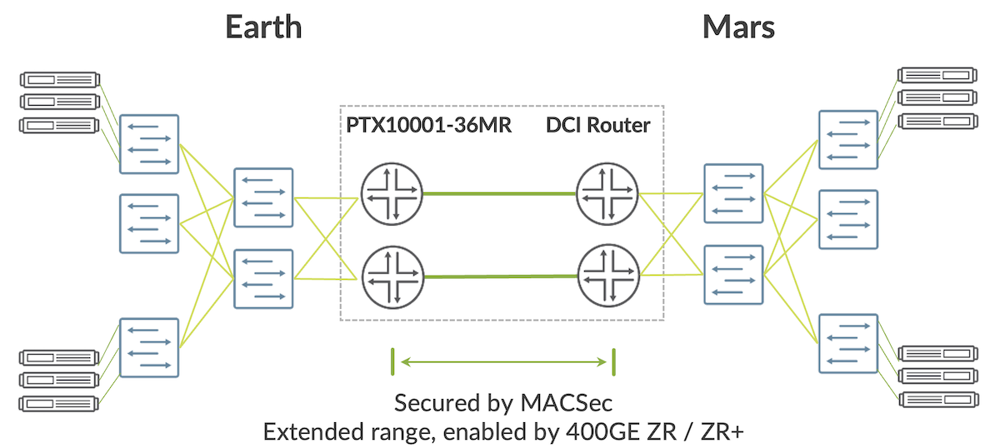

In the case of the data center interconnect, traffic encryption and IP optical integration become critical -- both features are supported by PTX10001-36MR.

And it is also not uncommon to deploy PTX10001-36MR as a gateway or an edge device of a data center to interface the external peers or other consumers.

In these deployments, all the functionality of the regular peering router is important. But in addition to that, the router shall support a variety of data center overlay encapsulations.

PTX10001-36MR supports:

- EVPN-VXLAN. Both Type 2 and Type 5 routes.
- MPLS over UDP
- IP in IP
- IP in UDP (or Generic UDP Encapsulation, GUE)

PTX is a deep buffer device, and normally it is not used for server attachment. However, there are always exceptions to that rule, and one of them is the CDN gateway router deployment, covered in the next section.

### CDN Gateway Router

CDN networks are built to provide a certain quality of experience guarantees to their users. It is not uncommon to deploy deep buffer systems all the way from the server to the CDN network peering router -- this is to eliminate potential drops caused by bursts and momentary congestion.

CDN networks are typically built as isolated islands connected over the Internet and also providing service to Internet users, a diagram of such an island is shown in Figure 12.

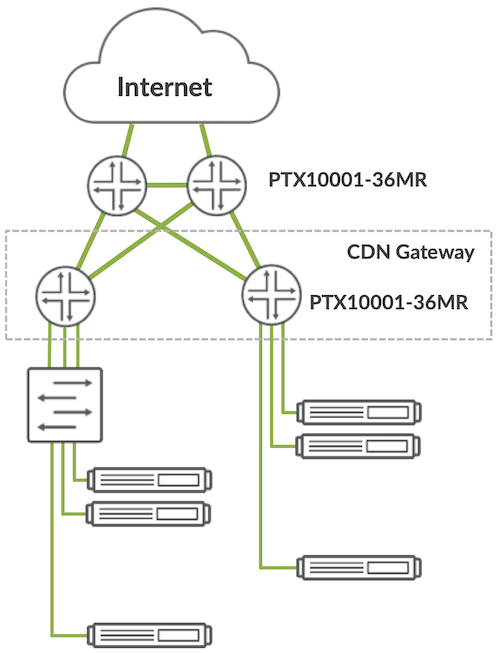

Typical functionality required in these deployments is a subset of the peering router feature set, with very few distinct requirements:

- CDN servers are typically placed into a bridge domain and to route out of that domain, an IRB interface support is required.
- CDN servers are normally connected via inexpensive Direct Attach Copper transceivers.

PTX10001-36MR supports all of these features.

### Aggregation Router in a Cable Network

Another PTX10001-36MR application is an aggregation router in a cable network.

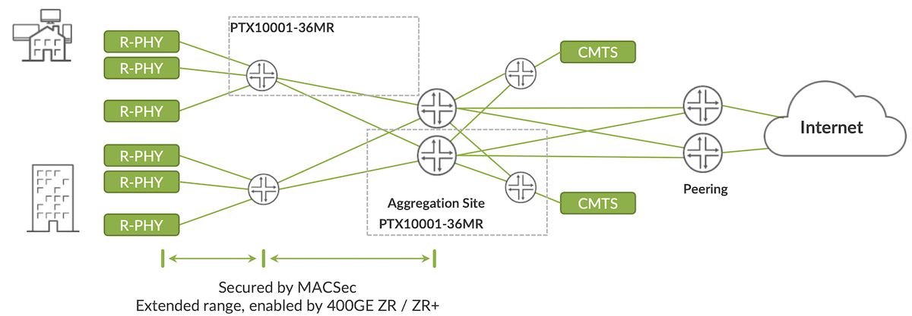

These deployments typically require simple L3 forwarding and routing features, but with a higher emphasis on:

- Data confidentiality
- Device security
- Optical Integration
- PTP Timestamping

The only new requirement is PTP Timestamping, and PTX10001-36MR supports these functions too.

### Other Use-Cases

The universe of the router applications is not limited to the known ones outlined above. PTX10001-36MR is a versatile system that features a highly programmable and scalable forwarding pipeline, modular software, plus high-performance control plane subsystem.

It is ready for the unknown challenges.

## Useful links

- PTX10001-36MR Packet Transport Router [Product Page](https://www.juniper.net/us/en/products/routers/ptx-series/ptx10001-36mr-packet-transport-router.html).
- FIB Compression,[https://juniper.github.io/techposts/ptx-fib-compression/article](https://juniper.github.io/techposts/ptx-fib-compression/article)

## Glossary

- ASIC -- Application-Specific Integrated Circuit
- AUI -- Attachment Unit Interface
- BGP -- Border Gateway Protocol
- CDN -- Content Delivery Network
- CPU -- Central Processing Unit
- EVPN -- Ethernet Virtual Private Network
- FIB -- Forwarding Information Base
- FPC -- Flexible Port Concentrator
- GRE -- Generic Routing Encapsulation
- IGP -- Interior Gateway Protocol
- IP -- Internet Protocol
- MACSec -- Media Access Control Security
- MPLS -- Multiprotocol Label Switching
- PIC -- Physical Interface Card
- PTP -- Precision Time Protocol
- RU -- Rack Unit
- SNMP -- Simple Network Management Protocol
- SSD -- Solid State Drive
- TCP -- Transmission Control Protocol
- UDP -- User Datagram Protocol
- VPN -- Virtual Private Network
- VXLAN -- Virtual Extensible Local Area Network
- WAN -- Wide Area Network

## Acknowledgements

Many thanks to Kapil Jain, Swamy SRK, Priya M, Dmitry Bugrimenko, Pradeep Chalicheemala and Nicolas Fevrier for reviewing this article, and providing the feedback.
