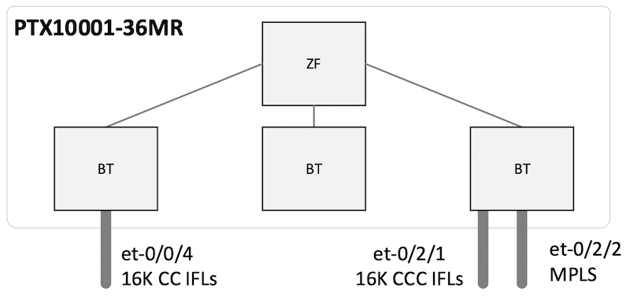
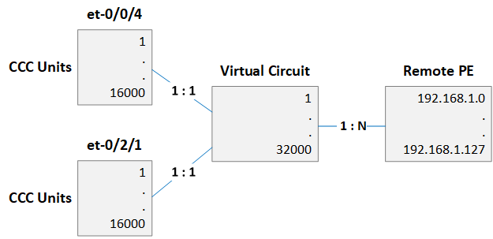

# PTX10001-36MR L2 Circuit Scale

**Dmitry Shokarev - 10/06/2022**

The PTX10001-36MR is well-known for its core, peering and DCI capabilities, but it's also a very performant L2 aggregation device. In this article, we will test and demonstrate L2 virtual circuits scale on Express4-based PTX routers.

## Introduction

Each Express 4 ASIC (Codename: "BT") supports up to 16384 logical interfaces. In this test scenario we distribute logical interfaces between two PFEs of a PTX10001-36MR as shown in Figure 1:



Figure 2 shows relationships between interfaces, circuits and remote edge devices. The setup has a trivial next-hop topology without any load balancing.
Note that regular "et-" interfaces are used in this test. With Aggregated Ethernet in use the scale will reduce because, as of today, a separate logical interface is allocated for each member link (also known as "child" IFL).



## Configuration and Validation

CCC interface configuration is shown below:

```
unit 1 {
    encapsulation vlan-ccc;
    vlan-tags outer 1001 inner 1;
    input-vlan-map {
        swap-swap;
        vlan-id 1;
        inner-vlan-id 100;
    }
    output-vlan-map swap-swap;
}
```

All the circuits are provisioned as static pseudo-wires (32000 total) and 128 static LSPs are provisioned to reach remote PEs.

All the l2 connections are "up" after commit:

```
regress@rtme-ptx10# run show l2circuit connections | match "rmt\s+Up" | count 
Count: 32000 lines
```

PFE commands confirm that 32K MPLS and 32K CCC routes are present.

```
root@rtme-ptx10:pfe> show route summary

IPv4 Route Tables:
Index         Routes     Size(b)  Prefixes     Aggr     Installed   Comp(%)
--------  ----------  ----------  ---------  ---------  ----------  ------
Default           35        3640        31          0          19     39
1                  0           0         0          0           0      0
50                 5         520         5          0           5      0
36738              5         520         5          0           5      0

MPLS Route Tables:
Index         Routes     Size(b)  Prefixes     Aggr     Installed   Comp(%)
--------  ----------  ----------  ---------  ---------  ----------  ------
Default        32007     3328728     32007          0       32007      -

IPv6 Route Tables:
Index         Routes     Size(b)  Prefixes     Aggr     Installed   Comp(%)
--------  ----------  ----------  ---------  ---------  ----------  ------
Default            7         728         7          0           7      0
1                  0           0         0          0           0      0
50                 5         520         5          0           5      0
36738              6         624         6          0           6      0

CLNP Route Tables:
Index         Routes     Size(b)  Prefixes     Aggr     Installed   Comp(%)
--------  ----------  ----------  ---------  ---------  ----------  ------
Default            2         208         2          0           2      -
50                 1         104         1          0           1      -

CCC Route Tables:
Index         Routes     Size(b)  Prefixes     Aggr     Installed   Comp(%)
--------  ----------  ----------  ---------  ---------  ----------  ------
Default        32000     3328000     32000          0       32000      -
```

16K L2 circuits per PFE limit is imposed by the address space of the local L2 domain attribute of the ASIC (14 bits). The mapping of interfaces and VLANs to a logical interface is kept in the L2 domain table.

```
root@rtme-ptx10:pfe> show jexpr chash pfe 2
pfe    : 2

  ID    PFE          Name                Size(cells)      Used(cells)    %     MaxUsed(cells)    %   Note
  --    ---          ----                -----------      -----------    -      --------------    -    ----
   0    2        IGP-megidx                 4096                     0          0               0             0
   1    2        EGP-megidx                 4096                     0          0               0             0
   2    2  TunnelL2DomainHa                24576                     0          0               0             0   1 entry=2/3/6 cells
   3    2  TunnelL2DomainHa                24576                     0          0               0             0   1 entry=2/3/6 cells
   4    2         EPP_MAPID               196608                 16120          8           16120             8
   5    2          L2Domain                32768                 16012         48           16012            48
   6    2        SLU-MY-MAC                 3072                    39          1              39             1
   7    2           DLU-IDB              2519040                     0          0               0             0   1 entry=1/2/4 cells
   8    2       SA-Learning                32768                     0          0               0             0

  ID    PFE          Name                Size(cells)      Used(cells)    %     MaxUsed(cells)    %   Note
  --    ---          ----                -----------      -----------    -      --------------    -    ----
   0   255           DLU-IDB              2519040                131287          5          415189            16   1 entry=1/2/4 cells
```

Utilization of ingress (next-hop) memory is less than 20%.

```
root@rtme-ptx10:pfe> show jexpr jtm ingress-main-memory chip 2
Show JTM Ingress MM allocation:
Pfe Chip: 2
[Global Region]
Used words: 129948, max used: 129948, allocs: 3792767, frees: 3754556
    Allocator 0: used words: 10825, max used: 10825, allocs: 316064, frees: 312877
        total words: 59392, available: 81%
    Allocator 1: used words: 10828, max used: 10828, allocs: 316064, frees: 312880
        total words: 63488, available: 82%
    Allocator 2: used words: 10826, max used: 10826, allocs: 316064, frees: 312880
        total words: 63488, available: 82%
    Allocator 3: used words: 10828, max used: 10828, allocs: 316064, frees: 312880
        total words: 63488, available: 82%
    Allocator 4: used words: 10832, max used: 10832, allocs: 316064, frees: 312880
        total words: 63488, available: 82%
    Allocator 5: used words: 10828, max used: 10828, allocs: 316064, frees: 312879
        total words: 63488, available: 82%
    Allocator 6: used words: 10826, max used: 10826, allocs: 316064, frees: 312880
        total words: 65536, available: 83%
    Allocator 7: used words: 10832, max used: 10832, allocs: 316064, frees: 312880
        total words: 65536, available: 83%
    Allocator 8: used words: 10832, max used: 10832, allocs: 316064, frees: 312880
        total words: 65536, available: 83%
    Allocator 9: used words: 10832, max used: 10832, allocs: 316064, frees: 312880
        total words: 65536, available: 83%
    Allocator 10: used words: 10834, max used: 10834, allocs: 316064, frees: 312880
        total words: 65536, available: 83%
    Allocator 11: used words: 10825, max used: 10825, allocs: 316063, frees: 312880
        total words: 65536, available: 83%
[Private Region]
Used words: 454, max used: 454, allocs: 521, frees: 5
    Allocator 0: used words: 454, max used: 454, allocs: 521, frees: 5
        total words: 4096, available: 88%
[Load Balance]
    Allocator 0: used words: 144, max used: 144, allocs: 7, frees: 1
      overflow, used words: 0, max used: 0, allocs: 0, frees: 0
        total words: 6144, available: 97%
[SLT]
    Allocator 0: used words: 0, max used: 0, allocs: 0, frees: 0
        total words: 32768, available: 100%
[RPL]
    Allocator 0: used words: 0, max used: 0, allocs: 0, frees: 0
        total words: 2048, available: 100%
[REF]
    Allocator 0: used words: 8, max used: 8, allocs: 1, frees: 0
        total words: 8192, available: 99%
```

Egress memory is used for encapsulation structures, such as output VLAN IDs, forwarding MAC addresses and MPLS labels. 4 partitions out of 12 are in use and utilization of these 4 is less than 70%. Overall utilization is less than 30%.

```
root@rtme-ptx10:pfe> show jexpr jtm egress-memory summary chip 2
Show JTM Egress Memory Summary:
Pfe Chip: 2
 Max Total Encap Memory Used (across all partitions in words) : 86155
 Current Total Encap Memory Used (across all partitions in words) : 86155

 PartitionID    CurrType                Total(words)    Used(words)     %       MaxUsed(words)  %

 -----------    --------                ------------    -----------     --      --------------  --

     0            MacTbl                 32768                0         0              0        0

     1            UnusedPool             32768                0         0              0        0

     2            UnusedPool             32768                0         0              0        0

     3            UnusedPool             32768                0         0              0        0

     4            Public                 32768            18680         57         18680        57

     5            Public                 32768            30720         93         30720        93

     6            UnusedPool             32768                0         0              0        0

     7            Public                 32768            30720         93         30720        93

     8            Private                32768             6035         18          6035        18

     9            UnusedPool             32768                0         0              0        0

    10            Private                32768                0         0              0        0

    11            Tunnel                  4096                0         0              0        0
```

## Configuration Generation Script

```python
import sys
import ipaddress

left_ifd = 'et-0/0/4'
right_ifd = 'et-0/2/1'
mpls_ifd = 'et-0/2/2'
first_nbr = ipaddress.IPv4Address( "192.168.1.0")
ifl_count = 16000
nbr_count = 128

def generate_config():
    print("interfaces {")
    print("\t{:s} {{".format(left_ifd))
    print("\t\tflexible-vlan-tagging;")
    print("\t\tencapsulation flexible-ethernet-services;")
    for i in range(0, ifl_count):
        ivlan_left = i % 4000 + 1
        ovlan_left = i // 4000 + 1
        print( "\t\tunit {:d} {{".format( i+1))
        print( "\t\t\tencapsulation vlan-ccc;")
        print( "\t\t\tvlan-tags outer {:d} inner {:d};".format(ovlan_left, ivlan_left))
        print( "\t\t\tinput-vlan-map {")
        print( "\t\t\t\tswap-swap;")
        print( "\t\t\t\tvlan-id 1;")
        print( "\t\t\t\tinner-vlan-id 100;")
        print( "\t\t\t}")
        print( "\t\t\toutput-vlan-map swap-swap;")
        print( "\t\t}")
    print("\t}")
    print("\t{:s} {{".format(right_ifd))
    print("\t\tflexible-vlan-tagging;")
    print("\t\tencapsulation flexible-ethernet-services;")
    for i in range(0, ifl_count):
        ivlan_right = i % 4000 + 1
        ovlan_right = i // 4000 + 1 + 1000  
        print( "\t\tunit {:d} {{".format( i+1))
        print( "\t\t\tencapsulation vlan-ccc;")
        print( "\t\t\tvlan-tags outer {:d} inner {:d};".format(ovlan_right, ivlan_right))
        print( "\t\t\tinput-vlan-map {")
        print( "\t\t\t\tswap-swap;")
        print( "\t\t\t\tvlan-id 1;")
        print( "\t\t\t\tinner-vlan-id 100;")
        print( "\t\t\t}")
        print( "\t\t\toutput-vlan-map swap-swap;")
        print( "\t\t}")
    print("\t}")
    print("}")
    print("protocols {")
    print("\tl2circuit {")    
    last_nbr_id = -1
    vc_id = 1
    for ifd in (left_ifd,right_ifd):
        for i in range(0, ifl_count):
            nbr_id = i // nbr_count
            if nbr_id!=last_nbr_id:
                if( last_nbr_id >= 0):
                    print("\t\t}") #close nbr container
                print("\t\tneighbor {:s} {{".format( str(first_nbr+nbr_id)))
            print("\t\t\tinterface {:s}.{:d} {{".format(ifd,i+1))
            print("\t\t\t\tstatic {")
            print("\t\t\t\t\tincoming-label {:d};".format(1000000+vc_id))
            print("\t\t\t\t\toutgoing-label {:d};".format(1000000+vc_id))
            print("\t\t\t\t}")
            print("\t\t\t\tvirtual-circuit-id {:d};".format(vc_id))
            print("\t\t\t}")
            last_nbr_id = nbr_id
            vc_id += 1
    if( last_nbr_id >= 0):
        print("\t\t}") #close nbr container
    print("\t}")
    print("\tmpls {")
    for nbr_id in range(0,nbr_count):
        print("\t\tstatic-label-switched-path p{:d} {{".format( nbr_id))
        print("\t\t\tingress {")
        print("\t\t\t\tnext-hop 192.168.0.2;")
        print("\t\t\t\tto {:s};".format( str(first_nbr+nbr_id)))
        print("\t\t\t\tpush {:d};".format( 1000000+nbr_id))
        print("\t\t\t}")
        print("\t\t}")
    print("\t}")
    print("}")

# execute
if __name__ == "__main__":
    generate_config()
else:
    pass
```

## Glossary

- CCC: Circuit Cross-Connect
- IFL: Logical Interface
- LSP: Label Switched Path
- PE: Provider Edge
- PFE: Packet Forwarding Engine