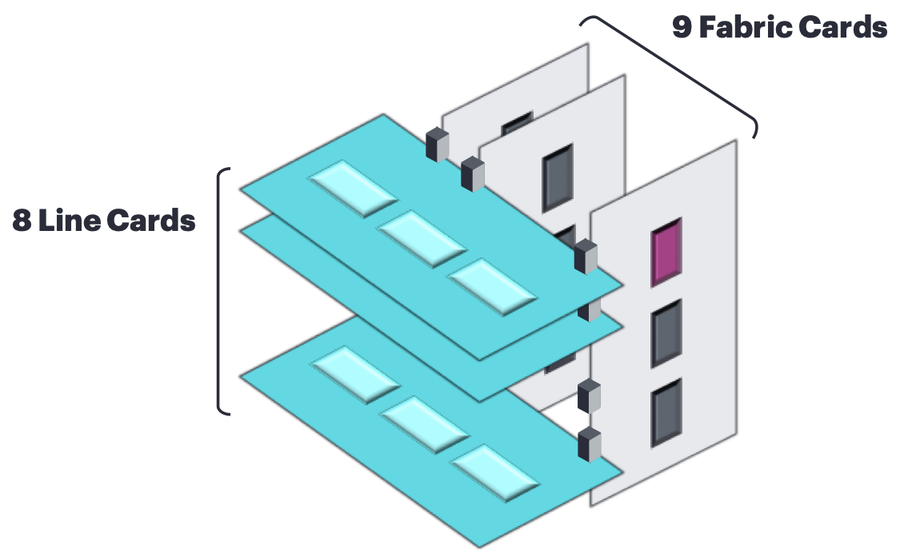
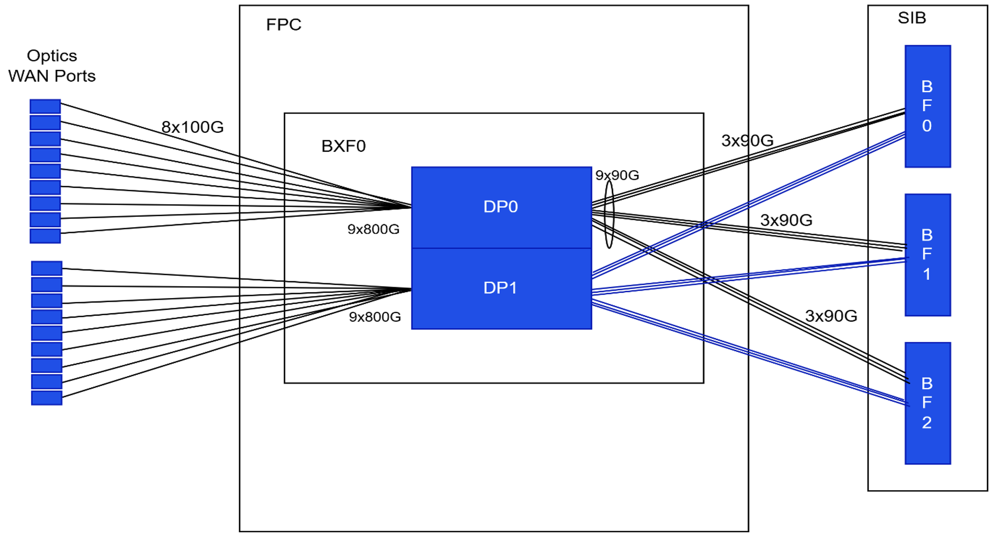
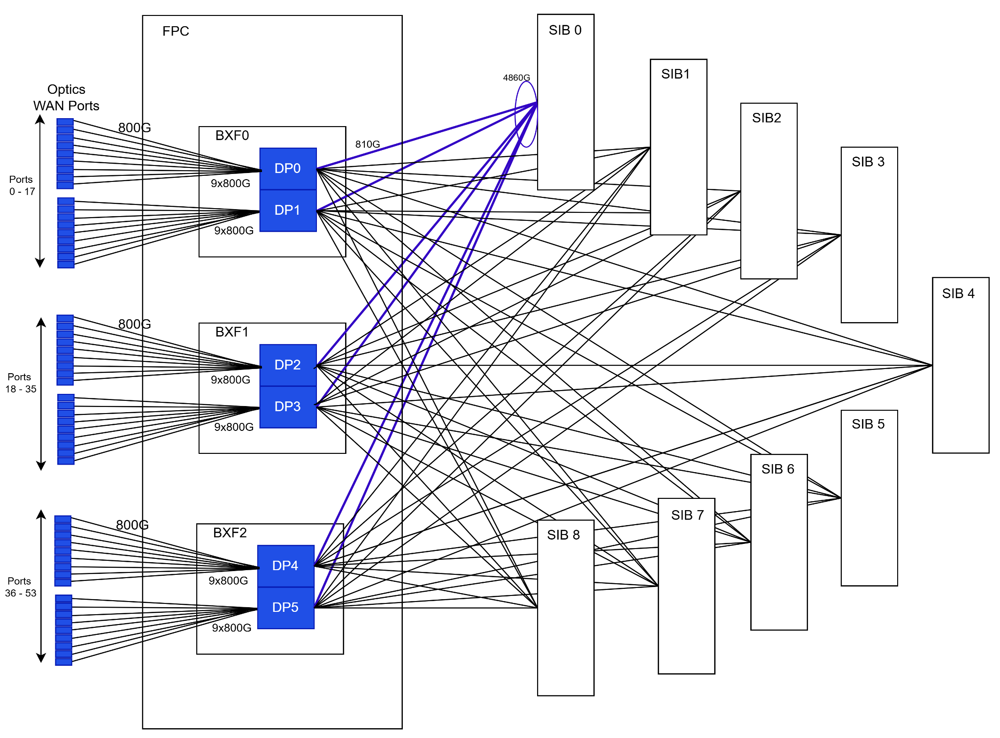

# PTX12008 Fabric Topology

**Rahul Kulkarni - 03/28/2026**

Let's describes the PTX12008 chassis fabric topology and the bandwidth plumbing between Line Cards (LCs) and Switch Interface Boards (SIBs).

Each LC integrates three BXF Packet Forwarding Engines (PFE), each made of a BX+BF pair, to deliver 54x 800G WAN ports, total 43.2Tbps per LC. Given 9 SIBs in the chassis, the fabric scaling ensures full LC bandwidth.

## Introduction

PTX12008 is an eight-slot Line Card (LC) chassis paired with 9 SIB slots to realize a non-blocking, high-capacity switching fabric. Each LC leverages the Juniper BX and BF chipsets, combined as BXF, to perform packet processing and cross-fabric switching.



The LC uses 3 BXF devices to expose 54x 800G client ports.

This document explains:

- How WAN-side porting maps into per-DP and per-SIB SerDes fan-out
- What is the bandwidth per line card and per SIB.
- Why all nine SIBs are required to carry the LC's full 43.2T
- How to read the chassis CLI fabric-topology to confirm link health and capacity at multiple aggregation levels.

We invite you to read the article [Rethinking Fabric Redundancy](https://juniper.github.io/techposts/rethinking-fabric-redundancy/article)

## System Overview

## Chassis and Silicon

The PTX12008 chassis supports 8 Line card slots and 9 SIB slots. Two types of line cards are available at inception. One with OSFP Optics (PTX12K-LC54OSFP) and another with QSFP optics (PTX12K-LC54QDD). Both cards offer 54x 800G WAN ports.

These line cards are powered by the Express 5 which is a BX+BF pair forming a BXF packet-forwarding engine on each LC. Each BXF supports 14.4T bandwidth. Every line card has 3 such BXF chipsets providing a total of 43.2Tbps customer bandwidth.

PTX12008 introduces a new SIB/Fabric card: **SIB-PTX12008-SF**. This Fabric card contains 3 BF chips, retimers and arranged as a 144x144 I/O crossbar. The PTX12008 chassis has 9 SIB slots. Line cards and SIBs are connected orthogonally to each other.

## Data Path and Fabric Topology



## BXF Data Paths

As shown in Figure 1, each BXF exposes two data paths (DP0 and DP1 also known as Forwarding Engine, FE). On the WAN side, 9x 800G ports per DP map client traffic into the fabric.

## Fabric-Side SerDes

Each SIB has 3 BF chips.

- Each of them is connected with 3 SerDes links per DP
- Thus, 2x DPs per BXF and 3x BFs per SIB, the fabric side presents 18x SerDes (9 per DP) to each SIB
- equivalently, 9x SerDes per DP per SIB

## Capacity Accounting



## WAN-Side Capacity per LC

As shown in Figure 2, each line card has 54 ports each with 800G line rate. This provides a total of 43.2Tbps bandwidth per Line card.

## Fabric-Side Capacity per SIB (per LC)

Let's detail the math:

- Each line card has 3 BXF
- Each BXF contains two data paths (DP0 and DP1)
- Each DP is connected with 9 SerDes lanes to every SIB
- Due to cell headers, FEC, and encoding overheads, fabric side SerDes lanes run effectively at approximately 90-92 Gb/s.
- If we consider SerDes at 90Gbps, it gives ~810Gbps per DP with single SIB. Please refer the highlighted link in Figure 2

With three BXFs per LC:

- there are 6 DPs total
- Therefore: 6 DPs x ~810Gbps ~= 4.86 Tbps traffic capacity is available with single SIB
- That means 6 ports (800G each) can be used. Please note these 6 ports needs to be from different DPs to get this effective bandwidth

## SIB requirement for full line rate

To carry LC's ~43.2 Tbps, the fabric engages all nine SIBs so that aggregate per-SIB contributions meet or exceed LC demand.

As discussed in point 3.2, each SIB provided 4.8 Tbps capacity per line card. So total of 9 SIBs are required to support entire 43.2Tbps of each line card.

| Level | Level Connectionsto a SIB (per unit) | Effective rate per connection (Gb/s) | Total per SIB |
|:--|:--|:--|:--|
| Datapath (DP) | 9 SerDes links | ~= 90--92 | 9x 90Gbps-> ~810Gbps |
| BXF (2 DPs) | 2x (9 SerDes links) | ~= 90--92 | 2x  9x 90Gbps -> ~1.6Tbps |
| Line Card (3 BXF) | 3x 2x (9 SerDes links) | ~= 90--92 | = 54 ~= 90--92 54 x 90Gbps -> ~4.86Tbps |

Below table provides the BW per slot and number of 800G ports that can be used based on the number of SIB cards.

| No. of SIB | Cards BW / Slot (Tbps) | #800G |
|:--|:--|:--|
| 1 | 4.8T | 6 |
| 2 | 9.6T | 12 |
| 3 | 14.4T | 18 |
| 6 | 28.8T | 36 |
| 9 | 43.2T | 54 |

All 9 SIBs must be present to avoid oversubscription at full 43.2 Tbps LC rate. Any SIB outage proportionally reduces the aggregate fabric capacity per LC (~11.1% per missing SIB).

While the provisioned capacity gets degraded in proportion to the reduction in populated SIBs. The loss factor is the ratio of removed SIBs to total provisioned SIBs:
Provisioned capacity loss (%) = (Removed/Failed SIBs) / Provisioned SIBs x 100

## CLI Topology Interpretation

## FE<->SIB (9 links per FE across SIBs)

9 links per DP i.e FE to each SIB set (~800G).

```
root@ptx12008> show chassis fabric topology |grep "FPC03FE0"|grep SIB00 |count
Count: 9 lines

root@ptx12008> show chassis fabric topology |grep "FPC03FE0"|grep SIB00
FPC03FE0(8,00)->SIB00F0(9,00)    UP      SIB00F0(9,00)->FPC03FE0(8,00)    UP
FPC03FE0(7,06)->SIB00F0(11,05)   UP      SIB00F0(11,05)->FPC03FE0(7,06)   UP
FPC03FE0(7,03)->SIB00F0(11,01)   UP      SIB00F0(11,01)->FPC03FE0(7,03)   UP
FPC03FE0(8,04)->SIB00F1(9,04)    UP      SIB00F1(9,04)->FPC03FE0(8,04)    UP
FPC03FE0(7,07)->SIB00F1(9,02)    UP      SIB00F1(9,02)->FPC03FE0(7,07)    UP
FPC03FE0(7,04)->SIB00F1(9,00)    UP      SIB00F1(9,00)->FPC03FE0(7,04)    UP
FPC03FE0(8,08)->SIB00F2(9,00)    UP      SIB00F2(9,00)->FPC03FE0(8,08)    UP
FPC03FE0(8,03)->SIB00F2(8,05)    UP      SIB00F2(8,05)->FPC03FE0(8,03)    UP
FPC03FE0(8,02)->SIB00F2(8,01)    UP      SIB00F2(8,01)->FPC03FE0(8,02)    UP
```

## BX<->SIB (18 links per BX)

Each BX has two DPs, I.e. Forwarding paths (FE)

18 links per BX to SIB set (~1.6Tbps).

```
root@ptx12008> show chassis fabric topology |grep "FPC03FE0|FPC03FE1" |grep SIB00 |count
Count: 18 lines

root@ptx12008> show chassis fabric topology |grep "FPC03FE0|FPC03FE1" |grep SIB00
FPC03FE0(8,00)->SIB00F0(9,00)    UP      SIB00F0(9,00)->FPC03FE0(8,00)    UP
FPC03FE0(7,06)->SIB00F0(11,05)   UP      SIB00F0(11,05)->FPC03FE0(7,06)   UP
FPC03FE0(7,03)->SIB00F0(11,01)   UP      SIB00F0(11,01)->FPC03FE0(7,03)   UP
FPC03FE1(1,06)->SIB00F0(8,07)    UP      SIB00F0(8,07)->FPC03FE1(1,06)    UP
FPC03FE1(3,00)->SIB00F0(11,06)   UP      SIB00F0(11,06)->FPC03FE1(3,00)   UP
FPC03FE1(3,01)->SIB00F0(11,03)   UP      SIB00F0(11,03)->FPC03FE1(3,01)   UP
FPC03FE0(8,04)->SIB00F1(9,04)    UP      SIB00F1(9,04)->FPC03FE0(8,04)    UP
FPC03FE0(7,07)->SIB00F1(9,02)    UP      SIB00F1(9,02)->FPC03FE0(7,07)    UP
FPC03FE0(7,04)->SIB00F1(9,00)    UP      SIB00F1(9,00)->FPC03FE0(7,04)    UP
FPC03FE1(0,06)->SIB00F1(9,03)    UP      SIB00F1(9,03)->FPC03FE1(0,06)    UP
FPC03FE1(2,02)->SIB00F1(8,06)    UP      SIB00F1(8,06)->FPC03FE1(2,02)    UP
FPC03FE1(2,05)->SIB00F1(8,07)    UP      SIB00F1(8,07)->FPC03FE1(2,05)    UP
FPC03FE0(8,08)->SIB00F2(9,00)    UP      SIB00F2(9,00)->FPC03FE0(8,08)    UP
FPC03FE0(8,03)->SIB00F2(8,05)    UP      SIB00F2(8,05)->FPC03FE0(8,03)    UP
FPC03FE0(8,02)->SIB00F2(8,01)    UP      SIB00F2(8,01)->FPC03FE0(8,02)    UP
FPC03FE1(0,05)->SIB00F2(8,07)    UP      SIB00F2(8,07)->FPC03FE1(0,05)    UP
FPC03FE1(1,02)->SIB00F2(8,02)    UP      SIB00F2(8,02)->FPC03FE1(1,02)    UP
FPC03FE1(1,03)->SIB00F2(8,00)    UP      SIB00F2(8,00)->FPC03FE1(1,03)    UP
```

## FPC (3x BXF) <-> SIB (54 links per FPC)

54 links per FPC into each SIB set (~4.86Tbps).

```
root@ptx12008> show chassis fabric topology |grep "FPC03"|grep SIB00 |count
Count: 54 lines

root@ptx12008> show chassis fabric topology |grep "FPC03"|grep SIB00
FPC03FE0(8,00)->SIB00F0(9,00)    UP      SIB00F0(9,00)->FPC03FE0(8,00)    UP
FPC03FE0(7,06)->SIB00F0(11,05)   UP      SIB00F0(11,05)->FPC03FE0(7,06)   UP
FPC03FE0(7,03)->SIB00F0(11,01)   UP      SIB00F0(11,01)->FPC03FE0(7,03)   UP
FPC03FE1(1,06)->SIB00F0(8,07)    UP      SIB00F0(8,07)->FPC03FE1(1,06)    UP
FPC03FE1(3,00)->SIB00F0(11,06)   UP      SIB00F0(11,06)->FPC03FE1(3,00)   UP
FPC03FE1(3,01)->SIB00F0(11,03)   UP      SIB00F0(11,03)->FPC03FE1(3,01)   UP
FPC03FE2(8,00)->SIB00F0(8,04)    UP      SIB00F0(8,04)->FPC03FE2(8,00)    UP
FPC03FE2(7,06)->SIB00F0(11,07)   UP      SIB00F0(11,07)->FPC03FE2(7,06)   UP
FPC03FE2(7,03)->SIB00F0(11,04)   UP      SIB00F0(11,04)->FPC03FE2(7,03)   UP
FPC03FE3(1,06)->SIB00F0(9,02)    UP      SIB00F0(9,02)->FPC03FE3(1,06)    UP
FPC03FE3(3,00)->SIB00F0(9,07)    UP      SIB00F0(9,07)->FPC03FE3(3,00)    UP
FPC03FE3(3,01)->SIB00F0(9,04)    UP      SIB00F0(9,04)->FPC03FE3(3,01)    UP
FPC03FE4(8,00)->SIB00F0(8,06)    UP      SIB00F0(8,06)->FPC03FE4(8,00)    UP
FPC03FE4(7,06)->SIB00F0(9,06)    UP      SIB00F0(9,06)->FPC03FE4(7,06)    UP
FPC03FE4(7,03)->SIB00F0(9,03)    UP      SIB00F0(9,03)->FPC03FE4(7,03)    UP
FPC03FE5(1,06)->SIB00F0(8,03)    UP      SIB00F0(8,03)->FPC03FE5(1,06)    UP
FPC03FE5(3,00)->SIB00F0(9,05)    UP      SIB00F0(9,05)->FPC03FE5(3,00)    UP
FPC03FE5(3,01)->SIB00F0(9,01)    UP      SIB00F0(9,01)->FPC03FE5(3,01)    UP
FPC03FE0(8,04)->SIB00F1(9,04)    UP      SIB00F1(9,04)->FPC03FE0(8,04)    UP
FPC03FE0(7,07)->SIB00F1(9,02)    UP      SIB00F1(9,02)->FPC03FE0(7,07)    UP
FPC03FE0(7,04)->SIB00F1(9,00)    UP      SIB00F1(9,00)->FPC03FE0(7,04)    UP
FPC03FE1(0,06)->SIB00F1(9,03)    UP      SIB00F1(9,03)->FPC03FE1(0,06)    UP
FPC03FE1(2,02)->SIB00F1(8,06)    UP      SIB00F1(8,06)->FPC03FE1(2,02)    UP
FPC03FE1(2,05)->SIB00F1(8,07)    UP      SIB00F1(8,07)->FPC03FE1(2,05)    UP
FPC03FE2(8,04)->SIB00F1(9,01)    UP      SIB00F1(9,01)->FPC03FE2(8,04)    UP
FPC03FE2(7,07)->SIB00F1(8,03)    UP      SIB00F1(8,03)->FPC03FE2(7,07)    UP
FPC03FE2(7,04)->SIB00F1(8,04)    UP      SIB00F1(8,04)->FPC03FE2(7,04)    UP
FPC03FE3(0,06)->SIB00F1(9,07)    UP      SIB00F1(9,07)->FPC03FE3(0,06)    UP
FPC03FE3(2,02)->SIB00F1(8,05)    UP      SIB00F1(8,05)->FPC03FE3(2,02)    UP
FPC03FE3(2,05)->SIB00F1(8,01)    UP      SIB00F1(8,01)->FPC03FE3(2,05)    UP
FPC03FE4(8,04)->SIB00F1(9,06)    UP      SIB00F1(9,06)->FPC03FE4(8,04)    UP
FPC03FE4(7,07)->SIB00F1(8,02)    UP      SIB00F1(8,02)->FPC03FE4(7,07)    UP
FPC03FE4(7,04)->SIB00F1(8,00)    UP      SIB00F1(8,00)->FPC03FE4(7,04)    UP
FPC03FE5(0,06)->SIB00F1(9,05)    UP      SIB00F1(9,05)->FPC03FE5(0,06)    UP
FPC03FE5(2,02)->SIB00F1(7,06)    UP      SIB00F1(7,06)->FPC03FE5(2,02)    UP
FPC03FE5(2,05)->SIB00F1(7,07)    UP      SIB00F1(7,07)->FPC03FE5(2,05)    UP
FPC03FE0(8,08)->SIB00F2(9,00)    UP      SIB00F2(9,00)->FPC03FE0(8,08)    UP
FPC03FE0(8,03)->SIB00F2(8,05)    UP      SIB00F2(8,05)->FPC03FE0(8,03)    UP
FPC03FE0(8,02)->SIB00F2(8,01)    UP      SIB00F2(8,01)->FPC03FE0(8,02)    UP
FPC03FE1(0,05)->SIB00F2(8,07)    UP      SIB00F2(8,07)->FPC03FE1(0,05)    UP
FPC03FE1(1,02)->SIB00F2(8,02)    UP      SIB00F2(8,02)->FPC03FE1(1,02)    UP
FPC03FE1(1,03)->SIB00F2(8,00)    UP      SIB00F2(8,00)->FPC03FE1(1,03)    UP
FPC03FE2(8,08)->SIB00F2(8,04)    UP      SIB00F2(8,04)->FPC03FE2(8,08)    UP
FPC03FE2(8,03)->SIB00F2(7,06)    UP      SIB00F2(7,06)->FPC03FE2(8,03)    UP
FPC03FE2(8,02)->SIB00F2(7,07)    UP      SIB00F2(7,07)->FPC03FE2(8,02)    UP
FPC03FE3(0,05)->SIB00F2(9,02)    UP      SIB00F2(9,02)->FPC03FE3(0,05)    UP
FPC03FE3(1,02)->SIB00F2(7,03)    UP      SIB00F2(7,03)->FPC03FE3(1,02)    UP
FPC03FE3(1,03)->SIB00F2(7,04)    UP      SIB00F2(7,04)->FPC03FE3(1,03)    UP
FPC03FE4(8,08)->SIB00F2(8,06)    UP      SIB00F2(8,06)->FPC03FE4(8,08)    UP
FPC03FE4(8,03)->SIB00F2(7,05)    UP      SIB00F2(7,05)->FPC03FE4(8,03)    UP
FPC03FE4(8,02)->SIB00F2(7,01)    UP      SIB00F2(7,01)->FPC03FE4(8,02)    UP
FPC03FE5(0,05)->SIB00F2(8,03)    UP      SIB00F2(8,03)->FPC03FE5(0,05)    UP
FPC03FE5(1,02)->SIB00F2(7,02)    UP      SIB00F2(7,02)->FPC03FE5(1,02)    UP
FPC03FE5(1,03)->SIB00F2(7,00)    UP      SIB00F2(7,00)->FPC03FE5(1,03)    UP
```

## FPC (3x BXF) <-> 9 SIB (486 links per FPC)

486 links per FPC into 9 SIBs (~43.2 Tbps).

```
root@ptx12008> show chassis fabric topology |grep UP |count
Count: 486 lines
root@ptx12008> show chassis fabric topology

 In-link  : FPC# FE# (TX inst#, TX sub-chnl #) ->
            SIB# ASIC#_FCORE# (RX port#,RX sub-chn#, RX inst#)

 Out-link : SIB# ASIC#_FCORE# (TX port#, TX sub-chn#, TX inst#) ->
            FPC# FE# (RX inst#, RX sub-chnl #)
SIB 0 FCHIP 0 FCORE 0 :
-----------------------
          In-links               State             Out-links              State
--------------------------------------------------------------------------------
FPC03FE0(8,00)->SIB00F0(9,00)    UP      SIB00F0(9,00)->FPC03FE0(8,00)    UP
FPC03FE0(7,06)->SIB00F0(11,05)   UP      SIB00F0(11,05)->FPC03FE0(7,06)   UP
FPC03FE0(7,03)->SIB00F0(11,01)   UP      SIB00F0(11,01)->FPC03FE0(7,03)   UP
FPC03FE1(1,06)->SIB00F0(8,07)    UP      SIB00F0(8,07)->FPC03FE1(1,06)    UP
FPC03FE1(3,00)->SIB00F0(11,06)   UP      SIB00F0(11,06)->FPC03FE1(3,00)   UP
FPC03FE1(3,01)->SIB00F0(11,03)   UP      SIB00F0(11,03)->FPC03FE1(3,01)   UP
FPC03FE2(8,00)->SIB00F0(8,04)    UP      SIB00F0(8,04)->FPC03FE2(8,00)    UP
FPC03FE2(7,06)->SIB00F0(11,07)   UP      SIB00F0(11,07)->FPC03FE2(7,06)   UP
FPC03FE2(7,03)->SIB00F0(11,04)   UP      SIB00F0(11,04)->FPC03FE2(7,03)   UP
FPC03FE3(1,06)->SIB00F0(9,02)    UP      SIB00F0(9,02)->FPC03FE3(1,06)    UP
FPC03FE3(3,00)->SIB00F0(9,07)    UP      SIB00F0(9,07)->FPC03FE3(3,00)    UP
FPC03FE3(3,01)->SIB00F0(9,04)    UP      SIB00F0(9,04)->FPC03FE3(3,01)    UP
FPC03FE4(8,00)->SIB00F0(8,06)    UP      SIB00F0(8,06)->FPC03FE4(8,00)    UP
FPC03FE4(7,06)->SIB00F0(9,06)    UP      SIB00F0(9,06)->FPC03FE4(7,06)    UP
FPC03FE4(7,03)->SIB00F0(9,03)    UP      SIB00F0(9,03)->FPC03FE4(7,03)    UP
FPC03FE5(1,06)->SIB00F0(8,03)    UP      SIB00F0(8,03)->FPC03FE5(1,06)    UP
FPC03FE5(3,00)->SIB00F0(9,05)    UP      SIB00F0(9,05)->FPC03FE5(3,00)    UP
FPC03FE5(3,01)->SIB00F0(9,01)    UP      SIB00F0(9,01)->FPC03FE5(3,01)    UP

SIB 0 FCHIP 1 FCORE 0 :
-----------------------
          In-links               State             Out-links              State
--------------------------------------------------------------------------------
FPC03FE0(8,04)->SIB00F1(9,04)    UP      SIB00F1(9,04)->FPC03FE0(8,04)    UP
FPC03FE0(7,07)->SIB00F1(9,02)    UP      SIB00F1(9,02)->FPC03FE0(7,07)    UP
FPC03FE0(7,04)->SIB00F1(9,00)    UP      SIB00F1(9,00)->FPC03FE0(7,04)    UP
FPC03FE1(0,06)->SIB00F1(9,03)    UP      SIB00F1(9,03)->FPC03FE1(0,06)    UP
FPC03FE1(2,02)->SIB00F1(8,06)    UP      SIB00F1(8,06)->FPC03FE1(2,02)    UP
FPC03FE1(2,05)->SIB00F1(8,07)    UP      SIB00F1(8,07)->FPC03FE1(2,05)    UP
FPC03FE2(8,04)->SIB00F1(9,01)    UP      SIB00F1(9,01)->FPC03FE2(8,04)    UP
FPC03FE2(7,07)->SIB00F1(8,03)    UP      SIB00F1(8,03)->FPC03FE2(7,07)    UP
FPC03FE2(7,04)->SIB00F1(8,04)    UP      SIB00F1(8,04)->FPC03FE2(7,04)    UP
FPC03FE3(0,06)->SIB00F1(9,07)    UP      SIB00F1(9,07)->FPC03FE3(0,06)    UP
FPC03FE3(2,02)->SIB00F1(8,05)    UP      SIB00F1(8,05)->FPC03FE3(2,02)    UP
FPC03FE3(2,05)->SIB00F1(8,01)    UP      SIB00F1(8,01)->FPC03FE3(2,05)    UP
FPC03FE4(8,04)->SIB00F1(9,06)    UP      SIB00F1(9,06)->FPC03FE4(8,04)    UP
FPC03FE4(7,07)->SIB00F1(8,02)    UP      SIB00F1(8,02)->FPC03FE4(7,07)    UP
FPC03FE4(7,04)->SIB00F1(8,00)    UP      SIB00F1(8,00)->FPC03FE4(7,04)    UP
FPC03FE5(0,06)->SIB00F1(9,05)    UP      SIB00F1(9,05)->FPC03FE5(0,06)    UP
FPC03FE5(2,02)->SIB00F1(7,06)    UP      SIB00F1(7,06)->FPC03FE5(2,02)    UP
FPC03FE5(2,05)->SIB00F1(7,07)    UP      SIB00F1(7,07)->FPC03FE5(2,05)    UP

SIB 0 FCHIP 2 FCORE 0 :
-----------------------
          In-links               State             Out-links              State
--------------------------------------------------------------------------------
FPC03FE0(8,08)->SIB00F2(9,00)    UP      SIB00F2(9,00)->FPC03FE0(8,08)    UP
FPC03FE0(8,03)->SIB00F2(8,05)    UP      SIB00F2(8,05)->FPC03FE0(8,03)    UP
FPC03FE0(8,02)->SIB00F2(8,01)    UP      SIB00F2(8,01)->FPC03FE0(8,02)    UP
FPC03FE1(0,05)->SIB00F2(8,07)    UP      SIB00F2(8,07)->FPC03FE1(0,05)    UP
FPC03FE1(1,02)->SIB00F2(8,02)    UP      SIB00F2(8,02)->FPC03FE1(1,02)    UP
FPC03FE1(1,03)->SIB00F2(8,00)    UP      SIB00F2(8,00)->FPC03FE1(1,03)    UP
FPC03FE2(8,08)->SIB00F2(8,04)    UP      SIB00F2(8,04)->FPC03FE2(8,08)    UP
FPC03FE2(8,03)->SIB00F2(7,06)    UP      SIB00F2(7,06)->FPC03FE2(8,03)    UP
FPC03FE2(8,02)->SIB00F2(7,07)    UP      SIB00F2(7,07)->FPC03FE2(8,02)    UP
FPC03FE3(0,05)->SIB00F2(9,02)    UP      SIB00F2(9,02)->FPC03FE3(0,05)    UP
FPC03FE3(1,02)->SIB00F2(7,03)    UP      SIB00F2(7,03)->FPC03FE3(1,02)    UP
FPC03FE3(1,03)->SIB00F2(7,04)    UP      SIB00F2(7,04)->FPC03FE3(1,03)    UP
FPC03FE4(8,08)->SIB00F2(8,06)    UP      SIB00F2(8,06)->FPC03FE4(8,08)    UP
FPC03FE4(8,03)->SIB00F2(7,05)    UP      SIB00F2(7,05)->FPC03FE4(8,03)    UP
FPC03FE4(8,02)->SIB00F2(7,01)    UP      SIB00F2(7,01)->FPC03FE4(8,02)    UP
FPC03FE5(0,05)->SIB00F2(8,03)    UP      SIB00F2(8,03)->FPC03FE5(0,05)    UP
FPC03FE5(1,02)->SIB00F2(7,02)    UP      SIB00F2(7,02)->FPC03FE5(1,02)    UP
FPC03FE5(1,03)->SIB00F2(7,00)    UP      SIB00F2(7,00)->FPC03FE5(1,03)    UP
.
.
.
<deleted for brevity> 
.
.
.
SIB 8 FCHIP 1 FCORE 0 :
-----------------------
          In-links               State             Out-links              State
--------------------------------------------------------------------------------
FPC03FE0(2,03)->SIB08F1(9,04)    UP      SIB08F1(9,04)->FPC03FE0(2,03)    UP
FPC03FE0(1,01)->SIB08F1(9,02)    UP      SIB08F1(9,02)->FPC03FE0(1,01)    UP
FPC03FE0(1,00)->SIB08F1(9,00)    UP      SIB08F1(9,00)->FPC03FE0(1,00)    UP
FPC03FE1(6,05)->SIB08F1(9,03)    UP      SIB08F1(9,03)->FPC03FE1(6,05)    UP
FPC03FE1(8,01)->SIB08F1(8,06)    UP      SIB08F1(8,06)->FPC03FE1(8,01)    UP
FPC03FE1(8,05)->SIB08F1(8,07)    UP      SIB08F1(8,07)->FPC03FE1(8,05)    UP
FPC03FE2(2,03)->SIB08F1(9,01)    UP      SIB08F1(9,01)->FPC03FE2(2,03)    UP
FPC03FE2(1,01)->SIB08F1(8,03)    UP      SIB08F1(8,03)->FPC03FE2(1,01)    UP
FPC03FE2(1,00)->SIB08F1(8,04)    UP      SIB08F1(8,04)->FPC03FE2(1,00)    UP
FPC03FE3(6,05)->SIB08F1(9,07)    UP      SIB08F1(9,07)->FPC03FE3(6,05)    UP
FPC03FE3(8,01)->SIB08F1(8,05)    UP      SIB08F1(8,05)->FPC03FE3(8,01)    UP
FPC03FE3(8,05)->SIB08F1(8,01)    UP      SIB08F1(8,01)->FPC03FE3(8,05)    UP
FPC03FE4(2,03)->SIB08F1(9,06)    UP      SIB08F1(9,06)->FPC03FE4(2,03)    UP
FPC03FE4(1,01)->SIB08F1(8,02)    UP      SIB08F1(8,02)->FPC03FE4(1,01)    UP
FPC03FE4(1,00)->SIB08F1(8,00)    UP      SIB08F1(8,00)->FPC03FE4(1,00)    UP
FPC03FE5(6,05)->SIB08F1(9,05)    UP      SIB08F1(9,05)->FPC03FE5(6,05)    UP
FPC03FE5(8,01)->SIB08F1(7,06)    UP      SIB08F1(7,06)->FPC03FE5(8,01)    UP
FPC03FE5(8,05)->SIB08F1(7,07)    UP      SIB08F1(7,07)->FPC03FE5(8,05)    UP

SIB 8 FCHIP 2 FCORE 0 :
-----------------------
          In-links               State             Out-links              State
--------------------------------------------------------------------------------
FPC03FE0(2,07)->SIB08F2(9,00)    UP      SIB08F2(9,00)->FPC03FE0(2,07)    UP
FPC03FE0(2,00)->SIB08F2(8,05)    UP      SIB08F2(8,05)->FPC03FE0(2,00)    UP
FPC03FE0(1,08)->SIB08F2(8,01)    UP      SIB08F2(8,01)->FPC03FE0(1,08)    UP
FPC03FE1(6,01)->SIB08F2(8,07)    UP      SIB08F2(8,07)->FPC03FE1(6,01)    UP
FPC03FE1(6,08)->SIB08F2(8,02)    UP      SIB08F2(8,02)->FPC03FE1(6,08)    UP
FPC03FE1(7,05)->SIB08F2(8,00)    UP      SIB08F2(8,00)->FPC03FE1(7,05)    UP
FPC03FE2(2,07)->SIB08F2(8,04)    UP      SIB08F2(8,04)->FPC03FE2(2,07)    UP
FPC03FE2(2,00)->SIB08F2(7,06)    UP      SIB08F2(7,06)->FPC03FE2(2,00)    UP
FPC03FE2(1,08)->SIB08F2(7,07)    UP      SIB08F2(7,07)->FPC03FE2(1,08)    UP
FPC03FE3(6,01)->SIB08F2(9,02)    UP      SIB08F2(9,02)->FPC03FE3(6,01)    UP
FPC03FE3(6,08)->SIB08F2(7,03)    UP      SIB08F2(7,03)->FPC03FE3(6,08)    UP
FPC03FE3(7,05)->SIB08F2(7,04)    UP      SIB08F2(7,04)->FPC03FE3(7,05)    UP
FPC03FE4(2,07)->SIB08F2(8,06)    UP      SIB08F2(8,06)->FPC03FE4(2,07)    UP
FPC03FE4(2,00)->SIB08F2(7,05)    UP      SIB08F2(7,05)->FPC03FE4(2,00)    UP
FPC03FE4(1,08)->SIB08F2(7,01)    UP      SIB08F2(7,01)->FPC03FE4(1,08)    UP
FPC03FE5(6,01)->SIB08F2(8,03)    UP      SIB08F2(8,03)->FPC03FE5(6,01)    UP
FPC03FE5(6,08)->SIB08F2(7,02)    UP      SIB08F2(7,02)->FPC03FE5(6,08)    UP
FPC03FE5(7,05)->SIB08F2(7,00)    UP      SIB08F2(7,00)->FPC03FE5(7,05)    UP
```

## XML output for Fabric Topology

```
root@ptx12008> show chassis fabric topology |display xml
<rpc-reply>
    <fm-topology>
            <fm-topo-link-io>
                <fm-topo-link-header-message>

         In-link  : FPC# FE# (TX inst#, TX sub-chnl #) ->
                    SIB# ASIC#_FCORE# (RX port#,RX sub-chn#, RX inst#)

         Out-link : SIB# ASIC#_FCORE# (TX port#, TX sub-chn#, TX inst#) ->
                    FPC# FE# (RX inst#, RX sub-chnl #)</fm-topo-link-header-message>
                <fm-topo-link-sib>
                    <fm-topo-link-sibnum>0</fm-topo-link-sibnum>
                    <fm-topo-link-fchip>
                        <fm-topo-link-fchipnum>0</fm-topo-link-fchipnum>
                        <fm-topo-link-fcore>
                            <fm-topo-link-fcorenum>0</fm-topo-link-fcorenum>
                            <fm-topo-link-entry>
                                <fm-topo-link-source>
                                    <fm-topo-link-in>FPC03FE0(8,00)->SIB00F0(9,00)</fm-topo-link-in>
                                    <link-state-source>UP</link-state-source>
                                </fm-topo-link-source>
                                <fm-topo-link-destination>
                                    <fm-topo-link-out>SIB00F0(9,00)->FPC03FE0(8,00)</fm-topo-link-out>
                                    <link-state-destination>UP</link-state-destination>
                                </fm-topo-link-destination>
                            </fm-topo-link-entry>
                            <fm-topo-link-entry>
                                <fm-topo-link-source>
                                    <fm-topo-link-in>FPC03FE0(7,06)->SIB00F0(11,05)</fm-topo-link-in>
                                    <link-state-source>UP</link-state-source>
                                </fm-topo-link-source>
                                <fm-topo-link-destination>
                                    <fm-topo-link-out>SIB00F0(11,05)->FPC03FE0(7,06)</fm-topo-link-out>
                                    <link-state-destination>UP</link-state-destination>
                                </fm-topo-link-destination>
                            </fm-topo-link-entry>

 .
 .
 <output trunketed for brevity>
 .
 .
                                    <link-state-source>UP</link-state-source>
                                </fm-topo-link-source>
                                <fm-topo-link-destination>
                                    <fm-topo-link-out>SIB08F2(7,05)->FPC03FE4(2,00)</fm-topo-link-out>
                                    <link-state-destination>UP</link-state-destination>
                                </fm-topo-link-destination>
                            </fm-topo-link-entry>
                            <fm-topo-link-entry>
                                <fm-topo-link-source>
                                    <fm-topo-link-in>FPC03FE4(1,08)->SIB08F2(7,01)</fm-topo-link-in>
                                    <link-state-source>UP</link-state-source>
                                </fm-topo-link-source>
                                <fm-topo-link-destination>
                                    <fm-topo-link-out>SIB08F2(7,01)->FPC03FE4(1,08)</fm-topo-link-out>
                                    <link-state-destination>UP</link-state-destination>
                                </fm-topo-link-destination>
                            </fm-topo-link-entry>
                            <fm-topo-link-entry>
                                <fm-topo-link-source>
                                    <fm-topo-link-in>FPC03FE5(6,01)->SIB08F2(8,03)</fm-topo-link-in>
                                    <link-state-source>UP</link-state-source>
                                </fm-topo-link-source>
                                <fm-topo-link-destination>
                                    <fm-topo-link-out>SIB08F2(8,03)->FPC03FE5(6,01)</fm-topo-link-out>
                                    <link-state-destination>UP</link-state-destination>
                                </fm-topo-link-destination>
                            </fm-topo-link-entry>
                            <fm-topo-link-entry>
                                <fm-topo-link-source>
                                    <fm-topo-link-in>FPC03FE5(6,08)->SIB08F2(7,02)</fm-topo-link-in>
                                    <link-state-source>UP</link-state-source>
                                </fm-topo-link-source>
                                <fm-topo-link-destination>
                                    <fm-topo-link-out>SIB08F2(7,02)->FPC03FE5(6,08)</fm-topo-link-out>
                                    <link-state-destination>UP</link-state-destination>
                                </fm-topo-link-destination>
                            </fm-topo-link-entry>
                            <fm-topo-link-entry>
                                <fm-topo-link-source>
                                    <fm-topo-link-in>FPC03FE5(7,05)->SIB08F2(7,00)</fm-topo-link-in>
                                    <link-state-source>UP</link-state-source>
                                </fm-topo-link-source>
                                <fm-topo-link-destination>
                                    <fm-topo-link-out>SIB08F2(7,00)->FPC03FE5(7,05)</fm-topo-link-out>
                                    <link-state-destination>UP</link-state-destination>
                                </fm-topo-link-destination>
                            </fm-topo-link-entry>
                        </fm-topo-link-fcore>
                    </fm-topo-link-fchip>
                </fm-topo-link-sib>
            </fm-topo-link-io>
    </fm-topology>
    <cli>
        <banner>{master}</banner>
    </cli>
</rpc-reply> 
```

## Differences from LC1301 and SF5 Fabric

The LC1301 line card and the SF5 Fabric used in the PTX10008 chassis also rely on BXF and BF chips for packet forwarding and fabric functions. However, the way these components are interconnected differs between platforms.

In the PTX10008 system with the LC1301, a total of 9 links are used between DP0 and DP1 for connectivity to the BF chip, including one link that is common to both data paths. With its two BXF chips and six SIB cards, the LC1301 supports up to 36 x  800G ports per line card.

In contrast, the PTX12008 architecture allocates 6 links from DP0 and DP1 to every BF chip, with no shared links between DPs.

Each line card incorporates three BXF chips, and with nine SIB cards, it delivers support for 54 x  800G ports per line card.

More details can be found in this article: [Introducing the PTX12000 Chassis](https://juniper.github.io/techposts/introducing-ptx12000-chassis/article).

## Conclusion

The PTX12008 chassis uses a fully distributed and highly parallelized switching fabric. The PTX12008 fabric architecture delivers full 43.2 Tbps linecard bandwidth by distributing traffic across three BXF forwarding engines and leveraging uniform connectivity to all nine SIBs. The chassis' orthogonal design ensures balanced load distribution and eliminates fabric bottlenecks. Capacity analysis confirms that each SIB contributes approximately 4.86 Tbps per line card, making all nine SIBs essential to support the complete 54x 800G port capability without oversubscription.

## Useful Links

- Rethinking Fabric Redundancy: [https://juniper.github.io/techposts/rethinking-fabric-redundancy/article](https://juniper.github.io/techposts/rethinking-fabric-redundancy/article)
- Introducing the PTX12000 Chassis: [https://juniper.github.io/techposts/introducing-ptx12000-chassis/article](https://juniper.github.io/techposts/introducing-ptx12000-chassis/article)
- Fabric Self Healing and Recovery: [https://juniper.github.io/techposts/self-healing-and-recovery-mechanisms-for-ptx12008/article](https://juniper.github.io/techposts/self-healing-and-recovery-mechanisms-for-ptx12008/article)

## Glossary

- BF: Express5 Chiplet for Fabric Interface
- BX: Express5 Chiplet for WAN Interface
- BXF: Express5 Package used in line cards
- CLI: Command Line Interface
- DP: Data Path
- FEC: Forward Error Correction
- FPC: Flexible PIC Concentrator
- I/O: Input / Output
- LC: Line Card
- OSFP: Octal Small Form-factor Pluggable
- PFE: Packet Forwarding Engine
- QSFP: Quad Small Form-factor Pluggable
- SerDes: Serializer / Deserializer
- SIB: Switch Interface Board
- WAN: Wide Area Network

## Acknowledgements

Thanks to Gurmeet Singh, Abhishek Jain, Nicolas Fevrier, Dmitry Shokarev and Prashanth Shiva for their inputs and reviewing this document.

