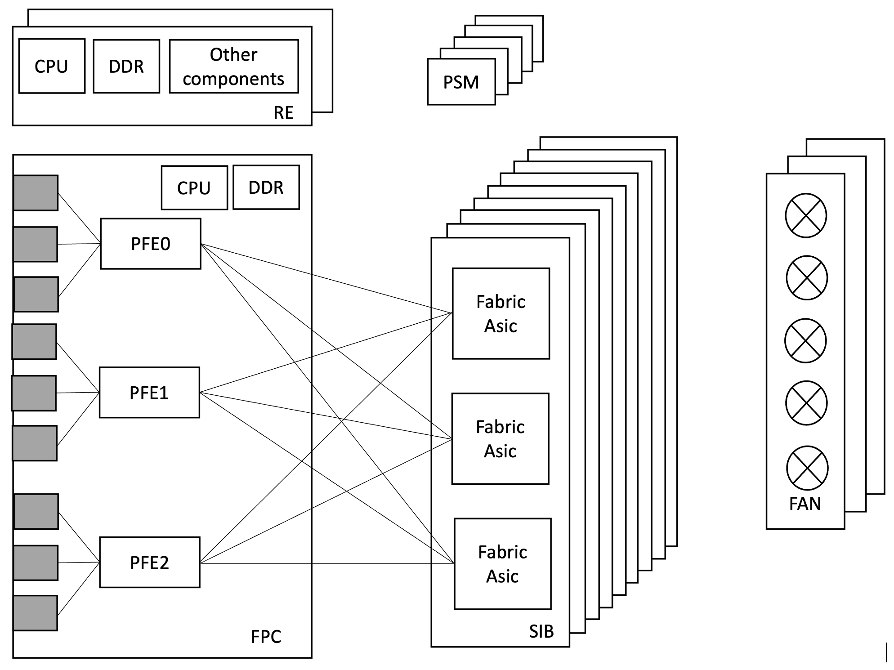
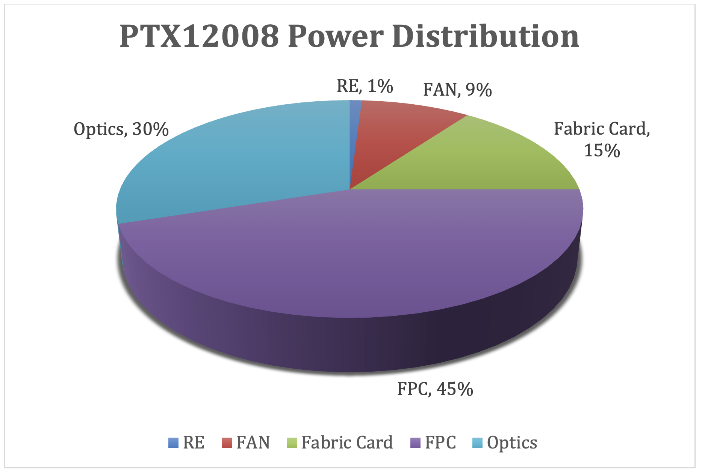
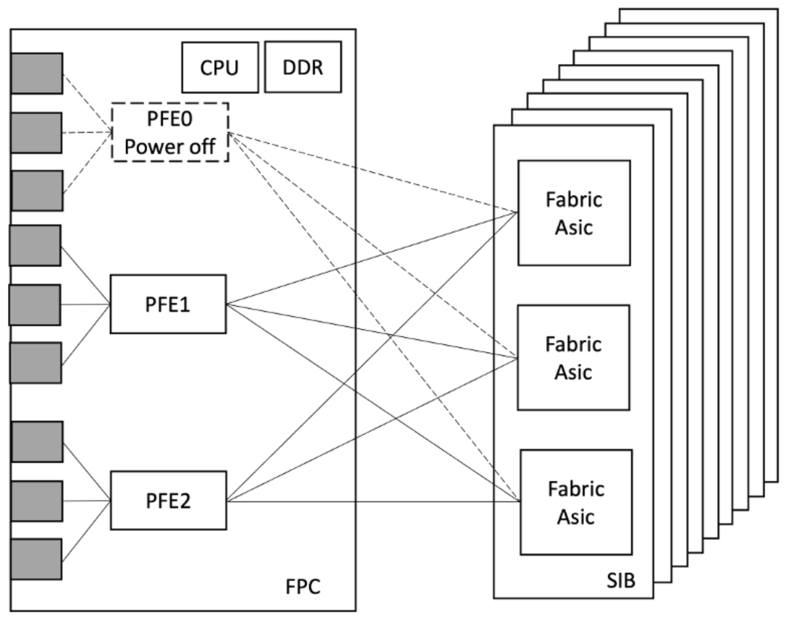
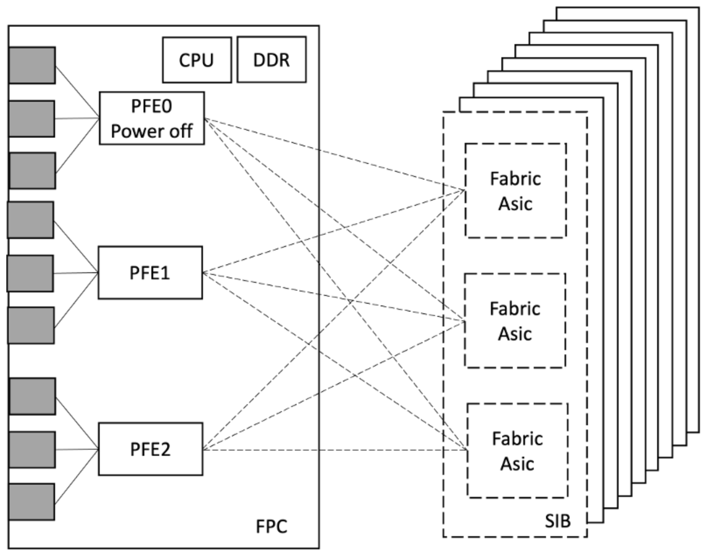
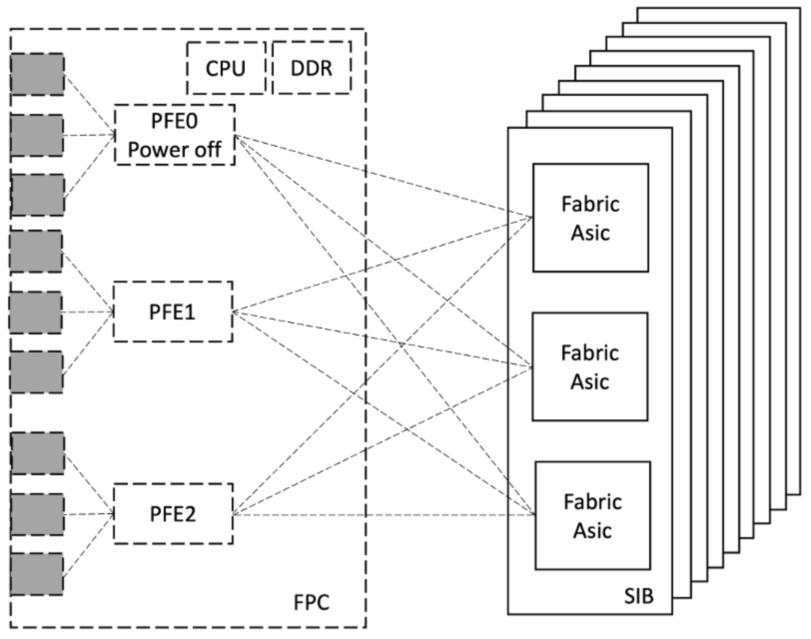

# PTX12008 Power Distribution and Optimization

**Gurmeet Singh - 05/18/2026**

Learn how the PTX12008 optimizes power consumption through automatic and operator-controlled mechanisms such as adaptive fan management, unused port shutdown, selective PFE offlining, MACsec clock gating, and dynamic fabric or line card power control to improve energy efficiency in high-capacity networks.

## Introduction

The PTX12008 is a 8-slot modular chassis running Junos-EVO. It inherits the of power optimization/efficiency features introduced and validated on the Junos-EVO.

Power efficiency is increasingly important as network capacity is growing. The EVO platform integrates granular power control at every level of the forwarding pipeline from individual port SerDes to entire line cards so operators can match power draw to actual traffic demand without sacrificing availability.

Key principles:

1. Many optimizations are enabled by default and require no configuration.
2. Operator-driven optimizations allow further tuning for specific deployments.
3. PFE-level granularity in optimizations helps minimal blast radius.
4. All power-off operations on FRUs i.e. Fabric card/Line card/PFE can be applied/reversed without system reboot.

## Power Consumers

The PTX12008 is a modular system. At high level, the major power consumers are Line cards, Optics, Fabric Cards, Cooling Fans and Routing Engines.



Here is power distribution across these components assuming each optics consumes 30W power (Typical 800G ZR optics power consumption)



Factors that increase power consumption:

- Higher ambient temperature (fans speed up to cool down system)
- Higher elevation
- More number of optics inserted
- High power optics i.e. ZR HP
- Higher traffic load in bps and pps
- Using MACsec on Wan Ports
- Fully populated FPC slots

Factors that decrease power consumption:

- Empty port slots (SerDes auto-shutdown)
- Ports configured "unused"
- PFEs powered off when not needed
- Fabric card/Line card offline in empty or temporarily unused slots
- Low traffic periods (PFE and fabric SerDes run at lower utilization)

## Power Saving Features in PTX12008

## Environment Management Policy - Controlling FAN speed to save Power

The Environmental Monitoring (EM) Policy is a built-in subsystem that continuously monitors thermal sensors distributed throughout the PTX12008 chassis and dynamically adjusts fan speed in real time. Because Fans are significant power consumers running them only as fast as thermals require is one of the most effective automatic power saving mechanisms in the platform.

How EM Policy Works:

1. Thermal sensors are placed at key locations inside the chassis: Line card inlet/exhaust, Fabric card, RE, CB, PSM, and fan tray zones.
2. The EM Policy daemon collects sensor readings at regular intervals and computes the required airflow.
3. Fan speed is set to the minimum level that keeps all components within their thermal operating limits.
4. As temperature rises due to higher ambient, more traffic load or more optics active, the EM Policy incrementally increases fan speed.
5. As temperature falls due to lower ambient, PFEs/optics powered off or traffic drops, fan speed is reduced automatically to save power.
6. This feedback loop runs continuously without any operator intervention.

As per EM Policy, FANs runs at minimum speed required to keep system thermal within limits helps to save significant power.
Here is an example that shows the difference in power consumption when the Fan runs at ~60% vs. 100%.

```
root@ptx12008> show chassis fan
      Item                      Status   % RPM     Measurement
      Fan Tray 0 Fan 0          OK       56%       5700 RPM
      Fan Tray 0 Fan 1          OK       62%       7200 RPM
      Fan Tray 0 Fan 2          OK       55%       5550 RPM
      Fan Tray 0 Fan 3          OK       62%       7200 RPM
      Fan Tray 0 Fan 4          OK       55%       5550 RPM
      Fan Tray 0 Fan 5          OK       63%       7350 RPM
      Fan Tray 0 Fan 6          OK       55%       5550 RPM
      Fan Tray 0 Fan 7          OK       62%       7200 RPM
      Fan Tray 0 Fan 8          OK       55%       5550 RPM
      Fan Tray 0 Fan 9          OK       62%       7200 RPM
      Fan Tray 1 Fan 0          OK       56%       5700 RPM
      Fan Tray 1 Fan 1          OK       62%       7200 RPM
      Fan Tray 1 Fan 2          OK       56%       5700 RPM
      Fan Tray 1 Fan 3          OK       62%       7200 RPM
      Fan Tray 1 Fan 4          OK       56%       5700 RPM
      Fan Tray 1 Fan 5          OK       62%       7200 RPM
      Fan Tray 1 Fan 6          OK       55%       5550 RPM
      Fan Tray 1 Fan 7          OK       62%       7200 RPM
      Fan Tray 1 Fan 8          OK       56%       5700 RPM
      Fan Tray 1 Fan 9          OK       61%       7050 RPM
      Fan Tray 2 Fan 0          OK       56%       5700 RPM
      Fan Tray 2 Fan 1          OK       62%       7200 RPM
      Fan Tray 2 Fan 2          OK       55%       5550 RPM
      Fan Tray 2 Fan 3          OK       62%       7200 RPM
      Fan Tray 2 Fan 4          OK       56%       5700 RPM
      Fan Tray 2 Fan 5          OK       61%       7050 RPM
      Fan Tray 2 Fan 6          OK       55%       5550 RPM
      Fan Tray 2 Fan 7          OK       62%       7200 RPM
      Fan Tray 2 Fan 8          OK       56%       5700 RPM
      Fan Tray 2 Fan 9          OK       62%       7200 RPM

root@ptx12008> show chassis power detail | match FAN
  Fan Tray 0            269
  Fan Tray 1            254
  Fan Tray 2            265 
```

When Fan runs at ~60%, Fan trays consume a total of ~788 watts.

```
root@ptx12008> show chassis fan
      Item                      Status   % RPM     Measurement
      Fan Tray 0 Fan 0          OK       100%      10200 RPM
      Fan Tray 0 Fan 1          OK       100%      11700 RPM
      Fan Tray 0 Fan 2          OK       100%      10200 RPM
      Fan Tray 0 Fan 3          OK       100%      11700 RPM
      Fan Tray 0 Fan 4          OK       100%      10200 RPM
      Fan Tray 0 Fan 5          OK       100%      11700 RPM
      Fan Tray 0 Fan 6          OK       100%      10050 RPM
      Fan Tray 0 Fan 7          OK       100%      11700 RPM
      Fan Tray 0 Fan 8          OK       100%      10050 RPM
      Fan Tray 0 Fan 9          OK       100%      11700 RPM
      Fan Tray 1 Fan 0          OK       100%      10200 RPM
      Fan Tray 1 Fan 1          OK       100%      11700 RPM
      Fan Tray 1 Fan 2          OK       100%      10200 RPM
      Fan Tray 1 Fan 3          OK       100%      11700 RPM
      Fan Tray 1 Fan 4          OK       100%      10050 RPM
      Fan Tray 1 Fan 5          OK       100%      11700 RPM
      Fan Tray 1 Fan 6          OK       100%      10200 RPM
      Fan Tray 1 Fan 7          OK       100%      11550 RPM
      Fan Tray 1 Fan 8          OK       100%      10050 RPM
      Fan Tray 1 Fan 9          OK       100%      11550 RPM
      Fan Tray 2 Fan 0          OK       100%      10050 RPM
      Fan Tray 2 Fan 1          OK       100%      11700 RPM
      Fan Tray 2 Fan 2          OK       100%      10200 RPM
      Fan Tray 2 Fan 3          OK       100%      11700 RPM
      Fan Tray 2 Fan 4          OK       100%      10200 RPM
      Fan Tray 2 Fan 5          OK       100%      11700 RPM
      Fan Tray 2 Fan 6          OK       100%      10200 RPM
      Fan Tray 2 Fan 7          OK       100%      11550 RPM
      Fan Tray 2 Fan 8          OK       100%      10200 RPM
      Fan Tray 2 Fan 9          OK       100%      11550 RPM

root@ptx12008> show chassis power detail | match FAN
  Fan Tray 0           1363
  Fan Tray 1           1343
  Fan Tray 2           1375
```

When Fan runs at ~100%, Fan trays consume a total of ~4,081watts.

This example shows how running Fan as least as required helps to save system power significantly.

## Wan Ports "unused" Configuration

A port populated with a transceiver but not in service can be disabled via the "unused" keyword. This shuts down the forwarding path of the transceiver and help to save power. This "unused" configuration removes the interface from all "show interfaces" output, but optic module remains powered for inventory/monitoring purposes.

Here is an example that shows the power saving by marking ports "unused".

```
root@ptx12008> show chassis hardware
Hardware inventory:
Item             Version  Part number  Serial number     Description
Chassis                                EX352             PTX12008
Midplane 0       REV 05   750-127042   BCCG6098          Unsupported
PSM 2            Rev 01   740-129297   1F31B290037       3000W AC AFI Power Supply
PSM 3            Rev 01   740-129297   1F31B330071       3000W AC AFI Power Supply
PSM 12           Rev 01   740-129297   1F31B290047       3000W AC AFI Power Supply
PSM 13           REV 01   740-129297   1F31B480109       3000W AC AFI Power Supply
PSM 15           REV 01   740-129297   1F31B480061       3000W AC AFI Power Supply
PSM 16           Rev 01   740-129297   1F31B330010       3000W AC AFI Power Supply
PSM 17           Rev 01   740-129297   1F31B330167       3000W AC AFI Power Supply
PSM 18           Rev 01   740-129297   1F31B330106       3000W AC AFI Power Supply
Routing Engine 0          BUILTIN      BUILTIN           PTX12K-RE
Routing Engine 1          BUILTIN      BUILTIN           PTX12K-RE
CB 0             REV 06   750-173945   BCFS1409          Control Board
CB 1             REV 06   750-173945   BCFS1414          Control Board
FPC 0            REV 16   750-173325   BCFY9869          PTX12K-LC54QDD
  CPU            REV 04   750-173947   BCFW4413          PTX12K-LC54 PMB Board
  PIC 0                   BUILTIN      BUILTIN           PTX12K-54QDD800-LC-PIC
    Xcvr 0       REV 21   750-152172   ZP3924440660      QSFP-DD800-ACTIVE-E-LPBK
    Xcvr 1       REV 21   750-152172   ZP3924440684      QSFP-DD800-ACTIVE-E-LPBK
    Xcvr 2       REV 21   750-152172   ZP3924380165      QSFP-DD800-ACTIVE-E-LPBK
    Xcvr 20      REV 21   750-152172   ZP3924440662      QSFP-DD800-ACTIVE-E-LPBK
    Xcvr 21      REV 21   750-152172   ZP3924440689      QSFP-DD800-ACTIVE-E-LPBK
    Xcvr 35      REV 21   750-152172   ZP3924380226      QSFP-DD800-ACTIVE-E-LPBK
    Xcvr 52      REV 21   750-152172   ZP3924380225      QSFP-DD800-ACTIVE-E-LPBK
    Xcvr 53      REV 21   750-152172   ZP3924440363      QSFP-DD800-ACTIVE-E-LPBK
  MEZZ 0         REV 04   750-175158   BCFV8081          PTX12K-LC54QDD MEZZ A Board
  MEZZ 1         REV 03   750-175159   BCFV9118          PTX12K-LC54QDD MEZZ B Board
  MEZZ 2         REV 04   750-175033   BCFW6350          PTX12K-LC54 Power Board Right
  MEZZ 3         REV 05   750-175031   BCFY9285          PTX12K-LC54 Power Board Left
SIB 0            REV 09   750-173308   BCER8121          SIB-PTX12008-SF
  MEZZ 0         REV 03   750-176911   BCFZ3105          SIB-PTX12008-SF Power Board
Fan Tray 0       REV 13   750-127041   BCCM0708          PTX12008 Fan tray
Fan Tray 1       REV 08   750-127041   BCCG8484          PTX12008 Fan tray
Fan Tray 2       REV 08   750-127041   BCCG8481          PTX12008 Fan tray
POWERSHELF 0              BUILTIN      BUILTIN           5 Row PSM POWERSHELF

root@ptx12008> show interfaces terse et-0/0/0
Interface               Admin Link Proto    Local                 Remote
et-0/0/0                up    up
et-0/0/0.16386          up    up   multiservice

root@ptx12008> show interfaces terse et-0/0/1
Interface               Admin Link Proto    Local                 Remote
et-0/0/1                up    up
et-0/0/1.16386          up    up   multiservice

{master}
root@ptx12008> show interfaces terse et-0/0/2
Interface               Admin Link Proto    Local                 Remote
et-0/0/2                up    up
et-0/0/2.16386          up    up   multiservice

root@ptx12008> show chassis power detail | match FPC
  FPC 0                1234

root@ptx12008# set interfaces et-0/0/0 unused

root@ptx12008# set interfaces et-0/0/1 unused

root@ptx12008# set interfaces et-0/0/2 unused

root@ptx12008# commit
re0:
configuration check succeeds
re1:
configuration check succeeds
commit complete
re0:
commit complete

root@ptx12008> show chassis hardware
Hardware inventory:
Item             Version  Part number  Serial number     Description
Chassis                                EX352             PTX12008
Midplane 0       REV 05   750-127042   BCCG6098          Unsupported
PSM 2            Rev 01   740-129297   1F31B290037       3000W AC AFI Power Supply
PSM 3            Rev 01   740-129297   1F31B330071       3000W AC AFI Power Supply
PSM 12           Rev 01   740-129297   1F31B290047       3000W AC AFI Power Supply
PSM 13           REV 01   740-129297   1F31B480109       3000W AC AFI Power Supply
PSM 15           REV 01   740-129297   1F31B480061       3000W AC AFI Power Supply
PSM 16           Rev 01   740-129297   1F31B330010       3000W AC AFI Power Supply
PSM 17           Rev 01   740-129297   1F31B330167       3000W AC AFI Power Supply
PSM 18           Rev 01   740-129297   1F31B330106       3000W AC AFI Power Supply
Routing Engine 0          BUILTIN      BUILTIN           PTX12K-RE
Routing Engine 1          BUILTIN      BUILTIN           PTX12K-RE
CB 0             REV 06   750-173945   BCFS1409          Control Board
CB 1             REV 06   750-173945   BCFS1414          Control Board
FPC 0            REV 16   750-173325   BCFY9869          PTX12K-LC54QDD
  CPU            REV 04   750-173947   BCFW4413          PTX12K-LC54 PMB Board
  PIC 0                   BUILTIN      BUILTIN           PTX12K-54QDD800-LC-PIC
    Xcvr 0       REV 21   750-152172   ZP3924440660      QSFP-DD800-ACTIVE-E-LPBK
    Xcvr 1       REV 21   750-152172   ZP3924440684      QSFP-DD800-ACTIVE-E-LPBK
    Xcvr 2       REV 21   750-152172   ZP3924380165      QSFP-DD800-ACTIVE-E-LPBK
    Xcvr 20      REV 21   750-152172   ZP3924440662      QSFP-DD800-ACTIVE-E-LPBK
    Xcvr 21      REV 21   750-152172   ZP3924440689      QSFP-DD800-ACTIVE-E-LPBK
    Xcvr 35      REV 21   750-152172   ZP3924380226      QSFP-DD800-ACTIVE-E-LPBK
    Xcvr 52      REV 21   750-152172   ZP3924380225      QSFP-DD800-ACTIVE-E-LPBK
    Xcvr 53      REV 21   750-152172   ZP3924440363      QSFP-DD800-ACTIVE-E-LPBK
  MEZZ 0         REV 04   750-175158   BCFV8081          PTX12K-LC54QDD MEZZ A Board
  MEZZ 1         REV 03   750-175159   BCFV9118          PTX12K-LC54QDD MEZZ B Board
  MEZZ 2         REV 04   750-175033   BCFW6350          PTX12K-LC54 Power Board Right
  MEZZ 3         REV 05   750-175031   BCFY9285          PTX12K-LC54 Power Board Left
SIB 0            REV 09   750-173308   BCER8121          SIB-PTX12008-SF
  MEZZ 0         REV 03   750-176911   BCFZ3105          SIB-PTX12008-SF Power Board
Fan Tray 0       REV 13   750-127041   BCCM0708          PTX12008 Fan tray
Fan Tray 1       REV 08   750-127041   BCCG8484          PTX12008 Fan tray
Fan Tray 2       REV 08   750-127041   BCCG8481          PTX12008 Fan tray
POWERSHELF 0              BUILTIN      BUILTIN           5 Row PSM POWERSHELF

root@ptx12008> show interfaces terse et-0/0/0
error: device et-0/0/0 not found

root@ptx12008> show interfaces terse et-0/0/1
error: device et-0/0/1 not found

root@ptx12008> show interfaces terse et-0/0/2
error: device et-0/0/2 not found

root@ptx12008> show chassis power detail | match FPC
  FPC 0                1179
```

By marking 3 ports as unused, Line card consumed power came down from 1234 to 1179 watts.

This behavior is reversible with "delete interface et-x/y/z unused" and it just takes a few seconds to restore the port in its original state, without any impact on the other ports of the system.

## Selective PFE Power off

Each PFE (Packet Forwarding Engine ASIC) on an Line card can be powered off independently without affecting other PFEs on the same Line card or in the system. This is one of the most impactful power-saving features available to operators.

Use cases:

- Pay-As-You-Grow: Only the PFEs needed for current port count are powered on. Unused PFEs remain off until capacity is expanded.
- Off-peak scheduling: Power off idle PFEs during low-traffic window (e.g., nights/weekends). Use traffic engineering to keep traffic away from those PFEs before powering down.

PFE Power off help to save Line card power by turning off PFE completely. Also, it helps save power consumed by Fabric Cards by turning off Fabric serdes that map to the offlining PFE.



Here is an example that displays power saving with PFE Power off

```
root@ptx12008> show chassis fpc 0 pfe-instance all

FPC 0
PFE-Instance    PFE          PFE-State
0               0            ONLINE
0               1            ONLINE
1               2            ONLINE
1               3            ONLINE
2               4            ONLINE
2               5            ONLINE

root@ptx12008> show chassis power detail | match FPC
  FPC 0                2620
  FPC 1                2102
  FPC 2                2723
  FPC 3                1943
  FPC 4                2061
  FPC 5                1462
  FPC 6                2043
  FPC 7                2321

root@ptx12008> show chassis power detail | match SIB
  SIB 0                 609
  SIB 1                 609
  SIB 2                 620
  SIB 3                 613
  SIB 4                 627
  SIB 5                 622
  SIB 6                 613
  SIB 7                 614
  SIB 8                 613

root@ptx12008> request chassis fpc slot 0 pfe-instance 0 offline
Fru Block offline initiated!

root@ptx12008> show chassis fpc 0 pfe-instance all

FPC 0
PFE-Instance    PFE          PFE-State
0               0            Offlined by CLI
0               1            Offlined by CLI
1               2            ONLINE
1               3            ONLINE
2               4            ONLINE
2               5            ONLINE

root@ptx12008> show chassis power detail | match FPC
  FPC 0                1859
  FPC 1                2097
  FPC 2                2724
  FPC 3                1935
  FPC 4                2064
  FPC 5                1460
  FPC 6                2042
  FPC 7                2325

root@ptx12008>

root@ptx12008> show chassis power detail | match SIB
  SIB 0                 577
  SIB 1                 572
  SIB 2                 588
  SIB 3                 581
  SIB 4                 594
  SIB 5                 590
  SIB 6                 580
  SIB 7                 582
  SIB 8                 579
```

Above example clearly shows that PFE Power off not just bring down Line card power consumption significantly but also helps to save power consumed by Fabric cards by turning off Fabric card side serdes'es that are mating with PFE.

More Details on saving power using PFE power of can be found on following TechPost article

[https://juniper.github.io/techposts/saving-energy-on-ptx-with-pfe-power-off/article](https://juniper.github.io/techposts/saving-energy-on-ptx-with-pfe-power-off/article)

## MACSEC Block Clock Gating

MACsec encryption/decryption Security block resides inside the forwarding ASIC. It operates on a per-Port-Group (PG) basis. Each forwarding ASIC has 9 Port Groups.

When no port in a Port Group has MACsec configured, the MACsec block for that Port Group is automatically disabled and doesn't consume power.

- Automatic. No configuration needed to save power.
- MACsec is activated only when explicitly configured on a port:

```
set security macsec interfaces et-X/Y/Z
```

- This is fully automatic and reversible: adding or removing MACsec configuration enables or disables the block transparently.

## Fabric Card Power Off

The PTX12008 fabric card consists of multiple Switch Asics  and the associated Fabric SerDes that form the full-mesh interconnect between all PFEs in the chassis.

An entire Fabric card can be taken offline. This is appropriate when:

- Reducing fabric power during sustained low-traffic periods when full fabric bandwidth is not required.
- Partial optic population per PFE: If fewer than the maximum number of optics are inserted per PFE, the fabric bandwidth requirement is proportionally lower and one or more SIBs can be kept offline. Example- If 8 out of 9 optics are inserted on all PFEs for PTX12008, the Fabric card does not need to carry full line-rate. 1 SIB can be kept offline without oversubscribing the remaining fabric.
- Lower bandwidth optics on WAN ports: If operators install lower-speed optics instead of the maximum supported rate, the aggregate bandwidth injected into the fabric is reduced, allowing some Fabric cards to be kept offline. Example - If 400G optics are installed on all PTX12008 Line card ports, the total fabric demand is halved.  4 Fabric cards can be offlined while the remaining SIBs carry the full traffic load without oversubscription.
- Scheduled Fabric card maintenance or replacement.

On Fabric Card offline, all Fabric Asics and serdes'es on Fabric card go to zero power. Along with this, Line card fabric serdes which are mating to the offlined fabric card, are also brought down and helps to save power on Line card as well.



Here is an example that displays power saving with Fabric Card Power off

```
root@ptx12008> show chassis sibs
Slot  State         Fabric links        Errors
 0    Online             Active         None
 1    Online             Active         None
 2    Online             Active         None
 3    Online             Active         None
 4    Online             Active         None
 5    Online             Active         None
 6    Online             Active         None
 7    Online             Active         None
 8    Online             Active         None

root@ptx12008> show chassis power detail | match SIB
  SIB 0                 609
  SIB 1                 611
  SIB 2                 621
  SIB 3                 613
  SIB 4                 627
  SIB 5                 622
  SIB 6                 613
  SIB 7                 614
  SIB 8                 612

root@ptx12008> show chassis power detail | match FPC
  FPC 0                2619
  FPC 1                2099
  FPC 2                2723
  FPC 3                1942
  FPC 4                2065
  FPC 5                1460
  FPC 6                2036
  FPC 7                2326

root@ptx12008> request chassis sib slot 0 offline
Offline initiated, use "show chassis sibs" to verify

root@ptx12008> show chassis sibs
Slot  State         Fabric links        Errors
 0    Offline            Unused         None
 1    Online             Active         None
 2    Online             Active         None
 3    Online             Active         None
 4    Online             Active         None
 5    Online             Active         None
 6    Online             Active         None
 7    Online             Active         None
 8    Online             Active         None

root@ptx12008> show chassis power detail | match SIB
  SIB 0                   0
  SIB 1                 606
  SIB 2                 621
  SIB 3                 613
  SIB 4                 626
  SIB 5                 622
  SIB 6                 613
  SIB 7                 613
  SIB 8                 612

root@ptx12008> show chassis power detail | match FPC
  FPC 0                2497
  FPC 1                1965
  FPC 2                2603
  FPC 3                1814
  FPC 4                1931
  FPC 5                1371
  FPC 6                1908
  FPC 7                2186
```

Above example clearly shows that Fabric card Power off not just bring down Fabric card power consumption to 0 but also helps to save power consumed by Line cards by turning off Line card side serdes'es that are mating with the offlined Fabric card.

## Line Card Power Off

An entire Line card can be taken offline. This is appropriate when:

- Planning maintenance on a line card.
- Decommissioning capacity.

All PFEs, SerDes, PHYs and optics on the card go to zero power. Along with this, Fabric card serdes'es which are mating to the offlined Line card, are also brought down and it helps to save power on Fabric card as well.



Here is an example that displays power saving with Fabric Card Power off

```
root@ptx12008> show chassis fpc
                     Temp  CPU Utilization (%)   CPU Utilization (%)  Memory    Utilization (%)
Slot State            (C)  Total  Interrupt      1min   5min   15min  DRAM (MB) Heap     Buffer
  0  Online            48      5          0        5      5      5    65536      16          0
  1  Online            39      4          0        4      4      4    65536      15          0
  2  Online            45      4          0        4      4      4    65536      15          0
  3  Online            38      4          0        4      4      4    65536      15          0
  4  Online            40      4          0        4      4      4    65536      15          0
  5  Online            36      4          0        4      4      4    65536      15          0
  6  Online            36      4          0        4      4      4    65536      15          0
  7  Online            42      4          0        4      4      4    65536      15          0

root@ptx12008> show chassis power detail | match SIB
  SIB 0                 609
  SIB 1                 604
  SIB 2                 621
  SIB 3                 613
  SIB 4                 626
  SIB 5                 622
  SIB 6                 613
  SIB 7                 613
  SIB 8                 612

root@ptx12008> show chassis power detail | match FPC
  FPC 0                2618
  FPC 1                2097
  FPC 2                2727
  FPC 3                1938
  FPC 4                2055
  FPC 5                1459
  FPC 6                2034
  FPC 7                2321

root@ptx12008> request chassis fpc slot 0 offline
Offline initiated, use "show chassis fpc" to verify

{master}
root@ptx12008> show chassis fpc
                     Temp  CPU Utilization (%)   CPU Utilization (%)  Memory    Utilization (%)
Slot State            (C)  Total  Interrupt      1min   5min   15min  DRAM (MB) Heap     Buffer
  0  Offline         ---Offlined by cli command---
  1  Online            39      4          0        4      4      4    65536      15          0
  2  Online            45      4          0        4      4      4    65536      15          0
  3  Online            38      4          0        4      4      4    65536      15          0
  4  Online            40      4          0        4      4      4    65536      15          0
  5  Online            36      4          0        4      4      4    65536      15          0
  6  Online            36      4          0        4      4      4    65536      15          0
  7  Online            42      4          0        4      4      4    65536      15          0

root@ptx12008> show chassis power detail | match SIB
  SIB 0                 514
  SIB 1                 513
  SIB 2                 524
  SIB 3                 518
  SIB 4                 530
  SIB 5                 527
  SIB 6                 517
  SIB 7                 520
  SIB 8                 518

root@ptx12008> show chassis power detail | match FPC
  FPC 0                   0
  FPC 1                2103
  FPC 2                2728
  FPC 3                1941
  FPC 4                2060
  FPC 5                1459
  FPC 6                2042
  FPC 7                2317
```

Above example clearly shows that Line card Power off not just bring down Line card power consumption to 0 but also helps to save power consumed by Fabric cards by turning off Fabric card fabric serdes'es that are mating with the offlined Line card.

## Conclusion

The PTX12008 demonstrates that significant power savings can be achieved without compromising availability. The platform's layered approach, combining automatic mechanisms like Environmental Monitoring-driven fan control with operator-driven controls like Fabric Card/Line Card/PFE power-off, gives network operators fine-grained flexibility to match power draw to actual traffic demand. Cascading SerDes shutdown between Line cards and Fabric cards (and vice versa) ensures power savings propagate across the system rather than being isolated to a single component. Together, these capabilities make the PTX12008 a power-efficient platform well-suited for modern high-capacity networks where energy optimization is as critical requirement.

## Useful links

- Power saving using power off: [https://juniper.github.io/techposts/saving-energy-on-ptx-with-pfe-power-off/article](https://juniper.github.io/techposts/saving-energy-on-ptx-with-pfe-power-off/article)
- TX10000 Power optimization: [https://juniper.github.io/techposts/ptx10000-power-optimization/article](https://juniper.github.io/techposts/ptx10000-power-optimization/article)

## Glossary

- ASIC: Application Specific Integrated Circuit
- CPU: Central Processing Unit
- DDR: Double Data Rate
- EM: Environmental Monitoring
- FPC: Flexible PIC Concentrator
- IFD: Physical Interface
- PFE: Packet Forwarding Engine
- PG: Port Group
- PM: Power Management
- PSM: Power Supply Module
- SerDes: Serializer/Deserialiazer
- SIB: Switch Interface Board
- WAN: Wide Area Network
