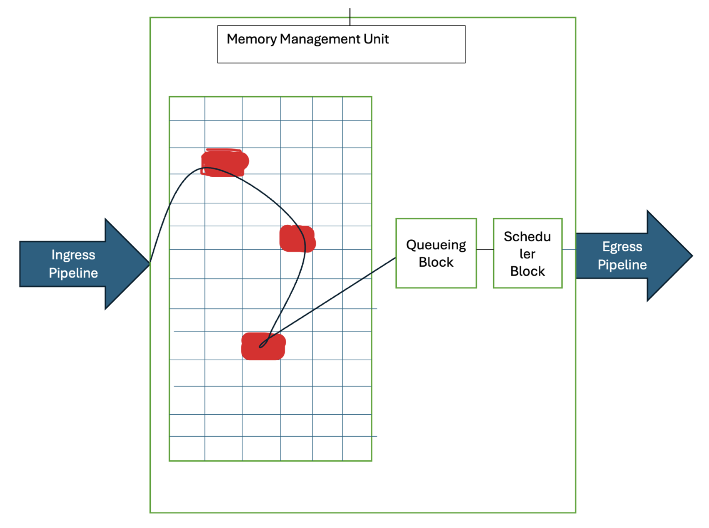
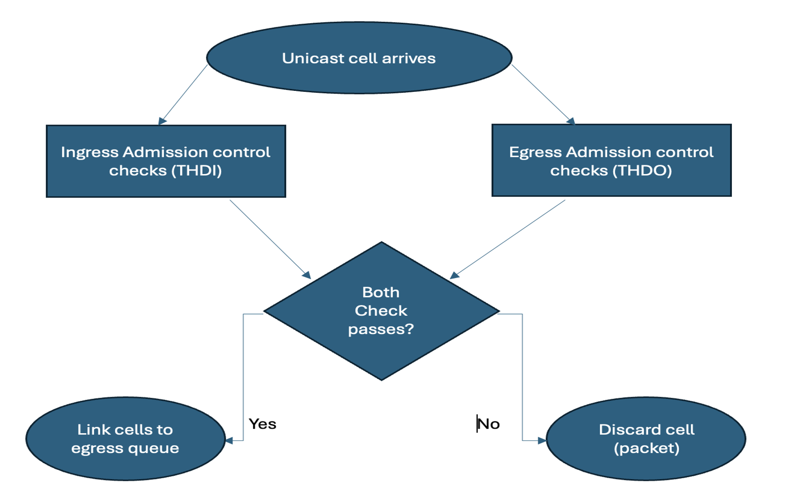
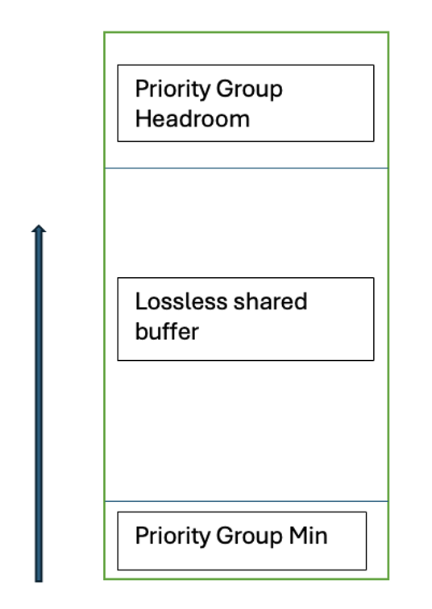
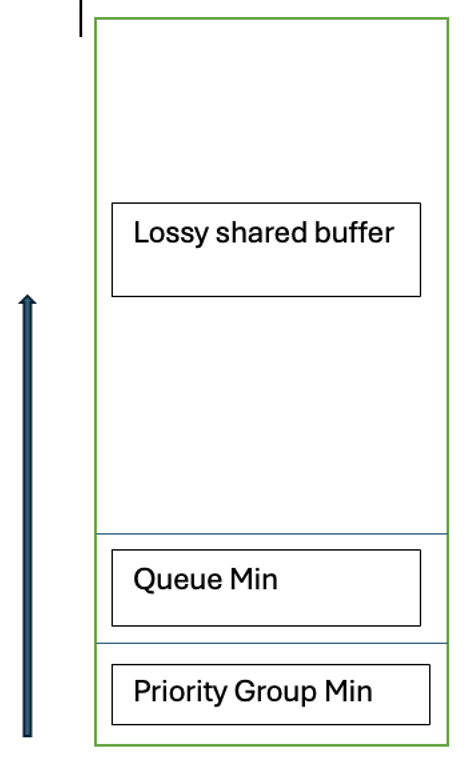
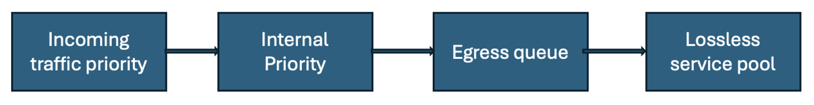

# QFX5K-Series Switches Packet Buffer Architecture

**Parthipan Ts - 04/25/2025**

Packet Buffer Architecture on QFX5K-Series switches and various buffer tuning options available on these platforms to maximize the traffic burst absorption.

## Overview

On QFX5K platforms all packets that enter the ingress pipeline will be stored at central MMU packet buffers before it egress. Packet buffers are required for burst absorption, packet replication, and multiple other use cases. Without packet buffers, bursty traffic will get tail-dropped and lead to poor network performance.  An excess burst might be received on the egress port under the below scenarios.

- Multiple ingress ports send traffic to a single egress port.
- Traffic from high-speed ingress ports to low-speed egress ports.

Packet buffers are also essential for implementing various congestion management applications like Priority flow control (PFC), Explicit congestion notification (ECN), and WRED.

QFX5K Data Centre switches have shallow on-chip buffers. These switches use Broadcom's Trident and Tomahawk series ASIC. This shallow on-chip buffer provides low-latency packet forwarding. Managing this limited packet buffer among different congested queues and providing fair buffer access is very important. This document explains QFX5K buffer architecture in detail.

## Packet Buffers

On QFX5K platforms, the chip buffers are measured/allocated in the units of cells.
Cell size varies in different platforms (refer to the below table). Packets are stored in multiple cells based on their size. The first cell will store 64 bytes of packet meta-data (except QFX5220 where meta-data is only 40 bytes) and the remaining space used to store the actual packet. Subsequent cells are only used to store packet data.

| Platforms | Cell size (Bytes) |
|:--|:--|
| QFX5100, QFX5110, QFX5200, QFX5210 | 208 |
| QFX5120 | 256 |
| QFX5220, QFX5130-32CD, QFX5700, QFX5230, QFX5240 | 254 |
| QFX5130-48C | 318 |

Packets from the ingress ports are placed in MMU buffer before it is scheduled by the egress port. With no congestion on egress queues, these packets will be dequeued from MMU as soon as they arrive. At max ~3KB buffer utilization will be seen per port based on the port load. In case of congestion, packets continue to be placed in MMU buffers until buffers are exhausted.



## Concept of Ingress and Egress Buffers

Buffer memory has separate ingress and egress accounting to make accept, drop, or pause decisions. Because the switch has a single pool of memory with separate ingress and egress accounting, the full amount of buffer memory is available from both the ingress and the egress perspective. Packets are accounted for as they enter and leave the switch, but there is no concept of a packet arriving at an ingress buffer and then being moved to an egress buffer.

The MMU tracks all the cells' utilization from multiple perspectives to support multiple buffering goals.  These goals typically include things like asserting flow control to avoid packet loss, tail dropping when a resource becomes congested, or randomly dropping to allow stateful protocols to degrade gracefully. Here, multiple perspectives mainly mean from the ingress and egress perspective.  This is also called ingress admission control and egress admission control.

Buffers are accounted for by both ingress admission control and egress admission control against different entities like Priority Group (ingress), Queue (egress), Service Pool, and Port.  All these entities have static and dynamic thresholds for Buffer utilization. Once any of the ingress or egress buffer thresholds is reached, packets are dropped. Packets are stored till the threshold will egress out.

The desired property for lossy traffic is tail drops on egress queues during congestion. Because ingress drops will cause head-of-line blocking, which will impact other uncongested ports too. When the switch operates in store-on-forward mode, and if you don't configure ingress and egress buffer thresholds properly, it will not be possible to control where the packet drops should occur (ingress or egress). Here by configuring an egress buffer threshold lesser than the ingress buffer threshold for lossy traffic, we ensure drops happen at egress.



## Dedicated and Shared Buffers

Buffers are divided into two primary parts from both  ingress and egress perspectives:

- "Shared buffers" are a global memory pool the switch allocates dynamically to ports as needed, so the buffers are shared among the switch ports.  Between 80 to 85% of total buffers are allocated to shared buffers based on the platform. The Shared buffers are themselves internally divided among different service pools.
- "Dedicated buffers" are a memory pool divided equally among the switch ports. Each port receives a minimum guaranteed amount of buffer space, dedicated to each port, (from 15 to 20 % of total buffers, based on platform)

Dedicated buffers are statically allocated based on port speed (higher speed = more buffers). Dedicated buffers are allocated even when the port is down. During congestion, dedicated buffers are utilized first. Once the dedicated buffers are exhausted, the congested ports will start utilizing the dynamic Shared buffer.  Port-level dedicated buffers are divided among queues based on the egress scheduler "buffer-size" configuration. When per-queue level dedicated buffer is calculated based on the scheduler "buffer-size" configuration, any fractional dedicated buffer value is rounded off to the closest lower full integer, and programmed in hardware to avoid over-allocation.  Any unused port dedicated buffers after allocating dedicated buffers to all configured queues will be allocated to the first configured queue.

Using configurations, default dedicated and shared pool size can be decreased. When the default dedicated pool size is reduced, a reduced amount of buffer gets added to the shared pool. Similarly, when the shared pool size is reduced, freed-up buffer gets added to the dedicated pool.

Dedicated buffers can be flexibly allocated to individual ports through a dedicated buffer profile configuration. This helps to increase the dedicated buffers for certain ports where more traffic bursts are expected, compared to other ports. This also helps to allocate 0 dedicated buffers for ports that are down or unused.

When a single queue is congested, it can use all its dedicated buffers + 50% of the shared buffer allocated for the corresponding service pool for which the queue is mapped. The remaining 50% is reserved for other queues.  If two queues are congested, each queue can use its dedicated buffers + 33% of the shared buffer.

Example -- Let's consider a QFX5120 switch with 32MB packet buffers (27MB shared + 5MB dedicated).  Let's assume all 27MB shared buffers are allocated to the lossy service pool. A single congested lossy queue on a 25G interface can use 52 KB of dedicated buffer + 13.5 MB of shared buffer (buffering time of 542 microseconds).

The maximum shared buffer utilization by a congested priority group (on ingress) or queue (on egress) is controlled by dynamic Alpha value. The Alpha value is used to ensure fairness among the competing entities for shared buffers. The maximum number of cells that can be utilized from a shared pool by a congested PG/Queue is calculated as below:

```
Peak shared buffer = (shared pool size * Alpha) / (1 + (Alpha * number of competing queues))
```

Default Alpha values:

- Ingress lossy Alpha: 10
- Egress lossy Alpha: 7
- Ingress lossless Alpha: 7
- Egress lossless Alpha: 10

SW Alpha ARE mapped to HW Alpha:

| SW Alpha | HW Alpha |
|:--|:--|
| 0 | 1/128 |
| 1 | 1/64 |
| 2 | 1/32 |
| 3 | 1/16 |
| 4 | 1/8 |
| 5 | 1/4 |
| 6 | 1/2 |
| 7 | 1 |
| 8 | 2 |
| 9 | 4 |
| 10 | 8 |

Example: Max shared buffer for a lossy queue, with Alpha 9 (all 100% shared buffer given to lossy):

```
max = (27 MB * 4) / (1 + (4*1)) = 21.6 MB
```





## Trade-off Between Shared and Dedicated Buffer

The trade-off between shared buffer space and dedicated buffer space is:

- Shared buffers provide better absorption of traffic bursts because there is a larger pool of dynamic buffers that ports can use as needed to handle the bursts. However, all flows that exhaust their dedicated buffer space compete for the shared buffer pool. A larger shared buffer pool means a smaller dedicated buffer pool, and therefore more competition for the shared buffer pool because more flows exhaust their dedicated buffer allocation. Too much shared buffer space results in no single flow receiving very much shared buffer space, to maintain fairness when many flows contend for that space.
- Dedicated buffers provide guaranteed buffer space to each port. The larger the dedicated buffer pool, the less likely that congestion on one port affects traffic on another port, because the traffic does not need to use as much shared buffer space. However, less shared buffer space means less ability to dynamically absorb traffic bursts.

For optimal burst absorption, the switch needs enough dedicated buffer space to avoid persistent competition for the shared buffer space. When fewer flows compete for the shared buffers, the flows that need shared buffer space to absorb bursts receive more of the shared buffer because fewer flows exhaust their dedicated buffer space.

The default configuration and the configurations recommended for different traffic scenarios allocate 100 percent of the user-configurable memory space to the global shared buffer pool because the amount of space reserved for dedicated buffers is enough to avoid persistent competition for dynamic shared buffers. This results in fewer flows competing for the shared buffers, so the competing flows receive more space.

## Service Pools

Service pools are used to provide isolation between different application services (Lossy, Lossless, and Multicast). This is done by splitting the total available shared buffer for each service pool. In ingress ports, traffic is mapped to priority groups (PG). Each ingress port has 8 PGs that are mapped to the ingress service pool: 6 (0 to 5) lossless PGs and 2 (6 and7) lossy PGs.

By default, all priorities are mapped to the lossy service pool. Based on the configuration, PFC-enabled priority will be mapped to one of the lossless PGs.

When a lossless PG is congested, it will use PG min (dedicated buffer) first, then it will use shared buffer from the lossless service pool. Once the max threshold is reached, PFC will be triggered for the mapped priority. Till the peer device reduce the traffic, on-the-fly packets will use the headroom buffers allocated for the PG. These buffers are taken from the headroom service pool.  If the allocated headroom buffers are not enough to handle the packets, ingress drops will be seen and counted as resource errors. When lossy PG is congested, it will use the shared buffer from the lossy service pool.

In Egress ports, traffic is mapped to egress queues based on ingress traffic classification. Queues are mapped to service pools. By default, Q3 and Q4 are configured as lossless queue and mapped to lossless service pool (SP).  Other unicast queues are mapped to lossy SP. Multicast queues are mapped to multicast SP (note that QFX5220, QFX5230, QFX5240, and QFX5130 platforms don't have multicast service pool).  Using "no-loss" keyword, a queue can be configured as lossless. Maximum 6 no-loss queues are supported. When a queue is congested, it will first use the QMIN (dedicated buffer) and then it will use the shared buffer from the corresponding service pool. Once the max threshold is reached, packets will be tail-dropped. Port-level dedicated buffers can be flexibly assigned to different queues using "buffer-size" configuration under the scheduler hierarchy.


*In ingress, loseless traffic is mapped to lossless shared buffers*



*In egress, loseless traffic is mapped to lossless shared buffers*

## Packet Pipeline based Buffering Models

On QFX5100, QFX5110 & QFX5120 platforms buffer access is global. It means that all ports present in these switches regardless of which pipe it belongs, will have access to complete buffer. For example, QFX5100 has 12MB buffer which is global to all ports.

QFX5200 & QFX5210 platforms has buffer access per cross-point (XPE). These platforms have 4 cross-points. So total buffer divided equally among these 4 cross-points. For example, QFX5200 has 16MB total buffer, which is divided to 4MB per cross-point.  Based on ingress and egress pipe, cross-point is decided for packets. If that packet experience congestion, it can only use that cross-point buffer alone.  On these platforms, we can achieve effective buffer utilization by spreading the ports across all 4 pipes equally. Following table gives the combination for cross-point selection.

| Ingress Pipelines | Egress Pipelines | XPE |
|:--|:--|:--|
| 0 and 3 | 0 and 1 | XPE0 |
| 0 and 3 | 2 and 3 | XPE1 |
| 1 and 2 | 0 and 1 | XPE2 |
| 1 and 2 | 2 and 3 | XPE3 |

QFX5220, QFX5230, QFX5240, and QFX5130 platforms have buffer access per ITM (Ingress Traffic Manager). These platforms have two ITMs: ITM0 and ITM1. Four pipes [0,1,6, and 7] are mapped to ITM0 and [2, 3, 4, and 5]  are mapped to ITM1.  Similarly, QFX5230 has 16 pipes and QFX5240 has 32 pipes. Use "show pfe port-info" command to get the port to ITM mapping on these platforms.

The available buffers are equally divided among all ITMs. For example, QFX5220 has 64MB of buffer, 32MB per ITM. The ITM is selected based on the ingress pipeline. If the egress port is congested because of two ingress ports that belong to two different ITMs, we will see a maximum buffer utilization for that queue, since buffers will be used in both ITMs. Also, these platforms follow a uniform buffer model, where we need to allocate the same number of shared buffers for ingress and egress partitions of a service pool. The ingress lossy buffer percent should be the same as the egress lossy buffer percent and the ingress lossless buffer percent should be the same as the egress lossless buffer percent. Buffer allocated for ingress headroom service pool is reserved at egress also, even though we don't have any headroom buffer accounting in egress. We use the dynamic threshold value (Alpha) to achieve lossy and lossless behavior on these platforms. By default, we configure egress lossy Alpha (7) lesser than ingress lossy Alpha (10) and ingress lossless Alpha (7) lesser than egress lossless Alpha (10).

## Store and Forward and Cut-Through Mode of Operation

The QFX5K switches operate by default in Store and Forward (SF) mode of MMU. In this mode, the entire packet must be received in the MMU before it is getting scheduled. Based on the source port speed and packet length, the buffering duration will change. Most of the applications will use SF mode.  For applications that require low latency, the Cut-Through (CT) mode can be configured.  In CT mode, packet transmission can start as soon as the first cell of packet is received in MMU. It doesn't wait for the complete packet to arrive in MMU. Ingress and egress admission control checks explained earlier in this article are not performed for CT-eligible traffic. CT traffic also skips the scheduling block and directly goes to the egress pipeline.  CT eligibility check is performed for each packet based on various factors like the source port speed, the destination port speed, the type of traffic, the port type, etc. If a packet fails CT eligibility, it falls back to SF mode.

## QFX5K Default Shared Buffer Values

All buffer values in KB, except Alpha.

|  | QFX5100 | QFX5110 | QFX5120 | QFX5130 | QFX5200 | QFX5210 | QFX5220 | QFX5230 | QFX5240 |
|:--|:--|:--|:--|:--|:--|:--|:--|:--|:--|
| Total | 12480 | 16640 | 32256 | 134792 | 16640 | 43264 | 65536 | 116386 | 169207 |
| Ingress dedicated | 2912 | 4860 | 3928 | 7868 | 4860 | 14040 | 7868 | 15488 | 30847 |
| Ingressshared | 9567 | 11779 | 28328 | 111263 | 11779 | 29224 | 44420 | 74743 | 84206 |
| Ingress lossy buffer | 4400 | 5418 | 13030 | 77884 | 5418 | 13443 | 31094 | 52320 | 58944 |
| Ingress lossy alpha | 10 | 10 | 10 | 10 | 10 | 10 | 10 | 10 | 10 |
| Ingress lossless buffer | 861 | 1060 | 2549 | 22252 | 1060 | 2630 | 8884 | 14949 | 16841 |
| Ingress lossless alpha | 7 | 7 | 7 | 7 | 7 | 7 | 7 | 7 | 7 |
| Ingress headroom buffer | 4305 | 5300 | 12747 | 11126 | 5300 | 13150 | 4442 | 7474 | 8420 |
| Egress dedicated | 3744 | 5408 | 4860 | 12739 | 5408 | 15184 | 12739 | 24169 | 47208 |
| Egress shared | 8736 | 11232 | 27396 | 111263 | 11232 | 28080 | 44420 | 74743 | 84206 |
| Egress lossy buffer | 2708 | 3481 | 8492 | 77884 | 3481 | 8704 | 31094 | 52320 | 58944 |
| Egress lossy alpha | 7 | 7 | 7 | 7 | 7 | 7 | 7 | 7 | 7 |
| Egress lossless buffer | 4368 | 5616 | 13698 | 22252 | 5616 | 14040 | 8884 | 14948 | 16841 |
| Egress lossless alpha | 10 | 10 | 10 | 10 | 10 | 10 | 10 | 10 | 10 |
| Egress multicast buffer | 1659 | 2134 | 5205 | NA | 2134 | 5335 | NA | NA | NA |
| Egress multicast alpha | 7 | 7 | 7 | NA | 7 | 7 | NA | NA | NA |
| Multicast MCQE (cells) | 49152 | 49152 | 24576 | 40960 | 32768 | 32768 | 27200 | 32000 | 40960 |

## Multicast Buffering

On QFX5100/QFX5110/QFX5120/QFX5200/QFX5210 platforms, multicast traffic uses a separate multicast service pool at egress. In ingress direction, it will use the lossy service pool without ethernet pause / PFC config. When ethernet pause / PFC is configured, multicast traffic will use the lossless service pool at ingress.  On QFX5220/QFX5230/QFX5240/QFX5130 platforms, there is no separate service pool for multicast traffic. So, it will use lossy service pool buffers at ingress and egress.  On all the QFX5K platforms, multicast traffic has two different threshold criteria at egress. One is based on cells (DB) and another is based on entries (MCQE). Each replicated copy of the multicast packet uses a separate MCQE entry. However, DB cells are allocated only for single copy of multicast packet. For smaller size packets with a high number of replications, MCQE will exhaust before DB.  For larger size packets with a small number of replications, the DB cells will exhaust before MCQE.

## Buffer Monitoring

QFX5K switches support queue depth monitoring (peak buffer occupancy) via Jvision infrastructure. Queue depth data is exported via native UDP or gRPC.  The minimum export interval for Jvision is 2 seconds, so peak buffer occupancy within the 2-second interval will get exported.  Any non-zero values are exported.

QFX5K also supports buffer monitoring (peak buffer occupancy) via CLI. Peak buffer utilized by congested PG (at ingress) and congested queue (at egress) can be monitored from CLI.

Buffer monitoring needs to be enabled using CLI "set chassis fpc 0 traffic-manager buffer-monitor-enable".

Dynamic buffer utilization can be displayed using below CLI commands:

```
show interfaces priority-group buffer-occupancy <interface name>
show interfaces queue buffer-occupancy <interface name>
```

The above CLIs will display peak buffer occupancy values for the duration between the last execution and the current execution of CLI. Values are displayed in bytes.

### Sample Output of Useful show commands

```
root@ > show class-of-service shared-buffer     
Ingress:
  Total Buffer     :  169207 KB    
  Dedicated Buffer :  23135 KB    
  Shared Buffer    :  113162 KB   
    Lossless                   :  22632 KB    
    Lossless Headroom          :  11314 KB    
    Lossy                      :  79213 KB    
    Lossless dynamic threshold :  7           
    Lossy dynamic threshold    :  10          

  Lossless Headroom Utilization:
  Node Device         Total          Used                  Free
  0                   11314 KB       0 KB                  11314 KB    

  ITM0 Headroom Utilization:
  Total           Used            Free
  5657 KB         0 KB            5657 KB     

  ITM1 Headroom Utilization:
  Total           Used            Free
  5657 KB         0 KB            5657 KB     

Egress:
  Total Buffer     :  169207 KB    
  Dedicated Buffer :  25964 KB    
  Shared Buffer    :  113162 KB   
    Lossless                 :  22632 KB    
    Lossy                    :  79213 KB    
    Lossy dynamic threshold  :  7           

root@> show interfaces queue buffer-occupancy et-0/0/0         
Physical interface: et-0/0/0, Enabled, Physical link is Up
  Interface index: 1207, SNMP ifIndex: 506
Forwarding classes: 12 supported, 5 in use
Egress queues: 12 supported, 5 in use
            Queue: 0, Forwarding classes: best-effort
                Queue-depth bytes  :
                Peak               : 254000
            Queue: 3, Forwarding classes: fcoe
                Queue-depth bytes  :
                Peak               : 0
            Queue: 4, Forwarding classes: no-loss
                Queue-depth bytes  :
                Peak               : 0
            Queue: 7, Forwarding classes: network-control
                Queue-depth bytes  :
                Peak               : 0
            Queue: 8, Forwarding classes: mcast
                Queue-depth bytes  :
                Peak               : 0

root@ > show interfaces priority-group buffer-occupancy et-0/0/1  
Physical interface: et-0/0/1, Enabled, Physical link is Up
  Interface index: 1208, SNMP ifIndex: 508
            PG: 0
                PG-Utilization bytes  :
                Peak               : 0
            PG: 1
                PG-Utilization bytes  :
                Peak               : 0
            PG: 2
                PG-Utilization bytes  :
                Peak               : 0
            PG: 3
                PG-Utilization bytes  :
                Peak               : 0
            PG: 4
                PG-Utilization bytes  :
                Peak               : 0
            PG: 5
                PG-Utilization bytes  :
                Peak               : 0
            PG: 6
                PG-Utilization bytes  :
                Peak               : 0
            PG: 7
                PG-Utilization bytes  :
                Peak               : 254000

root > show pfe port-info

SENT: Ukern command: show evo-pfemand filter port-pipe-info
Physical Interfaces displaying their forwarding pipe mappings
------------------------------------------------
Interface               Asic       Pipe   ITM
Name                    Port       No     No
------------------------------------------------
et-0/0/0                11         0       0
et-0/0/1                9          0       0
et-0/0/2                1          0       0
et-0/0/3                19         0       0
et-0/0/4                33         0       0
et-0/0/5                30         0       0
et-0/0/6                22         0       0
et-0/0/7                41         0       0
et-0/0/8                55         1       0
et-0/0/9                52         1       0
et-0/0/10               44         1       0
et-0/0/11               63         1       0
et-0/0/12               77         1       0
et-0/0/13               74         1       0
et-0/0/14               66         1       0
et-0/0/15               85         1       0
et-0/0/16               99         2       1
et-0/0/17               96         2       1
et-0/0/18               88         2       1
et-0/0/19               107        2       1
<>
```

## Useful links

- [Traffic Management User Guide (QFX Series Switches and EX4600 Switches) - Understanding CoS Buffer Configuration](https://www.juniper.net/documentation/us/en/software/junos/traffic-mgmt-qfx/topics/concept/cos-qfx-series-buffer-configuration-understanding.html)
- [Junos CLI Reference - shared-buffer](https://www.juniper.net/documentation/us/en/software/junos/cli-reference/topics/ref/statement/shared-buffer-edit-class-of-service-qfx-series.html)

## Glossary

- CT: Cut Through
- DB:  Data Buffer
- ECN:  Explicit Congestion Notification
- ITM: Ingress Traffic Manager
- Jvision: Juniper Vision (Telemetry)
- MMU:  Memory Management Unit
- PG: Priority Group
- MCQE: Multi Case Queue Entry
- PFC:  Priority Flow Control
- WRED: Weighted Random Early Detection
- XPE: eXternal Packet Engine

## Acknowledgments

Thanks to Harisankar Ramalingam
