# Implementing RBAC for Juniper Apstra Using ClearPass TACACS+ Server

**Victor Ganjian - 03/23/2026**

How to integrate Juniper Apstra with Aruba ClearPass using TACACS+ to centralize authentication and implement role-based access control (RBAC)? This article details the configuration of both systems, including user roles, policies, and enforcement mechanisms, and concludes with verification steps to validate correct authorization behavior.

## Introduction

This document outlines the steps to configure HPE Juniper Apstra (version 6.0.0) to authenticate user logins against an Aruba ClearPass Policy Manager (CPPM) server (version 6.12) using the TACACS+ protocol. This integration allows for centralized user management, enabling role-based access control (RBAC) within Apstra based on group membership defined in ClearPass.

As a Proof of Concept (POC), this example involves two user accounts that are defined on the CPPM sever. The first user is classified as an 'administrator' with full access to Apstra, and the second user is considered an 'operator' with read-only access.

Once configured, Apstra sends authentication and authorization requests to ClearPass, which returns the required 'aos-group' attribute. This returned attribute maps the user to a specific Apstra role which determines the user's authorization level.

## Apstra

The Apstra is the TACACS+ client, and management user logins are authenticated against the TACACS+ authentication server, in this case the ClearPass server. Once authenticated, TACACS+ authorization takes place where the server returns attributes which map to a "Role" in Apstra.

## Roles

In the Apstra GUI, navigate to Platform --> User Management --> Roles. The Apstra contains several pre-defined roles. In addition, custom Roles can be defined. In this example, the pre-defined 'administrator' and 'viewer' roles are used.

## Role Mappings

The TACACS+ server is configured to return a group name (i.e. the 'aos-group' attribute, more details later in the ClearPass --> Configuration --> Enforcement section below) to the Apstra client which corresponds to a "Provider Group" defined on the Apstra which maps to a "Role". To define the "Provider Group" to "Role" mappings, navigate to External Systems --> Providers. Then click the "Provider Role Mapping" tab.

In this example, there are 2 unique groups that are returned by the TACACS+ server that are mapped to the 2 pre-defined roles on Apstra. Create the following user to group mappings:

| Apstra Role | Provider Group |
|:--|:--|
| administrator | network-admins |
| viewer | network-operators |

## Providers

The next step in the Apstra GUI is to define the connection to the TACACS+ server. Navigate to the External Systems --> Providers and click "Create Provider.

Under "Common Parameters", set the Name, select "TACACS+" as the "Vendor", and make the service "Active".

In the "Connection Settings" section, set the TCP port to 49 and the IP address of the ClearPass server.

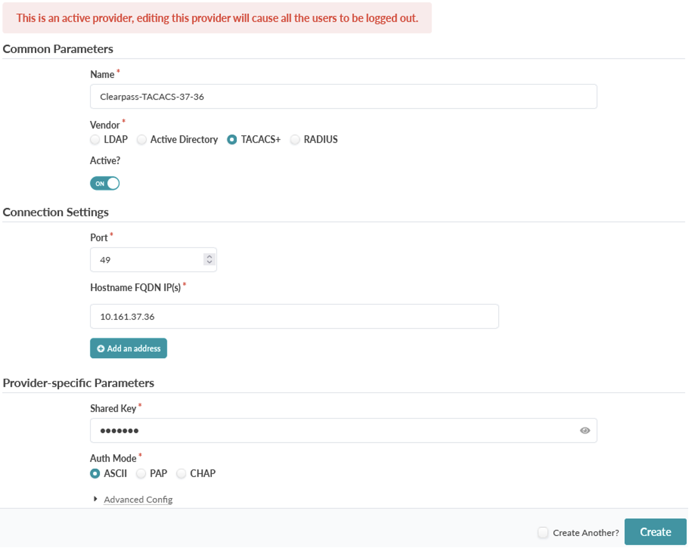

Finally, under "Provider-specific Parameters", set the shared secret. This must match the shared secret configured on the TACACS+ server.

Click "Create" when finished.

After defining the TACACS+ server, note that local logins remain active, you will not be locked out of the Apstra server.

## ClearPass

Aruba ClearPass is an authentication server that supports various protocols including RADIUS and TACACS+. The steps below assume that the ClearPass server has been installed and is reachable from Apstra.

For more information about installing CPPM, start at the [HPE Networking support site](https://networkingsupport.hpe.com/home), and then search for ClearPass to download the software, view documentation, and request a demo license. If you do not have access to the support site, please contact your local HPE account team or reseller for further assistance.

## Configuration

Below is an overview of the various ClearPass objects to be configured and their relationship with one another. Please reference this diagram as you step through the configuration in the sections below.

### Network - Add Device

Under Configuration --> Network --> Devices click "Add". In the "Add Device" popup window, define the TACACS+ client information including the "Name", IP address , and shared secret that matches the value set on the Apstra. Set the "Vendor Name" to "Juniper" although this should not make any difference if not set.

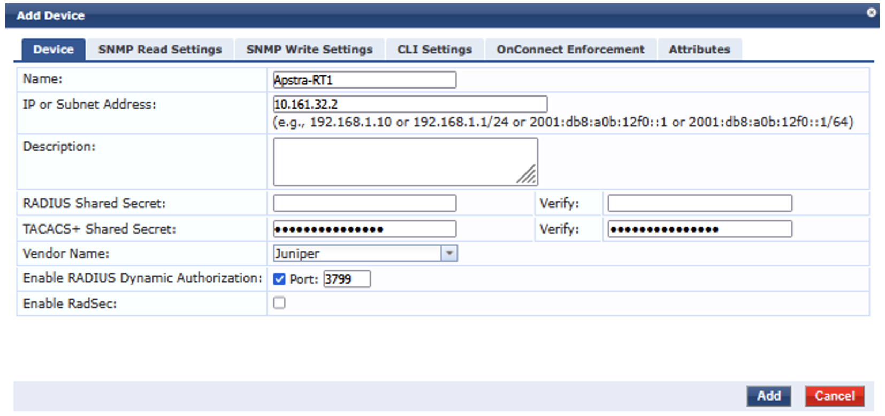

### Identity

**Roles**

Define 2 roles that correspond to the two categories of users, 'administrators' and 'operators'. Note that these roles are specific to ClearPass and separate from the roles that are defined, or pre-defined, in Apstra.

In ClearPass, as part of the authentication process, the user is mapped to a 'Role' which determines which Enforcement Profile to apply. The profile, defined in the next section below, determines the authorization attributes returned to the TACACS+ Client.

Navigate to Configuration --> Identity --> Roles. Click "Add" and set the name of the role (ex. Role-Network-Admin) and click "Save".

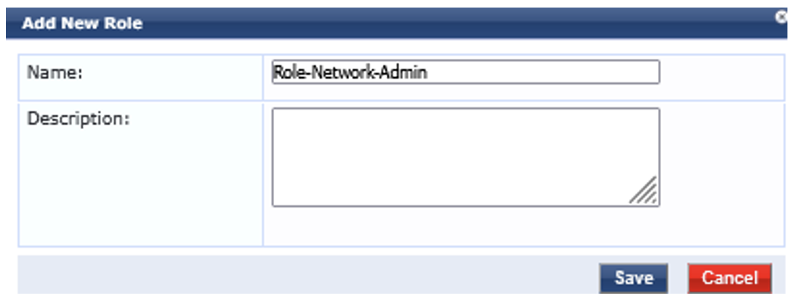

Repeat for the 'operators' role (ex. Role-Network-Operator).

**Users**

In this example, authentication of the users is performed using the CPPM's local database. There are 2 user accounts, each of which is mapped to a unique ClearPass role.

| Login User Name | ClearPass Role |
|:--|:--|
| user-admin | Role-Network-Admin |
| user-oper | Role-Network-Operator |

To define the local user accounts, navigate to Configuration --> Identity --> Local Users and click "Add".

Set the "User ID" (i.e. the username used for login), "Name", "Password", and the "Role" to match the previously defined corresponding ClearPass role.

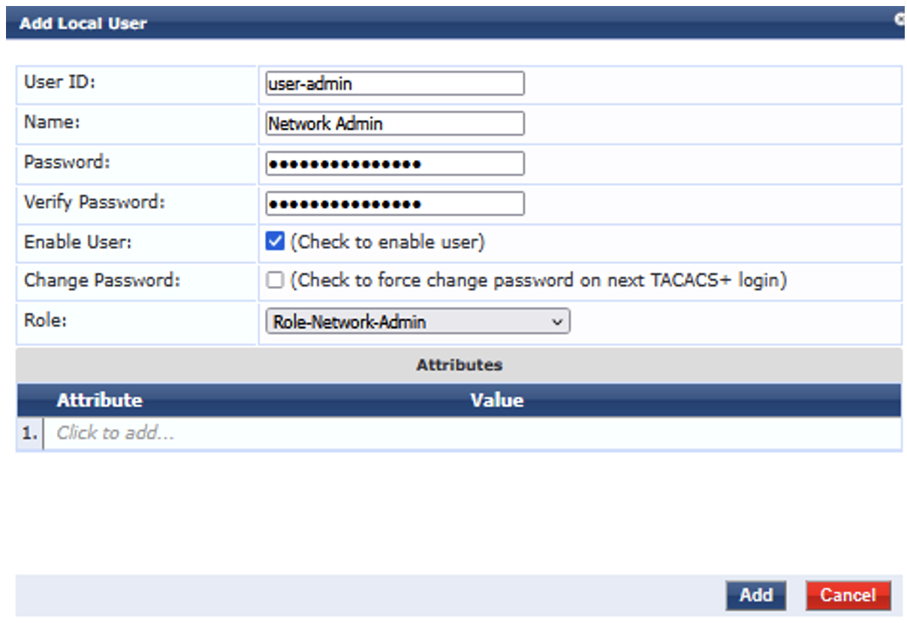

Click on the "Add" button when finished. Then repeat the steps for the user 'user-oper'.

### Enforcement

**Create Custom Service Dictionary - 'aos-exec'**

The ClearPass server is preconfigured with many different vendor service dictionaries, however the service dictionary required for Apstra is not included. Therefore, before creating the Enforcement Profiles and Policy, it is required to create the Apstra service dictionary and its attributes.

The Apstra TACACS+ client requests the 'aos-exec' service during the authorization phase when communicating with the TACACS+ server. The service contains the 'aos-group' attribute .which matches the "Provider Group" value configured in Apstra (see the Apstra --> Role Mappings section above).

To create a dictionary for Apstra, navigate to Administration --> Dictionaries --> TACACS+ Services.
Select the checkbox for the existing 'shell' service and then click "Export". Save the XML service definition file to your local device.

Open the XML file in a text editor and edit/replace the text with the new service dictionary entry called "aos-exec" containing two attributes, one for privilege level and one for the 'aos-group' which also includes the allowed values:

```
<?xml version="1.0" encoding="UTF-8" standalone="yes"?>
<TipsContents xmlns="http://www.avendasys.com/tipsapiDefs/1.0">
  <TipsHeader exportTime="Fri Nov 07 14:15:54 PST 2025" version="6.12"/>
  <TacacsServiceDictionaries>
    <TacacsServiceDictionary dispName="aos-exec" name="aos-exec">
      <ServiceAttribute dataType="Unsigned32" dispName="Privilege level" name="priv-lvl"/>
      <ServiceAttribute allowedValuesCsv="network-admins,network-operators" dataType="String" dispName="aos-group" name="aos-group"/>
    </TacacsServiceDictionary>
  </TacacsServiceDictionaries>
</TipsContents>
```

Save the changes, and then "Import" the file. Click on the new "aos-exec" service dictionary to view the attributes. The 'aos-group' attribute is listed with the allowed values

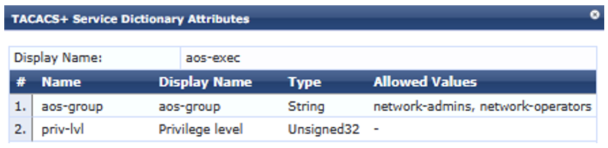

**Enforcement Profiles**

The next step is to create Enforcement Profiles for the two categories of users, 'administrators' and 'operators'. This is where the returned attributes are defined including the mandatory 'aos-group' which determines the users' permissions when working in the Apstra GUI.

Navigate to Configuration --> Enforcement --> Profiles, then click "Add" at the top right of the window.

Set the profile "Template" type to "TACACS+ Based Enforcement" and set a "Name":

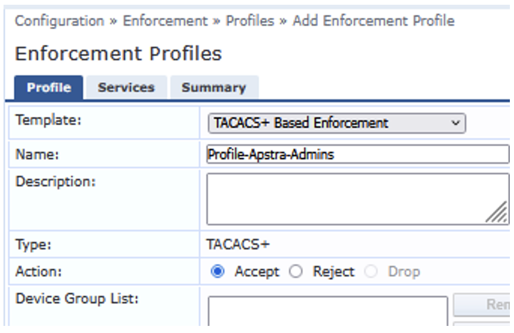

Click the "Services" tab.

First, set the "Privilege Level" to "15" and then under "Selected Services" select the newly created service 'aos-exec'.
At the bottom of the window set the "Service Attributes". For example, for the users classified as 'administrators', select "Type" of "aos-exec", select "Name" "aos-group" and the "Value" "network-admins". Add another attribute for a "priv-lvl" of "15".

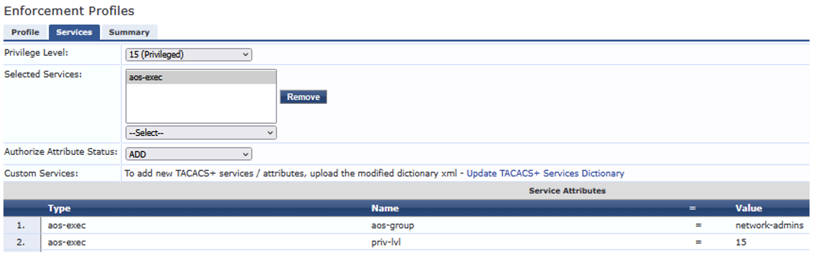

Click "Save" when done.

Then repeat the steps above to create an Enforcement Profile for the users classified as 'operators' that returns the group 'network-operators' and a privilege level of '1'.

**Enforcement Policy**

The Enforcement Policy determines which Enforcement Profile to use based on the user's ClearPass Role.

Under Configuration --> Enforcement --> Policies, click "Add" at the top right of the window.

Set the "Name" and then under "Enforcement Type" click "TACACS+".

The "Default Profile" specifies the Enforcement Profile to use if  none of the policy's rules match. These rules are defined on the next tab. In this case, if there is no match, the user should have 'operator' level read-only access, so set the value to "Profile-Apstra-Operators".

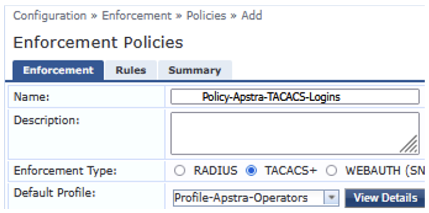

Click the "Rules" tab. This is where the ClearPass server is directed to the appropriate Enforcement Profile based on the user's ClearPass Role.

Click "Add Rule" and then define the rule conditions for the 'administrator' level users.

Set the "Type" to "Tips", "Name" to "Role", "Operator" to "EQUALS", and "Value" to the "Role-Network-Admin" ClearPass role defined previously. Then under "Profile Names:", select the corresponding Enforcement Profile "Profile-Apstra-Admins".

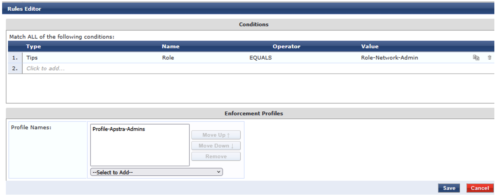

Click "Save" when done.

Next, click "Add Rule" again, and add a similar rule for the users classified as 'operators'.

When finished click "Save".

Verify the configuration by selecting it and viewing the "Summary". The policy contains 2 rules to direct ClearPass to the appropriate Enforcement Profile based on the user's ClearPass Role:

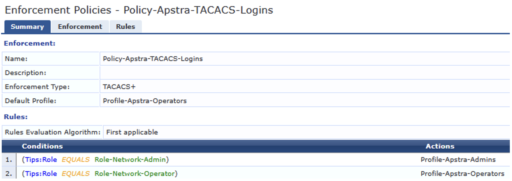

### Service

**Overview**

The ClearPass server supports multiple authentication methods, or services, including RADIUS, TACACS+, 802.1x, Web-based authentication, and MAC address authentication. Many of these services are pre-configured on the server.

The services defined determined how the server handles incoming authentication requests. Each service definition includes the authentication type, optional match criteria based on the information contained in the client request, the authentication methods and sources to use, and the Enforcement Policy to apply.

**Create Service**

In this example, a new TACACS+ service is defined. The service definition instructs the ClearPass server to use the local database for authentication, and to use the previously configured Enforcement Policy.

Navigate to Configuration --> Services, and click "Add".

On the "Service" tab, set the "Type" to "TACACS+ Enforcement" and the "Name" (i.e. Service-Apstra-Login). In this case there are no matching conditions.

Click the "Authentication" tab. Then under "Authentication Sources", select "[Local User Repository][Local SQL DB]" as the users are authenticated against the local user database.

Click the "Enforcement" tab and under "Enforcement Policy", select the previously defined policy (i.e. Policy-Apstra-TACACS-Logins).

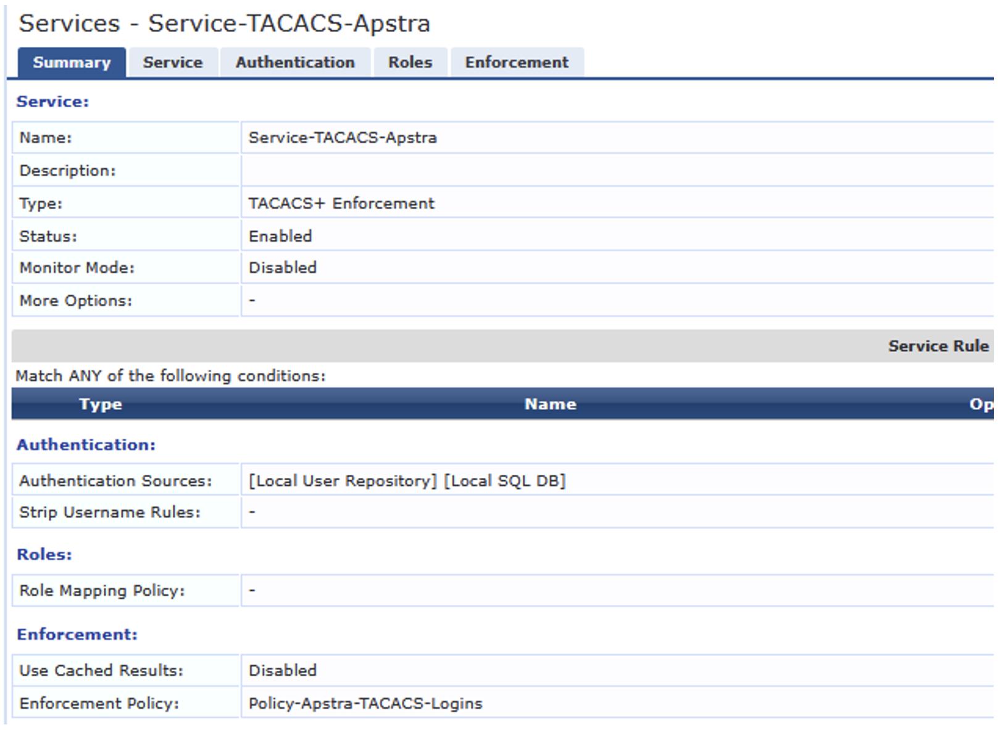

When finished click "Save" at the bottom right of the window. Below is a summary of the configuration:

**Change Order**

The services are evaluated in the order that they are displayed in the GUI. In this case, the newly configured TACACS+ service is moved near the top of the list to ensure that it is evaluated, and matched, before other pre-defined TACACS+ services.

Click the "Reorder" button and then follow the instructions in the GUI to move the new service near the top of the list:

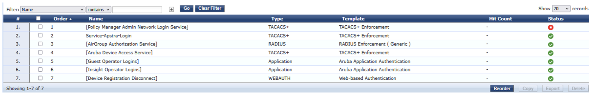

## Verification

## Apstra Login

### Administrator

Open a web browser and connect to the Apstra server. On the login page, login with username 'user-admin'.

Once logged in, click the user icon   at the bottom left of the window and select "Profile".

The "User profile" shows that the user's role is 'administrator'.

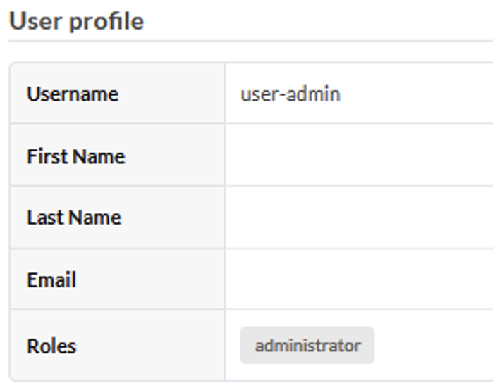

### Operator

Log out, and then login with username 'user-oper'. Check the "User profile" again and note that no "Roles" are displayed.

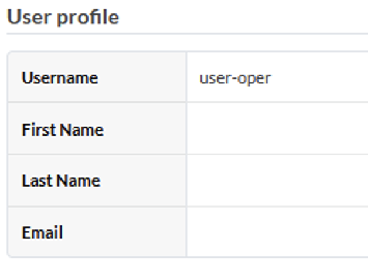

Navigate the GUI and notice that the user has read only access:

### Log File

The login/logout activity appears in the Apstra server's Event Log which can be viewed in the GUI under 'Platform'.

The returned TACACS+ attributes can be viewed in the **/var/log/auth/AuthAgent.err** file:

```
admin@aos-server:/var/log/aos/auth$ sudo grep 'aos-group' *
AuthAgent.err:2025-11-11 15:26:27,712 29:INFO:RBAC:TACACS group response: ['aos-group=network-admins', 'priv-lvl=15']
AuthAgent.err:2025-11-11 15:30:14,336 29:INFO:RBAC:TACACS group response: ['aos-group=network-operators']
```

Reference: [https://supportportal.juniper.net/s/article/Juniper-Apstra-Authentication-and-Authorization-Debugging](https://supportportal.juniper.net/s/article/Juniper-Apstra-Authentication-and-Authorization-Debugging)

## ClearPass Monitoring

In the ClearPass GUI, navigate to Monitoring --> Live Monitoring --> Access Tracker. A list of client authentication sessions is listed. Find the entries corresponding to the recent logins to the Apstra server at the top of the list and select one of them.

A pop-up window is displayed containing the session details. On the "Request" tab, note that the authentication status is "PASS" for the user and the authentication request type is "TACACS+".

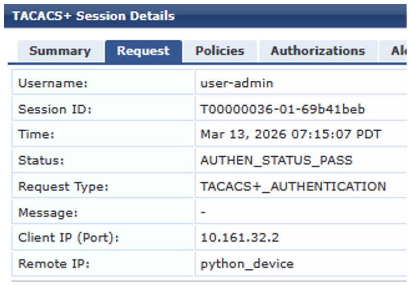

On the "Policies" tab, the matching service, authentication source, ClearPass role, and applied Enforcement Profile are displayed. The output confirms that the appropriate service was matched, the user was mapped to the correct ClearPass role, and the policy pointed to the proper profile which returned the correct attributes.

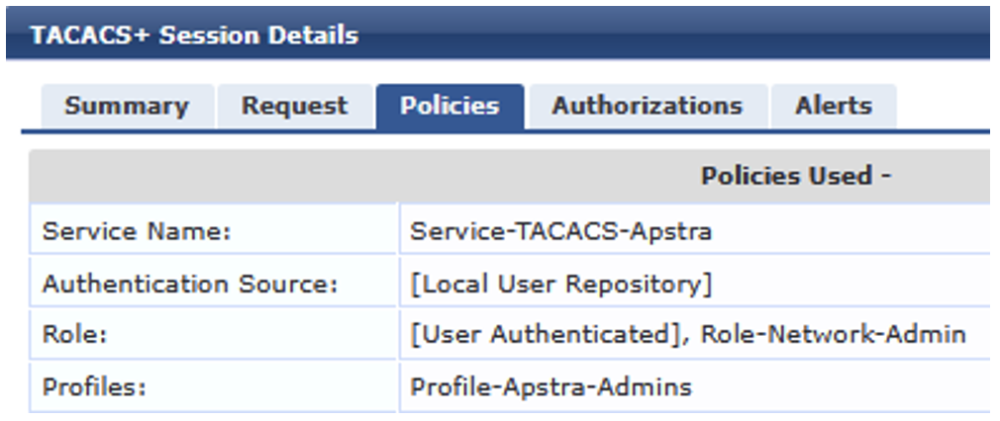

For additional troubleshooting, click the "Show logs" button for a detailed log corresponding to the session displayed in a new pop up window.

## Useful links

- [https://supportportal.juniper.net/s/article/Juniper-Apstra-Authentication-and-Authorization-Debugging](https://supportportal.juniper.net/s/article/Juniper-Apstra-Authentication-and-Authorization-Debugging)

## Glossary

- 802.1X: IEEE 802.1X Port-Based Network Access Control
-> Standard for network access control (IEEE, official standard)
- API: Application Programming Interface
-> Standard term in computing (ISO/IEC 2382)
- CPPM: ClearPass Policy Manager
-> Aruba ClearPass Policy Manager (HPE Aruba documentation)
- DB: Database
-> Structured collection of data (ISO/IEC 2382)
- GUI: Graphical User Interface
-> Visual interface for user interaction (ISO/IEC 2382)
- HPE: Hewlett Packard Enterprise
-> Company name (official corporate naming)
- ID: Identifier
-> Unique identifying value (ISO/IEC 2382)
- IEEE: Institute of Electrical and Electronics Engineers
-> Standards organization (IEEE official)
- IP: Internet Protocol
-> Network layer protocol (IETF RFC 791)
- MAC: Media Access Control
-> Sub-layer of data link layer (IEEE 802 standards)
- POC: Proof of Concept
-> Demonstration to validate feasibility (widely used engineering term)
- RADIUS: Remote Authentication Dial-In User Service
-> AAA protocol (IETF RFC 2865)
- RBAC: Role-Based Access Control
-> Access control model (NIST, 2004 standard model)
- SQL: Structured Query Language
-> Language for managing relational databases (ISO/IEC 9075)
- TCP: Transmission Control Protocol
-> Transport layer protocol (IETF RFC 793)
- TACACS: Terminal Access Controller Access-Control System
-> AAA protocol (historical, Cisco-origin)
- TACACS+: Terminal Access Controller Access-Control System Plus
-> Enhanced AAA protocol (Cisco documentation)
- XML: eXtensible Markup Language
-> Markup language for structured data (W3C Recommendation)
