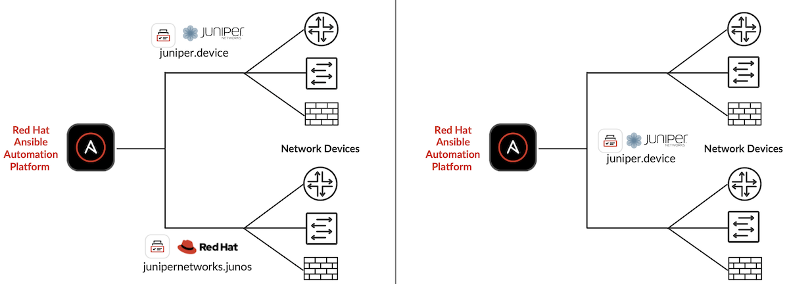
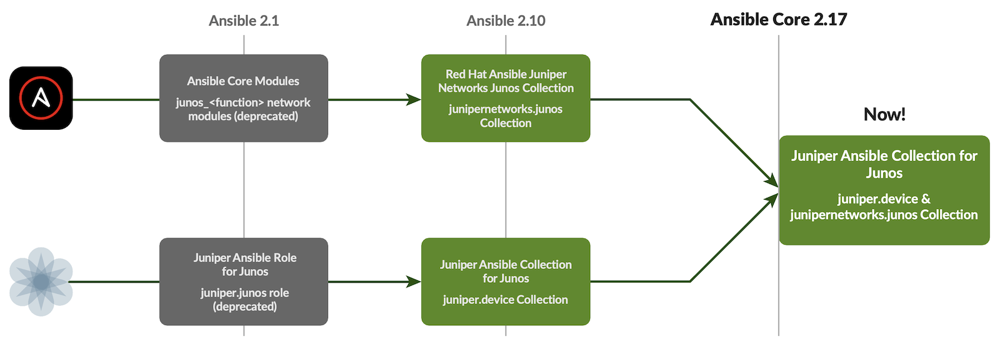
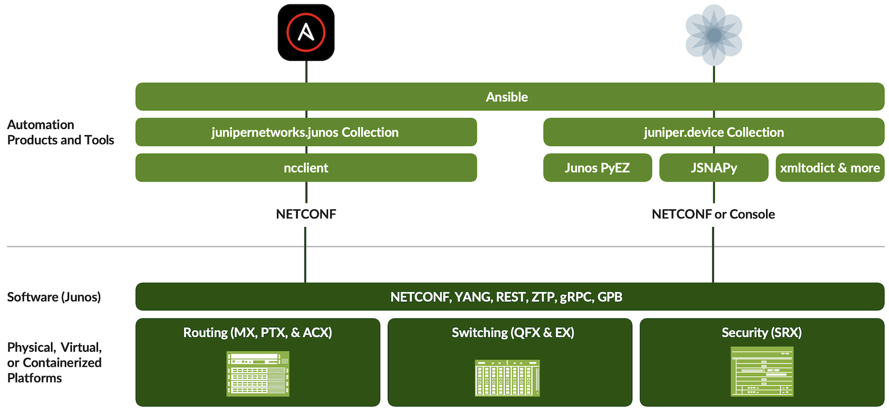

# Red Hat and Juniper Merge Ansible Collections

**Jessica Garrison - 10/30/2025**

Red Hat Ansible Automation Platform and Juniper Networks each have collections of Ansible modules for managing Junos devices. We are merging Ansible's collection into the Juniper Collection to provide a single collection of modules for our customers.



## Introduction

The most important goal during the merger of our collections was to create a seamless customer experience. Before this merger, our distinct collections were developed with different purposes and use cases, so there was work to do so that our customers would be able to use either set of playbooks with only the change of namespace.  This merged collection showcases how our collections complement each other, rather than compete, allowing us to leverage the strengths of both approaches with the Red Hat Ansible Automation Platform (AAP). The most important thing to know is that one may continue to use both sets of previously created playbooks with the merged collection, without any alterations.

## The Collections: What They Do, And How They Work

### Picking a Collection

With the shift to Ansible Automation 2.10 and later, there have been two primary, powerful content collections for Junos OS:

- The **Red Hat Ansible Juniper Networks Junos Collection** (we can refer to this as the Red Hat Collection) which uses the junipernetworks.junos namespace and is maintained by Red Hat Ansible.
- The **Juniper Ansible Collection for Junos** (we can refer to this as the Juniper Collection) which uses the juniper.device namespace and is maintained by Juniper Networks.

While it has always been possible to **deploy both**, we consistently receive questions from users trying to understand which collection best suits their needs and use cases.



As previously stated, these collections were built with different purposes and use cases.

The Red Hat Collection was developed using a consistent approach applied to all Red Hat maintained networking collections. The key value proposition here being the templated configurations customers are able to utilize - allowing for streamlined, repeatable configuration management.

This design provides significant value for users because it:

- Simplifies Configuration: It removes the need for engineers to memorize or look up the specific command syntax required for different devices.
- Enables Multi-Vendor Consistency: It allows for the consistent configuration of common networking actions like Virtual Routing and Forwarding (VRFs), Access Control Lists (ACLs) and Border Gateway Protocol (BGP) across a multi-vendor environment.

The Juniper Collection was designed to provide users with direct access to the full breadth of Junos capabilities.

Junos is known best for its vast number of features, protocols, and use cases. However, attempting to force these differentiating features into a "least common denominator" module set, while beneficial for multi-vendor consistency, can limit the user's ability to leverage the advanced capabilities of Junos.

Customers who utilize the features which differentiate Junos often found that the Red Hat Collection either lacked support for them or did not provide the options necessary for their deployments. The Juniper Collection solves this by giving customers the power to automate many more features and functions that Junos supports.

### Enhanced Capabilities in the Merged Collection

The merging of these two collections creates a more robust and feature-rich automation experience for users. Customers who are migrating from the previous Red Hat collection to the new merged collection will gain these significant benefits:

- Pre-Check and Post-Check Support: Validate your network state before and after configuration changes to improve operational resilience (through the JSNAPy module)
- Configuration Format Support: The merged collection supports all three native Junos configuration formats - text, JSON, and XML. The text format also includes support for set action.
- Configuration Statements Expanded: Access a wider selection of configuration statements like OpenConfig, the ephemeral DB, group configs, family and address parameters, and more.

By combining the strength of both Red Hat Ansible and Juniper Networks, the merged collection delivers a powerful automation solution.

### How The Merged Collection Works



The users may utilize the Red Hat Collection playbooks they have previously created with the new merged Juniper and Red Hat Collection without any alterations. This can be done because both collections are present in the codebase.

```
|-- ansible_collections
|   |-- juniper/device
|   |-- junipernetworks/junos
```

The redirect is also configured in the runtime.yml file. A snippet is shown below.

```
plugin_routing:
  action:
  modules:
    junos_acl_interfaces:
      redirect: juniper.device.junos_acl_interfaces
       ...
```

A look within the directory shows you that the modules have kept their names.  If you look into the Python files, you will also see that these modules are calling the same Python files as before, aka action plugin handling in Ansible terminology.

**List of Red Hat Collection's modules:**

```
junos_acl_interfaces 
junos_acls 
junos_banner 
junos_bgp_address_family 
junos_bgp_global 
junos_hostname 
junos_interfaces 
junos_l2_interfaces 
junos_l3_interfaces 
junos_lacp_interfaces 
junos_lacp 
junos_lag_interfaces 
junos_lldp_global 
junos_lldp_interfaces 
junos_logging_global 
junos_netconf 
junos_ntp_global 
junos_ospf_interfaces 
junos_ospfv2 
junos_ospfv3 
junos_package 
junos_prefix_lists 
junos_routing_instances 
junos_routing_options 
junos_security_policies_global 
junos_security_policies 
junos_security_zones 
junos_snmp_server 
junos_static_routes 
junos_user 
junos_vlans 
junos_vrf
```

**List of Juniper Collection's modules:**

```
command
config
facts
file_copy
Jsnapy
ping
pmtud
rpc
software
srx_cluster
system
table
```

**Dependencies:**

```
Ansible >= 2.17
Python >= 3.12 
PyEZ (junos-eznc) >= 2.7.3
Jsnapy >= 1.3.7
Jxmlease >= 1.0.1
Xmltodict >= 0.13.0
packaging
```

## Differences to Keep in Mind

As a reminder, the Red Hat Ansible Juniper Networks Junos Collection that uses the junipernetworks.junos namespace and is maintained by Red Hat Ansible will be called the **Red Hat Collection**. The Juniper Ansible Collection for Junos that uses the juniper.device namespace and is maintained by Juniper Networks will be called the **Juniper Collection**. This section assumes the Juniper Collection is using Junos PyEZ as transport.

### Inventory Schema

Red Hat Collection

```
[junos]
<Device IP>

[junos:vars]
ansible_network_os=juniper.device.junos
ansible_user=<username>
ansible_password=<password>
ansible_port=22
ansible_connection=ansible.netcommon.netconf

[all:vars]
ansible_python_interpreter=<python interpreter path>
```

Juniper Collection

```
[junos]
cfg_target 

[junos:vars]
ansible_host=x.x.x.x 
ansible_user=<user> 
ansible_password=<pass> 
ansible_port=22 
ansible_connection=juniper.device.pyez 
ansible_command_timeout=300

[all:vars]
ansible_python_interpreter=<python interpreter path>
```

### Logging

Red Hat Collection module path:

```
junipernetworks.junos.junos_logging_global
```

Juniper Collection module path:

```
juniper.device.junos_logging_global
```

We have additional information and extensive examples on how the playbooks vary. Both may co-exist and we recommend adopting juniper.device moving forward. For your convenience, we have provided three specific examples.

- [Ansible Junos Configuration](https://dineshbaburam91.github.io/posts/Ansible_Junos_Config_Example/)
- [Ansible Junos RPC](https://dineshbaburam91.github.io/posts/Ansible_Junos_Rpc_Example/)
- [Ansible Junos Facts](https://dineshbaburam91.github.io/posts/Ansible_Junos_Facts_Examples/)

## Moving Forward

### Installation

Please follow the recommended steps to install the Ansible Collection (junipernetworks.junos) in the Juniper Collection (juniper.device).

1. Create the virtual environment

```
mkdir ansible_modules_redirection_ansible_merger_branch_venv
cd ansible_modules_redirection_ansible_merger_branch_venv
python3.12 -m venv venv
source venv/bin/activate
```

2. Install the merged collection

```
ansible-galaxy collection install git+https://github.com/Juniper/ansible-junos-stdlib.git#/ansible_collections/juniper/device
```

3. Install the Ansible Collection

```
ansible-galaxy collection install junipernetworks.junos
```

4. Update the Ansible Collection Meta Runtime

Remove existing content from the runtime.yaml file located at:

```
/root/.ansible/collections/ansible_collections/junipernetworks/junos/meta/runtime.yml
```

Add the new content from the merger branch (jnpr-ansible-merger) runtime.yaml .

5. Execute your playbooks!

### Migration

Long term, we recommend this migration path to the Juniper Collection.  Please note that the Juniper modules utilizes Ansible connections [local](https://www.juniper.net/documentation/us/en/software/junos-ansible/ansible/topics/topic-map/junos-ansible-connection-methods.html#id-persistent-vs-local-connections) or [juniper.device.pyez](https://www.juniper.net/documentation/us/en/software/junos-ansible/ansible/topics/topic-map/junos-ansible-connection-methods.html#id-persistent-vs-local-connections).

| Modules from the Ansible Collection | Modules from the Juniper Collection |
|:--|:--|
| junos_command.py | command.py |
| junos_facts.py | facts.py |
| junos_package.py | software.py |
| junos_ping.py | ping.py |
| junos_rpc.py | rpc.py |
| junos_scp.py | file_copy.py |
| junos_system.py | system.py |
| All other modules | config.py |

### Support

- [Ansible for Junos Troubleshooting Summary](https://www.juniper.net/documentation/us/en/software/junos-ansible/ansible/topics/concept/junos-ansible-troubleshooting-error-summary.htmlhttps://www.juniper.net/documentation/us/en/software/junos-ansible/ansible/topics/concept/junos-ansible-troubleshooting-error-summary.html)
- Regression testing for all Junos releases
- Support for Junos OS and Junos OS Evolved
- Support of the physical, virtual, and containerized platforms running Junos which includes the MX, PTX, ACX, QFX, EX, and SRX series.
- GitHub issues can be used for features requests, bug, and ideas.

Red Hat also provides support that is included with your Red Hat Ansible Automation Platform, as the merged collection juniper.device is certified and available in the Red Hat ecosystem catalog.

In addition, the Red Hat collection junipernetworks.junos will follow the 2 year deprecation cycle and will be maintained while customers can gradually migrate to use the Juniper collection with the combined capabilities.

## Useful links

Red Hat Ansible Juniper Networks Junos Collection:

- Ansible Automation Hub (supported collections): [https://console.redhat.com/ansible/automation-hub/repo/published/junipernetworks/junos/](https://console.redhat.com/ansible/automation-hub/repo/published/junipernetworks/junos/)
- Galaxy: [https://galaxy.ansible.com/junipernetworks/junos](https://galaxy.ansible.com/junipernetworks/junos)
- Source code: [https://github.com/ansible-collections/junipernetworks.junos](https://github.com/ansible-collections/junipernetworks.junos)

Juniper Ansible Collection for Junos:

- Ansible Automation Hub (supported collections): [https://console.redhat.com/ansible/automation-hub/repo/published/juniper/device/ ](https://console.redhat.com/ansible/automation-hub/repo/published/juniper/device/)
- Galaxy: [https://galaxy.ansible.com/juniper/device](https://galaxy.ansible.com/juniper/device)
- Source code:[ https://github.com/Juniper/ansible-junos-stdlib](https://github.com/Juniper/ansible-junos-stdlib)

## Acknowledgements

Many thanks to the Red Hat and Juniper teams that got us to this point.

- Red Hat: Dafne Mendoza, Pete Cruz, Elle Universal, Rohit Thakur
- Juniper: Chidanand Pujar, Dinesh Babu R, Dwarakanath Yadavalli, Nick Davey, Brenda Wilden
