# Reimagining Network Operations with AI

**Jose Miguel Izquierdo - 10/05/2025**

What if you had an AI partner that could help you manage your network and troubleshoot any issues, learn from them, and continuously get smarter about preventing future incidents?

## Introduction

I'm going to provide some insights into how Agentic AI can become your most valuable network engineer's assistant. Everything comes from a compelling demonstration I conducted using *Claude Desktop* application leveraging *Claude Sonnet 4* AI model and 2 specialized Model Context Protocol (MCP) servers.

The AI language model, *Claude Sonnet 4*, is Anthropic's latest smart and efficient model designed for everyday use. It supports large context windows (very long input text) and strikes an optimal balance between advanced *reasoning capabilities* and *operational efficiency*, making it ideal for real-time network operations where quick decision-making and accurate analysis are crucial. This model demonstrates exceptional performance in multi-step technical workflows, maintaining context across complex sequences of network operations while providing detailed explanations of its reasoning, giving users complete visibility into how each step advances toward their operational objectives.

MCP servers act as intelligent bridges between AI assistants and real-world systems, enabling Claude to interact directly with them (through native APIs and NETCONF over SSH in our demo).

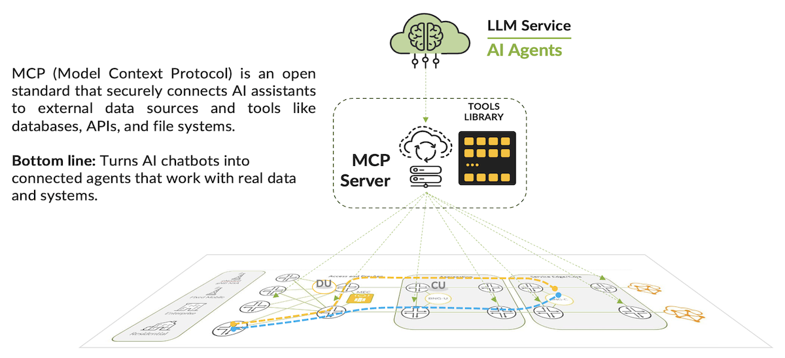

Here it is the configuration file of Claude Desktop application (downloaded and running in a laptop, not just the web app from [https://claude.ai/](https://claude.ai/)) with the MCP servers:

```
{
  "mcpServers": {
    "mcp-junos": {
      "type": "stdio",
      "command": "/Users/jizquierdo/.local/bin/uv",
      "args": [ "run", 
                "/Users/jizquierdo/Documents/Juniper/Projects/heydolon/junos-mcp-server/.venv/bin/python", 
                "/Users/jizquierdo/Documents/Juniper/Projects/heydolon/junos-mcp-server/jmcp.py", 
                "-f", 
                "/Users/jizquierdo/Documents/Juniper/Projects/heydolon/junos-mcp-server/devices.json", 
                "-t", 
                "stdio"],
      "cwd": "/Users/jizquierdo/Documents/Juniper/Projects/heydolon/junos-mcp-server"
    },
    "mcp-rd": {
      "command": "/Users/jizquierdo/Documents/Juniper/Projects/heydolon/routingdirectormcp-0.1.0/.venv/bin/python",
      "args": [ "/Users/jizquierdo/Documents/Juniper/Projects/heydolon/routingdirectormcp-0.1.0/RoutingDirectorMCP.py", 
                "-c", 
                "/Users/jizquierdo/Documents/Juniper/Projects/heydolon/routingdirectormcp-0.1.0/sample-configs/eop3.config.json", 
                "-t", 
                "stdio"]
    },
    "mcp-linux": {
      "type": "stdio",
      "command": "/Users/jizquierdo/.local/bin/uv",
      "args": [ "run", 
                "/Users/jizquierdo/Documents/Juniper/Projects/heydolon/linux-mcp-server/.venv/bin/python", 
                "/Users/jizquierdo/Documents/Juniper/Projects/heydolon/linux-mcp-server/linux-mcp-server.py"],
      "cwd": "/Users/jizquierdo/Documents/Juniper/Projects/heydolon/linux-mcp-server"
    }
  },
  "globalShortcut": ""
}
```

And how these MCP Servers can be enabled when running it:

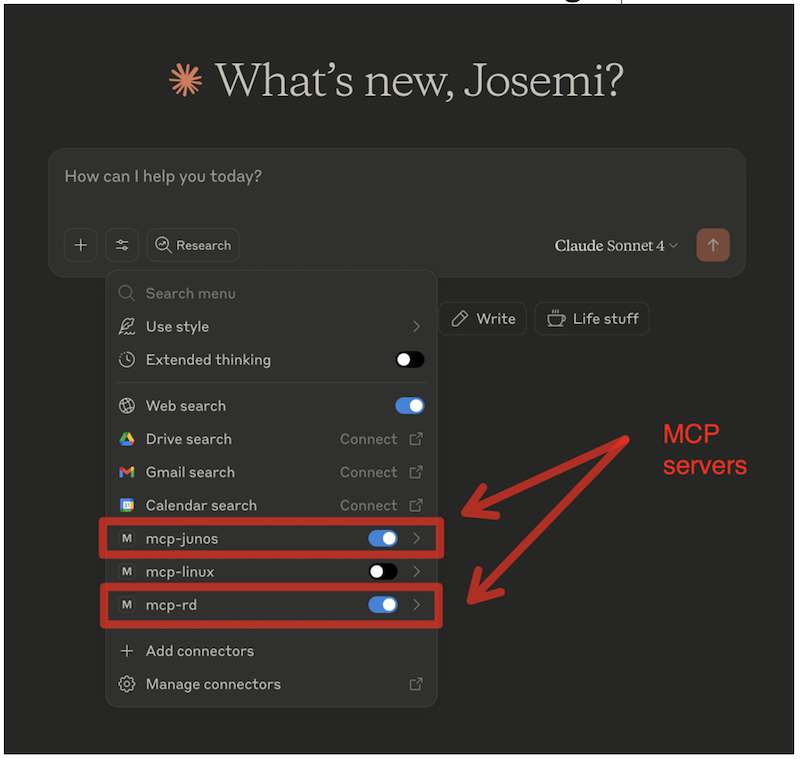

Here it is the explanation of each of the MCP servers used in the demo:

- **mcp-rd**: for Juniper Routing Director automation platform. A WAN automation solution that among other things, simplifies traffic engineering, making it easier for the user to leverage benefits provided by transport service paths, such as MPLS/RSVP, SR, and network slicing. It lets the user view live network topology maps that show node status, link utilization, segment routing paths, and label-switched paths (LSPs).

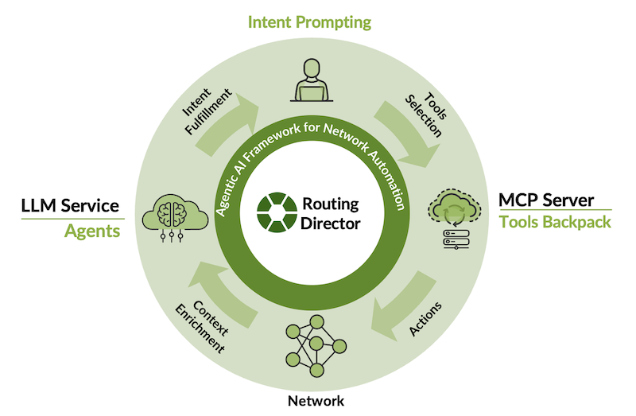

- **mcp-junos***: for Juniper devices that enables LLM interactions with network equipment.

(*) Attention: The Junos MCP server supports configuration changes! Please ensure you only use this functionality when you want LLM-generated configurations to be loaded and committed on your Junos devices (which is our case for this demo).

This setup transforms Claude from a conversational AI into an active network operations partner that can:

- execute commands
- analyze configurations
- monitor network state
- interact with your SDN controller
- simulate failures
- or even orchestrate complex troubleshooting workflows.

This MCP architecture is particularly powerful because it provides secure and structured access to network systems while maintaining the AI's ability to reason about complex scenarios. Rather than just providing static information, Claude can now dynamically query device status, examine routing tables, create and monitor LSPs, simulate failures, and correlate data across the entire network stack - from individual router interfaces to global traffic engineering policies.

## Demo

Let's see how adding AI to Network Operations with MCP servers allows the orchestration of sophisticated network activities.

We'll consider a network consisting of 6 VMX nodes, already onboarded into Routing Director and configured as an MPLS core network.

### Network Discovery and Inventory

The AI agent is requested to show the list of devices belonging to the network. Claude automatically discovers and catalogues all network devices from the inventory across both the JunOS MCP (6 VMX routers) and Routing Director MCP (same devices under centralized management) including models, OS versions, management IPs, serial numbers, and operational status. It also cross-references data between management systems providing unified network visibility and reporting.

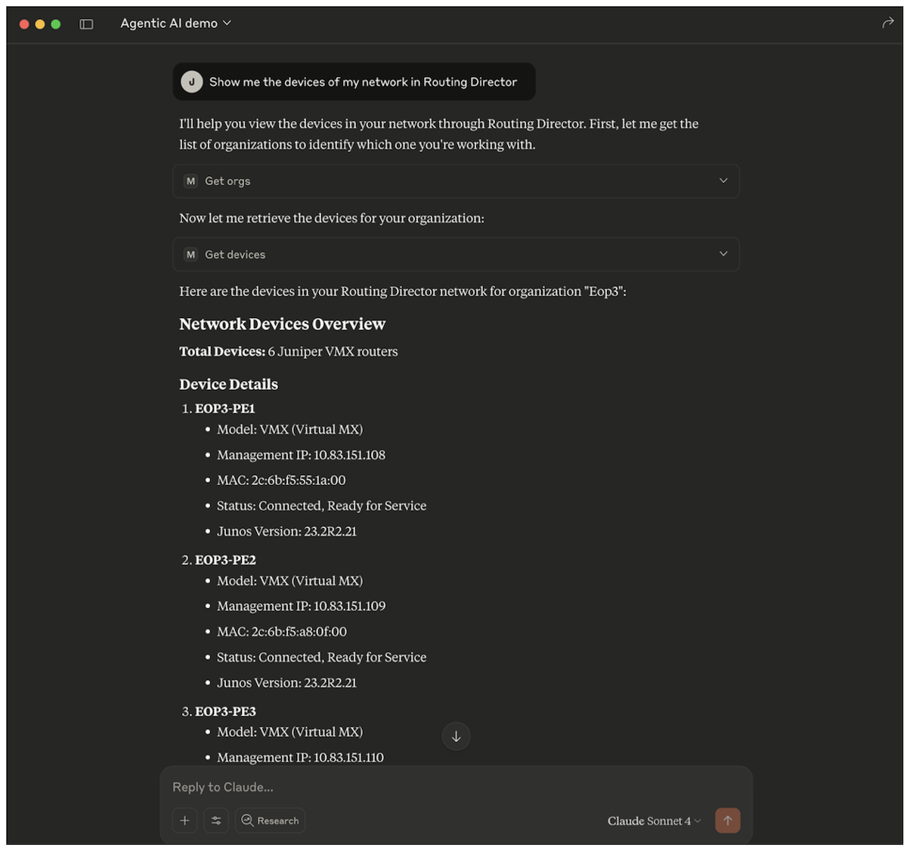

### Traffic Engineering with Segment Routing

Now, the AI agent is requested to create an SR-MPLS LSP tunnel from node **EOP3-PE1** to node **EOP3-PE5**. It creates the tunnel by using the Routing Director MCP server tool (e.g. create_lsp) to create the LSP using the RD PCE (Path Computation Element). After that, it verifies the LSP is properly instantiated with PCEP (Path Computation Element Protocol) signaling and monitored the traffic flow and confirmed the SR labels were correctly applied.

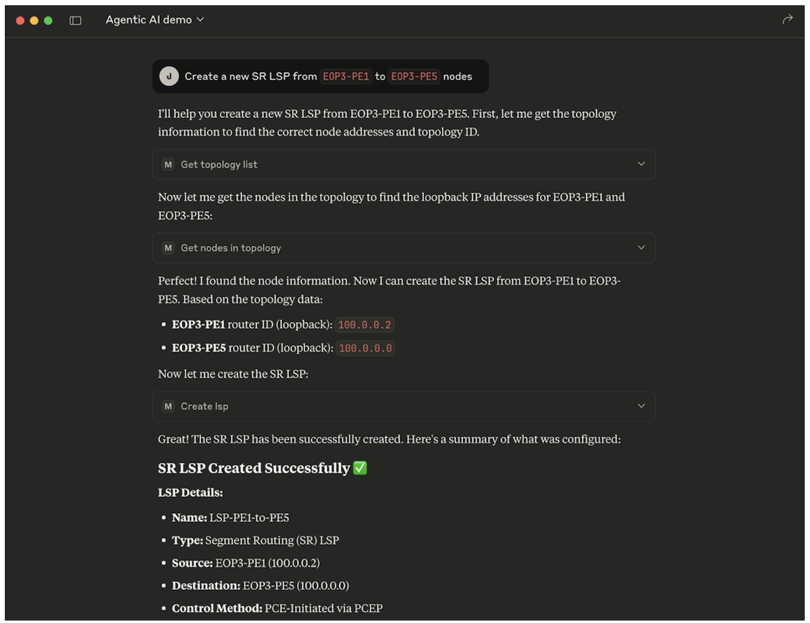

The LSP can be seen in the topology view of the Routing Director GUI

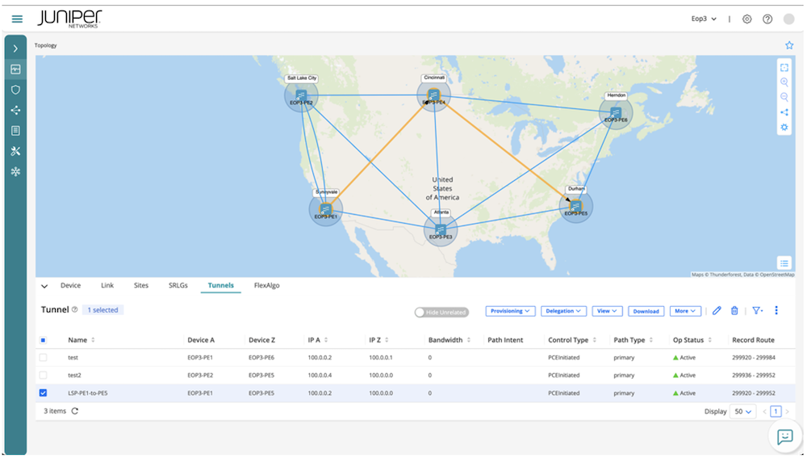

### Controlled Failure Simulation

After that, the AI agent is requested to simulate a realistic network failure by disabling the interface *ge-0/0/3.0* on **EOP3-PE4**, breaking the direct *PE4-PE5* link. It not only did that but even analyzed and confirmed the interface between these two nodes.

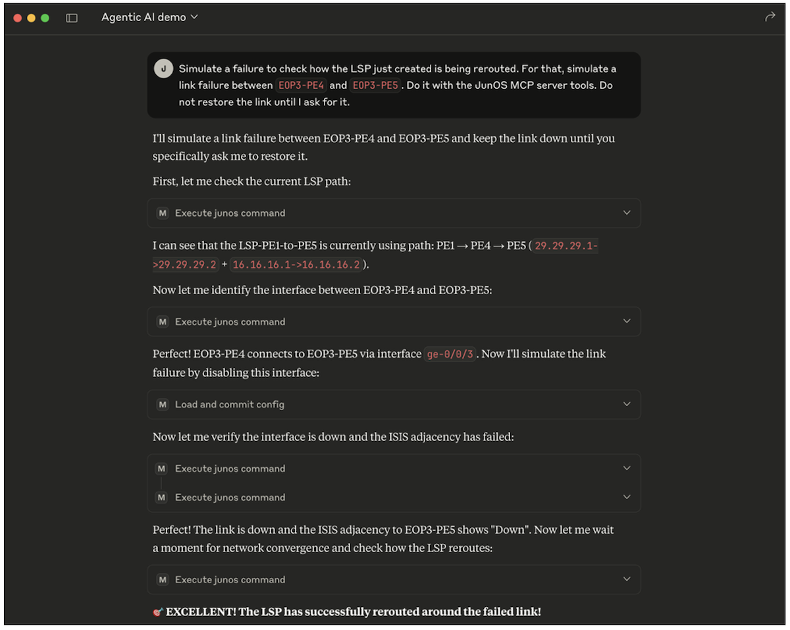

It monitored the network convergence in real-time as IS-IS detected the failure and updated the topology as it could be seen in the topology view.

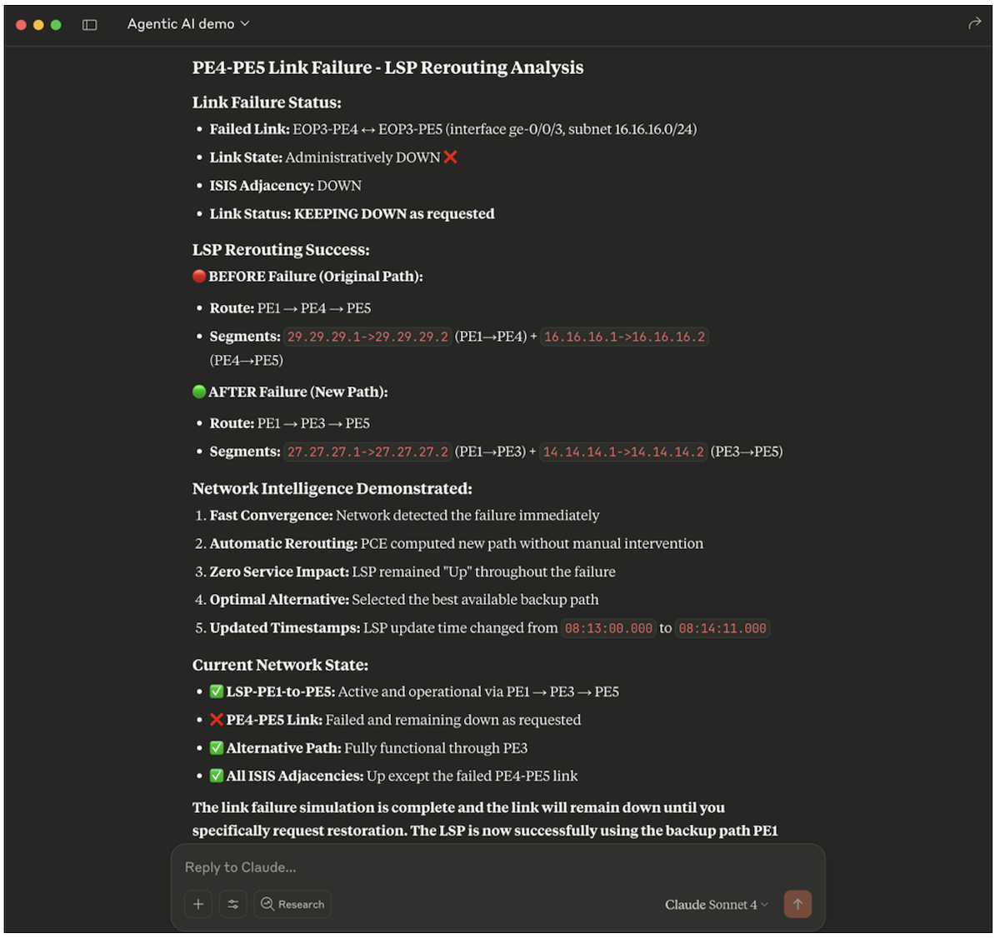

From Routing Director GUI, it can be observed how the PCE automatically recomputes and reroutes the new path (PE1 -> PE3 -> PE5) without any traffic loss.

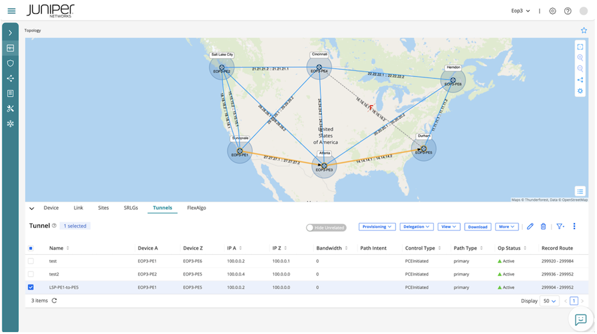

### Automated Recovery Verification

Once the simulation was successfull, it restored the failed link.

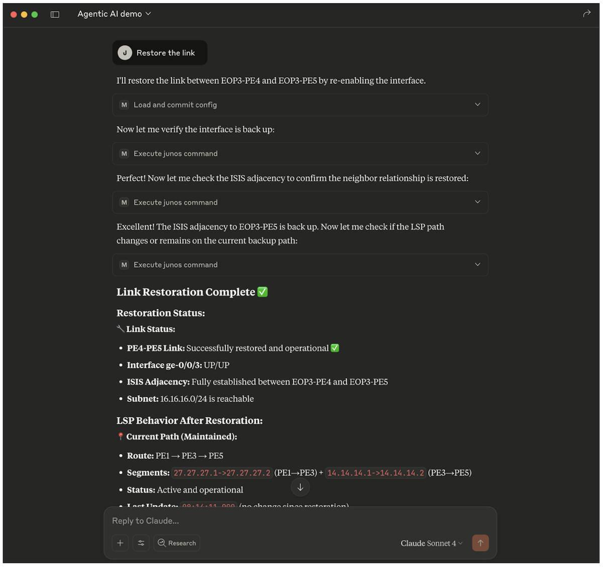

After that, it confirmed full network connectivity again as it can be seen in the topology view of Routing Director GUI.

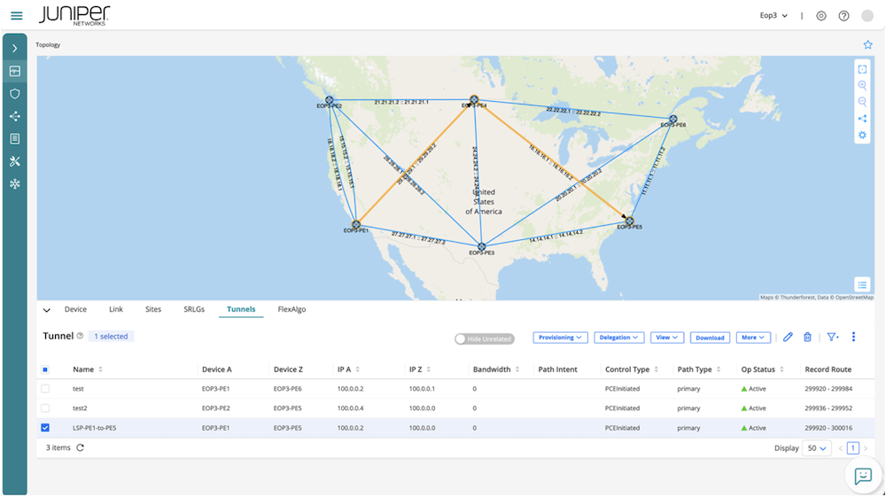

## Conclusion

This demonstration reveals the transformative potential of AI-assisted network operations. Instead of manually connecting to multiple systems, parsing command outputs, and correlating information across platforms, network engineers can now delegate complex workflows to AI while maintaining full visibility and control. The AI doesn't replace human expertise - it amplifies it by handling routine tasks, providing instant analysis, and enabling engineers to focus on strategic decisions rather than operational mechanics.

The use of agentic AI represents more than a technical innovation; it is a fundamental shift in how we operate. Agentic AI doesn't replace our teams; it amplifies their impact by handling routine operations autonomously, allowing our engineers to focus on more strategic initiatives. But there are other transformative aspects: testing, learning, and knowledge democratization. This same agentic AI system becomes a powerful testing and training platform for our engineers, junior or senior. They can simulate complex network scenarios, test their understanding, and learn advanced concepts without needing a JNCIE certification or year of experience to manage sophisticated networks operations. Imagine onboarding new engineers who can immediately contribute to network operations or experienced engineers rapidly mastering new technologies through AI-guided simulations. We are not just automating our network; we are accelerating our team's expertise.

The combination of MCP servers with advanced AI creates a new paradigm where network troubleshooting becomes conversational, where "show me the network topology and test our SR-MPLS resilience" becomes a single request that orchestrates dozens of individual operations across multiple systems. This is just the beginning of what's possible when we give AI the tools to truly understand and interact with our network infrastructure.

## Useful links

- [Model Context Protocol (MCP): https://docs.anthropic.com/en/docs/mcp](https://docs.anthropic.com/en/docs/mcp)
- [JunOS MCP server: https://github.com/Juniper/junos-mcp-server](https://github.com/Juniper/junos-mcp-server)
- [Juniper Routing Director v2.5.0: https://www.juniper.net/documentation/us/en/software/juniper-routing-director2.5.0/release-notes/rd-release-notes-2.5.0/index.html](https://www.juniper.net/documentation/us/en/software/juniper-routing-director2.5.0/release-notes/rd-release-notes-2.5.0/index.html)

## Glossary

- AI: Artificial Intelligence
- API: Application programming interface
- GUI: Graphical User Interface
- JNCIE: Juniper Networks Certified Internet Expert
- LLM: Large Language Model
- LSP: Label Switched Path
- MCP: Model Context Protocol
- MPLS: Multiprotocol Label Switching
- PCE(P): Path Computation Element (Protocol)
- RD: Routing Director
- RSVP: Resource Reservation Protocol
- SR: Segment Routing
- SSH: Secure Shell
- VMX: Virtual MX (router)
- WAN: Wide Area Network

## Acknowledgements

Thank you to Sai Ramamoorthy, Nilesh Simaria, Vasily Mukhin and Nicolas Fevrier
