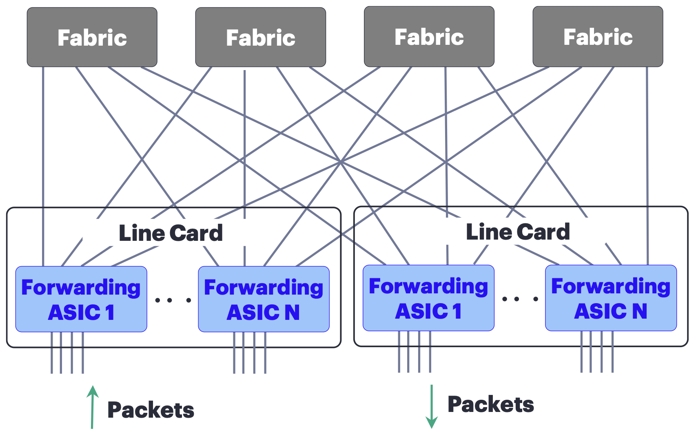
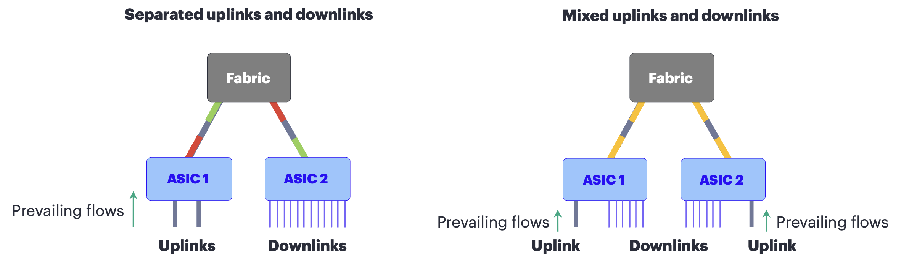
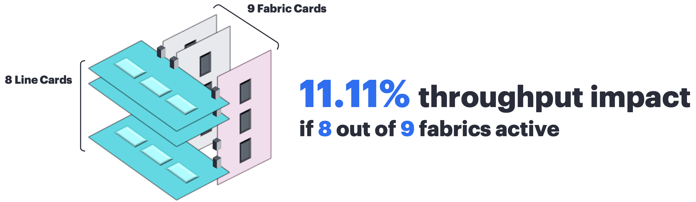
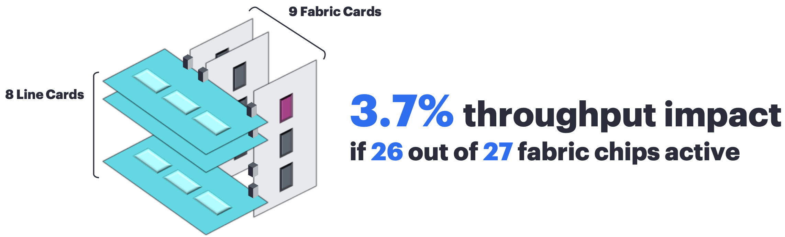

# Rethinking Fabric Redundancy

**Dmitry Shokarev - 03/27/2026**

Fabrics are considered internal components of the router and if one fails, there should be no performance degradation. This was the expectation for many years. But supporting it is not practical anymore. It is now time to reset the expectation, look at the problem again and address it differently.

## Why Fabric Redundancy?

High-capacity routers have distributed forwarding architecture where multiple forwarding chips communicate over non-blocking fabric, typically comprised of multiple fabric modules, Figure 1.



As any component in a system, fabric modules can fail, potentially degrading system switching performance.

Operators can reduce the impact by optimizing the distribution of the connections across modules / forwarding ASICs. This can be done if traffic patterns are predictable and they are not changing.

For example, mixing uplink and downlink interfaces of an aggregation router is a great strategy to reduce the maximum fabric interface utilization thus eliminating the impact of the fabric failure, Figure 2.



Link color in the Figure 2 represents load (red -- high, yellow -- medium, and green -- low).

But this strategy may not work well in other network locations, for example, WAN and Data Center Interconnect backbones, or evolving backend fabrics for GPU interconnect in the AI training clusters.

So, can we afford full fabric redundancy in the system?

## Evolution Over Years

Fabric redundancy does not come for free; it considerably increases system's cost and power consumption:

- More switching capacity needs to be provisioned. Depending on the chassis, the cost increase may be in the 5-10% range.
- Power consumption increases too, just SERDES alone consumes around 1W per 100G link between the fabric and the forwarding ASIC in 7nm node. This is about 648W potential increase at PTX12012 system level. Note, these links must be kept active for faster failover, as link training takes minutes, therefore the tax is not load-dependent.

The challenges above were managed by vendors over generations of products and fabric redundancy was the norm for quite some time.

**But not anymore!**

The new trade off emerged recently: new forwarding ASIC designs are I/O limited and adding extra fabric interfaces means reducing the number of WAN interfaces.

So, a better alternative would be to minimize the impact of fabric failure, and if fabric redundancy is absolutely required, then simply disable some of the WAN interfaces on the line card.

And this is what HPE Networking is doing in modern PTX systems, such as PTX12K.

## Reducing Blast Radius

The first technique is obvious -- with more fabric modules the failure impact of single module failure is reducing.

This is why [PTX12K systems](https://juniper.github.io/techposts/introducing-ptx12000-chassis/article) have 9 fabric cards, the highest number of fabrics among routing products available today, as illustrated in Figure 3 below.



Another optimization is less straightforward: each fabric module is comprised of several fabric ASICs, with relatively low interface number per chip: 144 x 100G.

Fabric ASICs have minimal, if no sharing at the component level and can be isolated individually in case of failure.

This way the impact can be reduced to 3.7% (this functionality is not currently enabled in software).



It is interesting to note that with fabric chips, smaller radix helps to reduce the blast radius. Bigger is not always better!

## Summary

As a summary, modern modular systems are not designed to support extra forwarding capacity to compensate for fabric failures.
However, with multiple fabrics and multiple smaller fabric chips, the impact of the fabric failures can be minimized.

PTX12K from HPE Networking has the best-in-class design to minimize the impact of fabric failures.

## Monitoring Fabric Capacity and Interface Utilization

To monitor available fabric capacity you can subscribe to the telemetry sensor using the following path:

```
/components/component/integrated-circuit
```

Below output is captured using [jtimon application](https://github.com/Juniper/jtimon) (output is truncated for brevity).

```
system_id: octomore-intf-02
component_id: 65535
sub_component_id: 0
path: sensor_1001:/components/component/integrated-circuit/:/components/component/integrated-circuit/:re0/fabricHub
sequence_number: 0
timestamp: 1774573847956
sync_response: false

  key: integrated-circuit/backplane-facing-capacity/state/available-pct
  uint_value: 100
```

## Useful links

- Introducing PTX12000 Chassis: [https://juniper.github.io/techposts/introducing-ptx12000-chassis/article](https://juniper.github.io/techposts/introducing-ptx12000-chassis/article)
- PTX12008 Fabric Topology: [https://juniper.github.io/techposts/ptx12008-fabric-topology/article](https://juniper.github.io/techposts/ptx12008-fabric-topology/article)
- Fabric Self Healing and Recovery: [https://juniper.github.io/techposts/self-healing-and-recovery-mechanisms-for-ptx12008/article](https://juniper.github.io/techposts/self-healing-and-recovery-mechanisms-for-ptx12008/article)

## Glossary

- AI: Artificial Intelligence
- ASIC: Application Specific Integrated Circuit
- DC: Data Center
- DCI: Data Center Interconnect
- GPU: Graphics Processing Unit
- HPE: Hewlett Packard Enterprise
- I/O: Input / Output
- PTX: Packet Transport Router (Juniper high-end routing platform)
- WAN: Wide Area Network

## Acknowledgments

Nicolas Fevrier, Luis Zamora and Rahul Kulkarni helped with the reviews and suggestions.
