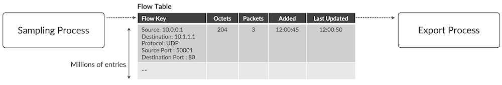
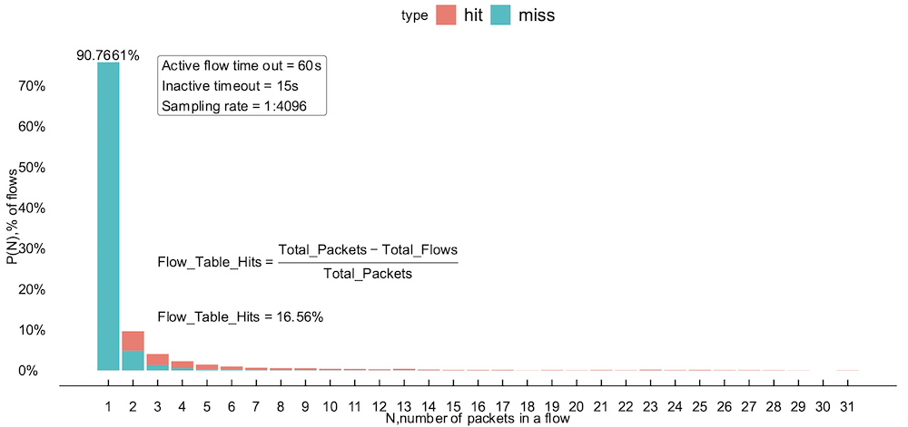
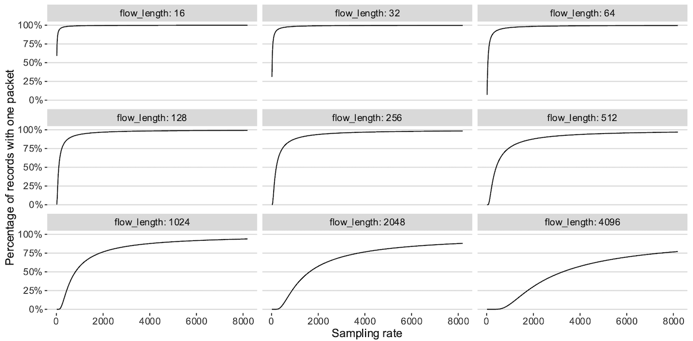
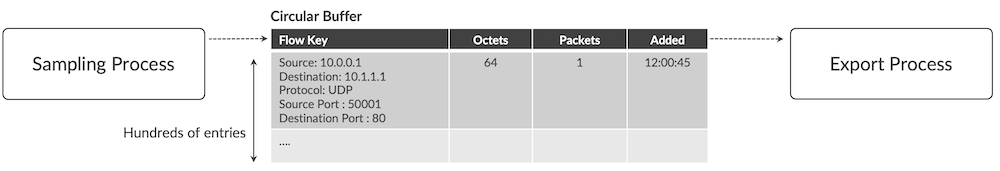

# Sampling Evolution

**Dmitry Shokarev - 10/16/2022**

Are the flow caches effective to support IPFIX implementations today? What happens if we stop using them? Learn about the new IPFIX implementation in Juniper PTX and ACX7000 routers.

## Introduction

NetFlow was initially designed as a flow monitoring technique where the network element monitors IP flows, aggregates statistics over multiple packets of the same flow, and periodically exports flow statistics to the collector. Flow statistics typically include information that identifies a flow (a combination of IP header fields), and metadata, such as the incoming and outgoing interfaces of the packet. Modern versions of the NetFlow protocol are standardized in IETF, [RFC 5101](https://datatracker.ietf.org/doc/html/rfc5101) and [RFC 7011](https://datatracker.ietf.org/doc/html/rfc7011), and it is now called IPFIX. These protocols are extensible and allow reporting of arbitrary information from the network element. IPFIX applications extend beyond traditional routing applications: IPFIX is used for [Carrier Grade NAT session logging](https://www.juniper.net/documentation/us/en/software/junos/flow-monitoring/topics/task/services-flowmonitoring-logs-nat-configuring.html), and arbitrary MIB statistics export.

However, the main IPFIX application is the export of flows, and IPFIX is strongly associated with flow aggregation on the router itself.

This article aims to demonstrate that there is little to no benefit in using flow aggregation on the router anymore for many practical core and peering applications. More than that, there are applications where flow aggregation is not desirable, because of the extra latency aggregation it introduces.

> Note: This article has been written with PTX10000 in mind, but the same implementation is used in the ACX7000 Series too. The MX Series is still using a flow cache approach.

## Flow Export Implementation

A typical IPFIX flow export implementation is comprised of two processes, export and sampling, plus a flow table where millions of flows reside temporarily.



When a packet is sampled, the sampling process extracts packet header fields that form the key and consults the flow table. In case of a miss, a new entry is added, and the flow key and other fields of the new entry are initialized. If an existing flow table entry is hit, the packet and byte count fields of an existing flow are incremented.

The export process periodically walks the table and exports flows that had no activity for the specified duration (inactive flow timeout), or active flows that have not been exported for a long time (active flow timeout).

Sampling and export processes may be implemented in the ASIC, or in software. Flow table may also reside in the ASIC or in software. Hybrid models are possible too. Regardless of the implementation, how effective is the flow aggregation?

The answer depends on the sampling rate, and timeouts configuration. Figure 2 shows statistics collected from the production network serving Internet traffic. With 1:4096 sampling rate, 60s active flow timeout and 15s inactive flow timeout **90.7661%** of flow records contain only one packet.



To measure the effectiveness of the flow table we need to measure the proportion of packets that hit known flow table entries. The formula to compute this number is rather simple and it is shown on the plot. Only **16.56%** of packets can leverage the flow aggregation capability of the device in this case.

Both total packet statistics and total flow statistics is reported by JUNOS today and can be collected by running the command below.

```
user@router> show services accounting flow inline-jflow fpc-slot 0
  Flow information
    FPC Slot: 0
    Flow Packets: 2525882835, Flow Bytes: 1759044202265
    Active Flows: 16602, Total Flows: 2045424663
    Flows Exported: 2042540070, Flow Packets Exported: 776552744
    Flows Inactive Timed Out: 2037891816, Flows Active Timed Out: 7516247
 
    IPv4 Flows:
    IPv4 Flow Packets: 2464206449, IPv4 Flow Bytes: 1714169514735
    IPv4 Active Flows: 16109, IPv4 Total Flows: 1996750136
    IPv4 Flows Exported: 1993944138, IPv4 Flow Packets exported: 730194911
    IPv4 Flows Inactive Timed Out: 1989433298, IPv4 Flows Active Timed Out: 7300731
 
    IPv6 Flows:
    IPv6 Flow Packets: 61676386, IPv6 Flow Bytes: 44874687530
    IPv6 Active Flows: 493, IPv6 Total Flows: 48674527
    IPv6 Flows Exported: 48595932, IPv6 Flow Packets Exported: 46357833
    IPv6 Flows Inactive Timed Out: 48458518, IPv6 Flows Active Timed Out: 215516
```

We conducted analysis on several deployments, and the results are presented in the Table 1.

Table: Flow Table Hit Ratio

| ID | Rate | Inactive Timeout | Active Timeout | Flow Table Hit Ratio |
|:--|:--|:--|:--|:--|
| 1 | 100 | 15 | 600 | 80.01% |
| 2 | 500 | 60 | 60 | 63.41% |
| 3 | 1000 | 15 | 60 | 46.13% |
| 4 | 1000 | 15 | 60 | 55.86% |
| 5 | 1000 | 60 | 60 | 35.38% |
| 6 | 1024 | 60 | 1800 | 16.40% |
| 7 | 2000 | 60 | 1800 | 1.74% |
| 8 | 4000 | 60 | 1800 | 29.43% |
| 9 | 4096 | 60 | 1800 | 17.66% |
| 10 | 8192 | 60 | 120 | 13.55% |
| 11 | 10000 | 60 | 1800 | 16.39% |
| 12 | 32767 | 60 | 1800 | 3.54% |

As the data suggests, the percentage of flows with a single packet increases with the sampling rate. And there is a theoretical explanation for this.

Figure 3 shows the theoretical analysis of single packet flow percentage as function of the sampling rate (from 16 to 8192) and different flow lengths (from 16 to 4096), see the Appendix section for details how these plots are produced.



Studies in Annex [1] and [2] show that more than 99% of the flows have less than 200 packets, hence most of the time only single packet from the flow is sampled with reasonable sampling rates.

If only single packet is sampled, then flow aggregation table maintenance offers no benefit, and the implementation can be simplified.

In a simplified implementation, flow table with millions of entries is replaced with a small circular buffer with hundreds of entries, Figure 4.

Sampling process adds new entries to the buffer, and export process gathers them, creates flow reports and sends out to the collector.



## Conclusion

Simplified IPFIX sampling implementation reduces memory footprint and increases the performance: no flow table management is needed.
There is another added benefit: flow reporting latency reduces to less than a second, compared to 15 and more seconds in IPFIX case (typical active flow and inactive flow timeouts). If no flow table is managed, the next step in the evolution process is to report the packet content instead of just packet fields. This is a topic for the future article.
Keep in mind that sampling rate must be relatively high for the approach to be feasible, but these sampling rates are typical in most of the peering and core deployments. Lower sampling rates, down to 1:1, require very different implementation, to be described in the future article.

## Application in Juniper Routers

Starting from 21.3 release, Juniper 100GE PTX routers based on Express 2 chipset (Paradise) use new simplified implementation by default, with an option to fall back to the flow cache mode when nexthop-learning knob is configured, see documentation.
400GE PTX routers only use new simplified IPFIX implementation, and demonstrate outstanding sampling performance among routers in its class, up to 150 thousands of sampled packets per second per line card or a fixed form factor system.

### Appendix: Theoretical Analysis R Script

The R script below is used to produce the Figure 3.

```
library(tidyverse)
library(ggplot2) 
library(scales) 
library(ggthemes)
summary_analysis <-data.frame( rate = seq(16,8192,16)) %>%
  left_join( data.frame( flow_length = c(16,32,64,128,256,512,1024,2048,4096)), by=character()) %>%
  mutate( p_sampled_once = dbinom(1,size=flow_length, prob=1/rate),
          p_sampled_twice_or_more = 1 - pbinom(1,size=flow_length, prob=1/rate),
          p_seeing_one = p_sampled_once / (p_sampled_once + p_sampled_twice_or_more),
          p_seeing_two_or_more = p_sampled_twice_or_more / (p_sampled_once + p_sampled_twice_or_more))

ggplot( summary_analysis, aes(x=rate, y=p_seeing_one)) +
  geom_line() +  
  scale_y_continuous( labels=label_percent(accuracy=1))+
  theme_hc()+ 
  theme(panel.border = element_blank(),
        plot.background=element_blank())+
  facet_wrap(vars(flow_length), labeller=labeller(flow_length = label_both)) +
  xlab( "Sampling rate") + 
  ylab( "Percentage of records with one packet") 
```

## References

- Qian and B. E. Carpenter, "A flow-based performance analysis of TCP and TCP applications," 2012 18th IEEE International Conference on Networks (ICON), 2012, pp. 41-45, doi: 10.1109/ICON.2012.6506531.
- Jurkiewicz, Piotr, Grzegorz Rzym, and Piotr Borylo. "Flow length and size distributions in campus Internet traffic." Computer Communications 167 (2021): 15-30
- [https://datatracker.ietf.org/doc/html/rfc5101](https://datatracker.ietf.org/doc/html/rfc5101)
- [https://datatracker.ietf.org/doc/html/rfc7011](https://datatracker.ietf.org/doc/html/rfc7011)

## Glossary

- ASIC: Application Specific Integrated Circuit
- CGNAT: Carrier Grade Network Address Translation
- IETF: Internet Engineering Task Force
- RFC: Requests for Comments
- IPFIX: IP Flow Information Export

## Acknowledgements

Many thanks to Ranjith S V V Kumar and Alex Baban for reviewing this article.
