# Saving Energy on PTX with PFE Power Off

**Ramdas Machat - 07/27/2023**

Let's test the real power saving on PTX platforms achieved when shutting down used and unused Packet Forwarding Engine (PFE).

## Introduction

Power efficiency is key in today's ever-growing Service providers and Cloud providers networks. Network industry improved the power and carbon footprint over the years through real innovations in silicon: manufacturing process, various components integration on the die and the package, monitoring and manageability.

PTX routers offer the granular control of individual PFE without impacting the other units present on the line card or the system. Operators can power on, power off and restart them at will, saving significant amount of energy.

In this article, we will detail:

- the multiple ways to power off PFEs manually and how to configure the system to take actions on PFE in case of error
- the power saving achieved turning off PFEs on an LC1201 in a PTX10016 with DR4 inserted and without affecting the traffic flowing on other ASICs of the card
- the power saving achieved turning off PFE on LC1201 in the three chassis types (PTX10004, PTX10008 and PTX10016) but also on fixed platforms like PTX10001-36MR, all of them without any optics inserted

Scope: we will not cover other Juniper platforms (MX/ACX/QFX/EX/...), only PTX.

## PFE Power Off and Error Action

Packet Forward Engine are at the heart of our routing devices. Routers and Line Cards contains one or several of them. Multiple PFEs are interconnected via a switch fabric and fabric SerDes.

We can imagine multiple situations where you would like to turn off a PFE.

The first one is obvious: when PFEs are not in use. That could be the case if you use Pay As You Grow (PAYG) model with just a portion of the system/linecard capability. Or you didn't provisioned all ports yet and you strategicaly positioned your current ports to keep one or several PFE unused. Turning these unused PFEs off will reduce the system power consumption.

A second use-case would be to power off specific PFEs during periods of low traffic, usually at night. Traffic engineering rules will make sure no packets traverse these PFEs, and you can automate their power off to save energy for a couple of hours.

Let's take for example a PTX10001-36MR to  illustrate these scenarios

- with optics connected and forwarding traffic on PFE0
- without any optic modules on PFE1
- with optics connected but no traffic on PFE2

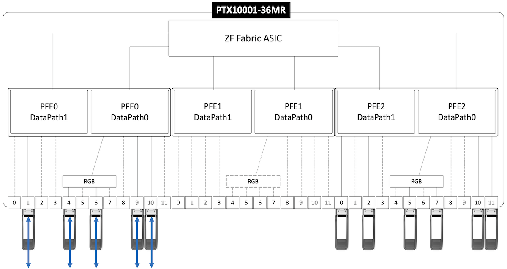

Several power saving features are activated by default on PTX:

- Empty ports SerDes are shutdown (example: et-0/0/0)
- Gearboxes with only empty ports are kept in reset mode, SerDes to the PFE and to the optic cages are shutdown (example: ports et-0/1/4 to et-0/1/7)

The network operator can decide to go further than the default behavior and shutdown / power off the PFE1, since no ports are using it. That's our first use-case described above.

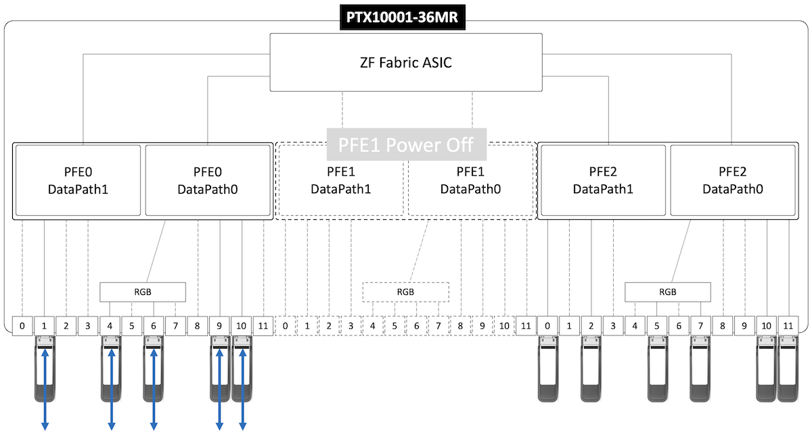

That's the tests we will perform on various chassis and fixed platform in the second part of this article. It will give us a good idea of the saving we can get from the PFE only (since the ports, gearboxes and SerDes are shutdown already).

Some users could decide to go even further and power off PFE2 (with optics but no traffic):

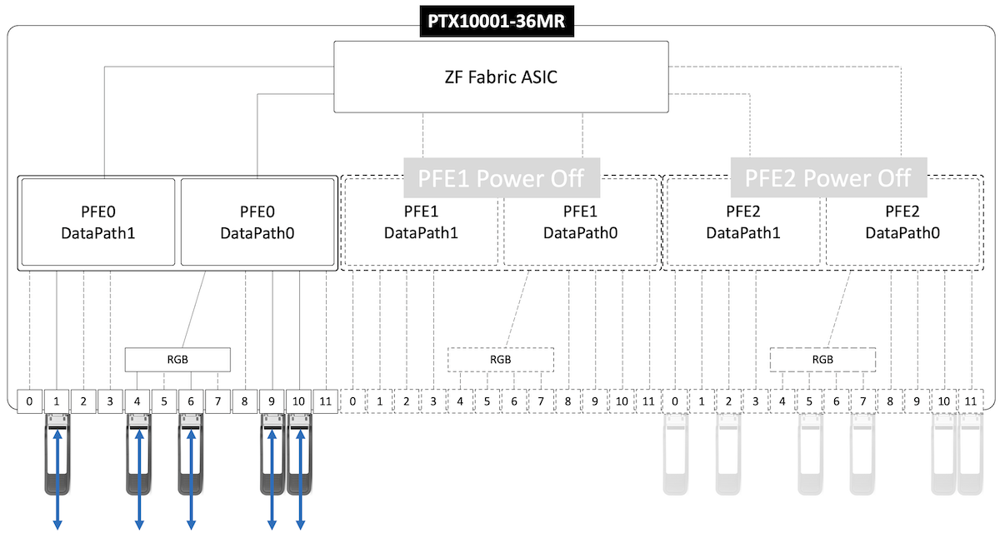

Of course, all ports on PFE1 and PFE2 disappeared and will only be restored after we turn the PFEs on again.

These are the tests we will run on the first part of this techpost, specifically on a PTX10016 and LC1201. It will give us an idea of the savings achieved with optics, SerDes and PFE being turned off.

We picked the PTX10001-36MR for illustration of the use-cases but it's equally applicable for other PTX10003 and PTX10k chassis and line cards.

### Supported Platforms

The handling of PFEs independently of the FPC (and other PFEs) is available in Junos EVO-only platforms and the Table1 below displays the first releases supporting this feature.

Table: Supported Hardware and Software release

| Line Card | Number of PFEs | Platform | Supported Release |
|:--|:--|:--|:--|
| FPC-JNP10003 | 80C - 8160C - 16 | PTX10003-80CPTX10003-160C | 22.4R1-EVO |
| JNP10K-LC1201 | 5 | PTX10008 | 21.2R1-EVO |
| JNP10K-LC1201 | 5 | PTX10004/PTX10016 | 21.4R1-EVO |
| JNP10K-LC1202 | 2 | PTX10004/10008/10016 | 21.4R1-EVO |
| FPC-JNP10001-36MR | 3 | PTX10001-36MR | 22.3R1-EVO |

### PFE States

Here are the possible PFE states which can be observed by running the CLI command "show chassis fpc pfe-instances all"

Table: PFE States

| PFE State | Description |
|:--|:--|
| ONLINE | PFE is Online |
| Configured Power Off | PFE is Offline via Configuration on router |
| Offlined by CLI | PFE Offline via Request CLI operation by user on router |
| Offlined by CMError | PFE Offline via CMError Action |
| Transition_OFFLINE | PFE Transition status |
| FAULT | When "disable-pfe" CMError action is taken by the Router on Major/Fatal errors |
| PowerOn | PFE state during PFE power on transition |
| RESYNC | This is the state when the PFE is synchronizing the state with other components withing the system |
| READY | When the PFE is ready after power on but not online yet. Takes a few more seconds to bring up online |

## PFE Power Off

We will carry out tests on Express4-based PTX platforms: modular chassis (4, 8 and 16 slots) with 36x400GE LC1201 linecards, and on PTX10001-36MR fixed router. Routers were running Junos EVO versions: 22.4R2.11-EVO and  23.2R1.15-EVO

### Configuration and CLI

PFE can be independently Powered off/on using Configuration mode or Operational (CLI) mode.

Below Table 3 shows the support of this feature across the platforms.

Table: Platforms Support for PFE Power On/Off

| Mode | PTX10004 | PTX10008 | PTX10016 | PTX10001-36MR | PTX10003-80C | PTX10003-160C |
|:--|:--|:--|:--|:--|:--|:--|
| Config | sqrt | sqrt | sqrt | sqrt | sqrt | sqrt |
| CLI | sqrt | sqrt | sqrt | sqrt | X | X |

Configuration Method

```
ptx10k16-01# set chassis fpc 0 pfe 0 power ?
Possible completions:
  off                  Power off PFE
  on                   Power on PFE

ptx10k16-01# set chassis fpc 0 pfe 0 power off 
ptx10k16-01# commit
```

CLI Method

```
ptx10k16-01> request chassis fpc slot 0 pfe-instance 0 ?
Possible completions:
  no-forwarding        No forwarding
  offline              Take FPC or PFE-instance offline
  online               Bring FPC or PFE-instance online
  restart              Restart FPC or PFE-instance
  tag                  Firmware tag for online-reload

ptx10k16-01> request chassis fpc slot 0 pfe-instance 0 offline 
Fru Block offline initiated!

ptx10k16-01>
```

The "operation" CLI methods doesn't need to commit a configuration, which could be an advantage is certain cases.

Regardless the method, it takes less than 5s to transition to offline state.

## Test1: PFE PowerOff/Offline with Optics and Traffic

In this first test, we will apply the two methods for two PFEs 0 and 1, and we will verify it does not impact other PFEs in the system.

We will use a LC1201 in a PTX10016 (16-slot chassis), offering 36 ports 400GE and based of 5x Express4. Each PFE package contains itself two datapaths.

All ports are populated with DR4 optics but only the last 20 are connected to a traffic generator pushing 50% full-meshed traffic, 512 bytes per packet.

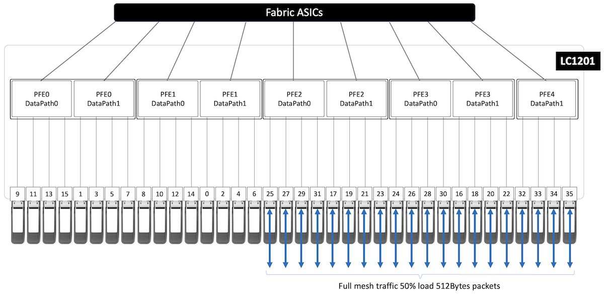

```
ptx10k16-01> show interfaces terse 
Interface               Admin Link Proto    Local                 Remote
et-0/0/0                up    up
et-0/0/0.0              up    up   inet     100.1.1.1/24    
                                   multiservice
pfh-0/0/0               up    up
pfh-0/0/0.16383         up    up   inet    
et-0/0/2                up    up
et-0/0/2.0              up    up   inet     100.1.3.1/24    
                                   multiservice
et-0/0/4                up    up
et-0/0/4.0              up    up   inet     100.1.5.1/24    
                                   multiservice
et-0/0/6                up    up
et-0/0/6.0              up    up   inet     100.1.7.1/24    
                                   multiservice
et-0/0/8                up    up
et-0/0/8.0              up    up   inet     100.1.9.1/24    
                                   multiservice
et-0/0/10               up    up
et-0/0/10.0             up    up   inet     100.1.11.1/24   
                                   multiservice
et-0/0/12               up    up
et-0/0/12.0             up    up   inet     100.1.13.1/24   
                                   multiservice
et-0/0/14               up    up
et-0/0/14.0             up    up   inet     100.1.15.1/24   
                                   multiservice
et-0/0/16               up    up
et-0/0/16.0             up    up   inet     100.1.17.1/24   
                                   multiservice
et-0/0/17               up    up
et-0/0/17.0             up    up   inet     100.1.18.1/24   
                                   multiservice
et-0/0/18               up    up
et-0/0/18.0             up    up   inet     100.1.19.1/24   
                                   multiservice
et-0/0/19               up    up
et-0/0/19.0             up    up   inet     100.1.20.1/24   
                                   multiservice
et-0/0/20               up    up
et-0/0/20.0             up    up   inet     100.1.21.1/24   
                                   multiservice
et-0/0/21               up    up
et-0/0/21.0             up    up   inet     100.1.22.1/24   
                                   multiservice
et-0/0/22               up    up
et-0/0/22.0             up    up   inet     100.1.23.1/24   
                                   multiservice
et-0/0/23               up    up
et-0/0/23.0             up    up   inet     100.1.24.1/24   
                                   multiservice
et-0/0/24               up    up
et-0/0/24.0             up    up   inet     100.1.25.1/24   
                                   multiservice
et-0/0/25               up    up
et-0/0/25.0             up    up   inet     100.1.26.1/24   
                                   multiservice
et-0/0/26               up    up
et-0/0/26.0             up    up   inet     100.1.27.1/24   
                                   multiservice
et-0/0/27               up    up
et-0/0/27.0             up    up   inet     100.1.28.1/24   
                                   multiservice
et-0/0/28               up    up
et-0/0/28.0             up    up   inet     100.1.29.1/24   
                                   multiservice
et-0/0/29               up    up
et-0/0/29.0             up    up   inet     100.1.30.1/24   
                                   multiservice
et-0/0/30               up    up
et-0/0/30.0             up    up   inet     100.1.31.1/24   
                                   multiservice
et-0/0/31               up    up
et-0/0/31.0             up    up   inet     100.1.32.1/24   
                                   multiservice
et-0/0/32               up    up
et-0/0/32.0             up    up   inet     100.1.33.1/24   
                                   multiservice
et-0/0/33               up    up
et-0/0/33.0             up    up   inet     100.1.34.1/24   
                                   multiservice
et-0/0/34               up    up
et-0/0/34.0             up    up   inet     100.1.35.1/24   
                                   multiservice
et-0/0/35               up    up
et-0/0/35.0             up    up   inet     100.1.36.1/24   
                                   multiservice

ptx10k16-01> show chassis fpc pfe-instance all    
FPC 0
PFE-Instance      PFE-State
   0              ONLINE               
   1              ONLINE               
   2              ONLINE               
   3              ONLINE               
   4              ONLINE             

ptx10k16-01> show chassis pic fpc-slot 0 pic-slot 0    
FPC slot 0, PIC slot 0 information:
  Type                             JNP10K-36QDD-LC-PIC
  State                            Online    
  PIC version                    00.00
  Uptime    15 hours, 44 minutes, 25 seconds
Port speed information:

  Port  PFE      Capable Port Speeds
  0      1       1x10G 4x10G 1x40G 4x25G 1x100G 2x50G 2x100G 3x100G 4x100G 1x400G 
  1      0       1x10G 4x10G 1x40G 4x25G 1x100G 2x50G 2x100G 3x100G 4x100G 1x400G 
  2      1       1x10G 4x10G 1x40G 4x25G 1x100G 2x50G 2x100G 3x100G 4x100G 1x400G 
  3      0       1x10G 4x10G 1x40G 4x25G 1x100G 2x50G 2x100G 3x100G 4x100G 1x400G 
  4      1       1x10G 4x10G 1x40G 4x25G 1x100G 2x50G 2x100G 3x100G 4x100G 1x400G 
  5      0       1x10G 4x10G 1x40G 4x25G 1x100G 2x50G 2x100G 3x100G 4x100G 1x400G 
  6      1       1x10G 4x10G 1x40G 4x25G 1x100G 2x50G 2x100G 3x100G 4x100G 1x400G 
  7      0       1x10G 4x10G 1x40G 4x25G 1x100G 2x50G 2x100G 3x100G 4x100G 1x400G 
  8      1       1x10G 4x10G 1x40G 4x25G 1x100G 2x50G 2x100G 3x100G 4x100G 1x400G 
  9      0       1x10G 4x10G 1x40G 4x25G 1x100G 2x50G 2x100G 3x100G 4x100G 1x400G 
  10     1       1x10G 4x10G 1x40G 4x25G 1x100G 2x50G 2x100G 3x100G 4x100G 1x400G 
  11     0       1x10G 4x10G 1x40G 4x25G 1x100G 2x50G 2x100G 3x100G 4x100G 1x400G 
  12     1       1x10G 4x10G 1x40G 4x25G 1x100G 2x50G 2x100G 3x100G 4x100G 1x400G 
  13     0       1x10G 4x10G 1x40G 4x25G 1x100G 2x50G 2x100G 3x100G 4x100G 1x400G 
  14     1       1x10G 4x10G 1x40G 4x25G 1x100G 2x50G 2x100G 3x100G 4x100G 1x400G 
  15     0       1x10G 4x10G 1x40G 4x25G 1x100G 2x50G 2x100G 3x100G 4x100G 1x400G 
  16     3       1x10G 4x10G 1x40G 4x25G 1x100G 2x50G 2x100G 3x100G 4x100G 1x400G 
  17     2       1x10G 4x10G 1x40G 4x25G 1x100G 2x50G 2x100G 3x100G 4x100G 1x400G 
  18     3       1x10G 4x10G 1x40G 4x25G 1x100G 2x50G 2x100G 3x100G 4x100G 1x400G 
  19     2       1x10G 4x10G 1x40G 4x25G 1x100G 2x50G 2x100G 3x100G 4x100G 1x400G 
  20     3       1x10G 4x10G 1x40G 4x25G 1x100G 2x50G 2x100G 3x100G 4x100G 1x400G 
  21     2       1x10G 4x10G 1x40G 4x25G 1x100G 2x50G 2x100G 3x100G 4x100G 1x400G 
  22     3       1x10G 4x10G 1x40G 4x25G 1x100G 2x50G 2x100G 3x100G 4x100G 1x400G 
  23     2       1x10G 4x10G 1x40G 4x25G 1x100G 2x50G 2x100G 3x100G 4x100G 1x400G 
  24     3       1x10G 4x10G 1x40G 4x25G 1x100G 2x50G 2x100G 3x100G 4x100G 1x400G 
  25     2       1x10G 4x10G 1x40G 4x25G 1x100G 2x50G 2x100G 3x100G 4x100G 1x400G 
  26     3       1x10G 4x10G 1x40G 4x25G 1x100G 2x50G 2x100G 3x100G 4x100G 1x400G 
  27     2       1x10G 4x10G 1x40G 4x25G 1x100G 2x50G 2x100G 3x100G 4x100G 1x400G 
  28     3       1x10G 4x10G 1x40G 4x25G 1x100G 2x50G 2x100G 3x100G 4x100G 1x400G 
  29     2       1x10G 4x10G 1x40G 4x25G 1x100G 2x50G 2x100G 3x100G 4x100G 1x400G 
  30     3       1x10G 4x10G 1x40G 4x25G 1x100G 2x50G 2x100G 3x100G 4x100G 1x400G 
  31     2       1x10G 4x10G 1x40G 4x25G 1x100G 2x50G 2x100G 3x100G 4x100G 1x400G 
  32     4       1x10G 4x10G 1x40G 4x25G 1x100G 2x50G 2x100G 3x100G 4x100G 1x400G 
  33     4       1x10G 4x10G 1x40G 4x25G 1x100G 2x50G 2x100G 3x100G 4x100G 1x400G 
  34     4       1x10G 4x10G 1x40G 4x25G 1x100G 2x50G 2x100G 3x100G 4x100G 1x400G 
  35     4       1x10G 4x10G 1x40G 4x25G 1x100G 2x50G 2x100G 3x100G 4x100G 1x400G

ptx10k16-01>

---

ptx10k16-01-fpc0:pfe> show pfe id info
First Active PFE            : 0
Effective First Active PFE  : 0
Number of Active PFEs       : 5
Pfe Mask                    : 0x000000000000001f


PFEInst   Down-Flags   PPFE-ID    PFE-State   PFE-Name
------   ----------   -------------   ---------   --------
   0         0             0            ONLINE    /Chassis[0]/Fpc[0]/Pfe[0]
   0         0             1            ONLINE    /Chassis[0]/Fpc[0]/Pfe[1]
   1         0             2            ONLINE    /Chassis[0]/Fpc[0]/Pfe[2]
   1         0             3            ONLINE    /Chassis[0]/Fpc[0]/Pfe[3]
   2         0             4            ONLINE    /Chassis[0]/Fpc[0]/Pfe[4]
   2         0             5            ONLINE    /Chassis[0]/Fpc[0]/Pfe[5]
   3         0             6            ONLINE    /Chassis[0]/Fpc[0]/Pfe[6]
   3         0             7            ONLINE    /Chassis[0]/Fpc[0]/Pfe[7]
   4         0             8            ONLINE    /Chassis[0]/Fpc[0]/Pfe[8]

ptx10k16-01-fpc0:pfe>
```

The output of "show chassis pic fpc-slot 0 pic-slot 0" gives us the mapping of ports to PFE in the LC1201 and "show pfe id info" under CLI-PFE details the PFE instances.

Before starting the test, we check system power consumption:

```
ptx10k16-01> show chassis power detail 
Chassis Power        Voltage(V)    Power(W)

<SNIP>

Item                 Used(W)
  CB 0                   97
  CB 1                   83
  FPC 0                1380
  SIB 0                 499
  SIB 1                 511
  SIB 2                 514
  SIB 3                 502
  SIB 4                 499
  SIB 5                 500
  Fan Tray 0           1035
  Fan Tray 1           1043

System:
  Zone 0:
      Capacity:          10800 W (maximum 22000 W)
      Allocated power:   9370 W (1430 W remaining)
      Actual usage:      7416 W
  Total system capacity: 10800 W (maximum 22000 W)
  Total remaining power: 1430 W
```

We configured streaming telemetry and Grafana dashboards to display the power usage in real time. Note that it's a better approach that simply capturing the out of "show chassis power detail" since the numbers are always slightly fluctuating:

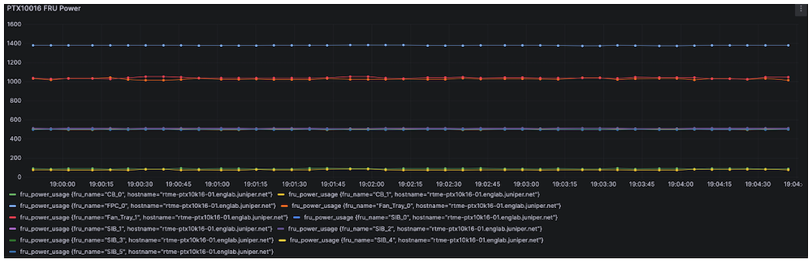

And the traffic generator shows:

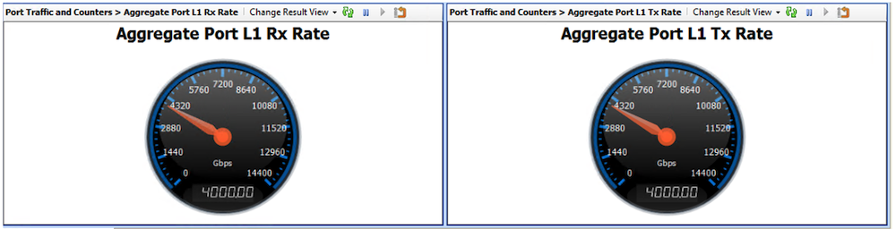

First method applied on PFE0 is via configuration:

```
ptx10k16-01# set chassis fpc 0 pfe 0 power off 
ptx10k16-01# commit 
ptx10k16-01# run show chassis fpc pfe-instance all 
FPC 0
PFE-Instance      PFE-State
   0              TRANSITION_OFFLINE   
   1              ONLINE               
   2              ONLINE               
   3              ONLINE               
   4              ONLINE       
        
ptx10k16-01# run show chassis fpc pfe-instance all    
FPC 0
PFE-Instance      PFE-State
   0              Configured power off 
   1              ONLINE               
   2              ONLINE               
   3              ONLINE               
   4              ONLINE 
```

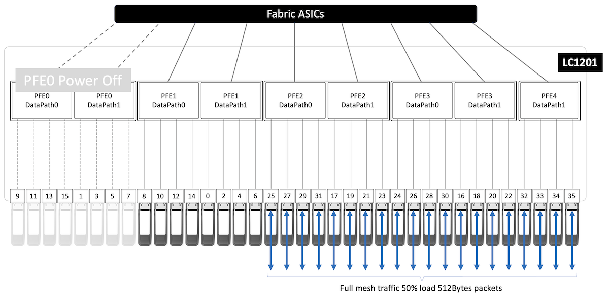

We check power usage:

```
ptx10k16-01> show chassis power detail 
Chassis Power        Voltage(V)    Power(W)

<SNIP>

Item                 Used(W)
  CB 0                   86
  CB 1                   79
  FPC 0                1133
  SIB 0                 490
  SIB 1                 501
  SIB 2                 505
  SIB 3                 491
  SIB 4                 492
  SIB 5                 496
  Fan Tray 0           1034
  Fan Tray 1           1045

System:
  Zone 0:
      Capacity:          10800 W (maximum 22000 W)
      Allocated power:   9370 W (1430 W remaining)
      Actual usage:      7152 W
  Total system capacity: 10800 W (maximum 22000 W)
  Total remaining power: 1430 W
```

This is reflected on the Grafana for the FPC0:

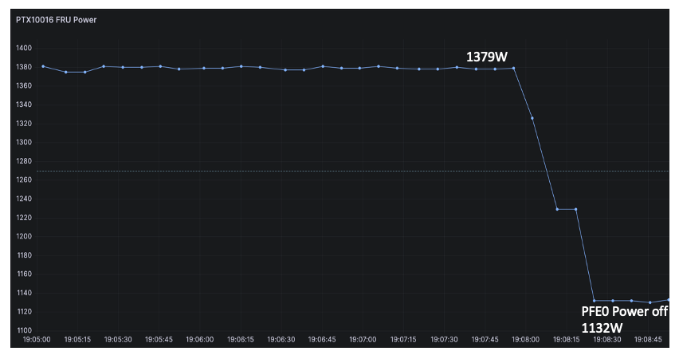

Note: these 247W of power saving include ports and SerDes, not only "PFE offline". That's why we will perform the same tests without any optics in the second part of this article.

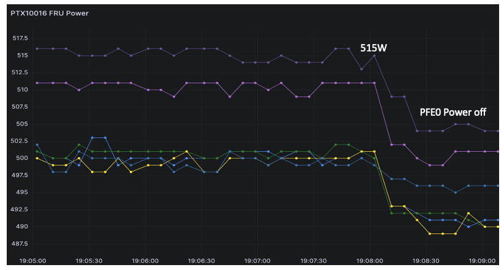

We will explain below why we are seeing also power saving on the fabric side when powering off a PFE.

We don't see any impact on the traffic flowing through PFE2, PFE3 and PFE4.

Second method applied to PFE1 with CLI:

```
ptx10k16-01> request chassis fpc slot 0 pfe-instance 1 offline    
Fru Block offline initiated!

ptx10k16-01> show chassis fpc pfe-instance all    
FPC 0
PFE-Instance      PFE-State
   0              Configured power off
   1              TRANSITION_OFFLINE   
   2              ONLINE               
   3              ONLINE               
   4              ONLINE               

ptx10k16-01> show chassis fpc pfe-instance all    
FPC 0
PFE-Instance      PFE-State
   0              Configured power off
   1              Offlined by CLI      
   2              ONLINE               
   3              ONLINE               
   4              ONLINE 
```

We clearly see the difference in PFE-State based on the two methods, but the result in term of power saving is the same. In these states, the PFEs consume a negligeable amount of energy.

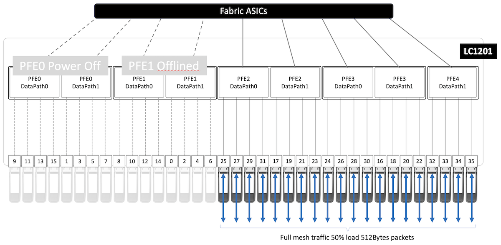

We verify again the power usage:

```
ptx10k16-01> show chassis power detail    
Chassis Power        Voltage(V)    Power(W)

<SNIP>

Item                 Used(W)
  CB 0                   86
  CB 1                   79
  FPC 0                 884
  SIB 0                 480
  SIB 1                 488
  SIB 2                 494
  SIB 3                 480
  SIB 4                 480
  SIB 5                 484
  Fan Tray 0           1023
  Fan Tray 1           1046

System:
  Zone 0:
      Capacity:          10800 W (maximum 22000 W)
      Allocated power:   9370 W (1430 W remaining)
      Actual usage:      6840 W
  Total system capacity: 10800 W (maximum 22000 W)
  Total remaining power: 1430 W 
```

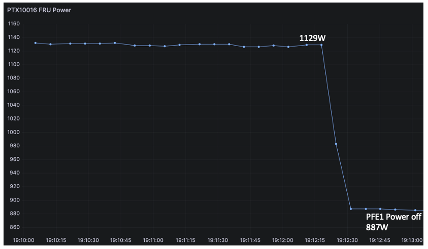

Same level of savings with the second method, which is totally aligned with our expectations.

And here again, we are seeing savings on the Fabric Cards.

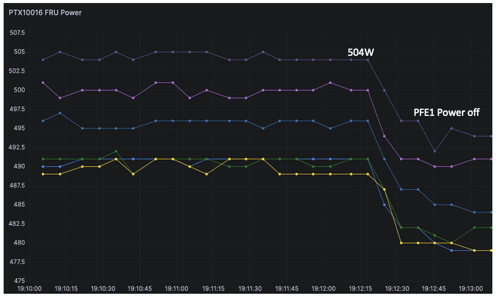

Diagram 12: Power Saving on SIBs with PFE1 Offline

With PFE0 and PFE1 powered off, all interfaces mapped to them logically disappeared.

```
ptx10k16-01> show interfaces terse 
Interface               Admin Link Proto    Local                 Remote
pfh-0/0/0               up    up
pfh-0/0/0.16383         up    up   inet    
et-0/0/16               up    up
et-0/0/16.0             up    up   inet     100.1.17.1/24   
                                   multiservice
et-0/0/17               up    up
et-0/0/17.0             up    up   inet     100.1.18.1/24   
                                   multiservice
et-0/0/18               up    up
et-0/0/18.0             up    up   inet     100.1.19.1/24   
                                   multiservice
et-0/0/19               up    up
et-0/0/19.0             up    up   inet     100.1.20.1/24   
                                   multiservice
et-0/0/20               up    up
et-0/0/20.0             up    up   inet     100.1.21.1/24   
                                   multiservice
et-0/0/21               up    up
et-0/0/21.0             up    up   inet     100.1.22.1/24   
                                   multiservice
et-0/0/22               up    up
et-0/0/22.0             up    up   inet     100.1.23.1/24   
                                   multiservice
et-0/0/23               up    up
et-0/0/23.0             up    up   inet     100.1.24.1/24   
                                   multiservice
et-0/0/24               up    up
et-0/0/24.0             up    up   inet     100.1.25.1/24   
                                   multiservice
et-0/0/25               up    up
et-0/0/25.0             up    up   inet     100.1.26.1/24   
                                   multiservice
et-0/0/26               up    up
et-0/0/26.0             up    up   inet     100.1.27.1/24   
                                   multiservice
et-0/0/27               up    up
et-0/0/27.0             up    up   inet     100.1.28.1/24   
                                   multiservice
et-0/0/28               up    up
et-0/0/28.0             up    up   inet     100.1.29.1/24   
                                   multiservice
et-0/0/29               up    up
et-0/0/29.0             up    up   inet     100.1.30.1/24   
                                   multiservice
et-0/0/30               up    up
et-0/0/30.0             up    up   inet     100.1.31.1/24   
                                   multiservice
et-0/0/31               up    up
et-0/0/31.0             up    up   inet     100.1.32.1/24   
                                   multiservice
et-0/0/32               up    up
et-0/0/32.0             up    up   inet     100.1.33.1/24   
                                   multiservice
et-0/0/33               up    up
et-0/0/33.0             up    up   inet     100.1.34.1/24   
                                   multiservice
et-0/0/34               up    up
et-0/0/34.0             up    up   inet     100.1.35.1/24   
                                   multiservice
et-0/0/35               up    up        
et-0/0/35.0             up    up   inet     100.1.36.1/24   
                                   multiservice

ptx10k16-01>
```

And no impact on the neighbor PFEs:

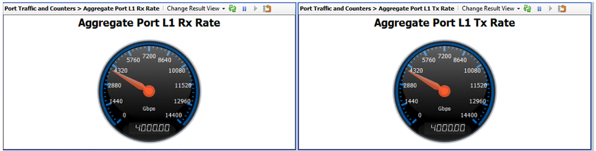

Now let's rollback and power on these two PFEs using the two different methods (we can see the different states during the booting phases).

Logically, if you powered off PFE0 via configuration, you will need to power it on via configuration. And likewise, PFE1 has been offlined by CLI and should be restored online via CLI "request chassis..." command.

```
ptx10k16-01# set chassis fpc 0 pfe 0 power on
ptx10k16-01# commit 
ptx10k16-01# run show chassis fpc pfe-instance all 
FPC 0
PFE-Instance      PFE-State
   0              PowerOn              
   1              Offlined by CLI      
   2              ONLINE               
   3              ONLINE               
   4              ONLINE               

ptx10k16-01# run show chassis fpc pfe-instance all    
FPC 0
PFE-Instance      PFE-State
   0              RESYNC               
   1              Offlined by CLI      
   2              ONLINE               
   3              ONLINE               
   4              ONLINE               

ptx10k16-01# run show chassis fpc pfe-instance all    
FPC 0
PFE-Instance      PFE-State
   0              READY                
   1              Offlined by CLI      
   2              ONLINE               
   3              ONLINE               
   4              ONLINE               

ptx10k16-01# run show chassis fpc pfe-instance all    
FPC 0
PFE-Instance      PFE-State
   0              ONLINE               
   1              Offlined by CLI      
   2              ONLINE               
   3              ONLINE               
   4              ONLINE               

ptx10k16-01# exit

ptx10k16-01> request chassis fpc slot 0 pfe-instance 2 online     
Fru Block online initiated!


ptx10k16-01> show chassis fpc pfe-instance all    

FPC 0
PFE-Instance      PFE-State
   0              ONLINE               
   1              PowerOn              
   2              ONLINE               
   3              ONLINE               
   4              ONLINE               

ptx10k16-01> show chassis fpc pfe-instance all    
FPC 0
PFE-Instance      PFE-State
   0              ONLINE               
   1              ONLINE               
   2              ONLINE               
   3              ONLINE               
   4              ONLINE               

ptx10k16-01#
```

Just for completeness, we performed the same test without any traffic over these optic modules.

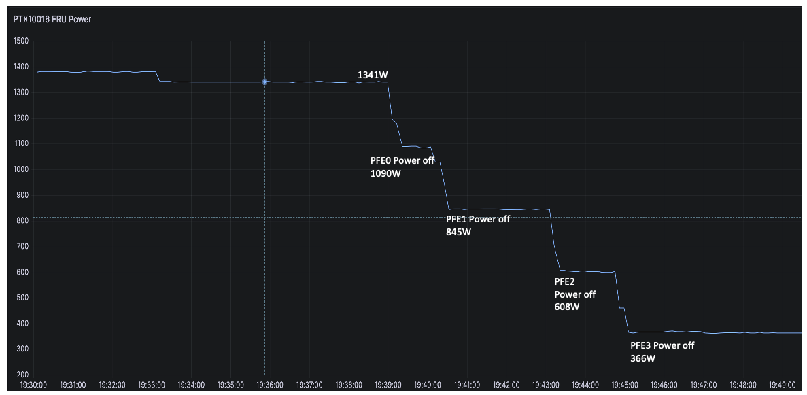

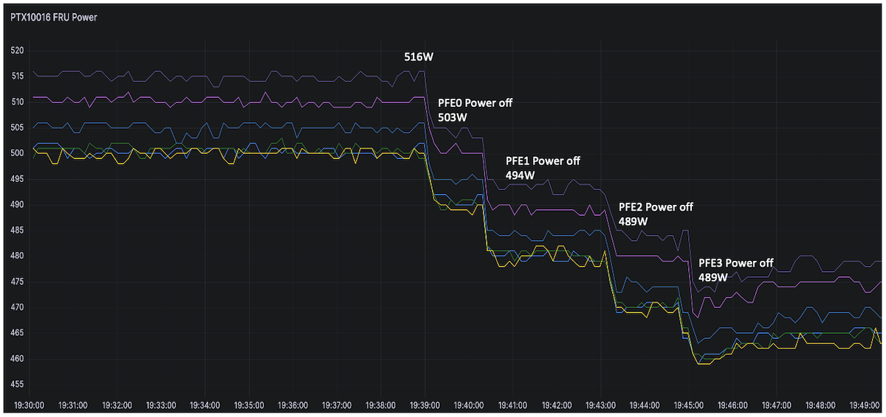

It's interesting to see that power is reduced on all the SIB fabric cards when we power off PFEs in the line cards.

It's an expected behavior since the Fabric SerDes are automatically shutdown when they are facing empty slots but also facing PFE powered off as illustrated in this diagram 13.

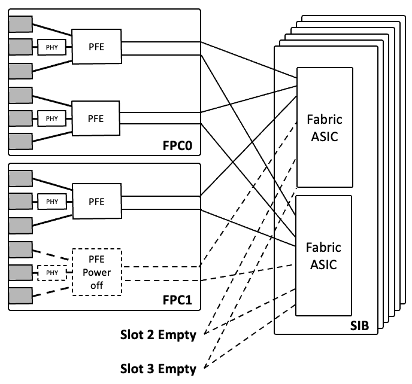

## Test2: PFE Power Off Without Optics

In Test1, we demonstrated the different methods used to put our PFEs offline / powered off on a specific platform: PTX10016 chassis with an LC1201 line cards, with DR4 optics and traffic. But we were not able to measure specifically the saving attributed to the "PFE power-off" itself, since other parts like SerDes and Optics were turned off in the process.

In this second test, we will use systems without any optics plugged. That means, the SerDes and Gearboxes (if present) are already shutdown or in reset mode, consuming negligeable amount of energy.

We will repeat the same test scenario on the 3 different chassis sizes and on the PTX10001-36MR, powering off two PFEs sequentially. When applicable (on modular chassis), we will also monitor power on fabric cards.

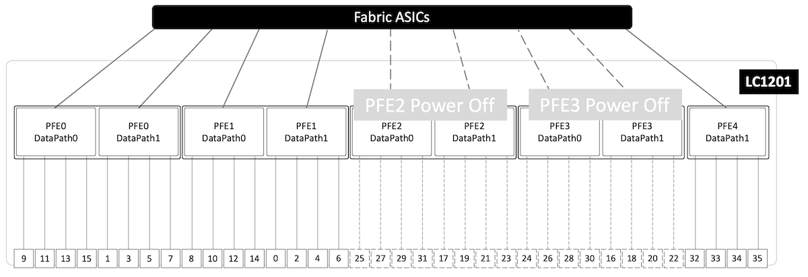

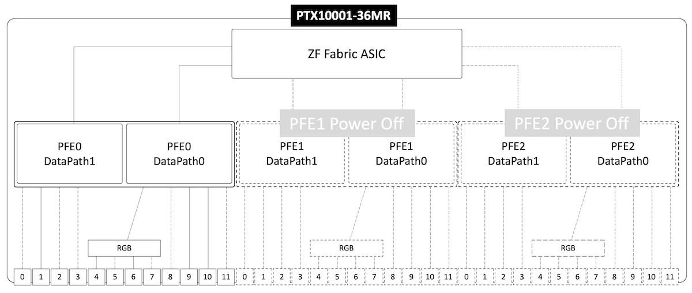

To make it shorter and more visual, we only present the Grafana snapshots, but same methods and show commands described in test1 are applicable here.

### PTX10016 and LC1201

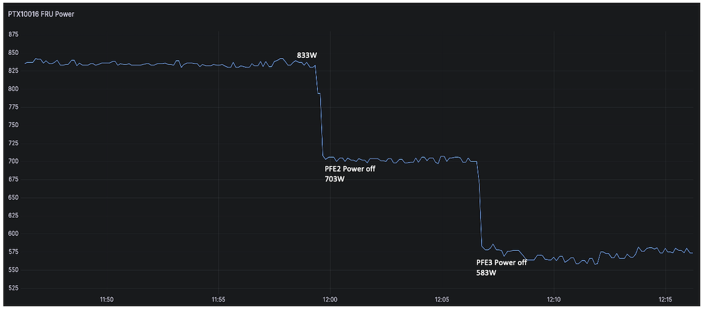

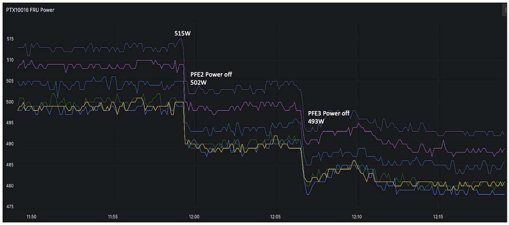

### PTX10008 and LC1201

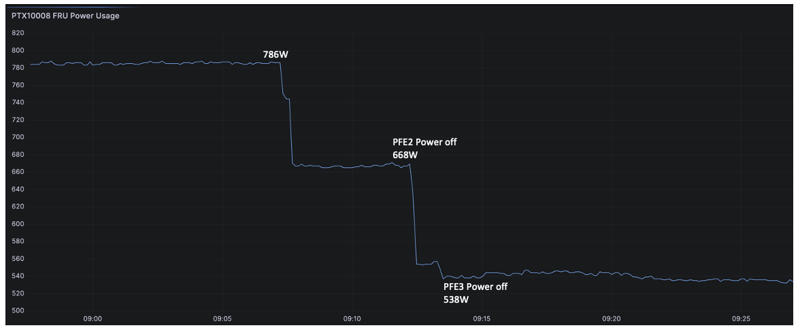

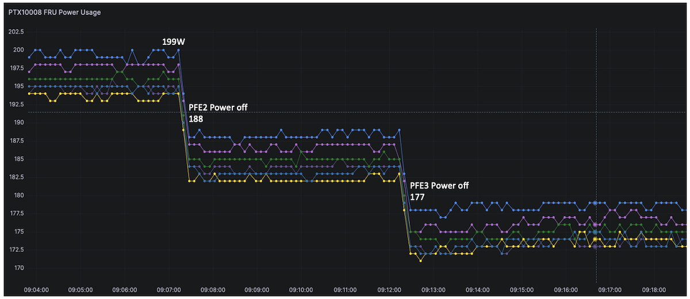

### PTX10004 and LC1201

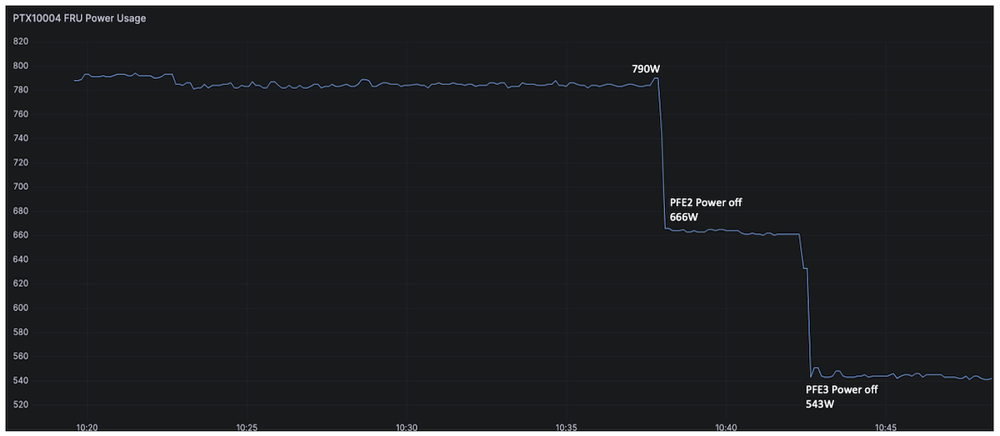

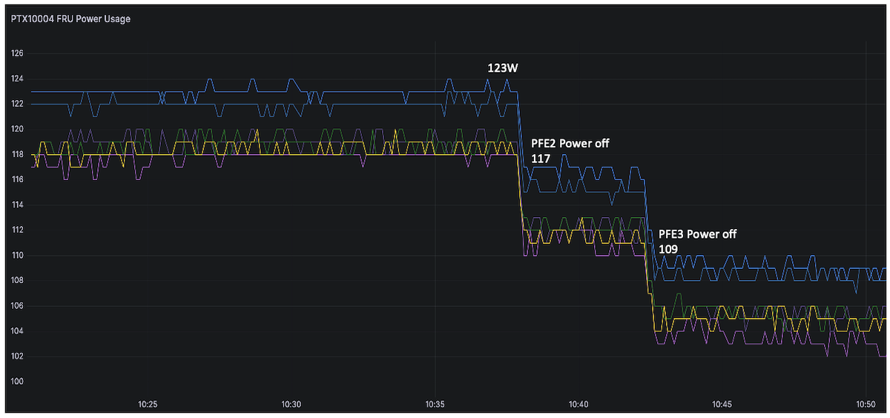

### PTX10001-36MR

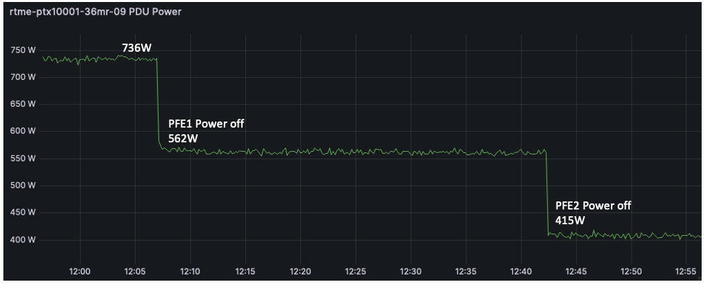

### Test Results

You noticed power measurement is always slightly fluctuating, that's why we will not provide "absolute saving numbers". You can see from 120W to 135W saved per FPC when you power off a PFE (case without optics) and around 10-15W saved per SIB (x6). Also, we measured around 250W saved in a case with DR4 optics.

## PFE power off vs FPC power off

Another interesting test will consist in identifying the power saved when we power off all the forwarding ASICs of an FPC compared to shutting down the entire line card itself. We will measure how much is consumed by the FPC components not used for forwarding (ie. CPU, RAM, PCIe network and other internal circuitry).

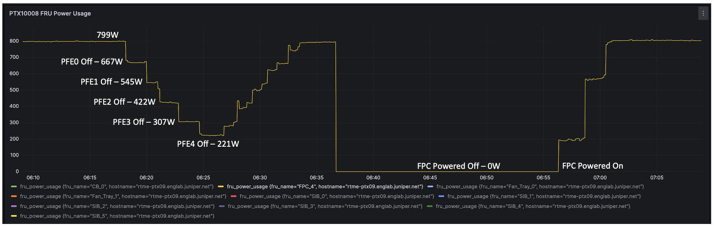

In the left part of the diagram, we see the 5x PFEs of the card being powered off one by one, to reach the point where they are all "off". The power used by the FPC is around 220W at that moment. That's the residual power usage of an FPC with no forwarding component activated, no optics plugged, WAN and Fabric SerDes shutdown, just the internal circuitry listed above.

In the right part of the diagram, we see the FPC being entirely powered off, moving from 800W of power usage to zero.

```
{master}
regress@rtme-ptx09-re0> request chassis fpc slot 4 offline
Offline initiated, use "show chassis fpc" to verify

{master}
regress@rtme-ptx09-re0> show chassis fpc
                     Temp  CPU Utilization (%)   CPU Utilization (%)  Memory    Utilization (%)
Slot State            (C)  Total  Interrupt      1min   5min   15min  DRAM (MB) Heap     Buffer
  4  Offlining       ---Offlined by cli command---

{master}
regress@rtme-ptx09-re0>
```

### Time to restore PFE and FPC Online

It takes usually from 45 to 60s to restore an PFE powered off to nominal powered on state and get the associated interfaces back in the output of "show interface terse".

```
{master}
regress@rtme-ptx09-re0> request chassis fpc slot 4 pfe-instance 0 online 
Nov 13 00:51:08
Fru Block online initiated!


{master}
regress@rtme-ptx09-re0> show chassis fpc pfe-instance all 
Nov 13 00:51:09

FPC 4
PFE-Instance      PFE-State
   0              PowerOn              
   1              Offlined by CLI      
   2              Offlined by CLI      
   3              Offlined by CLI      
   4              Offlined by CLI      


   {master}
regress@rtme-ptx09-re0> show interfaces terse | refresh 1 
Nov 13 00:51:15
---(refreshed at 2023-11-13 00:51:15 PST)---
Interface               Admin Link Proto    Local                 Remote
re0:mgmt-0              up    up
re0:mgmt-0.0            up    up   inet     10.83.152.6/24  
dsc                     up    up
esi                     up    up
fti0                    up    up
fti1                    up    up
fti2                    up    up
fti3                    up    up
fti4                    up    up
fti5                    up    up
fti6                    up    up
fti7                    up    up
irb                     up    up
lo0                     up    up
lsi                     up    up
pip0                    up    up
vtep                    up    up

<SNIP>

---(refreshed at 2023-11-13 00:51:55 PST)---
Interface               Admin Link Proto    Local                 Remote
pfh-4/0/0               up    up
pfh-4/0/0.16383         up    up   inet    
re0:mgmt-0              up    up
re0:mgmt-0.0            up    up   inet     10.83.152.6/24  
dsc                     up    up
esi                     up    up
fti0                    up    up
fti1                    up    up
fti2                    up    up
fti3                    up    up
fti4                    up    up
fti5                    up    up
fti6                    up    up
fti7                    up    up
irb                     up    up
lo0                     up    up
lsi                     up    up
pip0                    up    up
vtep                    up    up
---(refreshed at 2023-11-13 00:51:56 PST)---
Interface               Admin Link Proto    Local                 Remote
pfh-4/0/0               up    up
pfh-4/0/0.16383         up    up   inet    
et-4/0/1                up    down
et-4/0/1.16386          up    down multiservice
et-4/0/3                up    down
et-4/0/3.16386          up    down multiservice
et-4/0/5                up    down
et-4/0/5.16386          up    down multiservice
et-4/0/7                up    down
et-4/0/7.16386          up    down multiservice
et-4/0/9                up    down
et-4/0/9.16386          up    down multiservice
et-4/0/11               up    down
et-4/0/11.16386         up    down multiservice
et-4/0/13               up    down
et-4/0/13.16386         up    down multiservice
et-4/0/15               up    down
et-4/0/15.16386         up    down multiservice
re0:mgmt-0              up    up
re0:mgmt-0.0            up    up   inet     10.83.152.6/24  
dsc                     up    up
esi                     up    up
fti0                    up    up
fti1                    up    up
fti2                    up    up
fti3                    up    up
fti4                    up    up
fti5                    up    up
fti6                    up    up
fti7                    up    up
irb                     up    up
lo0                     up    up
lsi                     up    up
pip0                    up    up
vtep                    up    up
```

From 00:51:08 when the CLI is entered to 00:51:56 to see all interfaces back: 48 seconds.

And the IP connectivity (ping answers) is measured from 90 to 100s after the CLI is entered.

The entire FPC boot up and connectivity restoration is a longer process: more than 5minutes.

### Power Saving on Other Parts

Let check if it makes a difference to power off all PFEs or the entire FPC from the perspective of other router parts like Fabric Cards or Fan Trays.

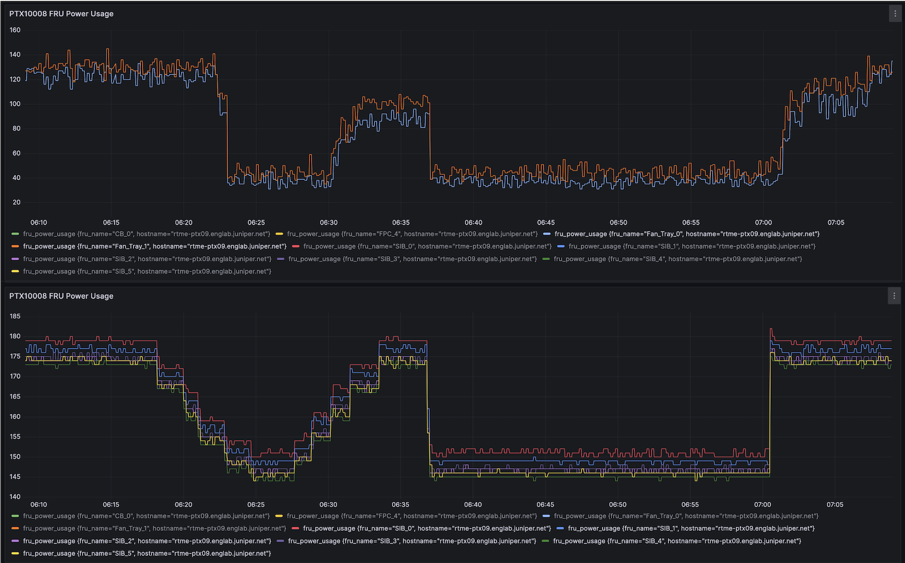

As expected the SIBs power usage is the same in the two cases (all PFE power off and FPC power off). Not a surprise since the Fabric SerDes are shutdown when PFE are off. So it's the same situation from a SIB ZF chipset perspective

The fan tray power usage is not different either. That means the components exhausting the most quantity of heat are equally shutdown in both scenarios (optics and PFEs).

In conclusion of this test, shutting down the FPC instead of the PFEs will save 220W more, but it will come at the expense of the flexibility and time to reaction to re-enable the services.

## CMErrors Configured Actions

The forwarding ASICs are made of different internal blocks. In some rare occasion, errors may occur in the operational state, impacting the forwarding functionality. The Chassis Manager (CM 2.0) infrastructure is responsible for collecting faults/alarms and communicates between Routing Engine and Linecards/PFE. Based on the nature of the error, this infrastructure gives granular fault identifications: Minor, Major or Fatal. Junos Evo can be configured to define specific actions against each scope, severity, and category of error.

By default, if a Major or Fatal error occurs in PFE, the state is changed to DISABLE and all interfaces mapped to it are marked down. The PFE restart capability provides a recovery mechanism without having to reboot the entire line card or system, reducing the blast radius.

If the PFE encounters an error and gets into faulty state, the system takes specific action based on configuration.

Table: Platforms supporting CMError Configured Action

| Mode | PTX10004 | PTX10008 | PTX10016 | PTX10001-36MR | PTX10003-80C | PTX10003-160C |
|:--|:--|:--|:--|:--|:--|:--|
| Support | sqrt | sqrt | sqrt | sqrt | X | X |

The configuration below presents the different options for the CMError action, including offline-pfe and reset-pfe. It shows how a PFE instance goes offline after CMError is injected in the PFE artificially.

```
ptx10k16-01# set chassis error major action ?
Possible completions:
  alarm                Raise FPC/SIB alarm
  disable-pfe          Disable PFE interfaces on FPC
  get-state            Retreive FPC/SIB state for debugging
  log                  Log occurence to system log file
  offline              Offline FPC/SIB
  offline-pfe          Offline PFE on FPC
  reset                Reset FPC/SIB
  reset-pfe            Reset PFE on FPC
  trap                 Raise FPC trap

ptx10k16-01# set chassis error major action offline-pfe

ptx10k16-01# commit
re0:
configuration check succeeds
re1:
commit complete
re0:
commit complete

ptx10k16-01# run show chassis fpc pfe-instance all
FPC 0
PFE-Instance      PFE-State
   0              ONLINE
   1              ONLINE
   2              ONLINE
   3              ONLINE
   4              ONLINE    

ptx10k16-01#
```

Let's introduce a PFE error in the hardware. This is only for testing and demonstration purposes. Never execute these commands on live routers as it could lead to unexpected behaviors.

```
root@rtme-ptx10k16-01-fpc0:pfe> show pfe id info
First Active PFE            : 0
Effective First Active PFE  : 0
Number of Active PFEs       : 5
Pfe Mask                    : 0x000000000000001f

PFEInst   Down-Flags   PPFE-ID    PFE-State   PFE-Name
------   ----------   -------------   ---------   --------
   0         0             0            ONLINE    /Chassis[0]/Fpc[0]/Pfe[0]
   0         0             1            ONLINE    /Chassis[0]/Fpc[0]/Pfe[1]
   1         0             2            ONLINE    /Chassis[0]/Fpc[0]/Pfe[2]
   1         0             3            ONLINE    /Chassis[0]/Fpc[0]/Pfe[3]
   2         0             4            ONLINE    /Chassis[0]/Fpc[0]/Pfe[4]
   2         0             5            ONLINE    /Chassis[0]/Fpc[0]/Pfe[5]
   3         0             6            ONLINE    /Chassis[0]/Fpc[0]/Pfe[6]
   3         0             7            ONLINE    /Chassis[0]/Fpc[0]/Pfe[7]
   4         0             8            ONLINE    /Chassis[0]/Fpc[0]/Pfe[8]


root@rtme-ptx10k16-01-fpc0:pfe> show cmerror module brief
-------------------------------------------------------------------------
Module  Name              Active Errors  PFE       Callback    ModuleData
                                         Specific  Function
-------------------------------------------------------------------------
1       fab-pfe@0         0              Yes       0x93963944918256  0x00000000
2       btchip            1              Yes       0x93963944918256  0x00000000
3       lkup_asic         0              Yes       0x93963944918256  0x00000000
4       PIC-0             0              No        0x93963944918256  0x00000000
5       HstLbk:pfe:2      0              No        0x93963944918256  0x00000000
6       HstLbk:pfe:4      0              No        0x93963944918256  0x00000000
7       HstLbk:pfe:0      0              No        0x93963944918256  0x00000000
8       HstLbk:pfe:1      0              No        0x93963944918256  0x00000000
9       HstLbk:pfe:3      0              No        0x93963944918256  0x00000000

root@rtme-ptx10k16-01-fpc0:pfe> show cmerror module 2
Module (2) (btchip)
PFE support 1
Get state cb  0x5575af8efdc0 platform action cb 0x5575af8efcf0 control cb (nil)

Error-id     PFE  Level  Threshold  Count  Occured  Cleared  Last-occurred(ms ago)  Name
------------------------------------------------------------------------------------------
0x450001      0   Fatal      1        0       0        0        0                   hostsys_hostif_hifregs_atomic_sram_p_intr_d_perr
0x450002      0   Minor      1        0       0        0        0                   hostif_dma_0_sram_p_intr_c_dma_bufmgr
0x450003      0   Minor      1        0       0        0        0                   hostif_dma_1_sram_p_intr_c_dma_bufmgr

<SNIP>

root@rtme-ptx10k16-01-fpc0:pfe> test cmerror trigger-error ?
Possible completions:
  <number>             error_id.
root@rtme-ptx10k16-01-fpc0:pfe> test cmerror trigger-error 0x450012 ?
Possible completions:
  <number>             pfe_id.
root@rtme-ptx10k16-01-fpc0:pfe> test cmerror trigger-error 0x450012 0 ?
Possible completions:
  <word>               reason.
root@rtme-ptx10k16-01-fpc0:pfe> test cmerror trigger-error 0x450012 0 test ?
Possible completions:
  <[Enter]>            Execute this command
  <number>             module_id.
  |                    Pipe through a command
root@rtme-ptx10k16-01-fpc0:pfe> test cmerror trigger-error 0x450012 0 test 2 ?
Possible completions:
  <[Enter]>            Execute this command
  <number>             count.
  |                    Pipe through a command
root@rtme-ptx10k16-01-fpc0:pfe> test cmerror trigger-error 0x450012 0 test 2
```

The fault will be detected and the PFE will be brought offline as per the configuration:

```
ptx10k16-01# run show chassis fpc pfe-instance all
FPC 0
PFE-Instance      PFE-State
   0              FAULT
   1              ONLINE
   2              ONLINE
   3              ONLINE
   4              ONLINE

ptx10k16-01# run show chassis fpc pfe-instance all
FPC 0
PFE-Instance      PFE-State
   0              TRANSITION_OFFLINE
   1              ONLINE
   2              ONLINE
   3              ONLINE
   4              ONLINE

ptx10k16-01# run show chassis fpc pfe-instance all
FPC 0
PFE-Instance      PFE-State
   0              Offlined by CmError
   1              ONLINE
   2              ONLINE
   3              ONLINE
   4              ONLINE

ptx10k16-01#
```

The PFE state is now "Offlined by CmError" without impacting the other PFEs of the line card or the system. It will also be possible to restart it manually without collateral impact on the rest of the service.

## Conclusion

The Express4 ASIC in PTX Series can be configured "power off" via CLI or configuration. It offers significant power saving on the FPC and, well applicable, on the fabric cards. Power off and restart doesn't affect the surrounding PFEs in the system and can be also automated in case of error detection. This capability completes the long list of automated power saving features offered by default on the PTX routers. With these tools, operators can implement innovative traffic engineering rules and scripted PFE power-off to reduce the network OPEX.

## Useful links

- Introduction to PTX10001-36MR: [https://juniper.github.io/techposts/ptx10001-36mr-introduction/article](https://juniper.github.io/techposts/ptx10001-36mr-introduction/article)
- PTX10000 Power Optimization: [https://juniper.github.io/techposts/ptx10000-power-optimization/article](https://juniper.github.io/techposts/ptx10000-power-optimization/article)
- Request Chassis FPC config guide: [https://www.juniper.net/documentation/us/en/software/junos/chassis/topics/ref/command/request-chassis-fpc.html](https://www.juniper.net/documentation/us/en/software/junos/chassis/topics/ref/command/request-chassis-fpc.html)
- PFE power off and PFE Error Action config guide: [https://www.juniper.net/documentation/us/en/software/junos/chassis/topics/ref/statement/action-edit-chassis-fpc-error.html](https://www.juniper.net/documentation/us/en/software/junos/chassis/topics/ref/statement/action-edit-chassis-fpc-error.html)

## Glossary

- CB: Control Board
- CM Error: Chassis Manager Error is a module responsible for registering all faults generated within the different components of the Chassis
- FPC: Flexible PIC Concentrators
- FRU: Field Replaceable Unit
- PFE: Packet Forward Engine
- PIC: Physical Interface Card
- RE: Routing Engine
- SIB: Switch Interface Board

## Acknowledgments

Thanks to Santosh Mishra, Nicolas Fevrier for their feedback and review comments on this document.
