# Saving Power on ACX7000 Series

**Nicolas Fevrier - 09/11/2023**

How we can significantly reduce the power usage of the ACX7000 routers with basic configuration and simple best-practices.

## Introduction

Power saving and carbon footprint reduction are top of mind topics in our discussions with customers. We recently published a couple of posts on energy usage optimization on PTX ([https://juniper.github.io/techposts/saving-energy-on-ptx-with-pfe-power-off/article](https://juniper.github.io/techposts/ptx10000-power-optimization/article)) and we continue the series with a TechPost article dedicated to the ACX7000 routers.

In this publication, we will detail the behavior inside the routers and highlight the differences with the PTX/MX Series. We will demonstrate the power savings you can achieve with a simple configuration. To measure the potential gains, we used power meters available in our lab racks PDUs (Power Distribution Units) and we also streamed counters from the routers themselves. We will conclude the article with a series of simple recommendations / best practices.

### That's Really Too Long, and I'm a Busy Engineer... What's Useful to Me Here (TLDR)?

Ok, Ok... if you're looking to retain just the core message, we advise all ACX7000 network operators to adhere to these straightforward guidelines:

- if a port is empty (not occupied with a pluggable optic), configure it with "set interface et-0/x/y unused"
    - Specific attention is required for ACX7100(-32C/-48L), where ports must be considered per "port group", see paragraph "The Particular ACX700 Case"
- if you provision a new router for production:
  - Configure all ports "unused"
  - if it's an ACX7100-32C, an ACX7348/7332 or an ACX7509: reload the system after committing the "unused" configuration.
- when an optical module is inserted in a port: delete the "unused" line and configure it normally. It doesn't need a reload.
  - it doesn't impact the service of the other ports of the system for ACX73xx, ACX7024 or ACX7509
  - it requires specific attention for ACX7100(-48L/-32C), here again, check. the section "The Particular ACX700 Case" below for more details.

The reload step improves the power usage specifically for routers with PHYs configured in Reverse GearBox mode.

That was (kinda) easy, right? Now, let's explain this behavior and how it works.

## Empty Ports Behavior

The ACX7000 Series is powered by Junos EVO, similar to the latest PTX routers (PTX10000 series). But they behave differently on specific aspects like the empty ports.

An optical cage without any pluggable inserted should have the WAN SerDes (Serializer/Deserializer) in shutdown / low-power state. It's the default behavior on PTX10k  and MX routers, but not on ACX7000. Indeed, on these routers, empty ports will keep their WAN SerDes "Up", consuming unnecessary power. A SerDes is the logical component allowing the connection between chipsets on the PCB (Printed Circuit Board), or between a chipset and the interfaces.

> *Note: an initiative to align the ACX7000 behavior to the PTX/MX is under study. The "usused" configuration we are proposing here should be considered as a quick workaround to significantly reduce the power usage.*

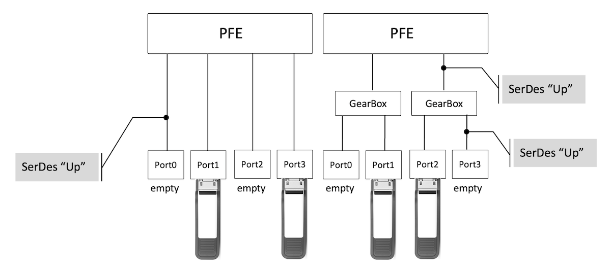

The Figure 1 above illustrates the situation clearly. When empty cages are directly connected to the Packet Forwarding Engine (PFE), SerDes are in "Up" state. And when ports are connected to the PFE via an intermediate Reverse Gear Box (RGB), both SerDes from optical cages to RGB and from RGB to PFE are staying "Up".

## Ports Configured "Unused"

Another feature inherited from PTX via Junos EVO offers the ability to configure any revenue port in "unused" state. A port with this configuration disappears from the IFD table and all relative WAN SerDes are shut down, even if the port is populated with a pluggable optics.

This feature is also available on ACX7000 routers and presents a similar behavior with some slight differences. We will rely on this configuration to "manually" shutdown WAN SerDes on empty ports. So, basically, to mimic the PTX/MX default behavior, we are leveraging the "unused" configuration capability.

> *Note: a short article dedicated to the "unused" configuration will be published very soon and will be linked here. It's important to keep in mind this config is also mandatory to other use-case, like the activation of channelized ports (with breakout cable).*

### Directly Connected Ports

In the ACX7000 portfolio, certain systems are not using any PHY (retimers or reverse gear boxes) between the optical cages and the Packet Forwarding Engine (PFE). That the case for the ACX7100-48L and the ACX7024 for example. The ports are directly linked to the PFE with "WAN SerDes" as illustrated in the diagram below. When we configure the ports "unused", these WAN SerDes are turned down.

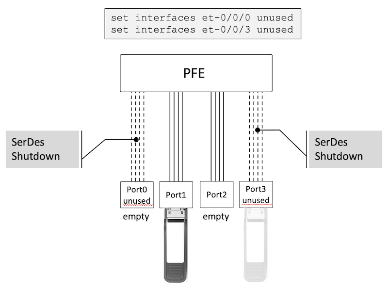

You note that we have a similar behavior when the port is populated with optics or not. But the case that will interest us first is the power saving we can get by configuring empty cages with "unused".

### Ports Connected via a PHY

Some other systems will leverage an intermediate device between ports and PFE. This device, generically named PHY can be used:

- to boost electrical signal and guarantee Signal Integrity, that's the retimer role
- to convert SerDes speed, encoding and error correction, creating a larger fan-out (from one 53Gbps SerDes PAM4 to two 26Gbps SerDes NRZ for example), that's the reverse gear box role
- but also to propose additional services like timing and MACsec

The ACX7100-32C, some ports of the ACX7348/ACX7332 and the three different FPCs in the ACX7509 are leveraging such PHYs.

The situation here is interesting, since we will experience different results if we configure the port "unused" or if we reload the system after this "unused" configuration. Let's have a closer look at these behaviors

First, we configure the port "unused" only.

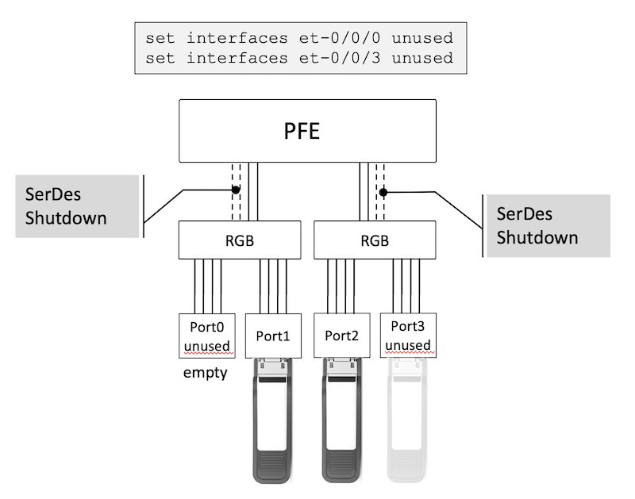

Interesting to note that only the WAN SerDes connecting the PFE to the PHY are shut down.

Now, we restart the system.

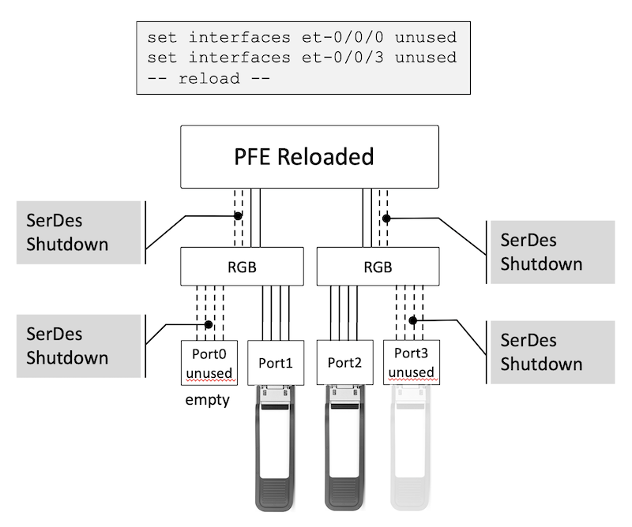

After the reload, we notice that both the WAN SerDes connecting the PFE to the PHY and those connecting the PHY to the optical cage are shut down. Logically, we save more power in this situation: additional WAN SerDes are "down",  less energy is used.

For the sake of conciseness, we don't detail the reload of systems without PHY, since it doesn't bring any additional saving. But still, we will run quickly the test with the ACX7100-32C 400GE ports, later in the document.

### The Particular ACX7100 Case

It's important to understand a behaviour specific to the ACX7100-32C and ACX7100-48L when configuring and deleting the configuration of "unused" on a specific port.

The ACX7100s are powered by a single Jericho2 PFE, which behaves differently than the J2c using in ACX7509 and ACX7348/ACX7332 and the Q2u present in the ACX7024 and ACX7024X. Long story short, ***configuring "unused" on given port or deleting the configuration of "unused" of a given port will trigger the flap of all other ports belonging to the same Port Group. This may lead to service impact on these other ports if it's not done carefully (during a maintenance window) or with the appropriate measures described below to treat all ports of a given PG at once.***

The following diagram summarises the mapping of ethernet ports and Port Groups.

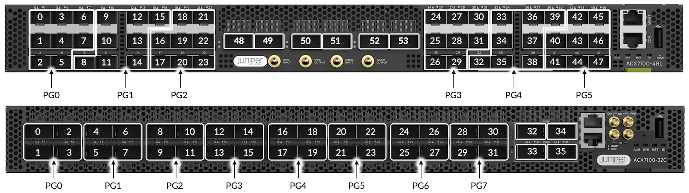

Note that each 400GigE port (ACX7100-48L ports 48 to 53 and ACX7100-32C ports 32 to 35) is mapped individually to a single Port Group, so we don't have to care about them.

To illustrate with a couple of examples, let's imagine an ACX7100-32C we just provisioned. All ports are empty and have been configured "unused":

- We insert a QSFP28 optic module in et-0/0/0 position. We will need to delete the "unused" configuration from ports 0/0/0, 0/0/1, 0/0/2 and 0/0/3. That way, inserting a port in 0/0/2 in the future will not impact services on 0/0/0.
- Same logic if we insert an optic module in 0/0/19, we need to remove the unused configuration for all 4 ports 16, 17, 18 and 19.

We will follow the same logic for ACX7100-48L, but this time, we have 8 SFP ports per PG to configure at once.

This behaviour is currently under investigation by our engineering team, and hopefully we will come up with ways to mitigate it in future releases.

## Counters Accuracy

Before starting the power saving tests, let's answer this question: "how accurate are the power utilization counters exposed in the router"? Very legitimate question, actually. Because it's not always a given.

We collect the power consumption:

- on the router, via telemetry and represented in Yellow in the bottom graph (DUT for Device Under Test, our router)
- on a Power Device Unit (PDU), in the rack

and we check if they match:

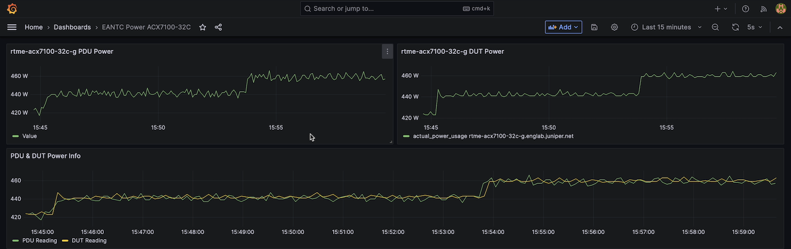

The alignment of the two graphs is pretty accurate: that means we can trust the reading on the router itself.

## Let's Test "Unused" Configuration

In this section, we will carry out tests on systems with all revenue ports empty. That means, they have no optical pluggable modules present/inserted in the cages. We will configure these empty ports "unused" and we will study the behavior on the different ACX7000 platforms, measuring how much power saving can be achieved.

Let's with routers without Reverse Gear Box first:

- ACX7100-48L: [a deepdive on the platform is available here.](https://juniper.github.io/techposts/acx7100-deepdive/article)
- ACX7024: [a deepdive on the platform is available here.](https://juniper.github.io/techposts/acx7024-deepdive/article)

and then we will study systems with RGBs:

- ACX7100-32C : [a deepdive on the platform is available here](https://juniper.github.io/techposts/acx7100-deepdive/article).
- the different FPCs of an ACX7509: [a deepdive on the platform is available here.](https://juniper.github.io/techposts/acx7509-deepdive/article)

The future ACX7348 and ACX7332 are also using RGB on the SFP ports and on all the FPC cards.

***By the way, take all these numbers for what they are: an example measured in our lab environment. The results may vary depending on your own environment conditions.***

### ACX7024

From a counter perspective, the ACX7024 exposes the following output for real-time power consumption.

```
regress@rtme-acx7024-03> show chassis power detail 
Chassis Power        Voltage(V)    Power(W)

Total Input Power                     90
  PSM 0
    State: Online
    Input               200           51
    Output            12.21        38.92
    Capacity            400 W (maximum 400 W)
  PSM 1
    State: Online
    Input               200           39
    Output             12.2        29.84
    Capacity            400 W (maximum 400 W)

System:
  Zone 0:
      Capacity:          800 W (maximum 800 W)
      Actual usage:      90 W
  Total system capacity: 800 W (maximum 800 W)

regress@rtme-acx7024-03> 
```

We will start configuring every QSFP (100G-capable) port "unused" one by one (meaning, one commit at a time), and then we will configure all SFP ports "unused", also one by one and we will check the result on our Grafana dashboard.

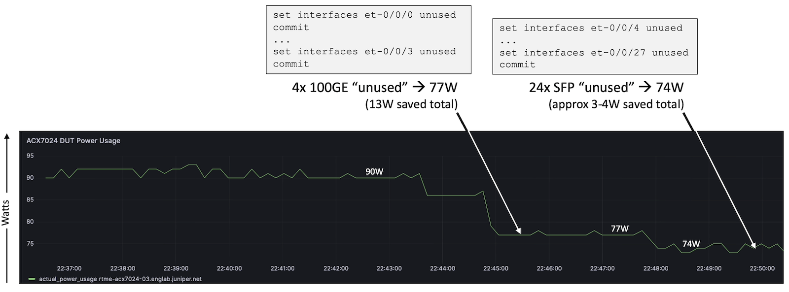

The savings can seem marginal, but they are not negligeable when compared to the overall power usage of the box.
Reload the system will not bring any additional saving.

Conclusion: you can save up to 16W out of the 90W on a totally empty system if you configure all empty ports unused. Of course, we understand that it make no sense to get to this extreme case, but it's still a very useful datapoint to qualify how much can be saved in proportion if you do it on your own system with X numbers of empty ports.

### ACX7100-48L

From a counter perspective, the ACX7100-48L exposes the following output for real-time power consumption.

```
regress@rtme-acx-48L-10> show chassis power detail 
Chassis Power        Voltage(V)    Power(W)

Total Input Power                    259
  PSM 0
    State: Online
    Input               200          140
    Output            11.96        120.95
    Capacity           1600 W (maximum 1600 W)
  PSM 1
    State: Online
    Input               200          119
    Output            11.97        102.32
    Capacity           1600 W (maximum 1600 W)

System:
  Zone 0:
      Capacity:          3200 W (maximum 3200 W)
      Actual usage:      259 W
  Total system capacity: 3200 W (maximum 3200 W)

regress@rtme-acx-48L-10>
```

For this platform test, we will start with 48 SFP ports, committing them "unused" one by one, then we will configure the 6 QDD (400G-capable) ports, also one after the other.

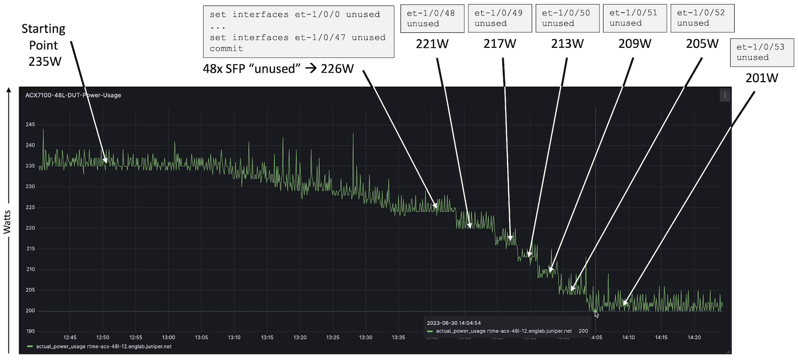

We can save 9 to 10W on the SFP ports in total, and roughly 4W per QDD port.
It goes without saying that a reload will not bring anything, since the -48L is not using any intermediate PHY between ports and PFE.

### ACX7100-32C

From a counter perspective, the ACX7100-32C exposes the following output for real-time power consumption.

```
regress@rtme-acx7100-32c-g> show chassis power detail 
Chassis Power        Voltage(V)    Power(W)

Total Input Power                    612
  PSM 0
    State: Online
    Input               199          321
    Output               12        292.69
    Capacity           1600 W (maximum 1600 W)
  PSM 1
    State: Online
    Input               199          291
    Output            11.97        267.64
    Capacity           1600 W (maximum 1600 W)

System:
  Zone 0:
      Capacity:          3200 W (maximum 3200 W)
      Actual usage:      612 W
  Total system capacity: 3200 W (maximum 3200 W)

regress@rtme-acx7100-32c-g>
```

This test on ACX7100-32C is the first that will show an impact of a reload after configuring the ports "unused". Indeed, PHYs are present between the ports and the PFE (check the deepdive article linked above to get more details on the -32C internal architecture).

Nevertheless, some subtleties are noticeable:

- the 100GE ports are connected to a PHY configured in Reverse GearBox mode
- the 400GE ports are connected to a PHY configured in Retimer mode

Note: the 400GE ports are leveraging the PHYs for other types of services, specifically MACsec encryption.

In this first part of the test, we configure all 32x 100GE interfaces "unused" in one single commit, then we config the 4 ports QDD 400GE "unused" at once and commit again, and in a third and last step, we reload the router.

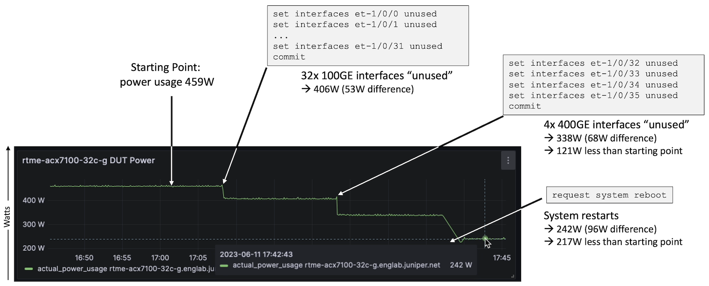

We measured more than 50W saved when configured 32 ports 100GE in unused mode. Then we measured a bit less than 70W saved with 4 ports 400GE. And finally, a reload of the router saved more than 95W again.

Now, let's try to identify where exactly we saved these 95W. And for that, I will check only the 400GE ports, configuring them one by one "unused", then reloading the router.

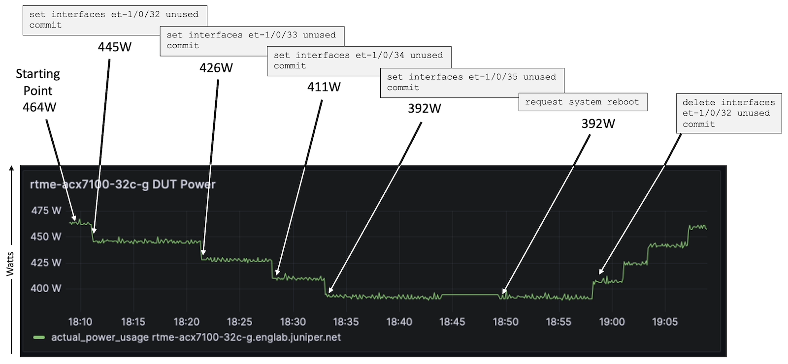

Interesting to note that reload doesn't bring anything if we are only configuring the 400GE QDD ports.

We can conclude that 95W extra were saved on the SerDes between PHY and 100GE ports cages only, and that you don't need to reload the router if you configured only the 400GE ports in "unused" mode.

### ACX7509 Tests

The ACX7509 is based on a different architecture, as detailed in this deepdive article. We have the visibility on the power used in different parts: Routing Engine (RCB), Forwarding Engine Board (FEB), Flexible PIC Concentrators (FPCs), Fan Trays, ...

```
regress@rtme-acx7509-02-re0> show chassis power detail       
Chassis Power        Voltage(V)    Power(W)

Total Input Power                    587
  PSM 0
    State: Online
    Input 1             203          276
    Output             12.0        225.18
    Capacity           3000 W (maximum 3000 W)
  PSM 1
    State: Online
    Input 1             202          311
    Output             12.0        267.13
    Capacity           3000 W (maximum 3000 W)
  PSM 2
    State: Offline
    Input 1               0            0
    Output              0.0          0.0
    Capacity              0 W (maximum 0 W)
  PSM 3
    State: Offline
    Input 1               0            0
    Output              0.0          0.0
    Capacity              0 W (maximum 0 W)

Item                 Used(W)
  CB 0                   51
  FPC 1                  68
  FPC 2                  33
  FPC 5                  99
  Fan Tray 0             21
  Fan Tray 1             21
  FEB 0                 193

System:
  Zone 0:
      Capacity:          6000 W (maximum 6000 W)
      Allocated power:   1730 W (4270 W remaining)
      Actual usage:      587 W
  Total system capacity: 6000 W (maximum 6000 W)
  Total remaining power: 4270 W

{master}
regress@rtme-acx7509-02-re0>
```

It's convenient to have these different counters, we can identify where the power saving are actually made...

For the following tests, we use an ACX7509 with a single RCB (Router and Controller Board) and a single FEB (Fabric Engine Board)
we will start configuring all ports of the FPC under test, committing the configuration one by one, then we will restart the FPC under test (limiting the impact to this slot only).

### ACX7509 FPC-4CD

The FPC is positioned in slot 1 (facing PM50 Port Macros), we measured the following with 4 ports QDD (up to 400GE):

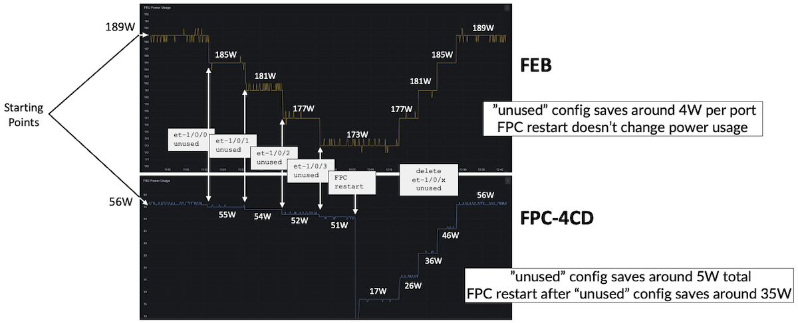

We notice 4W of power saving per port "unused" on the FEB, with an extra 1W on the FPC itself, and reload of the FPC provides 35W of saving for the 4 ports.

With a reverse test, removing the "unused" configuration one by one after the reload, we measure the same 4W per port on the FEB and 9 to 10W per port on the FPC.

### ACX7509 FPC-16C

The FPC is positioned in slot 5 (facing PM50 Port Macros), it authorizes the use/configuration of the 16 ports QSFP (up to 100GE):

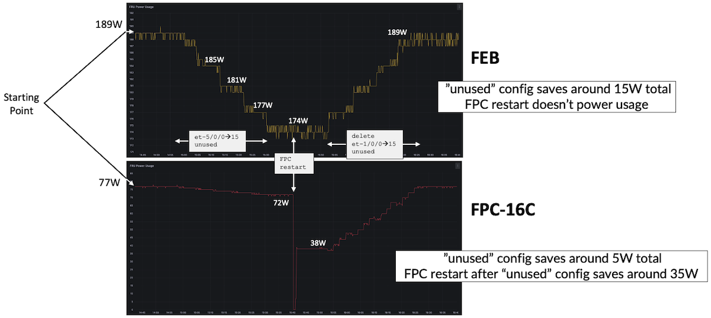

The saving on the FEB side seems to follow some "plateau" logic. Overall, for 16 ports, we save around 15W, so more or less one Watt per port. On the FPC side, for 16 ports, we save 5W but after the reload, it shows 35W of saving.

With a reverse test, removing the "unused" config one by one, we measure a regular progression of the power consumption: 16 ports / around 39W.

### ACX7509 FPC-20Y

Finally, we test the FPC 20Y in a 25Gbps (PM25) slot like 0/2/3/4/6/7, where we can use and configure the 20 ports from 1GE to 25GE.

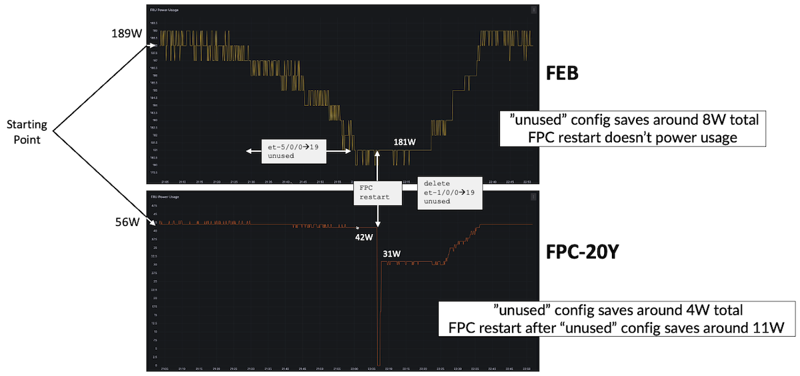

We measure that 20 ports unused will save around 8W on the FEB side, and 14W on the FPC itself. After the reload, we get some additional 11W saved.

## Summary

The logic of "empty" ports is different on the ACX7000 series compared to the MX and PTX routers. Until this gap is addressed, a simple workaround exists: configuring the empty ports in "unused" mode. Certain platforms will require a reload of the system or at least the FPC to get the highest possible power savings. Also certain platforms like the ACX7100 will require specific attention since "unused" config or delete will trigger a flap of the neighbouring ports in the same Port Group.

The reload is only useful on specific members of the ACX7000 family:

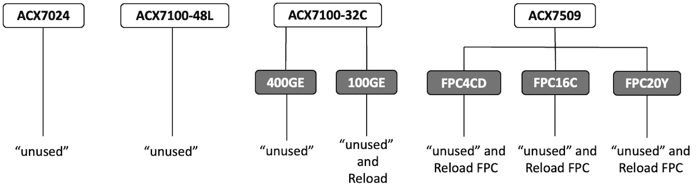

With the tests above, the operator of ACX7000 will be able to quantify the Watts that can be saved. We recommend that all empty ports are configured "unused", since it's possible to remove this configuration without any impact on the other ports of the FPC or the system. And for new platforms provisioned on the network, when applicable (check diagram in figure 13), reload the system after configuring the ports "unused".

The following chart summarizes the test results in this article.

| System / Port Type | "Unused" Config Savings | Savings after Reload |
|:--|:--|:--|
| ACX7024 QSFP (100GE) | 4x ports: 13W | N/A |
| ACX7024 SFP | 24x ports: 4W | N/A |
| ACX7100-48L QDD (400GE) | 6x ports: 15W | N/A |
| ACX7100-48L SFP | 48x ports: 9W | N/A |
| ACX7100-32C QDD (400GE) | 4x ports: 53-68W | N/A |
| ACX7100-32C QSPF (100GE) | 32x ports: 53W | 96W |
| ACX7509 FPC-4CD QDD | FPC 4x ports: 4W / FEB: 16W | FPC: 35W / FEB: N/A |
| ACX7509 FPC-16C QSFP | FPC 16x ports: 5W / FEB: 15W | FPC: 35W / FEB: N/A |
| ACX7509 FPC-20Y SFP | FPC 20x ports: 14W / FEB: 8W | FPC: 11W / FEB: N/A |

It's also possible to consider configuring ports "unused" for slots populated with optical modules. For example, during slow traffic hours, that can be done on specific link aggregation members. Of course, it will not only save the power used by the WAN SerDes but also the optic itself, and it will provide significantly higher savings. Good to know: an optic in a port configured "unused" is still present in the inventory. But that will be for a different article...

## Useful links

- [https://juniper.github.io/techposts/acx7100-deepdive/article](https://juniper.github.io/techposts/acx7100-deepdive/article)
- [https://juniper.github.io/techposts/acx7024-deepdive/article](https://juniper.github.io/techposts/acx7024-deepdive/article)
- [https://juniper.github.io/techposts/acx7509-deepdive/article](https://juniper.github.io/techposts/acx7509-deepdive/article)
- [https://juniper.github.io/techposts/optimizing-power-consumption-in-high-end-routers/article](https://juniper.github.io/techposts/optimizing-power-consumption-in-high-end-routers/article)
- [https://juniper.github.io/techposts/saving-energy-on-ptx-with-pfe-power-off/article](https://juniper.github.io/techposts/saving-energy-on-ptx-with-pfe-power-off/article)
- [https://juniper.github.io/techposts/ptx10000-power-optimization/article](https://juniper.github.io/techposts/ptx10000-power-optimization/article)

## Glossary

- DUT: Device Under Test
- FEB: Forwarding Engine Board
- FPC: Flexible PIC Concentrator
- PCB: Printed Circuit Board
- PDU: Power Distribution Unit
- PFE: Packet Forwarding Engine
- QSFP: Quad Small Form-factor Pluggable
- QDD: QSFP Double Density
- RGB: Reverse Gear Box
- SerDes: Serializer / Deserializer
- SFP: Small Form-factor Pluggable

## Acknowledgments

Many thanks to Suneesh Babu, Pankaj Kumar, Vyas Satyanarayana, Hari Babu Kuppusamy for their help testing and characterizing the power usage on the different platforms. Thanks to Aadhithya Sankaranarayanan and Ankit Gupta for pointing the specific ACX7100 "unused" behaviour.
