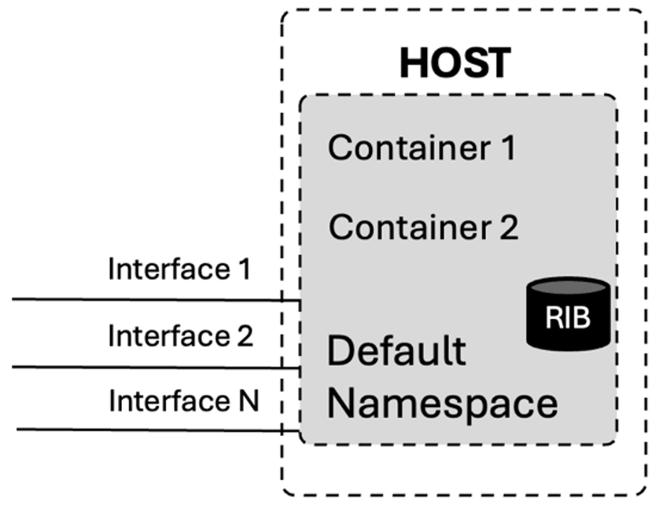
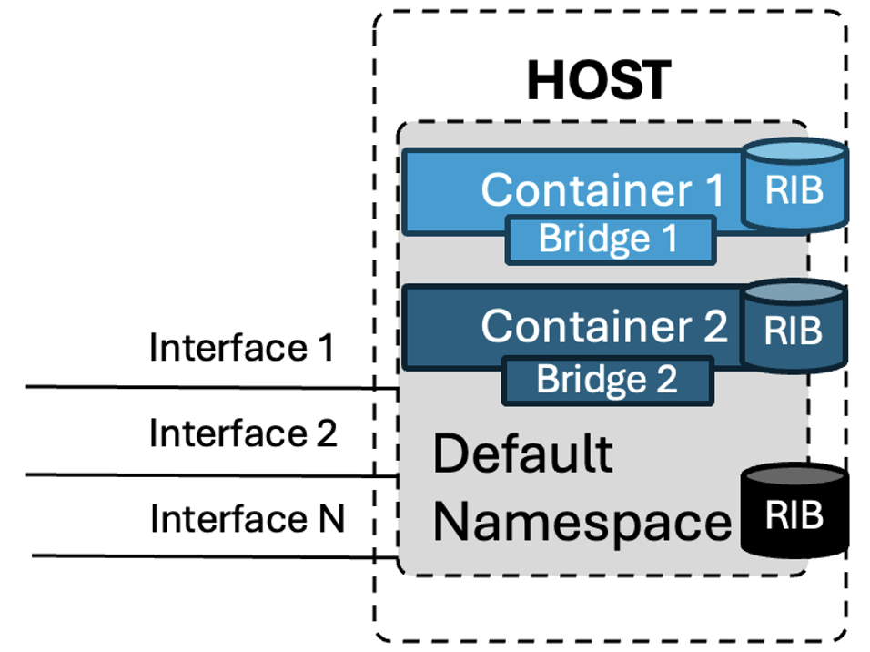
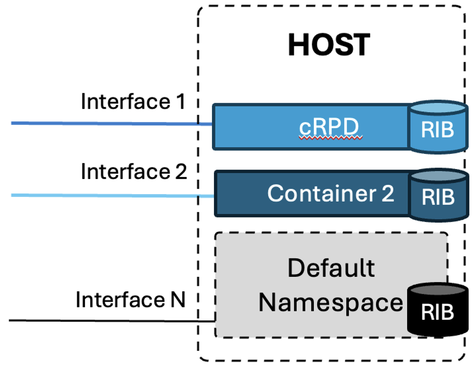

# Scalable BGP Route-Reflector

**Anton Elita - 06/11/2024**

BGP Route-Reflector is part of many networks, serving PE routers with reachability information. For this critical role, it's important to have a robust and feature-rich software, able to serve route updates quickly and reliably, for both upstream and downstream directions. Let's see how to achieve this goal with cRPD.

## Introduction

Route reflectors (RR) have been used for decades by service providers and large enterprises. On most occasions, RRs have been deployed on the physical hardware from a networking vendor for a few reasons:

- a RR can be "in path" of the data flow, hence routers with their performant ASICs are an obvious choice.
- RRs running software from the same vendor have an advantage of the feature set, same as other routers in the network
- routers, and RRs, are handled by a dedicated networking team, so there is no need to co-ordinate RR lifecycle with IT, datacenter or security departments -- it's just another router, after all
- it's operationally easier to have support from a single vendor for both software and hardware

But wait, what if your RRs do not need to be in-line (not serving any transit data flows), so can be placed anywhere in the network? Then, why pay the price for the hardware that you don't really use for packet forwarding, when you use only the control plane of the route reflector. On top of that, it's usually impossible to add more memory and CPU to a hardware router without replacing it with a different model...

A solution would be to run a route reflector only as a control plane, and host it on a server of your choice. Route reflector software from Juniper has no trade-offs on reliability and feature set, but offers significant advantages in flexibility of the deployment, and scaling possibilities.

cRPD is a software solution for route reflector deployments. cRPD is a short name for containerized RPD (routing process daemon). It uses the same stable and mature code as any other RPD on Juniper hardware boxes, but it's de-coupled from hardware.

If you're not ready to use a software-based solution, Juniper is happy to offer small-sized hardware platforms like MX204, PTX10001-36MR or MX304 - all of them can be used as route reflectors, depending on the scale requirements.

To see how cRPD can be deployed on a Linux server -- please read further! We shall explore an option for hosting cRPD as a docker container, with a dedicated physical interface and own routing tables.

## Docker Networking

cRPD can be run in a docker or kubernetes environment. Larger network operators often have specific requirements for clear isolation of their route reflectors from other guest containers running on the same physical server: resource guarantees, own routing tables, dedicated network interfaces.

To meet those requirements, a complete virtualization like vmware or qemu-kvm can be used. However, it would offer less flexibility of resource allocation, and add penalty on performance because of an emulation layer between the running processes and real hardware. Docker allows to run processes with native performance, but offering isolation on inter-process, networking and storage levels. Docker [offers](https://docs.docker.com/network/) a few network drivers with different levels of network isolation and interfaces' visibility within a container, but none of them provides exactly both: direct access to network interface(s) at the same time with routing table isolation. Either you use "host" driver, where interfaces and routing tables are shared with the host, or "bridge" or "none" driver, with routing table isolation, but without direct access to the physical interfaces.

Before describing the network modes, let's first see what are linux namespaces.

[https://en.wikipedia.org/wiki/Linux_namespaces](https://en.wikipedia.org/wiki/Linux_namespaces)

***Namespaces** are a feature of the [Linux kernel](https://en.wikipedia.org/wiki/Linux_kernel) that partition kernel resources such that one set of processes sees one set of resources, while another set of [processes](https://en.wikipedia.org/wiki/Process_(computing)) sees a different set of resources. The feature works by having the same namespace for a set of resources and processes, but those namespaces refer to distinct resources. Resources may exist in multiple namespaces. Examples of such resources are process IDs, host-names, user IDs, file names, some names associated with network access, and [Inter-process communication](https://en.wikipedia.org/wiki/Inter-process_communication).*

In other words, namespaces can isolate resources allocated for different processes, including networking. By default, a running process in a Linux environment uses the default namespace, where all processes are visible to each other, and share common interfaces and routing tables.

### Docker Networking in Host Mode

**Host** mode can be visualized like this:



All physical interfaces are connected to the default namespace, containers in "host" mode have access to the common RIB and to all interfaces present on the host. Running cRPD is "host" mode has a few drawbacks:

- Routing is shared between all containers and the host itself. It might not be desired for many reasons:
    - Management of the cRPD instance (networking department) might require different routing entries, as compared to the management of the host itself (IT department)
    - Difficult to run more than one single cRPD, as additional cRPDs might compete for the same entries in the kernel routing table (RIB)
- No clear responsibility separation between IT and network departments

### Docker Networking in Bridge Mode

**Bridge** mode (default for docker) looks like this:



Each container runs in their own namespace, including own kernel routing table (RIB). Connection to the external world happens via bridges. By default, a single bridge is connecting each container to default namespace via IP routing. Firewall rules are heavily used to separate communication to/from a container, and network address translation (NAT) is used to expose services running in a container to the outside world.

Bridge mode creates quite some overhead: packets need to go through bridge interfaces (affects performance), firewall rules are not easy to manage, and NAT is evil from different perspectives.

### Dedicated Physical Interfaces for cRPD

For a clear separation of responsibilities between departments, with lowest overhead and maximum flexibility, following design can be considered:



Changes compared to the default bridge mode: physical interfaces can now be transparently connected directly into the container namespaces. Unfortunately, docker is not offering this design out of the box, and some additional actions need to be taken: moving required interface(s) to cRPD namespace, and configuring those interfaces' properties (state, MTU, IP).

If you're not familiar with the basics of cRPD installation procedures, please check the [cRPD quickstart guide](https://www.juniper.net/documentation/us/en/quick-start/software/crpd/crpd-quick-start/crpd-quick-start.pdf) before continuing.

## Operating cRPD with Dedicated Interfaces and Routing Tables

Start cRPD:

```
root@ubuntu-22-04:~# docker run --rm --detach --name crpd01 \
 --net=none \
 --privileged -v crpd1-config:/config \
 -v crpd1-varlog:/var/log -it crpd:23.4R1.9

2e329edfdb1986c346abf556365cae4bd13fdeda1134b7cb9f196bb0fc0b96b4
```

- start cRPD from an existing docker image crpd:23.4R1 (see cRPD quickstart guide)
- (--rm) delete the container after exit
- (--detach) run in the background
- (--net=none) complete network isolation. One can use --net=bridge if local IP connectivity (from host to container, e.g. for ssh) is required
- (--privileged) is required for correct cRPD operation
- (-v) mounts persistent configuration and log volumes
- (-it) interactive mode, allocate a pseudo tty for interactive shell

Right after the start, cRPD will have only local interfaces, no connectivity to the outside:

```
root@ubuntu-22-04:~# docker exec -it crpd01 cli -c "show interfaces routing"
Interface        State Addresses
lo0.0            Up    MPLS  enabled
                       ISO   enabled
                       INET6 fe80::90b4:b0ff:fe51:43c4
irb              Up    MPLS  enabled
                       ISO   enabled
                       INET6 fe80::a415:4ff:feff:97a5
tunl0            Up    MPLS  enabled
                       ISO   enabled
sit0             Up    MPLS  enabled
                       ISO   enabled
                       INET6 ::127.0.0.1
lsi              Up    MPLS  enabled
                       ISO   enabled
                       INET6 fe80::bcdc:afff:feaf:ecf9
lo               Up    MPLS  enabled
                       ISO   enabled
                       INET6 fe80::1
ip6tnl0          Up    MPLS  enabled
                       ISO   enabled
                       INET6 fe80::90c9:38ff:feee:c34f
gretap0          Down  MPLS  enabled
                       ISO   enabled
gre0             Up    MPLS  enabled
                       ISO   enabled
                       INET6 ::127.0.0.1
erspan0          Down  MPLS  enabled
                       ISO   enabled
```

Which is surely not enough to get a route reflector operating.

On this example server, ***eth4*** is the host interface that is designed to be the uplink of cRPD. Let's move it into the cRPD namespace!

```
ip link set eth4 netns `docker inspect --format='{{ .State.Pid }}' crpd01`
```

The namespace is equal to the process ID, retrieved by "docker inspect".

Verification on cRPD:

```
root@ubuntu-22-04:~# docker exec -it crpd01 cli -c "show interfaces routing"
Interface        State Addresses
eth4             Down  MPLS  enabled
                       ISO   enabled
lo0.0            Up    MPLS  enabled
                       ISO   enabled
                       INET6 fe80::90b4:b0ff:fe51:43c4
irb              Up    MPLS  enabled
                       ISO   enabled
                       INET6 fe80::a415:4ff:feff:97a5
tunl0            Up    MPLS  enabled
                       ISO   enabled
sit0             Up    MPLS  enabled
                       ISO   enabled
                       INET6 ::127.0.0.1
lsi              Up    MPLS  enabled
                       ISO   enabled
                       INET6 fe80::bcdc:afff:feaf:ecf9
lo               Up    MPLS  enabled
                       ISO   enabled
                       INET6 fe80::1
ip6tnl0          Up    MPLS  enabled
                       ISO   enabled
                       INET6 fe80::90c9:38ff:feee:c34f
gretap0          Down  MPLS  enabled
                       ISO   enabled
gre0             Up    MPLS  enabled
                       ISO   enabled
                       INET6 ::127.0.0.1
erspan0          Down  MPLS  enabled
                       ISO   enabled
```

***eth4*** is present and visible in cRPD! Well, it's still down and has no IP address, let's fix that.

Interface state, MTU and IP addressing needs to be adjusted from outside cRPD. After moving eth4 to the cRPD namespace, we need to make all those actions within the new namespace.

Docker is however not exposing any namespaces to the host, so we cannot proceed unless we force namespace exposure:

```
root@ubuntu-22-04:~# ip netns attach crpd01-ns \
 $(docker inspect --format '{{.State.Pid}}' crpd01)
```

Namespace is visible now, we used *crpd01-ns* as the namespace name:

```
root@ubuntu-22-04:~# ip netns list
crpd01-ns (id: 2)
```

Now, set the IP address, state and MTU within the new namespace:

```
ip netns exec crpd01-ns ip addr add 192.0.2.2/30 dev eth4
ip netns exec crpd01-ns ip link set eth4 up mtu 9000
```

and verify from cRPD:

```
root@ubuntu-22-04:~# docker exec -it crpd01 cli -c "show interfaces routing eth4"
Interface        State Addresses
eth4             Up    MPLS  enabled
                       ISO   enabled
                       INET  192.0.2.2
                       INET6 fe80::5404:1eff:fe00:88a1
```

cRPD is now connected to the network - Happy Networking!

A route reflector needs of course a valid Junos configuration and tweaks for increased performance. To mention just a few -- RIB sharding and BGP update threads, FIB import policy (RR does not necessarily need millions of routes in the FIB, installing routes into kernel slows down overall performance), checksum offloading and others.
These topics are outside of scope for this document, but most useful links are listed below.

### Dismantling cRPD and namespace

By making the namespace visible, we made it at the same time persistent, even after cRPD is not running anymore. Including all interfaces, they will stay within that namespace.

After cRPD exits, remove the namespace:

```
root@ubuntu-22-04:~# ip netns del crpd01-ns
```

Any process, that was running within that namespace (e.g. tcpdump) would need to exit first, before the interfaces re-appear in the default namespace again.

## Conclusion

cRPD is a powerful and reliable software to be used as a route reflector. We have provided examples of how to run cRPD in a docker container with dedicated resources.

Other important aspects include [lifecycle of cRPD](https://www.juniper.net/documentation/en_US/day-one-books/DO_cRPD.pdf), as well as tuning of cRPD's Junos -- [enabling sharding and update IO threading](https://www.juniper.net/documentation/us/en/software/crpd/crpd-deployment/topics/topic-map/updateio-sharding-support-crpd.html), [security](https://www.juniper.net/documentation/us/en/software/crpd/crpd-deployment/topics/concept/security-best-practices.html), and [a great book no how to run a route server](https://www.juniper.net/documentation/en_US/day-one-books/DO_JunosRouteServersUPDATE.pdf).

## Useful links

- cRPD quick start:
[https://www.juniper.net/documentation/us/en/quick-start/software/crpd/crpd-quick-start/crpd-quick-start.pdf](https://www.juniper.net/documentation/us/en/quick-start/software/crpd/crpd-quick-start/crpd-quick-start.pdf)
- cRPD security best practices:
[https://www.juniper.net/documentation/us/en/software/crpd/crpd-deployment/topics/concept/security-best-practices.html](https://www.juniper.net/documentation/us/en/software/crpd/crpd-deployment/topics/concept/security-best-practices.html)
- cRPD day one book:
[https://www.juniper.net/documentation/en_US/day-one-books/DO_cRPD.pdf](https://www.juniper.net/documentation/en_US/day-one-books/DO_cRPD.pdf)
- cRPD update IO and sharding:
[https://www.juniper.net/documentation/us/en/software/crpd/crpd-deployment/topics/topic-map/updateio-sharding-support-crpd.html](https://www.juniper.net/documentation/us/en/software/crpd/crpd-deployment/topics/topic-map/updateio-sharding-support-crpd.html)
- Route-Server use case:
[https://www.juniper.net/documentation/en_US/day-one-books/DO_JunosRouteServersUPDATE.pdf](https://www.juniper.net/documentation/en_US/day-one-books/DO_JunosRouteServersUPDATE.pdf)

## Glossary

- BGP: border gateway protocol
- cRPD: containerized routing process daemon
- IO: input-output
- IP: Internet Protocol
- IT: information technology
- MTU: maximum transmission unit
- NAT: network address translation
- PE: provider edge (router)
- RIB: routing information base
- RR: Route reflector

## Acknowledgements

Thanks to the Juniper Engineering team for creating this great product, and to Yuri Selivanov for a review.
