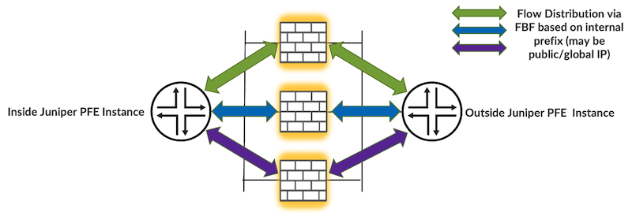
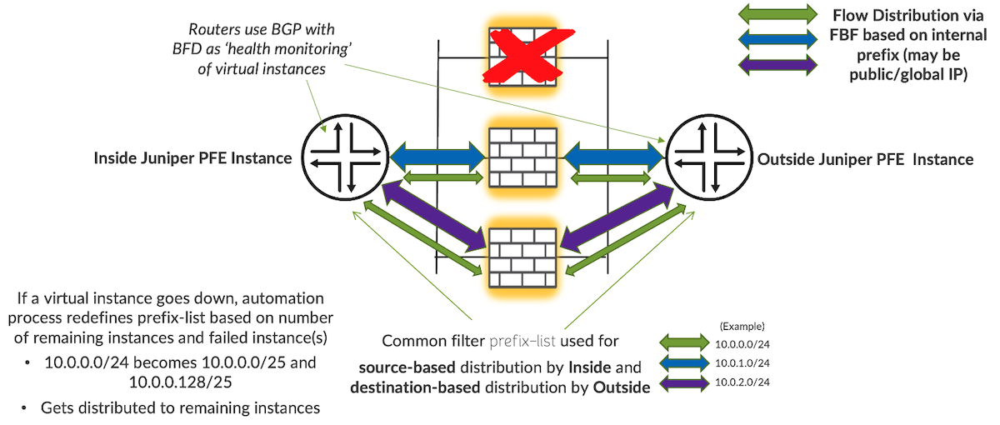
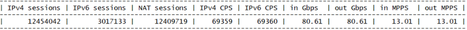
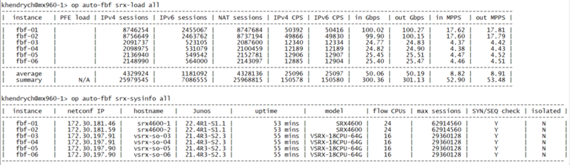
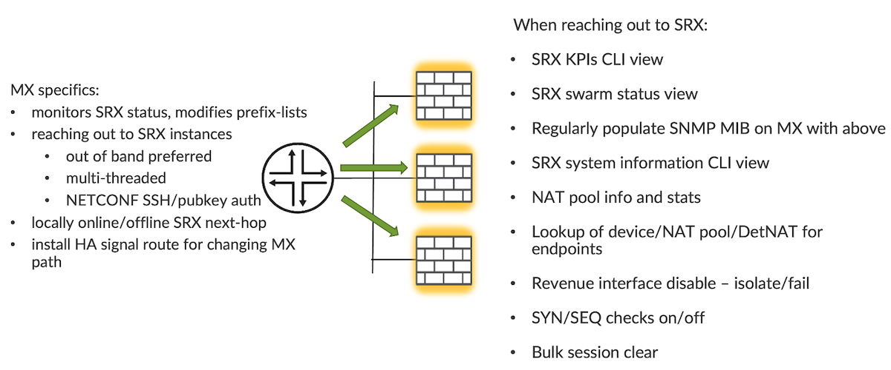
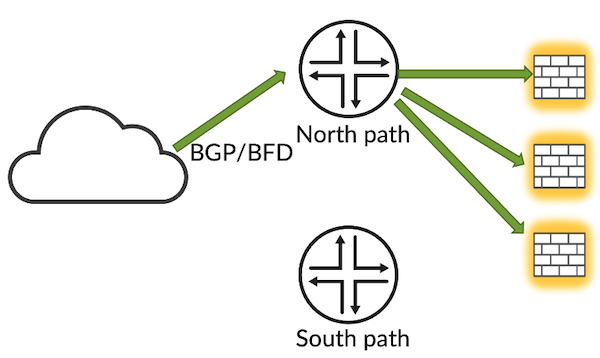
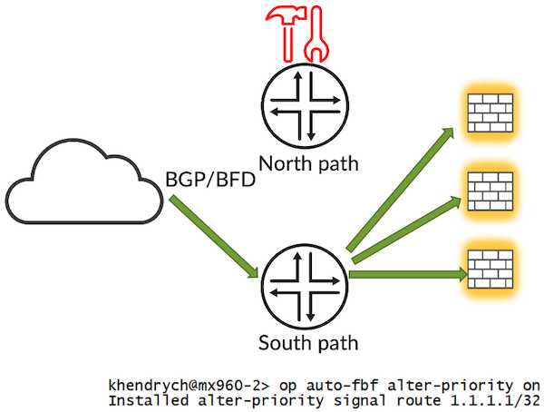
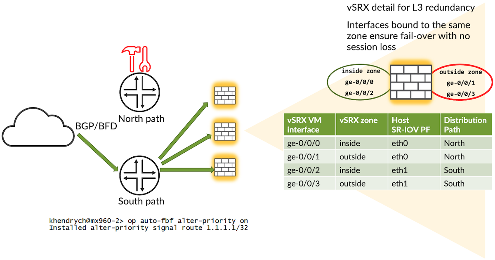

# Scale-Out Security Services with Auto-FBF

**Karel Hendrych - 08/12/2023**

An alternative approach to scale-out of security services, specifically for CGN and Gi Firewall deployments called auto-fbf. Technologies in scope are MX, on-box automation and SRX/vSRX as scaled-out elements delivering services.

## Solution Design Discussion

Let's step back first and talk about essential questions related to scale-out. There are quite a few pros and cons, but as it seems given adoption, scale-out architectures with virtual elements are still in early days. The vast majority of deployments of CGN/Gi is based on physical high-capacity appliances.

### Why to Scale-Out?

There are some good reasons why network designers may consider scale-out approaches.

- Reaching their chassis capacity, though not really seen on SRX5k due to massive performance especially with latest HW acceleration features
- Aim for physical distribution, intra/inter DC
- Overestimated traffic growth, e.g., running 12 slot chassis with 3 populated slots, maybe good idea to replace with something smaller, scalable though
- Some customers may be concerned about concentrating too much into one device
- Possibly long software qualification cycle
- Contrary to above distributed systems permit easy software qualification on small part of the scaled-out deployment
- Flexibility, no need to wait for physical appliance supply if there is enough compute capacity for hosting additional virtual elements
- Pushing the envelope, cool research projects touching HW/SW/network and automation

### Why Not to Scale-Out?

Contrary to good reasons, there are also reasons why scale-out might not be the best approach for a given scenario.

- Chassis systems are applicable in terms of scale/capacity now and for foreseeable future
- End to end supportability and ease of use is not necessarily an attribute of scale-out designs
- Potential complexity of scale-out compared to chassis systems

Co-ordination of multiple teams, x86 HW, x86 SW, security, network, etc.
Overlapping roles (e.g., previous in-build chassis balancing pushed to network level)
When virtualization is considered instead of appliances, x86 stacks result effectively in Development and maintenance of custom appliances
Generally, it's not hard to create things, it's hard to maintain them
- Distributed systems can't replace tasks requiring knowledge of broader context -like GTP firewall
- When scenarios are requiring state sync, at minimum IPSEC SA, scalability in multi-node systems is technically challenging
- Some virtual world drawbacks may step in - no HW accelerated DoS/DDoS, no critical path prioritization in HW (BFD, ...)

## History

EMEA specialist exploration in scale-out realm is dated back to the introduction of ECMP source/destination-ip only hashing on MX. Alternative approaches using filters started to be explored later as part of a project for major regional mobile carrier vSRX project. At the time of writing MX is the main platform in scope, the PTX platform is under test and initial results look promising. ACX platforms are yet to be tested.

## Assumptions

In live networks, service providers are using policy-based routing in various ways to distribute traffic load for decades. Anecdotally, some of these providers are manually re-configuring their devices if the destination for policy-based routing fails.

*The Essential idea of auto-fbf is to use Filter Based Forwarding capabilities of Juniper equipment to steer traffic towards multiple SRX/vSRX instances, with automation changing FBF config based on liveness of individual elements as shown in infographics below. *

This approach can work if subscribers are distributed more or less equally across the IP pools. For example, if we'd have:

- 10.0.0.0/16 prefix for subscribers
- divided into 1024x /26 prefixes
- distributed to 4 devices

then the scaled-out elements are likely to work under similar load unless some extreme conditions occur, like clients appearing only in certain /26 distributed vastly to one out of the 4 devices causing imbalance.

However, in practice this is not happening as in real life networks random distribution is seen. Naturally, a critical mass of hosts must exist too, say having 4 scaled-out elements and half a dozen hosts, each producing gigabits of throughput, could result in a situation where certain elements are overloaded while others are idling.

## What to Scale-Out?

First things first, both ECMP and FBF approaches are generic, permitting to scale-out pretty much any stateful equipment from different vendors. But there are some good reasons to use Juniper as the common vendor:

- Consistent look and feel, CLIs/APIs/monitoring for both MX and vSRX/SRX
- Building blocks coming from a single vendor, especially when physical elements are used
- Related to previous, responsibility of one professional services group

Essentially, there are following the choices as of time of writing:

- vSRX, sample practical simulation of mobile operator's traffic has shown about 80Gbps throughput per instance on multi-dimensional pattern, mixture of IPv4 and IPv6, connection setups, proportional number of concurrent connections and relevant ratio of throughput and packets per second. Tested was a modern x86 compute matching typical operator's specs.

- SRX4600, throughput vastly depends on efficient leverage of offloading capacity, properly configured system could fill up the physical limit of 4x100GE dual homed interface (200Gbps)
- Some very high multi-terabit use-cases could be also about scaling-out SRX5k systems, scale-out of internally scale-out architectures
- Mixture of non-proportional elements e.g., vSRX and SRX4600 as seen in graphics below

## Introducing Auto-FBF

As noted previously, the essential idea of auto-fbf is changing contents of prefix-lists pointing to individual vSRX/SRX instances based on their status, using next-table or next-hop as corresponding filter actions. To react upon up/down changes of scaled-out elements, triggers are internal Junos events related to BGP/BFD for element down events, and regular timer runs for up events. Reaction times are fast, in range of couple of seconds depending on how aggressively BFD timers are configured, and how many filters updated in ephemeral database (no traditional commit). More details about auto-fbf in following graphics and bullet points.

### Auto-FBF Control Plane and High-Level Feature Set

### Auto-FBF Details

- On-box Python code placed on device doing scale-out
- Includes profile driven prefix generator feature for creating the balancing layout
- Supports both IPv4 and IPv6
- Leverages Junos automation capabilities, using fully supported PyEZ Python library
- Monitoring BGP/BFD status (pair of peering) and takes actions on element up/down
- The only changes made on box potentially frequently and at scale are effectively change of prefix-list leveraged by inside and outside filters. Instantiation of a static route for signaling purposes is occasional.
- Changes made in ephemeral configuration database only, fast and proven automation technique
- Visibility tools:
    - Status view - entire deployment, group and individual elements, definable scope applies to most of the views and operational tools
    - Comprehensive KPIs view
    - Sysinfo tool revealing details about vSRX/SRX devices
    - NAT information view
- Operational tools:
    - Offline/online elements, either soft or by shutting down interfaces
    - Searching for prefixes/NAT/DetNAT (including internal endpoint lookup)
    - State checks on/off
    - bulk session clear
- Command for changing path between two independent scale-out devices using arbitrary signal route for policy options changes, e.g., prepend path
- Able to fail-over between two devices with different interface layout without re-hashing flows and causing any traffic impact. Tested was for example fail-over between MX204 with 4x100GE AE and MPC10 with 6x100GE interface in AE, similarly PTX10001-36MR and MX204 running different software versions (Junos EVO 22.4R2 vs Junos 21.4R3)
- Features weights for scaling-out disproportional elements, including failed weight to cover scenario where some elements cope with blasts better than the others
- Grouping feature, where operations are happening within groups of elements. Use cases are large group for global IPv6 and translated IPv4 (dual stack) and smaller group for premium service with public IPv4 and global IPv6 (dual stack with non-translated IPv4). Then use-cases like group for IPv4 and another for IPv6 are possible too.
- Grouping is agnostic to routing instances and overlapping prefixes
- Population of SNMP MIB for central KPI/status polling, essential SNMP trap for changes
- Configurable prefix-list names as aliases to default form reflecting element names
- Flexible prefix split configuration, e.g., to split /24 when 2 vital elements are remaining vs split to /26 when 3 remain
- Ability to install failed signal route when critical number of elements fail, separate for IPv4 and IPv6
- Feature to hold-down elements until certain BGP peer uptime is reached
- SYSLOG and console logging with verbosity levels

## High availability model

The basic design fundamental of auto-fbf Internet model like high availability is totally independent distribution devices, two or more, with no autonomous synchronization/ in-between. The reason is to avoid potential single point of failures in such mechanism. Devices can be of different types, e.g., MX/MPC10 mixed with MX204 or even PTX with different interface types and layout. Including different software versions.

Let's look at the HA concept more in detail, assume following scenario when traffic from clients on the left is flowing towards scaled-out elements via Northern path.

Traffic can be diverted either manually by executing the appropriate auto-fbf command on the MX as seen below, or the router(s) surrounding the distribution MX might drop the path depending on BGP/BGF signaling. Distribution devices can also give up their primary forwarding role based on number of reachable elements by installing a specific failed signal route (can be also equal to alter path signal route). Then it's about Junos policy options to decide the path. Signal route is an arbitrary route installed for example in inet.0, used along with if-route-exists condition in routing options to change routing policies on-box or on adjacent devices.

From scaled-out elements' perspective session states are during fail-over situations preserved. In the example below vSRX instances are using SR-IOV, where two SR-IOV VF (Virtual Function) pairs of inside/outside interfaces would be bound to different PF (Physical function) to achieve link redundancy (dual stacked element has 4 IPv4 and 4 IPv6 BGP peers). This means that if host eth0 was connected directly to the northern device, after failure the traffic would appear on host eth1 interface where 2nd pair of inside/outside VFs is mapped to. If the inside interfaces and outside interfaces reside in the same zone, state is preserved, and traffic will fail over with no session loss.

Technically there needs to be session scan rewriting next-hops, possibly observable with massive session scales. In scale-out architectures session scan task is running in parallel.

## Auto-FBF State Today and Going Forward

As of time of writing (2023/06), auto-fbf solution for scaling out vSRX/SRX is deployable through a professional services engagement. Anyone is welcome to reach out for more information and demo.

There are following areas being tracked for enhancing the solution:

- More testing of the PTX10001-36MR as the distribution device
- RBAC for enabling/disabling features for classes/users
- Adjusting the logic for specific group to support tunnel like services (IPSEC/DSLite)
- Analytics to identify endpoints causing overload
- Provisioning helpers, e.g., Junos config template for next element in sequence
- Diagnostics of elements whether able to forward traffic
- Operation tools for software upgrades/downgrades
- Orchestration and control of new vSRX instances
- Steering of power management/efficiency
- GUI

## Useful links

- Second part of this article - Operating 1Tbps MX304/SRX4600 Firewall Scale-Out System: [https://juniper.github.io/techposts/operating-1tbps-firewall-scale-out-system/article](https://juniper.github.io/techposts/operating-1tbps-firewall-scale-out-system/article)
- PyEZ developer guide
[https://www.juniper.net/documentation/us/en/software/junos-pyez/junos-pyez-developer/index.html](https://www.juniper.net/documentation/us/en/software/junos-pyez/junos-pyez-developer/index.html)
- Junos event options
[https://www.juniper.net/documentation/us/en/software/junos/automation-scripting/topics/ref/statement/event-options-edit.html](https://www.juniper.net/documentation/us/en/software/junos/automation-scripting/topics/ref/statement/event-options-edit.html)
- Ephemeral Configuration Database
[https://www.juniper.net/documentation/us/en/software/junos/junos-xml-protocol/topics/concept/ephemeral-configuration-database-overview.html](https://www.juniper.net/documentation/us/en/software/junos/junos-xml-protocol/topics/concept/ephemeral-configuration-database-overview.html)

## Glossary

- ECMP, Equal Cost Multipath
- FBF, Filter Based Forwarding
- KPI, Key Performance Indicator
- PF, Physical function
- RBAC, Role Based Access Control
- SR-IOV, Single Root IO Virtualization
- VF, Virtual Function

## Acknowledgments

Customer keen on exploring alternative approaches to scale out, account team supporting the activity including management getting support for embedded automation methods. An Elite Juniper partner for providing feedback, sanitizing, and contributing to the code. Finally, all the people I have the pleasure to work with - my manager Dirk Van den Borne, colleagues Steven Jacques, Mark Barrett, Pawel Rabiej, Theodore Jenks, Matthijs Nagel, and the entire Sean Clarke's POC crew providing necessary equipment.
