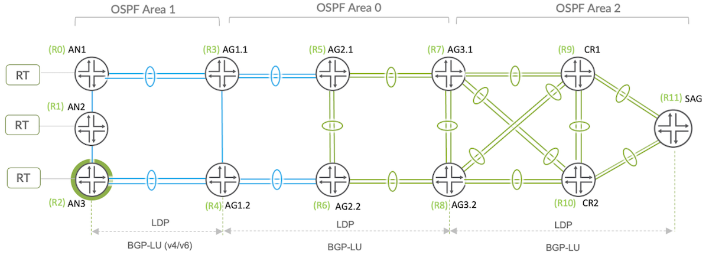

# Seamless MPLS LDP-Signaled with OSPF IGP Underlay

**Kevin Brown - 08/26/2022**

Second profile of the Juniper Validated Design series on basic Mobile Backhauling, with a focus on LDP-signalled MPLS and OSPF IGP.

## Introduction

In this section, we'll walk through essential components of the Seamless MPLS Mobile Backhaul (MBH) topology demonstrated in Profile-2, which features OSPF and LDP-signaling.

Check the first article "JVD Mobile BackHaul Overview" ([https://juniper.github.io/techposts/jvd-mobile-backhaul-overview/article](https://juniper.github.io/techposts/jvd-mobile-backhaul-overview/article)) to understand the different profiles created for this Juniper Validated Design (JVD).

## Validated Solution

The solution is further enhanced with per-prefix Remote LFA for OSPF. Within the **Access** segment, including ACX710 (AN3) and ACX5448 (AN1/AN2) devices, topology database is reduced by creating stub area 1 and additionally the *no-summaries* statement converts to a totally stubby area. Click the link for more information on OSPF Area Types in JUNOS. OSPF interface convergence is improved by configuring Bidirectional Forwarding Detection (BFD) to provide failure detection within 300ms.

The **Pre-Aggregation** segment includes ACX5448 AG1.1 and AG1.2 Area Border Routers (ABRs), which includes interfaces in both stub area 1 and backbone area 0. Area 1 configuration will be mostly identify to the access nodes, but we'll include a *network-summary-import* policy restricting network summary LSAs to include only access and pre-aggregation loopback IPs. The remainder of the IGP topology spans OSPF backbone area 0 across **Aggregation** segment and finally into **Core** OSPF stub area 2.



With the IGP established end-to-end, bringing up LDP-signaled MPLS LSPs is simple. Some additional knobs were included for most devices. Using *track-igp-metric* allows LDP routes to reflect IGP route metric (instead of default 1), which will be important for BGP resolving nexthops in inet.3. FEC deaggregation is a rudimentary best-practice for LDP-MPLS deployments to facilitate load balancing over ECMP by disabling junos default behavior of aggregating prefixes to a single label and FEC advertisement.

```
    ldp {
        auto-targeted-session;
        track-igp-metric; 
        deaggregate; 
        keepalive-timeout 90; 
        interface xe-0/0/19.0;
        interface ae5.0;
    }
    mpls {
        no-propagate-ttl;
        icmp-tunneling;
        optimize-timer 180;
        ipv6-tunneling;
        interface ae5.0;
        interface ae19.0;
    }
```

- track-igp-metric: [https://www.juniper.net/documentation/us/en/software/junos/mpls/topics/topic-map/ldp-configuration.html#id-configuring-miscellaneous-ldp-properties__d160e26](https://www.juniper.net/documentation/us/en/software/junos/mpls/topics/topic-map/ldp-configuration.html#id-configuring-miscellaneous-ldp-properties__d160e26)
- deaggregate; [https://www.juniper.net/documentation/us/en/software/junos/mpls/topics/topic-map/ldp-configuration.html#id-configuring-fec-deaggregation](https://www.juniper.net/documentation/us/en/software/junos/mpls/topics/topic-map/ldp-configuration.html#id-configuring-fec-deaggregation)
- keepalive-timeout 90: [https://www.juniper.net/documentation/us/en/software/junos/mpls/topics/topic-map/ldp-configuration.html#id-configuring-the-ldp-keepalive-timeout](https://www.juniper.net/documentation/us/en/software/junos/mpls/topics/topic-map/ldp-configuration.html#id-configuring-the-ldp-keepalive-timeout)

The existing LDP implementation is further extended to include IP-fast reroute protection capabilities for OSPF. This determines loop-free alternative paths for OSPF routes in event the primary next hop becomes unavailable. The precomputed backup paths are installed into the Packet Forwarding Engine (PFE). Local repair provides a simplistic fast failover mechanism capable of rerouting traffic in less than 50 milliseconds by allowing the PFE to switch to a precomputed backup path without having to wait for a Routing Engine update. While the backup path is in use, global repair will proceed to calculate and install optimal routes.

For failure events involving nodes which are not directly connected, remote LFA (R-LFA) provides for precomputed backup paths using dynamically created LDP tunnels from the point of local repair (PLR). The PLR will use the remote LFA backup path when the primary link fails.

The below configuration snip is common to the MBH JVD nodes for the enablement of remote LFA over LDP tunnels in OSPF. Targeted LDP adjacency is required, which is activated by including the loopback interface under LDP protocol hierarchy. Additionally, the auto-targeted-session knob allows automatically targeted LDP sessions between PLR and the remote LFA node using the loopback. Asymmetric remote neighbor discovery is supported by sending periodic targeted hellos to the router which initiated the remote neighbor for LDP auto targeted adjacency.

```
    ldp {
        auto-targeted-session;
        track-igp-metric;
        deaggregate;
        explicit-null;
        keepalive-timeout 90;
        interface xe-0/0/6.0;
        interface ae20.0;
        interface lo0.0;
    }
```

- auto-targeted-session: [https://www.juniper.net/documentation/us/en/software/junos/mpls/topics/ref/statement/auto-targeted-session-edit-protocols-ldp.html](https://www.juniper.net/documentation/us/en/software/junos/mpls/topics/ref/statement/auto-targeted-session-edit-protocols-ldp.html)
- interface lo0.0: [https://www.juniper.net/documentation/us/en/software/junos/mpls/topics/topic-map/ldp-overview.html](https://www.juniper.net/documentation/us/en/software/junos/mpls/topics/topic-map/ldp-overview.html)

Enable OSPF remote LFA to calculate backup next hops using dynamic LDP label-switched paths, the remote-backup-calculation knob is included under OSPF protocol hierarchy.

There must be a link/node protection mechanism specified. For the JVD, node-link-protection was used to prefer paths which avoids the primary next-hop routing device. With also including node-link-degradation, a fallback to link protection is available. Pre-Prefix LFA is additionally used to provide a temporary local repair path in the event of a failure to the primary next hop.

```
    ospf {
        backup-spf-options {
            remote-backup-calculation;
            per-prefix-calculation all;
            node-link-degradation;
        }
        traffic-engineering;
        area 0.0.0.1 {            
            stub no-summaries;
            network-summary-import ospf_summary_reject;
            interface lo0.0 {
                passive;
            }
            interface ae19.0 {
                interface-type p2p;
                node-link-protection;
                bfd-liveness-detection {
                    minimum-interval 100;
                    multiplier 3;
             }
```

- remote-backup-calculation: [https://www.juniper.net/documentation/us/en/software/junos/ospf/topics/topic-map/configuring-loop-free-alternate-routes-for-ospf.html#id-configuring-remote-lfa-backup-over-ldp-tunnels-in-an-ospf-network](https://www.juniper.net/documentation/us/en/software/junos/ospf/topics/topic-map/configuring-loop-free-alternate-routes-for-ospf.html#id-configuring-remote-lfa-backup-over-ldp-tunnels-in-an-ospf-network)
- per-prefix-calculation all: [https://www.juniper.net/documentation/us/en/software/junos/ospf/topics/topic-map/configuring-loop-free-alternate-routes-for-ospf.html#id-configuring-per-prefix-lfa-for-ospf](https://www.juniper.net/documentation/us/en/software/junos/ospf/topics/topic-map/configuring-loop-free-alternate-routes-for-ospf.html#id-configuring-per-prefix-lfa-for-ospf)
- node-link-degradation: [https://www.juniper.net/documentation/us/en/software/junos/ospf/topics/topic-map/configuring-loop-free-alternate-routes-for-ospf.html#id-configuring-node-link-protection-for-ospf](https://www.juniper.net/documentation/us/en/software/junos/ospf/topics/topic-map/configuring-loop-free-alternate-routes-for-ospf.html#id-configuring-node-link-protection-for-ospf)
- traffic-engineering: [https://www.juniper.net/documentation/us/en/software/junos/ospf/topics/topic-map/configuring-ospf-support-for-traffic-engineering.html#id-ospf-support-for-traffic-engineering](https://www.juniper.net/documentation/us/en/software/junos/ospf/topics/topic-map/configuring-ospf-support-for-traffic-engineering.html#id-ospf-support-for-traffic-engineering)
- network-summary-import: [https://www.juniper.net/documentation/us/en/software/junos/ospf/topics/ref/statement/network-summary-import-edit-protocols-ospf.html](https://www.juniper.net/documentation/us/en/software/junos/ospf/topics/ref/statement/network-summary-import-edit-protocols-ospf.html)
- node-link-protection: [https://www.juniper.net/documentation/us/en/software/junos/ospf/topics/topic-map/configuring-loop-free-alternate-routes-for-ospf.html#id-configuring-node-link-protection-for-ospf](https://www.juniper.net/documentation/us/en/software/junos/ospf/topics/topic-map/configuring-loop-free-alternate-routes-for-ospf.html#id-configuring-node-link-protection-for-ospf)

## Conclusion

In this blog, we discussed the foundational aspects of the Mobile Backhaul Juniper Validated Design referencing *Profile 2*, which establishes multiple OSPF areas, enables LDP-signaled MPLS and then further optimizes the topology with R-LFA mechanisms. The point in which the topology becomes "Seamless" will be covered in the next blog with the implementation of BGP Labeled Unicast (BGP-LU) to stitch domains together. We'll create redundant route reflectors, build out multiprotocol BGP peering and finally establish our overlay VPN services, which will be further enhanced with Ethernet OAM protocols over E-LINE/E-LAN solutions.

## Useful links

The Juniper Validated Design series are organised as:

- [JVD Overview](https://juniper.github.io/techposts/introducing-the-validation-series/article)
- [Mobile Backhaul Overview](https://juniper.github.io/techposts/jvd-mobile-backhaul-overview/article)
- [Seamless MPLS LDP with OSPF underlay] present document
- [Building Border Agnostic Architectures with Seamless MPLS](https://juniper.github.io/techposts/border-agnostic-architectures-with-seamless-mpls/article)

## Glossary

- ABR: Area Border Router
- AG: Aggregation
- AN: Access Node
- BFD: Bidirectional Forwarding Detection
- BGP: Border Gateway Protocol
- BGP-LU: Border Gateway Protocol Labeled Unicast
- BH: Backhaul
- BN: Border Node
- CR: Core
- E-LINE: Ethernet Virtual Private Line
- E-LAN: Ethernet Virtual Private Local Area Network
- FEC: Forwarding Equivalence Class
- FH: Fronthaul
- FRR: Fast Reroute
- IGP: Interior Gateway Protocol
- IP: Internet Protocol
- IPv4: Internet Protocol version 4
- IPv6: Internet Protocol version 6
- IS-IS: Intermediate System to Intermediate System
- JVD: Juniper Validated Design
- LFA: Loop Free Alternative
- LDP: Label Distribution Protocol
- MBH: Mobile Backhaul
- MH: Midhaul
- MPLS: MultiProtocol Label Switching
- OAM: Operation, Administration, and Maintenance
- OSPF: Open Shortest Path First
- PFE: Packet Forwarding Engine
- PLR: Point of Local Repair
- R-LFA: Remote Loop Free Alternative
- RR: Route Reflector
- RSVP: Resource Reservation Protocol
- SAG: Services Aggregation Gateway
- T-LDP: Targeted Label Distribution Protocol
- VPN: Virtual Private Network
