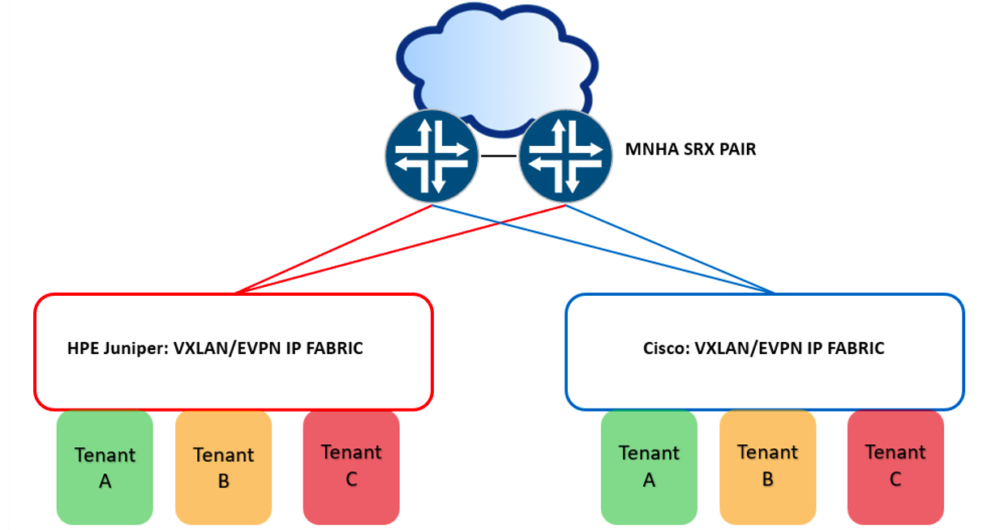
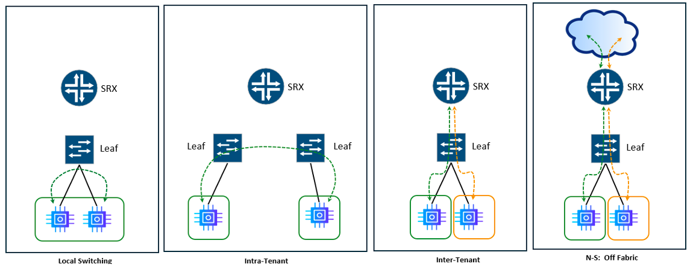
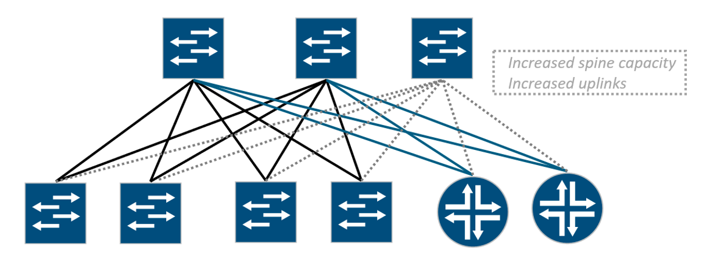
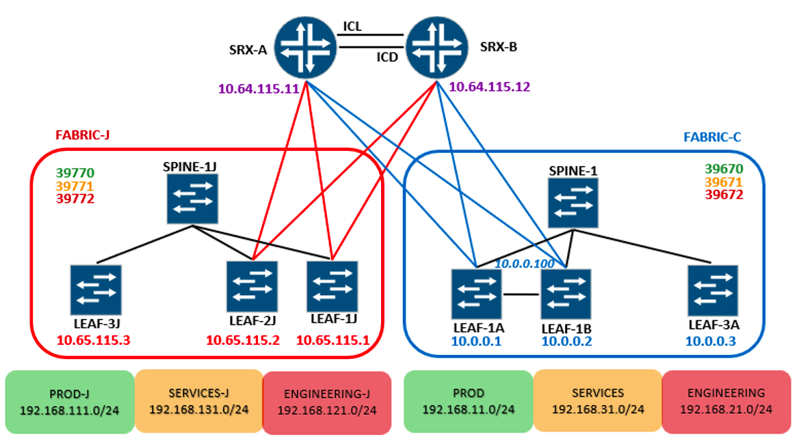
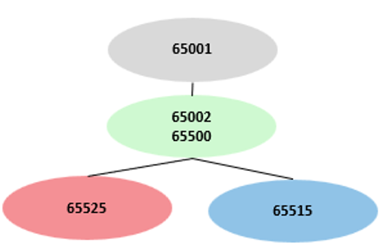
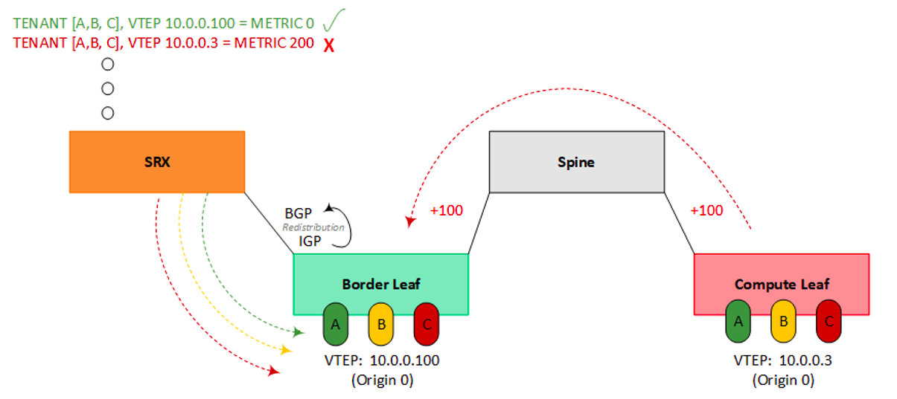
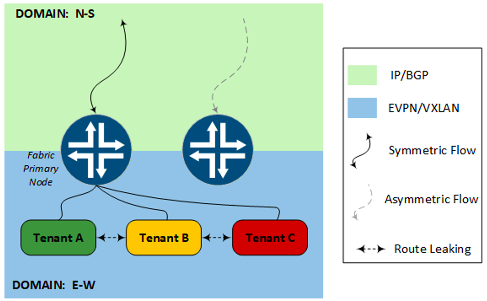
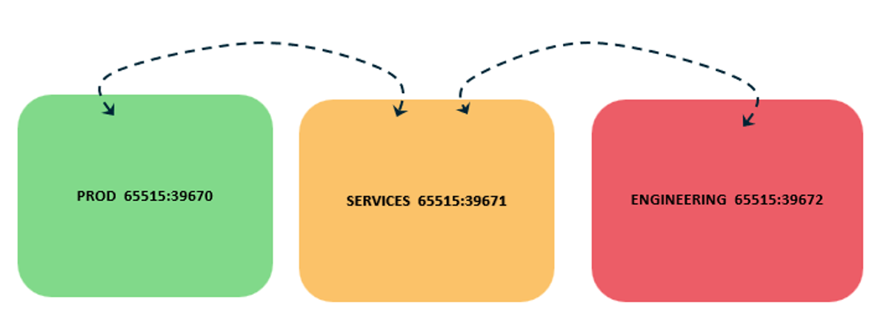

# Secure Active/Active Multivendor Fabrics with MNHA

**James Rathbun - 09/09/2026**

Modern data center IP fabrics are built on VXLAN and EVPN. The technology is genuinely powerful: a decoupled underlay and overlay with multi-protocol BGP, Type-2 and Type-5 routes, distributed anycast gateways, etc.  Getting it right rewards you with a fabric that is resilient, programmable, and scales cleanly from dozens to thousands of endpoints. Get any piece wrong, and you'll document an unfortunate discovery during an outage window.  Adding a firewall into that fabric raises the stakes further --- now the firewall itself has to participate in a control plane it wasn't originally designed for. Layer in a requirement for fast, stateful failover, and the complexity compounds again.

This post is not a prescribed best practice or a turn-key reference design. It's a how-to for design thinking --- the why behind the knobs, the flexibility available, and the failure modes that surface under test. Your environment drives the actual choices. The goal is to reason clearly about the tradeoffs, not to simply copy a config.

Not every fabric is built the same. Whether you inherited someone else's design or are starting from scratch, the topology you're working with may look familiar or may not  and the approach here isn't limited to any one build. What this post does explore: an MNHA pair of SRX firewalls, each terminating EVPN Type-5 as its own VTEP, securing two separate fabrics built on two different vendors' switching --- one Juniper, one Cisco NX-OS --- at the same time.



Can a single flow-mode SRX MNHA pair be the secure border firewall for both simultaneously, with each fabric pinned to a different primary node and stateful failover across the pair? -- Yes.

## Why You'd Actually Build This

Two fabrics on one firewall pair isn't a lab curiosity that happens to be technically possible. It's a pattern that real environments back into (or evolve into) more often than the validated-design world tends to acknowledge.

Some environments don't get a choice. Regulated environments, federal and otherwise, sometimes treat single-vendor implementations as their own risk, or policy mandates more than one vendor in the same environment. Others inherit it without ever planning for it: a merger, an acquisition, two departments with two budgets and two vendor relationships, suddenly one parent org. You don't get to retroactively standardize the fabric. And some build it on purpose, on a clock.  A fabric migration is rarely a flag-day cutover, and for as long as both fabrics are live, both need the same security posture and the same HA guarantee.

None of the reasons above actually depend on the two fabrics being built by different vendors. That's just the version this post tests. An enclave is the same problem with the vendor swapped out for a compliance boundary: a domain that needs to be provably separate, scoped clean, easier to audit precisely because nothing about its security posture depends on what's happening next door. Test/DEV environments maybe in a similar situation just from the other direction; let that team run their own fabric and break it however they like.  The security boundary still holds regardless of what they did to themselves.

And there's a dimension underneath all the above worth acknowledging - the ICL connecting an MNHA pair is a routed Layer 3 link, which means the two nodes don't have to be in the same room or even the same site.   The SRXs can be physically separated across geographical areas supporting stateful failover.

Whatever the reason, the question is the same, can one secure border do this for both fabrics at once, without compromising either? The rest of this post is the answer.

## Introduction

There's more than one way to put a firewall in front of a fabric, and which one you pick determines whether the firewall merely attaches to the fabric or integrates with its control plane. That distinction tracks closely with Type-2 versus Type-5.  Bolt-on methods sit outside EVPN entirely, while the two native methods both speak Type-5 directly, just differently.  Multi-Node High Availability (MNHA) is the other half of this solution.  The HA model that lets two of these integrations run side by side without one fabric's failover disturbing the other.

## Firewall Fabric Integration Methods

Let's briefly touch base on different ways to attach or integrate a firewall into a fabric.  While this post covers the Native Type-5 VTEP model, it's good to understand the differences, scalability and use cases the other methods offer.  Two attachment, or fabric bolt-on methods, traditionally used to provide security services to fabrics are with L2 or L3 extensions.

- **L2 extension** is a conventional model: the fabric's leaves terminate the VTEP function themselves.  A segment is simply extended (trunked) off the fabric to the firewall which acts as the default gateway for that segment. The firewall doesn't participate in EVPN at all; as far as it's concerned, it's just an L2 link with a default-gateway interface on it.  Scalability is the limiting factor.  Each subnet you want inspected needs its own trunked segment to the firewall, and once it's there, that firewall pair becomes the gateway for it (not the fabric's distributed anycast gateway). Fine for a handful of segments, unwieldy as tenant count grows, and you give up the fabric-native gateway model for everything you've extended.  This is also the attachment method an MNHA hybrid SRG with a VIP would use.  Out of scope for this document, the focus is on Type-5 VTEP integration.

- **L3 extension** is the same idea, one layer up: the fabric still terminates the VTEP, but the firewall is pulled into the path by routing rather than by being the L2 gateway. Static routes pointed at the firewall and redistributed within the fabric, or with a dynamic routing peer. The dynamic case has a scaling cost.  Each tenant VRF/VNI you want inspected this way typically needs its own peering relationship with the firewall.  Trivial at three tenants and an operational tax at thirty.

The other two methods integrate with the fabric's control plane directly rather than bolting on at the edge, both consume EVPN Type-5 signaling, just in different ways: tunnel inspection and the native Type-5 VTEP model.

- **Tunnel inspection** is the non-VTEP flavor.  The firewall inspects the inner VXLAN packet header in flight without ever terminating the tunnel; the VXLAN encapsulation stays intact end-to-end across the fabric. The SRX is added to the fabric as a remote/external EVPN gateway and originates its own Type-5 route distinguisher, attracting traffic to itself instead. This method is well documented in the validated reference design: Secure Data Center Fabric with Juniper SRX Series Firewalls

- **Native Type-5 VTEP** is the one this post is built on.  The firewall is a Type-5 VTEP, doing its own VXLAN encap and decap and participating in EVPN as a Type-5 gateway. One device is both the VTEP and the NGFW. "Native" here means single-device VTEP-plus-firewall; it does not mean zero VXLAN overhead. Karel Hendrych's posts demonstrate additional use cases using this method:  SRX EVPN/VXLAN T5 oIPSec and SRX Secure Fabric Entry Point.



A Type-5 VTEP inspects inter-subnet traffic like North-South (N-S) fabric external, and inter-VRF East-West (E-W) once you leak the routes.  It structurally cannot see intra-subnet (Type-2) east-west traffic because that traffic never becomes a routed prefix in the first place and is switched (or routed) locally by the fabric.  If the SRX never sees the flow, it cannot provide inspection/security services for that flow.   A summary of the different types of flows and default SRX inspection capabilities in the table below.

Table: Fabric Flows and forwarding methods versus SRX inspection

| Flow | Pathing | Inspection |
|:--|:--|:--|
| Same Subnet, Same Leaf | Local L2 Switching | No |
| Same Subnet, Different Leaves | VXLAN T-2, Leaf-to-Leaf | No |
| Same VRF, Different subnet (Intra-Tenant) | Local L3 Routing | No* |
| Different VRF (Inter-Tenant) | Type-5 | Yes |
| N-S, Tenant to off-fabric | Type-5 | Yes |
| Intra-Tenant (Forced via Policy Redirect) | Forced | Yes** |

Assumes the tenant IRB is on the leaf. Gateway-on-firewall designs inspect this without a redirect. Requires a policy redirect on the fabric (PBR/ePBR on NX-OS, FBF on Junos). Not validated in this build.

One thing worth mentioning is that Type-5 VTEP behavior on the SRX doesn't use the traditional L2 EVPN VTEP machinery.  There is no vtep-source-interface, no show ethernet-switching vxlan-tunnel-end-point. That tooling reports Type-2 VTEP state, and a Type-5-only build has none to report --- there's nothing there for it to show you.  SRX specific commands to validate Type-5 operations can be found in Appendices 3 and 5.

## To Border Leaf or Not to Border Leaf?

The question has surfaced in conversations - does the SRX need to attach to the spine or leaf or somewhere else?  What's the best place to connect the SRX and why?  There are three reasonable places to put a Type-5 SRX in a fabric, and the right answer depends on what you're optimizing for.

Spine attached is the JVDE model, the SRX peers every spine. Functionally, this makes the SRX just another leaf from the spine's point of view.  It occupies the same connection pattern a leaf would, minus the intermediate switch.  Spine attached is not some tier sitting above the fabric. Every other leaf is roughly equidistant from it.  The cost shows up as the fabric grows.  Peering count scales with spine count, so three spines mean three links and three overlay peerings per node, four spines means four, and the spine has to be EVPN-aware of the SRX as an external gateway.



There's a subtler cost to spine attachment.  It comes down to what the SRX actually learns.  A normal leaf knows every host sitting behind it, and leaves share that host-level detail with each other automatically through Type-2.  Any leaf can send traffic straight to the exact leaf that owns a host. The SRX doing Type-5 only doesn't get that. It learns the networks, the /24 prefixes, but not which specific leaf owns which host inside them.

That's fine until the same network is advertised by more than one leaf. Now the SRX sees several equal paths to that /24 and no way to tell which leaf actually connects to the host you're after. It picks one. When it picks wrong, the traffic lands on a leaf that doesn't connect to the host.  The fabric carries it the rest of the way to the leaf that does. The connection still works, but it took a long, suboptimal path. Multiply that across every flow and you're burning fabric bandwidth on traffic that had no business crossing it.

The fix is to force host routes (/32s and /128s) into Type-5, so the SRX knows exactly which leaf owns each host. This can seem counterintuitive. Everywhere else you summarize --- advertise the network prefixes, suppress the host routes --- to keep route tables lean. A spine-attached SRX is one of the few places that needs it. Fabric-wide host routes aren't free (one per endpoint in every table) and not every platform can generate them.

Border-leaf attachment avoids this issue. Attached to the leaf, the SRX hands traffic to a device that already has full host-level knowledge and does the correct lookup locally. The SRX never has to guess, so it never needs the /32s, and you keep your summarized tables clean everywhere else. In this build the SRX carries only network prefixes for each tenant, no host routes, and there's no tromboning because the leaf it's attached to resolves the last hop.

It also mitigates the per-interface scaling issue. The SRX peers only the leaf pair it's attached to.  A link, or two links (more on single/dual attached topologies in the Failure Testing section), per node, fixed, regardless of how many spines the fabric has or ever grows to. The leaf pair becomes a natural, contained services block. The cost is hop count.  A host on a leaf far from the border crosses leaf, spine, border leaf, then the SRX.  The same uplinks now carry both the leaf's normal tenant traffic and everything routed to or from the firewall. Sizing those uplinks correctly means knowing both volumes ahead of time, not just the tenant traffic the leaf would otherwise carry on its own.

A dedicated services-leaf pair has the same hop economics as border-leaf attachment, minus the double duty of transiting traffic outside of the fabric.  If a leaf pair is already built specifically to host shared services like load balancers, other appliances, and the firewall then attaching the SRX here is prudent. Otherwise, there may not be adequate justification for a separate leaf pair.

Heavy east-west traffic, many spines, and real latency sensitivity tend to favor spine-attachment. High firewall traffic volume on its own tends to favor a dedicated services-leaf pair. Consolidating perimeter and segmentation onto one pair, common in campus designs, tends to favor border-leaf attachment: fewer sessions to manage, a contained block, no dedicated hardware needed just to host a firewall.

The attachment point and the VTEP/steering design are independent decisions. Everything later in this post about shared VTEPs, per-fabric primacy, and steering applies the same way regardless of which tier the SRX attaches to.

## MNHA

Multinode High Availability (MNHA) plays a vital role in this post supporting built-in stateful failover between two different VXLAN/EVPN fabrics. Familiarity with MNHA is assumed. Detailed coverage of the MNHA concepts isn't covered in this post.  Refer to the following posts for MNHA coverage of topics used within this post's build:

- Multi-Node High Availability Basics --- ICL mechanics, SRG0, session synchronization, and config sync.
- Hybrid MNHA with eBGP --- hybrid deployment mode, BFD-driven failover, signal routes, and VIP mechanics.
- MNHA, IPSec and Multiple Routing Instances ---  ICD mechanics, including how it carries asymmetric flows between nodes. Topology & Attachment
- SRX MNHA: VRRP --- a BGP-based ICL/ICD template with dual links backing each other.

## Topology

Objectives validated in this build:

- Secure north-south for both fabrics, perimeter-inspected through the same SRX pair.
- Secure inter-VRF (east-west) insertion, including across fabrics once a route is deliberately leaked.
- Per-fabric active/active --- both nodes carrying production traffic simultaneously, not active/standby per fabric.
- Stateful failover for both fabrics on the surviving node (intra fabric and inter fabric).

One MNHA SRX pair, vSRX 25.4R1, with VRF-to-zone binding, providing both traditional perimeter (edge) firewalling for N-S traffic outside the fabrics, and E-W firewall functions for fabric tenants. Our N-S flows are internet destinations specifically. Collapsing both functions onto a single pair is a choice, not a fit for every organization's design. The same applies identically if the destination is a campus core, another data center, or a security zone elsewhere in the same organization.

Next figure shows the SRX dual-attached to each fabric, cross-connected to both border leaves, so each node has two physical links into the Juniper side and two into the Cisco side. Per-fabric primacy is MNHA active/active: SRG-3 carries the Juniper fabric, primary on node A; SRG-2 carries the Cisco fabric, primary on node B. Each SRG elects its own active node independently, which is what lets one box run both fabrics' production traffic at once instead of one node sitting idle as a cold spare.



**Fabric J** is Juniper-native with vJunos leaves and spine, OSPF underlay with an iBGP-RR overlay inside the fabric, AS 65525. Three tenants: PROD-J (192.168.111.0/24), SERVICES-J (192.168.131.0/24), and ENGINEERING-J (192.168.121.0/24) each their own VRF and Type-5 L3VNI: 39770, 39771, 39772. The fabric's leaf VTEPs are 10.65.115.1 (LEAF-1J), 10.65.115.2 (LEAF-2J), and 10.65.115.3 (LEAF-3J). The SRX pair terminates Fabric-J on its shared VTEP address: 10.64.115.11 on SRX-A, 10.64.115.12 on SRX-B (the same address each node presents to Fabric-C).

**Fabric C** is Cisco NX-OS: EIGRP underlay with an iBGP-RR overlay inside the fabric, a separate AS, 65515. Three tenants:  PROD (192.168.11.0/24), SERVICES (192.168.31.0/24), and ENGINEERING (192.168.21.0/24) with the same pattern, L3VNIs 39670, 39671, 39672. The fabric's leaf VTEPs are 10.0.0.1 (LEAF-1A), 10.0.0.2 (LEAF-1B), and 10.0.0.3 (LEAF-3A). LEAF-1A and LEAF-1B form a vPC pair and share an anycast VTEP, 10.0.0.100, advertised by both leaves and the source for all dual-homed host traffic.  LEAF-3A is standalone without an anycast address. The SRX pair terminates Fabric-C on the same shared VTEP it uses for Fabric-J: 10.64.115.11 on SRX-A, 10.64.115.12 on SRX-B.

> Note: This lab runs the latest available virtual images for both vendors at the time of writing vJunos 24.4.R1.9 and Nexus 9300v 10.3.9M.  Nexus 9000v 9.3.6, surfaced a real forwarding/fragmentation issue under sustained traffic that the 10.3.9 image didn't reproduce. *

The figure below shows the BGP AS layout:  Fabric-J is 65525, Fabric-C is 65515, SRXs are supporting 2 AS, 65500 fabric facing and 65002 peering with 65001 for external connectivity. The two fabrics don't know about each other, don't peer with each other, and don't need to. At the SRX, both are eBGP peers, each with its own RDs and RTs, each fully isolated from the other except where we deliberately leak a route later in this post. Ships in the night: two independent vessels that happen to dock at the same pier.



One thing not obvious from the diagrams above is that both fabrics decap on a single shared VTEP address per SRX. SRX-A presents 10.64.115.11 to both Fabric J and Fabric C; SRX-B presents 10.64.115.12. The mechanism behind why that's safe, and what it makes possible, is the subject of The Multivendor Angle section later in this post

Base SRX configurations are in Appendix 2.  For easier reference, the configurations are functionally split as follows:

- Appendix 2A - Interfaces and zones. Physical/logical interface assignments and VRF-to-zone bindings, both nodes.
- Appendix 2B - MNHA foundation. ICL/ICD peering, SRG-0, and the base chassis high-availability configuration every SRG builds on.
- Appendix 2C - VXLAN/EVPN, BGP peerings, and VRFs.  The bare routing-instance shells, underlay/overlay BGP groups, and Type-5 ip-prefix-routes statements feeding every tenant VRF.
- Appendix 2D - Security policies.  The zone-pair policies referenced throughout this post. Policies used in this demonstration are overly permissive.

Every in-line configuration example from this point forward builds on those base configurations.

## Underlay Reachability and Tuning

The control plane can be completely correct while the forwarding plane quietly does something else. A route can exist, be valid, and still never get installed in the forwarding table. A path can be reachable and still lose a data-plane tiebreak that was never evaluated. This disparity between the Routing Information Base (RIB) and the Forwarding Information Base (FIB) frequently causes unexpected traffic flows or silent black-holing.

## Underlay ECMP

Dual attaching an SRX to a network fabric is designed to provide each firewall node with two physical paths. It is easy to assume that having two paths present in the routing table means both are actively carrying traffic. By default, they are not.

With a dual-attached topology, the RIB holds two equal-cost paths to a given VTEP. However, standard eBGP installs only the single best path into the forwarding table unless explicitly told otherwise. The second path sits there, visible, valid, and completely unused; flagged with 'Inactive reason: Not Best in its group'.

Dual-attach without a matching multipath configuration provides resiliency, not load-sharing. It will fail over cleanly when a link drops, but in a steady state, every flow rides a single uplink while the second sits completely idle.

The outputs below show without multipath configured.

```
vSRX-B> show route 10.0.0.3 extensive
     ...second path...
     Inactive reason: Not Best in its group - Active preferred
vSRX-B> show route forwarding-table destination 10.0.0.3
     [single ucst --- one next-hop, second path never installed]
```

To enable active/active forwarding, you must configure multipath under the underlay eBGP group and apply a forwarding-table load-balance export policy to the routing options. These two components are codependent.  Multipath forces BGP to mark the second path as active in the RIB, while the load-balance export policy forces the Packet Forwarding Engine (PFE) to install it as a composite next-hop spanning both uplinks. Skip either step and your dual-attached topology will quietly run in an active/standby state.

Enable the FIB to use ECMP:

```
set policy-options policy-statement LB-PER-FLOW term 1 then load-balance per-packet
set policy-options policy-statement LB-PER-FLOW term 1 then accept
set routing-options forwarding-table export LB-PER-FLOW
```

Enable the protocol to use ECMP:

```
set protocols bgp group FABRIC-UNDERLAY multipath
```

Compare the outputs below with the previous outputs with multipath enabled.

```
vSRX-B> show route 10.0.0.3
     [both paths now active]
vSRX-B> show route forwarding-table destination 10.0.0.3
     ulst 262164 --- both next-hops installed (ge-0/0/4.3 and ge-0/0/6.0)
```

## ECMP Hashing and Flow Selection

Getting both paths into the forwarding table is only half of load-sharing. The other half is whether the platform's hash can tell the flows apart.With VXLAN encapsulation, every packet between the same two VTEPs carries identical outer addressing: source VTEP, destination VTEP, and destination port 4789 (UDP). The only field that varies per flow is the outer UDP source port. If the hash only considers L3, that entropy is invisible. Every flow toward a given leaf hashes the same and rides a single uplink, no matter how many next-hops are installed. Traffic still spreads across different leaves, since the outer destination IP differs, but not within the traffic destined to one.

On a flow-mode SRX the relevant decision isn't the forwarding table's hash --- it's the flow module's next-hop selection at session install, and by default that selection doesn't consider L4. Multipath can be installed and valid in the FIB while every session still lands on the same uplink.

Confirmed in this build on vSRX with eight parallel flows; all having identical source and destination addresses, differing only in TCP source port, all egressed a single interface with multipath configured and both next-hops present as a ulst.  Adding L4 to the forwarding-table hash (forwarding-options hash-key family inet layer-4) changed nothing. Enabling l4-key-ecmp split the same eight flows across both uplinks, with the session table confirming per-session egress selection independent of ingress interface.

```
set security flow l4-key-ecmp
set security flow allow-reverse-ecmp
```

Three of eight flows are shown below. Source ports 50243--50245 differ by one; egress differs by hash. The middle session ingresses on one uplink and egresses the other, confirming selection is per-session rather than derived from ingress.

```
vSRXB
show security flow session source-prefix 192.168.21.0/24 destination-prefix 192.168.31.0/24
Session ID: 4295027532, Policy name: ENGINEERING-2-SERVICES/37, HA State: Active
In: 192.168.21.200/50243 --> 192.168.31.100/5201;tcp, If: ge-0/0/6.0
Out: 192.168.31.100/5201 --> 192.168.21.200/50243;tcp, If: ge-0/0/6.0
Session ID: 4295027533, Policy name: ENGINEERING-2-SERVICES/37, HA State: Active
In: 192.168.21.200/50244 --> 192.168.31.100/5201;tcp, If: ge-0/0/6.0
Out: 192.168.31.100/5201 --> 192.168.21.200/50244;tcp, If: ge-0/0/4.0
Session ID: 4295027534, Policy name: ENGINEERING-2-SERVICES/37, HA State: Active
In: 192.168.21.200/50245 --> 192.168.31.100/5201;tcp, If: ge-0/0/4.0
Out: 192.168.31.100/5201 --> 192.168.21.200/50245;tcp, If: ge-0/0/4.0
...
```

Interfaces in an ECMP set should be in the same security zone. A flow rerouted onto an interface in a different zone than the original route is torn down (killed).

Hash granularity and defaults are platform-dependent; some platforms include L4 by default. Verify the hardware you're deploying rather than assuming. The same requirement one layer down in the fabric: port-channels carrying VXLAN need L4 in their hash for the same reason (port-channel load-balance src-dst ip-l4port-vlan on NX-OS). The logic is identical, whether the decision is ECMP across next-hops or member selection within a bundle.

Internal flow-to-core (CPU) distribution is subject to the same hash-entropy limits and is platform-specific, but that's a sizing question rather than a design one and is out of scope here.

## Underlay IGP:BGP Normalization

You may encounter a scenario where hosts behind some leaves work while hosts behind others don't. Nothing in the control plane looks wrong.  Routes are present. BGP sessions are up.  VTEPs are reachable. But traffic originating from the leaf is dropped and shows "Self but not interested" in the packet drop records.

A Type-5 route carries the VTEP of the leaf that originated it, not of the leaf the SRX happens to be cabled to. Three leaves advertising the same tenant prefix produce three separate entries, each with its own overlay gateway. The SRX has to build a tunnel to each one, which means it needs underlay reachability to every VTEP in the fabric.  Only the leaves it is physically attached to sit at metric 0.   Every other leaf's loopback reaches the SRX by crossing the fabric, and it picks up cost on the way.



That cost matters because the SRX only installs equal-cost composites. A VTEP reachable through a redistributed IGP route inherits the IGP's metric; a directly attached leaf sits at 0. The two don't match, the more distant composite never makes it into the forwarding table, and traffic arriving from that VTEP has no decapsulation anchor to land on. The route exists, the tunnel doesn't.

This lab makes it obvious by design, configuring tenant IRBs on the border-adjacent leaves makes those VTEPs closer to the SRX while compute leaves' VTEPs appear further.  A typical design would not extend the tenant IRBs to the border leaves and keep the fabric's VTEPs sitting uniformly (equidistant) to the border leaves. But that equal-cost state is fragile.  A failed LAG member, a link flap, an asymmetric uplink upgrade, or any shift in one path's cost is enough to drop the higher-metric composite from the FIB.  That's the case for normalizing even when the metrics currently match.  It decouples composite installation from the fabric's IGP arithmetic, so no cost change, planned or accidental, can knock a VTEP out of the set. Moot on a BGP underlay; worth doing on any IGP underlay.

The leaf normalizes every advertised loopback to 0 before it reaches the SRX:

```
set policy-options policy-statement SRX-UNDERLAY-EXPORT term own-lo from protocol direct
set policy-options policy-statement SRX-UNDERLAY-EXPORT term own-lo from route-filter 10.65.115.1/32 exact
set policy-options policy-statement SRX-UNDERLAY-EXPORT term own-lo then metric 0
set policy-options policy-statement SRX-UNDERLAY-EXPORT term own-lo then accept
set policy-options policy-statement SRX-UNDERLAY-EXPORT term fabric-loopbacks from protocol ospf
set policy-options policy-statement SRX-UNDERLAY-EXPORT term fabric-loopbacks from route-filter 10.65.115.0/24 orlonger
set policy-options policy-statement SRX-UNDERLAY-EXPORT term fabric-loopbacks then metric 0
set policy-options policy-statement SRX-UNDERLAY-EXPORT term fabric-loopbacks then accept
set policy-options policy-statement SRX-UNDERLAY-EXPORT term reject-rest then reject
set protocols bgp group SRX-UNDERLAY export SRX-UNDERLAY-EXPORT
```

Alternatively, applying the same logic on the SRX, the MED on receipt, rather than trusting the leaf to do it.

```
set policy-options policy-statement IMPORT-FABRIC-UNDERLAY-NORMALIZE term vteps from route-filter 10.0.0.0/24 orlonger
set policy-options policy-statement IMPORT-FABRIC-UNDERLAY-NORMALIZE term vteps from route-filter 10.64.115.0/24 orlonger
set policy-options policy-statement IMPORT-FABRIC-UNDERLAY-NORMALIZE term vteps then metric 0
set policy-options policy-statement IMPORT-FABRIC-UNDERLAY-NORMALIZE term vteps then accept
set policy-options policy-statement IMPORT-FABRIC-UNDERLAY-NORMALIZE term rest then accept
set protocols bgp group FABRIC-UNDERLAY import IMPORT-FABRIC-UNDERLAY-NORMALIZE
```

## MNHA Monitor Objects & Weighting.

When configuring MNHA object monitoring, an SRG's health is not a binary decision; it is a calculated sum of weighted, active components. You define a customized set of monitored objects, such as: physical interfaces, BFD sessions, or IP reachability probes and assign a specific metric weight to each. The total health score of the SRG dynamically shifts based on which objects are currently up.

Both SRGs are configured such that a single flapping uplink (or down) should not trigger an SRG failover between the SRXs while the second uplink is intact. However, losing both links will drop the health score below your threshold, triggering a clean stateful failover event.

Fabric-J MNHA monitoring objects configuration:

```
set chassis high-availability services-redundancy-group 3 monitor monitor-object J_FABRIC_UPLINKS object-threshold 100
set chassis high-availability services-redundancy-group 3 monitor monitor-object J_FABRIC_UPLINKS bfd-liveliness threshold 100
set chassis high-availability services-redundancy-group 3 monitor monitor-object J_FABRIC_UPLINKS bfd-liveliness destination-ip 172.17.1.0 src-ip 172.17.1.1
set chassis high-availability services-redundancy-group 3 monitor monitor-object J_FABRIC_UPLINKS bfd-liveliness destination-ip 172.17.1.0 session-type singlehop
set chassis high-availability services-redundancy-group 3 monitor monitor-object J_FABRIC_UPLINKS bfd-liveliness destination-ip 172.17.1.0 interface ge-0/0/5.0
set chassis high-availability services-redundancy-group 3 monitor monitor-object J_FABRIC_UPLINKS bfd-liveliness destination-ip 172.17.1.0 weight 50
set chassis high-availability services-redundancy-group 3 monitor monitor-object J_FABRIC_UPLINKS bfd-liveliness destination-ip 172.17.1.4 src-ip 172.17.1.5
set chassis high-availability services-redundancy-group 3 monitor monitor-object J_FABRIC_UPLINKS bfd-liveliness destination-ip 172.17.1.4 session-type singlehop
set chassis high-availability services-redundancy-group 3 monitor monitor-object J_FABRIC_UPLINKS bfd-liveliness destination-ip 172.17.1.4 interface ge-0/0/1.0
set chassis high-availability services-redundancy-group 3 monitor monitor-object J_FABRIC_UPLINKS bfd-liveliness destination-ip 172.17.1.4 weight 50
set chassis high-availability services-redundancy-group 3 monitor srg-threshold 100
```

Fabric-C MNHA monitoring objects configuration:

```
set chassis high-availability services-redundancy-group 2 monitor monitor-object C_FABRIC_UPLINKS object-threshold 100
set chassis high-availability services-redundancy-group 2 monitor monitor-object C_FABRIC_UPLINKS ip threshold 100
set chassis high-availability services-redundancy-group 2 monitor monitor-object C_FABRIC_UPLINKS ip destination-ip 172.16.0.10 weight 50
set chassis high-availability services-redundancy-group 2 monitor monitor-object C_FABRIC_UPLINKS ip destination-ip 172.16.0.14 weight 50
set chassis high-availability services-redundancy-group 2 monitor srg-threshold 100
```

The status of each SRG objects can be verified:

```
set vSRX-A> show chassis high-availability services-redundancy-group 3 monitor-object J_FABRIC_UPLINKS
          Object Status: UP
          Object Monitored Entries: [ BFD ]
          Object Current Weight: 0
              State               Weight    Object
              UP                  50        172.17.1.4          
              UP                  50        172.17.1.0   
vSRX-A> show chassis high-availability services-redundancy-group 2 monitor-object C_FABRIC_UPLINKS
          Object Status: UP
          Object Monitored Entries: [ IP ]
          State               Weight    Object
          REACHABLE           50        172.16.0.12
          REACHABLE           50        172.16.0.8
```

## BFD versus ICMP

Notice above that SRG-3 (Fabric-J) monitors via BFD and SRG-2 (Fabric-C) monitors via IP/ICMP.  BFD is the preferred protocol for rapid fault detection.  If the remote peer or transit infrastructure does not support BFD, IP monitoring is the fallback, and it's meaningfully slower.  ICMP operates on a fixed-cadence and not independently tunable. To compensate for the slower detection rate of ICMP monitoring, standard practice recommends tightening the routing protocol timers directly.  For BGP-based fabrics, this is achieved by lowering the peer hold-timers on both sides of the peering.

```
set protocols bgp group FABRIC-UNDERLAY hold-time 9
set protocols bgp group FABRIC-OVERLAY hold-time 9
```

## Zone and Policy Mechanics

Everything so far has been topology and control plane --- how the fabrics are built, how traffic finds its way to the SRX. None of it has touched the question this section answers.  Once a Type-5 packet decaps on the SRX, how does it become something a security policy can act upon? There are two real generations of how Juniper has answered that, and Karel Hendrych has published a working example of each --- [SRX EVPN/VXLAN T5 oIPSec](https://community.arubanetworks.com/blogs/karel-hendrych/2024/05/27/srx-evpnvxlan-t5-oipsec) for the pre-25.4 model, [SRX Secure Fabric Entry Point](https://community.arubanetworks.com/blogs/karel-hendrych/2026/03/04/srx-secure-fabric-entry-point) for 25.4+. Which one a given reference uses changes what its policy statements look like, including the ones cited in this post.

**Pre-25.4 method - infra zone plus VRF-group match.** For the first several years of Type-5 support on the SRX, every decapped tenant's traffic landed on the same infra-zoned interfaces, regardless of which VRF it came from.  There was no per-tenant zone to land in at all. Policy disambiguated tenants by matching 'source-l3vpn-vrf-group' and 'destination-l3vpn-vrf-group' instead of by zone

**25.4+ method - VRF-to-zone binding**. 'set security zones security-zone <NAME> vrf <NAME>' binds a tenant VRF directly to its own zone, no group-match indirection, no shared infra zone for every tenant to land on. There's no interface or zone assignment to manually configure. A vrf-bound zone has no interface members of its own at all, 'show security zones' reports Interfaces bound: 0 on a zone that's working as intended. Membership is **inherited** entirely from what is in the **routing-instance**; add an interface to the VRF, and it's effectively in the zone, with nothing further to configure.

The inheritance has one boundary worth flagging now rather than discovering later.  It only covers traffic still carrying its VXLAN/Type-5 tagging at the moment of zone lookup. Self-Traffic: Building a Working Test Endpoint in the Fabric section, later in this post, covers a use case where this boundary is detrimental. Each tenant gets a real, distinct zone the moment its VRF is bound, and ordinary zone-pair policy (from-zone SERVICES-J to-zone ENGINEERING-C) works exactly the way zone-pair policy works.  This build uses no NAT. If your design requires it, validate NAT behavior against VRF-bound zones on your target release before committing to the binding model.

VRF-to-zone binding, one statement per tenant:

```
set security zones security-zone PROD-J vrf PROD-J
set security zones security-zone SERVICES-J vrf SERVICES-J
set security zones security-zone ENGINEERING-C vrf ENGINEERING
```

Confirms the binding, one VRF per zone:

```
vSRX-A> show security zones          
...
Security zone: ENGINEERING-J
  Zone ID: 20
  Send reset for non-SYN session TCP packets: Off
  Policy configurable: Yes  
  Interfaces bound: 0
  Interfaces:
  Vrfs bound: 1
  Vrf:
    ENGINEERING-J
  Advanced-connection-tracking timeout: 1800
  Unidirectional-session-refreshing: No
Security zone: FABRIC
  Zone ID: 14
  Send reset for non-SYN session TCP packets: Off
  Policy configurable: Yes  
  Interfaces bound: 5
  Interfaces:
    ge-0/0/1.0
    ge-0/0/4.0
    ge-0/0/5.0
    ge-0/0/6.0
    lo0.0
  Vrfs bound: 0
  Vrf:
  Advanced-connection-tracking timeout: 1800
  Unidirectional-session-refreshing: No
```

Getting traffic correctly zoned is the prerequisite for everything downstream of it, including the full L4-L7 services stack:  AppSec, IDP, ATP Cloud, SecIntel, DNS Security, and Screens.  Reference the validated design, [Data Center Next-Generation Firewall Use Case](https://www.juniper.net/documentation/us/en/software/jvd/jvd-data-center-ngfw-use-case/index.html) for additional information. Reiterating that the security policies in this demo are overly permissive, apply best practice application in production environments.

> Note: Individual services can carry VXLAN-specific caveats, validate the specific features your design depends on against your target release rather than assuming full parity with non-tunneled traffic.

## Steering

Keeping traffic going where you want it, on a pair serving two independent fabrics, involves answering a question. How many domains must agree on which SRX node to use before a flow completes its round trip? A domain, in this discussion, is just one decision-maker; it doesn't need to hand off or exchange reachability with anyone else to know where to send traffic.



Inside one fabric, the answer is one.  East-West (E-W) flows between different VRFs, PROD and SERVICES or whatever the pairing, both ends belong to the same fabric, the same domain, governed by the same node preference. The only thing that isn't automatic is reachability. Two VRFs don't have a route to each other by default, so a route must be deliberately leaked between them.  The EVPN Type-5 mechanics behind that are next. Once leaked, that route carries the same steering community every other route in the fabric carries, so the whole domain converges on the same node preference without anyone needing to ask.

North-South (N-S) brings in a second domain. A host inside a tenant sending traffic toward a security zone external to the fabric, the internet in our examples, ingresses to the SRX governed by that same fabric preference. But the reply comes from the upstream, a separate domain that isn't running EVPN at all. It's a plain eBGP peer doing ordinary IP routing, with no visibility into the fabric's preference and no way to honor a fabric community even if it could see one. It needs its own signal (MED in this demonstration), to know which node to reply back to.

That second signal is independent.  Nothing keeps the fabric's preference and the upstream's preference in sync.  Point them at the same node on purpose, and a flow works cleanly both ways. Let them drift, and you get the worst kind of failure, traffic that works leaving the tenant and inexplicably doesn't come back.

The same logic resurfaces, one level up, the moment a flow crosses from one fabric into the other. Each fabric is its own domain, running EVPN, with its own node preference, and nothing forces those two to agree either. We'll come back to what that costs us later in this post.

## MNHA: Priority, Signal Routes, and Preemption

Everything in this section assumes a fact that hasn't been stated yet.  Which SRX is primary for which fabric, and why it stays that way? That's MNHA, and it's worth understanding that foundation before any steering mechanism makes sense.

The Services Redundancy Group (SRG) priority is the mechanism used to deterministically attract traffic to a particular SRX, in this design, SRG-2 and SRG3 are configured with opposite priorities such that SRG-2 is active for the Fabric-C and SRG-3 is active for Fabric-J.  Either SRX can carry both fabrics at once; pinning each fabric to a different SRX is a load-distribution choice.  Under normal conditions, both SRXs are forwarding and inspecting flows simultaneously versus one SRX sitting idle.  That's the SRG independence paying off, not a structural requirement of the architecture.

What keeps each SRG pinned to its intended SRX is priority, paired with preemption. Priority sets which node an SRG prefers when both are healthy; preemption is what makes the SRG move back to its preferred node once that node returns after a failure, rather than staying wherever the failover left it.

Preemption gets a bad reputation, and usually for a fair reason.  Preemption means an SRG coming back online forces a second shift (shift back) in traffic when the backup role returns to the active role for the SRG. This shifting back can cause unwanted churn.  Most HA designs opt out.  However, preemption's use here is simply for a deterministic fabric-to-node pairing under normalized (no active fault) conditions.  Again, it is not a requirement and everything that normally applies to an active/active HA design still applies.  Each SRX requires sufficient capacity to service both fabrics' volume during a failover event, not just its own.

SRG-3, the Fabric-J. VSRX-A primary:

```
VSRX-A
set chassis high-availability services-redundancy-group 3 peer-id 2
set chassis high-availability services-redundancy-group 3 activeness-priority 200
set chassis high-availability services-redundancy-group 3 active-signal-route 169.254.100.5
set chassis high-availability services-redundancy-group 3 backup-signal-route 169.254.100.6
set chassis high-availability services-redundancy-group 3 activeness-probe dest-ip 192.168.100.1
set chassis high-availability services-redundancy-group 3 activeness-probe dest-ip src-ip 192.168.100.31
set chassis high-availability services-redundancy-group 3 preemption 
```

```
VSRX-B
set chassis high-availability services-redundancy-group 3 peer-id 1
set chassis high-availability services-redundancy-group 3 activeness-priority 100
set chassis high-availability services-redundancy-group 3 active-signal-route 169.254.100.5
set chassis high-availability services-redundancy-group 3 backup-signal-route 169.254.100.6
set chassis high-availability services-redundancy-group 3 activeness-probe dest-ip 192.168.100.1
set chassis high-availability services-redundancy-group 3 activeness-probe dest-ip src-ip 192.168.100.32
set chassis high-availability services-redundancy-group 3 preemption
```

SRG-2, Fabric-C. VSRX-B primary (configurations mirrored, reversed priority):

```
VSRX-A
set chassis high-availability services-redundancy-group 2 peer-id 2
set chassis high-availability services-redundancy-group 2 activeness-priority 100
set chassis high-availability services-redundancy-group 2 active-signal-route 169.254.100.3
set chassis high-availability services-redundancy-group 2 backup-signal-route 169.254.100.4
set chassis high-availability services-redundancy-group 2 activeness-probe dest-ip 192.168.100.1
set chassis high-availability services-redundancy-group 2 activeness-probe dest-ip src-ip 172.16.0.13
set chassis high-availability services-redundancy-group 2 preemption
```

```
VSRX-B
set chassis high-availability services-redundancy-group 2 peer-id 1
set chassis high-availability services-redundancy-group 2 activeness-priority 200
set chassis high-availability services-redundancy-group 2 active-signal-route 169.254.100.3
set chassis high-availability services-redundancy-group 2 backup-signal-route 169.254.100.4
set chassis high-availability services-redundancy-group 2 activeness-probe dest-ip 192.168.100.1
set chassis high-availability services-redundancy-group 2 activeness-probe dest-ip src-ip 172.16.0.15
set chassis high-availability services-redundancy-group 2 preemption
```

Validate MNHA SRG status:

```
vSRX-A> show chassis high-availability services-redundancy-group 3
Services Redundancy Group: 3
        Deployment Type: ROUTING
        Status: ACTIVE
        Activeness Priority: 200
        Preemption: ENABLED
        Peer Information:
          Peer Id: 2
          Status : BACKUP
vSRX-A> show chassis high-availability services-redundancy-group 2
Services Redundancy Group: 2
        Deployment Type: ROUTING
        Status: BACKUP
        Activeness Priority: 100
        Preemption: ENABLED
        Peer Information:
          Peer Id: 2
          Status : ACTIVE
```

Refer to Appendix 2B for MNHA foundational configurations.

## Advertising N-S Reachability

The previous Steering section opened with one question. How many domains must agree for successful (preferred optimal) round trip? North-South brings in a second domain beyond the fabric itself, the upstream BGP speaker, running plain eBGP, with no visibility into anything the fabric prefers. Getting a tenant's traffic into the SRX is the fabric's job, covered next in Communities and Static Preference section. This section covers external fabric symmetric reachability.

To allow bi-directional routing between a tenant VRF and the master table, we use a two-way lookup process. Keeping it simple, outbound tenant traffic leaves its VRF via a static default route pointing to next table inet.0. Inbound return traffic from the master table maps back to the correct VRF using a unique vrf-table-label.

```
set routing-instances PROD-J routing-options static route 0.0.0.0/0 next-table inet.0
set routing-instances PROD-J vrf-table-label
```

> Note: For E-W-primary designs, leaking tenant routes into a dedicated non-VRF instance rather than inet.0 keeps overlay and underlay separate, and can extend to per-tenant instance isolation.

MED is the BGP attribute this build uses to keep flows symmetric. The active node advertises a lower metric toward the upstream, the backup a higher one, so the upstream's best-path selection points back to the active SRX for a given SRG. But MED, or any BGP path manipulation, only matters once the upstream receives a prefix.  Advertising the prefix is a design choice.  While obvious to experienced network practitioners, two options include leaking specific fabric prefixes into the inet.0 table and announcing those specific prefixes or use an aggregate, or summary route.

> Note: Originating tenant traffic egressing the fabric doesn't require explicit reachability from with the inet.0.  SRX's flow session is stateful; once the session is established, the return packet rides the session.  The session already knows the originating VRF, the ingress interface, everything it needs. However, traffic originating external to the fabric destined for tenant host doesn't have this luxury and will require explicit reachability.*

## Leaking Prefixes from VRF to INET.0

Leak each tenant's prefix into the master table, and advertise those exact subnets upstream, each carrying the active node's MED. This is how Fabric-J is configured to advertise prefixes northbound. The leak is identical and unconditional from both SRXs.

Using 'instance-import' looks like the obvious tool for this leak.  However, Junos restricts importing into a VRF-type instance from a VR type instance (like inet.0) to protect against loops and the reverse, VRF to inet0 is due to incompatible route-instance types (VR versus VRF).   VRFs already have their own purpose-built leak mechanism, route-target matching through vrf-export/vrf-import and auto-export.  The leak here is implemented with the auto-export and named rib-group, scoping required prefixes with an explicit import-policy on each VRF.

Identify the prefixes for leaking.  Here, all the tenant's prefixes are listed in a single prefix-list just to simplify (re-useable object) in the configuration

```
set policy-options prefix-list J-TENANT-SUBNETS 192.168.111.0/24
set policy-options prefix-list J-TENANT-SUBNETS 192.168.121.0/24
set policy-options prefix-list J-TENANT-SUBNETS 192.168.131.0/24
set policy-options prefix-list J-TENANT-SUBNETS 192.168.132.0/24
```

Configure the policy that matches the prefixes from the EVPN protocol:

```
set policy-options policy-statement LEAK-J-TENANTS-ONLY term tenants from prefix-list J-TENANT-SUBNETS
set policy-options policy-statement LEAK-J-TENANTS-ONLY term tenants from protocol evpn
set policy-options policy-statement LEAK-J-TENANTS-ONLY term tenants then accept
set policy-options policy-statement LEAK-J-TENANTS-ONLY term reject-rest then reject
```

The rib-group configuration is counter intuitive, as the import-rib includes both the source and destination tables.  The gating factor is the policy and specific prefixes previously configured

```
set routing-options rib-groups LEAK-PROD-J import-rib PROD-J.inet.0
set routing-options rib-groups LEAK-PROD-J import-rib inet.0
set routing-options rib-groups LEAK-PROD-J import-policy LEAK-J-TENANTS-ONLY
```

Apply the rib-group with the auto-export feature to the tenant.

```
set routing-instances PROD-J routing-options auto-export family inet unicast rib-group LEAK-PROD-J
```

BGP advertisement validation:

```
vSRX-A> show route advertising-protocol bgp 192.168.100.1 192.168.131.0/24 extensive
inet.0: 57 destinations, 81 routes (57 active, 0 holddown, 4 hidden)
* 192.168.131.0/24 (4 entries, 1 announced)
 BGP group untrust type Internal
     Nexthop: Self
     MED: 10
     Localpref: 100
     AS path: 65500 65525 I
     Communities: 65500:900 target:65525:39771 target:65525:39772
```

## Prefix Aggregation

Roll the whole POD address space into one aggregate and advertise that single prefix upstream. No per-tenant clutter, one route regardless of how many tenants exist behind it.

An aggregate's AS-path is computed from whatever routes are actively contributing to it. Leaking tenants' prefixes into inet.0 makes that route a contributor for aggregation consideration.  Effectively, since the origin of the prefix was from the fabric, BGP applies an AS-SET with the announcement.  This isn't an issue in and of itself, but if one of the SRXs doesn't apply the same inet.0 treatment, a potential asymmetrical return path is created.  To suppress the AS-SET variable from an aggregate set the origin to IGP.

```
set routing-options aggregate route 192.168.0.0/18 as-path origin igp
```

AS-SET inclusion without setting 'as-path origin igp':

```
vSRX-B# run show route advertising-protocol bgp 192.168.100.1 192.168.0.0/18 extensive    
inet.0: 56 destinations, 80 routes (56 active, 0 holddown, 4 hidden)
* 192.168.0.0/18 (1 entry, 1 announced)
 BGP group untrust type Internal
     Nexthop: Self
     Flags: Nexthop Change
     MED: 10
     Localpref: 100
     AS path: [65002] {65515} I  (LocalAgg)
```

With setting 'as-path origin igp' in the aggregate:

```
vSRX-A> show route advertising-protocol bgp 192.168.100.1 192.168.0.0/18 extensive    
inet.0: 52 destinations, 72 routes (52 active, 0 holddown, 4 hidden)
* 192.168.0.0/18 (1 entry, 1 announced)
 BGP group untrust type Internal
     Nexthop: Self
     Flags: Nexthop Change
     MED: 20
     Localpref: 100
     AS path: [65002] I
```

## Conditional Advertisements

To round out N-S reachability, this section covers conditionally (if/then) advertising prefixes with metrics aligned to each SRG's active and backup roles, so the upstream's preferred path updates the moment a failover happens. Declared active and backup signal routes map preferred treatment to whichever node is currently active, using MED as the steering attribute.

The conditional IF:

```
set policy-options policy-statement MNHA_ROUTE_POLICY term SRG2_ACTIVE from condition ACTIVE_ROUTE_EXISTS_SRG2
set policy-options policy-statement MNHA_ROUTE_POLICY term SRG2_BACKUP from condition BACKUP_ROUTE_EXISTS_SRG2
```

And the THEN:

```
set policy-options policy-statement MNHA_ROUTE_POLICY term SRG2_ACTIVE from protocol aggregate
set policy-options policy-statement MNHA_ROUTE_POLICY term SRG2_ACTIVE from route-filter 192.168.0.0/18 exact
set policy-options policy-statement MNHA_ROUTE_POLICY term SRG2_ACTIVE from condition ACTIVE_ROUTE_EXISTS_SRG2
set policy-options policy-statement MNHA_ROUTE_POLICY term SRG2_ACTIVE then metric 10
set policy-options policy-statement MNHA_ROUTE_POLICY term SRG2_ACTIVE then next-hop self
set policy-options policy-statement MNHA_ROUTE_POLICY term SRG2_ACTIVE then accept
set policy-options policy-statement MNHA_ROUTE_POLICY term SRG2_BACKUP from protocol aggregate
set policy-options policy-statement MNHA_ROUTE_POLICY term SRG2_BACKUP from route-filter 192.168.0.0/18 exact
set policy-options policy-statement MNHA_ROUTE_POLICY term SRG2_BACKUP from condition BACKUP_ROUTE_EXISTS_SRG2
set policy-options policy-statement MNHA_ROUTE_POLICY term SRG2_BACKUP then metric 20
set policy-options policy-statement MNHA_ROUTE_POLICY term SRG2_BACKUP then next-hop self
set policy-options policy-statement MNHA_ROUTE_POLICY term SRG2_BACKUP then accept
```

Apply route policy to the BGP peer:

```
set protocols bgp group untrust export MNHA_ROUTE_POLICY
```

## Communities & Static Preferences

The job here is purely internal, telling other iBGP speakers inside the same fabric AS which path to prefer. Local preference is the standard mechanism for exactly that.  However, it only responds to something the importing leaf can match on.  This is where communities enter the design discussion. Communities is the right lever and not MED, AS-path, or origin.

- MED is for influencing a neighbor's choice across an AS boundary, which is the N-S steering problem covered elsewhere in this post.
- AS-path manipulation has nothing to work with here, since both nodes advertise the identical path into the same fabric AS.
- Origin code is too coarse, a three-value classification, not a tunable preference.

Community, paired with local preference on import, is the one lever built specifically to carry an arbitrary internal signal and turn it into a deterministic, fabric-wide preference. That's the tool. The next question is how to implement it.

Enforcing symmetry for fabric flows with the fabric's respective active SRG, each fabric needs the firewall pair to tell it which node is currently primary. At first glance, an obvious solution would be similar to the conditional advertisement techniques already used for N-S scenarios: dynamically gate a community on the SRX's Type-5 route, conditioned on the SRG's own active/backup state, so the fabric's preference updates the instant a failover happens.

Two things block this. Tagging a community onto a locally-originated Type-5 route only works from the per-VRF Type-5 export, and that export evaluates entirely inside the VRF's own table. MNHA's SRG signal routes live in the master table by default, not in any VRF used for EVPN signaling with the fabric.

The other place that can see those signal routes, the BGP group export, doesn't touch Type-5 origination at all. A place that can tag the route, and a place that can see the SRG state, live in contexts that don't overlap.

> Note: These signal routes live in the master table by default. A dedicated instance keeps them separate from the master-table routing policy.

So, the design that works is static, not dynamic, each node tags its own Type-5 routes with a fixed community, unconditionally, no SRG awareness required in the route policy. Each fabric gets its own community pair, and primacy is asymmetric between fabrics, see MNHA section above.  The same methodology is applicable to a single fabric with an SRG-1+ configuration.

Table: Communities, Values and Primary SRX per Fabric

|  | Fabric-J | Fabric-C |
|:--|:--|:--|
| Active Community | COMM_J_ACTIVE = 65500:900 | COMM_C_ACTIVE = 65500:800 |
| Backup Community | COMM_J_BACKUP = 65500:911 | COMM_C_BACKUP = 65500:811 |
| Primary node for SRG | SRX-A | SRX-B |

An example of the configuration on both SRXs is below.  Note that the export policy is applied to each tenant.  Three steps involved are:  define the community, include in the export policy and import into the VRF.

Defining the community:

```
set policy-options community COMM_C_ACTIVE members 65500:800
set policy-options community COMM_C_BACKUP members 65500:811

set policy-options community COMM_J_ACTIVE members 65500:900
set policy-options community COMM_J_BACKUP members 65500:911
```

Including in the export policy:

```
set policy-options policy-statement EXPORT-ENGINEERING-T5 term default then community add COMM_C_ACTIVE
set policy-options policy-statement EXPORT-ENGINEERING-T5 term local then community add COMM_C_ACTIVE

set policy-options policy-statement EXPORT-ENGINEERING-T5-J term default then community add COMM_J_BACKUP
set policy-options policy-statement EXPORT-ENGINEERING-T5-J term local then community add COMM_J_BACKUP
```

Importing into the VRF:

```
set routing-instances ENGINEERING protocols evpn ip-prefix-routes export EXPORT-ENGINEERING-T5
set routing-instances ENGINEERING-J protocols evpn ip-prefix-routes export EXPORT-ENGINEERING-T5-J
```

A quick sanity check to confirm the steering tag actually landed on a real, fully-formed Type-5 route:

```
show community member 65500:800
...
Communities: 65500:800 target:65515:39670 encapsulation:vxlan(0x8) router-mac:4c:96:14:7d:e7:b0
    References: 5
    Bucket: 11048
    Well known ExtCom mask: rtgt org encap
...
```

On the leaf side, match the community and set the local preference; applied only on the border leaves where we peer with the SRXs in the overlay. The preference will be propagated throughout the fabric via the spine route reflector.

Junos Leaf configuration:

```
set policy-options policy-statement SRX-OVERLAY-IMPORT term active-lp from community COMM_J_ACTIVE
set policy-options policy-statement SRX-OVERLAY-IMPORT term active-lp then local-preference 200
set policy-options policy-statement SRX-OVERLAY-IMPORT term active-lp then accept
set policy-options policy-statement SRX-OVERLAY-IMPORT term backup-lp from community COMM_J_BACKUP
set policy-options policy-statement SRX-OVERLAY-IMPORT term backup-lp then local-preference 50
set policy-options policy-statement SRX-OVERLAY-IMPORT term backup-lp then accept
set policy-options policy-statement SRX-OVERLAY-IMPORT term accept-rest then accept
set protocols bgp group SRX-OVERLAY import SRX-OVERLAY-IMPORT
```

The NX-OS equivalent uses a community-list and an inbound route-map instead of an import policy, same effect:

```
ip community-list standard CL-SRX-C-ACTIVE permit 65500:800
ip community-list standard CL-SRX-C-BACKUP permit 65500:811
!
route-map RM-SRX-EVPN-IN permit 10
  match community CL-SRX-C-ACTIVE
  set local-preference 200
route-map RM-SRX-EVPN-IN permit 20
  match community CL-SRX-C-BACKUP
  set local-preference 50
route-map RM-SRX-EVPN-IN permit 100
!
router bgp 65515
  neighbor 10.64.115.11
    address-family l2vpn evpn
      route-map RM-SRX-EVPN-IN in
```

Validate on a leaf that the local preference is propagating as expected (200 preferred via 10.65.115.11 and 50 via 10.65.115.12).

```
LEAF-3J> show route table ENGINEERING.evpn.0 terse
...
    5:10.65.115.11:5::0::0.0.0.0::0/248              
* ?                    B 170        200            >172.17.0.4      65500 I
...
    5:10.65.115.12:5::0::0.0.0.0::0/248              
* ?                    B 170         50            >172.17.0.4      65500 I
```

The Cisco fabric shows the identical pattern on LEAF-3A, reversed: B at 200, A at 50.

```
LEAF-3A# show bgp l2vpn evpn 0.0.0.0 vrf ENGINEERING
...
  Gateway IP: 0.0.0.0
  AS-Path: 65500 , path sourced external to AS
    10.64.115.11 (metric 573440) from 10.64.115.200 (10.64.115.200)
      Origin IGP, MED not set, localpref 50, weight 0
      Received label 39672
      Extcommunity: RT:65515:39672 ENCAP:8 Router MAC:4c96.1405.79b0
      Originator: 10.64.115.1 Cluster list: 10.64.115.200
...
  Gateway IP: 0.0.0.0
  AS-Path: 65500 , path sourced external to AS
    10.64.115.12 (metric 573440) from 10.64.115.200 (10.64.115.200)
      Origin IGP, MED not set, localpref 200, weight 0
      Received label 39672
      Extcommunity: RT:65515:39672 ENCAP:8 Router MAC:4c96.147d.e7b0
      Originator: 10.64.115.1 Cluster list: 10.64.115.200
```

No condition to re-evaluate on every failover, nothing for a race or a stale state to break at the worst moment. The tag is just true, always, for as long as that node is the one meant to carry that fabric.

## Tenant-to-Tenant Import/Export

While the BGP community tags (COMM_X_ACTIVE / COMM_X_BACKUP) and local preferences we just covered handle how paths get steered between Fabric-J and Fabric-C, we also have to deal with tenant-to-tenant communication boundaries inside a single fabric.  A myriad of different tenant-to-tenant flows can be implemented.  This demonstration highlights a shared services architecture in which the SERVICES tenant can be reached by either the PROD or ENGINEERING tenants but not each other.  Security policies provide more granular enforcement once this connectivity is established.



To accomplish this goal, each tenant's export policy tags its own routes with its own community; each tenant's import policy decides which communities it's willing to accept. The similar 3 step process as before: export policies, import policies and applying to the VRF.

Export:

```
Communities (per Tenant)
set policy-options community COMM_PROD members target:65515:39670
set policy-options community COMM_SERVICES members target:65515:39671
set policy-options community COMM_ENGINEERING members target:65515:39672

Export Policies (each tenant tags its own routes)
set policy-options policy-statement PROD_EXPORT term 1 then community add COMM_PROD
set policy-options policy-statement PROD_EXPORT term 1 then accept
set policy-options policy-statement SERVICES_EXPORT term 1 then community add COMM_SERVICES
set policy-options policy-statement SERVICES_EXPORT term 1 then accept
set policy-options policy-statement ENGINEERING_EXPORT term 1 then community add COMM_ENGINEERING
set policy-options policy-statement ENGINEERING_EXPORT term 1 then accept
```

Import:

```
set policy-options policy-statement PROD_IMPORT term 1 from community COMM_PROD
set policy-options policy-statement PROD_IMPORT term 1 from community COMM_SERVICES
set policy-options policy-statement PROD_IMPORT term 1 then accept

set policy-options policy-statement SERVICES_IMPORT term 1 from community COMM_PROD
set policy-options policy-statement SERVICES_IMPORT term 1 from community COMM_SERVICES
set policy-options policy-statement SERVICES_IMPORT term 1 from community COMM_ENGINEERING
set policy-options policy-statement SERVICES_IMPORT term 1 then accept
set policy-options policy-statement ENGINEERING_IMPORT term 1 from community COMM_ENGINEERING
set policy-options policy-statement ENGINEERING_IMPORT term 1 from community COMM_SERVICES
set policy-options policy-statement ENGINEERING_IMPORT term 1 then accept
```

Apply to each VRF:

```
set routing-instances PROD vrf-export PROD_EXPORT
set routing-instances PROD vrf-import PROD_IMPORT
set routing-instances SERVICES vrf-export SERVICES_EXPORT
set routing-instances SERVICES vrf-import SERVICES_IMPORT
set routing-instances ENGINEERING vrf-export ENGINEERING_EXPORT
set routing-instances ENGINEERING vrf-import ENGINEERING_IMPORT
```

PROD imports its own community plus SERVICES'. ENGINEERING does the same. SERVICES imports all three because it acts as the common clearinghouse and needs to listen to all tenants. Since PROD and ENGINEERING never import each other's community, direct cross-tenant leaking is blocked.

**The gotcha.** The vrf-export here isn't selective. That 'term 1 then accept', then community add tags every route in the VRF with that community, unconditionally. That includes the tenant's own static default, the one each VRF carries to reach inet.0. Tag the default with the tenant's RT.  Any VRF that imports that RT pulls in the default right along with everything else. The result in this build: SERVICES, importing from both tenants, ended up with three default (0.0.0.0/0) routes instead of one.  PROD and ENGINEERING each ended up with two.

```
SERVICES.inet.0: 0.0.0.0/0 --- 3 entries (own + leaked from PROD + leaked from ENGINEERING)
PROD.inet.0:     0.0.0.0/0 --- 2 entries (own + leaked from SERVICES)
```

This isn't cosmetic. A tenant VRF with multiple ambiguous default routes is exactly the kind of thing that breaks the steering we setup in the previous section.   Remember, our Type-5 export policy (like EXPORT-ENGINEERING-T5) relies on a clean route-filter 0.0.0.0/0 exact match inside the VRF table to find the legitimate northbound default route and tag it with our active/backup fabric preferences (COMM_C_ACTIVE).

When the VRF table holds multiple identical-looking default routes from the leak, the Type-5 export policy's route-filter 0.0.0.0/0 exact match can't tell them apart.  It matches on prefix value, not on which one is the legitimate northbound default. Any route matching that filter gets the same treatment.  It's an easy misconfiguration pattern to overlook until something downstream suddenly breaks because it expects exactly one clean default path.

**The fix.** Add a term ahead of the catch-all tag term to catch the default route and reject it before the community target can ever be attached (applied to each tenant).

```
set policy-options policy-statement PROD_EXPORT term no-default from route-filter 0.0.0.0/0 exact
set policy-options policy-statement PROD_EXPORT term no-default then reject
insert policy-options policy-statement PROD_EXPORT term no-default before term 1
```

After the application, excluding the default from import/export the tables will look like:

```
PROD.inet.0:     0.0.0.0/0 --- 1 entry
SERVICES.inet.0: 0.0.0.0/0 --- 1 entry
```

Whenever you reject routes inside a vrf-export policy, it's natural to worry about what else you might accidentally break. This fix only touches the RT-tagged inter-VRF leak path.  The fabric external (internet-bound) default route is handled separately by our EVPN Type-5 export (ip-prefix-routes export EXPORT-PROD-T5), not by the local vrf-export.  N-S egress keeps working unaffected, before and after this fix. The two paths share a route but use entirely separate control plane mechanisms.

## Self-Traffic: Building a Working Test Endpoint in the Fabric

Most reference material for Type-5 SRX deployments shows a per-tenant loopback interface bound to the VRF and advertised alongside the default route. If you remove that loopback from the export policy and monitor live traffic, absolutely nothing breaks. Host-to-internet traffic keeps flowing seamlessly. The default route carries the entire workload by itself, pulling off-fabric and inter-VRF traffic toward the firewall.

The only real utility for these per-tenant loopbacks is diagnostics---having a source address to ping into a VNI, or a target to ping from a host. However, if you configure it intuitively by adding an address in the same subnet as a fabric subnet, neither direction will work.  Two different control plane issues are at play here.

**1 -- ARP versus Routing.**  If your per-tenant loopback uses an address inside the tenant subnet's existing CIDR block, you have walked directly into a local subnet ARP trap.  Symptoms are the tenant's host will see ICMP requests initiated by the SRX correctly but the SRX's pings fail (no return traffic) and vice versa the SRX will never see any of the host's ICMP requests.  Any host in the VRF on fabric that considers the loopback as local, will ARP to learn the hardware address of the SRX's loopback with no answer.

With IP Address 192.168.21.251 assigned to lo0.21.

```
vSRX-B>  ping 192.168.21.201 interface lo0.21
PING 192.168.21.201 (192.168.21.201): 56 data bytes
^C...
4 packets transmitted, 0 packets received, 100% packet loss
```

Configuring a unique address for the "diagnostic loopback" outside of the tenant's CIDR block is the first step for bi-directional pingable loopback

```
set interfaces lo0 unit 21 family inet address 192.168.250.21/32
set routing-instances ENGINEERING interface lo0.21
```

But pings initiated from the tenant host to the SRX still fail.  The packet drop register will populate with "Dropped by FLOW: First path Ifp in Null Zone" entries. When the SRX originates the connection, echo request sourcing the loopback interface, the 1st wing in the flow is created. The host's reply completes the 2nd wing of the already-established session, requiring no additional lookup.  This is not the case for tenant-initiated traffic to the SRX's loopback, which has no existing session to ride and has to resolve a destination zone from scratch.

```
vSRX-B> ping 192.168.21.201 interface lo0.21 
PING 192.168.21.201 (192.168.21.201): 56 data bytes 
64 bytes from 192.168.21.201: icmp_seq=0 ttl=127 time=10.139 ms 
^C... 
4 packets transmitted, 4 packets received, 0% packet loss
```

On to step 2.

**2 -- Self Traffic - Zoning & Security Policy**. Traffic destined to a local interface on the SRX does not resolve a zone the way transit traffic does. A native VRF-bound security zone has exactly zero physical interface members by design. The SRX only consults VRF-bound zones for transit traffic that is still explicitly tagged with VXLAN/Type-5 headers at the moment of zone evaluation. A packet destined to the box's own local loopback is plain IP, decapsulated. A loopback that's only ever lived in a VRF-bound zone has nowhere to resolve to, and Junos won't let it join that same zone directly either. VRF and interfaces are mutually exclusive on one zone. The solution is to create a different security zone, assign the loopback to it, and write a security policy for it.

```
set security zones security-zone ENGINEERING-LOOPBACK interfaces lo0.21 host-inbound-traffic system-services ping
set security policies from-zone ENGINEERING-C to-zone ENGINEERING-LOOPBACK policy SRX-PING-TEST match source-address any
set security policies from-zone ENGINEERING-C to-zone ENGINEERING-LOOPBACK policy SRX-PING-TEST match destination-address any
set security policies from-zone ENGINEERING-C to-zone ENGINEERING-LOOPBACK policy SRX-PING-TEST match application any
set security policies from-zone ENGINEERING-C to-zone ENGINEERING-LOOPBACK policy SRX-PING-TEST then permit
```

Fixed -- Bidirectional Diagnostic Loopback

```
vSRX-B> show security flow session protocol 1 pretty
Forward Direction       : Interface: ge-0/0/6.0, 192.168.21.201/1 --> 192.168.250.21/341;icmp, gateway: 192.168.21.201
Reverse Direction       : Interface: .local..5, 192.168.250.21/341 --> 192.168.21.201/1;icmp, gateway: 192.168.250.21
From Zone               : ENGINEERING-C
To Zone                 : ENGINEERING-LOOPBACK
Policy                  : SRX-PING-TEST/54
Session State           : Valid
```

> Note: .local..5 is the critical tell here---this is the internal Junos designator showing that the session's reverse leg belongs to the box itself.

## Failure Testing

Everything up to this section is design intent. This is where intent meets operations, and a few things show up when you start pulling cables.   Two topologies were tested. A cross-connect (X) model where each SRX connects to each leaf in the pair. A single attached model (U), where SRX connects to only a single leaf in the leaf pair.

Detection speed depends entirely on what catches the failure, and it's worth separating two costs that the results below stack in different combinations: the detection cost (noticing the link is gone) and the SRG failover cost (converging onto the other node).

On Fabric-J, BFD catches the failure in under two seconds across every scenario, fast enough that detection never becomes the story.

With Fabric-C, detection falls to ICMP/application timeout, and the numbers get ugly. The worst case is the failure that never declares itself: the interface stays up, line protocol up, carrier present, but traffic stops passing. No link-down event fires, nothing triggers link-state withdrawal, and both nodes still believe the path is healthy. The FIB is never rebuilt. Each node keeps forwarding into a black hole until a timer notices the silence. This is also the only condition under which one side can sit timer-bound while the far end never gets a link-down to react to: carrier paused, or one side shut while the far end forwards into a dead interface until ICMP times out.

A hard down removes that detection delay, but only the detection delay. Shutting both ends withdraws link-state immediately, and both directions reconverge without waiting on a timer. On a cut that link-state alone can resolve --- a single link in cross-connect, where the second path is still up --- that's the whole cost, and the impact drops to a couple of seconds. The moment the event forces a full SRG failover, though, the failover cost reappears underneath it: converging the fabric onto it still leans on ICMP and BGP, regardless of how cleanly the link died. That cost runs around nine seconds on Fabric-C and a hard down does nothing to shorten it.

A hard-down single link in cross-connect pays detection only, near-instant by link-state, and lands at a few seconds. A suspend single link in cross-connect pays timer detection with no failover, and lands at 9--13s. Anything that forces an SRG failover pays the failover cost whether the trigger was a hard down or timer detection.

Whether that's tolerable is an application question, and for any scenario carrying the ICMP failover cost the honest answer is usually not. A gap that size will impact most stateful, latency-sensitive sessions. Match the detection mechanism to what your traffic can absorb and design the topology so routine link losses resolve by link-state rather than forcing a failover at all.

Table: Failover Testing Triggers and ~ impact times

| Fabric | Detection | Topology | Scenario | Trigger | Impact (~) |
|:--|:--|:--|:--|:--|:--|
| J | BFD | X | Single Link | Timers | 1.8s |
| J | BFD | X | Dual Link/SRG Failover | Timers | 1.9s |
| J | BFD | U | Single Link/SRG Failover | Timers | 1.8s |
| C | ICMP | X | Single Link | Timers | 9-13s |
| C | ICMP | X | Dual Link/SRG Failover | Timers | 12-15s |
| C | ICMP | X | Single Link | Hard-Down | 1-3s |
| C | ICMP | X | Dual Link/SRG Failover | Hard-Down | 9.4s |
| C | ICMP | U | Single Link/SRG Failover | Hard-Down | 9.4s |

> Note: The impact times include the detection time plus any upstream/downstream convergence times (not discretely measured).  Also, similar impact times for SRG failback were observed; a flaky link in a U design with ICMP and preemption enabled could be catastrophic for fabric traffic flows.

Every single-attach (U) test forced an SRG failover; there's no second path to absorb the loss locally. U is not a structural point of failure.  What cross-connect (X) buys isn't survivability. Both topologies survive when detection is fast enough. It buys frequency: a single link loss in X is absorbed locally with no SRG transition at all, while the identical loss in U always forces a full failover. X reduces how often the failover machinery runs, not whether a given failover is safe.

## The Multivendor Angle & Shared VTEP

Everything to this point has been one SRX MNHA pair serving one fabric. The headline is what happens when it serves two: a second vendor's switching, a second AS, a second everything, sharing the same firewall pair. This is where the abstract's question receives attention explaining details supporting the "yes".

## The Shared VTEP

The seemingly obvious design for two independent fabrics on one SRX is to give each fabric its own VTEP address per node providing: clean separation, one identity per fabric, nothing shared. However, there are some Junos constructs that prevent a design like this.

When two addresses sit on the same lo0.0 unit, intending each to function as its fabric's VTEP, only one is ever live as a VXLAN encap/decap source. The preferred/primary flag selects which IP sources and answers traffic; the other still routes and advertises but has no decap bound to it. The result is one active tunnel. The VTEP source loopback and EVPN tunnel resolution live in the master instance (inet.0), and you can only have one loopback per routing instance, so there is nowhere else for a second VTEP to live.

Each fabric encapsulates to that one shared address, and the VNI in the header, globally unique across the two fabrics by construction, resolves deterministically to the correct tenant VRF on the way in. Fabric-J's 39771 lands in SERVICES-J; Fabric-C's 39672 lands in ENGINEERING. No ambiguity, no extra lookup, no second address to manage.

Shared VTEP addressing enables a single SRX MNHA pair to handle multi-vendor fabrics by decapsulating traffic from multiple sources on a single shared address, ensuring that unique VNIs correctly resolve to their respective tenant (VRF) instances. This design enables robust dual-fabric High Availability (HA), allowing a surviving node to immediately assume control of traffic from a failed fabric since both nodes utilize the same shared VTEP IP for decapsulation.

## How a decapped packet finds its zone

Both fabrics decap cleanly, and each one's traffic still ends up correctly per-tenant zoned. The mechanism is visible at the function level. A flow trace on the working path shows the chain:

- nat_lookup_session_all: Do vxlan tunnel session lookup, vni_id 39672
- vxlan_decap_vector  in_vrf_id 5, in_vrf_grp_id 17, decap_rtb_id 5
- flow_get_vrf_zone_id_by_vrf_id: VRF zone id : 17
- flow_first_policy_search: policy search from zone ENGINEERING-C -> zone untrust

1) The decap vector stamps a source VRF onto the packet on the way in
2) A second function translates that VRF into a zone id
3) Policy search runs in whatever zone resolves. Resolve correctly and you get a number (17 here) and the right zone. Fail to resolve and the same chain returns VRF zone id : 0, which falls back to the raw interface's zone rather than the tenant's.

It's not two mechanisms, one for the happy path and one for the broken one. It's the same function returning a different number, and the number is the entire difference between landing in the correct tenant zone and falling to the underlay zone by default.

## Dual Fabric High Availability

Per-fabric primacy means both nodes carry production traffic at once, each for its own fabric: SRX-A primary for Fabric-J, SRX-B for Fabric-C. The shared VTEP is what lets either node decap either fabric, so when a primary fails, the survivor picks up the orphaned fabric on the address it already owns.

Taking SRX-A down forces Fabric-J onto SRX-B. A capture on SRX-B, with SRX-A down, shows both fabrics live on one node. Fabric-J's SERVICES-J tenant, now decapping on SRX-B:

```
Session ID: 197699, Policy name: SVC-J-to-INET/44, HA State: Active, Session State: Valid
  In: 192.168.131.100/1 --> 8.8.8.8/4527;icmp, VRF: SERVICES-J, VRF Zone: SERVICES-J, If: ge-0/0/1.0
  Out: 8.8.8.8/4527 --> 192.168.131.100/1;icmp, If: ge-0/0/0.0
```

In the same window, the same node still carries its native Fabric-C tenant, ENGINEERING

```
Session ID: 198378, Policy name: ENG-to-INET/40, HA State: Active, Session State: Valid
  In: 192.168.21.201/1 --> 8.8.8.8/19135;icmp, VRF: ENGINEERING, VRF Zone: ENGINEERING-C, If: ge-0/0/4.0
  Out: 8.8.8.8/19135 --> 192.168.21.201/1;icmp, If: ge-0/0/0.0
```

Two fabrics, two tenants, two ingress interfaces (ge-0/0/1.0 Juniper-facing, ge-0/0/4.0 Cisco-facing), one node, one shared address, both correctly zoned, both HA State: Active. The transition cost was roughly one dropped ping. Separate addressing can't do this: the survivor would have no decap service for an address it never owned.

## Cross-fabric east-west

Inter-tenant traffic within a single fabric relies on simple mechanics: leak the route, write the zone-pair policy, and you are done.  The same pattern extends across fabrics, a Fabric-C host reaching a Fabric-J service, with one constraint the deterministic primacy model imposes directly and that must be designed for rather than discovered.

The route-leaking mechanics carry over completely unchanged. You use a vrf-import policy on each side, scoped by a route-filter to the specific prefix. This is the exact same vrf-target-based leak used for any standard inter-VRF reachability on the Junos platform. The resulting security policy looks entirely conventional: a normal zone-pair policy from ENGINEERING-C to SERVICES-J using an ordinary five-tuple. The underlying flow mechanism does not care that these two zones map back to switches from different vendors.

```
First path nsp2 install failed
```

What it cares about is which node owns each fabric. Per-fabric primacy means the forward leg of a cross-fabric flow decaps on the node primary for the source fabric, and the reply decaps on the node primary for the destination fabric. If those are different nodes, Fabric-C (SRX-B primary) and Fabric-J (SRX-A primary) the two halves of a single stateful flow attempt to reside on separate nodes. Because a flow session can only have one home, the reverse wing fails to install despite valid routing and policy permissions:

Routing is not the bottleneck here; session synchronization is. The reverse wing has nowhere consistent to install when the two fabric paths disagree on the primary HA node.  The architectural constraint is firm. Any two tenant VRFs that must communicate across the fabric boundary must share primary alignment on the same physical SRX node.When you align primacy for the VRF pair, the flow completes successfully end to end:

```
ENG200-DENY:    192.168.21.200 --> 192.168.131.100   Session State: Drop
ENG201-to-SVCJ: 192.168.21.201 --> 192.168.131.100   Valid
  In:  VRF Zone: ENGINEERING-C
  Out: VRF Zone: SERVICES-J, If: ge-0/0/1.0
```

With the reverse wing properly installed, both directions go live. Notice that the same-subnet neighbor is denied not due to a routing failure, but because the stateful security policy explicitly blocks it. You get host-granular, stateful, cross-vendor east-west traffic working exactly as the zone-binding model promises.

Pinning a VRF pair to a shared primary node is not a workaround for a platform defect. It is the deliberate application of the primacy mechanism to the specific pairs that require inter-fabric communication. Map out your cross-fabric flows early, align their primary node assignments, and this constraint will never surface as a production surprise.

## vPC, advertise-pip, and the Type-5 source-identity edge

A specific Cisco NX-OS configuration knob alters how a vPC pair interacts with the SRX as a Type-5 VTEP.   The configuration in question is advertise-pip combined with advertise virtual-rmac. This configuration with the SRX data-plane decap model pull in opposite directions under a shared-VTEP topology.

By default, a Cisco vPC pair advertises both Type-2 and Type-5 EVPN routes using the pair's shared Virtual IP (VIP) and virtual MAC. This is correct for Type-2 routes because host MAC/IP state is synchronized between the vPC peers.  Either switch can safely forward the traffic.

However, this causes a major issue for Type-5 prefix routes, which are not inherently synchronized. If an upstream router sends traffic toward the shared VIP for a prefix that only one vPC peer owns, the traffic will black hole if the network's ECMP hashing lands the packet on the wrong peer.

Configuring advertise-pip splits this behavior:

- Type-5 routes advertise using each peer's unique Primary IP (PIP) and system MAC, ensuring deterministic per-peer ownership.
- Type-2 routes continue to use the shared VIP.

On the control plane it works exactly as documented. With the pair configured, Type-5 prefixes advertise with the leaf's own PIP and system router MAC

```
LEAF-1A# show bgp l2vpn evpn route-type 5
  [5]:[0]:[0]:[24]:[192.168.21.0]/224
    10.0.0.2 (metric 16000) from 10.64.115.200
      Received label 39672
      Extcommunity: RT:65515:39672 ENCAP:8 Router MAC:5018.0000.1b08
```

The VIP survives in exactly one place: the leaf's own locally-originated Type-2 route carrying the L3VNI router MAC

```
LEAF-1A# show bgp l2vpn evpn route-type 2
Route Distinguisher: 10.64.115.1:4    (L3VNI 39672)
  [2]:[0]:[0]:[48]:[5017.0000.1b08]:[0]:[0.0.0.0]/216
  Path type: local, path is valid, is best path
    10.0.0.100 (metric 0) from 0.0.0.0
      Received label 39672
      Extcommunity: RT:65515:39672 ENCAP:8
```

That is the entire control-plane story in two captures: Type-5 reachability now points at the PIP, and the only remaining reference to the VIP for the L3VNI is a Type-2 route.

The data plane is where the SRX's Type-5 model and this split collide. The SRX builds its VXLAN decap anchors from the next-hops of the EVPN routes it imports. Operating as a pure Type-5 gateway with no MAC-VRF configured, the SRX imports Type-5 routes and discards the rest.

Before the split, every Type-5 prefix arrives with the VIP as the next-hop. The SRX happily builds a decap anchor for that VIP, and incoming traffic decaps cleanly:

```
vSRX-B> show route receive-protocol bgp 10.64.115.1 table bgp.evpn.0
  5:10.64.115.1:4::0::192.168.21.0::24/248
*                         10.0.0.100
  5:10.64.115.1:7::0::192.168.31.0::24/248
*                         10.0.0.100
vSRX-B> show security flow session tunnel
Session ID: 86711, HA State: Active, Session State: Valid
  In: 10.0.0.100/2 --> 10.64.115.12/4789;udp, If: ge-0/0/4.0
    Self tunnel type: VXLAN
```

After the split, the SRX's received Type-5 routes all carry the PIP next-hop. The VIP disappears entirely from the SRX's imported routing tables because it only lives on the Type-2 routes that the SRX has no MAC-VRF to consume. Consequently, the SRX never instantiates a decap anchor for the VIP.

However, the Cisco vPC data plane does not stop sourcing traffic from the VIP. Dual-homed hosts connected to the vPC pair continue to source encapsulated data-plane traffic from the shared VIP by design, completely independent of what BGP EVPN is advertising.

When this traffic arrives at the SRX's VTEP address, the firewall finds no matching source-decap anchor. The flow engine drops the packet immediately as an unhandled delivery to itself:

```
vSRX-B> show security packet-drop records
10.0.0.100/61722-->10.64.115.12/4789;udp,ipid-0,lo0.0,Dropped by FLOW:First path Self but not interested
```

This drop highlights a fundamental architectural truth: advertise-pip deliberately separates control-plane identity (the PIP) from the actual data-plane source address used by dual-homed vPC hosts (the VIP). An external Type-5 VTEP that learns its decap bindings strictly from the control plane will never build the dynamic tunnel anchors the data-plane traffic requires.

This is neither a Cisco misconfiguration nor a Juniper bug. The two planes simply disagree on source identity for the same VNI. The SRX, strictly following EVPN standards, trusts the control plane. While a stateless VTEP decaps traffic based on the destination address and VNI alone (ignoring the outer source IP), the SRX uses a stateful, source-aware flow model to map decapped traffic to tenant security zones. This very security property is what turns the source IP mismatch into a hard packet drop.

There is no Junos-side override for this behavior. The standard static remote-VTEP construct in Junos is an L2 feature scoped to bridge domains and L2 VNIs; it cannot be applied to an IP-VRF Type-5 gateway or its L3VNI. The only way to force the SRX to learn the VIP would be to build a MAC-VRF to import the L2 route-targets---the exact L2 complexity this design explicitly seeks to avoid.

The resolution requires looking at the actual purpose of advertise-pip. It exists to solve multi-peer ECMP black-holing where upstream devices hash traffic to the wrong vPC peer. An external firewall acting as the single Type-5 edge peering into that vPC pair has no such risk. There is no second upstream peer for the vPC to hash toward, and no wrong member to land on. In this specific topology, the knob fixes a problem that does not exist while introducing a critical data-plane gap.

This build runs with advertise-pip and advertise virtual-rmac disabled on the Cisco vPC pair. This ensures both the SRX and the fabric agree on the VIP across both the control and data planes.

## Sizing for Failover

Per-fabric active/active is a load-distribution win in steady state and a load-concentration liability under failover.  Capacity/sizing exercises need to be done with regards to a single SRX carrying both fabrics traffic (failover condition).

In steady state each node inspects one fabric: SRX-A carries Fabric-J, SRX-B carries Fabric-C, and the inspection burden is split across the pair by design. It's what makes the failover case more demanding than a conventional active/standby pair. Session state syncs across the ICL, so when a node fails the survivor doesn't re-establish or re-evaluate those flows --- they already exist with their inspection state intact. What it inherits is the ongoing load.  It now forwards and continues inspecting both fabrics' traffic on one node instead of two.

The sizing rule that follows is the one an N+1 mindset already implies, but the unit being sized is easy to get wrong. It isn't enough to size each node for its own fabric's inspected throughput and session count. Each node has to be sized to carry both fabrics' inspected throughput and session count simultaneously (lowest common denominator).

This build validated the control-plane and data-plane failover behavior with deliberately simple, permissive policies, no NAT, no L4-7 services in the path. It is a proof of concept for the multivendor VTEP and MNHA mechanics, not a services-performance benchmark. Sizing the full inspection stack (AppID, IDP, ATP, etc.) for the both-fabrics-on-one-node case is separate design work, platform and profile-specific - out of scope here; advanced security inspected flows under MNHA are covered in [MNHA, IPSec and Multiple Routing Instances](https://community.arubanetworks.com/blogs/james-rathbun/2026/03/30/mnha-ipsec-and-multiple-routing-instances).

## Summary

The core question this post opened with was simple: Can a single flow-mode SRX MNHA pair act as the secure border for two completely separate, multi-vendor EVPN-VXLAN fabrics at once, keeping each fabric pinned to an independent active node with stateful failover?

**Yes, it can.**

The pivotal architectural move that unlocks this design is binding both fabrics to a single, shared VTEP loopback address per firewall node, rather than assigning unique VTEP addresses per fabric. This shared approach ensures both fabrics decapsulate cleanly, land in their respective per-tenant VRF security zones natively and allows either node to instantly take over tunnel processing for the opposing fabric if a node fails.

Active/Active per-fabric primacy is fantastic for North-South scale, but it will quietly drop Cross-Fabric East-West flows if the two communicating tenant VRFs do not share the exact same active firewall node.

Ultimately, a flow-mode SRX sharing a single loopback across multi-AS fabrics functions as a **native VTEP for both environments simultaneously**, not a bolt-on inspection point. Building this design on purpose ensures your security perimeter and multi-tenant isolation remain completely unbroken, without having to wait for the rest of your infrastructure to standardize on a single switching vendor.

## Acknowledgements

The exceptional team of engineers and architects who reviewed and provided valuable feedback strengthening the final post. In particular, Karel Hendrych and Pawel Kocimowski for their in-depth and insightful analysis, sharp questions, and the occasional well-placed challenge that made this a better piece of work.  Also, a shout out to Scott Astor for providing the inspiration to start the build.

## Glossary

- AS-SET An unordered BGP AS-path attribute ({}), typically inherited by an aggregate from its contributing routes; breaks the normal AS-path-then-
- MED best-path sequence.
- BFD Bidirectional Forwarding Detection --- sub-second link/path liveness detection, platform-dependent in timer floor.
- ECMP Equal-Cost Multi-Path --- multiple next-hops of equal cost installed and load-shared in the forwarding table.
- ERB Edge-Routed Bridging --- the EVPN-VXLAN fabric model where the IRB/gateway function lives at the leaf, closest to the host.
- ESI Ethernet Segment Identifier --- identifies a multihomed attachment in EVPN; ESI-LAG is the standards-based multihoming model.
- EVPN Ethernet VPN --- the BGP control plane that signals reachability (MAC, IP, or IP-prefix) for an overlay.
- FIB Forwarding Information Base --- the actual installed forwarding table; not guaranteed to match the RIB.
- ICD Inter-Chassis Data link --- carries transit/session traffic between MNHA nodes.
- ICL Inter-Chassis Link --- carries MNHA control-plane/session-sync traffic between nodes.
- IRB Integrated Routing and Bridging --- the interface type that bridges a VLAN and routes for it simultaneously.
- L3VNI The VNI used for a tenant VRF's routed (Type-5) traffic, with no subnet/broadcast semantics --- distinct from a per-VLAN L2 VNI.
- LP / Local Preference A BGP attribute used inside one AS to rank otherwise-equal paths; higher wins.
- MED Multi-Exit Discriminator --- a BGP attribute advertised to an external peer to indicate a preferred return path; evaluated after AS-path length.
- MNHA Multi-Node High Availability --- the SRX HA model used in this design; independent nodes, not a chassis cluster.
- NVE Network Virtualization Edge --- the NX-OS interface construct representing a VTEP.
- PIP Primary IP --- a vPC leaf's own unique loopback address, distinct from the pair's shared anycast secondary.
- RD Route Distinguisher --- the administrative field that disambiguates otherwise-identical prefixes across VRFs/contexts; an arbitrary unique token, not required to match a live address.
- RIB Routing Information Base --- the routing table; a route being correct here says nothing about it being installed in the FIB.
- RT Route Target --- the BGP extended community that controls which VRFs import/export a given route.
- SRG Services Redundancy Group --- the unit of MNHA activeness; each SRG elects its active node independently.
- VNI VXLAN Network Identifier --- the field in the VXLAN header that, on decap, selects the tenant context.
- VRF Virtual Routing and Forwarding instance --- the tenant's isolated routing table; used interchangeably with "tenant" throughout this post.
- VTEP VXLAN Tunnel Endpoint --- whatever performs VXLAN encap/decap; owns a source address the underlay routes to.
- VXLAN The data-plane encapsulation --- an Ethernet frame wrapped in UDP/IP, carried across a plain L3 underlay.

## References

**Juniper Networks Documentation and Validated Designs**

- Juniper Networks. Understanding EVPN with VXLAN Data Plane Encapsulation, Junos OS Documentation. [https://www.juniper.net/documentation/us/en/software/junos/evpn/topics/concept/evpn-vxlan-data-plane-encapsulation.html](https://www.juniper.net/documentation/us/en/software/junos/evpn/topics/concept/evpn-vxlan-data-plane-encapsulation.html)

- Juniper Networks. Secure Data Center Fabric with Juniper SRX Series Firewalls (JVDE). [https://www.juniper.net/documentation/us/en/software/jvd/jvde-secure-data-center-fabric-srx-series-firewall/jvde-secure-data-center-fabric-srx-series-firewall.pdf](https://www.juniper.net/documentation/us/en/software/jvd/jvde-secure-data-center-fabric-srx-series-firewall/jvde-secure-data-center-fabric-srx-series-firewall.pdf)

- Juniper Networks. Data Center Next-Generation Firewall Use Case (JVD-SEC-DCNGFW-01-01). [https://www.juniper.net/documentation/us/en/software/jvd/jvd-data-center-ngfw-use-case/index.html](https://www.juniper.net/documentation/us/en/software/jvd/jvd-data-center-ngfw-use-case/index.html)

**Juniper Community**

- Jacques, Steven. Multi-Node High Availability Basics, Juniper Community, December 2024. [https://community.arubanetworks.com/blogs/steven-jacques/2024/12/20/multi-node-high-availability-basics](https://community.arubanetworks.com/blogs/steven-jacques/2024/12/20/multi-node-high-availability-basics)

- Hendrych, Karel. SRX EVPN/VXLAN T5 oIPSec, Juniper Community, May 2024. [https://community.arubanetworks.com/blogs/karel-hendrych/2024/05/27/srx-evpnvxlan-t5-oipsec](https://community.arubanetworks.com/blogs/karel-hendrych/2024/05/27/srx-evpnvxlan-t5-oipsec)

- Hendrych, Karel. SRX Secure Fabric Entry Point, Juniper Community, March 2026. [https://community.arubanetworks.com/blogs/karel-hendrych/2026/03/04/srx-secure-fabric-entry-point](https://community.arubanetworks.com/blogs/karel-hendrych/2026/03/04/srx-secure-fabric-entry-point)

- Hendrych, Karel. SX MNHA: VRRP, Juniper Community, May 2026. [https://community.arubanetworks.com/blogs/karel-hendrych/2026/05/28/srx-mnha-vrrp](https://community.arubanetworks.com/blogs/karel-hendrych/2026/05/28/srx-mnha-vrrp)

- Rathbun, James. Hybrid MNHA with eBGP, Juniper Community, June 2025. [https://community.arubanetworks.com/blogs/james-rathbun/2025/06/12/hybrid-mnha-with-ebgp](https://community.arubanetworks.com/blogs/james-rathbun/2025/06/12/hybrid-mnha-with-ebgp)

- Rathbun, James. MNHA, IPSec and Multiple Routing Instances, Juniper Community, March 2026. [https://community.arubanetworks.com/blogs/james-rathbun/2026/03/30/mnha-ipsec-and-multiple-routing-instances](https://community.arubanetworks.com/blogs/james-rathbun/2026/03/30/mnha-ipsec-and-multiple-routing-instances)

## Appendix 1: VXLAN/EVPN Primer

Before jumping into the details, let's start with a quick primer and some acronym definitions to level set. If you live in EVPN every day, skim it --- but don't skip the VTEP paragraph.

## Planes

A network has three planes, and they fail independently. The control plane is how devices learn reachability, the routing and signaling protocols, the route tables, the RIB. BGP, EVPN, Interior Gateway Protocols (IGP) all live here. It is the "who can reach what, and how was it advertised" layer. The data plane or the forwarding plane, is how packets actually move: the FIB and the hardware that encapsulates, rewrites, and forwards packets. Control-plane knowledge is inert until it's leveraged and programs the forwarding plane -- control-plane correctness does not always equal data-plane correctness.  Finally, the management plane is how you administer the box.

## Underlay/Overlay

There are two independent layers that operate with their own specific control and data planes.  The primary mission for the underlay is to provide reachability for 'tunnels' that forward encapsulated traffic.  The underlay is the plain IP network (loopbacks and links, carried by an IGP or eBGP) that gets VXLAN packets from one VTEP to another; the overlay is the EVPN/VXLAN tenant network riding on top. Two layers, two separate resolutions --- a distinction that becomes load-bearing later, because FIB resolution happens at both layers and they don't always agree.

Virtual Extensible LAN (VXLAN) is the data-plane encapsulation: an Ethernet frame is wrapped in UDP (destination port 4789) allowing tenant traffic to ride across a plain L3 underlay. It's the how-it's-carried. Ethernet Virtual Private Network (EVPN) is the control plane for that encapsulation: a BGP address family (l2vpn evpn) that signals MAC and IP reachability between endpoints.  It's the how-it's-advertised.

There are many different EVPN route types.  The two types we're going to mention are Type-2 and Type-5.  Type-2 routes carry MAC/IP for specific host and endpoint reachability. Type-5 carry IP-prefix routes; routed prefix reachability between VRFs (tenants) and VTEPs. Type-5 is how a routed prefix like a tenant subnet or a default route gets advertised across the fabric without stretching an L2 segment to do it.

One more piece of vocabulary worth calling out is the VXLAN Network Identifier (VNI).  In a Type-2 (bridged) design, the VNI scopes a single subnet's broadcast domain across the fabric (typically mapped to a VLAN). In a Type-5 (routed) design, each tenant VRF gets its own VNI, sometimes called an L3 VNI.  The L3 VNI is used purely to identify routed reachability within the VRF with no subnet or broadcast semantics attached. This distinction matters, as it's the foundation allowing a single shared VTEP address to serve two separate fabrics while still landing traffic in the right tenant.  The VNI in the header is what makes that demarcation possible. A VRF is the tenant itself with an isolated routing table.   "VRF" and "tenant" interchangeably through this post.

## VTEP

A VTEP, VXLAN Tunnel Endpoint, is whatever performs the VXLAN encap and decap functions. It owns a source IP, usually a loopback; it wraps tenant traffic to send to a remote VTEP and unwraps it on reception. The VTEP addresses are the destinations the underlay routes to.

What we're covering in this post deploys the SRX as a VTEP, consuming native Type-5 advertisements. It's important to understand that this is not the tunnel-inspection flavor. The SRX does real VXLAN encap and decap for IP-prefix routes and terminates tunnels on its loopback, exactly like a fabric leaf does for routed traffic. The fundamental difference is that Type-5 (ip-prefix-routes) does not use the traditional L2 EVPN VTEP machinery,  no 'switch-options vtep-source-interface', no 'show ethernet-switching vxlan-tunnel-end-point' output, or any of the commands you would use on a traditional leaf with Type-2 capabilities. That whole mental model is for L2 VXLAN, and it simply doesn't apply. In Type-5, VTEP behavior is driven per routing-instance by the ip-prefix-routes encapsulation vxlan config and the prefix's composite next-hop, not by the L2 switch-options plumbing. Similar effect but different machinery.

## Appendix 2: SRX Base Configurations

All configurations below are from vSRX-A.  All configurations are to be mirrored between the SRX pair with exceptions called out.

- Appendix 2A - Interfaces and zones. Physical/logical interface assignments and VRF-to-zone bindings, both nodes.
- Appendix 2B - MNHA foundation. ICL/ICD peering, SRG-0, and the base chassis high-availability configuration every SRG builds on.
- Appendix 2C - VXLAN/EVPN, BGP peerings, and VRFs.  The bare routing-instance shells, underlay/overlay BGP groups, and Type-5 ip-prefix-routes statements feeding every tenant VRF.
- Appendix 2D - Security policies.  The zone-pair policies referenced throughout this post. Policies used in this demonstration are overly permissive.

Reiterating, per Zone and Policy Mechanics: the policies in this demonstration are overly permissive (match any/any/any). Apply real address objects and application matching for any production build.

## Appendix 2A --- Interfaces and Zones

```
[Untrust/upstream]
set interfaces ge-0/0/0 description UNTRUST-INET-192.168.100.31
set interfaces ge-0/0/0 unit 0 family inet filter input FF-DROP-ISP
set interfaces ge-0/0/0 unit 0 family inet address 192.168.100.31/24
```

```
[Juniper fabric uplinks, dual-attach]
set interfaces ge-0/0/1 description FABRIC-J-UNDERLAY-LEAF2J-XCONN
set interfaces ge-0/0/1 unit 0 family inet address 172.17.1.5/31
set interfaces ge-0/0/5 description FABRIC-J-UNDERLAY-LEAF1J
set interfaces ge-0/0/5 unit 0 family inet address 172.17.1.1/31
```

```
[Cisco fabric uplinks, dual-attach, with the MTU split from Underlay Reachability]
set interfaces ge-0/0/4 description LEAF-1B_ETH1/2
set interfaces ge-0/0/4 flexible-vlan-tagging
set interfaces ge-0/0/4 native-vlan-id 0
set interfaces ge-0/0/4 mtu 1586
set interfaces ge-0/0/4 unit 0 vlan-id 0
set interfaces ge-0/0/4 unit 0 family inet mtu 1564
set interfaces ge-0/0/4 unit 0 family inet address 172.16.0.13/31
set interfaces ge-0/0/6 description FABRIC-UNDERLAY-LEAF1A-E1/10
set interfaces ge-0/0/6 mtu 1578
set interfaces ge-0/0/6 unit 0 family inet mtu 1564
set interfaces ge-0/0/6 unit 0 family inet address 172.16.0.9/31
```

```
[ICL/ICD aggregate --- see Appendix 2B for the chassis high-availability binding]
set interfaces ae0 description TRANSIT--SRX-B_ICL/ICD
set interfaces ae0 vlan-tagging
set interfaces ae0 mtu 1514
set interfaces ae0 aggregated-ether-options lacp active
set interfaces ae0 aggregated-ether-options lacp periodic fast
set interfaces ae0 unit 100 description ICL-TRANSIT
set interfaces ae0 unit 100 vlan-id 100
set interfaces ae0 unit 100 family inet address 10.254.10.1/30
set interfaces ae0 unit 101 description ICD-TRANSIT
set interfaces ae0 unit 101 vlan-id 101
set interfaces ae0 unit 101 family inet address 10.254.10.9/30
```

```
[Loopback --- shared VTEP plus per-tenant diagnostic units]
set interfaces lo0 description untrust
set interfaces lo0 unit 0 family inet address 10.64.115.11/32
set interfaces lo0 unit 11 family inet address 192.168.11.250/32
set interfaces lo0 unit 21 family inet address 192.168.21.250/32
set interfaces lo0 unit 21 family inet address 192.168.250.22/32 primary
set interfaces lo0 unit 21 family inet address 192.168.250.22/32 preferred
set interfaces lo0 unit 31 family inet address 192.168.31.250/32
set interfaces lo0 unit 111 family inet address 192.168.111.250/32
set interfaces lo0 unit 121 family inet address 192.168.121.250/32
set interfaces lo0 unit 131 family inet address 192.168.131.250/32
```

> Note: the primary/preferred flags on lo0.21 belong to the diagnostic loopback address from Self-Traffic, not to the VTEP. The shared VTEP lives on lo0.0 and carries no such flags, which is deliberate --- see Appendix 4 for why a stray primary/preferred on the VTEP unit itself (lo0.0) breaks decap on a shared loopback. The flag here is scoped to a diagnostic /32 on a separate unit and does not affect VTEP selection

vSRX-B mirrors this structure exactly, with its own addressing: ae1 instead of ae0 (deliberate per-node naming, not an inconsistency), lo0.0 at 10.64.115.12, the per-tenant units at the .251 offset, and lo0.21's diagnostic pair at 192.168.250.21 --- the address used throughout Self-Traffic.

**Security zones, vSRX-A** (representative --- every tenant zone follows the same vrf-bound pattern):

```
[North/untrust, management, ICL/ICD]
set security zones security-zone untrust host-inbound-traffic system-services all
set security zones security-zone untrust host-inbound-traffic protocols all
set security zones security-zone untrust host-inbound-traffic protocols bgp
set security zones security-zone untrust host-inbound-traffic protocols bfd
set security zones security-zone untrust interfaces ge-0/0/0.0 host-inbound-traffic system-services all

set security zones security-zone MGT host-inbound-traffic system-services all
set security zones security-zone MGT host-inbound-traffic protocols all
set security zones security-zone MGT interfaces ge-0/0/4.8 host-inbound-traffic system-services ping
set security zones security-zone HA-ICL interfaces ae0.100 host-inbound-traffic system-services ping
set security zones security-zone HA-ICL interfaces ae0.100 host-inbound-traffic system-services ssh
set security zones security-zone HA-ICL interfaces ae0.100 host-inbound-traffic system-services high-availability
set security zones security-zone HA-ICL interfaces ae0.100 host-inbound-traffic protocols bfd
set security zones security-zone HA-ICL interfaces ae0.100 host-inbound-traffic protocols bgp
set security zones security-zone HA-ICD interfaces ae0.101 host-inbound-traffic system-services ping
set security zones security-zone HA-ICD interfaces ae0.101 host-inbound-traffic protocols bfd
```

```
[FABRIC zone --- the underlay-facing interface-bound zone covering both fabrics' control plane]
set security zones security-zone FABRIC interfaces ge-0/0/6.0 host-inbound-traffic system-services all
set security zones security-zone FABRIC interfaces ge-0/0/6.0 host-inbound-traffic protocols all
set security zones security-zone FABRIC interfaces lo0.0 host-inbound-traffic system-services all
set security zones security-zone FABRIC interfaces lo0.0 host-inbound-traffic protocols bgp
set security zones security-zone FABRIC interfaces ge-0/0/5.0 host-inbound-traffic system-services all
set security zones security-zone FABRIC interfaces ge-0/0/5.0 host-inbound-traffic protocols all
set security zones security-zone FABRIC interfaces ge-0/0/1.0 host-inbound-traffic system-services all
set security zones security-zone FABRIC interfaces ge-0/0/1.0 host-inbound-traffic protocols all
set security zones security-zone FABRIC interfaces ge-0/0/4.0
```

```
[VRF-to-zone bindings --- Cisco fabric]
set security zones security-zone PROD-C vrf PROD
set security zones security-zone SERVICES-C vrf SERVICES
set security zones security-zone ENGINEERING-C host-inbound-traffic system-services ping
set security zones security-zone ENGINEERING-C vrf ENGINEERING
```

```
[VRF-to-zone bindings --- Juniper fabric]
set security zones security-zone PROD-J host-inbound-traffic system-services ping
set security zones security-zone PROD-J vrf PROD-J
set security zones security-zone SERVICES-J host-inbound-traffic system-services ping
set security zones security-zone SERVICES-J vrf SERVICES-J
set security zones security-zone ENGINEERING-J host-inbound-traffic system-services ping
set security zones security-zone ENGINEERING-J vrf ENGINEERING-J
```

**vSRX-B carries the identical zone structure**, plus the ENGINEERING-LOOPBACK zone from Self-Traffic --- interfaces lo0.21, host-inbound-traffic system-services ping --- which exists on B specifically, since that's where every Self-Traffic capture in this post was taken.

## Appendix 2B --- MNHA Foundation

```
[Peer binding, ICL/ICD, SRG-0 --- vSRX-A]
set chassis high-availability local-id 1
set chassis high-availability local-id local-ip 10.254.10.1
set chassis high-availability local-id local-forwarding-ip 10.254.10.9
set chassis high-availability peer-id 2 peer-ip 10.254.10.5
set chassis high-availability peer-id 2 interface ae0.100
set chassis high-availability peer-id 2 vpn-profile icl
set chassis high-availability peer-id 2 peer-forwarding-ip 10.254.10.13
set chassis high-availability peer-id 2 peer-forwarding-ip interface ae0.101
set chassis high-availability peer-id 2 peer-forwarding-ip liveness-detection minimum-interval 1000
set chassis high-availability peer-id 2 peer-forwarding-ip liveness-detection multiplier 5
set chassis high-availability peer-id 2 liveness-detection minimum-interval 400
set chassis high-availability peer-id 2 liveness-detection multiplier 5
set chassis high-availability services-redundancy-group 0 peer-id 2
set chassis high-availability services-redundancy-group 0 monitor interface ge-0/0/0
```

vSRX-B mirrors this with local-id 2, its own local-ip/local-forwarding-ip, and peer-id 1 pointing back at A --- the standard reciprocal pairing, no asymmetry.

**SRG-1 --- management, hybrid mode.** Not previously documented in this post: a third SRG, separate from the two fabric SRGs, carries a VIP for in-band management access, riding the same J-primacy pattern as SRG-3.

```
[SRG-1, vSRX-A --- priority 200, matches SRG-3's primacy]
set chassis high-availability services-redundancy-group 1 deployment-type hybrid
set chassis high-availability services-redundancy-group 1 peer-id 2
set chassis high-availability services-redundancy-group 1 virtual-ip 1 ip 192.168.9.17/28
set chassis high-availability services-redundancy-group 1 virtual-ip 1 interface ge-0/0/4.8
set chassis high-availability services-redundancy-group 1 virtual-ip 1 use-virtual-mac
set chassis high-availability services-redundancy-group 1 active-signal-route 169.254.100.1
set chassis high-availability services-redundancy-group 1 backup-signal-route 169.254.100.2
set chassis high-availability services-redundancy-group 1 process-packet-on-backup
set chassis high-availability services-redundancy-group 1 activeness-priority 200
```

vSRX-B carries the identical SRG-1 definition with activeness-priority 100 --- the same asymmetric pairing pattern as the two fabric SRGs.

**SRG-2 and SRG-3 --- the fabric primacy already covered in MNHA: Priority, Signal Routes, and Preemption**. Included here for the appendix's completeness, real values:

```
[SRG-3 (Juniper fabric), vSRX-A --- primary, priority 200]
set chassis high-availability services-redundancy-group 3 peer-id 2
set chassis high-availability services-redundancy-group 3 activeness-probe dest-ip 192.168.100.1
set chassis high-availability services-redundancy-group 3 activeness-probe dest-ip src-ip 192.168.100.31
set chassis high-availability services-redundancy-group 3 active-signal-route 169.254.100.5
set chassis high-availability services-redundancy-group 3 backup-signal-route 169.254.100.6
set chassis high-availability services-redundancy-group 3 preemption
set chassis high-availability services-redundancy-group 3 activeness-priority 200
```

```
[SRG-2 (Cisco fabric), vSRX-A --- backup, priority 100]
set chassis high-availability services-redundancy-group 2 peer-id 2
set chassis high-availability services-redundancy-group 2 activeness-probe dest-ip 192.168.100.1
set chassis high-availability services-redundancy-group 2 activeness-probe dest-ip src-ip 172.16.0.13
set chassis high-availability services-redundancy-group 2 active-signal-route 169.254.100.3
set chassis high-availability services-redundancy-group 2 backup-signal-route 169.254.100.4
set chassis high-availability services-redundancy-group 2 preemption
set chassis high-availability services-redundancy-group 2 activeness-priority 100
```

vSRX-B carries the exact reverse: SRG-3 at priority 100 (backup for Juniper), SRG-2 at priority 200 (primary for Cisco) --- the asymmetric pairing this entire post is built on.

## Appendix 2C --- VXLAN/EVPN, BGP Peerings, and VRFs

```
[Untrust eBGP --- the upstream/perimeter peer]
set protocols bgp group untrust type internal
set protocols bgp group untrust local-address 192.168.100.31
set protocols bgp group untrust export MNHA_ROUTE_POLICY
set protocols bgp group untrust local-as 65002
set protocols bgp group untrust bfd-liveness-detection minimum-interval 500
set protocols bgp group untrust bfd-liveness-detection minimum-receive-interval 500
set protocols bgp group untrust bfd-liveness-detection multiplier 3
set protocols bgp group untrust neighbor 192.168.100.1
```

```
[Cisco fabric underlay and overlay]
set protocols bgp group FABRIC-UNDERLAY type external
set protocols bgp group FABRIC-UNDERLAY hold-time 9
set protocols bgp group FABRIC-UNDERLAY import IMPORT-FABRIC-UNDERLAY-NORMALIZE
set protocols bgp group FABRIC-UNDERLAY family inet unicast
set protocols bgp group FABRIC-UNDERLAY export EXPORT-FABRIC-UNDERLAY
set protocols bgp group FABRIC-UNDERLAY local-as 65500
set protocols bgp group FABRIC-UNDERLAY multipath
set protocols bgp group FABRIC-UNDERLAY neighbor 172.16.0.8 peer-as 65515
set protocols bgp group FABRIC-UNDERLAY neighbor 172.16.0.12 peer-as 65515
set protocols bgp group FABRIC-OVERLAY type external
set protocols bgp group FABRIC-OVERLAY multihop ttl 5
set protocols bgp group FABRIC-OVERLAY local-address 10.64.115.11
set protocols bgp group FABRIC-OVERLAY hold-time 9
set protocols bgp group FABRIC-OVERLAY family evpn signaling
set protocols bgp group FABRIC-OVERLAY local-as 65500
set protocols bgp group FABRIC-OVERLAY neighbor 10.64.115.1 peer-as 65515
set protocols bgp group FABRIC-OVERLAY neighbor 10.64.115.2 peer-as 65515
```

```
[Juniper fabric underlay and overlay --- note the shared local-address with FABRIC-OVERLAY above]
set protocols bgp group FABRIC-J-UNDERLAY type external
set protocols bgp group FABRIC-J-UNDERLAY family inet unicast
set protocols bgp group FABRIC-J-UNDERLAY export EXPORT-FABRIC-J-UNDERLAY
set protocols bgp group FABRIC-J-UNDERLAY local-as 65500
set protocols bgp group FABRIC-J-UNDERLAY bfd-liveness-detection minimum-interval 300
set protocols bgp group FABRIC-J-UNDERLAY bfd-liveness-detection multiplier 3
set protocols bgp group FABRIC-J-UNDERLAY neighbor 172.17.1.0 peer-as 65525
set protocols bgp group FABRIC-J-UNDERLAY neighbor 172.17.1.4 peer-as 65525
set protocols bgp group FABRIC-J-OVERLAY type external
set protocols bgp group FABRIC-J-OVERLAY multihop ttl 5
set protocols bgp group FABRIC-J-OVERLAY local-address 10.64.115.11
set protocols bgp group FABRIC-J-OVERLAY family evpn signaling
set protocols bgp group FABRIC-J-OVERLAY local-as 65500
set protocols bgp group FABRIC-J-OVERLAY neighbor 10.65.115.1 peer-as 65525
set protocols bgp group FABRIC-J-OVERLAY neighbor 10.65.115.2 peer-as 65525
```

FABRIC-OVERLAY and FABRIC-J-OVERLAY sharing one local-address is the shared-VTEP design from The Multivendor Angle, confirmed live in production config --- both fabrics' Type-5 control planes originate from the same address. vSRX-B mirrors every group with its own local-address 10.64.115.12 and matching neighbor set.

**VRF shells --- one tenant per fabric shown; the remaining tenants follow the identical pattern.**

```
[PROD, Cisco fabric]
set routing-instances PROD instance-type vrf
set routing-instances PROD routing-options static route 0.0.0.0/0 next-table inet.0
set routing-instances PROD routing-options multipath
set routing-instances PROD protocols evpn ip-prefix-routes advertise direct-nexthop
set routing-instances PROD protocols evpn ip-prefix-routes encapsulation vxlan
set routing-instances PROD protocols evpn ip-prefix-routes vni 39670
set routing-instances PROD protocols evpn ip-prefix-routes export EXPORT-PROD-T5
set routing-instances PROD interface lo0.11
set routing-instances PROD interface lo0.39
set routing-instances PROD route-distinguisher 10.64.115.11:39670
set routing-instances PROD vrf-import PROD_IMPORT
set routing-instances PROD vrf-export PROD_EXPORT
set routing-instances PROD vrf-table-label
```

```
[PROD-J, Juniper fabric]
set routing-instances PROD-J instance-type vrf
set routing-instances PROD-J routing-options static route 0.0.0.0/0 next-table inet.0
set routing-instances PROD-J routing-options multipath
set routing-instances PROD-J routing-options auto-export family inet unicast rib-group LEAK-PROD-J
set routing-instances PROD-J protocols evpn ip-prefix-routes advertise direct-nexthop
set routing-instances PROD-J protocols evpn ip-prefix-routes encapsulation vxlan
set routing-instances PROD-J protocols evpn ip-prefix-routes vni 39770
set routing-instances PROD-J protocols evpn ip-prefix-routes export EXPORT-PROD-T5-J
set routing-instances PROD-J interface lo0.111
set routing-instances PROD-J route-distinguisher 10.65.115.11:39770
set routing-instances PROD-J vrf-import PROD_J_IMPORT
set routing-instances PROD-J vrf-export PROD_J_EXPORT
set routing-instances PROD-J vrf-table-label
```

SERVICES, SERVICES-J, ENGINEERING, and ENGINEERING-J follow this same shape --- instance type, static default with next-table, vrf-table-label, the per-tenant RD/RT, Type-5 export --- differing only in VNI, RD, and which lo0 unit each binds.

The VRF shells above deliberately omit the 'protocols evpn interconnect' stanza. The JVDE this build started from configures interconnect on its tenant VRFs, and it is easy to carry forward as required boilerplate. It is the EVPN seamless-stitching (DCI) construct.  It does real work on an interconnection gateway stitching two EVPN domains together, and part of that work is advertising each prefix under a second, interconnect-specific route-distinguisher. This design does no DCI stitching.  The SRX is a single device terminating Type-5 for each fabric directly,  so interconnect has nothing to stitch.

## Appendix 2D --- Security Policies

```
[N-S egress, representative --- every tenant zone follows this pattern toward untrust]
set security policies from-zone PROD-C to-zone untrust policy PROD-to-INET match source-address any
set security policies from-zone PROD-C to-zone untrust policy PROD-to-INET match destination-address any
set security policies from-zone PROD-C to-zone untrust policy PROD-to-INET match application any
set security policies from-zone PROD-C to-zone untrust policy PROD-to-INET then permit
```

```
[Tenant-to-Tenant, the hub-and-spoke pattern from Steering --- Cisco fabric]
set security policies from-zone PROD-C to-zone SERVICES-C policy PROD-to-SVC match source-address any
set security policies from-zone PROD-C to-zone SERVICES-C policy PROD-to-SVC match destination-address any
set security policies from-zone PROD-C to-zone SERVICES-C policy PROD-to-SVC match application any
set security policies from-zone PROD-C to-zone SERVICES-C policy PROD-to-SVC then permit
set security policies from-zone SERVICES-C to-zone PROD-C policy SVC-to-PROD then permit
set security policies from-zone ENGINEERING-C to-zone SERVICES-C policy ENG-to-SVC then permit
set security policies from-zone SERVICES-C to-zone ENGINEERING-C policy SVC-to-ENG then permit
```

```
[Tenant-to-Tenant --- Juniper fabric, identical pattern]
set security policies from-zone PROD-J to-zone SERVICES-J policy PROD-J-to-SVC then permit
set security policies from-zone SERVICES-J to-zone PROD-J policy SVC-to-PROD-J then permit
set security policies from-zone ENGINEERING-J to-zone SERVICES-J policy ENG-J-to-SVC then permit
set security policies from-zone SERVICES-J to-zone ENGINEERING-J policy SVC-to-ENG-J then permit
```

```
[Cross-fabric leak --- The Multivendor Angle's cross-fabric E-W]
set security policies from-zone ENGINEERING-C to-zone SERVICES-J policy ENG-SERV-ANY then permit
set security policies from-zone ENGINEERING-J to-zone SERVICES-C policy ENG-SERV-ANY then permit
```

```
[Fabric underlay control-plane --- VXLAN self-traffic]
set security policies from-zone FABRIC to-zone FABRIC policy ALLOW-FABRIC-VXLAN then permit
set security policies from-zone untrust to-zone FABRIC policy ALLOW-FABRIC-VXLAN-RET then permit
```

```
[Self-Traffic diagnostic policy]
set security policies from-zone ENGINEERING-C to-zone ENGINEERING-LOOPBACK policy SRX-PING-TEST match source-address any
set security policies from-zone ENGINEERING-C to-zone ENGINEERING-LOOPBACK policy SRX-PING-TEST match destination-address any
set security policies from-zone ENGINEERING-C to-zone ENGINEERING-LOOPBACK policy SRX-PING-TEST match application any
set security policies from-zone ENGINEERING-C to-zone ENGINEERING-LOOPBACK policy SRX-PING-TEST then permit
```

## Appendix 3: Flow Visualizations from the CLI

This isn't a troubleshooting guide, and it doesn't walk through what each failure looks like --- that's what the body of this post and "Self but Not Interested" are for. This is the opposite: a CLI-level look at what the working version of each flow in the initial table (Fabric Flows and forwarding methods versus SRX inspection) actually looks like, hop by hop, so the table's claims aren't just taken on faith.

### Flow 1: N-S --- Fabric-C Tenant to Internet

**Path: **192.168.31.201 (SERVICES Tenant on Fabric-C) -> vSRX-B (SRG-2 active) -> Perimeter Router -> Internet.

**Step 1: Confirm the leaf knows where to route N-S traffic.**

On the originating leaf, the SERVICES VRF should have a single default route pointing at vSRX-B's VTEP --- the LP 200 preferred entry.

```
LEAF-3A# show ip route vrf SERVICES
0.0.0.0/0, ubest/mbest: 1/0
    *via 10.64.115.12%default, [200/0], 00:04:05, bgp-65515, internal,
     tag 65500, segid: 39671 tunnelid: 0xa40730c encap: VXLAN
```

What to look for: a single best path (ubest/mbest: 1/0) via the active SRX node's VTEP (10.64.115.12), L3VNI 39671 (SERVICES), encap VXLAN. The tag 65500 (the SRX's AS) identifies this as the SRX-originated route. If both nodes appear or neither appears, go back to the Communities and Static Preference section.

**Step 2: Confirm the leaf can reach that VTEP in the underlay.**

```
LEAF-3A# show ip route 10.64.115.12
10.64.115.12/32, ubest/mbest: 1/0
    *via 172.16.0.5, Eth1/1, [170/573440], 00:04:49, eigrp-1000, external, tag 65500
```

What to look for: the VTEP reachable via EIGRP (170), learned externally (redistributed from BGP at the border leaf), resolving via a physical uplink. If this is absent, the border leaf's redistribution policy failed to push the SRX's VTEP into the fabric underlay.

**Step 3: Confirm the SRX built decap anchors for the Cisco fabric VTEPs.**

```
vSRX-A> show security flow session tunnel
Session ID: 37999, Policy name: N/A, HA State: Active, ...
  In: 10.0.0.100/2 --> 10.65.115.11/4789;udp, Conn Tag: 0x9af8, If: ge-0/0/6.0
Session ID: 38000, Policy name: N/A, HA State: Active, ...
  In: 10.0.0.100/2 --> 10.65.115.11/4789;udp, Conn Tag: 0x9af7, If: ge-0/0/6.0
Session ID: 38001, Policy name: N/A, HA State: Active, ...
  In: 10.0.0.100/2 --> 10.65.115.11/4789;udp, Conn Tag: 0x9af6, If: ge-0/0/6.0
Session ID: 233104, Policy name: N/A, HA State: Active, ...
  In: 10.0.0.3/2 --> 10.65.115.11/4789;udp, Conn Tag: 0x9af7, If: ge-0/0/6.0
```

What to look for: decap anchors for each source VTEP (10.0.0.100 = vPC anycast, 10.0.0.3 = LEAF-3A's PIP), each with three distinct Conn Tags (0x9af6, 0x9af7, 0x9af8) --- one per L3VNI (PROD/SERVICES/ENGINEERING). Each ingresses on a fabric-facing physical interface. If an anchor is missing or the Conn Tag count is wrong, go to Self but Not Interested.

**Step 4: Confirm the flow session shows the decap succeeded and the correct zone was applied.**

```
vSRX-B> show security flow session source-prefix 192.168.31.0/24
Session ID: 706466, Policy name: SVC-to-INET/39, HA State: Active, Timeout: 1688, Session State: Valid
  In: 192.168.31.201/55303 --> 104.208.203.90/443;tcp, Conn Tag: 0x0,
      VRF: SERVICES, VRF Zone: SERVICES-C, If: ge-0/0/6.0, Pkts: 49, Bytes: 9162, HA Wing State: Active,
  Out: 104.208.203.90/443 --> 192.168.31.201/55303;tcp, Conn Tag: 0x0,
       If: ge-0/0/0.0, Pkts: 39, Bytes: 11737, HA Wing State: Active,
```

What to look for: VRF: SERVICES, VRF Zone: SERVICES-C --- the inner packet landed in the correct VRF-bound zone, not in FABRIC or unknown. In: If: ge-0/0/6.0 is the underlay-facing interface, confirming the VXLAN arrived there. Out: If: ge-0/0/0.0 is the untrust/upstream interface, confirming the packet exited north toward the perimeter router. Packet counts incrementing on both wings confirm a live, bidirectional session. HA State: Active confirms this node is the current active forwarder for this SRG.

**Step 5: Confirm the SRX is advertising the return path north correctly**

The same session visible on the backup node (vSRX-A) should show HA State: Warm --- confirming session-sync across the ICL:

```
vSRX-A> show security flow session source-prefix 192.168.31.0/24 protocol 1
Session ID: 247540, Policy name: SVC-to-INET/39, HA State: Warm, Timeout: 494, Session State: Valid
  In: 192.168.31.201/1 --> 8.8.8.8/5122;icmp, Conn Tag: 0x0,
      VRF: SERVICES, VRF Zone: SERVICES-C, If: ge-0/0/6.0, Pkts: 0, Bytes: 0, HA Wing State: Warm,
```

What to look for: HA State: Warm on the backup node --- this is the mirrored session that exists specifically to enable stateful failover. Pkts: 0 is correct and expected on the backup; traffic is flowing through the active node, not this one.

### Flow 2: N-S --- Fabric-J Tenant to Internet

**Path:  **192.168.121.200  (ENGINEERING-J Tenant on Fabric-J) -> vSRX-A (SRG-3 active) -> Border Router -> Internet.

This flow is identical in structure to the Cisco N-S path, but via the Juniper fabric and the opposite SRG primacy --- worth showing explicitly because both flows running simultaneously on the same box is the thesis of this design.

**The per-fabric asymmetry in one session table. **This output on vSRX-B shows both flows simultaneously --- Juniper traffic as Warm (B is backup for J), Cisco traffic as Active (B is primary for C):

```
vSRX-B> show security flow session destination-prefix 8.8.8.8/32 protocol 1
Session ID: 707688, Policy name: ENG-J-to-INET/46, HA State: Warm, Timeout: 490, Session State: Valid
  In: 192.168.121.200/2 --> 8.8.8.8/9494;icmp, Conn Tag: 0x0,
      VRF: ENGINEERING-J, VRF Zone: ENGINEERING-J, If: ge-0/0/5.0, Pkts: 0, Bytes: 0, HA Wing State: Warm,
Session ID: 707693, Policy name: SVC-to-INET/39, HA State: Active, Timeout: 2, Session State: Valid
  In: 192.168.31.201/1 --> 8.8.8.8/1706;icmp, Conn Tag: 0x0,
      VRF: SERVICES, VRF Zone: SERVICES-C, If: ge-0/0/6.0, Pkts: 1, Bytes: 60, HA Wing State: Active,
  Out: 8.8.8.8/1706 --> 192.168.31.201/1;icmp, Conn Tag: 0x0, If: ge-0/0/0.0, Pkts: 1, Bytes: 60,
```

What to look for: on the same box --- ENG-J-to-INET on ge-0/0/5.0 (VRF: ENGINEERING-J) at Warm, and SVC-to-INET on ge-0/0/6.0 (VRF: SERVICES-C) at Active with real packet counts. This is the per-fabric-asymmetry design point confirmed in a single output: two fabrics, two VRFs, two different ingress interfaces, two different HA states, one box forwarding for Cisco and holding a Warm-synced backup for Juniper simultaneously.

The J-fabric specific session on the active node (vSRX-A) looks like:

```
vSRX-A> show security flow session source-prefix 192.168.21.0/24
Session ID: 203418, Policy name: ENG-to-INET/41, HA State: Active, Timeout: 1754, Session State: Valid
  In: 192.168.21.200/54600 --> 23.192.223.232/443;tcp, Conn Tag: 0x0,
      VRF: ENGINEERING, VRF Zone: ENGINEERING, If: ge-0/0/6.0, Pkts: 43445, Bytes: 1742930, HA Wing State: Active,
  Out: 23.192.223.232/443 --> 192.168.21.200/54600;tcp, Conn Tag: 0x0,
       If: ge-0/0/0.0, Pkts: 183220, Bytes: 256377332, HA Wing State: Active,
```

What to look for: the same structure as the Cisco N-S session, but on the Juniper side --- VRF: ENGINEERING-J, VRF Zone: ENGINEERING-J, In: ge-0/0/5.0 (the Juniper-facing uplink), Out: ge-0/0/0.0. That the mirror-image fabric lands in its own distinct VRF and zone, on its own ingress interface, on the node that's primary for it, is the per-fabric asymmetry made concrete. Real byte counts confirm a live sustained transfer, not just a brief connection.

### Flow 3: E-W --- Tenant to Tenant (Inter-VRF)

**Path: **192.168.21.200 (ENGINEERING Tenant on Fabric-C) -> vSRX-B (SRG-2 active) -> 192.168.31.100 (SERVICES Tenant on Fabric-C).

This is the inspection path this design is primarily built for --- traffic between tenants that the fabric would otherwise route internally without touching the SRX at all.

**Step 1: Confirm the SRX has the correct Type-5 routes for both sides.**

```
vSRX-A> show evpn ip-prefix-database l3-context ENGINEERING
EVPN->IPv4 Imported Prefixes
Prefix                                     Etag
192.168.21.0/24                            0
  Route distinguisher  VNI/Label  Router MAC          Nexthop/Overlay-GW  Route-Status
  10.64.115.3:4        39672      50:0f:00:00:1b:08   10.0.0.3            Accepted
192.168.31.0/24                            0
  Route distinguisher  VNI/Label  Router MAC          Nexthop/Overlay-GW  Route-Status
  10.64.115.1:7        39671      02:00:0a:00:00:64   10.0.0.100          Accepted
```

What to look for: both subnets present, Accepted (not Rejected), each with a unique RD, correct VNI, and the right overlay gateway/nexthop. Rejected means the RT import policy isn't matching --- go back to the VRF import policies.

**Step 2: Confirm the flow session shows both VRFs in the same session.**

```
vSRX-A> show security flow session source-prefix 192.168.31.0/24
Session ID: 203869, Policy name: SVC-to-PROD/37, HA State: Warm, Timeout: 56, Session State: Valid
  In: 192.168.31.100/1 --> 192.168.11.100/13811;icmp, Conn Tag: 0x0,
      VRF: SERVICES, VRF Zone: SERVICES, If: ge-0/0/6.0, Pkts: 0, Bytes: 0, HA Wing State: Warm,
  Out: 192.168.11.100/13811 --> 192.168.31.100/1;icmp, Conn Tag: 0x0,
       VRF: PROD, VRF Zone: PROD, If: ge-0/0/6.0, Pkts: 1, Bytes: 60, HA Wing State: Active,
vSRX-A> show security flow session source-prefix 192.168.31.0/24
Session ID: 203869, Policy name: SVC-to-PROD/37, HA State: Warm, Timeout: 56, Session State: Valid
  In: 192.168.31.100/1 --> 192.168.11.100/13811;icmp, Conn Tag: 0x0,
      VRF: SERVICES, VRF Zone: SERVICES, If: ge-0/0/6.0, Pkts: 0, Bytes: 0, HA Wing State: Warm,
  Out: 192.168.11.100/13811 --> 192.168.31.100/1;icmp, Conn Tag: 0x0,
       VRF: PROD, VRF Zone: PROD, If: ge-0/0/6.0, Pkts: 1, Bytes: 60, HA Wing State: Active,
```

What to look for: the In wing carries VRF: SERVICES, the Out wing carries VRF: PROD --- the same session crosses a VRF boundary, confirmed by the different VRF labels on each wing. Both ingress and egress on ge-0/0/6.0 --- the traffic re-encaps and returns into the same fabric it came from, not out a different interface. Pkts: 1 on the Out wing confirms actual data crossed the boundary. This is the inter-VRF inspection working.

**A note on one command that doesn't apply here:**

show security flow session vxlan-vni <N> always returns zero in this design --- this is expected, not a failure. That command is a tunnel-inspection model construct; in a pure ip-prefix-routes Type-5 model, VXLAN is decapsulated and the inner packet becomes a normal VRF session --- there's no persistent "VXLAN session" to report. The session outputs above are the correct evidence of working decap, not vxlan-vni output.

## Appendix 4: Self but not Interested -- A Diagnostic Reference

This drop, VXLAN arriving at one of the SRX's own VTEP addresses with no decap service interested in it, is one string with several unrelated root causes.

| If you see it... | Likely cause | The tell | Fix |
|:--|:--|:--|:--|
| Non-border-leaf hosts black-hole, in steady state | Equal-cost VTEP composite not FIB-installed: the SRX builds a composite next-hop for every source VTEP in the control plane, but the FIB only installs the equal-cost ones | show route ... extensive: the unequal composite shows Inactive reason: IGP metric | Forwarding-table load-balance and equal-cost VTEP reachability --- normalize the MED on received VTEP routes so none are artificially worse |
| Drops only after a single uplink fails | Underlay path to the VTEP was single-installed (no multipath), and the one installed path just died | FIB shows one ucst, not a ulst | multipath on the underlay eBGP group plus the load-balance export |
| Drops only after a failover, for one fabric on a multi-VTEP border | primary/preferred on the other fabric's VTEP address hijacking the decap binding | show interfaces lo0 | display set shows a stray primary/preferred | Remove the flags --- neither fabric's VTEP on a shared lo0 should carry them |
| The FIB looks empty for a tenant VRF | Command artifact, not an actually-empty FIB | A filtered show route forwarding-table table NAME.inet can read empty | Use the unfiltered show route forwarding-table to verify |

The setup: a Cisco vPC leaf pair, each leaf with its own primary IP (PIP), plus a shared anycast VTEP address as the secondary. NX-OS, for Type-5 toward an external gateway like the SRX, advertises the PIP as next-hop, by design, so L3 traffic lands on a specific leaf, but the dataplane itself still encapsulates from the shared anycast address. The SRX builds its tunnel toward the address it was told, the PIP, and inbound VXLAN arrives from the address the fabric actually used, the anycast secondary. Neither matches the other, and the packet drops as "self but not interested." That's advertise-pip asymmetry, and the fix looked obvious: turn advertise-pip off, collapse everything onto the one anycast address, and let the SRX's tunnel and the fabric's dataplane source finally agree.

## Appendix 5: Cross-Platform Validation Reference

The leaf's job is to encapsulate, not to expose a decap-rewrite view of its own outbound encapsulation --- the rewrite detail is something only the decapping device shows, which in this lab is always the SRX.

| Task | SRX (flow-mode Type-5) | Junos switch (leaf) | Cisco NX-OS (leaf) |
|:--|:--|:--|:--|
| Confirm the EVPN overlay session is up | show bgp summary --- look for the bgp.evpn.0 and per-VRF .evpn.0 family counts | show bgp summary --- same family breakdown | show bgp l2vpn evpn summary |
| See the raw Type-5 NLRI a leaf learned, RD/label/community detail | show evpn ip-prefix-database l3-context <VRF> | show route table <VRF>.evpn.0 extensive --- RD, Label operation: Push <VNI>, communities, localpref; originating node | show bgp l2vpn evpn vni <VNI> --- RD, path, next-hop, AS-path per prefix |
| Confirm underlay reachability to a VTEP/loopback | show route <VTEP> table inet.0 extensive | show route <loopback> extensive --- OSPF/BGP preference, selected next-hop, Inactive reason: on the losing path | show ip route <loopback> |
| See the VXLAN tunnel rewrite for a decapsulated route | show route <prefix> table <VRF>.inet.0 extensive --- the only place this appears in this lab; a dedicated VXLAN tunnel rewrite: block: Encap/Decap VNI, Source/Destination VTEP, SMAC/DMAC | not exposed --- the leaf's role here is encapsulation, not decap; it doesn't show a rewrite stanza for its own outbound VXLAN | show ip route vrf <VRF> --- the leaf instead folds VNI/encap detail straight into the base route line: segid: <VNI> tunnelid: 0x... encap: VXLAN |
| Confirm VXLAN decap is actually happening | show security flow session tunnel --- the closest thing to a "VTEP neighbor" view this platform has; no dedicated VTEP-peer command exists, because in pure Type-5 the decapped packet just becomes a normal flow session in the tenant VRF | show evpn ip-prefix-database next-hop column / decap is implicit in route resolution | show nve peers, show nve vni <vni> counters --- explicit VTEP peer state and per-VNI RX/TX counters, something the SRX has no equivalent for |
