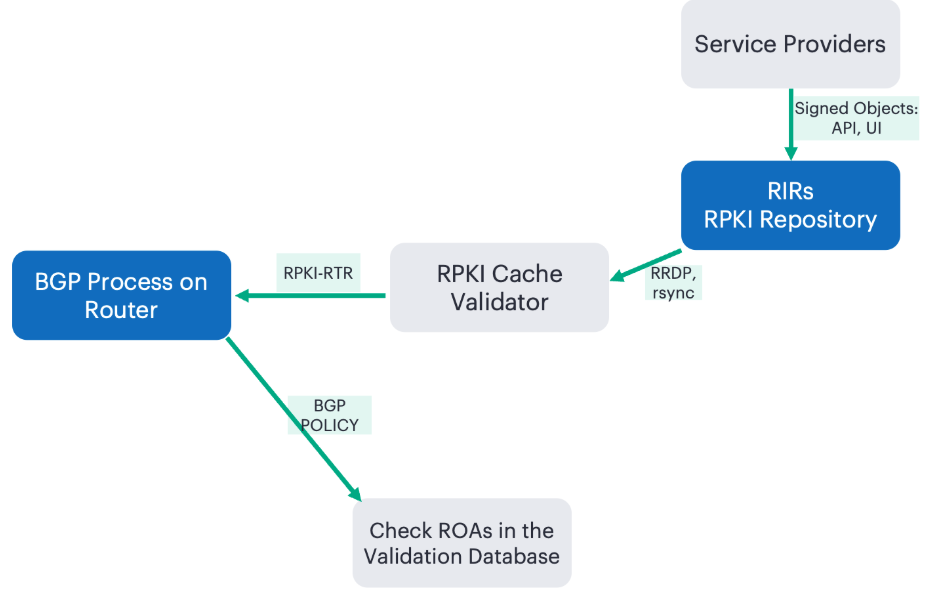
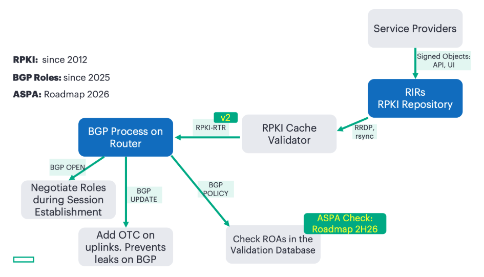
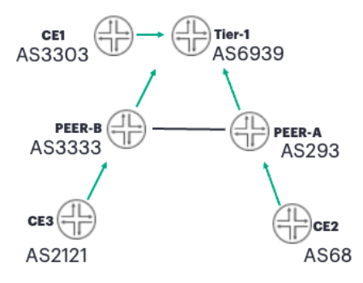
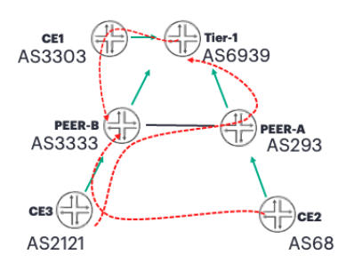
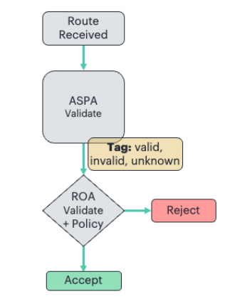
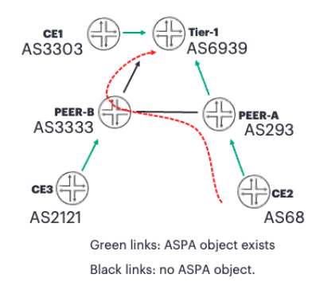

# Secure BGP with ASPA: Preventing and fixing route leaks

**Anton Elita - 07/13/2026**

BGP runs on trust, and route leaks and hijacks are what happen when that trust is misplaced. This article shows how three complementary mechanisms close the gap - BGP Roles with Only-To-Customer attribute prevent and detect leaks several hops from the source, and - if the leak already happened - RPKI Route Origin Authorization (ROA) helps validate the origin AS, and Autonomous System Provider Authorization (ASPA) confirms the full AS PATH is valley-free.

## Introduction

Any BGP speaker can advertise a syntactically valid route for almost any prefix. Commercial relationships between autonomous systems, such as customer, provider, and peer, are supposed to constrain BGP prefix advertisements.  When those relationships are violated - by mistake or by intent - the result is a route leak or hijack, and many related outages have been observed on the Internet. [RFC7908](https://datatracker.ietf.org/doc/html/rfc7908) provides a taxonomy and classification of route leaks based on these relationships. This article examines the three complementary mechanisms that allow enforcing business relationships into routing policies.

Three mechanisms defined at IETF are converging to enforce the relation policies and avoid leaks

- Route Origin Authorization (ROA) [[RFC9582](https://datatracker.ietf.org/doc/html/rfc9582)]: a signed object that helps validate the origin AS of a prefix
- BGP Roles [[RFC9234](https://datatracker.ietf.org/doc/html/rfc9234)]: prevents route leaks from happening
- Autonomous System Provider Authorization (ASPA) [[draft](https://datatracker.ietf.org/doc/html/draft-ietf-sidrops-aspa-verification-25)]: signed object, helps validate the whole AS path is valley-free, thus aiding in the detection of a critical case where  prefixes with possibly valid origin, but being advertised over an illegitimate AS path.

> **Note:** ASPA validation in Junos is a planned feature for a later release. The CLI examples below are based on unreleased Junos code. *

Beyond the protocol mechanics, we cover the combined ROA + ASPA decision logic, examples of Junos import policies, CLI, and observability. The takeaway: these three-layered mechanisms turn "we trust BGP speakers on the internet behaved" into "we can verify they did."

## Where filtering stands today

Operators already mitigate leaks with per-neighbor prefix lists (often IRR-derived, sometimes inconsistent, and sources are somewhat random), RPKI route origin validation, AS_PATH filtering such as peer-lock, max-prefix limits, and community-based tagging of customer/peer/uplink routes. These work, but are maintenance-heavy and depend on operator discipline. Solutions from the IETF stack below make the policy itself verifiable.

Since 2012, Junos has supported RPKI route origin validation. This process can be summarized as follows:

- Network operators create cryptographically signed objects within RPKI repositories that prove the origin AS for a prefix
- Users of RPKI ROA can run RPKI cache validators to download the verified ROA objects via RRDP or rsync
- Routers use the RPKI-RTR protocol to download the data from cache validators
- Every prefix can be evaluated in the BGP ingress policy for validity: valid, invalid, or NotFound.
- Finally, the policy may specify an action to be taken based on the validation result: accept, reject, modify the preference, attach community, among others.



For AS Path validation using ASPA records, the above procedure is extended as follows:

- Network operators can add their providers to the RPKI repository
- Routers can fetch ASPA records as specified by the RPKI-RTR v2 protocol
- Policies can be enhanced to validate both ASPA and ROA

Together with BGP roles, the process of preventing and fixing route leaks would look like this:



Let us go deeper into the details of this architecture.

## Reference Topology and Business Relations between Network Operators

Below is a small topology of three "leaf" customers (CE1, CE2, CE3), two mid-size transit AS (PEER-A and PEER-B, they peer with each other) and one transit-free AS labeled as Tier-1.



The business relations between all of them can be described in this table:

Table: Business relations between Autonomous Systems 

| Business Relations |
|:--|
| AS 68 is a customer of AS 293 |
| AS 293 is a customer of AS 6939 |
| AS 2121 is a customer of AS 3333 |
| AS 3303 is a customer of AS 6939 |
| AS 3333 is a customer of AS 6939 |
| AS 3333 may be a peer of AS 293 |

Let's consider a prefix 130.55.0.0/16 originated by AS 68, and propagated to AS 293. From the perspective of the "Tier-1" node, this prefix may arrive only from the "Peer-A" node (AS_PATH 68 293), but not from the "Peer-B" (AS_PATH 3333 293 68) -- because AS 3333 is allowed to send prefixes received from a peer only downstream to its customers, but not upstream or laterally to other peers.

Route Origin Validation alone would show the prefix as valid:

```
aelita@tier-1# run show validation database record 130.55.0.0/16
RV database: default
Prefix                 Origin-AS Session                                 State   Mismatch
130.55.0.0/16-16              68 11.254.254.61                           valid
  IPv4 records: 1
  IPv6 records: 0 
```

## Preventing Route Leaks: BGP Roles

Roles formalize relationships as negotiated BGP capabilities. Each session side declares its local role:

```
set protocols bgp group X neighbor Y otc-local-role [ customer | peer | provider ] [ strict ]
```

The keyword **strict** should be used when we don't want a BGP session to come up if the remote speaker is not trying to negotiate this capability. Without **strict**, a session would come up, and the behavior regarding the OTC attribute and AS_PATH validation would be the same as if the role had been negotiated.

As the next step, let us configure all BGP roles as per the "business relations" table above. There is only a single "peer" neighborship; all others are "customer-provider".

After properly setting the roles, the BGP session is expected to bounce once and come up with the proper roles.

The role (**Type 9**) is carried in the **BGP OPEN **capability set and negotiated at session establishment.

```
[-] Border Gateway Protocol - OPEN Message
      Marker: ffffffffffffffffffffffffffffffff
      Length: 68
      Type: OPEN Message (1)
      Version: 4
      My AS: 68
      Hold Time: 90
      BGP Identifier: 11.5.6.2
      Optional Parameters Length: 39
  [-] Optional Parameters
    [+] Optional Parameter: Capability
    [+] Optional Parameter: Capability
    [+] Optional Parameter: Capability
    [+] Optional Parameter: Capability
    [+] Optional Parameter: Capability
    [+] Optional Parameter: Capability
    [-] Optional Parameter: Capability
          Parameter Type: Capability (2)
          Parameter Length: 3
      [-] Capability: BGP Role
            Type: BGP Role (9)
            Length: 1
            BGP Role: Customer (3)
```

From the perspective of the CE2 device, the roles can be observed in the operational commands:

```
aelita@ce2# run show bgp neighbor
Peer: 11.5.6.1+179 AS 293      Local: 11.5.6.2+60884 AS 68
  Group: peer-ce2              Routing-Instance: master
  Forwarding routing-instance: master
  Type: External    State: Established    Flags: <Sync>
  Last State: OpenConfirm   Last Event: RecvKeepAlive
  [..]
  Options: <BgpOTCRoleRouteLeakDetection>
  [..]
  Local role: customer Peer role: provider
  [..]
```

Should the roles be wrongly configured in an unsupported combination, the BGP session will not go into Established:

```
Jun 11 14:33:56  tier-1 rpd[18844]: bgp_process_role_cap:201: NOTIFICATION sent to 11.3.4.2 (External AS 3333): code 2 (Open Message Error) subcode 11 (role mismatch)
```

An OTC attribute on the wire is set only when a prefix is advertised to a customer or peer, and must not be overwritten by other BGP speakers. An example for Peer-B sending a prefix towards Peer-A:

```
[-] Border Gateway Protocol - UPDATE Message
      Marker: ffffffffffffffffffffffffffffffff
      Length: 58
      Type: UPDATE Message (2)
      Withdrawn Routes Length: 0
      Total Path Attribute Length: 31
  [-] Path attributes
    [+] Path Attribute - ORIGIN: IGP
    [+] Path Attribute - AS_PATH: 3333 2121
    [+] Path Attribute - NEXT_HOP: 11.4.5.1
    [-] Path Attribute - OTC: 3333
      [+] Flags: 0xc0, Optional, Transitive, Complete
          Type Code: OTC (35)
          Length: 4
          Only to Customer: 3333
  [-] Network Layer Reachability Information (NLRI)
    [+] 193.0.24.0/21
```

Once the OTC attribute was set, a BGP speaker -- even if located multiple hops away - can detect a leak. In this case, "Peer-A" was on purpose configured to improperly announce a prefix from "Peer-B" towards "Tier-1", where the leak was recognized and stopped:

```
aelita@tier-1# run show route receive-protocol bgp 11.3.5.2 hidden extensive
inet.0: 10006 destinations, 10009 routes (5015 active, 0 holddown, 4992 hidden)
  193.0.24.0/21 (2 entries, 1 announced)
     Nexthop: 11.3.5.2
     AS path: 293 3333 2121 I
     Only-to-customer: 3333
     Hidden reason: Route leak detected
```

We encourage to use `show bgp diagnostics` command for more details in troubleshooting BGP:

```
aelita@tier-1# run show bgp diagnostics route 193.0.24.0/21 from 11.3.5.2 table inet.0
Table: inet.0
Route: 193.0.24.0/21 (0x1bf45a20)
State: Hidden Ext Changed
Reason: Route leak detected
Suggestion: Follow these steps to figure out why route leak is detected
  1. Use "show route hidden extensive" to find attribute Only-to-customer > 0
  2. Use "show bgp neighbor" to find Peer role
  3. If a route with the OTC Attribute is received from a Customer or
     an RS-Client, then it is a route leak and MUST be considered ineligible
     If a route with the OTC Attribute is received from a Peer (i.e.,
     remote AS with a Peer Role) and the Attribute has a value that is
     not equal to the remote (i.e., Peer's) AS number, then it is a
     route leak and MUST be considered ineligible.
```

We will not dive further into the implementation of BGP roles to keep this article shorter. A link to more details is available in the References section.

While it takes time until most BGP speakers on the Internet negotiate their roles, let's investigate how **ASPA** can help in the meantime. At this step, we removed the BGP roles from the configurations.

## Fixing Route Leaks: ROA, ASPA

RPKI infrastructure has been built to act as a source of truth for:

- which AS is entitled to be the origin of a prefix - ROA
- inter-AS relations (customer/provider) - ASPA

and can be characterized by the following:

- Cryptographic certificates protect the data
- well-defined transports for downloading the databases: RRDP, rsync
- trusted organizations that store the signed data: RIRs/LIRs like RIPE, ARIN, APNIC, LACNIC

Route Origin Validation has been known for quite a while, so please check the References below for more details. We'll concentrate on ASPA instead. ASPA describes BGP relations between players on the Internet. Only "customers" are needed to publish their "providers":

- peers need not be registered
- single RPKI ASPA object for one AS: all providers are listed as a set of AS numbers.

The table describing business relations can be "translated" into ASPA objects. We've taken the most recent RPKI database at the time of writing. Only AS numbers relevant to our topology have been considered.

Table: Business Relations represented as ASPA objects 

| ASPABusiness Relations | ASPA Objects |
|:--|:--|
|  | Customer |
| AS 68 is a customer of AS 293 | 68 |
| AS 293 is a customer of AS 6939 | 293 |
| AS 2121 is a customer of AS 3333 | 2121 |
| AS 3303 is a customer of AS 6939 | 3303 |
| AS 3333 is a customer of AS 6939 | 3333 |
| AS 3333 may be a peer of AS 293 | - |
| AS 6939 is Tier-1 - no upstream | 6939 |

> **Note:** if an AS has no upstream -- example being a tier-1 ISP, or an IXP network -- they can register AS0 as their "provider" ASPA object: *

```
aelita@tier-1# run show validation database aspa-record 3257
RV database: default
Customer-AS       Provider-AS   Session
3257              0             11.254.254.61
```

The use of AS0 is defined in RFC 7607. The validation process with ASPA makes sure that an AS_PATH is valley-free. A valley occurs when a BGP speaker propagates a prefix received from a non-customer (i.e., an upstream or peer) to another non-customer.



With both Route Origin and ASPA validation, there are several ways to build an import policy. If we want to reject a prefix if either ROA or ASPA is invalid:

```
set policy-options policy-statement RV term invalid from validation-database invalid
set policy-options policy-statement RV term invalid then validation-state invalid
set policy-options policy-statement RV term invalid then reject
set policy-options policy-statement RV term aspa-invalid from validation-database aspa-invalid
set policy-options policy-statement RV term aspa-invalid then validation-state invalid
set policy-options policy-statement RV term aspa-invalid then reject
set policy-options policy-statement RV term unknown from validation-database unknown
set policy-options policy-statement RV term unknown then validation-state unknown
set policy-options policy-statement RV term unknown then accept
set policy-options policy-statement RV term aspa-unknown from validation-database aspa-unknown
set policy-options policy-statement RV term aspa-unknown then validation-state unknown
set policy-options policy-statement RV term aspa-unknown then accept
set policy-options policy-statement RV term valid then validation-state valid
set policy-options policy-statement RV term valid then accept
```

If we want to implement a more sophisticated policy, where any combination of ROA and ASPA can be matched, and a desired validation result and action can be chosen, like in the table below:

Table: Validation result and action

| ROA | ASPA | Validation Result | Example Action |
|:--|:--|:--|:--|
| valid | valid | valid | accept |
| valid | invalid | invalid | reject(strict),oraccept + lower preference(loose) |
| valid | unknown | valid | accept |
| invalid | * | invalid | reject |
| unknown | * | unknown | accept |

Such a workflow in an import policy can be represented by this figure:



> Please note, this is an example policy, and Junos allows other combinations of matches and resulting actions.

In this example workflow, Junos can first validate ASPA and tag a prefix based on the validation result. Then, it can validate the origin and take a decision based on the combined ROA and ASPA validation results.

A policy chain can be assigned from two import policies: the first validates ASPA and passes to the second policy, which then checks the ROA and defines the action and validation state.

```
set protocols bgp group tier1-peerb import [ aspa-validate rpki-validate-strict-aspa ]

set policy-options policy-statement aspa-validate term unknown from validation-database aspa-unknown
set policy-options policy-statement aspa-validate term unknown then tag 64
set policy-options policy-statement aspa-validate term unknown then next policy
set policy-options policy-statement aspa-validate term valid from validation-database aspa-valid
set policy-options policy-statement aspa-validate term valid then tag 65
set policy-options policy-statement aspa-validate term valid then next policy
set policy-options policy-statement aspa-validate term invalid from validation-database aspa-invalid
set policy-options policy-statement aspa-validate term invalid then tag 66
set policy-options policy-statement aspa-validate term invalid then next policy
set policy-options policy-statement aspa-validate term Z then next policy

set policy-options policy-statement rpki-validate-strict-aspa term roa-valid-aspa-valid from protocol bgp
set policy-options policy-statement rpki-validate-strict-aspa term roa-valid-aspa-valid from validation-database valid
set policy-options policy-statement rpki-validate-strict-aspa term roa-valid-aspa-valid from tag 65
set policy-options policy-statement rpki-validate-strict-aspa term roa-valid-aspa-valid then validation-state valid
set policy-options policy-statement rpki-validate-strict-aspa term roa-valid-aspa-valid then accept
set policy-options policy-statement rpki-validate-strict-aspa term roa-valid-aspa-unknown from protocol bgp
set policy-options policy-statement rpki-validate-strict-aspa term roa-valid-aspa-unknown from validation-database valid
set policy-options policy-statement rpki-validate-strict-aspa term roa-valid-aspa-unknown from tag 64
set policy-options policy-statement rpki-validate-strict-aspa term roa-valid-aspa-unknown then validation-state valid
set policy-options policy-statement rpki-validate-strict-aspa term roa-valid-aspa-unknown then accept
set policy-options policy-statement rpki-validate-strict-aspa term roa-valid-aspa-invalid from protocol bgp
set policy-options policy-statement rpki-validate-strict-aspa term roa-valid-aspa-invalid from validation-database valid
set policy-options policy-statement rpki-validate-strict-aspa term roa-valid-aspa-invalid from tag 66
set policy-options policy-statement rpki-validate-strict-aspa term roa-valid-aspa-invalid then validation-state invalid
set policy-options policy-statement rpki-validate-strict-aspa term roa-valid-aspa-invalid then reject
set policy-options policy-statement rpki-validate-strict-aspa term roa-invalid-aspa-any from protocol bgp
set policy-options policy-statement rpki-validate-strict-aspa term roa-invalid-aspa-any from validation-database invalid
set policy-options policy-statement rpki-validate-strict-aspa term roa-invalid-aspa-any then reject
set policy-options policy-statement rpki-validate-strict-aspa term roa-unknown-aspa-any from protocol bgp
set policy-options policy-statement rpki-validate-strict-aspa term roa-unknown-aspa-any from validation-database unknown
set policy-options policy-statement rpki-validate-strict-aspa term roa-unknown-aspa-any then validation-state unknown
set policy-options policy-statement rpki-validate-strict-aspa term roa-unknown-aspa-any then accept
```

**Examples of ASPA Validation:**

With the policies above, let's see if the following leak can be detected:



"Tier-1" is the validating node. Without BGP roles configured anywhere, and with missing ASPA objects for both AS6939 and AS3333, ASPA validation cannot detect a leak, just because AS3333 might theoretically also be a provider of AS6939...

```
aelita@tier-1# run show route 130.55.0.0/16 detail next-hop 11.3.4.2
130.55.0.0/16 (2 entries, 1 announced)
         BGP    Preference: 170/-101
                Next hop type: Router, Next hop index: 623
                Address: 0x99cd910
                Next-hop reference count: 3, Next-hop session id: 320
                Kernel Table Id: 0
                Source: 11.3.4.2
                Next hop: 11.3.4.2 via ge-0/0/3.0, selected
                Session Id: 320
                State: <Ext Changed>
                Inactive reason: AS path
                Local AS:  6939 Peer AS:  3333
                Age: 33:44
                Validation State: valid
                        Tag: 65
                Task: BGP_3333.11.3.4.2
                AS path: 3333 293 68 I
                Accepted
```

**How to fix that?**

Add BGP role as "provider" on "Tier-1" towards "Peer-B":

```
aelita@tier-1# set protocols bgp group tier1-peerb neighbor 11.3.4.2 otc-local-role provider
aelita@tier-1# commit

aelita@tier-1# run show route 130.55.0.0/16 detail next-hop 11.3.4.2 hidden
130.55.0.0/16 (2 entries, 1 announced)
         BGP                 /-101
                Next hop type: Router, Next hop index: 623
                Address: 0x99c4890
                Next-hop reference count: 3, Next-hop session id: 320
                Kernel Table Id: 0
                Source: 11.3.4.2
                Next hop: 11.3.4.2 via ge-0/0/3.0, selected
                Session Id: 320
                State: <Hidden Ext Changed>
                Inactive reason: Unusable path
                Local AS:  6939 Peer AS:  3333
                Age: 18
                Validation State: invalid
                        Tag: 66
                Task: BGP_3333.11.3.4.2
                AS path: 3333 293 68 I
                Localpref: 100
                Router ID: 11.3.4.2
                Hidden reason: Rejected by import policy
```

The leak was stopped because "Tier-1" now has the missing piece of the puzzle: when both AS3333 and AS293 are customers of AS6939, then the AS_PATH above is a valley, i.e., a prefix leak.

## ASPA: Operational and Monitoring Aspects

A set of Junos commands has been extended to provide insights into ASPA validation operations.

```
aelita@pe2# run show validation session
Session            Version   State   Flaps     Uptime    #IPv4/IPv6 records    ASPA records
11.254.254.61            2.   Up         0   1d 04:30:49 687395/216202         2033
```

Version of RPKI-RTR protocol now includes support for RFC8210bis, which introduced ASPA data retrieval.

```
aelita@pe2# run show validation session detail
Session 11.254.254.61 Version 2, , State: up, Session index: 3
  Group: RPKI, Preference: 100
  Local address: 11.254.254.3, Port: 3323
  Refresh time: 600s
  Hold time: 1800s
  Record Life time: 7200s
  Serial (Full Update): 1176
  Serial (Incremental Update): 1182
    Session flaps: 2
    Session uptime: 01:10:03
    Last PDU received: 00:05:07
    IPv4 prefix count: 707324
    IPv6 prefix count: 216444
    ASPA record count: 2034
```

Per autonomous-system ASPA record query:

```
aelita@pe2# run show validation database aspa-record 2121
RV database: default
Customer-AS       Provider-AS | Session
2121              3333 56595    11.254.254.61 
 ASPA records: 1
```

gNMI paths include global stats, as well as per-prefix validation state:

```
state
    routing-instances
        routing-instance [name=]
            protocols
                bgp
                    rib
                        afi-safis
                            afi-safi
                                ipv4-unicast | ipv6-unicast
                                    loc-rib
                                    |   routes
                                    |      route [path-id=][prefix=][origin=]
                                    |         origin-validation-state
                                    +-- statistics
                                             validation-state-invalid
                                             validation-state-unknown
                                             validation-state-unverified
                                             validation-state-valid
```

Example replies would look like these:

```
juniper:state/routing-instances/routing-instance[name=DEFAULT]/protocols/bgp/rib/afi-safis/afi-safi[name=ipv4-unicast]/ipv4-unicast/loc-rib/statistics/validation-state-invalid: 1
juniper:state/routing-instances/routing-instance[name=DEFAULT]/protocols/bgp/rib/afi-safis/afi-safi[name=ipv4-unicast]/ipv4-unicast/loc-rib/statistics/validation-state-unknown: 3336
juniper:state/routing-instances/routing-instance[name=DEFAULT]/protocols/bgp/rib/afi-safis/afi-safi[name=ipv4-unicast]/ipv4-unicast/loc-rib/statistics/validation-state-unverified: 0
juniper:state/routing-instances/routing-instance[name=DEFAULT]/protocols/bgp/rib/afi-safis/afi-safi[name=ipv4-unicast]/ipv4-unicast/loc-rib/statistics/validation-state-valid: 2255
juniper:state/routing-instances/routing-instance[name=DEFAULT]/protocols/bgp/rib/afi-safis/afi-safi[name=ipv4-unicast]/ipv4-unicast/loc-rib/routes/route[path-id=0][prefix=193.0.24.0/21][origin=11.3.4.2]/origin-validation-state: rpki-validation-valid
```

## References

- [Details of BGP roles implementation](https://www.linkedin.com/pulse/bgp-roleplay-prevent-route-leaks-simply-junos-way-todorovic-qmjne)
- [BGP Origin Validation](https://www.juniper.net/documentation/us/en/software/junos/bgp/topics/topic-map/bgp_origin_validation.html)

## Acknowledgments

I would like to thank Santosh Kolenchery and the entire BGP software engineering team for making these features a reality, and for reviewing this techpost.
