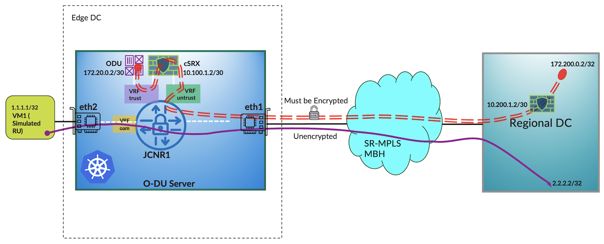

# Secure Virtual Cell Site Router Solution with JCNR and cSRX

**Vivek Shenoy - 08/01/2024**

A secure virtual cell site router (CSR + SecGW) functionality using Juniper Cloud Native Router or JCNR and Containerized SRX or cSRX so that customers and readers can easily replicate this in their lab environment and get a feel of this solution.

This TechPost has been co-written by Lavanya Kumar Ambatipudi and Vivekananda Shenoy.

## Introduction

5G technology brings about new opportunities but also poses infrastructure challenges. While it offers higher bandwidth, lower latency, and increased capacity, it requires a higher number of base stations or cell sites than in previous generations. This also demands more backhaul links with larger capacity and an increased number of cell site routers and aggregation routers.

Service providers are addressing these challenges by integrating cloud-native infrastructure in Distributed Radio Access Network (D-RAN) topologies, typically small, leased spaces with limited power, space, and cooling. Deploying 5G RAN applications on a smaller number of servers (usually 1 or 2) and integrating cloud-native virtual cell site routers (vCSR) like JCNR running on the RAN Distributed Unit (DU) server reduces the total cost of ownership, enables faster deployment with automation, reduces truck rolls, and facilitates easier upgrades.

In addition to transporting data traffic between the RAN edge and the rest of the 5G network, it is crucial to ensure that data transmitted over the network is encrypted to protect it from eavesdropping and unauthorized access. This is essential for maintaining the confidentiality of user data. Traditionally, this has been done by placing a physical security appliance such as a firewall in front of the RAN function so that all the traffic from the RAN gets encrypted by the SecGW. Juniper Secure Cloud Native Router provides an automated solution to service chain JCNR with a containerized L4-L7 firewall such as Juniper Containerized SRX (cSRX) so that the RAN traffic can be encrypted from the DU server, eliminating the need for a dedicated physical SecGW.

Existing articles on this website (some of the links provided at the end of this post) provide comprehensive explanations of the operation, deployment, configuration, and practical applications of JCNR as a virtual cell site router. This article will specifically delve into implementing JCNR + cSRX service chaining to attain secure virtual cell site router functionality.

This solution uses an in-host service chaining model where JCNR and cSRX run on the same host providing security services for selected traffic. This allows the solution day-0 and day-2 ready as the service instance (cSRX) can be upgraded without having to respawn JCNR.

JCNR and cSRX can be deployed on various Kubernetes platforms, including upstream Kubernetes, Openshift, and managed platforms like Amazon EKS. The JCNR + cSRX solution has a reasonably low compute resource footprint relative to their high packet forwarding performance, making it an excellent choice for applications such as 5G RAN edge cloud. For further information, references related to JCNR and cSRX datasheets based on the latest release can be found at the end of this article.

## Use Case Working Details

The topology used to demonstrate this use case is as shown below:



As shown in Figure 1, we will utilize a simulated 5G edge cloud setup for this demonstration. The setup includes an all-in-one Kubernetes node with a simulated OpenRAN Distributed Unit (O-DU) pod, a Linux pod in our example, responsible for generating traffic. Additionally, the external VM, VM1 that connects to the eth2 fabric interface of the O-DU server (JCNR1) simulates an external RU Physical Network Function (PNF).

The eth1 interface on the O-DU server is the core-facing fabric interface connected to the 5G backhaul network that runs SR-MPLS as the MBH overlay. JCNR also supports various other Mobile Backhaul (MBH) overlays, including SRv6, traditional MPLS LDP, and more. However, for this demonstration, we opted for SR-MPLS to showcase JCNR's ability to integrate with diverse provider MBH networks seamlessly.

In a genuine 5G network, the regional cloud usually consists of OpenRAN Centralized Unit (O-CU), User Plane Function (UPF), Multiaccess Edge Computing (MEC), and other 5G C/U plane functions tailored to specific use cases. In our demonstration setup, the regional cloud consists of a remote PE (another pre-configured JCNR + cSRX combo running in the regional data center) and peer SecGW functions. It also serves as an iperf3 server, simulating the traffic destination for our testing purposes.

By leveraging the robust Junos configuration constructs offered by Junos containerized Routing Protocol Process (cRPD) in conjunction with the Kubernetes Custom Resources Definitions (CRDs, for example, network-attach-definition) provided by the JCNR CNI, it is feasible to direct specific traffic flows---based on the application characteristics and security compliance criteria---through the cSRX firewall. Implementing this selective encryption approach can contribute to optimizing the forwarding plane's performance.

In our specific scenario, the traffic originating from the simulated OpenRAN Radio Unit (O-RU, VM1 here) with the source IP of 1.1.1.1 destined towards 2.2.2.2 lands in the VRF oam on the JCNR. It is important to note that this traffic flow is not encrypted and is forwarded to the remote destination as clear text.

Note: JCNR instance deployed on the O-DU server runs eBGP as the PE-CE protocol in VRF oam and hence we can see that 1.1.1.1 (loopback address of VM1) is installed as the BGP route in the VRF oam routing table.

Traffic originating from the O-DU K8S Linux POD with a source IP of 172.20.0.2 and a destination IP of 172.200.0.2 enters the JCNR through the VRF RAN and is routed to the cSRX left interface, which is part of virtual-router routing-instance trust, using standard IPv4 routing. To enable this, JCNR injects a static route into the ODU-POD for the remote destination (172.200.0.2/32) using the Kubernetes network-attachment-definition that attaches the ODU-POD to the VRF RAN on the JCNR.

The cSRX configuration encompasses setup for the left and right interfaces towards JCNR, static routes for establishing an IPSec tunnel to the remote IPSec gateway, as well as a reverse route towards the ODU-POD, IPSec configuration, and IPSec traffic selector for matching encrypted traffic flows. These configurations are all automated by the JCNR helm charts responsible for deploying and provisioning the cSRX instance.

As the cSRX encrypts the traffic from our simulated O-DU POD, the outer IPSec source IPv4 address of the encrypted traffic is set to 10.100.1.2) and the outer destination IPv4 address is set to 10.200.1.2 (Regional Cloud cSRX instance IPSec public IPv4 address) by the cSRX SecGW. The encrypted traffic is then returned to the JCNR in the VRF untrust. In the VRF untrust, the IPv4 address lookup for the IPSec outer destination address 10.200.1.2/32 is resolved against the BGP-L3VPN label and the SR-MPLS transport (outer) label. Consequently, the encrypted IPSec packets are forwarded over SR-MPLS towards the remote destination.

## Use Case Validation

To keep this article concise and focused on illustrating the main concept and functionality, detailed configurations and full CLI outputs from various commands have deliberately been excluded. All this information can be found in the GitHub link provided at the end of this article in the references section.

To simulate traffic through the IPSec, we will run the iperf3 server on the Regional DC destination node (pod), listening on TCP **172.200.0.2:5201** socket. We will then in the background initiate an iperf3 client from the simulation POD running on the JCNR1 server (**src IP=172.20.0.2**). The purpose is to verify that the traffic is steered towards the local cSRX firewall service function by the JCNR and that the traffic will be encrypted on the IPSec tunnel with the outer IPSec source address of 10.100.1.2 (cSRX right interface IPv4 address) and destination address of 10.200.1.2 (IP address of the remote SecGW). The remote IPSec destination address 10.200.1.2/32 is resolved against the VPNv4 label of 21 and SR-MPLS transport label of 1003.

In addition, for the VRF oam, we will set up another iperf3 flow with the source address of **1.1.1.1/32** destined towards remote iperf3 server **2.2.2.2:5201** which is behind the regional cloud PE router. The traffic will remain unencrypted and will be routed through the SR-MPLS backhaul by applying the SR-MPLS label advertised by the remote PE node in the regional cloud. The 2.2.2.2/32 uses a different VPNv4 label (16) but the same SR-MPLS label of 1003 as both encrypted and unencrypted traffic are destined towards the same remote PE.

The objective is to demonstrate that users have the flexibility to encrypt specific critical traffic according to application requirements while forwarding other lower-priority traffic unencrypted. This approach optimizes the use of computing resources without compromising security or performance requirements.

### VRF configuration on JCNR1

```
root@jcnr1# show routing-instances | display inheritance no-comments | display set
set routing-instances oam instance-type vrf
set routing-instances oam protocols bgp group toVM1 type external
set routing-instances oam protocols bgp group toVM1 as-override
set routing-instances oam protocols bgp group toVM1 neighbor 172.31.0.2 peer-as 64512
set routing-instances oam interface eth2  <<< Connection to VM1
set routing-instances oam vrf-target target:64512:5000
set routing-instances oam vrf-table-label
set routing-instances trust instance-type virtual-router
set routing-instances trust routing-options static route 172.20.0.2/32 qualified-next-hop 172.20.0.2 interface jvknet2-73f1b26 
set routing-instances trust routing-options static route 10.10.1.2/32 qualified-next-hop 10.10.1.2 interface vhosteth2-fc246050-8de7-40b5-9c
set routing-instances trust routing-options static route 172.200.0.0/30 qualified-next-hop 10.10.1.2 interface vhosteth2-fc246050-8de7-40b5-9c <<< Redirect traffic that needs to be IPSec encrypted towards cSRX.
set routing-instances trust interface jvknet2-73f1b26 <<< Interface of the POD attached to trust VRF
set routing-instances trust interface vhosteth2-fc246050-8de7-40b5-9c
set routing-instances untrust instance-type vrf
set routing-instances untrust routing-options static route 10.100.1.2/32 qualified-next-hop 10.100.1.2 interface vhosteth1-fc246050-8de7-40b5-9c
set routing-instances untrust interface vhosteth1-fc246050-8de7-40b5-9c <<< Interface that attaches to cSRX untrust zone
set routing-instances untrust route-distinguisher 10:10
set routing-instances untrust vrf-target target:10:10
```

Note: The routing instance trust is configured as a virtual router because this VRF is only used to steer traffic toward the remote PE. BGP does not need to directly advertise the route from this VRF to the remote PE (otherwise, this will break the topology and traffic will not be sent to the cSRX).

### JCNR1 Routing Table Entries

```
root@jcnr1# run show route table trust.inet.0

trust.inet.0: 5 destinations, 5 routes (5 active, 0 holddown, 0 hidden)
+ = Active Route, - = Last Active, * = Both

10.10.1.1/32       *[Local/0] 01:31:41
                       Local via vhosteth2-fc246050-8de7-40b5-9c
10.10.1.2/32       *[Static/5] 01:31:41
                    >  via vhosteth2-fc246050-8de7-40b5-9c
172.20.0.1/32      *[Local/0] 01:31:40
                       Local via jvknet2-73f1b26
172.20.0.2/32      *[Static/5] 01:31:40
                    >  via jvknet2-73f1b26
172.200.0.0/30     *[Static/5] 01:31:41
                    >  via vhosteth2-fc246050-8de7-40b5-9c <<< Auto configured Static route to redirect the traffic destined to remote destination towards cSRX.

root@jcnr1# run show route table untrust.inet.0

untrust.inet.0: 3 destinations, 3 routes (3 active, 0 holddown, 0 hidden)
+ = Active Route, - = Last Active, * = Both

10.100.1.1/32      *[Local/0] 06:13:13
                       Local via vhosteth1-fc246050-8de7-40b5-9c
10.100.1.2/32      *[Static/5] 06:13:13
                    >  via vhosteth1-fc246050-8de7-40b5-9c
10.200.1.2/32      *[BGP/170] 06:12:53, localpref 100, from 10.255.0.2
                      AS path: I, validation-state: unverified
                    >  to 10.0.0.1 via eth1, Push 21, Push 1003(top) <<< SR-MPLS VPNv4 route for remote IPSec underlay ( public ) IPv4 address.

[edit]
root@jcnr1#

root@jcnr1# run show route table oam.inet.0

oam.inet.0: 5 destinations, 5 routes (5 active, 0 holddown, 0 hidden)
+ = Active Route, - = Last Active, * = Both

1.1.1.1/32         *[BGP/170] 00:05:13, localpref 100
                      AS path: 64512 I, validation-state: unverified
                    >  to 172.31.0.2 via eth2
2.2.2.2/32         *[BGP/170] 00:12:28, localpref 100, from 10.255.0.2
                      AS path: 64512 I, validation-state: unverified
                    >  to 10.0.0.1 via eth1, Push 16, Push 1003(top)
172.31.0.0/30      *[Direct/0] 00:12:28
                    >  via eth2
172.31.0.1/32      *[Local/0] 00:12:28
                       Local via eth2
172.31.10.0/30     *[BGP/170] 00:12:28, localpref 100, from 10.255.0.2
                      AS path: I, validation-state: unverified
                    >  to 10.0.0.1 via eth1, Push 16, Push 1003(top) <<< Route resolution for the remote destination in the oam VRF is directly resolved to a SR-MPLS VPNv4 destination as it is not required to be encrypted.

[edit]
root@jcnr1#
```

### cSRX (JCNR1) IPSec Flows

```
root@csrx-86b8b64b84-qwwsv> show security flow session
Session ID: 2, Policy name: N/A, Timeout: N/A, Session State: Valid
  In: 10.200.1.2/0 --> 10.100.1.2/0;esp, Conn Tag: 0x0, If: ge-0/0/0.0, Pkts: 0, Bytes: 0,

Session ID: 120888, Policy name: N/A, Timeout: N/A, Session State: Valid
  In: 10.200.1.2/42333 --> 10.100.1.2/52674;esp, Conn Tag: 0x0, If: ge-0/0/0.0, Pkts: 13701, Bytes: 1438384,<<< This is encrypted traffic received from cSRX going out of JCNR.

Session ID: 121022, Policy name: default-policy-logical-system-00/2, Timeout: 1794, Session State: Valid
  In: 172.20.0.2/55772 --> 172.200.0.2/5201;tcp, Conn Tag: 0x0, If: ge-0/0/1.0, Pkts: 7, Bytes: 539,
  Out: 172.200.0.2/5201 --> 172.20.0.2/55772;tcp, Conn Tag: 0x0, If: st0.0, Pkts: 7, Bytes: 376,

Session ID: 121023, Policy name: default-policy-logical-system-00/2, Timeout: 1800, Session State: Valid
  In: 172.20.0.2/55786 --> 172.200.0.2/5201;tcp, Conn Tag: 0x0, If: ge-0/0/1.0, Pkts: 64811, Bytes: 97210753,
  Out: 172.200.0.2/5201 --> 172.20.0.2/55786;tcp, Conn Tag: 0x0, If: st0.0, Pkts: 13561, Bytes: 713060, 
Total sessions: 4 <<<< Flow to be encrypted.

root@csrx-86b8b64b84-qwwsv>
```

Note: The vifdump tool used below is a JCNR-specific packet capture utility that belongs to a set of debugging tools that come with JCNR software out of the box.

### JCNR1 eth1 interface packet capture from DPDK vRouter using the vifdump tool

```
[root@jcnr1 /]# vifdump -i 1 -n -c 5
vif0/1      PCI: 0000:0b:00.0 (Speed 1000, Duplex 1) NH: 6 MTU: 9000
dropped privs to tcpdump
tcpdump: verbose output suppressed, use -v[v]... for full protocol decode
listening on mon1, link-type EN10MB (Ethernet), snapshot length 262144 bytes
13:03:54.146237 MPLS (label 1003, exp 0, ttl 62) (label 21, exp 0, [S], ttl 62) IP 10.100.1.2 > 10.200.1.2: ESP(spi=0x285dad4e,seq=0x3f44c9), length 1480 <<< Encrypted IPSec tunnel ( ESP ) traffic
13:03:54.146240 MPLS (label 1003, exp 0, ttl 63) (label 16, exp 0, [S], ttl 63) IP 1.1.1.1.56977 > 2.2.2.2.targus-getdata1: Flags [.], seq 1364806311:1364807759, ack 2375492720, win 502, options [nop,nop,TS val 473495581 ecr 70020219], length 1448 <<< Unencrypted VRF oam traffic
13:03:54.146245 MPLS (label 1003, exp 0, ttl 62) (label 21, exp 0, [S], ttl 62) IP 10.100.1.2 > 10.200.1.2: ip-proto-50
13:03:54.146246 MPLS (label 1003, exp 0, ttl 63) (label 16, exp 0, [S], ttl 63) IP 1.1.1.1.56977 > 2.2.2.2.targus-getdata1: Flags [.], seq 1448:2896, ack 1, win 502, options [nop,nop,TS val 473495581 ecr 70020219], length 1448
13:03:54.146251 MPLS (label 1003, exp 0, ttl 62) (label 21, exp 0, [S], ttl 62) IP 10.100.1.2 > 10.200.1.2: ESP(spi=0x285dad4e,seq=0x3f44ca), length 1480
5 packets captured
790 packets received by filter
0 packets dropped by kernel
vifdump: deleting vif 4350...
[root@jcnr1 /]#
```

Note: targus-getdata1 in the above capture output means port 5201. Due to a bug in the vifdump tool at the time of writing this article port names are not getting resolved to port numbers.

## Conclusion

With the rapid advancement of 5G applications towards the edge, it is the perfect time for Telco CSPs to explore containerized cell site routing and security gateway architectures for their Cloud-RAN/ORAN deployments. This approach promises faster deployments and reduces the total cost of ownership. This article demonstrates how such a deployment can be seamlessly simulated in a lab environment for the proof of concept, paving the way for replication in a production environment.

## Useful links

- JCNR Landing Page: [https://www.juniper.net/documentation/product/us/en/juniper-cloud-native-router/](https://www.juniper.net/documentation/product/us/en/juniper-cloud-native-router/)
- cSRX Landing Page: [https://www.juniper.net/us/en/products/security/srx-series/csrx-containerized-firewall.html](https://www.juniper.net/us/en/products/security/srx-series/csrx-containerized-firewall.html)
- Article on JCNR 5G deployment: [https://blogs.juniper.net/en-us/service-provider-transformation/cloud-native-routing-in-5g-deployments](https://blogs.juniper.net/en-us/service-provider-transformation/cloud-native-routing-in-5g-deployments)
- Article on JCNR deployment in Equinix Metal Cloud: [https://juniper.github.io/techposts/jcnr-for-equinix-metal/article](https://juniper.github.io/techposts/jcnr-for-equinix-metal/article)
- JCNR/cSRX full configurations used in this article: [https://github.com/pvs2401/jcnr-csrx](https://github.com/pvs2401/jcnr-csrx)

## Glossary

- JCNR: Juniper Cloud Native Router
- cSRX: Containerized SRX
- CNF: Containerized Network Function
- O-DU: ORAN Distributed Unit
- UPF: User Plane Function
- O-CU: ORAN Centralized Unit
- MEC: Multiaccess Edge Computing
- PNF: Physical Network Function
- PE: Provider Edge
- O-RU: ORAN Radio Unit

## Acknowledgements

The author would like to thank Lavanya Kumar Ambatipudi (co-author of this article), Vinoth Kannan Ganapathy, and Gopal Kagawad (for helping set up the lab environment).
