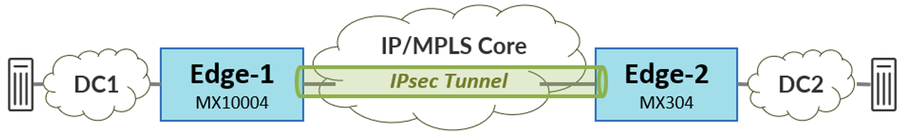
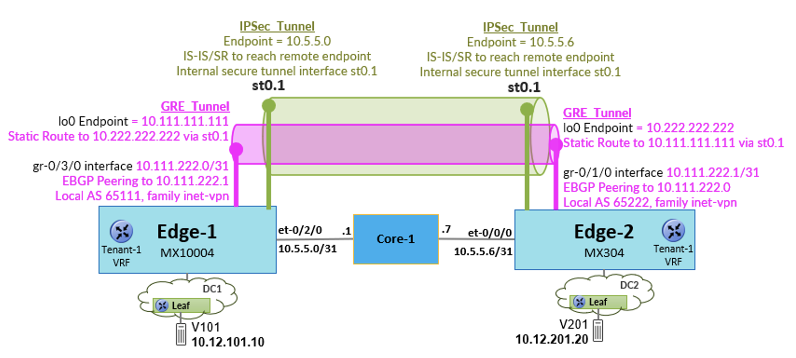
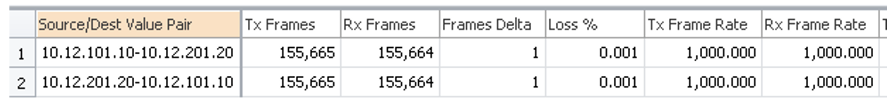
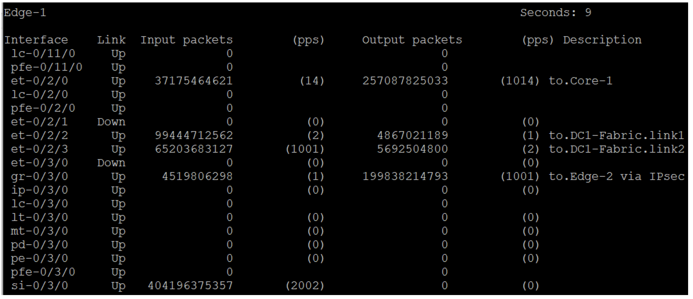
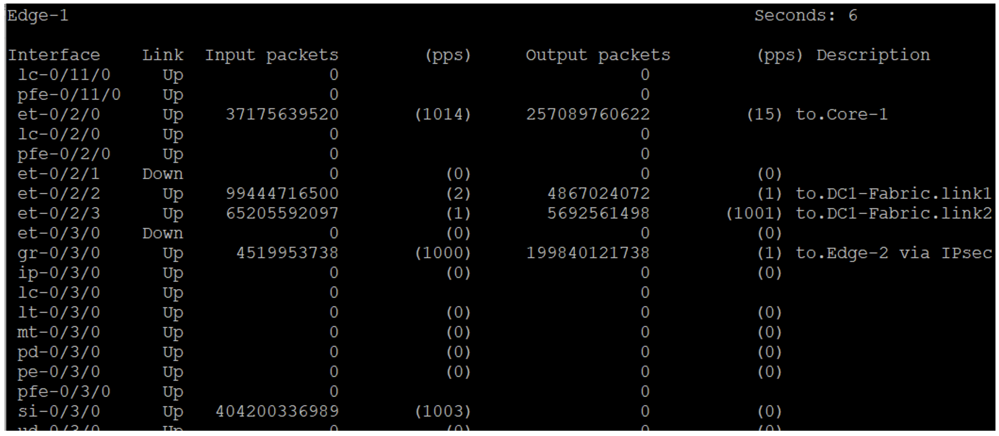

# Securing IPVPN Connectivity on Juniper MX Using Inline IPsec

**Victor Ganjian - 05/11/2026**

This article provides an example of using the inline IPsec function available on Trio-6 based MX routers to secure IPVPN traffic over an MPLS core. After stepping through the configuration details of IPsec, verification is performed to validate proper operation and to reinforce the reader's understanding of the implementation.

## Introduction

As part of a recent customer POC test, an MX10004 (25.2R1-S1.4) with line card model LC9600 was positioned as a data center gateway router. In the topology diagram below, the MX10004 router, Edge-1, provides interconnectivity between the local EVPN/VXLAN-based multi-tenant data center (DC1) and a remote data center (DC2), reachable via an IP/MPLS core network. This means the MX10004 router adds and removes VXLAN and MPLS headers as needed when forwarding packets. At the remote data center, another MX304 gateway router, Edge-2, provides similar interconnectivity services.

In addition, secure connectivity between the two data centers is established using an IPsec tunnel between the MX gateways. This functionality is enabled by the inline IPsec capability on the Trio 6-based LC9600 and MX304 which provide encryption/decryption without the need of a specialized service card. [For more details about inline IPsec on the MX routers see [1]](https://juniper.github.io/techposts/inline-ipsec-on-mx-series/article).



The goal of the POC test is to extend connectivity for a specific tenant between the data centers. This requires the MX10004 Edge-1 router to exchange EVPN Type 5 IPVPN routes with its BGP peers in DC1, and exchange MPLS-based IPVPN routes with the Edge-2 router at DC2. Once configured, end-to-end connectivity is verified by sending traffic flows between traffic generator ports at each site.

Note that this solution can be adapted for other scenarios as well. For example, the remote site, instead of being another data center, may contain end users that need to access applications or services at DC1.

## Configuration

## DC1 Fabric

The EVPN/VXLAN fabric in DC1 is managed using Apstra. A Routing Zone, or VRF, named "Tenant-1" is created with VNI "100001" and route target "100001L:1". Then virtual network "V101" is defined and applied to a pair of Leaf devices. The IRB interface of the virtual network is assigned to the "Tenant-1" VRF. Fabric devices exchange EVPN Type 5 routes with the Edge-1 router using BGP.

The details of the Apstra configuration are not shown here for brevity as the focus of this document is on the MX10004 Edge-1 router's IPsec configuration.

## DC1 Edge-1 Router

The configuration on the Edge-1 router involves defining the VRF and then creating the secure end-to-end connection to the remote DC. Note that the configuration for Edge-2, although not shown below, is similar.

Because IPVPN is used in the core, packets between the data centers are encapsulated with an MPLS label. This requires the MX to first encapsulate the data with GRE before entering the IPsec tunnel.

As you step through the configuration sections below, please reference the following diagram to better understand and visualize the implementation:



Note that other baseline configuration on the Edge-1 router towards the EVPN/VXLAN fabric (ex. IP underlay, BGP) and IP/MPLS core (ex. IS-IS, MPLS Segment Routing) are omitted for brevity.

### VRF

On Edge-1, first configure a VRF instance with 'protocols evpn ip-prefix-routes' so that EVPN Type 5 routes can be exchanged with the DC1 fabric devices. It is also important for the route target to match the value generated by Apstra which is applied on the Leaf devices.

```
set routing-instances TENANT-1 instance-type vrf
set routing-instances TENANT-1 protocols evpn ip-prefix-routes advertise direct-nexthop
set routing-instances TENANT-1 protocols evpn ip-prefix-routes encapsulation vxlan
set routing-instances TENANT-1 protocols evpn ip-prefix-routes vni 100001
set routing-instances TENANT-1 vrf-target target:100001L:1
set routing-instances TENANT-1 vrf-table-label
```

### Site to Site Connectivity

**IPsec**

In this example a Route-Based, or Point-to-Point (P2P), IPsec tunnel is configured. This allows all traffic between the two sites to be encrypted, regardless of source/destination. The MX also supports a Policy-Based, or Traffic Selector (TS), mode where specific traffic flows are permitted through the tunnel based on layer 3 and layer 4 information in the packet header including source/destination address, protocol, and source/destination port. [See [2] for more information](https://www.juniper.net/documentation/us/en/software/junos/vpn-ipsec/topics/topic-map/security-ipsecvpn-overview.html).

**Unified Services**

The first step in configuring IPsec on the MX router is to enable Unified Services. Note that it is disabled by default. If the MX router contains multiple routing engines, then Unified Services must be explicitly enabled on each one. A reboot is required after enabling.

```
request system enable unified-services
```

Once the MX is up and running again, verify the status with the following command.:

```
show system unified-services status
```

**Interfaces**

Before adding the IPSec related configuration. It is important to understand the new types of interfaces. An overview is provided here. Again, please reference the previous Tech Post [1] for more details.

- **Service Interface** - this interface is denoted as "si-". It is a virtual interface that resides on the PFE and provides encryption/decryption services.

The Service Interface consists of an 'inside' interface and an 'outside' interface which are defined as IFLs. For example, if resources from a line card in slot 0 pic 3 are allocated to the service interface, the 'inside' interface can be configured as 'si-0/3/0.0' and the 'outside' interface as 'si-0/3/0.1'.
The inside interface receives unencrypted traffic and forwards it to the crypto block in the PFE. The encrypted traffic is sent out the outside interface and then routed to the appropriate egress port.
The outside interface receives encrypted traffic and forwards it to the crypto block in the PFE for decryption The traffic is then forwarded to the appropriate egress port.
The service interface can provide encryption/decryption services to multiple secure tunnel interfaces.
- **Secure Tunnel Interface** - this interface is denoted as 'st0'. It is an internal interface that routes traffic to/from the IPsec VPN Tunnel. There is one 'st0' IFL per IPsec tunnel, for example 'st0.1'.

**Service Interface**

On the Edge-1 router, determine which PFE to use for the service interface. In this example, the LC9600 line card is in slot 0 and resources are allocated from the PFE associated with PIC 3.

*Note that its strongly recommended to explicitly set the 'service-port' and 'bandwidth' for efficient allocation of the PFE resources.* In this case only a single service interface is required, and therefore a single service port (i.e. 'service-port 0') is specifically configured.

Then define the inside and outside service interfaces and include them in a Service Set. In a future step (see below), the IPsec tunnel will be configured and assigned to this Service Set for crypto services.

```
set chassis fpc 0 pic 3 inline-services service-port 0 bandwidth 100g

set interfaces si-0/3/0 unit 0 family inet
set interfaces si-0/3/0 unit 0 service-domain inside
set interfaces si-0/3/0 unit 1 family inet
set interfaces si-0/3/0 unit 1 service-domain outside

set services service-set SS-1 next-hop-service inside-service-interface si-0/3/0.0
set services service-set SS-1 next-hop-service outside-service-interface si-0/3/0.1
```

**IKE**

Next, define the IKE gateway. The authentication method uses pre-shared keys which must match at both endpoints. When defining the gateway, the IP address assigned to Edge-1's core facing interface (i.e. et-0/2/0) is specified as the local address. Similarly, the target address is the IP address of Edge-2's core interface.

```
set security ike proposal IKE-PROPOSAL-1 description "IKE Proposal at Edge-1"
set security ike proposal IKE-PROPOSAL-1 authentication-method pre-shared-keys

set security ike policy IKE-POLICY-1 mode main
set security ike policy IKE-POLICY-1 proposals IKE-PROPOSAL-1
set security ike policy IKE-POLICY-1 pre-shared-key ascii-text jnpr123

set security ike gateway IKE-GW-1 ike-policy IKE-POLICY-1
set security ike gateway IKE-GW-1 address 10.5.5.6
set security ike gateway IKE-GW-1 external-interface et-0/2/0
set security ike gateway IKE-GW-1 local-address 10.5.5.0
set security ike gateway IKE-GW-1 version v2-only
```

**IPsec**

On Edge-1, first define a secure tunnel interface to be associated with IPsec tunnel (ex. st0.1). Then define the IPsec proposal and policy as shown below.

When defining the IPsec VPN, specify the secure tunnel interface and reference the previously configured IKE gateway.

Finally, associate the IPsec VPN with the previously configured Service Set which determines which PFE will provide encryption/decryption services for the tunnel.

```
set interfaces st0 unit 1 family inet

set security ipsec proposal IPSEC-PROPOSAL-1 extended-sequence-number
set security ipsec proposal IPSEC-PROPOSAL-1 description "IPSec Proposal at Edge-1"
set security ipsec proposal IPSEC-PROPOSAL-1 protocol esp
set security ipsec proposal IPSEC-PROPOSAL-1 encryption-algorithm aes-256-gcm

set security ipsec policy IPSEC-POLICY-1 proposals IPSEC-PROPOSAL-1

set security ipsec vpn IPSEC-VPN-1 bind-interface st0.1
set security ipsec vpn IPSEC-VPN-1 copy-outer-dscp
set security ipsec vpn IPSEC-VPN-1 ike gateway IKE-GW-1
set security ipsec vpn IPSEC-VPN-1 ike anti-replay-window-size 4096
set security ipsec vpn IPSEC-VPN-1 ike ipsec-policy IPSEC-POLICY-1
set security ipsec vpn IPSEC-VPN-1 establish-tunnels immediately

set services service-set SS-1 ipsec-vpn IPSEC-VPN-1
```

**GRE**

As mentioned above, GRE is required for this solution on the MX router because the routed traffic in the tunnel is encapsulated with an MPLS label. In this example, the GRE interface, 'gr-0/3/0', uses the same ASIC (i.e. slot 0 pic 3) as the IPsec service interface for GRE encapsulation/decapsulation services.

The GRE Tunnel endpoint is a loopback address on the Edge-1 router. An IP address for point-to-point connectivity with the tunnel is defined on the GRE interface using the 10.111.222/31 subnet. In addition, it is important to enable 'family mpls' on the GRE tunnel interface as labeled packets will be transmitted and received.

The path to reach the remote GRE tunnel endpoint is via the IPsec secure tunnel interface (st0.1) using the configured static route.

```
set interfaces lo0 unit 0 family inet address 10.111.111.111/32

set interfaces gr-0/3/0 description "to.Edge-2 via IPsec"
set interfaces gr-0/3/0 unit 0 tunnel source 10.111.111.111
set interfaces gr-0/3/0 unit 0 tunnel destination 10.222.222.222
set interfaces gr-0/3/0 unit 0 family inet address 10.111.222.0/31
set interfaces gr-0/3/0 unit 0 family mpls

set routing-options static route 10.222.222.222/32 next-hop st0.1

set protocols mpls interface gr-0/3/0.0
```

**BGP**

Finally, create a BGP session which runs inside the GRE tunnel between the 'gr-' tunnel interfaces at each site.

```
set protocols bgp group DC1-DC2 type external
set protocols bgp group DC1-DC2 family inet-vpn unicast
set protocols bgp group DC1-DC2 local-as 65111
set protocols bgp group DC1-DC2 neighbor 10.111.222.1 peer-as 65222
set protocols bgp group DC1-DC2 bfd-liveness-detection minimum-interval 1000
set protocols bgp group DC1-DC2 bfd-liveness-detection multiplier 3
```

## Verification

## Control Plane

View the IKE and IPSec security associations on the Edge-1 router. More details can be viewed with the 'detail' keyword, however, for now we just want to verify that the security associations are "UP' and active:

```
jnpr@Edge-1> show security ike security-associations
Index   State  Initiator cookie  Responder cookie  Mode           Remote Address
78      UP     394af8caefe3da78  cdd6ecaef72fbe70  IKEv2          10.5.5.6

jnpr@Edge-1> show security ipsec security-associations
  Total active tunnels: 1     Total IPsec sas: 1
  ID      Algorithm       SPI      Life:sec/kb  Mon lsys Port  Gateway
  <500006 ESP:aes-gcm-256/aes256-gcm 0x775e1330 1333/ unlim - root 500 10.5.5.6
  >500006 ESP:aes-gcm-256/aes256-gcm 0x411f3960 1333/ unlim - root 500 10.5.5.6
```

Verify that the GRE interface is "Up":

```
jnpr@Edge-1> show interfaces gr-0/3/0 terse
Interface               Admin Link Proto    Local                 Remote
gr-0/3/0                up    up
gr-0/3/0.0              up    up   inet     10.111.222.0/31
                                   mpls
```

Verify that the BGP session to the remote gateway's GRE interface is established and the route prefix corresponding to V201 at DC2 is received:

```
jnpr@Edge-1> show bgp summary group DC1-DC2 | find Pkt
Peer                     AS      InPkt     OutPkt    OutQ   Flaps Last Up/Dwn State|#Active/Received/Accepted/Damped...
10.111.222.1          65222      12598      12584       0       0 3d 23:29:07 Establ
  bgp.l3vpn.0: 1/1/1/0
  TENANT-1.inet.0: 1/1/1/0
```

View the Tenant-1 route table and confirm that it contains routes corresponding to the host subnets in the two data centers. The subnet in DC1 is learned via EVPN from two different VTEPs (i.e. due to ESI LAG, not shown in the topology diagram) which are reachable via 4 different underlay links.

The remote subnet in DC2, '10.12.201.0/24', is learned via the BGP IPVPN prefix advertisement. Note that the next-hop to DC2 is via the GRE tunnel interface and that an MPLS label is added to the forwarded packets.

```
jnpr@Edge-1> show route table TENANT-1.inet.0 10.12/16

TENANT-1.inet.0: 4 destinations, 5 routes (4 active, 0 holddown, 0 hidden)
+ = Active Route, - = Last Active, * = Both

10.12.101.0/24     *[EVPN/170] 3d 23:34:05
                    >  to 172.16.1.200 via et-0/2/2.0
                       to 172.16.1.202 via et-0/2/3.0
                       to 172.16.1.208 via et-0/5/2.0
                       to 172.16.1.210 via et-0/5/3.0
                    [EVPN/170] 3d 23:34:05
                    >  to 172.16.1.200 via et-0/2/2.0
                       to 172.16.1.202 via et-0/2/3.0
                       to 172.16.1.208 via et-0/5/2.0
                       to 172.16.1.210 via et-0/5/3.0
10.12.201.0/24     *[BGP/170] 3d 23:30:50, localpref 100
                      AS path: 65222 I, validation-state: unverified
                    >  to 10.111.222.1 via gr-0/3/0.0, Push 20
```

## Data Plane

Each host in the topology is emulated using a traffic generator tester port. Packets, random size 128B to 9000B, are transmitted bi-directionally at a rate of 1000 pps.

View the traffic generator statistics to confirm bi-directional connectivity:



Stop the traffic flows.

Now send only the flow from DC1 to DC2 at a rate of 1000 pps. Then view the interface statistics on Edge-1.

The MX10004 Edge-1 router receives 1000 pps from the fabric on interface et-0/2/3. These packets are forwarded via the GRE gr-0/3/0 interface (1000 pps) to the IPsec secure tunnel interface. The traffic is then passed through the service interface's 'inside' and 'outside' sub-interfaces (2000 pps) for encryption and then forwarded out the et-0/2/0 egress port towards Core (1000 pps).



For a different perspective, view the secure tunnel and service interface statistics. The secure tunnel interface is forwarding traffic (1000 pps) to the 'inside' service interface for encryption. The traffic is then passed to the 'outside' service interface (1000 pps) before being routed towards the core. As mentioned above, for encryption, traffic passes through both the inside and outside service interfaces. Note that the 'input' and 'output' counters reflect the MX's internal forwarding path.

```
jnpr@Edge-1> show interfaces detail st0.1 | find IPv4
    IPv4 transit statistics:
     Input  bytes  :      20634600929459                  600 bps
     Output bytes  :     835007121470144             36717200 bps
     Input  packets:          4519792395                    1 pps
     Output packets:        199838955277                 1000 pps
    Protocol inet, MTU: 9192
    Max nh cache: 0, New hold nh limit: 0, Curr nh cnt: 0, Curr new hold cnt: 0, NH drop cnt: 0
    Generation: 156, Route table: 0
      Flags: Sendbcast-pkt-to-re, 0x0

jnpr@Edge-1> show interfaces detail si-0/3/0.0 | find IPv4
    IPv4 transit statistics:
     Input  bytes  :     835006277167798             36363960 bps
     Output bytes  :                   0                    0 bps
     Input  packets:        199838770306                 1001 pps
     Output packets:                   0                    0 pps
    Protocol inet, MTU: 9192
    Max nh cache: 0, New hold nh limit: 0, Curr nh cnt: 0, Curr new hold cnt: 0, NH drop cnt: 0
    Generation: 249, Route table: 0
      Flags: Sendbcast-pkt-to-re, Receive-options, Receive-TTL-Exceeded, 0x0

{master}
jnpr@Edge-1> show interfaces detail si-0/3/0.1 | find IPv4
    IPv4 transit statistics:
     Input  bytes  :     867080121683756             37060128 bps
     Output bytes  :                   0                    0 bps
     Input  packets:        204358570624                 1002 pps
     Output packets:                   0                    0 pps
    Protocol inet, MTU: 9192
    Max nh cache: 0, New hold nh limit: 0, Curr nh cnt: 0, Curr new hold cnt: 0, NH drop cnt: 0
    Generation: 250, Route table: 0
      Flags: Sendbcast-pkt-to-re, Receive-options, Receive-TTL-Exceeded, 0x0
```

Stop the traffic flow. Now send only the flow from DC2 to DC1 and view the statistics on Edge-1 again.

The flow is received from the Core router on interface et-0/2/0 (1000 pps) then decrypted by the si-0/3/0 service interface (1000 pps). Remember, for decryption, traffic only passes through the outside interface.

Via the secure tunnel interface, the traffic is then passed to GRE interface gr-0/3/0 (1000 pps) and then routed towards the DC1 fabric facing port et-0/2/3.



Again, view secure tunnel and service interface statistics. The secure tunnel interface is receiving 1000 pps from the 'outside' service interface. Note that only the 'outside' service interface processes packets in this scenario.

```
jnpr@Edge-1> show interfaces detail si-0/3/0.0 | find IPv4
    IPv4 transit statistics:
     Input  bytes  :     835012796157335                  600 bps
     Output bytes  :                   0                    0 bps
     Input  packets:        199840199648                    1 pps
     Output packets:                   0                    0 pps
    Protocol inet, MTU: 9192
    Max nh cache: 0, New hold nh limit: 0, Curr nh cnt: 0, Curr new hold cnt: 0, NH drop cnt: 0
    Generation: 249, Route table: 0
      Flags: Sendbcast-pkt-to-re, Receive-options, Receive-TTL-Exceeded, 0x0

{master}
jnpr@Edge-1> show interfaces detail si-0/3/0.1 | find IPv4
    IPv4 transit statistics:
     Input  bytes  :     867090675211104             36902136 bps
     Output bytes  :                   0                    0 bps
     Input  packets:        204360857640                 1001 pps
     Output packets:                   0                    0 pps
    Protocol inet, MTU: 9192
    Max nh cache: 0, New hold nh limit: 0, Curr nh cnt: 0, Curr new hold cnt: 0, NH drop cnt: 0
    Generation: 250, Route table: 0
      Flags: Sendbcast-pkt-to-re, Receive-options, Receive-TTL-Exceeded, 0x0

jnpr@Edge-1> show interfaces detail st0.1 | find IPv4
    IPv4 transit statistics:
     Input  bytes  :      20638443460208             37091392 bps
     Output bytes  :     835013102246393                  600 bps
     Input  packets:          4520635816                 1001 pps
     Output packets:        199840266596                    1 pps
    Protocol inet, MTU: 9192
    Max nh cache: 0, New hold nh limit: 0, Curr nh cnt: 0, Curr new hold cnt: 0, NH drop cnt: 0
    Generation: 156, Route table: 0
      Flags: Sendbcast-pkt-to-re, 0x0
```

## Useful Links

- [1] Inline IPsec - HPE Juniper Networking TechPost blog - [https://juniper.github.io/techposts/inline-ipsec-on-mx-series/article](https://juniper.github.io/techposts/inline-ipsec-on-mx-series/article)
- [2] IPsec VPN Overview - HPE Juniper Network Technical Publication - [https://www.juniper.net/documentation/us/en/software/junos/vpn-ipsec/topics/topic-map/security-ipsecvpn-overview.html](https://www.juniper.net/documentation/us/en/software/junos/vpn-ipsec/topics/topic-map/security-ipsecvpn-overview.html)
- [3] SRX4700 100Gbps Full Duplex IPSEC tunnel - [https://juniper.github.io/techposts/srx4700-100gbps-full-duplex-ipsec-tunnel/article](https://juniper.github.io/techposts/srx4700-100gbps-full-duplex-ipsec-tunnel/article)

## Glossary

- AES: Advanced Encryption Standard
- ASIC: Application-Specific Integrated Circuit
- AS: Autonomous System
- BFD: Bidirectional Forwarding Detection
- BGP: Border Gateway Protocol
- DC: Data Center
- ESP: Encapsulating Security Payload
- ESI: Ethernet Segment Identifier
- EVPN: Ethernet VPN
- GRE: Generic Routing Encapsulation
- IFL: Interface Logical
- IKE: Internet Key Exchange
- IP: Internet Protocol
- IPsec: Internet Protocol Security
- IPVPN: IP Virtual Private Network
- IRB: Integrated Routing and Bridging
- IS-IS: Intermediate System to Intermediate System
- LAG: Link Aggregation Group
- LC: Line Card
- MPLS: Multiprotocol Label Switching
- MTU: Maximum Transmission Unit
- P2P: Point-to-Point
- PFE: Packet Forwarding Engine
- PIC: Physical Interface Card
- POC: Proof of Concept
- PPS: Packets Per Second
- TS: Traffic Selector
- VNI: VXLAN Network Identifier
- VPN: Virtual Private Network
- VRF: Virtual Routing and Forwarding
- VXLAN: Virtual Extensible LAN

## Acknowledgments

Special thanks to my colleagues listed below for their assistance with the configuration and taking the time to review this article:

- Poorna-Pushakal Balasubramanian
- Vimalkumar Patel
- Matthijs Nagel
- Karel Hendrych
