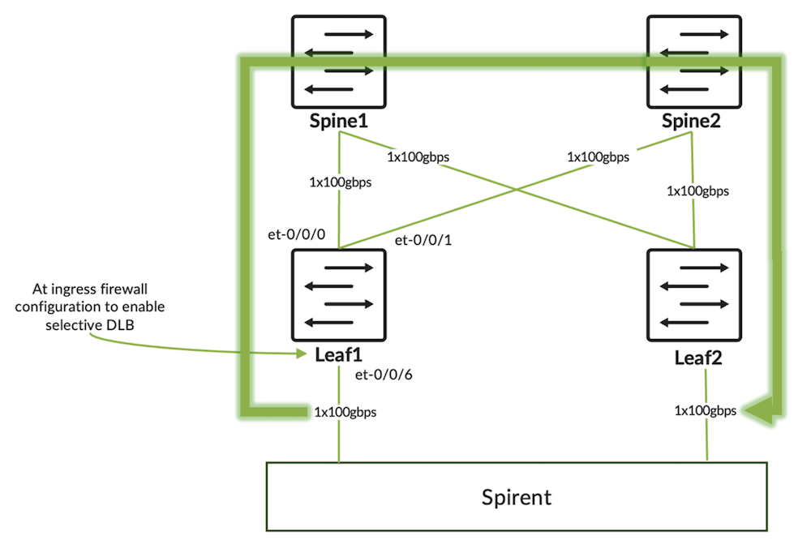
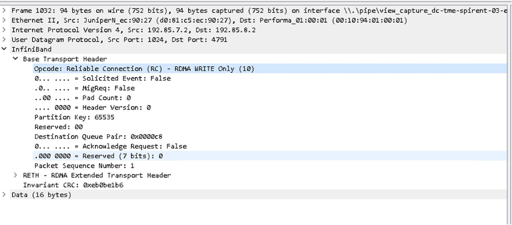
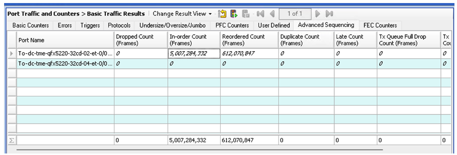

# Selective Dynamic Load Balancing

**Sanoop Rajan - 07/25/2024**

A new innovative feature called Selective DLB (Dynamic Load Balancing), improving RDMA traffic ECMP.

This article has been co-written by Sanoop Ranjan and Himanshu Tambakuwala.

## Introduction

With this feature, we have two enhancements to our Junos Evo operating system:

- The ability to detect the specific RDMA traffic with the help of matching opcode in the InfiniBand Base Transport Header (IB BTH). This can be done with the help of a firewall filter configuration on the switches.
- The ability to apply DLB for the specific flows matching the filter and the rest of the flows to use static hash-based load balancing.

The feature is introduced in Junos 23.4R2 on QFX5230 and QFX5240.

In this article, we will cover the configuration and changes in traffic distribution across ECMP (Equal Cost Multi Path) links when enabling this feature.

## Overview

Selective DLB feature offers the ability to enable DLB for certain flows within the switch. Earlier, the load-balancing mechanisms could only be affected at a switch level which meant we could either have static hash-based load balancing or dynamic load balancing. It was not granular to the flow level. Since we want to enable DLB for some of the flows and disable it for some other flows based on user-defined criteria, we need some kind of classification mechanism. This is where every network engineer's friend (or foe, depending on how you meddled with) :) firewall filter (also referred to as access control lists) comes to the rescue. At a high level, to have the ability to selectively enable/disable DLB, we have added the following capabilities:

- The capability to filter packets that need or do not need DLB
- The capability to enable/disable DLB only for those classified packets

The first capability is fulfilled by the match condition of firewall filters. We have gone one step ahead and added a new "match" capability within our firewall filter, "rdma-opcode," to match the metadata of RDMA traffic, which is the most common workload in AI-ML data centers. This means that the firewall filter can recognize the InfiniBand Base Transport Header (IB BTH) header of the ROCEv2 packet and look at the opcode field within it.

The second capability is made possible by the capable PFEs (Packet Forwarding Engines) we use in our switches. With this, we can enable DLB for certain flows matching the criteria configured. This will be useful for scenarios where we want to leverage the benefits of DLB while continuing to use the default static load-balancing for the rest.

In the example, we have used* rdma-opcode *as the match condition, but we can use a wide range of "match" conditions that are already supported in QFX. We also support user-defined fields in firewall filters using flex-filter (a topic for another blog). So, if you do not have RDMA traffic, this feature may still be relevant for you.

## Topology



The flow of traffic is between leaf-01 and leaf-02. The source of traffic is 192.85.7.2, which is connected to leaf-01, and destined to 192.85.8.2 which is connected to leaf-02. We can see from Exhibit 1 that there is an ECMP (Equal Cost Multi Path) to the destination with two paths: one towards spine-01 and the other towards spine-02.

```
root@leaf-01> show route 192.85.8.2              

inet.0: 42 destinations, 49 routes (42 active, 0 holddown, 0 hidden)
+ = Active Route, - = Last Active, * = Both

192.85.8.0/24      *[BGP/170] 1d 04:12:32, localpref 100, from 192.168.11.0
                      AS path: 64521 64531 I, validation-state: unverified
                       to 192.168.11.0 via et-0/0/1.0
                    >  to 192.168.11.10 via et-0/0/0.0
                    [BGP/170] 1d 04:12:32, localpref 100
                      AS path: 64522 64531 I, validation-state: unverified
                    >  to 192.168.11.10 via et-0/0/0.0

root@leaf-01> show route forwarding-table matching 192.85.8.2/24 
Routing table: default.inet
Internet:
Destination        Type RtRef Next hop           Type Index    NhRef Netif
192.85.8.0/24      user     0                    ulst     8032     1
                                                 sftw     8030     1 et-0/0/1.0
                              192.168.11.0       ucst     1002     1 et-0/0/1.0
                                                 sftw     8031     1 et-0/0/0.0
                              192.168.11.10      ucst     1000     1 et-0/0/0.0

root@leaf-01>
```

*CLI Output - Exhibit 1*

The firewall filter is applied on leaf-01's interface et-0/0/6, which connects to the traffic generator. The packet that is sent from the traffic generator is ROCEv2 with RDMA "write-only" traffic. The packet capture below displays the packet header.



## Configuration

Exhibit 2 is the configuration required for enabling Selective DLB at the global level:

```
root@leaf-01# show forwarding-options                  
enhanced-hash-key {
    ecmp-dlb {
        per-packet;
        ether-type {
            none;
        }
    }
}
```

*CLI Output - Exhibit 2*

In the configuration snippet shown in Exhibit 2, we enable "per-packet" DLB. However, the ether-type none stanza implies that no traffic gets DLB treatment. So essentially, all traffic continues to get the default static load-balancing.

Since we want to enable DLB only for selected flows, we need to configure a firewall filter for that. Before we create the firewall filter configuration, we need to have the global configuration below to ensure that we have the TCAM (Ternary Content Addressable Memory) allocated for UDF (user-defined field):

```
root@leaf-01# show system 
packet-forwarding-options {
    firewall {
        profiles {
            inet {
                udf-profile1;
            }
        }
    }
}
```

*CLI Output - Exhibit 3*

Now we configure the firewall filter. In this example, we intend to enable "per-packet" DLB only for the RDMA "write-only" traffic. The rest of the flows within the switch will get the default "static" load-balancing.

```
root@leaf-01# show firewall        
family inet {
    filter enable-dlb-per-packet {
        term op-code-10-match {
            from {
                rdma-opcode 10;
            }
            then {
                count op-code-10-match-count;
                dynamic-load-balance enable;
                accept;
            }
        }
        term default {
            then accept;
        }
    }
}
```

*CLI Output - Exhibit 4*

In the firewall filter config shown in exhibit 4, we are matching rdma-opcode 10 which is the opcode for "write-only" operation in RDMA. The firewall filters parse each packet header and look for the opcode "10" within the IB BTH header of ROCEv2 packet. We enable per-packet DLB on all the packets that match opcode 10 with the help of the dynamic-load-balance enable knob.

The term default ensures that the packets that do not match the previous term are accepted. The ether-type none configuration enabled globally results in the rest of the flows continuing to use the static hash-based load balancing.

So far, we have configured everything that is required, except that the firewall filter is not applied to the interface.

## Verification

Let us see what the current traffic distribution looks like from "monitor interface traffic" command output.

```
root@Leaf-01# run monitor interface traffic

<Snipped output>
Interface    Link  Input packets        (pps)     Output packets        (pps)

 et-0/0/0      Up          469264          (0)          1558201          (0)
 et-0/0/1      Up             286          (0)           419086        (836)
 et-0/0/6      Up         1976749        (836)           469085          (0)
```

*CLI Output - Exhibit 5*

The output from Exhibit 5 shows that we are sending the packets on et-0/0/1 which is connected to Spine-01, and there is no traffic on et-0/0/0 which is connected to Spine-02.

Now let us apply the firewall filter to the interface that is connected to the traffic generator, as in Exhibit 6.

```
root@leaf-01# set interfaces et-0/0/6 unit 0 family inet filter input enable-dlb-per-packet 

[edit]
root@leaf-01# commit and-quit 
commit complete
Exiting configuration mode
```

*CLI Output - Exhibit 6*

If we look at the "monitor interface traffic" output in exhibit 7 now, we can see that traffic is load-balanced across both uplinks. There is only one flow running through the environment and the packets are load- balanced in per-packet fashion to all available ECMP links.

```
root@Leaf-01# run monitor interface traffic

<Snipped output>
Interface    Link  Input packets        (pps)     Output packets        (pps)

 et-0/0/0      Up          469386          (0)          1571111        (411)
 et-0/0/1      Up             403          (0)          1292597        (423)
 et-0/0/6      Up         2862946        (836)           469131          (0)
```

*CLI Output - Exhibit 7*

Let us also look at the filter counter to verify that packets match the term "op-code-10-match". From Exhibit 8, it can be observed that the packet counters are getting incremented.

```
root@leaf-01> show firewall filter enable-dlb-per-packet 

Filter: enable-dlb-per-packet                                  
Counters:
Name                                                                            Bytes              Packets
op-code-10-match-count                                                        4831788                51402

root@leaf-01> show firewall filter enable-dlb-per-packet    

Filter: enable-dlb-per-packet                                  
Counters:
Name                                                                            Bytes              Packets
op-code-10-match-count                                                        5354992                56968

root@leaf-01>
```

*CLI Output - Exhibit 8*

Until now, we have verified traffic that matched the opcode 10 gets per-packet DLB treatment. We have not verified what happens to the other flows in the switch. For that, we will add one more flow from the traffic generator which has an opcode of 100. We will also modify the firewall filter to count the packets that are not matched in the first term as shown in Exhibit 9.

```
root@leaf-01> show configuration firewall family inet filter enable-dlb-per-packet 
term op-code-10-match {
    from {
        rdma-opcode 10;
    }
    then {
        count op-code-10-match-count;
        dynamic-load-balance enable;
        accept;
    }
}
term default {
    then {
        count opcode-unmatched;
        accept;
    }
}

root@leaf-01>
```

*CLI Output - Exhibit 9*

In Exhibit 10, we can see that the traffic is going out through the link to Spine-02 only; the link to Spine-01 is not utilized. This is the behavior for "static" load-balancing method which load-balances based on "per-flow". Since we are sending a single flow with opcode 100, it chooses a single outgoing interface.

```
root@Leaf-01# run monitor interface traffic

Interface    Link  Input packets        (pps)     Output packets        (pps)
<Snipped output>

et-0/0/0      Up             193          (0)      10828437920          (0)
 et-0/0/1      Up             174          (0)      10827801958        (836)
 et-0/0/6      Up     21656240669        (836)              983          (0)
```

*CLI Output - Exhibit 10*

In Exhibit 11, we can see that the packet counters for opcode 100 are being incremented. This means that the packet is getting the default static load-balancing.

```
root@leaf-01> show firewall filter enable-dlb-per-packet    

Filter: enable-dlb-per-packet                                  
Counters:
Name                                                                            Bytes              Packets
op-code-10-match-count                                                              0                    0
opcode-unmatched                                                             10858192               115513

root@leaf-01> show firewall filter enable-dlb-per-packet    

Filter: enable-dlb-per-packet                                  
Counters:
Name                                                                            Bytes              Packets
op-code-10-match-count                                                              0                    0
opcode-unmatched                                                             11165384               118781

root@leaf-01>
```

*CLI Output - Exhibit 11*

If we start the traffic with opcode 10 as well, we see the output as shown in Exhibit 12. Flow with opcode 10 is getting per-packet load-balanced to both the ECMP links, whereas flow with opcode 100 continues to use et-0/0/1.

```
root@Leaf-01# run monitor interface traffic
Interface    Link  Input packets        (pps)     Output packets        (pps)
<Snipped output>

 et-0/0/0      Up             219          (0)      10828454991        (417)
 et-0/0/1      Up             202          (0)      10828024681       (1256)
 et-0/0/6      Up     21656480409       (1672)              993          (0)
```

*CLI Output - Exhibit 12*

And we can see from Exhibit 13 that firewall counters match both.

```
root@leaf-01> show firewall filter enable-dlb-per-packet    

Filter: enable-dlb-per-packet                                  
Counters:
Name                                                                                           Bytes                     Packets
op-code-10-match-count                                                                        631116                        6714
opcode-unmatched                                                                            13765048                      146437

root@leaf-01> show firewall filter enable-dlb-per-packet    

Filter: enable-dlb-per-packet                                  
Counters:
Name                                                                                           Bytes                       Packets
op-code-10-match-count                                                 1200004                 12766
opcode-unmatched                                                      14333936                152489

root@leaf-01>
```

*CLI Output - Exhibit 13*

Also remember that since we are using DLB per-packet mode, it considers the link quality and load-balancing traffic across the links. We have not shown this in the example explained above.

Note:

Since we are enabling "per-packet" DLB, it will lead to "out-of-order" packets on the receiving side. Figure 3 is the traffic generator snippet showing the reordered frame count.



It is recommended to use this mode only when the receiving host can reorder packets. In the AI-ML clusters, endpoint systems are connected through NICs (Network Interface Cards) that can support packet re-ordering to a certain extent.

## Conclusion

With the introduction of this feature, users can enable "per-packet" dynamic load-balancing selectively for the flows of interest. This feature can be used in the environment where the receiver NIC (Network Interface Card) can do re-ordering for specific types of traffic.

## Glossary

- AI-ML: Artificial-Intelligence and Machine Learning
- DLB: Dynamic Load-balancing
- ECMP: Equal Cost Multi Path
- IB BTH: InfiniBand Base Transport Header
- NIC: Network Interface Card
- RDMA: Remote Direct Memory Access
- ROCEv2: RDMA Over Converged Ethernet version 2
- PFE: Packet Forwarding Engine

## Acknowledgments

This article is a collaborative effort of Sanoop Rajan and Himanshu Tambakuwala.
