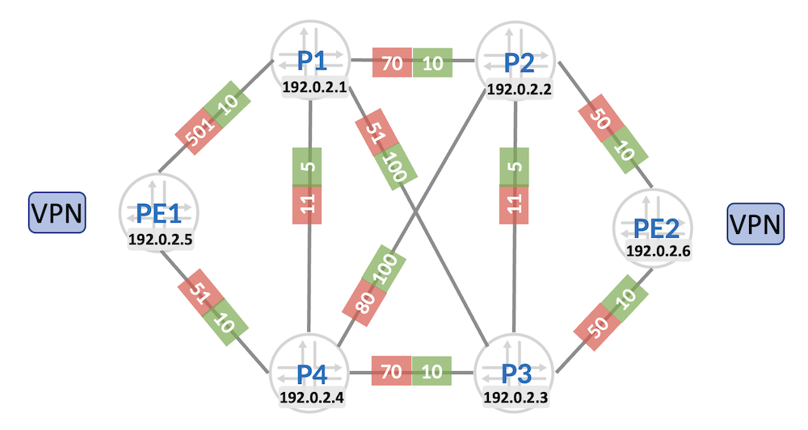

# Service Mapping to Colored MPLS Paths

**Anton Elita - 01/18/2023**

Mapping modern and legacy services to colored MPLS paths, achieving business differentiation.

## Introduction

People say there are no greenfield service providers (SPs). Some networks grow organically, some by acquisitions and merges. Growth takes time, and technology does not stay idle, speaking not only of interface speeds, but as well of the used protocols. Sooner or later, a more efficient network would require protocols to be updated or changed: solving scaling challenges, providing more flexible underlays and overlays, enabling new businesses.

Many SPs already moved to SR-MPLS or are in the process of transition. Now is the time to use the advantages of this technology, for example one or multiple flavors of traffic engineering (SR-TE). In this TechPost, we will see how to map virtual private networks (VPNs) or plain IPv4/IPv6 prefixes to colored traffic-engineered paths in an MPLS network.

Junos is doing great job in helping network operators to change a technology. To name just one example: coexistence of VPLS and EVPN, allowing for site-by-site migration and saving the investments in VPLS. Check this [post](https://juniper.github.io/techposts/vpls-to-evpn-vpls-seamless-migration-on-mx-routers/article) for more details.

The same applies to migration between different transport protocols. Junos allows mapping of new (for example EVPN) and old (for example LDP-based) services to traffic-engineered transport paths established by RSVP, SR-TE, BGP-CT or Flex-Algo.

In this article we're reviewing *colored* TE transport tunnels, carrying different services between same pairs of PE endpoints. Color is required to differentiate transport tunnels between a pair of PE endpoints, each using a single Loopback IP address. It's a great business enabler, allowing different SLAs for various service types.

## Basic Network Setup

Throughout this TechPost we will use this reference network:



Please note that this network is running on vMX with Junos 22.4R1. Support for mapping services to colored MPLS LSPs appeared in Junos in 2019, gradually adding new features on all platforms like MX, PTX, ACX, and even more features to come, as the protocols and products evolve!

ISIS is serving as internal protocol (IGP), but OSPF is supported as well. Each link has an IGP metric (green color) and a delay metric (red). IGP metric can be thought of being proportional to the link bandwidth, and the delay metric represents a static or a dynamic link latency value in milliseconds. There is a single Flex-Algo 128 which uses delay metrics for shortest path calculation. Other constraints like link affinities might be used, but for brevity are not included here.

All services are running between PE1 and PE2. Some will be BGP-signaled, and some use LDP. PE devices either have a direct iBGP session or exchange prefixes via a route reflector. Basic PE configuration is independent of the carried services:

```
aelita@pe2# show groups SR
policy-options {
    policy-statement PS-ADD-FLEX-ALGO {
        term TR-FA128 {
            from {
                interface lo0.0;
                route-filter 192.0.2.6/32 exact;
            }
            then {
                prefix-segment {
                    algorithm 128 index 106 node-segment;
                    index 6;                                                    
                    node-segment;
                }
                accept;
            }
        }
    }
}
routing-options {
    flex-algorithm 128 {
        definition {
            metric-type delay-metric;
        }
        color 128;
        use-transport-class;
    }
    route-distinguisher-id 192.0.2.6;
    resolution {
        preserve-nexthop-hierarchy;
    }
    transport-class {
        auto-create;
        name tc-128 {
            color 128;
        }
    }
}
protocols {
    isis {
        source-packet-routing {
            node-segment ipv4-index 6;
            flex-algorithm 128;
        }
        export PS-ADD-FLEX-ALGO;
    }
    mpls {
        label-range {
            srgb-label-range 100000 135999;
        }
    }
}
```

A few notes on the above configuration:

- SRGB allocation is configured at "protocols mpls" level, and effectively creates a shared common label block for protocols like ISIS and BGP
- Flex-Algo 128 is configured for both participation (required on every participating node) and definition (required on at least one node per ISIS level)
- A policy is used to advertise both regular SID and Flex-Algo 128 SID in ISIS
- "resolution preserve-nexthop-hierarchy" must be enabled for correct next-hop resolution in services like VPLS
- Transport-Class is used for the colored paths

Transport classes have been introduced in Junos 21.1R1 and represent sets of transport tunnels with common TE characteristics. They simplify mapping of service routes to transport routes, with desired SLA and fallback characteristics. Matching happens by comparing color community attached to the service prefix with the color of the transport class, where transport tunnel reside. Transport tunnels can be initiated by RSVP-TE, SR-TE, Flex-Algo or BGP-CT.

Each transport class can have own fallback configuration, which allows using next-hops from a different colored transport class or uncolored tunnels.

Mapping to transport classes is facilitated via new route target called "transport-target", acting as a mapping community to resolve routes via respective transport classes.

```
aelita@pe2# run show routing transport-class all
Transport Class: junos-tc-128  Configured name: tc-128
  Color: 128, References: 6
  Transport Endpoints: IPv4 5  IPv6 0
  Mapping community: color:0:128
  Route Target: transport-target:0:128
  Routing instance: junos-rti-tc-128

Transport Class: junos-tc-best-effort
  Color: 0, References: 2
  Transport Endpoints: IPv4 5  IPv6 0
  Mapping community: color:0:0
  Routing instance: master
  ExportDisabled

aelita@pe2# run show route resolution scheme all
Resolution scheme: junos-resol-schem-tc-128-v4-service
  AutoCreated
  References: 1
  Mapping community: color:0:128
  Resolution Tree: 0x9782400, index: 6, Nodes: 5
  Policy: [__resol-schem-common-import-policy__]
  Contributing routing tables: junos-rti-tc-128.inet.3 inet.3

Resolution scheme: junos-resol-schem-tc-128-v4-transport
  AutoCreated
  References: 1
  Mapping community: transport-target:0:128
  Resolution Tree: 0x9783c00, index: 8, Nodes: 5
  Policy: [__resol-schem-common-import-policy__]
  Contributing routing tables: junos-rti-tc-128.inet.3
```

The above output shows two types of resolution schemes, for transport and service. Transport can be any of RSVP-TE, SR-TE, Flex-Algo and other types of underlay transport tunnels, and uses transport-target as a mapping community. Service refers to L3VPN, EVPN, L2VPN and other types of payload and uses color community for mapping.

```
aelita@pe2# run show route table junos-rti-tc-128.inet.3

192.0.2.1/32       *[L-ISIS/14] 2d 22:11:52, metric 101
                    >  to 10.0.36.1 via ge-0/0/0.0, Push 100101
192.0.2.2/32       *[L-ISIS/14] 2d 22:12:03, metric 50
                    >  to 10.0.26.1 via ge-0/0/1.0
192.0.2.3/32       *[L-ISIS/14] 2d 22:11:40, metric 50
                    >  to 10.0.36.1 via ge-0/0/0.0
192.0.2.4/32       *[L-ISIS/14] 2d 22:11:26, metric 112
                    >  to 10.0.36.1 via ge-0/0/0.0, Push 100104
192.0.2.5/32       *[RSVP/7/1] 00:03:58, metric 30
                    >  to 10.0.36.1 via ge-0/0/0.0, label-switched-path LSP-PE1
                    [SPRING-TE/8] 00:09:03, metric 1, metric2 30
                    >  to 10.0.26.1 via ge-0/0/1.0, Push 100005
                       to 10.0.36.1 via ge-0/0/0.0, Push 100005
                    [L-ISIS/14] 2d 22:12:23, metric 163
                    >  to 10.0.36.1 via ge-0/0/0.0, Push 100105

aelita@pe2# run show isis route flex-algorithm-id 128
 IS-IS routing table             Current version: L1: 0 L2: 390
IPv4/IPv6 Routes
----------------
Prefix             L Version   Metric Type Interface       NH   Via                 Backup Score
192.0.2.1/32       2     348      101 int  ge-0/0/0.0      IPV4 p3
192.0.2.2/32       2     348       50 int  ge-0/0/1.0      IPV4 p2
192.0.2.3/32       2     348       50 int  ge-0/0/0.0      IPV4 p3
192.0.2.4/32       2     348      112 int  ge-0/0/0.0      IPV4 p3
192.0.2.5/32       2     348      163 int  ge-0/0/0.0      IPV4 p3
192.0.2.6/32       2     348        0 int 
[..]
```

The CLI outputs show which transport classes exist, their fallback configuration, and the contents of the respective routing tables. Table *junos-rti-tc-128.inet.3* shows routes from different protocols like RSVP-TE, SR-TE and ISIS Flex-Algo.

Color assignment for Flex-Algo is by default taking the value of Flex-Algo itself, for example 128. For RSVP-TE or SR-TE, color can be configured like this:

```
aelita@pe2# show protocols mpls
label-switched-path LSP-PE1 {
    to 192.0.2.5;
    transport-class tc-128;
}
aelita@pe2# show groups SR protocols source-packet-routing
source-routing-path SP-PE1 {
    to 192.0.2.5;
    color 128;
    primary {
        SL-PE1 {
            compute;
        }
    }
}
```

Above LSPs do not have strict path or other constraints, and Junos will calculate the path - provided that the TED is populated by IGP. More on TED can be found in [this techpost](https://juniper.github.io/techposts/inter-domain-on-demand-sr-te-lsps-with-bgp-ls/article).

## Mapping LDP-based VPNs to colored transport tunnels

### L2circuit

L2circuit is a very widespread technology supporting layer-2 point-to-point VPNs. With a simple configuration knob, l2circuits can be mapped to underlying colored transport tunnels:

```
aelita@pe2# show groups L2CIRCUIT
interfaces {
    ge-0/0/2 {
        encapsulation ethernet-ccc;
        unit 0;
    }
}
policy-options {
    community CM-128 members color:0:128;
}
protocols {
    l2circuit {
        neighbor 192.0.2.5 {
            interface ge-0/0/2.0 {
                virtual-circuit-id 19202501;
                community CM-128;
            }
        }
    }
    ldp {
        interface lo0.0;
    }
}
```

The only thing we needed to add to regular l2circuit definition is the color community, that was an easy job!

Note that the only interface where LDP is enabled is Lo0.0 on the PE device. Core (transit) nodes do not need to run LDP at all.

Junos will pick up the next-hop with the lowest distance from the transport class table matching community:

```
aelita@pe2# run show route table junos-rti-tc-128.inet.3 192.0.2.5/32

192.0.2.5/32       *[RSVP/7/1] 00:39:22, metric 30
                    >  to 10.0.36.1 via ge-0/0/0.0, label-switched-path LSP-PE1
                    [SPRING-TE/8] 00:44:27, metric 1, metric2 30
                    >  to 10.0.26.1 via ge-0/0/1.0, Push 100005
                       to 10.0.36.1 via ge-0/0/0.0, Push 100005
                    [L-ISIS/14] 2d 22:47:47, metric 163
                    >  to 10.0.36.1 via ge-0/0/0.0, Push 100105

aelita@pe2# run show route table l2circuit.0 expanded-nh
192.0.2.5:CtrlWord:5:19202501:Local/96
                   *[L2CKT/7] 00:11:47, metric2 30
                    >  to 10.0.36.1 via ge-0/0/0.0, label-switched-path LSP-PE1
```

We can remove the RSVP-TE LSP to verify that l2circuit will be re-mapped to the next available transport tunnel:

```
aelita@pe2# deactivate protocols mpls label-switched-path LSP-PE1

[edit]
aelita@pe2# commit
commit complete

aelita@pe2# run show route table l2circuit.0 expanded-nh

l2circuit.0: 2 destinations, 2 routes (2 active, 0 holddown, 0 hidden)
+ = Active Route, - = Last Active, * = Both

192.0.2.5:CtrlWord:5:19202501:Local/96
                   *[L2CKT/7] 00:14:23, metric2 30
                    >  to 10.0.26.1 via ge-0/0/1.0, Push 100005
                       to 10.0.36.1 via ge-0/0/0.0, Push 100005
```

Now we remove SR-TE LSP as well, so that only Flex-Algo with color 128 is the only contributor to the traffic-class table with the ID 128:

```
aelita@pe2# deactivate groups SR protocols source-packet-routing source-routing-path SP-PE1

[edit]
aelita@pe2# commit
commit complete

aelita@pe2# run show route table junos-rti-tc-128.inet.3 192.0.2.5/32

192.0.2.5/32       *[L-ISIS/14] 3d 00:14:03, metric 163
                    >  to 10.0.36.1 via ge-0/0/0.0, Push 100105

[edit]
aelita@pe2# run show route table l2circuit.0 expanded-nh

192.0.2.5:CtrlWord:5:19202501:Local/96
                   *[L2CKT/7] 00:00:34, metric2 163
                    >  to 10.0.36.1 via ge-0/0/0.0, Push 100105
```

The outgoing transport label is clearly confirming the use of Flex-Algo 128 label. The metric of 163 is a sum of delay metrics following this lowest latency path: PE2, P2, P3, P1, P4 -PE1

### VPLS with LDP signaling

Similar to L2circuits, VPLS with LDP signaling uses LDP to allocate the label, but does not require LDP-enabled core and can be mapped to colored transport tunnels.

I will skip the full VPLS configuration for brevity, as it's already well documented in the guides for Junos.

Before applying the mapping onto colored transport tunnels:

```
aelita@pe2# run show route table l2circuit.0 expanded-nh

l2circuit.0: 2 destinations, 2 routes (2 active, 0 holddown, 0 hidden)
+ = Active Route, - = Last Active, * = Both

192.0.2.5:NoCtrlWord:5:192003:Local/96
                   *[VPLS/7] 00:01:05, metric2 30
                       to 10.0.26.1 via ge-0/0/1.0, Push 100005
                    >  to 10.0.36.1 via ge-0/0/0.0, Push 100005

aelita@pe2# run show route 192.0.2.5
[..]

inet.3: 5 destinations, 5 routes (5 active, 0 holddown, 0 hidden)
+ = Active Route, - = Last Active, * = Both

192.0.2.5/32       *[L-ISIS/14] 3d 02:22:06, metric 30
                    >  to 10.0.26.1 via ge-0/0/1.0, Push 100005
                       to 10.0.36.1 via ge-0/0/0.0, Push 100005

junos-rti-tc-128.inet.3: 5 destinations, 5 routes (5 active, 0 holddown, 0 hidden)
+ = Active Route, - = Last Active, * = Both

192.0.2.5/32       *[L-ISIS/14] 3d 02:22:06, metric 163
                    >  to 10.0.36.1 via ge-0/0/0.0, Push 100105
```

Junos used transport label from the *inet.3* table because we hadn't applied the color community yet. Let's change that:

```
aelita@pe2# set groups VPLS-LDP routing-instances RI-VPLS protocols vpls community CM-128
aelita@pe2# set groups VPLS-LDP policy-options community CM-128 members color:0:128
[edit]
aelita@pe2# commit

aelita@pe2# run show route table l2circuit.0

192.0.2.5:NoCtrlWord:5:192003:Local/96
                   *[VPLS/7] 00:00:04, metric2 163
                    >  to 10.0.36.1 via ge-0/0/0.0, Push 100105
```

Next-hop now expectedly points to the colored next-hop.

## Mapping BGP-based VPNs to colored transport tunnels

### L2VPN

L2VPN with BGP signaling would by default use any valid next-hop from the inet.3 table, where uncolored tunnels are located. To instruct a PE to use a colored MPLS path to the remote end, we will add a community matching traffic-class configuration. Setting the color community will be part of a BGP policy. Such policy can be applied flexibly: it can be configured on the egress PE by using VRF export policy, or BGP export policy per group or per neighbor. Alternatively, color community can be applied on the ingress PE by using BGP import policy per group or per neighbor.

```
aelita@pe2# show groups L2VPN
interfaces {
    ge-0/0/2 {
        encapsulation ethernet-ccc;
        unit 0;
    }
}
policy-options {
    policy-statement PL-ADD-COLOR {
        term A {
            then {
                community add CM-128;
            }
        }
    }
    community CM-128 members color:0:128;
}
routing-instances {
    RI-L2VPN {
        instance-type l2vpn;
        protocols {
            l2vpn {
                site pe2 {
                    interface ge-0/0/2.0 {
                        remote-site-id 1;
                    }
                    site-identifier 2;
                }
                encapsulation-type ethernet;
            }
        }
        interface ge-0/0/2.0;
        vrf-target target:100:1;
    }
}
protocols {
    bgp {
        group GR-iBGP {
            local-address 192.0.2.6;
            import PL-ADD-COLOR;
            family l2vpn {
                signaling;
            }
            peer-as 100;
            local-as 100;
            neighbor 192.0.2.5;
        }
    }
}

aelita@pe2# run show route table RI-L2VPN.l2vpn.0 expanded-nh

192.0.2.5:65532:1:1/96
                   *[BGP/170] 00:13:45, localpref 100, from 192.0.2.5
                      AS path: I, validation-state: unverified
                    >  to 10.0.36.1 via ge-0/0/0.0, Push 100105
```

The other side PE1 does not have any coloring applied, so it will resolve via regular L-ISIS route with ECMP:

```
aelita@pe1# run show route table RI-L2VPN.l2vpn.0 expanded-nh

192.0.2.6:65533:2:1/96
                   *[BGP/170] 00:15:12, localpref 100, from 192.0.2.6
                      AS path: I, validation-state: unverified
                       to 10.0.15.1 via ge-0/0/0.0, Push 100006
                    >  to 10.0.45.1 via ge-0/0/1.0, Push 100006

aelita@pe1# run show route 192.0.2.6 table inet.3

192.0.2.6/32       *[L-ISIS/14] 3d 00:32:37, metric 30
                    >  to 10.0.15.1 via ge-0/0/0.0, Push 100006
                       to 10.0.45.1 via ge-0/0/1.0, Push 100006
```

Metric 30 is the sum of regular IGP metrics via either southern or northern paths in our topology.

### VPLS with BGP signaling

VPLS with BGP signaling uses the same address family as L2VPN above. BGP policies to add color community are same too. VPLS configuration itself is well known, so can be skipped.

Verification of the route programming in Junos, and traffic class being applied:

```
aelita@pe2# run show route table RI-VPLS.l2vpn.0 expanded-nh

RI-VPLS.l2vpn.0: 2 destinations, 2 routes (2 active, 0 holddown, 0 hidden)
+ = Active Route, - = Last Active, * = Both

192.0.2.5:9:1:1/96
                   *[BGP/170] 00:18:45, localpref 100, from 192.0.2.5
                      AS path: I, validation-state: unverified
                    >  to 10.0.36.1 via ge-0/0/0.0, Push 100105

aelita@pe2# run show route forwarding-table family vpls detail
Routing table: RI-VPLS.vpls
VPLS:
Enabled protocols: ACKed by all peers,
Destination        Type RtRef Next hop           Type Index    NhRef Netif
default            perm     0                    dscd      609     1
vt-0/0/0.1048576   intf     0                    indr  1048574     4
                              10.0.36.1         Push 25, Push 100105(top)      616     2 ge-0/0/0.0
```

The label used corresponds to the Flex-Algo node SID of the egress PE1:

```
aelita@pe2# run show route 192.0.2.5/32 table junos-rti-tc-128

192.0.2.5/32       *[L-ISIS/14] 3d 01:47:53, metric 163
                    >  to 10.0.36.1 via ge-0/0/0.0, Push 100105
```

### EVPN-ELAN, EVPN-VPWS, EVPN-ETREE

Junos 23.1R1 makes possible EVPN mapping to colored SR-TE or Flex-Algo transport tunnels using "transport classes" . With older Junos releases,  *inet[6]color* tables with [resolution-maps](https://www.juniper.net/documentation/us/en/software/junos/mpls/topics/ref/statement/resolution-map-edit-policy-options.html) can be used for service mapping.

Below is configuration and verification example for EVPN-ELAN and EVPN-VPWS.

```
aelita@pe2# show
interfaces {
    ge-0/0/2 {
        flexible-vlan-tagging;
        encapsulation flexible-ethernet-services;
        unit 0 {
            encapsulation vlan-ccc;
            vlan-id 10;
            esi {
                00:00:00:00:01:00:00:00:00:01;
                all-active;
            }
        }
        unit 11 {
            encapsulation vlan-bridge;
            vlan-id 11;
            esi {
                00:00:00:00:02:00:00:00:00:01;
                all-active;
            }
        }
    }
}
policy-options {
    policy-statement PL-ADD-COLOR {
        term A {
            then {
                community add CM-128;
            }
        }
    }
    community CM-128 members color:0:128;
}
routing-instances {
    RI-EVPN-VPWS {
        instance-type evpn-vpws;
        protocols {
            evpn {
                interface ge-0/0/2.0 {
                    vpws-service-id {
                        local 2;
                        remote 1;
                    }
                }
            }
        }
        interface ge-0/0/2.0;
        vrf-target target:100:1;
    }
    RI-EVPN-ELAN {
        instance-type evpn;
        protocols {
            evpn;
        }
        vlan-id 11;
        interface ge-0/0/2.11;
        vrf-target target:100:2;
    }
}
protocols {
    bgp {
        group GR-iBGP {
            local-address 192.0.2.6;
            import PL-ADD-COLOR;
            family evpn {
                signaling;
            }
            peer-as 100;
            local-as 100;
            neighbor 192.0.2.5;
        }
    }
}

[edit groups EVPN]
```

VLANs 10 and 11 carry different EVPN services: VPWS and ELAN. Here again we assign extended color community *color:0:128* on the ingress BGP group level, but this can be changed to vrf-export (or BGP group/neighbor export) on egress PE side.

Verification for VPWS service:

```
aelita@pe2# run show evpn vpws-instance RI-EVPN-VPWS
Instance: RI-EVPN-VPWS, Instance type: EVPN VPWS, Encapsulation type: MPLS
  Route Distinguisher: 192.0.2.6:65534
  Number of local interfaces: 1 (1 up)

    Interface name  ESI                            Mode          Role       Status     Control-Word    Flow-Label-Tx    Flow-Label-Rx
    ge-0/0/2.0      00:00:00:00:01:00:00:00:00:01 all-active      Primary    Up         No              No               No
        Local SID: 2 Advertised Label: 34
        Remote SID: 1
            PE addr         ESI                           Label  End.Dx2 SID     Mode           Role     TS                      Status
            192.0.2.5       00:00:00:00:01:00:00:00:00:02 37                     all-active     Primary  2022-12-28 01:42:58.619 Resolved
  Number of protect interfaces: 0

    Fast Convergence Information
    ESI: 00:00:00:00:01:00:00:00:00:02 Number of PE nodes: 1
        PE: 192.0.2.5
            Advertised SID: 1
```

Check that the transport tunnel picks up the right label for Flex-Algo 128:

```
aelita@pe2# run show route table RI-EVPN-VPWS.evpn.0 expanded-nh

1:192.0.2.5:0::010000000002::FFFF:FFFF/192 AD/ESI
                   *[BGP/170] 00:05:36, localpref 100, from 192.0.2.5
                      AS path: I, validation-state: unverified
                    >  to 10.0.36.1 via ge-0/0/0.0, Push 100105
1:192.0.2.5:65533::010000000002::1/192 AD/EVI
                   *[BGP/170] 00:05:36, localpref 100, from 192.0.2.5
                      AS path: I, validation-state: unverified
                    >  to 10.0.36.1 via ge-0/0/0.0, Push 100105
```

Check the full label stack:

```
aelita@pe2# run show route forwarding-table ccc ge-0/0/2.0 extensive
Routing table: default.mpls [Index 0]
MPLS:

Destination:  ge-0/0/2.0  (CCC)
  Route type: user
  Route reference: 0                   Route interface-index: 0
  Multicast RPF nh index: 0
  P2mpidx: 0
  Flags: sent to PFE, prefix load balance
  Nexthop:
  Next-hop type: composite             Index: 573      Reference: 3
  Load Balance Label: Push 37, None
  Next-hop type: indirect              Index: 1048574  Reference: 2
  Nexthop: 10.0.36.1
  Next-hop type: Push 100105           Index: 621      Reference: 2
  Load Balance Label: None
  Next-hop interface: ge-0/0/0.0
```

EVPN-ELAN service allows verification of the learned MAC addresses, provided that you have any active hosts:

```
aelita@pe2# run show evpn database
Instance: RI-EVPN-ELAN
VLAN  DomainId  MAC address        Active source                  Timestamp        IP address
11              56:04:1d:00:a5:c1  00:00:00:00:02:00:00:00:00:02  Dec 28 02:07:43  1.1.1.1

aelita@pe2# run show route forwarding-table matching "56:04:1d:00:a5:c1" extensive
Routing table: RI-EVPN-ELAN.evpn [Index 9]
EVPN:
Enabled protocols: Single VLAN, ACKed by all peers, EVPN, ARP/NDP suppression,

Destination:  56:04:1d:00:a5:c1/48
  Learn VLAN: 0                        Route type: user
  Route reference: 0                   Route interface-index: 336
  Multicast RPF nh index: 0
  P2mpidx: 0
  IFL generation: 0                    Epoch: 0
  Sequence Number: 0                   Learn Mask: 0x00000000
  L2 Flags: control, control_dyn
  Flags: sent to PFE
  Next-hop type: indirect              Index: 1048576  Reference: 4
  Nexthop:
  Next-hop type: composite             Index: 627      Reference: 2
  Load Balance Label: Push 41, None
  Nexthop: 10.0.36.1
  Next-hop type: Push 100105           Index: 621      Reference: 4
  Load Balance Label: None
  Next-hop interface: ge-0/0/0.0
```

### L3VPN

After having covered enough of layer 2 VPN service types, it's time to have a look at L3 services. We can start with L3VPN for IPv4 and IPv6 families.

Let's configure a policy setting the extended community on the egress PE side, as part of the VRF export policy.

Configuration on the egress PE1 side:

```
aelita@pe1# show groups L3VPN
interfaces {
    ge-0/0/6 {
        unit 0 {
            family inet {
                address 1.1.1.2/24;
            }
            family inet6 {
                address 2001:100::1:1/127;
            }
        }
    }
}
policy-options {
    policy-statement PL-ADD-COLOR {
        term A {
            then {
                community add CM-128;
                community add CM-RT-100-1;
                accept;
            }
        }
    }
    community CM-128 members color:0:128;
    community CM-RT-100-1 members target:100:1;
}
routing-instances {
    RI-L3VPN {
        instance-type vrf;
        interface ge-0/0/6.0;
        vrf-export PL-ADD-COLOR;
        vrf-target target:100:1;
        vrf-table-label;
    }
}
protocols {
    bgp {
        group GR-iBGP {
            local-address 192.0.2.5;
            family inet-vpn {
                unicast;
            }
            family inet6-vpn {
                unicast;
            }
            peer-as 100;
            local-as 100;
            neighbor 192.0.2.6;
        }
    }
    mpls {
        ipv6-tunneling;
    }
}
```

Remember that we need MPLS IPv6 tunneling for IPv4-based BGP next-hops.

Verification on the ingress PE2 node:

```
aelita@pe2# run show route receive-protocol bgp 192.0.2.5 detail | match "\*|comm|label"
* 1.1.1.0/24 (1 entry, 1 announced)
     VPN Label: 48
     Communities: target:100:1 color:0:128
* 192.0.2.5:10:1.1.1.0/24 (1 entry, 0 announced)
     VPN Label: 48
     Communities: target:100:1 color:0:128
* 2001:100::1:0/127 (1 entry, 1 announced)
     VPN Label: 48
     Communities: target:100:1 color:0:128
* 192.0.2.5:10:2001:100::1:0/127 (1 entry, 0 announced)
     VPN Label: 48
     Communities: target:100:1 color:0:128

aelita@pe2# run show route 1.1.1.0/24

RI-L3VPN.inet.0: 3 destinations, 3 routes (3 active, 0 holddown, 0 hidden)
+ = Active Route, - = Last Active, * = Both

1.1.1.0/24         *[BGP/170] 00:09:18, localpref 100, from 192.0.2.5
                      AS path: I, validation-state: unverified
                    >  to 10.0.36.1 via ge-0/0/0.0, Push 48, Push 100105(top)

aelita@pe2# run show route 2001:100::1:0/127

RI-L3VPN.inet6.0: 5 destinations, 5 routes (5 active, 0 holddown, 0 hidden)
+ = Active Route, - = Last Active, * = Both

2001:100::1:0/127  *[BGP/170] 00:09:57, localpref 100, from 192.0.2.5
                      AS path: I, validation-state: unverified
                    >  to 10.0.36.1 via ge-0/0/0.0, Push 48, Push 100105(top)
```

We receive the route, recognize the color community, and set the next-hop to Flex-Algo 128!

### Plain IPv4 and IPv6

Plain IPv4 or IPv6 is not much different from L3VPN. All what's needed is to add a color community to chosen prefix(es): either on the egress PE as part of the BGP export policy, or on the ingress PE in the BGP import policy.

```
aelita@pe2# run show route receive-protocol bgp 192.0.2.5 detail | match "\*|comm|label"
* 1.1.1.0/24 (1 entry, 1 announced)
     Communities: color:0:128
* 2001:100::1:0/127 (1 entry, 1 announced)
     Communities: color:0:128

aelita@pe2# run show route protocol bgp table inet.0

1.1.1.0/24         *[BGP/170] 00:00:48, localpref 100, from 192.0.2.5
                      AS path: I, validation-state: unverified
                    >  to 10.0.36.1 via ge-0/0/0.0, Push 100105

aelita@pe2# run show route protocol bgp table inet6.0

2001:100::1:0/127  *[BGP/170] 00:01:05, localpref 100, from 192.0.2.5
                      AS path: I, validation-state: unverified
                    >  to 10.0.36.1 via ge-0/0/0.0, Push 100105
```

## Summary

Junos allows a very granular mapping of complete services (or service prefixes) to colored MPLS tunnels. SR-TE, RSVP-TE, BGP-CT or Flex-Algo are all supported contributors to the transport tunnels. In addition to the above-mentioned services, Junos allows transport class mapping  for IPv6 and flowspec address familes.

## Useful links

- [RFC9085](https://datatracker.ietf.org/doc/html/rfc9085): Border Gateway Protocol - Link State (BGP-LS) Extensions for Segment Routing
- [Transport-Classes](https://www.juniper.net/documentation/us/en/software/junos/mpls/topics/ref/statement/use-transport-class-edit-routing-options-flex-algorithm.html)
- [BGP-CT](https://datatracker.ietf.org/doc/draft-ietf-idr-bgp-ct/)
- [Resolution Maps](https://www.juniper.net/documentation/en_US/junos/topics/concept/color-based-mapping-of-vpn-services-overview.html)

## Glossary

- BGP Border Gateway Protocol
- BGP-CT BGP Classful Transport
- ECMP Equal-Cost Multipath
- EVPN Ethernet Virtual Private Network
- IGP Interior Gateway Protocol
- LSP Label-switched path
- MPLS Multiprotocol Label Switching
- PE Provider Edge
- SP Service Provider
- SPF Shortest Path First
- SR Segment Routing
- SR-TE Segment Routing Traffic Engineering
- TE Traffic Engineering
- TED Traffic Engineering Database
- VPLS Virtual Private LAN Service

## Acknowledgements

Thanks to Krzysztof Szarkowicz for the review and suggestions.
