# Service Orchestration with Paragon Automation

**Masagung Nugroho - 12/19/2024**

How Paragon Automation (PA) automates workflow steps in provisioning L3VPN/EVPN/L2Circuit service based on declarative intent.

This article is written by Masagung Nugroho and Henry Cheung.

## Introduction

Manual service provisioning in the network is tedious and cumbersome. Operators have to stitch multiple workflows to complete a service order. For example, identify network resources (ports, bandwidth, VLAN, ... etc.) to fulfill the business intent, provision of VPN services into the devices, verify the connectivity and measure SLA before handover to the end-user, and so on. Each workflow might involve different tools. This creates development and maintenance overhead to stitch the workflows. This is even more challenging in multi-vendor networks in which the operators need to apply different vendor devices' configurations and CLIs. The process is usually time-consuming, prone to human error, and hard to scale.

To tackle the above problems, Juniper Networks provides Paragon Automation (PA) solution which offers automated and intent-based service orchestration capability on a single pane of glass. Operators can seamlessly design the service order, check if the network has sufficient resources to fulfill the intent, provision service to multi-vendor devices, assure SLA, and keep monitoring the performance.

We have described intent-based service orchestration and its efficiency in various articles [1][2]. In this TechPost, we will showcase Paragon Automation's capability of the use case and detail the major steps of the orchestration workflow.

[1] [https://blogs.juniper.net/en-us/service-provider-transformation/intent-based-service-orchestration-done-right-with-the-new-juniper-paragon-automation](https://blogs.juniper.net/en-us/service-provider-transformation/intent-based-service-orchestration-done-right-with-the-new-juniper-paragon-automation)

[2] [https://www.juniper.net/us/en/solutions/solution-briefs/2024/intent-based-service-orchestration-solution-brief.html](https://www.juniper.net/us/en/solutions/solution-briefs/2024/intent-based-service-orchestration-solution-brief.html)

You may head to this article [3], if you want to learn more about Paragon Automation.

[3] [https://www.juniper.net/documentation/us/en/quick-start/software/juniper-paragon-automation2.2.0/pa-quick-start-guide/index.html](https://www.juniper.net/documentation/us/en/quick-start/software/juniper-paragon-automation2.2.0/pa-quick-start-guide/index.html)

## Demonstration Topology

Figure 1 shows the network topology used to demonstrate service orchestration by Paragon Automation. PE1 to PE6 are onboarded and managed by Paragon. Each PE is assigned to a site and location as follow:

- PE1: Sunnyvale
- PE2: Salt Lake City
- PE3: Atlanta
- PE4: Cincinnati
- PE5: Durham
- PE6: Herndon

CEs are customer premises devices used to verify end-to-end connectivity. They are not under management by Paragon Automation.

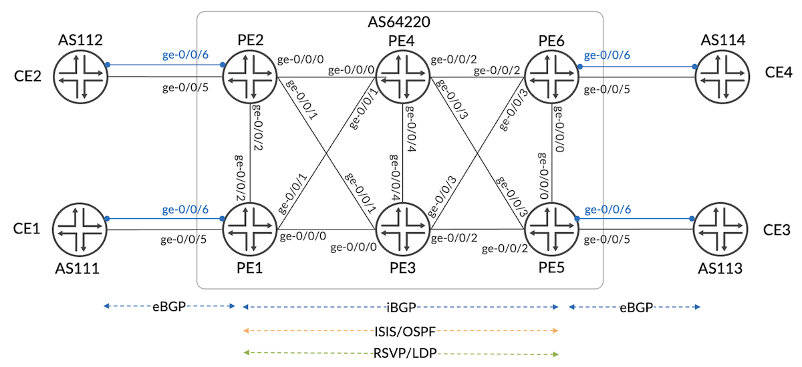

Paragon Automation offers real-time topology discovery by BGP-LS. When the devices are connected by IGP, the topology can be visualized on the GUI depicted in Figure 2. Paragon Automation 2.2 (Figure 3) and Junos 23.4R1.9 are used in this demonstration.

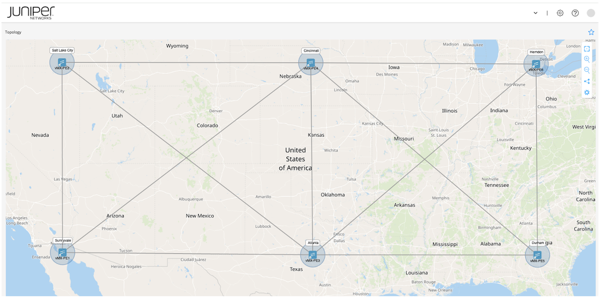

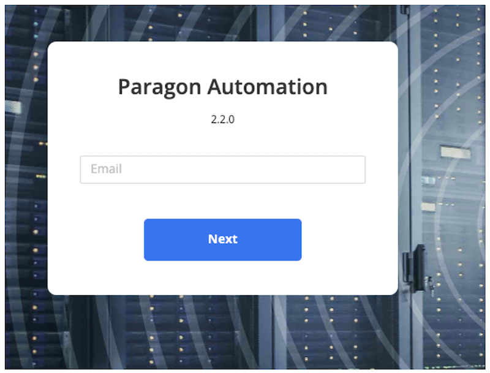

```
jcluser@vMX-PE1> show version
Hostname: vMX-PE1
Model: vmx
Junos: 23.4R1.9
JUNOS OS Kernel 64-bit  [20231122.ee0e992_builder_stable_12_234]
JUNOS OS libs [20231122.ee0e992_builder_stable_12_234]
JUNOS OS runtime [20231122.ee0e992_builder_stable_12_234]
... Truncated ...
```

## Service Orchestration Workflow

Service orchestration is the workflow of designing, configuring, validating, and monitoring a network service. It manages the entire life cycle of a network service including creation, modification, and decommissioning.

On Paragon Automation, the following procedures are attached to the orchestration workflow.

- Create VPN resource components
- Design service order (business intent)
- Publish service order
- Orchestrate Active Assurance workflow to measure and keep monitoring the SLA

## VPN Resource Components

VPN resources are network physical or virtual resources that are available for service order fulfillment. The following VPN resources can be created on GUI (Figure 4) or API.

1. Topology (topo) resource: CE-facing physical or logical interfaces, their speed, and VLAN ID on VPN-capable PEs
2. VPN (vpn) resource: route distinguisher, route target, community (l2circuit), and VC ID (l2circuit)
3. L3 address (l3-addr) resource: L3VPN CE-facing IP addresses
4. L2 address (l2-addr) resource: EVPN ESI address, LACP admin key and system-id

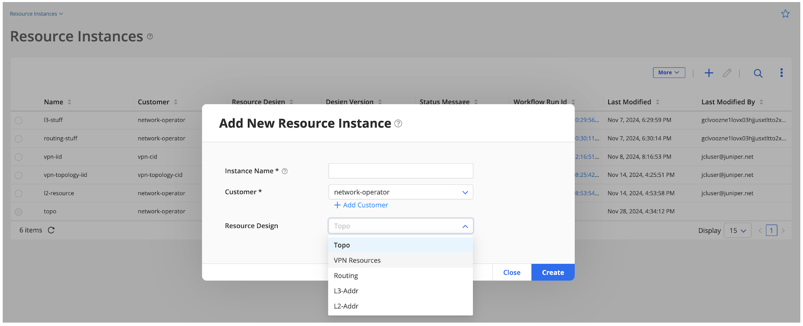

## Design Service Order

After creating VPN resources, we can start to design VPN services. PA supports L3VPN, EVPN, and L2 circuit service orchestration.

### 1. L3VPN Any-to-Any

Let's start to design an L3VPN service. PA supports any-to-any and hub-and-spoke L3VPN service orchestration. In this example, any-to-any service is demonstrated.

Below is the business intent of this L3VPN service:

- VPN topology: Any-to-any
- Service will be terminated in Sunnyvale, Salt Lake, Herndon and Durham
- CE-facing interface is ge-0/0/5 on all PEs
- VLAN ID: 201
- Bandwidth requirement: 1Gbps

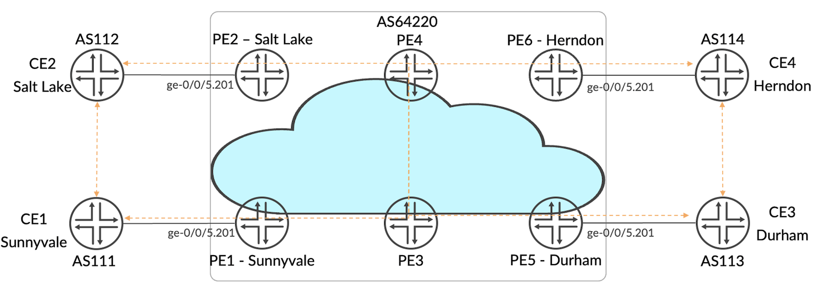

1.1. Create Service Order

Service order that fulfills the intent is created on GUI by manual input or upload JSON form. Alternatively, this can be created via API. The following figure shows the service order created on GUI. The L3VPN consists of 4 sites with ge-0/0/5.201 as CE-facing interface. VPN topology can also be previewed before order publishment.

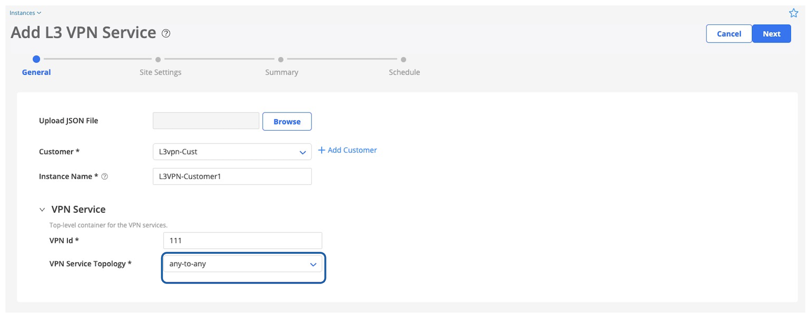

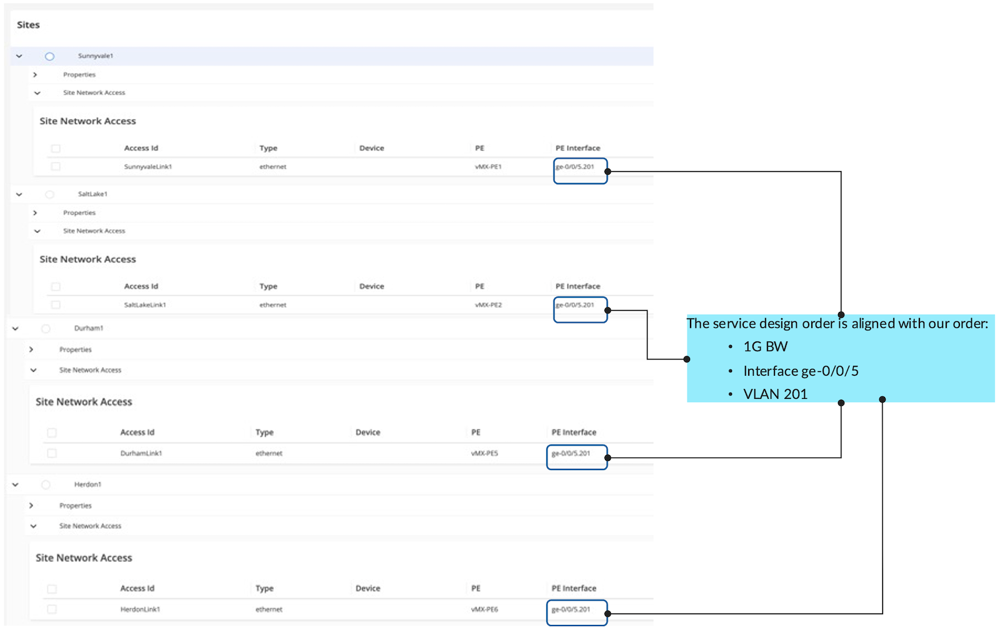

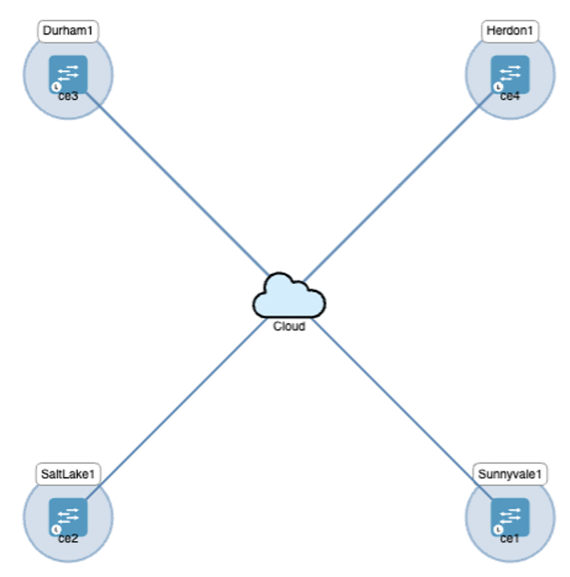

1.2. Publish Service Order

Then we hit "Save & Provision" to publish the service order.

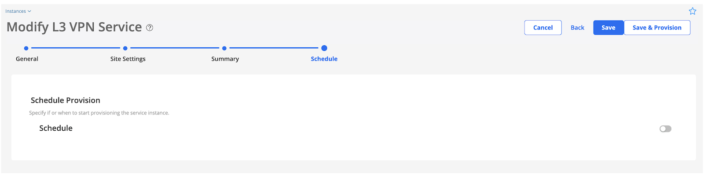

When the order is submitted, the orchestration engine will trigger the following workflow depicted in Figure 10.

First, Paragon checks the availability of the required resource. For example, if VLAN ID 201 is used by another VPN, the check will fail, and Paragon will return an error message. Upon the resources are assured, the service order will be transformed into device configuration and applied to the devices by NETCONF/YANG.

When the configuration is successfully committed, the orchestration engine will trigger SLA measurement (section 1.4). In this demonstration, fully-mesh RPM is set up to measure delay, jitter, and packet loss among participated PEs and CEs. The workflow also creates a monitoring dashboard on GUI such that the operator can inspect the SLA and easily identify any anomaly in the VPN service.

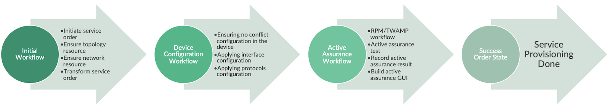

The service order status becomes "success" when the workflow is completed.

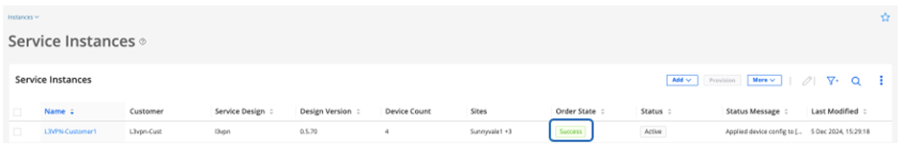

1.3. L3VPN Service Provisioning Verification in Routers

PA will transform the service order into device config and push them to the router as part of the service orchestration workflow.
Now, let's verify the L3VPN configuration that has been provisioned in the routers. For simplicity, we use PE1 and PE2 to verify the L3VPN service.

**Interface configuration**

```
jcluser@vMX-PE1> show configuration groups paragon-service-orchestration interfaces ge-0/0/5  

flexible-vlan-tagging;
mtu 1500;
encapsulation flexible-ethernet-services;
unit 201 {
    description "Network access to VPN 111 for customer L3vpn-Cust";
    vlan-id 201;
    family inet {
        policer {
            input ec420f5e-b2d9-11ef-b5e5-5a21a950e2af-SunnyvaleLink1-input;
            output ec420f5e-b2d9-11ef-b5e5-5a21a950e2af-SunnyvaleLink1-output;
        }
        address 192.168.1.2/24;
    }
}

jcluser@vMX-PE2> show configuration groups paragon-service-orchestration interfaces ge-0/0/5  

flexible-vlan-tagging;
mtu 1500;
encapsulation flexible-ethernet-services;
unit 201 {
    description "Network access to VPN 111 for customer L3vpn-Cust";
    vlan-id 201;
    family inet {
        policer {
            input ec420f5e-b2d9-11ef-b5e5-5a21a950e2af-SaltLakeLink1-input;
            output ec420f5e-b2d9-11ef-b5e5-5a21a950e2af-SaltLakeLink1-output;
        }
        address 192.168.2.2/24;
    }
}
```

**Policer configuration**

```
jcluser@vMX-PE1> show configuration groups paragon-service-orchestration firewall policer ec420f5e-b2d9-11ef-b5e5-5a21a950e2af-SaltLakeLink1-input
logical-interface-policer;
if-exceeding {
    bandwidth-limit 1g;
    burst-size-limit 1500000;
}
then discard;

jcluser@vMX-PE1> show configuration groups paragon-service-orchestration firewall policer ec420f5e-b2d9-11ef-b5e5-5a21a950e2af-SunnyvaleLink1-output   
logical-interface-policer;
if-exceeding {
    bandwidth-limit 1g;
    burst-size-limit 1500000;
}
then discard;

jcluser@vMX-PE2> show configuration groups paragon-service-orchestration firewall policer ec420f5e-b2d9-11ef-b5e5-5a21a950e2af-SaltLakeLink1-input 
logical-interface-policer;
if-exceeding {
    bandwidth-limit 1g;
    burst-size-limit 1500000;
}
then discard;

jcluser@vMX-PE2> show configuration groups paragon-service-orchestration firewall policer ec420f5e-b2d9-11ef-b5e5-5a21a950e2af-SaltLakeLink1-output   
logical-interface-policer;
if-exceeding {
    bandwidth-limit 1g;
    burst-size-limit 1500000;
}
then discard;
```

**L3VPN routing-instance configuration**

```
jcluser@vMX-PE1> show configuration groups paragon-service-orchestration routing-instances 
ec420f5e-b2d9-11ef-b5e5-5a21a950e2af {
    instance-type vrf;
    protocols {
        bgp {
            group bgp {
                type external;
                neighbor 192.168.1.1 {
                    description "BGP neighbor 192.168.1.1 for VPN 111";
                    local-address 192.168.1.2;
                    peer-as 111;
                    as-override;
                }
            }
        }
    }
    description "Routing instance for VPN 111 for customer L3vpn-Cust";
    interface ge-0/0/5.201;
    route-distinguisher 1235:0;
    vrf-target target:1235:2;
    vrf-table-label;
}

jcluser@vMX-PE2> show configuration groups paragon-service-orchestration routing-instances                                         
ec420f5e-b2d9-11ef-b5e5-5a21a950e2af {
    instance-type vrf;
    protocols {
        bgp {
            group bgp {
                type external;
                neighbor 192.168.2.1 {
                    description "BGP neighbor 192.168.2.1 for VPN 111";
                    local-address 192.168.2.2;
                    peer-as 112;
                    as-override;
                }
            }
        }
    }
    description "Routing instance for VPN 111 for customer L3vpn-Cust";
    interface ge-0/0/5.201;
    route-distinguisher 1235:5;
    vrf-target target:1235:2;
    vrf-table-label;
}
```

**L3VPN service route table information**

```
jcluser@vMX-PE1> show route table ec420f5e-b2d9-11ef-b5e5-5a21a950e2af.inet.0 

ec420f5e-b2d9-11ef-b5e5-5a21a950e2af.inet.0: 5 destinations, 5 routes (5 active, 0 holddown, 0 hidden)
+ = Active Route, - = Last Active, * = Both

192.168.1.0/24     *[Direct/0] 23:56:17
                    >  via ge-0/0/5.201
192.168.1.2/32     *[Local/0] 23:56:17
                       Local via ge-0/0/5.201
192.168.2.0/24     *[BGP/170] 23:56:14, localpref 100, from 1.1.192.0
                      AS path: I, validation-state: unverified
                    >  to 26.26.26.2 via ge-0/0/1.0, label-switched-path MPLS-MESH-from-vMX-PE1-to-vMX-PE2
                       to 18.18.18.2 via ge-0/0/2.0, label-switched-path Bypass->26.26.26.2
192.168.3.0/24     *[BGP/170] 10:22:56, localpref 100, from 2.2.2.0
                      AS path: I, validation-state: unverified
                    >  to 33.33.33.2 via ge-0/0/0.0, label-switched-path MPLS-MESH-from-vMX-PE1-to-vMX-PE5
                       to 26.26.26.2 via ge-0/0/1.0, label-switched-path Bypass->33.33.33.2
192.168.4.0/24     *[BGP/170] 23:56:17, localpref 100, from 1.1.192.2
                      AS path: I, validation-state: unverified
                    >  to 26.26.26.2 via ge-0/0/1.0, label-switched-path MPLS-MESH-from-vMX-PE1-to-vMX-PE6
                       to 18.18.18.2 via ge-0/0/2.0, label-switched-path Bypass->26.26.26.2

jcluser@vMX-PE2> show route table ec420f5e-b2d9-11ef-b5e5-5a21a950e2af.inet.0 

ec420f5e-b2d9-11ef-b5e5-5a21a950e2af.inet.0: 5 destinations, 5 routes (5 active, 0 holddown, 0 hidden)
+ = Active Route, - = Last Active, * = Both

192.168.1.0/24     *[BGP/170] 1d 00:42:42, localpref 100, from 3.3.3.1
                      AS path: I, validation-state: unverified
                    >  to 18.18.18.1 via ge-0/0/2.0, label-switched-path MPLS-MESH-from-vMX-PE2-to-vMX-PE1
                       to 21.21.21.1 via ge-0/0/0.0, label-switched-path Bypass->18.18.18.1
192.168.2.0/24     *[Direct/0] 1d 00:42:43
                    >  via ge-0/0/5.201
192.168.2.2/32     *[Local/0] 1d 00:42:43
                       Local via ge-0/0/5.201
192.168.3.0/24     *[BGP/170] 11:09:27, localpref 100, from 2.2.2.0
                      AS path: I, validation-state: unverified
                    >  to 28.28.28.1 via ge-0/0/1.0, label-switched-path MPLS-MESH-from-vMX-PE2-to-vMX-PE5
                       to 21.21.21.1 via ge-0/0/0.0, label-switched-path Bypass->28.28.28.1
192.168.4.0/24     *[BGP/170] 16:14:14, localpref 100, from 1.1.192.2
                      AS path: I, validation-state: unverified
                    >  to 18.18.18.1 via ge-0/0/2.0, label-switched-path MPLS-MESH-from-vMX-PE2-to-vMX-PE6
                       to 21.21.21.1 via ge-0/0/0.0, label-switched-path Bypass->18.18.18.1
```

1.4.  Orchestrate with Active Assurance for SLA Measurement

After L3VPN is successfully provisioned into the devices, PA can orchestrate with the active assurance workflow to affirm connectivity is up and keep monitoring the SLA throughout the lifecycle until the service is decommissioned. This ensures the SLA is fulfilled before the service is handover to the end-user and keeps performing well.

In this example, the orchestration engine provisions real-time performance monitoring (RPM) to VPN PEs as part of the active assurance workflow. This creates fully-mesh RPM test session between PEs and CEs. KPIs such as end-to-end round trip delay, jitter, and packet loss are reported and visualized on Paragon's observability dashboard.

The following config sample shows RPM sessions initiated from PE1 to remote PEs' CE-facing interfaces and CE devices.

```
jcluser@vMX-PE1> show configuration services rpm | display inheritance no-comments 
probe dmgw-p5841923713356306134 {
    test dmgw-t5841923713356306134 {
        probe-type icmp-ping;
        target address 192.168.4.2;     <<<< to PE4 CE-facing interface
        probe-count 1;
        test-interval 10;
        routing-instance ec420f5e-b2d9-11ef-b5e5-5a21a950e2af;
        history-size 512;
        ttl 64;
    }
}
probe dmgw-p8877067254217874667 {
    test dmgw-t8877067254217874667 {
        probe-type icmp-ping;
        target address 192.168.4.1;     <<<< to PE4 CE device
        probe-count 1;
        test-interval 10;
        routing-instance ec420f5e-b2d9-11ef-b5e5-5a21a950e2af;
        history-size 512;
        ttl 64;
    }
}
probe dmgw-p1868383628634058364 {
    test dmgw-t1868383628634058364 {
        probe-type icmp-ping;
        target address 192.168.2.1;    <<<< to PE2 CE device ... and so on
        probe-count 1;
        test-interval 10;
        routing-instance ec420f5e-b2d9-11ef-b5e5-5a21a950e2af;
        history-size 512;
        ttl 64;
    }
}

... Truncated ...
```

Figure 12 shows an observability dashboard. VPN KPIs measured by RPM are illustrated on this dashboard.

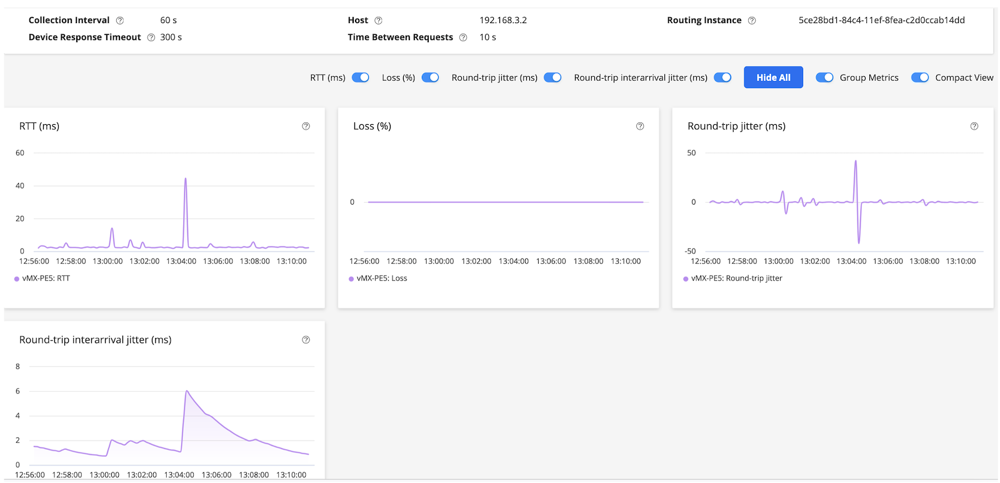

### 2. EVPN Single-homed Service Orchestration

Next, we will demonstrate EVPN service orchestration. PA supports both single-homed and dual-homed EVPN. In this example, the former is demonstrated with the following business intent.

- Single-homed
- Service will be terminated on Durham and Herndon
- CE-facing interface from PE is ge-0/0/5
- VLAN ID: 206
- Bandwidth requirement: 1Gbps

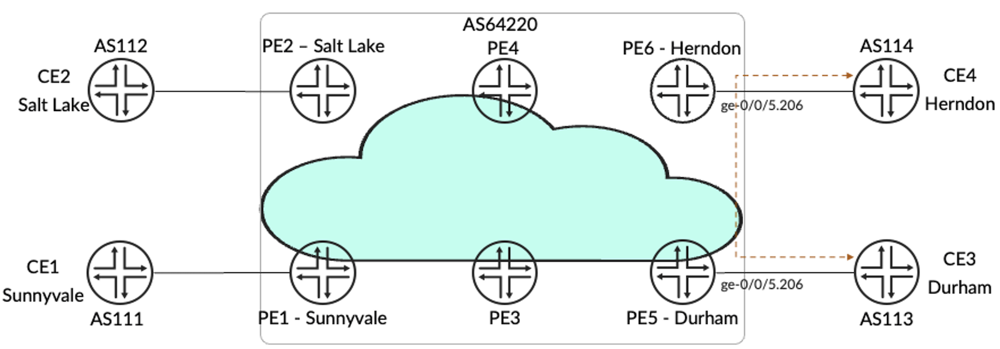

2.1. Create Service Order

Figure 13 shows the service order created on GUI. The EVPN consists of 2 sites with ge-0/0/5.206 as CE-facing interface. VPN topology can also be previewed and confirmed before order publishment.

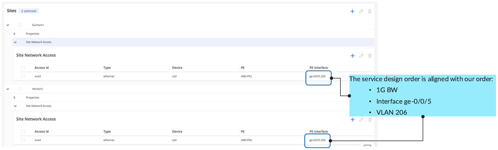

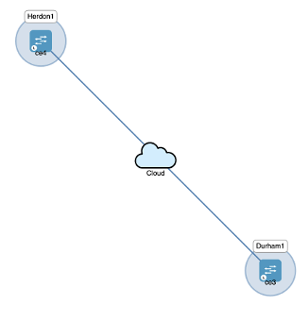

2.2. Publish Service Order

Then, we hit "Save & Provision" to publish the service order.

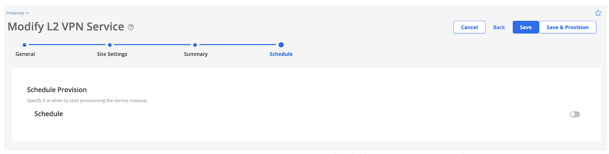

The following workflow will be triggered

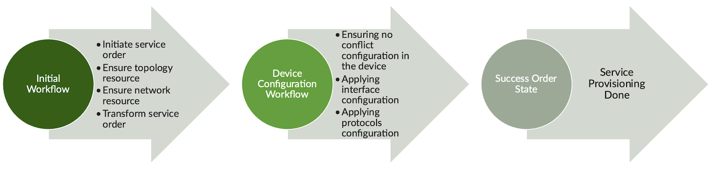

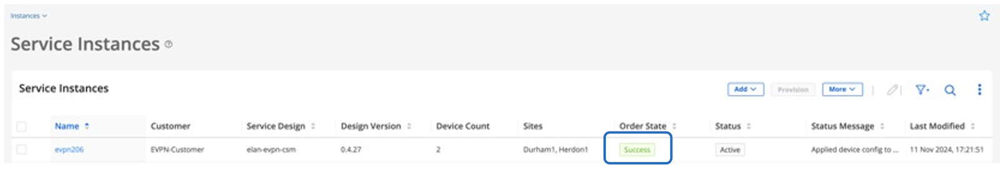

2.3. EVPN Service Provisioning Verification in Routers

PA will transform the service order into device config and push them to the routers as part of the service orchestration workflow.

**Interface configuration**

```
jcluser@vMX-PE5> show configuration groups paragon-service-orchestration interfaces ge-0/0/5   
flexible-vlan-tagging;
mtu 1500;
encapsulation flexible-ethernet-services;
unit 206 {
    encapsulation vlan-bridge;
    vlan-id 206;
    output-vlan-map swap;
}

jcluser@vMX-PE6> show configuration groups paragon-service-orchestration interfaces ge-0/0/5.206 
encapsulation vlan-bridge;
vlan-id 206;
output-vlan-map swap;
```

**EVPN routing-instance configuration**

```
jcluser@vMX-PE5> show configuration groups paragon-service-orchestration routing-instances 3e8931aa-a00e-11ef-b5c3-deba06bc9197 
instance-type evpn;
protocols {
    evpn {
        interface ge-0/0/5.206 {
            interface-mac-limit {
                100;
                packet-action drop;
            }
        }
        duplicate-mac-detection {
            detection-threshold 5;
            auto-recovery-time 2;
        }
    }
}
description "routing instance for customer EVPN-4site-Customer and instance evpn206";
vlan-id none;
no-normalization;
interface ge-0/0/5.206;
route-distinguisher 1234:2;
vrf-target target:1235:0;

jcluser@vMX-PE6> show configuration groups paragon-service-orchestration routing-instances 3e8931aa-a00e-11ef-b5c3-deba06bc9197 
instance-type evpn;
protocols {
    evpn {
        interface ge-0/0/5.206 {
            interface-mac-limit {
                100;
                packet-action drop;
            }
        }
        duplicate-mac-detection {
            detection-threshold 5;
            auto-recovery-time 2;
        }
    }
}
description "routing instance for customer EVPN-4site-Customer and instance evpn206";
vlan-id none;
no-normalization;
interface ge-0/0/5.206;
route-distinguisher 1234:3;
vrf-target target:1235:0;
```

**EVPN service routing table information**

```
jcluser@vMX-PE5> show route table 3e8931aa-a00e-11ef-b5c3-deba06bc9197.evpn.0 

3e8931aa-a00e-11ef-b5c3-deba06bc9197.evpn.0: 2 destinations, 2 routes (2 active, 0 holddown, 0 hidden)
+ = Active Route, - = Last Active, * = Both

3:1234:2::0::2.2.2.0/248 IM            
                   *[EVPN/170] 10:26:53
                       Indirect
3:1234:3::0::1.1.192.2/248 IM            
                   *[BGP/170] 10:26:50, localpref 100, from 1.1.192.2
                      AS path: I, validation-state: unverified
                    >  to 25.25.25.1 via ge-0/0/0.0, label-switched-path MPLS-MESH-from-vMX-PE5-to-vMX-PE6
                       to 23.23.23.2 via ge-0/0/2.0, label-switched-path Bypass->25.25.25.1

jcluser@vMX-PE6> show route table 3e8931aa-a00e-11ef-b5c3-deba06bc9197.evpn.0 

3e8931aa-a00e-11ef-b5c3-deba06bc9197.evpn.0: 2 destinations, 2 routes (2 active, 0 holddown, 0 hidden)
+ = Active Route, - = Last Active, * = Both

3:1234:2::0::2.2.2.0/248 IM            
                   *[BGP/170] 10:26:55, localpref 100, from 2.2.2.0
                      AS path: I, validation-state: unverified
                    >  to 25.25.25.2 via ge-0/0/0.0, label-switched-path MPLS-MESH-from-vMX-PE6-to-vMX-PE5
                       to 16.16.16.1 via ge-0/0/3.0, label-switched-path Bypass->25.25.25.2
3:1234:3::0::1.1.192.2/248 IM            
                   *[EVPN/170] 6d 04:53:59
                       Indirect
```

### 3. L2Circuit Service Orchestration

Lastly, we will demonstrate L2Circuit service orchestration. PA supports L2Circuit provisioning and map the service into LSP tunnel. Below is the business intent of the L2Circuit service.

- Service will be terminated on Sunnyvale and Herndon
- CE-facing interface from PE is ge-0/0/6
- VLAN ID: 1001
- VC-ID: 100
- Bandwidth requirement: 1Gbps

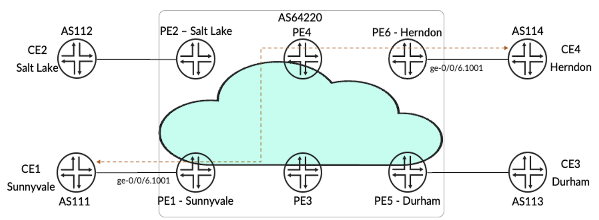

3.1. Create Service Order

Figure 20 shows the L2Circuit service order created on PA GUI. The L2Circuit consists of 2 sites with ge-0/0/6.1001 as CE-facing interface. Service topology can be previewed and confirmed before order publishment.

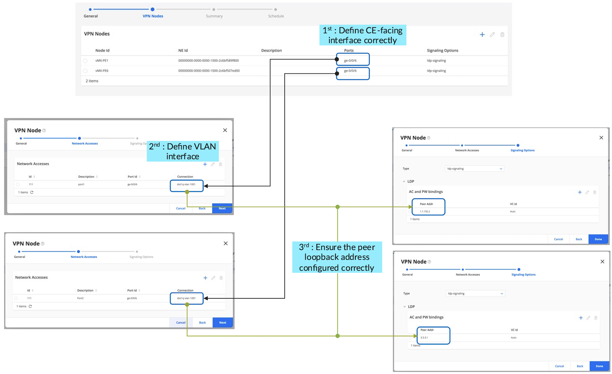

During L2Circuit service orchestration, we can also map an L2Circuit into a specific LSP via community.

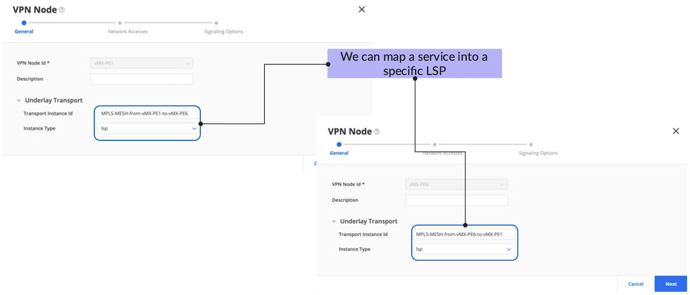

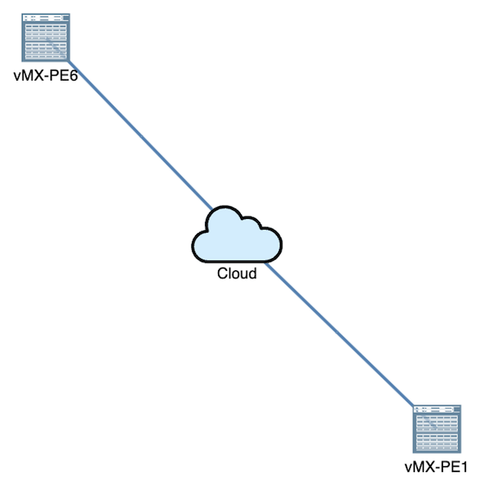

3.2. Publish Service Order

Then, we hit "Save & Provision" to publish the service order. A similar workflow as shown in Figure 16 will be triggered.

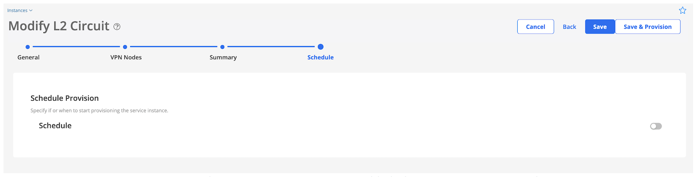

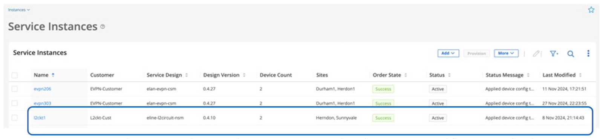

3.3. L2Circuit Service Provisioning Verification in Routers

**Interface configuration**

```
jcluser@vMX-PE1> show configuration groups paragon-service-orchestration interfaces ge-0/0/6   
flexible-vlan-tagging;
encapsulation flexible-ethernet-services;
unit 1001 {
    encapsulation vlan-ccc;
    vlan-id 1001;
    family ccc;
 filter {
            input 4b686155-9dd3-11ef-b5c3-deba06bc9197-l2ckt1-111-in;
            output 4b686155-9dd3-11ef-b5c3-deba06bc9197-l2ckt1-111-out;
}

jcluser@vMX-PE6> show configuration groups paragon-service-orchestration interfaces ge-0/0/6  
flexible-vlan-tagging;
encapsulation flexible-ethernet-services;
unit 1001 {
    encapsulation vlan-ccc;
    vlan-id 1001;
    family ccc;
 filter {
            input 4b686155-9dd3-11ef-b5c3-deba06bc9197-l2ckt1-111-in;
            output 4b686155-9dd3-11ef-b5c3-deba06bc9197-l2ckt1-111-out;
}
```

**L2Circuit protocol configuration**

```
jcluser@vMX-PE1> show configuration groups paragon-service-orchestration protocols l2circuit    
neighbor 2.2.2.1 {
    interface ge-0/0/6.1001 {
        virtual-circuit-id 100;
        community 4b686155-9dd3-11ef-b5c3-deba06bc9197-l2ckt1;

jcluser@vMX-PE6> show configuration groups paragon-service-orchestration protocols l2circuit    
neighbor 2.2.2.0 {
    interface ge-0/0/6.1001 {
        virtual-circuit-id 100;
        community 4b686155-9dd3-11ef-b5c3-deba06bc9197-l2ckt1;
```

**Service Mapping Verification**

```
jcluser@vMX-PE1> show configuration groups paragon-service-orchestration policy-options         
policy-statement 4b686155-9dd3-11ef-b5c3-deba06bc9197-l2ckt1 {
    from community 4b686155-9dd3-11ef-b5c3-deba06bc9197-l2ckt1;
    then {
        install-nexthop lsp MPLS-MESH-from-vMX-PE1-to-vMX-PE6;
    }
}
community 4b686155-9dd3-11ef-b5c3-deba06bc9197-l2ckt1 members 999:0;

jcluser@vMX-PE1> show route 1.1.192.2 table inet.3 -> PE6 loopback address   

inet.3: 5 destinations, 10 routes (5 active, 0 holddown, 0 hidden)
+ = Active Route, - = Last Active, * = Both

1.1.192.2/32       *[RSVP/7/1] 00:11:00, metric 2
                    >  to 26.26.26.2 via ge-0/0/1.0, label-switched-path MPLS-MESH-from-vMX-PE1-to-vMX-PE6
                       to 18.18.18.2 via ge-0/0/2.0, label-switched-path Bypass->26.26.26.2
                    [LDP/9] 00:11:21, metric 1
                    >  to 33.33.33.2 via ge-0/0/0.0, Push 301152
                       to 26.26.26.2 via ge-0/0/1.0, Push 301360

jcluser@vMX-PE6> show configuration groups paragon-service-orchestration policy-options         
policy-statement 4b686155-9dd3-11ef-b5c3-deba06bc9197-l2ckt1 {
    from community 4b686155-9dd3-11ef-b5c3-deba06bc9197-l2ckt1;
    then {
        install-nexthop lsp MPLS-MESH-from-vMX-PE6-to-vMX-PE1;
    }
}
community 4b686155-9dd3-11ef-b5c3-deba06bc9197-l2ckt1 members 999:0;

jcluser@vMX-PE6> show route 3.3.3.1 table inet.3 -> PE1 loopback address

inet.3: 5 destinations, 10 routes (5 active, 0 holddown, 0 hidden)
+ = Active Route, - = Last Active, * = Both

3.3.3.1/32         *[RSVP/7/1] 00:26:28, metric 2
                    >  to 22.22.22.2 via ge-0/0/2.0, label-switched-path MPLS-MESH-from-vMX-PE6-to-vMX-PE1
                       to 25.25.25.2 via ge-0/0/0.0, label-switched-path Bypass->22.22.22.2
                    [LDP/9] 00:26:35, metric 1
                    >  to 22.22.22.2 via ge-0/0/2.0, Push 300800
                       to 16.16.16.1 via ge-0/0/3.0, Push 300800
```

**L2Circuit Connection Status**

```
jcluser@vMX-PE1> show l2circuit connections 
Layer-2 Circuit Connections:

Legend for connection status (St)   
EI -- encapsulation invalid      NP -- interface h/w not present   
MM -- mtu mismatch               Dn -- down                       
EM -- encapsulation mismatch     VC-Dn -- Virtual circuit Down    
CM -- control-word mismatch      Up -- operational                
VM -- vlan id mismatch           CF -- Call admission control failure
OL -- no outgoing label          IB -- TDM incompatible bitrate 
NC -- intf encaps not CCC/TCC    TM -- TDM misconfiguration 
BK -- Backup Connection          ST -- Standby Connection
CB -- rcvd cell-bundle size bad  SP -- Static Pseudowire
LD -- local site signaled down   RS -- remote site standby
RD -- remote site signaled down  HS -- Hot-standby Connection
XX -- unknown

Legend for interface status  
Up -- operational            
Dn -- down                   
Neighbor: 1.1.192.2 
    Interface                 Type  St     Time last up          # Up trans
    ge-0/0/6.1001(vc 100)     rmt   UP     Nov 8 21:14:43 2024           1

jcluser@vMX-PE6> show l2circuit connections 
Layer-2 Circuit Connections:

Legend for connection status (St)   
EI -- encapsulation invalid      NP -- interface h/w not present   
MM -- mtu mismatch               Dn -- down                       
EM -- encapsulation mismatch     VC-Dn -- Virtual circuit Down    
CM -- control-word mismatch      Up -- operational                
VM -- vlan id mismatch           CF -- Call admission control failure
OL -- no outgoing label          IB -- TDM incompatible bitrate 
NC -- intf encaps not CCC/TCC    TM -- TDM misconfiguration 
BK -- Backup Connection          ST -- Standby Connection
CB -- rcvd cell-bundle size bad  SP -- Static Pseudowire
LD -- local site signaled down   RS -- remote site standby
RD -- remote site signaled down  HS -- Hot-standby Connection
XX -- unknown

Legend for interface status  
Up -- operational            
Dn -- down                   
Neighbor: 3.3.3.1 
    Interface                 Type  St     Time last up          # Up trans
    ge-0/0/6.1001(vc 100)     rmt   UP     Nov 8 21:14:43 2024           1
```

## Conclusion

In this TechPost, we have introduced intent-based service orchestration on Paragon Automation. L3VPN, EVPN, and L2Circuit service provisioning are demonstrated and orchestrated with complex workflows such as service design, assurance of VPN resources in the network, device configuration, and orchestration with active assurance for SLA measurement. The whole process is fully automated and only takes minutes to complete. Thanks to Paragon Automation, intent-based service orchestration reduces complexity and OpEX, accelerates time to revenue, and enhances service quality.

## Useful links

- [https://www.juniper.net/documentation/us/en/quick-start/software/juniper-paragon-automation2.2.0/pa-quick-start-guide/index.html](https://www.juniper.net/documentation/us/en/quick-start/software/juniper-paragon-automation2.2.0/pa-quick-start-guide/index.html)
- [https://blogs.juniper.net/en-us/service-provider-transformation/intent-based-service-orchestration-done-right-with-the-new-juniper-paragon-automation](https://blogs.juniper.net/en-us/service-provider-transformation/intent-based-service-orchestration-done-right-with-the-new-juniper-paragon-automation)
- [https://www.juniper.net/us/en/solutions/solution-briefs/2024/intent-based-service-orchestration-solution-brief.html](https://www.juniper.net/us/en/solutions/solution-briefs/2024/intent-based-service-orchestration-solution-brief.html)
- [https://www.juniper.net/documentation/us/en/software/paragon-automation23.1/paragon-automation-user-guide/index.html](https://www.juniper.net/documentation/us/en/software/paragon-automation23.1/paragon-automation-user-guide/index.html)
- [https://www.juniper.net/us/en/products/network-automation/paragon-automation-datasheet.html ](https://www.juniper.net/us/en/products/network-automation/paragon-automation-datasheet.html)
- [https://www.juniper.net/content/dam/www/assets/datasheets/us/en/network-automation/paragon-automation-datasheet.pdf](https://www.juniper.net/content/dam/www/assets/datasheets/us/en/network-automation/paragon-automation-datasheet.pdf)

## Glossary

- PA: Paragon Automation
- L3VPN: Layer 3 Virtual Private Network
- EVPN: Ethernet Virtual Private Network
- BGP-LS: Border Gateway Protocol -- Link State
- IGP: Interior Gateway Protocol
- GUI: Graphical User Interface
- ESI: Ethernet Segment Identifier
- LACP: Link Aggregation Control Protocol
- SLA: Service Level Assurance
- JSON: JavaScript Object Notation

## Acknowledgments

This article is written by Masagung Nugroho and Henry Cheung.

Thank you to Darshan Sreenivas for the discussion and the help with JCL Sandbox.
