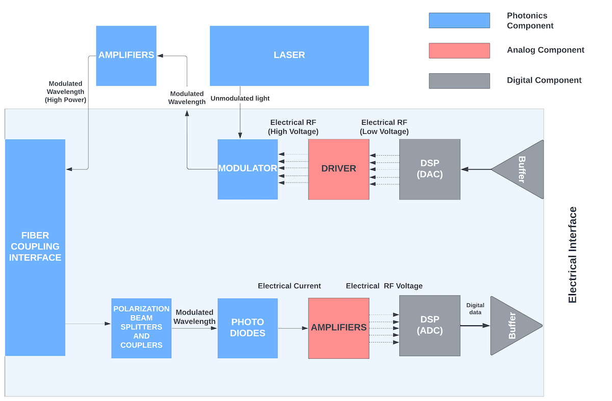
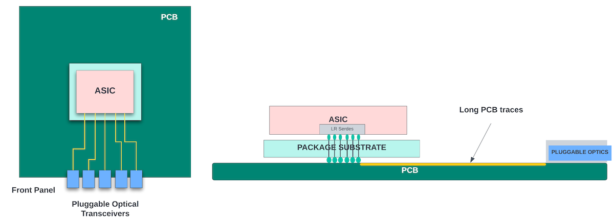
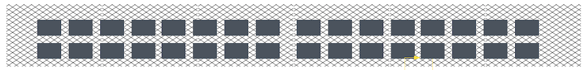
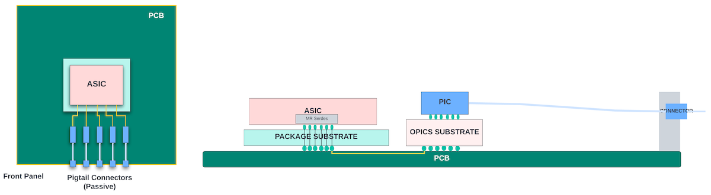
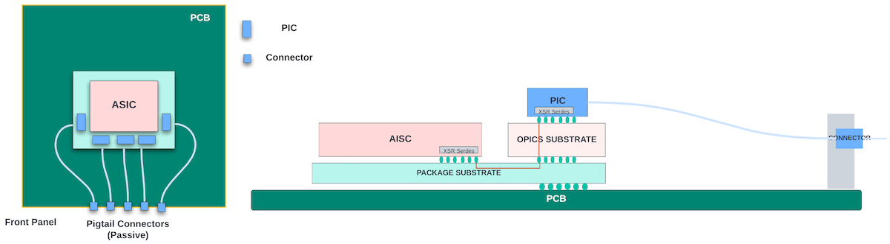

# Silicon Photonics and Integrated Optics

**Sharada Yeluri - 10/27/2022**

SiPh (Silicon Photonics) is no longer SciFi (Science Fiction). Let's see where is the industry today with co-packaged optics...

Article initially published on [LinkedIn](https://www.linkedin.com/pulse/silicon-photonics-integrated-optics-sharada-yeluri/).

## Introduction

This article explains the basic concepts of optical communication, the evolution of Silicon Photonics, how the industry is moving toward integrating optics with ASICs in co-packaged solutions, and the future...

## Optical Communication

When the network switches/routers were deployed two decades ago, they mainly used copper cables for data transmission. But copper cables, limited by the speed of electrons, are mostly suitable for lower rates. As the data rate increases, the reach of these cables decreases, with less than 3m reach for 100Gbps Ethernet links. Copper cables are mostly suitable for connecting ports within a rack like the connectivity between the host servers and the Top of Rack (TOR) switch.

Today's network devices (high-performance switches, routers, and smartNICs) support greater than 400Gbps links, and the bandwidth of these devices is almost doubling every 2-3 years. Fiber optic cables have mostly replaced the copper cables for transmitting data through these high-speed links. These cables use light instead of electrical current to carry the information. They are made of tiny strands of glass, each about the size of human hair. They carry data in the form of light pulses (infrared beams) at speeds reaching the speed of light. Fiber optic cables have superior reach (with long-range optics supporting up to 80km-120km range). They are more reliable as they use total internal reflection to carry the light pulses and are not affected by electromagnetic inference. Fiber is also more immune to temperature changes and can withstand more pressure etc. Because of this, optical cables are the obvious choice for high-speed network links.

## Pluggable Optical Transceivers (Pluggable Modules)

The fiber optic cables rely on optical transceivers at both ends to convert electrical signals to light pulses for transmission over the cable and to convert the light pulses back into electrical signals on the receive side. These transceivers are key drivers of the performance of the fiber-optic link. These are usually pluggable modules that are inserted into a network device front panel. The transceivers rely on optical components to manipulate the light to carry data over the fiber optic links. Typical components in a transceiver are as follows:

### Transmit (Electrical to Optical)

The input buffer (or re-timer) receives data from the network chip through an electrical interconnect. The data is converted into voltage through the digital to analog converter (DAC). The driver amplifies the voltage and sends it to the coherent modulator. The laser usually sits inside Transmit Optical Sub-Assembly or TOSA and emits IR beams. The modulator modulates the light emitted by the laser based on its modulated input voltage. This moduled light is amplified by the optical amplifier (and multiplexed with other channels) and sent through the coupling interface to the fiber arrays.

### Receive (Optical to Electrical)

It typically contains demultiplexers, photodiodes that convert light beams into electrical signals using photo-electric effect, and amplifiers to convert the photodiode current to voltage. After that, an analog to digital converter (ADC) converts the analog voltage to digital data, and the data is sent to an electrical interface through the output buffer (re-timer).

This is a very high-level and over-simplified description of the transceiver. The system could contain more amplifiers and additional noise-reducing electrical/analog components. Many of the analog and digital components in a traditional transceiver are arranged as discrete components on a Printed Circuit Board (PCB) with lasers and photodiodes residing outside in their own casing.

### Pros and Cons of Pluggable Optics

In a typical network device that receives data over the ethernet interface, you will see a front panel with cages or slots for pluggable optical transceivers. The network chip inside the system connects to the pluggable optics through electrical interconnects (PCB traces) on the board. Often, high-speed serdes within the chip drive data to these interconnects. These interconnects carry the data in the electrical domain and often have repeater modules on the PCB to improve signal strength before they reach the optical transceivers.

Decoupling the optical transceiver from the network chip through a pluggable interface has many advantages. It enables a switch to be built without worrying about the type of optics (speed, range) that will be connected to each port. The network operators have the flexibility to attach different cables to different ports of the switch based on the needs.

The emergence of multi-source agreements (MSAs) enabled interoperable implementations of these pluggable optical transceivers and created an ecosystem with many vendors for each type of module. Thus, avoiding single-source dependencies and driving down the costs. Pluggable optics also enable incremental deployments ('pay as you grow'), where some fraction of the ports initially remains unpopulated and additional optics are purchased and installed as the need arises. In addition, field servicing and upgrading can be performed relatively easily, as the modules are accessible from the front panel.

However, with the increased speed of these optical interfaces, the front-panel pluggable optics haven't scaled in power/cost with respect to the ASICs they transfer the data to. And the myriad of components that go into a transceiver takes up a lot of space. For greater than 800Gbps speeds, we might need a larger form factor pluggable optics (OSFP) that would take up even more area in the front panel.

The electrical interconnects that connect the serdes to font panel optical modules are often high-loss and would require power-hungry re-timers inside the optics/on the board and high-power serdes (Long Range serdes) within the ASICs - all of which consume extra power.

In the past two decades, the bandwidth of the high-end networking chips doubled approximately every 2-3 years. With this, the serdes speeds have gone up from 10Gbps (two decades ago) to 112Gbps in the current generation (to support 800GE ethernet links). 200Gbps serdes is in the horizon. Unfortunately, serdes, which are predominantly analog circuits, haven't scaled in either power or die area as much as the transistor scaling. At higher speeds, these serdes need to have PAM4 signaling, which also consumes large amounts of power. Because of this, the percentage of the total switch power consumed by the serdes continues to increase as the switch throughput increases.

Transmitting signals through serdes at rates greater than 50Gbps requires forward error correction (FEC) coding, which adds additional latency of ~100ns. While networking applications could tolerate these latencies, it negatively affects the performance of the distributed computing applications running on a cluster of HPCs that rely on electrical connectivity between the computing engines. Compared to the electrical domain, data movement in the optical domain is extremely efficient both in terms of power and latency.

In addition, traditional optical transceivers are expensive. Their transmitter and receiver sub-assemblies must be carefully constructed and sealed for protection. The manufacturing process is slow, and hard to keep up with increasing demand.

Networking, as well as the HPC systems, can immensely benefit from low-power/low-cost optical transceivers and new designs that reduce data movement in the electrical domain on the PCB.

## Evolution of Photonic Integrated Circuits (PICs)

In photonic integrated platforms, many of the optical and electrical components used to build a transceiver are packed into highly integrated chips called Photonics Integrated Circuits (PICs). Integrating all the components on a single substrate reduces the cost of building the transceiver and also reduces the power due to fewer coupling effects between the discrete optical components.

Currently, InP (Indium Phosphide) and Si (Silicon/CMOS-based) are the two mainstream integrated platforms for building PICs.

InP realizes all the optical functionalities, including light emission (lasers), transmission, modulation, and detection using the InP-based alloys. Silicon photonics uses silicon on insulator (SOI) wafers as the semiconductor substrate material, and most of the standard CMOS manufacturing processes can be applied for building the PICs.

In the InP photonics platform, due to the mature technology (decades of photonic component development went into this platform) and the superior photonic properties of the III-V materials, the lasers, optical amplifiers, and modulators perform much superior compared to the respective components in silicon photonics (SiPh) platform.

Despite the performance advantages of the fully integrated InP-based PICs, the majority of optical equipment and component vendors are investing heavily in silicon photonics. Because of this, SiPh PICs are catching up with InP in performance/cost.

The main reason to go with silicon photonics is that it takes expertise and a large up-front investment to establish an indium phosphide manufacturing facility that can deliver commercial volumes of high-performance InP-based PICs. For vendors that do not have experience with InP-based platforms and do not own an indium phosphide fab, the ability to leverage the ecosystem of CMOS foundries provides the option to bring photonic integrated circuits to market more quickly and with lower investment. In addition, existing IC manufacturing processes provide access to cutting-edge lithography, advanced automation, and better screening for defective parts. CMOS wafers are large (300mm) compared to InP wafers (~100mm) which also helps in large volume production.

The basic fabric of a typical photonic chip is the low-loss waveguide that connects various components together. In SiPh PICs, these waveguides are fabricated with Si core with silicon dioxide/silicon nitride (or various combinations of these materials) cladding to create a high refractive index medium for carrying electro-optical signals across the chip and between the various components. The SiPh waveguides provide a superior low-loss platform (much superior to InP waveguides) and enable a high-scale integration of the components for bandwidth scaling.

While the silicon photonics platform was able to design most of the optical components in smaller dimensions than the respective InP components, due to the physical properties of the Silicon, it is not able to provide integrated lasers and optical amplifiers. Because of this, many transceivers built using SiPh PICs have separate InP-based lasers and Erbium-Doped Fiber Amplifiers (EDFA). These are often co-packaged with the PIC. The InP-based laser could also be attached to the silicon photonic die through self-aligning flip-chip bumps that provide a low profile and closely coupled chip-to-laser interconnection.

While the external amplifiers and lasers do provide superior performance, the coupling optics between SiPh PIC and the laser/amplifiers outside of the PIC could have higher coupling losses.

One can argue if integrated lasers are even required. Integrating lasers inside the PIC requires very tight thermal control for the entire PIC as the lasers could fail otherwise. Nevertheless, high-quality hybrid lasers and optical amplifiers have been implemented recently by binding III-V (InP) materials on top of the silicon substrate. This heterogeneous integration takes advantage of silicon-based processing while utilizing III-V materials for light emission and amplification. But this process is complex, expensive, and is commercially available in only a few advanced photonic foundries.

Attaching the optical fibers to the PIC at the sub-micron level is also a complex process that needs special machines and additional custom steps to the production flow to verify the attachment (active alignment). Research is underway to enable direct optical connectors to the waveguides inside the PIC.

Thus, with heavy investment in research and development, researchers are finding novel ways to work around or overcome the few challenges that remain in silicon photonics integration.

## Pluggable SiPh Transceivers

With silicon photonics, the discrete components inside the optical transceiver could be replaced by a monolithic PIC to get the power, area, and cost advantages without changing the form factor of the transceiver. This enables seamless integration of silicon photonics-based pluggable transceivers in the existing systems. Even if the lasers and optical amplifiers can not be integrated together with other components, integration of the remaining photonic, analog and digital components in a single chip gives the cost and power advantages.

There is high demand for low-power transceivers inside data centers where the traffic is growing at exponential rates with new AI/ML workloads, microservices, and server disaggregation. Many optic vendors are actively investing in SiPh transceivers. Marvell is leading the pack with its acquisition of InPhi. Marvell recently announced a 400Gbps QSFP28 form factor SiPh pluggable module with an 80-120km range (ZR optics). Intel and Cisco are a few other vendors with 100Gbps/400Gbps offerings for the data center range (DR optics).

The Silicon Photonics market is projected to grow to $3-4 billion by 2025, growing at a CAGR of 23.4%, with data centers and HPC applications expected to lead the market with their demand for low-power optical transceivers.

### The Case for Co-Packaged Optics (CPO)

In a typical single rack unit (1RU) switch box, one can fit between 32 to 36 pluggable optic cages, as shown in the figure below. Because of their large size, these cages occupy most of the front panel, and the amount of airflow into the system is obstructed. Pluggable modules beyond 800G may require an even larger form factor to cope with the thermal aspects. This would further affect the front panel density.

The other major component of the system power is caused by the data movement from the ASIC to the optical module through the highly inefficient electrical medium (copper traces on the board).

On-board optics (OBO), where the optical modules can be placed on the PCB closer to the ASICs, and Co-Packaged Optics (CPO), where the optical module and the ASIC could be packaged together, are two approaches for reducing the electrical interconnect between the ASIC and the optical transceivers. Once the optics move inside the system, front panel density, as well as air flow into the system, will also improve.

With on-board optics, despite moving the optics from the front panel to the PCB, the electrical channel loss between the switch and the optical module does not improve enough for a noticeable power reduction. But, this does improve the thermal environment as the heat of all the optical modules is not concentrated on the front panel. On-board optics didn't catch momentum as the return on investment was lower.

Co-packaging the optics with the ASIC completely eliminates the data movement in the electrical domain outside of the ASIC. There are several approaches to co-packaging a network chip with optics.

In the basic approach, the network chip contains all the logic associated with the network function (switching/routing, ethernet interfaces, SERDES), while the PIC contains the optical transceiver logic. Since the network chip and the PICs are so close to each other on the same package substrate, there is very less channel insertion loss. So, the SERDES design can be simplified to get area/power advantages. XSR SERDES (extra short reach SERDES, ~50mm reach) or VSR (very short reach SERDES, ~200mm reach) are specifically designed by some vendors for this purpose.

The XSR/VSR SERDES and the very short traces inside the package significantly reduce the power required for data movement from the ASIC to the optics. Some vendors have quoted 30-50% savings in power for greater than 100Gbps serdes rates. Further, XSR/VSR serdes take up less area on the die than the LR serdes.

As the co-packaging technology advances, 3D integration where the PICs and ASIC dies could stack on top of each other could further reduce the package size and the cost.

### CPO Challenges

While co-packaging has become mainstream for high-end ASICs (switch chip co-packaged with HBM, IO chiplets, etc.), co-packaging an ASIC with a photonic chip has multiple challenges:

- *Laser Integration*: First and foremost, integrating the lasers inside the package next to a hot switch chip would require strict thermal/cooling requirements for the package else, the lasers could fail. Manufacturers often compensate for this by having redundant lasers inside the PIC - which adds to the cost/area. In addition, not all vendors have integrated laser technology. Several vendors work around this with external laser sources - where they package all the optical components in the PIC except for the laser. Removing the laser makes the package smaller and reduces the cooling requirements. But, bringing the light beams from an external laser to the PICs inside the package brings in challenges of its own where it would need additional special fibers that would add complexity to the package. Further, the external laser sources will require higher power to overcome the optical losses in the path from the laser to the PIC, reducing the overall power efficiency.
- *Loss of Flexibility*: Pluggable optical modules enable field servicing where a failed module can be replaced easily without dismantling the system. This is not possible with either on-board optics (which would need substantial board rework) or integrated optics, as removing the PIC from the package is not possible.

But, the SiPh PICs go through the same rigorous design and manufacturing flow as the silicon chips. The design process is repeatable, and there is wafer-level testing to weed-out bad dice. This reduces the defect rates to less than 30 dppm for 100G optics, and the probability of PIC failures/the need for replaceability in the field is very low.

Despite the few challenges, it is estimated that co-packaged optics with ASIC chips could save about 30% power for a ~51.2 Tbps data center switch. Power savings are more at higher throughput. As the switches move to > 100Tbps, co-packaging is probably the only way to reduce the system power dissipation and improve the front panel density.

CPO solution could also bring down the system cost as it removes the need for the optical cages and simplifies the front-panel design, and eliminates the need for discrete transceivers that need to be purchased separately.

Hybrid approaches, where some ports from the switch chips connect to the front panel optical modules through electrical interfaces and others directly attach to the fibers, could also help with migration smoother without completely removing the flexibility offered by the pluggable modules.

### Network Industry Adaptation of Co-Packaged Optics

The past few years have seen the expansion of the eco-system for integrated optics with the addition of many well-established companies and startups. There is renewed interest in this field with the explosion of data center workloads and higher bandwidth switches.

Intel demonstrated this technology a few years ago with their Tofino2 switch (12.8Tbps) in co-packaged optics. In the proof of concept demo, they sent traffic from the Tofino switch to another vendor's switch through a co-packaged optical connection from Tofino going to the pluggable optical module in the vendor system.

Currently, several startups offer optical IO chiplets to enable CPO integration with other chips. Ayar Labs is leading the effort with its OIO (optical I/O) chiplet product that is capable of 2Tbps bandwidth (eight ports, 256Gbps each). The OIO chip integrates all the optical/electrical components of the transceiver inside the PIC except for the laser. They provide a separate laser module that can supply the light source to co-packaged optics. Many optical IO vendors prefer externally mounted laser sources to address concerns about laser reliability and thermal management. Ranovus is another startup that provides optical chiplets with 100Gbps ports and with an option to have integrated lasers.

Several vendors have announced their plans to release chips with co-packaged optics. Broadcom announced two next-gen switching platforms - one with 51.2Tbps switching ASIC and the other with 25.6Tbps switching ASIC - that use co-packaged optics.

Cisco and Inphi have announced a collaboration to get the first CPO switch to the market at 51.2Tbps.

These announcements from major merchant silicon vendors in networking seem to suggest that the industry is taking this transition seriously. On the standards front, OIF and COBO have established projects to make progress on CPO standards.

There is a consensus that CPO is the way to go for reducing the cost/power of high bandwidth switching in the data centers. It remains to be seen how quickly data centers transition to these integrated optics switches. It is not the question of if but when the transition will happen. Industry analysts have predicted that the first full-scale deployment could happen in 2028 for ~200Tbps switch chips. We will have to wait and watch...

While CPO has many technological advances, it is hard to replace pluggable optical modules, which have industry-wide adaption. These modules will continue to cater to the applications in which CPO is not technically viable, such as long-haul applications (core/transport routers or data center edge). In long-haul communications, typically, optics with greater than 40km range are required, which is hard to achieve with co-packaged optical IOs, as they have tight constraints on the area and power budget for using high-power photonic components.

### Other Applications for Silicon Photonics/CPOs

Using silicon photonics to create integrated optics has applications outside of the network industry as well. For example, in autonomous driving, LiDARs (Light Detection and Ranging) are used for 3D mapping of the surrounding environment. They do this by sending short laser pulses and recording the time lapse between the outgoing light pulse and the reflected light pulse from all the surrounding objects. These systems contain many optical components and are good candidates for silicon photonics integration. Intel unveiled a SiPh lidar-on-a-chip last year. Several startups are in various stages of the development of Lidar PICs.

Optics could be integrated inside the CPU/GPU packages to provide faster interconnects in HPC systems. By bringing the optics to CPU and memory, one can improve the performance and the power efficiency of the disaggregated and distributed HPC systems to handle larger AI/ML workloads.

### Enabling Wider Adaptation

While photonics IC design leverages the existing ecosystem of silicon foundries, where many tools, processes, and simulation models can be shared between these two flows, it still is a niche field and not yet tackled widely by fabless semiconductor companies.

In order to enable wider adaptation, many EDA vendors have embraced the vision to provide process design kits (PDKs) and co-design tools that allow for seamless integration of electronic and photonic components in an IC. Recently, Synopsys and Juniper networks joined hands to offer integrated lasers, optical amplifiers, and a full suite of photonic components that will be accessible through a PDK. The continued push from foundries and EDA vendors to make the design and manufacturing widely accessible will trigger more innovation in this field.

## Summary

CPOs will see much wider industry adaptation real soon, with data centers taking the lead where switches/smartNICs, as well as the CPU/GPUs, could be co-packaged with optics for high-performance/low-power interconnect that brings in significant cost savings.

Other network applications (core/transport routing, long-haul communications) would follow the lead once the SiPh transceivers and integrated optics reach the ranges required for these applications.

With advanced PDK offerings from the EDA vendors and with standardization of the optical IO interfaces, there will be more vendors offering SiPh PIC solutions for optical interconnects and other optical functions (sensors, LiDARs, etc.), which will accelerate the adaptation of this technology across several industries.

## References

- Online articles/white papers from Cisco/Intel/Ayar/Ranovus/Broadcom/Infinera and Marvell on their co-package/SiPh offerings.
- Journal articles (EETimes, Semiconductor engineering, etc.) on COP and SiPh trends

## Glossary

- ADC: Analog to Digital Converter
- ASIC: Application Specific Integrated Circuit
- CAGR: Compound Annual Growth Rate
- CMOS: Complementary Metal Oxide Semiconductor
- COBO: Consortium for On-Board Optics
- CPO: Co-Packaged Optics
- DAC: Digital to Analog Converter
- EDA: Electronic Design Automation
- EDFA: Erbium-Doped Fiber Amplifiers
- FEC: Forward Error Correction
- HBM: High-Bandwidth Memory
- HPC: High Performance Computing
- IO: Input/Output
- InP: Indium Phosphide
- IR: InfraRed
- LiDAR: Light Detection and Ranging
- MSA: Multi-Source Agreement
- OBO: On-Board Optics
- OIF: Optical Internetworking Forum
- OIO: Optical Input/Output
- OSFP: Octal Small Form-factor Pluggable
- PAM4: Pulse Amplitude Modulation with 4 Levels
- PCB: Printed Circuit Board
- PDK: Process Design Kits
- PIC: Photonics Integrated Circuits
- SERDES : SERializer DESerializer
- Si: Silicon
- SiPh: Silicon Photonics
- SOI : Silicon on Insulator
- ToR: Top of Rack
- TOSA: Transmit Optical Sub-Assembly
- VSR: Very Short Reach (SERDES)
- XSR: eXtra Short Reach (SERDES)
