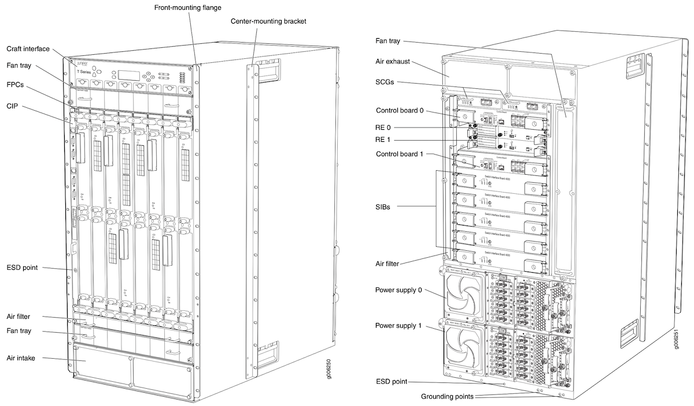
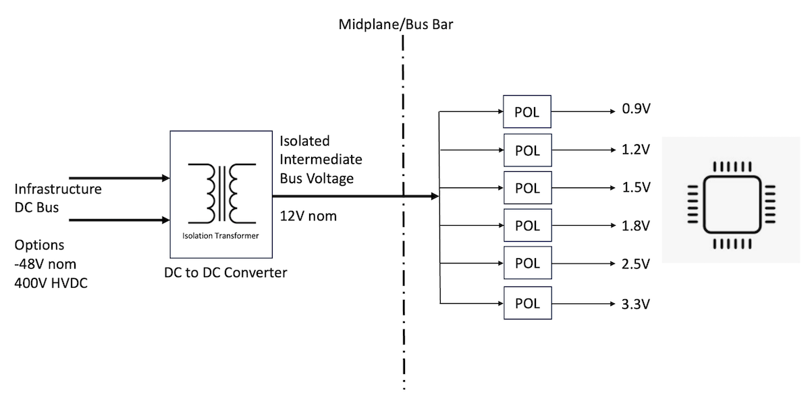
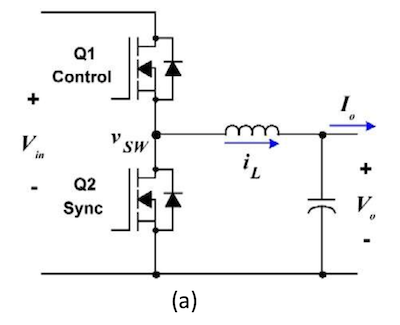
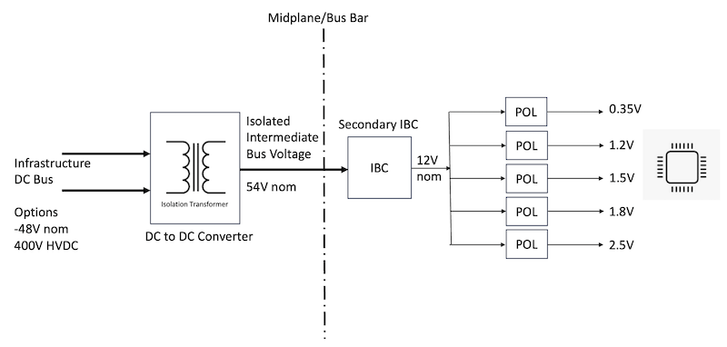
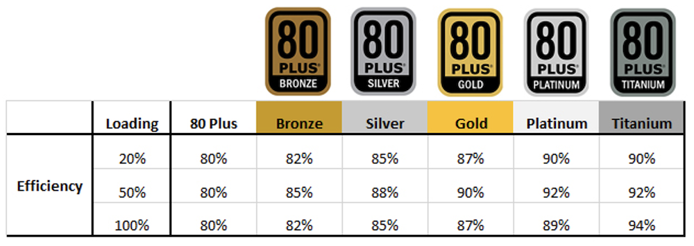
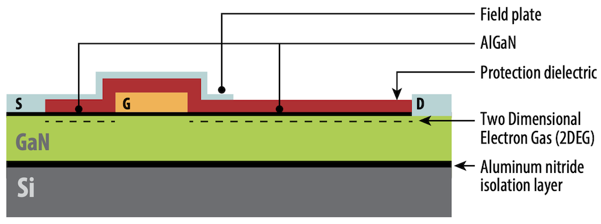
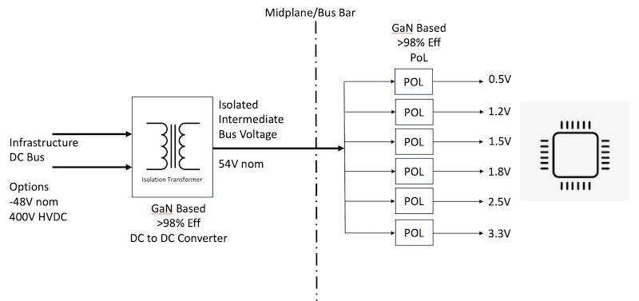
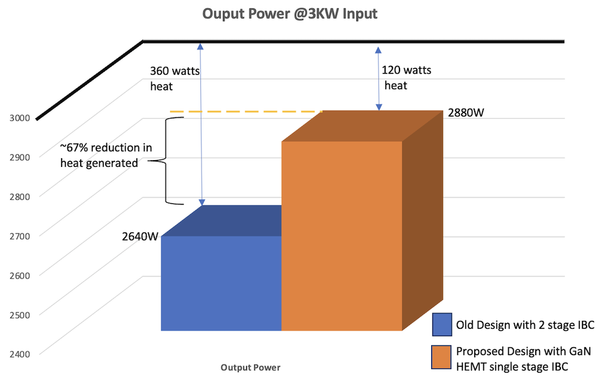

# Single Stage IBA with GaN Converters

**Sunil Mekad - 01/27/2025**

## Introduction

Power density in modern networking equipment has been exploding exponentially in recent years.  AI-driven, low latency, high bandwidth network architecture drives higher integration of front panel interconnects in data centre networking equipment. The rapid advancements in AI are fuelled by advanced GPUs, AI processors, and low latency networking silicon using the most advanced silicon process nodes at 5nm, 3nm, and rapidly on their way to 2nm.  With increasing bandwidth capacity, the power density of the networking equipment also scales. We are already seeing requirements of up to 6KW of power in a standard 2RU network switch, there has been almost 2x increase in nearly 2 years, and it continues to increase in a similar trend. These high power densities bring about challenges for power delivery in future systems. To deliver higher power to networking silicon using existing technologies or methods can cause significant **I2R** **heat losses** reducing the overall power efficiency of the system.

AC to DC Power supplies in Networking equipment have traditionally used 12V DC output. It was easier to generate all low voltages required for the networking silicon with the available vendor ecosystem. Increasing power density using 12V as the intermediate bus voltage is becoming more challenging.  The power delivery channel has now to support high current (>500A @12V). This significantly increases the cost and complexity of the design, also adding losses caused by the heating of the copper, from the source to the load. A few data centre equipment makers are already moving to 54V as the intermediate bus voltage to reduce the need to carry high current and to reduce I2R loss.

With new process nodes, the core voltage required for networking silicon has gone down: 3nm process nodes use <0.75V. There are not many efficient ways to generate these low voltages from higher 54V intermediate buses, especially when current requirements are above 600A (in steady state) for this high-power networking silicon. It requires an additional stage of DC-DC converter before the load to reduce the voltage down to 12V.

A new architecture needs to be developed to generate low core voltages from higher 54V and still meet the high-current, high-efficiency requirements of modern networking devices. It will eliminate the need for 12V Intermediate Bus voltage, delivering high current from power supplies directly to Point-of-Load at 54V and simplifying the design of the power delivery channel. Such a design can improve the power efficiency of the power delivery network by as much as 10%, with significant cost reduction too (~15%). Lower power consumption, reduced heat losses, and reduced infrastructure cooling costs also translate into a diminution of the global carbon footprint of the networking equipment.

## Legacy Architectures for Power Delivery

In the 1990s, the only voltage required for telecommunication equipment was -48V DC delivered by AC/DC rectifiers and backup batteries. Depending on the charge holdup in the batteries, the DC voltage delivered to the networking device could vary anywhere between -40V DC to -72V DC. The equipment was expected to handle these wide input voltages.

At that time, a typical implementation of networking equipment (shown below) would have many components enclosed in a large chassis. The front of the chassis will house the Flexible Port Concentrators (FPCs or Line cards) supporting various networking ports required for the line-side interconnects. The rear of the chassis could have fabric interconnects connecting these various line cards with high-speed interconnects. There could be other modules also in the front and the rear of the chassis, required for control, management, and indication of the chassis state.

These networking equipment also had power entry modules that converted the available -48V Telecom voltage (-40V to -72V DC) to a rectified -48V DC,  delivered to the various components of the chassis via a backplane or bus-bar (a mechanical copper structure used to deliver current). The line cards and the different components of the chassis are used to derive their power from this backplane or bus-bar.  This type of power delivery architecture is called the Distributed Power Architecture.

With improvements in power electronics and analog integrated circuit (IC) designs, vendors migrated to a more cost-effective Intermediate Bus Architecture (IBA) [2][3][4]. In this architecture, the front end is an AC to DC or a DC to DC power supply that generates isolated voltage output (5V to 14V output) which is then fed to the various components of the chassis. The downstream Point-of-load (PoL) devices on each of these components further generate low-level voltages (0.9V to 3.3V) required for the rest of the digital subsystem and high-powered ICs.

The figure below shows a typical IBA architecture.

The above architecture had many advantages w.r.t the earlier distributed power architecture:

- The cost of the overpower delivery channel was lower. The isolation to the telecom voltage happened at the front-end DC-DC rectifiers, unlike centralized bus architecture where isolation was required at every FRU. This allowed usage of non-isolated DC-DC PoL in the systems thus making the design simpler and cost effective.
- Since isolated voltages were routed on the midplane/bus-bar, the safety challenges w.r.t routing high-power telecom power to the different components of the chassis were no longer present. This could further reduce the cost of the power delivery channel and improve safety.
- The voltage regulation requirement for the Intermediate Bus voltage could be relaxed as the voltages for the digital ICs were generated from the downstream PoLs which could be more efficient.
- Overall efficiency of the system was better than the older design.

Due to these obvious advantages, since the early 2000s, this architecture gained prevalence and has been the primary design methodology. Over the years, there have been a few variations like the Hybrid approach offering isolated 54V for PoE applications. But most applications stuck with this design.

In the last few years, however, the power density in data and communication systems has increased many folds. This has prompted designers to move from a 12V intermediate voltage to a higher 48V or even 54V intermediate voltage to reduce the copper losses associated with the power delivery channel. By increasing the rated voltage, for a given power, the current required to be transferred on the same channel reduces (Power = Voltage * Current).

As the process technology advances from 5nm to 3nm, then to 2nm, silicon designs require tighter voltage accuracy and lower operating voltages. The silicon data sheet may specify the voltage tolerance as a percentage or value in millivolts, which includes DC, AC, and ripple variations over the entire operating temperature range. Any voltage outside this range is not recommended, and the silicon can behave unexpectedly. Additionally, some design headroom is needed to accommodate the Power Distribution Network (PDN) characteristics like the trace impedance of the PCB, the dynamic response of the load, and the crosstalk or coupling from other switching planes in the design. As a result, many designers want this headroom to make sure that the actual solution is within the margins of the silicon.

Since newer processors have much lower core voltages, duty-cycle limitations make it difficult to regulate a sub-1V core rail with a 54V input while switching at a higher frequency (such as 1 MHz or above) to maintain a small form factor.

As shown in *Equation 1*, for example, to regulate 0.9 V from a 54-V input, the minimum controllable on-time must be lower than 17 ns when switching at 1 MHz to avoid pulse skipping. Pulse skipping causes output ripple violations in the design and an unstable control loop of the converter.

`Equation 1 : ON Time of MOSFET  TON = (1 / fsw) * Vout/Vin = 16.67nsec`

Where/

- fsw = DC/DC Switching Frequency i.e. 1MHz
- Vout = Output Voltage i.e. 0.9V
- Vin = Input voltage i.e. 54V

![High side FET ON, (c) Low side FET ON [5]](images/picture6.png)

It is very hard to achieve such low TON times with standard enhancement type MOSFETs. In order to meet the max Turn ON times of the traditional MOSFETs, the design needs to implement a secondary bus voltage that converts 54V to either 5V or 12V. Lowering the voltages to downstream PoL solves the pulse-skipping problem and is more suitable for powering newer low-voltage silicon designs.

While this solves the problem of stability and output ripple for last-stage PoL devices, an additional bus conversion stage however impacts the efficiency of the overall system. In the absence of faster switching MOSFET technology, this was a trade-off required to meet the stringent voltage and current regulation requirements of modern silicon architectures.

### Challenges with Secondary Voltage Conversion

The power requirements of the modern silicon architectures are high, for example, 5nm process-based networking designs that can support >52Tbps of bandwidth are in the range of 800-900 watts. With additional interface power for 400G coherent optics in the range of 23 watts each, system power can easily add up to 3KW / 2RU in current systems. With future technologies increasing the power density >3KW the efficiency loss in the existing power delivery architecture with losses in primary and secondary IBC can be a cause of concern.

We can calculate the efficiency of the current architecture with dual IBC stages. The primary voltage conversion happens at the AC/DC or DC-DC conversion stage i.e. the front-end power supplies. The most efficient off-the-shelf front-end power supplies today are titanium-rated supplies that can provide efficiencies of up to 94%.

On the secondary IBC stage, a typical 54V to 12V IBC stage can provide a 96% efficient conversion ratio, finally, the last mile PoL can be as high as 98% efficient. However, assuming an ideal case of lossless PDB, the overall efficiency of the system is a product of all the efficiencies of the power conversion stages. For this example, the best case power delivery network efficiency could be 88%,  with a 3000 watts input power, we will end up wasting ~345 watts as heat alone! This does not consider the losses due to system design like PCB, interconnects, "swiss-cheese" effect [6].

As we can clearly see an ideal case loss in the network could be as high as 12-14%, actual losses in the Power Delivery Networks with current architecture are even higher, hence there is a clear need to look into newer architectures that could help in reducing losses for future high-density networking types of equipment.

## Impact on Energy Efficiency and Sustainability Requirements

Today, the energy efficiency of networking equipment is measured in Energy Efficiency Rating (EER). The EER is a metric generally defined as a functional unit divided by the energy used. Various types of equipment have their own EER definitions, for routers and network switches, ITU-T defines the metric as :

`Equation 2: EER = Total weighted throughput of the system (in Mbits/s) / Weighted power` [7]

The EER of the networking switch improves with every new generation as the bandwidth or throughput of the system doubles while the non-proportional increase in the power of the equipment. As a result, the inefficiency or the loss due to the heat generation of the PDN is not highlighted. This however has a direct impact on the Power Usage Effectiveness of a Data Centre (PUE).

As per the Green Grid [8], the Power Usage Effectiveness of a data centre is given as:

`Equation 3: PUE = Total Facility Power / Total IT equipment Power`

Improving the energy efficiency of the IT equipment has a direct impact on the power consumed both related to absolute power provided and cooling cost of the infrastructure. Empirically on a simplistic scale, the savings from the efficiency improvement can be calculated as follows

`Equation 4:  Total Facility power saving = Psav + (Psav/ etacooling)`

Where

- Psav = Total saving in power due to PDN improvement
- etacooling = Cooling efficiency of the Data Centre facility

## Proposed Solution

With the recent advancements in power semiconductor design and mass availability of wide bandgap materials like Gallium Nitride (GaN), newer transistor designs can be enabled that allow much higher switching frequencies for DC-DC converter designs thus replacing traditional MOSFETs.

A native GaN transistor has a depletion-mode gate, meaning it has a "normally on" characteristic, making it unsuitable for power electronic applications by itself. By adding a P-type gate, however, the threshold voltage is increased from a negative to a positive voltage, thus making an enhancement-mode ("normally off") transistor, these transistors are called GaN High Electron Mobility Transistors (GaN HEMT).

The GaN High Electron Mobility Transistor (HEMT) is a planar device with lateral current flow, compared to a Si SJ MOSFET in which the current flow is predominantly vertical. A cross-section is shown below.

The starting point is a Si substrate, which is used because of its mature supply infrastructure and low cost. Transition layers are then epitaxially grown onto the Si substrate to provide a better match between the crystal lattice and thermal expansion coefficient differences between Si and GaN. Following the transition layers, additional layers of GaN, AlGaN, and p-doped GaN are deposited and etched to create the structure seen. Finally, metallization and passivation layers are added to complete the transistor structure. [10]

The conduction path between the drain and source contacts is the so-called Two-Dimensional Electron Gas (2DEG) that is formed at the heterojunction between the GaN and AlGaN layers (shown in dotted line in Figure 1). The 2DEG is enhanced or depleted by the potential difference between the gate and the 2DEG below it. This is how the transistor is turned on and off. The p-gate raises the potential high enough to make the device have a positive threshold voltage and therefore operate in enhancement mode ("normally off"). Otherwise, the device would be "normally on" and require a negative bias to remain off, which is not preferred for power electronic applications. [10]

GaN-based HEMTs can be used for high efficiency (>98%), fast switching (>1MHz) DC-DC converters. Many research papers and bulletins have demonstrated the capability of 99% efficient DC-DC converters using GaN-HEMT [11][12][13].

Our proposed solution is to use these advancements in technologies to design highly efficient front-end DC-DC or AC-DC converters for a 54V isolated intermediate voltage bus that feeds into downstream PoLs. The PoL are also designed with high-efficiency GaN-HEMT with switching frequencies of fsw = ~10MHz allowing higher Vout to Vin bandgap without the issues of pulse skipping and output ripple violations.

High efficiency in power converters means less power wasted, which implies a reduction in heat sink requirement, thereby small in size and less in weight. At higher switching frequency the added benefit of a smaller footprint and higher efficiency will allow significant cost reduction in terms of PCB real estate and lower losses.

Taking our earlier example of a 3000W power system, let us calculate the power saving of such a design with a conservative assumption of first-stage power efficiency of 97% and second-stage power efficiency of 99%. The total effective efficiency of such a system will be 96% which is a 9% improvement in efficiency.

For 3000W, we will have a reduction of 67% in power loss which will translate into a lower cooling budget and operational cost.

## Conclusion

The proposed solution of single-stage IBA using GaN-HEMT-based high-efficiency DC-DC converters will deliver an estimated improvement of 9% in efficiency which could directly translate into lower operational cost and better Power Usage Effectiveness of a Data Centre. This also lowers the carbon footprint of the networking equipment leading to sustainable eco-friendly designs.

## References

- [1] T4000 Core Router Hardware Guide: [https://www.juniper.net/documentation/en_US/release-independent/junos/information-products/pathway-pages/t-series/t4000/index.pdf](https://www.juniper.net/documentation/en_US/release-independent/junos/information-products/pathway-pages/t-series/t4000/index.pdf)
- [2] D. Morrison, "Distributed power moves to intermediate-bus voltage," Electronic Design, pp. 55--62, Sept. 16, 2002: [https://www.electronicdesign.com/technologies/industrial/boards/article/21751083/distributed-power-moves-to-intermediate-voltage-bus](https://www.electronicdesign.com/technologies/industrial/boards/article/21751083/distributed-power-moves-to-intermediate-voltage-bus)
- [3] R. White, "Emerging on-board power architectures," in Proc. Applied Power Electronics 2003 Conf., Miami Beach, FL, U.S., Vol. 2, pp. 799--804: [https://ieeexplore.ieee.org/document/1179308](https://ieeexplore.ieee.org/document/1179308)
- [4]  F.M. Mills, "An alternative power architecture for next-generation systems" in Proc. 4th International Power Electronics and Motion Control Conf., Xian, China, 2004, pp. 67--72:
- [5] "Common mistakes in DC/DC Converters and how to fix them"- 2018 Texas Instruments Power Supply Design Seminar SEM2300, TI Literature Number: SLUP384: [https://www.ti.com/video/series/common-mistakes-in-dc-dc-converters-and-how-to-fix-them.html](https://www.ti.com/video/series/common-mistakes-in-dc-dc-converters-and-how-to-fix-them.html)
- [6] Jin Zhao, "A review of PCB-level power delivery system" Figure-3: [https://www.cadence.com/content/dam/cadence-www/global/en_US/documents/tools/ic-package-design-analysis/sigrity-resources/sigrity-review-pcb-level-power-delivery-system-ar.pdf](https://www.cadence.com/content/dam/cadence-www/global/en_US/documents/tools/ic-package-design-analysis/sigrity-resources/sigrity-review-pcb-level-power-delivery-system-ar.pdf)
- [7] ITU-T L.1310 "Energy efficiency metrics and measurement methods for telecommunication equipment": [https://www.itu.int/rec/T-REC-L.1310/en](https://www.itu.int/rec/T-REC-L.1310/en)
- [8] PUE -- A comprehensive examination of the metric: [https://datacenters.lbl.gov/sites/default/files/WP49-PUE%20A%20Comprehensive%20Examination%20of%20the%20Metric_v6.pdf](https://datacenters.lbl.gov/sites/default/files/WP49-PUE%20A%20Comprehensive%20Examination%20of%20the%20Metric_v6.pdf)
- [9] EPC Technology Brief TB001, "Enhancement Mode GaN Technology": [https://epc-co.com/epc/Portals/0/epc/documents/articles/epc_egan_fet_product_brief.pdf](https://epc-co.com/epc/Portals/0/epc/documents/articles/epc_egan_fet_product_brief.pdf)
- [10] Eric Persson, Infineon AN201702, "CoolGaNTM Applicate Note": [https://www.mouser.com/pdfdocs/ApplicationNote_CoolGaN_600V.pdf](https://www.mouser.com/pdfdocs/ApplicationNote_CoolGaN_600V.pdf)
- [11] Michael Ebli; Martin Wattenberg; Martin Pfost,  IEEE Xplore: 27 June 2016 "A High-Efficiency Bidirectional GaN-HEMT DC/DC Converter": [https://ieeexplore.ieee.org/document/7499360](https://ieeexplore.ieee.org/document/7499360)
- [12] Stefan Moench; Kareem Mansour; Richard Reiner & Others, IEEE Xplore: 19 August 2022, "A GaN-based DC-DC Converter with Zero Voltage Switching and Hysteretic Current Control for 99% Efficient Bidirectional Charging of Electrocaloric Capacitive Loads": [https://ieeexplore.ieee.org/document/9862274](https://ieeexplore.ieee.org/document/9862274)
- [13] Rakesh Ramachandran, PhD Thesis 2016, University of Southern Denmark "Ultra-high Efficiency DC-DC Converter using GaN Devices": [https://findresearcher.sdu.dk/ws/portalfiles/portal/173411433/Rakesh_Thesis_Final_updated.pdf](https://findresearcher.sdu.dk/ws/portalfiles/portal/173411433/Rakesh_Thesis_Final_updated.pdf)

## Glossary

- 2DEG: Two-Dimensional Electron Gas
- AlGaN: Aluminium gallium nitride
- EER: Energy Efficiency Rating
- FPC: Flexible PIC Concentrator
- FRU: Field Replaceable Unit
- GaN: Gallium Nitride
- GPU: Graphical Processing Unit
- HEMT: High Electron Mobility Transistor
- IBA: Intermediate Bus Architecture
- IBC: Intermediate Bus Converter
- IC: Integrated Circuit
- I2R: Energy Loss
- MOSFET: Metal-Oxide Semiconductor Field-Effect Transistor
- MOSFET TON: MOSFET Time On
- PDN: Power Distribution Network
- PoL: Point of Load
- PUE: Power Usage Effectiveness
