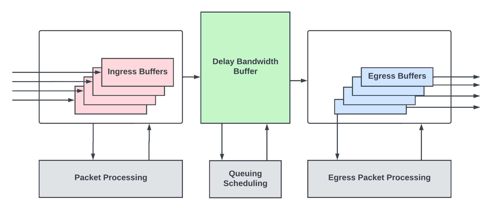
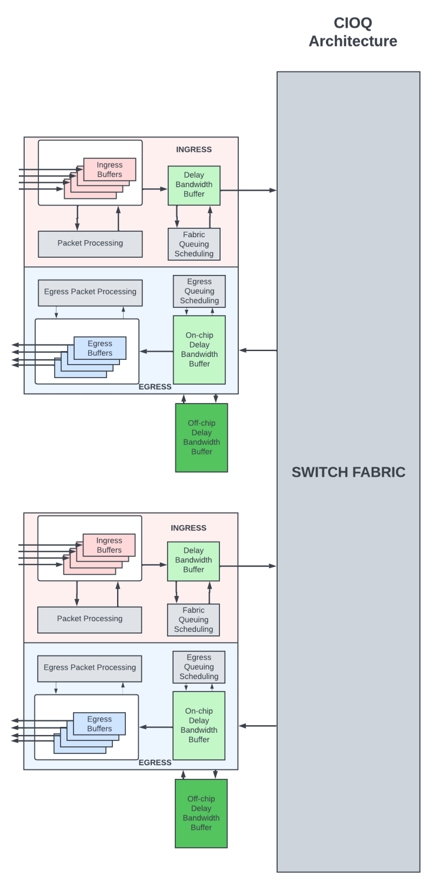
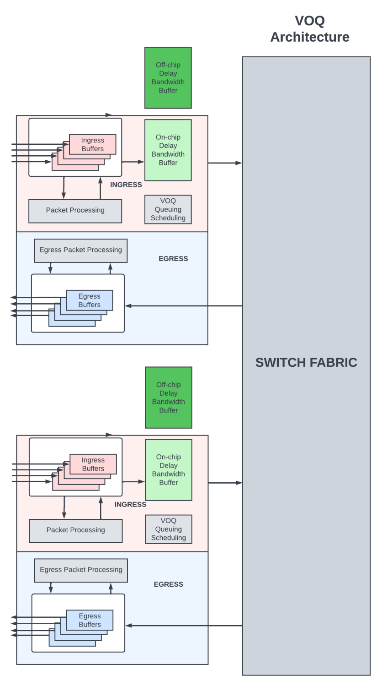
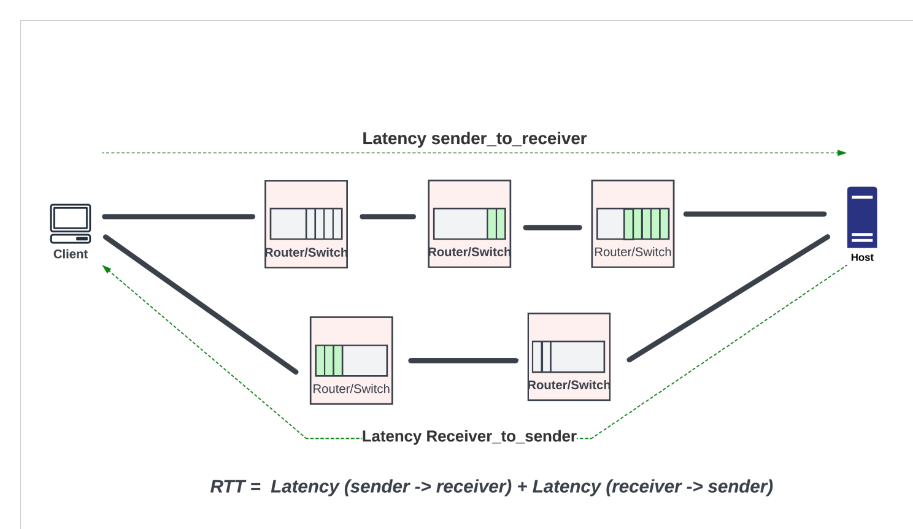
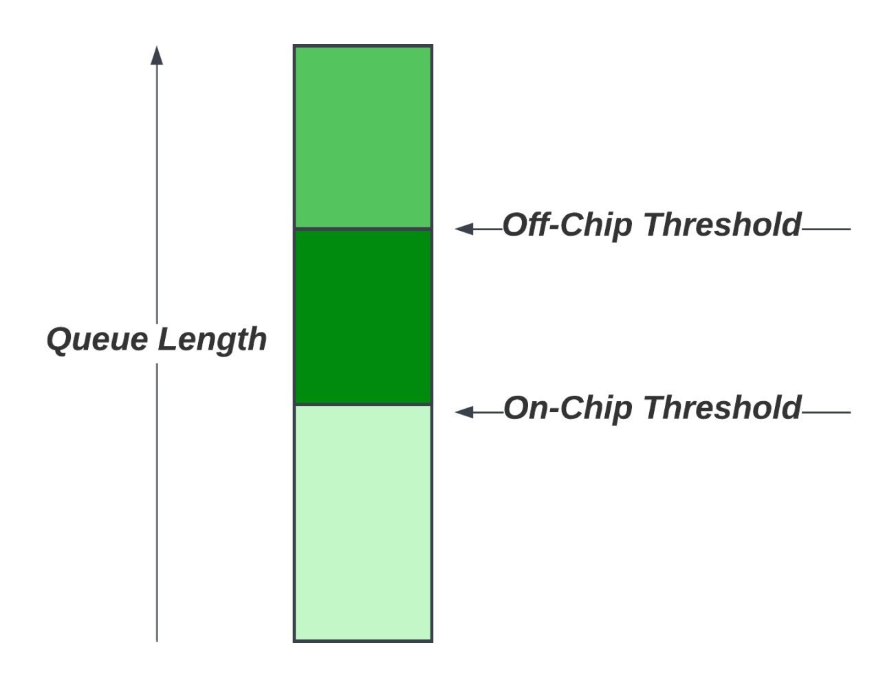
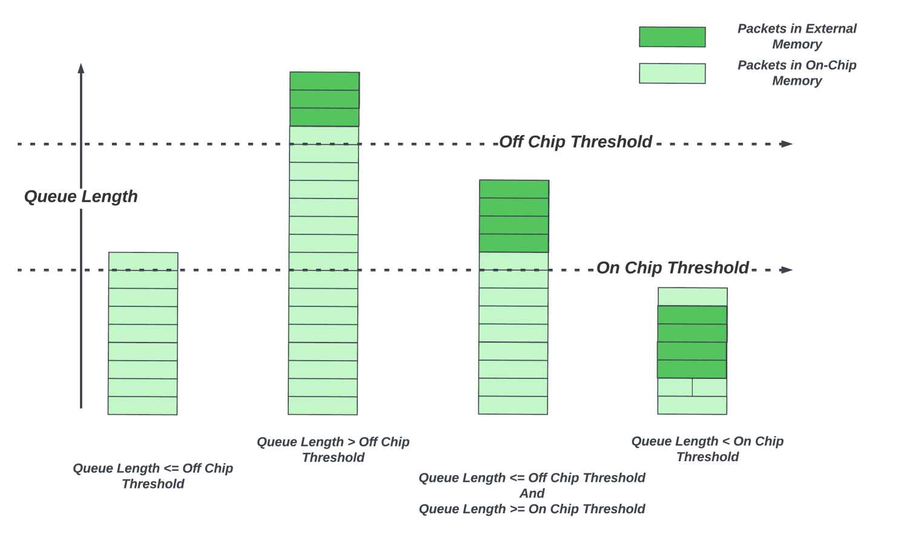

# Sizing Router Buffers - Small is the New Big

**Sharada Yeluri - 02/22/2023**

Current practices and future trends on  buffers in networking chips.

Article initially published on [LinkedIn](https://www.linkedin.com/pulse/sizing-router-buffers-small-new-big-sharada-yeluri/).

## Introduction

This article explores the history and evolution of packet buffering in high-end routers. Buffers are essential in routers and switches to prevent data loss during periods of network congestion. The proper sizing of these buffers is a highly debated issue in both academia and industry.

This article provides an overview of the current practices and future trends.

## Buffers in Networking Chips

In a typical routing/switch ASIC, you will find three kinds of packet buffers.

## Ingress Buffers

Ingress buffers hold onto the incoming packets from the input links while the packet heads (typically the first 128-256 Bytes of the packet) are processed by the packet processing logic. This processing logic inspects the various protocol headers in the packet head to compute the nexthop, the next router/networking device the packet needs to go to reach the final destination. It then assigns an egress queue/priority for the packet and determines the egress output link from which the packet must exit. Packet processing logic is also responsible for many more functions which are not relevant to this discussion.

Packets reside in the ingress buffers for a bounded time until the processing is complete. Packet processing pipeline latencies are typically well-bounded and in the order of 1-2 microseconds in fixed pipeline architectures. Even with flexible processing engines like the Trio silicon of the MX series, typical packet processing (IP forwarding) latencies are in the orders of 8-10 microseconds. Ingress buffers are sized to hold onto the packet contents while the packet heads are being processed.

A networking chip's performance is measured by how many bits per second of traffic it can process at a line rate without dropping the packets and the minimum packet size for meeting this rate.

Although the minimum size of an IP packet on an ethernet link can be as low as 64Bytes, many networking chips take typical network loads into account and design their packet processing pipelines to meet performance for packets much larger than 64B packets - effectively reducing the packet per second through the chip. By doing so, packet processing logic could be optimized to save the area and power consumption of the chip. While the typical workloads have average packet sizes greater than 350B (like the Internet Mix pattern described in Wikipedia), there could be transient bursts of small packets (typically the control packets that keep the networks alive or syn/ack packets of TCP protocol) that could oversubscribe the packet processing logic, as they are not designed to handle such high packet per second rates. The term oversubscription in networking silicon terminology means that a resource/logic is seeing more load than it can handle. The ingress buffers absorb packet bursts during the transient periods of packet processing oversubscription. When these buffers get full, they do priority-aware drops to make sure the critical control packets are sent to packet processing pipelines before the rest of the traffic.

## Delay-Bandwidth Buffers (DBB)

After the packet processing is done and the nexthop for the packet is determined, the packets typically enter a deep buffer, often called delay-bandwidth buffer or packet buffer. The naming convention for this buffer varies from vendor to vendor. This buffer provides buffering during periods of transient congestion through the network where some or all output links of the router are oversubscribed, with more packets trying to go out of those links than the links can handle.

Network congestion happens when traffic flowing through the network exceeds the maximum capacity of the network. There are many reasons for congestion. There might be intentional oversubscription in the network for system cost reduction. This results in periods of time where traffic exceeds the capacity when some users utilize more bandwidth than the average allocated bandwidth. Multicast/broadcast traffic could also cause congestion when multiple hosts start traffic to each other. When some interfaces go down at the endpoints, and the traffic needs to be distributed to the remaining interfaces, it could cause congestion in upstream network devices until those interfaces are brought up again. User errors like misconfigured networks could result in congestion until those are fixed. Even in a perfectly designed network, due to the burstiness of the applications and the user traffic, there could be periods of time when some routers/switches see traffic exceeding their link capacity.

During periods of congestion, a router might see that some or all of its output links are oversubscribed, with traffic destined for those links exceeding the capacity of the link. In extreme cases of congestion, all input traffic might want to leave through a single output. While prolonged congestion due to misconfiguration or hardware faults needs to be root-caused and repaired, having packet buffers in router chips to absorb transient congestion helps overall network health and throughput.

These buffers also compensate for the propagation delay inherent in any end-to-end congestion control algorithms when the endpoints of the network react to congestion events coarsely. I will talk more about the congestion control algorithms in the subsequent sections.

## Egress Buffers

During network congestion, a router needs to make sure that the high-priority traffic and other control traffic do not incur packet loss. And the Quality of Service (QoS) is met for different subscribers at different priority levels. Routers/high-end switches have sophisticated queueing and scheduling subsystems that maintain different queues inside the delay-bandwidth buffers for different flows. The scheduler meters out the traffic from these buffers to the shallow egress buffers at the output port interfaces at a rate not exceeding the link capacity of that interface.

These egress buffers are sized just enough to hide the round trip latency between the delay-bandwidth buffer to the output interface so that traffic can go out of the output interfaces without burstiness and without underrunning in the middle of the packets.

A large-scale router could be built using multiple modular routing chips interconnected through the switch fabric. I will use the term packet forwarding entity (PFE) to refer to these modular routing chips.

In combined input/output (CIOQ) architecture, the packets are buffered both on the ingress PFE as well as the egress PFE (PFE from which the packets exit the router). The shallow ingress delay-bandwidth buffers hold onto the packets if there is transient congestion within the router to move packets from ingress to egress through the switch fabric. The delay-bandwidth buffers at the egress PFE are the deep buffers where the packets are queued for longer periods of time during network congestion.

In Virtual Output Queue (VOQ) architecture, all the delay-bandwidth buffering is done in the ingress PFE. Here, the packets are queued in virtual output queues at the ingress PFE. A VOQ uniquely corresponds to the final PFE/output link/output queue from which the packet needs to depart. Packets move from the ingress PFE to the egress PFE by a sophisticated scheduler at the egress, which pulls in packets from an ingress PFE only when it is able to schedule the packet out of its output links. In VOQ architecture, packets destined for an output queue could be buffered in several ingress PFEs in their VOQs.

## Sizing the Packet Buffers

### The Two Camps

There are two camps when it comes to packet buffer sizing in networking switches and routers. The camps led by many academics believe that buffers are, in general, bloated! They have published numerous papers with mathematical analyses to prove their point.

Then there are data center (DC) network operators, who take a conservative approach and demand generous buffering to not cause packet drops for any of the flows going through their routers/switches - especially for highly distributed cloud/data mining applications. In big data applications, hundreds of servers processing queries could send large bursts of traffic to a single server that aggregates the responses from all the flows. This incast causes transient congestion scenarios that could last tens of milliseconds. It is important to not drop traffic in these scenarios, as any traffic loss could result in long completion times for those applications. Storage applications inside DC are also very sensitive to packet loss. In general, the traffic in modern data centers is bimodal and consists of short-lived and low-rate "mice" flows and long-lived, and high-rate "elephant" flows. The majority of flows (80-90%) are mice flows, but only 10-15% of the data traffic load is carried by them. The remaining 90% traffic load is carried by a small number of elephant flows. Elephant flows correspond to large data transfers, such as backups, and require high throughput. Mice flows are latency-sensitive and consist of queries and control messages, and require minimal to no packet loss to avoid degradation of overall application performance. DC operators prefer larger buffers to avoid packet loss for mice flows as dynamically differentiating mice and elephant flows in a queue is not supported in many traditional switches.

Internet service providers have different requirements when it comes to buffering, as the main focus of their routers is to switch high volumes of data as quickly as possible and meet the service level agreements (SLAs) for high-priority traffic like video/voice calls, protocol traffic, etc. They prefer to keep their expensive/high-capacity WAN links as highly utilized as possible to keep the equipment cost low. The probability of packet loss is more with heavily utilized links. So they demand enough buffering in the routers to differentiate between best-effort traffic that could tolerate packet loss and high-priority traffic that must be delivered with close to zero traffic loss.

Buffer sizing has been a hot topic for the last two decades. With routing chips packing more bandwidth with single die/packages and memories not scaling as much as the logic with process node advances, providing generous buffering has become more and more expensive.

The trend across the industry, regardless of the application (switching/routing), is to minimize buffering as much as possible without adversely affecting QoS. And rely heavily on traffic engineering, advanced end-to-end congestion control algorithms, and active queue management (AQM) to notify congestion to the endpoints early and to keep the links saturated with small delay-bandwidth buffers.

## Congestion Control Algorithms

Congestion control algorithms work with protocols that are closed-loop, where the receiver sends back information to the sender about the packets it received. TCP/IP is one such popular protocol suite. More than 80% of the data transmission on the internet happens using TCP/IP protocol suite. Refer to Wikipedia or the many online articles to learn more about this protocol suite. TCP (Transmission Control Protocol) is an L4 protocol standard used by endpoints (servers/clients) to establish and maintain a network connection or flow by which higher-layer applications in these endpoints can transmit data reliably. Many higher-layer applications like HTTP, FTP, streaming media, and emails use TCP. TCP works with IP, which is a layer three protocol that routers and switches use to forward packets.

TCP is a connection-oriented protocol. A connection needs to be established between the sender and receiver before data transmission can happen. At a helicopter level, TCP accepts data from a data stream of the application layer, divides it into chunks, and adds a TCP header creating a TCP segment. The TCP segment is then encapsulated into an IP datagram and transmitted over the network to the endpoint. TCP header contains many fields that help in establishing and maintaining the connection and detect missing segments for retransmission and congestion control. One of the fields is the sequence number. TCP stamps each byte of the data stream with an incrementing sequence number. When sending a segment, it sends the sequence number of the first byte of the data in that segment. The receiver uses the sequence number to put together the TCP segments received out of order. For every segment received, the receiver sends an acknowledgment (ACK) that indicates the next segment it is expecting from the sender. A missing ACK indicates packet loss in the network or network congestion. The sender uses this information to reduce the transmission rate and also to retransmit the missing segments.

Since the inception of TCP/IP, many congestion control algorithms have been developed that help endpoints modulate the data transmission rate into the network during periods of congestion. These algorithms rely on changing the congestion window size, which is the number of TCP segments the sender can send without waiting for an acknowledgment in response to network congestion.

### Round-Trip Time (RTT)

Understanding Round-Trip-Time (RTT) is critical for buffer sizing and for developing congestion control algorithms. RTT is the round-trip time it takes for a packet to travel from the sender to the receiver and for the acknowledgment to travel back to the sender. RTT is a function of the physical span of the network (the total length of the fiber optic/DAC cables in the path), the delay through the network devices, and the endpoint delays, which usually include the delays through the software stack to extract the data and send to upper layer protocols.

RTT varies widely depending on where the endpoints are and how congested are the network devices in the path. For example, within a data center, the RTT is well within 30-50 microseconds. In WAN and core networks with long-haul optics and many routers between the endpoints, RTTs are in the order of tens of milliseconds range for endpoints within the US. The majority of the RTT is dominated by delays through optical cables. For example, the distance between New York to SFO is around 4000 Km. If the light were to go uninterrupted on a single fiber and back between these two endpoints, it would take ~40 milliseconds on the fiber alone. In real life, the packets would have to go through multiple routers in between, with latencies of the routers adding to the RTT. For inter-continental traffic, RTT increases further, reaching 200 - 300 milliseconds.

The endpoints of a TCP flow avoid congestion with slow_start followed by congestion avoidance mode. Here algorithms like additive increase and multiplicative decrease (AIMD), which stabilize fairly in the presence of multiple TCP flows, can be used.

In the slow_start, the sender increases the size of the congestion window by allowing an extra TCP segment to be sent for every ACK received. The congestion window starts small and grows exponentially, increasing by the max segment size (MSS) with each ACK, resulting in a rapid increase in the window size until the window size reaches a threshold. At this point, it enters the congestion avoidance phase. In this phase, the congestion window size increases by one MSS for every RTT (linear increase). In this phase, if congestion is detected by means of packet loss, then the sender drops the congestion window by half (transmission rate halved) and starts all over again.

### Active Queue Management

If the router waits until its delay-bandwidth buffer is full before dropping the packets, before the sender gets a chance to respond to the packet loss, more traffic that is already inside the network would come to the already full queues and cause massive tail drops. Tail drops are bad. Almost universally, all switches/routers with deep packet buffers support weighted random early drops (WRED) to notify the congestion early to the sender. WRED prevents a queue from completely filling up by dropping packets probabilistically even before the queue is full by using a WRED curve.

Several routers and DC switches also support explicit congestion notification (ECN). In ECN, as the router experiences congestion, as seen by increased delay inside the router, it probabilistically marks some packets as "congestion experienced" and forwards them as is. The traffic class field of the IP headers is used for ECN marking. When the endpoint receives these packets with ECN bits set, they echo the congestion back to the sender while sending ACK. Sender uses this information to reduce the transmission rate into the network.

While ECN helps to reduce congestion without the packet loss associated with WRED, it has several limitations. If the network experiences a high rate of packet loss, ECN may not work well, as packets that are marked could also be lost, and the congestion information may not be accurately conveyed. ECN is relatively new. If different ECN implementations use different marking algorithms or respond differently to congestion, there may be interoperability issues that hinder the effectiveness of the mechanism. These days, ECN is mainly deployed in tightly controlled data center networks where it is easier to enforce a uniform end-to-end ECN protocol implementation.

In the past decade, some vendors have integrated advanced AQM techniques that can do flow-aware early discards - like distinguishing mice flows from elephant flows within a queue (based on the input traffic rates) and preventing mice flows from being dropped by adjusting the queue lengths of the different flows dynamically.

## Rule-of-Thumb Buffer Sizing

The key to sizing the delay-bandwidth buffer inside a router ASIC is to make sure that the buffer does not go empty when the senders pause or reduce the traffic going into the network in response to network congestion. Here the buffer acts as a reservoir to keep the links busy when the sender reduces the window size in response to the congestion. If the buffer goes empty, the output links of the routers are not fully utilized, and it is not desirable.

The popular rule of thumb used until the early part of the last decade is that a router with an aggregate port speed of ***C*** (in units of bits per second) carrying flows that have the round trip time of ***RTT*** would need a buffer that is equivalent to ***RTT * C*** in order to keep their output links busy. This is called delay-bandwidth product (DBP) or bandwidth-delay product (BDP). This rule was widely used in early routers when the total capacity of the routers was less than a few hundred gigabits per second.

For example, in Juniper's first generation PTX routers with Paradise chipsets, the PFE with 400Gbps port density provided 4GByte of packet buffering in the external memory. This could cover 80ms of RTT, plenty for the majority of the core router applications.

This model of sizing the buffer to the delay bandwidth product works well with a few long-lived TCP flows between two endpoints and a single router experiencing a bottleneck. The authors of the rule claimed that the same general rule applies even with multiple dominant/long-lived TCP flows, as synchronization could occur across the many long-lived TCP flows.

### Limitations of the Rule-of-Thumb Buffer Sizing

This rule of thumb buffer sizing does not scale well with current-generation routers with terabits per second of aggregate port bandwidth. For example, a 14.4Tbps routing chip with 100 milliseconds of RTT would need 144GB of delay bandwidth buffering. This is an insanely large buffer to fit in either the on-chip or the external memory!

These days, HBM memories are widely used for packet buffering due to their high density and bandwidth. The next-generation HBM3 can provide 24GByte total capacity per part. To realize 144GB of packet buffering, we would need 6 of these HBM3 parts. It is hard to make room on the die edges for six HBM3 interfaces, even with the largest reticle-sized dies, as most of the edges (or beachfront, as we call it) would be taken up by the serdes needed for high-speed WAN links. As a result, the router chips have to make a compromise between the port density and the delay bandwidth buffering provided.

### Updated Theoretical Buffer Sizing

Routers typically carry thousands of flows, each with vastly different RTTs (as the endpoints of these flows could be different), and these flows are rarely synchronized. Rule-of-thumb buffer sizing does not apply in these cases. There is ample research on buffer sizing in the presence of many flows.

SIGGCOM paper published in 2004 by Stanford researchers claimed that with ***N*** long-lived desynchronized flows, the buffering needed is only ***C*RTT(min)/sqrt(N)*** to keep the links busy. What it means is that the more the number of long-lived flows, the less the buffering. For example, using the math above, when 10,000 long-lived flows are passing through a 14.4Tbps router, you would only need 1.44GB of DBB. This is more than achievable with a combination of on-chip and external memory. The authors also concluded that in short-lived flows (flows that end while still in the slow_start phase) or not TCP flows, where congestion control algorithms do not have an effect, the size of the delay bandwidth buffer is directly proportional to the loading on the router links and the length of the flows and it is smaller than ***C * RTT_min/sqrt(N)*********

Subsequent research papers by other researchers also found that buffer sizing depends on the output/input capacity ratio and how saturable the links are. For example, if DC operators can afford to run their links slightly underutilized by adding more switches in their scale-out architecture, then the buffering requirements in these chips could go down significantly.

Even though these papers were published decades ago, service providers and network silicon vendors were not ready to embrace the results and reduce the buffering in their devices until they were out of choices in the late last few years, when memories stopped scaling with process node advances. The reason for hesitancy is that it is hard to pin down the value of ***N***, which varies widely across the time interval depending on the customer traffic and applications run on these routers.

The academic papers generally do not take into account real-world traffic scenarios since they rely on synthetic traffic and tightly controlled lab setups. Most papers also consider brief periods of packet loss or link underutilization as acceptable behavior. Unfortunately, many applications can't run well in the presence of packet drops. These applications need deeper buffers, in the order of tens of milliseconds, to buffer the loss-sensitive traffic during periods of congestion. Thus sizing the buffers is a complex decision, and one equation does not fit all applications!

### Modern Routers and Oversubscribed Buffers

As I mentioned in the previous section, high-end routing silicon vendors have a hard choice to make, balancing between the switching and the buffering capacity within a die/package.

They could entirely depend on on-chip SRAMs for delay bandwidth buffering. But, on-chip SRAMs have not scaled as much as the logic with process node advances. For example, in the advanced 3nm process, 256MB of memory and the controller can take up 15-20% of the reticle-sized die. At 7.2Tbps traffic, this translates to about 35 microseconds of DBB. High-bandwidth switches in data centers, with RTTs of less than 50 microseconds for most of the flows, could benefit from on-chip buffering.

For high-bandwidth routing chips that support thousands of queues with different QoS properties and RTTs (in tens of milliseconds) and with frequent transient congestion events, 50 microseconds does not work. These routing chips have two choices:

They could rely entirely on external memory like HBM for delay-bandwidth buffering. But, if every packet needs to make the trip to the HBM and back, for a 14.4Tbps routing chip, we would need enough HBM interfaces to support 14.4 Tbps of read and write bandwidth. Even with the HBM3 technology with 6.5Tbps per part, this translates to six HBM3 parts per package. It is hard to provide so many HBM interfaces from the core die to the HBM parts, and equally impossible to pack so many HBM parts in a 2.5D package. Also, external memory latencies are large, which can increase the queueing delays through the router significantly.

Thus, many high-end routing ASICs have started using hybrid buffering approaches where the delay bandwidth buffering is spread between on-chip memory and the external memory. Packets are buffered in the on-chip delay-bandwidth buffer in their respective queues. The queueing subsystem monitors the queue lengths for each of the queues. When a queue exceeds a configurable threshold, new packets arriving for that queue are sent to the external memory. As the packets are dequeued from a queue, and when the queue is no longer congested, with an arrival rate lower than the dequeue rate, queue length reduces. When the queue length goes below the on-chip threshold, new packets for that queue stay on-chip! These architectures provision only a fraction of the total bandwidth to go to the external memory - thus reducing the number of external memory interfaces to the die.

Why is this sufficient? Although thousands of flows might traverse a router, many do not experience sustained congestion - thanks to the advanced congestion control algorithms and smarter network management that spreads the network traffic evenly. Small transient congestion events could be absorbed by the on-chip buffer alone. Only a small fraction of the queues experience sustained congestion. These queues could benefit from the deep buffers as they grow.

The next generation 24GByte HBM3 part with a bandwidth of 6.5Tbps could provide a delay-bandwidth buffering of ~70 milliseconds for approximately 2.5Tbps of output links. Assuming no more than 25% of the traffic is congested at any point in time, one external memory part would be enough for a 10Tbps routing ASIC. And 75 milliseconds RTT is plenty for traffic within the US for the few congested flows.

## Building a Hybrid Buffering System

There are many challenges to building a hybrid buffer subsystem in the routing chip that can efficiently use the on-chip and external memory delay-bandwidth buffering and meet all the QoS requirements.

### Shared On-chip Memory

It is highly desirable to make the on-chip portion of the delay-bandwidth buffer memory fully shared by all input and output links, as there could be congestion scenarios where packets coming from all input ports might want to leave from a few output ports. In those situations, letting these queues take up most of the buffer to avoid packet drops is desirable.

For a 14.4Tbps router with 144 100G ports, it is a challenge to give simultaneous access to the shared delay-bandwidth buffer for all these ports. Many high-end architectures use two techniques to make these buffer designs more feasible. Using wide data buses allow packets from multiple 100G ports to share the same wide interface to the shared buffer. The shared buffer itself is statically partitioned into many banks, and the packets are broken into smaller chunks and sprayed across the banks to distribute the reads/writes across the many memories and reduce hot banking. A side effect of this is that different chunks of the same packets are written and read out of order from these banks. Control logic outside of the buffer needs to put these transactions back in order before presenting them to downstream blocks.

A shared delay-bandwidth buffer also presents unique physical design challenges - with wide buses between the clients and memory banks that need to be carefully floor planned and routed. Without proper placement of the memory and route planning, the overhead of the wiring congestion could be as high as 50% of the memory area.

Some vendors take the central shared buffer approach even further by sharing the same set of on-chip memory banks between delay-bandwidth buffers and the egress buffers. This allows flexible partition of the memory for different use cases of the chip.

### External Memory Oversubscription Management

With oversubscribed external memory, sophisticated algorithms are needed to decide when a queue moves to the off-chip delay-bandwidth buffer. Each output queue could be assigned a configured profile that tells how much the queue can fill up on-chip before moving to the external memory. But, if the algorithm makes an independent decision for each output queue based on its queue length alone, in periods of extreme congestion on multiple output links, it could decide to send a much larger fraction of the incoming traffic to off-chip than what the external memory interfaces can handle. This would result in undesirable drops at the pipe feeding to the external memory. This adds additional complexity to the buffer management logic, which needs to carefully plan off-chip movements across congested queues.

### Allocation of On-chip Buffers Across the Queues

In business edge applications, thousands of flows could be active in a given interval. Provisioning identical queue thresholds (how much a queue is allowed to grow on-chip before it moves to external memory) is not desirable due to limited on-chip buffering. These chip architectures must provide the flexibility for network operators to pick a "profile" for each queue they configure. But, the actual traffic through the configured queue could vary significantly from the provisioned rate, which results in inefficient use of the buffer space and resources. Advanced architectures invest heavily in algorithms that dynamically adjust hybrid queue lengths and off-chip thresholds based on the real-time queue draining rates to make efficient use of the delay-bandwidth buffers. Some vendors also implement advanced algorithms to differentiate between elephant and mice flows dynamically and prevent mice flows from dropping packets by adjusting the buffer allocation for these flows.

### Packet Jitter

A router shall not reorder packets within a flow. But, if the queue moves between on-chip and external memory, due to the hundreds of cycles of extra latency incurred when reading from the external memory, it requires extra logic to prefetch contents from external memory and keep the ordering requirements between the packets in the queue. This prefetch adds additional buffer area to the egress buffers.

Despite all the challenges in implementation, the hybrid approach is probably the only approach that works for high-capacity routing chips with current process node/memory and packaging technologies. High-end routing chip vendors continue to invest in advanced algorithms to make use of the limited memory resources on the chip and limited bandwidth to the external memory efficiently.

## Future

On the silicon front, with the latest advances in 3D packages, it is possible to stack up multiple dies (a mix of logic and memory dies) on top of each other using hybrid bonding. When layers of memory dies are stacked on top of the logic die, the logic die gets much higher data throughput from the memories as the interconnection from the memory to logic can use the entire surface area of the die. Currently, this technology is mainly used by CPU chips targeting the HPC. It would not be too long before high-end networking chip vendors start using this technology to increase both the bandwidth and the capacity of the delay-bandwidth buffers to keep up with the increased port capacity aggregated within a core.

On the congestion control front, the past few decades have seen many advances, with over 20+ congestion control and active queue management (AQM) algorithms to date. Delay-based algorithms, where the sender modulates the traffic going into the network by closely monitoring the round-trip-delays of the flows, have become popular. FQ-CoDel/PIE are two such AQM algorithms targeting the buffer bloat. TCP BBRv2 (developed by Google) builds the model of the network in real-time to adjust the sending rate dynamically. These algorithms can also pace the bandwidth more evenly compared to the bursts created by the traditional packet loss-based algorithms and help alleviate congestion in large networks. There is ongoing work in academia and industry to improve the performance, efficiency, and fairness of congestion control algorithms in large networks with varied flows. Machine Learning based network models that learn real-time congestion scenarios are under development as well. Any congestion that is consistently alleviated by the endpoints could reduce the buffer requirements in the routers.

Thus, advancements in hybrid buffering and active queue management techniques, cutting-edge 3D packaging technologies, and improvements in congestion control algorithms will allow high-end routing chips to double their bandwidth every 2 to 3 years without any trade-offs!

### Note

Due to lack of space (the blog is already 23-min read), I am not covering all the congestion control and AQM algorithms in this blog. That is an extensive topic. Similarly, I could not go deeper into VOQ architecture. VOQ architecture is embraced by all the high-end networking chip vendors, as it provides no head-of-line blocking and requires less memory bandwidth. It does come with its own set of challenges. That is the topic for my next article.

## References

- Sizing router buffers by Guido Appenzeller, Isaac Keslassy, and Nick McKeown- ACM SIGGCOM 2004
- Updating the Theory of Buffer Sizing by Bruce Spang, Serhat Arslan, and Nick Mckeown
- Open source articles/white papers from a few network chip vendors

## Glossary

- ACK: Acknowledgement
- AIMD: Additive Increase and Multiplicative Decrease
- AQM: Active Queue Management
- BBR: Bottleneck Bandwidth and Round-trip (propagation time)
- DBB: Delay-Bandwidth Buffers
- CIOQ: Combined Input/Output Queueing
- DAC: Direct Attached Copper (Cable)
- ECN: Explicit Congestion Notification
- HBM: High-Bandwidth Memory
- HPC: High Performance Computing
- MSS: Maximum Segment Size
- PFE: Packet Forwarding Engine
- QoS: Quality of Service
- RTT: Round-Trip Time
- SLA: Service Level Agreements
- SRAM: Static Random Access Memory
- TCP: Transmission Control Protocol
- VOQ: Virtual Output Queue
- WRED: Weighted Random Early Drop
