# SP-style Config in Apstra Freeform for VLAN Overlap Use-Cases

**Elisabeth Rodrigues - 03/25/2024**

In high multi-tenant environments such as Service Providers, Hosting Providers, or just large enterprises, having to deal with multiple internal customers, efficient utilization of infrastructure is top of mind for network operations teams. While ensuring isolation and security among different users or departments, you also want to leverage network virtualization techniques to support full overlap of resources between those users. This not only speeds up the onboarding process for new customers, and companies you acquire, but it also preserves your infrastructure investment allowing you to deliver more with the same network infrastructure.

## Introduction

This blog post describes the steps of implementing multi-tenancy in an EVPN-VxLAN data center fabric. We will delve into the intricacies of control-plane and data-plane details and how they are combined to fulfill layer 2 and layer 3 overlap. We will then use Apstra Freeform to design and deploy such a network.

The term "Multi-tenancy" applying to a broad range of domains, this blog post focuses on the resources overlap. What is outside of the scope of this post is the Multi-tenancy concept related to the user management part and any permission enforcement, in other words, the management plane. For that, watch out for an upcoming blog post for new capabilities coming soon on Juniper Apstra.

### Refresher on EVPN VxLAN

EVPN supports multiple service interface types. Depending on the service interface defined, either all traffic on an interface, or traffic on a specific VLAN, or traffic on a list/range of VLANs can be mapped to a Bridge Domain (BD). That Bridge Domain is then associated with an EVPN instance (EVI) for forwarding VxLAN-encapsulated traffic across the IP fabric. An EVPN instance represents an L2 VPN instance on a switch, also known as a MAC-VRF in Junos implementation.

How does the segregation happen at the Control-plane vs. Data-plane level?

- Control-plane separation: depending on the EVPN service interface defined, EVIs are assigned import/export Route Targets (RTs) and Route Distinguisher (RD).
- Data-plane separation: VNI field of the VxLAN header is used during packet lookup to place onto the right Bridge-Domain/VLAN.

The L3 EVPN instance serves the same role as an IP VPN (VRF), but in this case is an EVPN VRF, sometimes referred to as Type-5 VRF due to the EVPN Type-5 routes. This ensures L3 overlap. What we would like to do is to push this further by also leveraging EVPN for L2 overlap.

A MAC-VRF or EVI can offer 3 types of service interface types:

- VLAN-based: Single VLAN broadcast domain and single bridge domain. Every VLAN-id is mapped to one Bridge Domain, mapped to one VNI, and one has its own route-target.
- VLAN-aware: Multiple VLAN broadcast domains with each VLAN having its own bridge domain. Every VLAN is mapped to one VNI and can have its own route-target. This is the preferred option for most enterprises.
- VLAN-bundle: Multiple VLAN broadcast domains sharing a single bridge domain, MAC addresses must be unique. All VLAN-ids are mapped to the same VNI and the same route-target. The VLAN-id is encapsulated in the VXLAN packet. This option helps to overlap the VLAN-ids but also to deliver a higher VLAN scale. This is a typical option for hosting companies.

### What does Apstra Datacenter Reference Design Support?

On Juniper fabrics, Apstra Datacenter reference design configures EVPN VXLAN with multiple EVPN VRFs and a single MAC-VRF of service interface type VLAN-aware. The Junos configuration style used is "Enterprise Style".

Enterprise Style vs SP Style with Junos ?

Enterprise style is simpler and needs less configuration.

Here is an example of an interface with multiple VLANs using enterprise-style :

```
interfaces ae1 unit 0 { 
   family ethernet-switching {
       interface-mode trunk;
       vlan {
           members [ vn100 vn200 ];
       }
   }
```

SP Style Offers greater flexibility but requires more configuration steps.

Here is the same example using SP-Style :

```
interfaces ae1 unit 0 { 
flexible-vlan-tagging;
encapsulation flexible-ethernet-services;
unit 100 {
    vlan-id 100;
}
unit 200 {
    vlan-id 200;
}
```

On top of that, each logical interface must be added to the appropriate bridge-domain.

## Challenges of a Multi-Tenant Datacenter and How We Solve Them?

When you run a highly multi-tenant environment such as a shared EVPN-VxLAN fabric hosting several customers with the goal to offer each of them as much flexibility as possible, you often have to deal with L2 and L3 overlap. Let's dissect each one of them.

### L3 Overlap

This happens when the tenants use the same IP space.

Solution: this can be easily solved using EVPN T5 VRFs. Each tenant will have one or multiple VRFs ensuring IP subnet uniqueness and avoiding any duplicate.

### L2 Overlap

This happens when the tenants use the same VLAN-id space.

We can distinguish 2 use cases:

- There is no need for VLAN-id overlap at the leaf level. This can be easily addressed with the Apstra Datacenter reference design. In that case, each virtual network is assigned a different VNI and the VLAN-id association is configured for each leaf.
- There is a need for VLAN-id overlap at the leaf level. There are several ways to address it:

We can use Configlets in the Datacenter Reference design to push additional configurations based on the Junos functionality called "VLAN Rewrite".  This additional configuration allows you to define translation rules where a given VLAN ID is rewritten to use another VLAN ID. It is a simple configlet, and represents a good solution for a temporary use, typically during a migration time.
We can use SP-Style configuration.
- Level 3 multi-tenancy : each tenant is separated by a L3 domain.

## Example Description

This example utilizes Apstra release 4.2.1

Apstra is the Single Source of Truth.

In this example, ESXi-110 and ESXi-114 use the same vlan-id but belong to different tenants and must be encapsulated in different VNIs.

Here is the lab topology:

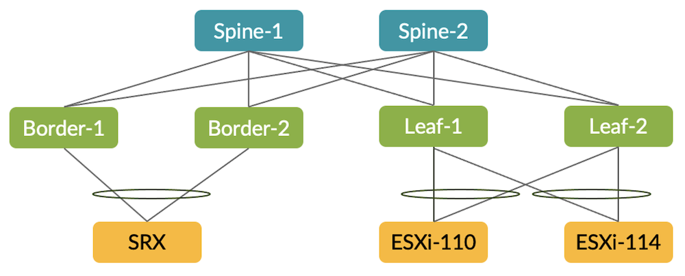

## Network Design With the Topology Editor

Create a new Freeform blueprint and design the topology with the topology editor:

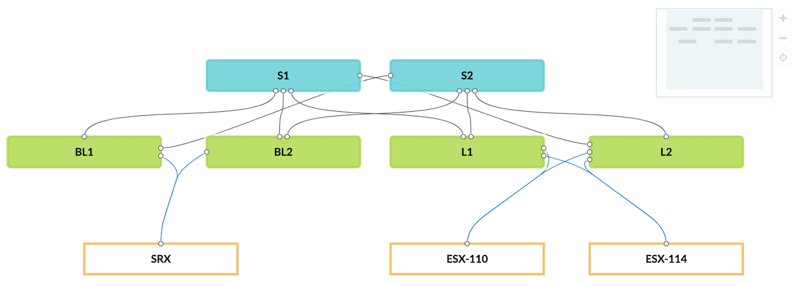

Identify the spines with a tag:

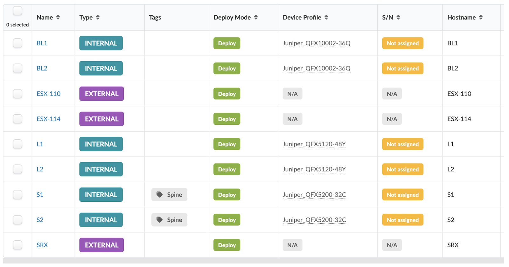

## Resource Management

Create the following resources in the resource menu and allocate them in the blueprint.

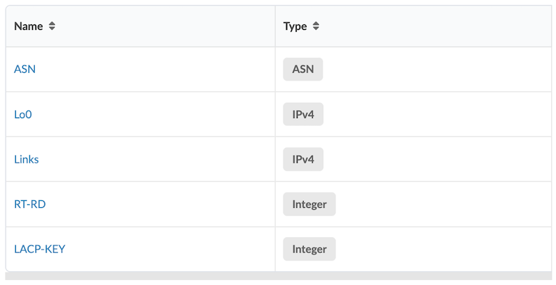

In the Resource Management Menu, Blueprint Resources, create a group named Cloud.

### ASN Allocation

Allocate an ASN to each managed device, all spines, all leaves, and border leaves.

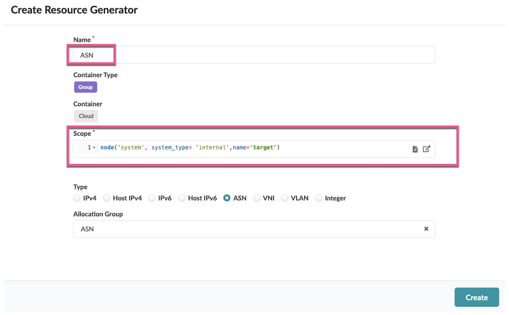

The result is the following.

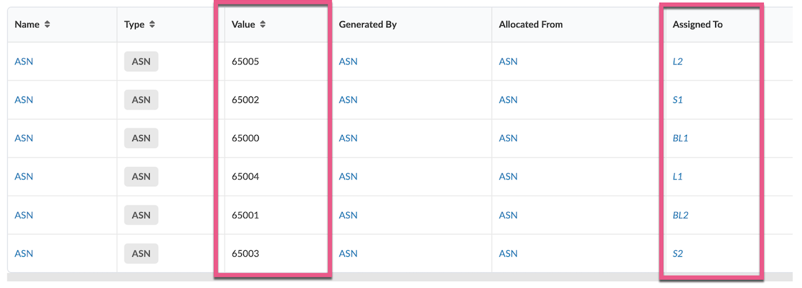

### Loopback Allocation

Allocate a loopback IP to each managed device, all spines, all leaves, and border leaves.

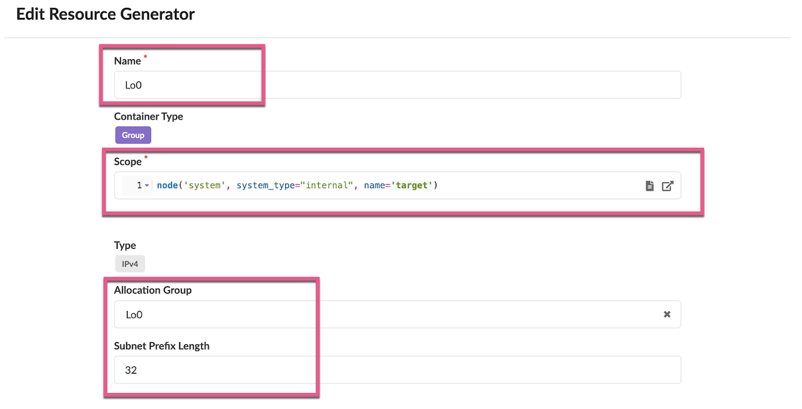

The result is the following.

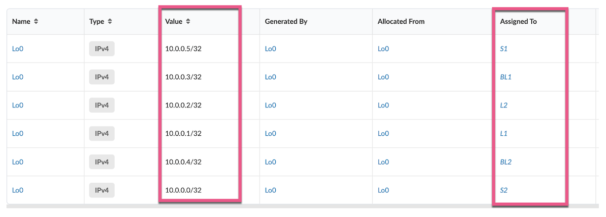

### IP Links Allocation

Allocate a /31 subnet to each internal link between all spines and all leaves / border leaves.

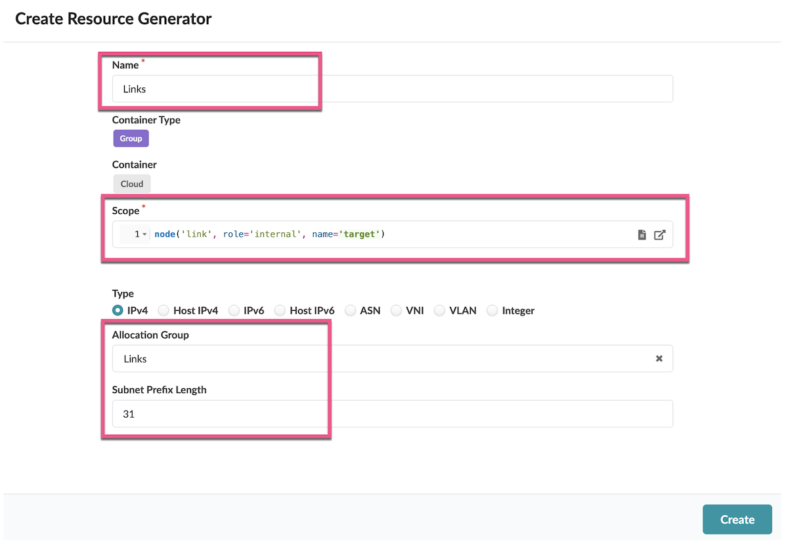

The result is the following.

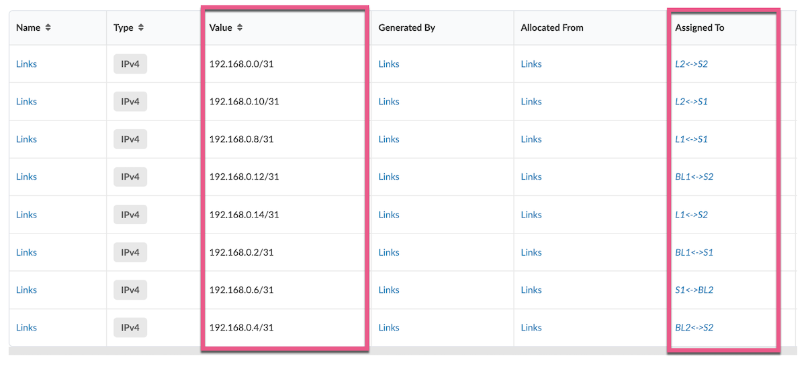

### LACP Key Allocation

Allocate an integer to each external device. This value will be used to generate a unique LACP key to each connected device.

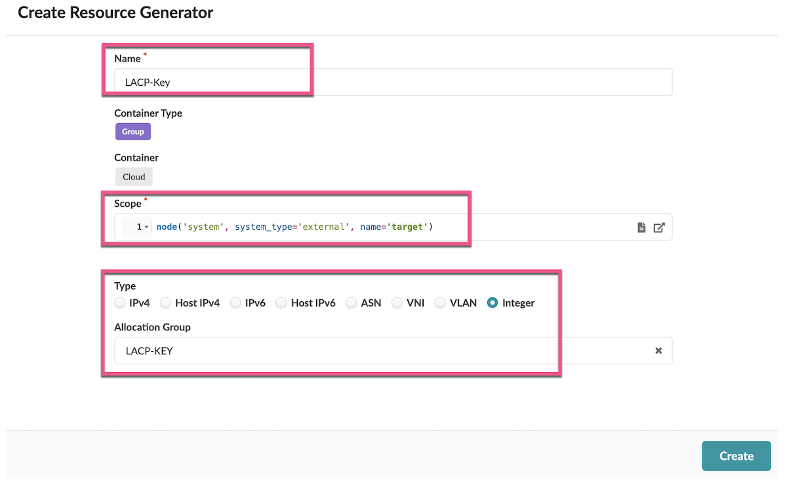

The result is the following:

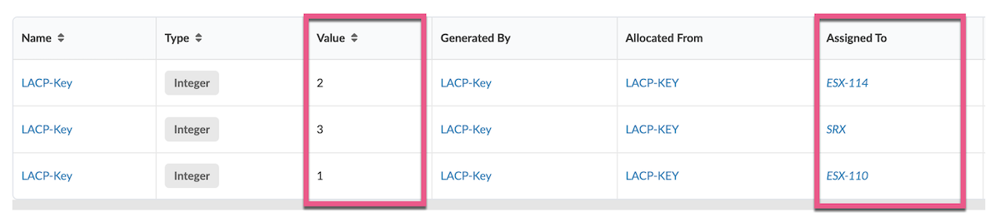

All the resources created appear in the Blueprint resources:

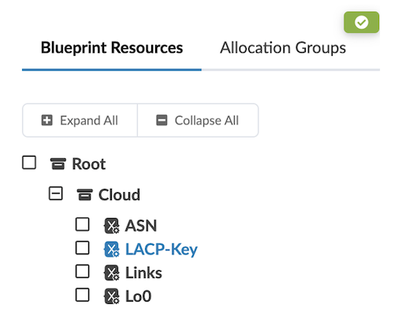

Config Templates

After allocating the resources, we need to apply the Junos command lines to configure the devices.

Create the following configuration templates.

### ASN Configuration template

Create the following Configuration Template "Cloud_ASN.jinja"

```


routing-options {
    replace: autonomous-system  {{asn}};
}
```

Rendered configuration on L1

```
routing-options {
    replace: autonomous-system  65102;
}
```

### Loopback Configuration template

Create the following Config Template  "Cloud-Loopback.jinja"

```

interfaces {
    lo0 {
        unit 0 {
            family inet {
                address {{loopback_ipv4}};
            }
        }
    }
}

routing-options {
    replace: router-id {{router_id}};
}
```

Rendered configuration on L1

```
interfaces {
    lo0 {
        unit 0 {
            family inet {
                address 10.0.0.4/32;
            }
        }
    }
}
routing-options {
    replace: router-id 10.0.0.4;
}
```

### eBGP Underlay Configuration Template

Create the following Config Template  "Cloud_eBGP-Underlay.jinja"

```

protocols {
    bgp {
        group underlay {
            type external;
            local-as {{ASN}};
            export Export-LO;
            multipath {
                    multiple-as;
            }
             #for each interface
                 #if the interface is connected to a neighbour
                     #get neighbour information
                         #if the neighbour is an internal system, get its ASN and interface IP 
                   
            neighbor {{nb['ipv4_address']}} {
                    peer-as {{PEER_ASN}}; 
            }
                     
                
             
        
        }
    }
}

policy-options {
    policy-statement Export-LO {
        from interface lo0.0;
        then accept;
    }
}
```

Rendered configuration on L1

```
protocols {
    bgp {
        group underlay {
            type external;
            local-as 65102;
            export Export-LO;
            multipath {
                    multiple-as;
            }
            neighbor 192.168.0.15 {
                    peer-as 65101; 
            }
            neighbor 192.168.0.11 {
                    peer-as 65103; 
            }
        }
    }
}
policy-options {
    policy-statement Export-LO {
        from interface lo0.0;
        then accept;
    }
}
```

### eBGP Overlay Configuration Template

Create the following Config Template  "Cloud_eBGP-Overlay.jinja"

```



protocols {
    bgp {
        group overlay {
            type external;
            local-as {{ASN}};
            local-address {{Lo0_nomask}};
            multipath {
                    multiple-as;
            }
            multihop {

                no-nexthop-change; #Specific configuration on Spine

                ttl 1;
            }
            family evpn {
                signaling {
                    loops 2;
                }
            }
            vpn-apply-export;
       #for each interface 
                 #if the interface is connected to a neighbour
                     #get neighbour information
                         #if neighbour is an internal system, get loopback IP and ASN
                    
                    
                    
            neighbor {{PEER_LO_nomask}} {
                    peer-as {{PEER_ASN}}; 
            }
                     
                
             
        
        }
    }
}
```

Rendered configuration on L1

```
protocols {
    bgp {
        group overlay {
            type external;
            local-as 65102;
            local-address 10.0.0.4;
            multipath {
                    multiple-as;
            }
            multihop {
                ttl 1;
            }
            family evpn {
                signaling {
                    loops 2;
                }
            }
            vpn-apply-export;
            neighbor 10.0.0.5 {
                    peer-as 65101; 
            }
            neighbor 10.0.0.1 {
                    peer-as 65103; 
            }
        }
    }
}
```

### ESI-LAG Configuration Template

Create the following Config Template  "Cloud_LAG.jinja"

```
 #for each interface
    #if the interface is member of a LAG
          #get neighbour LACP_key

interfaces {{interface_name}}{
      esi {
           auto-derive {
               lacp-pe-system-id-and-admin-key;
           }
           all-active;
       }
       aggregated-ether-options {
           lacp {
               system-id 00:00:00:00:00:10;
               admin-key {{LACP_KEY}};
           }
       }
           }     
    

```

Rendered configuration on L1:

```
interfaces ae1{
      esi {
           auto-derive {
               lacp-pe-system-id-and-admin-key;
           }
           all-active;
       }
       aggregated-ether-options {
           lacp {
               system-id 00:00:00:00:00:10;
               admin-key 2;
           }
       }
   }     
interfaces ae2{
      esi {
           auto-derive {
               lacp-pe-system-id-and-admin-key;
           }
           all-active;
       }
       aggregated-ether-options {
           lacp {
               system-id 00:00:00:00:00:10;
               admin-key 3;
           }
       }
   }
```

## Tenants design and configuration

Each tenant is a unique MAC-VRF.

Each MAC-VRF will have the following attributes:

- A VRF Target
- A Route-Distinguisher for each leaf/border leaf
- A list for VLANs
- Optionally, an IRB for each defined VLAN

Here is how we define a Tenant in the Resource Management > Blueprint Resources:

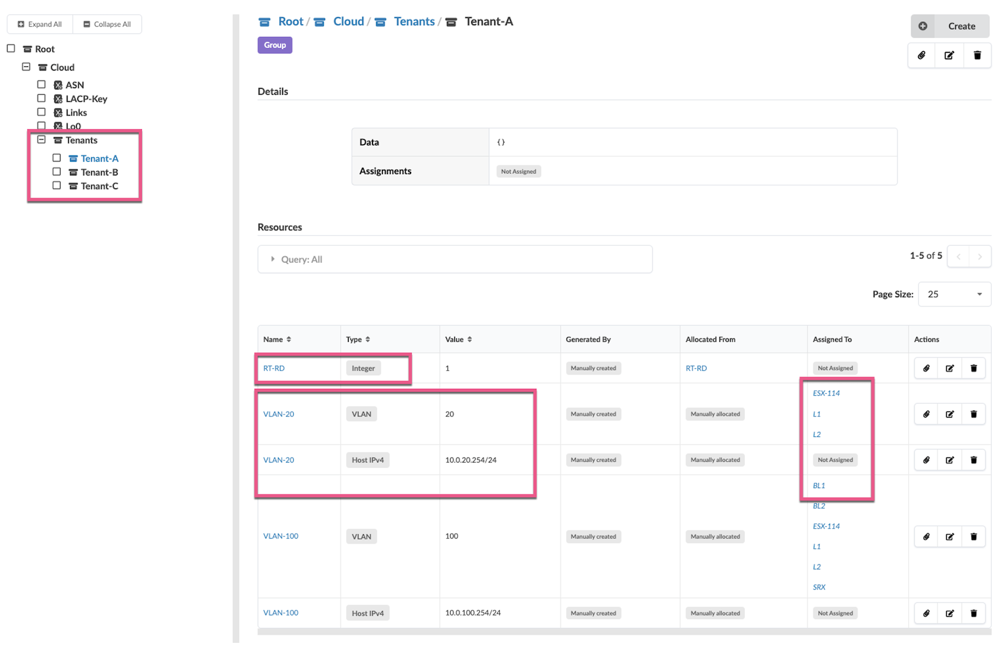

The physical interfaces are assigned to a tenant and a list VLANs by using the assignment button on the right. Here we can see that ESX-114 is assigned to VLAN-20 and Tenant-A.

### Tenant Configuration template

```
 #for all leaves 
     #get the list of tenants
    
        
        
        
            
            
            
            
                
             
            
    
    routing-instances VRF-{{ns.name}} { #configure the L3 VRF
        instance-type vrf;
        route-distinguisher {{loopback_no_mask}}:1000{{RT_RD}};
        vrf-target target:65000:10000{{RT_RD}};
        vtep-source-interface lo0.0;
        routing-options {
            multipath;
            auto-export;
        }
        protocols {
            evpn {
                ip-prefix-routes {
                    advertise direct-nexthop;
                    encapsulation vxlan;
                    vni 10000{{RT_RD}};
                }
            }
        }
    }


routing-instances {{ns.name}} { #configure the L2 MAC-VRF
        instance-type mac-vrf;
        service-type vlan-aware;
        route-distinguisher {{loopback_no_mask}}:{{RT_RD}};
        vrf-target target:65000:{{RT_RD}};
        vtep-source-interface lo0.0;
        protocols {
            evpn {
                encapsulation vxlan;
                duplicate-mac-detection {
                    auto-recovery-time 9;
                }
                extended-vni-list all;
            }
        }
    }
 
            
                
                         #check if a vlan id defined
                            
                            
                            
                            
                                 #get the vlan irb (if exists)
                                    
                                
                            
routing-instances {{ns.name}} { #configure vlan inside the MAC-VRF and, if it exist, the l3-interface (irb)
        vlans {
            {{item['label']}} {
                vlan-id none;
                 
                l3-interface irb.{{RT_RD}}{{ns.vlan_id}};
                 
                vxlan {
                    vni {{RT_RD}}{{ns.vlan_id}};
                }
            }
        }
    } 
                 #if irb exists, configure irb interface and assign it to L3 VRF
     interfaces { 
        irb {
            unit {{RT_RD}}{{ns.vlan_id}} {
                family inet address {{ns.ip}};
                mac 00:ba:be:00:00:01;
            }
        }
    }
    routing-instances VRF-{{ns.name}} {
         interface irb.{{RT_RD}}{{ns.vlan_id}};
    }
  
                     //check assigned interface 
                        
                            
                                
                                    
                                            
    interfaces {#configure unit for that interface
        {{ interface_name }} {
            flexible-vlan-tagging;
            encapsulation flexible-ethernet-services;
            unit {{ns.vlan_id}} {
                encapsulation vlan-bridge;
                vlan-id {{ns.vlan_id}};
                }
        }
    }
    routing-instances {{ns.name}} {// assigned interface to vlan
        vlans {
            {{item['label']}} {
            interface {{ interface_name }}.{{ns.vlan_id}};
                }
            }
    }
       
                                        
                                        
    interfaces {#Freeform needs unit 0 to monitor interfaces, so we configure a dummy unit 0 here
        {{ interface_name }} {
            unit 0 {
                vlan-id 4094;
            }
        }
    }
                                        
                                    
                                 
                            
                        
                    
                
                 
             
         
       

```

Rendered Config on L1 for Tenant A:

```
 routing-instances VRF-Tenant-A {
        instance-type vrf;
        route-distinguisher 10.0.0.4:10001;
        vrf-target target:65000:100001;
        vtep-source-interface lo0.0;
        routing-options {
            multipath;
            auto-export;
        }
        protocols {
            evpn {
                ip-prefix-routes {
                    advertise direct-nexthop;
                    encapsulation vxlan;
                    vni 100001;
                }
            }
        }
    }  
```

### Global Configuration Template

Change the junos configuration template "junos_configuration.jinja" as follow :

```
{# junos_system.jinja handles the system hostname #}


{# junos_chassis.jinja handles chassis options, such as fpc config for
   channelized port break-outs on certain device platforms.  This also handles
   aggregate-devices ethernet device-count for port-channel (aeX) interfaces. #}


{# junos_interfaces.jinja handles front-panel interface configuration, including
   interface description, ipv4/ipv6 address assignment, and physical link properties
   derived from device profiles. #}


{# junos_protocols.jinja initiates LLDP collection on all ports for telemetry
   purposes #}


{#configure LAG with ESI#}


{#configure loopback#}


{#configure ASN#}


{#Underlay eBGP#}


{#Overrlay eBGP#}


{#MAC-VRFs#}

```

## Conclusion

Apstra Freeform allows you to design and manage multi-tenant data center networks with an unprecedented level of design flexibility. The unique Apstra Freeform capability of resource generators is a powerful capability that you can use to streamline the allocation of network resources. This functionality facilitates the creation of highly customized and efficient network configurations by dynamically generating necessary parameters such as Autonomous System Numbers (ASNs), loopback addresses, and VLAN IDs across the entire fabric. By doing so, Apstra Freeform significantly reduces the manual overhead typically associated with configuring and managing complex, multi-tenant networks

## Glossary

- ASN: Autonomous System Number
- BGP: Border Gateway Protocol
- EVPN: Ethernet Virtual Private Network
- ESI: Ethernet Segment Identifier
- EVI: EVPN Instance
- NOS: Network Operating System
- RBAC: Role Based Access Control
- RD: Route Distinguisher
- RT: Route Targer
- VXLAN:
- ZTP: Zero Touch Provisionning

## Acknowledgements

I would like to thank Mehdi Abdelouahab for reviewing and adding valuable and insightful content to this article.
