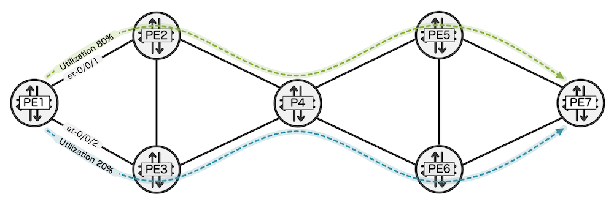
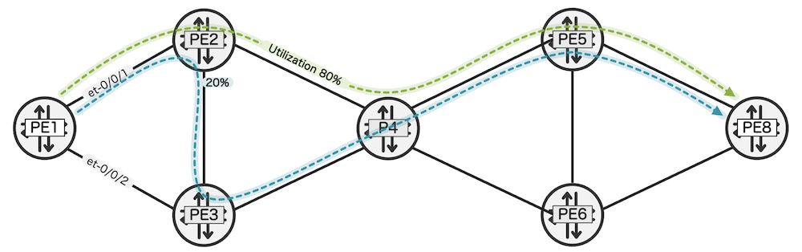

# SR Tactical Traffic Engineering in Junos

**Moshiko Nayman - 02/19/2025**

Junos OS 23.4R1 introduces Segment Routing Tactical Traffic Engineering (SR-TTE), a unique and innovative solution designed to address temporary network congestion by dynamically adjusting traffic flows in real-time, directly within the router. SR-TTE leverages existing mechanisms to alleviate congestion without requiring interoperability between different router vendors or with external controllers.

## Overview

Tactical Traffic Engineering (TTE) is designed to solve temporary congestion problems, such as those occurring due to unexpected heavy traffic loads.  Unlike conventional traffic engineering, which proactively places tunnels to avoid congestion, TTE is a reactive solution that adjusts traffic flows in response to local congestion. This eliminates dependencies on external controllers and concerns about interoperability.

One of the key advantages of SR-TTE is its simplicity. It does not add additional labels or overhead to existing packets, nor does it manipulate the original user-plane data. Instead, TTE leverages the existing source of truth - the information within the router, making it an efficient and straightforward solution.

Segment Routing (SR), although offering many benefits, falls short in its ability to effectively manage bandwidth when compared to RSVP auto-bandwidth. RSVP auto-bandwidth addresses congestion proactively by dynamically adjusting the bandwidth allocation for LSPs based on real-time ingress traffic measurements, ensuring efficient handling of varying traffic loads. However, Segment Routing (SR) lacks this capability. SR is also dependent on external controllers for traffic (bandwidth) management. To address this limitation, TTE compliments SR by providing a mechanism to manage traffic dynamically and alleviate congestion directly on the router, without relying on an external controller, by reusing SR's TI-LFA backup routes for redirecting flows.

TTE responds to congestion in real-time by detecting data-plane traffic congestion and adjusting traffic flows accordingly. Once the congestion is abated, the network returns to its normal operation by moving flows back to their 'normal' paths.

The primary capability of TTE is its ability to handle traffic congestion by utilizing alternative paths and avoiding unnecessary packet loss. This is achieved without the need to export large amounts of data to an external controller for analysis and subsequent adjustment via NETCONF or PCEP.

## Syntax

Pre-requisites: Enable TI-LFA

```
set protocols isis interface <interface_name> level <level_number> post-convergence-lfa
set protocols isis backup-spf-options use-post-convergence-lfa
```

Enable congestion protection and ISIS as a client

```
set protocols isis source-packet-routing traffic-statistics congestion-protection 
set routing-options congestion-protection template <template-name>
set routing-options congestion-protection interface <interface_name> template <template>
```

Additional options

```
set routing-options congestion-protection template CP1 policy <value>
set routing-options congestion-protection template CP1 high-threshold consecutive-events <#>
set routing-options congestion-protection template CP1 high-threshold bandwidth <percent>
set routing-options congestion-protection template CP1 low-threshold bandwidth <percent>
set routing-options congestion-protection template CP1 low-threshold consecutive-events <#>
```

Related show commands

```
show congestion-protection overview
show congestion-protection interface
show congestion-protection template
```

## Congestion Scenario 1: An Ingress Router (PE)

In the scenario below, depicted in Figure 1, PE1's uplink to PE2 experiences high traffic loads of more than 80% utilization. This could lead to congestion, causing packet loss, increased latency, and overall degraded network performance. TTE is enabled for this interface and continuously monitors its transmit load.  The congestion protection policy is triggered when utilization exceeds the configured value of 80% for several (default = 3) consecutive (default = 5 sec intervals) statistic samples.

When the congestion protection policy is triggered, TTE randomly selects 'some' flows for load-balancing via available backup paths to alleviate the congestion. Instead of sending all the traffic to PE2, TTE activated flows are load-balanced between the primary path to PE2 and the TI-LFA backup path via PE3, then to P4, and finally to PE6 and PE7.

TTE flow selection can be controlled using policy.  This allows the operator to control which services may be subject to load-balancing via TI-LFA backup routes.

Once TTE has been activated, the router continuously monitors the aggregate utilization of both the primary outgoing interface and the load moved to the backup paths. Once the traffic load falls below the low threshold (e.g., 50%) for several (default = 3) consecutive (default = 5 sec intervals) statistic samples, TTE selected prefixes are deactivated, and all flows return to their primary path directly to PE2. This dynamic approach ensures real-time congestion management, optimized network performance, and reduced dependency on external controllers.



The green and blue lines above illustrate the possible traffic flow.

**PE1 Configuration**

```
set protocols isis source-packet-routing traffic-statistics congestion-protection

set routing-options congestion-protection template CP1 policy TTE-PREFIXES
set routing-options congestion-protection template CP1 high-threshold bandwidth 80
set routing-options congestion-protection template CP1 low-threshold bandwidth 20
set routing-options congestion-protection interface ge-0/0/1.0 template CP1
set routing-options congestion-protection interface ge-0/0/2.0 template CP1
```

TTE active on PE1

```
mnayman@PE1> show congestion-protection interface detail 

Interface               State                  Template       Last Status Change
et-0/0/1.0              active                 congest-protect Feb 12 08:42:02   
  Currently above high threshold,  80.55% output utilization

et-0/0/2.0              active                 congest-protect Feb 12 09:26:48   
  Currently below low threshold,  30.53% output utilization
```

## Congestion Scenario 2: A Transit Router (LSR)



In the scenario depicted in Figure 2, the SR transit router PE2 uplink to P4 experiences high traffic loads of greater than 80% utilization, exceeding the configured congestion protection high threshold policy. As before, when the congestion protection policy is triggered, TTE randomly selects 'some' flows for load-balancing via available backup paths to alleviate the congestion.  And when congestion has abated, the use of the additional backup paths is disabled.

## Conclusion

TTE provides a simple, fast, and efficient mechanism to react to potential congestion by leveraging existing technology.  Because it does not rely on additional protocols or external controllers it can be incrementally deployed in targeted areas of a network without interoperability concerns.

## Glossary

- IGP: Interior Gateway Protocol
- IS-IS" Intermediate System to Intermediate System
- LSP" Label Switched Path
- NETCONF" Network Configuration Protocol
- PCEP: Path Computation Element Protocol
- PE: Provider Edge
- PFE: Packet Forwarding Engine
- RSVP: Resource Reservation Protocol
- SID: Segment Identifiers
- SR: Segment Routing
- TI-LFA: Topology Independent Loop-Free Alternate
- TTE: Tactical Traffic Engineering

## Useful links

- Tactical Traffic Engineering: [https://datatracker.ietf.org/doc/draft-li-rtgwg-tte/](https://datatracker.ietf.org/doc/draft-li-rtgwg-tte/)
- MPLS Auto-bandwidth: [https://www.juniper.net/documentation/us/en/software/junos/mpls/topics/topic-map/basic-lsp-configurtion.html#id-automatic-bandwidth-allocation-for-lsps ](https://www.juniper.net/documentation/us/en/software/junos/mpls/topics/topic-map/basic-lsp-configurtion.html#id-automatic-bandwidth-allocation-for-lsps)

## Acknowledgments

Thanks to Colby Barth and Tony Li for developing Tactical Traffic Engineering and contributing to this article.
