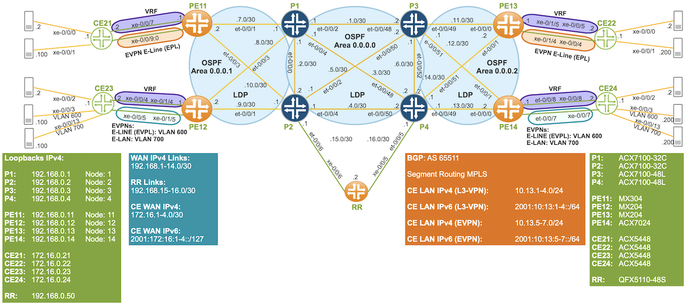
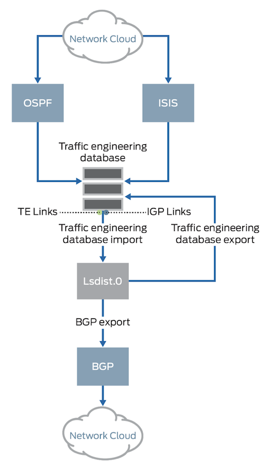
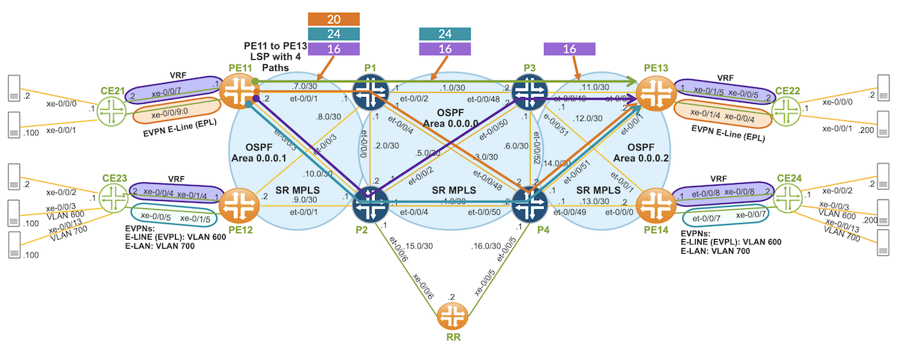
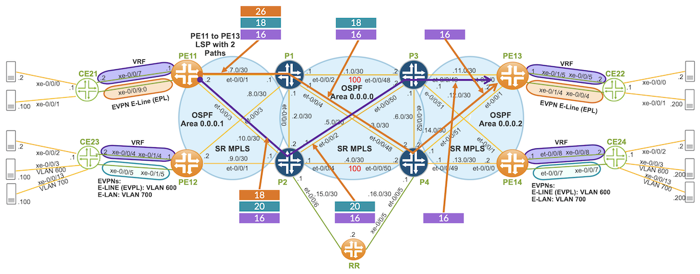
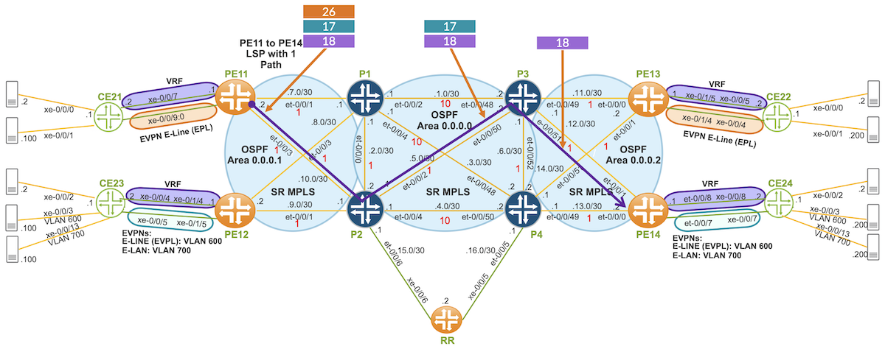
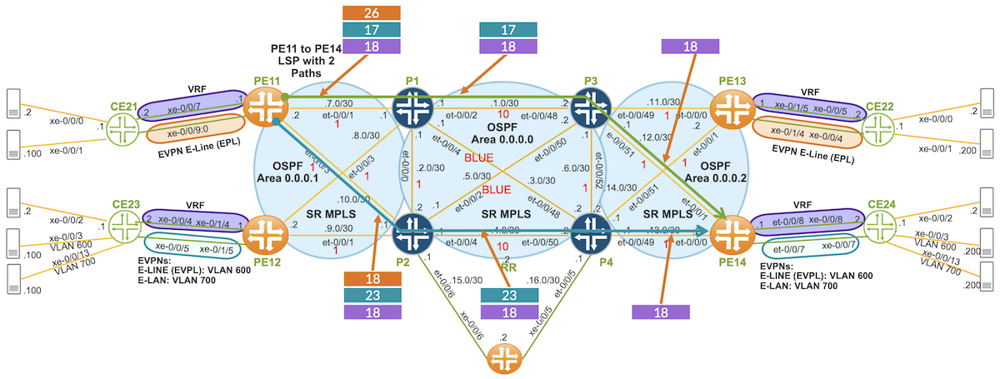

# SR-TE LSPs Through a Multi-Domain Network

**Ricardo Dominguez - 04/30/2025**

Establishing SR-TE (CSPF) LSPs through inter OSPF areas is a challenge, as these LSPs rely on TED, and this TED is per OSPF area or IS-IS level.

In our previous tech post "[Migrating from OSPF/LDP to OSPF/SR-MPLS](https://juniper.github.io/techposts/migrating-from-ospf-ldp-to-ospf-sr-mpls/article)", we explored how to transition from OSPF/LDP to OSPF/SR-MPLS for SR and the associated benefits it brings to modern networks.

In this post, we will explore how to create four types of SR-TE LSPs across an inter-OSPF areas network. Specifically, we will focus on the process of establishing SR-TE LSPs across multiple OSPF areas, with particular emphasis on the reliance of these LSPs on the TED.

## Introduction

SR-TE LSPs can be leveraged to migrate traffic from LDP to SR. In this tech post, we will review the migration options, focusing on static SR-TE LSPs with a Dynamic TE (CSPF) Path

From a JUNOS perspective, Static LSPs are mainly configured through CLI or Netconf, while Dynamic LSPs are PCE Initiated (e.g., Juniper Paragon), BGP-SRTE and ODN (dynamic tunnels).

In this tech post, we will consider four types of LSPs with transport class and BGP color community, each with different constraints on OSPF Areas:

- IGP Metric
- TE Metric
- Delay Metric
- Admin Groups

When setting up LSPs, dynamic paths through OSPF require TED from multiple areas, as TED is area-specific. To bring up an LSP, a BGP-LS producer (typically ABRs), a BGP-LS consumer (such as ingress PEs or PCE), and a Route Reflector are necessary. In this post, we will use BGP-LS TED distribution as a controllerless inter-area solution for SR-TE LSPs.

## Test Topology

Our test topology consists of three OSPF Areas: Area 0, Area 1, and Area 2. Routers P1 to P4 are connected through OSPF Area 0. PE11 and PE12 are connected to P1 and P2 in OSPF area 1, while PE13 and PE14 are connected to P3 and P4 in OSPF area 2.



The entire network is based on IPv4/OSPF with Segment Routing as the MPLS signaling protocol. BGP is used among PEs and the Route Reflector for inet, inet-vpn, inet6, inet6-vpn, and evpn address families. Our core network is a BGP-free core.

The network topology is also IPv6-free, with a shared L3VPN across all PEs for both IPv4 and IPv6 CE traffic. 6VPE and 6PE are utilized to enable IPv6 communication among CEs over an IPv4/MPLS network.

EVPN E-Line (EPL) is used between PE11 and PE13 for IPv4 and IPv6 traffic.

EVPN E-Line (EVPL) for VLAN 600 is used between PE12 and PE14 for IPv4 and IPv6 traffic.

EVPN E-LAN for VLAN 700 is used between PE12 and PE14 for IPv4 and IPv6 traffic.

## Hardware Used

The following Juniper hardware is being used in our test bed topology:

- P1:  ACX7100-32C
- P2:  ACX7100-32C
- P3: ACX7100-48L
- P4: ACX7100-48L
- PE11: MX304
- PE12: MX204
- PE13: MX204
- PE14: ACX7024
- CE21: ACX5448
- CE22: ACX5448
- CE23: ACX5448
- CE24: ACX5448
- RR: QFX5110-48S

## SR-TE LSPs with Dynamic Paths

### TED Per OSPF Area

TE LSPs do not use the LSDB to calculate paths; instead, they rely on the TED for TE path calculation. TE information is included in the IGP's LSDB, and this TE information can be copied into the TED.

Both OSPF and IS-IS populate TED per OSPF area or IS-IS level. However, TED population is not automatic and requires specific configuration. This is possible through OSPF or IS-IS extensions, which allow TE link attributes, such as TE metrics, delay metrics, or administrative groups, to be advertised.

When enabling the "l3-unicast-topology" knob under OSPF traffic engineering on all routers, IGP topology information is downloaded into the TED. The L3 unicast topology, along with any received TE information from other routers, is copied into the TED. However, locally configured TE information is not automatically copied into TED.

The "Advertisement always" knob under OSPF traffic engineering ensures that TE information is advertised into SR.

The following configuration is required to populate TED per OSPF area.

```
protocols {
    ospf {
        traffic-engineering {
            l3-unicast-topology;
            advertisement always;
        }
    }
}
```

Before diving into our four types of SR-TE LSPs, let's first explore how TED and BGP-LS work. When attempting to configure an SR-TE (CSPF) LSP across multiple areas or domains, the LSP will fail to be established because TED is specific to each area or domain. We can validate this behavior through the example and verification process outlined below.

In this case, we're trying to establish an LSP from PE11 in OSPF Area 1 to PE13 in OSPF Area 2, using IGP as the metric type.

```
protocols {
    source-packet-routing {
        compute-profile TO_PE13_IGP_METRIC {
            no-label-stack-compression;
            metric-type {
                igp;
            }
        }
        source-routing-path PE11_to_PE13_COLOR_130 {
            to 192.168.0.13;
            color 130;
            primary {
                TO_PE13 {
                    compute {
                        TO_PE13_IGP_METRIC;
                    }
                }
            }
        }
        use-transport-class;
    }
}
```

The LSP is down, as shown in the output of the "show spring-traffic-engineering lsp" command.

```
jnpr@MX304-PE11# run show spring-traffic-engineering lsp
To                        State        LSPname
192.168.0.13-130<c>       Down         PE11_to_PE13_COLOR_130

jnpr@MX304-PE11# run show spring-traffic-engineering lsp detail |no-more
E = Entropy-label Capability
Name: PE11_to_PE13_COLOR_130
  Tunnel-source: Static configuration
  Tunnel Forward Type: SRMPLS
  To: 192.168.0.13-130<c>
  State: Down
    Path: TO_PE13
    Path Status: NA
    Outgoing interface: NA
    Auto-translate status: Disabled Auto-translate result: N/A
    Compute Status:Enabled , Compute Result:failure , Compute-Profile Name:TO_PE13_IGP_METRIC
    Total number of computed paths: 0
```

```
jnpr@MX304-PE11# run show ted database topology-type l3-unicast 
TED database: 0 ISIS nodes 4 INET nodes 0 INET6 nodes
ID                            Type Age(s) LnkIn LnkOut Protocol
192.168.0.1                   Rtr     174     2      2 OSPF(0.0.0.1)
    To: 192.168.0.11, Local: 192.168.7.1, Remote: 192.168.7.2
      Local interface index: 1003, Remote interface index: 0
    To: 192.168.0.12, Local: 192.168.8.1, Remote: 192.168.8.2
      Local interface index: 1005, Remote interface index: 0
ID                            Type Age(s) LnkIn LnkOut Protocol
192.168.0.2                   Rtr     171     2      2 OSPF(0.0.0.1)
    To: 192.168.0.11, Local: 192.168.10.1, Remote: 192.168.10.2
      Local interface index: 1005, Remote interface index: 0
    To: 192.168.0.12, Local: 192.168.9.1, Remote: 192.168.9.2
      Local interface index: 1003, Remote interface index: 0
ID                            Type Age(s) LnkIn LnkOut Protocol
192.168.0.11                  Rtr     171     2      2 OSPF(0.0.0.1)
    To: 192.168.0.1, Local: 192.168.7.2, Remote: 192.168.7.1
      Local interface index: 339, Remote interface index: 0
    To: 192.168.0.2, Local: 192.168.10.2, Remote: 192.168.10.1
      Local interface index: 341, Remote interface index: 0
ID                            Type Age(s) LnkIn LnkOut Protocol
192.168.0.12                  Rtr     175     2      2 OSPF(0.0.0.1)
    To: 192.168.0.1, Local: 192.168.8.2, Remote: 192.168.8.1
      Local interface index: 338, Remote interface index: 0
    To: 192.168.0.2, Local: 192.168.9.2, Remote: 192.168.9.1
      Local interface index: 337, Remote interface index: 0
```

There are a few ways to accomplish this:

- A PCE Initiated solution, such as Juniper Paragon, which has TE information from each area and provides network-wide visibility.
- BGP-LS through ABRs, ingress PEs, and a Route Reflector. In this approach, the ingress PE will have TE information from other areas

For this example, we will use the second option, BGP-LS TED distribution, as a controllerless inter-area solution for SR-TE LSPs.

### BGP-LS

From a TE perspective, multi-domain refers to multiple OSPF areas or instances, multiple IS-IS levels or instances, and multiple BGP autonomous systems. TED can be populated through the IGP's LSDB and BGP-LS.

BGP-LS allows TE link and node information to span multiple areas or autonomous systems, enabling LSP path computation across multiple domains. It leverages the proven scalability of BGP and its policies.

In this context, BGP-LS producers (such as ABRs) advertise their local TED via BGP-LS, typically to a Route Reflector. From the lsdist0 perspective, this means importing TED. BGP-LS consumers (such as the Ingress PE) import the BGP-LS information, and from the lsdist0 perspective, this means exporting lsdist0 to TED.

TED import or export is considered from the lsdist0 perspective, as shown in 



Based on our topology, the BGP-LS and TED import/export configuration for P1, PE, and the Route Reflector is shown. The same configuration applies to the other P and PE routers.

**P1**

```
policy-options {
    policy-statement FROM_LSDIST0_TO_TED {
        term 1 {
            from family traffic-engineering;
            then accept;
        }
    }
    policy-statement TED-TO-BGP-LS {
        term IMPORT_TED {
            from family traffic-engineering;
            then accept;
        }
    }
    policy-statement OSPF-TO-TED {
        term 1 {
            from protocol ospf;
            then accept;
        }
    }
}
protocols {
    bgp {
        group INTERNO {
            type internal;
            local-address 192.168.0.1;
            family traffic-engineering {
                unicast;
            }
            export TED-TO-BGP-LS;
            neighbor 192.168.0.50 {
                description RR;
            }
        }
    }
    mpls {
        traffic-engineering {
            database {
                import {
                    l3-unicast-topology {
                        bgp-link-state;
                    }
                    policy [ TED-TO-BGP-LS OSPF-TO-TED ];
                }
                export {
                    policy FROM_LSDIST0_TO_TED;
                    l3-unicast-topology;
                }
            }
        }
    }
    ospf {
        traffic-engineering {
            l3-unicast-topology;
            advertisement always;
        }
    }
}
```

**PE11**

```
policy-options {
    policy-statement FROM_LSDIST0_TO_TED {
        term 1 {
            from family traffic-engineering;
            then accept;
        }
    }
}
protocols {
    bgp {
        group INTERNO {
            type internal;
            local-address 192.168.0.11;
            family traffic-engineering {
                unicast;
            }
            neighbor 192.168.0.50 {
                description RR;
            }
        }
    }
    mpls {
        traffic-engineering {
            database {
                export {
                    policy FROM_LSDIST0_TO_TED;
                    l3-unicast-topology;
                }
            }
        }
    }
    ospf {
        traffic-engineering {
            l3-unicast-topology;
            advertisement always;
        }
    }
}
```

**Route Reflector**

```
protocols {
    bgp {
        group INTERNO {
            type internal;
            local-address 192.168.0.50;
            family traffic-engineering {
                unicast {
                    no-install;
                }
            }
            cluster 192.168.0.50;
            neighbor 192.168.0.1 {
                description P1;
            }
            neighbor 192.168.0.11 {
                description PE11;
            }
        }
    }
}
```

The Route Reflector receives BGP-LS routes from the P routers, which in this case are our BGP-LS producers.

```
jnpr@QFX5110-48S-RR# run show bgp summary 
Threading mode: BGP I/O
Default eBGP mode: advertise - accept, receive - accept
Groups: 1 Peers: 8 Down peers: 0
Table          Tot Paths  Act Paths Suppressed    History Damp State    Pending
lsdist.0             
                     320        114          0          0          0          0
Peer                     AS      InPkt     OutPkt    OutQ   Flaps Last Up/Dwn State|#Active/Received/Accepted/Damped...
192.168.0.1           65511        825        813       0       0     4:58:54 Establ
  lsdist.0: 34/80/80/0
192.168.0.2           65511        829        864       0       0     4:58:59 Establ
  lsdist.0: 0/80/80/0
192.168.0.3           65511        810        867       0       0     4:58:35 Establ
  lsdist.0: 0/80/80/0
192.168.0.4           65511        816        765       0       0     4:59:07 Establ
  lsdist.0: 80/80/80/0
192.168.0.11          65511        667        837       0       0     4:54:01 Establ
  lsdist.0: 0/0/0/0
192.168.0.12          65511        671        872       0       0     4:57:29 Establ
  lsdist.0: 0/0/0/0
192.168.0.13          65511        677        875       0       0     4:57:31 Establ
  lsdist.0: 0/0/0/0
192.168.0.14          65511        674        910       0       0     4:58:49 Establ
  lsdist.0: 0/0/0/0
```

PE11 is our BGP-LS consumer and is receiving BGP-LS node, link, and prefix routes corresponding to other OSPF areas from the Route Reflector.

```
jnpr@MX304-PE11# run show bgp summary 
Threading mode: BGP I/O
Default eBGP mode: advertise - accept, receive - accept
Groups: 2 Peers: 3 Down peers: 0
Table          Tot Paths  Act Paths Suppressed    History Damp State    Pending
lsdist.0             
                     114        114          0          0          0          0
Peer                     AS      InPkt     OutPkt    OutQ   Flaps Last Up/Dwn State|#Active/Received/Accepted/Damped...
192.168.0.50          65511        806        632       0       0     4:38:56 Establ
  inet.0: 0/0/0/0
  inet6.0: 0/0/0/0
  bgp.l3vpn.0: 9/9/9/0
  bgp.l3vpn-inet6.0: 9/9/9/0
  bgp.evpn.0: 1/1/1/0
  lsdist.0: 114/114/114/0
  VRF_PURPLE.inet.0: 9/9/9/0
  VRF_PURPLE.inet6.0: 9/9/9/0
  EVPN_PE11_PE13.evpn.0: 1/1/1/0
  __default_evpn__.evpn.0: 0/0/0/0

jnpr@MX304-PE11# run show route table lsdist.0 | no-more 
lsdist.0: 114 destinations, 114 routes (114 active, 0 holddown, 0 hidden)
+ = Active Route, - = Last Active, * = Both
NODE { AS:65511 Area:0.0.0.2 IPv4:192.168.0.13 OSPF:0 }/1536              
                   *[BGP/170] 04:39:06, localpref 100, from 192.168.0.50
                      AS path: I, validation-state: unverified
                    >  to 192.168.7.1 via et-0/0/1.0
                       to 192.168.10.1 via et-0/0/3.0
NODE { AS:65511 Area:0.0.0.2 IPv4:192.168.0.14 OSPF:0 }/1536              
                   *[BGP/170] 04:39:06, localpref 100, from 192.168.0.50
                      AS path: I, validation-state: unverified
                    >  to 192.168.7.1 via et-0/0/1.0
                       to 192.168.10.1 via et-0/0/3.0
LINK { Local { AS:65511 Area:0.0.0.0 IPv4:192.168.0.1 }.{ IPv4:192.168.1.1 } Remote { AS:65511 Area:0.0.0.0 IPv4:192.168.0.3 }.{ IPv4:192.168.1.2 } OSPF:0 }/1536              
                   *[BGP/170] 04:39:06, localpref 100, from 192.168.0.50
                      AS path: I, validation-state: unverified
                    >  to 192.168.7.1 via et-0/0/1.0
                       to 192.168.10.1 via et-0/0/3.0
LINK { Local { AS:65511 Area:0.0.0.0 IPv4:192.168.0.1 }.{ IPv4:192.168.2.1 } Remote { AS:65511 Area:0.0.0.0 IPv4:192.168.0.2 }.{ IPv4:192.168.2.2 } OSPF:0 }/1536              
                   *[BGP/170] 04:39:06, localpref 100, from 192.168.0.50
                      AS path: I, validation-state: unverified
                    >  to 192.168.7.1 via et-0/0/1.0
                       to 192.168.10.1 via et-0/0/3.0
PREFIX { Node { AS:65511 Area:0.0.0.0 IPv4:192.168.0.4 } { IPv4:192.168.0.13/32 } OSPF:0 }/1536              
                   *[BGP/170] 04:38:37, localpref 100, from 192.168.0.50
                      AS path: I, validation-state: unverified
                    >  to 192.168.7.1 via et-0/0/1.0
                       to 192.168.10.1 via et-0/0/3.0
PREFIX { Node { AS:65511 Area:0.0.0.0 IPv4:192.168.0.4 } { IPv4:192.168.0.14/32 } OSPF:0 }/1536              
                   *[BGP/170] 04:38:37, localpref 100, from 192.168.0.50
                      AS path: I, validation-state: unverified
                    >  to 192.168.7.1 via et-0/0/1.0
                       to 192.168.10.1 via et-0/0/3.0
```

PE's TED is populated with TE information from other OSPF areas.

```
jnpr@MX304-PE11# run show ted database topology-type l3-unicast | no-more 
TED database: 0 ISIS nodes 9 INET nodes 0 INET6 nodes
ID                            Type Age(s) LnkIn LnkOut Protocol
192.168.0.4                   Rtr   16821     6      6 Exported OSPF(2)
    To: 192.168.0.1, Local: 192.168.3.2, Remote: 192.168.3.1
      Local interface index: 0, Remote interface index: 0
    To: 192.168.0.2, Local: 192.168.4.2, Remote: 192.168.4.1
      Local interface index: 0, Remote interface index: 0
    To: 192.168.0.3, Local: 192.168.6.2, Remote: 192.168.6.1
      Local interface index: 0, Remote interface index: 0
    To: 192.168.0.14, Local: 192.168.13.1, Remote: 192.168.13.2
      Local interface index: 0, Remote interface index: 0
    To: 192.168.0.13, Local: 192.168.14.1, Remote: 192.168.14.2
      Local interface index: 0, Remote interface index: 0
ID                            Type Age(s) LnkIn LnkOut Protocol
192.168.0.13                  Rtr   16821     2      2 Exported OSPF(4)
    To: 192.168.0.3, Local: 192.168.11.2, Remote: 192.168.11.1
      Local interface index: 0, Remote interface index: 0
    To: 192.168.0.4, Local: 192.168.14.2, Remote: 192.168.14.1
      Local interface index: 0, Remote interface index: 0
ID                            Type Age(s) LnkIn LnkOut Protocol
192.168.0.14                  Rtr   16821     2      2 Exported OSPF(4)
    To: 192.168.0.3, Local: 192.168.12.2, Remote: 192.168.12.1
      Local interface index: 0, Remote interface index: 0
    To: 192.168.0.4, Local: 192.168.13.2, Remote: 192.168.13.1
      Local interface index: 0, Remote interface index: 0

jnpr@MX304-PE11# run show ted database topology-type l3-unicast extensive | no-more 
TED database: 0 ISIS nodes 9 INET nodes 0 INET6 nodes
NodeID: 192.168.0.4
 Protocol: Exported OSPF(4)
 To: 192.168.0.13, Local: 192.168.14.1, Remote: 192.168.14.2
      Local interface index: 0, Remote interface index: 0
      Color: 0 <none>
      Metric: 10
      IGP metric: 10
      Average delay: 1
      Minimum delay: 1
      Maximum delay: 1
      Delay variation: 0
      Static BW: 100Gbps
      Interface Switching Capability Descriptor(1):
        Switching type: Packet
        Encoding type: Packet
        Maximum LSP BW [priority] bps:
          [0] 0bps         [1] 0bps        [2] 0bps        [3] 0bps        
          [4] 0bps         [5] 0bps        [6] 0bps        [7] 0bps        
      P2P Adjacency-SID:
        IPV4, SID: 24, Flags: 0x30, Weight: 0
   Prefixes: 
     192.168.13.0/30
      Metric: 10
     192.168.14.0/30
      Metric: 10
     192.168.0.1/32
      Prefix-SID:
        SID: 1, Flags: 0x20, Algo: 0
     192.168.0.2/32
      Prefix-SID:
        SID: 2, Flags: 0x20, Algo: 0
     192.168.0.3/32
      Prefix-SID:
        SID: 3, Flags: 0x20, Algo: 0
     192.168.0.4/32
      Prefix-SID:
        SID: 4, Flags: 0x00, Algo: 0
     192.168.0.11/32
      Prefix-SID:
        SID: 11, Flags: 0x20, Algo: 0
     192.168.0.12/32
      Prefix-SID:
        SID: 12, Flags: 0x20, Algo: 0
   SPRING-Capabilities:
     SRGB block [Start: 20000, Range: 4001, Flags: 0x00]
```

In this way, all routers have the same TED through BGP-LS, enabling PEs to establish a multi-domain LSP. The next four sections will explain how to set up SR-TE (CSPF) LSPs with dynamic paths through a multi-area OSPF network. We are not merging OSPF's LSDBs, so OSPF scale remains unaffected. Additionally, summarized addresses can be added without leaking /32s between domains.

### SR-TE LSP w/IGP Metric CSPF

We're configuring a color 130 LSP from PE11 to PE13. This LSP will use a dynamic path through OSPF areas, with IGP as the metric type. The LSP route will be added to the routing table of transport class 130, which will then be used to resolve BGP PNH for routes with the same community color. To enable dynamic creation of transport classes, we can use the "auto-create" knob under the transport-class configuration stanza.

A compute profile allows the ingress PE to calculate the LSP's dynamic path based on the constraints defined within the profile. In this case, we are using an IGP metric-type constraint.

This LSP will be used exclusively for IPv4 traffic from PE11 to PE13.

```
policy-options {
    community color:0:130 members color:0:130;
}
routing-options {
    route-distinguisher-id 192.168.0.11;
    resolution {
        preserve-nexthop-hierarchy;
    }
    transport-class {
        }
        name 130 {
            color 130;
        }
    }
}
protocols {
    source-packet-routing {
        compute-profile TO_PE13_IGP_METRIC {
            no-label-stack-compression;
            metric-type {
                igp;
            }
        }
        source-routing-path PE11_to_PE13_COLOR_130 {
            to 192.168.0.13;
            color 130;
            primary {
                TO_PE13 {
                    compute {
                        TO_PE13_IGP_METRIC;
                    }
                }
            }
        }
        use-transport-class;
    }
}
```



The LSP is in an up state and has four paths. The figure above illustrates one of these paths and the corresponding label stack. Note that adjacency labels are used due to the "no-label-stack-compression" knob. Label compression is not equivalent to ECMP (Equal-Cost Multi-Path). Our compute service computes ECMP regardless of whether label compression is enabled or not.

```
jnpr@MX304-PE11# run show spring-traffic-engineering lsp
To                        State        LSPname
192.168.0.13-130<c>       Up           PE11_to_PE13_COLOR_130
Total displayed LSPs: 1 (Up: 1, Down: 0, Initializing: 0

jnpr@MX304-PE11# run show spring-traffic-engineering lsp detail | no-more
Name: PE11_to_PE13_COLOR_130
  Tunnel-source: Static configuration
  Tunnel Forward Type: SRMPLS
  To: 192.168.0.13-130<c>
  State: Up
    Path: TO_PE13
    Auto-translate status: Disabled Auto-translate result: N/A
    Compute Status:Enabled , Compute Result:success , Compute-Profile Name:TO_PE13_IGP_METRIC
    Total number of computed paths: 4
     Computed-path-index: 1
      TE metric: 30, IGP metric: 30
      Delay metrics: Min: 12, Max: 12, Avg: 12
      Metric optimized by type: IGP
      computed segments count: 3
        computed segment : 1 (computed-adjacency-segment):
          label: 18
          source router-id: 192.168.0.11, destination router-id: 192.168.0.1
          source interface-address: 192.168.7.2, destination interface-address: 192.168.7.1
        computed segment : 2 (computed-adjacency-segment):
          label: 20
          source router-id: 192.168.0.1, destination router-id: 192.168.0.3
          source interface-address: 192.168.1.1, destination interface-address: 192.168.1.2
        computed segment : 3 (computed-adjacency-segment):
          label: 24
          source router-id: 192.168.0.3, destination router-id: 192.168.0.13
          source interface-address: 192.168.11.1, destination interface-address: 192.168.11.2
```

```
jnpr@MX304-PE11# run show route table junos-rti-tc-130.inet.3 
junos-rti-tc-130.inet.3: 1 destinations, 1 routes (1 active, 0 holddown, 0 hidden)
+ = Active Route, - = Last Active, * = Both
192.168.0.13/32    *[SPRING-TE/8] 04:42:26, metric 1, metric2 30
                    >  to 192.168.7.1 via et-0/0/1.0, Push 24, Push 20(top)
                    >  to 192.168.7.1 via et-0/0/1.0, Push 24, Push 16(top)
                       to 192.168.10.1 via et-0/0/3.0, Push 24, Push 16(top)
                       to 192.168.10.1 via et-0/0/3.0, Push 24, Push 18(top)
```

IPv4 BGP routes tagged with the 130 color community will resolve PNH in transport class instance 130. If no route to resolve PNH in this instance, the routes will fall back to the inet.3 table.

```
jnpr@MX304-PE11# run show route resolution scheme all | no-more 
Resolution scheme: junos-resol-schem-tc-130-v4-service
  AutoCreated 
  References: 1
  Mapping community: color:0:130 
  Resolution Tree: 0x119562727000, index: 17, Nodes: 7
  Policy: [__resol-schem-common-import-policy__]
  Contributing routing tables: junos-rti-tc-130.inet.3 inet.3
```

In our topology, we will map PE13's IPv4 "Purple" VRF traffic from PE11 to PE13 into this LSP.

As shown below, we define the color community with a color value of 130. In the egress PE (in this case, PE13), IPv4 "Purple" VRF traffic will be tagged with this community through a policy statement attached as an export to the VRF.

```
policy-options {
    policy-statement VRF_PURPLE_IPv4_COLOR_130 {
        term 1 {
            from family inet;
            then {
                community add color:0:130;
                community add target:65511:100;
                accept;
            }
        }
    }
    community color:0:130 members color:0:130;
    community target:65511:100 members target:65511:100;
}
routing-instances {
    VRF_PURPLE {
        instance-type vrf;
        vrf-export VRF_PURPLE_IPv4_COLOR_130;
    }
}
```

PE13 receives IPv4 "Purple" VRF routes within color community 130. Below is the label stack for these IPv4 routes.

```
jnpr@MX304-PE11# run show route community-name color:0:130 
VRF_PURPLE.inet.0: 13 destinations, 13 routes (13 active, 0 holddown, 0 hidden)
+ = Active Route, - = Last Active, * = Both
10.13.3.0/24       *[BGP/170] 00:28:23, localpref 100, from 192.168.0.50
                      AS path: 65500 I, validation-state: unverified
                       to 192.168.7.1 via et-0/0/1.0, Push 16, Push 24, Push 20(top)
                    >  to 192.168.7.1 via et-0/0/1.0, Push 16, Push 24, Push 16(top)
                       to 192.168.10.1 via et-0/0/3.0, Push 16, Push 24, Push 16(top)
                       to 192.168.10.1 via et-0/0/3.0, Push 16, Push 24, Push 18(top)
```

PNH for PE13's IPv4 "Purple" VRF routes is resolved through the transport class junos-rti-tc-130.inet.3 table via the PE11 to PE13 LSP.

```
jnpr@MX304-PE11# run show route table VRF_PURPLE.inet.0 10.13/16 extensive expanded-nh | match inet.3 
                                192.168.0.12/32 Originating RIB: inet.3
                                192.168.0.13/32 Originating RIB: junos-rti-tc-130.inet.3
                                192.168.0.14/32 Originating RIB: inet.3
```

The IPv4 traffic targeted to the CE22 LAN crosses through the nodes defined in the PE11 to PE13 LSP, with the label stack being reduced as the traffic passes through each LSP node.

```
jnpr@MX304-PE11# run traceroute routing-instance VRF_PURPLE 10.13.3.1   
traceroute to 10.13.3.1 (10.13.3.1), 30 hops max, 52 byte packets
 1  192.168.1.1 (192.168.1.1)  0.985 ms  0.672 ms  0.708 ms
     MPLS Label=20 CoS=0 TTL=1 S=0
     MPLS Label=24 CoS=0 TTL=1 S=0
     MPLS Label=16 CoS=0 TTL=1 S=1
 2  192.168.11.1 (192.168.11.1)  4.919 ms  0.768 ms  0.616 ms
     MPLS Label=24 CoS=0 TTL=1 S=0
     MPLS Label=16 CoS=0 TTL=2 S=1
 3  172.16.3.1 (172.16.3.1)  0.737 ms  0.484 ms  0.473 ms
 4  10.13.3.1 (10.13.3.1)  3.976 ms  4.781 ms  5.098 ms
```

EVPN E-Line traffic between PE11 and PE13 is still utilizing SR. As a result, EVPN BGP routes are not marked with a color community, unlike the VRF routes.

```
jnpr@MX304-PE11# run show route table mpls.0 ccc xe-0/0/9:0 
mpls.0: 47 destinations, 47 routes (47 active, 0 holddown, 0 hidden)
+ = Active Route, - = Last Active, * = Both
xe-0/0/9:0.0       *[EVPN/7] 04:49:16, route-type Egress
                       to 192.168.7.1 via et-0/0/1.0, Push 17, Push 20013(top)
                    >  to 192.168.10.1 via et-0/0/3.0, Push 17, Push 20013(top)
```

### SR-TE LSP with TE Metric CSPF

The next SR-TE LSP will have color 131, established from PE11 to PE13. This LSP uses a dynamic path through OSPF areas with TE as the metric type. The default optimization for the compute request is TE. If TE hasn't been explicitly configured, it will be inherited from the IGP metric.

This LSP route will be added to the routing table of transport class 131, and this table will be used to resolve BGP PNH for routes with the same community color. A compute profile enables the ingress PE to calculate the LSP's dynamic path based on the constraints defined in the profile. In this case, we're using the TE metric-type constraint.

This LSP will be used exclusively for IPv6 traffic from PE11 to PE13. By leveraging color LSPs and color communities, we can apply distinct constraints for IPv4 and IPv6 traffic, enabling separate dynamic path calculations for each.

```
policy-options {
    community color:0:131 members color:0:131;
}
routing-options {
    route-distinguisher-id 192.168.0.11;
    resolution {
        preserve-nexthop-hierarchy;
    }
    transport-class {
        name 131 {
            color 131;
        }
    }
}
protocols {
    source-packet-routing {
        compute-profile TO_PE13_TE_METRIC {
            no-label-stack-compression;
            metric-type {
                te;
            }
        }
        source-routing-path PE11_to_PE13_COLOR_131 {
            to 192.168.0.13;
            color 131;
            primary {
                TO_PE13_TE_METRIC {
                    compute {
                        TO_PE13_TE_METRIC;
                    }
                }
            }
        }
        use-transport-class;
    }
}
```

We will configure a higher TE link metric between P1 and P3 and P2 and P4, ensuring that our LSP avoids these links due to their higher TE metrics. Below, we illustrate the TE metric between P1 and P3.

```
protocols {
    ospf {
        area 0.0.0.0 {
            interface et-0/0/2.0 {
                te-metric 100;
            }
        }
    }
}
```

This TE metric is highlighted in red in 



The LSP is in an up state and has two paths. The figure above shows these two paths and the corresponding label stack. Note that adjacency labels are used due to the "no-label-stack-compression" knob.

```
jnpr@MX304-PE11# run show spring-traffic-engineering lsp 
To                        State        LSPname
192.168.0.13-130<c>       Up           PE11_to_PE13_COLOR_130
192.168.0.13-131<c>       Up           PE11_to_PE13_COLOR_131

jnpr@MX304-PE11# run show spring-traffic-engineering lsp detail | no-more 
Name: PE11_to_PE13_COLOR_131
  Tunnel-source: Static configuration
  Tunnel Forward Type: SRMPLS
  To: 192.168.0.13-131<c>
  State: Up
    Path: TO_PE13_TE_METRIC
    Auto-translate status: Disabled Auto-translate result: N/A
    Compute Status:Enabled , Compute Result:success , Compute-Profile Name:TO_PE13_TE_METRIC
    Total number of computed paths: 2
     Computed-path-index: 2
      TE metric: 30, IGP metric: 30
      Delay metrics: Min: 3, Max: 3, Avg: 3
      Metric optimized by type: TE
      computed segments count: 3
        computed segment : 1 (computed-adjacency-segment): 
          label: 18
          source router-id: 192.168.0.11, destination router-id: 192.168.0.2
          source interface-address: 192.168.10.2, destination interface-address: 192.168.10.1
        computed segment : 2 (computed-adjacency-segment): 
          label: 26
          source router-id: 192.168.0.2, destination router-id: 192.168.0.3
          source interface-address: 192.168.5.1, destination interface-address: 192.168.5.2
        computed segment : 3 (computed-adjacency-segment): 
          label: 18
          source router-id: 192.168.0.3, destination router-id: 192.168.0.13
          source interface-address: 192.168.11.1, destination interface-address: 192.168.11.2
```

The LSP path, illustrated in orange, goes from PE11 to P1, P4, and finally to PE13. The first adjacency label, "18", represents the interface from PE11 to P2. This label is not pushed into the label stack; rather, it is used to determine the outgoing interface. The second adjacency label, "26", is the top label, which means that when P2 receives this label, it is popped, and traffic is sent to P3 via the P2 to P3 link. The final transport adjacency label, "18", is the label advertised from P3 to P2. When P3 receives this label, it pops it and forwards traffic to PE13 via the P3 to PE13 link. The last label, "16", in the stack is the VRF service label, advertised from PE13 to the Route Reflector (RR).

Our LSP is programmed into junos-rti-tc-131.inet.3 and junos-rti-tc-131.inet6.3 for IPv4 and IPv6 destinations, respectively, as SPRING-TE with a protocol preference of 8. The label stack shows the labels pushed into packets for this LSP.

```
jnpr@MX304-PE11# run show route table junos-rti-tc-131.inet6.3 | no-more         
junos-rti-tc-131.inet6.3: 1 destinations, 1 routes (1 active, 0 holddown, 0 hidden)
+ = Active Route, - = Last Active, * = Both
::ffff:192.168.0.13/128
                   *[SPRING-TE/8] 00:21:16, metric 1, metric2 30
                    >  to 192.168.10.1 via et-0/0/3.0, Push 18, Push 26(top)
                       to 192.168.7.1 via et-0/0/1.0, Push 20, Push 18(top)
```

IPv6 BGP routes tagged with the 131 color community will resolve PNH in transport class instance 131. If there is no route to resolve PNH in this instance, the routes will fall back to the inet.3 table.

```
jnpr@MX304-PE11# run show route resolution scheme all | no-more 
Resolution scheme: junos-resol-schem-tc-131-v6-service
  AutoCreated 
  References: 1
  Mapping community: color:0:131 
  Resolution Tree: 0x3957b7a46000, index: 29, Nodes: 7
  Policy: [__resol-schem-common-import-policy__]
  Contributing routing tables: junos-rti-tc-131.inet6.3 inet6.3
```

In our topology, we will map PE13's IPv6 "Purple" VRF traffic from PE11 to PE13 into this LSP.

As shown below, we define the color community with a 131 color value. In the egress PE (in this case, PE13), IPv6 "Purple" VRF traffic will be tagged with this community through a policy statement, which is attached as an export to this VRF.

```
policy-options {
    policy-statement VRF_PURPLE_IPv6_COLOR_131 {
        term 1 {
            from family inet6;
            then {
                community add target:65511:100;
                community add color:0:131;
                accept;
            }
        }
    }
    community color:0:131 members color:0:131;
    community target:65511:100 members target:65511:100;
}
routing-instances {
    VRF_PURPLE {
        instance-type vrf;
        vrf-export [ VRF_PURPLE_IPv4_COLOR_130 VRF_PURPLE_IPv6_COLOR_131 ];
    }
}
```

PE13 receives IPv6 "Purple" VRF routes within color community 131. Below is the label stack for these IPv6 routes.

```
jnpr@MX304-PE11# run show route community-name color:0:131 | no-more 
VRF_PURPLE.inet6.0: 15 destinations, 15 routes (15 active, 0 holddown, 0 hidden)
+ = Active Route, - = Last Active, * = Both
2001:10:13:3::/64  *[BGP/170] 00:22:28, localpref 100, from 192.168.0.50
                      AS path: 65500 I, validation-state: unverified
                    >  to 192.168.7.1 via et-0/0/1.0, Push 16, Push 20, Push 18(top)
                       to 192.168.10.1 via et-0/0/3.0, Push 16, Push 18, Push 26(top)
```

PNH for PE13 IPv6 "Purple" VRF routes is resolved through the transport class junos-rti-tc-131.inet6.3 table via the PE11 to PE13 LSP.

```
jnpr@MX304-PE11# run show route table VRF_PURPLE.inet6.0 2001:10:13::/48 extensive expanded-nh | match inet6.3 
                                ::ffff:192.168.0.12/128 Originating RIB: inet6.3
                                ::ffff:192.168.0.13/128 Originating RIB: junos-rti-tc-131.inet6.3
                                ::ffff:192.168.0.14/128 Originating RIB: inet6.3
```

The IPv6 traffic destined for the CE22 LAN traverses the nodes defined in the PE11 to PE13 LSP, with the label stack being reduced as it passes through the LSP nodes.

```
jnpr@MX304-PE11# run traceroute routing-instance VRF_PURPLE 2001:10:13:3::1   
traceroute6 to 2001:10:13:3::1 (2001:10:13:3::1) from 2001:172:16:1::a, 64 hops max, 12 byte packets
 1  fe80::6844:59ff:fe97:4f2c (fe80::6844:59ff:fe97:4f2c)  1.043 ms  0.810 ms  0.645 ms
     MPLS Label=26 CoS=0 TTL=1 S=0
     MPLS Label=18 CoS=0 TTL=1 S=0
     MPLS Label=16 CoS=0 TTL=1 S=1
 2  fe80::60bd:5aff:fe33:9544 (fe80::60bd:5aff:fe33:9544)  0.855 ms  0.930 ms  0.765 ms
     MPLS Label=18 CoS=0 TTL=1 S=0
     MPLS Label=16 CoS=0 TTL=2 S=1
 3  2001:172:16:3::a (2001:172:16:3::a)  1.045 ms  0.923 ms  0.730 ms
 4  2001:10:13:3::1 (2001:10:13:3::1)  3.611 ms  4.651 ms  5.345 ms
```

### SR-TE LSP wit DELAY Metric CSPF

This SR-TE LSP will have color 132 from PE11 to PE14. It uses a dynamic path through OSPF areas, with DELAY as the metric type. The LSP route will be added to the 132 transport class routing table, which will be used to resolve BGP PNH for routes with the same color community. A compute profile enables the ingress PE to calculate the LSP's dynamic path based on the constraints defined in this profile. In this case, we're using a DELAY metric-type constraint.

We will use this LSP exclusively for IPv4 traffic from PE11 to PE14. By leveraging color LSPs and color communities, we can apply distinct constraints for IPv4 and IPv6 traffic, enabling separate dynamic path calculations for each.

```
policy-options {
    community color:0:132 members color:0:132;
}
routing-options {
    route-distinguisher-id 192.168.0.13;
    resolution {
        preserve-nexthop-hierarchy;
    }
    transport-class {
        name 132 {
            color 132;
        }
    }
}
protocols {
    source-packet-routing {
        compute-profile TO_PE12_DELAY_METRIC {
            no-label-stack-compression;
            metric-type {
                delay;
            }
        }
        source-routing-path PE13_to_PE12_COLOR_132 {
            to 192.168.0.12;
            color 132;
            primary {
                TO_PE12_DELAY_METRIC {
                    compute {
                        TO_PE12_DELAY_METRIC;
                    }
                }
            }
        }
        use-transport-class;
    }
}
```

We will configure a delay link metric among all PEs and Ps, as shown below for P1 and marked with a red number in  This delay link metric is configured statically and included as a metric in the TE-link within TED. Additionally, the delay link can be measured dynamically using TWAMP-Light and reported to TED for path calculation.

```
protocols {
    ospf {
        area 0.0.0.1 {
            interface et-0/0/1.0 {
                delay-metric 1;
            }
            interface et-0/0/3.0 {
                delay-metric 1;
            }
        }
        area 0.0.0.0 {
            interface et-0/0/0.0 {
                delay-metric 1;
            }
            interface et-0/0/2.0 {
                delay-metric 10;
            }
            interface et-0/0/4.0 {
                delay-metric 10;
            }
        }
    }
}
```

The Delay links metric is shown in red in 



The LSP is in an up state with one path. Note that adjacency labels are used due to the "no-label-stack-compression" knob.

```
jnpr@MX304-PE11# run show spring-traffic-engineering lsp 
To                        State        LSPname
192.168.0.13-130<c>       Up           PE11_to_PE13_COLOR_130
192.168.0.13-131<c>       Up           PE11_to_PE13_COLOR_131
192.168.0.14-132<c>       Up           PE11_to_PE14_COLOR_132

jnpr@MX304-PE11# run show spring-traffic-engineering lsp detail | no-more 
Name: PE11_to_PE14_COLOR_132
  Tunnel-source: Static configuration
  Tunnel Forward Type: SRMPLS
  To: 192.168.0.14-132<c>
  State: Up
    Path: TO_PE14_DELAY_METRIC
    Compute Status:Enabled , Compute Result:success , Compute-Profile Name:TO_PE14_DELAY_METRIC
    Total number of computed paths: 1 
      TE metric: 30, IGP metric: 30
      Delay metrics: Min: 3, Max: 3, Avg: 3
      Metric optimized by type: Minimum-Delay
      computed segments count: 3
        computed segment : 1 (computed-adjacency-segment): 
          label: 18
          source router-id: 192.168.0.11, destination router-id: 192.168.0.2
          source interface-address: 192.168.10.2, destination interface-address: 192.168.10.1
        computed segment : 2 (computed-adjacency-segment): 
          label: 26
          source router-id: 192.168.0.2, destination router-id: 192.168.0.3
          source interface-address: 192.168.5.1, destination interface-address: 192.168.5.2
        computed segment : 3 (computed-adjacency-segment): 
          label: 17
          source router-id: 192.168.0.3, destination router-id: 192.168.0.14
          source interface-address: 192.168.12.1, destination interface-address: 192.168.12.2
```

This LSP's path goes from PE11 to P2, P3, and PE14. The first adjacency label, "18", represents the interface from PE11 to P2. This label is not pushed into the label stack; instead, it is used to determine the outgoing interface. The second adjacency label, "26", is the top label, meaning that when P2 receives this label, it is popped, and traffic is forwarded to P3 via the P2 to P3 link. The last transport adjacency label, "17", is advertised from P3 to P2, and when P3 receives this label, it pops the label and forwards traffic to PE14 via the P3 to PE14 link. The final label, "18", in the stack is the VRF service label, which is advertised from PE14 to the RR.

Our LSP is programmed into junos-rti-tc-132.inet.3 and junos-rti-tc-132.inet6.3 for IPv4 and IPv6 destinations, respectively, as SPRING-TE with a protocol preference of 8. The label stack displays the labels pushed into packets for this LSP.

```
jnpr@MX304-PE11# run show route table junos-rti-tc-132.inet.3 | no-more 
junos-rti-tc-132.inet.3: 1 destinations, 1 routes (1 active, 0 holddown, 0 hidden)
+ = Active Route, - = Last Active, * = Both
192.168.0.14/32    *[SPRING-TE/8] 00:05:59, metric 1, metric2 30
                    >  to 192.168.10.1 via et-0/0/3.0, Push 17, Push 26(top)
```

IPv4 BGP routes tagged with the 132 color community will resolve PNH in transport class instance 132. If no route is available to resolve PNH within this instance, the routes will fall back to the inet.3 table.

```
jnpr@MX304-PE11# run show route resolution scheme all | no-more 
Resolution scheme: junos-resol-schem-tc-132-v4-service
  AutoCreated 
  References: 1
  Mapping community: color:0:132 
  Resolution Tree: 0x3957af3ec000, index: 32, Nodes: 7
  Policy: [__resol-schem-common-import-policy__]
  Contributing routing tables: junos-rti-tc-132.inet.3 inet.3
```

In our topology, we will map PE14's IPv4 "Purple" VRF traffic from PE11 to PE14 into this LSP.

As shown below, we define the color community with a value of 132. On the egress PE (in this case, PE14), IPv4 "Purple" VRF traffic will be tagged with this community via a policy statement attached as an export to this VRF.

```
policy-options {
    policy-statement VRF_PURPLE_IPv4_COLOR_132 {
        term 1 {
            from family inet;
            then {
                community add color:0:132;
                community add target:65511:100;
                accept;
            }
        }
    }
    community color:0:132 members color:0:132;
    community target:65511:100 members target:65511:100;
}
routing-instances {
    VRF_PURPLE {
        instance-type vrf;
        vrf-export VRF_PURPLE_IPv4_COLOR_132;
    }
}
```

PE14 IPv4 "Purple" VRF routes are received within color community 132. Below is the label stack for these IPv4 routes.

```
jnpr@MX304-PE11# run show route community-name color:0:132 | no-more 
VRF_PURPLE.inet.0: 13 destinations, 13 routes (13 active, 0 holddown, 0 hidden)
+ = Active Route, - = Last Active, * = Both
10.13.4.0/24       *[BGP/170] 00:22:36, localpref 100, from 192.168.0.50
                      AS path: 65500 I, validation-state: unverified
                    >  to 192.168.10.1 via et-0/0/3.0, Push 18, Push 17, Push 26(top)
```

PNH for PE14 IPv4 "Purple" VRF routes is resolved through the transport class junos-rti-tc-132.inet.3 table via the PE11 to PE14 LSP.

```
jnpr@MX304-PE11# run show route table VRF_PURPLE.inet.0 10.13/16 extensive expanded-nh | match inet.3 
                                192.168.0.12/32 Originating RIB: inet.3
                                192.168.0.13/32 Originating RIB: inet.3
                                192.168.0.14/32 Originating RIB: junos-rti-tc-132.inet.3
```

The IPv4 traffic destined for the CE24 LAN traverses the nodes defined in the PE11 to PE14 LSP, with the label stack being reduced as it passes through the LSP nodes.

```
jnpr@MX304-PE11# run traceroute routing-instance VRF_PURPLE 10.13.4.1   
traceroute to 10.13.4.1 (10.13.4.1), 30 hops max, 52 byte packets
 1  192.168.5.1 (192.168.5.1)  1.177 ms  0.746 ms  0.726 ms
     MPLS Label=26 CoS=0 TTL=1 S=0
     MPLS Label=17 CoS=0 TTL=1 S=0
     MPLS Label=18 CoS=0 TTL=1 S=1
 2  192.168.12.1 (192.168.12.1)  0.848 ms  0.886 ms  0.732 ms
     MPLS Label=17 CoS=0 TTL=1 S=0
     MPLS Label=18 CoS=0 TTL=2 S=1
 3  10.13.4.1 (10.13.4.1)  4.383 ms  4.874 ms  5.008 ms
 4  10.13.4.1 (10.13.4.1)  5.009 ms  4.924 ms  4.965 m
```

### SR-TE LSP with DELAY Metric and Admin Groups CSPF

Our last SR-TE LSP will have color 133 from PE11 to PE14. This LSP will use a dynamic path through OSPF areas, with DELAY as the metric type and Admin Groups as additional constraints. The LSP route will be added to the 133 transport class' routing table, and this table will be used to resolve BGP PNH for routes tagged with the same community color. A compute profile enables the ingress PE to calculate the LSP's dynamic path based on the constraints defined in this profile, which in this case includes DELAY and Admin Groups constraints.

This LSP will be used exclusively for IPv6 traffic from PE11 to PE14. By utilizing color LSPs and color communities, we can apply different constraints for IPv4 and IPv6 traffic, allowing for separate dynamic path calculations.

```
policy-options {
    community color:0:133 members color:0:133;
}
routing-options {
    route-distinguisher-id 192.168.0.11;
    resolution {
        preserve-nexthop-hierarchy;
    }
    transport-class {
        name 133 {
            color 133;
        }
    }
}
protocols {
    source-packet-routing {
        compute-profile TO_PE14_ADMIN_GROUP {
            admin-group exclude BLUE;
            no-label-stack-compression;
            metric-type {
                delay;
            }
        }
        source-routing-path PE11_to_PE14_COLOR_133 {
            to 192.168.0.14;
            color 133;
            primary {
                TO_PE14_ADMIN_GROUP {
                    compute {
                        TO_PE14_ADMIN_GROUP;
                    }
                }
            }
        }
        use-transport-class;
    }
}
```

We will use the Delay link metric, which has been configured across all PEs and Ps for the previous LSP. Additionally, we will configure a common "BLUE" Admin Group in all routers. The P1 and P4 link, as well as the P2 and P3 link, will be marked with the "BLUE" Admin Group. See the P1 configuration below.

This delay link metric is configured statically, but it can also be measured dynamically using TWAMP-Light and reported to TED for path calculation.

```
protocols {
    mpls {
        admin-groups {
            BLUE 1;
        }
        interface et-0/0/4.0 {
            admin-group BLUE;
        }
    }
}
```

This LSP will be based on the delay metric and will exclude links marked with the "BLUE" Admin Group, as shown in 



The LSP is in an up state with 2 paths, excluding the "BLUE" links. Note that adjacency labels are used due to the "no-label-stack-compression" knob.

```
jnpr@MX304-PE11# run show spring-traffic-engineering lsp 
To                        State        LSPname
192.168.0.13-130<c>       Up           PE11_to_PE13_COLOR_130
192.168.0.13-131<c>       Up           PE11_to_PE13_COLOR_131
192.168.0.14-132<c>       Up           PE11_to_PE14_COLOR_132
192.168.0.14-133<c>       Up           PE11_to_PE14_COLOR_133

jnpr@MX304-PE11# run show spring-traffic-engineering lsp detail | no-more 
Name: PE11_to_PE14_COLOR_133
  Tunnel-source: Static configuration
  Tunnel Forward Type: SRMPLS
  To: 192.168.0.14-133<c>
  State: Up
    Path: TO_PE14_ADMIN_GROUP
    Compute Status:Enabled , Compute Result:success , Compute-Profile Name:TO_PE14_ADMIN_GROUP
    Total number of computed paths: 2
    Computed-path-index: 2
      TE metric: 120, IGP metric: 30
      Delay metrics: Min: 12, Max: 12, Avg: 12
      Metric optimized by type: Minimum-Delay
      computed segments count: 3
        computed segment : 1 (computed-adjacency-segment): 
          label: 18
          source router-id: 192.168.0.11, destination router-id: 192.168.0.1
          source interface-address: 192.168.7.2, destination interface-address: 192.168.7.1
        computed segment : 2 (computed-adjacency-segment): 
          label: 26
          source router-id: 192.168.0.1, destination router-id: 192.168.0.3
          source interface-address: 192.168.1.1, destination interface-address: 192.168.1.2
        computed segment : 3 (computed-adjacency-segment): 
          label: 17
          source router-id: 192.168.0.3, destination router-id: 192.168.0.14
          source interface-address: 192.168.12.1, destination interface-address: 192.168.12.2
```

The above LSP's path goes from PE11 to P1, P3, and PE14. The first adjacency label, "18", represents the interface from PE11 to P1. This label is not pushed into the label stack; instead, it is used to determine the outgoing interface. The second adjacency label, "26", is the top label. When P1 receives this label, it pops the label and sends traffic to P3 via the P1 to P3 link. The final transport adjacency label, "17", is the label advertised from P3 to P1. When P3 receives this label, it pops the label and forwards traffic to PE14 via the P3 to PE14 link. The last label in the stack, "18", is the VRF service label advertised from PE14 to the Route Reflector (RR).

Our LSP is programmed into junos-rti-tc-133.inet.3 and junos-rti-tc-133.inet6.3 for IPv4 and IPv6 destinations, respectively, as SPRING-TE with a protocol preference of 8. The label stack illustrates the labels that are pushed into packets for this LSP.

```
jnpr@MX304-PE11# run show route table junos-rti-tc-133.inet6.3 | no-more 
junos-rti-tc-133.inet6.3: 1 destinations, 1 routes (1 active, 0 holddown, 0 hidden)
+ = Active Route, - = Last Active, * = Both
::ffff:192.168.0.14/128
                   *[SPRING-TE/8] 00:09:30, metric 1, metric2 30
                    >  to 192.168.10.1 via et-0/0/3.0, Push 23, Push 18(top)
                       to 192.168.7.1 via et-0/0/1.0, Push 17, Push 26(top)
```

IPv6 BGP routes tagged with the 133 color community will resolve PNH in transport class instance 133. If there is no route available to resolve PNH in this instance, the routes will fall back to the inet.3 table.

```
jnpr@MX304-PE11# run show route resolution scheme all | no-more 
Resolution scheme: junos-resol-schem-tc-133-v6-service
  AutoCreated 
  References: 1
  Mapping community: color:0:133 
  Resolution Tree: 0x3957b6a89000, index: 37, Nodes: 7
  Policy: [__resol-schem-common-import-policy__]
  Contributing routing tables: junos-rti-tc-133.inet6.3 inet6.3
```

In our topology, we will map PE14's IPv6 "Purple" VRF traffic from PE11 to PE14 into this LSP.

As shown below, we define the color community with a 133 color value. At the egress PE (in this case, PE14), IPv6 "Purple" VRF traffic will be tagged with this community through a policy statement attached as an export to this VRF.

```
policy-options {
    policy-statement VRF_PURPLE_IPv6_COLOR_133 {
        term 1 {
            from family inet6;
            then {
                community add target:65511:100;
                community add color:0:133;
                accept;
            }
        }
    }
    community color:0:133 members color:0:133;
    community target:65511:100 members target:65511:100;
}
routing-instances {
    VRF_PURPLE {
        instance-type vrf;
        vrf-export [ VRF_PURPLE_IPv4_COLOR_132 VRF_PURPLE_IPv6_COLOR_133 ];
    }
}
```

PE14 IPv6 "Purple" VRF routes are received within the color community 133. Below label stack stack for these IPv6 routes.

```
jnpr@MX304-PE11# run show route community-name color:0:133 | no-more 
VRF_PURPLE.inet6.0: 15 destinations, 15 routes (15 active, 0 holddown, 0 hidden)
+ = Active Route, - = Last Active, * = Both
2001:10:13:4::/64  *[BGP/170] 00:10:10, localpref 100, from 192.168.0.50
                      AS path: 65500 I, validation-state: unverified
                    >  to 192.168.7.1 via et-0/0/1.0, Push 18, Push 17, Push 26(top)
                       to 192.168.10.1 via et-0/0/3.0, Push 18, Push 23, Push 18(top)
```

PNH for PE14 IPv6 "Purple" VRF routes is resolved through the transport class junos-rti-tc-133.inet6.3 table via PE11 to PE14 LSP.

```
jnpr@MX304-PE11# run show route table VRF_PURPLE.inet6.0 2001:10:13::/48 extensive expanded-nh | match inet6.3 
                                ::ffff:192.168.0.12/128 Originating RIB: inet6.3
                                ::ffff:192.168.0.13/128 Originating RIB: inet6.3
                                ::ffff:192.168.0.14/128 Originating RIB: junos-rti-tc-133.inet6.3
```

The IPv6 traffic destined for the CE24 LAN traverses the nodes defined in the PE11 to PE14 LSP, with the label stack being reduced as it passes through the LSP nodes.

```
jnpr@MX304-PE11# run traceroute routing-instance VRF_PURPLE 2001:10:13:4::1   
traceroute6 to 2001:10:13:4::1 (2001:10:13:4::1) from 2001:172:16:1::a, 64 hops max, 12 byte packets
 1  fe80::901c:a1ff:feb7:5f8d (fe80::901c:a1ff:feb7:5f8d)  4.140 ms  0.768 ms  0.755 ms
     MPLS Label=26 CoS=0 TTL=1 S=0
     MPLS Label=17 CoS=0 TTL=1 S=0
     MPLS Label=18 CoS=0 TTL=1 S=1
 2  fe80::60bd:5aff:fe33:9544 (fe80::60bd:5aff:fe33:9544)  0.812 ms  0.718 ms  1.031 ms
     MPLS Label=17 CoS=0 TTL=1 S=0
     MPLS Label=18 CoS=0 TTL=2 S=1
 3  2001:172:16:4::a (2001:172:16:4::a)  1.427 ms  0.883 ms  1.297 ms
```

## Conclusion

SR-TE (CSPF) LSPs can calculate their dynamic paths across a multi-domain network. Ingress PEs need to have TE information from other areas or levels, and BGP-LS facilitates the distribution of TE across these areas or levels. Additionally, Juniper Paragon PCE Initiated can compute SR-TE LSPs across a multi-domain network from a central point.

## Useful links

- MPLS Applications User Guide:
[https://www.juniper.net/documentation/us/en/software/junos/mpls/mpls.pdf](https://www.juniper.net/documentation/us/en/software/junos/mpls/mpls.pdf)
- Day One: Configuring Segment Routing with JUNOS:
[https://www.juniper.net/documentation/en_US/day-one-books/DO_SegmentRouting.pdf](https://www.juniper.net/documentation/en_US/day-one-books/DO_SegmentRouting.pdf)
- Day One: Migrating to Segment Routing:
[https://www.juniper.net/documentation/en_US/day-one-books/DO_MigrateSR.pdf](https://www.juniper.net/documentation/en_US/day-one-books/DO_MigrateSR.pdf)
- Service Mapping to Colored MPLS Paths:
[https://juniper.github.io/techposts/service-mapping-to-colored-mpls-paths/article](https://juniper.github.io/techposts/service-mapping-to-colored-mpls-paths/article)
- Link-State Distribution Using BGP
[https://www.juniper.net/documentation/us/en/software/junos/bgp/topics/topic-map/link-state-distribution-using-bgp.html](https://www.juniper.net/documentation/us/en/software/junos/bgp/topics/topic-map/link-state-distribution-using-bgp.html)
- OSPF Support for Traffic Engineering
[https://www.juniper.net/documentation/us/en/software/junos/ospf/topics/topic-map/configuring-ospf-support-for-traffic-engineering.html](https://www.juniper.net/documentation/us/en/software/junos/ospf/topics/topic-map/configuring-ospf-support-for-traffic-engineering.html)
- How to Enable Link Delay Measurement and Advertising in OSPF
[https://www.juniper.net/documentation/us/en/software/junos/ospf/topics/topic-map/enable-link-delay-advertise-in-ospf.html](https://www.juniper.net/documentation/us/en/software/junos/ospf/topics/topic-map/enable-link-delay-advertise-in-ospf.html)
- How to Enable Link Delay Measurement and Advertising in IS-IS
[https://www.juniper.net/documentation/us/en/software/junos/is-is/topics/topic-map/enable-link-delay-advertise-in-is-is.html](https://www.juniper.net/documentation/us/en/software/junos/is-is/topics/topic-map/enable-link-delay-advertise-in-is-is.html)
- Inter-domain On-demand SR-TE LSPs with BGP-LS
[https://juniper.github.io/techposts/inter-domain-on-demand-sr-te-lsps-with-bgp-ls/article](https://juniper.github.io/techposts/inter-domain-on-demand-sr-te-lsps-with-bgp-ls/article)

## Glossary

- 6VPE: IPv6 VPN Provider Edge
- 6PE: IPv6 Provider Edge
- ABR: Area Border Router
- BGP: Border Gateway Protocol
- BGP-LS: Border Gateway Protocol Link State
- CE: Customer Edge
- CSPF: Constraint Shortest Path First
- ELAN: Ethernet Local Area Network
- E-Line: Ethernet Line
- EPL: Ethernet Private Line
- EVPL: Ethernet Virtual Private Line
- EVPN: Ethernet Virtual Private Network
- GRT: Global Routing Table
- IGP: Internal Gateway Protocol
- IS-IS: Intermediate System to Intermediate System
- IPv4: Internet Protocol version 4
- IPv6: Internet Protocol version 6
- LDP: Label Distribution Protocol
- JUNOS: Juniper Operating System
- L3VPN: Layer 3 Virtual Private Network
- LSDB: Link Sate Database
- L-OSPF: Label OSPF
- LSP: Label Switch Path
- MPLS: Multi Protocol Label Switching
- NAI: Node or Adjacency Identifier
- ODN: On-Demand Next-hop
- OSPF: Open Shortest Path First
- P: Provider
- Paragon: Juniper Paragon Automation Solution
- PCE: Path Computation Element
- PE: Provider Edge
- PNH: Protocol Nexthop
- RR: Route Reflector
- SID: Segment Identifier
- SR: Segment Routing
- SPRING: Source Packet Routing in the Network Group
- SRGB: Segment Routing Global Block
- S-BFD (that is, Seamless Bidirectional Forwarding Detection)
- TE: Traffic Engineering
- TED: Traffic Engineering Database

## Acknowledgements

Thanks to Nicolas Fevrier for the opportunity and guidance in writing this tech post. A special thanks to Dirk van den Borne for encouraging me to create it, and to Colby Barth, Anton Elita, and Aris Georgakas for their insightful reviews and valuable comments. I would also like to express my gratitude to Jose Rosa, Octavio Leonel, Ricardo Lopez, and Alberto Cruz for their unwavering support and for providing the resources to set up this lab.
