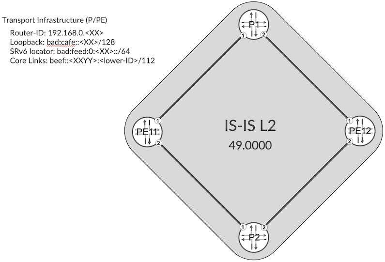
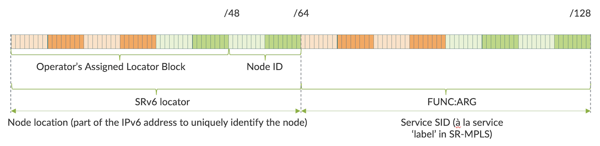

# SRv6 Basics: Locator and End SIDs

**Krzysztof Szarkowicz - 06/29/2022**

SRv6 (Segment Routing version 6) is a version of segment routing based on IPv6 tunneling mechanism, rather than on MPLS (MultiProtocol Label Switching) underlay. Therefore, with SRv6 underlying transport routers must be capable of forwarding IPv6 (Internet Protocol version 6) packets, and do not require MPLS support.

In the first series of SRv6 articles, I will present very basic SRv6 functionality. Which is the concept of SRv6 locator and SRv6 SID (Segment Identifier). To discuss this simple topic, a very basic topology will be used, as outlined in Figure 1.



- [JCL (Junivators and partners)](https://portal.cloudlabs.juniper.net/RM/Topology?b=6a9c451d-5823-46a2-b99c-488ea3d196a7&d=c78ae7c7-e93b-4708-813e-109fd780f301)
- [vLabs (open to all)](https://portal.cloudlabs.juniper.net/RM/Topology?b=3d271e0c-896c-4cae-9176-f74ff30c24a2&d=2f99da30-8756-4d15-8822-d648498c7aea)

## Introduction

In this topology, all IP addresses in the transport infrastructure (loopbacks, links of PE and P routers) are IPv6 addresses from the IPv6 subnets listed in Figure 1. There are no IPv4 addresses at all, since SRv6 relies completely on IPv6. Obviously, SRv6 can be deployed in dual-stack (IPv4 + IPv6) transport infrastructure, but it unnecessarily complicates the design and is absolutely not required. The only 'IPv4 like' number used in the design is a router ID associated with each router in the transport infrastructure. Given the fact, that this ID is 32-bit, it looks like an IPv4 address (although, it isn't).

## SRv6 Locator

Apart from configuring a standard IPv6 network, what is needed to enable SRv6?

The most important and most basic piece of SRv6 configuration is the allocation of SRv6 locators to each router in the transport infrastructure.

But wait a minute, what is an SRv6 locator, actually?

An SRv6 locator is an IPv6 subnet. Apart from allocating for each router some host IPv6 prefix for loopback (/128), you need to allocate as well some IPv6 subnet to each router (for example /64).

And, what is it for, this locator?

In a very basic sense, SRv6 locator is the base for SRv6 SID. An SRv6 SID is 128-bit long number (thus, the same size as an IPv6 address) constructed from the SRv6 locator (most significanct bits in the SRv6 SID), and other values, defining the actual function of the locator. From this definition, it can be easily derived, that there could be multiple SRv6 SIDs associated with a single router -- each SRv6 SID based on the same IPv6 prefix defined as the SRv6 locator.

In this topology, we are allocating the locators using bad:feed:0:<XX>::/64 subnet, where XX is the node ID, as pictured in Figure 1.

```
    routing-options {
        source-packet-routing {
            srv6 {
                locator SRV6-LOC-1 bad:feed:0:11::/64;
            }
        }
    }
```

*Configuration 1: SRv6 Locator on PE11*

SRV6-LOC-1 is just a locally significant name. In addition to configuring the locator, you need to enable SRv6 extension in the IGP (Interior Gateway Protocol) - IS-IS (Intermediate System to Intermediate System) in this particular case - and specify, which locator should be used in IGP advertisements. Note that it is possible to use multiple locators per node; we will discuss scenarios, where multiple locators might be used, in some follow up SRv6 articles. The name of the SRv6 locator is not exchanged via the IGP extensions, just the SRv6 locator value.

```
    protocols {
        isis {
            source-packet-routing {
                srv6 {
                    locator SRV6-LOC-1;
                }
            }
        }
    }
```

*Configuration 2: SRv6 IS-IS extensions on PE11*

Now, after defining the SRv6 locator, and enabling IS-IS SRv6 extensions, you can verify the status.

```
  root@PE11> show isis overview | find SPRING 
  W15: Fri 2022-04-15T06:08:22 PDT (UTC-0700)
    Source Packet Routing (SPRING): Enabled
      Node Segments: Disabled
      SRv6: Enabled
        Locator: bad:feed:0:11::/64, Algorithm: 0
(...)
```

*CLI-Output 1: IS-IS Status*

First success! SRv6 is enabled and local locator is shown! Note: we will discuss different algorithms in some follow-up SRv6 blog.

You can as well check the IS-IS database, and verify the SRv6 locator advertisements.

```
      root@PE11> show isis database extensive | match ", Lifetime:|Locator| V6 prefix"
      W15: Fri 2022-04-15T06:24:10 PDT (UTC-0700)
      P1.00-00 Sequence: 0x6, Checksum: 0xb448, Lifetime: 63949 secs
         V6 prefix: bad:cafe::1/128                 Metric:        0 Internal Up
         V6 prefix: bad:feed:0:1::/64               Metric:        0 Internal Up
         V6 prefix: beef::111:0/112                 Metric:     1000 Internal Up
         V6 prefix: beef::112:0/112                 Metric:     1000 Internal Up
          SRv6 Locator: bad:feed:0:1::/64, Metric: 0, MTID: 0, Flags: 0x0, Algorithm: 0
      P2.00-00 Sequence: 0x6, Checksum: 0x3736, Lifetime: 63953 secs
        V6 prefix: bad:cafe::2/128                 Metric:        0 Internal Up
        V6 prefix: bad:feed:0:2::/64               Metric:        0 Internal Up
        V6 prefix: beef::211:0/112                 Metric:     1000 Internal Up
        V6 prefix: beef::212:0/112                 Metric:     1000 Internal Up
         SRv6 Locator: bad:feed:0:2::/64, Metric: 0, MTID: 0, Flags: 0x0, Algorithm: 0
     PE11.00-00 Sequence: 0x9, Checksum: 0x1854, Lifetime: 64033 secs
        V6 prefix: bad:cafe::11/128                Metric:        0 Internal Up
        V6 prefix: bad:feed:0:11::/64              Metric:        0 Internal Up
        V6 prefix: beef::111:0/112                 Metric:     1000 Internal Up
        V6 prefix: beef::211:0/112                 Metric:     1000 Internal Up
         SRv6 Locator: bad:feed:0:11::/64, Metric: 0, MTID: 0, Flags: 0x0, Algorithm: 0
     PE12.00-00 Sequence: 0x8, Checksum: 0x2715, Lifetime: 63951 secs
        V6 prefix: bad:cafe::12/128                Metric:        0 Internal Up
        V6 prefix: bad:feed:0:12::/64              Metric:        0 Internal Up
        V6 prefix: beef::112:0/112                 Metric:     1000 Internal Up
        V6 prefix: beef::212:0/112                 Metric:     1000 Internal Up
         SRv6 Locator: bad:feed:0:12::/64, Metric: 0, MTID: 0, Flags: 0x0, Algorithm: 0
```

*CLI-Output 2: SRv6 Locator advertisement*

As you can see, each node advertises the IPv6 subnet used for SRv6 locator as legacy IPv6 prefix (IS-IS TLV - Type-Length-Value - 236: IPv6 IP Reachability), as well as SRv6 locator (IS-IS TLV 27: SRv6 Locator). There is some other information (like flags) visible -- this will be discussed in some follow-up articles.

```
    kszarkowicz-mbp:Downloads kszarkowicz$ tshark -r isis-srv6-locator.pcap -V
    (...)
        Router Capability (t=242, l=42)
    (...)
            Segment Routing - Algorithms (t=19, l=1)
                Algorithm: Shortest Path First (SPF) (0)
            SRv6 Capability (t=25, l=2)
                Flags: 0x0000
                    .0.. .... .... .... = OAM flag: Not set
                    0.00 0000 0000 0000 = Unused: 0x0000
  (...)
      SRv6 Locator (t=27, l=18)
          Type: 27
          Length: 18
          0000 .... .... .... = Reserved: 0x0
          .... 0000 0000 0000 = Topology ID: Standard topology (0)
          Metric: 0
          Flags: 0x00
              0... .... = Down bit: Not set
              .000 0000 = Reserved: 0x00
          Algorithm: Shortest Path First (SPF) (0)
          Locator Size: 64
          Locator: bad:feed:0:11::
          SubCLV Length: 0
      IPv6 reachability (t=236, l=83)
          Type: 236
          Length: 83
          IPv6 Reachability: bad:feed:0:11::/64
              Metric: 0
              0... .... = Distribution: Up
              .0.. .... = Distribution: Internal
              ..0. .... = Sub-TLV: No
              Prefix Length: 64
              IPv6 prefix: bad:feed:0:11::
              no sub-TLVs present
  (...)
```

*CLI-Output 3: Packet dump with SRv6 Locator information*

If you check the routing tables for SRv6 locators, you can observe they are present in both inet6.0 (installed based on IS-IS TLV 236: IPv6 IP Reachability) and in inet6.3 (installed based on IS-IS TLV 27: SRv6 Locator) RIBs (Routing Information Base). Having them in inet6.0 allows routing (i.e. IPv6 packet with the destination matching SRv6 locator prefix can be routed). Having them in inet6.3 allows for BGP (Border Gateway Protocol) protocol next-hop resolution for BGP services (like for example L3VPN) carried across SRv6 underlay. This will be discussed in the next blog in more detail.

```
    root@PE11> show route bad:feed:0::/48    
    W15: Fri 2022-04-15T06:59:21 PDT (UTC-0700)
     
    inet6.0: 20 destinations, 20 routes (20 active, 0 holddown, 0 hidden)
    + = Active Route, - = Last Active, * = Both
     
    bad:feed:0:1::/64  *[IS-IS/18] 01:01:13, metric 1000
                        >  to fe80::5604:dff:fe00:560b via ge-0/0/1.0
    bad:feed:0:2::/64  *[IS-IS/18] 00:29:52, metric 1000
                       >  to fe80::5604:dff:fe00:4b92 via ge-0/0/2.0
  bad:feed:0:11::/64 *[IS-IS/18] 01:00:11, metric 0
                         Reject
  bad:feed:0:12::/64 *[IS-IS/18] 00:29:52, metric 2000
                      >  to fe80::5604:dff:fe00:560b via ge-0/0/1.0
                          to fe80::5604:dff:fe00:4b92 via ge-0/0/2.0
   
  inet6.3: 3 destinations, 3 routes (3 active, 0 holddown, 0 hidden)
  + = Active Route, - = Last Active, * = Both
   
   bad:feed:0:1::/64  *[SRV6-ISIS/14] 01:00:11, metric 1000
                       >  to fe80::5604:dff:fe00:560b via ge-0/0/1.0, SRV6-Tunnel, Dest: bad:feed:0:1::
  bad:feed:0:2::/64  *[SRV6-ISIS/14] 00:29:52, metric 1000
                      >  to fe80::5604:dff:fe00:4b92 via ge-0/0/2.0, SRV6-Tunnel, Dest: bad:feed:0:2::
   bad:feed:0:12::/64 *[SRV6-ISIS/14] 00:29:52, metric 2000
                      >  to fe80::5604:dff:fe00:560b via ge-0/0/1.0, SRV6-Tunnel, Dest: bad:feed:0:12::
                         to fe80::5604:dff:fe00:4b92 via ge-0/0/2.0, SRV6-Tunnel, Dest: bad:feed:0:12::
```

*CLI-Output 4: Packet dump with SRv6 Locator information*

## SRv6 SID

OK. We successfully configured SRv6 locators on the routers, and verified that these locators are distributed across entire network. Now, if you try to verify the forwarding:

```
    root@PE11> ping bad:cafe::12 count 1   
    W15: Fri 2022-04-15T07:17:50 PDT (UTC-0700)
    PING6(56=40+8+8 bytes) beef::111:11 --> bad:cafe::12
    16 bytes from bad:cafe::12, icmp_seq=0 hlim=63 time=20.581 ms
     
    --- bad:cafe::12 ping6 statistics ---
    1 packets transmitted, 1 packets received, 0% packet loss
    round-trip min/avg/max/std-dev = 20.581/20.581/20.581/0.000 ms
     
  root@PE11> ping bad:feed:0:12:: count 1
  W15: Fri 2022-04-15T07:18:02 PDT (UTC-0700)
  PING6(56=40+8+8 bytes) beef::111:11 --> bad:feed:0:12::
  64 bytes from beef::212:12: Destination Host Unreachable
  Vr TC  Flow Plen Nxt Hlim
   6 00 00000 0010  3a   3f
  beef::111:11->bad:feed:0:12::
  ICMP6: type = 128, code = 0
   
  --- bad:feed:0:12:: ping6 statistics ---
  1 packets transmitted, 0 packets received, 100% packet loss
```

*CLI-Output 5: Forwarding towards SRv6 locator*

You can observe that forwarding towards IPv6 loopback is OK, but forwarding towards SRv6 locator fails with failure code "Destination Host Unreachable" provided by the destination node itself (beef::212:12 is the link address on PE12 for the P2-PE12 link). In essence, the packet reached the destination node, but the destination node has no idea what it is supposed to do with it.

Well, this is, actually, expected. The piece that is missing is SRv6 SID. As mentioned earlier, SID defines some functions. Meaning: what is supposed to happen with the packet that uses the SID as IPv6 destination address, when the packet arrives at the endpoint advertising the SRv6 locator. An exemplary structure of the SRv6 SID is outlined in Figure 2.



In essence, the 128-bit long SRv6 SID can be divided into two main parts: SRv6 locator and FUNC:ARG (Function:Argument).

SRv6 standard doesn't specify any fixed boundaries between these parts. The boundaries can be limited by the particular SRv6 implementation (Junos doesn't have such limitation) or can be freely chosen by the operator to align to particular design requirements.

Boundaries mentioned in the figure are just examples used in this blog:

- SRv6 Locator block: bad:feed:0::/48
- SRv6 Locator: bad:feed:0:<Node-ID>:/64

There is large number of functions (called as well end-point behaviors) defined in the SRv6 standard ([RFC 8986](https://datatracker.ietf.org/doc/html/rfc8986)). The most basic function is the 'Endpoint' behavior (End SID in short), which instructs the router to locally 'consume' the packet. Thus, to successfully perform previous ping tests, we need to define End SID for each node.

```
    protocols {
        isis {
            source-packet-routing {
                srv6 {
                    locator SRV6-LOC-1 {
                        end-sid bad:feed:0:11::;
                    }
                }
            }
        }
  }
```

*Configuration 3: SRv6 End SID on PE11*

End SID is a host (/128) IPv6 address from within the SRv6 locator subnet allocated to the router. In this particular case I used SID with 'all zeros' in the FUNC:ARG portion of the SRv6 SID. The defined SRv6 End SID appears similar to the SRv6 locator, which is probably easier from an operational perspective. Saying that, any value in the FUNC:ARG portion could be used. Now, if you perform some checks:

```
    root@PE11> show isis overview | find SPRING
    W15: Fri 2022-04-15T08:20:38 PDT (UTC-0700)
      Source Packet Routing (SPRING): Enabled
        Node Segments: Disabled
        SRv6: Enabled
          Locator: bad:feed:0:11::/64, Algorithm: 0
            END-SID: bad:feed:0:11::, Flavor: None
    (...)
   root@PE11> show isis database extensive | match ", Lifetime:|SRv6 SID"           
  W15: Fri 2022-04-15T08:24:36 PDT (UTC-0700)
  P1.00-00 Sequence: 0xb, Checksum: 0x6c12, Lifetime: 64923 secs
        SRv6 SID: bad:feed:0:1::, Flavor: None
  P2.00-00 Sequence: 0xb, Checksum: 0xbed2, Lifetime: 64935 secs
        SRv6 SID: bad:feed:0:2::, Flavor: None
  PE11.00-00 Sequence: 0xf, Checksum: 0xb19c, Lifetime: 64912 secs
        SRv6 SID: bad:feed:0:11::, Flavor: None
  PE12.00-00 Sequence: 0xd, Checksum: 0x8f0, Lifetime: 64859 secs
        SRv6 SID: bad:feed:0:12::, Flavor: None
```

*CLI-Output 6: IS-IS SRv6 End SID states*

These SRv6 End SIDs are flooded via SRv6 IS-IS extensions, and allow the router to accept and process the packets with IPv6 address equal to locally defined End SID. Please note, there are no changes in the routing tables. The routing still uses SRv6 locators. It is just endpoint behavior (meaning, what happens, when the packet eventually arrives at the end node), which is now defined. And now, ping works!

```
    root@PE11> ping bad:feed:0:12:: count 1                                             
    W15: Fri 2022-04-15T08:32:15 PDT (UTC-0700)
    PING6(56=40+8+8 bytes) beef::111:11 --> bad:feed:0:12::
    16 bytes from beef::112:12, icmp_seq=0 hlim=63 time=5.216 ms
     
    --- bad:feed:0:12:: ping6 statistics ---
    1 packets transmitted, 1 packets received, 0% packet loss
    round-trip min/avg/max/std-dev = 5.216/5.216/5.216/0.000 ms
```

*CLI-Output 7: Forwarding towards SRv6 locator*

## Conclusion

In the next article, we will discuss how the L3 services (global IPv4/IPv6, L3VPN with IPv4/IP6) can be implemented with SRv6 underlay.

## Useful links

- RFC 8986: [Segment Routing over IPv6 (SRv6) Network Programming](https://datatracker.ietf.org/doc/html/rfc8986)
- SRv6 in Junos: [https://www.juniper.net/documentation/us/en/software/junos/is-is/topics/topic-map/infocus-isis-srv6-network-programming.html](https://www.juniper.net/documentation/us/en/software/junos/is-is/topics/topic-map/infocus-isis-srv6-network-programming.html)
- TechPost 1: SRv6 Basics Locator and End-SIDs - [https://juniper.github.io/techposts/srv6-basics-locator-and-end-sids/article](https://juniper.github.io/techposts/srv6-basics-locator-and-end-sids/article)
- TechPost 2: L3VPN on SRv6 - [https://juniper.github.io/techposts/l3vpn-over-srv6/article](https://juniper.github.io/techposts/l3vpn-over-srv6/article)
- TechPost 3: SRv6 Summarisation - [https://juniper.github.io/techposts/srv6-summarization/article](https://juniper.github.io/techposts/srv6-summarization/article)
- TechPost 4: SRv6 SID Encoding and Transposition - [https://juniper.github.io/techposts/srv6-sid-encoding-and-transposition/article](https://juniper.github.io/techposts/srv6-sid-encoding-and-transposition/article)

## Glossary

- BGP: Border Gateway Protocol
- CE: Customer Edge
- ID: Identifier
- IGP: Interior Gateway Protocol
- IS-IS: Intermediate System to Intermediate System
- P: Provider
- PE: Provider Edge
- IP: Internet Protocol
- IPv4: Internet Protocol version 4
- IPv6: Internet Protocol version 6
- L3VPN: Layer 3 Virtual Private Network
- MPLS: MultiProtocol Label Switching
- RIB: Routing Information Base
- SID: Segment Identifier
- SRv6: Segment Routing version 6
- TLV: Type-Length-Value

## Acknowledgements

Thanks to Anton Elita for thorough review, and Abhishek Murali for preparing JCL and vLabs topologies.
