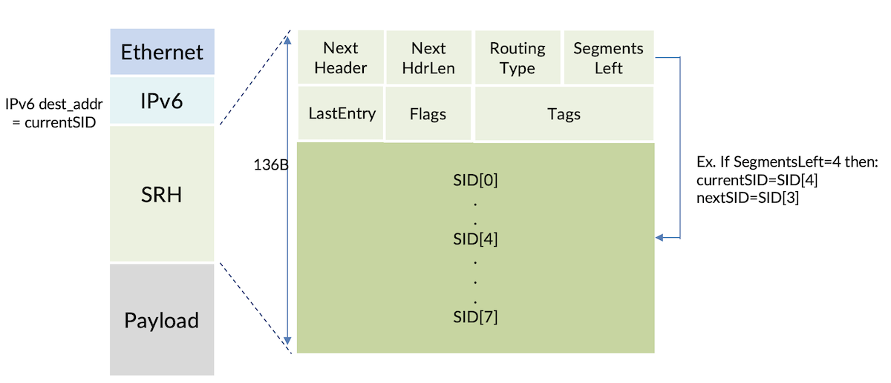
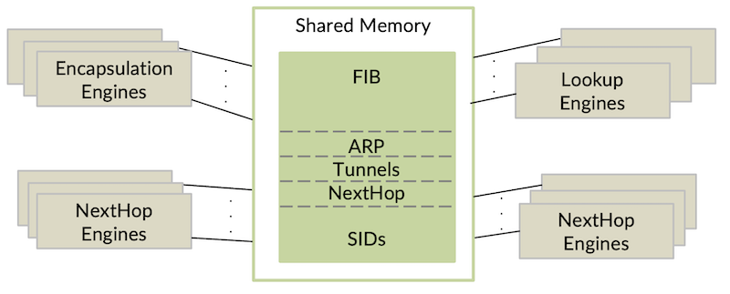
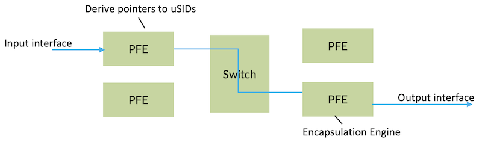
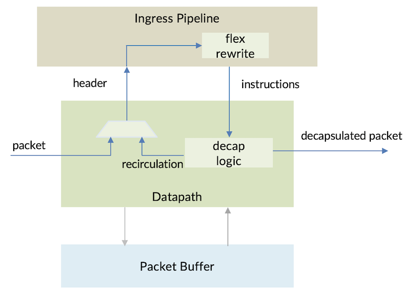

# SRv6 in PTX Express 5

**Nancy Shaw - 04/18/2024**

PTX Express 5 ASIC has full support for SRv6 with up to 8 carrier segment identifiers (SIDs) in a packet. That translates to 48 micro-SIDs (uSIDs), enough to pass a packet around the world! Following is a description of how SRv6 was implemented in the ASIC.

## Introduction

The large-sized headers and distinct processing steps associated with SRv6 pose challenges in the dataplane. Existing fixed pipeline designs cannot simply support SRv6 without changes. This article covers the complexities of implementing SRv6 in hardware and how our newest ASIC, the Express 5 addresses them.

### The SRv6 Packet

Let's start by recapping what an SRv6 packet looks like. SRv6 packets are encapsulated with an IPv6 header and a Segment Routing Header (SRH). SRv6 header's large size comes from the SRH which consists of a base header followed by an array of 128-bit segment identifiers (SIDs). The SegmentsLeft field in the SRH is an index into the SID array and points to the active or "currentSID". The "currentSID" is always copied into the IPv6 destination address. The "nextSID" is the array entry at SegmentsLeft minus 1. Each SID represents an endpoint node along the segment routing path and encodes instructions to be executed. The most basic instruction is the END SID. In the case of uSIDs, each 128-bit SID is a carrier SID and contains multiple smaller-sized SIDs, typically 16-bit or 32-bit.

## The Express Architecture

The Express 5 packet processing engine is a fixed pipeline architecture. Fixed pipeline designs deliver high throughput with lower power and area compared to other architectures. This is achieved with hardcoded functions that have limited configurability. The hardcoded functions are why previous fixed pipeline chips cannot support the large headers and new operations needed by SRv6.

## Implementing SRv6

### Encapsulating with SRH

Encapsulating a packet with SRH means accessing large data structures that supply the array of SIDs. Using dedicated memory for SIDs is an inefficient use of area since it will be unused in transit nodes. Reading long SID arrays from memory can degrade performance. Express 5 addresses these issues with a large, fungible, on-chip memory. This memory is accessible by multiple clients in parallel using high bandwidth read ports. The memory can be flexibly partitioned depending on the use case.  When Express 5 is in a source node, parts of the on-chip memory can be designated to store SIDs.  In an endpoint or transit node, that same memory partition can be re-purposed for Forwarding Information Base (FIB) and Next hop instructions.

Once the SID list has been created, the SRH base is formed with calculated and configurable fields by the encapsulation engine. To keep packet size to a minimum, Express 5 can construct the SRH in reduced format or skip SRH insertion when only 1 carrier SID is required. If a traffic engineering policy requires multiple SRH headers, this can be achieved by passing the packet through the encapsulation engine multiple times. In each pass, a new SRH is formed and inserted into the header.

SIDs are derived through lookups and Next Hop processing at the packet forwarding engine (PFE) of the input interface. In Express 5, the encapsulation engine is located on the PFE of the output interface. Passing SID lists through the pipeline adds a large amount of overhead. Instead, Express 5 uses pointers that represent the SID lists saving storage in the pipeline. Multiple pointers are supported which can improve scale. As an example one pointer can be used for the L2 or L3 service SID, and another for the Segment Routing policy. The service SID pointer can then be reused with different Segment Routing policies.

### Parsing SRH

Parsing a large SRH will involve examining more header bytes than the 128 accessible by previous Express packet processing engines. Increasing the header bytes with a wider data bus is wasteful since not all packets have large headers. Express 5 uses a compromise approach where the parser only receives a bigger header for packets with large SRH and only enough extra bytes to extract "nextSID" if it exists. This is sufficient for basic endpoint processing which only requires examining the base SRH header and "nextSID". The larger header is sent over additional cycles so that the data bus does not need to be widened.

### Endpoint Lookups

A SID encoded with the basic END instruction entails two lookups into the FIB. The first lookup is on the "currentSID" to establish whether SID is local. If local, a second lookup is required on "nextSID" to determine how to forward to next segment endpoint. Although Express 5 can execute many lookups, performance is optimized for traditional IPv6 transit packets which require only one lookup. Increasing the lookup budget would be very expensive in power and area. Express 5 offers two solutions to this performance problem. The first is to re-purpose firewall filter capabilities to provide an additional lookup. A second is to merge "currentSID" and "nextSID" into a single lookup. Both solutions use existing capabilities requiring no increase in area.

### Load Balancing

Quality load balancing over a Link Aggregation (LAG) or Equal Cost Multipath (ECMP) needs high entropy which exists in payload headers. Payload headers are not accessible by a single pass of the parser if packets have a large outer SRH. To solve the load balancing problem, Express 5 supports the IPv6 flow label. This field is populated with an entropy hash as part of SRv6 encapsulation at the source node. In transit and endpoint nodes, the IPv6 flow label is included in hash calculated for load distribution.

### Header Rewrite

Header rewrite operations are unique to SRv6. The basic END instruction includes updating the IPv6 destination address and decrementing SRH's SegmentsLeft field. The destination address is replaced with either the "nextSID" or in the case of uSID, a shifted version of the existing destination address. Because of the varied operations, Express 5, uses a flexible rewrite engine capable of modifying any field within the available header bytes. Fields can be shifted, operated on, or replaced. Since "nextSID" has already been extracted by the parser, and the rewritten fields are within the IPv6 header or SRH base header, these operations can be completed without access to the full SRH.

### Decapsulating the SRH

Supporting the END SID at the last segment entails removing the outer headers and parsing inner headers even further into the packet. Express 5 allows multiple passes through the processing pipeline via recirculation. In each pass, headers can be decapsulated and bytes deeper into the packet are made available.

Penultimate Segment Pop (PSP) and Ultimate Segment Pop (USP) variants of the END instruction involve removing the SRH from the packet. This is unlike other decapsulation operations since a header is stripped from the middle of the packet rather than the outermost part of the packet. Express 5 supports this form of decapsulation using a strip and replace operation. Because the large SRH headers are unreachable by packet processing, all decapsulation operations are executed in the datapath which has access to the whole packet.

## Summary

SRv6 is a complex protocol which presents challenges for the ASIC. Juniper's Express 5 has overcome these complexities using a combination of built-in flexibility and novel techniques.

## Useful links

- RFC 8986 Segment Routing over IPv6 (SRv6) Network Programming
[https://www.rfc-editor.org/rfc/rfc8986.html](https://www.rfc-editor.org/rfc/rfc8986.html)
- RFC 8754 IPv6 Segment Routing Header
[https://datatracker.ietf.org/doc/html/rfc8754](https://datatracker.ietf.org/doc/html/rfc8754)
- RFC 6438 Using the IPv6 Flow Label for Equal Cost Multipath Routing and Link Aggregation in Tunnels
[https://www.rfc-editor.org/rfc/rfc6438](https://www.rfc-editor.org/rfc/rfc6438)
- Network Programming extension: SRv6 uSID instruction
[https://www.ietf.org/archive/id/draft-filsfils-spring-net-pgm-extension-srv6-usid-16.html](https://www.ietf.org/archive/id/draft-filsfils-spring-net-pgm-extension-srv6-usid-16.html)
- Day One: Introduction to SRv6
[https://www.juniper.net/documentation/en_US/day-one-books/DayOne-Intro-SRv6.pdf](https://www.juniper.net/documentation/en_US/day-one-books/DayOne-Intro-SRv6.pdf)

## Glossary

- ECMP: Equal Cost Multipath
- FIB: Forwarding Information Base
- LAG: Link Aggregation
- PFE: Packet Forwarding Engine
- PSP: Penultimate Segment PoSID: Segment Identifier
- SRH: Segment Routing Header
- SRv6: Segment Routing IPv6
- uSID: micro-Segment Identifier
- USP: Ultimate Segment Pop

## Acknowledgements

Thanks to Chandrasekaran Venkatraman, Karthik Gadela, and Swamy SRK for their review and feedback.
