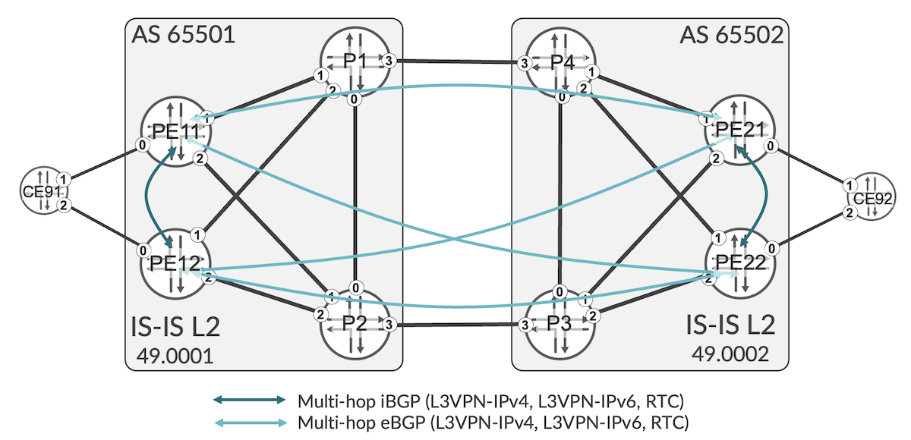
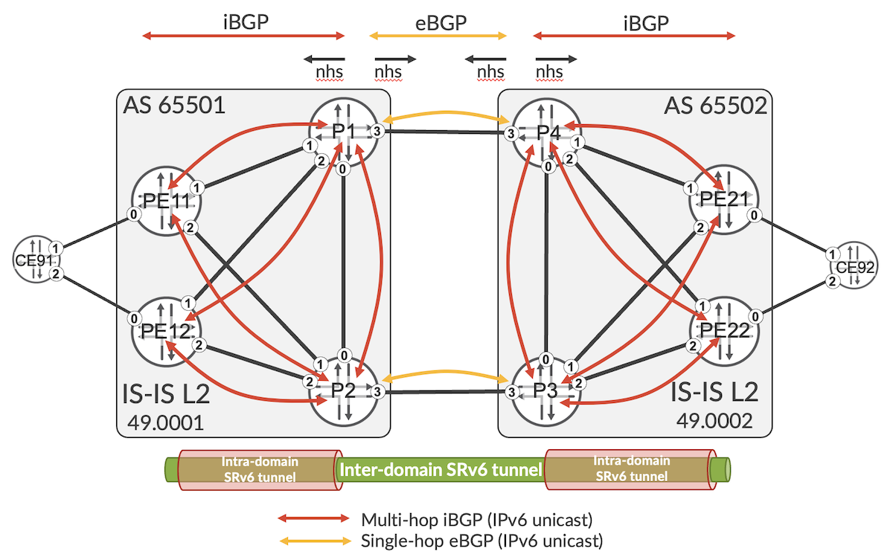
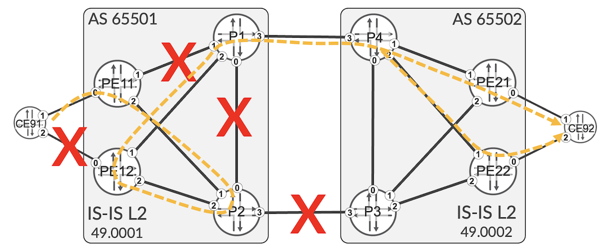
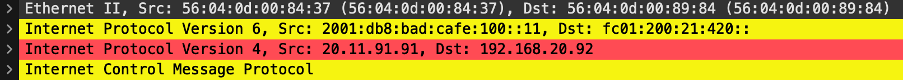
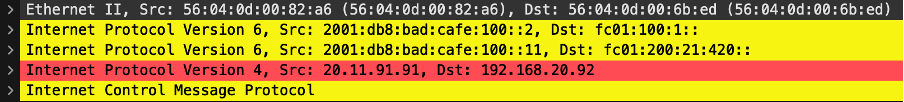

# SRv6 L3VPN Inter-AS Option-C

**Krzysztof Szarkowicz - 02/06/2023**

Layer 3 Virtual Private Network Inter-AS option using SRv6 as underlay transport on MX and ACX7000 routers.

## Introduction

This is the 5th blog post in the series of SRv6 blogs. This blog post is co-authored by Krzysztof Szarkowicz and Rajesh M, and discusses the L3VPN (Layer 3 Virtual Private Network) Inter-AS (Inter Autonomous System) Option C, using SRv6 as underlay transport. This could be used by SP (Service Provider) in different deployments where IGP (Interior Gateway Protocol) domains are not merged, for example:

- network is divided into separate AS (Autonomous Systems) as a result of network mergers and migrations
- network is divided into separate AS domains due to logical separation (e.g., different AS for data canter network, and different AS for transport network)
- network is divided into separate AS domains due to operational reasons (network size, different operations team maintaining different parts of the network, etc.)

This blog post is based on the capabilities of Junos 22.3 running on MX Series and ACX7000 routers. Configuration and operational command outputs have been collected on vMX in our labs.

You can test yourself all the concepts described in this article, we created labs in JCL and vLabs:
[JCL (Junivators and partners)](https://portal.cloudlabs.juniper.net/RM/Topology?b=f71e4ce8-b5c3-4035-8b5b-8887c5cb8e87&d=c78ae7c7-e93b-4708-813e-109fd780f301)
[vLabs (open to all)](https://portal.cloudlabs.juniper.net/RM/Topology?b=67a2a51e-fea4-4694-b946-ccbc16132ce4&d=2f99da30-8756-4d15-8822-d648498c7aea)

In this blog post, following IP (Internet Protocol) addressing is used:

Transport Infrastructure (P/PE)

- Router-ID: 198.51.100.[XX]
- Loopback: 2001:db8:bad:cafe:[area]00::[XX]/128
- SRv6 locator: fc01:[area]00:[XX]::/48
- Core Links: 2001:db8:beef:[area]00::[XXYY]:[local-ID]/112

PE-CE links:

- IPv4: [VLAN].[XX].[YY].[local-ID]/24
- IPv6: 2001:db8:babe:face:[VLAN]::[XXYY]:[local-ID]/112

VPN (Virtual Private Network) Loopbacks (CE/PE):

- 192.168.[VLAN].[XX]/32
- 2001:db8:abba:[VLAN]::[XX]/128

## Architecture

[RFC4364 (BGP/MPLS IP Virtual Private Networks)](https://datatracker.ietf.org/doc/html/rfc4364/) describes in Section 10 three different ways of providing L3VPN services over the multi-AS network. These three different architectures are commonly referenced as Inter-AS Option 10A, Inter-AS Option 10B, and Inter-AS Option 10C, given the fact, that a), b), c) options are described in Section 10. Or, simply, they could be referenced as Inter-AS Option A, Inter-AS Option B or Inter-As Option C.

This blog post focuses on Inter-AS Option C architecture. However, as opposed to original Inter-AS Option C described in RFC4364, this time the underlay is not MPLS but SRv6. Figure 1 summarizes the example network topology used as the basis for L3VPN Inter-AS Option C discussion.



The example network has two domains, each domain with different AS number (AS 65501, and AS 65502, respectively), and each domain with its own IGP (IS-IS L2 area 49.0001 and IS-IS L2 area 49.0002). There is no IGP connectivity between these domains -- they are interconnected via BGP only.

The essence of Inter-AS Option C is as follows:

- Services prefixes are exchanged between domains without modification of BGP NEXT_HOP attribute. In the context of SRv6, it also means they are exchanged without modification of SRv6 service SID (i.e., without modification of END.DT4, END.DT6 or END.DT46 SRv6 SIDs). This implies that between PEs in different domains, there must be end-to-end transport tunnel suitable for transporting L3VPN traffic. In the example of this blog post, there is a full mesh of BGP sessions between PEs (within, as well as between, domains), carrying L3VPN prefixes, as outlined in Figure 1. In most deployments, instead of creating full BGP mesh, a RR (Route Reflector) architecture would be used, with PEs within a domain peering with iBGP sessions to RRs of that domain, and L3VPN prefixes exchanged between domains via eBGP sessions between RRs. To simplify this blog post, RR architecture is not used here.
- Transport prefixes (e.g. loopbacks) are exchanged between domains with BGP NEXT_HOP attribute being changed (set to local address, so called "next-hop self" -- nhs -- action) on domain boundaries, as outlined in Figure 2. In the context of SRv6 (see L3VPN over SRv6 blog post for more details), transport end-points for L3VPN services are not loopbacks, but SRv6 locators, hence nhs action must be executed on SRv6 locators as well. Both loopbacks and SRv6 locators are distributed via IPv6 unicast (AFI/SAFI=2/1).



In Inter-AS Option C, there is no need to maintain service prefixes on ASBR (autonomous system boundary router), as the end-to-end tunnels between PEs in different domains provides end-to-end transport capability. This tunnel is a hierarchical tunnel, where inter-domain tunnel (tunnel towards SRv6 locator from remote domain) is tunneled in each domain via intra-domain tunnel (tunnel towards SRv6 locator in the same domain). In this blog post, we will discuss details of this architecture.

### Base Configuration for Exchanging Transport Prefixes

For reference, Configuration 1 shows base configuration for IS-IS on P1 router. Similar configuration is deployed on all other P and PE routers in the topology, and details of this configuration were discussed in previous SRv6 blog posts. Please note, inter-AS link (ge-0/0/3) is not included in IS-IS.

```
    routing-options {
        source-packet-routing {
            srv6 {
                locator SL-000 fc01:100:1::/48;
                no-reduced-srh;
            }
        }
        resolution {
            preserve-nexthop-hierarchy;
      }
      router-id 198.51.100.1;
      autonomous-system 65501;
      ipv6-router-id 2001:db8:bad:cafe:100::1;
      forwarding-table {
          export PS-LOAD-BALANCE;
      }
  }
  protocols {
      isis {
          apply-groups GR-ISIS;
          interface ge-0/0/0.0;
          interface ge-0/0/1.0;
          interface ge-0/0/2.0;
          interface lo0.0 {
              passive;
          }
          source-packet-routing {
              srv6 {
                  locator SL-000 {
                      end-sid fc01:100:1::;
                  }
              }
          }
          level 1 disable;
          level 2 {
              wide-metrics-only;
          }
          reference-bandwidth 1000g;
          no-ipv4-routing;
      }
  }
```

*Configuration 1: Base IS-IS configuration on P1*

There is no IS-IS connectivity between two domains, so before BGP sessions outlined in Figure 1 could be established, connectivity between loopbacks of remote domains must be provided. This is the task of BGP sessions outlined in Figure 2. Therefore, let's have a look at base BGP configuration for distributing loopbacks (to support establishment of multi-hop eBGP sessions outlined in Figure 1), as well as distributing SRv6 locators (to support creation of end-to-end SRv6 tunnels for L3VPN services), taking as an example PE11 (Configuration 2).

```
    policy-options {
        policy-statement PS-BGP-IPV6-EXP {
            term TR-LOCAL-LOOPBACK {
                from {
                    protocol direct;
                    rib inet6.0;
                    interface lo0.0;
                    route-filter 2001:db8:bad:cafe:100::11/128 exact;
                }
              then {
                  community add CM-LOOPBACK-65501;
                  accept;
              }
          }
          term TR-LOCAL-LOCATOR {
              from {
                  rib inet6.0;
                  route-filter fc01:100:11::/48 exact;
              }
              then {
                  community add CM-LOCATOR-65501;
                  accept;
              }
          }
          then reject;
      }
      community CM-LOCATOR-65501 members 65501:1002;
      community CM-LOOPBACK-65501 members 65501:1001;
  }
  protocols {
      bgp {
  (...)
          group GR-IBGP-IPV6-TRANSPORT {
              local-address 2001:db8:bad:cafe:100::11;
              family inet6 {
                  unicast;
              }
              export PS-BGP-IPV6-EXP;
              neighbor 2001:db8:bad:cafe:100::1 {
                  description P1;
              }
              neighbor 2001:db8:bad:cafe:100::2 {
                  description P2;
              }
          }
  (...)
      }
  }
```

*Configuration 2: BGP distribution of transport IPv6 prefixes on PE11*

It is pretty standard configuration advertising local loopback and local SRv6 locator with some geographic community. These communities will be used later in BGP policies.

ASBR routers (P1, P2, P3, P4) have different BGP configuration, as they perform different tasks (Configuration 3).

```
    policy-options {
        policy-statement PS-EBGP-IMP {   
            then accept;
        }
        policy-statement PS-EBGP-IPV6-EXP {
            term TR-IPV6 {
                from {
                    protocol bgp;
                    rib inet6.0;
                   community CM-LOCAL-AS;
              }
              then {
                   next-hop self;
                  accept;
              }
          }
          then reject;
      }
      policy-statement PS-IBGP-IPV6-EXP {
          term TR-LOCAL-AS {
              from community CM-LOCAL-AS;
              then reject;
          }
          term TR-REMOTE-AS {
              from {
                  protocol bgp;
                  rib inet6.0;
              }
              then {
                  next-hop self;
                  accept;
              }
          }
          then reject;
      }
      community CM-LOCAL-AS members 65501:*;
  }
  protocols {
      bgp {
  (...)
          group GR-IBGP-IPV6-TRANSPORT {
              local-address 2001:db8:bad:cafe:100::1;
              family inet6 {
                  unicast;
              }
              export PS-IBGP-IPV6-EXP;
              neighbor 2001:db8:bad:cafe:100::11 {
                  description PE11;
              }
              neighbor 2001:db8:bad:cafe:100::12 {
                  description PE12;
              }
              neighbor 2001:db8:bad:cafe:100::2 {
                  description P2;
              }
          }
          group GR-EBGP-IPV6-TRANSPORT {
              local-address 2001:db8:beef::0104:1;
              import PS-EBGP-IMP;
              family inet6 {
                  unicast;
              }                           
              export PS-EBGP-IPV6-EXP;
              peer-as 65502;
              neighbor 2001:db8:beef::0104:4 {
                  description P4;
              }
          }
  (...)
          defaults {
              ebgp {
                  no-policy {
                      receive reject-always;
                      advertise reject-always;
                  }
              }
          }
      }
```

*Configuration 3: BGP distribution of transport IPv6 prefixes on P1*

Again, pretty standard configuration. Both export policies (for iBGP group, and for eBGP group) use next-hop self (lines 13 and 30), as discussed earlier. There is some basic loop prevention mechanism based on AS specific communities (lines 10, 21, and 36), as best common practice. iBGP sessions are multi-hop (established between loopbacks), while eBGP session is single-hop  (established between link addresses).

Additionally, as best common practice, based on [RFC 8212](https://datatracker.ietf.org/doc/html/rfc8212/), eBGP session, by default, should block prefix exchange, for both inbound and outbound direction. [RFC 8212](https://datatracker.ietf.org/doc/html/rfc8212/) compliant behavior is achieved in Junos with explicit configuration (lines 70-77). Accepting and sending prefixes requires thus explicit import and export policies. Therefore, in addition to explicit export policy (line 63), an explicit import policy is defined as well (lines 2-4, and 59). For simplification, this blog post uses 'allow all' policy as import policy. In real deployment, you probably define some more restrictive policy here. Please note this implicit import policy is needed for eBGP session only.

### Verification of inter-AS transport path

Now, having the transport prefix distribution in place, let's verify it! Starting on PE11 (CLI-Output 1).

```
    kszarkowicz@PE11> show route advertising-protocol bgp 2001:db8:bad:cafe:100::1 detail
     
    inet6.0: 27 destinations, 31 routes (27 active, 0 holddown, 0 hidden)
    * 2001:db8:bad:cafe:100::11/128
 (1 entry, 1 announced)
     BGP group GR-IBGP-IPV6-TRANSPORT type Internal
         Nexthop: Self
         Localpref: 100
         AS path: [65501] I
         Communities: 65501:1001
   
  * fc01:100:11::/48
 (1 entry, 1 announced)
   BGP group GR-IBGP-IPV6-TRANSPORT type Internal
       Nexthop: Self
       MED: 0
       Localpref: 100
       AS path: [65501] I
       Communities: 65501:1002
```

*CLI-Output 1: Advertising IPv6 Prefixes on PE11*

Looks good! PE11 advertises its own loopback (line 4) and own SRv6 locator to P1 (line 11). Also, appropriate communities are attached (line 9 and line 17). Now, let's check next router, P1 (CLI-Output 2).

```
    kszarkowicz@P1> show route advertising-protocol bgp 2001:db8:beef::104:4 detail
     
    inet6.0: 29 destinations, 37 routes (29 active, 0 holddown, 0 hidden)
      2001:db8:bad:cafe:100::11/128 (2 entries, 2 announced)
     BGP group GR-EBGP-IPV6-TRANSPORT type External
         Nexthop: Self
         Flags: Nexthop Change
         AS path: [65501] I
         Communities: 65501:1001
   
    2001:db8:bad:cafe:100::12/128 (2 entries, 2 announced)
   BGP group GR-EBGP-IPV6-TRANSPORT type External
       Nexthop: Self
       Flags: Nexthop Change
       AS path: [65501] I
       Communities: 65501:1001
   
    fc01:100:11::/48 (2 entries, 2 announced)
   BGP group GR-EBGP-IPV6-TRANSPORT type External
       Nexthop: Self
       Flags: Nexthop Change
       AS path: [65501] I
       Communities: 65501:1002
   
    fc01:100:12::/48  (2 entries, 2 announced)
   BGP group GR-EBGP-IPV6-TRANSPORT type External
       Nexthop: Self
       Flags: Nexthop Change
       AS path: [65501] I
       Communities: 65501:1002
```

*CLI-Output 2: Advertising IPv6 Prefixes over eBGP on P1*

Looks also good! Loopbacks and SRv6 locators from PE11 (lines 4 and 18) and PE12 (lines 11 and 12) are sent by P1 to P4 in another AS. Also, as instructed in the configuration, next-hop is changed to self (lines 6-7, 13-14, 20-21, 27-28). Now, let's check next router, P4 (CLI-Output 3).

```
    kszarkowicz@P4> show route advertising-protocol bgp 2001:db8:bad:cafe:200::21 detail
     
    inet6.0: 29 destinations, 37 routes (29 active, 0 holddown, 0 hidden)
    * 2001:db8:bad:cafe:100::11/128 (2 entries, 1 announced)
     BGP group GR-IBGP-IPV6-TRANSPORT type Internal
         Nexthop: Self
         Flags: Nexthop Change
         Localpref: 100
         AS path: [65502] 65501 I
       Communities: 65501:1001
   
  * 2001:db8:bad:cafe:100::12/128 (2 entries, 1 announced)
   BGP group GR-IBGP-IPV6-TRANSPORT type Internal
       Nexthop: Self
       Flags: Nexthop Change
       Localpref: 100
       AS path: [65502] 65501 I
       Communities: 65501:1001
   
  * fc01:100:11::/48 (2 entries, 1 announced)
   BGP group GR-IBGP-IPV6-TRANSPORT type Internal
       Nexthop: Self
       Flags: Nexthop Change
       Localpref: 100
       AS path: [65502] 65501 I
       Communities: 65501:1002
   
  * fc01:100:12::/48 (2 entries, 1 announced)
   BGP group GR-IBGP-IPV6-TRANSPORT type Internal
       Nexthop: Self
       Flags: Nexthop Change
       Localpref: 100
       AS path: [65502] 65501 I
       Communities: 65501:1002
```

*CLI-Output 3: Advertising IPv6 Prefixes over iBGP on P4*

Again, everything looks fine. Again, when P4 sends the transport prefixes to PE21, next-hop of transport prefixes from remote AS is changed to self, which is what we wanted (lines 6-7, 13-14, 20-21, 27-28). Just last check on PE21 (CLI-Output 4).

```
    kszarkowicz@PE21> show route receive-protocol bgp 2001:db8:bad:cafe:200::4 detail       
     
    inet.0: 6 destinations, 6 routes (6 active, 0 holddown, 0 hidden)
     
    RI-VRF20.inet.0: 12 destinations, 22 routes (7 active, 0 holddown, 10 hidden)
     
    RI-VRF30.inet.0: 12 destinations, 22 routes (7 active, 0 holddown, 10 hidden)
     
    iso.0: 1 destinations, 1 routes (1 active, 0 holddown, 0 hidden)
   
  mpls.0: 2 destinations, 2 routes (2 active, 0 holddown, 0 hidden)
   
  bgp.l3vpn.0: 42 destinations, 42 routes (22 active, 0 holddown, 20 hidden)
   
  inet6.0: 27 destinations, 31 routes (27 active, 0 holddown, 0 hidden)
    2001:db8:bad:cafe:100::11/128 (2 entries, 1 announced)
       Accepted MultipathContrib
       Nexthop: 2001:db8:bad:cafe:200::4
       Localpref: 100
       AS path: 65501 I
       Communities: 65501:1001
   
    2001:db8:bad:cafe:100::12/128 (2 entries, 1 announced)
       Accepted MultipathContrib
       Nexthop: 2001:db8:bad:cafe:200::4
       Localpref: 100
       AS path: 65501 I
       Communities: 65501:1001
   
    fc01:100:11::/48 (2 entries, 1 announced)
       Accepted MultipathContrib
       Nexthop: 2001:db8:bad:cafe:200::4
       Localpref: 100
       AS path: 65501 I
       Communities: 65501:1002
   
    fc01:100:12::/48 (2 entries, 1 announced)
       Accepted MultipathContrib
       Nexthop: 2001:db8:bad:cafe:200::4
       Localpref: 100
       AS path: 65501 I
       Communities: 65501:1002
   
  inet6.3: 3 destinations, 3 routes (3 active, 0 holddown, 0 hidden)
   
  RI-VRF20.inet6.0: 15 destinations, 25 routes (10 active, 0 holddown, 10 hidden)
   
  RI-VRF30.inet6.0: 15 destinations, 25 routes (10 active, 0 holddown, 10 hidden)
                                          
  bgp.l3vpn-inet6.0: 44 destinations, 44 routes (24 active, 0 holddown, 20 hidden)
   
  bgp.rtarget.0: 4 destinations, 10 routes (4 active, 0 holddown, 0 hidden)
```

*CLI-Output 4: Receiving IPv6 Prefixes on PE21*

Perfect! PE21 sees remote transport prefixes received from P4 with the BGP NEXT_HOP of P4 loopback (lines 18, 25, 32, 39). All ASBRs change the next-hop to self, so in theory we should be able now to ping between remote PEs (CLI-Output 5).

```
    kszarkowicz@PE21> ping 2001:db8:bad:cafe:100::11 count 1
    PING6(56=40+8+8 bytes) 2001:db8:beef:200::321:21 --> 2001:db8:bad:cafe:100::11
     
    --- 2001:db8:bad:cafe:100::11 ping6 statistics ---
    1 packets transmitted, 0 packets received, 100% packet loss
```

*CLI-Output 5: Ping from PE22 to PE11 (first try)*

Unfortunately, although prefixes are correctly exchanged (verification in only one direction was shown in this blog post, but other direction is similar), ping doesn't work (line 5)!

Oops, wait a minute! We exchanged only loopbacks and SRv6 locators. And, our ping is sourced by default from interface address (line 2). So, let's try a ping sourced from loopback (CLI-Output 6).

```
    kszarkowicz@PE21> ping source 2001:db8:bad:cafe:200::21 2001:db8:bad:cafe:100::11 count 1
    PING6(56=40+8+8 bytes) 2001:db8:bad:cafe:200::21 --> 2001:db8:bad:cafe:100::11
    16 bytes from 2001:db8:bad:cafe:100::11, icmp_seq=0 hlim=62 time=8.762 ms
     
    --- 2001:db8:bad:cafe:100::11 ping6 statistics ---
    1 packets transmitted, 1 packets received, 0% packet loss
    round-trip min/avg/max/std-dev = 8.762/8.762/8.762/0.000 ms
     
    kszarkowicz@PE21> ping source 2001:db8:bad:cafe:200::21 fc01:100:11:: count 1
  PING6(56=40+8+8 bytes) 2001:db8:bad:cafe:200::21 --> fc01:100:11::
  16 bytes from 2001:db8:beef:100::111:11, icmp_seq=0 hlim=62 time=13.639 ms
   
  --- fc01:100:11:: ping6 statistics ---
  1 packets transmitted, 1 packets received, 0% packet loss
  round-trip min/avg/max/std-dev = 13.639/13.639/13.639/0.000 ms
```

*CLI-Output 6: Ping from PE22 to PE11 (second try)*

Fortunately, sourcing the ping from the local loopback solves the issue. Both remote loopback and remote SRv6 locator (or, remote SRv6 END SID, to be more precise -- check [SRv6 Basics: Locator and End SIDs blog post](https://juniper.github.io/techposts/srv6-basics-locator-and-end-sids/article) for more details) are reachable (lines 7 and 14).

### Base Configuration for exchanging L3VPN prefixes

It is now time to look for L3VPN prefix distribution. As indicated earlier (Figure 1), in this blog post we exchange L3VPN prefix via full mesh of iBGP/eBGP sessions between PE routers. Let's look at PE11 for an example BGP configuration (Configuration 4).

```
    policy-options {
        policy-statement PS-EBGP-IMP {
            then accept;
        }
        policy-statement PS-EBGP-L3VPN-EXP {
            term TR-EBGP {
                from {
                    protocol bgp;
                    external;
              }
              then reject;
          }
          term TR-RTC {
              from rib bgp.rtarget.0;
              then accept;
          }
          term TR-L3VPN {
              from community RT;
              then {
                  community delete CM-RTE-TYPE;
                  accept;
              }
          }
          then reject;                    
      }
      community CM-RTE-TYPE members 0x306:*:*;
      community RT members target:*:*;
  }
  protocols {
      bgp {
  (...)
          group GR-IBGP-L3VPN {
              local-address 2001:db8:bad:cafe:100::11;
              family inet-vpn {
                  unicast {
                      extended-nexthop;
                      advertise-srv6-service;
                      accept-srv6-service;
                  }
              }
              family inet6-vpn {
                  unicast {
                      advertise-srv6-service;
                      accept-srv6-service;
                  }
              }
              family route-target;
              neighbor 2001:db8:bad:cafe:100::12 {
                  description P12;
              }
          }
          group GR-EBGP-L3VPN {
              multihop {
                  no-nexthop-change;
            }
              local-address 2001:db8:bad:cafe:100::11;
              import PS-EBGP-IMP;
              family inet-vpn {
                  unicast {
                      extended-nexthop;
                      advertise-srv6-service;
                      accept-srv6-service;
                  }
              }
              family inet6-vpn {
                  unicast {
                      advertise-srv6-service;
                      accept-srv6-service;
                  }
              }
              family route-target;
              export PS-EBGP-L3VPN-EXP;
              peer-as 65502;
              neighbor 2001:db8:bad:cafe:200::21 {
                  description P21;
              }
              neighbor 2001:db8:bad:cafe:200::22 {
                  description P22;
              }
          }
  (...)
          multipath {
              list-nexthop;
          }
          rfc8950-compliant;
  (...)
```

*Configuration 4: BGP distribution of L3VPN prefixes on PE11*

Similar configuration is deployed on all other PE routers as well. Most of the stanzas were explained in the previous SRv6 blog posts, so we will concentrate here only on a few new aspects of the configuration specific to Inter-AS Option C.

As mentioned earlier, in Inter-AS Option C the L3VPN service prefixes must be sent without changing the NEXT_HOP attribute. This is the default behavior for iBGP, but not for eBGP, where NEXT_HOP attribute is changed to the local address of the BGP session. To prevent this change, dedicated configuration is required (lines 53-54). In the particular example of this blog post, this configuration is, though, not strictly needed, as there are direct eBGP sessions between PE routers. However, if eBGP sessions distributing L3VPN prefixes are established between RRs, as mentioned earlier in the introduction, explicit change of NEXT_HOP attribute on RRs would be required.

Further, as already discussed in the context of exchanging transport prefixes over eBGP sessions, we need some explicit import (line 57) and export (line 72) policies in eBGP group. Import BGP policy (lines 2-4) is the same as already discussed. Export BGP policy (lines 5-23) is some simple policy to advertises RT constraints NLRIs, as well as local L3VPN prefixes. In the test lab, OSPF v3 is used as PE-CE protocol (configuration not shown for brevity), so as we remove OSPF Route Type extended community (line 20), so that information about original OSPF Route Type or OSPF area is lost. In that way, on remote PE the prefixes are imported into OSPF as Type 5 (external) prefixes. Depending on the actual deployment, this BGP export policy might differ significantly between use cases.

### Verification of L3VPN prefix distribution

Having this basic configuration in place, let's have a look, if L3VPN prefix distribution works properly (CLI-Output 7).

```
    kszarkowicz@PE11> show bgp summary
    (...)
    Peer                     AS      InPkt     OutPkt    OutQ   Flaps Last Up/Dwn State|#Active/Received/Accepted/Damped...
    2001:db8:bad:cafe:100::1       65501       9454       9421       0       0 2d 23:33:28 Establ
      inet6.0: 4/4/4/0
    2001:db8:bad:cafe:100::2       65501       9454       9421       0       0 2d 23:33:22 Establ
      inet6.0: 4/4/4/0
    2001:db8:bad:cafe:100::12       65501       9469       9476       0       0 2d 23:33:14 Establ
      bgp.rtarget.0: 0/4/4/0
    bgp.l3vpn.0: 10/10/10/0
    bgp.l3vpn-inet6.0: 10/10/10/0
    RI-VRF20.inet.0: 0/5/5/0
    RI-VRF30.inet.0: 0/5/5/0
    RI-VRF20.inet6.0: 0/5/5/0
    RI-VRF30.inet6.0: 0/5/5/0
  2001:db8:bad:cafe:200::21       65502       9452       9451       0       0 2d 23:33:13 Establ
    bgp.rtarget.0: 2/2/2/0
    bgp.l3vpn.0: 0/10/10/0
    bgp.l3vpn-inet6.0: 0/10/10/0
    RI-VRF20.inet.0: 0/5/5/0
    RI-VRF30.inet.0: 0/5/5/0
    RI-VRF20.inet6.0: 0/5/5/0
    RI-VRF30.inet6.0: 0/5/5/0
  2001:db8:bad:cafe:200::22       65502       9467       9421       0       0 2d 23:33:09 Establ
    bgp.rtarget.0: 2/2/2/0
    bgp.l3vpn.0: 0/10/10/0
    bgp.l3vpn-inet6.0: 0/10/10/0
    RI-VRF20.inet.0: 0/5/5/0
    RI-VRF30.inet.0: 0/5/5/0
    RI-VRF20.inet6.0: 0/5/5/0
    RI-VRF30.inet6.0: 0/5/5/0
```

*CLI-Output 7: BGP session state on PE11*

All expected BGP sessions are up. So, it means transport connectivity between remote PEs is OK (and, we verified that previously with ping). For each VRF we are advertising/receiving five IPv4 and five IPv6 prefixes (lines 12-15, 20-23, 28-31) over each BGP session distributing L3VPN prefixes. However, what is suspicious, we don't accept any prefix (see '0' accepted prefixes)! Neither from iBGP neighbor (lines 8-15), nor from eBGP neighbor (lines 16-31). So, we need a closer look at it (CLI-Output 8).

```
    kszarkowicz@PE11> show route receive-protocol bgp 2001:db8:bad:cafe:200::21 table RI-VRF20.inet.0 hidden detail2      
    RI-VRF20.inet.0: 12 destinations, 22 routes (7 active, 0 holddown, 10 hidden)
      20.21.92.0/24 (2 entries, 0 announced)
         Import Accepted
         Route Distinguisher: 198.51.100.21:20
         VPN Label: 16
         Nexthop: 2001:db8:bad:cafe:200::21
         AS path: 65502 I
       Communities: target:65000:20
   
    20.22.92.0/24 (2 entries, 0 announced)
       Import Accepted
       Route Distinguisher: 198.51.100.21:20
       VPN Label: 16
       Nexthop: 2001:db8:bad:cafe:200::21
       MED: 2
       AS path: 65502 I
       Communities: target:65000:20
   
    192.168.20.21/32 (2 entries, 0 announced)
       Import Accepted
       Route Distinguisher: 198.51.100.21:20
       VPN Label: 16
       Nexthop: 2001:db8:bad:cafe:200::21
       AS path: 65502 I
       Communities: target:65000:20
   
    192.168.20.22/32 (2 entries, 0 announced)
       Import Accepted
       Route Distinguisher: 198.51.100.21:20
       VPN Label: 16
       Nexthop: 2001:db8:bad:cafe:200::21
       MED: 2
       AS path: 65502 I
       Communities: target:65000:20
   
    192.168.20.92/32 (2 entries, 0 announced)
       Import Accepted
       Route Distinguisher: 198.51.100.21:20
       VPN Label: 16
       Nexthop: 2001:db8:bad:cafe:200::21
       MED: 1
       AS path: 65502 I
       Communities: target:65000:20
```

*CLI-Output 8: L3VPN prefixes received at PE11 from PE21*

Hmm. Prefixes received at PE11 from PE21 look pretty OK. Next-hop is set to PE21 loopback (lines 8, 16, 25, 33, 42), there are correct route-targets attached (lines 10, 19, 27, 36, 45). At the first sight, nothing really suspicious. So, let's look further (CLI-Output 9.)

```
    kszarkowicz@PE11> show route 192.168.20.92/32 table RI-VRF20 hidden extensive
     
    RI-VRF20.inet.0: 12 destinations, 22 routes (7 active, 0 holddown, 10 hidden)
    192.168.20.92/32 (2 entries, 0 announced)
             BGP    Preference: 170/-101
                    Route Distinguisher: 192.169.2.22:20
                    Next hop type: Unusable, Next hop index: 0
                    Address: 0x7b3f394
                    Next-hop reference count: 80, key opaque handle: 0x0, non-key opaque handle: 0x0
                  Source: 2001:db8:bad:cafe:200::22
                  State: <Secondary Hidden Ext ProtectionCand>
                  Local AS: 65501 Peer AS: 65502
                  Age: 35:59      Metric: 1
                  Validation State: unverified
                  Task: BGP_65502.2001:db8:bad:cafe:200::22
                  AS path: 65502 I
                  Communities: target:65000:20
                  Import Accepted
                  VPN Label: 16
                  Localpref: 100
                  Router ID: 198.51.100.22
                  Primary Routing Table: bgp.l3vpn.0
                  Thread: junos-main
                  Indirect next hops: 1
                          Protocol next hop: 2001:db8:bad:cafe:200::22
                          Label operation: Push 16
                          Label TTL action: prop-ttl
                          Load balance label: Label 16: None;
                          Indirect next hop: 0x0 - INH Session ID: 0
  (...)
```

*CLI-Output 9: Detailed view of remote L3VPN prefix on PE11*

Well, there is something wrong with the protocol next hop (line 7). Protocol next hop is the loopback of remote PE (line 25). So, what is wrong with it? Let's figure it out (CLI-Output 10).

```
    kszarkowicz@PE11> show route 2001:db8:bad:cafe:200::22
     
    inet6.0: 27 destinations, 31 routes (27 active, 0 holddown, 0 hidden)
    + = Active Route, - = Last Active, * = Both
     
    2001:db8:bad:cafe:200::22/128
                       *[BGP/170] 2d 23:57:32, localpref 100, from 2001:db8:bad:cafe:100::1
                          AS path: 65502 I, validation-state: unverified
                        >  to fe80::5604:dff:fe00:2ba0 via ge-0/0/1.0
                         to fe80::5604:dff:fe00:82a6 via ge-0/0/2.0
                      [BGP/170] 2d 23:57:32, localpref 100, from 2001:db8:bad:cafe:100::2
                        AS path: 65502 I, validation-state: unverified
                      >  to fe80::5604:dff:fe00:82a6 via ge-0/0/2.0
                         to fe80::5604:dff:fe00:2ba0 via ge-0/0/1.0
```

*CLI-Output 10: PE22 loopback visibility on PE11*

Well, remote loopback is there. And we can ping remote loopback (as we checked earlier, when discussing transport connectivity between AS-es -- CLI-Output 6).

But, looking from L3VPN perspective, the problem is that the remote loopback is only in inet6.0, but not in inet6.3. For L3VPN next-hop resolution, next-hops must be in inet6.3. Saying that, we are now looking at L3VPN over SRv6, so as discussed in [SRv6 SID Encoding and Transposition blog post](https://juniper.github.io/techposts/srv6-sid-encoding-and-transposition/article) the next-hop resolution happens via SRv6 SID announced together with L3VPN prefix, and not via NEXT_HOP attribute. Therefore, we should rather look for SRv6 SIDs, and not NEXT_HOP attributes, if there is some problem with L3VPN next-hop resolution.

So, let's see, what SRv6 SIDs we are receiving from remote PE (CLI-Output 8). Ooooops! We don't receive any (CLI-Output 8)! Does remote PE send at all SRv6 SID (CLI-Output 11)?

```
    kszarkowicz@PE22> show route advertising-protocol bgp 2001:db8:bad:cafe:100::11 detail table RI-VRF20.inet.0
     
    RI-VRF20.inet.0: 7 destinations, 12 routes (7 active, 0 holddown, 0 hidden)
    * 20.21.92.0/24 (2 entries, 1 announced)
     BGP group GR-EBGP-L3VPN type External
         Route Distinguisher: 192.169.2.22:20
         VPN Label: 16
         Nexthop: Self
         Flags: Nexthop Change
       MED: 2
       AS path: [65502] I
       Communities: target:65000:20
   
  * 20.22.92.0/24 (2 entries, 1 announced)
   BGP group GR-EBGP-L3VPN type External
       Route Distinguisher: 192.169.2.22:20
       VPN Label: 16
       Nexthop: Self
       Flags: Nexthop Change
       AS path: [65502] I
       Communities: target:65000:20
   
  * 192.168.20.21/32 (2 entries, 1 announced)
   BGP group GR-EBGP-L3VPN type External
       Route Distinguisher: 192.169.2.22:20
       VPN Label: 16
       Nexthop: Self
       Flags: Nexthop Change
       MED: 2
       AS path: [65502] I
       Communities: target:65000:20
   
  * 192.168.20.22/32 (2 entries, 1 announced)
   BGP group GR-EBGP-L3VPN type External
       Route Distinguisher: 192.169.2.22:20
       VPN Label: 16
       Nexthop: Self
       Flags: Nexthop Change
       AS path: [65502] I
       Communities: target:65000:20
   
  * 192.168.20.92/32 (2 entries, 1 announced)
   BGP group GR-EBGP-L3VPN type External
       Route Distinguisher: 192.169.2.22:20
       VPN Label: 16
       Nexthop: Self
       Flags: Nexthop Change
       MED: 1
       AS path: [65502] I
       Communities: target:65000:20  
```

*CLI-Output 11: PE22 advertisements towards PE11*

Well, it doesn't.

The problem is, that by default, for increased security, BGP Prefix SID (which includes SRv6 SID -- please check lines 181-212 in Packet Capture 1 of [SRv6 SID Encoding and Transposition blog post](https://juniper.github.io/techposts/srv6-sid-encoding-and-transposition/article)) is neither advertised, nor accepted over eBGP session. Advertising/accepting BGP Prefix SID requires explicit configuration, as outlined in Configuration 5.

```
    protocols {
        bgp {
            group GR-EBGP-L3VPN {
                advertise-prefix-sid;
                accept-prefix-sid;
            }
        }
    }
```

*Configuration 5: Enabling advertisements/acceptance of BGP Prefix SID*

With this change in place (on all PEs), now we can receive SRv6 SIDs from remote PEs (CLI-Output 12).

```
    kszarkowicz@PE11> show route receive-protocol bgp 2001:db8:bad:cafe:200::21 table RI-VRF20.inet.0 hidden detail | match SID
                    SRv6 SID: fc01:200:21:: Behavior: 19 BL: 48 NL: 0 FL: 16 AL: 0 TL: 16 TO: 48
                    SRv6 SID: fc01:200:21:: Behavior: 19 BL: 48 NL: 0 FL: 16 AL: 0 TL: 16 TO: 48
                    SRv6 SID: fc01:200:21:: Behavior: 19 BL: 48 NL: 0 FL: 16 AL: 0 TL: 16 TO: 48
                    SRv6 SID: fc01:200:21:: Behavior: 19 BL: 48 NL: 0 FL: 16 AL: 0 TL: 16 TO: 48
                    SRv6 SID: fc01:200:21:: Behavior: 19 BL: 48 NL: 0 FL: 16 AL: 0 TL: 16 TO: 48
```

*CLI-Output 12: SRv6 SIDs received from PE21 on PE11*

Now, checking again one of the remote prefixes (CLI-Output 13 and CLI-Output 14) we see some changes.

```
    kszarkowicz@PE11> show route receive-protocol bgp 2001:db8:bad:cafe:200::22 table RI-VRF20.inet.0 hidden detail 192.168.20.92/32    
     
    RI-VRF20.inet.0: 12 destinations, 22 routes (7 active, 0 holddown, 10 hidden)
      192.168.20.92/32 (2 entries, 0 announced)
         Import Accepted MultiNexthop RecvNextHopIgnored
         Route Distinguisher: 192.169.2.22:20
         VPN Label: 16896
         Nexthop: 2001:db8:bad:cafe:200::22
         MED: 1
       AS path: 65502 I
       Communities: target:65000:20
                  SRv6 SID: fc01:200:22:: Behavior: 19 BL: 48 NL: 0 FL: 16 AL: 0 TL: 16 TO: 48
```

*CLI-Output 13: Remote L3VPN prefix received from PE*

```
    kszarkowicz@PE11> show route 192.168.20.92/32 table RI-VRF20 hidden extensive
     
    RI-VRF20.inet.0: 12 destinations, 22 routes (7 active, 0 holddown, 10 hidden)
    192.168.20.92/32 (2 entries, 0 announced)
             BGP    Preference: 170/-101
                    Route Distinguisher: 192.169.2.22:20
                    Next hop type: Unusable, Next hop index: 0
                    Address: 0x7b3f394
                    Next-hop reference count: 80, key opaque handle: 0x0, non-key opaque handle: 0x0
                  Source: 2001:db8:bad:cafe:200::22
                  State: <Secondary Hidden Ext ProtectionCand>
                  Local AS: 65501 Peer AS: 65502
                  Age: 5:57       Metric: 1
                  Validation State: unverified
                  Task: BGP_65502.2001:db8:bad:cafe:200::22
                  AS path: 65502 I
                  Communities: target:65000:20
                  Import Accepted MultiNexthop RecvNextHopIgnored
                  SRv6 SID: fc01:200:22:: Behavior: 19 BL: 48 NL: 0 FL: 16 AL: 0 TL: 16 TO: 48
                  VPN Label: 16896
                  Localpref: 100
                  Router ID: 198.51.100.22
                  Primary Routing Table: bgp.l3vpn.0
                  Thread: junos-main
                  Indirect next hops: 1
                          Protocol next hop: fc01:200:22::
                          Indirect next hop: 0x0 - INH Session ID: 0
  (...)
```

*CLI-Output 14: Detailed view of remote L3VPN prefix on PE11*

BGP NEXT_HOP attribute is still remote loopback (CLI-Output 13, line 8). However, next-hop resolution is based on SRv6 SID (CLI-Output 13, line 12, and CLI-Output 14, lines 19 and 26), not on the NEXT_HOP attribute. Why it is like that was explained in [SRv6 SID Encoding and Transposition blog post](https://juniper.github.io/techposts/srv6-sid-encoding-and-transposition/article). These are good news.

### Troubleshooting of L3VPN Next-Hop Resolution

However, the bad news is, the next-hop is still not resolved (CLI-Output 14, line7). So, we need to troubleshoot further (CLI-Output 15).

```
    kszarkowicz@PE11> show route fc01:200:22::
     
    inet6.0: 27 destinations, 31 routes (27 active, 0 holddown, 0 hidden)
    + = Active Route, - = Last Active, * = Both
     
    fc01:200:22::/48   *[BGP/170] 3d 02:52:03, localpref 100, from 2001:db8:bad:cafe:100::1
                          AS path: 65502 I, validation-state: unverified
                        >  to fe80::5604:dff:fe00:82a6 via ge-0/0/2.0
                           to fe80::5604:dff:fe00:2ba0 via ge-0/0/1.0
                      [BGP/170] 3d 02:52:03, localpref 100, from 2001:db8:bad:cafe:100::2
                        AS path: 65502 I, validation-state: unverified
                      >  to fe80::5604:dff:fe00:82a6 via ge-0/0/2.0
                         to fe80::5604:dff:fe00:2ba0 via ge-0/0/1.0
```

*CLI-Output 15: PE22 SRv6 Locator visibility on PE11*

Remote PE SRv6 locator is present only in inet6.0 RIB (Routing Information Base). For L3VPN next-hop resolution to work, the next-hop must be present in inet6.3 RIB, inet6.0 is not sufficient. As you probably remember from the very first SRv6 blog post ([SRv6 Basics: Locator and End SID](https://juniper.github.io/techposts/srv6-basics-locator-and-end-sids/article)), SRv6 from local domain are distributed via IS-IS using two TLVs (Type-Length-Value): IPv6 prefix (IS-IS TLV 236: IPv6 IP Reachability), as well as SRv6 locator (IS-IS TLV 27: SRv6 Locator). First TLV is used to install the SRv6 locator into inet6.0 RIB as "normal" IPv6 prefix, while second TLV is used for inet6.3 RIB installation. With BGP, we are distributing both IPv6 loopbacks and SRv6 locators as "normal" IPv6 prefixes. So, what do we do? Let's keep remote IPv6 loopbacks in inet6.0 RIB only, while install SRv6 locators into both inet6.0 and inet6.3 with a RIB group (Configuration 6).

```
    policy-options {
        policy-statement PS-IPV6-TRANSPORT {
            term TR-LOCATOR {
                from community CM-LOCATOR;
                then accept;
            }
            then reject;
        }
        community CM-LOCATOR members *:1002;
  }
  routing-options {
      rib-groups {
          RG-IPV6-TRANSPORT {
              import-rib [ inet6.0 inet6.3 ];
              import-policy PS-IPV6-TRANSPORT;
          }
      }
  }
  protocols {
      bgp {
          group GR-IBGP-IPV6-TRANSPORT {
              family inet6 {
                  unicast {               
                      rib-group RG-IPV6-TRANSPORT;
                  }
              }
          }
      }
  }
```

*Configuration 6: Installing remote SRv6 locators in inet6.3 RIB*

The configuration has a RIB group (lines 12-17) listing two RIBs: inet6.0 (primary import RIB) and inet6.3 (secondary import RIB). This RIB group is attached to BGP IPv6 unicast address family (line 22-26). Thus, all received IPv6 unicast prefixes are undergoing the import route policy used by the RIB group (lines 1-10 and 15). Prefixes rejected by the route policy are installed into primary RIB only (inet6.0), while prefixes accepted by the route policy are installed into both primary and secondary RIBs (both inet6.0 and inet6.3).

So, what is the route policy doing? It accepts prefixes with community CM-LOCATOR. Which are our SRv6 locators, as we are attaching different communities for IPv6 loopbacks and SRv6 locators. Please check Configuration 2, line 21 and 28, as well as CLI-Output 1, line 17 as well.

This configuration is required only on PE routers. P (or ASBR) routers do not host L3VPN services, hence they do not require next-hop resolution via inet6.3 RIB.

Did this configuration change help? (CLI-Output 16).

```
    kszarkowicz@PE11> show route fc01:200:22::    
     
    inet6.0: 27 destinations, 31 routes (27 active, 0 holddown, 0 hidden)
    + = Active Route, - = Last Active, * = Both
     
    fc01:200:22::/48   *[BGP/170] 3d 03:32:16, localpref 100, from 2001:db8:bad:cafe:100::1
                          AS path: 65502 I, validation-state: unverified
                        >  to fe80::5604:dff:fe00:82a6 via ge-0/0/2.0
                           to fe80::5604:dff:fe00:2ba0 via ge-0/0/1.0
                      [BGP/170] 3d 03:32:16, localpref 100, from 2001:db8:bad:cafe:100::2
                        AS path: 65502 I, validation-state: unverified
                      >  to fe80::5604:dff:fe00:82a6 via ge-0/0/2.0
                         to fe80::5604:dff:fe00:2ba0 via ge-0/0/1.0
   
  inet6.3: 5 destinations, 7 routes (5 active, 0 holddown, 0 hidden)
  + = Active Route, - = Last Active, * = Both
   
  fc01:200:22::/48   *[BGP/170] 00:31:37, localpref 100, from 2001:db8:bad:cafe:100::1
                        AS path: 65502 I, validation-state: unverified
                      >  to fe80::5604:dff:fe00:82a6 via ge-0/0/2.0
                         to fe80::5604:dff:fe00:2ba0 via ge-0/0/1.0
                      [BGP/170] 00:31:37, localpref 100, from 2001:db8:bad:cafe:100::2
                        AS path: 65502 I, validation-state: unverified
                      >  to fe80::5604:dff:fe00:82a6 via ge-0/0/2.0
                         to fe80::5604:dff:fe00:2ba0 via ge-0/0/1.0
```

*CLI-Output 16: PE22 SRv6 Locator visibility on PE11*

Yes. It did! Remote SRv6 locator is now in both inet6.0 and inet6.3. Just for comparison, let's check remote IPv6 loopback (CLI-Output 17).

```
    kszarkowicz@PE11> show route 2001:db8:bad:cafe:200::22   
     
    inet6.0: 27 destinations, 31 routes (27 active, 0 holddown, 0 hidden)
    + = Active Route, - = Last Active, * = Both
     
    2001:db8:bad:cafe:200::22/128
                       *[BGP/170] 3d 03:55:30, localpref 100, from 2001:db8:bad:cafe:100::1
                          AS path: 65502 I, validation-state: unverified
                        >  to fe80::5604:dff:fe00:2ba0 via ge-0/0/1.0
                         to fe80::5604:dff:fe00:82a6 via ge-0/0/2.0
                      [BGP/170] 3d 03:55:30, localpref 100, from 2001:db8:bad:cafe:100::2
                        AS path: 65502 I, validation-state: unverified
                      >  to fe80::5604:dff:fe00:82a6 via ge-0/0/2.0
                         to fe80::5604:dff:fe00:2ba0 via ge-0/0/1.0
```

*CLI-Output 17: PE22 IPv6 Locator visibility on PE11*

It looks, our RIB group works correctly. Remote IPv6 loopbacks are installed only into inet6.0, while remote SRv6 locators are installed into both inet6.0 and inet6.3. So far, so good.

### Tunneling remote SRv6 Locators over SRv6 tunnels

Returning to our original problem of next-hop resolution of the L3VPN prefix. Did it help? Let's check (CLI-Output 18).

```
    kszarkowicz@PE11> show route 192.168.20.92/32 table RI-VRF20 hidden extensive
     
    RI-VRF20.inet.0: 12 destinations, 22 routes (7 active, 0 holddown, 10 hidden)
    192.168.20.92/32 (2 entries, 0 announced)
             BGP    Preference: 170/-101
                    Route Distinguisher: 192.169.2.22:20
                    Next hop type: Unusable, Next hop index: 0
                    Address: 0x7b3f394
                    Next-hop reference count: 88, key opaque handle: 0x0, non-key opaque handle: 0x0
                  Source: 2001:db8:bad:cafe:200::22
                  State: <Secondary Hidden Ext ProtectionCand>
                  Local AS: 65501 Peer AS: 65502
                  Age: 3:04:34    Metric: 1
                  Validation State: unverified
                  Task: BGP_65502.2001:db8:bad:cafe:200::22
                  AS path: 65502 I
                  Communities: target:65000:20
                  Import Accepted MultiNexthop RecvNextHopIgnored
                  SRv6 SID: fc01:200:22:: Behavior: 19 BL: 48 NL: 0 FL: 16 AL: 0 TL: 16 TO: 48
                  VPN Label: 16896
                  Localpref: 100
                  Router ID: 198.51.100.22
                  Primary Routing Table: bgp.l3vpn.0
                  Thread: junos-main
                  Indirect next hops: 1
                          Protocol next hop: fc01:200:22::
                          Indirect next hop: 0x0 - INH Session ID: 0
  (...)
```

*CLI-Output 18: Detailed view of remote L3VPN prefix on PE11*

Surprise, surprise -- it didn't! There is still some problem with the next-hop (lines 7 and 18), although our next-hop (SRv6 locator) is present in the inet6.3 RIB. So, what is still wrong here?

The problem is, despite installing some prefixes in inet6.3 RIB, it doesn't make them 'SRv6-tunneling capable'. For comparison, let's look at some local (not remote) SRv6 locator (CLI-Output 19).

```
    kszarkowicz@PE11> show route fc01:100:12::    
     
    inet6.0: 27 destinations, 31 routes (27 active, 0 holddown, 0 hidden)
    + = Active Route, - = Last Active, * = Both
     
    fc01:100:12::/48   *[IS-IS/18] 3d 16:42:01, metric 2000
                           to fe80::5604:dff:fe00:2ba0 via ge-0/0/1.0
                        >  to fe80::5604:dff:fe00:82a6 via ge-0/0/2.0
     
  inet6.3: 5 destinations, 7 routes (5 active, 0 holddown, 0 hidden)
  + = Active Route, - = Last Active, * = Both
   
  fc01:100:12::/48   *[SRV6-ISIS/14] 3d 16:42:01, metric 2000
                         to fe80::5604:dff:fe00:2ba0 via ge-0/0/1.0, SRV6-Tunnel, Dest: fc01:100:12::
                      >  to fe80::5604:dff:fe00:82a6 via ge-0/0/2.0, SRV6-Tunnel, Dest: fc01:100:12::
```

*CLI-Output 19: PE12 SRv6 Locator visibility on PE11*

If you compare CLI-Output 16 and CLI-Output 19, you see the major difference in inet6.3. Remote domain SRv6 locator (CLI-Output 16, lines 18-25) currently resolves over plain IPv6 next-hop, while local domain SRv6 locator (CLI-Output 19, lines 13-15) resolves over SRv6 tunnel. For that reason, in the current state in the example network, L3VPN resolution with local domain SRv6 works, while L3VPN resolution with remote domain SRv6 locator fails -- we need SRv6 tunnel here.

So, how do we force remote SRv6 locator to use SRv6 tunnel (so that it is eligible as next-hop for L3VPN), and not plain IPv6 next-hop? To answer this question, let's go back to almost the beginning of this blog post. In Configuration 3, on ASBRs (P1, P2, P3, P4), next-hop self is configured for all IPv6 prefixes (meaning all remote IPv6 loopbacks and remote SRv6 locators) advertised over iBGP sessions (line 30). This is classical Inter-AS Option C configuration. As the result of this action, these IPv6 prefixes (both remote IPv6 loopbacks and remote SRv6 locators) are advertised with ASBR's loopback as NEXT_HOP attribute (e.g., CLI-Output 4, lines 18, 25, 32, 39). It also means, both remote IPv6 loopbacks and remote SRv6 locators, when finally arriving to a PE, are resolved over IPv6 loopback of ASBR. IPv6 loopbacks are not capable for SRv6 tunneling -- we have SRv6 locators for SRv6 tunneling. Installing remote SRv6 locators in inet6.3 doesn't change the resolution scheme -- they are still resolved over non-SRv6-tunneling capable IPv6 loopback of ASBR.

Thus, to change this, we need to change the way SRv6 locators are advertised by ASBRs over iBGP sessions. Instead of using simply 'next-hop self', which causes the NEXT_HOP attribute being set to the source address of the iBGP session (i.e., local loopback), for SRv6 locators we need to change the NEXT_HOP attribute not to local loopback, but to local SRv6 locator (Configuration 7).

```
    [edit policy-options policy-statement PS-IBGP-IPV6-EXP]
         term TR-LOCAL-AS { ... }
    +    term TR-LOOPBACK {
    +        from {
    +            rib inet6.0;
    +            community CM-LOOPBACK;
    +        }
    +        then {
    +            next-hop self;
  +            accept;
  +        }
  +    }
  +    term TR-LOCATOR {
  +        from {
  +            protocol bgp;
  +            rib inet6.0;
  +            community CM-LOCATOR;
  +        }
  +        then {
  +            next-hop fc01:100:1::;
  +            accept;
  +        }
  +    }
  -    term TR-REMOTE-AS {
  -        from {
  -            protocol bgp;
  -            rib inet6.0;
  -        }
  -        then {
  -            next-hop self;
  -            accept;
  -        }
  -    }
  [edit policy-options]
  +    community CM-LOCATOR members *:1002;
  +    community CM-LOOPBACK members *:1001;
  }
```

*Configuration 7: iBGP export policy on P1*

The new iBGP export policy on ASBRs replaces the iBGP export policy used so far (defined in Configuration 3, lines 19-35). The difference is that the term TR-REMOTE-AS is split into two terms: TR-LOOPBACK and TR-LOCATOR. Remote IPv6 loopbacks are readvertised with 'next-hop self' action, as previously. However, remote SRv6 locators are readvertised on ASBRs with 'next-hop <local-SRv6-END-SID>' action.

Let's check if that finally helped with L3VPN resolution (CLI-Output 20).

```
    kszarkowicz@PE11> show route receive-protocol bgp 2001:db8:bad:cafe:100::1 table inet6           
     
    inet6.0: 27 destinations, 31 routes (27 active, 0 holddown, 0 hidden)
      Prefix                  Nexthop              MED     Lclpref    AS path
      2001:db8:bad:cafe:200::21/128
    *                         2001:db8:bad:cafe:100::1     100        65502 I
      2001:db8:bad:cafe:200::22/128
    *                         2001:db8:bad:cafe:100::1     100        65502 I
    * fc01:200:21::/48        fc01:100:1::                 100        65502 I
   * fc01:200:22::/48        fc01:100:1::                 100        65502 I
   
  inet6.3: 5 destinations, 7 routes (5 active, 0 holddown, 0 hidden)
    Prefix                  Nexthop              MED     Lclpref    AS path
  * fc01:200:21::/48        fc01:100:1::                 100        65502 I
  * fc01:200:22::/48        fc01:100:1::                 100        65502 I
```

*CLI-Output 20: Receiving IPv6 prefixes at PE11*

Well, we certainly see some changes. Remote IPv6 loopbacks have ASBR's loopback as NEXT_HOP attribute (lines 6 and 8), while remote SRv6 locators have ASBR's SRv6 locator as NEXT_HOP attribute (lines 9, 10, 14, 15). Please compare previous similar output on PE21 (CLI-Output 4), where NEXT_HOP attribute for both loopbacks and SRv6 locators was the loopback of ASBR.

Does it make remote SRv6 locators SRv6-tunelling capable? Let's check (CLI-Output 21).

```
    kszarkowicz@PE11> show route fc01:200:22:: active-path    
     
    inet6.0: 27 destinations, 31 routes (27 active, 0 holddown, 0 hidden)
    + = Active Route, - = Last Active, * = Both
     
    fc01:200:22::/48   *[BGP/170] 00:29:58, localpref 100, from 2001:db8:bad:cafe:100::1
                          AS path: 65502 I, validation-state: unverified
                           to fe80::5604:dff:fe00:2ba0 via ge-0/0/1.0, SRV6-Tunnel, Dest: fc01:100:1::
                        >  to fe80::5604:dff:fe00:82a6 via ge-0/0/2.0, SRV6-Tunnel, Dest: fc01:100:2::
    
  inet6.3: 5 destinations, 7 routes (5 active, 0 holddown, 0 hidden)
  + = Active Route, - = Last Active, * = Both
   
  fc01:200:22::/48   *[BGP/170] 00:29:58, localpref 100, from 2001:db8:bad:cafe:100::1
                        AS path: 65502 I, validation-state: unverified
                         to fe80::5604:dff:fe00:2ba0 via ge-0/0/1.0, SRV6-Tunnel, Dest: fc01:100:1::
                      >  to fe80::5604:dff:fe00:82a6 via ge-0/0/2.0, SRV6-Tunnel, Dest: fc01:100:2::
```

*CLI-Output 21: PE22 SRv6 Locator visibility on PE11*

Well. Now looks better (compared to CLI-Output 16), as now remote SRv6 locator is resolved over the SRv6 tunnel towards the SRv6 END SID of ASBR (lines 8, 9, 16, 17).

And, did it eventually resolve the problem with L3VPN resolution? Let's check that as well (CLI-Output 22 and CLI-Output 23)

```
    kszarkowicz@PE11> show route 192.168.20.92/32 table RI-VRF20 active-path
    (...)
    192.168.20.92/32   @[BGP/170] 00:37:32, MED 1, localpref 100, from 2001:db8:bad:cafe:200::21
                          AS path: 65502 I, validation-state: unverified
                        >  to fe80::5604:dff:fe00:2ba0 via ge-0/0/1.0, SRV6-Tunnel, Dest: fc01:100:1::
```

*CLI-Output 22: View of remote L3VPN prefix on PE11*

```
    kszarkowicz@PE11> show route 192.168.20.92/32 table RI-VRF20 active-path extensive
     
    RI-VRF20.inet.0: 12 destinations, 23 routes (12 active, 0 holddown, 0 hidden)
    192.168.20.92/32 (3 entries, 2 announced)
            State: <CalcForwarding>
    TSI:
    KRT in-kernel 192.168.20.92/32 -> {list:composite(686), composite(690)}
    OSPF3 realm ipv4-unicast area : 0.0.0.0, LSA ID : 0.0.0.4, LSA type : Extern
            @BGP    Preference: 170/-101
                   Route Distinguisher: 198.51.100.21:20
                  Next hop type: Indirect, Next hop index: 0
                  Address: 0x7b41af4
                  Next-hop reference count: 10, key opaque handle: 0x0, non-key opaque handle: 0x0
                  Source: 2001:db8:bad:cafe:200::21
                  Next hop type: Chain, Next hop index: 687
          Next hop: via Chain Tunnel Composite, SRv6
          Next hop: ELNH Address 0x7b40d64, selected
          SRV6-Tunnel: Reduced-SRH Encap-mode Remove-Last-Sid 
           Src: 2001:db8:bad:cafe:100::11 Dest: fc01:100:1::
           Segment-list[0] fc01:100:1::
              Next hop type: Router, Next hop index: 691
              Address: 0x7b40d64
              Next-hop reference count: 7, key opaque handle: 0x0, non-key opaque handle: 0x0
              Next hop: fe80::5604:dff:fe00:2ba0 via ge-0/0/1.0 weight 0x1
                  Protocol next hop: fc01:200:21::
                  Composite next hop: 0x74cbba0 686 INH Session ID: 370
                  Indirect next hop: 0x7e5c3c4 1048580 INH Session ID: 370
                  State: <Secondary Active Ext ProtectionCand>
                  Local AS: 65501 Peer AS: 65502
                  Age: 38:59      Metric: 1       Metric2: 1000
                  Validation State: unverified
                  ORR Generation-ID: 0
                  Task: BGP_65502.2001:db8:bad:cafe:200::21
                  Announcement bits (1): 2-RI-VRF20-OSPF3
                  AS path: 65502 I
                  Communities: target:65000:20
                  Import Accepted MultiNexthop RecvNextHopIgnored
                  SRv6 SID: fc01:200:21:: Behavior: 19 BL: 48 NL: 0 FL: 16 AL: 0 TL: 16 TO: 48
                  VPN Label: 16896
                  Localpref: 100
                  Router ID: 198.51.100.21
                  Primary Routing Table: bgp.l3vpn.0
                  Thread: junos-main
                  Composite next hops: 1
                          Protocol next hop: fc01:200:21:: Metric: 1000
                          Composite next hop: 0x74cbba0 686 INH Session ID: 370
                          Indirect next hop: 0x7e5c3c4 1048580 INH Session ID: 370
                          Indirect path forwarding next hops: 1
                                  Next hop type: Chain
                                  Next hop: fe80::5604:dff:fe00:2ba0 via ge-0/0/1.0
                                  fc01:200:21::/48 Originating RIB: inet6.3
                                    Metric: 1000 Node path count: 1
                                    Indirect next hops: 1
                                  Protocol next hop: fc01:100:1:: Metric: 1000
                                  Inode flags: 0x204 path flags: 0x80
                                  Path fnh link: 0x74c7820 path inh link: 0x7263280
                                  Indirect next hop: 0x7e5ab44 1048575 INH Session ID: 367
                                  Indirect path forwarding next hops: 1
                                          Next hop type: Chain
                                          Next hop: fe80::5604:dff:fe00:2ba0 via ge-0/0/1.0
                                          fc01:100:1::/48 Originating RIB: inet6.3
                                            Metric: 1000 Node path count: 1
                                            Forwarding nexthops: 1
                                                  Next hop type: Chain
                                                  Next hop: fe80::5604:dff:fe00:2ba0 via ge-0/0/1.0
```

*CLI-Output 23: Detailed view of remote L3VPN prefix on PE11*

Wow! We did it! Remote L3VPN prefix is no longer hidden. It is resolved via SRv6 chain tunnel composite next-hop (line 16), using SRv6 tunnel sourced from local loopback and destined to ASBR SRv6 locator (lines 18-20).

And, just final check, to verify forwarding (CLI-Output 24).

```
    kszarkowicz@CE91> ping 192.168.20.92 routing-instance RI-20 count 1
    PING 192.168.20.92 (192.168.20.92): 56 data bytes
    64 bytes from 192.168.20.92: icmp_seq=0 ttl=62 time=6.232 ms
     
    --- 192.168.20.92 ping statistics ---
    1 packets transmitted, 1 packets received, 0% packet loss
    round-trip min/avg/max/stddev = 6.232/6.232/6.232/0.000 ms
```

*CLI-Output 24: CE to CE verification*

Uff! Together, we did it! CE-to-CE forwarding in SRv6 Inter-AS Option C finally works.

### Inter-AS Option C with pure transit P routers

However, we are still not ready, yet. Let's modify slightly the topology, by shutting down few links (Figure 3).



With this modification, the path within AS 65501 has one router in PE role (PE11), two pure transit (P role) routers (P2 and PE12) and one router in ASBR role (P1).

Does the ping between CEs still work (CLI-Output 25).

```
    kszarkowicz@CE91> ping 192.168.20.92 routing-instance RI-20 count 1             
    PING 192.168.20.92 (192.168.20.92): 56 data bytes
     
    --- 192.168.20.92 ping statistics ---
    1 packets transmitted, 0 packets received, 100% packet loss
```

*CLI-Output 25: CE to CE verification*

Bad luck. After this change, ping doesn't work any longer. So, no time to relax, as there is still job to do!

For troubleshooting, let's start a ping with 10 pps (packets per second), so that we can observe, where the packets are dropped (CLI-Output 26).

```
    kszarkowicz@CE91> ping 192.168.20.92 routing-instance RI-20 count 100000 interval 0.1
    PING 192.168.20.92 (192.168.20.92): 56 data bytes
```

*CLI-Output 26: CE to CE ping with 10 pps*

And observe on the path from CE91 to CE92, which router drops the packets using 'monitor interface traffic' command (CLI-Output 27).

```
    PE11                              Seconds: 946                 Time: 03:25:55
    
    Interface    Link  Input packets        (pps)     Output packets        (pps)
     ge-0/0/0      Up           7753         (10)              889          (1)
     lc-0/0/0      Up              0                             0
     pfh-0/0/0     Up              0                             0
     ge-0/0/1    Down            915          (0)             1001          (0)
     ge-0/0/2      Up           2593          (0)             9588         (10)
     
     
   
  P2                                Seconds: 1009                Time: 03:27:14
   
  Interface    Link  Input packets        (pps)     Output packets        (pps)
   ge-0/0/0      Up            841          (0)             1042          (0)
   lc-0/0/0      Up              0                             0
   pfh-0/0/0     Up              0                             0
   ge-0/0/1      Up          10489         (10)             2732          (0)
   ge-0/0/2      Up           2742          (1)            10469         (10)
   
   
   
  PE12                              Seconds: 0                   Time: 03:27:54
   
  Interface    Link  Input packets        (pps)     Output packets        (pps)
   ge-0/0/0      Up            361          (0)              920          (0)
   lc-0/0/0      Up              0                             0
   pfh-0/0/0     Up              0                             0
   ge-0/0/1      Up           3121          (2)            11134         (10)
   ge-0/0/2      Up          10916         (10)             2810          (1)
   
   
   
  P1                                Seconds: 1045                Time: 03:28:13
   
  Interface    Link  Input packets        (pps)     Output packets        (pps)
   ge-0/0/0    Down            826          (0)              841          (0)
   lc-0/0/0      Up              0                             0
   pfh-0/0/0     Up              0                             0
   ge-0/0/1      Up           1001          (0)             1144          (0)
   ge-0/0/2      Up          11329         (10)             3155          (0)
   ge-0/0/3      Up            720          (0)              832          (0)
```

*CLI-Output 27: Traffic volumes at different routers in AS 65501*

On routers PE11, P2 and PE12 we see 10 pps coming in, and 10 pps going out. So, we are good there. However, on router P1, 10 pps is coming, but there is no outgoing traffic. Thus, P1 is dropping. We need to figure out, what is the reason for P1 to drop the traffic.

For that, let's capture the transit traffic (how to capture transit traffic is subject for another blog post) on couple of links, so that we can see the encapsulation of the original CE-to-CE packet (Figure 4, Figure 5)





What we can see (Figure 4) is that PE11 encapsulates the original IPv4 packet with single IPv6 header destined to END.DT4 SID on PE21. So, SRv6 tunnel to P1 SRv6 END SID is effectively not used. If you go back to CLI-Output 23, you can see that "Reduced-SRH Encap-mode Remove-Last-Sid" (line 18) is used. Therefore last SID, fc01:100:1:: (line 20), which is END SID of P1, is removed from the encapsulation before packet is sent out.

Now, packet with destination address fc01:200:21:420:: (END.DT4 SID on PE21) is sent to P2. Let's check what routing instructions are there on P2 to route such packet (CLI-Output 28).

```
    kszarkowicz@P2> show route fc01:200:21:420::      
     
    inet6.0: 28 destinations, 32 routes (28 active, 0 holddown, 0 hidden)
    + = Active Route, - = Last Active, * = Both
     
    fc01:200:21::/48   *[BGP/170] 00:27:50, localpref 100, from 2001:db8:bad:cafe:100::1
                          AS path: 65502 I, validation-state: unverified
                        >  to fe80::5604:dff:fe00:1060 via ge-0/0/2.0, SRV6-Tunnel, Dest: fc01:100:1::
```

*CLI-Output 28: PE21 SRv6 Locator visibility on P2*

The instruction is to send the packet via SRv6 tunnel to the SRv6 END SID of P1 (line 8). This is what can be seen in Figure 5 -- router P2 pushes additional header. Why is this instruction? You probably still remember, this is the result of Configuration 7.

Now, such packet arrives to P1. Destination address of the packet is END SID of P1, which means packet is subject to local consumption, and not forwarded further (please check [SRv6 Basics: Locator and End SIDs blog post](https://juniper.github.io/techposts/srv6-basics-locator-and-end-sids/article)). And exactly this happens on P1 -- packet is not forwarded.

So, what can we do? END SIDs can be advertised with different flavors ([draft-ietf-lsr-isis-srv6-extensions](https://datatracker.ietf.org/doc/html/draft-ietf-lsr-isis-srv6-extensions/), [RFC8986](https://datatracker.ietf.org/doc/html/rfc8986)):

- PSP -- Penultimate Segment Pop
- USP -- Ultimate Segment Pop
- USD -- Ultimate Segment Decapsulation

Flavor can be explicitly configured. Junos SRv6 implementation supports all 3 flavors, so it can support SRv6 deployments requiring these flavors.

For the particular case observed in this blog post, PSP is of particular interest. With support for PSP advertised by P1, the penultimate node (PE12 in our example) will pop the outer segment (header added by P2). With this, packet will arrive to P1 with only one IPv6 header, as originally generated by PE11 (Figure 4).

In general, it is advisable to enable advertisement for support of all three flavors on all routers, so that configuration is prepared for different use cases requiring different flavors (Configuration 8).

```
    protocols {
        isis {
            source-packet-routing {
                srv6 {
                    locator SL-000 {        
                        end-sid fc01:100:2:: {
                            flavor {
                                psp;
                                usp;
                               usd;
                           }
                      }
                  }
              }
          }
      }
  }
```

*Configuration 8: Enabling advertisement of support for PSP, USP, USD END SID flavors*

As the result, IS-IS advertises the support for configured END SID flavors (CLI-Output 29).

```
    kszarkowicz@PE12> show isis database P2 extensive | match "locator| SID"   
        SRv6 Locator: fc01:100:2::/48, Metric: 0, MTID: 0, Flags: 0x0, Algorithm: 0
          SRv6 SID: fc01:100:2::, Flavor: PSP, USP, USD
```

*CLI-Output 29: IS-IS advertisement of END SID flavors*

Now, all routers in the IS-IS domain (including PE12 router) know, that P2 supports PSP flavor (among other flavors) for its END SID (line 3). So, PE12 will can safely remove other header before sending the packet to P1. With this configuration change, finally CE-to-CE data plane connectivity works as well for the use case with transit P routers.

```
    kszarkowicz@CE91> ping 192.168.20.92 routing-instance RI-20 count 1                      
    PING 192.168.20.92 (192.168.20.92): 56 data bytes
    64 bytes from 192.168.20.92: icmp_seq=0 ttl=62 time=8.894 ms
     
    --- 192.168.20.92 ping statistics ---
    1 packets transmitted, 1 packets received, 0% packet loss
    round-trip min/avg/max/stddev = 8.894/8.894/8.894/0.000 ms
```

*CLI-Output 30: CE to CE verification*

## Next steps

In the next blog post we will show an interesting use case, showing guaranteed link slicing with SRv6, where Function field is further divided to carry Slice ID and VPN ID.

## Useful links

- [RFC4364](https://datatracker.ietf.org/doc/html/rfc4364/): BGP/MPLS IP Virtual Private Networks
- [RFC 8212](https://datatracker.ietf.org/doc/html/rfc8212/): Default External BGP (EBGP) Route Propagation Behavior without Policies
- [RFC8986](https://datatracker.ietf.org/doc/html/rfc8986): Segment Routing over IPv6 (SRv6) Network Programming
- [draft-ietf-lsr-isis-srv6-extensions](https://datatracker.ietf.org/doc/html/draft-ietf-lsr-isis-srv6-extensions/): IS-IS Extensions to Support Segment Routing over IPv6 Dataplane
- SRv6 in Junos: [https://www.juniper.net/documentation/us/en/software/junos/is-is/topics/topic-map/infocus-isis-srv6-network-programming.html](https://www.juniper.net/documentation/us/en/software/junos/is-is/topics/topic-map/infocus-isis-srv6-network-programming.html)
- TechPost 1: SRv6 Basics Locator and End-SIDs - [https://juniper.github.io/techposts/srv6-basics-locator-and-end-sids/article](https://juniper.github.io/techposts/srv6-basics-locator-and-end-sids/article)
- TechPost 2: L3VPN on SRv6 - [https://juniper.github.io/techposts/l3vpn-over-srv6/article](https://juniper.github.io/techposts/l3vpn-over-srv6/article)
- TechPost 3: SRv6 Summarisation - [https://juniper.github.io/techposts/srv6-summarization/article](https://juniper.github.io/techposts/srv6-summarization/article)
- TechPost 4: SRv6 SID Encoding and Transposition - [https://juniper.github.io/techposts/srv6-sid-encoding-and-transposition/article](https://juniper.github.io/techposts/srv6-sid-encoding-and-transposition/article)
- TechPost 5: SRv6 L3VPN Inter-AS Option-C - [https://juniper.github.io/techposts/srv6-l3vpn-inter-as-option-c/article](https://juniper.github.io/techposts/srv6-l3vpn-inter-as-option-c/article)
- TechPost 6: Link Slicing with MPLS and SRv6 Underlays - [https://juniper.github.io/techposts/link-slicing-with-mpls-and-srv6-underlays/article](https://juniper.github.io/techposts/link-slicing-with-mpls-and-srv6-underlays/article)

## Glossary

- AS: Autonomous System
- ASBR: Autonomous System Boundary Router
- BGP: Border Gateway Protocol
- CE: Customer Edge
- CLI: Command Line Interface
- eBGP: external Border Gateway Protocol
- iBGP: internal Border Gateway Protocol
- ID: Identifier
- IGP: Interior Gateway Protocol
- Inter-AS: Inter Autonomous System
- IP: Internet Protocol
- IPv4: Internet Protocol version 4
- IPv6: Internet Protocol version 6
- IS-IS: Intermediate System to Intermediate System
- L2: Level 2
- L3VPN: Layer 3 Virtual Private Network
- MPLS: Multiprotocol Label Switching
- NHS: Next Hop Self
- OSPF: Open Shortest Path First
- P: Provider
- PE: Provider Edge
- PSP: Penultimate Segment Pop
- RFC: Request for Comments
- RIB: Routing Information Base
- RR: Route Reflector
- SID: Segment Identifier
- SP: Service Provider
- SRv6: Segment Routing version 6
- TLV: Type Length Value
- USD: Ultimate Segment Decapsulation
- USP: Ultimate Segment Pop
- VPN: Virtual Private Network

## Acknowledgements

Many thanks to Anton Elita for his thorough review and suggestions, and Aditya T R for preparing JCL and vLabs topologies.
