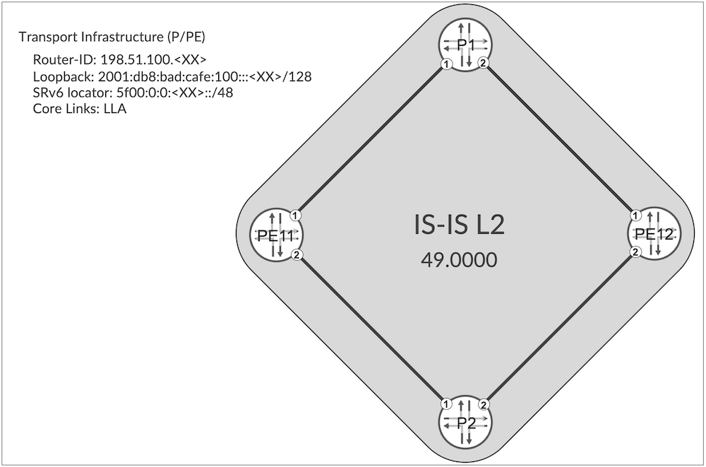
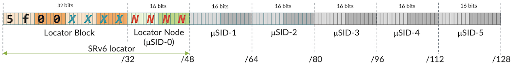
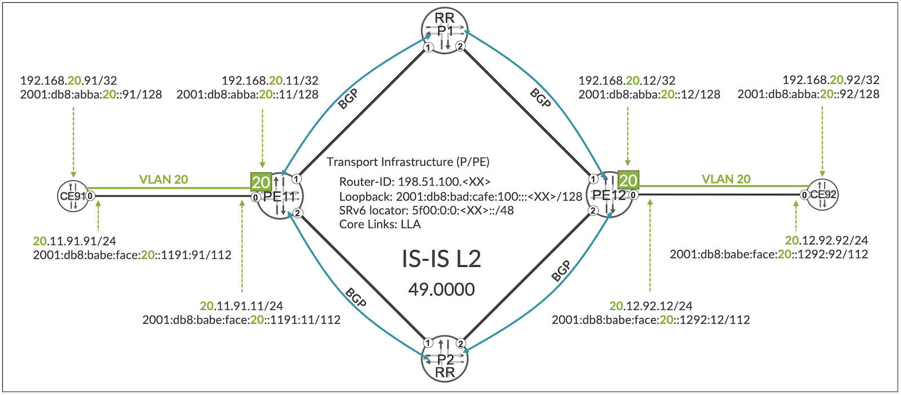
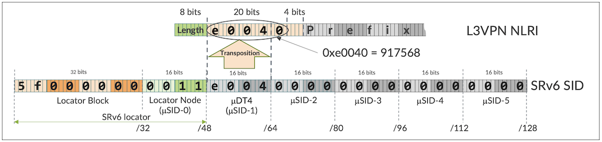

# SRv6 Micro-SID (uSID) Basics

**Krzysztof Szarkowicz - 09/30/2025**

Learn all about SRv6 micro-SIDs (uSIDs), a compressed alternative to full-length SIDs in IPv6-based segment routing and how to configure it on Juniper MX Series.

## Introduction

SRv6 (Segment Routing version 6) is a version of segment routing based on IPv6 tunneling mechanism, rather than on MPLS (MultiProtocol Label Switching) underlay. Therefore, with SRv6 underlying transport routers must be capable of forwarding IPv6 (Internet Protocol version 6) packets, and do not require MPLS support.

SRv6 has two flavors: classic (full) Segment ID (SID), and compressed (micro) SID (commonly called uSID). All previous blogs were discussing different aspects of classic (full) SID implementation of SRv6. This blog discusses basics of SRv6 uSID.

This article is based on the capabilities of Junos 24.4R1 (or newer Junos release) running on MX Series routers. Configuration and operational command outputs have been collected on vMX and MX in our labs.

You can test yourself all the concepts described in this article, we created labs in JCL and vLabs:

- [JCL](https://portal.cloudlabs.juniper.net/RM/Topology?b=57462025-a97f-4ed5-8a25-deb34bfe45d2&d=c78ae7c7-e93b-4708-813e-109fd780f301) (Junivators and partners)
- [vLabs](https://portal.cloudlabs.juniper.net/RM/Topology?b=7b171a3a-1911-4008-b4c2-1c4dcc63cc3b&d=2f99da30-8756-4d15-8822-d648498c7aea) (open to all)

In this blog post, following IP (Internet Protocol) addressing is used:

### Transport Infrastructure (P/PE)

- Router-ID: 198.51.100.[XX]
- Loopback: 2001:db8:bad:cafe::[XX]/128
- SRv6 locator: 5f00:0:[XX]::/48
- Core Links: IPv6 link local addressing (LLA)

### PE-CE links

- IPv4: [VLAN].[XX].[YY].[local-ID]/24
- IPv6: 2001:db8:babe:face:[VLAN]::[XXYY]:[local-ID]/112

### VPN (Virtual Private Network) Loopbacks (CE/PE)

- 192.168.[VLAN].[XX]/32
- 2001:db8:abba:[VLAN]::[XX]/128

## Architecture Introduction

Topology used in this blog is outlined in Figure 1.



In IPv6 networks, you can use IPv6 global address (which need to be explicitly configured) on the links, or link local addressing (LLA). Advantage for global addresses is OAM -- you can explicitly issue ping or traceroute to such address across the network. Advantage of LLA is minimal administrative overhead -- no need to allocate and configure link addresses. Junos SRv6 implementation supports both global and link local addresses on links. In this blog, link local addresses are used.

In this topology, all IP addresses in the transport infrastructure (loopbacks) are IPv6 addresses from the IPv6 subnets listed in Figure 1. There are no IPv4 addresses at all, since SRv6 relies completely on IPv6. Obviously, SRv6 can be deployed in dual stack (IPv4 + IPv6) transport infrastructure, but it unnecessarily complicates the design and is absolutely not required. The only 'IPv4 like' number used in the design is a router ID associated with each router in the transport infrastructure. Given the fact, this ID is 32-bit, it looks like IPv4 address (although, it isn't).

## SRv6 Block

So, apart from configuring standard IPv6 network, what is needed to enable SRv6? The most important and most basic piece of SRv6 configuration is allocation of SRv6 block and SRv6 locators to each router in the transport infrastructure. But wait a minute, what is an SRv6 block or SRv6 locator, actually?



With SRv6 uSID architecture, the list of uSIDs is stored in a 128-bit (16-byte) long container, as outlined in Figure 2. The container is divided into two main parts: locator block and list of uSIDs. [draft-ietf-spring-srv6-srh-compression](https://datatracker.ietf.org/doc/html/draft-ietf-spring-srv6-srh-compression) specifies that all uSID implementations must support 32-bit locator block length, and 16-bit uSID length. This format is referenced often as F3216, and is outlined in Figure 2. Support for other formats (e.g. F3232 --> 32-bit locator block length with 32-bit uSID length) is optional. In this blog, F3216 format is used.

Locator block is IPv6 prefix, allocated by network operator, for SRv6. Essentially, it means "this is not typical IPv6, but SRv6". This block is common on all routers in single network domain. In big networks, divided into separate network (IGP or BGP) domains, each domain will have unique locator block.

List of uSIDs (with F3216 format we can fit up to six 16-bit uSIDs in single 128-bit container) is similar to the MPLS label stack. Top label is uSID-0, while bottom label is uSID-5 (or last valid -- non-0 -- uSID in the container). uSIDs represent nodes, links, or services (like for example VPN services). Top uSID (uSID-0) is commonly transport uSID, representing node or link.

Locator block, generally speaking, can be any prefix: IPv6 GUA (General Unicast Address) or taken from IPv6 ULA (Unique Local Address). It is network operator's decision to allocate IPv6 prefix used for SRv6 locator block. Saying that, RFC 9602 reserved 5f00::/16 address space for SRv6 locator blocks, which allows allocation of 64k standard 32-bit locator blocks. In this blog, first /32 block (5f00::/32) from reserved 5f00::/16 space is used.

So, without further discussion, let's make first SRv6 configuration (IS-IS, BGP and VRFs are already preconfigured -- in this blog we will enhance existing configuration with SRv6 uSID specific items).

```
routing-options {
    source-packet-routing {
        srv6 {
            block SB-FA-000 {
                5f00::/32;
            }
        }
    }
}
```

*Configuration 1: SRv6 Locator Block on all routers*

Configuration 1 must be performed on all routers in the SRv6 domain. Let's have a look at the results.

```
root@PE11> show srv6 block    
Block: SB-FA-000
  Block Prefix: 5f00::, Block length: 32, Micro-sid length: 16
  Global Micro SIDs:
    Static SID range: 0x0-0xDFFF, Dynamic SID range: -
    Allocated static SID count: 0, Allocated dynamic SID count: 0
    Available static SID count: 57344, Available dynamic SID count: 0
  Local Micro SIDs:
    Static SID range: -, Dynamic SID range: 0xE000-0xFFFF
    Allocated static SID count: 0, Allocated dynamic SID count: 0
    Available static SID count: 0, Available dynamic SID count: 8192
```

*CLI-Output 1: SRv6 block status*

First, we can confirm SRv6 Locator Block is present. It uses indicated prefix, and the SID format is F3216 (32-bit locator block length, 16-bit uSID length). More interestingly, the uSID space -- 16-bits, i.e. values from 0x0000 through 0xFFFF, is divided into two ranges:

- GIB (Global Identifiers Block): 0x000-0xDFFF
- LIB (Local Identifiers Block): 0xE000-0xFFFF

And further, both GIB and LIB are additionally divided to static and dynamic sub-ranges. By default, GIB has only static sub-range, while LIB has only dynamic sub-range.

What are these GIB/LIB ranges? GIB has global significance. I.e., all routers in the same network domain share the same GIB. From GIB, global identifiers are allocated by the network operator. For example, node IDs are allocated from GIB, as node IDs must be unique within the domain. 0xDFFF is equal to 57,343, which means that by default the size of single domain can be up to 57,343 routers, where each router has unique ID.

LIB on the other hand, has local significance only. It means, the values allocated form LIB can be reused on different routers for different purposed. On one router, for example, uSID value 0xE000 might be allocated to some local VRF (à la VRF table label), and the same value 0xE000 might be reused on some other router to some other VRF on that router.

## SRv6 Locator

OK. SRv6 locator block is defined. However, at this moment, it is not used. I.e., no SRv6 locators are using this SRv6 locator block, and no SIDs are allocated (please check "Allocated static/dynamic SID count" in the CLI-Output 1).

So, next step is to define SRv6 locators from the SRv6 locator block. SRv6 locator, which is 48-bit long, is the combination of 32-bit SRv6 locator block + 16-bit Locator Node (uSID-0), and uniquely identifies the node in the network, thus, each node must have unique SRv6 locator. Example configuration for node PE11 is provided in Configuration 2.

```
routing-options {
    source-packet-routing {
        srv6 {
            locator SL-FA-000 {
                5f00:0:11::/48;
                micro-sid {
                    block-name SB-FA-000;
                }
            }
        }
    }
}
```

*Configuration 2: SRv6 Locator on PE11*

Similar configuration, with unique value in Locator Node (uSID-0) position, instead of value 0x11, must be executed on all other routers in the domain.

If we check now SRv6 Locator Block status:

```
root@PE11> show srv6 block    
Block: SB-FA-000
  Block Prefix: 5f00::, Block length: 32, Micro-sid length: 16
  Global Micro SIDs:
    Static SID range: 0x0-0xDFFF, Dynamic SID range: -
    Allocated static SID count: 1, Allocated dynamic SID count: 0
    Available static SID count: 57343, Available dynamic SID count: 0
  Local Micro SIDs:
    Static SID range: -, Dynamic SID range: 0xE000-0xFFFF
    Allocated static SID count: 0, Allocated dynamic SID count: 0
    Available static SID count: 0, Available dynamic SID count: 8192
```

*CLI-Output 2: SRv6 block status*

We observe some changes, comparing to CLI-Output 1. Namely, first uSID, from GIB range, and static sub-range has been allocated. In fact, with Configuration 2 we allocated value 0x11 for Node uSID, short named uN (official name of the SID: "End with NEXT-CSID") for PE11. This is global uSID, meaning that all routers in the domain knows, that 5f00:0:11::/48 is associated with PE11, and no other router should allocate 5f00:0:11::/48 for something else.

But, is this really the case? From where all other routers should know, that 5f00:0:11::/48 represents PE11? The protocol used to exchange information between routers is Intermediate System to Intermediate System (IS-IS). So, let's have a look at IS-IS, what happens there:

```
root@PE11> show isis overview 
Instance: master
  Router ID: 198.51.100.11
  IPv6 Router ID: 2001:db8:bad:cafe:100::11
  Hostname: PE11
  Sysid: 0000.0000.0011
  Areaid: 49.0001
  Adjacency holddown: enabled
  Maximum Areas: 3
  LSP life time: 65535
  Reference bandwidth: 1000000000000
  Attached bit evaluation: enabled
  SPF delay: 50 msec, SPF holddown: 2000 msec, SPF rapid runs: 5
  Overload bit at startup is set
    Overload high metrics: enabled
    Allow route leaking: disabled
    Allow internal prefix overloading: disabled
    Allow external prefix overloading: disabled
    Overload timeout: 300 sec
  IPv6 is enabled
  Traffic engineering: enabled
  Traffic engineering v6: disabled
  Restart: Disabled
    Helper mode: Enabled
  Layer2-map: Disabled
  Source Packet Routing (SPRING): Disabled
  Post Convergence Backup: Disabled
  Level 1
    Internal route preference: 15
    External route preference: 160
    Prefix export count: 0
    Wide metrics are enabled, Narrow metrics are enabled
  Level 2
    Internal route preference: 18
    External route preference: 165
    Prefix export count: 0
    Wide metrics are enabled
```

*CLI-Output 3: IS-IS status on PE11*

```
root@PE11> show isis database PE11 extensive 
IS-IS level 1 link-state database:
ISIS instance: Default, Routing Instance: master

IS-IS level 2 link-state database:
ISIS instance: Default, Routing Instance: master

PE11.00-00 Sequence: 0x9, Checksum: 0xebe7, Lifetime: 61949 secs
   IS neighbor: P1.00                         Metric:     1000
     Two-way fragment: P1.00-00, Two-way first fragment: P1.00-00
   IS neighbor: P2.00                         Metric:     1000
     Two-way fragment: P2.00-00, Two-way first fragment: P2.00-00
   V6 prefix: 2001:db8:bad:cafe:100::11/128   Metric:        0 Internal Up

  Header: LSP ID: PE11.00-00, Length: 226 bytes
    Allocated length: 1492 bytes, Router ID: 198.51.100.11
    Remaining lifetime: 61949 secs, Level: 2, Interface: 0
    Estimated free bytes: 1124, Actual free bytes: 1266
    Aging timer expires in: 61949 secs
    Protocols: IPv6

  Packet: LSP ID: PE11.00-00, Length: 226 bytes, Lifetime : 65533 secs
    Checksum: 0xebe7, Sequence: 0x9, Attributes: 0x3 <L1 L2>
    NLPID: 0x83, Fixed length: 27 bytes, Version: 1, Sysid length: 0 bytes
    Packet type: 20, Packet version: 1, Max area: 0

  TLVs:
    Area address: 49.0001 (3)
    LSP Buffer Size: 1492
    Speaks: IPV6
    IP router id: 198.51.100.11
    IP address: 198.51.100.11
    IPv6 TE Router ID: 2001:db8:bad:cafe:100::11
    IPv6 address: 2001:db8:bad:cafe:100::11
    Hostname: PE11
    Extended IS Reachability TLV, Type: 22, Length: 50
    IS extended neighbor: P1.00, Metric: default 1000 SubTLV len: 14
      Local interface index: 342, Remote interface index: 334
      Link MSD Advertisement Sub-TLV:Type: 15, Length: 2
        Base MPLS Imposition MSD:Type: 1, Value: 0
    IS extended neighbor: P2.00, Metric: default 1000 SubTLV len: 14
      Local interface index: 343, Remote interface index: 334
      Link MSD Advertisement Sub-TLV:Type: 15, Length: 2
        Base MPLS Imposition MSD:Type: 1, Value: 0
    IPv6 prefix: 2001:db8:bad:cafe:100::11/128 Metric 0 Up
    Router Capability:  Router ID 198.51.100.11, Flags: 0x00
      Node MSD Advertisement Sub-TLV:Type:  23, Length: 4
        Base MPLS Imposition MSD:Type:  1, Value: 0
        Entropy Readable Label Depth MSD:Type:  2, Value: 16
      IPv6 TE Router Id: 2001:db8:bad:cafe:100::11
    Authentication data: 23 bytes
  No queued transmissions 
```

*CLI-Output 4: IS-IS database on PE11*

```
root@PE11> show route 5f00:0:12::/48    


```

*CLI-Output 5: Route to PE12 SRv6 Locator on PE11*

No luck. IS-IS is not aware of any SRv6 related stuff, and -- according to IS-IS -- SRv6 (or SPRING in general) is disabled. Consequently, routes to remote SRv6 locators are not installed in routing table.

## SRv6 Locator Advertisement via IS-IS

Thus, our next step is to enable SRv6 extensions in IS-IS, in order to allow advertisement of SRv6 related information.

```
protocols {
    isis {
        source-packet-routing {
            srv6 {
                locator SL-FA-000;
            }
        }
    }
}
```

*Configuration 3: IS-IS SRv6 extensions on all routers*

After enabling SRv6 extensions in IS-IS, let's again check the IS-IS status

```
root@PE11> show isis overview | find SPRING
  Source Packet Routing (SPRING): Enabled
    Node Segments: Disabled
    SRv6: Enabled
      Locator: 5f00:0:11::/48, Algorithm: 0
  Post Convergence Backup: Disabled
  Level 1
    Internal route preference: 15
    External route preference: 160
    Prefix export count: 0
    Wide metrics are enabled, Narrow metrics are enabled
    Source Packet Routing is enabled
  Level 2
    Internal route preference: 18
    External route preference: 165
    Prefix export count: 0
    Wide metrics are enabled
    Source Packet Routing is enabled
```

*CLI-Output 6: IS-IS status on PE11*

```
root@PE11> show isis database PE11 extensive                              
IS-IS level 1 link-state database:
ISIS instance: Default, Routing Instance: master

IS-IS level 2 link-state database:
ISIS instance: Default, Routing Instance: master

PE11.00-00 Sequence: 0xa, Checksum: 0x79a0, Lifetime: 65349 secs
   IS neighbor: P1.00                         Metric:     1000
     Two-way fragment: P1.00-00, Two-way first fragment: P1.00-00
   IS neighbor: P2.00                         Metric:     1000
     Two-way fragment: P2.00-00, Two-way first fragment: P2.00-00
   V6 prefix: 2001:db8:bad:cafe:100::11/128   Metric:        0 Internal Up
   V6 prefix: 5f00:0:11::/48                  Metric:        0 Internal Up

  Header: LSP ID: PE11.00-00, Length: 274 bytes
    Allocated length: 1492 bytes, Router ID: 198.51.100.11
    Remaining lifetime: 65349 secs, Level: 2, Interface: 0
    Estimated free bytes: 1076, Actual free bytes: 1218
    Aging timer expires in: 65349 secs
    Protocols: IPv6

  Packet: LSP ID: PE11.00-00, Length: 274 bytes, Lifetime : 65533 secs
    Checksum: 0x79a0, Sequence: 0xa, Attributes: 0x3 <L1 L2>
    NLPID: 0x83, Fixed length: 27 bytes, Version: 1, Sysid length: 0 bytes
    Packet type: 20, Packet version: 1, Max area: 0

  TLVs:
    Area address: 49.0001 (3)
    LSP Buffer Size: 1492
    Speaks: IPV6
    IP router id: 198.51.100.11
    IP address: 198.51.100.11
    IPv6 TE Router ID: 2001:db8:bad:cafe:100::11
    IPv6 address: 2001:db8:bad:cafe:100::11
    Hostname: PE11
    Router Capability:  Router ID 198.51.100.11, Flags: 0x00
      SPRING Algorithm - Algo: 0
      SPRING Algorithm - Algo: 1
      SRv6 Capability - Flags: 0
      Node MSD Advertisement Sub-TLV:Type:  23, Length: 14
        SRv6 Maximum Segments Left MSD:Type:  41, Value: 6
        SRv6 Maximum Pop MSD:Type:  42, Value: 7
        SRv6 Maximum Insert MSD:Type:  43, Value: 5
        SRv6 Maximum Encap MSD:Type:  44, Value: 6
        SRv6 Maximum End D MSD:Type:  45, Value: 6
        Base MPLS Imposition MSD:Type:  1, Value: 0
        Entropy Readable Label Depth MSD:Type:  2, Value: 16
      IPv6 TE Router Id: 2001:db8:bad:cafe:100::11
    SRv6 Locator: 5f00:0:11::/48, Metric: 0, MTID: 0, Flags: 0x0, Algorithm: 0
    IPv6 prefix: 5f00:0:11::/48 Metric 0 Up
    IPv6 prefix: 2001:db8:bad:cafe:100::11/128 Metric 0 Up
    Extended IS Reachability TLV, Type: 22, Length: 50
    IS extended neighbor: P1.00, Metric: default 1000 SubTLV len: 14
      Local interface index: 342, Remote interface index: 334
      Link MSD Advertisement Sub-TLV:Type: 15, Length: 2
        Base MPLS Imposition MSD:Type: 1, Value: 0
    IS extended neighbor: P2.00, Metric: default 1000 SubTLV len: 14
      Local interface index: 343, Remote interface index: 334
      Link MSD Advertisement Sub-TLV:Type: 15, Length: 2
        Base MPLS Imposition MSD:Type: 1, Value: 0
    Authentication data: 23 bytes
  No queued transmissions
```

*CLI-Output 7: IS-IS database on PE11*

It looks much better. IS-IS started to advertised some SRv6 specific information. Worth to note is following:

- **SRv6 Locator** prefix (5f00:0:11::/48) is advertised via two TLVs:
    - TLV #236 ('IPv6 Reachability' TLV, depicted as 'V6 Prefix' in CLI output)
    - TLV #27 ('SRv6 Locator' TLV)

Now, let's make some quick verification.

```
root@PE11> show route 5f00:0:12::/48    

inet6.0: 11 destinations, 11 routes (11 active, 0 holddown, 0 hidden)
+ = Active Route, - = Last Active, * = Both

5f00:0:12::/48     *[IS-IS/18] 00:00:06, metric 2000
                       to fe80::5604:dff:fe00:4392 via ge-0/0/1.0
                    >  to fe80::5604:dff:fe00:6543 via ge-0/0/2.0

inet6.3: 3 destinations, 3 routes (3 active, 0 holddown, 0 hidden)
+ = Active Route, - = Last Active, * = Both

5f00:0:12::/48     *[SRV6-ISIS/14] 00:00:06, metric 2000
                       to fe80::5604:dff:fe00:4392 via ge-0/0/1.0, SRV6-Tunnel, Dest: 5f00:0:12::
                    >  to fe80::5604:dff:fe00:6543 via ge-0/0/2.0, SRV6-Tunnel, Dest: 5f00:0:12::
```

*CLI-Output 8: Route to PE12 SRv6 Locator on PE11*

Wow! We now can see the SRv6 locators of remote routers (for example router PE12) in the routing table.

## SRv6 Node SID Advertisement via IS-IS

```
root@PE11> ping 5f00:0:12::            
PING6(56=40+8+8 bytes) 2001:db8:bad:cafe:100::11 --> 5f00:0:12::
64 bytes from 2001:db8:bad:cafe:100::12: No Route to Destination
Vr TC  Flow Plen Nxt Hlim
 6 00 00000 0010  3a   3f
2001:db8:bad:cafe:100::11->5f00:0:12::
ICMP6: type = 128, code = 0
```

*CLI-Output 9: Traditional ping from PE11 to PE12 SRv6 Locator*

```
root@PE11> ping srv6 isis 5f00:0:12:: source 2001:db8:bad:cafe:100::11 detail count 1 
Request for icmp_seq=1, via interface 343, packet size 56 
Reply from 2001:db8:bad:cafe:100::12 via interface 343 : No Route to Destination. 
Timeout for seq 1

--- lsping statistics ---
1 packets transmitted, 0 packets received, 100% packet loss
round-trip min/avg/max/stddev = 0.000/0.000/0.000/0.000 ms
1 packets received with error status, not counted as received.
```

*CLI-Output 10: SRv6 specific ping from PE11 to PE12 SRv6 Locator*

Unfortunately, neither traditional ping, nor SRv6 specific ping works. In both cases, ping seems to arrive to PE12, but the response from PE12 is "No Route to Destination".

So, what is the problem here? Let's check, what we can see on PE12:

```
root@PE12> show route 5f00:0:12::/48    


```

*CLI-Output 11: Route to local SRv6 Locator on PE12*

Wow! PE12 has nothing in the routing table for it's local SRv6 locator. So, obviously, when ping from PE11 arrives to PE12, PE12 sends back ICMP error message to PE11. PE12 doesn't know, what to do with the packet destined to 5f00:0:12::.

The problem is, that despite the fact uN is allocated (CLI-Output 2), it is not installed in RIB/FIB, until it is advertised. So, in the next step, we will enhance IS-IS configuration on all routers to advertise uN.

```
protocols {
    isis {
        source-packet-routing {
            srv6 {
                locator SL-FA-000 micro-node-sid;
            }
        }
    }
}
```

*Configuration 4: Advertising uN on all routers*

Now, let's check, if we see any differences. First let's check IS-IS database:

```
root@PE11> show isis database PE12 extensive | find SRv6 
    SRv6 Locator: 5f00:0:12::/48, Metric: 0, MTID: 0, Flags: 0x0, Algorithm: 0
      SRv6 micro-node-SID: 5f00:0:12::, Flavor: PSP, USD
        Locator block length: 32, Locator node length: 16, SID function length: 0, SID argument length: 80
(...)
```

*CLI-Output 12: IS-IS database on PE11*

Bingo! PE12 advertises uN in IS-IS (please compare with CLI-Output 7). Checking IS-IS overall status, brings as well new information.

```
root@PE11> show isis overview | find SPRING 
  Source Packet Routing (SPRING): Enabled
    Node Segments: Disabled
    SRv6: Enabled
      Locator: 5f00:0:11::/48, Algorithm: 0
        micro-node-SID: 5f00:0:11::, Flavor: PSP, USD
  Post Convergence Backup: Disabled
(...)
```

*CLI-Output 13: IS-IS SPRING status on PE11*

Local uN is now visible here as well (please compare with CLI-Output 6). And finally, let's check the route for local SRv6 locator:

```
root@PE12> show route 5f00:0:12::/48    

inet6.0: 13 destinations, 13 routes (13 active, 0 holddown, 0 hidden)
+ = Active Route, - = Last Active, * = Both

5f00:0:12::/48     *[IS-IS/18] 01:35:31, metric 0
                       Receive
5f00:0:12::/64     *[IS-IS/18] 01:35:31, metric 0
                       Receive
```

*CLI-Output 14: Route to local SRv6 Locator on PE12*

Nice. We have the local SRv6 locator route in RIB! Ping, or traceroute (both, traditional and SRv6 specific) is now OK:

```
root@PE11> ping 5f00:0:12:: count 1             
PING6(56=40+8+8 bytes) 2001:db8:bad:cafe:100::11 --> 5f00:0:12::
16 bytes from 2001:db8:bad:cafe:100::12, icmp_seq=0 hlim=63 time=4.302 ms

--- 5f00:0:12:: ping6 statistics ---
1 packets transmitted, 1 packets received, 0% packet loss
round-trip min/avg/max/std-dev = 4.302/4.302/4.302/0.000 ms


root@PE11> ping srv6 isis 5f00:0:12:: source 2001:db8:bad:cafe:100::11 count 1  
!
--- lsping statistics ---
1 packets transmitted, 1 packets received, 0% packet loss
round-trip min/avg/max/stddev = 4.502/4.502/4.502/0.000 ms


root@PE11> traceroute 5f00:0:12::             
traceroute6 to 5f00:0:12:: (5f00:0:12::) from 2001:db8:bad:cafe:100::11, 64 hops max, 12 byte packets
 1  2001:db8:bad:cafe:100::1 (2001:db8:bad:cafe:100::1)  2.575 ms  3.366 ms 2001:db8:bad:cafe:100::2 (2001:db8:bad:cafe:100::2)  1.947 ms
 2  2001:db8:bad:cafe:100::12 (2001:db8:bad:cafe:100::12)  4.724 ms  3.879 ms  3.497 ms


root@PE11> traceroute srv6 isis 5f00:0:12::      
traceroute to destination 5f00:0:12::, from source 2001:db8:bad:cafe:100::11, 64 hops max, retries 3 

 1   2001:db8:bad:cafe:100::2   2.103 ms   1.598 ms   1.812 ms   
     DA: 5f00:0:12::
 2   2001:db8:bad:cafe:100::12   3.743 ms   3.669 ms   3.384 ms   
     DA: 5f00:0:12::

  Traceroute status: Success
```

*CLI-Output 15: Ping and traceroute from PE11 to PE12 SRv6 Locator*

## Route Target Constraints (RTC) Distribution in SRv6 Network

Very good. Basic SRv6 uSID transport is established now. In following steps we will establish L3VPN service over this transport, based on the topology outlined in Figure 2.



Two VRFs -- RI-VRF20 and RI-VRF30 -- are pre-provisioned (only one shown on the diagram for simplicity). Additionally, BGP sessions are established, where PE11 and PE12 are BGP Route Reflector clients, and P1 and P2 are BGP Route Reflectors are established.

Before adding any SRv6 uSID related service configuration, let's verify current status.

```
root@PE11> show bgp summary 
(...)
Peer                     AS      InPkt     OutPkt    OutQ   Flaps Last Up/Dwn State|#Active/Received/Accepted/Damped...
2001:db8:bad:cafe:100::1       65501       9756       9762       0       0  3d 1:24:51 Establ
  bgp.rtarget.0: 0/1/1/0
  bgp.l3vpn.0: 0/0/0/0
  bgp.l3vpn-inet6.0: 0/0/0/0
2001:db8:bad:cafe:100::2       65501       9755       9761       0       0  3d 1:24:39 Establ
  bgp.rtarget.0: 0/1/1/0
  bgp.l3vpn.0: 0/0/0/0
  bgp.l3vpn-inet6.0: 0/0/0/0
```

*CLI-Output 16: BGP peer status on PE11*

BGP sessions are up, with three families enabled: RT constraint, VPN-IPv4 and VPN-IPv6.

Next step, let's verify, if some NRLIs are exchanged.

```
root@PE11> show route advertising-protocol bgp 2001:db8:bad:cafe:100::1 

bgp.rtarget.0: 3 destinations, 4 routes (2 active, 0 holddown, 2 hidden)
  Prefix                  Nexthop              MED     Lclpref    AS path
  65501:65000:20/96                    
*                         Self                         100        I
  65501:65000:30/96                    
*                         Self                         100        I


root@PE11> show route receive-protocol bgp 2001:db8:bad:cafe:100::1                                                                                       

inet.0: 6 destinations, 6 routes (6 active, 0 holddown, 0 hidden)

RI-VRF20.inet.0: 4 destinations, 4 routes (4 active, 0 holddown, 0 hidden)

RI-VRF30.inet.0: 4 destinations, 4 routes (4 active, 0 holddown, 0 hidden)

mpls.0: 2 destinations, 2 routes (2 active, 0 holddown, 0 hidden)

inet6.0: 13 destinations, 13 routes (13 active, 0 holddown, 0 hidden)

inet6.3: 3 destinations, 3 routes (3 active, 0 holddown, 0 hidden)

RI-VRF20.inet6.0: 9 destinations, 9 routes (9 active, 0 holddown, 0 hidden)

RI-VRF30.inet6.0: 9 destinations, 9 routes (9 active, 0 holddown, 0 hidden)

bgp.rtarget.0: 3 destinations, 4 routes (2 active, 0 holddown, 2 hidden)
```

*CLI-Output 17: BGP NRLI exchange status on PE11*

It seems, that only RT Constraints for two locally configured VRFs are sent. However, nothing is received. But, is it really true? In RTC address family, there are some hidden routes. Let's check these routes.

```
root@PE11> show route table bgp.rtarget.0 hidden extensive 

bgp.rtarget.0: 3 destinations, 4 routes (2 active, 0 holddown, 2 hidden)
0:0:0/0 (2 entries, 0 announced)
         BGP    Preference: 170/-101
                Next hop type: Unusable, Next hop index: 0
                Address: 0x7e5a814
                Next-hop reference count: 2
                Kernel Table Id: 0
                Source: 2001:db8:bad:cafe:100::1
                State: <Hidden Int Ext>
                Local AS: 65501 Peer AS: 65501
                Age: 3:05:50 
                Validation State: unverified 
                Task: BGP_65501.2001:db8:bad:cafe:100::1
                AS path: I 
                Accepted
                Localpref: 100
                Router ID: 198.51.100.1
                Thread: junos-main 
                Indirect next hops: 1
                        Protocol next hop: 2001:db8:bad:cafe:100::1 ResolvState: PnhUnresolv
                        Indirect next hop: 0x0 - INH Session ID: 0
                        Indirect next hop: INH non-key opaque: 0x0 INH key opaque: 0x0
(...)
```

*CLI-Output 18: RT Constraint hidden routes on PE11*

Indeed, there is some default RTC route received from route reflector P1 (and P2 -- not shown for simplicity). However, there is something wrong with the protocol next hop (unusable, PNH unresolved). All right, let's check this PNH.

```
root@PE11> show route 2001:db8:bad:cafe:100::1  

inet6.0: 13 destinations, 13 routes (13 active, 0 holddown, 0 hidden)
+ = Active Route, - = Last Active, * = Both

2001:db8:bad:cafe:100::1/128
                   *[IS-IS/18] 3d 04:09:06, metric 1000
                    >  to fe80::5604:dff:fe00:4392 via ge-0/0/1.0

root@PE11> ping 2001:db8:bad:cafe:100::1 count 1 
PING6(56=40+8+8 bytes) 2001:db8:bad:cafe:100::11 --> 2001:db8:bad:cafe:100::1
16 bytes from 2001:db8:bad:cafe:100::1, icmp_seq=0 hlim=64 time=2.049 ms

--- 2001:db8:bad:cafe:100::1 ping6 statistics ---
1 packets transmitted, 1 packets received, 0% packet loss
round-trip min/avg/max/std-dev = 2.049/2.049/2.049/0.000 ms
```

*CLI-Output 19: Status of P1 loopback prefix on PE11*

At the first sight, everything with the PNH, which is the loopback of P1 router, looks OK. Route is there, and ping works as well. But, is it really OK? RTC family next-hop resolution, as any other VPN family, uses inet.3 (for IPv4 next-hops) or inet6.3 (for IPv6 next-hops) routing tables. Unfortunately, route to P1 loopback is present only in inet6.0, therefore next-hop of RTC NRLI announced by P1 cannot be resolved, and RTC NRLI remains hidden. Consequently, as there is no active RTC NRLI neither from P1, or P2, no VPN routes are announced by PE11 to P1 or P2.

There couple of ways to resolve this:

1. P1 and P2 should advertise RTC NRLIs with local SRv6 locator (instead of local loopback) as next-hop. SRv6 locators from other routers are present in inet6.3 RIB (see CLI-Output 8), therefore next-hop resolution should be fine.
2. Resolution of next-hops for RTC NRLIs should be extended on PE11 and PE12 to include inet6.0 (and not only inet6.3) RIB as well. Loopbacks from other routers are present in inet6.0 RIB, therefore next-hop resolution should be fine.
3. Using RIB groups, loopbacks of other routers could be copied from inet6.0 to inet6.3 (i.e., installed in both inet6.0 and inet6.3). Loopbacks from other routers would be present in inet6.3 RIB, therefore next-hop resolution should be fine.
4. Default route could be installed in inet6.3 RIB. Loopbacks from other routers would be resolved through that default route in inet6.3 RIB, therefore next-hop resolution should be fine.
5. Next-hop resolution could be disabled, therefore -- regardless, what is the next-hop, and if it can or cannot be resolved, RTC NRLIs will be accepted. As a side note, NRLIs accepted without next-hop resolution are installed only in RIB, but not in FIB, thus cannot be used for forwarding.

For RTC NRLI, the simplest way is to disable next-hop resolution (on all routers), as outlined in Configuration 5. RTC NRLIs are used only by control plane (by BGP), to decide which VPN prefixes should be announced to BGP peer. Thus, RTC NRLIs are never installed in any FIB.

```
protocols {
    bgp {
        group GR-IBGP {
            family route-target {
                nexthop-resolution {
                    no-resolution;
                }
            }
        }
    }
}
```

*Configuration 5: Disabling next-hop resolution for RTC NRLIs*

Let's check now, if there is some change regarding advertised/received BGP NRLIs.

```
root@PE11> show route receive-protocol bgp 2001:db8:bad:cafe:100::1        

inet.0: 6 destinations, 6 routes (6 active, 0 holddown, 0 hidden)

RI-VRF20.inet.0: 5 destinations, 5 routes (5 active, 0 holddown, 0 hidden)

RI-VRF30.inet.0: 5 destinations, 5 routes (5 active, 0 holddown, 0 hidden)

mpls.0: 2 destinations, 2 routes (2 active, 0 holddown, 0 hidden)

inet6.0: 13 destinations, 13 routes (13 active, 0 holddown, 0 hidden)

inet6.3: 3 destinations, 3 routes (3 active, 0 holddown, 0 hidden)

RI-VRF20.inet6.0: 8 destinations, 8 routes (8 active, 0 holddown, 0 hidden)

RI-VRF30.inet6.0: 8 destinations, 8 routes (8 active, 0 holddown, 0 hidden)

bgp.rtarget.0: 3 destinations, 4 routes (3 active, 0 holddown, 0 hidden)
  Prefix                  Nexthop              MED     Lclpref    AS path
  0:0:0/0                     
*                         2001:db8:bad:cafe:100::1     100        I


root@PE11> show route advertising-protocol bgp 2001:db8:bad:cafe:100::1    

RI-VRF20.inet.0: 5 destinations, 5 routes (5 active, 0 holddown, 0 hidden)
  Prefix                  Nexthop              MED     Lclpref    AS path
* 20.11.91.0/24           Self                         100        I
* 192.168.20.11/32        Self                         100        I
* 192.168.20.91/32        Self                 1       100        I

RI-VRF30.inet.0: 5 destinations, 5 routes (5 active, 0 holddown, 0 hidden)
  Prefix                  Nexthop              MED     Lclpref    AS path
* 30.11.91.0/24           Self                         100        I
* 192.168.30.11/32        Self                         100        I
* 192.168.30.91/32        Self                 1       100        I

RI-VRF20.inet6.0: 8 destinations, 8 routes (8 active, 0 holddown, 0 hidden)
  Prefix                  Nexthop              MED     Lclpref    AS path
  2001:db8:abba:20::11/128
*                         Self                         100        I
  2001:db8:abba:20::91/128
*                         Self                 1000    100        I
  2001:db8:babe:face:20:0:1191:0/112
*                         Self                         100        I

RI-VRF30.inet6.0: 8 destinations, 8 routes (8 active, 0 holddown, 0 hidden)
  Prefix                  Nexthop              MED     Lclpref    AS path
  2001:db8:abba:30::11/128
*                         Self                         100        I
  2001:db8:abba:30::91/128
*                         Self                 1000    100        I
  2001:db8:babe:face:30:0:1191:0/112
*                         Self                         100        I

bgp.rtarget.0: 3 destinations, 4 routes (3 active, 0 holddown, 0 hidden)
  Prefix                  Nexthop              MED     Lclpref    AS path
  65501:65000:20/96                    
*                         Self                         100        I
  65501:65000:30/96                    
*                         Self                         100        I
```

*CLI-Output 20: BGP NRLI exchange status on PE11*

Looks much better now! We are receiving and accepting (thanks to disabled next-hop resolution) default RTC NRLI from route reflectors.

## SRv6 Service SIDs for L3VPN

Based on this accepted RTC we are advertising to route reflectors some prefixes from local VRFs. And, there are no hidden routes in any RIB.

However, we are still far from being perfect. VPN routes from remote PE (PE12) are still not received from route reflectors on PE11. So, let's check on route reflector, if we can find, what is the problem.

```
root@P1> show route receive-protocol bgp 2001:db8:bad:cafe:100::11 

inet.0: 6 destinations, 6 routes (6 active, 0 holddown, 0 hidden)

bgp.l3vpn.0: 12 destinations, 12 routes (0 active, 0 holddown, 12 hidden)

inet6.0: 16 destinations, 16 routes (16 active, 0 holddown, 0 hidden)

inet6.3: 3 destinations, 3 routes (3 active, 0 holddown, 0 hidden)

bgp.l3vpn-inet6.0: 12 destinations, 12 routes (0 active, 0 holddown, 12 hidden)

bgp.rtarget.0: 3 destinations, 5 routes (3 active, 0 holddown, 0 hidden)
  Prefix                  Nexthop              MED     Lclpref    AS path
  65501:65000:20/96                    
*                         2001:db8:bad:cafe:100::11    100        I
  65501:65000:30/96                    
*                         2001:db8:bad:cafe:100::11    100        I
```

*CLI-Output 21: BGP NRLI exchange status on P1*

RTC looks OK. However, it seems, all VPN prefixes are hidden. Let's check, why?

```
root@P1> show route table bgp.l3vpn.0 hidden extensive 

bgp.l3vpn.0: 12 destinations, 12 routes (0 active, 0 holddown, 12 hidden)
198.51.100.11:20:20.11.91.0/24 (1 entry, 0 announced)
         BGP    Preference: 170/-101
                Route Distinguisher: 198.51.100.11:20
                Next hop type: Unusable, Next hop index: 0
                Address: 0x7e5a814
                Next-hop reference count: 24
                Kernel Table Id: 0
                Source: 2001:db8:bad:cafe:100::11
                State: <Hidden Int Ext ProtectionPath ProtectionCand>
                Local AS: 65501 Peer AS: 65501
                Age: 1:13:01 
                Validation State: unverified 
                Task: BGP_65501.2001:db8:bad:cafe:100::11
                AS path: I 
                Communities: target:65000:20
                Accepted
                VPN Label: 16
                Localpref: 100
                Router ID: 198.51.100.11
                Thread: junos-main 
                Indirect next hops: 1
                        Protocol next hop: 2001:db8:bad:cafe:100::11 ResolvState: PnhUnresolv
                        Label operation: Push 16
                        Label TTL action: prop-ttl
                        Load balance label: Label 16: None; 
                        Indirect next hop: 0x0 - INH Session ID: 0
                        Indirect next hop: INH non-key opaque: 0x0 INH key opaque: 0x0
(...)
```

*CLI-Output 22: VPN hidden prefixes on P1*

It is actually the same problem observed earlier with RTC NRLIs on PE11. VPN prefixes are advertised with loopback as the protocol next-hop, route reflectors try to resolve this next-hop in inet.3 or inet6.3. But fails, as loopbacks are present only in inet6.0. Unfortunately, solutions outlined for resolution of hidden RTC prefix will not work here.

Disabling next-hop resolution would result in prefix acceptance. However, FIB would not be updated, so route reflectors would not be able to forward VPN packets (route reflectors are in transit). Forcing next-hop resolution over unlabeled route, with one of the workarounds mentioned earlier, would again solve the control plane issue (prefixes hidden), but not solve the forwarding plane. In the current state, we don't have any MPLS routes in the network, even family mpls is not enabled, so we are not able to forward MPLS packets.

So, here is now time, to bind VPNs to SRv6 uSID transport configured at during the first part of this blog. Let's do it.  L3 services can be transported over SRv6 uSID transport by assigning some of following service uSIDs, defined in RFC 8986:

- uDT4 (official name: End.DT4 with NEXT-CSID)
- uDT6 (official name: End.DT6 with NEXT-CSID)
- uDT46 (official name: End.DT46 with NEXT-CSID)
- uDX4 (official name: End.DX4 with NEXT-CSID)
- uDX6 (official name: End.DX6 with NEXT-CSID)

The service uSIDs with 'DT' flavor correspond to VRF table label in MPLS world, while service uSIDs with 'DX' flavor correspond to label per next-hop in MPLS world. In essence, packets received by egress PE with service uSIDs corresponding to 'DT' service type are subject to decapsulation ('D') and lookup -- using inner IP header after decapsulation -- in specific IPv4 (DT4), IPv6 (DT6) or IP (DT46) table ('T'). On the other hand, packets received by egress PE with service uSIDs corresponding to 'DX' service type are subject to decapsulation ('D') and cross-connect ('X') based on the uSID value to appropriate outgoing interface without any further IP lookup.

In this techpost, we will configure one VRF (RI-VRF20) with dynamically assigned uDT4 and uDT6 service uSIDs, while another VRF (RI-VRF30) with manually assigned uDT46 service uSID. Before doing any configuration changes, let's capture current state of inet6.0 RIB.

We will use this for comparison after enabling SRv6 uSIDs for VPNs.

```
root@PE11> show route table inet6.0 protocol srv6

inet6.0: 13 destinations, 13 routes (13 active, 0 holddown, 0 hidden)
+ = Active Route, - = Last Active, * = Both

```

*CLI-Output 23: SRv6 routes in inet6.0 RIB on PE11*

No SRv6 so far in inet6.0 RIB. Let's start with RI-VRF20 first.

```
routing-instances {
    RI-VRF20 {
        protocols {
            bgp {
                source-packet-routing {
                    srv6 {
                        locator SL-FA-000 {
                            micro-dt4-sid;
                            micro-dt6-sid;
                        }
                    }
                }
            }
        }
    }
}
```

*Configuration 6: Assigning dynamic uDT4 and uDT6 on PE11 and PE12*

Commands in Configuration 6 assign uDT4 and uDT6 service uSIDs from dynamic sub-range of LIB (Local Identifiers Block): 0xE000-0xFFFF. So, let's check, if we see some GIB or LIB assignment changes.

```
root@PE11> show srv6 block                                                                       
Block: SB-FA-000
  Block Prefix: 5f00::, Block length: 32, Micro-sid length: 16
  Global Micro SIDs:
    Static SID range: 0x0-0xDFFF, Dynamic SID range: -
    Allocated static SID count: 1, Allocated dynamic SID count: 0
    Available static SID count: 57343, Available dynamic SID count: 0
  Local Micro SIDs:
    Static SID range: -, Dynamic SID range: 0xE000-0xFFFF
    Allocated static SID count: 0, Allocated dynamic SID count: 2
    Available static SID count: 0, Available dynamic SID count: 8190
```

*CLI-Output 24: SRv6 block status*

Indeed, if you compare CLI-Output 24 with CLI-Output 2 there are two differences:

- Allocated dynamic SID count in LIB: 2 (was 0)
- Available dynamic SID count in LIB: 8190 (was 8192)

So, definitely, two new uSIDs are allocated now, which is expected based on Configuration 6. Further, investigation of inet6.0 RIB brings some interesting observations, too.

```
root@PE11> show route table inet6.0 protocol srv6 

inet6.0: 17 destinations, 17 routes (17 active, 0 holddown, 0 hidden)
+ = Active Route, - = Last Active, * = Both

5f00:0:11:e004::/80*[SRV6/171] 02:35:10
                       to table RI-VRF20.inet.0
5f00:0:11:e005::/80*[SRV6/171] 02:35:10
                       to table RI-VRF20.inet6.0
5f00:0:e004::/64   *[SRV6/171] 02:35:10
                       to table RI-VRF20.inet.0
5f00:0:e005::/64   *[SRV6/171] 02:35:10
                       to table RI-VRF20.inet6.0
```

*CLI-Output 25: SRv6 routes inet6.0 RIB on PE11*

There are now four SRv6 prefixes in the inet6.0 RIB (please note, uSID-1 values of these prefixes are dynamically allocated, so they might slightly differ from the values you observe in the actual lab):

- 5f00:0:11:e004::/80
- 5f00:0:11:e005::/80
- 5f00:0:e004::/64
- 5f00:0:e005::/64

1st and 3rd route points to RI-VRF20.inet.0 RIB (decapsulate and perform IPv4 lookup, using inner header, in RI-VRF20.inet.0 RIB), and 2nd and 4th points to RI-VRF20.inet6.0 RIB (decapsulate and perform IPv6 lookup, using inner header, in RI-VRF20.inet6.0 RIB).

The 1st and 2nd route is an uSID container with:

- 32-bit SRv6 locator block (5f00:0000)
- 16-bit uSID-0 (0011, which is uN for PE11, allocated from static sub-range of GIB)
- 16-bit uSID-1 (e004 or e005, which is uDT4 or uDT6 for RI-VRF20 VRF on PE11, allocated from dynamic sub-range of LIB)
- 16-bit uSID-2 (0000, which is EoC -- End of Container)

In total 80 bits.

The 3rd and 4th route is an uSID container with:

- 32-bit SRv6 locator block (5f00:0000)
- 16-bit uSID-0 (e004 or e005, which is uDT4 or uDT6 for RI-VRF20 VRF on PE11, allocated from dynamic sub-range of LIB)
- 16-bit uSID-1 (0000, which is EoC -- End of Container)

In total 64 bits.

The only difference in SRv6 uSID container structure is uN -- it is present in first two routes, and not present in last two routes. In essence, we can say that PE11 router is prepared to receive packets with IPv6 destination address carrying SRv6 uSID container that doesn't include local uN (PSP -- Penultimate Segment Pop, penultimate node -- P1 -- removes uN), as well as SRv6 uSID container that includes local uN (USD -- Ultimate Segment Decapsulation, ultimate node -- PE11 -- removes uN and decapsulates the packet). These PSP/USD capabilities were earlier advertises by PE11 to its neighbors (CLI-Output 12 and CLI-Output 13)

## SRv6 BGP Extensions

So far, so good. Let's now check, if PE11 advertises these newly allocated uDT4 and uDT6 service uSIDs.

```
root@PE11> show route advertising-protocol bgp 2001:db8:bad:cafe:100::1 table RI-VRF20 detail 

RI-VRF20.inet.0: 5 destinations, 5 routes (5 active, 0 holddown, 0 hidden)
* 20.11.91.0/24 (1 entry, 1 announced)
 BGP group GR-IBGP type Internal
     Route Distinguisher: 198.51.100.11:20
     VPN Label: 16
     Nexthop: Self
     Flags: Nexthop Change
     Localpref: 100
     AS path: [65501] I 
     Communities: target:65000:20

* 192.168.20.11/32 (1 entry, 1 announced)
 BGP group GR-IBGP type Internal
     Route Distinguisher: 198.51.100.11:20
     VPN Label: 16
     Nexthop: Self
     Flags: Nexthop Change
     Localpref: 100
     AS path: [65501] I 
     Communities: target:65000:20

* 192.168.20.91/32 (1 entry, 1 announced)
 BGP group GR-IBGP type Internal
     Route Distinguisher: 198.51.100.11:20
     VPN Label: 16
     Nexthop: Self
     Flags: Nexthop Change
     MED: 1
     Localpref: 100
     AS path: [65501] I 
     Communities: target:65000:20 rte-type:0.0.0.0:1:0

RI-VRF20.inet6.0: 8 destinations, 8 routes (8 active, 0 holddown, 0 hidden)

* 2001:db8:abba:20::11/128 (1 entry, 1 announced)
 BGP group GR-IBGP type Internal
     Route Distinguisher: 198.51.100.11:20
     VPN Label: 16
     Nexthop: Self
     Flags: Nexthop Change
     Localpref: 100
     AS path: [65501] I 
     Communities: target:65000:20

* 2001:db8:abba:20::91/128 (1 entry, 1 announced)
 BGP group GR-IBGP type Internal
     Route Distinguisher: 198.51.100.11:20
     VPN Label: 16
     Nexthop: Self
     Flags: Nexthop Change              
     MED: 1000
     Localpref: 100
     AS path: [65501] I 
     Communities: target:65000:20 rte-type:0.0.0.0:1:0

* 2001:db8:babe:face:20:0:1191:0/112 (1 entry, 1 announced)
 BGP group GR-IBGP type Internal
     Route Distinguisher: 198.51.100.11:20
     VPN Label: 16
     Nexthop: Self
     Flags: Nexthop Change
     Localpref: 100
     AS path: [65501] I 
     Communities: target:65000:20
```

*CLI-Output 26: RI-VRF20 VPN prefixes advertisement from PE11 to P1*

Unfortunately, we again have bad luck! What we see in CLI-Output 26 is traditional, MPLS based L3VPN advertisement for three VPN-IPv4 and three VPN-IPv6 prefixes. Single VRF table label (value 16) is used for all VPN-IPv4 and VPN-IPv6 prefixes of this VRF. Even more, although family mpls is not enabled on any interface, PE11 is prepared to handle eventual mpls packets with label 16 (and, with label 17, for another VRF):

```
root@PE11> show route table mpls.0     

mpls.0: 2 destinations, 2 routes (2 active, 0 holddown, 0 hidden)
+ = Active Route, - = Last Active, * = Both

16                 *[VPN/0] 3d 20:17:11
                    >  via lsi.0 (RI-VRF20), Pop      
17                 *[VPN/0] 3d 20:17:11
                    >  via lsi.1 (RI-VRF30), Pop      
```

*CLI-Output 27: MPLS RIB on PE11*

To resolve the issue, apart from allocating service uSIDs, we need to enable on all routers SRv6 extensions in BGP, in order to propagate allocated service uSIDs via BGP.

```
protocols {
    bgp {
        group GR-IBGP {
            family inet-vpn {
                unicast {
                    advertise-srv6-service;
                    accept-srv6-service;
               }
            }
            family inet6-vpn {
                unicast {
                    advertise-srv6-service;
                    accept-srv6-service;
                }
            }
        }
    }
}
```

*Configuration 7: SRv6 extensions to BGP*

## SRv6 Transposition Concepts

After enabling SRv6 extension for VPN-IPv4 and VPN-IPv6 address families, BGP advertisements looks much better.

```
root@PE11> show route advertising-protocol bgp 2001:db8:bad:cafe:100::1 table RI-VRF20 detail    

RI-VRF20.inet.0: 5 destinations, 5 routes (5 active, 0 holddown, 0 hidden)
* 20.11.91.0/24 (1 entry, 1 announced)
 BGP group GR-IBGP type Internal
     Route Distinguisher: 198.51.100.11:20
     VPN Label: 917568
     Nexthop: Self
     Flags: Nexthop Change
     Localpref: 100
     AS path: [65501] I 
     Communities: target:65000:20
                SRv6 SID: 5f00:0:11:: Service tlv type: 5 Behavior: 63 BL: 32 NL: 16 FL: 16 AL: 0 TL: 16 TO: 48

* 192.168.20.11/32 (1 entry, 1 announced)
 BGP group GR-IBGP type Internal
     Route Distinguisher: 198.51.100.11:20
     VPN Label: 917568
     Nexthop: Self
     Flags: Nexthop Change
     Localpref: 100
     AS path: [65501] I 
     Communities: target:65000:20
                SRv6 SID: 5f00:0:11:: Service tlv type: 5 Behavior: 63 BL: 32 NL: 16 FL: 16 AL: 0 TL: 16 TO: 48

* 192.168.20.91/32 (1 entry, 1 announced)
 BGP group GR-IBGP type Internal
     Route Distinguisher: 198.51.100.11:20
     VPN Label: 917568
     Nexthop: Self
     Flags: Nexthop Change
     MED: 1
     Localpref: 100
     AS path: [65501] I 
     Communities: target:65000:20 rte-type:0.0.0.0:1:0
                SRv6 SID: 5f00:0:11:: Service tlv type: 5 Behavior: 63 BL: 32 NL: 16 FL: 16 AL: 0 TL: 16 TO: 48

RI-VRF20.inet6.0: 8 destinations, 8 routes (8 active, 0 holddown, 0 hidden)

* 2001:db8:abba:20::11/128 (1 entry, 1 announced)
 BGP group GR-IBGP type Internal
     Route Distinguisher: 198.51.100.11:20
     VPN Label: 917584
     Nexthop: Self
     Flags: Nexthop Change
     Localpref: 100
     AS path: [65501] I 
     Communities: target:65000:20
                SRv6 SID: 5f00:0:11:: Service tlv type: 5 Behavior: 62 BL: 32 NL: 16 FL: 16 AL: 0 TL: 16 TO: 48

* 2001:db8:abba:20::91/128 (1 entry, 1 announced)
 BGP group GR-IBGP type Internal        
     Route Distinguisher: 198.51.100.11:20
     VPN Label: 917584
     Nexthop: Self
     Flags: Nexthop Change
     MED: 1000
     Localpref: 100
     AS path: [65501] I 
     Communities: target:65000:20 rte-type:0.0.0.0:1:0
                SRv6 SID: 5f00:0:11:: Service tlv type: 5 Behavior: 62 BL: 32 NL: 16 FL: 16 AL: 0 TL: 16 TO: 48

* 2001:db8:babe:face:20:0:1191:0/112 (1 entry, 1 announced)
 BGP group GR-IBGP type Internal
     Route Distinguisher: 198.51.100.11:20
     VPN Label: 917584
     Nexthop: Self
     Flags: Nexthop Change
     Localpref: 100
     AS path: [65501] I 
     Communities: target:65000:20
                SRv6 SID: 5f00:0:11:: Service tlv type: 5 Behavior: 62 BL: 32 NL: 16 FL: 16 AL: 0 TL: 16 TO: 48
```

*CLI-Output 28: RI-VRF20 VPN prefixes advertisement from PE11 to P1*

Couple of things can be observed:

- VPN prefixes are still advertised with some labels. VPN-IPv4 prefixes are advertised with label value 917568, while VPN-IPv6 prefixes are advertised with label value 917584
- There is new BGP attribute, called 'SRv6 SID' attached to each prefix. Strangely, the value of this attribute is 5f00:0:11:: (where are newly allocated uDT4 or uDT6 SIDs with value e004 and e005 discussed earlier?)
- Remaining parameters of the 'SRv6 SID' attribute looks the same for all prefixes, with the exception of 'Behavior', which is 63 for VPN-IPv4 prefixes and 62 for VPN-IPv6 prefixes

We will investigate these observations in more details later. Let's now focus on route reflector, to verify if VPN routes are no longer hidden (note, depending on Junos release used in the lab, you might need to clear BGP sessions on P1: 'clear bgp neighbor all', to clear some unexpected transient state, causing 'Malformed attribute' error).

```
root@P1> show route receive-protocol bgp 2001:db8:bad:cafe:100::11 

inet.0: 6 destinations, 6 routes (6 active, 0 holddown, 0 hidden)

bgp.l3vpn.0: 12 destinations, 12 routes (6 active, 0 holddown, 6 hidden)
* 198.51.100.11:20:20.11.91.0/24 (1 entry, 1 announced)
     Accepted MultiNexthop RecvNextHopIgnored
     Route Distinguisher: 198.51.100.11:20
     VPN Label: 917568
     Nexthop: 2001:db8:bad:cafe:100::11
     Localpref: 100
     AS path: I 
     Communities: target:65000:20
                SRv6 SID: 5f00:0:11:: Service tlv type: 5 Behavior: 63 BL: 32 NL: 16 FL: 16 AL: 0 TL: 16 TO: 48

* 198.51.100.11:20:192.168.20.11/32 (1 entry, 1 announced)
     Accepted MultiNexthop RecvNextHopIgnored
     Route Distinguisher: 198.51.100.11:20
     VPN Label: 917568
     Nexthop: 2001:db8:bad:cafe:100::11
     Localpref: 100
     AS path: I 
     Communities: target:65000:20
                SRv6 SID: 5f00:0:11:: Service tlv type: 5 Behavior: 63 BL: 32 NL: 16 FL: 16 AL: 0 TL: 16 TO: 48

* 198.51.100.11:20:192.168.20.91/32 (1 entry, 1 announced)
     Accepted MultiNexthop RecvNextHopIgnored
     Route Distinguisher: 198.51.100.11:20
     VPN Label: 917568
     Nexthop: 2001:db8:bad:cafe:100::11
     MED: 1
     Localpref: 100
     AS path: I 
     Communities: target:65000:20 rte-type:0.0.0.0:1:0
                SRv6 SID: 5f00:0:11:: Service tlv type: 5 Behavior: 63 BL: 32 NL: 16 FL: 16 AL: 0 TL: 16 TO: 48

inet6.0: 16 destinations, 16 routes (16 active, 0 holddown, 0 hidden)

inet6.3: 3 destinations, 3 routes (3 active, 0 holddown, 0 hidden)

bgp.l3vpn-inet6.0: 12 destinations, 12 routes (6 active, 0 holddown, 6 hidden)

* 198.51.100.11:20:2001:db8:abba:20::11/128 (1 entry, 1 announced)
     Accepted MultiNexthop RecvNextHopIgnored
     Route Distinguisher: 198.51.100.11:20
     VPN Label: 917584
     Nexthop: 2001:db8:bad:cafe:100::11
     Localpref: 100
     AS path: I 
     Communities: target:65000:20
                SRv6 SID: 5f00:0:11:: Service tlv type: 5 Behavior: 62 BL: 32 NL: 16 FL: 16 AL: 0 TL: 16 TO: 48
                                        
* 198.51.100.11:20:2001:db8:abba:20::91/128 (1 entry, 1 announced)
     Accepted MultiNexthop RecvNextHopIgnored
     Route Distinguisher: 198.51.100.11:20
     VPN Label: 917584
     Nexthop: 2001:db8:bad:cafe:100::11
     MED: 1000
     Localpref: 100
     AS path: I 
     Communities: target:65000:20 rte-type:0.0.0.0:1:0
                SRv6 SID: 5f00:0:11:: Service tlv type: 5 Behavior: 62 BL: 32 NL: 16 FL: 16 AL: 0 TL: 16 TO: 48

* 198.51.100.11:20:2001:db8:babe:face:20:0:1191:0/112 (1 entry, 1 announced)
     Accepted MultiNexthop RecvNextHopIgnored
     Route Distinguisher: 198.51.100.11:20
     VPN Label: 917584
     Nexthop: 2001:db8:bad:cafe:100::11
     Localpref: 100
     AS path: I 
     Communities: target:65000:20
                SRv6 SID: 5f00:0:11:: Service tlv type: 5 Behavior: 62 BL: 32 NL: 16 FL: 16 AL: 0 TL: 16 TO: 48

bgp.rtarget.0: 3 destinations, 5 routes (3 active, 0 holddown, 0 hidden)

* 65501:65000:20/96 (2 entries, 1 announced)
     Accepted
     Nexthop: 2001:db8:bad:cafe:100::11
     Localpref: 100
     AS path: I 

* 65501:65000:30/96 (2 entries, 1 announced)
     Accepted
     Nexthop: 2001:db8:bad:cafe:100::11
     Localpref: 100
     AS path: I
```

*CLI-Output 29: BGP NRLI exchange status on P1*

It looks good on P1 as well. VPN routes for VPN20 are accepted. VPN routes for VPN30 are not visible -- apparently hidden. Which is fine, as SRv6 uSIDs were so far not added to VPN30 configuration. Let's have some more detailed view regarding next hop resolution for one of the VPN prefixes

```
root@P1> show route 20.11.91.0/24 extensive | match "Nexthop|Protocol next hop" 
     Nexthop: 2001:db8:bad:cafe:100::11
                Protocol next hop: 5f00:0:11::
                Accepted MultiNexthop RecvNextHopIgnored
                        Protocol next hop: 5f00:0:11:: Metric: 1000 ResolvState: Resolved
                                  Forwarding nexthops: 1
```

*CLI-Output 30: Next hop resolution on P1*

Two interesting observations can be made:

- BGP attribute NEXT_HOP is PE11 loopback (line 2)
- BGP NEXT_HOP attribute is not used for next hop resolution (line 4)
- Next hop used for resolution is PE11 SRv6 locator (line 5)

Essentially, with BGP SRv6 extensions enabled, BGP attribute NEXT_HOP is no longer used for next-hop resolution. Instead, next-hop provided in SRv6 SID attribute (SRv6 locator) is used for next hop resolution. As routes to SRv6 locators are installed in inet6.3 table, resolutions succeeds, and VPN prefixes are no longer hidden -- they are accepted.

Just as final check, let's just verify with CE-to-CE ping, if forwarding plane is operational for VPN 20.

```
root@CE91> ping 192.168.20.92 routing-instance RI-20 count 1 
PING 192.168.20.92 (192.168.20.92): 56 data bytes
64 bytes from 192.168.20.92: icmp_seq=0 ttl=62 time=5.169 ms

--- 192.168.20.92 ping statistics ---
1 packets transmitted, 1 packets received, 0% packet loss
round-trip min/avg/max/stddev = 5.169/5.169/5.169/0.000 ms
```

*CLI-Output 31: CE-to-CE ping in VPN 20*

Uff! It was not easy. But, finally we got it to work!

However, we are not ready yet. At the first look, the VPN labels observed in CLI-Output 28 show some sort of randomness, as they are not allocated sequentially -- the label values are not even close to each other. Such behavior was already discussed in [TechPost SRv6 SID Encoding and Transposition](https://juniper.github.io/techposts/srv6-sid-encoding-and-transposition/article) in the context of classic (full) SRv6 SID. In the context of uSID it is similar: 16 bits uSID-1 value is not carried in 'SRv6 SID' BGP attribute, but in the label field of VPN NRLI itself.



The exact information, what portion of SRv6 SID BGP attribute is carried not in the BGP attribute itself, but in the label field of L3VPN NRLI can be deducted from "BL: 32 NL: 16 FL: 16 AL: 0 TL: 16 TO: 48" values of CLI-Output 28. These values encode following behavior:

- BL: SRv6 Locator Block length (32 bits)
- FL: Function Length (16 bits). In the context of uSID, it is uSID length
- AL: Argument Length (0 bits). Used in some advanced use cases, like for example EVPN multi-homing
- TL: Transposition Length (16 bits). I.e., how many bits from SRv6 SID attribute are carried in the label field of L3VPN NRLI
- TO: Transposition Offset (48 bits). I.e., from which bit position in SRv6 SID attribute the bits are carried in the label field of L3VPN NRLI

Behavior (e.g., 63 and 62, as observed in CLI-Output 28) defines the actual SID type, as documented in [draft-filsfils-spring-net-pgm-extension-srv6-usid](https://datatracker.ietf.org/doc/html/draft-filsfils-spring-net-pgm-extension-srv6-usid):

Table: L3VPN SRv6 uSIDs behaviors

| 62 | 0x003E | End.DT6 with NEXT-CSID (uDT6) |
|:--|:--|:--|
| 63 | 0x003F | End.DT4 with NEXT-CSID (uDT4) |
| 64 | 0x0040 | End.DT46 with NEXT-CSID(uDT46) |

## SRv6 GIB/LIB Resizing, Dynamic/Static Service SIDs

And, the last action for this blog is to provision manually (statically) assigned uDT46 for VPN 30. If you check CLI-Output 24, we have a little problem here. By default, the LIB sub-range for statically assigned uSIDs doesn't exist. So, the first thing we need to do is to re-allocate uSID ranges in such a way, that some portion of overall 64k uSIDs is allocated to LIB static sub-range.

Depending on the actual requirements for specific network deployment it could be done in different ways. We could resize GIB, we could resize LIB, and inside both GIB and LIB we could resize static and dynamic sub-ranges. Junos provides here full flexibility. At the moment, LIB dynamic sub-range is 0xE000-0xFFFF (8192 uSIDs). Let's resize LIB sub-ranges, so that 1024 uSIDs is allocated to static LIB sub-range, while 7168 uSIDs to dynamic LIB sub-range.

```
routing-options {
    source-packet-routing {
        srv6 {
            block SB-FA-000 {
                local-micro-sid {
                    maximum-static-sids 1024;
                }
            }
        }
    }
}
```

*Configuration 8: LIB static/dynamic sub-range resizing on all routers*

Configuration done. Let's check the status:

```
root@PE11> show srv6 block 
Block: SB-FA-000
  Block Prefix: 5f00::, Block length: 32, Micro-sid length: 16
  Global Micro SIDs:
    Static SID range: 0x0-0xDFFF, Dynamic SID range: -
    Allocated static SID count: 1, Allocated dynamic SID count: 0
    Available static SID count: 57343, Available dynamic SID count: 0
  Local Micro SIDs:
    Static SID range: -, Dynamic SID range: 0xE000-0xFFFF
    Allocated static SID count: 0, Allocated dynamic SID count: 2
    Available static SID count: 0, Available dynamic SID count: 8190
```

*CLI-Output 32: SRv6 Locator Block status*

Hmm. No effect, unfortunately. LIB sub-ranges were not resized.

The reason is, resizing GIB or LIB, or resizing static or dynamic sub-ranges within GIB or LIB is so called 'catastrophic' change, which requires routing process restart.

```
root@PE11> restart routing 
Routing protocols process signalled but still running, waiting 28 seconds more
Routing protocols process still running, sending another terminate signal
Routing protocols process still running, sending another terminate signal
Routing protocols process started, pid 22281
```

*CLI-Output 33: Routing process restart on all routers*

After routing process restart, if we check again SRv6 locator block status:

```
root@PE11> show srv6 block 
Block: SB-FA-000
  Block Prefix: 5f00::, Block length: 32, Micro-sid length: 16
  Global Micro SIDs:
    Static SID range: 0x0-0xDFFF, Dynamic SID range: -
    Allocated static SID count: 1, Allocated dynamic SID count: 0
    Available static SID count: 57343, Available dynamic SID count: 0
  Local Micro SIDs:
    Static SID range: 0xFC00-0xFFFF, Dynamic SID range: 0xE000-0xFBFF
    Allocated static SID count: 0, Allocated dynamic SID count: 2
    Available static SID count: 1024, Available dynamic SID count: 7166
```

CLI-Output 34: SRv6 Locator Block status

We can conclude, that sub-ranges withing LIB have been resized, and now sub-range of 0xFC00 through 0xFFFF is allocated to static uSIDs. Please also note, that restarting routing process might result in allocation of different values to dynamically assigned uSIDs. For example:

```
root@PE11> show route table inet6.0 protocol srv6 

inet6.0: 17 destinations, 17 routes (17 active, 0 holddown, 0 hidden)
+ = Active Route, - = Last Active, * = Both

5f00:0:11:e000::/80*[SRV6/171] 01:53:00
                       to table RI-VRF20.inet.0
5f00:0:11:e001::/80*[SRV6/171] 01:53:00
                       to table RI-VRF20.inet6.0
5f00:0:e000::/64   *[SRV6/171] 01:53:00
                       to table RI-VRF20.inet.0
5f00:0:e001::/64   *[SRV6/171] 01:53:00
                       to table RI-VRF20.inet6.0
```

*CLI-Output 35: SRv6 routes inet6.0 RIB on PE11*

We can observe, that now dynamically assigned uSIDs are 0xe000 and 0xe001, instead of previously assigned 0xe004 and 0xe005.

Now, having some sub-range allocated for static LIB uSIDs, we can assign some static value -- from allocated range -- of uDT46for VPN 30:

```
set routing-instances RI-VRF30 protocols bgp source-packet-routing srv6 locator SL-FA-000 micro-dt46-sid 0xfc30
```

*Configuration 9: Assigning static uDT46 on PE11 and PE12*

Please note, that while configuring with 'set' command you can use both hexadecimal or decimal format, in final configuration only decimal format is stored (0xfc30 = 64560):

```
routing-instances {
    RI-VRF30 {
        protocols {
            bgp {
                source-packet-routing {
                    srv6 {
                        locator SL-FA-000 {
                            micro-dt46-sid 64560;
                        }
                    }
                }
            }
        }
    }
}      
```

*Configuration 10: Assigning static uDT46 on PE11 and PE12*

The main difference between static and dynamic uSID allocation is, values of static uSIDs are persistent across routing process restarts or node reboots. Also, can be consistently allocated with the same value on all PEs hosting given VPN, which makes eventual troubleshooting procedures simpler. With dynamic uSID allocation within LIB, as these uSIDs have local significance only, allocated values for the same VPN on different PEs typically vary.

### Quick verification

```
root@PE11> show srv6 block      
Block: SB-FA-000
  Block Prefix: 5f00::, Block length: 32, Micro-sid length: 16
  Global Micro SIDs:
    Static SID range: 0x0-0xDFFF, Dynamic SID range: -
    Allocated static SID count: 1, Allocated dynamic SID count: 0
    Available static SID count: 57343, Available dynamic SID count: 0
  Local Micro SIDs:
    Static SID range: 0xFC00-0xFFFF, Dynamic SID range: 0xE000-0xFBFF
    Allocated static SID count: 1, Allocated dynamic SID count: 2
    Available static SID count: 1023, Available dynamic SID count: 7166
```

*CLI-Output 36: SRv6 Locator Block status*

In LIB, in addition to two dynamic uSIDs (uDT4 and uDT6 for VPN 20), we see now as well allocation for one static uSIDs (apparently, uDT46 for VPN 30).

```
root@PE11> show route table inet6.0 protocol srv6 

inet6.0: 19 destinations, 19 routes (19 active, 0 holddown, 0 hidden)
+ = Active Route, - = Last Active, * = Both

5f00:0:11:e000::/80*[SRV6/171] 02:20:42
                       to table RI-VRF20.inet.0
5f00:0:11:e001::/80*[SRV6/171] 02:20:42
                       to table RI-VRF20.inet6.0
5f00:0:11:fc30::/80*[SRV6/171] 00:12:17
                       to table RI-VRF30.inet6.0
5f00:0:e000::/64   *[SRV6/171] 02:20:42
                       to table RI-VRF20.inet.0
5f00:0:e001::/64   *[SRV6/171] 02:20:42
                       to table RI-VRF20.inet6.0
5f00:0:fc30::/64   *[SRV6/171] 00:12:17
                       to table RI-VRF30.inet6.0
```

*CLI-Output 37: SRv6 routes inet6.0 RIB on PE11*

In inet6.0, we can as well observe additional uSID. With uDT46 an interesting observation is, that according to CLI-Output 37 uDT46 (0xfc30) point to RI-VRF30.inet6.0 RIB. The reality is, depending on the inner packet type (IPv4 or IPv6), the lookup after decapsulation happens either in RI-VRF30.inet.0 or RI-VRF30.inet6.0.

```
root@PE11> show route advertising-protocol bgp 2001:db8:bad:cafe:100::1 table RI-VRF30 detail    

RI-VRF30.inet.0: 8 destinations, 11 routes (8 active, 0 holddown, 0 hidden)
* 30.11.91.0/24 (1 entry, 1 announced)
 BGP group GR-IBGP type Internal
     Route Distinguisher: 198.51.100.11:30
     VPN Label: 1032960
     Nexthop: Self
     Flags: Nexthop Change
     Localpref: 100
     AS path: [65501] I 
     Communities: target:65000:30
                SRv6 SID: 5f00:0:11:: Service tlv type: 5 Behavior: 64 BL: 32 NL: 16 FL: 16 AL: 0 TL: 16 TO: 48

* 192.168.30.11/32 (1 entry, 1 announced)
 BGP group GR-IBGP type Internal
     Route Distinguisher: 198.51.100.11:30
     VPN Label: 1032960
     Nexthop: Self
     Flags: Nexthop Change
     Localpref: 100
     AS path: [65501] I 
     Communities: target:65000:30
                SRv6 SID: 5f00:0:11:: Service tlv type: 5 Behavior: 64 BL: 32 NL: 16 FL: 16 AL: 0 TL: 16 TO: 48

* 192.168.30.91/32 (1 entry, 1 announced)
 BGP group GR-IBGP type Internal
     Route Distinguisher: 198.51.100.11:30
     VPN Label: 1032960
     Nexthop: Self
     Flags: Nexthop Change
     MED: 1
     Localpref: 100
     AS path: [65501] I 
     Communities: target:65000:30 rte-type:0.0.0.0:1:0
                SRv6 SID: 5f00:0:11:: Service tlv type: 5 Behavior: 64 BL: 32 NL: 16 FL: 16 AL: 0 TL: 16 TO: 48

RI-VRF30.inet6.0: 11 destinations, 14 routes (11 active, 0 holddown, 0 hidden)

* 2001:db8:abba:30::11/128 (1 entry, 1 announced)
 BGP group GR-IBGP type Internal
     Route Distinguisher: 198.51.100.11:30
     VPN Label: 1032960
     Nexthop: Self
     Flags: Nexthop Change
     Localpref: 100
     AS path: [65501] I 
     Communities: target:65000:30
                SRv6 SID: 5f00:0:11:: Service tlv type: 5 Behavior: 64 BL: 32 NL: 16 FL: 16 AL: 0 TL: 16 TO: 48

* 2001:db8:abba:30::91/128 (1 entry, 1 announced)
 BGP group GR-IBGP type Internal        
     Route Distinguisher: 198.51.100.11:30
     VPN Label: 1032960
     Nexthop: Self
     Flags: Nexthop Change
     MED: 1000
     Localpref: 100
     AS path: [65501] I 
     Communities: target:65000:30 rte-type:0.0.0.0:1:0
                SRv6 SID: 5f00:0:11:: Service tlv type: 5 Behavior: 64 BL: 32 NL: 16 FL: 16 AL: 0 TL: 16 TO: 48

* 2001:db8:babe:face:30:0:1191:0/112 (1 entry, 1 announced)
 BGP group GR-IBGP type Internal
     Route Distinguisher: 198.51.100.11:30
     VPN Label: 1032960
     Nexthop: Self
     Flags: Nexthop Change
     Localpref: 100
     AS path: [65501] I 
     Communities: target:65000:30
                SRv6 SID: 5f00:0:11:: Service tlv type: 5 Behavior: 64 BL: 32 NL: 16 FL: 16 AL: 0 TL: 16 TO: 48
```

*CLI-Output 38: BGP NRLI exchange status on PE11*

In BGP updates everything looks OK as well. The major differences, comparing to VPN 20 with separate uDT4 and uDT6 SIDs are:

- VPN label value (1032960, 0xFC300) is the same for both VPN-IPv4 and VPN-IPv6 prefixes
- Behavior is now 64 (uDT46, see Table 1)

```
root@PE11> show route table RI-VRF30 protocol bgp   

RI-VRF30.inet.0: 8 destinations, 11 routes (8 active, 0 holddown, 0 hidden)
@ = Routing Use Only, # = Forwarding Use Only
+ = Active Route, - = Last Active, * = Both

30.12.92.0/24      *[BGP/170] 00:32:11, localpref 100, from 2001:db8:bad:cafe:100::1
                      AS path: I, validation-state: unverified
                    >  to fe80::5604:dff:fe00:4392 via ge-0/0/1.0, SRv6 SID: 5f00:0:12:fc30::, SRV6-Tunnel, Dest: 5f00:0:12::
                    [BGP/170] 00:32:11, localpref 100, from 2001:db8:bad:cafe:100::2
                      AS path: I, validation-state: unverified
                    >  to fe80::5604:dff:fe00:4392 via ge-0/0/1.0, SRv6 SID: 5f00:0:12:fc30::, SRV6-Tunnel, Dest: 5f00:0:12::
192.168.30.12/32   *[BGP/170] 00:32:11, localpref 100, from 2001:db8:bad:cafe:100::1
                      AS path: I, validation-state: unverified
                    >  to fe80::5604:dff:fe00:4392 via ge-0/0/1.0, SRv6 SID: 5f00:0:12:fc30::, SRV6-Tunnel, Dest: 5f00:0:12::
                    [BGP/170] 00:32:11, localpref 100, from 2001:db8:bad:cafe:100::2
                      AS path: I, validation-state: unverified
                    >  to fe80::5604:dff:fe00:4392 via ge-0/0/1.0, SRv6 SID: 5f00:0:12:fc30::, SRV6-Tunnel, Dest: 5f00:0:12::
192.168.30.92/32   *[BGP/170] 00:32:11, MED 1, localpref 100, from 2001:db8:bad:cafe:100::1
                      AS path: I, validation-state: unverified
                    >  to fe80::5604:dff:fe00:4392 via ge-0/0/1.0, SRv6 SID: 5f00:0:12:fc30::, SRV6-Tunnel, Dest: 5f00:0:12::
                    [BGP/170] 00:32:11, MED 1, localpref 100, from 2001:db8:bad:cafe:100::2
                      AS path: I, validation-state: unverified
                    >  to fe80::5604:dff:fe00:4392 via ge-0/0/1.0, SRv6 SID: 5f00:0:12:fc30::, SRV6-Tunnel, Dest: 5f00:0:12::

RI-VRF30.inet6.0: 11 destinations, 14 routes (11 active, 0 holddown, 0 hidden)
+ = Active Route, - = Last Active, * = Both

2001:db8:abba:30::12/128
                   *[BGP/170] 00:32:11, localpref 100, from 2001:db8:bad:cafe:100::1
                      AS path: I, validation-state: unverified
                    >  to fe80::5604:dff:fe00:4392 via ge-0/0/1.0, SRv6 SID: 5f00:0:12:fc30::, SRV6-Tunnel, Dest: 5f00:0:12::
                    [BGP/170] 00:32:11, localpref 100, from 2001:db8:bad:cafe:100::2
                      AS path: I, validation-state: unverified
                    >  to fe80::5604:dff:fe00:4392 via ge-0/0/1.0, SRv6 SID: 5f00:0:12:fc30::, SRV6-Tunnel, Dest: 5f00:0:12::
2001:db8:abba:30::92/128
                   *[BGP/170] 00:32:11, MED 1000, localpref 100, from 2001:db8:bad:cafe:100::1
                      AS path: I, validation-state: unverified
                    >  to fe80::5604:dff:fe00:4392 via ge-0/0/1.0, SRv6 SID: 5f00:0:12:fc30::, SRV6-Tunnel, Dest: 5f00:0:12::
                    [BGP/170] 00:32:11, MED 1000, localpref 100, from 2001:db8:bad:cafe:100::2
                      AS path: I, validation-state: unverified
                    >  to fe80::5604:dff:fe00:4392 via ge-0/0/1.0, SRv6 SID: 5f00:0:12:fc30::, SRV6-Tunnel, Dest: 5f00:0:12::
2001:db8:babe:face:30:0:1292:0/112
                   *[BGP/170] 00:32:11, localpref 100, from 2001:db8:bad:cafe:100::1
                      AS path: I, validation-state: unverified
                    >  to fe80::5604:dff:fe00:4392 via ge-0/0/1.0, SRv6 SID: 5f00:0:12:fc30::, SRV6-Tunnel, Dest: 5f00:0:12::
                    [BGP/170] 00:32:11, localpref 100, from 2001:db8:bad:cafe:100::2
                      AS path: I, validation-state: unverified
                    >  to fe80::5604:dff:fe00:4392 via ge-0/0/1.0, SRv6 SID: 5f00:0:12:fc30::, SRV6-Tunnel, Dest: 5f00:0:12::
```

*CLI-Output 39: VPN 30 RIBs on PE11*

Remote VPN prefixes are resolved over the same next-hop (5f00:0:12:fc30::).

```
root@CE91> ping 192.168.30.92 routing-instance RI-30 count 1 
PING 192.168.30.92 (192.168.30.92): 56 data bytes
64 bytes from 192.168.30.92: icmp_seq=0 ttl=62 time=5.044 ms

--- 192.168.30.92 ping statistics ---
1 packets transmitted, 1 packets received, 0% packet loss
round-trip min/avg/max/stddev = 5.044/5.044/5.044/0.000 ms


root@CE91> ping 2001:db8:abba:30::92 routing-instance RI-30 count 1 
PING6(56=40+8+8 bytes) 2001:db8:babe:face:30:0:1191:91 --> 2001:db8:abba:30::92
16 bytes from 2001:db8:abba:30::92, icmp_seq=0 hlim=63 time=319.756 ms

--- 2001:db8:abba:30::92 ping6 statistics ---
1 packets transmitted, 1 packets received, 0% packet loss
round-trip min/avg/max/std-dev = 319.756/319.756/319.756/0.000 ms
```

*CLI-Output 40: CE-to-CE ping in VPN 30*

And finally, CE-to-CE pings (both IPv4 and IPv6) works.

## SRv6 Configuration Optimization

Last couple of things, that deserve additional attention. For optimizing next-hop structures in PFE for SRv6 processing, we need as well to:

- Use (that is preserve) extended next-hop structures
- Enable SRv6 chain next hop merge
- Enable BGP multipath with so called 'list next-hop'

```
routing-options {
    resolution {
        preserve-nexthop-hierarchy;
    }
    forwarding-table {
        srv6-chain-merge;
    }
}
protocols {
    bgp {
        multipath {
            list-nexthop;
        }
    }
}
```

*Configuration 11: BGP Next-Hop Structures to support efficient and scalable SRv6*

These features are required for optimized next-hop resolution of services that use SRv6 and therefore IPv6 next-hops.

By default, Junos next-hop resolver always compresses (flattens) hierarchy so that all routes point to only one indirect next-hop and only one forwarding next-hop. This optimization (flattening of the next-hop structures) is performed in Junos for following reasons:

- Traditionally, the inner indirect next hop does not carry any useful information for the Packet Forwarding Engine (PFE). Hence, it just increases the number of objects in kernel/PFE and in entire system.
- There might be some (older) PFEs which cannot install indirect NH into hardware. This is primarily because the hardware lacks indirection support. For such PFEs, they have to compress the next-hop chain.
- Finally, if hardware supports indirection, then also this may (especially on older PFEs) be multiple memory lookups for PFE when forwarding each packet, thus decreasing the overall PFE performance

This blog is about SRv6, therefore all the details of next-hop structures are not covered here. However, SRv6 is supported only on modern PFEs, which do not have the limitations mentioned earlier. Further, SRv6 is supported only with extended next-hop hierarchy, using so called chained composite next-hop, therefore extended next-hop hierarchy must be preserved, and default Junos behavior to flatten the next-hop hierarchy must be therefore disabled with explicit configuration. Preserving extended next-hop hierarchy (supported on modern PFEs) provides following advantages

- Support for Prefix Independent Convergence (PIC) with switching to alternate path immediately (while global repair may take considerable time)
- Support for ECMP paths in multiple levels in the next-hop hierarchy
- Support for local repair in multiple levels in the next-hop hierarchy
- Support for services over SRv6

Another aspect is list next-hop for BGP multipath. BGP multipath will create list next-hop (which, again, is some sort or more advanced next-hop structure, which is out of scope for this SRv6 blog) for all multipath, when configured so. This is to simplify the overall internal design architecture, and improve overall scaling of the system. SRv6 requires list next-hop. Given the fact that at time of writing this blog some features are not compatible with list next-hop, the default behavior has not been changed, but additional knob to enable list next-hop has been introduced. Once all features support list next-hop structures, this might eventually become Junos default without any extra knob.

Additionally, to aid interworking with other SRv6 implementations, it is recommended to enable RFC 8950 (Advertising IPv4 network Layer Reachability Information (NLRI) with an IPv6 Next Hop) compliant extended encoding of IPv6 next hops for IPv4 address families. Juniper initial implementation for extended encoding of IPv6 next hops for IPv4 address families is based on an early draft. The way the encoding works was later changed in final RFC.

```
protocols {
    bgp {
        group GR-IBGP {
            family inet-vpn {
                unicast {
                    extended-nexthop; # Extended encoding of IPv6 next-hop for IPv4 service
                }
            }
        }
        rfc8950-compliant;           # RFC 8950 compliant encoding of IPv6 next-hop
    }
}
```

*Configuration 12: RFC 8950 compliant extended encoding for IPv6 next hops for IPv4 address families*

## Next Steps

In the next blog, we will discuss Flex-Algo concepts.

## Useful links

- RFC 8986: [Segment Routing over IPv6 (SRv6) Network Programming](https://datatracker.ietf.org/doc/rfc8986/)
- SRv6 in Junos: [https://www.juniper.net/documentation/us/en/software/junos/is-is/topics/topic-map/infocus-isis-srv6-network-programming.html](https://www.juniper.net/documentation/us/en/software/junos/is-is/topics/topic-map/infocus-isis-srv6-network-programming.html)

## Glossary

- BGP: Border Gateway Protocol
- CE: Customer Edge
- ID: Identifier
- IGP: Interior Gateway Protocol
- IS-IS: Intermediate System to Intermediate System
- P: Provider
- PE: Provider Edge
- IP: Internet Protocol
- IPv4: Internet Protocol version 4
- IPv6: Internet Protocol version 6
- L3VPN: Layer 3 Virtual Private Network
- MPLS: MultiProtocol Label Switching
- RIB: Routing Information Base
- SID: Segment Identifier
- SRv6: Segment Routing version 6
- TLV: Type-Length-Value

## Acknowledgements

Many thanks to Anton Elita for his thorough review and suggestions, and Aditya T R for preparing JCL and vLabs topologies.
