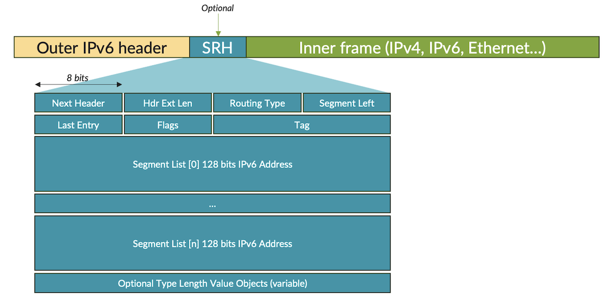
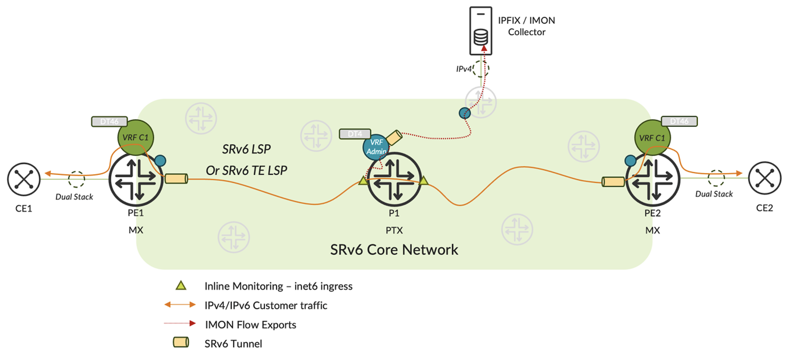
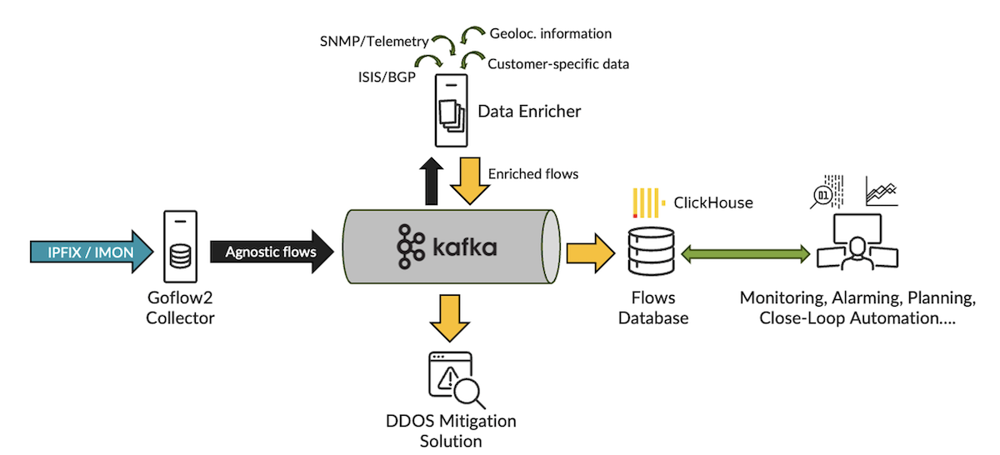
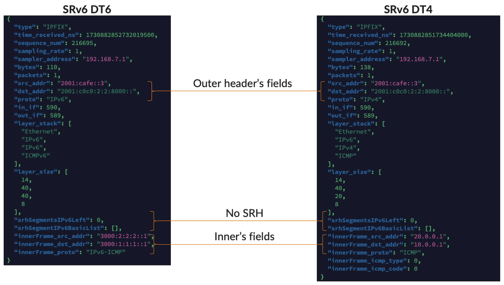
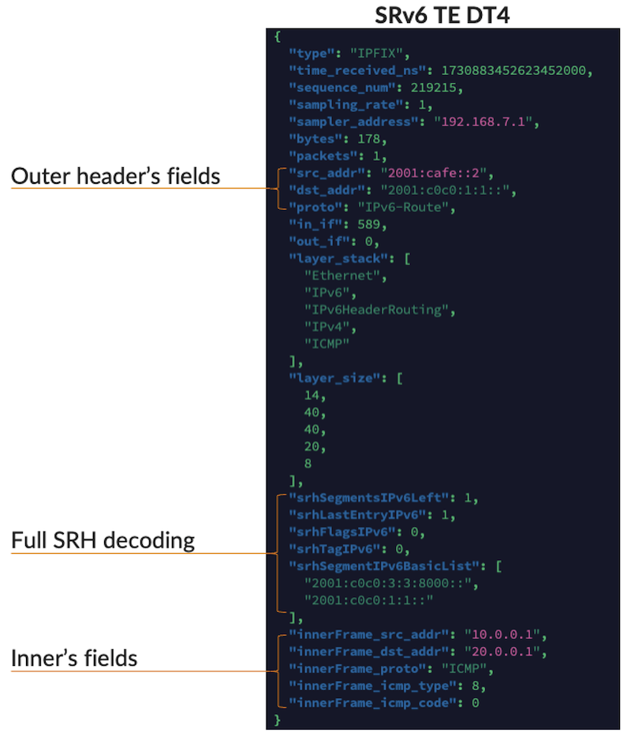

# SRv6 Observability

**David Roy - 11/18/2024**

How can we monitor the SRv6 data plane, and collect statistics on the SRv6 SRH and tunnels with IPFIX option 315 / IMON?

## Introduction

At Juniper, we have observed increasing customer interest in the SRv6 standard over recent years. This Techpost isn't focused on the SRv6 technology itself. It's something we've already explored in-depth in multiple previous articles:

- SRv6 Basics: Locator and End SIDs: [https://juniper.github.io/techposts/srv6-basics-locator-and-end-sids/article](https://juniper.github.io/techposts/srv6-basics-locator-and-end-sids/article)
- L3VPN over SRv6: [https://juniper.github.io/techposts/l3vpn-over-srv6/article](https://juniper.github.io/techposts/l3vpn-over-srv6/article)
- SRv6 Summarization: [https://juniper.github.io/techposts/srv6-summarization/article](https://juniper.github.io/techposts/srv6-summarization/article)
- SRv6 SID Encoding and Transposition: [https://juniper.github.io/techposts/srv6-sid-encoding-and-transposition/article](https://juniper.github.io/techposts/srv6-sid-encoding-and-transposition/article)
- SRv6 L3VPN Inter-AS Option-C: [https://juniper.github.io/techposts/srv6-l3vpn-inter-as-option-c/article](https://juniper.github.io/techposts/srv6-l3vpn-inter-as-option-c/article)
- Link Slicing with MPLS and SRv6 Underlays: [https://juniper.github.io/techposts/link-slicing-with-mpls-and-srv6-underlays/article](https://juniper.github.io/techposts/link-slicing-with-mpls-and-srv6-underlays/article)
- Link Slicing with MPLS and SRv6 Underlays Part 2: [https://juniper.github.io/techposts/link-slicing-with-mpls-and-srv6-underlays-part-2/article](https://juniper.github.io/techposts/link-slicing-with-mpls-and-srv6-underlays-part-2/article)
- SRv6 in PTX Express 5: [https://juniper.github.io/techposts/srv6-in-ptx-express-5/article](https://juniper.github.io/techposts/srv6-in-ptx-express-5/article)

Today, we'll discuss SRv6 Observability and we'll try to answer these questions.

- How can we monitor the SRv6 data plane in SRv6-enabled networks?
- Can we collect statistics on the SRv6 Routing Header (aka. SRH) to enable comprehensive network visibility?
- Can we go even further and gather statistics within the SRv6 tunnel,  specifically, from the inner frame?

## Any Standard Exist?

Yes... But not entirely. Here's why: At the edge of an SRv6-enabled network, on PE/CE interfaces or peering/transit-facing interfaces, classical, standard IPFIX solutions can monitor IPv6 or IPv4 traffic before encapsulation. In other words, standard or vendor-extended IPv4 and IPv6 IPFIX templates are applicable here. But what about within the core, on P routers, or core-facing interfaces of PE routers?

A practical answer would be that, since SRv6 uses IPv6 as underlay, we could enable a standard IPv6 IPFIX template to collect statistics for the "outer" IPv6 header. This approach might be sufficient in some cases, especially with SRv6 uSID [2], which has significantly enhanced the SRv6 Network Programming Model,  with uSID, the IPv6 destination address of the outer frame no longer represents a single "hop," and, for instance, the SRH isn't always required for TE. However, the SRH is still present in some cases and may carry valuable information.

The following figure simply illustrates the "outer header"; "inner frame", "SRH" terminologies we have just discussed above:



To address the SRH case, a recent RFC, RFC 9487 [3], has defined a new IPFIX template for exposing some additional data. The table below lists the eleven new IPFIX Information Elements (IEs) specified by this RFC:

| ElementID | Name | Localization of the information |
|:--|:--|:--|
| 492 | srhFlagsIPv6 | In the packet |
| 493 | srhTagIPv6 | In the packet |
| 494 | srhSegmentIPv6 | In the packet |
| 495 | srhActiveSegmentIPv6 | In the packet |
| 496 | srhSegmentIPv6BasicList | In the packet |
| 497 | srhSegmentIPv6ListSection | In the packet |
| 498 | srhSegmentsIPv6Left | In the packet |
| 499 | srhIPv6Section | In the packet |
| 500 | srhIPv6ActiveSegmentType | Local router information |
| 501 | srhSegmentIPv6LocatorLength | Local router information |
| 502 | srhSegmentIPv6EndpointBehavior | Local router information |

## One Juniper Solution

To address our goals, outlined in the introduction, Juniper offers a solution that meets all our requirements: Inline Monitoring, or IMON, also referred to as IPFIX Information Elements ID 315. This is a familiar topic, as we've discussed this flexible and highly scalable solution several times before ([https://juniper.github.io/techposts/from-sflow-to-imon-sampling-on-mx10k-platforms/article](https://juniper.github.io/techposts/from-sflow-to-imon-sampling-on-mx10k-platforms/article)).

In short, IMON is a sampling solution implemented in hardware on TRIO and EXPRESS chipsets. Thanks to IPFIX, it exposes the first bytes of layer-2 frames along with some additional metadata. No aggregation or enrichment is done on the device itself; these functions are handled externally, typically by the IPFIX collector or a separate off-box software solution.

IMON on TRIO ASICs reveals the first 126 bytes of each packet, while on EXPRESS ASICs, it reveals the first 256 bytes.

So, why not use IMON as a solution for gathering data-plane statistics on SRv6-enabled networks for:

- The outer IPv6 header
- The SRH, when present
- The inner frame.

## Illustration

To demonstrate the capabilities of IMON in an SRv6-only network, let's set up a simple lab, as shown in Figure 2. The topology is straightforward, featuring two CE devices connected in dual-stack mode to PE routers (in this case, two MX304s). The core network consists of PTX 10K devices that utilize the latest EXPRESS 5 ASIC generation. For this setup, we've used the PTX10002-36QDD. Each router within the SRv6 domain has been assigned one Full-SID and one uSID for testing purposes.



Some details about our topology:

Each PE has a basic dual-stack VRF supporting DT4 and DT6 functions. eBGP service routes received from the CEs are shared through MP-iBGP using a Route Reflector. As shown below, PE1 sent two BGP routes to the RR---one for IPv4 and another for IPv6. Both routes share the same BGP Prefix-SID, as we configured the "end-dt46" function for this VRF.

```
bob@pe1> show route advertising-protocol bgp <IPv6-OF-RR> detail 

VRF-DT46.inet.0: 4 destinations, 4 routes (4 active, 0 holddown, 0 hidden)
* 10.0.0.0/24 (1 entry, 1 announced)
 BGP group MESH-VPN type Internal
     Route Distinguisher: 172.16.255.1:65000
     VPN Label: 524288
     Nexthop: Self
     Flags: Nexthop Change
     Localpref: 100
     AS path: [65000] 65001 I 
     Communities: target:65000:1
                SRv6 SID: 2001:c0c0:2:2:: Service tlv type: 5 Behavior: 20 BL: 48 NL: 16 FL: 16 AL: 0 TL: 16 TO: 64

VRF-DT46.inet6.0: 6 destinations, 6 routes (6 active, 0 holddown, 0 hidden)
* 3000:1:1:1::/64 (1 entry, 1 announced)
 BGP group MESH-VPN type Internal
     Route Distinguisher: 172.16.255.1:65000
     VPN Label: 524288
     Nexthop: Self
     Flags: Nexthop Change
     Localpref: 100
     AS path: [65000] 65001 I 
     Communities: target:65000:1
                SRv6 SID: 2001:c0c0:2:2:: Service tlv type: 5 Behavior: 20 BL: 48 NL: 16 FL: 16 AL: 0 TL: 16 TO: 64
```

We also set up an SRv6 TE LSP between PE1 and PE2. When this LSP is active, PE1 utilizes a constrained LSP built from a stack of Full-SIDs, which requires the use of SRH. If the TE LSP is disabled, PE1 follows the shortest path to reach PE2 (using the micro-end-sid of PE2) and doesn't need to insert an SRH between the outer header and the inner frame. This setup allows us to demonstrate both scenarios, with and without the SRH.

Finally, the configuration of the P routers is much simpler. We have just enabled SRv6 and TI-FLA. Only one DT4 admin VRF is also set up to send Inline Monitoring IPFIX flow exports to our remote collector, which is also part of the admin VRF and connected to a remote PE. Naturally, on P1, we've enabled the IMON feature for the inet6 family. For this example, we've set a sampling rate of 1 to track any packets.

Below are the key parts of P1's configuration:

```
lab@ptx-core> show configuration interfaces lo0 unit 1 
family inet {
    address 192.168.7.1/32;
}

lab@ptx-core> show configuration routing-instances ADMIN         
instance-type vrf;
protocols {
    bgp {
        source-packet-routing {
            srv6 {
                locator SID {
                    end-dt4-sid;
                }
            }
        }
    }
}
interface lo0.1;
route-distinguisher 172.16.255.3:555;
vrf-target target:65000:555;

lab@ptx-core> show configuration services inline-monitoring 
template {
    srv6-template {
        template-refresh-rate 10;
        option-template-refresh-rate 20;
        observation-domain-id 10;
    }
}
instance {
    SRv6 {
        template-name srv6-template;
        maximum-clip-length 256;
        sampling-rate 1;
        collector {
            my-collector {
                source-address 192.168.7.1;
                destination-address 192.168.1.11;
                destination-port 9999;
                routing-instance ADMIN;
            }
        }
    }
}

lab@ptx-core> show configuration interfaces et-0/0/0               
description TO_PE1;
mtu 9200;
unit 0 {
    family iso;
    family inet6 {
        filter {
            input SRV6_MONITOR;
            output SRV6_MONITOR;
        }
    }
}

lab@ptx-core> show configuration firewall family inet6                     
filter SRV6_MONITOR {
    interface-specific;
    term 1 {
        then {
            count ALL;
            inline-monitoring-instance SRv6;
            accept;
        }
    }
}
```

If you're still following along, you may be wondering:

*Ok! With the configuration above, I should be able to export the first 256 bytes of transit packets, but how do I decode them? Precisely, how can I interpret the fields of the outer IPv6 header, the SRH when present, and also extract some specific fields from the inner frame payload?*

To answer that, I recently contributed to one of the most flexible and scalable open-source flow collection tools: Goflow2 [5] [https://github.com/netsampler/goflow2](https://github.com/netsampler/goflow2). In detail, I added support for decoding SRH and inner frame fields in SRv6 context.

Goflow2 serves as a versatile tool for flow monitoring. It supports several versions of NetFlow, sFlow, IPFIX, and, of course, IPFIX IE 315 (IMON). Among its outputs, it provides a reliable and efficient ProtoBuf export over Kafka, which facilitates resiliency, load balancing, data replication, and simplifies further enrichment or other post-processing tasks. The following figure illustrates a typical open-source architecture for decoding IPFIX/IMON with Goflow2 and ingesting high-throughput flow exports in a "flows" database such as a ClickHouse.



My recent contribution has been committed and merged into the latest Goflow2 build, so let's try it out. First of all, disable the TE LSP, allowing PE1 and PE2 to use only the shortest path, then generate two pings from CE1 to CE2---one for IPv4 and one for IPv6.

Goflow2 uses a "mapping" file to specify which fields to decode from raw packets and present as "agnostic flows" (see Figure 3). For our setup, we created a YAML mapping file to decode the outer IPv6 source and destination addresses, all SRH fields (if present), and specific fields from the inner frame: IP fields (v4 or v6) and transport fields.

```
formatter:
  fields:
    - type
    - time_received_ns
    - sequence_num
    - sampling_rate
    - sampler_address
    - bytes
    - packets
    - src_addr
    - dst_addr
    - proto
    - in_if
    - out_if
    - layer_stack
    - layer_size
    # srv6 fields
    - ipv6_routing_header_seg_left
    - srhLastEntryIPv6
    - srhFlagsIPv6
    - srhTagIPv6
    - ipv6_routing_header_addresses
    # inner frame
    - innerFrame_src_addr
    - innerFrame_dst_addr
    - innerFrame_proto
    - innerFrame_src_port
    - innerFrame_dst_port
    - innerFrame_icmp_type
    - innerFrame_icmp_code
  key:
    - sampler_address
  protobuf:
    # srv6 fields
    - name: srhLastEntryIPv6
      index: 151
      type: varint
    - name: srhFlagsIPv6
      index: 152
      type: varint
    - name: srhTagIPv6
      index: 153
      type: varint
    # inner frame
    - name: innerFrame_src_addr
      index: 160
      type: string
    - name: innerFrame_dst_addr
      index: 161
      type: string
    - name: innerFrame_proto
      index: 162
      type: varint
    - name: innerFrame_src_port
      index: 163
      type: varint
    - name: innerFrame_dst_port
      index: 164
      type: varint
    # icmp
    - name: innerFrame_icmp_type
      index: 172
      type: varint
    - name: innerFrame_icmp_code
      index: 173
      type: varint
  rename:
    ipv6_routing_header_addresses: srhSegmentIPv6BasicList
    ipv6_routing_header_seg_left: srhSegmentsIPv6Left
  render:
    innerFrame_src_addr: ip
    innerFrame_dst_addr: ip
    innerFrame_proto: proto
sflow:
  mapping:
    # srv6
    - layer: "ipv6eh_routing"
      offset: 32
      length: 8
      destination: srhLastEntryIPv6
    - layer: "ipv6eh_routing"
      offset: 40
      length: 8
      destination: srhFlagsIPv6
    - layer: "ipv6eh_routing"
      offset: 48
      length: 16
      destination: srhTagIPv6
    # src/dst addresses
    - layer: "ipv6"
      encap: true
      offset: 64
      length: 128
      destination: innerFrame_src_addr
    - layer: "ipv6"
      encap: true
      offset: 192
      length: 128
      destination: innerFrame_dst_addr
    - layer: "ipv4"
      encap: true
      offset: 96
      length: 32
      destination: innerFrame_src_addr
    - layer: "ipv4"
      encap: true
      offset: 128
      length: 32
      destination: innerFrame_dst_addr
    # proto
    - layer: "ipv6"
      encap: true
      offset: 48
      length: 8
      destination: innerFrame_proto
    - layer: "ipv4"
      encap: true
      offset: 72
      length: 8
      destination: innerFrame_proto
    # ports
    - layer: "udp"
      encap: true
      offset: 0
      length: 16
      destination: innerFrame_src_port
    - layer: "udp"
      encap: true
      offset: 16
      length: 16
      destination: innerFrame_dst_port
    - layer: "tcp"
      encap: true
      offset: 0
      length: 16
      destination: innerFrame_src_port
    - layer: "tcp"
      encap: true
      offset: 16
      length: 16
      destination: innerFrame_dst_port
    # icmp
    - layer: "icmp"
      encap: true
      offset: 0
      length: 8
      destination: innerFrame_icmp_type
    - layer: "icmp"
      encap: true
      offset: 8
      length: 8
      destination: innerFrame_icmp_code
```

Now, let's start Goflow2 with these parameters. For simplicity, I set up Goflow2 to export "agnostic flows" in JSON format and display them directly in the terminal. Keep in mind that these "agnostic flows" are the decoded results of IPFIX/IMON export packets coming from our PTX10002.

```
# I use jq for decoding json in the console
./goflow2 -mapping=mapping.yml -listen=netflow://:9999 | jq
```

The figure below displays the decoded fields of both the outer and inner frames. As noted earlier, we have disabled SR-TE, so in this case, DT4 and DT6 traffic does not require an SRH.



To illustrate once again the powerful combination of Juniper's IMON implementation and the flexibility of Goflow2, we re-enabled our SRv6 TE LSP and sent another IPv4 ping from CE1 to CE2. In this scenario, there should be an additional SRH IPv6 header between the outer and inner frame headers, which the Goflow2 export successfully confirms.



## Conclusion

In this Techpost, we've demonstrated the power of the IMON feature on Juniper routing devices with TRIO and EXPRESS chipsets. By combining the inline implementation of IPFIX IE 315 with a scalable off-box collector like Goflow2, customers can quickly adapt and expose statistics for any new encapsulations or underlays---without waiting for the implementation or specification of a new standard. This is precisely what we've demonstrated today with SRv6.

I'd also like to emphasize the flexibility of Goflow2 and its new custom mapping feature, which provides a robust and agile solution for data plane observability. In conclusion, I'd like to send my special thanks to the Goflow2 maintainer for accepting and committing my recent contribution.

## Useful links

- [1] [https://juniper.github.io/techposts/srv6-in-ptx-express-5/article](https://juniper.github.io/techposts/srv6-in-ptx-express-5/article)
- [2] [https://juniper.github.io/techposts/introducing-ptx10002-36qdd/article](https://juniper.github.io/techposts/introducing-ptx10002-36qdd/article)
- [3] [https://datatracker.ietf.org/doc/rfc9487/](https://datatracker.ietf.org/doc/rfc9487/)
- [4] [https://juniper.github.io/techposts/from-sflow-to-imon-sampling-on-mx10k-platforms/article](https://juniper.github.io/techposts/from-sflow-to-imon-sampling-on-mx10k-platforms/article)
- [5] [https://github.com/netsampler/goflow2](https://github.com/netsampler/goflow2)

## Glossary

- ASIC: Application-Specific Integrated Circuit
- DT4: Decapsulation and Transit IPv4
- DT6: Decapsulation and Transit IPv6
- IE: Information Element
- IMON: Inline MONitoring
- IPFIX: IP Flow Information Export
- JSON: JavaScript Object Notation
- LSP: Label Switching Path
- SRH: Segment Routing Header
- SID: Segment IDentifier
- SR: Segment Routing
- uSID: micro Segment IDentifier
- TE: Traffic Engineering
