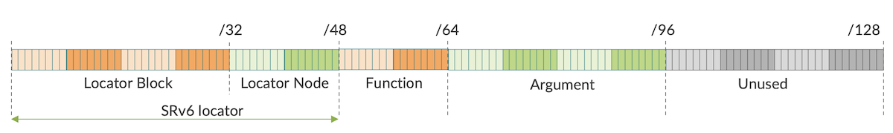
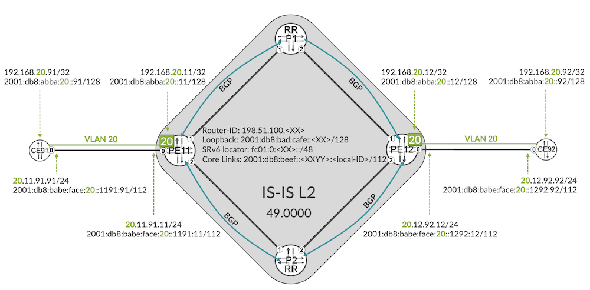
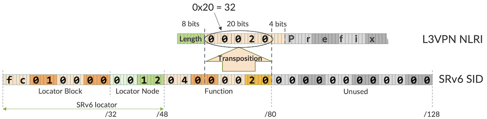
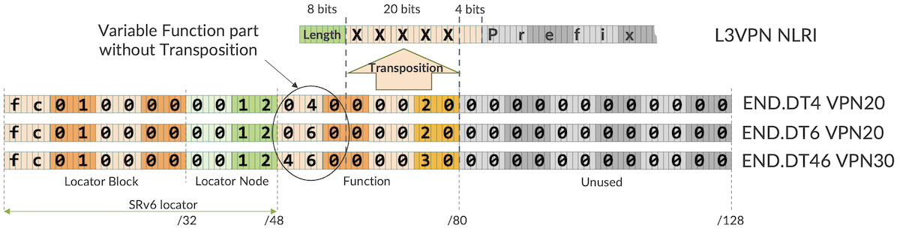
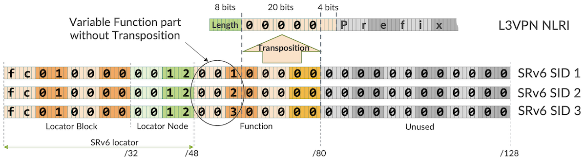

# SRv6 SID Encoding and Transposition

**Krzysztof Szarkowicz - 12/02/2022**

JUNOS 22.3 introduced several changes in the SRv6 infrastructure, this article covers them in details.

## Introduction

This is the 4th blog in the series of SRv6 blogs. It discusses the SRv6 infrastructure changes introduced with Junos 22.3. Namely:

- structured way of SRv6 SID composition (Locator Block, Node Block, Function, Argument), including the ways to change the default block sizes
- static and dynamic SRv6 SID ranges
- partial SRv6 SID encoding in the label value in the L3VPN (SAFI=128) NLRI
- relaxation of the requirement that BGP Protocol Next Hop must be changed to SRv6 locator or SRv6 SID of egress PE

This blog post is based on the capabilities of Junos 22.3 running on MX Series and ACX7000 routers. Config and show command outputs have been collected on vMX in our labs.

You can test yourself all the concepts described in this article, we created labs in JCL and vLabs:
[JCL (Junivators and partners)](https://portal.cloudlabs.juniper.net/RM/Topology?b=cb471023-ab59-4199-ba69-4fc5aea0edfd&d=c78ae7c7-e93b-4708-813e-109fd780f301)
[vLabs (open to all)](https://portal.cloudlabs.juniper.net/RM/Topology?b=7d89a10b-980f-49d5-bf04-d1e8d51da887&d=2f99da30-8756-4d15-8822-d648498c7aea)

## SRv6 SID Composition

As discussed in the [1st SRv6 blog](https://juniper.github.io/techposts/srv6-basics-locator-and-end-sids/article), SRv6 SID (Segment Identifier) is composed of LOCATOR:FUNCTION:ARGUMENT parts, where LOCATOR can be further decomposed to Locator Block and Locator Node. The general SRv6 SID structure is outlined in Figure 1.



The length of each part can be changed if the Junos defaults are not suitable for the particular SRv6 deployment:

- BL, Locator Block Length (Junos default 48)
- NL, Locator Node Length (Junos default 0)
- FL, Function Length (Junos default 16)
- AL, Argument Length (Junos default 0)

For example, Figure 1 shows Junos non-default values for the BL, NL and AL. Up to Junos release 22.2, this strict SID segmentation was not enforced. If you check CLI-Output 1 in the [2nd SRv6 blog](https://juniper.github.io/techposts/l3vpn-over-srv6/article), you can observe that BL/NL/FL/AL values are all 0: there is no specific enforcement there.

In this article we are using the same topology and the same VPNs (Virtual Private Networks) as in the [2nd SRv6 blog](https://juniper.github.io/techposts/l3vpn-over-srv6/article), with slight changes in the addressing, particularly in the SRv6 locator addressing, as outlined in Figure 2.



Consequently, comparing to the [2nd SRv6 blog](https://juniper.github.io/techposts/l3vpn-over-srv6/article), different SRv6 SIDs are configured for each VPN:

- VPN 20:
    - end-dt4-sid fc01:0:11:0420::
    - end-dt6-sid fc01:0:11:0620::
- VPN 30
    - end-dt46-sid fc01:0:11:4630::

Now, let's check, what is advertised by PE11 to the route reflector P1:

```
       root@PE11> show route advertising-protocol bgp 2001:db8:bad:cafe::1 table RI-VRF20 detail
       
       
       RI-VRF20.inet.0: 8 destinations, 11 routes (8 active, 0 holddown, 0 hidden)
       * 20.11.91.0/24 (1 entry, 1 announced)
        BGP group GR-IBGP-RR type Internal
            Route Distinguisher: 198.51.100.11:20
            VPN Label: 16896
            Nexthop: Self
           Flags: Nexthop Change
           Localpref: 100
           AS path: [65000] I 
           Communities: target:65000:20
                      SRv6 SID: fc01:0:11:: Behavior: 19 BL: 48 NL: 0 FL: 16 AL: 0 TL: 16 TO: 48
      
      * 192.168.20.11/32 (1 entry, 1 announced)
       BGP group GR-IBGP-RR type Internal
           Route Distinguisher: 198.51.100.11:20
           VPN Label: 16896
           Nexthop: Self
           Flags: Nexthop Change
           Localpref: 100
           AS path: [65000] I 
           Communities: target:65000:20
                      SRv6 SID: fc01:0:11:: Behavior: 19 BL: 48 NL: 0 FL: 16 AL: 0 TL: 16 TO: 48
      
      * 192.168.20.91/32 (1 entry, 1 announced)
       BGP group GR-IBGP-RR type Internal
           Route Distinguisher: 198.51.100.11:20
           VPN Label: 16896
           Nexthop: Self
           Flags: Nexthop Change
           MED: 1
           Localpref: 100
           AS path: [65000] I
           Communities: target:65000:20 rte-type:0.0.0.0:1:0
                      SRv6 SID: fc01:0:11:: Behavior: 19 BL: 48 NL: 0 FL: 16 AL: 0 TL: 16 TO: 48
      
      RI-VRF20.inet6.0: 11 destinations, 14 routes (11 active, 0 holddown, 0 hidden)
      
      * 2001:db8:abba:20::11/128 (1 entry, 1 announced)
       BGP group GR-IBGP-RR type Internal
           Route Distinguisher: 198.51.100.11:20
           VPN Label: 25088
           Nexthop: Self
           Flags: Nexthop Change
           Localpref: 100
           AS path: [65000] I
           Communities: target:65000:20
                      SRv6 SID: fc01:0:11:: Behavior: 18 BL: 48 NL: 0 FL: 16 AL: 0 TL: 16 TO: 48
                                          
      * 2001:db8:abba:20::91/128 (1 entry, 1 announced)
       BGP group GR-IBGP-RR type Internal
           Route Distinguisher: 198.51.100.11:20
           VPN Label: 25088
           Nexthop: Self
           Flags: Nexthop Change
           MED: 1000
           Localpref: 100
           AS path: [65000] I 
           Communities: target:65000:20 rte-type:0.0.0.0:1:0
                      SRv6 SID: fc01:0:11:: Behavior: 18 BL: 48 NL: 0 FL: 16 AL: 0 TL: 16 TO: 48

      * 2001:db8:babe:face:20:0:1191:0/112 (1 entry, 1 announced)
       BGP group GR-IBGP-RR type Internal
           Route Distinguisher: 198.51.100.11:20
           VPN Label: 25088
           Nexthop: Self
           Flags: Nexthop Change
           Localpref: 100
           AS path: [65000] I
           Communities: target:65000:20
                      SRv6 SID: fc01:0:11:: Behavior: 18 BL: 48 NL: 0 FL: 16 AL: 0 TL: 16 TO: 48
```

CLI-Output 1: Advertising L3VPN Service Prefix with End.DT4 or End.DT6 SRv6 SID

If you compare this output with the [2nd SRv6 blog](https://juniper.github.io/techposts/l3vpn-over-srv6/article), there are couple of differences.

First of all, from Junos 22.3 onwards there is no need to set the BGP (Border Gateway Protocol) protocol next-hop to SRv6 locator or SRv6 SID. Keeping it to the default (i.e. 'self', which is typically loopback when iBGP session is used, see lines 9, 20, 31, 45, 56, 68) is fully OK, as from Junos 22.3, for service prefixes with SRv6 SID, not a BGP protocol next-hop, but SRv6 SID is used for next-hop resolution. Therefore, Configuration 4 from the [2nd SRv6 blog](https://juniper.github.io/techposts/l3vpn-over-srv6/article), is no longer required, and is omitted in this blog.

Secondly, lengths of each part (BL/NL/FL/AL) in SRv6 SID are now reported (lines 14, 25, 37, 50, 62, 73) with some meaningful values. In the [2nd SRv6 blog](https://juniper.github.io/techposts/l3vpn-over-srv6/article) all these lengths were reported as '0'.

Thirdly, the advertised SRv6 SIDs (lines 14, 25, 37, 50, 62, 73) show only SRv6 locator portion (in the [2nd SRv6 blog](https://juniper.github.io/techposts/l3vpn-over-srv6/article) we have seen full SRv6 SID advertisements). Where are our configured END.DT4/END.DT6 (fc01:0:11:420::, fc01:0:11:620::) values?

And, finally, there are some 'strange' VPN labels advertised (lines 8, 19, 30, 44, 55, 67). At the first look, these VPN labels show some sort of randomness, as they are not allocated sequentially, the label values are not even close to each other. This is very suspicious! In the [2nd SRv6 blog](https://juniper.github.io/techposts/l3vpn-over-srv6/article) our VPN labels were set to '3' (implicit null), given the fact SRv6 doesn't use MPLS, so there is no need for a meaningful VPN label. Moreover, checking the label table (LIB, Label Information Base), we don't even see these labels (CLI-Output 2)!

```
       root@PE11> show route table mpls.0
       
       mpls.0: 2 destinations, 2 routes (2 active, 0 holddown, 0 hidden)
       + = Active Route, - = Last Active, * = Both
       
       17                 *[VPN/0] 1d 12:37:49
                           >  via lsi.1 (RI-VRF30), Pop
       18                 *[VPN/0] 1d 12:27:06
                           >  via lsi.3 (RI-VRF20), Pop
```

Instead, we see in the LIB different labels associated with our VPNs. Essentially, it means, when a packet with the label value 16896 (lines 8, 19, 30 in CLI-Output 1) or with the label value 25088 (lines 44, 55, 67 in CLI-Output 1) arrives to PE11, it will be dropped!

So, why after upgrading to Junos 22.3 do we have MPLS labels in the advertisements?

## SRv6 SID Transposition

To answer these questions, let's make some packet capture, to see PE11 BGP advertisements to P1 (Packet Capture 1).

```
       Frame 1: 1608 bytes on wire (12864 bits), 1608 bytes captured (12864 bits)
       (...)
       Border Gateway Protocol - UPDATE Message
           Marker: ffffffffffffffffffffffffffffffff
           Length: 152
           Type: UPDATE Message (2)
           Withdrawn Routes Length: 0
           Total Path Attribute Length: 129
           Path attributes
              Path Attribute - ORIGIN: IGP
                  Flags: 0x40, Transitive, Well-known, Complete
                      0... .... = Optional: Not set
                      .1.. .... = Transitive: Set
                      ..0. .... = Partial: Not set
                      ...0 .... = Extended-Length: Not set
                      .... 0000 = Unused: 0x0
                  Type Code: ORIGIN (1)
                  Length: 1
                  Origin: IGP (0)
              Path Attribute - AS_PATH: empty
                  Flags: 0x40, Transitive, Well-known, Complete
                      0... .... = Optional: Not set
                      .1.. .... = Transitive: Set
                      ..0. .... = Partial: Not set
                      ...0 .... = Extended-Length: Not set
                      .... 0000 = Unused: 0x0
                  Type Code: AS_PATH (2)
                  Length: 0
              Path Attribute - MULTI_EXIT_DISC: 1
                  Flags: 0x80, Optional, Non-transitive, Complete
                      1... .... = Optional: Set
                      .0.. .... = Transitive: Not set
                      ..0. .... = Partial: Not set
                      ...0 .... = Extended-Length: Not set
                      .... 0000 = Unused: 0x0
                  Type Code: MULTI_EXIT_DISC (4)
                  Length: 4
                  Multiple exit discriminator: 1
              Path Attribute - LOCAL_PREF: 100
                  Flags: 0x40, Transitive, Well-known, Complete
                      0... .... = Optional: Not set
                      .1.. .... = Transitive: Set
                      ..0. .... = Partial: Not set
                      ...0 .... = Extended-Length: Not set
                      .... 0000 = Unused: 0x0
                  Type Code: LOCAL_PREF (5)
                  Length: 4
                  Local preference: 100
              Path Attribute - EXTENDED_COMMUNITIES
                  Flags: 0xc0, Optional, Transitive, Complete
                      1... .... = Optional: Set
                      .1.. .... = Transitive: Set
                      ..0. .... = Partial: Not set
                      ...0 .... = Extended-Length: Not set
                      .... 0000 = Unused: 0x0
                  Type Code: EXTENDED_COMMUNITIES (16)
                  Length: 16
                  Carried extended communities: (2 communities)
                      Route Target: 65000:20 [Transitive 2-Octet AS-Specific]
                          Type: Transitive 2-Octet AS-Specific (0x00)
                              0... .... = IANA Authority: Allocated on FCFS Basis
                              .0.. .... = Transitive across ASes: Transitive
                          Subtype (AS2): Route Target (0x02)
                          2-Octet AS: 65000
                          4-Octet AN: 20
                      OSPF Route Type: Area: 0.0.0.0, Type: Router [Transitive Opaque]
                          Type: Transitive Opaque (0x03)
                              0... .... = IANA Authority: Allocated on FCFS Basis
                              .0.. .... = Transitive across ASes: Transitive
                          Subtype (Opaque): OSPF Route Type (0x06)
                          Area ID: 0.0.0.0
                          Route type: Router (1)
                          Options: 0x00 (Metric: Type-1)
                              .... ...0 = Metric type: Type-1
              Path Attribute - BGP Prefix-SID
                  Flags: 0xc0, Optional, Transitive, Complete
                      1... .... = Optional: Set
                      .1.. .... = Transitive: Set
                      ..0. .... = Partial: Not set
                      ...0 .... = Extended-Length: Not set
                      .... 0000 = Unused: 0x0
                  Type Code: BGP Prefix-SID (40)
                  Length: 37
                  SRv6 L3 Service
                      Type: SRv6 L3 Service (5)
                      Length: 34
                      Reserved: 00
                      SRv6 Service Sub-TLVs
                          SRv6 Service Sub-TLV - SRv6 SID Information
                              Type: SRv6 SID Information (1)
                              Length: 30
                              Reserved: 00
                              SRv6 SID Value: fc01:0:11::
                              SRv6 SID Flags: 0x00
                              SRv6 Endpoint Behavior: End.DT4 (0x0013)
                              Reserved: 00
                              SRv6 Service Data Sub-Sub-TLVs
                                  SRv6 Service Data Sub-Sub-TLV - SRv6 SID Structure
                                      Type: SRv6 SID Structure (1)
                                     Length: 6
                                     Locator Block Length: 48
                                     Locator Node Length: 0
                                     Function Length: 16
                                     Argument Length: 0
                                     Transposition Length: 16
                                     Transposition Offset: 48
             Path Attribute - MP_REACH_NLRI
                 Flags: 0x90, Optional, Extended-Length, Non-transitive, Complete
                     1... .... = Optional: Set
                     .0.. .... = Transitive: Not set
                     ..0. .... = Partial: Not set
                     ...1 .... = Extended-Length: Set
                     .... 0000 = Unused: 0x0
                 Type Code: MP_REACH_NLRI (14)
                 Length: 45
                 Address family identifier (AFI): IPv4 (1)
                 Subsequent address family identifier (SAFI): Labeled VPN Unicast (128)
                 Next hop:  RD=0:0 IPv6=2001:db8:bad:cafe::11
                     Route Distinguisher: 0:0
                     IPv6 Address: 2001:db8:bad:cafe::11
                 Number of Subnetwork points of attachment (SNPA): 0
                 Network Layer Reachability Information (NLRI)
                     BGP Prefix
                         Prefix Length: 120
                         Label Stack: 16896 (bottom)
                         Route Distinguisher: 198.51.100.11:20
                         MP Reach NLRI IPv4 prefix: 192.168.20.91
     Border Gateway Protocol - UPDATE Message
         Marker: ffffffffffffffffffffffffffffffff
         Length: 152
         Type: UPDATE Message (2)
         Withdrawn Routes Length: 0
         Total Path Attribute Length: 129
         Path attributes
             Path Attribute - ORIGIN: IGP
                 Flags: 0x40, Transitive, Well-known, Complete
                     0... .... = Optional: Not set
                     .1.. .... = Transitive: Set
                     ..0. .... = Partial: Not set
                     ...0 .... = Extended-Length: Not set
                     .... 0000 = Unused: 0x0
                 Type Code: ORIGIN (1)
                 Length: 1
                 Origin: IGP (0)
             Path Attribute - AS_PATH: empty
                 Flags: 0x40, Transitive, Well-known, Complete
                     0... .... = Optional: Not set
                     .1.. .... = Transitive: Set
                     ..0. .... = Partial: Not set
                     ...0 .... = Extended-Length: Not set
                     .... 0000 = Unused: 0x0
                 Type Code: AS_PATH (2)
                 Length: 0
             Path Attribute - LOCAL_PREF: 100
                 Flags: 0x40, Transitive, Well-known, Complete
                     0... .... = Optional: Not set
                     .1.. .... = Transitive: Set
                     ..0. .... = Partial: Not set
                     ...0 .... = Extended-Length: Not set
                     .... 0000 = Unused: 0x0
                 Type Code: LOCAL_PREF (5)
                 Length: 4
                 Local preference: 100
             Path Attribute - EXTENDED_COMMUNITIES
                 Flags: 0xc0, Optional, Transitive, Complete
                     1... .... = Optional: Set
                     .1.. .... = Transitive: Set
                     ..0. .... = Partial: Not set
                     ...0 .... = Extended-Length: Not set
                     .... 0000 = Unused: 0x0
                 Type Code: EXTENDED_COMMUNITIES (16)
                 Length: 8
                 Carried extended communities: (1 community)
                     Route Target: 65000:20 [Transitive 2-Octet AS-Specific]
                         Type: Transitive 2-Octet AS-Specific (0x00)
                             0... .... = IANA Authority: Allocated on FCFS Basis
                             .0.. .... = Transitive across ASes: Transitive
                         Subtype (AS2): Route Target (0x02)
                         2-Octet AS: 65000
                         4-Octet AN: 20
             Path Attribute - BGP Prefix-SID
                 Flags: 0xc0, Optional, Transitive, Complete
                     1... .... = Optional: Set
                     .1.. .... = Transitive: Set
                     ..0. .... = Partial: Not set
                     ...0 .... = Extended-Length: Not set
                     .... 0000 = Unused: 0x0
                 Type Code: BGP Prefix-SID (40)
                 Length: 37
                 SRv6 L3 Service
                     Type: SRv6 L3 Service (5)
                     Length: 34
                     Reserved: 00
                     SRv6 Service Sub-TLVs
                         SRv6 Service Sub-TLV - SRv6 SID Information
                             Type: SRv6 SID Information (1)
                             Length: 30
                             Reserved: 00
                             SRv6 SID Value: fc01:0:11::
                             SRv6 SID Flags: 0x00
                             SRv6 Endpoint Behavior: End.DT4 (0x0013)
                             Reserved: 00
                             SRv6 Service Data Sub-Sub-TLVs
                                 SRv6 Service Data Sub-Sub-TLV - SRv6 SID Structure
                                     Type: SRv6 SID Structure (1)
                                     Length: 6
                                     Locator Block Length: 48
                                     Locator Node Length: 0
                                     Function Length: 16
                                     Argument Length: 0
                                     Transposition Length: 16
                                     Transposition Offset: 48
             Path Attribute - MP_REACH_NLRI
                 Flags: 0x90, Optional, Extended-Length, Non-transitive, Complete
                     1... .... = Optional: Set
                     .0.. .... = Transitive: Not set
                     ..0. .... = Partial: Not set
                     ...1 .... = Extended-Length: Set
                     .... 0000 = Unused: 0x0
                 Type Code: MP_REACH_NLRI (14)
                 Length: 60
                 Address family identifier (AFI): IPv4 (1)
                 Subsequent address family identifier (SAFI): Labeled VPN Unicast (128)
                 Next hop:  RD=0:0 IPv6=2001:db8:bad:cafe::11
                     Route Distinguisher: 0:0
                     IPv6 Address: 2001:db8:bad:cafe::11
                 Number of Subnetwork points of attachment (SNPA): 0
                 Network Layer Reachability Information (NLRI)
                     BGP Prefix
                         Prefix Length: 112
                         Label Stack: 16896 (bottom)
                         Route Distinguisher: 198.51.100.11:20
                         MP Reach NLRI IPv4 prefix: 20.11.91.0
                     BGP Prefix
                         Prefix Length: 120
                         Label Stack: 16896 (bottom)
                         Route Distinguisher: 198.51.100.11:20
                         MP Reach NLRI IPv4 prefix: 192.168.20.11
     (...)
```

*Packet Capture 1: PE11 to P1 BGP packet capture*

The BGP packet might contain multiple BGP Update messages in a single packet. For brevity, out of multiple BGP Update messages present in this packet, only two BGP Update messages are shown:
- Lines 3-127, announcing 198.51.100.11:20:192.168.20.91/120 prefix (CE91 loopback within VPN20 --> lines 122-127)
- Lines 128-238, announcing 198.51.100.11:20:20.11.91.0/112 prefix (CE91-PE11 link within VPN20) and 198.51.100.11:20:192.168.20.11/120 prefix (PE11 loopback within VPN20: lines 228-238)

Next-hop in both updates is the loopback of PE11 (lines 118 and 224). This is expected, since as mentioned earlier, from Junos 22.3 there is no need to set the BGP next-hop to SRv6 locator or SRv6 SID, hence configuration to set BGP next-hop to SRv6 locator, used in the [2nd SRv6 blog](https://juniper.github.io/techposts/l3vpn-over-srv6/article), is not used here.

Lengths of SRv6 parts are advertised via additional Sub-Sub-TLV (Type-Length-Value), called 'SRv6 SID Structure' (lines 98-106, and 204-212). Support for this Sub-Sub-TLV ([RFC 9252, Section 3.2.1](https://datatracker.ietf.org/doc/html/rfc9252#section-3.2.1)) was introduced in Junos 22.3.

And, indeed, we see only SRv6 locator portion, fc01:0:11:: in both updates, in SRv6 SID advertisements (lines 93 and 199). Further, we can definitely confirm these strange label values observed earlier (CLI-Output 1) are visible in BGP packet capture (lines 125, 231, 236). So, BGP packet capture is in line with CLI output.

Interesting question to ask is: why we have two BGP Update Messages to advertise three prefixes? Why is it not a single BGP Update Message, for all three prefixes, or, eventually, why we don't see three BGP Update Messages, unique BGP Update Message per prefix.

When BGP prepares updates, it makes some optimization. Prefixes that have the same set of BGP attributes (i.e., the list of BGP attributes is the same, as well as value of each BGP attribute is the same) are grouped together. They are eligible to be sent withing the same BGP Update Message, and the list of BGP attributes is sent only once, obviously, it doesn't make sense to resend the same list of BGP attributes for each prefix individually. This is the essence of BGP packing optimization.

If you check the second BGP Update Message (lines 128-238), you see that it has two prefixes (lines 213-238) and single list of BGP attributes (lines 135-212). All these BGP attributes apply to two advertised prefixes. And why the first prefix is in separate BGP Update Message? The reason is, BGP attributes are not the same. In the first BGP Update Message there is one additional BGP attribute: MED, Multi-Exit Discriminator (lines 29-38). All other attributes are the same, including their value. So, based on BGP attribute lists, these three prefixes are divided into two groups, each group with unique BGP attribute list, and each group advertised in a separate BGP Update Message.

But, why we are discussing all of this? How is it relevant to SRv6? Well, one of the BGP attributes is BGP Prefix SID (lines 75-106, and lines 181-212), which includes SRv6 SID (lines 93 and 199). In our packet capture, SRv6 SID contains only SRv6 Locator portion, which is the same for all VPN prefixes advertised from given PE. So, even with per-prefix SID allocation, with thousands of VPN prefixes, each VPN prefix with different SRv6 SID (the same Locator part, but different Function part) specified in the configuration, all prefixes could be grouped together, and potentially advertised via single BGP Update Message (well, if they fit into single BGP Update Message with maximum size 4k bytes). This brings the efficiency into BGP packing, which is later reflected in e.g., faster BGP convergence.

But, what we do with the variable part of SRv6 SID, i.e. Function part? In fact, designers of original MPLS based L3VPN were facing the same challenge, as MPLS label with pre-prefix label allocation is different for each VPN prefix. To benefit from optimized BGP packing, the decision was made to include VPN label as part of NLRI, rather than defining new BGP attribute to carry VPN label. As a result, multiple VPN prefixes with different VPN labels, but otherwise with the same set of BGP attributes (NEXT_HOP, AS_PATH, COMMUNITIES, ...) could be grouped together and packed into the BGP Update Messages in an efficient manner.

SRv6 is reusing exactly the same NLRI (SAFI=128), to advertise VPN prefixes, with additional SRv6 information carried in some additional attributes (i.e., SRv6 SID). So, the label field (20 bits, [RFC 8277, Section 2.2](https://datatracker.ietf.org/doc/html/rfc8277/#section-2.2)) is there in the NLRI, even if not exactly useful in the SRv6 context, as SRv6 doesn't utilize MPLS.

But, wait a minute, is it really not useful for SRv6? In fact, instead of wasting these 20 bits (do you recall the [2nd SRv6 blog](https://juniper.github.io/techposts/l3vpn-over-srv6/article), where always value '3' was carried in these 20 bits?), we can actually exploit this space in the NLRI, to carry variable part of SRv6 SID (i.e., Function) in it, and carry only the fixed, constant part of SRv6 SID (i.e., Locator) in the BGP Prefix SID attribute. In this way, we make BGP Prefix SID attribute to be the same for all NLRIs, thus allowing efficient BGP packing.

Let's quickly check all labels advertised by PE11:

```
      root@PE11> show route advertising-protocol bgp 2001:db8:bad:cafe::1 detail | match label
            VPN Label: 16896
            VPN Label: 16896
            VPN Label: 16896
            VPN Label: 287488
            VPN Label: 287488
            VPN Label: 287488
            VPN Label: 25088
            VPN Label: 25088
           VPN Label: 25088
           VPN Label: 287488
           VPN Label: 287488
           VPN Label: 287488
```

*CLI-Output 3: VPN labels advertised by PE11*

If you convert the observed VPN labels to hexadecimal numbers:

- 16896 = 0x04200
- 25088 = 0x06200
- 287488 = 0x46300

and compare it to the SRv6 SIDs configured for VPNs, and mentioned already earlier:

- VPN 20:
    - end-dt4-sid fc01:0:11:0420::
    - end-dt6-sid fc01:0:11:0620::
- VPN 30
    - end-dt46-sid fc01:0:11:4630::

you probably discover some similarity!

Simply, the configured Function (16 bits) is carried not in SRv6 SID Information Sub-TLV, but it is carried instead in 20 bits label space in the NLRI itself, taking first 16 most significant bits (i.e., from the left) of 20 bits label space. This mechanism is called Transposition.

But wait a minute, how all these things are achieved, and how do we know, what is actually carried in the 20 bits label space? This info is as well encoded in the SRv6 SID Structure Sub-Sub-TLV, via Transposition Length, TL, and Transposition Offset, TO (lines 14, 25, 37, 50, 62, 73 in CLI-Output 1, and lines 105-106, 211-212 in Packet Capture 1). Essentially, it says:

- starting from bit 48 (TO) in the SRv6 locator
- take 16 bits (TL)
- put these bits into the label space of the NLRI, aligning to the left
- in the SRv6 locator, put '0' in place of these moved bits

Basically, SRv6 implementations supporting the SRv6 SID Structure Sub-Sub-TLV (i.e., Junos 22.3 or later) support transposition, allowing for optimized BGP packing for NLRIs with different SRv6 SID (different Function), while implementations not supporting the SRv6 SID Structure Sub-Sub-TLV (i.e., Junos 22.2, or earlier) do not support transposition.

The receiver PE, based on the TL/TO information, can put together the original SRv6 SID from the part advertised in SRv6 SID value, and the part advertised in the label space of the NLRI. This re-constructed SRv6 SID is used in the data plane during packet encapsulation.

In summary, label space in L3VPN NLRI is used in following ways:

- A. NLRI without SRv6 SID attribute --> classical VPN label (e.g., 18) carried in the label space of the L3VPN NLRI
- B. NLRI with SRv6 SID attribute, but without SRv6 SID Structure Sub-Sub-TLV --> invalid label (e.g., 3) carried in the label space of the L3VPN NLRI
- C. NLRI with SRv6 SID attribute, and with SRv6 SID Structure Sub-Sub-TLV --> part of SRv6 SID, in accordance with transposition ruled encoded via TL/TO in the SRv6 SID Structure Sub-Sub-TLV, carried in the label space of the L3VPN NLRI

Actual SRv6 locator structure, as well as the status (i.e., how many SIDs use given SRv6 locator) for local locators can be verified with following operational command:

```
       root@PE11> show srv6 locator
       
       Locator: SL-000
         Locator prefix: fc01:0:11::, Locator length: 48
         Block length: 48, Node length: 0
         Function length: 16, Argument length: 0
         Static SID range: 0x1-0x7FFF, Dynamic SID range: 0x8000-0xFFFF
         Allocated static SID count: 3, Allocated dynamic SID count: 0
         Available static SID count: 32764, Available dynamic SID count: 32768
```

*CLI-Output 4: Structure and status of locally configured SRv6 locators*

Important to note is, that from Junos 22.3 the SRv6 locator infrastructure is prepared to allocate static (by default, first 32767 SRv6 SIDs within the SRv6 locator) and dynamic SRv6 SIDs (remaining SID space within the SRv6 locator). At the time this blog was written, dynamic SRv6 SIDs were supported for EVPN (Ethernet Virtual Private Network) E-Line only. For L3 services (global IPv4/IPv6, and VPN-IPv4/VPN-IPv6) only static SRv6 SIDs were supported. Commit errors prevents to configure static SRv6 SID that falls into the dynamic SRv6 SID range

## SRv6 SID Partial Function Transposition

Let's make some more experiments, by reconfiguring the SRv6 locator on PE12 to non-default BL/NL/FL values, using extended static SRv6 SID range, and adjusting the SRv6 SIDs associated with configured VPNs accordingly.

Note: SRv6 locator parameter changes (like e.g., BL/NL/FL changes) are not taken into effect until RPD (or entire router) is restarted. Therefore, to avoid router or RPD restart, following steps can be taken to change the SRv6 locator parameters. They will still interrupt SRv6 routing for the commit times.

. delete the SRv6 locator (including all SIDs associated with the SRv6 locator)
. commit
. recreate the SRv6 locator (including all SIDs associated with the SRv6 locator)
. commit

```
       [edit routing-instances RI-VRF20 protocols]
       -     bgp {
       -         source-packet-routing {
       -             srv6 {
       -                 locator SL-000 {
       -                     end-dt4-sid fc01:0:12:420::;
       -                     end-dt6-sid fc01:0:12:620::;
       -                 }
       -             }
      -         }
      -     }
      [edit routing-instances RI-VRF30 protocols]
      -     bgp {
      -         source-packet-routing {
      -             srv6 {
      -                 locator SL-000 end-dt46-sid fc01:0:12:4630::;
      -             }
      -         }
      -     }
      [edit routing-options source-packet-routing srv6]
      -     locator SL-000 fc01:0:12::/48;
      [edit protocols isis source-packet-routing srv6]
      -      locator SL-000 {
      -          end-sid fc01:0:12::;
      -      }
```

```
       [edit routing-instances RI-VRF20 protocols]
       +     bgp {
       +         source-packet-routing {
       +             srv6 {
       +                 locator SL-000 {
       +                     end-dt4-sid fc01:0:12:0400:0020::;
       +                     end-dt6-sid fc01:0:12:0600:0020::;
       +                 }
       +             }
      +         }
      +     }
      [edit routing-instances RI-VRF30 protocols]
      +     bgp {
      +         source-packet-routing {
      +             srv6 {
      +                 locator SL-000 end-dt46-sid fc01:0:12:4600:0030::;
      +             }
      +         }
      +     }
      [edit routing-options source-packet-routing srv6]
      +     locator SL-000 {
      +         fc01:0:12::/48;
      +         block-length 32;
      +         function-length 32;
      +         static-function-max-entries 2147483647;
      +     }
      [edit protocols isis source-packet-routing srv6]
      +      locator SL-000 {
      +          end-sid fc01:0:12::;
      +      }
```

*CLI-Output 6: Recreating the SRv6 locator with new parameters*

In the newly recreated SRv6 locator and SRv6 SIDs, following changes were done:

- Locator Block Length (BL) changed from 48 to 32 (line 23)
- Locator Node Length (NL) changed from 0 to 16. This change is implicit, without explicit configuration: SRv6 prefix length (line 22) minus BL (line 23)
- Function Length (FL) changed from 16 to 32 (line 24)
- Maximum static SRv6 SID entries changed from 216-1 (32767) to 232-1 (2147483647), so that first half of the extended (32-bit) function space is available to static SRv6 SIDs (line 25)
- SRv6 SIDs for VPN 20 and VPN 30 were extended to span across 32 bits (lines 6-7 and 16)

With these changes, let's check how the transposition works:

```
       root@PE12> show route advertising-protocol bgp 2001:db8:bad:cafe::1 detail | match "entry|label|SRv6|inet"
       
       RI-VRF20.inet.0: 8 destinations, 11 routes (8 active, 0 holddown, 0 hidden)
       * 20.12.92.0/24 (1 entry, 1 announced)
            VPN Label: 32
                       SRv6 SID: fc01:0:12:400:: Behavior: 19 BL: 32 NL: 16 FL: 32 AL: 0 TL: 20 TO: 60
       * 192.168.20.12/32 (1 entry, 1 announced)
            VPN Label: 32
                       SRv6 SID: fc01:0:12:400:: Behavior: 19 BL: 32 NL: 16 FL: 32 AL: 0 TL: 20 TO: 60
      * 192.168.20.92/32 (1 entry, 1 announced)
           VPN Label: 32
                      SRv6 SID: fc01:0:12:400:: Behavior: 19 BL: 32 NL: 16 FL: 32 AL: 0 TL: 20 TO: 60
      
      RI-VRF30.inet.0: 8 destinations, 11 routes (8 active, 0 holddown, 0 hidden)
      * 30.12.92.0/24 (1 entry, 1 announced)
           VPN Label: 48
                      SRv6 SID: fc01:0:12:4600:: Behavior: 20 BL: 32 NL: 16 FL: 32 AL: 0 TL: 20 TO: 60
      * 192.168.30.12/32 (1 entry, 1 announced)
           VPN Label: 48
                      SRv6 SID: fc01:0:12:4600:: Behavior: 20 BL: 32 NL: 16 FL: 32 AL: 0 TL: 20 TO: 60
      * 192.168.30.92/32 (1 entry, 1 announced)
           VPN Label: 48
                      SRv6 SID: fc01:0:12:4600:: Behavior: 20 BL: 32 NL: 16 FL: 32 AL: 0 TL: 20 TO: 60
      
      RI-VRF20.inet6.0: 11 destinations, 14 routes (11 active, 0 holddown, 0 hidden)
      * 2001:db8:abba:20::12/128 (1 entry, 1 announced)
           VPN Label: 32
                      SRv6 SID: fc01:0:12:600:: Behavior: 18 BL: 32 NL: 16 FL: 32 AL: 0 TL: 20 TO: 60
      * 2001:db8:abba:20::92/128 (1 entry, 1 announced)
           VPN Label: 32
                      SRv6 SID: fc01:0:12:600:: Behavior: 18 BL: 32 NL: 16 FL: 32 AL: 0 TL: 20 TO: 60
      * 2001:db8:babe:face:20:0:1292:0/112 (1 entry, 1 announced)
           VPN Label: 32
                      SRv6 SID: fc01:0:12:600:: Behavior: 18 BL: 32 NL: 16 FL: 32 AL: 0 TL: 20 TO: 60
      
      RI-VRF30.inet6.0: 11 destinations, 14 routes (11 active, 0 holddown, 0 hidden)
      * 2001:db8:abba:30::12/128 (1 entry, 1 announced)
           VPN Label: 48
                      SRv6 SID: fc01:0:12:4600:: Behavior: 20 BL: 32 NL: 16 FL: 32 AL: 0 TL: 20 TO: 60
      * 2001:db8:abba:30::92/128 (1 entry, 1 announced)
           VPN Label: 48
                      SRv6 SID: fc01:0:12:4600:: Behavior: 20 BL: 32 NL: 16 FL: 32 AL: 0 TL: 20 TO: 60
      * 2001:db8:babe:face:30:0:1292:0/112 (1 entry, 1 announced)
           VPN Label: 48
                      SRv6 SID: fc01:0:12:4600:: Behavior: 20 BL: 32 NL: 16 FL: 32 AL: 0 TL: 20 TO: 60
```

*CLI-Output 7: Transposition with non-standard SRv6 locator parameters*

As you can see, new BL/NL/FL parameters are taken into account. When it comes to transposition, 20 bits (TL=20) starting from bit 60 (TO=60) are placed in the label space in the L3VPN NLRI, and corresponding bits in SRv6 SID are set to '0'.

Let's have a closer look at the transposition process here. The useful information in the SRv6 SID is carried in the first (starting from the most significant bit, i.e., from the left side) 80 bits (BL=32 + NL=16 + FL=32 --> 80). Label space available in the L3VPN NLRI is 20 bits. Therefore, out of 80 bits of SRv6 SID (out of 32 bits in the function part), only last 20 bits are moved to the label space in the L3VPN NLRI, as depicted in Figure 3.



Therefore, if FL is longer than 20 bits, and Function varies not only within last 20 bits, like in the example used in this blog and depicted in Figure 4:



Then, resulting SRv6 SID value carried in the SRv6 Service Sub-TLV, even after Transposition of last 20 bits, will vary as well. These NRLIs will not be subject to optimized BGP packing.

SRv6 implementations that do not support Transposition (do not support SRv6 SID Structure Sub-Sub-TLV), like for example Junos version 22.2 or earlier, may interpret, when receiving an SRv6-based BGP NLRI, the part of the SRv6 SID encoded in an MPLS Label field as MPLS label, and not as part (last 20 'useful' bits) of SRv6 SID. Therefore, to allow smooth interoperability between SRv6 implementations supporting and SRv6 implementations not supporting SRv6 SID Structure Sub-Sub-TLV, you might consider following approach:

- use large, more than 20 bits, e.g., 32 bits, Function field
- assign Function values in such a way, that last 20 bits are always '0', and Function varies only in remaining Function bits

In this way, Transposed bits will have '0' value, thus the part of SRv6 SID carried in the SRv6 Service Sub-TLV will contain all useful SID bits, and the receiver, even if not using bits from the MPLS label field, will construct proper SRv6 SID. This is outlined in Figure 5.



This will of course result in not optimized BGP packing. But, there is no free lunch!

When assigning the values to Locator block, node or function, we can further divide these fields into smaller chunks, encoding different thigs. For example, we could encode network hierarchy (i.e., aggregation domain ID, access domain ID, etc.), or we could have some indication of Flex-Algo ID (Flex-Algo will be discussed in some future blog), etc. Therefore, before SRv6 is introduced, it is important to make proper design for SRv6 locators and SIDs, as the changes in SRv6 locator properties, like BL/NL/FL/AL, are traffic affecting (SRv6 locator/SIDs must be removed, and in the next commit must be recreated with new parameters).

In the next blog we will show an interesting use case, showing guaranteed link slicing with SRv6, where Function field is further divided to carry Slice ID and VPN ID.

## Useful links

- RFC 9252: BGP Overlay Services Based on Segment Routing over IPv6 (SRv6): [https://datatracker.ietf.org/doc/html/rfc9252](https://datatracker.ietf.org/doc/html/rfc9252)
- SRv6 in Junos: [https://www.juniper.net/documentation/us/en/software/junos/is-is/topics/topic-map/infocus-isis-srv6-network-programming.html](https://www.juniper.net/documentation/us/en/software/junos/is-is/topics/topic-map/infocus-isis-srv6-network-programming.html)
- TechPost 1: SRv6 Basics Locator and End-SIDs - [https://juniper.github.io/techposts/srv6-basics-locator-and-end-sids/article](https://juniper.github.io/techposts/srv6-basics-locator-and-end-sids/article)
- TechPost 2: L3VPN on SRv6 - [https://juniper.github.io/techposts/l3vpn-over-srv6/article](https://juniper.github.io/techposts/l3vpn-over-srv6/article)
- TechPost 3: SRv6 Summarisation - [https://juniper.github.io/techposts/srv6-summarization/article](https://juniper.github.io/techposts/srv6-summarization/article)
- TechPost 4: SRv6 SID Encoding and Transposition - [https://juniper.github.io/techposts/srv6-sid-encoding-and-transposition/article](https://juniper.github.io/techposts/srv6-sid-encoding-and-transposition/article)

## Glossary

- AL: Argument Length
- BGP: Border Gateway Protocol
- BL: Block Length
- CE: Customer Edge
- CLI: Command Line Interface
- EVPN: Ethernet Virtual Private Network
- FL: Function Length
- iBGP: internal Border Gateway Protocol
- IPv4: Internet Protocol version 4
- IPv6: Internet Protocol version 6
- IS-IS: Intermediate System to Intermediate System
- L3VPN: Layer 3 Virtual Private Network
- LIB: Label Information Base
- MED: Multi-Exit Discriminator
- MPLS: Multiprotocol Label Switching
- NL: Node Length
- NLRI: Network Layer Reachability Information
- P: Provider
- PE: Provider Edge
- RFC: Request for Comments
- RPD: Routing Protocol Daemon
- RR: Route Reflector
- SAFI: Subsequent Address Family Identifier
- SID: Segment Identifier
- SRv6: Segment Routing version 6
- TL: Transposition Length
- TLV: Type Length Value
- TO: Transposition Offset
- VPN: Virtual Private Network
- VRF: Virtual Routing and Forwarding

## Acknowledgements

Thanks to Anton Elita for thorough review, and Abhishek Murali for preparing JCL and vLabs topologies.
