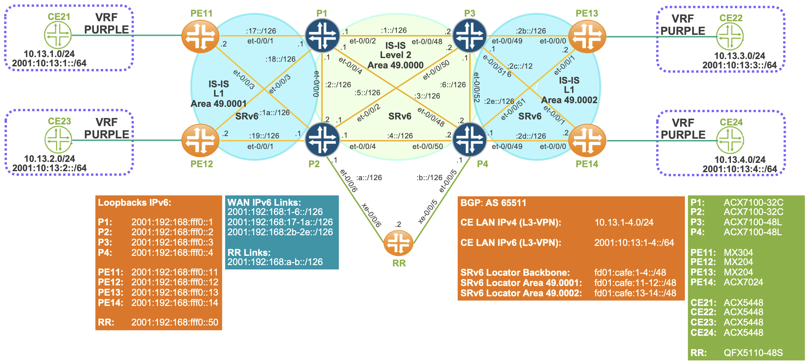
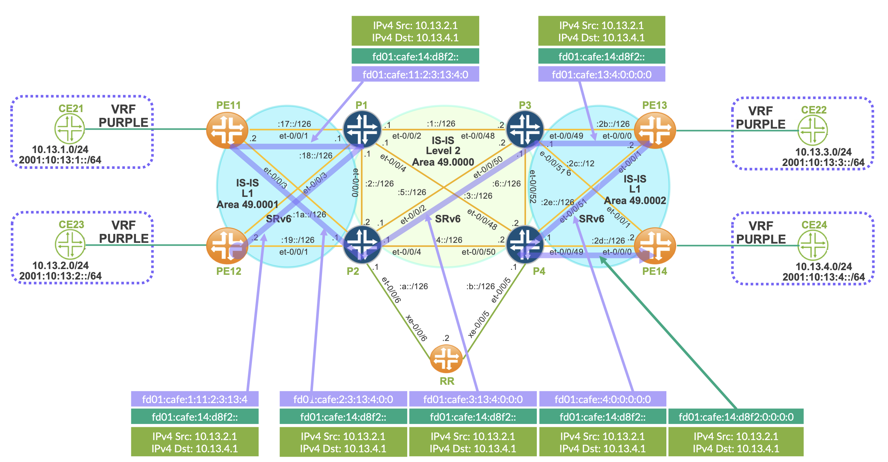
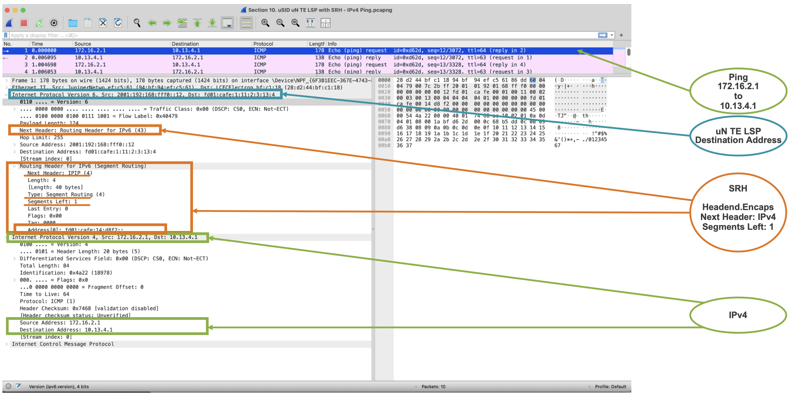
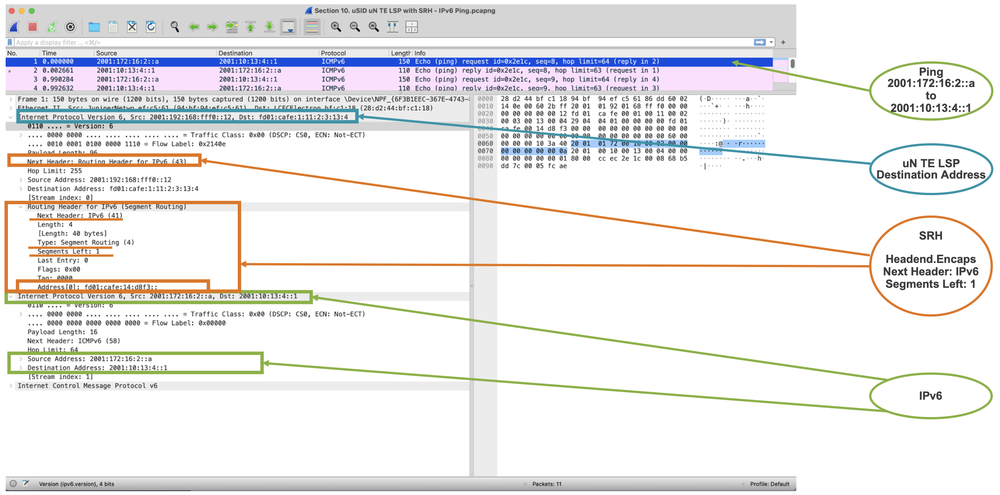
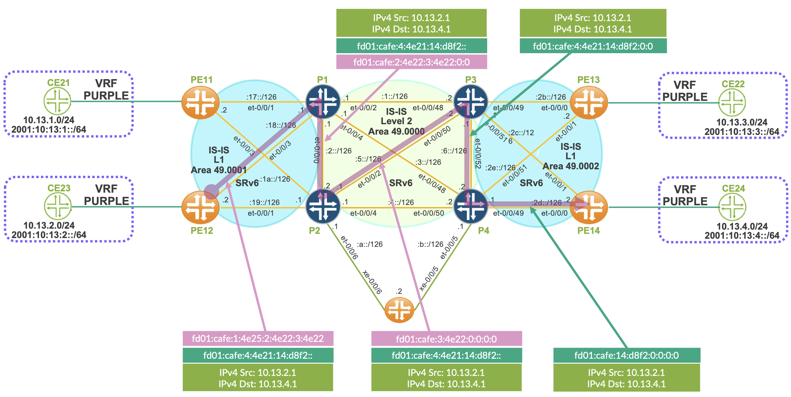
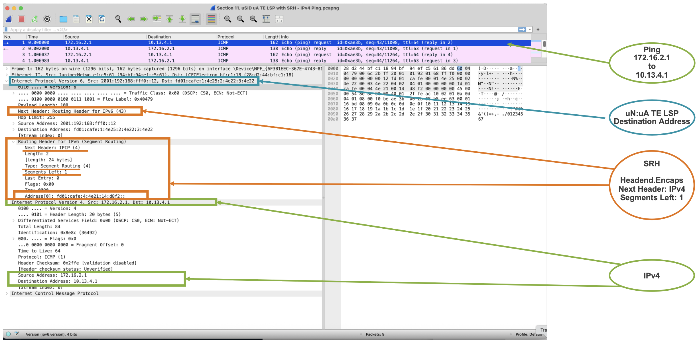
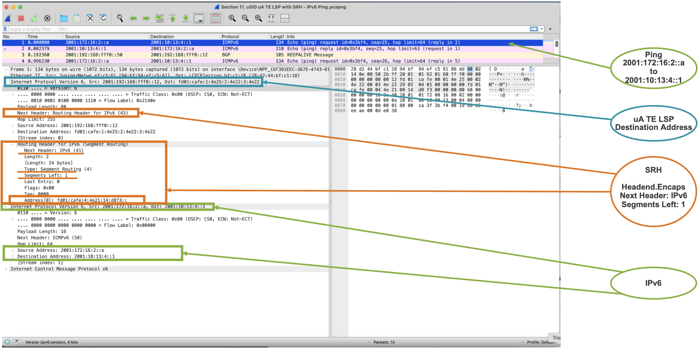
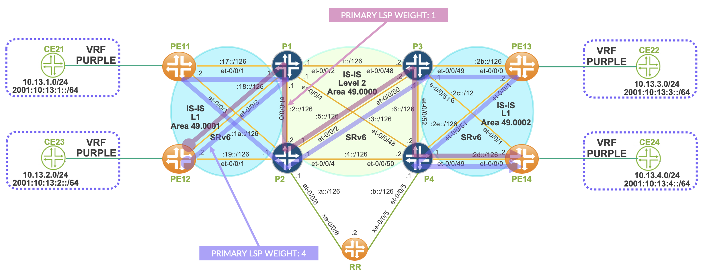

# SRv6 Static LSPs

**Ricardo Dominguez - 05/27/2026**

There are several approaches to deploying SRv6 Traffic Engineering (TE) tunnels (LSPs), depending on the operational and automation requirements of the network. These approaches include explicitly defined (static) LSPs, dynamically computed LSPs using Constraint-Based Shortest Path First (CSPF), and centrally orchestrated paths provisioned through a WAN Controller.

In this two-part technical blog series, we will take a deep dive into SRv6 TE LSP architectures and operational models, focusing on both static and dynamic path computation techniques. The series will explore how SRv6 enables flexible and scalable traffic engineering, while also highlighting the practical considerations, configuration models, and deployment scenarios associated with each approach.

In the first post, we will examine static SRv6 TE LSPs, covering their design principles, use cases, and configuration workflows. We will demonstrate how manually defined segment lists can be leveraged to steer traffic through pre-determined paths across the network.

In the upcoming second post, we will shift our attention to dynamic SRv6 TE LSPs in multi-domain environments. We will explore how CSPF-based path computation and automated traffic engineering mechanisms can improve resiliency and simplify operations across complex topologies. Stay tuned as we break down the underlying concepts, workflows, and implementation details behind dynamic SRv6 TE deployments.

## Introduction

Static SRv6 Traffic Engineering (TE) LSPs provide a straightforward and pre-determined method for steering traffic across a network. In this model, the operator explicitly defines the exact sequence of segments, nodes, or links that packets must traverse from source to destination. Because the forwarding path is manually specified, static SRv6 LSPs are generally easier to configure and understand, making them particularly useful for controlled environments, testing scenarios, or networks where deterministic traffic behavior is required.

With static SRv6 TE policies, traffic steering follows a predefined path through the network. Packets are forwarded through the exact set of intermediate waypoints configured by the operator, and in the precise order defined within the segment list. This deterministic behavior provides a high level of operational control and predictability, allowing network engineers to enforce strict routing policies, avoid specific parts of the network, or direct traffic through selected service nodes and optimized transit paths.

One of the major drawbacks of static SRv6 LSPs is their operational fragility. Since the path is statically defined, failures affecting any intermediate node or link can disrupt the entire forwarding path. Although underlying protection mechanisms such as TI-LFA may provide temporary recovery, the resulting rerouted traffic may no longer follow the operator's intended policy. This can lead to suboptimal forwarding behavior or loss of service guarantees.

Consequently, static SRv6 paths offer exceptional control but limited flexibility. Maintaining resiliency in such deployments often requires additional engineering efforts, including the design of backup segment lists, secondary TE policies, protection schemes, or operational procedures to manually adapt paths during failures or maintenance events. In larger or more dynamic environments, this operational overhead can quickly become difficult to scale, which is why many service providers complement or replace static paths with dynamic SRv6 TE mechanisms orchestrated through CSPF computations or centralized WAN controllers.

In this technical blog series, we will take a detailed look at the deployment and operation of static SRv6 Traffic Engineering (TE) LSPs in the JUNOS operating system. The objective is to explore how SRv6 TE policies can be constructed and enforced using different SID structures and traffic-engineering techniques, while also highlighting the operational considerations associated with each approach.

We will examine several types of static SRv6 TE LSP implementations, including:

- Static LSPs based on uN SIDs
- Static LSPs based on uN:uA SIDs
- Static weighted LSPs for traffic distribution and path optimization

As the series progresses, we will transition from static SRv6 TE policies to dynamic SRv6 TE LSPs and their associated control-plane requirements. One of the key concepts in dynamic path computation is the Traffic Engineering Database (TED), which stores topology and TE-related attributes learned from the IGP. In IS-IS environments, it is important to remember that the TED is maintained on a per level basis. This becomes a critical design consideration in multi-domain deployments because routers do not automatically learn a complete end-to-end topology view across all IS-IS areas.

When establishing dynamic SRv6 TE LSPs across a multi-domain IS-IS network, topology visibility must therefore be extended beyond a single level. Two primary approaches are commonly used to achieve this:

- Using a centralized WAN Controller, such as Juniper Networks Routing Director, which collects topology information and computes end-to-end SRv6 TE paths centrally
- Leveraging BGP-LS as a distributed topology dissemination mechanism, where BGP-LS Producers (typically L1/L2 routers) advertise TED information toward BGP-LS Consumers (such as ingress PE routers), often through Route Reflectors

These approaches enable routers or controllers to build a unified topology view across multiple IS-IS domains, making dynamic SRv6 TE path computation possible even in complex, large-scale service provider environments.

In our upcoming post, we will focus specifically on the second approach: controllerless multi-domain SRv6 TE using BGP-LS TED distribution. We will explore how BGP-LS can provide scalable topology dissemination across IS-IS levels, how ingress routers can leverage this information for dynamic CSPF-based path computation, and how this architecture enables advanced SRv6 Traffic Engineering without relying on an external centralized controller.

## Test Topology

Our test topology is built around a multi-domain IS-IS architecture designed to demonstrate SRv6 Traffic Engineering operations across both Level 1 and Level 2 domains. This topology provides a realistic representation of how service provider networks are commonly structured, where the backbone operates as a Level 2 transport core while edge and access regions are segmented into separate Level 1 areas.

This hierarchical design allows us to examine how SRv6 TE policies behave not only within a single IS-IS domain, but also across multiple areas where topology visibility and Traffic Engineering Database (TED) distribution become important operational considerations.

## Level 2 Backbone Area

The core of the topology consists of routers P1, P2, P3, and P4, which are interconnected within IS-IS Level 2 Area 49.0000.

These routers form the transport backbone of the network and provide inter-area connectivity between the different Level 1 domains. As Level 2 routers, they maintain the backbone topology and are responsible for forwarding traffic between the various edge regions of the network.  Within this backbone, SRv6 segment routing information and Traffic Engineering attributes are propagated through IS-IS extensions.

## Level 1 Edge Areas

Two separate Level 1 areas are connected to the Level 2 backbone:

- Level 1 Area 49.0001
- Level 1 Area 49.0002

In Area 49.0001:

- Router PE11 connects to backbone router P1
- Router PE12 connects to backbone router P2

These routers represent ingress and egress Provider Edge (PE) devices located within the same Level 1 domain. They rely on the Level 2 backbone for connectivity toward destinations located outside their local area.

In Area 49.0002:

- Router PE13 connects to backbone router P3
- Router PE14 connects to backbone router P4

This second Level 1 domain represents another edge region of the network connected through the shared Level 2 core.

The separation into multiple Level 1 areas allows us to simulate realistic multi-domain SRv6 TE scenarios, where routers do not inherently possess full topology visibility across all IS-IS levels.

This topology will serve as the foundation for the upcoming configuration examples and SRv6 TE demonstrations throughout the series.



This network topology is built on an IPv6-native underlay, where IS-IS is used as the interior gateway protocol for routing and topology dissemination across the infrastructure. The design leverages SRv6 as the primary tunneling and traffic engineering technology, enabling source-routing capabilities directly within the IPv6 data plane. This allows end-to-end packet steering across the network without requiring traditional MPLS labels while maintaining strong traffic engineering control.

Within this architecture, BGP plays a critical role at the service layer rather than the transport layer. It is used between Provider Edge (PE) routers and Route Reflectors (RRs) to distribute IPv4 and IPv6 VPN routes, including support for SRv6-enabled VPN extensions. This enables the delivery of Layer 3 VPN services over the SRv6 underlay, allowing customer traffic to be properly segmented and routed across the provider network while maintaining isolation between tenants.

A key design characteristic of this topology is that it operates as a BGP-free core. The backbone network does not rely on BGP for internal routing decisions or reachability. Instead, all core routing is handled exclusively by IS-IS, which maintains the IPv6 underlay topology. This significantly reduces control-plane complexity within the core, as BGP is completely confined to the edge and service layer functions on the PE routers.

In this model, IPv6 is used natively throughout the core network, and no IPv4 routing exists within the underlay. All transport traffic---including service encapsulation and SRv6 forwarding---is carried over SRv6 tunnels.

Although the core is IPv6-only and BGP-free, the network still supports full Layer 3 VPN services across all PE routers. These VPN services provide connectivity for both IPv4 and IPv6 customer traffic originating from CE devices. The PE routers act as service edge points where customer routes are learned via BGP, placed into VRFs, and then transported across the SRv6-enabled IPv6 core. This ensures that both IPv4 and IPv6 VPN traffic can be carried transparently over a unified SRv6 underlay, combining service flexibility with a simplified, protocol-minimized core design.

## Hardware Used

We are utilizing the following HPE Juniper hardware in our test bed topology to build a realistic and production-representative SRv6-enabled service provider environment.

- P1: ACX7100-32C
- P2: ACX7100-32C
- P3: ACX7100-48L
- P4: ACX7100-48L
- PE11: MX304
- PE12: MX204
- PE13: MX204
- PE14: ACX7024
- CE21: ACX5448
- CE22: ACX5448
- CE23: ACX5448
- CE24: ACX5448
- RR: QFX5110-48S

## SRv6

Before deploying a SRv6 TE LSPs, we need to enable SRv6 in the network infrastructure and BGP based services.

For our network, the following SRv6 attributes need to be enable:

- SRv6 Locator Block
    - Our network is based on fd01:cafe::/32 locator block
- SRv6 Locator Node
    - The Node Index ID is assigned to our routers in a manner that corresponds to their respective identifiers, specifically matching the digits of PE or P routers.
        - PE11: 11
        - P1: 1
        - PE12: 12
        - P2: 2
        - PE13: 13
        - P3: 3
        - PE14: 14
        - P4: 4
- Advertise the SRv6 Locator Prefix in IS-IS
- Enable uA on the IS-IS interfaces

For SRv6 locator addressing, there are two commonly accepted approaches: Unique Local Address (ULA) space (fc00::/7) or RFC 9602.

In our implementation, we choose to use ULA space, specifically a prefix derived from fd00::/8. According to RFC 4193, ULA prefixes require the least significant bit of the first octet to be 1.

The configuration shown for PE12 illustrates how the SRv6 locator is applied on a per-node basis. All other PE and P routers follow the same configuration model, with only the node ID and interface-specific parameters differing between devices.

```
routing-options {
    source-packet-routing {
        srv6 {
            block MICROSID_BLOCK {
                fd01:cafe::/32;
                global-micro-sid {
                    maximum-sids 20000;
                }
                local-micro-sid {
                    maximum-static-sids 10000;
                }
            }
            locator MICROSID_LOCATOR {
                fd01:cafe:12::/48;
                micro-sid {
                    block-name MICROSID_BLOCK;
                }
            }
        }
    }
    route-distinguisher-id 192.168.0.12;
    resolution {
        preserve-nexthop-hierarchy;
    }
    router-id 192.168.0.12;
    autonomous-system 65511; 
    ipv6-router-id 2001:192:168:fff0::12;
    forwarding-table {
        srv6-chain-merge;
    }
}
protocols {
    isis {
        interface et-0/0/1.0 {
            level 1 {
                srv6-adjacency-segment {
                    unprotected {
                        locator MICROSID_LOCATOR {
                            micro-adjacency-sid;
                        }
                    }
                }
            }
            point-to-point;
        }
        interface et-0/0/3.0 {
            level 1 {
                srv6-adjacency-segment {
                    unprotected {
                        locator MICROSID_LOCATOR {
                            micro-adjacency-sid;
                        }
                    }
                }
            }
            point-to-point;
        }
        interface lo0.0 {
            passive;
        }
        source-packet-routing {
            srv6 {
                locator MICROSID_LOCATOR micro-node-sid;
            }
        }
        level 1 {
            wide-metrics-only;
        }
        level 2 disable;
        reference-bandwidth 1000g;
        no-ipv4-routing;
        ignore-attached-bit;
        topologies ipv6-unicast;
    }
}
```

After verification, we can confirm that SRv6 has been successfully enabled on PE12.

```
jnpr@MX204-PE12# run show srv6 locator MICROSID_LOCATOR | no-more 
Locator: MICROSID_LOCATOR
  Locator prefix: fd01:cafe:12::, Locator length: 48
  Block length: 32, Node length: 16
  Function length: 16, Argument length: 0
  Micro SID Locator, Flavor [ USD PSP ]
  Micro SID Block Name: MICROSID_BLOCK
SID                                        SID-Owner     SID-Type      SID-Behavior
fd01:cafe:12:4e20::                        ISIS          DYNAMIC       End.X with NEXT-CSID, PSP & USD
fd01:cafe:12:4e21::                        ISIS          DYNAMIC       End.X with NEXT-CSID, PSP & USD

jnpr@MX204-PE12# run show srv6 block MICROSID_BLOCK | no-more 
Block: MICROSID_BLOCK
  Block Prefix: fd01:cafe::, Block length: 32, Micro-sid length: 16
  Global Micro SIDs:
    Static SID range: 0x0-0x4E1F, Dynamic SID range: -
    Allocated static SID count: 1, Allocated dynamic SID count: 0
    Available static SID count: 19999, Available dynamic SID count: 0
  Local Micro SIDs:
    Static SID range: 0xD8F0-0xFFFF, Dynamic SID range: 0x4E20-0xD8EF
    Allocated static SID count: 0, Allocated dynamic SID count: 2
    Available static SID count: 10000, Available dynamic SID count: 35534

jnpr@MX204-PE12# run show isis overview | no-more 
Instance: master
  Hostname: MX204-PE12
  Sysid: 1921.6800.0012
  Areaid: 49.0001
  Reference bandwidth: 1000000000000
  IPv6 is enabled, SPRING based MPLS is enabled
  Traffic engineering v6: disabled
  Source Packet Routing (SPRING): Enabled
    Node Segments: Disabled
    SRv6: Enabled
      Locator: fd01:cafe:12::/48, Algorithm: 0
        micro-node-SID: fd01:cafe:12::, Flavor: PSP, USD

jnpr@MX204-PE12# run show isis adjacency detail | no-more 
ACX7100-32C-P2
  Interface: et-0/0/1.0, Level: 1, State: Up, Expires in 19 secs
  Circuit type: 1, Speaks: IPv6
  Topologies: Unicast, IPV6-Unicast
  IPv6 addresses: fe80::2e4c:15ff:fe61:66a0
  IPv6 Global Interface Address: 2001:192:168:19::1
  Level 1 IPv6 Adj-SID: 32
  Level 1 SRv6 unprotected micro-adjacency-SID: fd01:cafe:12:4e21::
    Flavor: PSP, USD, Flags: ---, Algorithm: 0

ACX7100-32C-P1
  Interface: et-0/0/3.0, Level: 1, State: Up, Expires in 24 secs
  Circuit type: 1, Speaks: IPv6
  Topologies: Unicast, IPV6-Unicast
  IPv6 addresses: fe80::2cc:34ff:fe9b:281c
  IPv6 Global Interface Address: 2001:192:168:18::1
  Level 1 IPv6 Adj-SID: 31
  Level 1 SRv6 unprotected micro-adjacency-SID: fd01:cafe:12:4e20::
    Flavor: PSP, USD, Flags: ---, Algorithm: 0
```

We can confirm that the locator block fd01:cafe::/32 is in use, following the F3216 format, where 32 bits are allocated to the locator block and 16 bits to the locator node identifier.

The uN (locator prefix) is assigned in a static manner. Since PE12 has two SRv6 uplink interfaces, IS-IS allocates two corresponding uA entries, with one micro-adjacency per interface.

As a result, the routing tables inet6.0 and inet3.0 are populated with the SRv6 locator information. The inet6.0 table is populated via TLV 237 (Multi-Topology IPv6 Prefix Reachability) and is used for standard IPv6 forwarding. In contrast, inet6.3 is populated via TLV 27 and is used for SRv6 tunnel encapsulation and forwarding behavior.

```
jnpr@MX204-PE12# run show route table inet6.0 fd01:cafe::/32 | no-more 
inet6.0: 44 destinations, 44 routes (44 active, 0 holddown, 0 hidden)
+ = Active Route, - = Last Active, * = Both
fd01:cafe:1::/48   *[IS-IS/15] 00:31:17, metric 10
                    >  to fe80::2cc:34ff:fe9b:281c via et-0/0/3.0
fd01:cafe:2::/48   *[IS-IS/15] 00:31:11, metric 10
                    >  to fe80::2e4c:15ff:fe61:66a0 via et-0/0/1.0
fd01:cafe:3::/48   *[IS-IS/18] 00:31:11, metric 20
                       to fe80::2e4c:15ff:fe61:66a0 via et-0/0/1.0
                    >  to fe80::2cc:34ff:fe9b:281c via et-0/0/3.0
fd01:cafe:4::/48   *[IS-IS/18] 00:31:03, metric 20
                       to fe80::2e4c:15ff:fe61:66a0 via et-0/0/1.0
                    >  to fe80::2cc:34ff:fe9b:281c via et-0/0/3.0
fd01:cafe:11::/48  *[IS-IS/15] 00:31:19, metric 20
                       to fe80::2e4c:15ff:fe61:66a0 via et-0/0/1.0
                    >  to fe80::2cc:34ff:fe9b:281c via et-0/0/3.0
fd01:cafe:12::/48  *[IS-IS/15] 00:31:16, metric 0
                       Receive
fd01:cafe:12::/64  *[IS-IS/15] 00:31:16, metric 0
                       Receive
fd01:cafe:12:4e20::/64
                   *[IS-IS/15] 00:31:16, metric 0
                    >  to fe80::2cc:34ff:fe9b:281c via et-0/0/3.0
fd01:cafe:12:4e20::/80
                   *[IS-IS/15] 00:31:16, metric 0
                    >  to fe80::2cc:34ff:fe9b:281c via et-0/0/3.0
fd01:cafe:12:4e21::/64
                   *[IS-IS/15] 00:31:16, metric 0
                    >  to fe80::2e4c:15ff:fe61:66a0 via et-0/0/1.0
fd01:cafe:12:4e21::/80
                   *[IS-IS/15] 00:31:16, metric 0
                    >  to fe80::2e4c:15ff:fe61:66a0 via et-0/0/1.0
fd01:cafe:13::/48  *[IS-IS/18] 00:31:11, metric 30
                       to fe80::2e4c:15ff:fe61:66a0 via et-0/0/1.0
                    >  to fe80::2cc:34ff:fe9b:281c via et-0/0/3.0
fd01:cafe:14::/48  *[IS-IS/18] 00:31:03, metric 30
                       to fe80::2e4c:15ff:fe61:66a0 via et-0/0/1.0
                    >  to fe80::2cc:34ff:fe9b:281c via et-0/0/3.0
fd01:cafe:4e20::/48*[IS-IS/15] 00:31:16, metric 0
                    >  to fe80::2cc:34ff:fe9b:281c via et-0/0/3.0
fd01:cafe:4e20::/64*[IS-IS/15] 00:31:16, metric 0
                    >  to fe80::2cc:34ff:fe9b:281c via et-0/0/3.0
fd01:cafe:4e21::/48*[IS-IS/15] 00:31:16, metric 0
                    >  to fe80::2e4c:15ff:fe61:66a0 via et-0/0/1.0
fd01:cafe:4e21::/64*[IS-IS/15] 00:31:16, metric 0
                    >  to fe80::2e4c:15ff:fe61:66a0 via et-0/0/1.0

jnpr@MX204-PE12# run show route table inet6.3 fd01:cafe::/32 | no-more 
inet6.3: 14 destinations, 14 routes (14 active, 0 holddown, 0 hidden)
+ = Active Route, - = Last Active, * = Both
fd01:cafe:1::/48   *[SRV6-ISIS/14] 00:31:16, metric 10
                    >  to fe80::2cc:34ff:fe9b:281c via et-0/0/3.0, SRV6-Tunnel, Dest: fd01:cafe:1::
fd01:cafe:2::/48   *[SRV6-ISIS/14] 00:31:11, metric 10
                    >  to fe80::2e4c:15ff:fe61:66a0 via et-0/0/1.0, SRV6-Tunnel, Dest: fd01:cafe:2::
fd01:cafe:3::/48   *[SRV6-ISIS/14] 00:31:11, metric 20
                       to fe80::2e4c:15ff:fe61:66a0 via et-0/0/1.0, SRV6-Tunnel, Dest: fd01:cafe:3::
                    >  to fe80::2cc:34ff:fe9b:281c via et-0/0/3.0, SRV6-Tunnel, Dest: fd01:cafe:3::
fd01:cafe:4::/48   *[SRV6-ISIS/14] 00:31:03, metric 20
                       to fe80::2e4c:15ff:fe61:66a0 via et-0/0/1.0, SRV6-Tunnel, Dest: fd01:cafe:4::
                    >  to fe80::2cc:34ff:fe9b:281c via et-0/0/3.0, SRV6-Tunnel, Dest: fd01:cafe:4::
fd01:cafe:11::/48  *[SRV6-ISIS/14] 00:31:16, metric 20
                       to fe80::2e4c:15ff:fe61:66a0 via et-0/0/1.0, SRV6-Tunnel, Dest: fd01:cafe:11::
                    >  to fe80::2cc:34ff:fe9b:281c via et-0/0/3.0, SRV6-Tunnel, Dest: fd01:cafe:11::
fd01:cafe:13::/48  *[SRV6-ISIS/14] 00:31:11, metric 30
                       to fe80::2e4c:15ff:fe61:66a0 via et-0/0/1.0, SRV6-Tunnel, Dest: fd01:cafe:13::
                    >  to fe80::2cc:34ff:fe9b:281c via et-0/0/3.0, SRV6-Tunnel, Dest: fd01:cafe:13::
fd01:cafe:14::/48  *[SRV6-ISIS/14] 00:31:03, metric 30
                       to fe80::2e4c:15ff:fe61:66a0 via et-0/0/1.0, SRV6-Tunnel, Dest: fd01:cafe:14::
                    >  to fe80::2cc:34ff:fe9b:281c via et-0/0/3.0, SRV6-Tunnel, Dest: fd01:cafe:14::
```

Enabling SRv6 on a network device alone does not automatically result in service traffic being carried over SRv6. To achieve this, BGP must be configured with SRv6 extensions, and SRv6 must also be enabled within the Layer 3 VPN service configuration.

In this setup, the uDT4 and uDT6 SRv6 behaviors are utilized, both of which provide per-VRF uSID allocation. The uDT4 behavior performs SRv6 decapsulation followed by an IPv4 routing table lookup, while uDT6 performs SRv6 decapsulation followed by an IPv6 routing table lookup.

The corresponding configuration is provided below.

```
protocols {
    bgp {
        group INTERNO_IPv6 {
            type internal;
            local-address 2001:192:168:fff0::12;
            family inet-vpn {
                unicast {
                    extended-nexthop;
                    advertise-srv6-service;
                    accept-srv6-service;
                }
            }
            family inet6-vpn {
                unicast {
                    advertise-srv6-service;
                    accept-srv6-service;
                }
            }
            neighbor 2001:192:168:fff0::50;
        }
        multipath {
            list-nexthop;
        }
        rfc8950-compliant;
    }
}

routing-instances {
    VRF_PURPLE {
        instance-type vrf;
        protocols {
            bgp {
                group CE23 {
                    type external;
                    as-override;
                    neighbor 172.16.2.2 {
                        family inet {
                            unicast;
                        }
                        peer-as 65500;
                    }
                    neighbor 2001:172:16:2::b {
                        family inet6 {
                            unicast;
                        }
                        peer-as 65500;
                    }
                }
                source-packet-routing {
                    srv6 {
                        locator MICROSID_LOCATOR {
                            micro-dt4-sid;
                            micro-dt6-sid;
                        }
                    }
                }
            }
        }
        interface xe-0/1/4.0;
        route-distinguisher 192.168.0.12:12;
        vrf-target target:65511:100;
        vrf-table-label;
    }
}
```

We can verify that both IPv4 and IPv6 VRF traffic is being received with an associated SRv6 SID and is subsequently encapsulated using SRv6.

```
jnpr@MX204-PE12# run show route table VRF_MORADA.inet.0 10.13/16 
VRF_MORADA.inet.0: 13 destinations, 13 routes (13 active, 0 holddown, 0 hidden)
+ = Active Route, - = Last Active, * = Both
10.13.1.0/24       *[BGP/170] 00:44:28, localpref 100, from 2001:192:168:fff0::50
                      AS path: 65500 I, validation-state: unverified
                    >  to fe80::2e4c:15ff:fe61:66a0 via et-0/0/1.0, SRv6 SID: fd01:cafe:11:4e21::, SRV6-Tunnel, Dest: fd01:cafe:11::
                       to fe80::2cc:34ff:fe9b:281c via et-0/0/3.0, SRv6 SID: fd01:cafe:11:4e21::, SRV6-Tunnel, Dest: fd01:cafe:11::
10.13.3.0/24       *[BGP/170] 00:39:38, localpref 100, from 2001:192:168:fff0::50
                      AS path: 65500 I, validation-state: unverified
                    >  to fe80::2e4c:15ff:fe61:66a0 via et-0/0/1.0, SRv6 SID: fd01:cafe:13:d8f2::, SRV6-Tunnel, Dest: fd01:cafe:13::
                       to fe80::2cc:34ff:fe9b:281c via et-0/0/3.0, SRv6 SID: fd01:cafe:13:d8f2::, SRV6-Tunnel, Dest: fd01:cafe:13::
10.13.4.0/24       *[BGP/170] 00:38:34, localpref 100, from 2001:192:168:fff0::50
                      AS path: 65500 I, validation-state: unverified
                    >  to fe80::2e4c:15ff:fe61:66a0 via et-0/0/1.0, SRv6 SID: fd01:cafe:14:d8f2::, SRV6-Tunnel, Dest: fd01:cafe:14::
                       to fe80::2cc:34ff:fe9b:281c via et-0/0/3.0, SRv6 SID: fd01:cafe:14:d8f2::, SRV6-Tunnel, Dest: fd01:cafe:14::
                       

jnpr@MX204-PE12# run show route table VRF_MORADA.inet6.0 2001:10:13::/48 
VRF_MORADA.inet6.0: 15 destinations, 15 routes (15 active, 0 holddown, 0 hidden)
+ = Active Route, - = Last Active, * = Both
2001:10:13:1::/64  *[BGP/170] 00:44:33, localpref 100, from 2001:192:168:fff0::50
                      AS path: 65500 I, validation-state: unverified
                    >  to fe80::2e4c:15ff:fe61:66a0 via et-0/0/1.0, SRv6 SID: fd01:cafe:11:4e22::, SRV6-Tunnel, Dest: fd01:cafe:11::
                       to fe80::2cc:34ff:fe9b:281c via et-0/0/3.0, SRv6 SID: fd01:cafe:11:4e22::, SRV6-Tunnel, Dest: fd01:cafe:11::
2001:10:13:3::/64  *[BGP/170] 00:39:43, localpref 100, from 2001:192:168:fff0::50
                      AS path: 65500 I, validation-state: unverified
                    >  to fe80::2e4c:15ff:fe61:66a0 via et-0/0/1.0, SRv6 SID: fd01:cafe:13:d8f3::, SRV6-Tunnel, Dest: fd01:cafe:13::
                       to fe80::2cc:34ff:fe9b:281c via et-0/0/3.0, SRv6 SID: fd01:cafe:13:d8f3::, SRV6-Tunnel, Dest: fd01:cafe:13::
2001:10:13:4::/64  *[BGP/170] 00:38:39, localpref 100, from 2001:192:168:fff0::50
                      AS path: 65500 I, validation-state: unverified
                    >  to fe80::2e4c:15ff:fe61:66a0 via et-0/0/1.0, SRv6 SID: fd01:cafe:14:d8f3::, SRV6-Tunnel, Dest: fd01:cafe:14::
                       to fe80::2cc:34ff:fe9b:281c via et-0/0/3.0, SRv6 SID: fd01:cafe:14:d8f3::, SRV6-Tunnel, Dest: fd01:cafe:14::
```

PE12 is receiving routes that include an SRv6 SID carried within the BGP Prefix-SID path attribute. Now, let's take a closer look at the received PE14 VRF Purple IPv4 and IPv6 routes.

```
jnpr@MX204-PE12# run show route receive-protocol bgp 2001:192:168:fff0::50 table VRF_MORADA.inet.0 detail 

VRF_MORADA.inet.0: 13 destinations, 13 routes (13 active, 0 holddown, 0 hidden)
* 10.13.4.0/24 (1 entry, 1 announced)
     Import Accepted MultiNexthop RecvNextHopIgnored
     Route Distinguisher: 192.168.0.14:14
     VPN Label: 888608
     Nexthop: 2001:192:168:fff0::14
     Localpref: 100
     AS path: 65500 I  (Originator)
     Cluster list:  192.168.0.50
     Originator ID: 192.168.0.14
     Communities: target:65511:100
                SRv6 SID: fd01:cafe:14:: Service tlv type: 5 Behavior: 63 BL: 32 NL: 16 FL: 16 AL: 0 TL: 16 TO: 48

jnpr@MX204-PE12# run show route receive-protocol bgp 2001:192:168:fff0::50 table VRF_MORADA.inet6.0 detail 

VRF_MORADA.inet6.0: 15 destinations, 15 routes (15 active, 0 holddown, 0 hidden)
* 2001:10:13:4::/64 (1 entry, 1 announced)
     Import Accepted MultiNexthop RecvNextHopIgnored
     Route Distinguisher: 192.168.0.14:14
     VPN Label: 888624
     Nexthop: 2001:192:168:fff0::14
     Localpref: 100
     AS path: 65500 I  (Originator)
     Cluster list:  192.168.0.50
     Originator ID: 192.168.0.14
     Communities: target:65511:100
                SRv6 SID: fd01:cafe:14:: Service tlv type: 5 Behavior: 62 BL: 32 NL: 16 FL: 16 AL: 0 TL: 16 TO: 48
```

As observed, the BGP Protocol Next-Hop is effectively ignored for these routes, which is a specific behavior of SRv6-based service forwarding. Unlike traditional IP or MPLS-based VPN transport, SRv6 does not rely on the BGP next-hop for forwarding decisions. Instead, route resolution is driven by the SRv6 Segment Identifier (SID) that is carried within the BGP Prefix-SID Path Attribute.

The resulting SRv6 SID used for forwarding is not derived from a single attribute alone. Instead, it is formed through the combination of two key BGP components: the SRv6 SID carried in the BGP Prefix-SID Path Attribute, and the transposition of the service label information contained within the MP_REACH_NLRI attribute. Together, these elements construct the final SRv6 instruction set that enables end-to-end service steering across the network.

## Static SRv6 LSPs

In SRv6 Traffic Engineering (TE), BGP routes are not directly resolved by matching an SRv6 SID. Instead, traffic steering is achieved through an intent-based SR Policy framework.

The egress Provider Edge (PE) marks each BGP route with a color community, which represents the desired traffic-engineering intent. At the ingress PE, this color---together with the route's **protocol next hop (PNH)**---is used to identify and bind the route to an SR Policy that matches the same color and endpoint.

An SR Policy is defined by a three-element tuple:

- **Headend**: the ingress router where the policy is instantiated

- **Color**: a numeric identifier representing the service or TE intent (carried via BGP community)

- **Endpoint**: the destination node of the traffic flow

Each SR Policy may contain multiple candidate paths, which are evaluated and prioritized based on preference values. Within each candidate path, multiple segment lists can be configured, each with an associated weight. This enables weighted ECMP behavior, allowing traffic to be distributed across multiple SRv6 TE paths in a controlled manner.

Because static SR paths operate in a stateless manner, it is recommended to use S-BFD (Seamless Bidirectional Forwarding Detection) to continuously monitor path health and ensure rapid failure detection.

## Static LSP using uN segments

For this LSP, we will configure a path from PE12 to PE14, traversing a predefined sequence of nodes: P1, PE11, P2, P3, PE13, and P4. This is achieved by using only **uN segments**, where each hop is explicitly defined in the segment list.

This LSP relies on uN segments, which correspond to the **Node IDs** assigned to each router. These node identifiers are statically configured, must be unique across the network, and are operationally similar to loopback addresses in traditional IP routing. Just like loopbacks, they are not dynamically assigned because they serve as stable and deterministic identifiers for SRv6 forwarding.

The uN segment is formed by concatenating the **locator block** with the **locator node**, following the F3216 addressing format. In our topology, each router is assigned a /48 SRv6 locator prefix as shown below:

- P1: fd01:cafe:1::/48
- P2: fd01:cafe:2::/48
- P3: fd01:cafe:3::/48
- P4: fd01:cafe:4::/48
- PE11: fd01:cafe:11::/48
- PE12: fd01:cafe:12::/48
- PE13: fd01:cafe:13::/48
- PE14: fd01:cafe:14::/48

These uN segments are fully routable within the network, meaning that every router has reachability information for all node SIDs. They are installed in the forwarding table and can be used directly for SRv6 packet steering without additional resolution mechanisms.

It is important to note that this LSP does not necessarily represent the most optimal path from a routing perspective. Instead, it is deliberately constructed using multiple static uN segments to demonstrate how an SRH (Segment Routing Header) can carry a complete list of uSIDs, enforcing strict hop-by-hop forwarding along the defined route.

The LSP is named "**PE12_to_PE14_COLOR_300**", associated with **color 300**, and consists of a single candidate path: "**PATH_PE12_to_PE14_COLOR_300**". The configuration for this LSP is shown below.

```
protocols {
    source-packet-routing {
        segment-list PATH_PE12_to_PE14_COLOR_300 {
            srv6;
            P1 {
                micro-srv6-sid {
                    fd01:cafe:1::;
                }
            }
            PE11 {
                micro-srv6-sid {
                    fd01:cafe:11::;
                }
            }
            P2 {
                micro-srv6-sid {
                    fd01:cafe:2::;
                }
            }
            P3 {
                micro-srv6-sid {
                    fd01:cafe:3::;
                }
            }
            PE13 {
                micro-srv6-sid {
                    fd01:cafe:13::;
                }
            }
            P4 {
                micro-srv6-sid {
                    fd01:cafe:4::;
                }
            }
            PE14 {
                micro-srv6-sid {
                    fd01:cafe:14::;
                }
            }
        }
        srv6;
        source-routing-path PE12_to_PE14_COLOR_300 {
            srv6;
            to 2001:192:168:fff0::14;
            color 300;
            primary {
                PATH_PE12_to_PE14_COLOR_300;
            }
        }
        use-transport-class;
    }
}
routing-options {
    transport-class {
        name TC_MEDIUM_300 {
            color 300;
        }
    }
}
policy-options {
    policy-statement VRF_MORADA_COLOR_300 {
        term 1 {
            then {
                community add MEDIUM_LSP_PRIORITY;
                community add target:65511:100;
                accept;
            }
        }
    }
    community MEDIUM_LSP_PRIORITY members color:0:300;
    community target:65511:100 members target:65511:100;
}
routing-instances {
    VRF_PURPLE {
        vrf-export VRF_MORADA_COLOR_300;
    }
}
```

The path of our LSP is shown below.



Starting from P1, each router processes its respective uSID using a "shift and forward" behavior. At P4, a PSP (Penultimate Segment Pop) operation is performed, where the last SID is written into the IPv6 destination address and the SRH is removed. Finally, PE14 executes a USD operation, removing the IPv6 header and forwarding the decapsulated payload, which may be either IPv4 or IPv6 traffic.

From a Junos operational perspective, the LSP is shown in an **up** state. It is important to note that a numeric value appears alongside the destination address; this value represents the configured LSP color. In this case, the value is **300**, matching the color assigned to the LSP.

The SID type associated with this path is a **uSID**, corresponding to the configured uN value.

```
jnpr@MX204-PE12# run show spring-traffic-engineering lsp 
To                        State        LSPname
2001:192:168:fff0::14-300<c6>    Up           PE12_to_PE14_COLOR_300
Total displayed LSPs: 1 (Up: 1, Down: 0, Initializing: 0)

jnpr@MX204-PE12# run show spring-traffic-engineering lsp detail | no-more 
Name: PE12_to_PE14_COLOR_300
  Tunnel-source: Static configuration
  Tunnel Forward Type: SRV6
  To: 2001:192:168:fff0::14-300<c6>
  From: 2001:192:168:fff0::12
  State: Up
    Path: PATH_PE12_to_PE14_COLOR_300
    ERO Valid: true
      SR-ERO hop count: 7
        Hop 1 (Strict): 
          NAI: None
          SID type: Micro SRv6 SID, Value: fd01:cafe:1::
          SSTLV: BL: 32, NL: 16, FL: 0, AL: 80
        Hop 2 (Strict): 
          NAI: None
          SID type: Micro SRv6 SID, Value: fd01:cafe:11::
          SSTLV: BL: 32, NL: 16, FL: 0, AL: 80
        Hop 3 (Strict): 
          NAI: None
          SID type: Micro SRv6 SID, Value: fd01:cafe:2::
          SSTLV: BL: 32, NL: 16, FL: 0, AL: 80
        Hop 4 (Strict): 
          NAI: None
          SID type: Micro SRv6 SID, Value: fd01:cafe:3::
          SSTLV: BL: 32, NL: 16, FL: 0, AL: 80
        Hop 5 (Strict): 
          NAI: None
          SID type: Micro SRv6 SID, Value: fd01:cafe:13::
          SSTLV: BL: 32, NL: 16, FL: 0, AL: 80
        Hop 6 (Strict): 
          NAI: None
          SID type: Micro SRv6 SID, Value: fd01:cafe:4::
          SSTLV: BL: 32, NL: 16, FL: 0, AL: 80
        Hop 7 (Strict): 
          NAI: None
          SID type: Micro SRv6 SID, Value: fd01:cafe:14::
          SSTLV: BL: 32, NL: 16, FL: 0, AL: 80
Total displayed LSPs: 1 (Up: 1, Down: 0, Initializing: 0)
```

Our LSP is installed in the junos-rti-tc-300.inet6.3 routing table. It is established using SPRING-TE and configured with a protocol preference of 8.

```
jnpr@MX204-PE12# run show route table junos-rti-tc-300.inet6.3 
junos-rti-tc-300.inet6.3: 1 destinations, 1 routes (1 active, 0 holddown, 0 hidden)
+ = Active Route, - = Last Active, * = Both
2001:192:168:fff0::14/128 *[SPRING-TE/8] 04:17:14, metric 1, metric2 30
                    >  to fe80::2cc:34ff:fe9b:281c via et-0/0/3.0, SRV6-Tunnel, Dest: 2001:192:168:fff0::14-300<c6>
```

Purple VRF IPv4 and IPv6 routes that are tagged with a color community will resolve their protocol next hop (PNH) within transport class instance 300. If no matching route is available to resolve the PNH in this instance, the lookup will fall back to the inet(6).3 routing table.

```
jnpr@MX204-PE12# run show route resolution scheme name junos-resol-schem-tc-300-v6-service      
Resolution scheme: junos-resol-schem-tc-300-v6-service
  AutoCreated 
  References: 1
  Mapping community: color:0:300 
  Resolution Tree: 0x f7f6000, index: 6, Nodes: 9
  Policy: [__resol-schem-common-import-policy__]
  Contributing routing tables: junos-rti-tc-300.inet6.3 inet6.3
```

PE14 "Purple" VRF IPv4 and IPv6 routes are received with a color community value of 300 and are resolved using the SRv6 LSP from PE12 to PE14 associated with color 300.

```
jnpr@MX204-PE12# run show route table VRF_MORADA.inet.0 10.13.4/24 extensive fib-expanded-nh | match "Dest:|Segment-list" | no-more 
                         Src: 2001:192:168:fff0::12 Dest: 2001:192:168:fff0::14-300<c6>
                         Segment-list[0] fd01:cafe:1:11:2:3:13:4
                         Segment-list[1] fd01:cafe:14::

jnpr@MX204-PE12# run show route table VRF_MORADA.inet.0 10.13.4/24 extensive fib-expanded-nh | match "Dest:|label" | no-more 
                         Src: 2001:192:168:fff0::12 Dest: 2001:192:168:fff0::14-300<c6>
                VPN Label: 888608

jnpr@MX204-PE12# run show route table VRF_MORADA.inet6.0 2001:10:13:4::/64 extensive fib-expanded-nh | match "Dest:|Segment-list" | no-more 
                         Src: 2001:192:168:fff0::12 Dest: 2001:192:168:fff0::14-300<c6>
                         Segment-list[0] fd01:cafe:1:11:2:3:13:4
                         Segment-list[1] fd01:cafe:14::

jnpr@MX204-PE12# run show route table VRF_MORADA.inet6.0 2001:10:13:4::/64 extensive fib-expanded-nh | match "Dest:|label" | no-more 
                         Src: 2001:192:168:fff0::12 Dest: 2001:192:168:fff0::14-300<c6>
                VPN Label: 888624
```

Let's examine how IPv4 and IPv6 ping traffic originating from the "Purple" VRF on PE12 and destined for PE14 is encapsulated within IPv6, and how all uN segments in the TE LSP are inserted into the IPv6 destination address along with the SRH for the remaining uSIDs.

These ping packets are generated from PE12's IPv4 or IPv6 interface connected to CE23 and are forwarded toward the CE24 LAN behind PE14.





As observed, both IPv4 and IPv6 ping traffic is encapsulated within IPv6 and steered through the uN segments corresponding to P1, PE11, P2, P3, PE13, and P4. In addition, the PE14 uN segment together with the uDT4 or uDT6 uSIDs is included in the SRH.

## Static LSP using uN uA segment combination

In this example, we configure another static SRv6 TE LSP from PE12 to PE14, this time using a combination of **uN and uA segments**. The traffic is steered along a strict hop-by-hop path that follows the links between PE12 and P1, P1 and P2, P2 and P3, and finally P3 and P4. This is achieved by explicitly defining each link in the path using **uN:uA segments**.

This type of LSP leverages both **node segments (uN)** and **adjacency segments (uA)**. The uN component represents the node identifier assigned to each router, while the uA component corresponds to the adjacency SID generated for each physical or logical interface. Together, the uN:uA format allows for precise steering at both the node and link level.

Each uN:uA segment is 32 bits in total, composed of 16 bits for the uN portion and 16 bits for the uA portion. Despite this combination, the segment remains routable because the uN portion ensures network-wide reachability, while the uA portion provides local adjacency-specific forwarding behavior.

If the "**strict-adjacency**" option is applied after each micro-SID in the segment list, the LSP would use only pure uA segments. This reduces the segment size from 32-bit uN:uA combinations to 16-bit uA-only segments, thereby decreasing IPv6 header overhead. However, this comes with an important trade-off: uA segments are locally significant and not globally routable. The uA segments are strict and have local meaning, also the network operator should not configure a micro-SID with strict-adjacency if the previous uSID is only a uN, as once the corresponding routers consumes the uN segment, this router will fail in the lookup for the instantiated strict uA segment.

For this demonstration, we remove the previous LSP configuration and create a new one with the same name: "**PE12_to_PE14_COLOR_300**", using **color 300** and a single candidate path: "**PATH_PE12_to_PE14_COLOR_300**". The updated LSP configuration is shown below.

```
protocols {
    source-packet-routing {
        segment-list PATH_PE12_to_PE14_COLOR_300 {
            srv6;
            P1 {
                micro-srv6-sid {
                    fd01:cafe:1:4e25::;
                }
            }
            P2 {
                micro-srv6-sid {
                    fd01:cafe:2:4e22::;
                }
            }
            P3 {
                micro-srv6-sid {
                    fd01:cafe:3:4e22::;
                }
            }
            P4 {
                micro-srv6-sid {
                    fd01:cafe:4:4e21::;
                }
            }
            PE14 {
                micro-srv6-sid {
                    fd01:cafe:14::;
                }
            }
        }
        srv6;
        source-routing-path PE12_to_PE14_COLOR_300 {
            srv6;
            to 2001:192:168:fff0::14;
            color 300;
            primary {
                PATH_PE12_to_PE14_COLOR_300;
            }
        }
        use-transport-class;
    }
}
routing-options {
    transport-class {
        name TC_MEDIUM_300 {
            color 300;
        }
    }
}
policy-options {
    policy-statement VRF_MORADA_COLOR_300 {
        term 1 {
            then {
                community add MEDIUM_LSP_PRIORITY;
                community add target:65511:100;
                accept;
            }
        }
    }
    community MEDIUM_LSP_PRIORITY members color:0:300;
    community target:65511:100 members target:65511:100;
}
routing-instances {
    VRF_PURPLE {
        vrf-export VRF_MORADA_COLOR_300;
    }
}
```

The LSP path is shown below.



Starting at P1, each router processes the uN:uA segment using the "shift and forward" behavior. At P3, a PSP operation is performed, where the final SID is written into the IPv6 destination address and the SRH is removed. Finally, PE14 performs a USD operation, removing the IPv6 header and processing the decapsulated payload, which may be IPv4 or IPv6 traffic.

From a Junos operational perspective, the LSP is shown in an **up** state. It is worth noting that a numeric value appears next to the destination address.

The SID type is identified as a **uSID**, with the corresponding uN:uA value.

```
jnpr@MX204-PE12# run show spring-traffic-engineering lsp 
To                        State        LSPname
2001:192:168:fff0::14-300<c6>    Up           PE12_to_PE14_COLOR_300
Total displayed LSPs: 1 (Up: 1, Down: 0, Initializing: 0)

jnpr@MX204-PE12# run show spring-traffic-engineering lsp detail | no-more 
Name: PE12_to_PE14_COLOR_300
  Tunnel-source: Static configuration
  Tunnel Forward Type: SRV6
  To: 2001:192:168:fff0::14-300<c6>
  From: 2001:192:168:fff0::12
  State: Up
    Path: PATH_PE12_to_PE14_COLOR_300
    ERO Valid: true
      SR-ERO hop count: 5
        Hop 1 (Strict): 
          NAI: None
          SID type: Micro SRv6 SID, Value: fd01:cafe:1:4e25::
          SSTLV: BL: 32, NL: 16, FL: 16, AL: 64
        Hop 2 (Strict): 
          NAI: None
          SID type: Micro SRv6 SID, Value: fd01:cafe:2:4e22::
          SSTLV: BL: 32, NL: 16, FL: 16, AL: 64
        Hop 3 (Strict): 
          NAI: None
          SID type: Micro SRv6 SID, Value: fd01:cafe:3:4e22::
          SSTLV: BL: 32, NL: 16, FL: 16, AL: 64
        Hop 4 (Strict): 
          NAI: None
          SID type: Micro SRv6 SID, Value: fd01:cafe:4:4e21::
          SSTLV: BL: 32, NL: 16, FL: 16, AL: 64
        Hop 5 (Strict): 
          NAI: None
          SID type: Micro SRv6 SID, Value: fd01:cafe:14::
          SSTLV: BL: 32, NL: 16, FL: 0, AL: 80
Total displayed LSPs: 1 (Up: 1, Down: 0, Initializing: 0)
```

LSP is installed into junos-rti-tc-300.inet6.3 table. The LSP is set up using SPRING-TE with a protocol preference of 8.

```
jnpr@MX204-PE12# run show route table junos-rti-tc-300.inet6.3 
junos-rti-tc-300.inet6.3: 1 destinations, 1 routes (1 active, 0 holddown, 0 hidden)
+ = Active Route, - = Last Active, * = Both
2001:192:168:fff0::14/128 *[SPRING-TE/8] 04:17:14, metric 1, metric2 30
                    >  to fe80::2cc:34ff:fe9b:281c via et-0/0/3.0, SRV6-Tunnel, Dest: 2001:192:168:fff0::14-300<c6>
```

PE14 "Purple" VRF IPv4 and IPv6 routes are received with a color community of 300 and are resolved using the SRv6 LSP from PE12 to PE14 associated with color 300.

```
jnpr@MX204-PE12# run show route table VRF_MORADA.inet.0 10.13.4/24 extensive fib-expanded-nh | match "Dest:|Segment-list" | no-more 
                         Src: 2001:192:168:fff0::12 Dest: 2001:192:168:fff0::14-300<c6>
                         Segment-list[0] fd01:cafe:1:4e25:2:4e22:3:4e22
                         Segment-list[1] fd01:cafe:4:4e21:14::

jnpr@MX204-PE12# run show route table VRF_MORADA.inet.0 10.13.4/24 extensive fib-expanded-nh | match "Dest:|label" | no-more 
                         Src: 2001:192:168:fff0::12 Dest: 2001:192:168:fff0::14-300<c6>
                VPN Label: 888608

jnpr@MX204-PE12# run show route table VRF_MORADA.inet6.0 2001:10:13:4::/64 extensive fib-expanded-nh | match "Dest:|Segment-list" | no-more 
                         Src: 2001:192:168:fff0::12 Dest: 2001:192:168:fff0::14-300<c6>
                         Segment-list[0] fd01:cafe:1:4e25:2:4e22:3:4e22
                         Segment-list[1] fd01:cafe:4:4e21:14::

jnpr@MX204-PE12# run show route table VRF_MORADA.inet6.0 2001:10:13:4::/64 extensive fib-expanded-nh | match "Dest:|label" | no-more 
                         Src: 2001:192:168:fff0::12 Dest: 2001:192:168:fff0::14-300<c6>
                VPN Label: 888624
```

Let's examine how IPv4 and IPv6 ping traffic from the "Purple" VRF on PE12 to PE14 is encapsulated within IPv6, and how all uN:uA segments in this TE LSP are inserted into the IPv6 destination address, along with the SRH carrying the remaining uSIDs.

These ping packets originate from PE12's IPv4 or IPv6 interface connected to CE23 and are destined for the CE24 LAN behind PE14.





As observed, both IPv4 and IPv6 ping traffic is encapsulated in IPv6 and steered using uN:uA segments for each link, including P1--P2, P2--P3, P3--P4, and the P4--PE14 link. In addition, the PE14 uN segment along with the uDT4 or uDT6 uSIDs is included in the SRH.

## Static LSP with weighted load balancing

For this LSP, we configure two primary SRv6 TE paths from PE12 to PE14. The first path is identical to the one defined in the "Static LSP using uN segments" section, while the second path reuses the design from the "Static LSP using uN:uA segment combination" section.

To introduce traffic distribution between these two paths, we assign a **weight of 4** to the first path and a **weight of 1** to the second path. Both paths are then used in a **weighted ECMP** model, meaning traffic is proportionally load-balanced according to the configured weights. In practice, PE12 will forward four packets via the first path for every one packet sent over the second path.

To implement this setup, the previous LSP configuration is removed and a new SR Policy is created using the same name: "**PE12_to_PE14_COLOR_300**", associated with **color 300**, but now containing two candidate paths: "**PATH_PE12_to_PE14_COLOR_300**" and "**PATH_PE12_to_PE14_COLOR_300_2**". The updated LSP configuration is shown below.

```
protocols {
    source-packet-routing {
        segment-list PATH_PE12_to_PE14_COLOR_300 {
            srv6;
            P1 {
                micro-srv6-sid {
                    fd01:cafe:1::;
                }
            }
            PE11 {
                micro-srv6-sid {
                    fd01:cafe:11::;
                }
            }
            P2 {
                micro-srv6-sid {
                    fd01:cafe:2::;
                }
            }
            P3 {
                micro-srv6-sid {
                    fd01:cafe:3::;
                }
            }
            PE13 {
                micro-srv6-sid {
                    fd01:cafe:13::;
                }
            }
            P4 {
                micro-srv6-sid {
                    fd01:cafe:4::;
                }
            }
            PE14 {
                micro-srv6-sid {
                    fd01:cafe:14::;
                }
            }
        }
        segment-list PATH_PE12_to_PE14_COLOR_300_2 {
            srv6;
            P1 {
                micro-srv6-sid {
                    fd01:cafe:1:4e22::;
                }
            }
            P2 {
                micro-srv6-sid {
                    fd01:cafe:2:4e23::;
                }
            }
            P3 {
                micro-srv6-sid {
                    fd01:cafe:3:4e23::;
                }
            }
            P4 {
                micro-srv6-sid {
                    fd01:cafe:4:4e20::;
                }
            }
            PE14 {
                micro-srv6-sid {
                    fd01:cafe:14::;
                }
            }
        }
        srv6;
        source-routing-path PE12_to_PE14_COLOR_300 {
            srv6;
            to 2001:192:168:fff0::14;
            color 300;
            primary {
                PATH_PE12_to_PE14_COLOR_300 weight 4;
                PATH_PE12_to_PE14_COLOR_300_2 weight 1;
            }
        }
        use-transport-class;
    }
}
routing-options {
    transport-class {
        name TC_MEDIUM_300 {
            color 300;
        }
    }
}
policy-options {
    policy-statement VRF_MORADA_COLOR_300 {
        term 1 {
            then {
                community add MEDIUM_LSP_PRIORITY;
                community add target:65511:100;
                accept;
            }
        }
    }
    community MEDIUM_LSP_PRIORITY members color:0:300;
    community target:65511:100 members target:65511:100;
}
routing-instances {
    VRF_PURPLE {
        vrf-export VRF_MORADA_COLOR_300;
    }
}
```

The LSP path is shown below.



From a Junos operational perspective, the LSP is in the **up** state. It is worth noting that a numeric value appears alongside the destination address.

The SID type is identified as a **uSID**, corresponding to the uN:uA value.

```
jnpr@MX204-PE12# run show spring-traffic-engineering lsp 
To                        State        LSPname
2001:192:168:fff0::14-300<c6>    Up           PE12_to_PE14_COLOR_300
Total displayed LSPs: 1 (Up: 1, Down: 0, Initializing: 0)

jnpr@MX204-PE12# run show spring-traffic-engineering lsp detail | no-more 
Name: PE12_to_PE14_COLOR_300
  Tunnel-source: Static configuration
  Tunnel Forward Type: SRV6
  To: 2001:192:168:fff0::14-300<c6>
  From: 2001:192:168:fff0::12
  State: Up
    Path: PATH_PE12_to_PE14_COLOR_300
    ERO Valid: true
      SR-ERO hop count: 7
        Hop 1 (Strict): 
          NAI: None
          SID type: Micro SRv6 SID, Value: fd01:cafe:1::
          SSTLV: BL: 32, NL: 16, FL: 0, AL: 80
        Hop 2 (Strict): 
          NAI: None
          SID type: Micro SRv6 SID, Value: fd01:cafe:11::
          SSTLV: BL: 32, NL: 16, FL: 0, AL: 80
        Hop 3 (Strict): 
          NAI: None
          SID type: Micro SRv6 SID, Value: fd01:cafe:2::
          SSTLV: BL: 32, NL: 16, FL: 0, AL: 80
        Hop 4 (Strict): 
          NAI: None
          SID type: Micro SRv6 SID, Value: fd01:cafe:3::
          SSTLV: BL: 32, NL: 16, FL: 0, AL: 80
        Hop 5 (Strict): 
          NAI: None
          SID type: Micro SRv6 SID, Value: fd01:cafe:13::
          SSTLV: BL: 32, NL: 16, FL: 0, AL: 80
        Hop 6 (Strict): 
          NAI: None
          SID type: Micro SRv6 SID, Value: fd01:cafe:4::
          SSTLV: BL: 32, NL: 16, FL: 0, AL: 80
        Hop 7 (Strict): 
          NAI: None
          SID type: Micro SRv6 SID, Value: fd01:cafe:14::
          SSTLV: BL: 32, NL: 16, FL: 0, AL: 80
    Path: PATH_PE12_to_PE14_COLOR_300_2
    ERO Valid: true
      SR-ERO hop count: 5
        Hop 1 (Strict): 
          NAI: None
          SID type: Micro SRv6 SID, Value: fd01:cafe:1:4e22::
          SSTLV: BL: 32, NL: 16, FL: 16, AL: 64
        Hop 2 (Strict): 
          NAI: None
          SID type: Micro SRv6 SID, Value: fd01:cafe:2:4e23::
          SSTLV: BL: 32, NL: 16, FL: 16, AL: 64
        Hop 3 (Strict): 
          NAI: None
          SID type: Micro SRv6 SID, Value: fd01:cafe:3:4e23::
          SSTLV: BL: 32, NL: 16, FL: 16, AL: 64
        Hop 4 (Strict): 
          NAI: None
          SID type: Micro SRv6 SID, Value: fd01:cafe:4:4e20::
          SSTLV: BL: 32, NL: 16, FL: 16, AL: 64
        Hop 5 (Strict): 
          NAI: None
          SID type: Micro SRv6 SID, Value: fd01:cafe:14::
          SSTLV: BL: 32, NL: 16, FL: 0, AL: 80

Total displayed LSPs: 1 (Up: 1, Down: 0, Initializing: 0)
```

The LSP is installed in the junos-rti-tc-300.inet6.3 routing table. It contains two paths, and by examining the "balance" field in the detailed output, we can see that traffic is distributed across them. The first path carries 80% of the traffic, while the second path carries the remaining 20%.

```
jnpr@MX204-PE12# run show route table junos-rti-tc-300.inet6.3 
junos-rti-tc-300.inet6.3: 1 destinations, 1 routes (1 active, 0 holddown, 0 hidden)
+ = Active Route, - = Last Active, * = Both
2001:192:168:fff0::14/128 *[SPRING-TE/8] 04:17:14, metric 1, metric2 30
                    >  to fe80::2cc:34ff:fe9b:281c via et-0/0/3.0, SRV6-Tunnel, Dest: 2001:192:168:fff0::14-300<c6>
                    >  to fe80::2cc:34ff:fe9b:281c via et-0/0/3.0, SRV6-Tunnel, Dest: 2001:192:168:fff0::14-300<c6>

jnpr@MX204-PE12# run show route table junos-rti-tc-300.inet6.3 detail | match balance 
                Protocol next hop: fd01:cafe:1:: Balance: 80%
                Protocol next hop: fd01:cafe:1:4e22:: Balance: 20%
```

PE14 "Purple" VRF IPv4 and IPv6 routes are received with a color community value of 300 and are resolved using the SRv6 LSP from PE12 to PE14 associated with color 300, utilizing both available LSP paths. Note the differences in the segment lists between the two paths.

```
jnpr@MX204-PE12# run show route table VRF_MORADA.inet.0 10.13.4/24 extensive fib-expanded-nh | match "Dest:|Segment-list" | no-more 
                         Src: 2001:192:168:fff0::12 Dest: 2001:192:168:fff0::14-300<c6>
                         Segment-list[0] fd01:cafe:1:1:11:2:3:13:4
                         Segment-list[1] fd01:cafe:14::
                         Src: 2001:192:168:fff0::12 Dest: 2001:192:168:fff0::14-300<c6>
                         Segment-list[0] fd01:cafe:1:4e22:2:4e23:3:4e23
                         Segment-list[1] fd01:cafe:4:4e20:14::

jnpr@MX204-PE12# run show route table VRF_MORADA.inet.0 10.13.4/24 extensive fib-expanded-nh | match "Dest:|label" | no-more 
                         Src: 2001:192:168:fff0::12 Dest: 2001:192:168:fff0::14-300<c6>
                VPN Label: 888608

jnpr@MX204-PE12# run show route table VRF_MORADA.inet6.0 2001:10:13:4::/64 extensive fib-expanded-nh | match "Dest:|Segment-list" | no-more 
                         Src: 2001:192:168:fff0::12 Dest: 2001:192:168:fff0::14-300<c6>
                         Segment-list[0] fd01:cafe:1:1:11:2:3:13:4
                         Segment-list[1] fd01:cafe:14::
                         Src: 2001:192:168:fff0::12 Dest: 2001:192:168:fff0::14-300<c6>
                         Segment-list[0] fd01:cafe:1:4e22:2:4e23:3:4e23
                         Segment-list[1] fd01:cafe:4:4e20:14::

jnpr@MX204-PE12# run show route table VRF_MORADA.inet6.0 2001:10:13:4::/64 extensive fib-expanded-nh | match "Dest:|label" | no-more 
                         Src: 2001:192:168:fff0::12 Dest: 2001:192:168:fff0::14-300<c6>
                VPN Label: 888624
```

## Conclusion

SRv6 static Traffic Engineering LSPs provide a powerful mechanism to achieve deterministic and highly controlled traffic steering in modern IPv6-based networks. By explicitly defining segment lists using uN and uA constructs, operators gain precise control over the exact forwarding path, down to both node and adjacency level. This level of granularity mak SRv6 TE particularly well suited for environments where strict path enforcement, predictable service behavior, and fine-tuned traffic steering are required.

Throughout this discussion, we have seen how static SRv6 LSPs can be built using different segment types, ranging from simple node-based uN paths to more granular uN:uA combinations and even weighted multi-path designs. While these approaches provide strong operational control, they also introduce trade-offs in terms of flexibility and scalability, since paths are statically defined and require additional mechanisms such as protection or monitoring to ensure resilience.

Ultimately, SRv6 static TE LSPs serve as a foundational building block for advanced traffic engineering in SRv6-enabled networks. When combined with complementary technologies such as dynamic path computation, BGP-based policy control, and S-BFD monitoring, they form a comprehensive toolkit for designing robust, scalable, and predictable service provider infrastructures.

## Useful Links

- SRv6 Micro-SID (uSID) Basics:
[https://juniper.github.io/techposts/srv6-micro-sid-basics/article](https://juniper.github.io/techposts/srv6-micro-sid-basics/article)
- Service Provider SRv6 Core and Edge---Juniper Validated Design (JVD)
[https://www.juniper.net/documentation/us/en/software/jvd/jvd-sp-core-edge-srv6-01-01/index.html](https://www.juniper.net/documentation/us/en/software/jvd/jvd-sp-core-edge-srv6-01-01/index.html)

## Glossary

- BGP: Border Gateway Protocol
- BGP-LS: Border Gateway Protocol Link State
- CE: Customer Edge
- CSPF: Constraint Shortest Path First
- GRT: Global Routing Table
- IGP: Internal Gateway Protocol
- IS-IS: Intermediate System to Intermediate System
- IPv4: Internet Protocol version 4
- IPv6: Internet Protocol version 6
- JUNOS: Juniper Operating System
- L3VPN: Layer 3 Virtual Private Network
- LSP: Label Switch Path
- L1: IS-IS Level 1
- L2: IS-IS Level 2
- P: Provider
- PE: Provider Edge
- PNH: Protocol Nexthop
- PSP: Penultimate Segment Popping
- RD: HPE Juniper Routing Director Automation Solution
- RR: Route Reflector
- SID: Segment Identifier
- SR: Segment Routing
- SPRING: Source Packet Routing in the Network Group
- SRH: Segment Routing Header
- SRv6: Segment Routing v6
- S-BFD: Seamless Bidirectional Forwarding Detection
- TE: Traffic Engineering
- TED: Traffic Engineering Database
- uN: micro-SID Node
- uA: micro-SID Adjacency
- uDT4: uSID Decapsulation IPv4 Table Lookup
- uDT6: uSID Decapsulation IPv6 Table Lookup
- ULA: Unique Local Addressing
- uSID: micro Segment Id
- USD: Ultimate Segment Decapsulation
- USP: Ultimate Segment Popping

## Acknowledgements

I would like to express my gratitude to Nicolas Fevrier for the opportunity and valuable guidance throughout the process of writing tech posts over the past few years. A big thank you to Dirk van den Borne for encouraging me to create it, and to Colby Barth, Anton Elita and Krzysztof Szarkowicz for the insightful review and constructive comments. I also want to thank Jose Rosa, Octavio Leonel, Ricardo Lopez, and Alberto Cruz for their continuous support and assistance in setting up the lab.
