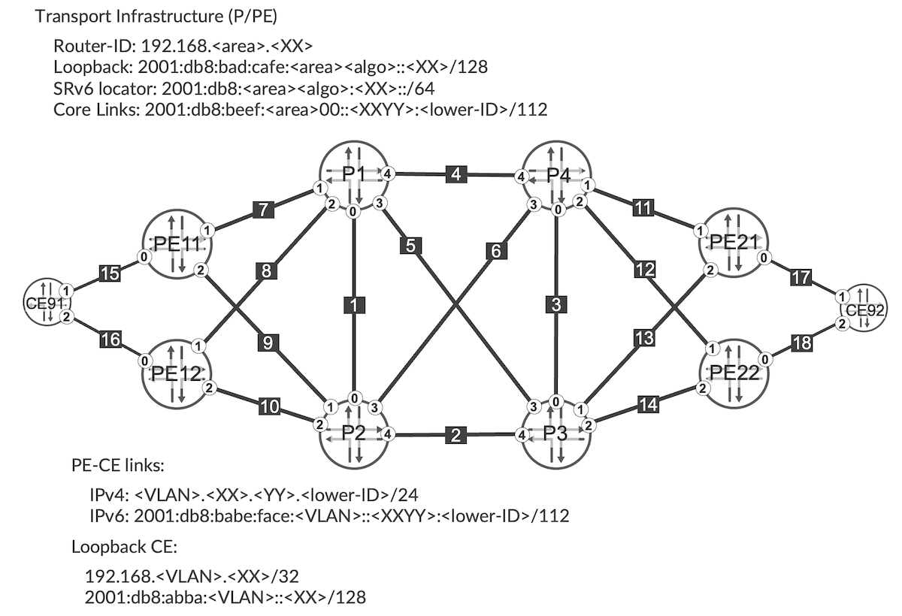
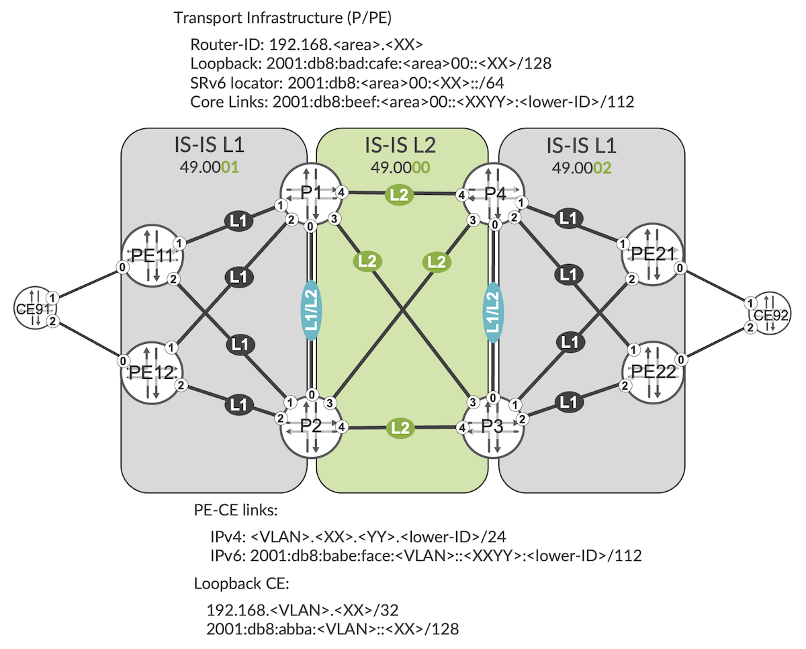
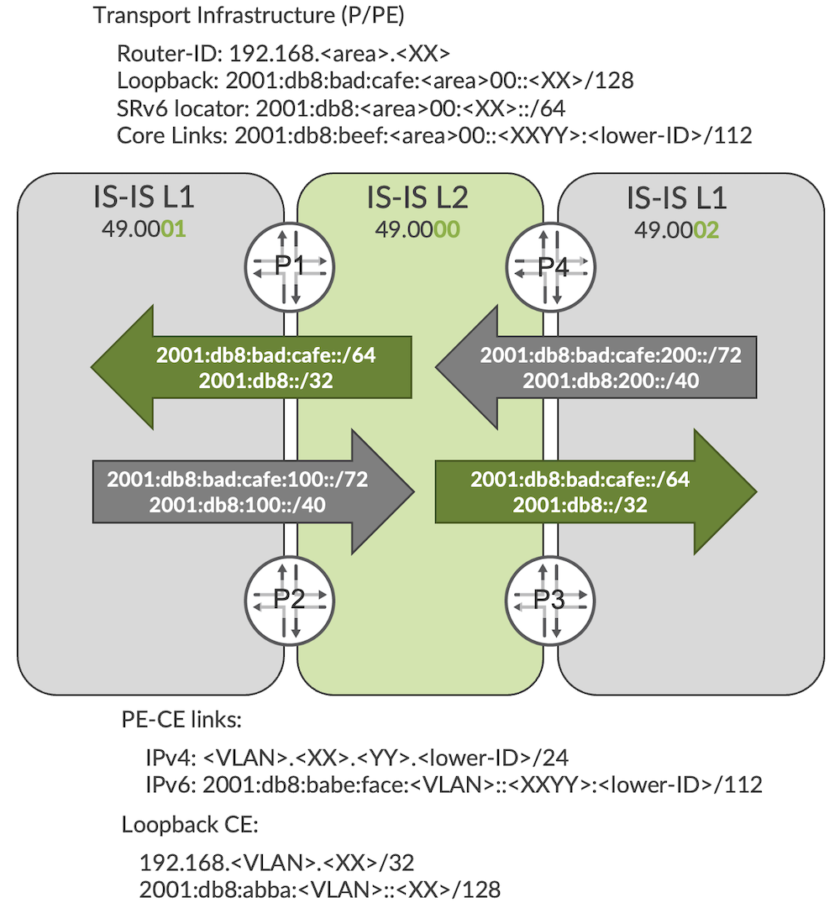

# SRv6 Summarization

**Krzysztof Szarkowicz - 09/28/2022**

Let's discuss the multi-domain SRv6 network together with the concept of SRv6 locator summarization. SRv6 locator summarization allows for large-scale, multi-domain deployments with SRv6.

## Introduction

Third TechPost article in the SRv6 Series: [In the last blog I discussed the End.DT4, End.DT6 and End.DT46 SIDs](https://juniper.github.io/techposts/l3vpn-over-srv6/article), which are used to realize L3VPN, both IPv4 and IPv6, over SRv6. In this blog I will discuss the multi-domain SRv6 network together with the concept of SRv6 locator summarization. SRv6 locator summarization allows for large-scale, multi-domain deployments with SRv6.

This blog is based on the capabilities of JUNOS 22.2 running on MX Series and JUNOS 22.4 on ACX7k routers. Config and show command outputs have been collected on vMX in our labs. JUNOS 22.3 introduces changes to SRv6 infrastructure, which might change the SRv6 configuration shown in this blog post. Please check [SRv6 SID Encoding and Transposition](https://juniper.github.io/techposts/srv6-sid-encoding-and-transposition/article) blog for more details.

You can test yourself all the concepts described in this article, we created labs in JCL and vLabs:
[JCL (Junivators and partners)](https://portal.cloudlabs.juniper.net/RM/Topology?b=e4dde6e2-8d1e-413c-a2f9-424f83b6b39a&d=c78ae7c7-e93b-4708-813e-109fd780f301)
[vLabs (open to all)](https://portal.cloudlabs.juniper.net/RM/Topology?b=6d046ddb-0e2f-49f0-8c24-e40ca9ed1507&d=2f99da30-8756-4d15-8822-d648498c7aea)

## Multi-Domain Network Fundamentals

To discuss the multi-domain design for SRv6 in, the topology outlined in Figure 1 will be used.



In this topology, there is a backbone IS-IS Level-2 domain (area '49.0000', or shortly '00'). To this backbone domain multiple aggregation domains could be connected. As the main purpose of this blog is to discuss the redistribution/summarization policies on ABRs (P1 and P2, as well as P3 and P4 in the example), for simplification only two aggregation domains are provisioned. IS-IS adjacencies within backbone domain are configured as Level-2 adjacencies, while in aggregation domains as Level-1 adjacencies. Adjacencies on domain boundaries (P1<-->P2, and P3<-->P4) are configured as Level-1/Level-2 adjacencies.

In multi-domain designs very important is a structured IP addressing scheme, so that prefix summarization can be performed at domain boundaries in an easy way. In this example, various elements that require IPv6 addressing (loopbacks, locators, links) have well-planned addressing from common IPv6 base, with short version (two last octets) of area ID encoded in the address.

Initially, all IS-IS routers for all domains are configured to advertise the prefixes from their local loopbacks, local physical interfaces, as well as local SRv6 locators using IS-IS export policy depicted in Configuration 1.

```
      policy-options {
          policy-statement PS-ISIS-EXP {
              term TR-OOB-MGMT {
                  from interface [ em0.0 fxp0.0 ];
                  then reject;
              }
              term TR-LOCAL-LOOPBACK {
                  from {
                      protocol direct;
                      interface lo0.0;
                      route-filter 2001:db8:bad:cafe::/64 prefix-length-range /128-/128;
                  }
                  then {
                      tag 101;
                      accept;
                  }
              }
              term TR-DIRECT-ROUTES {
                  from {
                      protocol direct;
                      route-filter 2001:db8:beef::/48 prefix-length-range /112-/112;
                  }
                  then accept;
              }
              then reject;
          }
      }
```

*Configuration 1: Basic IS-IS export policy*

> Note 1: If no explicit IS-IS export policy is used, prefixes from interfaces where IS-IS is configured are advertised automatically. However, IS-IS export policy brings additional capabilities (that we will use later in this blog extensively), like for example prefix filtering (which local prefixes should be advertised, and which not), and attribute manipulation (e.g., setting tags, as visible in line 14 of Configuration 1).

> Note 2: Local SRv6 locators are advertised automatically, and they are not "going through" IS-IS export policy. Thus, the content of IS-IS export policy has no influence on advertising local SRv6 locators.

Obviously, with this basic setup "things" are not working. ABRs do not leak (do not re-advertise) any prefixes between IS-IS Level-1 and Level-2 domains.

```
      root@P1> show isis database P1 detail
      IS-IS level 1 link-state database:
      
      P1.00-00 Sequence: 0x15, Checksum: 0xcd57, Lifetime: 61286 secs
         IS neighbor: P2.00                         Metric:     1000
         IS neighbor: PE11.00                       Metric:     1000
         IS neighbor: PE12.00                       Metric:     1000
         V6 prefix: 2001:db8:0:1::/64               Metric:        0 Internal Up
         V6 prefix: 2001:db8:bad:cafe::1/128        Metric:        0 Internal Up
         V6 prefix: 2001:db8:beef::102:0/112        Metric:     1000 Internal Up
         V6 prefix: 2001:db8:beef::103:0/112        Metric:     1000 Internal Up
         V6 prefix: 2001:db8:beef::104:0/112        Metric:     1000 Internal Up
         V6 prefix: 2001:db8:beef:100::111:0/112    Metric:     1000 Internal Up
         V6 prefix: 2001:db8:beef:100::112:0/112    Metric:     1000 Internal Up
      
      IS-IS level 2 link-state database:
      
      P1.00-00 Sequence: 0x53, Checksum: 0xd1a, Lifetime: 61286 secs
         IS neighbor: P2.00                         Metric:     1000
         IS neighbor: P3.00                         Metric:     1000
         IS neighbor: P4.00                         Metric:     1000
         V6 prefix: 2001:db8:0:1::/64               Metric:        0 Internal Up
         V6 prefix: 2001:db8:bad:cafe::1/128        Metric:        0 Internal Up
         V6 prefix: 2001:db8:beef::102:0/112        Metric:     1000 Internal Up
         V6 prefix: 2001:db8:beef::103:0/112        Metric:     1000 Internal Up
         V6 prefix: 2001:db8:beef::104:0/112        Metric:     1000 Internal Up
         V6 prefix: 2001:db8:beef:100::111:0/112    Metric:     1000 Internal Up
         V6 prefix: 2001:db8:beef:100::112:0/112    Metric:     1000 Internal Up
```

*CLI-Output 1: IS-IS link state database advertised by P1*

As an example (CLI-Output 1), based on previously discussed IS-IS export policy, P1 advertises into both IS-IS Level-1 and IS-IS Level-2 only following information:

- Local SRv6 locator
- Prefix of local loopback
- Prefixes of local physical interfaces

As the result, PE routers from IS-IS 49.0001 Level-1 domain do not have reachability towards IS-IS 49.0002 Level-1 domain (CLI-Output 2).

```
       root@PE11> show route 2001:db8:bad:cafe::/64 | match "\/128"
       2001:db8:bad:cafe::1/128
       2001:db8:bad:cafe::2/128
       2001:db8:bad:cafe:100::11/128
       2001:db8:bad:cafe:100::12/128
```

*CLI-Output 2: Routing table on PE11 for loopback range*

Only loopbacks from local IS-IS Level-1 domain (P1, P2, PE11, PE12) are visible.

## IPv6 Loopbacks Leaking Between IS-IS Domains

In typical multi-domain network design, in order to provide end-to-end reachability across domains, loopbacks must be re-advertised (in other words: leaked) between domains. Additionally, from scaling perspective it is good practice to keep interface prefixes only within own domain (i.e., interface prefixes of IS-IS Level-2 domain should not be advertised into IS-IS Level-1 domain, and vice-versa).

This is achieved with

- Replacing the term TR-DIRECT-ROUTES with two terms (TR-DIRECT-ROUTES-L1 and TR-DIRECT-ROUTES-L2), that specifically injects only selected interface prefixes into appropriate IS-IS Level-1 or IS-IS Level-2 domain
- One new term TR-REMOTE-LOOPBACKS leaking loopbacks of IS-IS Level-1 domain into IS-IS Level-2 domain, and vice-versa.

```
root@P1# show | compare rollback 1
[edit policy-options policy-statement PS-ISIS-EXP]
     term TR-LOCAL-LOOPBACK { ... }
-    term TR-DIRECT-ROUTES {
-        from {
-            protocol direct;
-            route-filter 2001:db8:beef::/48 prefix-length-range /112-/112;
-        }
-        then accept;
-    }
+    term TR-DIRECT-ROUTES-L1 {
+        from {
+            protocol direct;
+            route-filter 2001:db8:beef:100::/56 prefix-length-range /112-/112;
+        }
+        to level 1;
+        then accept;
+    }
+    term TR-DIRECT-ROUTES-L2 {
+        from {
+            protocol direct;
+            route-filter 2001:db8:beef::/56 prefix-length-range /112-/112;
+        }
+        to level 2;
+        then accept;
+    }
+    term TR-REMOTE-LOOPBACKS {
+        from {
+            protocol isis;
+            route-filter 2001:db8:bad:cafe::/64 prefix-length-range /128-/128;
+        }
+        then accept;
+    }
```

*Configuration 2: Loopback leaking on P1*

With similar changes on all ABRs (all 'P' routers), PE routers have now full visibility of all remote loopbacks, as visible in CLI-Output 3 (please compare with CLI-Output 2).

```
       root@PE11> show route 2001:db8:bad:cafe::/64 | match "\/128"
       2001:db8:bad:cafe::1/128
       2001:db8:bad:cafe::2/128
       2001:db8:bad:cafe::3/128
       2001:db8:bad:cafe::4/128
       2001:db8:bad:cafe:100::11/128
       2001:db8:bad:cafe:100::12/128
       2001:db8:bad:cafe:200::21/128
       2001:db8:bad:cafe:200::22/128
```

*CLI-Output 3: Routing table on PE11 for loopback range*

And end-to-end connectivity between PEs in different domains is accomplished.

```
       root@PE11> traceroute 2001:db8:bad:cafe:200::21 source 2001:db8:bad:cafe:100::11
       traceroute6 to 2001:db8:bad:cafe:200::21 (2001:db8:bad:cafe:200::21)
           from 2001:db8:bad:cafe:100::11, 64 hops max, 12 byte packets
        1  2001:db8:beef:100::211:2 (2001:db8:beef:100::211:2)  2.996 ms 2001:db8:beef:100::111:1
   (2001:db8:beef:100::111:1)  2.470 ms 2001:db8:beef:100::211:2 (2001:db8:beef:100::211:2)
   2.581 ms
        2  2001:db8:beef::103:3 (2001:db8:beef::103:3)  3.460 ms 2001:db8:beef::104:4
   (2001:db8:beef::104:4)  3.205 ms 2001:db8:beef::103:3 (2001:db8:beef::103:3)
   3.260 ms
        3  2001:db8:bad:cafe:200::21 (2001:db8:bad:cafe:200::21)  4.868 ms  4.585 ms  8.570 ms
```

*CLI-Output 4: End-to-end traceroute*

## SRv6 Locators Leaking Between IS-IS Domains

BGP is configured as depicted in Figure 2. P routers are interconnected with full mesh of iBGP sessions, acting as Route Reflectors to PE routers. PE routers are route reflector clients.



Unfortunately, providing connectivity between loopbacks is not sufficient in SRv6 design. In fact, connectivity between loopbacks is not relevant to SRv6 services. On PE routers we have L3VPN services (VPN 20 and VPN 30, as in the previous blogs), and in SRv6 environment connectivity between SRv6 locators is required for VPN services. We have leaked loopbacks as a good practice, to ensure in-band management access to the network devices.

Based on current IS-IS export policy on ABRs, SRv6 locators are not leaked. As discussed in the previous blog in details, this causes the protocol next-hop to be unresolvable, and VPN routes are hidden.

```
       root@P1> show route table bgp.l3vpn | match hidden
       
       bgp.l3vpn.0: 40 destinations, 80 routes (20 active, 0 holddown, 40 hidden)
       
       bgp.l3vpn-inet6.0: 40 destinations, 80 routes (20 active, 0 holddown, 40 hidden)
```

*CLI-Output 5: Hidden service routes in P1*

Similarly to loopbacks, SRv6 locators must be leaked across domain boundaries. IS-IS export policy must be extended on all ABRs (or P routers), as shown in Configuration 3.

```
      root@P1# show | compare
      [edit policy-options policy-statement PS-ISIS-EXP]
           term TR-REMOTE-LOOPBACKS { ... }
      +    term TR-REMOTE-LOCATORS {
      +        from {
      +            protocol isis;
      +            route-filter 2001:db8::/32 prefix-length-range /64-/64;
      +        }
      +        then accept;
      +    }
```

*Configuration 3: SRv6 locator leaking on P1*

Please remember, SRv6 locators are not host addresses (/128) like loopbacks. SRv6 locators are subnets (in this and previous blogs we are using /64 as an example), thus IS-IS export policy must allow these subnets.

Note: this example shows leaking of all remote SRv6 locators. Strictly speaking, since SRv6 locators are used for VPN services, only locators from routers hosting VPN services (PE11, PE12, PE21, PE22) must be leaked. SRv6 locators from routers not hosting VPN services (P1, P2, P3, P4) are not needed. Here, to unify the IS-IS export policy across all ABRs, no granular selection of SRv6 locators is done.

After these changes are made, SRv6 locators are leaked between IS-IS level boundaries. CLI-Output 6 provides an example, showing what is leaked to IS-IS Level 1 on P1 router.

```
      root@P1> show isis database level 1 P1 extensive
      IS-IS level 1 link-state database:
      P1.00-00 Sequence: 0x11, Checksum: 0x7ca0, Lifetime: 65450 secs
      (...)
         V6 prefix: 2001:db8:0:1::/64               Metric:        0 Internal Up
         V6 prefix: 2001:db8:0:3::/64               Metric:     1000 Internal Down
         V6 prefix: 2001:db8:0:4::/64               Metric:     1000 Internal Down
         V6 prefix: 2001:db8:200:21::/64            Metric:     2000 Internal Down
         V6 prefix: 2001:db8:200:22::/64            Metric:     2000 Internal Down
      (...)
          SRv6 Locator: 2001:db8:0:1::/64, Metric: 0, MTID: 0, Flags: 0x0, Algorithm: 0
            SRv6 SID: 2001:db8:0:1::, Flavor: None
          SRv6 Locator: 2001:db8:0:3::/64, Metric: 1000, MTID: 0, Flags: 0x80, Algorithm: 0
            Prefix-Attribute-Flags: 0x40(X:0,R:1,N:0,A:0)
            SRv6 SID: 2001:db8:0:3::, Flavor: None
          SRv6 Locator: 2001:db8:0:4::/64, Metric: 1000, MTID: 0, Flags: 0x80, Algorithm: 0
            Prefix-Attribute-Flags: 0x40(X:0,R:1,N:0,A:0)
            SRv6 SID: 2001:db8:0:4::, Flavor: None
          SRv6 Locator: 2001:db8:200:21::/64, Metric: 2000, MTID: 0, Flags: 0x80, Algorithm: 0
            Prefix-Attribute-Flags: 0x40(X:0,R:1,N:0,A:0)
            SRv6 SID: 2001:db8:200:21::, Flavor: None
          SRv6 Locator: 2001:db8:200:22::/64, Metric: 2000, MTID: 0, Flags: 0x80, Algorithm: 0
            Prefix-Attribute-Flags: 0x40(X:0,R:1,N:0,A:0)
            SRv6 SID: 2001:db8:200:22::, Flavor: None
      (...)
          IPv6 prefix: 2001:db8:0:1::/64 Metric 0 Up
          IPv6 prefix: 2001:db8:0:3::/64 Metric 1000 Down
            3 bytes of subtlvs
            Prefix-Attribute-Flags: 0x40(X:0,R:1,N:0,A:0)
          IPv6 prefix: 2001:db8:0:4::/64 Metric 1000 Down
            3 bytes of subtlvs
            Prefix-Attribute-Flags: 0x40(X:0,R:1,N:0,A:0)
          IPv6 prefix: 2001:db8:200:21::/64 Metric 2000 Down
            3 bytes of subtlvs
            Prefix-Attribute-Flags: 0x40(X:0,R:1,N:0,A:0)
          IPv6 prefix: 2001:db8:200:22::/64 Metric 2000 Down
            3 bytes of subtlvs
            Prefix-Attribute-Flags: 0x40(X:0,R:1,N:0,A:0)
      (...)
```

*CLI-Output 6: SRv6 locators leaked to IS-IS Level 1*

There are couple of things, worth to mention.

First of all, local SRv6 locator (2001:db8:0:1::/64), as well as remote SRv6 locators from remaining P routers (except P2 router) and from remote PE routers (PE21 and PE22) are advertised. SRv6 locators of routers from IS-IS Level-1 attached to P1 router (i.e., P2, PE11, and PE12 routers) are obviously not reinjected into IS-IS Level-1 by P1 router. This is basic IS-IS loop prevention rule: never send routing information back into the same IS-IS level from which it was received.

Second, SRv6 locators are injected with two different TLVs. 'SRv6 Locator' TLV (TLV #27), and 'IPv6 Reachability' TLV, referenced in Junos show output as 'IPv6 prefix' (TLV #236). As you remember from the 1st blog in SRv6 blogs series, we need to have these two TLVs for SRv6 locators for proper operation. So far, so good.

And, the 3rd aspect of leaking, remote SRv6 locators (SRv6 locators leaked from IS-IS Level-2 to IS-IS Level-1) have additional sub-TLV 'Prefix Attribute Flags' (sub-TLV #4) with 'R' bit (Re-advertisement bit) set. This sub-TLV was introduced by RFC 7794 ("IS-IS Prefix Attributes for Extended IPv4 and IPv6 Reachability") with the aim to extended data advertised with IS-IS prefixes with additional information, like, if the prefix was redistributed from another protocols ('X' flag), the prefix was leaked/re-advertised between IS-IS levels ('R' flag), the prefix is identifying the advertising node ('N' flag), or the prefix is anycast prefix ('A' flag).

Now, all SRv6 locators are visible in both ine6.0 (installed based on IS-IS TLV #236: IPv6 Reachability) and in inet6.3 (installed based on IS-IS TLV #27: SRv6 Locator).

```
      root@PE11> show route 2001:db8::/32 table inet6.0 | match "\/64"
      2001:db8:0:1::/64  *[IS-IS/15] 01:04:34, metric 1000
      2001:db8:0:2::/64  *[IS-IS/15] 20:53:41, metric 1000
      2001:db8:0:3::/64  *[IS-IS/18] 00:59:48, metric 2000
      2001:db8:0:4::/64  *[IS-IS/18] 00:59:48, metric 2000
      2001:db8:100:11::/64
      2001:db8:100:12::/64
      2001:db8:200:21::/64
      2001:db8:200:22::/64
      
      root@PE11> show route 2001:db8::/32 table inet6.3 | match "\/64"
      2001:db8:0:1::/64  *[SRV6-ISIS/14] 01:04:41, metric 1000
      2001:db8:0:2::/64  *[SRV6-ISIS/14] 20:53:48, metric 1000
      2001:db8:0:3::/64  *[SRV6-ISIS/14] 00:59:55, metric 2000
      2001:db8:0:4::/64  *[SRV6-ISIS/14] 00:59:55, metric 2000
      2001:db8:100:12::/64
      2001:db8:200:21::/64
      2001:db8:200:22::/64
```

*CLI-Output 7: SRv6 locators' visibility on PE11*

Service routes can be resolved on ABRs, thus they are no longer hidden, and are re-advertised to PE routers. So, all loopbacks are now visible on CEs:

```
      root@CE91> show route table RI- 192.168.0.0/16 | match "RI-|\/32"
      
      RI-20.inet.0: 12 destinations, 12 routes (12 active, 0 holddown, 0 hidden)
      192.168.20.11/32   *[OSPF3/10] 00:06:54, metric 1
      192.168.20.12/32   *[OSPF3/10] 00:06:59, metric 1
      192.168.20.21/32   *[OSPF3/150] 00:06:54, metric 0, tag 3489725928
      192.168.20.22/32   *[OSPF3/150] 00:06:54, metric 0, tag 3489725928
      192.168.20.91/32   *[Direct/0] 00:07:09
      192.168.20.92/32   *[OSPF3/150] 00:06:54, metric 1, tag 3489725928
      
      RI-30.inet.0: 12 destinations, 12 routes (12 active, 0 holddown, 0 hidden)
      192.168.30.11/32   *[OSPF3/10] 00:06:54, metric 1
      192.168.30.12/32   *[OSPF3/10] 00:06:59, metric 1
      192.168.30.21/32   *[OSPF3/150] 00:06:54, metric 0, tag 3489725928
      192.168.30.22/32   *[OSPF3/150] 00:06:54, metric 0, tag 3489725928
      192.168.30.91/32   *[Direct/0] 00:07:09
      192.168.30.92/32   *[OSPF3/150] 00:06:54, metric 1, tag 3489725928
```

*CLI-Output 8: Remote IPv4 loopbacks on CE91*

```
      root@CE91> show route table RI- 2001:db8:abba::/48 | match "RI-|\/128"
      
      RI-20.inet6.0: 17 destinations, 17 routes (17 active, 0 holddown, 0 hidden)
      2001:db8:abba:20::11/128
      2001:db8:abba:20::12/128
      2001:db8:abba:20::21/128
      2001:db8:abba:20::22/128
      2001:db8:abba:20::91/128
      2001:db8:abba:20::92/128
      
      RI-30.inet6.0: 17 destinations, 17 routes (17 active, 0 holddown, 0 hidden)
      2001:db8:abba:30::11/128
      2001:db8:abba:30::12/128
      2001:db8:abba:30::21/128
      2001:db8:abba:30::22/128
      2001:db8:abba:30::91/128
      2001:db8:abba:30::92/128
```

*CLI-Output 9: Remote IPv6 loopbacks on CE91*

And connectivity between CEs is OK as well:

```
      root@CE91> ping 192.168.20.92 routing-instance RI-20 count 1 rapid
      PING 192.168.20.92 (192.168.20.92): 56 data bytes
      !
      --- 192.168.20.92 ping statistics ---
      1 packets transmitted, 1 packets received, 0% packet loss
      round-trip min/avg/max/stddev = 6.159/6.159/6.159/0.000 ms
      
      root@CE91> ping 2001:db8:abba:20::92 routing-instance RI-20 count 1 rapid
      W36: Tue 2022-09-06T03:28:22 PDT (UTC-0700)
      PING6(56=40+8+8 bytes) 2001:db8:babe:face:20:0:1191:91 --> 2001:db8:abba:20::92
      !
      --- 2001:db8:abba:20::92 ping6 statistics ---
      1 packets transmitted, 1 packets received, 0% packet loss
      round-trip min/avg/max/std-dev = 5.782/5.782/5.782/0.000 ms
```

*CLI-Output 10: Connectivity verification between CEs*

## Summarization at Domain Boundaries

If you review CLI-Output 3 and CLI-Output 7, you observe each PE has visibility of each individual remote IPv6 loopback (/128) and remote SRv6 locator (/64). As discussed earlier, loopback visibility is required for management connectivity, while SRv6 locator visibility is required for end-to-end SRv6 service connectivity between any pair of PE routers. In a large-scale deployment, with 10s or 100s of thousands PE devices -- think for example about 5G X-haul deployment, where each CSR (Cell Site Router) is a mini-PE router -- distributing individual IPv6 loopbacks or SRv6 locators to each PE might introduce scaling challenge.

Reachability to unique remote loopbacks is required in MPLS deployment, as the loopbacks were associated with some transport label. And, for end-to-end communication between two PEs, the visibility of each individual remote loopback (with associated label) was required. In SRv6 deployments, on the other hand, there is no need to have visibility to each individual loopback or SRv6 locator. In fact, we can deploy prefix summarization to address scaling challenges.



The required configuration changes are outlined in Configuration 4.

```
      root@P1# show | compare
      [edit routing-options]
      +   rib inet6.0 {
      +       aggregate {
      +           route 2001:db8:bad:cafe::/64 discard;
      +           route 2001:db8:bad:cafe:100::/72 discard;
      +           route 2001:db8::/32 discard;
      +           route 2001:db8:100::/40 discard;
      +       }
      +   }
      [edit policy-options policy-statement PS-ISIS-EXP]
           term TR-DIRECT-ROUTES-L2 { ... }
      +    term TR-REMOTE-L1 {
      +        from {
      +            protocol aggregate;
      +            route-filter 2001:db8:bad:cafe::/64 exact;
      +            route-filter 2001:db8::/32 exact;
      +        }
      +        to level 1;
      +        then accept;
      +    }
      +    term TR-REMOTE-L2 {
      +        from {
      +            protocol aggregate;
      +            route-filter 2001:db8:bad:cafe:100::/72 exact;
      +            route-filter 2001:db8:100::/40 exact;
      +        }
      +        to level 2;
      +        then accept;
      +    }
      -    term TR-REMOTE-LOOPBACKS {
      -        from {
      -            protocol isis;
      -            route-filter 2001:db8:bad:cafe::/64 prefix-length-range /128-/128;
      -        }
      -        then accept;
      -    }
      -    term TR-REMOTE-LOCATORS {
      -        from {
      -            protocol isis;
      -            route-filter 2001:db8::/32 prefix-length-range /64-/64;
      -        }
      -        then accept;
      -    }
```

*Configuration 4: Configuration changes to implement prefix summarization on domain boundaries*

In essence, following configuration adjustments are required:

- Definition of appropriate aggregate routes
- Removal of terms 'TR-REMOTE-LOOPBACKS' and 'TR-REMOTE-LOCATORS' from IS-IS export policy
- Addition of new terms to leak appropriate aggregates into IS-IS Level-1 and IS-IS Level-2, respectively

After similar changes are performed on all 'P' routers, let's check the status of the network.

```
      root@P1> show isis database level 1 P1 detail
      IS-IS level 1 link-state database:
      
      P1.00-00 Sequence: 0x17, Checksum: 0xdb1b, Lifetime: 64221 secs
         IS neighbor: P2.00                         Metric:     1000
         IS neighbor: PE11.00                       Metric:     1000
         IS neighbor: PE12.00                       Metric:     1000
         V6 prefix: 2001:db8::/32                   Metric:       10 External Up
         V6 prefix: 2001:db8:0:1::/64               Metric:        0 Internal Up
         V6 prefix: 2001:db8:bad:cafe::/64          Metric:       10 External Up
         V6 prefix: 2001:db8:bad:cafe::1/128        Metric:        0 Internal Up
         V6 prefix: 2001:db8:beef:100::111:0/112    Metric:     1000 Internal Up
         V6 prefix: 2001:db8:beef:100::112:0/112    Metric:     1000 Internal Up
```

*CLI-Output 11: IS-IS Level 1 advertisement on P1*

P1 advertises the expected prefixes. In addition to local loopback, local SRv6 locator and local link addresses from IS-IS Level-1 links, we see two summaries: one for SRv6 locators (2001:db8::/32) and one for IPv6 loopbacks (2001:db8:bad:cafe::/64). As expected, individual remote loopbacks or SRv6 locators are no longer injected into IS-IS Level-1 domain (please compare with CLI-Output 6). Thus, in large-scale environment there is much less prefixes that must be exchanged between domains. So, this looks good.

```
      root@PE11> show route 2001:db8:bad:cafe:200::21

      inet6.0: 24 destinations, 24 routes (24 active, 0 holddown, 0 hidden)
      + = Active Route, - = Last Active, * = Both
      
      2001:db8:bad:cafe::/64
                         *[IS-IS/160] 00:31:54, metric 1010
                          >  to fe80::5604:dff:fe00:6980 via ge-0/0/1.0
                             to fe80::5604:dff:fe00:6a01 via ge-0/0/2.0
      
      root@PE11> show route 2001:db8:bad:cafe:200::22
      
      inet6.0: 24 destinations, 24 routes (24 active, 0 holddown, 0 hidden)
      + = Active Route, - = Last Active, * = Both
      
      2001:db8:bad:cafe::/64
                         *[IS-IS/160] 00:31:57, metric 1010
                          >  to fe80::5604:dff:fe00:6980 via ge-0/0/1.0
                             to fe80::5604:dff:fe00:6a01 via ge-0/0/2.0
```

*CLI-Output 12: Remote loopback reachability on PE11*

```
      root@PE11> show route 2001:db8:200:21::
      
      inet6.0: 24 destinations, 24 routes (24 active, 0 holddown, 0 hidden)
      + = Active Route, - = Last Active, * = Both
      
      2001:db8::/32      *[IS-IS/160] 00:33:05, metric 1010
                          >  to fe80::5604:dff:fe00:6980 via ge-0/0/1.0
                             to fe80::5604:dff:fe00:6a01 via ge-0/0/2.0
      
      root@PE11> show route 2001:db8:200:22::
      
      inet6.0: 24 destinations, 24 routes (24 active, 0 holddown, 0 hidden)
      + = Active Route, - = Last Active, * = Both
      
      2001:db8::/32      *[IS-IS/160] 00:33:11, metric 1010
                          >  to fe80::5604:dff:fe00:6980 via ge-0/0/1.0
                             to fe80::5604:dff:fe00:6a01 via ge-0/0/2.0
```

*CLI-Output 13: Remote SRv6 locator reachability on PE11*

Both remote loopbacks and remote SRv6 locators can be resolved via summary prefixes advertised by ABRs (here: P1 and P2) to IS-IS Level-1.

```
      root@PE11> ping 2001:db8:bad:cafe:200::21 source 2001:db8:bad:cafe:100::11 count 1 rapid
      PING6(56=40+8+8 bytes) 2001:db8:bad:cafe:100::11 --> 2001:db8:bad:cafe:200::21
      !
      --- 2001:db8:bad:cafe:200::21 ping6 statistics ---
      1 packets transmitted, 1 packets received, 0% packet loss
      round-trip min/avg/max/std-dev = 3.744/3.744/3.744/0.000 ms
      
      root@PE11> ping 2001:db8:200:21:: source 2001:db8:bad:cafe:100::11 count 1 rapid
      PING6(56=40+8+8 bytes) 2001:db8:bad:cafe:100::11 --> 2001:db8:200:21::
      !
      --- 2001:db8:200:21:: ping6 statistics ---
      1 packets transmitted, 1 packets received, 0% packet loss
      round-trip min/avg/max/std-dev = 7.817/7.817/7.817/0.000 ms
```

*CLI-Output 14: Connectivity verification between PEs*

Also, connectivity between PEs (both, towards the IPv6 address of the remote loopback, as well as towards the remote SRv6 locator), sourced from local loopback, is OK, too. Ping without specifying local loopback as source would fail, since in this design -- as discussed earlier -- the link addresses are not leaked between domains. So, everything seems to be OK.

However, if you verify connectivity between CEs

```
       root@CE91> ping 2001:db8:abba:20::92 routing-instance RI-20 count 1 rapid
       PING6(56=40+8+8 bytes) 2001:db8:abba:20::91 --> 2001:db8:abba:20::92
       ping: sendmsg: No route to host
       ping6: wrote 2001:db8:abba:20::92 16 chars, ret=-1
       .
       --- 2001:db8:abba:20::92 ping6 statistics ---
       1 packets transmitted, 0 packets received, 100% packet loss
```

*CLI-Output 15: Connectivity verification between CEs*

It fails. It looks, VPN prefixes are not exchanged ('No route to host').

If you check the status of L3VPN routes on some ABR, which is as well route reflector in this design:

```
       root@P1> show route table bgp.l3vpn | match hidden
       
       bgp.l3vpn.0: 40 destinations, 80 routes (20 active, 0 holddown, 40 hidden)
       
       bgp.l3vpn-inet6.0: 40 destinations, 80 routes (20 active, 0 holddown, 40 hidden)
```

*CLI-Output 16: Connectivity verification between CEs*

You will observe hidden routes. If you recall CLI-Output 5, we are at the similar point now. It was the problem with unresolved next hop. Now, looking for the details of the next hop of some hidden route:

```
       root@P1> show route table bgp.l3vpn hidden extensive
        rd-prefix 192.169.2.21:20:20.21.92.0/24 | match "next hop"
                       Next hop type: Unusable, Next hop index: 0
                       Indirect next hops: 1
                               Protocol next hop: 2001:db8:200:21::
                               Indirect next hop: 0x0 - INH Session ID: 0
                       Next hop type: Unusable, Next hop index: 0
                       Indirect next hops: 1
                               Protocol next hop: 2001:db8:200:21::
                               Indirect next hop: 0x0 - INH Session ID: 0
```

*CLI-Output 17: Hidden route verification*

We have again problem with the unresolved protocol next hop. But, how it can be unresolved, as we just checked connectivity is OK? Let's troubleshoot further:

```
       root@P1> show route 2001:db8:200:21::
       
       inet6.0: 41 destinations, 41 routes (41 active, 0 holddown, 0 hidden)
       + = Active Route, - = Last Active, * = Both
       
       2001:db8:200::/40  *[IS-IS/165] 1d 01:16:28, metric 1010
                           >  to fe80::5604:dff:fe00:92fb via ge-0/0/3.0
                              to fe80::5604:dff:fe00:5799 via ge-0/0/4.0
```

*CLI-Output 18: Route to remote SRv6 locator*

Well, remote SRv6 locator can be indeed resolved via the summary prefix, injected by P3 and P4. However, this summary prefix is present only in inet6.0. As you might recall from earlier discussion in the blog, as well as from previous blog, the next-hop of service prefixes must be resolvable in inet6.3 table. So, what is the difference, when we leaking had individual remote SRv6 prefixes (see CLI-Output 7) and now? Why our summary route covering remote SRv6 locators is not in inet6.3?

Again, getting back to earlier discussion in this blog, and the previous blog, you know that SRv6 locators are advertised with two different TLVs. 'SRv6 Locator' TLV (TLV #27), and 'IPv6 Reachability' TLV, referenced in Junos as 'IPv6 prefix' (TLV #236). And, TLV #27 is required for service resolution. Do we have TLV #27 for SRv6 locator summaries?

```
       root@P1> show isis database level 2 P3 extensive | match "SRv6 Locator"
           SRv6 Locator: 2001:db8:0:3::/64, Metric: 0, MTID: 0, Flags: 0x0, Algorithm: 0
```

*CLI-Output 19: SRv6 locator TLVs injected by P3 into IS-IS Level 2*

Unfortunately, checking for example what SRv6 Locator TLVs are advertised by P3, you can discover that only own SRv6 Locator is advertised with TLV #27. SRv6 Locator summaries do not have corresponding TLV #27. That explains, why the service routes remain hidden.

Junos provides possibility to specify in the route policy that SRv6 locator TLV (TLV #27) should be generated. Therefore, the IS-IS export policy on ABRs ('P' routers) must be again adjusted to ensure that when SRv6 Locator summaries are injected, TLV #27 are generated as well.

```
      root@P1# show | compare
      [edit policy-options policy-statement PS-ISIS-EXP]
           term TR-DIRECT-ROUTES-L2 { ... }
      +    term TR-REMOTE-LOOPBACKS-L1 {
      +        from {
      +            protocol aggregate;
      +            route-filter 2001:db8:bad:cafe::/64 exact;
      +        }
      +        to level 1;
      +        then accept;
      +    }
      +    term TR-REMOTE-LOOPBACKS-L2 {
      +        from {
      +            protocol aggregate;
      +            route-filter 2001:db8:bad:cafe:100::/72 exact;
      +        }
      +        to level 2;
      +        then accept;
      +    }
      +    term TR-REMOTE-LOCATORS-L1 {
      +        from {
      +            protocol aggregate;
      +            route-filter 2001:db8::/32 exact;
      +        }
      +        to level 1;
      +        then {
      +            advertise-locator;
      +            accept;
      +        }
      +    }
      +    term TR-REMOTE-LOCATORS-L2 {
      +        from {
      +            protocol aggregate;
      +            route-filter 2001:db8:100::/40 exact;
      +        }
      +        to level 2;
      +        then {
      +            advertise-locator;
      +            accept;
      +        }
      +    }
      -    term TR-REMOTE-L1 {
      -        from {
      -            protocol aggregate;
      -            route-filter 2001:db8:bad:cafe::/64 exact;
      -            route-filter 2001:db8::/32 exact;
      -        }
      -        to level 1;
      -        then accept;
      -    }
      -    term TR-REMOTE-L2 {
      -        from {
      -            protocol aggregate;
      -            route-filter 2001:db8:bad:cafe:100::/72 exact;
      -            route-filter 2001:db8:100::/40 exact;
      -        }
      -        to level 2;
      -        then accept;
      -    }
```

*Configuration 4: Configuration changes to advertise 'SRv6 Locator' TLV for locator summaries*

In essence, following configuration adjustments are required on all ABRs:

- Removal of terms 'TR-REMOTE-1' and 'TR-REMOTE-2' from IS-IS export policy. We will need to split these terms, so that there are separate terms for loopbacks (no TLV #27 advertisement) and locators (with TLV #27 advertisement)
- Addition of new terms 'TR-REMOTE-LOOPBACKS-L1' and 'TR-REMOTE-LOOPBACKS-L2' to leak loopback aggregates into IS-IS Level-1 and IS-IS Level-2 without generating TLV #27 (only TLV #236), as well as new terms 'TR-REMOTE-LOCATORS-L1' and 'TR-REMOTE-LOCATORS-L2' to leak SRv6 locator aggregates into IS-IS Level-1 and IS-IS Level-2 generating TLV #27 in addition to the default TLV #236.

Now, if you check SRv6 locator advertisement from some ABR:

```
       root@P1> show isis database P1 extensive | match "SRv6 Locator|level "
       IS-IS level 1 link-state database:
           SRv6 Locator: 2001:db8:0:1::/64, Metric: 0, MTID: 0, Flags: 0x0, Algorithm: 0
           SRv6 Locator: 2001:db8::/32, Metric: 10, MTID: 0, Flags: 0x0, Algorithm: 0
       IS-IS level 2 link-state database:
           SRv6 Locator: 2001:db8:0:1::/64, Metric: 0, MTID: 0, Flags: 0x0, Algorithm: 0
           SRv6 Locator: 2001:db8:100::/40, Metric: 10, MTID: 0, Flags: 0x0, Algorithm: 0
```

*CLI-Output 20: SRv6 locator TLVs injected by P3 into IS-IS Level 2*

You can observe that into IS-IS Level-1 ABR injects two 'SRv6 Locator' TLVs (TLV #27). One corresponding to its own SRv6 Locator (/64), and another corresponding to the SRv6 locator summary of entire SRv6 locator range (/32). Similarly, when injecting into IS-IS Level-2, one TLV #27 corresponds to the own SRv6 locator (/64), and another TLV #27 corresponds to the SRv6 locator range of attached IS-IS Level 1 domain (/40).

With this, all things started to work: no more hidden routes, and connectivity CE to CE is functioning (verification skipped for brevity).

## Useful links

- IS-IS Extensions to Support Segment Routing over IPv6 Dataplane, [draft-ietf-lsr-isis-srv6-extensions](https://datatracker.ietf.org/doc/html/draft-ietf-lsr-isis-srv6-extensions)
- SRv6 in Junos: [https://www.juniper.net/documentation/us/en/software/junos/is-is/topics/topic-map/infocus-isis-srv6-network-programming.html](https://www.juniper.net/documentation/us/en/software/junos/is-is/topics/topic-map/infocus-isis-srv6-network-programming.html)
- TechPost 1: SRv6 Basics Locator and End-SIDs - [https://juniper.github.io/techposts/srv6-basics-locator-and-end-sids/article](https://juniper.github.io/techposts/srv6-basics-locator-and-end-sids/article)
- TechPost 2: L3VPN on SRv6 - [https://juniper.github.io/techposts/l3vpn-over-srv6/article](https://juniper.github.io/techposts/l3vpn-over-srv6/article)
- TechPost 3: SRv6 Summarisation - [https://juniper.github.io/techposts/srv6-summarization/article](https://juniper.github.io/techposts/srv6-summarization/article)
- TechPost 4: SRv6 SID Encoding and Transposition - [https://juniper.github.io/techposts/srv6-sid-encoding-and-transposition/article](https://juniper.github.io/techposts/srv6-sid-encoding-and-transposition/article)

## Glossary

- ABR: Area Border Router
- BGP: Border Gateway Protocol
- CE: Customer Edge
- CLI: Command Line Interface
- CSR: Cell Site Router
- iBGP: internal Border Gateway Protocol
- ID: Identifier
- IP: Internet Protocol
- IPv4: Internet Protocol version 4
- IPv6: Internet Protocol version 6
- IS-IS: Intermediate System to Intermediate System
- L3VPN: Layer 3 Virtual Private Network
- P: Provider
- PE: Provider Edge
- SID: Segment Identifier
- SRv6: Segment Routing version 6
- TLV: Type Length Value
- VPN: Virtual Private Network

## Acknowledgements

Thanks to Anton Elita for thorough review, and Abhishek Murali for preparing JCL and vLabs topologies.
