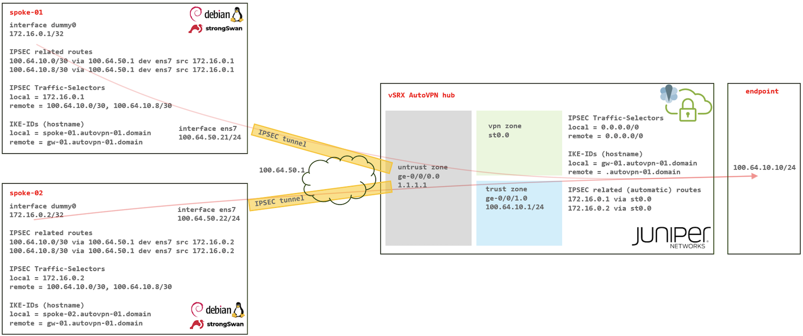

# SRX AutoVPN / PSK with Linux strongSwan

**Karel Hendrych - 07/30/2024**

An example of SRX AutoVPN functionality with Pre-Shared Keys in 3rd party mode; specifically with Linux/strongSwan spokes.

While PKI-based AutoVPN in proprietary and interoperable modes has been prevalent in large-scale IPSEC VPN deployments, the PKI prerequisite can be challenging for smaller scenarios. Finally, Junos 23.4 addresses a significant drawback of PSK-based AutoVPN by eliminating the potential imminent need to change PSKs across the entire deployment.

## Introduction

### TL;DR

[AutoVPN](https://www.juniper.net/documentation/us/en/software/junos/vpn-ipsec/topics/topic-map/security-autovpn-on-hub-and-spoke-devices.html#id-understanding-autovpn) is essentially an IPSEC VPN approach, initially known as Zero Touch Hub, where dynamically addressed spokes (initiators) can establish tunnels as long as the spoke IKE-ID matches the configured common part on the hub (responder). In PKI mode, the spoke must possess a certificate signed by a trusted CA for mutual certificate authentication (implying a match of the IKE-ID to the appropriate certificate attribute). In a scenario with Juniper spokes, dynamic routing is typically engaged, allowing  [Auto-Discovery VPN](https://www.juniper.net/documentation/us/en/software/junos/vpn-ipsec/topics/topic-map/security-auto-discovery-vpns.html) extension for spoke-to-spoke on-demand shortcut tunnels. To achieve a large tunnel scale, with or without Juniper spokes, AutoVPN can leverage Traffic Selectors (TS) from remote spokes for Reverse Route Injection --  routes matching remote TS are typically exported to a dynamic routing protocol.

Since the introduction of AutoVPN, the common challenge has been the PKI infrastructure and the required level of knowledge to implement. That has been somewhat alleviated by Junos 22.4 support of [ACME protocol](https://www.juniper.net/documentation/us/en/software/junos/vpn-ipsec/topics/topic-map/security-ipsec-vpn-acme-protocol.html) and Let's Encrypt, making PKI partially instant, but not addressing all scenarios. The Junos 21.2 AutoVPN PSK support -- either common or spoke-specific (seeded) -- did not cover scenarios where the spoke PSK could potentially be compromised (e.g., physical device loss). Those specific IKE-IDs can still establish connections even in the seeded PSK mode. The only complete solution was to change PSKs throughout, incurring a cost for the initially easy setup. In the PKI scenario, the administrator would revoke the specific spoke certificate. Finally, as part of Junos 23.4 [IKE DoS/DDoS handling improvements](https://www.juniper.net/documentation/us/en/software/junos/vpn-ipsec/topics/topic-map/security-ipsecvpns-for-ikev2.html#id-understanding-ike-protection-from-ddos-attacks), administrators can [block certain IKE-ID(s)](https://www.juniper.net/documentation/us/en/software/junos/cli-reference/topics/ref/statement/security-edit-ike-blocklists.html) from establishing tunnels. This makes the PSK-based AutoVPN in seeded mode appealing, especially for VPNs with 3rd party equipment where the protection of the PKI material may not be assured.
Therefore, let's look at an example of [strongSwan](https://strongswan.org/), the comprehensive multi-platform OSS IKE protocols implementation, establishing IPSEC tunnel to SRX PSK based AutoVPN hub (IKED enabled vSRX instance, generally any platforms supporting IKED). For completeness, a slightly modified configuration covering PKI-based configuration is described in Appendix 1.

## The Demo Setup

The Demo setup consists of two Debian Linux 12 instances and a single vSRX Junos 23.4 AutoVPN hub. For demo purposes, Linux is the remote endpoint itself by utilizing a trick with a dummy interface and iproute2 features - all traffic directed towards remote TS prefixes is sourced from the [dummy interface](https://tldp.org/LDP/nag/node72.html) IP 172.16.0.x (effectively local TS), as illustrated below by using 'src' argument with 'ip route' commands. That triggers Linux side tunneling based on routing settings while routing on the SRX hub side is constructed based on the received TS. Otherwise, a route-based VPN on Linux would present 0/0 as remote and local TS.



Note: the use of two prefixes in remote TS config within single CHILD-SA. That's supported with Junos 21.1 on IKED enabled platforms.

## SRX Configuration

As a pre-requisite IKED must be deployed, vSRX 23.4 has by default older KMD IKE control daemon.

Note: platforms like SRX1600/2300/4300 and SPC3 have already IKED installed, branch SRX doesn't support IKED. Corresponding command on vSRX:

```
> request system software add optional://junos-ike.tgz
```

Then, skeleton SRX sample configuration with seeded-pre-shared key, match on common part of remote IKE-ID (hostname type), 0/0 TS for narrowing, and policy permitting all traffic between VPNs and trust zone:

```
set security ike proposal ike-prop-1 authentication-method pre-shared-keys
set security ike proposal ike-prop-1 dh-group group20
set security ike proposal ike-prop-1 encryption-algorithm aes-256-gcm
set security ike proposal ike-prop-1 lifetime-seconds 28800
set security ike policy ike-pol-1 proposals ike-prop-1
set security ike policy ike-pol-1 seeded-pre-shared-key ascii-text "encrypted-PSK"
set security ike gateway gw-01 ike-policy ike-pol-1
set security ike gateway gw-01 dynamic hostname .autovpn-01.domain
set security ike gateway gw-01 dynamic ike-user-type group-ike-id
set security ike gateway gw-01 local-identity hostname gw-01.autovpn-01.domain
set security ike gateway gw-01 external-interface ge-0/0/0.0
set security ike gateway gw-01 local-address 1.1.1.1
set security ike gateway gw-01 version v2-only

set security ipsec proposal ipsec-prop-1 encryption-algorithm aes-256-gcm
set security ipsec proposal ipsec-prop-1 lifetime-seconds 3600
set security ipsec policy ipsec-pol-1 perfect-forward-secrecy keys group20
set security ipsec policy ipsec-pol-1 proposals ipsec-prop-1
set security ipsec vpn vpn-1 bind-interface st0.0
set security ipsec vpn vpn-1 ike gateway gw-01
set security ipsec vpn vpn-1 ike ipsec-policy ipsec-pol-1
set security ipsec vpn vpn-1 traffic-selector ts-1 local-ip 0.0.0.0/0
set security ipsec vpn vpn-1 traffic-selector ts-1 remote-ip 0.0.0.0/0

set security policies from-zone vpn to-zone trust policy vpn-1 match source-address any
set security policies from-zone vpn to-zone trust policy vpn-1 match destination-address any
set security policies from-zone vpn to-zone trust policy vpn-1 match application any
set security policies from-zone vpn to-zone trust policy vpn-1 then permit
set security policies from-zone trust to-zone vpn policy vpn-1 match source-address any
set security policies from-zone trust to-zone vpn policy vpn-1 match destination-address any
set security policies from-zone trust to-zone vpn policy vpn-1 match application any
set security policies from-zone trust to-zone vpn policy vpn-1 then permit

set security zones security-zone untrust interfaces ge-0/0/0.0 host-inbound-traffic system-services ike
set security zones security-zone trust interfaces ge-0/0/1.0
set security zones security-zone vpn interfaces st0.0

set interfaces st0 unit 0 family inet
```

## Linux Networking Configuration

The first thing to configure is the network interfaces, settings are typically located on Debian Linux in the /etc/network/interfaces file. Lines with 'up' are executed after bringing up the ens7 interface, effectively configuring the dummy interface and routing for use with IPSEC. Below is an example for spoke-01; spoke-02 would simply reflect other IP addresses for the ens7 and dummy0 interfaces.

```
auto lo ens7 
iface lo inet loopback

iface ens7 inet static
        address 100.64.50.21/24
        up ip rou add 1.1.1.1 via 100.64.50.1
        up ip link add dummy0 type dummy
        up ip link set dummy0 up
        up ip addr add 172.16.0.1 dev dummy0
        up ip rou add 100.64.10.0/30 via 100.64.50.1 src 172.16.0.1
        up ip rou add 100.64.10.8/30 via 100.64.50.1 src 172.16.0.1
```

Upon 'ifup ens7' or rebooting, the following routes are supposed to be present among others:

```
# ip rou sh 
<SNIP>
100.64.10.0/30 via 100.64.50.1 dev ens7 src 172.16.0.1 
100.64.10.8/30 via 100.64.50.1 dev ens7 src 172.16.0.1 
```

Note: best practice is to ensure no forwarding to remote prefixes without tunneling and properly protect the Linux side using firewall (nftables or legacy iptables syntax).

## Linux strongSwan Configuration

Minimal strongSwan packages on Debian Linux 12, handy for copy/pasting as list of packages to apt install (brings in necessary dependencies):

```
charon-systemd libstrongswan libstrongswan-extra-plugins libstrongswan-standard-plugins strongswan-libcharon strongswan-swanctl
```

Next step is to generate spoke-01 specific (seeded) PSK on the SRX:

```
> show security ike pre-shared-key gateway-name gw-01 user-id spoke-01.autovpn-01.domain
Pre-shared key: 662043b97109cc05dc3a7d73b571b78ac7ae4a2f
```

Then, on corresponding Linux */etc/swanctl/swanctl.conf* IKEv2 VPN example settings, most notable are sections with indefinite connection attempts and two remote TS within one CHILD-SA. It is advisable to disable MOBIKE, otherwise traffic would be NAT-T UDP encapsulated even without NAT in the path. NAT-T will still engage when needed. Settings for spoke-02 would just reflect another local TS and IKE-ID.

```
connections {
   srx {
      remote_addrs = 1.1.1.1
      version = 2
      proposals = aes256gcm16-prfsha384-ecp384
      keyingtries = 0
      dpd_delay = 30
      rekey_time = 8h
      mobike = no
      local {
         auth = psk
         id = spoke-01.autovpn-01.domain
      }
      remote {
         auth = psk
         id = gw-01.autovpn-01.domain
      }
      children {
         srx {
            local_ts = 172.16.0.1
            remote_ts = 100.64.10.0/30, 100.64.10.8/30
            esp_proposals = aes256gcm16-ecp384
            start_action = start
            close_action = start
            dpd_action = start
         }
      }
   }
}

secrets {
   ike-srx {
      id = gw-01.autovpn-01.domain
      secret = [seeded PSK from SRX show command above]
   }
}
```

Finally, restart strongSwan:

```
# systemctl restart strongswan
```

## Verification

IKE and CHILD-SA listing on the Linux side:

```
# swanctl --list-sas

srx: #1, ESTABLISHED, IKEv2, 5b28992e8a69dcd5_i* f80a984cf470d1a7_r
  local  'spoke-01.autovpn-01.domain' @ 100.64.50.21[500]
  remote 'gw-01.autovpn-01.domain' @ 1.1.1.1[500]
  AES_GCM_16-256/PRF_HMAC_SHA2_384/ECP_384
  established 3s ago, rekeying in 26681s
  srx: #1, reqid 1, INSTALLED, TUNNEL, ESP:AES_GCM_16-256
    installed 3s ago, rekeying in 3276s, expires in 3957s
    in  c1ada161,      0 bytes,     0 packets
    out b438b7dc,      0 bytes,     0 packets
    local  172.16.0.1/32
    remote 100.64.10.0/30 100.64.10.8/30
```

IKE peers and CHILD-SAs on the SRX:

```
 > show security ike active-peer              
Remote Address                      Port     Peer IKE-ID                       
100.64.50.21                        500      spoke-01.autovpn-01.domain         
100.64.50.22                        500      spoke-02.autovpn-01.domain  

> show security ipsec security-associations 
  Total active tunnels: 2     Total IPsec sas: 2
  ID      Algorithm       SPI      Life:sec/kb  Mon lsys Port  Gateway
  <17277221 ESP:aes-gcm-256/aes256-gcm 0xb438b7dc 3213/ unlim - root 500 100.64.50.21    
  >17277221 ESP:aes-gcm-256/aes256-gcm 0xc1ada161 3213/ unlim - root 500 100.64.50.21
  <17277220 ESP:aes-gcm-256/aes256-gcm 0x72d36134 2381/ unlim - root 500 100.64.50.22    
  >17277220 ESP:aes-gcm-256/aes256-gcm 0xc2cef86c 2381/ unlim - root 500 100.64.50.22   
```

SRX TS narrowed from locally configured 0/0 to spoke proposed TS:

```
> show security ipsec traffic-selector interface-name st0.0 
Tunnel-id: 17277221, Interface: st0.0
IKE-ID: spoke-01.autovpn-01.domain
Source IP: ipv4(0,0-65535,100.64.10.0-100.64.10.3) ipv4(0,0-65535,100.64.10.8-100.64.10.11)
Destination IP: ipv4(0,0-65535,172.16.0.1-172.16.0.1)

Tunnel-id: 17277220, Interface: st0.0
IKE-ID: spoke-02.autovpn-01.domain
Source IP: ipv4(0,0-65535,100.64.10.0-100.64.10.3) ipv4(0,0-65535,100.64.10.8-100.64.10.11)
Destination IP: ipv4(0,0-65535,172.16.0.2-172.16.0.2)
```

SRX ARI (Auto Route Insertion, AKA RRI -- Reverse Route Injection) routes:

```
> show route 172.16.0.0/12  

172.16.0.1/32      *[ARI-TS/5] 00:09:03, metric 5
                    >  via st0.0
172.16.0.2/32      *[ARI-TS/5] 00:09:10, metric 5
                    >  via st0.0
```

Note: both route metric and preference can be configured per traffic selector under [ security ipsec vpn vpn-name traffic-selector ]

Finally, traffic verification on Linux spoke-01:

```
# ping 100.64.10.10 -c 1
PING 100.64.10.10 (100.64.10.10) 56(84) bytes of data.
64 bytes from 100.64.10.10: icmp_seq=1 ttl=62 time=1.35 ms

--- 100.64.10.10 ping statistics ---
1 packets transmitted, 1 received, 0% packet loss, time 0ms
rtt min/avg/max/mdev = 1.349/1.349/1.349/0.000 ms
```

And corresponding session listing on the SRX:

```
> show security flow session protocol icmp source-prefix 172.16.0.0/12 

Session ID: 1252114, Policy name: vpn-1/6, HA State: Active, Timeout: 4, Session State: Valid
  In: 172.16.0.1/26815 --> 100.64.10.10/1;icmp, Conn Tag: 0x0, If: st0.0, Pkts: 1, Bytes: 84
  Out: 100.64.10.10/1 --> 172.16.0.1/26815;icmp, Conn Tag: 0x0, If: ge-0/0/1.0, Pkts: 1, Bytes: 84
Total sessions: 1
```

> Note: an important factor for VPNs is proper MTU handling. Normally the SRX configuration also contains MSS override for VPN traffic.

## Blocking Certain IKE-ID on the SRX

AutoVPN is designed to accommodate dynamic endpoints, therefore, policy in the junos-host zone context narrowing down VPN peers by IP addresses does not guarantee a mapping between permitted VPN peers and IKE-IDs. This is where Junos 23.4 introduces an enhancement, allowing certain IKE-ID patterns to be blocked. For demonstration purposes, let's consider a scenario where, spoke-01 (identified by the spoke-01.autovpn-01.domain hostname IKE-ID) can no longer be trusted.

SRX configuration stanzas blocking spoke-01:

```
set security ike blocklists block-1 rule 1 description "device lost"
set security ike blocklists block-1 rule 1 match id-type hostname
set security ike blocklists block-1 rule 1 match id-pattern spoke-01.autovpn-01.domain
set security ike blocklists block-1 rule 1 then discard
set security ike policy ike-pol-1 blocklist block-1
```

Corresponding SRX logs upon clearing IKE SA and spoke-01 trying to re-establish VPN:

```
IKE_GATEWAY_PEER_BLOCKED: L:1.1.1.1:500, R:100.64.50.21:500, Peer-Role: Initiator, Exchange-Type: IKEv2, Authentication-Method: Pre-shared-keys, NATT-Detection: Not Detected, Negotiation-Phase: AUTH, IKE-Gateway: gw-2, Remote-ID: linux-spoke-01.autovpn-01.domain, ID-Type: hostname, Blocklist: block-1, Rule: 1

IKE_GATEWAY_PEER_FAILED: L:1.1.1.1:500, R:100.64.50.21:500, Peer-Role: Initiator, Exchange-Type: IKEv2, Authentication-Method: Pre-shared-keys, NATT-Detection: Not Detected, Negotiation-Phase: AUTH, IKE-Gateway: gw-2, Remote-ID: linux-spoke-01.autovpn-01.domain, ID-Type: hostname, AAA-Username: N/A, Reason: Blocklisted
```

SRX blocked peer listing and statistics:

```
> show security ike peers blocked    

  Index       Blocked At                  IKE Peer          Role        Gateway Name     Blocklist (Rule)
  16798665    2024-07-09 (09:09:23)       100.64.50.21      Initiator   gw-01             block-1 (1)

> show security ike peers statistics    

  Gateway Name      Active        In-progress    Failed         Blocked         Backoff
  gw-01              1             0              1              1               0           
```

Unless the PSK (and its seeded derivates) are changed everywhere, a re-introduced spoke-01 would need to use different IKE-ID (e.g., spoke-01-2.autovpn-01.domain) to prevent compromised IKE-ID/PSK combination from establishing a VPN. That process would have been easier in a PKI setup (configuration notes in Appendix 1 (LINK) ) where the administrator could revoke and issue a new spoke-01 certificate, and the IKE-ID could be re-used. In PSK mode, the blocklist matching compromised IKE-ID can be removed, and IKE-ID re-used after a complete refresh of PSKs.

## Appendix 1 -- strongSwan SRX AutoVPN with PKI

For completeness of this TechPost, here are sample configuration snippets for PKI-based AutoVPN for both Linux and SRX. The ability to block certain IKE-IDs also applies to PKI scenarios, where, unlike irreversible revocation, the blocklist can serve as a temporary measure, including covering the time before certificate revocation.

swanctl.conf highlighting changed parts on spoke-01:

```
connections {
   srx {
      remote_addrs = 1.1.1.1
      version = 2
      proposals = aes256gcm16-prfsha384-ecp384
      keyingtries = 0
      dpd_delay = 30
      rekey_time = 8h
      mobike = no
      local {
         auth = pubkey
         certs = linux-spoke-01-cert.pem
         id = spoke-01.autovpn-01.domain
      }
      remote {
         auth = pubkey
         id = gw-01.autovpn-01.domain
      }
      children {
         srx {
            local_ts = 172.16.0.1
            remote_ts = 100.64.10.0/30, 100.64.10.8/30
            esp_proposals = aes256gcm16-ecp384
            start_action = restart
            close_action = restart
            dpd_action = restart
         }
      }
   }
}
```

strongSwan PKI-related directory structure:

```
/etc/swanctl Directory/file Type
x509ca/cacert.pem Trusted CA signing local and remote cert
x509/spoke-01-cert.pem Local certificate
private/spoke-01-key.pem Local private key (chmod 600)
```

Sample spoke-01 certificate in a terse format, in real life certificate would contain also CDP URI/URL (OCSP/CRL) attributes. Subject Alternative Name must match presented IKE-ID and type.

```
# swanctl --list-certs

List of X.509 End Entity Certificates

  subject:  "CN=spoke-01"
  issuer:   "CN=CA01"
  validity:  not before May 26 23:22:50 2024, ok
             not after  May 16 23:22:50 2026, ok (expires in 676 days)
  serial:    03
  altNames:  spoke-01.autovpn-01.domain
  flags:     serverAuth 
<SNIP>

List of X.509 CA Certificates

  subject:  "CN=CA01"
  issuer:   "CN=CA01"
  validity:  not before May 21 14:09:38 2024, ok
             not after  May 19 14:09:38 2034, ok (expires in 3600 days)
  serial:    01
  flags:     CA CRLSign self-signed 
  pathlen:   0
<SNIP>
```

SRX side IKE config and PKI addition, request security pki commands would be used to setup PKI:

```
set proposal ike-prop-1 authentication-method rsa-signatures
set proposal ike-prop-1 dh-group group20
set proposal ike-prop-1 encryption-algorithm aes-256-gcm
set proposal ike-prop-1 lifetime-seconds 28800
set policy ike-pol-1 proposals ike-prop-1
set policy ike-pol-1 certificate local-certificate gw-01
set gateway gw-01 ike-policy ike-pol-1
set gateway gw-01 dynamic hostname .autovpn-01.domain
set gateway gw-01 dynamic ike-user-type group-ike-id
set gateway gw-01 local-identity hostname gw-01.autovpn-01.domain
set gateway gw-01 external-interface ge-0/0/0.0
set gateway gw-01 local-address 1.1.1.1
set gateway gw-01 version v2-only

set ca-profile CA01 ca-identity CA01
```

SRX certificate matching presented IKE-ID (remote ID from Linux spoke perspective):

```
> show security pki local-certificate certificate-id gw-01 detail 

  Issuer:
    Common name: CA01
  Subject:
    Common name: gw-01
  Subject string: 
    CN=gw-01
  Alternate subject: gw-01.autovpn-01.domain, ipv4 empty, ipv6 empty, email empty
  Cert-Chain: CA01
<SNIP>
```

## Useful links

- [https://www.juniper.net/documentation/us/en/software/vsrx/vsrx-kvm/topics/concept/security-vsrx-kvm-understanding.html](https://www.juniper.net/documentation/us/en/software/vsrx/vsrx-kvm/topics/concept/security-vsrx-kvm-understanding.html)
- [https://www.juniper.net/documentation/us/en/software/junos/vpn-ipsec/topics/topic-map/security-autovpn-on-hub-and-spoke-devices.html](https://www.juniper.net/documentation/us/en/software/junos/vpn-ipsec/topics/topic-map/security-autovpn-on-hub-and-spoke-devices.html)
- [https://www.juniper.net/documentation/us/en/software/junos/vpn-ipsec/topics/topic-map/security-ipsec-vpn-acme-protocol.html](https://www.juniper.net/documentation/us/en/software/junos/vpn-ipsec/topics/topic-map/security-ipsec-vpn-acme-protocol.html)
- [https://www.juniper.net/documentation/us/en/software/junos/vpn-ipsec/topics/topic-map/security-ipsecvpns-for-ikev2.html#id-understanding-ike-protection-from-ddos-attacks](https://www.juniper.net/documentation/us/en/software/junos/vpn-ipsec/topics/topic-map/security-ipsecvpns-for-ikev2.html#id-understanding-ike-protection-from-ddos-attacks)
- [https://www.juniper.net/documentation/us/en/software/junos/vpn-ipsec/topics/topic-map/security-digital-certificates-with-pki-overview.html](https://www.juniper.net/documentation/us/en/software/junos/vpn-ipsec/topics/topic-map/security-digital-certificates-with-pki-overview.html)
- [https://www.debian.org/distrib/](https://www.debian.org/distrib/)
- [https://strongswan.org/](https://strongswan.org/)
- [https://wiki.nftables.org/wiki-nftables/index.php/Main_Page](https://wiki.nftables.org/wiki-nftables/index.php/Main_Page)

## Glossary

- ACME: Automatic Certificate Management Environment
- ARI: Auto Route Insertion
- CDP: CRL Distribution Point
- CRL: Certificate Revocation List
- DPD: Dear Peer Detection
- ESP: Encapsulating Security Payload
- IKE: Internet Key Exchange
- IKE-ID: IKE Identifier
- IPSEC: Internet Protocol Security
- MOBIKE: Mobility and Multihoming Protocol
- OCSP: Online Certificate Status Protocol
- OSS: Open-Source Software
- PKI: Public Key Infrastructure
- PSK: Pre-Shared Key
- RRI: Reverse Route Injection
- SA: Security Association
- SAN: Subject Alternative Name
- TS: Traffic Selector
- URI: Uniform Resource Locator
- VPN: Virtual Private Network

## Acknowledgements

All the brilliant people I have the pleasure to work closely with -- Mark Barrett, Kelly Brazil, Tim Carlens, Steven Jacques, Matthijs Nagel, and others from team JNPR!  Of course, there is no way to make things happen without all the brilliant Open-Source Software. Finally, vSRX/SRX dev and product teams for the security and networking Swiss Army knife they delivered.
