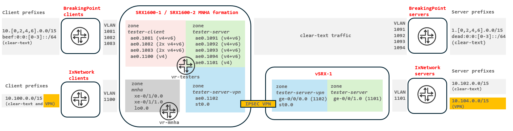
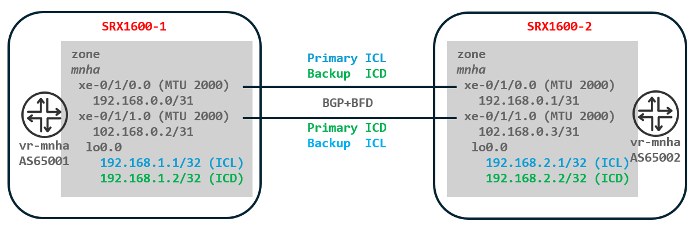
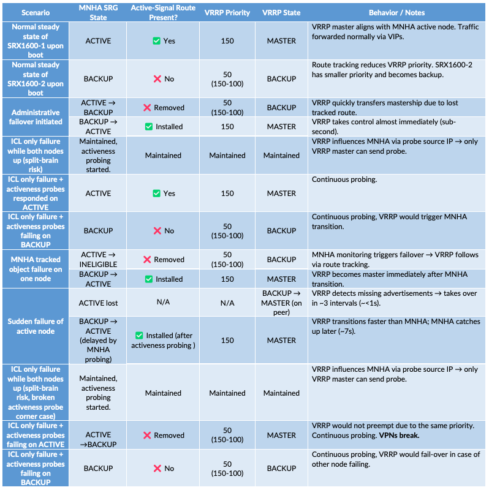
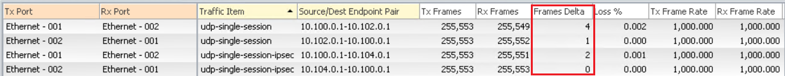
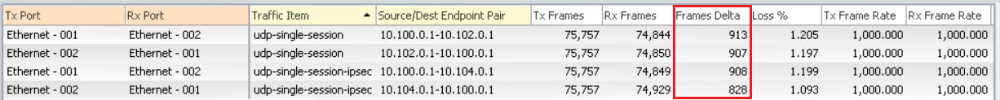
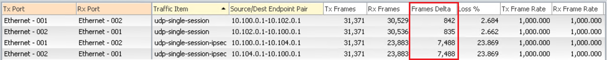
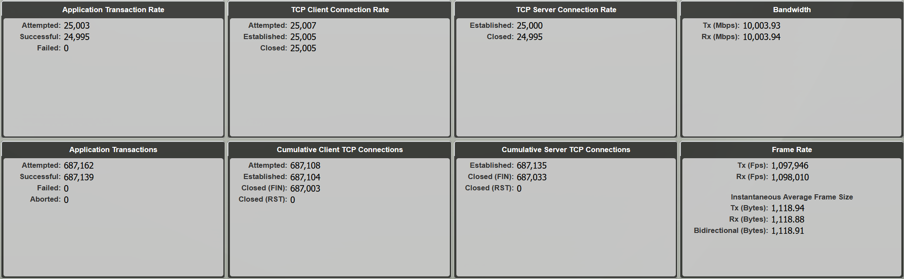
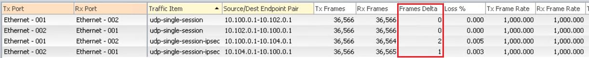
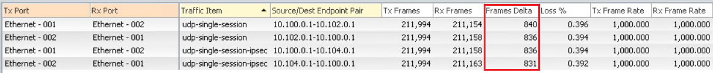
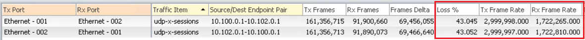

# SRX MNHA: VRRP

**Karel Hendrych - 05/27/2026**


## Abstract

This TechPost describes an alternative solution to the native SRX Multi Node High Availability (MNHA) Switching/Hybrid Layer 2 (L2) Virtual IP address (VIP) mechanisms using Virtual Router Redundancy Protocol (VRRP). MNHA combined with VRRP can offer more flexibility and speed up convergence in some failure scenarios. The solution addresses current limitations of the native MNHA L2 VIP mechanism compared with the traditional SRX chassis-cluster technology. The additional configuration should be seen as a worthwhile investment for the flexibility and better convergence times, albeit making the configuration slightly more complex.

## Introduction

Firewall clustering using failover VIP addresses within an L2 domain is the dominant high-availability mechanism in enterprise networks. SRX MNHA, originally designed for L3 clusters, later introduced an L2 VIP mechanism with Switching and Hybrid modes; the latter is becoming increasingly popular because it combines L3 and L2 redundancy which allows MNHA clusters to be enabled without wholesale network change. The SRX4700 and the emerging SRX400 series do not support the traditional SRX chassis-cluster technology, so this TechPost describes an alternative - using VRRP to provide L2 VIP services - that may be applicable in certain scenarios.

As of Junos 25.4R1, the following constraints exist for MNHA IPv4 and IPv6 L2 VIP addressing in Switching and Hybrid modes:

- Support for one IPv4 OR one IPv6 VIP address per logical interface; dualstack (one IPv4 AND one IPv6) is planned for Junos 26.2R1. This is a challenge for configurations that use multiple IP aliases, whether within the same IP prefix or across different prefixes (multiple IP prefixes within the same VLAN).
- For proxy-ARP/NDP, nodes respond individually using their interface MAC addresses. In addition to routing tricks, multiple IP aliases can partially address this.
- MNHA VIPs cannot overlap, even if a VIP is configured in a different Services Redundancy Group (SRG) with the interface bound to a different virtual router.
- MNHA 3- and 4-node formations support only the L3 mechanism; although not covered here, hypothetically VRRP could address the L2 scenario (without signal-routes-based mastership steering as of Junos 25.4R1).

> Note: the maximum scale of 32 VIPs per SRG was increased to 2,000 and [release noted](https://supportportal.juniper.net/s/article/25-2R1-S1-SRN) in Junos 25.2R1-S1 for both MNHA Switching and Hybrid modes.

This article does not aim to provide any sort of qualification for specific platforms regarding scale and timer settings; that is a matter of qualification against the specific hardware, software, VIP scale, and timer configurations. In lab environments, the SRX1600/4120/4300 series has generally been observed to scale to the upper hundreds of VRRP VIPs with default timers. 

Besides the official MNHA [documentation](https://www.juniper.net/documentation/us/en/software/junos/high-availability/topics/concept/mnha-overview.html), related reading includes:

- [Multi-Node High Availability Basics(https://juniper.github.io/techposts/dhcp-on-mnha-back-to-basics/article)] by Steven Jacques
- DHCP on MNHA: [Back to Basics](https://juniper.github.io/techposts/hybrid-mnha-with-ebgp/article)
- [Hybrid MNHA with eBGP](https://juniper.github.io/techposts/mnha-ipsec-and-multiple-routing-instances/article) and  by James Rathbun
- SRX clustering: from [Chassis Cluster to MultiNode High Availability](https://juniper.github.io/techposts/srx-from-chassis-cluster-to-mnha/article) by Laurent Paumelle

## Design Principles

Before diving into the example setup, the design is essentially built on two distinct state machines - SRX-specific MNHA and standards-based Junos VRRP implementation - with the following specifics:

- VRRP tracks the MNHA active-signal route, so VRRP mastership follows the MNHA SRG1 active node during administrative and monitored-object failovers. The tracked route's priority cost is lower than the VRRP priority, so a backup node that doesn't have the active-signal route installed remains in the VRRP backup state (it would be in the idle state if the priority cost were equal or higher).
- MNHA SRG is in Routing mode, so native MNHA VIP configuration enforced at commit is not necessarily required.
- The MNHA activeness probe (split-brain detection) uses the VRRP VIP as its source IP for ICMP echo-request. Even if ICL links are down, VRRP state influences MNHA's splitbrain detection mechanism.
- The configuration provides L2 VIP redundancy using VRRP and can use MNHA L3 signalling for upstream, making it effectively L2/L3 hybrid (L3 uplink connectivity is not covered in this article).
- MNHA can use granular SRG monitoring to transfer activeness (and VRRP mastership) to the other node if certain criteria are met (e.g., link down, ICMP/BFD monitoring).
- Multiple VRRP IPv4 or IPv6 addresses within the same prefix (IP aliases) are configured as additional VIP entries (which implies VRRP *no-accept-data* disallowing inbound traffic to the VRRP group VIPs).
- Additional VRRP VIPs can also serve for purposes of proxy-ARP/NDP. Note only 8 IPv4 addresses AND 8 IPv6 per VRRP group are supported.
- Additional prefixes are configured in their own VRRP groups, possibly mixing multiple IPs from the same prefix within those groups.
- MNHA is configured with an additional link for asymmetric operations for cases when VRRP masters are split across nodes (this can be largely mitigated by properly configured MNHA interface tracking).
- VPN services can be terminated on VRRP VIP, MNHA references the VIP(s) in configuration.
- An additional VRRP group with a single VIP in the same prefix as the other group(s) can serve for VPN termination (avoiding the mandatory *no-accept-data* setting for multiple VIPs in a single group).
- VRRPv3 is enabled for IPv6 support and fasters timers (including for IPv4).
- VRRP uses the same priority on both nodes to avoid preemption.

> Note: the Validation part contains a potentially valuable table of MNHA and VRRP statesr eflecting above principles  settings of the demo topology described later.

So, in summary VRRP which has sub-second convergence, watches MNHA signalling routes, and drives the active interface change via VRRP mechanisms.  Convergence can occur in 1 second with appropriate timers.  This twinning of these technologies can result in an order of magnitude faster convergence, with the option to expand to Hybrid like L2/L3 HA modes or to move entirely to L3 HA.

## Demo Topology

The purpose of the demo topology is to:

- Conduct fail-over test with multiple IPv4 and IPv6 addresses on interface with running clear-text background traffic.
- Measure the elapsed time of fail-over for both clear-text and IPSEC tunneled traffic for administrative fail-over and sudden device outage.
- Test stability of VRRP when device is subjected to UDP traffic causing high PFE load

The demo topology depicted in a simplified manner below consists of:

- MNHA pair of [SRX1600s](https://www.juniper.net/content/dam/www/assets/datasheets/us/en/security/srx1600-firewall-datasheet.pdf), each connected in a firewallonahomed scenarios to a pair of switches because the SRX1600's upper forwarding capacity is just under 25 Gbps (Broadcom switchingchip-toCPU link limit).
- A vSRX for functional testing of traffic failover for an IPSEC VPN tunnel between the SRX1600 MNHA pair and the vSRX instance.
- A Keysight (IXIA) BreakingPoint tester with 4x10GE for servers and 4x10GE for clients is used to generate stateful traffic; stateless traffic uses a 2x10GE port on a Keysight (IXIA) IxNetwork tester.

From the SRX devices' perspective, the tester client and server prefixes are routed toward the tester IP addresses within the respective client and server VLAN prefixes, except for IPSEC VPN traffic, which uses tunnel interfaces as the next hops. Physically, the testers are connected to the same QFX10k switch as the SRX devices and the vSRX.



Details of SRX1600 IP addressing (IPv4 /24 and IPv6 /64):

| Zone | Interface.VLAN | SRX1600-1 IP | SRX1600-2 IP | VRRP IP(s) |
|:-|:-|:-|:-|:-|
| tester-client | ae0.1081 | 100.64.81.11 | 100.64.81.12 | .10 |
| tester-client | ae0.1081 | dead:81::11 | dead:81::12 | ::10 |
| tester-client | ae0.1082 | 100.64.82.11 | 100.64.82.12 | .10, .20 |
| tester-client | ae0.1082 | dead:82::11 | dead:82::11 | ::10 ::20 |
| tester-client | ae0.1083 | 100.64.83.11 | 100.64.83.12 | .10 |
| tester-client | ae0.1083 | 100.64.84.11 | 100.64.84.11 | .10 .20 |
| tester-client | ae0.1083 | dead:83::11 | dead:83::12 | ::20 |
| tester-client | ae0.1083 | dead:84::11 | dead:84::12 | ::10 ::20 |
| tester-client | ae0.1100 | 100.64.100.11 | 100.64.100.12 | .10 |
| tester-server | ae0.1091 | 100.64.91.11 | 100.64.91.12 | .10 |
| tester-server | ae0.1091 | dead:91::11 | dead:91::12 | ::10 |
| tester-server | ae0.1092 | 100.64.92.11 | 100.64.92.12 | .10 |
| tester-server | ae0.1092 | dead:92::11 | dead:92::12 | ::10 |
| tester-server | ae0.1093 | 100.64.93.11 | 100.64.93.12 | .10 |
| tester-server | ae0.1093 | dead:93::11 | dead:93::12 | ::10 |
| tester-server | ae0.1094 | 100.64.94.11 | 100.64.94.12 | .10 |
| tester-server | ae0.1094 | dead:94::11 | dead:94::12 | ::10 |
| tester-server | ae0.1101 | 100.64.101.11 | 100.64.101.12 | .10 |
| tester-server-vpn | ae0.1102 | 100.64.102.11 | 100.64.102.12 | .10 |
| tester-server-vpn | st0.0 | N/A | N/A | N/A |

> Note: the QFX10 IRB interface in VLAN 1081 uses IP address 100.64.81.20 as the destination for the MNHA activeness probe (explained later).

A brief ICL/ICD refresher before proceeding. The Inter-Chassis Link (ICL) serves two purposes: synchronizing Real Time Object (RTO) state - sessions and IPSEC SAs - between nodes, and providing a lightweight control plane for remote node status. The Inter-Chassis Datapath (ICD) handles traffic that arrives asymmetrically, forwarding it across the ICD until the local node can establish its own forwarding path (local breakout). The VRRP/MNHA setup is designed to be Active/Passive (A/P), so asymmetries should not occur, or worst case should be very brief during numerous VRRP mastership transitions; ICD is primarily present for corner cases and for migrations to Hybrid or L3 mode.

Leveraging loopbacks provides both L3 redundancy and deployment flexibility. In this scenario, connectivity for the ICL and ICD links is between loopback interfaces via directly connected 10GE interfaces. Alternatively, if the MNHA deployment for the ICL/ICD communication paths is across distributed over an L3 infrastructure, the same redundancy and flexibility exists. The *xe-0/1/0* link is the preferred path for ICL and *xe-0/1/1* for ICD. If a single link fails, both ICL and ICD merge on the remaining interface - ensured by BGP/BFD settings.

For ICL/ICD MTU requirements: when ICD is configured and traffic is asymmetric, data segments traverse ICD until all content plug-ins detach (e.g., AppID) and local breakout becomes possible. It was observed that UDP encapsulation of a 1,514byte frame containing a 1,448byte TCP segment results on ICD in a 1,606byte frame (encapsulating the TCP segment into a 1,564byte UDP packet). A 2,000byte MTU on the underlying interfaces *xe-0/1/0* and *xe-0/1/1* is a conservative measure.

The ICL/ICD topology diagram below highlights a dedicated routing instance used for the physical and loopback interfaces, both bound to the same zone.



Details of MNHA loopback and physical interlinks addressing:

| Zone | Interface/VLAN | SRX1600-1 IP | SRX1600-2 IP |
|:-|:-|:-|:-|
| mnha | xe-0/1/0.0 | 192.168.0.0 | 192.168.0.1 |
| mnha | xe-0/1/1.0 | 192.168.0.2 | 192.168.0.3 |
| mnha | lo0.0 | 192.168.1.1 | 192.168.2.1 |
| mnha | lo0.0 | 192.168.1.2 | 192.168.2.2 |

Finally, vSRX-1 IPSEC peer addressing:

| Zone | Interface/VLAN | vSRX-1 IP |
|:-|:-|:-|
| tester-server-vpn | ge-0/0/0.0 | 100.64.102.20 |
| tester-server-vpn | st0.0 | N/A |
| tester-server | ge-0/0/1.0 | 100.64.101.20 |

## Configuration Break-down

This section describes the configuration for SRX1600-1 in detail; SRX1600-2 is nearly identical, so only differences are highlighted. Essential system settings - management interface, root authentication, and DNS/NTP/logging - are not covered here but are partially included in the complete configurations for both SRX1600s and vSRX in [Appendix 1](#appendix-1-complete-configurations).

### SRX1600-1

#### Common Settings

For configuration context: the host-name is configured; then the number of aggregated interfaces and the SRX1600's 25/10/1GE PIC switched to 10/1GE mode for 10GE HA links:

```plaintext
set system host-name srx1600-1
set chassis aggregated-devices ethernet device-count 1
set chassis fpc 0 pic 1 pic-mode 1G10G
```

#### MNHA Infrastructure

Next, the loopback interface configuration: two addresses are assigned to the same interface because Junos permits only one loopback unit per routing instance. The underlying physical interfaces, with an increased MTU to carry potential ICD traffic, are configured with point-to-point addressing.

```plaintext
edit interfaces

set lo0 unit 0 family inet address 192.168.1.1/32
set lo0 unit 0 family inet address 192.168.1.2/32

set interfaces xe-0/1/0 mtu 2000
set interfaces xe-0/1/1 mtu 2000

set xe-0/1/0 unit 0 family inet address 192.168.0.0/31
set xe-0/1/1 unit 0 family inet address 192.168.0.2/31
```

The above interfaces are bound to* mnha* zone; inbound host services permit ICMP, BGP, and BFD. The loopback interface is used only for highavailability communication, ICMP for diagnostics, and BFD for ICL monitoring. BFD is theoretically redundant because traffic matches the UDP flow, but its presence is recommended as best practice:

```plaintext
edit security zones security-zone mnha interfaces

set xe-0/1/0.0 host-inbound-traffic system-services ping
set xe-0/1/0.0 host-inbound-traffic protocols bgp
set xe-0/1/0.0 host-inbound-traffic protocols bfd

set xe-0/1/1.0 host-inbound-traffic system-services ping
set xe-0/1/1.0 host-inbound-traffic protocols bgp
set xe-0/1/1.0 host-inbound-traffic protocols bfd

set lo0.0 host-inbound-traffic system-services high-availability
set lo0.0 host-inbound-traffic system-services ping
set lo0.0 host-inbound-traffic protocols bfd
```

Corresponding intra-zone policy permits traffic between the physical interfaces and the loopback interface:

```plaintext
edit security policies from-zone mnha to-zone mnha

set policy mnha match source-address any
set policy mnha match destination-address any
set policy mnha match application any
set policy mnha then permit
```

> Note:  policy controls can be tightened based on loopback IPs, or by enabling IPSEC for ICL as covered in [Appendix 2](#appendix-2-encrypted-icl).

BGP export policies for the preferred ICL link *xe-0/1/0* de-preference the ICD link's loopback IP by prepending the local AS number:

```plaintext
edit policy-options policy-statement export-mnha-icl

set term icl from interface lo0.0
set term icl from route-filter 192.168.1.1/32 exact
set term icl then accept

set term icd from interface lo0.0
set term icd from route-filter 192.168.1.2/32 exact
set term icd then as-path-prepend 65001
set term icd then accept

set term final then reject
```

Similarly, the preferred ICD *xe-0/1/1* link's export policy de-preferences the ICL link by prepending the local AS number:

```plaintext
edit policy-options policy-statement export-mnha-icd

set term icl from interface lo0.0
set term icl from route-filter 192.168.1.1/32 exact
set term icl then as-path-prepend 65001
set term icl then accept

set term icd from interface lo0.0
set term icd from route-filter 192.168.1.2/32 exact
set term icd then accept

set term final then reject
```

Finally, as per best practice, the underlying MNHA interfaces are bound to a dedicated routing instance, with BGP peering and BFD configured for a 1.5 s detection time:

```plaintext
edit routing-instances vr-mnha

set instance-type virtual-router
set routing-options autonomous-system 65001

set protocols bgp group mnha peer-as 65002
set protocols bgp group mnha bfd-liveness-detection minimum-interval 500
set protocols bgp group mnha bfd-liveness-detection multiplier 3
set protocols bgp group mnha neighbor 192.168.0.1 export export-mnha-icl
set protocols bgp group mnha neighbor 192.168.0.3 export export-mnha-icd

set interface xe-0/1/0.0
set interface xe-0/1/1.0
set interface lo0.0
```

#### MNHA

The base MNHA settings define the local identifier (*local-id 1*) in the MNHA formation, the local address for the ICL link, and the ICD (forwarding) IP address. Under the peer identifier (*peer-id 2*), the remote ICL and ICD IPs reachable from the local node are configured, along with the interface and routing instance used as the source for both ICL and ICD traffic. BFD is used to track reachability of the remote node (discussed in the next section) for both ICL and ICD (forwarding). 

> Note: that the ICL and ICD timers are slower (3 x 1000 ms) than the underlying infrastructure timers (3 x 500 ms), so the ICL/ICD links are preserved during underlay convergence:

```plaintext
edit chassis high-availability

set local-id 1
set local-id local-ip 192.168.1.1
set local-id local-forwarding-ip 192.168.1.2

set peer-id 2 peer-ip 192.168.2.1
set peer-id 2 interface lo0.0
set peer-id 2 routing-instance vr-mnha

set peer-id 2 peer-forwarding-ip 192.168.2.2
set peer-id 2 peer-forwarding-ip interface lo0.0
set peer-id 2 peer-forwarding-ip liveness-detection minimum-interval 1000
set peer-id 2 peer-forwarding-ip liveness-detection multiplier 3

set peer-id 2 liveness-detection minimum-interval 1000
set peer-id 2 liveness-detection multiplier 3
```

In the A/P design with VRRP, SRG-1 in **Routing mode** (explicitly set here, but the default) is a **key concept** because it **provides signal routes used by VRRP** for tracking. Also, Routing mode eliminates the commit-time enforcement to configure native MNHA VIPs (unlike Switching or Hybrid modes). Signal routes are instantiated in the routing instance that hosts the ICL and ICD links; otherwise they go to the inet.0 table by default:

```plaintext
edit chassis high-availability services-redundancy-group 1

set deployment-type routing
set peer-id 2

set active-signal-route 100.64.0.1
set active-signal-route routing-instance vr-mnha

set backup-signal-route 100.64.0.0
set backup-signal-route routing-instance vr-mnha
```

> Note: for completeness - Hybrid mode provides signal routes as well; however, it also requires configuration of MNHA native VIPs, which is not wanted.

The activeness probe runs after ICL loss (tracked by multi-hop BFD session), sending ICMP echo-requests toward an IP address on adjacent routing or switching equipment. The node that receives a response remains active; the node that does not remains in backup state. **Note: ** the probe source IP is the VRRP VIP, so only the VRRP master can send it - the backup has no mechanism to initiate probes and will correctly remain backup if only the ICL has failed. Related configuration with probing effectively from *ae0.1081* VRRP VIP:

```plaintext
edit chassis high-availability services-redundancy-group 1

set activeness-probe dest-ip 100.64.81.20
set activeness-probe dest-ip src-ip 100.64.81.10
set activeness-probe dest-ip routing-instance vr-testers
```

The monitoring tracks *ae0* aggregate-interface link status based on *minimum-links* setting (minimum 2 of 4, described later). Loss of the aggregate interface contributes a weight of 100, which triggers the thresholds for the object and the entire SRG, rendering the MNHA node as ineligible. Finally, the activeness priority is used as a tiebreaker during boot - the higher priority becomes active (and the other node in the MNHA pair should have a lower value to enable this behaviour as shown in the SRX1600-2 section):

```plaintext
edit chassis high-availability services-redundancy-group 1

set monitor monitor-object interface-1 object-threshold 100
set monitor monitor-object interface-1 interface threshold 100
set monitor monitor-object interface-1 interface interface-name ae0 weight 100
set monitor srg-threshold 100

set activeness-priority 200
```

#### Interfaces and VRRP

First, enable VRRP version 3 for IPv6 support and subsecond advertisements:

```plaintext
set protocols vrrp version-3
```

The 4-member aggregate interface *ae0* enabled for VLAN tagging, marking interface as down if less than two links are up and periodic fast set LACP:

```plaintext
edit interfaces

set xe-0/2/0 ether-options 802.3ad ae0
set xe-0/2/1 ether-options 802.3ad ae0
set xe-0/2/2 ether-options 802.3ad ae0
set xe-0/2/3 ether-options 802.3ad ae0

set ae0 vlan-tagging
set ae0 aggregated-ether-options minimum-links 2
set ae0 aggregated-ether-options lacp active
set ae0 aggregated-ether-options lacp periodic fast
```

Common VRRP settings for all logical units on *ae0* are defined in a Junos group. The **tracked route is the active-signal Route from the MNHA settings**; if that route is absent from the *vr-mnha* routing instance, the priority (150) is reduced by the priority cost (100), making the node a VRRP backup under normal conditions while the master remains at priority 150. A VRRP fast-interval of 200 ms enables subsecond failover in ideal conditions:

```plaintext
edit groups vrrp-1 interfaces ae0 unit <*>

set family inet address <*> vrrp-group <*> priority 150
set family inet address <*> vrrp-group <*> fast-interval 200
set family inet address <*> vrrp-group <*> accept-data
set family inet address <*> vrrp-group <*> track route 100.64.0.1/32 routing-instance vr-mnha priority-cost 100

set family inet6 address <*> vrrp-inet6-group <*> priority 150
set family inet6 address <*> vrrp-inet6-group <*> fast-interval 200
set family inet6 address <*> vrrp-inet6-group <*> accept-data
set family inet6 address <*> vrrp-inet6-group <*> track route 100.64.0.1/32 routing-instance vr-mnha priority-cost 100
```

> Note: in the real world, LACP timers interact with VRRP intervals because only one interface on the VRRP master is chosen to send advertisements. If LACP detection is slower than an aggressively configured VRRP (for example, the 200 ms fast-interval used here), when the advertising interface fails while other interfaces remain up, the VRRP backup may briefly become master.

The first clientside VLAN unit is a dualstack interface: the VRRP addresses are *.10* and *::10*; SRX1600-1 uses *.11* and *::11*; SRX1600-2 uses .*12* and *::12*:

```plaintext
edit interfaces ae0

set unit 1081 vlan-id 1081

set unit 1081 family inet address 100.64.81.11/24 vrrp-group 1 virtual-address 100.64.81.10
set unit 1081 family inet6 address dead:81::11/64 vrrp-inet6-group 1 virtual-inet6-address dead:81::10
```

The second client VLAN unit adds IP aliases for VRRP VIPs within the same prefix. Using multiple IP addresses requires *no-accept-data* (for example, the node does not respond to ICMP or to locally terminated VPN traffic):

```plaintext
edit interfaces ae0

set unit 1082 vlan-id 1082

set unit 1082 family inet address 100.64.82.11/24 vrrp-group 1 virtual-address 100.64.82.10
set unit 1082 family inet address 100.64.82.11/24 vrrp-group 1 virtual-address 100.64.82.20
set unit 1082 family inet address 100.64.82.11/24 vrrp-group 1 no-accept-data

set unit 1082 family inet6 address dead:82::11/64 vrrp-inet6-group 1 virtual-inet6-address dead:82::10
set unit 1082 family inet6 address dead:82::11/64 vrrp-inet6-group 1 virtual-inet6-address dead:82::20
set unit 1082 family inet6 address dead:82::11/64 vrrp-inet6-group 1 no-accept-data
```

> Note:  a combination with an additional VRRP group using IPs in the same prefix would also work, removing the need to add *no-accept-data*; e.g., suitable for VPN termination.

The third client VLAN unit has additional IP aliases from a different prefix by using another VRRP group:

```plaintext
edit interfaces ae0

set unit 1083 vlan-id 1083

set unit 1083 family inet address 100.64.83.11/24 vrrp-group 1 virtual-address 100.64.83.10
set unit 1083 family inet address 100.64.84.11/24 vrrp-group 2 virtual-address 100.64.84.10
set unit 1083 family inet address 100.64.84.11/24 vrrp-group 2 virtual-address 100.64.84.20
set unit 1083 family inet address 100.64.84.11/24 vrrp-group 2 no-accept-data

set unit 1083 family inet6 address dead:83::11/64 vrrp-inet6-group 1 virtual-inet6-address dead:83::10
set unit 1083 family inet6 address dead:84::11/64 vrrp-inet6-group 2 virtual-inet6-address dead:84::10
set unit 1083 family inet6 address dead:84::11/64 vrrp-inet6-group 2 virtual-inet6-address dead:84::20
set unit 1083 family inet6 address dead:84::11/64 vrrp-inet6-group 2 no-accept-data
```

Serverside units are kept simple: dualstack for some interfaces and IPv4only for others:

```plaintext
edit interfaces ae0

set unit 1091 vlan-id 1091
set unit 1091 family inet address 100.64.91.11/24 vrrp-group 1 virtual-address 100.64.91.10
set unit 1091 family inet6 address dead:91::11/64 vrrp-inet6-group 1 virtual-inet6-address dead:91::10

set unit 1092 vlan-id 1092
set unit 1092 family inet address 100.64.92.11/24 vrrp-group 1 virtual-address 100.64.92.10
set unit 1092 family inet6 address dead:92::11/64 vrrp-inet6-group 1 virtual-inet6-address dead:92::10

set unit 1093 vlan-id 1093
set unit 1093 family inet address 100.64.93.11/24 vrrp-group 1 virtual-address 100.64.93.10
set unit 1093 family inet6 address dead:93::11/64 vrrp-inet6-group 1 virtual-inet6-address dead:93::10

set unit 1094 vlan-id 1094
set unit 1094 family inet address 100.64.94.11/24 vrrp-group 1 virtual-address 100.64.94.10
set unit 1094 family inet6 address dead:94::11/64 vrrp-inet6-group 1 virtual-inet6-address dead:94::10

set unit 1100 vlan-id 1100
set unit 1100 family inet address 100.64.100.11/24 vrrp-group 1 virtual-address 100.64.100.10

set unit 1101 vlan-id 1101
set unit 1101 family inet address 100.64.101.11/24 vrrp-group 1 virtual-address 100.64.101.10

set unit 1102 vlan-id 1102
set unit 1102 family inet address 100.64.102.11/24 vrrp-group 1 virtual-address 100.64.102.10
```

#### Routing

Author's preference is to enclose all traffic interfaces into separate routing instance. Static routing steers prefixes towards tester ports acting from SRX perspective as next-hops for both client and server prefixes:

```plaintext
edit routing-instances vr-testers

set instance-type virtual-router

set interface ae0.1081
set interface ae0.1082
set interface ae0.1083
set interface ae0.1091
set interface ae0.1092
set interface ae0.1093
set interface ae0.1094
set interface ae0.1100
set interface ae0.1101
set interface ae0.1102

set routing-options static route 1.0.0.0/15 next-hop 100.64.91.1
set routing-options static route 1.2.0.0/15 next-hop 100.64.92.1
set routing-options static route 1.4.0.0/15 next-hop 100.64.93.1
set routing-options static route 1.6.0.0/15 next-hop 100.64.94.1
set routing-options static route 10.0.0.0/15 next-hop 100.64.81.1
set routing-options static route 10.2.0.0/15 next-hop 100.64.82.1
set routing-options static route 10.4.0.0/15 next-hop 100.64.83.1
set routing-options static route 10.6.0.0/15 next-hop 100.64.84.1
set routing-options static route 10.100.0.0/15 next-hop 100.64.100.1
set routing-options static route 10.102.0.0/15 next-hop 100.64.101.1

set routing-options rib vr-testers.inet6.0 static route beef::0/64 next-hop dead:81::1
set routing-options rib vr-testers.inet6.0 static route beef:0:0:1::0/64 next-hop dead:82::1
set routing-options rib vr-testers.inet6.0 static route beef:0:0:2::0/64 next-hop dead:83::1
set routing-options rib vr-testers.inet6.0 static route beef:0:0:3::0/64 next-hop dead:84::1
set routing-options rib vr-testers.inet6.0 static route dead:0:0:0::0/64 next-hop dead:91::1
set routing-options rib vr-testers.inet6.0 static route dead:0:0:1::0/64 next-hop dead:92::1
set routing-options rib vr-testers.inet6.0 static route dead:0:0:2::0/64 next-hop dead:93::1
set routing-options rib vr-testers.inet6.0 static route dead:0:0:3::0/64 next-hop dead:94::1
```

#### Zones

Besides the *mnha* infrastructure zone, only three other zones are configured - for servers, clients, and transit (for the IPSEC part). An important setting is to enable VRRP as a host-inbound protocol; otherwise the master's advertisements are not seen and both nodes become VRRP masters:

```plaintext
edit security zones

set security-zone tester-client host-inbound-traffic system-services ping
set security-zone tester-client host-inbound-traffic protocols vrrp
set security-zone tester-client interfaces ae0.1081
set security-zone tester-client interfaces ae0.1082
set security-zone tester-client interfaces ae0.1083
set security-zone tester-client interfaces ae0.1100

set security-zone tester-server host-inbound-traffic system-services ping
set security-zone tester-server host-inbound-traffic protocols vrrp
set security-zone tester-server interfaces ae0.1091
set security-zone tester-server interfaces ae0.1092
set security-zone tester-server interfaces ae0.1093
set security-zone tester-server interfaces ae0.1094
set security-zone tester-server interfaces ae0.1101

set security-zone tester-server-vpn host-inbound-traffic system-services ping
set security-zone tester-server-vpn host-inbound-traffic protocols vrrp
set security-zone tester-server-vpn interfaces ae0.1102
```

#### Policies

Security policies are kept as simple as possible to enable this lab by permitting all cleartext traffic from the client zone to the server zone:

```plaintext
edit security policies

set from-zone tester-client to-zone tester-server policy tester-client-1 match source-address any
set from-zone tester-client to-zone tester-server policy tester-client-1 match destination-address any
set from-zone tester-client to-zone tester-server policy tester-client-1 match application any
set from-zone tester-client to-zone tester-server policy tester-client-1 then permit

set global policy final-1 match source-address any
set global policy final-1 match destination-address any
set global policy final-1 match application any
set global policy final-1 then deny
```

#### NAT

In the sample setup, part of the client prefixes (*10.6.0.0/15*) is used for interfacestyle source NAT to the VRRP address:

```plaintext
edit security nat source

set pool pool-1 address 100.64.94.10/32
set rule-set source-1083 from zone tester-client
set rule-set source-1083 to zone tester-server
set rule-set source-1083 rule source-1083-1 match source-address 10.6.0.0/15
set rule-set source-1083 rule source-1083-1 match destination-address 0.0.0.0/0
set rule-set source-1083 rule source-1083-1 then source-nat pool pool-1
```

> Note:  the MAC address in outgoing frames is the node's MAC; response frames use the VRRP MAC as the destination. ProxyARPlike behaviour can be partially mimicked by VRRP IP aliases or by a route to the NAT pool via the VRRP IP address.

#### Flow Tuning

Only the DNS and FTP ALGs are enabled. Disabled [drop-flow](https://www.juniper.net/documentation/us/en/software/junos/release-notes/23.4/junos-release-notes-23.4r1/topics/new-features/feature-descriptions/flow-based-packet-based-processing-9.html) to avoid excessive logging (configurable since Junos when tester traffic is denied by policies, since drop-flow inserts shortlived session records for dropped traffic and causes packets to be dropped without policy evaluation in the slow path. trict TCP handshake checks to enforce stricter TCP handling (disallowing data segments until the handshake completes):

```plaintext
set security alg msrpc disable
set security alg sunrpc disable
set security alg talk disable
set security alg tftp disable
set security alg pptp disable

set security flow drop-flow max-sessions 0
set security flow tcp-session strict-syn-check
```

#### IPSEC

IPSECrelated settings are in the *ipsec-1* Junos group, which makes it easy to keep track of configuration across hierarchies. [Appendix 2](#appendix-2-encrypted-icl) covers ICL IPSEC encryption in another Junos group, which is mandatory for real-world VPN deployments.

An unnumbered tunnel interface is mapped to a specific routing instance with a static route for the tester's serverside prefix designated to IPSEC. In the next configuration section, the referenced prefix list specifies the IP addresses where IPSEC services may terminate (effectively the *ae0.1102* VRRP address):

```plaintext
edit groups ipsec-1

set interfaces st0 unit 0 family inet
set routing-instances vr-testers routing-options static route 10.104.0.0/15 next-hop st0.0
set routing-instances vr-testers interface st0.0

set policy-options prefix-list ipsec_termination 100.64.102.10/32
```

MNHA configuration is expanded to enable IPSEC services and reference the previously configured prefix list. Enabling *process-packet-on-backup* allows an MNHA node in the BACKUP state to process incoming IPSEC VPN traffic before changing to ACTIVE, resulting in quicker failover (otherwise, there is a time interval when the VRRP backup becomes master while MNHA waits for the ICL BFD to go down and for the activeness probe to complete):

```plaintext
edit groups ipsec-1 chassis high-availability services-redundancy-group 1

set managed-services ipsec
set prefix-list ipsec_termination routing-instance vr-testers
set process-packet-on-backup
Allow IKE on the aggregate interface unit designated for the IPSEC VPN by expanding the tester-server-vpn zone settings, and for simplicity bind the tunnel interface to the same zone:
edit groups ipsec-1 security zones

set security-zone tester-server-vpn host-inbound-traffic system-services ike
set security-zone tester-server-vpn interfaces st0.0
```

Corresponding security policy:

```plaintext
edit groups ipsec-1 security policies from-zone tester-client to-zone tester-server-vpn

set policy tester-client-vpn-1 match source-address any
set policy tester-client-vpn-1 match destination-address any
set policy tester-client-vpn-1 match application any
set policy tester-client-vpn-1 then permit
```

> Note:  in in real-world deployments, strict controls would be applied.

Sample IPSEC VPN settings binding the previously configured tunnel interface; the *local-address* is set to the VRRP address of *ae0.1102*.

```plaintext
edit groups ipsec-1 security

set ike proposal ike-proposal-1 authentication-method pre-shared-keys
set ike proposal ike-proposal-1 dh-group group20
set ike proposal ike-proposal-1 encryption-algorithm aes-256-gcm
set ike proposal ike-proposal-1 lifetime-seconds 86400

set ike policy ike-policy-1 proposals ike-proposal-1
set ike policy ike-policy-1 pre-shared-key ascii-text <-----PSK-HERE----->

set ike gateway ike-gw-1 ike-policy ike-policy-1
set ike gateway ike-gw-1 address 100.64.102.20
set ike gateway ike-gw-1 dead-peer-detection
set ike gateway ike-gw-1 external-interface ae0.1102
set ike gateway ike-gw-1 local-address 100.64.102.10
set ike gateway ike-gw-1 version v2-only

set ipsec proposal ipsec-proposal-1 encryption-algorithm aes-256-gcm
set ipsec proposal ipsec-proposal-1 lifetime-seconds 3600

set ipsec policy ipsec-policy-1 perfect-forward-secrecy keys group20
set ipsec policy ipsec-policy-1 proposals ipsec-proposal-1

set ipsec vpn vpn-1 bind-interface st0.0
set ipsec vpn vpn-1 ike gateway ike-gw-1
set ipsec vpn vpn-1 ike ipsec-policy ipsec-policy-1
```

Bonus - add-on in the form of Post-quantum Pre-shared Keys (PPK) RFC [8784](https://www.juniper.net/documentation/us/en/software/junos/vpn-ipsec/topics/topic-map/quantum-safe-ipsec-vpn.html) support, where this setup serves as a technology demonstrator using static keys:

```plaintext
top edit groups ipsec-1 security

set key-manager profiles quantum static key-id ascii-text <-----KEY-ID-HERE----->
set key-manager profiles quantum static key ascii-text <-----32-character+-KEY-HERE----->
set ike gateway ike-gw-1 ppk-profile quantum
```

#### Applying Groups

To apply the groups containing both the common VRRP settings and the IPSECrelated configuration:

```plaintext
set apply-groups vrrp-1
set apply-groups ipsec-1
```

Final step: reboot  as prompted by the CLI after committing the MNHA configuration for the first time.

### SRX1600-2

[Appendix 1](#appendix-1-complete-configurations) contains the full configurations; this section captures only the differences between SRX1600-1 and SRX1600-2.

First thing, the configuration context:

```plaintext
set system host-name srx1600-2
```

MNHArelated loopback and physical interconnect interface addressing:

```plaintext
edit interfaces

set lo0 unit 0 family inet address 192.168.2.1/32
set lo0 unit 0 family inet address 192.168.2.2/32

set interfaces xe-0/1/0 mtu 2000
set interfaces xe-0/1/1 mtu 2000

set xe-0/1/0 unit 0 family inet address 192.168.0.1/31
set xe-0/1/1 unit 0 family inet address 192.168.0.3/31
```

ICL and ICD export policies adjusted for SRX1600-2 addressing, following the same principles as on SRX1600-1:

```plaintext
edit policy-options

set policy-statement export-mnha-icl term icl from interface lo0.0
set policy-statement export-mnha-icl term icl from route-filter 192.168.2.1/32 exact
set policy-statement export-mnha-icl term icl then accept
set policy-statement export-mnha-icl term icd from interface lo0.0
set policy-statement export-mnha-icl term icd from route-filter 192.168.2.2/32 exact
set policy-statement export-mnha-icl term icd then as-path-prepend 65002
set policy-statement export-mnha-icl term icd then accept
set policy-statement export-mnha-icl term final then reject

set policy-statement export-mnha-icd term icl from interface lo0.0
set policy-statement export-mnha-icd term icl from route-filter 192.168.2.1/32 exact
set policy-statement export-mnha-icd term icl then as-path-prepend 65002
set policy-statement export-mnha-icd term icl then accept
set policy-statement export-mnha-icd term icd from interface lo0.0
set policy-statement export-mnha-icd term icd from route-filter 192.168.2.2/32 exact
set policy-statement export-mnha-icd term icd then accept
set policy-statement export-mnha-icd term final then reject
```

Reversed autonomous system numbers and IP addresses:

```plaintext
edit routing-instances vr-mnha

set instance-type virtual-router
set routing-options autonomous-system 65002
set protocols bgp group mnha peer-as 65001
set protocols bgp group mnha bfd-liveness-detection minimum-interval 500
set protocols bgp group mnha bfd-liveness-detection multiplier 3
set protocols bgp group mnha neighbor 192.168.0.0 export export-mnha-icl
set protocols bgp group mnha neighbor 192.168.0.2 export export-mnha-icd
set interface xe-0/1/0.0
set interface xe-0/1/1.0
set interface lo0.0
```

MNHA settings are reversed in terms of IP addressing and local/peer ID settings:

```plaintext
edit chassis high-availability

set local-id 2
set local-id local-ip 192.168.2.1
set local-id local-forwarding-ip 192.168.2.2

set peer-id 1 peer-ip 192.168.1.1
set peer-id 1 interface lo0.0
set peer-id 1 routing-instance vr-mnha
set peer-id 1 peer-forwarding-ip 192.168.1.2
set peer-id 1 peer-forwarding-ip interface lo0.0
set peer-id 1 peer-forwarding-ip liveness-detection minimum-interval 1000
set peer-id 1 peer-forwarding-ip liveness-detection multiplier 3
set peer-id 1 liveness-detection minimum-interval 1000
set peer-id 1 liveness-detection multiplier 3

set services-redundancy-group 1 deployment-type routing
set services-redundancy-group 1 peer-id 1
set services-redundancy-group 1 activeness-probe dest-ip 100.64.81.20
set services-redundancy-group 1 activeness-probe dest-ip src-ip 100.64.81.10
set services-redundancy-group 1 activeness-probe dest-ip routing-instance vr-testers
set services-redundancy-group 1 monitor monitor-object interface-1 object-threshold 100
set services-redundancy-group 1 monitor monitor-object interface-1 interface threshold 100
set services-redundancy-group 1 monitor monitor-object interface-1 interface interface-name ae0 weight 100
set services-redundancy-group 1 monitor srg-threshold 100
set services-redundancy-group 1 active-signal-route 100.64.0.1
set services-redundancy-group 1 active-signal-route routing-instance vr-mnha
set services-redundancy-group 1 backup-signal-route 100.64.0.0
set services-redundancy-group 1 backup-signal-route routing-instance vr-mnha
set services-redundancy-group 1 activeness-priority 100
```

Interfaces with adjusted IP addressing:

```plaintext
edit interfaces ae0

set aggregated-ether-options minimum-links 2
set aggregated-ether-options lacp active
set aggregated-ether-options lacp periodic fast

set unit 1081 vlan-id 1081
set unit 1081 family inet address 100.64.81.12/24 vrrp-group 1 virtual-address 100.64.81.10
set unit 1081 family inet6 address dead:81::12/64 vrrp-inet6-group 1 virtual-inet6-address dead:81::10

set unit 1082 vlan-id 1082
set unit 1082 family inet address 100.64.82.12/24 vrrp-group 1 virtual-address 100.64.82.10
set unit 1082 family inet address 100.64.82.12/24 vrrp-group 1 virtual-address 100.64.82.20
set unit 1082 family inet address 100.64.82.12/24 vrrp-group 1 no-accept-data
set unit 1082 family inet6 address dead:82::12/64 vrrp-inet6-group 1 virtual-inet6-address dead:82::10
set unit 1082 family inet6 address dead:82::12/64 vrrp-inet6-group 1 virtual-inet6-address dead:82::20
set unit 1082 family inet6 address dead:82::12/64 vrrp-inet6-group 1 no-accept-data

set unit 1083 vlan-id 1083
set unit 1083 family inet address 100.64.83.12/24 vrrp-group 1 virtual-address 100.64.83.10
set unit 1083 family inet address 100.64.84.12/24 vrrp-group 2 virtual-address 100.64.84.10
set unit 1083 family inet address 100.64.84.12/24 vrrp-group 2 virtual-address 100.64.84.20
set unit 1083 family inet address 100.64.84.12/24 vrrp-group 2 no-accept-data
set unit 1083 family inet6 address dead:83::12/64 vrrp-inet6-group 1 virtual-inet6-address dead:83::10
set unit 1083 family inet6 address dead:84::12/64 vrrp-inet6-group 2 virtual-inet6-address dead:84::10
set unit 1083 family inet6 address dead:84::12/64 vrrp-inet6-group 2 virtual-inet6-address dead:84::20
set unit 1083 family inet6 address dead:84::12/64 vrrp-inet6-group 2 no-accept-data

set unit 1091 vlan-id 1091
set unit 1091 family inet address 100.64.91.12/24 vrrp-group 1 virtual-address 100.64.91.10
set unit 1091 family inet6 address dead:91::12/64 vrrp-inet6-group 1 virtual-inet6-address dead:91::10

set unit 1092 vlan-id 1092
set unit 1092 family inet address 100.64.92.12/24 vrrp-group 1 virtual-address 100.64.92.10
set unit 1092 family inet6 address dead:92::12/64 vrrp-inet6-group 1 virtual-inet6-address dead:92::10

set unit 1093 vlan-id 1093
set unit 1093 family inet address 100.64.93.12/24 vrrp-group 1 virtual-address 100.64.93.10
set unit 1093 family inet6 address dead:93::12/64 vrrp-inet6-group 1 virtual-inet6-address dead:93::10

set unit 1094 vlan-id 1094
set unit 1094 family inet address 100.64.94.12/24 vrrp-group 1 virtual-address 100.64.94.10
set unit 1094 family inet6 address dead:94::12/64 vrrp-inet6-group 1 virtual-inet6-address dead:94::10

set unit 1100 vlan-id 1100
set unit 1100 family inet address 100.64.100.12/24 vrrp-group 1 virtual-address 100.64.100.10

set unit 1101 vlan-id 1101
set unit 1101 family inet address 100.64.101.12/24 vrrp-group 1 virtual-address 100.64.101.10

set unit 1102 vlan-id 1102
set unit 1102 family inet address 100.64.102.12/24 vrrp-group 1 virtual-address 100.64.102.10
```

## Validation

Validation will observe MNHA and VRRP status, administrative and simulated outage-triggered failover with and without traffic load, and a test of the SRX's ability to egress VRRP advertisements when the PFE is overloaded.

The following are sample status combinations of the MNHA and VRRP state machines operating together, inspired by settings from the demo setup:



### MNHA/VRRP Status

#### MNHA Status

Basic MNHA status on SRX1600-1 shows ICL and ICD addressing and status of local (ACTIVE) and remote node (BACKUP):

```plaintext
show chassis high-availability information

Node failure codes:
    HW  Hardware monitoring    LB  Loopback monitoring
    MB  Mbuf monitoring        SP  SPU monitoring
    CS  Cold Sync monitoring   SU  Software Upgrade

Node Status: ONLINE
Grid-id: 0
Local-id: 1
Local-IP: 192.168.1.1
Local Forwarding IP: 192.168.1.2
HA Peer Information:

    Peer Id: 2        IP address: 192.168.2.1   Interface: lo0.0
    Routing Instance: vr-mnha
    Encrypted: NO     Conn State: UP
    Configured BFD Detection Time: 3 * 1000ms
    Cold Sync Status: COMPLETE
    Peer Forwarding IP: 192.168.2.2             Interface: lo0.0
    Peer ICD Conn State: UP

SRG failure event codes:
    BF  BFD monitoring
    IP  IP monitoring
    IF  Interface monitoring
    CP  Control Plane monitoring

Services Redundancy Group: 1
        Deployment Type: ROUTING
        Status: ACTIVE
        Activeness Priority: 200
        Preemption: DISABLED
        Process Packet In Backup State: YES
        Control Plane State: READY
        System Integrity Check: N/A
        Failure Events: NONE
        Peer Information:
          Peer Id: 2
          Status : BACKUP
          Health Status: HEALTHY
          Failover Readiness: READY
```

The following excerpt from the detailed view shows information about the signal routes. SRX1600-1 is in ACTIVE status and has the active-signal route installed; the mutually exclusive Backup Route is not installed. Also, because the nodes can see each other, the splitbrain probe is not running:

```plaintext
show chassis high-availability information detail

<SNIP>
        Signal Route Info:
          Active Signal Route:
          IP: 100.64.0.1
          Routing Instance: vr-mnha
          Status: INSTALLED

          Backup Signal Route:
          IP: 100.64.0.0
          Routing Instance: vr-mnha
          Status: NOT INSTALLED

        Split-brain Prevention Probe Info:
          DST-IP: 100.64.81.20
          SRC-IP: 100.64.81.10
          Routing Instance: vr-testers
          Type: ICMP Probe
          Status: NOT RUNNING
          Result: N/A           Reason: N/A
<SNIP>
```

#### VRRP Status

VRRP summary executed on the SRX1600-1 in ACTIVE state shows VRRP master status and installed VIPs:

```plaintext
show vrrp summary

Interface     State       Group   VR state       VR Mode    Type   Address
ae0.1081      up              1   master          Active    lcl    100.64.81.11
                                                            vip    100.64.81.10
ae0.1081      up              1   master          Active    lcl    dead:81::11
                                                            vip    fe80::200:5eff:fe00:201
                                                            vip    dead:81::10
ae0.1082      up              1   master          Active    lcl    100.64.82.11
                                                            vip    100.64.82.10
                                                            vip    100.64.82.20
ae0.1082      up              1   master          Active    lcl    dead:82::11
                                                            vip    fe80::200:5eff:fe00:201
                                                            vip    dead:82::10
                                                            vip    dead:82::20
<SNIP>
```

The detailed view shows a priority of 150 based on the presence of the MNHA active-signal route:

```plaintext
show vrrp detail

Physical interface: ae0, Unit: 1081, Vlan-id: 1081, Address: 100.64.81.11/24
  Index: 73, SNMP ifIndex: 1091, VRRP-Traps: disabled, VRRP-Version: 3
  Interface state: up, Group: 1, State: master, VRRP Mode: Active
  Priority: 150, Advertisement interval: 0.200, Authentication type: none
  Advertisement threshold: 3, Computed send rate: 0
  Preempt: yes, Accept-data mode: yes, VIP count: 1, VIP: 100.64.81.10
  Advertisement Timer: 0.004s, Master router: 100.64.81.11
  Virtual router uptime: 10:18:09, Master router uptime: 00:00:08
  Virtual Mac: 00:00:5e:00:01:01
  Preferred: yes
  Tracking: enabled
    Current priority: 150, Configured priority: 150
    Priority hold time: disabled
    Interface tracking: disabled
    Route tracking: enabled, Route count: 1
      Route               VRF name     Route state      Priority cost
      100.64.0.1/32       vr-mnha      up                         100
<SNIP>
```

The SRX1600-2 in BACKUP state, which does not have the tracked route installed, has a priority of 50:

```plaintext
show vrrp detail

Physical interface: ae0, Unit: 1082, Vlan-id: 1082, Address: 100.64.82.12/24
  Index: 74, SNMP ifIndex: 1106, VRRP-Traps: disabled, VRRP-Version: 3
  Interface state: up, Group: 1, State: backup, VRRP Mode: Active
  Priority: 50, Advertisement interval: 0.200, Authentication type: none
  Advertisement threshold: 3, Computed send rate: 0
  Preempt: yes, Accept-data mode: no, VIP count: 2, VIP: 100.64.82.10, 100.64.82.20
  Dead timer: 0.640s, Master priority: 150, Master router: 100.64.82.11
  Virtual router uptime: 1d 08:28
  Preferred: yes
  Tracking: enabled
    Current priority: 50, Configured priority: 150
    Priority hold time: disabled
    Interface tracking: disabled
    Route tracking: enabled, Route count: 1
      Route               VRF name     Route state      Priority cost
      100.64.0.1/32       vr-mnha      unknown                    100
<SNIP>
```

Above MNHA/VRRP status consolidated using *mnha\_status* template from template-ops *(https://github.com/JNPRAutomate/template-ops)* tool, executed off-box:

```plaintext
./template-ops.py --profile mnha_status

-------------------------------------------------------------------------------------------------------------------------------------------------------------------------------------------------
|    device    |   Status   |  Failure Events  |  Sum mon obj Weights  | Sum BFD sub-obj Weights |  BGP Sessions Down  | VRRP masters |   Remote Status    |  Remote Readiness  | Junos Version |
-------------------------------------------------------------------------------------------------------------------------------------------------------------------------------------------------
|  srx1600-1   |   ACTIVE   |       NONE       |           0           |            0            |          0          |      22      |      HEALTHY       |       READY        | 24.4R2-S3.5   |
-------------------------------------------------------------------------------------------------------------------------------------------------------------------------------------------------
|  srx1600-2   |   BACKUP   |       NONE       |           0           |            0            |          0          |      0       |      HEALTHY       |        N/A         | 24.4R2-S3.5   |
-------------------------------------------------------------------------------------------------------------------------------------------------------------------------------------------------
```

### Fail-over

The time to fail-over differs between best-case administrator triggered fail-over and outage situations, when the Active node is suddenly lost. Methodology for measuring the time are two bi-directional UDP sessions, one through clear-text, the other via IPSEC VPN. The packet rate is 1000 PPS meaning that every lost packet accounts for 1 millisecond.

#### Administrative Fail-over

SRG-1 failover from SRX1600-1 to SRX1600-2:

```plaintext
request chassis high-availability failover services-redundancy-group 1 peer-id 2

Initiated manual failover for Services-redundancy group 1
```

The almost-too-good-to-be-true result of four lost packets in one direction (fewer in the other; see the Frames Delta column) is also influenced by both SRX devices being connected to the same QFX10k switch line card:



Corresponding logs from SRX1600-2 - the new MNHA SRG-1 Active node and VRRP master:

```plaintext
show log messages | match jsrp

srx1600-2 jsrpd[10035]: JSRPD_HA_SRG_STATE_CHANGE: SRG[1]:HA state transitioned [BACKUP -->ACTIVE] Reason: [Manual failover at Peer]
<SNIP>
show log messages | match vrrp

srx1600-2 vrrpd[10007]: VRRPD_NEW_MASTER: Interface ae0.1102 (local address 100.64.102.12) became VRRP master for group 1 with master reason Running priority high
<SNIP>
```

#### PFE Failure Fail-over

The sudden outage is simulated by crashing the SRX PFE: log in to the active SRX1600 host OS from the Junos RE root shell and send *SIGKILL* (signal 9) to the *srxpfe* process:

```plaintext
start shell user root
vhclient -s
pkill -SIGKILL srxpfe
```

The stateless tester reports between 828-913ms of traffic loss, which corresponds to loss of 3x 200ms VRRP advertisements:



> Note: recovering a node from the above condition can be done by waiting for the system to recover automatically, running the *restart chassis control *command, or rebooting the device.

Corresponding logs on SRX1600-1 taking over after SRX1600-2's arbitrary PFE crash:

```plaintext
show log messages | match vrrp

11:38:01.843  srx1600-1 vrrpd[10007]: VRRPD_NEW_MASTER: Interface ae0.1083 (local address 100.64.84.11) became VRRP master for group 2 with master reason Adjacency down or no response from master
show log messages | match jsrp

11:38:03.451  srx1600-1 jsrpd[10031]: JSRPD_BFD_STATE_DOWN: HA peer BFD is down
11:38:04.101  srx1600-1 jsrpd[10031]: JSRPD_ICD_BFD_STATE_DOWN: HA peer ICD BFD is down
11:38:08.495  srx1600-1 jsrpd[10031]: JSRPD_HA_SRG_STATE_CHANGE: SRG[1]:HA state transitioned [BACKUP -->ACTIVE] Reason: [Split Brain Prevention logic result]
```

As shown in the logs above, VRRP transitions faster than MNHA because MNHA waits for the ICL link to fail (3 x 1000 ms BFD) and for an activeness probe to complete (4-5 lost ICMP echo probes with 1 second interval). The effective transition time from BACKUP to ACTIVE can be measured by disabling *process-packet-on-backup*. According to the tester capture below from a test without *process-packet-on-backup*, the transition takes more than 7 seconds, consisting of the ICL BFD reaction time and the activeness probe completion:



> Note:  the *process-packet-on-backup* setting is used in the real world for faster IPSEC failovers.

#### Fail-over Under Load

Failover times are typically measured under best-case conditions with no background traffic. In this test there will be 10 Gbps of background traffic consisting of 44 KB HTTP GET transactions at a rate of 25,000 transactions per second (TPS), split 50/50 between IPv4 and IPv6; one quarter of the IPv4 traffic is subjected to source NAT/PAT, resulting in approximately 50% PFE load overall.

CPU load on SRX1600-2 acting as the active node:

```plaintext
show security monitoring

                  Flow session   Flow session     CP session     CP session
FPC PIC CPU Mem        current        maximum        current        maximum
  0   0  48  24         101140        2097152              0              0
```

CPU load on the SRX1600-1 backup node caused by session synchronization:

```plaintext
show security monitoring

                  Flow session   Flow session     CP session     CP session
FPC PIC CPU Mem        current        maximum        current        maximum
  0   0   5  24         201278        2097152              0              0
```

The stateful BreakingPoint tester shows 25,000 TPS (equal to TCP CPS), which with the given transaction length results in 10 Gbps (L2) traffic and over 1 million FPS:



Corresponding Junos *monitor interface traffic* command views on SRX1600-2: both PPS and BPS for the *ae0* aggregate interface and its member links (*xe-0/2/*\*):

```plaintext
srx1600-2                         Seconds: 14                  Time: 00:09:17

Interface    Link  Input packets        (pps)     Output packets      (pps)
 <SNIP>
 xe-0/1/0      Up        2974856          (2)        119966046      (49141)
 xe-0/1/1      Up         624579          (7)           970524          (6)
 xe-0/2/0      Up     1295917551     (266778)       1967372599     (267805)
 xe-0/2/1      Up     1459834331     (270961)       2037997532     (268032)
 xe-0/2/2      Up     1378642636     (267858)       1957593960     (266541)
 xe-0/2/3      Up     1377443322     (268619)       1876522086     (272014)
 ae0           Up     5511837840    (1074216)       7839486179    (1074392)
 <SNIP>
srx1600-2                         Seconds: 72                  Time: 00:10:15

Interface    Link     Input bytes        (bps)      Output bytes        (bps)
 <SNIP>
 xe-0/1/0      Up      3417650804       (1656)      155402471118  (499400256)
 xe-0/1/1      Up        34375078       (2600)          82907071       (4104)
 xe-0/2/0      Up    923295697200 (2401717984)     1583339743979 (2415735288)
 xe-0/2/1      Up    960068287169 (2404307776)     1628903311683 (2362414416)
 xe-0/2/2      Up    936893030827 (2427265184)     1583412086580 (2422996400)
 xe-0/2/3      Up    951195804315 (2390637328)     1574891123349 (2422724488)
 ae0           Up   3771452819511 (9623928272)     6370546265749 (9623870552)
 <SNIP>
```

> Note: the ICL and ICD links (*xe-0/1/0* and *xe-0/1/1*, respectively) were kept for capturing ICL packet rate and bandwidth during the 25,000 TPS background traffic.

And above using load template from [template-ops](https://github.com/JNPRAutomate/template-ops) tool executed off-box:

```plaintext
./template-ops.py --profile load

-------------------------------------------------------------------------------------------------------------------------------------------------------------
|    device    | PFE load | IPv4 sessions | IPv6 sessions | NAT sessions |  IPv4 CPS  |  IPv6 CPS  | in Gbps  | out Gbps | in MPPS  | out MPPS | np-cache % |
-------------------------------------------------------------------------------------------------------------------------------------------------------------
|  srx1600-1   |       55 |         51427 |         43128 |        15601 |      12717 |      12718 |     9.62 |     9.62 |     1.08 |     1.08 |        N/A |
-------------------------------------------------------------------------------------------------------------------------------------------------------------
|  srx1600-2   |        7 |         94516 |         86275 |        28470 |      12611 |      12612 |     0.00 |     0.00 |     0.00 |     0.00 |        N/A |
-------------------------------------------------------------------------------------------------------------------------------------------------------------
```

#### Administrative Fail-over Under Load

During an administrative failover, a maximum outage of 2 ms was observed for encrypted traffic, showing no influence from background traffic.



#### PFE Failure Fail-over Under Load

Also, an arbitrary PFE failure resulted in similar outage times as without background traffic:



### Stability Under Overload

Another aspect of highavailability mechanisms that use active advertisements on the revenue interface is stability under interface overload. In this test, IxNetwork sent 6 MPPS distributed across 16,000 sessions, of which about 1.7 MPSS per direction (3.4 Mpps total) passed:



Resulting in 99% load across PFE threads:

```plaintext
show security monitoring performance spu extensive

         CPU   Util   Wutil   Status   SchedCounter
FPC0
    PIC0
            0     99      95    alive         245543
            1     99      95    alive         245543
            2     99      95    alive         245543
            3     99      95    alive         245543
```

Junos monitor interface traffic view showing only the packet rate the SRX1600 is able to capture from the interfaces, which equals the tester's received rate:

```plaintext
Interface    Link  Input packets        (pps)     Output packets        (pps)
<SNIP>
 xe-0/2/0      Up      876527556     (856012)       1302808136     (854705)
 xe-0/2/1      Up     1039482820     (857644)       1373632900     (854643)
 xe-0/2/2      Up      958379506     (857998)       1293103938     (854591)
 xe-0/2/3      Up      958078774     (856347)       1211917128     (854702)
 ae0           Up     3832468656    (3428001)       5181462102    (3418641)
<SNIP>
```

**During a multi-hour period, no VRRP transitions occurred**, demonstrating the solution's resiliency. This is attributable to Junos prioritizing outgoing VRRP advertisements as Network Control, Junos's separation of control and data planes, and the fact that the other node monitoring VRRP advertisements was not receiving the frame rate.

Queue on interface actively transmitting VRRP advertisements:

```plaintext
show interfaces queue xe-0/2/0

<SNIP>
Queue: 3, Forwarding classes: network-control
  Queued:
    Packets              :                577630                   129 pps
    Bytes                :              43865928                 78840 bps
  Transmitted:
    Packets              :                577630                   129 pps
    Bytes                :              43865928                 78840 bps

<SNIP>
```

## Appendix 1: Complete Configurations

### SRX1600-1

```plaintext
set version 24.4R2-S3.5
set groups vrrp-1 interfaces ae0 unit <*> family inet address <*> vrrp-group <*> priority 150
set groups vrrp-1 interfaces ae0 unit <*> family inet address <*> vrrp-group <*> fast-interval 200
set groups vrrp-1 interfaces ae0 unit <*> family inet address <*> vrrp-group <*> accept-data
set groups vrrp-1 interfaces ae0 unit <*> family inet address <*> vrrp-group <*> track route 100.64.0.1/32 routing-instance vr-mnha priority-cost 100
set groups vrrp-1 interfaces ae0 unit <*> family inet6 address <*> vrrp-inet6-group <*> priority 150
set groups vrrp-1 interfaces ae0 unit <*> family inet6 address <*> vrrp-inet6-group <*> fast-interval 200
set groups vrrp-1 interfaces ae0 unit <*> family inet6 address <*> vrrp-inet6-group <*> accept-data
set groups vrrp-1 interfaces ae0 unit <*> family inet6 address <*> vrrp-inet6-group <*> track route 100.64.0.1/32 routing-instance vr-mnha priority-cost 100
set groups ipsec-1 chassis high-availability services-redundancy-group 1 prefix-list ipsec_termination routing-instance vr-testers
set groups ipsec-1 chassis high-availability services-redundancy-group 1 managed-services ipsec
set groups ipsec-1 chassis high-availability services-redundancy-group 1 process-packet-on-backup
set groups ipsec-1 security ike proposal ike-proposal-1 authentication-method pre-shared-keys
set groups ipsec-1 security ike proposal ike-proposal-1 dh-group group20
set groups ipsec-1 security ike proposal ike-proposal-1 encryption-algorithm aes-256-gcm
set groups ipsec-1 security ike proposal ike-proposal-1 lifetime-seconds 86400
set groups ipsec-1 security ike policy ike-policy-1 proposals ike-proposal-1
set groups ipsec-1 security ike policy ike-policy-1 pre-shared-key ascii-text <-----PSK-HERE----->
set groups ipsec-1 security ike gateway ike-gw-1 ike-policy ike-policy-1
set groups ipsec-1 security ike gateway ike-gw-1 address 100.64.102.20
set groups ipsec-1 security ike gateway ike-gw-1 dead-peer-detection
set groups ipsec-1 security ike gateway ike-gw-1 external-interface ae0.1102
set groups ipsec-1 security ike gateway ike-gw-1 local-address 100.64.102.10
set groups ipsec-1 security ike gateway ike-gw-1 version v2-only
set groups ipsec-1 security ike gateway ike-gw-1 ppk-profile quantum
set groups ipsec-1 security ipsec proposal ipsec-proposal-1 encryption-algorithm aes-256-gcm
set groups ipsec-1 security ipsec proposal ipsec-proposal-1 lifetime-seconds 3600
set groups ipsec-1 security ipsec policy ipsec-policy-1 perfect-forward-secrecy keys group20
set groups ipsec-1 security ipsec policy ipsec-policy-1 proposals ipsec-proposal-1
set groups ipsec-1 security ipsec vpn vpn-1 bind-interface st0.0
set groups ipsec-1 security ipsec vpn vpn-1 ike gateway ike-gw-1
set groups ipsec-1 security ipsec vpn vpn-1 ike ipsec-policy ipsec-policy-1
set groups ipsec-1 security policies from-zone tester-client to-zone tester-server-vpn policy tester-client-vpn-1 match source-address any
set groups ipsec-1 security policies from-zone tester-client to-zone tester-server-vpn policy tester-client-vpn-1 match destination-address any
set groups ipsec-1 security policies from-zone tester-client to-zone tester-server-vpn policy tester-client-vpn-1 match application any
set groups ipsec-1 security policies from-zone tester-client to-zone tester-server-vpn policy tester-client-vpn-1 then permit
set groups ipsec-1 security zones security-zone tester-server-vpn host-inbound-traffic system-services ike
set groups ipsec-1 security zones security-zone tester-server-vpn interfaces st0.0
set groups ipsec-1 security key-manager profiles quantum static key-id ascii-text <-----KEY-ID-HERE----->
set groups ipsec-1 security key-manager profiles quantum static key ascii-text <-----32-character+-KEY-HERE----->
set groups ipsec-1 interfaces st0 unit 0 family inet
set groups ipsec-1 policy-options prefix-list ipsec_termination 100.64.102.10/32
set groups ipsec-1 routing-instances vr-testers routing-options static route 10.104.0.0/15 next-hop st0.0
set groups ipsec-1 routing-instances vr-testers interface st0.0
set groups icl-ipsec chassis high-availability peer-id 2 vpn-profile icl
set groups icl-ipsec security ike proposal ike-icl-proposal authentication-method pre-shared-keys
set groups icl-ipsec security ike proposal ike-icl-proposal dh-group group20
set groups icl-ipsec security ike proposal ike-icl-proposal encryption-algorithm aes-256-gcm
set groups icl-ipsec security ike proposal ike-icl-proposal lifetime-seconds 28800
set groups icl-ipsec security ike policy ike-icl-policy proposals ike-icl-proposal
set groups icl-ipsec security ike policy ike-icl-policy pre-shared-key ascii-text <-----PSK-HERE----->
set groups icl-ipsec security ike gateway icl ike-policy ike-icl-policy
set groups icl-ipsec security ike gateway icl version v2-only
set groups icl-ipsec security ipsec proposal ipsec-icl-proposal encryption-algorithm aes-256-gcm
set groups icl-ipsec security ipsec proposal ipsec-icl-proposal lifetime-seconds 3600
set groups icl-ipsec security ipsec policy ipsec-icl-policy perfect-forward-secrecy keys group20
set groups icl-ipsec security ipsec policy ipsec-icl-policy proposals ipsec-icl-proposal
set groups icl-ipsec security ipsec vpn icl ha-link-encryption
set groups icl-ipsec security ipsec vpn icl ike gateway icl
set groups icl-ipsec security ipsec vpn icl ike ipsec-policy ipsec-icl-policy
set groups icl-ipsec security zones security-zone mnha interfaces lo0.0 host-inbound-traffic system-services ike
set apply-groups vrrp-1
set apply-groups ipsec-1
set apply-groups icl-ipsec
set system host-name srx1600-1
set system services netconf ssh
set system services ssh root-login allow
set system services ssh sftp-server
set system services ssh client-alive-interval 120
set system time-zone Europe/Amsterdam
set system name-server 172.30.207.10
set system syslog file messages any any
set system syslog file messages archive size 5m
set system syslog file messages archive files 4
set system syslog time-format millisecond
set system ntp server 172.30.207.10
set chassis aggregated-devices ethernet device-count 1
set chassis fpc 0 pic 1 pic-mode 1G10G
set chassis high-availability local-id 1
set chassis high-availability local-id local-ip 192.168.1.1
set chassis high-availability local-id local-forwarding-ip 192.168.1.2
set chassis high-availability peer-id 2 peer-ip 192.168.2.1
set chassis high-availability peer-id 2 interface lo0.0
set chassis high-availability peer-id 2 routing-instance vr-mnha
set chassis high-availability peer-id 2 peer-forwarding-ip 192.168.2.2
set chassis high-availability peer-id 2 peer-forwarding-ip interface lo0.0
set chassis high-availability peer-id 2 peer-forwarding-ip liveness-detection minimum-interval 1000
set chassis high-availability peer-id 2 peer-forwarding-ip liveness-detection multiplier 3
set chassis high-availability peer-id 2 liveness-detection minimum-interval 1000
set chassis high-availability peer-id 2 liveness-detection multiplier 3
set chassis high-availability services-redundancy-group 1 deployment-type routing
set chassis high-availability services-redundancy-group 1 peer-id 2
set chassis high-availability services-redundancy-group 1 activeness-probe dest-ip 100.64.81.20
set chassis high-availability services-redundancy-group 1 activeness-probe dest-ip src-ip 100.64.81.10
set chassis high-availability services-redundancy-group 1 activeness-probe dest-ip routing-instance vr-testers
set chassis high-availability services-redundancy-group 1 monitor monitor-object interface-1 object-threshold 100
set chassis high-availability services-redundancy-group 1 monitor monitor-object interface-1 interface threshold 100
set chassis high-availability services-redundancy-group 1 monitor monitor-object interface-1 interface interface-name ae0 weight 100
set chassis high-availability services-redundancy-group 1 monitor srg-threshold 100
set chassis high-availability services-redundancy-group 1 active-signal-route 100.64.0.1
set chassis high-availability services-redundancy-group 1 active-signal-route routing-instance vr-mnha
set chassis high-availability services-redundancy-group 1 backup-signal-route 100.64.0.0
set chassis high-availability services-redundancy-group 1 backup-signal-route routing-instance vr-mnha
set chassis high-availability services-redundancy-group 1 activeness-priority 200
set security alg msrpc disable
set security alg sunrpc disable
set security alg talk disable
set security alg tftp disable
set security alg pptp disable
set security flow drop-flow max-sessions 0
set security flow tcp-session strict-syn-check
set security nat source pool pool-1 address 100.64.94.10/32
set security nat source rule-set source-1083 from zone tester-client
set security nat source rule-set source-1083 to zone tester-server
set security nat source rule-set source-1083 rule source-1083-1 match source-address 10.6.0.0/15
set security nat source rule-set source-1083 rule source-1083-1 match destination-address 0.0.0.0/0
set security nat source rule-set source-1083 rule source-1083-1 then source-nat pool pool-1
set security policies from-zone mnha to-zone mnha policy mnha match source-address any
set security policies from-zone mnha to-zone mnha policy mnha match destination-address any
set security policies from-zone mnha to-zone mnha policy mnha match application any
set security policies from-zone mnha to-zone mnha policy mnha then permit
set security policies from-zone tester-client to-zone tester-server policy tester-client-1 match source-address any
set security policies from-zone tester-client to-zone tester-server policy tester-client-1 match destination-address any
set security policies from-zone tester-client to-zone tester-server policy tester-client-1 match application any
set security policies from-zone tester-client to-zone tester-server policy tester-client-1 then permit
set security policies global policy final-1 match source-address any
set security policies global policy final-1 match destination-address any
set security policies global policy final-1 match application any
set security policies global policy final-1 then deny
set security zones security-zone mnha interfaces lo0.0 host-inbound-traffic system-services high-availability
set security zones security-zone mnha interfaces lo0.0 host-inbound-traffic system-services ping
set security zones security-zone mnha interfaces lo0.0 host-inbound-traffic protocols bfd
set security zones security-zone mnha interfaces xe-0/1/0.0 host-inbound-traffic system-services ping
set security zones security-zone mnha interfaces xe-0/1/0.0 host-inbound-traffic protocols bgp
set security zones security-zone mnha interfaces xe-0/1/0.0 host-inbound-traffic protocols bfd
set security zones security-zone mnha interfaces xe-0/1/1.0 host-inbound-traffic system-services ping
set security zones security-zone mnha interfaces xe-0/1/1.0 host-inbound-traffic protocols bgp
set security zones security-zone mnha interfaces xe-0/1/1.0 host-inbound-traffic protocols bfd
set security zones security-zone tester-client host-inbound-traffic system-services ping
set security zones security-zone tester-client host-inbound-traffic protocols vrrp
set security zones security-zone tester-client interfaces ae0.1081
set security zones security-zone tester-client interfaces ae0.1082
set security zones security-zone tester-client interfaces ae0.1083
set security zones security-zone tester-client interfaces ae0.1100
set security zones security-zone tester-server host-inbound-traffic system-services ping
set security zones security-zone tester-server host-inbound-traffic protocols vrrp
set security zones security-zone tester-server interfaces ae0.1091
set security zones security-zone tester-server interfaces ae0.1092
set security zones security-zone tester-server interfaces ae0.1093
set security zones security-zone tester-server interfaces ae0.1094
set security zones security-zone tester-server interfaces ae0.1101
set security zones security-zone tester-server-vpn host-inbound-traffic system-services ping
set security zones security-zone tester-server-vpn host-inbound-traffic protocols vrrp
set security zones security-zone tester-server-vpn interfaces ae0.1102
set interfaces xe-0/1/0 mtu 2000
set interfaces xe-0/1/0 unit 0 family inet address 192.168.0.0/31
set interfaces xe-0/1/1 mtu 2000
set interfaces xe-0/1/1 unit 0 family inet address 192.168.0.2/31
set interfaces xe-0/2/0 ether-options 802.3ad ae0
set interfaces xe-0/2/1 ether-options 802.3ad ae0
set interfaces xe-0/2/2 ether-options 802.3ad ae0
set interfaces xe-0/2/3 ether-options 802.3ad ae0
set interfaces ae0 vlan-tagging
set interfaces ae0 aggregated-ether-options minimum-links 2
set interfaces ae0 aggregated-ether-options lacp active
set interfaces ae0 aggregated-ether-options lacp periodic fast
set interfaces ae0 unit 1081 vlan-id 1081
set interfaces ae0 unit 1081 family inet address 100.64.81.11/24 vrrp-group 1 virtual-address 100.64.81.10
set interfaces ae0 unit 1081 family inet6 address dead:81::11/64 vrrp-inet6-group 1 virtual-inet6-address dead:81::10
set interfaces ae0 unit 1082 vlan-id 1082
set interfaces ae0 unit 1082 family inet address 100.64.82.11/24 vrrp-group 1 virtual-address 100.64.82.10
set interfaces ae0 unit 1082 family inet address 100.64.82.11/24 vrrp-group 1 virtual-address 100.64.82.20
set interfaces ae0 unit 1082 family inet address 100.64.82.11/24 vrrp-group 1 no-accept-data
set interfaces ae0 unit 1082 family inet6 address dead:82::11/64 vrrp-inet6-group 1 virtual-inet6-address dead:82::10
set interfaces ae0 unit 1082 family inet6 address dead:82::11/64 vrrp-inet6-group 1 virtual-inet6-address dead:82::20
set interfaces ae0 unit 1082 family inet6 address dead:82::11/64 vrrp-inet6-group 1 no-accept-data
set interfaces ae0 unit 1083 vlan-id 1083
set interfaces ae0 unit 1083 family inet address 100.64.83.11/24 vrrp-group 1 virtual-address 100.64.83.10
set interfaces ae0 unit 1083 family inet address 100.64.84.11/24 vrrp-group 2 virtual-address 100.64.84.10
set interfaces ae0 unit 1083 family inet address 100.64.84.11/24 vrrp-group 2 virtual-address 100.64.84.20
set interfaces ae0 unit 1083 family inet address 100.64.84.11/24 vrrp-group 2 no-accept-data
set interfaces ae0 unit 1083 family inet6 address dead:83::11/64 vrrp-inet6-group 1 virtual-inet6-address dead:83::10
set interfaces ae0 unit 1083 family inet6 address dead:84::11/64 vrrp-inet6-group 2 virtual-inet6-address dead:84::10
set interfaces ae0 unit 1083 family inet6 address dead:84::11/64 vrrp-inet6-group 2 virtual-inet6-address dead:84::20
set interfaces ae0 unit 1083 family inet6 address dead:84::11/64 vrrp-inet6-group 2 no-accept-data
set interfaces ae0 unit 1091 vlan-id 1091
set interfaces ae0 unit 1091 family inet address 100.64.91.11/24 vrrp-group 1 virtual-address 100.64.91.10
set interfaces ae0 unit 1091 family inet6 address dead:91::11/64 vrrp-inet6-group 1 virtual-inet6-address dead:91::10
set interfaces ae0 unit 1092 vlan-id 1092
set interfaces ae0 unit 1092 family inet address 100.64.92.11/24 vrrp-group 1 virtual-address 100.64.92.10
set interfaces ae0 unit 1092 family inet6 address dead:92::11/64 vrrp-inet6-group 1 virtual-inet6-address dead:92::10
set interfaces ae0 unit 1093 vlan-id 1093
set interfaces ae0 unit 1093 family inet address 100.64.93.11/24 vrrp-group 1 virtual-address 100.64.93.10
set interfaces ae0 unit 1093 family inet6 address dead:93::11/64 vrrp-inet6-group 1 virtual-inet6-address dead:93::10
set interfaces ae0 unit 1094 vlan-id 1094
set interfaces ae0 unit 1094 family inet address 100.64.94.11/24 vrrp-group 1 virtual-address 100.64.94.10
set interfaces ae0 unit 1094 family inet6 address dead:94::11/64 vrrp-inet6-group 1 virtual-inet6-address dead:94::10
set interfaces ae0 unit 1100 vlan-id 1100
set interfaces ae0 unit 1100 family inet address 100.64.100.11/24 vrrp-group 1 virtual-address 100.64.100.10
set interfaces ae0 unit 1101 vlan-id 1101
set interfaces ae0 unit 1101 family inet address 100.64.101.11/24 vrrp-group 1 virtual-address 100.64.101.10
set interfaces ae0 unit 1102 vlan-id 1102
set interfaces ae0 unit 1102 family inet address 100.64.102.11/24 vrrp-group 1 virtual-address 100.64.102.10
set interfaces lo0 unit 0 family inet address 192.168.1.1/32
set interfaces lo0 unit 0 family inet address 192.168.1.2/32
set policy-options policy-statement export-mnha-icd term icl from interface lo0.0
set policy-options policy-statement export-mnha-icd term icl from route-filter 192.168.1.1/32 exact
set policy-options policy-statement export-mnha-icd term icl then as-path-prepend 65001
set policy-options policy-statement export-mnha-icd term icl then accept
set policy-options policy-statement export-mnha-icd term icd from interface lo0.0
set policy-options policy-statement export-mnha-icd term icd from route-filter 192.168.1.2/32 exact
set policy-options policy-statement export-mnha-icd term icd then accept
set policy-options policy-statement export-mnha-icd term final then reject
set policy-options policy-statement export-mnha-icl term icl from interface lo0.0
set policy-options policy-statement export-mnha-icl term icl from route-filter 192.168.1.1/32 exact
set policy-options policy-statement export-mnha-icl term icl then accept
set policy-options policy-statement export-mnha-icl term icd from interface lo0.0
set policy-options policy-statement export-mnha-icl term icd from route-filter 192.168.1.2/32 exact
set policy-options policy-statement export-mnha-icl term icd then as-path-prepend 65001
set policy-options policy-statement export-mnha-icl term icd then accept
set policy-options policy-statement export-mnha-icl term final then reject
set routing-instances vr-mnha instance-type virtual-router
set routing-instances vr-mnha routing-options autonomous-system 65001
set routing-instances vr-mnha protocols bgp group mnha peer-as 65002
set routing-instances vr-mnha protocols bgp group mnha bfd-liveness-detection minimum-interval 500
set routing-instances vr-mnha protocols bgp group mnha bfd-liveness-detection multiplier 3
set routing-instances vr-mnha protocols bgp group mnha neighbor 192.168.0.1 export export-mnha-icl
set routing-instances vr-mnha protocols bgp group mnha neighbor 192.168.0.3 export export-mnha-icd
set routing-instances vr-mnha interface xe-0/1/0.0
set routing-instances vr-mnha interface xe-0/1/1.0
set routing-instances vr-mnha interface lo0.0
set routing-instances vr-testers instance-type virtual-router
set routing-instances vr-testers routing-options rib vr-testers.inet6.0 static route beef::0/64 next-hop dead:81::1
set routing-instances vr-testers routing-options rib vr-testers.inet6.0 static route beef:0:0:1::0/64 next-hop dead:82::1
set routing-instances vr-testers routing-options rib vr-testers.inet6.0 static route beef:0:0:2::0/64 next-hop dead:83::1
set routing-instances vr-testers routing-options rib vr-testers.inet6.0 static route beef:0:0:3::0/64 next-hop dead:84::1
set routing-instances vr-testers routing-options rib vr-testers.inet6.0 static route dead:0:0:0::0/64 next-hop dead:91::1
set routing-instances vr-testers routing-options rib vr-testers.inet6.0 static route dead:0:0:1::0/64 next-hop dead:92::1
set routing-instances vr-testers routing-options rib vr-testers.inet6.0 static route dead:0:0:2::0/64 next-hop dead:93::1
set routing-instances vr-testers routing-options rib vr-testers.inet6.0 static route dead:0:0:3::0/64 next-hop dead:94::1
set routing-instances vr-testers routing-options static route 1.0.0.0/15 next-hop 100.64.91.1
set routing-instances vr-testers routing-options static route 1.2.0.0/15 next-hop 100.64.92.1
set routing-instances vr-testers routing-options static route 1.4.0.0/15 next-hop 100.64.93.1
set routing-instances vr-testers routing-options static route 1.6.0.0/15 next-hop 100.64.94.1
set routing-instances vr-testers routing-options static route 10.0.0.0/15 next-hop 100.64.81.1
set routing-instances vr-testers routing-options static route 10.2.0.0/15 next-hop 100.64.82.1
set routing-instances vr-testers routing-options static route 10.4.0.0/15 next-hop 100.64.83.1
set routing-instances vr-testers routing-options static route 10.6.0.0/15 next-hop 100.64.84.1
set routing-instances vr-testers routing-options static route 10.100.0.0/15 next-hop 100.64.100.1
set routing-instances vr-testers routing-options static route 10.102.0.0/15 next-hop 100.64.101.1
set routing-instances vr-testers interface ae0.1081
set routing-instances vr-testers interface ae0.1082
set routing-instances vr-testers interface ae0.1083
set routing-instances vr-testers interface ae0.1091
set routing-instances vr-testers interface ae0.1092
set routing-instances vr-testers interface ae0.1093
set routing-instances vr-testers interface ae0.1094
set routing-instances vr-testers interface ae0.1100
set routing-instances vr-testers interface ae0.1101
set routing-instances vr-testers interface ae0.1102
set protocols vrrp version-3
```

### SRX1600-2

```plaintext
set version 24.4R2-S3.5
set groups vrrp-1 interfaces ae0 unit <*> family inet address <*> vrrp-group <*> priority 150
set groups vrrp-1 interfaces ae0 unit <*> family inet address <*> vrrp-group <*> fast-interval 200
set groups vrrp-1 interfaces ae0 unit <*> family inet address <*> vrrp-group <*> accept-data
set groups vrrp-1 interfaces ae0 unit <*> family inet address <*> vrrp-group <*> track route 100.64.0.1/32 routing-instance vr-mnha priority-cost 100
set groups vrrp-1 interfaces ae0 unit <*> family inet6 address <*> vrrp-inet6-group <*> priority 150
set groups vrrp-1 interfaces ae0 unit <*> family inet6 address <*> vrrp-inet6-group <*> fast-interval 200
set groups vrrp-1 interfaces ae0 unit <*> family inet6 address <*> vrrp-inet6-group <*> accept-data
set groups vrrp-1 interfaces ae0 unit <*> family inet6 address <*> vrrp-inet6-group <*> track route 100.64.0.1/32 routing-instance vr-mnha priority-cost 100
set groups ipsec-1 chassis high-availability services-redundancy-group 1 prefix-list ipsec_termination routing-instance vr-testers
set groups ipsec-1 chassis high-availability services-redundancy-group 1 managed-services ipsec
set groups ipsec-1 chassis high-availability services-redundancy-group 1 process-packet-on-backup
set groups ipsec-1 security ike proposal ike-proposal-1 authentication-method pre-shared-keys
set groups ipsec-1 security ike proposal ike-proposal-1 dh-group group20
set groups ipsec-1 security ike proposal ike-proposal-1 encryption-algorithm aes-256-gcm
set groups ipsec-1 security ike proposal ike-proposal-1 lifetime-seconds 86400
set groups ipsec-1 security ike policy ike-policy-1 proposals ike-proposal-1
set groups ipsec-1 security ike policy ike-policy-1 pre-shared-key ascii-text <-----PSK-HERE----->
set groups ipsec-1 security ike gateway ike-gw-1 ike-policy ike-policy-1
set groups ipsec-1 security ike gateway ike-gw-1 address 100.64.102.20
set groups ipsec-1 security ike gateway ike-gw-1 dead-peer-detection
set groups ipsec-1 security ike gateway ike-gw-1 external-interface ae0.1102
set groups ipsec-1 security ike gateway ike-gw-1 local-address 100.64.102.10
set groups ipsec-1 security ike gateway ike-gw-1 version v2-only
set groups ipsec-1 security ike gateway ike-gw-1 ppk-profile quantum
set groups ipsec-1 security ipsec proposal ipsec-proposal-1 encryption-algorithm aes-256-gcm
set groups ipsec-1 security ipsec proposal ipsec-proposal-1 lifetime-seconds 3600
set groups ipsec-1 security ipsec policy ipsec-policy-1 perfect-forward-secrecy keys group20
set groups ipsec-1 security ipsec policy ipsec-policy-1 proposals ipsec-proposal-1
set groups ipsec-1 security ipsec vpn vpn-1 bind-interface st0.0
set groups ipsec-1 security ipsec vpn vpn-1 ike gateway ike-gw-1
set groups ipsec-1 security ipsec vpn vpn-1 ike ipsec-policy ipsec-policy-1
set groups ipsec-1 security policies from-zone tester-client to-zone tester-server-vpn policy tester-client-vpn-1 match source-address any
set groups ipsec-1 security policies from-zone tester-client to-zone tester-server-vpn policy tester-client-vpn-1 match destination-address any
set groups ipsec-1 security policies from-zone tester-client to-zone tester-server-vpn policy tester-client-vpn-1 match application any
set groups ipsec-1 security policies from-zone tester-client to-zone tester-server-vpn policy tester-client-vpn-1 then permit
set groups ipsec-1 security zones security-zone tester-server-vpn host-inbound-traffic system-services ike
set groups ipsec-1 security zones security-zone tester-server-vpn interfaces st0.0
set groups ipsec-1 security key-manager profiles quantum static key-id ascii-text <-----KEY-ID-HERE----->
set groups ipsec-1 security key-manager profiles quantum static key ascii-text <-----32-character+-KEY-HERE----->
set groups ipsec-1 interfaces st0 unit 0 family inet
set groups ipsec-1 policy-options prefix-list ipsec_termination 100.64.102.10/32
set groups ipsec-1 routing-instances vr-testers routing-options static route 10.104.0.0/15 next-hop st0.0
set groups ipsec-1 routing-instances vr-testers interface st0.0
set groups icl-ipsec chassis high-availability peer-id 1 vpn-profile icl
set groups icl-ipsec security ike proposal ike-icl-proposal authentication-method pre-shared-keys
set groups icl-ipsec security ike proposal ike-icl-proposal dh-group group20
set groups icl-ipsec security ike proposal ike-icl-proposal encryption-algorithm aes-256-gcm
set groups icl-ipsec security ike proposal ike-icl-proposal lifetime-seconds 28800
set groups icl-ipsec security ike policy ike-icl-policy proposals ike-icl-proposal
set groups icl-ipsec security ike policy ike-icl-policy pre-shared-key ascii-text <-----PSK-HERE----->
set groups icl-ipsec security ike gateway icl ike-policy ike-icl-policy
set groups icl-ipsec security ike gateway icl version v2-only
set groups icl-ipsec security ipsec proposal ipsec-icl-proposal encryption-algorithm aes-256-gcm
set groups icl-ipsec security ipsec proposal ipsec-icl-proposal lifetime-seconds 3600
set groups icl-ipsec security ipsec policy ipsec-icl-policy perfect-forward-secrecy keys group20
set groups icl-ipsec security ipsec policy ipsec-icl-policy proposals ipsec-icl-proposal
set groups icl-ipsec security ipsec vpn icl ha-link-encryption
set groups icl-ipsec security ipsec vpn icl ike gateway icl
set groups icl-ipsec security ipsec vpn icl ike ipsec-policy ipsec-icl-policy
set groups icl-ipsec security zones security-zone mnha interfaces lo0.0 host-inbound-traffic system-services ike
set apply-groups vrrp-1
set apply-groups ipsec-1
set apply-groups icl-ipsec
set system host-name srx1600-2
set system services netconf ssh
set system services ssh root-login allow
set system services ssh sftp-server
set system services ssh client-alive-interval 120
set system time-zone Europe/Amsterdam
set system name-server 172.30.207.10
set system syslog file messages any any
set system syslog file messages archive size 5m
set system syslog file messages archive files 4
set system syslog time-format millisecond
set system ntp server 172.30.207.10
set chassis aggregated-devices ethernet device-count 1
set chassis fpc 0 pic 1 pic-mode 1G10G
set chassis high-availability local-id 2
set chassis high-availability local-id local-ip 192.168.2.1
set chassis high-availability local-id local-forwarding-ip 192.168.2.2
set chassis high-availability peer-id 1 peer-ip 192.168.1.1
set chassis high-availability peer-id 1 interface lo0.0
set chassis high-availability peer-id 1 routing-instance vr-mnha
set chassis high-availability peer-id 1 peer-forwarding-ip 192.168.1.2
set chassis high-availability peer-id 1 peer-forwarding-ip interface lo0.0
set chassis high-availability peer-id 1 peer-forwarding-ip liveness-detection minimum-interval 1000
set chassis high-availability peer-id 1 peer-forwarding-ip liveness-detection multiplier 3
set chassis high-availability peer-id 1 liveness-detection minimum-interval 1000
set chassis high-availability peer-id 1 liveness-detection multiplier 3
set chassis high-availability services-redundancy-group 1 deployment-type routing
set chassis high-availability services-redundancy-group 1 peer-id 1
set chassis high-availability services-redundancy-group 1 activeness-probe dest-ip 100.64.81.20
set chassis high-availability services-redundancy-group 1 activeness-probe dest-ip src-ip 100.64.81.10
set chassis high-availability services-redundancy-group 1 activeness-probe dest-ip routing-instance vr-testers
set chassis high-availability services-redundancy-group 1 monitor monitor-object interface-1 object-threshold 100
set chassis high-availability services-redundancy-group 1 monitor monitor-object interface-1 interface threshold 100
set chassis high-availability services-redundancy-group 1 monitor monitor-object interface-1 interface interface-name ae0 weight 100
set chassis high-availability services-redundancy-group 1 monitor srg-threshold 100
set chassis high-availability services-redundancy-group 1 active-signal-route 100.64.0.1
set chassis high-availability services-redundancy-group 1 active-signal-route routing-instance vr-mnha
set chassis high-availability services-redundancy-group 1 backup-signal-route 100.64.0.0
set chassis high-availability services-redundancy-group 1 backup-signal-route routing-instance vr-mnha
set chassis high-availability services-redundancy-group 1 activeness-priority 100
set security alg msrpc disable
set security alg sunrpc disable
set security alg talk disable
set security alg tftp disable
set security alg pptp disable
set security flow drop-flow max-sessions 0
set security flow tcp-session strict-syn-check
set security nat source pool pool-1 address 100.64.94.10/32
set security nat source rule-set source-1083 from zone tester-client
set security nat source rule-set source-1083 to zone tester-server
set security nat source rule-set source-1083 rule source-1083-1 match source-address 10.6.0.0/15
set security nat source rule-set source-1083 rule source-1083-1 match destination-address 0.0.0.0/0
set security nat source rule-set source-1083 rule source-1083-1 then source-nat pool pool-1
set security policies from-zone mnha to-zone mnha policy mnha match source-address any
set security policies from-zone mnha to-zone mnha policy mnha match destination-address any
set security policies from-zone mnha to-zone mnha policy mnha match application any
set security policies from-zone mnha to-zone mnha policy mnha then permit
set security policies from-zone tester-client to-zone tester-server policy tester-client-1 match source-address any
set security policies from-zone tester-client to-zone tester-server policy tester-client-1 match destination-address any
set security policies from-zone tester-client to-zone tester-server policy tester-client-1 match application any
set security policies from-zone tester-client to-zone tester-server policy tester-client-1 then permit
set security policies global policy final-1 match source-address any
set security policies global policy final-1 match destination-address any
set security policies global policy final-1 match application any
set security policies global policy final-1 then deny
set security zones security-zone mnha interfaces lo0.0 host-inbound-traffic system-services high-availability
set security zones security-zone mnha interfaces lo0.0 host-inbound-traffic system-services ping
set security zones security-zone mnha interfaces lo0.0 host-inbound-traffic protocols bfd
set security zones security-zone mnha interfaces xe-0/1/0.0 host-inbound-traffic system-services ping
set security zones security-zone mnha interfaces xe-0/1/0.0 host-inbound-traffic protocols bgp
set security zones security-zone mnha interfaces xe-0/1/0.0 host-inbound-traffic protocols bfd
set security zones security-zone mnha interfaces xe-0/1/1.0 host-inbound-traffic system-services ping
set security zones security-zone mnha interfaces xe-0/1/1.0 host-inbound-traffic protocols bgp
set security zones security-zone mnha interfaces xe-0/1/1.0 host-inbound-traffic protocols bfd
set security zones security-zone tester-client host-inbound-traffic system-services ping
set security zones security-zone tester-client host-inbound-traffic protocols vrrp
set security zones security-zone tester-client interfaces ae0.1081
set security zones security-zone tester-client interfaces ae0.1082
set security zones security-zone tester-client interfaces ae0.1083
set security zones security-zone tester-client interfaces ae0.1100
set security zones security-zone tester-server host-inbound-traffic system-services ping
set security zones security-zone tester-server host-inbound-traffic protocols vrrp
set security zones security-zone tester-server interfaces ae0.1091
set security zones security-zone tester-server interfaces ae0.1092
set security zones security-zone tester-server interfaces ae0.1093
set security zones security-zone tester-server interfaces ae0.1094
set security zones security-zone tester-server interfaces ae0.1101
set security zones security-zone tester-server-vpn host-inbound-traffic system-services ping
set security zones security-zone tester-server-vpn host-inbound-traffic protocols vrrp
set security zones security-zone tester-server-vpn interfaces ae0.1102
set interfaces xe-0/1/0 mtu 2000
set interfaces xe-0/1/0 unit 0 family inet address 192.168.0.1/31
set interfaces xe-0/1/1 mtu 2000
set interfaces xe-0/1/1 unit 0 family inet address 192.168.0.3/31
set interfaces xe-0/2/0 ether-options 802.3ad ae0
set interfaces xe-0/2/1 ether-options 802.3ad ae0
set interfaces xe-0/2/2 ether-options 802.3ad ae0
set interfaces xe-0/2/3 ether-options 802.3ad ae0
set interfaces ae0 vlan-tagging
set interfaces ae0 aggregated-ether-options minimum-links 2
set interfaces ae0 aggregated-ether-options lacp active
set interfaces ae0 aggregated-ether-options lacp periodic fast
set interfaces ae0 unit 1081 vlan-id 1081
set interfaces ae0 unit 1081 family inet address 100.64.81.12/24 vrrp-group 1 virtual-address 100.64.81.10
set interfaces ae0 unit 1081 family inet6 address dead:81::12/64 vrrp-inet6-group 1 virtual-inet6-address dead:81::10
set interfaces ae0 unit 1082 vlan-id 1082
set interfaces ae0 unit 1082 family inet address 100.64.82.12/24 vrrp-group 1 virtual-address 100.64.82.10
set interfaces ae0 unit 1082 family inet address 100.64.82.12/24 vrrp-group 1 virtual-address 100.64.82.20
set interfaces ae0 unit 1082 family inet address 100.64.82.12/24 vrrp-group 1 no-accept-data
set interfaces ae0 unit 1082 family inet6 address dead:82::12/64 vrrp-inet6-group 1 virtual-inet6-address dead:82::10
set interfaces ae0 unit 1082 family inet6 address dead:82::12/64 vrrp-inet6-group 1 virtual-inet6-address dead:82::20
set interfaces ae0 unit 1082 family inet6 address dead:82::12/64 vrrp-inet6-group 1 no-accept-data
set interfaces ae0 unit 1083 vlan-id 1083
set interfaces ae0 unit 1083 family inet address 100.64.83.12/24 vrrp-group 1 virtual-address 100.64.83.10
set interfaces ae0 unit 1083 family inet address 100.64.84.12/24 vrrp-group 2 virtual-address 100.64.84.10
set interfaces ae0 unit 1083 family inet address 100.64.84.12/24 vrrp-group 2 virtual-address 100.64.84.20
set interfaces ae0 unit 1083 family inet address 100.64.84.12/24 vrrp-group 2 no-accept-data
set interfaces ae0 unit 1083 family inet6 address dead:83::12/64 vrrp-inet6-group 1 virtual-inet6-address dead:83::10
set interfaces ae0 unit 1083 family inet6 address dead:84::12/64 vrrp-inet6-group 2 virtual-inet6-address dead:84::10
set interfaces ae0 unit 1083 family inet6 address dead:84::12/64 vrrp-inet6-group 2 virtual-inet6-address dead:84::20
set interfaces ae0 unit 1083 family inet6 address dead:84::12/64 vrrp-inet6-group 2 no-accept-data
set interfaces ae0 unit 1091 vlan-id 1091
set interfaces ae0 unit 1091 family inet address 100.64.91.12/24 vrrp-group 1 virtual-address 100.64.91.10
set interfaces ae0 unit 1091 family inet6 address dead:91::12/64 vrrp-inet6-group 1 virtual-inet6-address dead:91::10
set interfaces ae0 unit 1092 vlan-id 1092
set interfaces ae0 unit 1092 family inet address 100.64.92.12/24 vrrp-group 1 virtual-address 100.64.92.10
set interfaces ae0 unit 1092 family inet6 address dead:92::12/64 vrrp-inet6-group 1 virtual-inet6-address dead:92::10
set interfaces ae0 unit 1093 vlan-id 1093
set interfaces ae0 unit 1093 family inet address 100.64.93.12/24 vrrp-group 1 virtual-address 100.64.93.10
set interfaces ae0 unit 1093 family inet6 address dead:93::12/64 vrrp-inet6-group 1 virtual-inet6-address dead:93::10
set interfaces ae0 unit 1094 vlan-id 1094
set interfaces ae0 unit 1094 family inet address 100.64.94.12/24 vrrp-group 1 virtual-address 100.64.94.10
set interfaces ae0 unit 1094 family inet6 address dead:94::12/64 vrrp-inet6-group 1 virtual-inet6-address dead:94::10
set interfaces ae0 unit 1100 vlan-id 1100
set interfaces ae0 unit 1100 family inet address 100.64.100.12/24 vrrp-group 1 virtual-address 100.64.100.10
set interfaces ae0 unit 1101 vlan-id 1101
set interfaces ae0 unit 1101 family inet address 100.64.101.12/24 vrrp-group 1 virtual-address 100.64.101.10
set interfaces ae0 unit 1102 vlan-id 1102
set interfaces ae0 unit 1102 family inet address 100.64.102.12/24 vrrp-group 1 virtual-address 100.64.102.10
set interfaces lo0 unit 0 family inet address 192.168.2.1/32
set interfaces lo0 unit 0 family inet address 192.168.2.2/32
set policy-options policy-statement export-mnha-icd term icl from interface lo0.0
set policy-options policy-statement export-mnha-icd term icl from route-filter 192.168.2.1/32 exact
set policy-options policy-statement export-mnha-icd term icl then as-path-prepend 65002
set policy-options policy-statement export-mnha-icd term icl then accept
set policy-options policy-statement export-mnha-icd term icd from interface lo0.0
set policy-options policy-statement export-mnha-icd term icd from route-filter 192.168.2.2/32 exact
set policy-options policy-statement export-mnha-icd term icd then accept
set policy-options policy-statement export-mnha-icd term final then reject
set policy-options policy-statement export-mnha-icl term icl from interface lo0.0
set policy-options policy-statement export-mnha-icl term icl from route-filter 192.168.2.1/32 exact
set policy-options policy-statement export-mnha-icl term icl then accept
set policy-options policy-statement export-mnha-icl term icd from interface lo0.0
set policy-options policy-statement export-mnha-icl term icd from route-filter 192.168.2.2/32 exact
set policy-options policy-statement export-mnha-icl term icd then as-path-prepend 65002
set policy-options policy-statement export-mnha-icl term icd then accept
set policy-options policy-statement export-mnha-icl term final then reject
set routing-instances vr-mnha instance-type virtual-router
set routing-instances vr-mnha routing-options autonomous-system 65002
set routing-instances vr-mnha protocols bgp group mnha peer-as 65001
set routing-instances vr-mnha protocols bgp group mnha bfd-liveness-detection minimum-interval 500
set routing-instances vr-mnha protocols bgp group mnha bfd-liveness-detection multiplier 3
set routing-instances vr-mnha protocols bgp group mnha neighbor 192.168.0.0 export export-mnha-icl
set routing-instances vr-mnha protocols bgp group mnha neighbor 192.168.0.2 export export-mnha-icd
set routing-instances vr-mnha interface xe-0/1/0.0
set routing-instances vr-mnha interface xe-0/1/1.0
set routing-instances vr-mnha interface lo0.0
set routing-instances vr-testers instance-type virtual-router
set routing-instances vr-testers routing-options rib vr-testers.inet6.0 static route beef::0/64 next-hop dead:81::1
set routing-instances vr-testers routing-options rib vr-testers.inet6.0 static route beef:0:0:1::0/64 next-hop dead:82::1
set routing-instances vr-testers routing-options rib vr-testers.inet6.0 static route beef:0:0:2::0/64 next-hop dead:83::1
set routing-instances vr-testers routing-options rib vr-testers.inet6.0 static route beef:0:0:3::0/64 next-hop dead:84::1
set routing-instances vr-testers routing-options rib vr-testers.inet6.0 static route dead:0:0:0::0/64 next-hop dead:91::1
set routing-instances vr-testers routing-options rib vr-testers.inet6.0 static route dead:0:0:1::0/64 next-hop dead:92::1
set routing-instances vr-testers routing-options rib vr-testers.inet6.0 static route dead:0:0:2::0/64 next-hop dead:93::1
set routing-instances vr-testers routing-options rib vr-testers.inet6.0 static route dead:0:0:3::0/64 next-hop dead:94::1
set routing-instances vr-testers routing-options static route 1.0.0.0/15 next-hop 100.64.91.1
set routing-instances vr-testers routing-options static route 1.2.0.0/15 next-hop 100.64.92.1
set routing-instances vr-testers routing-options static route 1.4.0.0/15 next-hop 100.64.93.1
set routing-instances vr-testers routing-options static route 1.6.0.0/15 next-hop 100.64.94.1
set routing-instances vr-testers routing-options static route 10.0.0.0/15 next-hop 100.64.81.1
set routing-instances vr-testers routing-options static route 10.2.0.0/15 next-hop 100.64.82.1
set routing-instances vr-testers routing-options static route 10.4.0.0/15 next-hop 100.64.83.1
set routing-instances vr-testers routing-options static route 10.6.0.0/15 next-hop 100.64.84.1
set routing-instances vr-testers routing-options static route 10.100.0.0/15 next-hop 100.64.100.1
set routing-instances vr-testers routing-options static route 10.102.0.0/15 next-hop 100.64.101.1
set routing-instances vr-testers interface ae0.1081
set routing-instances vr-testers interface ae0.1082
set routing-instances vr-testers interface ae0.1083
set routing-instances vr-testers interface ae0.1091
set routing-instances vr-testers interface ae0.1092
set routing-instances vr-testers interface ae0.1093
set routing-instances vr-testers interface ae0.1094
set routing-instances vr-testers interface ae0.1100
set routing-instances vr-testers interface ae0.1101
set routing-instances vr-testers interface ae0.1102
set protocols vrrp version-3
```

### vSRX-1

```plaintext
set version 24.4R2-S3.5
set groups ipsec-1 security ike proposal ike-proposal-1 authentication-method pre-shared-keys
set groups ipsec-1 security ike proposal ike-proposal-1 dh-group group20
set groups ipsec-1 security ike proposal ike-proposal-1 encryption-algorithm aes-256-gcm
set groups ipsec-1 security ike proposal ike-proposal-1 lifetime-seconds 86400
set groups ipsec-1 security ike policy ike-policy-1 proposals ike-proposal-1
set groups ipsec-1 security ike policy ike-policy-1 pre-shared-key ascii-text <-----PSK-HERE----->
set groups ipsec-1 security ike gateway ike-gw-1 ike-policy ike-policy-1
set groups ipsec-1 security ike gateway ike-gw-1 address 100.64.102.10
set groups ipsec-1 security ike gateway ike-gw-1 external-interface ge-0/0/0.0
set groups ipsec-1 security ike gateway ike-gw-1 version v2-only
set groups ipsec-1 security ike gateway ike-gw-1 ppk-profile quantum
set groups ipsec-1 security ipsec proposal ipsec-proposal-1 encryption-algorithm aes-256-gcm
set groups ipsec-1 security ipsec proposal ipsec-proposal-1 lifetime-seconds 3600
set groups ipsec-1 security ipsec policy ipsec-policy-1 perfect-forward-secrecy keys group20
set groups ipsec-1 security ipsec policy ipsec-policy-1 proposals ipsec-proposal-1
set groups ipsec-1 security ipsec vpn vpn-1 bind-interface st0.0
set groups ipsec-1 security ipsec vpn vpn-1 ike gateway ike-gw-1
set groups ipsec-1 security ipsec vpn vpn-1 ike ipsec-policy ipsec-policy-1
set groups ipsec-1 security ipsec vpn vpn-1 establish-tunnels immediately
set groups ipsec-1 security policies from-zone tester-server to-zone tester-server-vpn policy tester-server_tester-server-vpn-1 match source-address any
set groups ipsec-1 security policies from-zone tester-server to-zone tester-server-vpn policy tester-server_tester-server-vpn-1 match destination-address any
set groups ipsec-1 security policies from-zone tester-server to-zone tester-server-vpn policy tester-server_tester-server-vpn-1 match application any
set groups ipsec-1 security policies from-zone tester-server to-zone tester-server-vpn policy tester-server_tester-server-vpn-1 then permit
set groups ipsec-1 security policies from-zone tester-server-vpn to-zone tester-server policy tester-server-vpn_tester-server-1 match source-address any
set groups ipsec-1 security policies from-zone tester-server-vpn to-zone tester-server policy tester-server-vpn_tester-server-1 match destination-address any
set groups ipsec-1 security policies from-zone tester-server-vpn to-zone tester-server policy tester-server-vpn_tester-server-1 match application any
set groups ipsec-1 security policies from-zone tester-server-vpn to-zone tester-server policy tester-server-vpn_tester-server-1 then permit
set groups ipsec-1 security zones security-zone tester-server-vpn interfaces ge-0/0/0.0 host-inbound-traffic system-services ike
set groups ipsec-1 security zones security-zone tester-server-vpn interfaces st0.0
set groups ipsec-1 security key-manager profiles quantum static key-id ascii-text <-----KEY-ID-HERE----->
set groups ipsec-1 security key-manager profiles quantum static key ascii-text <-----32-character+-KEY-HERE----->
set groups ipsec-1 interfaces st0 unit 0 family inet
set groups ipsec-1 routing-options static route 10.100.0.0/15 next-hop st0.0
set groups ipsec-1 routing-options static route 10.104.0.0/15 next-hop 100.64.101.1
set apply-groups ipsec-1
set system host-name vSRX-1
set system services ssh root-login allow
set system services ssh sftp-server
set system services ssh client-alive-interval 120
set system syslog file messages any any
set system syslog file messages archive size 5m
set system syslog file messages archive files 4
set security alg h323 disable
set security alg mgcp disable
set security alg msrpc disable
set security alg sunrpc disable
set security alg rtsp disable
set security alg sccp disable
set security alg sip disable
set security alg talk disable
set security alg tftp disable
set security alg pptp disable
set security flow drop-flow max-sessions 0
set security zones security-zone tester-server-vpn interfaces ge-0/0/0.0 host-inbound-traffic system-services ping
set security zones security-zone tester-server interfaces ge-0/0/1.0 host-inbound-traffic system-services ping
set interfaces ge-0/0/0 unit 0 family inet address 100.64.102.20/24
set interfaces ge-0/0/1 unit 0 family inet address 100.64.101.20/24
```

## Appendix 2: Encrypted ICL

MNHA can secure the ICL link using IPSEC, which is mandatory in real-world VPN setups. IPSEC also helps distribute ICL traffic on the receiving side because the ICL VPN is designed to use a 1:1 IPSEC SA between local and remote PFE cores - otherwise a single CPU core on the peer can be overwhelmed by receiving clear-text RTOs due to L3 based hashing when there are many connection setups (applies mostly to larger appliances like the SRX4300).

To enable ICL IPSEC encryption, it's useful to use a Junos group to keep the settings in one place with an easy toggle to activate or deactivate (ICL communication will be temporarily disturbed). On SRX1600-1, the noteworthy setting is the *ha-link-encryption* knob:

```plaintext
edit groups icl-ipsec

set security ike proposal ike-icl-proposal authentication-method pre-shared-keys
set security ike proposal ike-icl-proposal dh-group group20
set security ike proposal ike-icl-proposal encryption-algorithm aes-256-gcm
set security ike proposal ike-icl-proposal lifetime-seconds 28800

set security ike policy ike-icl-policy proposals ike-icl-proposal
set security ike policy ike-icl-policy pre-shared-key ascii-text <-----PSK-HERE----->

set security ike gateway icl ike-policy ike-icl-policy
set security ike gateway icl version v2-only

set security ipsec proposal ipsec-icl-proposal encryption-algorithm aes-256-gcm
set security ipsec proposal ipsec-icl-proposal lifetime-seconds 3600

set security ipsec policy ipsec-icl-policy perfect-forward-secrecy keys group20
set security ipsec policy ipsec-icl-policy proposals ipsec-icl-proposal

set security ipsec vpn icl ha-link-encryption
set security ipsec vpn icl ike gateway icl
set security ipsec vpn icl ike ipsec-policy ipsec-icl-policy

set security zones security-zone mnha interfaces lo0.0 host-inbound-traffic system-services ike
```

> Note:  also PKI based VPN for ICL is supported.

The only nuance between SRX1600-1 and SRX1600-2 is enabling the VPN for the peer. On SRX1600-1:

```plaintext
set groups icl-ipsec chassis high-availability peer-id 2 vpn-profile icl
```

And on SRX1600-2:

```plaintext
set groups icl-ipsec chassis high-availability peer-id 1 vpn-profile icl
```

To apply the group settings:

```plaintext
top set apply-groups icl-ipsec
```

After reconfiguration to an encrypted ICL, MNHA uses an internally hard-coded tunnel interface, addressing, and routing instance:

```plaintext
show chassis high-availability information detail

<SNIP>
HA Peer Information:

   Peer-ID: 2        IP address: 192.168.2.1   Interface: lo0.0
   Routing Instance: vr-mnha
   Encrypted: YES    Conn State: UP
   Cold Sync Status: COMPLETE
   Peer Forwarding IP: 192.168.2.2             Interface: lo0.0
   Peer ICD Conn State: UP
   Internal Interface: st0.16000
   Internal Local-IP: 180.100.1.1
   Internal Peer-IP: 180.100.1.2
   Internal Routing-instance: __juniper_private1__
<SNIP>
```

> Note: the internal IP addresses also appear in the BFD sessions (multihop); e.g., on SRX1600-1:

```plaintext
show bfd session
                                                  Detect   Transmit
Address                  State     Interface      Time     Interval  Multiplier
180.100.1.2              Up                       3.000     1.000        3
192.168.0.1              Up        xe-0/1/0.0     1.500     0.500        3
192.168.0.3              Up        xe-0/1/1.0     1.500     0.500        3
192.168.2.2              Up                       3.000     1.000        3
```

The IKE and IPSEC SAs (an SA pair for every PFE flow core) can be viewed as follows:

```plaintext
show security ike security-associations ha-link-encryption

Index   State  Initiator cookie  Responder cookie  Mode           Remote Address
16776192 UP    378c49ae3d96bb66  f19d71c8d92213de  IKEv2          192.168.2.1

show security ipsec security-associations ha-link-encryption

  Total active tunnels: 1     Total IPsec sas: 4
  ID      Algorithm       SPI      Life:sec/kb  Mon lsys Port  Gateway
  <495001 ESP:aes-gcm-256/aes256-gcm 0x0009a68e 2128/ unlim - root 500 192.168.2.1
  >495001 ESP:aes-gcm-256/aes256-gcm 0x000fa97b 2128/ unlim - root 500 192.168.2.1
  <495001 ESP:aes-gcm-256/aes256-gcm 0x0409a68e 2128/ unlim - root 500 192.168.2.1
  >495001 ESP:aes-gcm-256/aes256-gcm 0x040fa97b 2128/ unlim - root 500 192.168.2.1
  <495001 ESP:aes-gcm-256/aes256-gcm 0x0809a68e 2128/ unlim - root 500 192.168.2.1
  >495001 ESP:aes-gcm-256/aes256-gcm 0x080fa97b 2128/ unlim - root 500 192.168.2.1
  <495001 ESP:aes-gcm-256/aes256-gcm 0x0c09a68e 2128/ unlim - root 500 192.168.2.1
  >495001 ESP:aes-gcm-256/aes256-gcm 0x0c0fa97b 2128/ unlim - root 500 192.168.2.1
```

## Conclusion

This TechPost shows that combining VRRP with SRX MNHA in routing mode is a practical alternative to native MNHA Switching and Hybrid L2 VIP mechanisms. By separating responsibilities - MNHA for state synchronization and activeness steering, and VRRP for flexible L2 VIP ownership - the design overcomes key MNHA limitations such as single VIP per interface, lack of dualstack support (prior to 26.2R1), nonoverlapping VIP restrictions, and multiaddress requirements.

Lab validation confirms that the MNHA--VRRP coupling delivers predictable and fast failover for both cleartext and IPSEC traffic under administrative events, sudden outages, sustained load and overload.

While more complex and requiring careful qualification of timers, scale, and LACP behavior, this approach provides a robust and highly flexible HA model for advanced L2/L3 and dualstack deployments on modern SRX platforms where traditional chassis-cluster is no longer an option.

## Acknowledgements

All the brilliant people involved in exploring SRX MNHA/VRRP: Steven Jacques, Matthijs Nagel, Venu Nalladhimmu, Laurent Paumelle and others. Those who provided valuable feedback: Mark Barrett (big shout-out for his exceptional support), Henri Kalliosaari, Matthijs Nagel, Laurent Paumelle and James Rathbun. Special thanks to Nicolas Fevrier for tirelessly overseeing the Tech Posts site and handling all publishing tasks. There would be no testing without the support of the Amsterdam Proof of Concepts lab. Finally, kudos to Juniper SRX engineering and product-line management for pushing the envelope.

## Useful Links

- https://www.juniper.net/documentation/us/en/software/junos/high-availability/topics/concept/mnha-overview.html
- https://www.juniper.net/documentation/us/en/software/junos/high-availability/topics/topic-map/vrrp-understanding.html
- https://juniper.github.io/techposts/multi-node-high-availability-basics/article
- https://juniper.github.io/techposts/dhcp-on-mnha-back-to-basics/article
- https://juniper.github.io/techposts/hybrid-mnha-with-ebgp/article
- https://juniper.github.io/techposts/mnha-ipsec-and-multiple-routing-instances/article
- https://juniper.github.io/techposts/srx-from-chassis-cluster-to-mnha/article

## Glossary

- A/P:Active/Passive
- ALG:Application Layer Gateway
- ARP:Address Resolution Protocol
- AS:Autonomous System
- BFD:Bi-Directional Forwarding Detection
- BGP:Border Gateway Protocol
- CPS:Connections Per Second
- CPU:Central Processing Unit
- DNS:Domain Name System
- FTP:File Transfer Protocol
- HA:High Availability
- HTTP:Hyper Text Transfer Protocol
- ICD:Inter-Chassis-Datapath (MNHA)
- ICL:Inter-Chassis Link (MNHA)
- ICMP:Internet Control Message Protocol
- IKE:Internet Key Exchange
- IP:Internet Protocol
- IPSEC:IP Security
- IRB:Integrated Routing and Bridging (interface)
- L2:Layer 2
- LACP:Ling Aggregation Control Protocol
- MAC:Media Access Control
- MNHA:Multi Node High Availability
- MPPS:Millions Packets Per Second
- MTU:Maximum Transmission Unit
- NDP:Neighbor Discovery Protocol (IPv6)
- NTP:Network Time Protocol
- PFE:Packet Forwarding Engine
- PIC:Physical Interface Card (Junos)
- PPK:Post-quantum Pre-shared Keys
- PPS:Packets Per Second
- RTO:Real Time Object (SRX HA)
- SA:Security Association (IPSEC)
- SRG:Services Redundancy Group (MNHA)
- TCP:Transmission Control Protocol
- TPS:Transactions Per Second
- UDP:User Datagram Protocol
- VIP:Virtual IP (address)
- VLAN:Virtual Local Area Network
- VPN:Virtual Private Network
- VRRP:Virtual Router Redundancy Protocol
